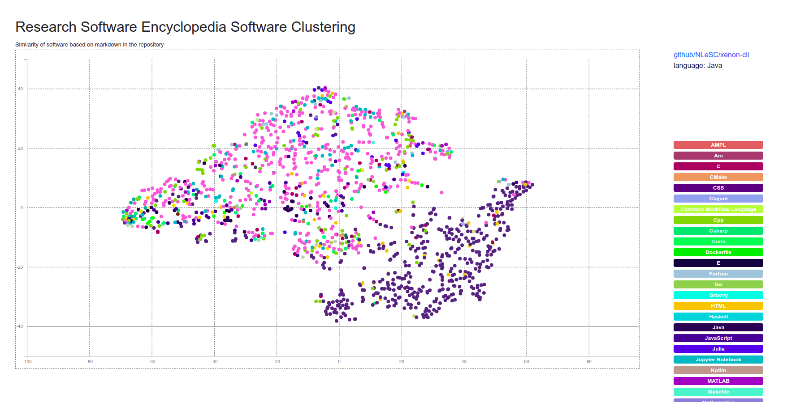

# Research Software Encyclopedia Analysis

We ultimately want to be able to group the different software into categories.
E.g., if I'm an astronomy researcher I want to quickly see what other libraries
are being developed. 

## Background

### Version 1

- [legacy/v1](legacy/v1)

To do this, I originally started with [word2vec](https://radimrehurek.com/gensim/models/word2vec.html) on text from the repos
to derive a set of embeddings that represent each code repository.
This meant that each repository is going to be represented as a vector of numbers.
I then could take the label data (where we have topics on the repo) and
train a model to derive the probability of each embedding (without labels) of having
the labels. We can try a "separate label" model, or a multiple label model.
In practie, this worked well **up until** the data got large, and then I couldn't run
it on my computer. I also then realized I couldn't automate it on GitHub.

- [legacy/v2](legacy/v2)

I took a few weeks break, went off and learned about [online machine learning with river](https://riverml.xyz/latest/),
developer some of my own [Django plugins](https://vsoch.github.io/django-river-ml/) to allow 
making a server and ran it again. This worked great to generate the clustering, but I realized this wasn't super useful.

For the current version, I stepped back and decided to do something more simple - instead of parsing the code repos
I would just use the repository metadata that the RSEpedia already provides, and then do some extra parsing of dependencies
from the repository with [citelang](https://github.com/vsoch/citelang). This reflects the current state of the repository,
and the content in the root here.

## Analysis Steps

1. Compile all the metadata into a single file, including descriptions and topics
2. Clean up text, etc., to prepare a vector of words for our model (combining topics and description)
3. Cluster
4. Then try training some probabilistic model to predict software topics based on cluster!

If this basic idea works (has signal), we could explore looking for more robust sources of text for each repository.

## Usage

### 0. Install

Install dependencies (ideally in a virtual environment)

```bash
$ python -m venv env
$ source env/bin/activate
$ pip install -r requirements.txt
$ python -m nltk.downloader popular
```

This will install the research software encyclopedia, and nltk
and data we need.

### 1. Data from Repositories

This next step will derive text from each repo, and a master lookup of topics
to use later. If you haven't yet, clone the software repository (or use your own)
somewhere else. E.g.,:

```bash
$ cd ../
$ git clone https://github.com/rseng/software
$ cd rsepedia-analysis
```

Then run the analysis script, targeting the correct rse.ini settings file
for the [software](https://github.com/rseng/software) respository we
just cloned. This will download the main data (or updated data):

```bash
$ mkdir -p _repos/ _data/ docs/
$ python 1.download.py --settings-file ../software/rse.ini -o ./_repos
```

This generates, for each repository that we find a requirements file for:

 - a badge that shows the dependencies
 - a data export of the same
 - and a saved requirments file.
 
### 2. Analysis

Then run a short analysis that mostly generates summary data and tables.

```bash
$ python 2.analysis.py --settings-file ../software/rse.ini -o ./_repos
```

For all repos we generate high level metadata and a summary of all dependencies.

### 3 Parse One

If you need to update one parsing (e.g., look for new deps, etc.):

```bash
$ python 3.parse_one.py --settings-file ../software/rse.ini -o ./_repos github/hpcng/singularity
```


## Diary

I first did steps 1-3 (download through vectors) just using markdown files. The result looked like lips -
there was distinction between Python and R but only slightly.


It looked a little bit like lips? I figured this happens because it's probably impossible to remove the language terms for README and other
markdown files - e.g., "this is a Python project..." or similar. So then I decided to run steps 1-3 again,
but this time include markdown, Rmd, Rd, and rst files. There is now more of a distinction between Python and R
repositories.



And this one looks a little bit like a brain? I'm worried that the distinction might be due to using
Rmd documentation files that tend to have more code in them, and the greatest distinction reflecting
common documentation practices over anything else. But we will see!

