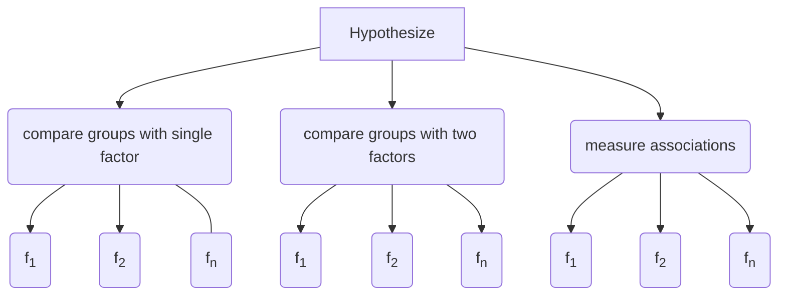

# Hypothesize <a href="https://Alcampopiano.github.io/hypothesize/"></img></a>
[](https://joss.theoj.org/papers/caf4095b3cdcc3adbb0252c995d59926)

[](https://pypi.org/project/hypothesize/)
[](https://pypistats.org/packages/hypothesize)
[](https://github.com/Alcampopiano/hypothesize/blob/master/LICENSE)
[](https://colab.research.google.com/github/Alcampopiano/hypothesize/blob/master/examples/hypothesize_notebook_for_colab.ipynb)

A Python package for hypothesis testing using robust statistics

## Basic Example
### A robust measure of association using winsorized correlation

```python
from hypothesize.measuring_associations import wincor
from hypothesize.utilities import create_example_data

# creating an example DataFrame with columns "cell_1" and "cell_2"
df=create_example_data(2)

results=wincor(df.cell_1, df.cell_2)

# returning the correlation, number of observations, p-value, and winsorized covariance
print(results)
{'cor': 0.11, 'nval': 50, 'sig': 0.44, 'wcov': 0.01}
```

## Documentation

:book: Please visit the [Hypothesize documentation site](https://Alcampopiano.github.io/hypothesize/).

## Citing Hypothesize

[](https://joss.theoj.org/papers/caf4095b3cdcc3adbb0252c995d59926)

If you use Hypothesize in academic work, please use the following citation:

Campopiano, A., & Wilcox, R. R. (2020). Hypothesize: Robust Statistics for Python. 
Journal of Open Source Software, 5(50), 2241, https://doi.org/10.21105/joss.02241

BibTex:

```bib
@article{Campopiano2020,
  doi = {10.21105/joss.02241},
  url = {https://doi.org/10.21105/joss.02241},
  year = {2020},
  publisher = {The Open Journal},
  volume = {5},
  number = {50},
  pages = {2241},
  author = {Allan Campopiano and Rand R. Wilcox},
  title = {Hypothesize: Robust Statistics for Python},
  journal = {Journal of Open Source Software}
}
```
# Feedback and contribution

Feedback, bug reports, and contributions are welcome via the 
[Hypothesize GitHub Repository](http://github.com/Alcampopiano/hypothesize/).

## How to contribute new functions to Hypothesize

A great way to contribute would be to choose a function from the 
[WRS](https://dornsife.usc.edu/labs/rwilcox/software/) that does not yet exist in
Hypothesize and convert it to Python. There is a current wish list 
[here](https://github.com/Alcampopiano/hypothesize/issues/2)
but certainly any WRS function would be a welcome addition to the library. A list of the currently available
functions in Hypothesize can be found in the documentation's
[function reference](https://alcampopiano.github.io/hypothesize/function_guide/).

#### Create example data to be used in R and Python

It is helpful to be able to create some example data that can be used in both R and Python. 
One way to do this is to use Hypothesize's 
[create_example_data](https://alcampopiano.github.io/hypothesize/function_guide/#create_example_data) function. 
It will generate a DataFrame of random data (to be used in Python) as 
well save Numpy arrays that can be read into R with the
[RcppCNPy](https://cran.r-project.org/web/packages/RcppCNPy/index.html) 
and [Rcpp](https://cran.r-project.org/web/packages/Rcpp/index.html) libraries.

#### IDE for R and Python

It is convenient to use the same IDE when converting functions from R to Python.
One suggestion is to use PyCharm's 
[r-language-for-intellij](https://plugins.jetbrains.com/plugin/6632-r-language-for-intellij)
Plugin. This makes it possible to have an interpreter and editor for 
both languages in the same IDE. Like so:


Of course there are many ways that one might go about converting WRS functions to Python. 
These are merely suggestions. 

### Setting up your Git environment

1. Install the latest version of Hypothesize locally using 
    
    ```
    $ pip install git+https://github.com/Alcampopiano/hypothesize/
    ```

2. Fork the repository on GitHub and clone the fork to you local
machine. For more details on forking see the [GitHub
Documentation](https://help.github.com/en/articles/fork-a-repo).
    
    ```
    $ git clone https://github.com/YOUR-USERNAME/hypothesize.git
    ```

3. Create a sync to the original upstream repository by creating a so-called 
[remote](https://help.github.com/en/github/collaborating-with-issues-and-pull-requests/configuring-a-remote-for-a-fork).

    ```
    $ git remote add upstream https://github.com/Alcampopiano/hypothesize.git
    $ git checkout master
    $ git pull upstream master
    ```

Now you will have all of the updates in the master branch of your local fork.
Note that git will complain if you've committed changes to your local master
branch that are not on the upstream repository. This is one reason why it's good practice to avoid
working directly on your master branch.

### Commiting new code to Hypothesize

1. Create a new local branch and commit changes to your remote branch:

    ```
    $ git checkout -b <branch-name>
    ```
    
    With this branch checked-out, make the desired changes to the package.
    When you are happy with your changes, you can commit them to a remote branch by running
    
    ```
    $ git add <modified-file>
    $ git commit -m "Some descriptive message about your change"
    $ git push origin <branch-name>
    ```

2. Write a unit test for your code (optional)

    Hypothesize uses `pytest` for unit testing. The strategy currently used for testing
    is to pickle results that are assumed to be correct and compare those
    against fresh results from the modified code (see the
    [tests](https://github.com/Alcampopiano/hypothesize/tree/master/hypothesize/tests) folder for examples).
    If you would like to write a test for your new code, you may follow the strategy 
    described above or come up with another way to test your code. To run the test suite,
    first navigate to the "tests" directory then use the `pytest` command from your terminal.

3. Submit a pull request (PR) to merge your new branch to Hypothesize's master branch

    For details on creating a PR see GitHub documentation [Creating a pull
    request](https://help.github.com/en/articles/creating-a-pull-request). 

---
title: 'Hypothesize: Robust Statistics for Python'
tags:
  - Python
  - R
  - statistics
  - statistical analysis
  - bootstrapping
  - trimmed mean
  - data analysis
  - data science
  - social science
  - hypothesis testing
authors:
  - name: Allan Campopiano
    orcid: 0000-0002-3280-4447
    affiliation: 1
  - name: Rand R. Wilcox
    orcid: 0000-0002-2524-2976
    affiliation: 2
    
affiliations:
  - name: Halton Catholic District School Board
    index: 1
  - name: University of Southern California
    index: 2
date: 08 May 2020
bibliography: paper.bib
---

# Summary

Hypothesize is a robust null hypothesis significance testing (NHST) library for Python. In general,
robust hypothesis testing uses techniques which minimize the effects of violating standard statistical 
assumptions. In particular, robust methods based on the trimmed mean [@20000755025] 
and/or bootstrapping [@bradley1993introduction], routinely outperform traditional statistical 
approaches in terms of power and accuracy. This is especially true when dealing with
distributions that produce outliers [@wilcox1998many; @wilcox2013introduction].

Hypothesize is based on Rand R. Wilcox's collection of [R functions](https://dornsife.usc.edu/labs/rwilcox/software/)
which contains hundreds of robust methods developed since the 1960's. 
Hypothesize brings many of these functions into the Python library ecosystem with the goal
of making robust hypothesis testing easy for researchers, even
if they have not had extensive training in statistics or computer science. It is, however, assumed 
that users have a basic understanding of the concepts and terms related to robust hypothesis 
testing (e.g., trimmed mean and bootstrapping).

In contrast to other statistical libraries in Python [@Vallat2018; @seabold2010statsmodels; @ho2019moving],
Hypothesize is focused solely on robust methods for comparing groups and measuring associations. Researchers
who are familiar with traditional NHST and related concepts (e.g., t-test, ANOVA, Pearson's correlation) 
will find analogous approaches in Hypothesize. A broad range of choices exist in Hypothesize both in terms of the
supported statistical designs as well as options for fine-grained control over how tests are computed.
For example:
 
- Where applicable, many hypothesis tests allow the specification of an estimator. That is, users may 
choose when to use the mean, median, trimmed mean, winsorized correlation, percentage bend correlation, 
or any other compatible statistical estimator.

- Single- and multi-factor designs are supported, and this includes supporting 
    independent, dependent, and mixed groups.

- Family-wise error can be robustly controlled with sequentially 
    rejective methods [@rom1990sequentially; @hochberg1988sharper; @benjamini1995controlling].

In terms of learning to use the software, Hypothesize keeps the barrier to entry low for researchers. For example:

 - To easily incorporate Hypothesize with standard data processing tools
 [see @mckinney-proc-scipy-2010], all top-level 
 functions take a Pandas DataFrame/Series as input and return a Python Dictionary.
 
 - The API maps cleanly onto features of the user's statistical design. 
 This makes it easier to find and discover the set of appropriate functions for a
 given use case.
 
 - All top-level functions can be run directly in the browser alongside the documentation via 
[Google Colab Notebooks](https://colab.research.google.com/notebooks/intro.ipynb) 
(no local installation required).

# Acknowledgements

The authors would like to thank 
James Desjardins, 
Stefon van Noordt, 
Lisa Collimore, 
Martina G. Vilas, 
Andrew Bennett, 
Charlotte Soneson, 
Whedon,
the Journal of Open Source Software,
and the Halton Catholic District School Board 
for their support of this project.

# References# Function Reference

Hypothesize exposes the following top-level functions for comparing 
groups and measuring associations. The function names, code, and descriptions
are kept generally consistent with Wilcox's WRS package. 
If you want to learn more about the theory and research
behind any given function here, see Wilcox's books, especially
[Introduction to Robust Estimation and Hypothesis Testing](https://play.google.com/store/books/details?id=8f8nBb4__EYC&gl=ca&hl=en-CA&source=productsearch&utm_source=HA_Desktop_US&utm_medium=SEM&utm_campaign=PLA&pcampaignid=MKTAD0930BO1&gclid=CjwKCAiA44LzBRB-EiwA-jJipJzyqx9kwNMq5MMU7fG2RrwBK9F7sirX4pfhS8wO7k9Uz_Sqf2P28BoCYzcQAvD_BwE&gclsrc=aw.ds).

---
Jump to:

**[Comparing groups with a single factor](function_guide.md#comparing-groups-with-a-single-factor)**

**[Comparing groups with two factors](function_guide.md#comparing-groups-with-two-factors)**

**[Measuring associations](function_guide.md#measuring-associations)**

**[Other important functions](function_guide.md#other-important-functions)**

---

## Comparing groups with a single factor
Statistical tests analogous to a 1-way ANOVA or T-tests. 
That is, group tests that have a single factor.
---

## Independent groups

### l2drmci

`#!py hypothesize.compare_groups_with_single_factor.l2drmci
(x, y, est, *args, pairwise_drop_na=True, alpha=.05, nboot=2000, seed=False)`

Compute a bootstrap confidence interval for a
measure of location associated with the distribution of x-y. 
That is, compare x and y by looking at all possible difference scores
in random samples of `x` and `y`. `x` and `y` are possibly dependent.

Note that arguments up to and including `args` are positional arguments

_Parameters:_

**x: Pandas Series**

Data for group one

**y: Pandas Series**

Data for group two

**est: function**

Measure of location (currently only `trim_mean` is supported)

***args: list/value**

Parameter(s) for measure of location (e.g., .2)

**pairwise_drop_na: bool**

If True, treat data as dependent and remove any row with missing data. If False,
remove missing data for each group seperately (cannot deal with unequal sample sizes)

**alpha: float**

Alpha level (default is .05)

**nboot: int**

Number of bootstrap samples (default is 2000)

**seed: bool**

Random seed for reprodicible results (default is `False`)

_Returns:_

Dictionary of results

**ci: list** 

Confidence interval

**p_value: float** 

p-value


<a href="https://colab.research.google.com/github/Alcampopiano/hypothesize/blob/master/examples/l2drmci.ipynb" 
target="_blank" class="button">Try this example yourself in Colab!</a>

### linconb

`#!py hypothesize.compare_groups_with_single_factor.linconb(x, con, tr=.2, alpha=.05, nboot=599, seed=False)`

Compute a 1-alpha confidence interval for a set of d linear contrasts
involving trimmed means using the bootstrap-t bootstrap method.
Independent groups are assumed. CIs are adjusted to control FWE 
(p values are not adjusted).

_Parameters:_

**x: DataFrame**

Each column represents a group of data

**con: array**

`con` is a J (number of columns) by d (number of contrasts)
matrix containing the contrast coefficents of interest.
All linear constrasts can be created automatically by using the function [con1way](J)
(the result of which can be used for `con`).

**tr: float**

Proportion to trim (default is .2)

**alpha: float**

Alpha level (default is .05)

**nboot: int**

Number of bootstrap samples (default is 2000)

**seed: bool**

Random seed for reprodicible results. Default is `False`.

_Return:_

Dictionary of results

**con: array**

Contrast matrix

**crit: float**

Critical value

**n: list**

Number of observations for each group

**psihat: DataFrame**

Difference score and CI for each contrast

**test: DataFrame**

Test statistic, standard error, and p-value for each contrast

<a href="https://colab.research.google.com/github/Alcampopiano/hypothesize/blob/master/examples/linconb.ipynb" 
target="_blank" class="button">Try this example yourself in Colab!</a>

### pb2gen

`#!py hypothesize.compare_groups_with_single_factor.pb2gen(x, y, est, *args, alpha=.05, nboot=2000, seed=False)`

Compute a bootstrap confidence interval for the
the difference between any two parameters corresponding to two
independent groups.

Note that arguments up to and including `args` are positional arguments


_Parameters:_

**x: Pandas Series**

Data for group one

**y: Pandas Series**

Data for group two

**est: function**

Measure of location (currently only `trim_mean` is supported)

***args: list/value**

Parameter(s) for measure of location (e.g., .2)

**alpha: float**

Alpha level (default is .05)

**nboot: int**

Number of bootstrap samples (default is 2000)

**seed: bool**

Random seed for reprodicible results (default is `False`)

_Return:_

Dictionary of results

**ci: list** 

Confidence interval

**est_1: float**

Estimated value (based on `est`) for group one

**est_2: float**

Estimated value (based on `est`) for group two

**est_dif: float**

Estimated difference between group one and two

**n1: int**

Number of observations in group one

**n2: int**

Number of observations in group two

**p_value: float** 

p-value

**variance: float**

Variance of group one and two

<a href="https://colab.research.google.com/github/Alcampopiano/hypothesize/blob/master/examples/pb2gen.ipynb" 
target="_blank" class="button">Try this example yourself in Colab!</a>

### tmcppb

`#!py hypothesize.compare_groups_with_single_factor.tmcppb(x, est, *args, con=None, bhop=False, alpha=.05, nboot=None, seed=False)`

Multiple comparisons for J independent groups using trimmed means and
the percentile bootstrap method. Rom’s method is used to control the 
probability of one or more type I errors. For C > 10 hypotheses, 
or when the goal is to test at some level other than .05 and .01, 
Hochberg’s method is used. Setting the argument `bhop` to `True` uses the
Benjamini–Hochberg method instead.

Note that arguments up to and including `args` are positional arguments

_Parameters:_

**x: Pandas DataFrame**

Each column represents a group of data

**est: function**

Measure of location (currently only `trim_mean` is supported)

***args: list/value**

Parameter(s) for measure of location (e.g., .2)

**con: array**

`con` is a J (number of columns) by d (number of contrasts)
matrix containing the contrast coefficents of interest.
All linear constrasts can be created automatically by using the function [con1way](J)
(the result of which can be used for `con`). The default is `None` and in this
case all linear contrasts are created automatically.
 
**bhop: bool**

If `True`, the Benjamini–Hochberg method is used to control FWE

**alpha: float**

Alpha level. Default is .05.

**nboot: int**

Number of bootstrap samples (default is 2000)

**seed: bool**

Random seed for reproducible results. Default is `False`.

_Return:_

Dictionary of results

**con: array**

Contrast matrix

**num_sig: int**

Number of statistically significant results

**output: DataFrame**

Difference score, p-value, critical value, and CI for each contrast

<a href="https://colab.research.google.com/github/Alcampopiano/hypothesize/blob/master/examples/tmcppb.ipynb" 
target="_blank" class="button">Try this example yourself in Colab!</a>

### yuenbt

`#!py hypothesize.compare_groups_with_single_factor.yuenbt(x, y, tr=.2, alpha=.05, nboot=599, seed=False)`

Compute a 1-alpha confidence interval for the difference between
the trimmed means corresponding to two independent groups.
The bootstrap-t method is used. During the bootstrapping, 
the absolute value of the test statistic is used (the "two-sided method").

_Parameters:_

**x: Pandas Series**

Data for group one

**y: Pandas Series**

Data for group two

**tr: float**

Proportion to trim (default is .2)

**alpha: float**

Alpha level (default is .05)

**nboot: int**

Number of bootstrap samples (default is 599)

**seed: bool**

Random seed for reprodicible results. Default is `False`.

_Return:_

Dictionary of results

**ci: list** 

Confidence interval

**est_dif: float**

Estimated difference between group one and two

**est_1: float**

Estimated value (based on `est`) for group one

**est_2: float**

Estimated value (based on `est`) for group two

**p_value: float** 

p-value

**test_stat: float**

Test statistic

<a href="https://colab.research.google.com/github/Alcampopiano/hypothesize/blob/master/examples/yuenbt.ipynb" 
target="_blank" class="button">Try this example yourself in Colab!</a>

## Dependent groups

### bootdpci

`#!py hypothesize.compare_groups_with_single_factor.bootdpci(x, est, *args, nboot=None, alpha=.05, dif=True, BA=False, SR=False)`

Use percentile bootstrap method, compute a .95 confidence interval 
for the difference between a measure of location or scale 
when comparing two dependent groups.

Note that arguments up to and including `args` are positional arguments

The argument `dif` defaults to `True` indicating 
that difference scores will be used, in which case Hochberg’s 
method is used to control FWE. If `dif` is `False`, measures of 
location associated with the marginal distributions are used 
instead. 

If `dif` is `False` and `BA` is `True`, the bias adjusted 
estimate of the generalized p-value is recommended.
Using `BA`=`True` (when `dif`=`False`) 
is recommended when comparing groups 
with M-estimators and MOM, but it is not necessary when 
comparing 20% trimmed means (Wilcox & Keselman, 2002). 

The so-called the SR method, which is a slight 
modification of Hochberg's (1988) "sequentially rejective" 
method can be applied to control FWE, especially when 
comparing one-step M-estimators or M-estimators.

_Parameters:_

**x: Pandas DataFrame**

Each column represents a group of data

**est: function**

Measure of location (currently only `trim_mean` is supported)

***args: list/value**

Parameter(s) for measure of location (e.g., .2)

**alpha: float**

Alpha level. Default is .05.

**nboot: int**

Number of bootstrap samples. Default is `None`
in which case `nboot` will be chosen for you 
based on the number of contrasts.

**dif: bool**

When `True`, use difference scores, otherwise use marginal distributions

**BA: bool**

When `True`, use the bias adjusted estimate of the 
generalized p-value is applied (e.g., when `dif` is `False`)

**SR: bool**

When `True`, use the modified "sequentially rejective", especially when 
comparing one-step M-estimators or M-estimators

_Return:_

Dictionary of results

**con: array**

Contrast matrix

**num_sig: int**

Number of statistically significant results

**output: DataFrame**

Difference score, p-value, critical value, and CI for each contrast

<a href="https://colab.research.google.com/github/Alcampopiano/hypothesize/blob/master/examples/bootdpci.ipynb" 
target="_blank" class="button">Try this example yourself in Colab!</a>

### rmmcppb

`#!py hypothesize.compare_groups_with_single_factor.rmmcppb(x, est, *args,  alpha=.05, con=None, dif=True, nboot=None, BA=False,
    hoch=False, SR=False, seed=False)`

Use a percentile bootstrap method to compare dependent groups.
By default, compute a .95 confidence interval for all linear contrasts
specified by con, a J-by-C matrix, where C is the number of
contrasts to be tested, and the columns of `con` are the
contrast coefficients. If con is not specified, 
all pairwise comparisons are done.

If `est` is the function `onestep` or `mom` (these are not implemeted yet),
method SR can be used to control the probability of at least one Type I error.
Otherwise, Hochberg's method is used.

If `dif` is `False` and `BA` is `True`, the bias adjusted 
estimate of the generalized p-value is recommended.
Using `BA`=`True` (when `dif`=`False`) 
is recommended when comparing groups 
with M-estimators and MOM, but it is not necessary when 
comparing 20% trimmed means (Wilcox & Keselman, 2002). 

Hochberg's sequentially rejective method can be used and is used 
if n>=80.

Note that arguments up to and including `args` are positional arguments

_Parameters:_

**x: Pandas DataFrame**

Each column represents a group of data

**est: function**

Measure of location (currently only `trim_mean` is supported)

***args: list/value**

Parameter(s) for measure of location (e.g., .2)

**alpha: float**

Alpha level (default is .05)

**con: array**

`con` is a J (number of columns) by d (number of contrasts)
matrix containing the contrast coefficents of interest.
All linear constrasts can be created automatically by using the function [con1way](J)
(the result of which can be used for `con`). The default is `None` and in this
case all linear contrasts are created automatically.
 
**dif: bool**

When `True`, use difference scores, otherwise use marginal distributions

**nboot: int**

Number of bootstrap samples. Default is `None`
in which case `nboot` will be chosen for you 
based on the number of contrasts.

**BA: bool**

When `True`, use the bias adjusted estimate of the 
generalized p-value is applied (e.g., when `dif` is `False`)

**hoch: bool**

When `True`, Hochberg's sequentially rejective method can be used and is used 
if n>=80.

**SR: bool**

When `True`, use the modified "sequentially rejective", especially when 
comparing one-step M-estimators or M-estimators.

**seed: bool**

Random seed for reprodicible results (default is `False`)

_Return:_

Dictionary of results

**con: array**

Contrast matrix

**num_sig: int**

Number of statistically significant results

**output: DataFrame**

Difference score, p-value, critical value, and CI for each contrast

<a href="https://colab.research.google.com/github/Alcampopiano/hypothesize/blob/master/examples/rmmcppb.ipynb" 
target="_blank" class="button">Try this example yourself in Colab!</a>

### lindepbt

`#!py hypothesize.compare_groups_with_single_factor.lindepbt(x, tr=.2, con=None, alpha=.05, nboot=599, dif=True, seed=False)`

Multiple comparisons on trimmed means with FWE controlled with Rom's method
Using a bootstrap-t method.


_Parameters:_

**x: Pandas DataFrame**

Each column in the data represents a different group 

**tr: float**

Proportion to trim (default is .2)

**con: array**

`con` is a J (number of groups) by d (number of contrasts) 
matrix containing the contrast coefficents of interest.
All linear constrasts can be created automatically by using the function [con1way](J)
(the result of which can be used for `con`). The default is `None` and in this 
case all linear contrasts are created automatically.

**alpha: float**

Alpha level. Default is .05.

**nboot: int**

Number of bootstrap samples (default is 2000)

**dif: bool**

When `True`, use difference scores, otherwise use marginal distributions

**seed: bool**

Random seed for reprodicible results (default is `False`)

_Return:_

Dictionary of results

**con: array**

Contrast matrix

**num_sig: int**

Number of observations for each group

**psihat: DataFrame**

Difference score and CI for each contrast

**test: DataFrame**

Test statistic, p-value, critical value, and standard error
for each contrast

<a href="https://colab.research.google.com/github/Alcampopiano/hypothesize/blob/master/examples/lindepbt.ipynb" 
target="_blank" class="button">Try this example yourself in Colab!</a>

### ydbt

`#!py hypothesize.compare_groups_with_single_factor.ydbt(x, y, tr=.2, alpha=.05, nboot=599, side=True, seed=False)`

Using the bootstrap-t method,
compute a .95 confidence interval for the difference between
the marginal trimmed means of paired data.
By default, 20% trimming is used with 599 bootstrap samples.

_Parameters:_

**x: Pandas Series**

Data for group one

**y: Pandas Series**

Data for group two

**tr: float**

Proportion to trim (default is .2)

**alpha: float**

Alpha level. Default is .05.

**nboot: int**

Number of bootstrap samples (default is 2000)

**side: bool**
When `True` the function returns a symmetric CI and a p value, 
otherwise the function returns equal-tailed CI (no p value)

**seed: bool**

Random seed for reprodicible results (default is `False`)

_Return:_

Dictionary of results

**ci: list**

Confidence interval

**dif: float**

Difference between group one and two

**p_value: float**

p-value

<a href="https://colab.research.google.com/github/Alcampopiano/hypothesize/blob/master/examples/ydbt.ipynb" 
target="_blank" class="button">Try this example yourself in Colab!</a>

## Comparing groups with two factors
Statistical tests analogous to a 2-way ANOVA. 
That is, group tests that have a two factors.
---

## Dependent groups

### wwmcppb

`#!py hypothesize.compare_groups_with_two_factors.wwmcppb(J, K, x,  est, *args,  alpha=.05, dif=True,
            nboot=None, BA=True, hoch=True, seed=False)`

Do all multiple comparisons for a within-by-within design 
using a percentile bootstrap method.A sequentially rejective 
method is used to control alpha.
Hochberg's method can be used and is if n>=80.

Note that arguments up to and including `args` are positional arguments

_Parameters:_

**J: int**

Number of J levels associated with Factor A

**K: int**

Number of K levels associated with Factor B

**x: Pandas DataFrame**

Each column represents a cell in the factorial design. For example,
a 2x3 design would correspond to a DataFrame with 6 columns 
(levels of Factor A x levels of Factor B).

Order your columns according to the following pattern
(traversing each row in a matrix): 

 - the first column contains data for level 1 of Factor A
 and level 1 of Factor B
 
 - the second column contains data for level 1 of Factor A
 and level 2 of Factor B
 
 - column `K` contains the data for level 1 of Factor A 
 and level `K` of Factor B
 
 - column `K` + 1 contains the data for level 2 of Factor A
 and level 1 of Factor B
 
 - and so on ... 
 
**est: function**

Measure of location (currently only `trim_mean` is supported)
 
***args: list/value**

Parameter(s) for measure of location (e.g., .2)

**alpha: float**

Alpha level (default is .05)

**dif: bool**

When `True`, use difference scores, otherwise use marginal distributions

**nboot: int**

Number of bootstrap samples (default is 599)

**BA: bool**

When `True`, use the bias adjusted estimate of the 
generalized p-value is applied (e.g., when `dif` is `False`)

**hoch: bool**

When `True`, Hochberg's sequentially 
rejective method can be used to control FWE

**seed: bool**

Random seed for reprodicible results (default is `False`)

_Return:_

Dictionary of results

The following results are returned for factor A, factor B, 
and the interaction. See the keys `'factor_A'`, `'factor_A'`, and `'factor_AB'`, 
respectively.

**con: array**

Contrast matrix

**num_sig: int**

Number of statistically significant results

**output: DataFrame**

Difference score, p-value, critical value, and CI for each contrast

<a href="https://colab.research.google.com/github/Alcampopiano/hypothesize/blob/master/examples/wwmcppb.ipynb" 
target="_blank" class="button">Try this example yourself in Colab!</a>

### wwmcpbt

`#!py hypothesize.compare_groups_with_two_factors.wwmcpbt(J, K, x, tr=.2, alpha=.05, nboot=599, seed=False)`

Do multiple comparisons for a within-by-within design.
using a bootstrap-t method and trimmed means.
All linear contrasts relevant to main effects and interactions
are tested. With trimmed means FWE is
controlled with Rom's method.
    
_Parameters:_

**J: int**

Number of J levels associated with Factor A

**K: int**

Number of K levels associated with Factor B

**x: Pandas DataFrame**

Each column represents a cell in the factorial design. For example,
a 2x3 design would correspond to a DataFrame with 6 columns 
(levels of Factor A x levels of Factor B).

Order your columns according to the following pattern
(traversing each row in a matrix): 

 - the first column contains data for level 1 of Factor A
 and level 1 of Factor B
 
 - the second column contains data for level 1 of Factor A
 and level 2 of Factor B
 
 - column `K` contains the data for level 1 of Factor A 
 and level `K` of Factor B
 
 - column `K` + 1 contains the data for level 2 of Factor A
 and level 1 of Factor B
 
 - and so on ... 

**tr: float**

Proportion to trim (default is .2)

**alpha: float**

Alpha level (default is .05)

**nboot: int**

Number of bootstrap samples (default is 599)

**seed: bool**

Random seed for reprodicible results (default is `False`)

_Return:_

Dictionary of results

The following results are returned for factor A, factor B, 
and the interaction. See the keys `'factor_A'`, `'factor_A'`, and `'factor_AB'`, 
respectively.

**con: array**

Contrast matrix

**num_sig: int**

Number of statistically significant results

**psihat: DataFrame**

Difference score and CI for each contrast

**test: DataFrame**

Test statistic, p-value, critical value, and standard error for each contrast

<a href="https://colab.research.google.com/github/Alcampopiano/hypothesize/blob/master/examples/wwmcpbt.ipynb" 
target="_blank" class="button">Try this example yourself in Colab!</a>

## Mixed designs

These designs are also known as "split-plot" or "between-within" desgins.
Hypothesize follws the common convention that assumes that the between-subjects
factor is factor A and the within-subjects conditions are Factor B. For example,
in a 2x3 mixed design, factor A has two levels. For each of these levels,
there are 3 within-subjects conditions.

!!! danger "Make sure your DataFrame corresponds to a between-within design, not the other way around"
    For example, in a 2x3 mixed design, the first 3 columns correspond to the first level of Factor A. The last 3
    columns correspond to the second level of factor A.

### bwamcp

`#!py hypothesize.compare_groups_with_two_factors.bwamcp(J, K, x, tr=.2, alpha=.05, pool=False)`

All pairwise comparisons among levels of Factor A
in a mixed design using trimmed means. The `pool`
option allows you to pool dependent groups across 
Factor A for each level of Factor B.

_Parameters:_

**J: int**

Number of J levels associated with Factor A

**K: int**

Number of K levels associated with Factor B

**x: Pandas DataFrame**

Each column represents a cell in the factorial design. For example,
a 2x3 design would correspond to a DataFrame with 6 columns 
(levels of Factor A x levels of Factor B).

Order your columns according to the following pattern
(traversing each row in a matrix): 

 - the first column contains data for level 1 of Factor A
 and level 1 of Factor B
 
 - the second column contains data for level 1 of Factor A
 and level 2 of Factor B
 
 - column `K` contains the data for level 1 of Factor A 
 and level `K` of Factor B
 
 - column `K` + 1 contains the data for level 2 of Factor A
 and level 1 of Factor B
 
 - and so on ... 

**tr: float**

Proportion to trim (default is .2)

**alpha: float**

Alpha level (default is .05)

**pool: bool**

If `True`, pool dependent groups together (default is `False`).
Otherwise generate pairwise contrasts 
across factor A for each level of factor B.

_Return:_

Dictionary of results

**n: list**

Number of observations for each group

**psihat: DataFrame**

Difference score and CI, amd p-value for each contrast

**test: DataFrame**

Test statistic, critical value, standard error, and degrees of freedom for each contrast

<a href="https://colab.research.google.com/github/Alcampopiano/hypothesize/blob/master/examples/bwamcp.ipynb" 
target="_blank" class="button">Try this example yourself in Colab!</a>

### bwbmcp

`#!py hypothesize.compare_groups_with_two_factors.bwbmcp(J, K, x, tr=.2, con=None, alpha=.05,
           dif=True, pool=False, hoch=False)`

All pairwise comparisons among levels of Factor B
in a mixed design using trimmed means. The `pool`
option allows you to pool dependent groups across 
Factor A for each level of Factor B.

Rom's method is used to control for FWE (when alpha is 0.5, .01, 
or when number of comparisons are > 10).
Hochberg's method can also be used. Note that CIs are adjusted based on the 
corresponding critical p-value after controling for FWE.

    
_Parameters:_

**J: int**

Number of J levels associated with Factor A

**K: int**

Number of K levels associated with Factor B

**x: Pandas DataFrame**

Each column represents a cell in the factorial design. For example,
a 2x3 design would correspond to a DataFrame with 6 columns 
(levels of Factor A x levels of Factor B).

Order your columns according to the following pattern
(traversing each row in a matrix): 

 - the first column contains data for level 1 of Factor A
 and level 1 of Factor B
 
 - the second column contains data for level 1 of Factor A
 and level 2 of Factor B
 
 - column `K` contains the data for level 1 of Factor A 
 and level `K` of Factor B
 
 - column `K` + 1 contains the data for level 2 of Factor A
 and level 1 of Factor B
 
 - and so on ... 

**tr: float**

Proportion to trim (default is .2)

**con: array**

`con` is a K by d (number of contrasts)
matrix containing the contrast coefficents of interest.
All linear constrasts can be created automatically by using the function [con1way](K)
(the result of which can be used for `con`).

**alpha: float**

Alpha level (default is .05)

**dif: bool**

When `True`, use difference scores, otherwise use marginal distributions

**pool: bool**

If `True`, pool dependent groups together (default is `False`).
Otherwise generate pairwise contrasts 
across factor A for each level of factor B.

**hoch: bool**

When `True`, Hochberg's sequentially 
rejective method can be used to control FWE

_Return:_

Dictionary or List of Dictionaries depending on `pool` parameter. If `pool`
is set to False, all pairwise comparisons for Factor B 
are computed and returned as elements in a list corresponding to 
each level of Factor A.

**con: array**

Contrast matrix

**n: int**

Number of observations for Factor B

**num_sig: int**

Number of statistically significant results

**psihat: DataFrame**

Difference score between group X and group Y, and CI
for each contrast

**test: DataFrame**

Test statistic, p-value, critical value, and standard 
error for each contrast

<a href="https://colab.research.google.com/github/Alcampopiano/hypothesize/blob/master/examples/bwbmcp.ipynb" 
target="_blank" class="button">Try this example yourself in Colab!</a>

### bwmcp

`#!py hypothesize.compare_groups_with_two_factors.bwmcp(J, K, x, alpha=.05, tr=.2, nboot=599, seed=False)`

A bootstrap-t for multiple comparisons among
for all main effects and interactions in a between-by-within design.
The analysis is done by generating bootstrap samples and
using an appropriate linear contrast.

_Parameters:_

**J: int**

Number of J levels associated with Factor A

**K: int**

Number of K levels associated with Factor B

**x: Pandas DataFrame**

Each column represents a cell in the factorial design. For example,
a 2x3 design would correspond to a DataFrame with 6 columns 
(levels of Factor A x levels of Factor B).

Order your columns according to the following pattern
(traversing each row in a matrix): 

 - the first column contains data for level 1 of Factor A
 and level 1 of Factor B
 
 - the second column contains data for level 1 of Factor A
 and level 2 of Factor B
 
 - column `K` contains the data for level 1 of Factor A 
 and level `K` of Factor B
 
 - column `K` + 1 contains the data for level 2 of Factor A
 and level 1 of Factor B
 
 - and so on ...
 
**alpha: float**

Alpha level (default is .05)

**tr: float**

Proportion to trim (default is .2)

**nboot: int**

Number of bootstrap samples (default is 500)

**seed: bool**

Random seed for reprodicible results (default is `False`)

_Return:_

Dictionary of results

**contrast_coef: dict**

Dictionary of arrays where each value corresponds to the contrast matrix
for factor A, factor B, and the interaction

**factor_A: DataFrame**

Difference score, standard error, test statistic, 
critical value, and p-value for each contrast relating to Factor A


**factor_B: DataFrame**

Difference score, standard error, test statistic, 
critical value, and p-value for each contrast relating to Factor B

**factor_AB: DataFrame**

Difference score, standard error, test statistic, 
critical value, and p-value for each contrast relating to the interaction

<a href="https://colab.research.google.com/github/Alcampopiano/hypothesize/blob/master/examples/bwmcp.ipynb" 
target="_blank" class="button">Try this example yourself in Colab!</a>

### bwimcp

`#!py hypothesize.compare_groups_with_two_factors.bwimcp(J, K, x, tr=.2, alpha=.05)`

Multiple comparisons for interactions
in a split-plot design.
The analysis is done by taking difference scores
among all pairs of dependent groups and
determining which of
these differences differ across levels of Factor A
using trimmed means. FWE is controlled via Hochberg's 
method. For MOM or M-estimators 
(possibly not implemented yet), use spmcpi which 
uses a bootstrap method

_Parameters:_

**J: int**

Number of J levels associated with Factor A

**K: int**

Number of K levels associated with Factor B

**x: Pandas DataFrame**

Each column represents a cell in the factorial design. For example,
a 2x3 design would correspond to a DataFrame with 6 columns 
(levels of Factor A x levels of Factor B).

Order your columns according to the following pattern
(traversing each row in a matrix): 

 - the first column contains data for level 1 of Factor A
 and level 1 of Factor B
 
 - the second column contains data for level 1 of Factor A
 and level 2 of Factor B
 
 - column `K` contains the data for level 1 of Factor A 
 and level `K` of Factor B
 
 - column `K` + 1 contains the data for level 2 of Factor A
 and level 1 of Factor B
 
 - and so on ...
 
**tr: float**

Proportion to trim (default is .2)

**alpha: float**

Alpha level (default is .05)

_Return:_

Dictionary of results

**con: array**

Contrast matrix

**output: DataFrame**

Difference score, p-value, and critical value for each contrast relating to the interaction

<a href="https://colab.research.google.com/github/Alcampopiano/hypothesize/blob/master/examples/bwimcp.ipynb" 
target="_blank" class="button">Try this example yourself in Colab!</a>

### bwmcppb

`#!py hypothesize.compare_groups_with_two_factors.bwmcppb(J, K, x, est, *args, alpha=.05,
            nboot=500, bhop=True, seed=True)`

(note: this is for trimmed means only depite the `est` arg. 
This will be fixed eventually. Use `trim_mean` from SciPy)

A percentile bootstrap for multiple comparisons
for all main effects and interactions
The analysis is done by generating bootstrap samples and
using an appropriate linear contrast.
    
Uses Rom's method to control FWE. Setting the 
argument `bhop` to `True` uses the Benjamini–Hochberg 
method instead.

Note that arguments up to and including `args` are positional arguments

_Parameters:_

**J: int**

Number of J levels associated with Factor A

**K: int**

Number of K levels associated with Factor B

**x: Pandas DataFrame**

Each column represents a cell in the factorial design. For example,
a 2x3 design would correspond to a DataFrame with 6 columns 
(levels of Factor A x levels of Factor B).

Order your columns according to the following pattern
(traversing each row in a matrix): 

 - the first column contains data for level 1 of Factor A
 and level 1 of Factor B
 
 - the second column contains data for level 1 of Factor A
 and level 2 of Factor B
 
 - column `K` contains the data for level 1 of Factor A 
 and level `K` of Factor B
 
 - column `K` + 1 contains the data for level 2 of Factor A
 and level 1 of Factor B
 
 - and so on ...
 
**est: function**

Measure of location (currently only `trim_mean` is supported)

***args: list/value**

Parameter(s) for measure of location (e.g., .2)

**alpha: float**

Alpha level. Default is .05.

**nboot: int**

Number of bootstrap samples (default is 500)

**bhop: bool**

When `True`, use the Benjamini–Hochberg 
method to control FWE

**seed: bool**

Random seed for reprodicible results (default is `False`)

_Return:_

Dictionary of DataFrames for each Factor and the interaction.
See the keys `'factor_A'`, `'factor_B'`, and `'factor_AB'`

Each DataFrame contains the difference score, p-value, 
critical value, and CI for each contrast.

<a href="https://colab.research.google.com/github/Alcampopiano/hypothesize/blob/master/examples/bwmcppb.ipynb" 
target="_blank" class="button">Try this example yourself in Colab!</a>

### spmcpa

`#!py hypothesize.compare_groups_with_two_factors.spmcpa(J, K, x, est, *args,
           avg=False, alpha=.05, nboot=None, seed=False)`

All pairwise comparisons among levels of Factor A 
in a mixed design. A sequentially rejective 
method is used to control FWE. The `avg` option
controls whether or not to average data across levels
of Factor B prior to performing the statistical test. 
If `False`, contrasts are created to test across Factor A
for each level of Factor B.

Note that arguments up to and including `args` are positional arguments
    
_Parameters:_

**J: int**

Number of J levels associated with Factor A

**K: int**

Number of K levels associated with Factor B

**x: Pandas DataFrame**

Data for group one

**est: function**

Measure of location (currently only `trim_mean` is supported)

***args: list/value**

Parameter(s) for measure of location (e.g., .2)

**avg: bool**

If `False`, contrasts are created to test across Factor A
for each level of Factor B (default is `False`)

**alpha: float**

Alpha level (default is .05)

**nboot: int**

Number of bootstrap samples 
(default is `None` in which case the 
number is chosen based on the number of contrasts). 

**seed: bool**

Random seed for reprodicible results (default is `False`)

_Return:_

Dictionary of results

**con: array**

Contrast matrix

**num_sig: int**

Number of statistically significant results

**output: DataFrame**

Difference score, p-value, critical value, and CI for each contrast

<a href="https://colab.research.google.com/github/Alcampopiano/hypothesize/blob/master/examples/spmcpa.ipynb" 
target="_blank" class="button">Try this example yourself in Colab!</a>

### spmcpb

`#!py hypothesize.compare_groups_with_two_factors.spmcpb(J, K, x, est, *args, dif=True, 
alpha=.05, nboot=599, seed=False)`

All pairwise comparisons among levels of Factor B
in a split-plot design. A sequentially rejective 
method is used to control FWE.

If `est` is `onestep` or `mom` (not be implemeted yet),
method SR is used to control the probability of at 
least one Type I error. Otherwise, Hochberg is used.

Note that arguments up to and including `args` are positional arguments

_Parameters:_

**J: int**

Number of J levels associated with Factor A

**K: int**

Number of K levels associated with Factor B

**x: Pandas DataFrame**

Data for group one

**est: function**

Measure of location (currently only `trim_mean` is supported)

***args: list/value**

Parameter(s) for measure of location (e.g., .2)

**dif: bool**

When `True`, use difference scores, otherwise use marginal distributions

**alpha: float**

Alpha level (default is .05)

**nboot: int**

Number of bootstrap samples (default is 599)

**seed: bool**

Random seed for reprodicible results (default is `False`)

_Return:_

Dictionary of results

**con: array**

Contrast matrix

**num_sig: int**

Number of statistically significant results

**output: DataFrame**

Difference score, p-value, critical value, and CI for each contrast

<a href="https://colab.research.google.com/github/Alcampopiano/hypothesize/blob/master/examples/spmcpb.ipynb" 
target="_blank" class="button">Try this example yourself in Colab!</a>

### spmcpi

`#!py hypothesize.compare_groups_with_two_factors.spmcpi(J, K, x, est, *args, alpha=.05, 
nboot=None, SR=False, seed=False)`

Multiple comparisons for interactions
in a split-plot design.
The analysis is done by taking difference scores
among all pairs of dependent groups and
determining which of
these differences differ across levels of Factor A.

The so-called the SR method, which is a slight 
modification of Hochberg's (1988) "sequentially rejective" 
method can be applied to control FWE, especially when 
comparing one-step M-estimators or M-estimators.

Note that arguments up to and including `args` are positional arguments

_Parameters:_

**J: int**

Number of J levels associated with Factor A

**K: int**

Number of K levels associated with Factor B

**x: Pandas DataFrame**

Data for group one

**est: function**

Measure of location (currently only `trim_mean` is supported)

***args: list/value**

Parameter(s) for measure of location (e.g., .2)

**alpha: float**

Alpha level. Default is .05.

**nboot: int**

Number of bootstrap samples (default is `None`
in which case the number is 
chosen based on the number of contrasts)

**SR: bool**

When `True`, use the slight 
modification of Hochberg's (1988) "sequentially rejective" 
method to control FWE

**seed: bool**

Random seed for reprodicible results (default is `False`)

_Return:_

Dictionary of results

**con: array**

Contrast matrix

**num_sig: int**

Number of statistically significant results

**output: DataFrame**

Difference score, p-value, critical value, and CI for each contrast

<a href="https://colab.research.google.com/github/Alcampopiano/hypothesize/blob/master/examples/spmcpi.ipynb" 
target="_blank" class="button">Try this example yourself in Colab!</a>

## Measuring associations

For statistical tests and measurements that 
include robust correlations and tests of independence.
Note that regression functions will be added here eventually.

---

### corb

`#!py hypothesize.measuring_associations.corb(corfun, x, y, alpha, nboot, *args, seed=False)`

Compute a 1-alpha confidence interval for a 
correlation using percentile bootstrap method
The function `corfun` is any function that returns a
correlation coefficient. The functions pbcor and
wincor follow this convention. When using 
Pearson's correlation, and when n<250, use
lsfitci instead (not yet implemented).

Note that arguments up to and including `args` are positional arguments

_Parameters:_

**corfun: function**

corfun is any function that returns a correlation coefficient

**x: Pandas Series**

Data for group one

**y: Pandas Series**

Data for group two

**alpha: float**

Alpha level (default is .05)

**nboot: int**

Number of bootstrap samples

***args: list/value**

List of arguments to corfun (e.g., .2)

**seed: bool**

Random seed for reprodicible results. Default is `False`.

_Return:_

Dictionary of results

**ci: list**

Confidence interval

**cor: float**

Correlation estimate

**p_value: float**

p-value

<a href="https://colab.research.google.com/github/Alcampopiano/hypothesize/blob/master/examples/corb.ipynb" 
target="_blank" class="button">Try this example yourself in Colab!</a>

### pball

`#!py hypothesize.measuring_associations.pball(x, beta=.2)`

Compute the percentage bend correlation matrix 
for all pairs of columns in `x`. This function also 
returns the two-sided significance level for all pairs 
of variables, plus a test of zero correlation
among all pairs.

_Parameters:_

**x: Pandas DataFrame**

Each column represents a variable to use in the correlations

**beta: float**

`0 < beta < .5`. Beta is analogous to trimming in 
other functions and related to the measure of 
dispersion used in the percentage bend
calculation.

_Return:_

Dictionary of results

**H: float**

The test statistic $H$.Reject null if $H > \chi^2_{1−\alpha}$ , 
the 1−α quantile.

**H_p_value: float**

p-value corresponding to the test that all correlations are equal to zero

**p_value: array**

p-value matrix corresponding to each pairwise correlation

**pbcorm: array**

Correlation matrix

<a href="https://colab.research.google.com/github/Alcampopiano/hypothesize/blob/master/examples/pball.ipynb" 
target="_blank" class="button">Try this example yourself in Colab!</a>

### pbcor

`#!py hypothesize.measuring_associations.pbcor(x, y, beta=.2)`

Compute the percentage bend 
correlation between `x` and `y`

_Parameters:_

**x: Pandas Series**

Data for group one

**y: Pandas Series**

Data for group two

**beta: float**

`0 < beta < .5`. Beta is analogous to trimming in 
other functions and related to the measure of 
dispersion used in the percentage bend
calculation.

_Return:_

Dictionary of results

**cor: float**

Correlation

**nval: int**

Number of observations

**p_value**

p-value

**test: float**

Test statistic

<a href="https://colab.research.google.com/github/Alcampopiano/hypothesize/blob/master/examples/pbcor.ipynb" 
target="_blank" class="button">Try this example yourself in Colab!</a>

### winall

`#!py hypothesize.measuring_associations.winall(x, tr=.2)`

Compute the Winsorized correlation and covariance matrix 
for all pairs of columns in `x`. This function also 
returns the two-sided significance level for all pairs 
of variables, plus a test of zero correlation
among all pairs.

_Parameters:_

**x: Pandas DataFrame**

Each column represents a variable to use in the correlations

**tr: float**

Proportion to winsorize (default is .2)

_Return:_

Dictionary of results

**center: array**

Trimmed mean for each group

**p_value: array**

p-value array corresponding to the pairwise correlations

**wcor: array**

Winsorized correlation matrix

**wcov: array**

Winsorized covariance matrix

<a href="https://colab.research.google.com/github/Alcampopiano/hypothesize/blob/master/examples/winall.ipynb" 
target="_blank" class="button">Try this example yourself in Colab!</a>

### wincor

`#!py hypothesize.measuring_associations.wincor(x, y, tr=.2)`

Compute the winsorized correlation between `x` and `y`.
This function also returns the winsorized covariance.

_Parameters:_

**x: Pandas Series**

Data for group one

**y: Pandas Series**

Data for group two

**tr: float**

Proportion to winsorize (default is .2)

_Return:_

Dictionary of results

**cor: float**

Winsorized correlation

**nval: int**

Number of observations

**sig: float**

p-value

**wcov: float**

Winsorized covariance

<a href="https://colab.research.google.com/github/Alcampopiano/hypothesize/blob/master/examples/wincor.ipynb" 
target="_blank" class="button">Try this example yourself in Colab!</a>

## Other important functions

The following functions are sometimes required by Hypothesize
as input arguments. They are also potentially useful on their own.

---

### trim_mean

Calculate the sample mean after removing a proportion of values from each tail.
This is Scipy's implementation of the trimmed mean.

`#!py hypothesize.utilities.trim_mean(x, proportiontocut, axis=0)`

_Parameters:_

**x: array or DataFrame**

Array or DataFrame of observations

**proportiontocut: float**

Proportion to trim from both tails of the distribution

**axis: int or `None`**

Axis along which the trimmed means are computed. Default is 0.
If None, compute over the whole array/DataFrame.

_Return:_

**float or list**

The trimmed mean(s)

---

### con1way

`#!py hypothesize.utilities.con1way(J)`

Return all linear contrasts for J groups

_Parameters:_

**J: int**

Number of groups

_Return:_

**array**

Array of contrasts where the rows correspond to groups and the columns are the contrasts to be used

---

### con2way

`#!py hypothesize.utilities.con2way(J, K)`

Return all linear contrasts for Factor A, Factor B, and the interaction

_Parameters:_

**J: int**

Number of levels for Factor A

**K: int**

Number of levels for Factor B

_Return:_

**list of arrays**

Each item in the list contains the contrasts for Factor A, Factor B, and the interaction, in that order.
For each array, the rows correspond to groups and the columns are the contrasts to be used

### create_example_data

`#!py hypothesize.utilities.create_example_data(design_values, missing_data_proportion=0, save_array_path=None, seed=False)`

Create a Pandas DataFrame of random data with a certain number of columns which
correspond to a design of a given shape (e.g., 1-way, two groups, 2-way design).
There is also an option to randomly add a proportion of null values.
The purpose of this function is to make it easy to demonstrate and test the package.

_Parameters:_

**design_values: int or list**

An integer or list indicating the design shape. For example, `[2,3]` indicates
a 2-by-3 design and will produce a six column DataFrame 
with appropriately named columns.

**missing_data_proportion: float**

Proportion of randomly missing data

**save_array_path: str (default is `None`)**

Save each group as an array for loading into R by specifying a path (e.g. , `'/home/allan/'`).
If left unset (i.e., `None`), no arrays will be saved.

**seed: bool**

Set random seed for reproducible results
# Hypothesize: robust statistics in Python


Hypothesize is a robust statistics library for 
Python based on Rand R. Wilcox's R package [WRS](https://dornsife.usc.edu/labs/rwilcox/software/). 
With Hypothesize you can compare groups and 
measure associations using methods that outperform 
traditional statistical approaches in terms of power 
and accuracy. 

For more information on robust methods please see Wilcox's book 
[Introduction to Robust Estimation and Hypothesis Testing](https://play.google.com/store/books/details?id=8f8nBb4__EYC&gl=ca&hl=en-CA&source=productsearch&utm_source=HA_Desktop_US&utm_medium=SEM&utm_campaign=PLA&pcampaignid=MKTAD0930BO1&gclid=CjwKCAiA44LzBRB-EiwA-jJipJzyqx9kwNMq5MMU7fG2RrwBK9F7sirX4pfhS8wO7k9Uz_Sqf2P28BoCYzcQAvD_BwE&gclsrc=aw.ds).

## Getting Started

- [Overview](overview.md)
- [Installation](install_dep.md)
- [Basic Tutorial](basic_tutorial.md#)

## User Guide

- [Function reference](function_guide.md)
- [Frequently asked questions](FAQ.md)

## Bug reports and Questions
Hypothesize is BSD-licenced and the source code is available
on [GitHub](https://github.com/Alcampopiano/hypothesize).
For issues and questions, 
please use [GitHub Issues](https://github.com/Alcampopiano/hypothesize/issues).

## Citing Hypothesize

[](https://joss.theoj.org/papers/caf4095b3cdcc3adbb0252c995d59926)

If you use Hypothesize in academic work, please use the following citation:

Campopiano, A., & Wilcox, R. R. (2020). Hypothesize: Robust Statistics for Python. 
Journal of Open Source Software, 5(50), 2241, https://doi.org/10.21105/joss.02241

BibTex:

```bib
@article{Campopiano2020,
  doi = {10.21105/joss.02241},
  url = {https://doi.org/10.21105/joss.02241},
  year = {2020},
  publisher = {The Open Journal},
  volume = {5},
  number = {50},
  pages = {2241},
  author = {Allan Campopiano and Rand R. Wilcox},
  title = {Hypothesize: Robust Statistics for Python},
  journal = {Journal of Open Source Software}
}
```

## Contributing to Hypothesize

The best way to contribute to Hypothesize is to take any function from the WRS collection 
and convert it to Python. For more details, please see 
[CONTRIBUTING.md](https://github.com/Alcampopiano/hypothesize/blob/master/CONTRIBUTING.md)
in the GitHub repository.# Basic Tutorial

The following tutorial demonstrates how to perform a 
robust hypothesis test using 20% trimmed means and 
the bootstrap-t test. The data correspond to a 
2 (between-subjects) x 3 (within-subjects) factorial design. 

### Getting your data into Hypothesize

In Hypothesize, input data are always specified as a Pandas DataFrame or Series. 
In this example, we have a 2x3 factorial design so the data would take the form of 
a six-column DataFrame (i.e., J levels x K levels). Using Pandas you can read your data into Python and 
use one of the appropriate functions from Hypothesize. In this case we will use the function `bwmcp`
but there are [many others](function_guide.md) to choose from.

!!! note ""What about my column names?""
    Don't worry, Hypothesize doesn't make use of your column names. 
    Feel free to name them however you like!


```python
import pandas as pd

df=pd.read_csv('my_data.csv')

df.head() 
```

| cell_1_1   |   cell_1_2 |   cell_1_3 |   cell_2_1 |   cell_2_2 |   cell_2_3 |
|------------|------------|------------|------------|------------|------------|
|  0.04      |   0.90     |   0.79     |  0.51      |   0.33     |  0.23      |
|  0.76      |   0.29     |   0.84     |  0.03      |   0.5      |  0.73      |
|  0.71      |   0.59     |   0.11     |  0.89      |   0.76     |  0.04      |
|  0.17      |   0.26     |   0.88     |  0.28      |   0.1      |  0.21      |
|  0.95      |   0.22     |   0.83     |  0.59      |   0.65     |  0.20      |
    
```python
from hypothesize.compare_groups_with_two_factors import bwmcp

results=bwmcp(J=2, K=3, x=df)
```

### Examining your results

The results are returned as a Python Dictionary containing simple Python objects
 or DataFrames (when the results are best given as a matrix). For example, here are the 
 previously computed results for the interaction returned as a DataFrame.

```python
results['factor_AB']
```
    
|   con_num |     psihat |       se |      test |   crit_value |   p_value |
|---------- |----------- |--------- |---------- |------------- |---------- |
|         0 | -0.100698  | 0.126135 | -0.798336 |       2.3771 |  0.410684 |
|         1 | -0.037972  | 0.151841 | -0.250078 |       2.3771 |  0.804674 |
|         2 |  0.0627261 | 0.135392 |  0.463291 |       2.3771 |  0.659432 |

<br>

<a href="https://colab.research.google.com/github/Alcampopiano/hypothesize/blob/master/examples/hypothesize_notebook_for_colab.ipynb" 
target="_blank" class="button">Try more examples in Colab!</a>
# Installation

Hypothesize can be installed using `pip`:

```
$ pip install hypothesize
```

# Dependencies

Hypothesesize has the following dependencies, 
all of which are installed automatically 
with the above installation command:

- python 3.6 or newer
- [NumPy](https://numpy.org/)
- [Pandas](https://pandas.pydata.org/)
- [SciPy](https://www.scipy.org/)
- [more-itertools](https://pypi.org/project/more-itertools/)
# Frequently asked questions

No attempt is made to fully explain the following
concepts, but hopefully this gets
you started. The Internet has plenty of resources on these topics
if you would like to learn more.

## What is a trimmed mean?

The trimmed mean involves calculating the sample mean after
removing a proportion of values from each
tail of the distribution. In symbols the trimmed mean is expressed as
follows:

$$
\bar{X}_t = \frac{X_{(g+1)}\,+,...,+\,X_{(n-g)}}{n-2g}
$$

where $X_1, \,X_2,\,...\,,X_n$ is a random sample and
$X_{(1)}, \le X_{(2)}\,,...,\,\le X_{(n)}$ are the observations in
ascending order. The proportion to trim is $\gamma\,(0\lt \gamma \lt.5)$
and $g = [ \gamma n ]$ rounded down to the nearest integer.

## What is bootstrapping?

In the context of hypothesis testing and generally speaking,
bootstrapping involves taking many random samples (with replacement)
from the data at hand in order to estimate a sampling
distribution of interest. This is in contrast to traditional methods
which assume the shape of the particular sampling distribution under study.
Once we have an emprically derived sampling distribution,
obtaining CIs and p values is relatively straightforward.

## What is a contrast matrix?

First, it is helpful to imagine your
design arranged into a JxK matrix. 

$$
A=\begin{bmatrix} 
a_{1,1} & a_{1,2} & ... & a_{1,K} \\ 
a_{2,1} & a_{2,2} & ... & a_{2,K} \\
a_{J,1} & a_{J,2} & ... & a_{J,K}
\end{bmatrix}
$$

A contrast matrix specifies which cells (or elements) in the above
design are to be compared. The rows in a contrast matrix
correspond to the cells in your design. The columns correspond
to the contrasts that you wish to make.
    
### Examples of contrast matrices for different designs

Matrix notation is used to explain which cells are
being compared, followed by the corresponding 
contrast matrix.

=== "design with 2 groups"
    
    ${a_{1,1} - a_{1,2}}$
    
    | contrast 1 |
    |------------|
    |  1         |
    |  -1        |
    
=== "design with 3 groups"

    1. $\Large{a_{1,1} - a_{1,2}}$  
    2. $\Large{a_{1,1} - a_{1,3}}$  
    3. $\Large{a_{1,2} - a_{1,3}}$  

    | contrast 1 | contrast 2 | contrast 3 | 
    |------------|------------|------------|
    |  1         |   1        |    0       | 
    | -1         |   0        |    1       | 
    |  0         |  -1        |    -1      | 

=== "2x2 design"
    **Factor A**
    
    $\Large{(a_{1,1} + a_{1,2})-(a_{2,1} + a_{2,2})}$  
    
    | contrast 1 | 
    |------------|
    |  1         |  
    |  1         |  
    | -1         |  
    | -1         |  
    
    **Factor B**
    
    $\Large{(a_{1,1} + a_{2,1})-(a_{1,2} + a_{2,2})}$  
    
    | contrast 1 | 
    |------------|
    |  1         |  
    | -1         |  
    |  1         |  
    | -1         | 
    
    **Interaction**
    
    $\Large{(a_{1,1} + a_{2,2})-(a_{1,2} + a_{2,1})}$  
    
    That is, the difference of the differences

    | contrast 1 | 
    |------------|
    |  1         |  
    | -1         |  
    | -1         |  
    |  1         | 
    
=== "2x3 design"
    **Factor A**
    
    $\Large{(a_{1,1} + a_{1,2} + a_{1,3})-(a_{2,1} + a_{2,2} + a_{2,3})}$  
    
    | contrast 1 |   
    |------------|
    |  1         |  
    |  1         |  
    |  1         |  
    | -1         |  
    | -1         |  
    | -1         |  
        
    **Factor B**
    
    1. $\Large{(a_{1,1} + a_{2,1})-(a_{1,2} + a_{2,2})}$  
    -  $\Large{(a_{1,1} + a_{2,1})-(a_{1,3} + a_{2,3})}$   
    -  $\Large{(a_{1,2} + a_{2,2})-(a_{1,3} + a_{2,3})}$    
    
    | contrast 1 | contrast 2 | contrast 3 | 
    |------------|------------|------------|
    |  1         |   1        |    0       | 
    | -1         |   0        |    1       | 
    |  0         |  -1        |    -1      | 
    |  1         |   1        |    0       | 
    | -1         |   0        |    1       | 
    |  0         |  -1        |    -1      | 
    
    **Interactions**
    
    1. $\Large{(a_{1,1} + a_{2,2})-(a_{1,2} + a_{2,1})}$  
    -  $\Large{(a_{1,1} + a_{2,3})-(a_{1,3} + a_{2,1})}$   
    -  $\Large{(a_{1,2} + a_{2,3})-(a_{1,3} + a_{2,2})}$  
    
    | contrast 1 | contrast 2 | contrast 3 | 
    |------------|------------|------------|
    |  1         |   1        |    0       | 
    | -1         |   0        |    1       | 
    |  0         |  -1        |    -1      | 
    |  -1        |  -1        |     0      | 
    |  1         |   0        |   -1       | 
    |  0         |   1        |    1       | 
    
    
!!! success "Not a fan of contrast matrices?"
    Don't worry, Hypothesize can generate all linear
    contrasts automatically (see functions [con1Way](https://alcampopiano.github.io/hypothesize/function_guide/#con1way)
    and [con2way](https://alcampopiano.github.io/hypothesize/function_guide/#con2way)). However, it is useful to 
    understand this concept so that you know
    which comparisons are being made and 
    how to specify your own if necessary.
    
<br># Overview

The benefits of using robust methods for hypothesis testing 
have been known for the last half century. 
They have been shown to subtantially increase power and accuracy when compared to 
traditional approaches.
The issues of robustness and the functions in this library are described in detail in Rand R. Wilcox's book 
[Introduction to Robust Estimation and Hypothesis Testing](https://play.google.com/store/books/details?id=8f8nBb4__EYC&gl=ca&hl=en-CA&source=productsearch&utm_source=HA_Desktop_US&utm_medium=SEM&utm_campaign=PLA&pcampaignid=MKTAD0930BO1&gclid=CjwKCAiA44LzBRB-EiwA-jJipJzyqx9kwNMq5MMU7fG2RrwBK9F7sirX4pfhS8wO7k9Uz_Sqf2P28BoCYzcQAvD_BwE&gclsrc=aw.ds).

The code and function names in Hypothesize are based on Wilcox's R functions in the [WRS](somwhere) package. 
Hypothesize simply brings many of these helpful and well-studied robust methods to the Python ecosystem. 
In addition, Hypothesize provides a user-friendly API and package structure 
as well as one-click, [ready-to-run examples](function_guide.md) for every top-level 
function.

## Hypothesize is easy to use

Hypothesize's API is friendly and 
consistent, making it easy for you to discover 
and use robust functions that are appropriate for 
your statistical design.

### Package Structure

Hypothesize organizes functions
based on the statistical design. The following visualizations show
how the package is structured and how
this is reflected in practice when importing from the library:


	
---


---
## Hypothesize is flexible and powerful

A broad range of choices exist in Hypothesize both in
terms of the supported statistical designs as well as options for fine-grained control over how
tests are computed. For example:

- Where applicable, many hypothesis tests allow the specification of an estimator. That is,
users may choose when to use the mean, median, trimmed mean, winsorized correlation,
percentage bend correlation, or any other compatible statistical estimator.

- Single- and multi-factor designs are supported, and this includes supporting independent,
dependent, and mixed groups.

- Family-wise error can be robustly controlled with sequentially rejective methods (Benjamini & Hochberg, 1995; Hochberg, 1988; Rom, 1990).

<br>

Visit the [tutorial section](basic_tutorial.md) and the 
[function documentation](function_guide.md) for complete examples
using Hypothesize.