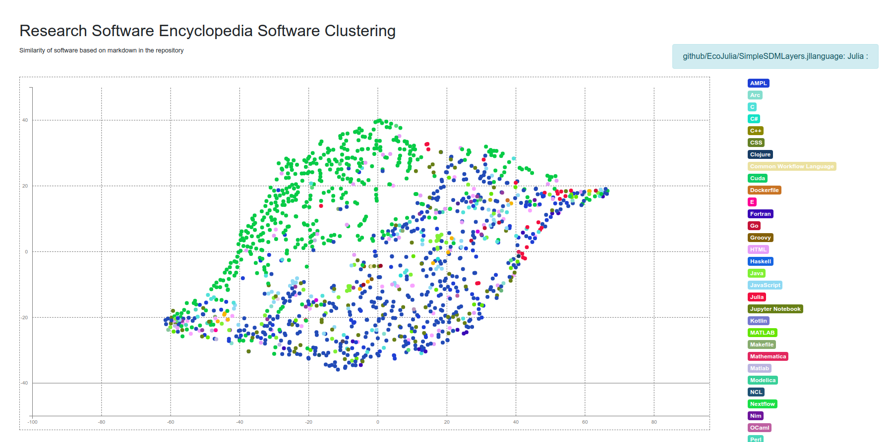
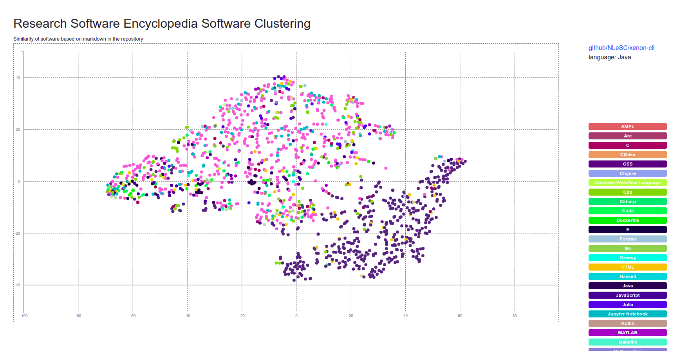

# Research Software Encyclopedia Analysis

We ultimately want to be able to group the different software into categories.
E.g., if I'm an astronomy researcher I want to quickly see what other libraries
are being developed. 

## Analysis Steps

1. For each repository in data, likely we will want to clone and combine all of the markdown or rst files found into a single document.
2. Clean up text, etc., and use word2vec to make a vector.
3. Cluster the vectors to minimally look at similarity (add topics known to see patterns).
4. Then try training the probabilistic models.

If this basic idea works (has signal), we could explore looking for more robust sources of text for each repository.

## Usage

### 0. Install

Install dependencies (ideally in a virtual environment)

```bash
$ python -m venv env
$ source env/bin/activate
$ pip install -r requirements.txt
$ python -m nltk.downloader popular
```

This will install the research software encyclopedia and Gensim, and nltk
and data we need.

### 1. Data from Repositories

This next step will derive text from each repo, and a master lookup of topics
to use later. If you haven't yet, clone the software repository (or use your own)
somewhere else. E.g.,:

```bash
$ cd ../
$ git clone https://github.com/rseng/software
$ cd rsepedia-analysis
```

Then run the analysis script, targeting the correct rse.ini settings file
for the [software](https://github.com/rseng/software) respository we
just cloned.

```bash
$ mkdir -p data/
$ python 1.download.py --settings-file ../software/rse.ini -o ./data
```

### 2. Preprocess text

Then you'll want to prepare the gensim word2vec corpora. Each subfolder in
data is a unique identifier for a repository, and after this we will generate
a space separated `corpus.txt` in each subfolder.

```bash
$ python 2.preprocess.py ./data
```

### 3. Model and Vectors

And then train the model!

```bash
$ python 3.vectors.py ./data
```

This will generate vectors along with embeddings and the distance matrix for
those embeddings that drive the visualization in `index.html`. The plot shows
the different repository embeddings, colored by language.

## 4. Wikipedia Model

Since the dataset is small, it would make sense to try using a larger dataset,
perhaps Wikipedia that also can generate vectors for articles (topics) that could
be matched to software. First download the [vectors](https://fasttext.cc/docs/en/pretrained-vectors.html):

```bash
$ wget https://dl.fbaipublicfiles.com/fasttext/vectors-wiki/wiki.en.zip
```

Note this is big and will take ~15- to ~20 minutes to download, depending on
your connection. Then run the script!

```bash
$ python 4.wikipedia.py ./data
```

If this works, we can derive labels from here, and either use this clustering
or the previous one generated to visualize the labels.


### 5. Probabilistic Model

The labels are too distinct I think to be useful, so instead I'm going to try:

1. Generating an embedding for each word across the model
2. For each vector (document) find the K nearest neighbors (KNN) to derive a set of words
3. Associate the words and add to the plot!

**under development**

## Diary

I first did steps 1-3 (download through vectors) just using markdown files. The result looked like lips -
there was distinction between Python and R but only slightly.



It looked a little bit like lips? I figured this happens because it's probably impossible to remove the language terms for README and other
markdown files - e.g., "this is a Python project..." or similar. So then I decided to run steps 1-3 again,
but this time include markdown, Rmd, Rd, and rst files. There is now more of a distinction between Python and R
repositories.



And this one looks a little bit like a brain? I'm worried that the distinction might be due to using
Rmd documentation files that tend to have more code in them, and the greatest distinction reflecting
common documentation practices over anything else. But we will see!

## TODO

1. Try finding pretrained model (wikipedia? other)?
2. Can we add more data -spack sources?
