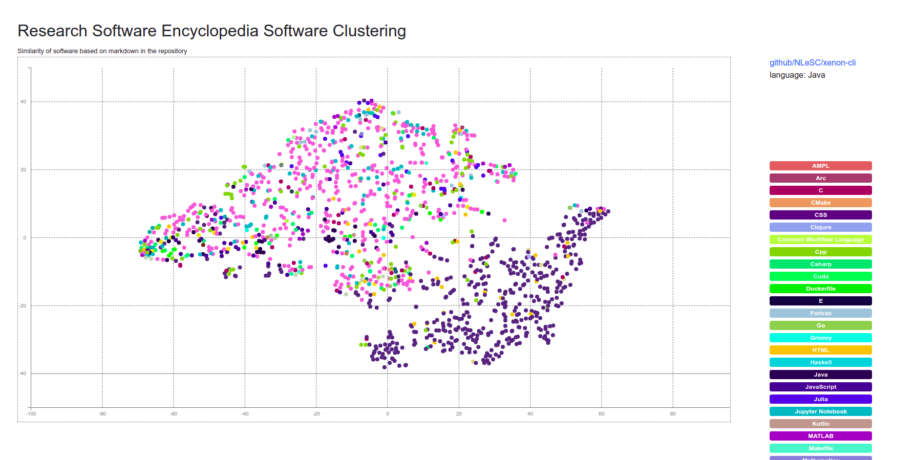

# Online ML Legacy Analysis

## Usage

### 0. Install

Install dependencies (ideally in a virtual environment)

```bash
$ python -m venv env
$ source env/bin/activate
$ conda install river
$ pip install -r requirements.txt
$ python -m nltk.downloader popular
```

This will install the research software encyclopedia, and nltk
and data we need.

### 1. Data from Repositories

This next step will derive text from each repo, and a master lookup of topics
to use later. If you haven't yet, clone the software repository (or use your own)
somewhere else. E.g.,:

```bash
$ cd ../
$ git clone https://github.com/rseng/software
$ cd rsepedia-analysis
```

Then run the analysis script, targeting the correct rse.ini settings file
for the [software](https://github.com/rseng/software) respository we
just cloned.

```bash
$ mkdir -p data/
$ python 1.download.py --settings-file ../software/rse.ini -o ./data
```

If there are a lot of repos, this step might take some time! But not to worry - once
you have data it won't need to be retrieved again.

### 2. Preprocess text

Then you'll want to prepare the next. Each subfolder in
data is a unique identifier for a repository, and after this we will generate
a space separated `corpus.txt` in each subfolder.

```bash
$ python 2.preprocess.py ./data
```

### 3. Model

And then train the model!

```bash
$ python 3.model.py ./data
```

This will generate the [model.pkl](model.pkl) and the distance matrix for
the cluster centroids that are derived to drive the visualization in `index.html`. The plot shows
the different repository embeddings, colored by language.


### 5. Probabilistic Model

The labels are too distinct I think to be useful, so instead I'm going to try:

1. Generating an embedding for each word across the model
2. For each vector (document) find the K nearest neighbors (KNN) to derive a set of words
3. Associate the words and add to the plot!

**under development**

## Diary

I first did steps 1-3 (download through vectors) just using markdown files. The result looked like lips -
there was distinction between Python and R but only slightly.


It looked a little bit like lips? I figured this happens because it's probably impossible to remove the language terms for README and other
markdown files - e.g., "this is a Python project..." or similar. So then I decided to run steps 1-3 again,
but this time include markdown, Rmd, Rd, and rst files. There is now more of a distinction between Python and R
repositories.



And this one looks a little bit like a brain? I'm worried that the distinction might be due to using
Rmd documentation files that tend to have more code in them, and the greatest distinction reflecting
common documentation practices over anything else. But we will see!

## TODO

1. Try finding pretrained model (wikipedia? other)?
2. Can we add more data -spack sources?
